# 第十六章

项目 5.2：简单多元统计

变量是否相关？如果是，关系是什么？分析师试图回答这两个问题。一个否定的答案——零假设——不需要太多支持细节。另一方面，肯定的答案表明可以定义一个模型来描述这种关系。在本章中，我们将探讨简单相关性和线性回归作为描述变量之间关系建模的两个要素。

在本章中，我们将扩展数据分析的一些技能：

+   使用内置的`statistics`库来计算相关性和线性回归系数。

+   使用**matplotlib**库创建图像。这意味着在 Jupyter Lab 环境之外创建绘图图像。

+   在基础建模应用的基础上添加功能。

本章的项目将扩展早期项目。回顾第十三章项目 4.1：可视化分析技术，了解在 Jupyter Lab 环境中使用的某些图形技术。这些需要更加自动化。项目将添加多元统计和图表来展示变量之间的关系。

## 16.1 描述

在第十五章项目 5.1：建模基础应用中，我们创建了一个应用程序来生成包含一些核心统计信息的摘要文档。在那个应用程序中，我们研究了单变量统计来描述数据分布。这些统计包括对分布的位置、范围和形状的测量。均值、中位数、众数、方差和标准差等函数被强调为理解位置和范围的方法。通过偏度和峰度来描述形状则留作额外的练习。

前一章的基础应用需要扩展，包括对变量之间关系的澄清所必需的多元统计和图表。描述两个变量之间关系的可能函数数量众多。参见[`www.itl.nist.gov/div898/handbook/pmd/section8/pmd8.htm`](https://www.itl.nist.gov/div898/handbook/pmd/section8/pmd8.htm)了解可用的选择数量。

我们将限制自己使用线性函数。在最简单的情况下，创建线性模型有两个步骤：识别相关性并创建适合数据的线的系数。我们将在接下来的两个部分中查看这些步骤。

### 16.1.1 相关系数

相关系数衡量两个变量的值相互关联的程度。值为 1 表示完全相关；值为零表示没有可辨别的相关；值为-1 表示“反相关”：当一个变量达到最大值时，另一个变量处于最小值。

见*图 16.1* 了解相关系数如何描述两个变量的分布。

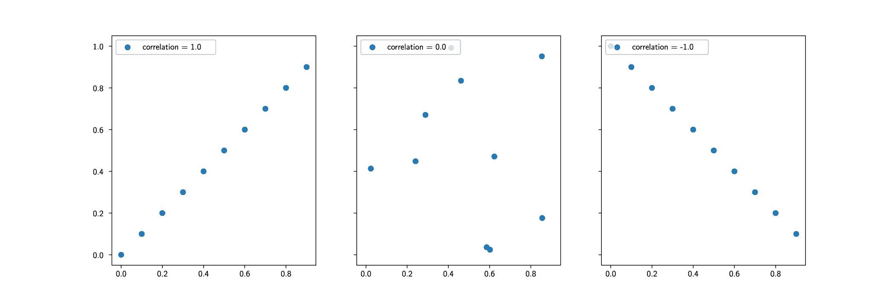

图 16.1：相关系数

系数的计算比较了变量的个别值，*X*[i]和*Y*[i]，与这些变量的平均值，*X*和*Ȳ*。以下是一个公式：

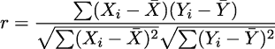

均值*X*和*Ȳ*的计算可以分解到这一点，创建一个稍微复杂一些的版本，这种版本通常用于在单次通过数据时创建系数。

此功能在`standard`库中作为`statistics.correlation()`提供。

如果两个变量相互关联，那么一个线性函数将一个变量的值映射到另一个变量附近的值。如果相关系数为 1.0 或-1.0，映射将是精确的。对于其他相关系数值，映射将是接近的，但不是精确的。在下一节中，我们将展示如何将相关系数转换为直线的参数。

### 16.1.2 线性回归

一条线的方程是 *y* = *mx* + *b*。*m*和*b*的值是描述*x*和*y*变量之间特定线性关系的参数。

当拟合数据线时，我们正在估计线的参数。目标是使线与实际数据之间的误差最小化。“最小二乘”技术通常被使用。

两个系数，*b*和*m*，可以按以下方式计算：

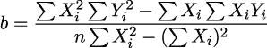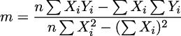

这在标准库中作为`statistics.linear_regression()`提供。这使我们免于编写这两个函数。

各种总和以及平方和并不是特别难以计算的值。内置的`sum()`函数是大多数计算的基础。我们可以使用`sum(map(lambda x: x**2, x_values))`来计算 ∑ *X*[i]²。

为了阐明这些多元关系，图表可以非常有帮助。在接下来的章节中，我们将探讨需要成为整体应用一部分的最重要类型的图表。

### 16.1.3 图表

显示多元数据的一个基本图表是 X-Y“散点”图。在*第十三章*，*项目 4.1：可视化分析技术*中，我们探讨了创建这些图表的方法。在那个章节中，我们依赖于 Jupyter Lab 将图表作为整体网页的一部分进行展示。对于这个应用，我们需要将图表嵌入到文档中。

这通常意味着将有一个包含对图表文件引用的标记文档。图表文件的格式可以是 SVG、PNG，甚至是 JPEG。对于技术图形，SVG 文件通常是最小的，并且缩放效果非常好。

每种标记语言，包括 Markdown、RST、HTML 和 LaTeX，都有独特的方式来标识需要插入图像的位置。在 Markdown 的情况下，通常需要使用 HTML 语法来正确地包括框架和标题。

现在我们已经看到了应用程序需要做什么，我们可以看看创建软件的方法。

## 16.2 方法

与上一个项目一样，这个应用程序分为两个不同的部分：

1.  计算统计量并创建图表文件。

1.  从模板中创建一个简化标记语言的报表文件，并插入详细信息。像**Jinja**这样的工具对此非常有帮助。

一旦有了标记语言（如 Markdown 或 RST）的报表文件，就可以使用像**Pandoc**这样的工具将标记文件转换为 HTML 页面或 PDF 文档。使用**Pandoc**这样的工具允许在最终格式选择上具有相当大的灵活性。它还允许以整洁、统一的方式插入样式表和页面模板。

作为标记语言的 LaTeX 语言提供了最全面的特性。然而，它的工作是具有挑战性的。像 Markdown 和 RST 这样的语言被设计为提供更少、更容易使用的特性。

这本书是用 LaTeX 编写的。

我们将探讨这个应用程序的三个方面：统计计算、创建图表，最后是创建包含图表的最终标记文件。我们将从对统计计算的快速回顾开始。

### 16.2.1 统计计算

统计摘要输出文件，在 TOML 表示法中，为每个变量及其变量的单变量统计提供了一个部分。

文件的这个部分看起来像以下 TOML 片段：

```py
[x.location]
    mean = 9.0
[x.spread]
    variance = 11.0
[y.location]
    mean = 7.5
[y.spread]
    variance = 4.125
```

当解析时，`x.location`和`x.spread`的 TOML 语法创建了一个类似于以下 Python 对象片段的字典：

```py
{
    some metadata here...

    ’x’: {
        ’location’: {
            ’mean’: 9.0
        },
        ’spread’: {
            ’variance’: 11.0
        }
    },
    ’y’: {
        etc.
    }
}
```

这种结构可以扩展以包括额外的位置和分布统计量。它还可以扩展以包括多元统计。`statistics`模块有`correlation()`和`covariance()`函数，这使得包括这些度量变得容易。

对于变量较少的数据集，通常考虑一个包括变量之间所有协方差组合的矩阵。这导致这些附加统计量的两种替代表示：

+   为协方差矩阵单独划分一个部分。标签为`[covariance]`的部分可以跟随着嵌套的字典，包括所有变量的组合。由于协方差矩阵是对称的，不需要所有的*n*²组合；只需要*n*× (*n*− 1)个独特的值。

+   每个变量部分内的多元子部分。这意味着对于`x`变量，我们将有`x.location`、`x.spread`、`x.covariance.y`和`x.correlation.y`子部分。

对于变量较少的数据集，将协方差和相关性捆绑到给定变量的细节中似乎是合理的。在 Anscombe 的四重奏的情况下，只有两个变量，协方差和相关性似乎应该与其他统计数据放在一起。

对于具有更多变量的数据集，所有变量之间的协方差可能会变得令人困惑。在这些情况下，可能需要像寻找主成分这样的技术来将变量的数量减少到更易于管理的数量。在这种情况下，带有协方差和自相关的单独部分可能更有用。

结果模型通常是基于协方差矩阵的某些仔细思考的结果。因此，应该提供一个单独的 `[model]` 部分，其中包含有关模型结构和系数的一些详细信息。在线性模型的情况下，有两个系数，有时称为 *β*[0] 和 *β*[1]。我们称它们为 *b* 和 *m*。

对于 Python 3.11，包含的 `tomllib` 模块不会创建 TOML 格式的文件。因此，有必要正确格式化一个文本文件，该文件可以被 `tomllib` 模块解析。使用 Jinja 模板来做这件事是有帮助的。

### 16.2.2 分析图

图表必须首先创建。一旦创建，就可以将其包含在文档中。创建图表的过程几乎与 Jupyter Lab 中使用的方法相同。需要采取一些额外的步骤来将图表导出为可以导入到文档中的文件。

当在 Jupyter Lab 中工作时，需要一些加载数据的单元格来创建两个变量，`x` 和 `y`，用于绘制值。在这些单元格之后，一个类似于以下示例的单元格将创建并显示一个散点图：

```py
import matplotlib.pyplot as plt

fig, ax = plt.subplots()

# Labels and Title
ax.set_xlabel(’X’)
ax.set_ylabel(’Y’)
ax.set_title(’Series I’)

# Draw Scatter
_ = ax.scatter(x, y)
```

这假设之前的单元格已经加载了干净的数据并提取了两个列表对象，`x` 和 `y`，用于绘制值。

然而，上述代码示例并没有保存生成的 PNG 或 SVG 文件。要保存图形，我们需要执行两个额外的步骤。以下是创建来自图形的文件的代码行：

```py
    plt.savefig(’scatter_x_y.png’)
    plt.close(fig)
```

将此单元格的代码转换为函数可能会有所帮助。这个函数有适当的类型注解，以便像 **mypy** 这样的工具可以确认类型被正确使用。它还可以有单元测试用例以确保它确实有效。

`savefig()` 函数将使用 PNG 格式写入包含图像的新文件。如果文件路径后缀是 `’.jpg’`，则将创建 SVG 格式的文件。

图形的尺寸由 `figure()` 函数定义。通常会有设计和页面布局考虑因素，这表明图形的适当大小。这个决定可以推迟，大小可以通过创建最终 PDF 文件或 HTML 页面时使用的标记来提供。然而，通常最好创建所需大小和分辨率的图形，以避免在最终出版物中发生任何意外的更改。

一旦创建了图表，Markdown 就需要引用图表的 PNG 或 SVG 文件，以便将其包含在文档中。我们将在下一节中查看一些此类示例。

### 16.2.3 在最终文档中包含图表

通过使用标记命令来显示图表应放置的位置，并提供有关标题和尺寸的其他信息，将图表包含在最终文档中。

Markdown 语言有一个整洁的格式，用于在文档中最简单的情况中包含图像：

```py

```

根据样式表，这可能是完全可接受的。在某些情况下，图像的大小不适合其在文档中的作用。Markdown 允许直接使用 HTML 而不是``结构。包括图表通常如下所示：

```py
<figure>
    
    <figcaption>Figure caption</figcaption>
</figure>
```

使用 HTML 可以通过引用 CSS 来对图像大小和位置进行更多控制。

当使用 RST 时，语法提供了更多选项，无需切换到 HTML。包括图表的方式如下：

```py
..  figure:: path/to/file.png
   :height: 8cm
   :alt: Alt text to include

   Figure caption
```

使用这种类型的标记技术可以提供相当大的自由度。报告的作者可以包括来自各种来源的内容。这可以包括不更改的样板文本、计算结果、基于计算的某些文本以及重要的图表。

标记的格式对最终文档的影响很小。浏览器渲染 HTML 的方式取决于标记和样式表，而不是源文件的格式。同样，在创建 PDF 文档时，这通常是通过 LaTeX 工具完成的，这些工具根据文档前言中的 LaTeX 设置创建最终文档。

现在我们有了方法，我们可以查看必须构建的可交付成果文件。

## 16.3 可交付成果

此项目有以下可交付成果：

+   文档位于`docs`文件夹中。

+   接受测试位于`tests/features`和`tests/steps`文件夹中。

+   对位于`tests`文件夹中的模型模块类进行的单元测试。

+   将作为单元测试一部分的`csv_extract`模块测试的模拟对象。

+   对位于`tests`文件夹中的`csv_extract`模块组件进行的单元测试。

+   一个扩展到 TOML 文件的总结的应用程序，包括带有图表的图形。

+   一个将 TOML 文件转换为包含总结的 HTML 页面或 PDF 文件的应用程序二级功能。

我们将更详细地查看一些这些可交付成果。我们将从创建接受测试的建议开始。

### 16.3.1 接受测试

如我们在前一章关于接受测试的章节中所述，*接受测试*，输出 TOML 文档可以被场景的`Then`步骤解析和检查。由于本书中的示例是查看 Anscombe 的四重奏数据，因此为测试提取的数据子集实际上并没有太多意义。对于任何其他数据集，都应该提取子集并用于接受测试。

有时，提取用于验收测试的小子集是有帮助的。与其处理数百万行数据，不如处理几十行数据就足以确认应用程序已读取并总结了数据。数据应该是考虑的整个样本集的代表。

这个子集是测试套件的一部分；因此，它很少改变。这使得结果可预测。

该应用程序的次要功能——在 TOML 输出中扩展以添加广泛的 Markdown——也适用于文本文件。这使得通过读取和写入文本文件来确认正确行为的情况相对容易。在许多情况下，`Then`步骤将查找结果文档的一些关键特征。它们可能会检查特定的部分标题或包含在模板文本中的几个重要关键词。当然，测试场景可以检查计算出的替换值，这些值是 TOML 摘要的一部分。

自动测试很难确认文档对潜在读者是有意义的。它不能确定所选的图形颜色是否使关系清晰。对于这种可用性测试，一个好的校对编辑器或可信赖的合作伙伴是必不可少的。

### 16.3.2 单元测试

对于创建图形的函数的单元测试做不了太多。它限于确认是否创建了 PNG 或 SVG 文件。自动测试很难“看”到图像以确保它有标题、轴标签和合理的颜色。

重要的是不要忽视确认输出文件已创建的单元测试用例。一个在 Jupyter 笔记本中看起来很棒的图形不会写入文件，除非 CLI 应用程序将图形保存到文件中。

对于某些应用，模拟`plt`包函数以确保应用程序使用预期的参数值调用正确的函数是有意义的。请注意，模拟版本的`plt.subplots()`可能需要返回一个包含多个`Mock`对象的元组。

我们需要定义一个复杂的模拟对象集合来形成测试的固定装置。固定装置的创建可能看起来像以下示例：

```py
@fixture
def mocked_plt_module(monkeypatch):
    fig_mock = Mock()
    ax_mock = Mock(
        set_xlabel=Mock(),
        set_ylabel=Mock(),
        set_tiutle=Mock(),
        scatter=Mock(),
    )
    plt_mock = Mock(
        subplots=Mock(
            return_value=(fig_mock, ax_mock)
        ),
        savefig=Mock(),
        close=Mock()
    )
    monkeypatch.setattr(summary_app, ’plt’, plt_mock)
    return plt_mock, fig_mock, ax_mock
```

这个固定装置创建了三个模拟对象。`plt_mock`是对整体`plt`模块的模拟；它定义了三个将被应用程序使用的模拟函数。`fig_mock`是对由`subplots()`函数返回的图形对象的模拟。`ax_mock`是对由`subplots()`函数返回的轴对象的模拟。这个模拟的轴对象用于提供轴标签、标题并执行散点图请求。

然后这个由三个模拟对象组成的元组被测试如下：

```py
def test_scatter(mocked_plt_module):
    plt_mock, fig_mock, ax_mock = mocked_plt_module
    summary_app.scatter_figure([sentinel.X], [sentinel.Y])

    assert plt_mock.subplots.mock_calls == [call()]
    assert plt_mock.savefig.mock_calls == [call(’scatter_x_y.png’)]
    assert plt_mock.close.mock_calls == [call(fig_mock)]
```

这个测试函数评估应用程序的`scatter_figure()`函数。然后测试函数确认来自`plt`模块的各种函数是否使用预期的参数值被调用。

通过查看对`ax_mock`对象的调用，可以继续测试以查看标签和标题请求是否按预期进行。这种详细程度——查看对坐标轴对象的调用——可能过于细致。当我们探索更改标题或颜色以更清晰地表达观点时，这些测试变得非常脆弱。

然而，使用模拟对象的整体使用有助于确保应用程序将创建所需的包含图像的文件。

## 16.4 摘要

在本章中，我们扩展了自动分析和报告，包括更多使用内置的`statistics`库来计算相关性和线性回归系数。我们还利用了**matplotlib**库来创建揭示变量之间关系的图像。

自动报告的目标是设计用来减少手动步骤并避免遗漏或错误可能导致不可靠数据分析的地方。没有什么比重复使用上一期数据的图表更尴尬的了。在一系列分析产品中未能重建一个重要的笔记本是极其容易发生的。

自动化的程度需要得到极大的尊重。一旦报告应用程序构建并部署，就必须积极监控以确保其正常工作并产生有用、信息丰富的结果。分析工作从开发理解转变为监控和维护确认或拒绝该理解的工具。

在下一章中，我们将回顾从原始数据到经过精炼的应用程序套件的过程，这些应用程序获取、清理和总结数据。

## 16.5 补充内容

这里有一些想法供您添加到这个项目中。

### 16.5.1 使用 pandas 计算基本统计

**pandas**包提供了一套强大的工具用于数据分析。核心概念是创建包含相关样本的`DataFrame`。需要安装`pandas`包并将其添加到`requirements.txt`文件中。

有将`SeriesSample`对象序列转换为`DataFrame`的方法。通常最好的方法是将每个**pydantic**对象转换为字典，然后从字典列表构建数据框。

想法类似于以下内容：

```py
import pandas as pd

df = pd.DataFrame([dict(s) for s in series_data])
```

在这个例子中，`series_data`的值是一系列`SeriesSample`实例。

结果数据框中的每一列都将包含样本中的一个变量。给定此对象，`DataFrame`对象的方法可以产生有用的统计数据。

例如，`corr()`函数计算数据框中所有列之间的相关值。

`cov()`函数计算数据框中列之间的成对协方差。

Pandas 不计算线性回归参数，但它可以创建各种描述性统计。

有关 Pandas 的更多信息，请参阅[`pandas.pydata.org`](https://pandas.pydata.org)。

除了各种统计计算之外，这个包还设计用于交互式使用。它与 Juypyter Lab 工作得特别出色。感兴趣的读者可能想重新阅读*第十三章*，*项目 4.1：可视化分析技术*，使用 Pandas 而不是原生 Python。

### 16.5.2 使用 pandas 的 dask 版本

**pandas**包提供了一套强大的工具，用于进行数据分析。当数据量巨大时，同时处理数据集的一部分会有所帮助。**Dask**项目实现了**pandas**包，最大限度地提高了并发处理的机会。

`dask`包需要安装并添加到`requirements.txt`文件中。这将包括一个`pandas`包，可以用来提高整体应用性能。

### 16.5.3 使用 numpy 进行统计

**numpy**包提供了一套用于在大数据数组上进行高性能处理的工具。这些基本工具通过统计和线性代数等众多库进行了增强。此包需要安装并添加到`requirements.txt`文件中。

**numpy**包使用其自己的内部数组类型。这意味着`SeriesSample`对象不会被直接使用。相反，可以为源序列中的每个变量创建一个`numpy.array`对象。

转换可能看起来像以下这样：

-

```py
import numpy as np

x = np.array(s.x for s in series_data)
y = np.array(s.y for s in series_data)
```

在这个例子中，`series_data`的值是一系列`SeriesSample`实例。

创建一个单一的多维数组也是合理的。在这种情况下，轴 0（即行）将是单个样本，轴 1（即列）将是样本中每个变量的值。

数组有`mean()`等方法来返回值的平均值。当使用多维数组时，提供`axis=0`参数是至关重要的，以确保结果来自对行集合的处理：

```py
import numpy as np

a = np.array([[s.x, s.y] for s in series_data])
print(f"means = {a.mean(axis=0)}")
```

查看[`numpy.org/doc/stable/reference/routines.statistics.html#`](https://numpy.org/doc/stable/reference/routines.statistics.html#)

使用最小二乘法计算直线的系数可能会令人困惑。**numpy.linalg**中的最小二乘求解器是一个非常通用的算法，可以应用于创建线性模型。`numpy.linalg.lstsq()`函数期望一个包含“x”值的矩阵。结果将是一个与每个“x”矩阵长度相同的向量。“y”值也将是一个向量。

处理过程可能看起来像以下这样：

```py
import numpy as np

A = np.array([[s.x, 1] for s in series_data])
y = np.array([s.y for s in series_data])
m, b = np.linalg.lstsq(A, y, rcond=None)[0]
print(f"y = {m:.1f}x + {b:.1f}")
```

`A`的值是基于 x 值的小矩阵。`y`的值是 y 值的简单数组。最小二乘算法返回一个包含系数、残差、源矩阵的秩和任何奇异值的四元组。在上面的例子中，我们只想得到系数向量，所以我们使用`[0]`从四元组结果中提取系数值。

这进一步分解以提取最适合这组点的直线的两个系数。参见：[`numpy.org/doc/stable/reference/generated/numpy.linalg.lstsq.html`](https://numpy.org/doc/stable/reference/generated/numpy.linalg.lstsq.html)。

当处理非常大的数据集时，这种方法具有明显的优势。**numpy** 库非常快速，并设计用于扩展到极大规模的数据量。

### 16.5.4 使用 scikit-learn 进行建模

**scikit-learn** 库拥有大量专注于建模和机器学习的工具。这个库建立在 **numpy** 的基础上，因此需要安装这两个包。

数据需要转换为 **numpy** 数组。由于建模方法非常通用，假设可能有多个独立变量可以预测因变量的值。

转换可能看起来像以下这样：

```py
import numpy as np

x = np.array([[s.x] for s in series_data])
y = np.array([s.y for s in series_data])
```

在这个例子中，`series_data` 的值是一系列 `SeriesSample` 实例。`x` 数组为每个样本使用一个非常短的向量；在这种情况下，只有一个值。它需要是一个向量，以便适合 **scikit-learn** 能够解决的广义最小二乘回归。

scikit-learn 库被设计成以非常通用的方式创建模型。模型不总是由一个具有系数和截距的简单直线定义的关系。正因为这种非常通用的建模方法，我们将创建 `linear_model.LinearRegression` 类的实例。该对象具有创建适合给定数据点的系数的方法。然后我们可以检查这些系数，或使用它们来插值新值。

代码可能看起来像以下这样：

```py
from sklearn import linear_model

reg = linear_model.LinearRegression()
reg.fit(x, y)
print(f"y = {reg.coef_[0]:.1f}x + {reg.intercept_:.1f}")
```

线性模型的 `coef_` 属性是一个系数向量，其长度与 `x` 自变量值的每一行相同。即使行长度为 1，结果也是一个长度为 1 的向量。

由于它与 **numpy** 一起工作，它可以处理非常大的数据集。此外，scikit-learn 创建适合数据的模型的方法可以推广到多种机器学习方法。这通常是创建更丰富、更有用模型的下一步。

### 16.5.5 使用函数式编程计算相关性和回归

相关系数和直线的计算可以总结如下。首先，我们将定义一个函数 *M*(*a*;*f*())，该函数计算转换值序列的平均值。*f*() 函数将每个值 *a*[i] 进行转换。恒等函数 *ϕ*(*a*[i]) = *a*[i] 不进行任何转换：

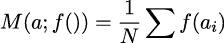

我们还需要一个函数来计算变量 *a* 的标准差。

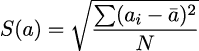

这允许我们在某些转换后定义一系列相关值作为平均值。

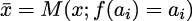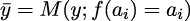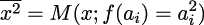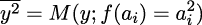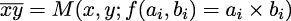

从这些个别值中，我们可以计算出相关系数 *r*[xy]。

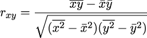

除了上述值之外，我们还需要两个变量标准差的值。

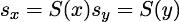

从相关系数和两个标准差中，我们可以计算出直线的系数 *m* 和截距值 *b*。

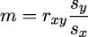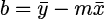

这给出了方程 *y* = *mx* + *b* 的系数 *m* 和截距 *b*，该方程最小化了给定样本与直线之间的误差。这是通过一个高阶函数 *M*(*a*;*f*()) 和一个普通函数 *S*(*a*) 来计算的。这似乎并没有比其他方法有显著的改进。因为它使用了标准库函数和函数式编程技术，所以它可以应用于任何 Python 数据结构。这可以节省将数据转换为 **numpy** 数组对象的一步。
