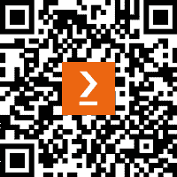

[`www.packtpub.com`](https://www.packtpub.com)

订阅我们的在线数字图书馆，全面访问超过 7,000 本书籍和视频，以及领先的行业工具，帮助你规划个人发展并推进你的职业生涯。更多信息，请访问我们的网站。

## 为什么订阅？

[nosep]通过来自超过 4,000 位行业专业人士的实用电子书和视频，节省学习时间，多花时间编码。根据你特别设计的技能计划提高你的学习效果。每月免费获得一本电子书或视频。全文搜索，方便快速获取关键信息。复制粘贴、打印和收藏内容

你知道 Packt 为每本书都提供电子书版本，包括 PDF 和 ePub 文件吗？你可以在 packt.com 升级到电子书版本，作为印刷书客户，你有权获得电子书副本的折扣。有关更多信息，请联系我们 customercare@packtpub.com。

在[www.packtpub.com](https://www.packtpub.com)上，你还可以阅读一系列免费的技术文章，注册各种免费

# 你可能还会喜欢的其他书籍

如果你喜欢这本书，你可能还会对 Packt 的其他这些书籍感兴趣：

**Causal Inference and Discovery in Python**

Aleksander Molak

ISBN: 9781804612989

+   掌握因果推断的基本概念

+   揭开结构因果模型之谜

+   在 Python 中释放 4 步因果推断过程的强大功能

+   探索高级提升建模技术

+   使用 Python 解锁现代因果发现的秘密

+   使用因果推断为社会影响和社区利益做出贡献

**Python for Geeks**

Muhammad Asif

ISBN: 9781801070119

+   了解如何设计和管理复杂的 Python 项目

+   在 Python 中制定测试驱动开发（TDD）策略

+   探索 Python 中的多线程和多程序设计

+   使用 Apache Spark 和 Google Cloud Platform (GCP)进行 Python 数据处理

+   在 GCP 等公共云上部署无服务器程序

+   使用 Python 构建 Web 应用程序和应用程序编程接口

+   使用 Python 进行网络自动化和无服务器功能

+   掌握 Python 进行数据分析和机器学习

**Python Data Analysis - 第三版**

Avinash Navlani, Armando Fandango, Ivan Idris

ISBN: 9781789955248

+   探索数据科学及其各种流程模型

+   使用 NumPy 和 pandas 进行数据操作，以聚合、清理和处理缺失值

+   使用 Matplotlib、Seaborn 和 Bokeh 创建交互式可视化

+   以多种格式检索、处理和存储数据

+   使用 pandas 和 scikit-learn 了解数据预处理和特征工程

+   使用太阳黑子周期数据进行时间序列分析和信号处理

+   分析文本数据和图像数据以执行高级分析

+   使用 Dask 加速并行计算

## Packt 正在寻找像您这样的作者

如果您有兴趣成为 Packt 的作者，请访问 [authors.packtpub.com](https://authors.packtpub.com) 并今天申请。我们已与成千上万的开发人员和科技专业人士合作，就像您一样，帮助他们将见解分享给全球科技社区。您可以提交一般申请，申请我们正在招募作者的特定热门话题，或者提交您自己的想法。

## 分享您的想法

您已经完成了《Python 实战项目》，我们非常乐意听到您的想法！如果您从亚马逊购买了这本书，请[点击此处直接进入该书的亚马逊评论页面](https://packt.link/r/1803246766)并分享您的反馈或在该购买网站上留下评论。

您的评论对我们和科技社区非常重要，并将帮助我们确保我们提供高质量的内容。

## 下载此书的免费 PDF 副本

感谢您购买此书！

您喜欢在路上阅读，但无法携带您的印刷书籍到处走吗？您的电子书购买是否与您选择的设备不兼容？

不要担心，现在每本 Packt 书籍，您都可以免费获得该书的 DRM 免费 PDF 版本。

在任何地方、任何设备上阅读。直接从您最喜欢的技术书籍中搜索、复制和粘贴代码到您的应用程序中。

优惠远不止于此，您还可以获得独家折扣、时事通讯和每日收件箱中的优质免费内容。

按照以下简单步骤获取优惠：

1.  扫描下面的二维码或访问以下链接

    

    [`packt.link/free-ebook/9781803246765`](https://packt.link/free-ebook/9781803246765)

1.  提交您的购买证明

1.  就这些！我们将直接将您的免费 PDF 和其他优惠发送到您的电子邮件
