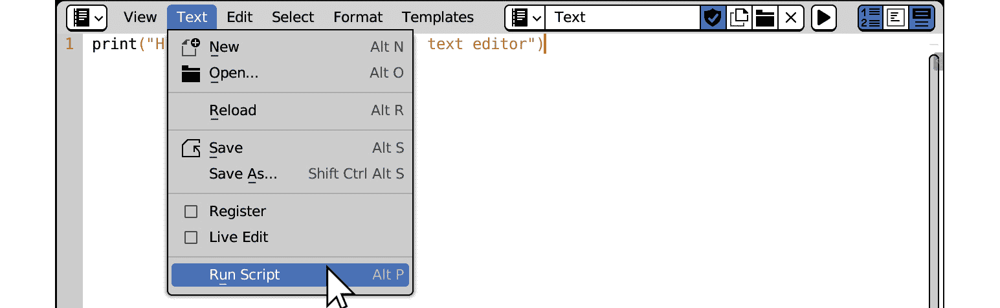
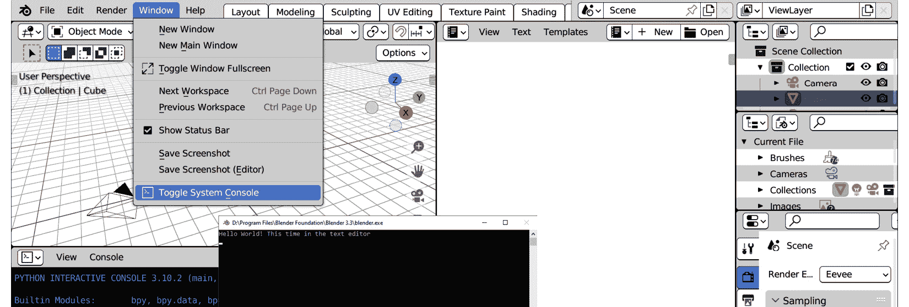

# 第一章：Python 与 Blender 的集成

Blender 接受代码指令的方式与它交互的方式相同：通过图形用户界面。这允许艺术家和工作室实现他们自己的功能和自动化。

Python，一种高度可扩展且入门门槛低的编程语言，在计算机图形学中得到了广泛应用。

尽管 Blender 的核心是用 C 和 C++ 编写的，但菜单和图形元素使用 Python。这允许自定义和工厂功能具有相同的视觉和感觉。

在本章中，我们将学习如何在 Blender 中运行 Python 命令以及在哪里查找它们的输出。我们还将了解过去指令的历史记录在哪里，以及如何利用这一点。最后，我们将介绍代码编辑器和版本控制系统，并看看它们如何帮助我们简化工作。

到本章结束时，你将了解程序员是如何工作的，以及为什么这与最初使用软件并没有那么不同。

在本章中，我们将涵盖以下主要主题：

+   脚本工作区

+   Python 执行

+   版本控制

# 技术要求

除了 Blender 3.3+ 或在这种情况下，Blender 3.3 ([`www.blender.org/download/lts/3-3`](https://www.blender.org/download/lts/3-3))，你还需要以下免费工具：

+   Visual Studio Code，可在 [`code.visualstudio.com/Download`](https://code.visualstudio.com/Download) 下载。本书使用的是版本 1.66，可在 [`code.visualstudio.com/updates/v1_66`](https://code.visualstudio.com/updates/v1_66) 找到。

+   Git（可选），可在 [`git-scm.com/downloads`](https://git-scm.com/downloads) 找到。

鼓励你编写自己的代码；本章的示例可在以下 URL 找到：[`github.com/PacktPublishing/Python-Scripting-in-Blender/tree/main/ch1`](https://github.com/PacktPublishing/Python-Scripting-in-Blender/tree/main/ch1)。

由于它是免费的开源软件，安装 Blender 有很多种方法。我们将探讨最常见的安装解决方案。

# 安装 Blender

安装 Blender 的过程因操作系统而异。像大多数应用程序一样，为 *Microsoft Windows* 和 *Apple macOS* 提供了安装程序。此外，适用于 *Linux* 和 Windows 的便携式版本，例如可以解压缩并在系统中的任何地方执行的存档，也是可用的。

本书使用的 Blender 版本 3.3 可能与系统上已安装的其他版本不同。在这种情况下，我们可以在同一台机器上安装不同版本的 Blender。

## 在 Windows 上安装 Blender

在 Microsoft Windows 上安装程序有多种方式：Windows 安装程序、*Microsoft Store* 和 *使用便携式存档*。虽然大多数应用程序发布者会选择其中之一，但所有这些选项都适用于 Blender。

### 通过 Windows 安装程序安装多个版本

在 Windows 上安装 Blender 最常见的方式是下载 `.msi` 文件来安装 Blender。在 Blender 3.4 之前，**开始** 菜单中只能使用多个安装版本中的一个。

如果您的情况是这样，其他版本可以通过导航到 `Program Files` 文件夹来访问，通常是 `C:\Program Files\Blender Foundation`，使用 Windows 资源管理器。

我们可以直接从 `Blender 3.3` 文件夹中执行 `blender.exe`，或者在 Windows 资源管理器中使用右键点击 > **新建** > **快捷方式**来创建一个快捷方式：


图 1.1：程序文件中 Blender 的多个版本

或者，由于 3.3 是一个 *长期支持* 版本，它也可在 Microsoft Store 中找到。

### 从 Microsoft Store 安装 Blender

Blender 3.3 的下载页面提供了一个链接到 Microsoft Store 安装程序。或者，我们可以在顶部栏中启动 `blender`。一旦我们到达 **Blender** 页面，我们确保它是由 **Blender Foundation** 发布的，然后点击 **获取** 按钮：


图 1.2：从 Microsoft Store 安装 Blender

这将在 **开始** 菜单中添加一个 Blender 3.3 条目：


图 1.3：开始菜单中的多个版本

Microsoft Store 的优势是始终为安装的版本添加快捷方式。如果出于某种原因 Microsoft Store 不是一个选项，我们可以下载一个可移植的归档。

### 下载可移植归档

为了避免任何应用程序打包，我们可以下载一个 Windows 可移植的 `.zip` 文件，或者 Linux 的 `.tar.xz` 归档。

可移植版本可以从系统的任何位置使用，甚至是可移动驱动器。我们只需要通过右键点击 -> `blender.exe` 或解压文件夹中的 `blender` 可执行文件来在选择的目录中解压归档。

## 在 macOS 上安装多个版本

我们可以下载适用于 *Apple Intel* 或 *Apple Silicon* 计算机的 `.dmg` 包。下载后，双击文件将打开安装程序窗口。如果系统中已经存在另一个 Blender 版本，将弹出一个提示对话框，询问我们是否想保留两个版本或用新版本替换已安装的版本。

通过在文件管理器中应用程序条目上右键点击 -> **重命名** 来选择 `Blender 3.3`：


图 1.4：在 macOS 上安装 Blender 的附加版本

安装 Blender 的方法有很多：下载页面提供了一个链接到如 *Steam*（Windows、macOS 或 Linux）或 *Snapcraft*（仅限 Linux）的商店，更不用说 Linux 发行版的包管理器（例如 *Ubuntu* 上的 *apt*、*CentOS* 上的 *yum* 等）。值得一提的是，可以从源代码构建 Blender，但这超出了本书的范围。

虽然这本书坚持使用版本 3.3，但示例应该可以在 3.x 系列的未来版本上运行，最多只需进行一些小的修正。

未来的一次重大发布，如 Blender 4 或 5，几乎可以保证与过去的脚本不兼容。尽管如此，本书关于最佳实践和思维模式的知识将经得起时间的考验。

现在我们已经在我们系统上安装了 Blender，我们可以深入探索其脚本功能。

# 脚本工作区 – 使用 Python 的第一步

一系列 Python 指令通常被称为 **脚本**。同样，生成 Python 代码的活动通常被称为 **脚本编写**。

Blender 的界面由不同的 **工作区** 组成。每个工作区都是一个标签页，用于不同的活动。在撰写本文时，**脚本** 标签位于屏幕右侧的最末尾。点击它将切换到为 Python 用户设计的界面。

最显著的部分是 **Python 控制台**、**信息日志** 和 **文本编辑器**：


图 1.5：Blender 脚本界面

我们将通过在 Python 控制台中输入命令来开始我们的 Python 之旅。

## Python 控制台

控制台是一个交互式终端，其标题栏显示当前 Python 的版本（撰写本文时为 `3.10.2`）和一个 `>>>` 提示符，表明它正在等待交互式文本。我们只需将光标悬停在它上面并输入指令：


图 1.6：Python 控制台

### “Hello World！”来自控制台

被称为 *Hello World!* 的实践是一种熟悉新编程语言的方式。它涉及到使用命令显示标题短语。

我们将使用 `print` 函数来做这件事。交互式控制台的示例代码以 `>>>` 提示符开始。我们不需要在控制台中输入那个，它已经在那里了。我们点击控制台区域并输入 `print("Hello World")`：

```py
>>> print("Hello World")
```

然后按 *Enter*。控制台输出将以不同的颜色显示，并且不以提示符开头：


图 1.7：在控制台上显示我们的输出

我们可以使用 Python 控制台查询有关 Python 版本的信息。

### 检查 Python 版本

可以使用 `sys` 模块在任何时候显示当前 Python 的版本。我们需要导入这个模块并查找其 `version` 属性。这需要以下两行：

```py
>>> import sys
>>> sys.version
```

控制台会打印出关于正在使用版本的详细信息：

```py
'3.10.2 (main, Jan 27 2022, 08:34:43) ...'
```

版本号的三个数字代表 *主版本*、*次版本* 和 *修订版本*。不同的主版本号意味着语言语法的重大变化：*Python 3.0* 与任何 Python 2.x 版本有很大不同。次版本引入了新特性，但不会破坏与旧代码的兼容性。修订版本不会对语言进行更改；它仅包括错误修复和其他维护形式。

每个新 Python 版本带来的更改都可以在 **Python 软件基金会** 的下载页面上的 *发布说明* 中找到：

[`www.python.org/downloads/`](https://www.python.org/downloads/)

如果我们的脚本依赖于次版本引入的特性，我们可以使用 `version_info` 单独检查版本号，如下所示：

```py
import sys
if sys.version_info.minor < 6:
    print("Warning: This script requires Python 3.6.x")
```

与其他软件相比，Blender 非常紧密地遵循 Python 发布周期。这主要是为了利用性能和错误修复方面的最新改进。

### 检查 Blender 版本

当前 Blender 版本可以在图形用户界面或 Python 脚本中进行检查。

#### 在界面中检查 Blender 版本

从 3.0 版本开始，检查 Blender 版本号最直接的地方是窗口的右下角。在 3.3 版本中，版本号后面跟着场景的当前时间和帧设置：


图 1.8：状态栏中的 Blender 版本号

另一种显示版本号的方法是点击菜单栏右上角的 Blender 图标，然后从菜单中选择 **关于 Blender**。

我们也可以通过 Python 脚本来获取 Blender 的版本号。

#### 在 Python 脚本中检查 Blender 版本

如果我们的脚本依赖于特定版本的特性，它们必须能够确定正在运行的 Blender 版本。这些信息包含在 `bpy.app` 模块中。我们可以在控制台中输入以下行来显示当前版本：

```py
>>> import bpy
>>> bpy.app.version
```

在 *Blender 3.3.2* 中，控制台返回以下信息：

```py
(3, 3, 2)
```

与 `sys.version_info` 不同，`bpy.app.version` 不包含名称，只有数字。尽管如此，我们可以使用 Python 语法将它们存储在变量中：

```py
>>> major, minor, micro = bpy.app.version
```

然后，我们可以使用 `print` 来显示单个版本号：

```py
>>> print("Major version:", major)
Major version: 3
>>> print("Minor version:", minor)
Minor version: 3
>>> print("Micro version:", micro)
Micro version: 2
```

Blender 的新主版本会对界面和工作流程带来重大变化，而次版本会引入用于动画或生成图像的新工具。

为了显示这些信息，我们使用了 `print` 函数。由于函数是结构化编程的第一步，我们将更深入地了解它们的工作原理以及如何将 `"Hello World!"` 消息更改为其他内容。

### 调用函数

当我们使用一个 *函数* 时，我们说我们 *调用* 或 *调用* 那个函数。为此，我们输入其名称，然后跟随着括号。括号之间是函数的 *参数*，例如它操作的输入：


图 1.9：Python 脚本中的函数和参数

当调用时，`print` 函数读取参数并在新行上显示它。

`"Hello World!"` 参数是一个 *字符串字面量*：它可以是被引号 (`""`) 包围的任何字符序列。

我们可以将任何其他消息传递给 `print`；输出将相应地变化：


图 1.10：在 Blender Python 控制台中打印文本

现在我们已经获得了信心，我们将查看一些 Blender 命令。

## 信息日志

用户活动以 Python 命令的形式显示在日志区域，位于 **脚本** 工作区的左下角。我们可以打开 Blender 并执行以下操作：

1.  通过右键单击 -> **删除** 删除视口中的默认立方体。

1.  从视口顶部栏，点击 **添加** -> **网格** -> **圆柱体**。

1.  从视口顶部栏，点击 **添加** -> **网格** -> **UV 球体**。我们将在信息日志区域找到这三行：


图 1.11：信息日志区域中的操作历史

信息日志的条目是我们最近活动触发的 Python 命令。我们可以复制这些行并将它们用于我们的脚本中。

### 使用日志中的行

使用左鼠标按钮单击或拖动选择日志行。我们可以通过右键单击 -> **复制** 将它们复制到剪贴板：


图 1.12：从信息日志复制 Python 命令

我们可以回到启动场景并将它们粘贴到控制台：

1.  重新启动 Blender 或点击 **文件** -> **新建** -> **通用**。

1.  转到 **脚本** 工作区。

1.  在 Python 控制台中，右键单击 -> **粘贴**，然后按 *Enter*。

执行这些行将删除初始立方体，然后添加两个对象：之前手动运行的相同步骤。我们将看到如何更改它们的内容并影响结果。

### 更改参数

现在，我们暂时不要过于关注代码：它将在下一章中更加清晰。无论如何，我们可能会从 `"Hello` `World!"` 示例中识别出一个模式：

```py
function(arguments between parentheses)
```

至少有一个参数在其目的上是一目了然的：

```py
bpy.[…]_uv_sphere_add(…, …, location=(0, 0, 0), …)
```

`location=(x, y, z)` 表示添加新对象的三维坐标。我们可以更改最后一行，并在圆柱体上方创建我们的球体。

让我们再次回到启动场景，并将我们的行粘贴进去，但这次在我们按下 *Enter* 键之前，我们将最后一个零改为 `2`：

```py
bpy.ops.mesh.primitive_uv_sphere_add(radius=1, enter_editmode=False, align='WORLD', location=(0, 0, 2), scale=(1, 1, 1))
```

我们刚刚运行了我们的第一个脚本。它删除了选定的对象，并在彼此之上堆叠了两个新形状：


图 1.13：通过 Python 创建的圆柱体和球体原语

Python 控制台可以立即执行代码，但不太适用于超过几行的代码。我们现在将看到如何将 Python 脚本作为文档运行。

## 文本编辑器

这是 **脚本** 工作区中最大的元素。它可以用来编写文本和脚本。

要添加新的脚本，我们点击顶部栏中的 **+ 新建**（**+ New**）按钮并创建一个新的文本：


图 1.14：在文本编辑器中创建新的文本对象

让我们输入一些单词，例如，*“Hello World！”* 的更冗长的版本。像许多程序员编辑器一样，Blender 在左侧显示行号：


图 1.15：在文本编辑器中编写脚本

此外，单词根据其 Python 意义有不同的颜色：函数为白色，字符串为黄色，括号为红色。这个功能被称为 **语法高亮**，提供了有用的视觉反馈：单词的颜色取决于其在编程语言中的作用。

### 运行文本文档

如果当前文本是 Python 脚本，我们可以从文本编辑器中执行它：

1.  在文本编辑器的菜单栏中，点击 **运行脚本**（**Run Script**）菜单下的 **文本**（**Text**）。

1.  在信息日志中查找执行结果信息：



图 1.16：在文本编辑器中执行脚本

信息日志确认了有事情发生：


图 1.17：信息日志中提到的脚本执行

但我们可能会失望，因为打印出的文本似乎无处可寻！

原因是文本编辑器的输出直接进入 **系统控制台**，即 *操作系统的* 命令行。

在 Windows 上，我们可以通过从 Blender 的顶部栏选择 **窗口**（**Window**）->**切换系统控制台** 来显示它。要在基于 Unix 的系统（Linux 或 macOS）上读取系统消息，我们必须首先从命令行启动 Blender。

一旦打开，**系统控制台** 将显示文本编辑器打印的输出：



图 1.18：在 Windows 上显示系统控制台

我们文本块的默认名称是 `Text`。可以通过点击它来重命名。我们最好添加 `.py` 后缀作为扩展名，使其更清楚地表明它是一个 Python 脚本：


图 1.19：在 Blender 中重命名文本块

### 将 Python 控制台作为脚本复制

记得我们之前在 Python 控制台中输入的代码吗？如果我们没有关闭 Blender 或加载新的场景，我们可以立即将它们复制到 *剪贴板*。

1.  从 Python 控制台顶部的 **控制台** 菜单中选择 **复制** **为脚本**。

1.  使用文本编辑器菜单中的 **文本** > **新建** 创建另一个文本块。

1.  给文本起一个新的名字，例如 `OurFirstScript.py`。

1.  通过在文本区域右键点击 -> **粘贴** 将剪贴板中的行粘贴到文本区域。

看看文本编辑器，我们发现脚本的完整版本比我们的三行要长一些：


图 1.20：Python 控制台输入复制到文本编辑器

前五行设置控制台环境。它们在 Blender 启动时在幕后执行。

以哈希 (`#`) 开头的行是 *注释*：它们被 Python 忽略，包含为人类读者提供的提醒或解释。

我们自己的指令分别位于第 **13**、**17** 和 **21** 行。此脚本可以通过 **文本** -> **运行脚本** 如我们之前所做的那样执行，或者通过按 *Alt* + *P* 键组合。

### 导出文本文件

笔记本图标让我们可以通过下拉列表在不同的文本块之间切换：


图 1.21：在 Blender 之间切换文本块

从编辑器菜单栏中选择 **文本** | **另存为…** 将当前文本保存到磁盘。一个新窗口让我们选择文件夹并确认文件名：


图 1.22：将文本编辑器的内容保存到文件

Blender 的文本编辑器非常适合快速测试，但程序员文本编辑器通常更适合更严肃的任务。我们将在下一节中使用 *Visual Studio Code*。

# 外部编辑器 - Visual Studio Code

**Visual Studio Code** （**VS Code**）是微软的一个快速、多平台、免费的编辑器，适用于 Windows、macOS 和 Linux。使用外部编辑器可以使我们的代码独立于 Blender 的会话。此外，程序员文本编辑器除了语法高亮外，还提供了许多实用工具。

本书使用 VS Code 1.66。这是一个快速、轻量级的编辑器，适用于大多数平台，但有很多替代品 - 最值得注意的是以下这些：

+   **Notepad++**：这是一个快速但强大的 Windows 编辑器，可在 [`notepad-plus-plus.org.`](https://notepad-plus-plus.org%0D) 找到。

+   **PyCharm**：这是一个由 **JetBrains** 提供的 Python **集成开发环境** （**IDE**）。可以在 [`www.jetbrains.com/pycharm.`](https://www.jetbrains.com/pycharm%0D) 找到免费的社区版本。

+   **LightTable**：这是一个有趣的开源编辑器，可在 [`lighttable.com.`](http://lighttable.com%0D) 找到。

+   **Sublime**：这是一个商业文本编辑器，可在 [`www.sublimetext.com.`](https://www.sublimetext.com%0D) 找到。

大多数 Linux 发行版都至少包含一个不错的、现成的文本编辑器。我们鼓励您尝试并找到您喜欢的文本编辑器。

在本节中，我们将设置 VS Code 以进行 Python 脚本编写。

选择合适的录音室！

*VS Code* 和 *Visual Studio* 名称相似，但它们是微软的两个不同的产品。虽然 VS Code 是程序员文本编辑器，但 Visual Studio 是用于高级语言（如 *C++*）的完整开发环境。虽然 C++ 项目可能需要特定的构建环境版本，但只要 Python 是受支持的语言，就可以安全地使用任何版本的 VS Code。

## 加载我们的脚本文件夹

我们可以使用 `.py` 文件打开脚本文件夹来加载包含我们的脚本文件。

可以通过点击右下角的**安装**来安装额外的 Python 支持：


图 1.23：我们的 Python 脚本在 VS Code 中

## 保持 Blender 的文本块同步

当 Blender 中打开的文本文件被另一个应用程序更改时，文件名左侧会出现一个红色的问号：


图 1.24：Blender 检测已保存脚本中的更改

点击问号会显示可行的操作：

+   **从磁盘重新加载**：这将加载并显示最新的文件

+   **使文本内部（单独的副本）**：显示的文本现在是 Blender 会话的一部分，不再与磁盘上的任何文本文件相关联

+   **忽略**：更改被忽略；Blender 仍会显示旧文本并继续报告它与磁盘上保存的文本不同步

为了获得额外的帮助，我们可以对我们的文件添加版本控制。这允许我们进行更改而不用担心破坏东西或丢失我们的工作。

# 版本控制和备份

**版本控制**有助于跟踪文件更改，保存代码的快照，并在必要时回滚到旧版本。**Git**是目前最常用的版本控制系统；它是免费的，并集成到大多数编辑器中。在本节中，我们将结合使用版本控制和 VS Code。

## 初始化存储库

安装 Git 后，可以通过 VS Code 使用它，通过在左侧列栏上的 *分支* 图标激活 **源代码管理** 选项卡。**初始化存储库**按钮将版本控制添加到我们的文件夹：


图 1.25：在 VS Code 中添加版本控制

图标将改变，并警告我们文件的存在。我们点击文件名旁边的 **+** 图标将它们添加到版本控制中。在 Git 术语中，我们将当前更改**暂存**：


图 1.26：在 VS Code 中暂存更改

编辑器显示了我们的文件的前/后条件。我们可以在左上角的文本框中添加一条消息并单击 *勾选* 图标。这将 **提交** 我们的变化到项目历史记录：


图 1.27：在 VS Code 中提交更改

## 进行更改

假设我们不想我们的脚本删除当前对象。为此，我们删除行号 **13**：

```py
bpy.ops.object.delete(use_global=False)
```

当文件被保存时，版本控制会检测到这个更改。我们可以通过在左侧列中单击 `OurFirstScript.py` 来暂存它，VS Code 会突出显示当前更改。我们为这个新提交添加一条消息并再次单击 **勾选** 按钮：


图 1.28：在 VS Code 中显示更改

如果我们回到 **资源管理器** 选项卡并选择我们的脚本，我们将看到有一个名为 **时序线** 的部分可以被展开：它包含我们的提交消息列表。选择一个提交将显示相关更改，允许我们恢复旧代码行。每个未提交的更改都可以通过使用 *撤销* 功能轻松撤销。

### 撤销未提交的更改

让我们在行 **7** 添加一些错误文本并保存。如果由于任何原因我们无法撤销，我们可以在 **版本控制** 选项卡中右键单击我们的文件并选择 **丢弃更改**：


图 1.29：在 VS Code 中丢弃未提交的更改

版本控制的重要性一开始可能被低估，但在更复杂的项目中变得至关重要。这是一个广泛的话题，超出了本书的范围，但至少掌握其基础知识是很重要的。

# 摘要

在本章中，我们通过 *脚本编写* 增强了信心，并介绍了 Python 编程的基本工具。你学习了如何在 Blender 日志中查找 Python 命令并在不同上下文中执行它们，以及如何设置编码环境。我们还学习了如何跟踪我们的代码和编辑。

在 *第二章* 中，我们将深化我们对 Python 的知识。我们将遇到最常见的实体，并学习如何使用编程逻辑编写更有用的脚本。

# 问题

1.  我们如何在 Blender 中显示接受 Python 输入的部分？

1.  我们如何读取 Python 执行的输出和打印输出？

1.  Blender 是否使用 Python 来执行用户操作？

1.  我们如何查看 Blender 的 Python 活动日志？

1.  我们如何在 Blender 中编写脚本？我们能否在其他应用程序中编辑它们？

1.  我们如何在哪个选项卡中初始化 VS Code 中的版本控制？

1.  我们如何在 VS Code 中访问脚本的时序线？
