# 6

# 结构化我们的代码和插件

我们迄今为止创建的插件由单个 Python 文件组成。这没问题，但为了处理复杂性，我们可以将我们的代码拆分成同一目录中的相关模块。

编写相互交互的模块而不是单个大文件，使得设计和维护更容易，使我们能够将注意力集中在任务的单一方面。

非代码文件（如图像和其他媒体）的存在可能是采用文件夹结构的另一个原因。这是因为共享一个文件夹比分别处理 Python 脚本和数据更实用。

在本章中，你将学习如何在包的不同模块之间进行编码，并使用导入系统将一切融合在一起。我们将创建的打包插件将更容易分发、阅读和维护，并且只需查看文件名就可以掌握其不同部分的功能。

本章将涵盖以下主题：

+   创建 Python 包

+   加载和刷新代码和资产

+   在你的脚本中读取环境变量

+   使用首选项系统

# 技术要求

本章我们将使用 Blender 和 Visual Studio Code。本章创建的示例可以在 [`github.com/PacktPublishing/Python-Scripting-in-Blender/tree/main/ch6`](https://github.com/PacktPublishing/Python-Scripting-in-Blender/tree/main/ch6) 找到。

可选地，在 Windows 上，我们可以使用 7-Zip 创建压缩存档。7-Zip 是一个免费应用程序，可以从 [`www.7zip.org`](https://www.7zip.org) 下载。

# 文件夹、包和插件

我们知道插件由 Python 代码和 Blender 插件系统的信息组成。虽然单个文件 Python 脚本被称为模块，但脚本文件夹被称为包。

创建插件文件夹意味着我们将存储 Blender 信息在包级别，因此我们将首先创建一个目录并创建包信息。

## 创建包文件夹和初始化文件

让我们在我们的 Python 项目中为*本章内容*创建一个文件夹。然后，在`ch6`文件夹中作为我们的**脚本文件夹**并重启 Blender。要创建一个包，我们需要创建一个新的文件夹而不是一个新的文件。我们可以使用文件管理器，或者像以下步骤中那样，使用我们的程序员编辑器的文件栏：

1.  选择 `PythonScriptingBlender/ch6/addons`。

1.  通过点击**新建文件夹**图标创建一个新文件夹：

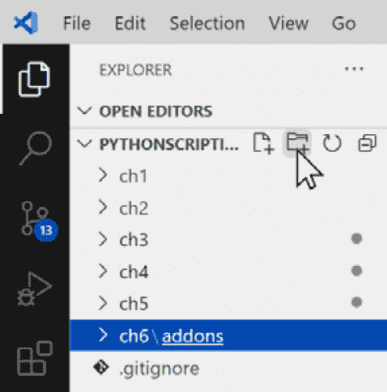

图 6.1：在 Visual Studio Code 中创建文件夹

1.  将新文件夹命名为 `structured_addon`。

一个 Python 包包含一个名为 `__init__.py` 的文件。这是文件夹的**入口点**，Python 在导入包时会自动运行它。要创建它，请按照以下步骤操作：

1.  选择 `…/``ch6/addons/structured_addon` 文件夹。

1.  通过点击**新建文件**图标创建一个新文件：

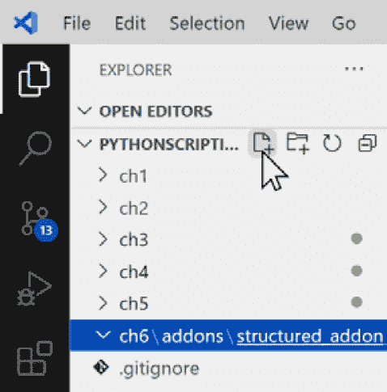

图 6.2：在 Visual Studio Code 中创建新文件

1.  将新文件命名为 `__init__.py`。

1.  双击文件打开。

当 Blender 搜索已安装的插件时，它将在该文件夹的 `__init__.py` 文件中查找 `bl_info` 字典。我们将以通常的方式填写这些信息。

## 编写初始化文件

这个 `bl_info` 字典包含了用于插件发现的常用属性：

```py
bl_info = {
    "name": "A Structured Add-on",
    "author": "John Doe",
    "version": (1, 0),
    "blender": (3, 2, 0),
    "description": "Add-on consisting of multiple files",
    "category": "Learning",
}
```

提供一个 `register()` 和一个 `unregister()` 函数将允许我们启用和禁用插件：

```py
def register():
    pass
def unregister():
    pass
```

现在，如果我们重新启动 Blender 或刷新插件列表，我们应该能够看到我们的 **结构化插件**：

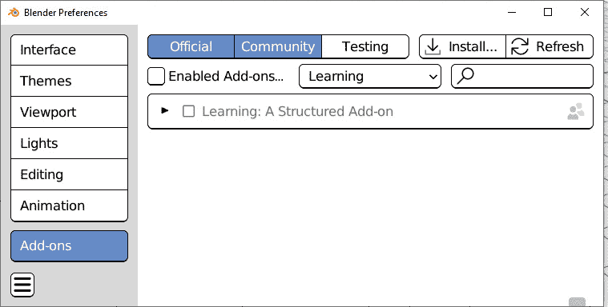

图 6.3：在“学习”类别中列出的结构化插件

我们将通过添加一些内容，使用不同的 `.py` 文件，使其变得有用。

## 模块分离的指南

在代码分区和集中之间有一个权衡：过度原子化的代码可能会变得不清晰且难以维护。因此，即使没有关于分割程序的确切规则，也有编写模块化代码的一般标准：

+   非 Python 文件，如 *媒体*（图像、声音等），根据其类型有自己的子文件夹

+   由无关类使用的 *通用代码* 可以被视为一个实用模块，并像库一样使用

+   与特定功能相关的 *特定代码* 应该是特定的模块

+   *UI* 类，如面板和菜单，可以通过非 UI 代码进行分离

+   可以将 *操作符* 与非操作符代码分离，并按类别分割

+   仅与脚本的一部分相关的 *导入* 语句可能意味着整个部分可以放入另一个文件中，从而减少一个文件中导入的库的数量

我们将把这些概念付诸实践，并看看从我们熟悉的例子开始，包架构如何使我们的代码更清晰、更有效：

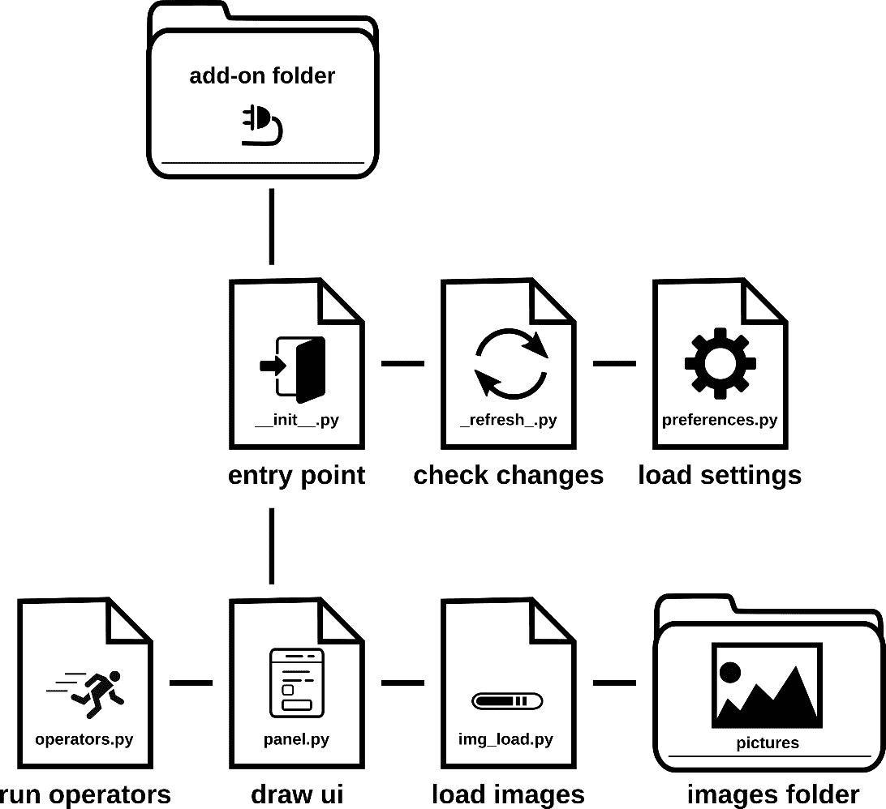

图 6.4：插件文件夹的执行 – __init__.py 将所有部分粘合在一起

## 编写结构化面板

我们在 *第五章* 中编写了一个用户界面，它依赖于一个外部的 `.png` 文件来显示图标。这使得工具难以共享，因为 Blender 只能安装一个 `.py` 或 `.zip` 文件。

如果我们将所有内容都作为文件夹结构化，我们可以将图片和代码捆绑在一起。根据前面总结的指南，我们可以创建以下内容：

+   一个名为 `pictures` 的 *图标存储*（媒体文件）的子文件夹

+   一个名为 `img_load.py` 的 *图标加载* 模块（通用功能）

+   一个包含 *面板*（UI 分离）的模块名为 `panel.py`

+   一个名为 `preferences.py` 的插件 *首选项*（特定功能）模块

+   一个名为`_refresh_.py`的模块，用于*重新加载*导入系统（维护工具）。

在下一节中，我们将创建一个用于存储图像文件及其加载代码的文件夹。

# 打包外部图像

如果我们为我们的插件使用图像文件，我们可以在`structured_addon`目录中创建一个名为`pictures`的文件夹。由于我们将编写一个加载图标的模块，这个文件夹可以包含一系列图像文件。

在示例中的`ch6\addons\structured_addon\pictures`文件夹中，我们有`pack_64.png`，一个表示包的剪贴画，以及`smile_64.png`，来自上一章的笑脸：

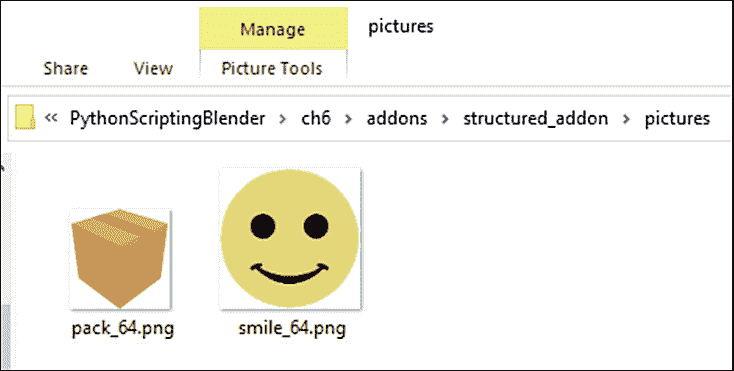

图 6.5：用于此附加组件的图片存储在文件夹中

一旦所有我们的图片都存放在这个文件夹中，我们就可以编写代码来加载它们。

## 编写图标库

在*第五章*中，我们编写了一个函数，用于从磁盘加载特定的图像文件。这工作得很好。现在我们正在加载两个图标，我们只需将相同的程序运行两次。

但现在我们有一个用于加载图像的整个模块，我们可以编写一个更复杂的解决方案，它适用于任何数量的图标，因为它不依赖于硬编码的完整路径。

这个新的加载器会扫描图片文件夹中的图像。我们将确保不会因为其他模块的多次调用而增加加载时间，以便我们最终得到一个更灵活、但仍可靠的定制图像加载器。让我们按照之前的步骤创建模块的文件：

1.  选择`…/``ch6/addons/structured_addon`文件夹。

1.  通过点击**新建** **文件**图标创建一个新文件。

1.  将新文件命名为`img_loader.py`。

1.  通过双击打开文件。

此模块将处理整个包的图标加载。

## 从文件夹中加载图片

`img_loader`模块会从文件夹中滚动图像文件，因此我们需要导入`os`包来访问目录。当然，还需要`bpy.utils.previews`来从文件中加载图像并将它们存储为图标：

```py
from bpy.utils import previews
import os
```

我们使用一个全局变量，一个列表，来存储 Blender 预览`Collection`。遵循 Python 命名约定，变量名是大写的，因为它是一个全局变量。此外，它以一个下划线开头，因为它不打算在其他任何模块中使用：

```py
_CUSTOM_ICONS = None
```

我们创建`register_icons()`函数来从磁盘加载图标。它类似于*第五章*第一部分中的`load_custom_icons`函数。

如果`_CUSTOM_ICONS`对`if`条件测试为`True`，则`return`语句将立即退出函数。这防止了每次模块使用时重复加载图标。否则，我们通过`previews.new()`创建一个新的图标集合：

```py
def register_icons():
    """Load icons from the add-on folder"""
    global _CUSTOM_ICONS
    if _CUSTOM_ICONS:  # avoid loading icons twice
        return
    collection = previews.new()
```

我们不是通过硬编码文件名来加载的，而是将`pictures`文件夹中包含的所有图片加载进来。我们不希望加载非图片文件，因此我们将我们可用的图片扩展名存储在`img_extensions`变量中。在这个例子中，我们只使用`.png`和`.jpg`格式，但也可以使用其他格式，例如`.tif`：

```py
    img_extensions = ('.png', '.jpg')
```

我们通过将`'pictures'`添加到模块的路径中来获取图片文件夹的路径。在处理文件时，由于`os`实用工具中的路径函数确保了多平台兼容性，因此我们更倾向于使用路径函数而不是字符串操作。因此，我们使用`os.path.join`函数构建`picture_path`变量：

```py
    module_path = os.path.dirname(__file__)
    picture_path = os.path.join(module_path, 'pictures')
```

`os.listdir`函数返回一个包含目录中所有文件名的列表。我们使用`for`循环遍历列表，并在每次迭代中，使用`os.path.splitext`函数将文件名与其扩展名分开。扩展名的大小写都是有效的，但字符串比较是区分大小写的操作。我们将所有文件扩展名转换为小写字母，以便`.jpg`或`.png`文件可以被考虑。当文件扩展名不在`img_extensions`中时，文件将通过`continue`语句被跳过：

```py
    for img_file in os.listdir(picture_path):
        img_name, ext = os.path.splitext(img_file)
        if ext.lower() not in img_extensions:
            # skip non image files
            continue
```

快速退出或坚持下去！

使用`continue`跳出一个循环迭代，使用`break`跳出整个循环，或者在使用`return`之前结束一个函数，这些都是当条件不满足时立即中断程序的有效技术。这避免了嵌套过多的`if`语句，但建议只在执行开始时这样做：在代码中随机位置设置退出点会使代码难以阅读。

`os.listdir`只列出文件名，而不是它们的完整磁盘路径。要获取它，我们必须使用`os.path.join`将`picture_path`和`img_file`结合起来。我们使用`img_name`（即没有扩展名的文件名）作为从集合中检索图标的键：

```py
        disk_path = os.path.join(picture_path, img_file)
        collection.load(img_name, disk_path, 'IMAGE')
```

一旦`for`循环结束，我们就可以将集合存储在`_CUSTOM_ICONS`列表中：

```py
    _CUSTOM_ICONS = collection
```

使用文件名作为关键字很方便，例如`'smile_64'`将是`smile_64.png`文件的键，但当我们的文件夹包含具有相同名称但不同扩展名的文件时，例如`smile_64.jpg`，它可能会产生歧义。我们的脚本将假设图片文件夹不包含具有相同文件名的图片。

有了这个，我们已经创建了`register_icons()`函数，它初始化图标集合。现在，我们需要添加一个函数来在附加组件被禁用时清理它；否则，我们电脑 RAM 中留下的缩略图将干扰后续执行。

## 取消注册图标

当附加组件被禁用时，我们必须从我们电脑的内存中卸载其图标。

要做到这一点，我们必须定义`unregister_icons`函数。在这个函数中，我们调用`previews.remove()`并使用`_CUSTOM_ICONS`作为其参数。我们还需要确保在函数末尾将`_CUSTOM_ICONS`设置为`None`；否则，Python 将保留对已删除图标的无效引用，导致 Blender 崩溃：

```py
def unregister_icons():
    global _CUSTOM_ICONS
    if _CUSTOM_ICONS:
        previews.remove(_CUSTOM_ICONS)
    _CUSTOM_ICONS = None
```

现在，`img_loader`可以加载和卸载图标，我们需要的是一个获取器来从其他模块访问`_CUSTOM_ICONS`。

## 获取集合

Python 并不允许访问模块成员，即使我们使用带前导下划线的名称将其标记为*私有*。因此，我们可以通过以下方式访问`_CUSTOM_ICONS`变量：

```py
>>> img_loader._CUSTOM_ICONS
```

尽管如此，如果我们使用一个函数来获取已加载的图标，我们还可以添加更多控制：

+   在未来，我们可以将`_CUSTOM_ICONS`更改为字典或列表。如果获取它们的函数相应地更改，这将对使用数据的其他模块没有影响。

+   这使得检查条件是否满足变得容易。在这种情况下，我们的`register_icons()`调用确保图标已注册，以防万一由于某种原因没有注册。这种做法遵循**防御性编程**，因为它旨在使脚本即使在不可预见的情况下也能正常工作。

+   这允许我们在某些关键条件未满足的情况下设置*障碍*。例如，我们添加了一个`assert _CUSTOM_ICONS`语句，如果变量尚未设置，即使最近调用了`register_icons()`，它也会引发错误。这是一个**进攻性编程**的例子，因为它在出现错误时停止执行：

```py
def get_icons_collection():
    """Get icons loaded from folder"""
    register_icons()  # load icons from disk
    assert _CUSTOM_ICONS  # if None something is wrong
    return _CUSTOM_ICONS
```

现在，图片加载器为从图片文件夹中加载、卸载和获取所有图标提供了一个代码接口。主模块可以通过相对导入导入它。

## 使用相对导入

`import`语句会在 Python 搜索路径中查找已安装的模块，例如内置库或在我们的情况下，Blender API（`bpy`）。尝试导入不在搜索路径中的模块会导致脚本因`ModuleNotFoundError`而停止。

对于属于同一包的模块，我们使用稍微不同的语法，以便访问同一包的其他模块：一个**相对**导入语句。

在相对导入中，包用点(`.`)表示，模块使用`from . import` `module`语法导入。

因此，在我们的`__init__.py`文件的导入部分，添加以下内容：

```py
from . import img_loader
```

注册和注销函数将分别调用`img_loader`命名空间中包含的`register_icons()`和`unregister_icons()`函数：

```py
def register():
    img_loader.register_icons()
def unregister():
    img_loader.unregister_icons()
```

现在整个图像加载过程都在一个模块中处理，我们可以编写*用户界面*的`.py`文件。

在下一节中，我们将看到，一旦我们通过`img_loader`的相对导入访问了我们的图标系统，我们就不再需要担心加载图标文件了。

# 添加用户界面

我们已经创建了 `panel.py` 模块，该模块将包含所有 *用户界面* 类和函数，因此这个文件将包含我们的面板类。

## 编写 UI 模块

我们将通过 `img_loader` 的相对导入来开始导入 `bpy` 模块和我们的图标集合：

```py
import bpy
from . import img_loader
```

`OBJECT_PT_structured` 类是从 `Panel` 派生的。像第五章中的那个一样，它在静态部分包含了 Blender 所需的 `bl_*` 标识符：

```py
class OBJECT_PT_structured(bpy.types.Panel):
    """Creates a Panel in the object context"""
    bl_label = "A Modular Panel"
    bl_idname = "MODULAR_PT_layout"
    bl_space_type = 'PROPERTIES'
    bl_region_type = 'WINDOW'
    bl_context = 'object'
```

目前，我们的 `draw` 函数是几行代码，显示一个图标，然后是文本：

```py
    def draw(self, context):
        layout = self.layout
        icons = img_loader.get_icons_collection()
        layout.label(text="A Custom Icon",
                     icon_value=icons['pack_64'].icon_id)
```

接下来，我们必须编写从该模块注册和注销类的函数：

```py
def register_classes():
    bpy.utils.register_class(OBJECT_PT_structured)
def unregister_classes():
    bpy.utils.unregister_class(OBJECT_PT_structured)
```

在模块内部提供注册实用工具，可以减轻 `__init__.py` 对哪些类在 `panel` 中定义以及哪些类应该注册/注销的担忧。这就像我们在本章第二部分 *获取集合* 中所做的，*打包* *外部图像*。

这些设计属于 **封装** 的实践——也就是说，限制对模块或对象组件的直接访问。遵循它并不本质上更好，但它可以帮助保持代码灵活和整洁。

## 导入用户界面

在 `__init__.py` 中，我们从 `.` 命名空间导入 `panel`，并调用其 `register_classes()` 和 `unregister_classes()` 函数：

```py
from . import img_loader
from . import panel
def register():
    img_loader.register_icons()
    panel.register_classes()
def unregister():
    panel.unregister_classes()
    img_loader.unregister_icons()
```

在这个例子中，`unregister` 的顺序与 `register` 函数中的顺序相反。这与插件的执行无关，这里只为了清晰起见。

我们可以通过从 **编辑** | **首选项** 菜单中启用 **结构化面板** 来测试我们的代码。

我们可以在对象部分看到面板和我们的新图标：

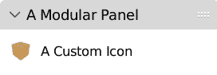

图 6.6：panel.py 通过 img_loader.py 显示图标

现在，我们将添加其他元素并完成面板。

## 完成对象面板

在 *第五章* 中显示的面板的略微简化版本，几乎使用了相同的代码。显示的对象的最大数量仍然存储在 `max_objects` 静态成员中，但如果将其实现为插件的偏好设置会更好。我们将在本章稍后的 *使用插件偏好设置* 部分这样做：

```py
class OBJECT_PT_structured(bpy.types.Panel):
    """Creates a Panel in the object context"""
    bl_label = "A Modular Panel"
    bl_idname = "MODULAR_PT_layout"
    bl_space_type = 'PROPERTIES'
    bl_region_type = 'WINDOW'
    bl_context = 'object'
    max_objects = 3  # limit displayed list to 3 objects
```

`draw` 函数显示场景对象的列表：

```py
    def draw(self, context):
        layout = self.layout
        icons = img_loader.get_icons_collection()
        row = layout.row(align=True)
        row.label(text="Scene Objects",
                  icon_value=icons['pack_64'].icon_id)
        row.label(text=" ",
                  icon_value=icons["smile_64"].icon_id)
        grid = layout.grid_flow(columns=2,
                                row_major=True)
        for i, ob in enumerate(context.scene.objects):
            if i > self.max_objects:
                grid.label(text="...")
                break
            # display object name and type icon
            grid.label(text=ob.name,
                       icon=f'OUTLINER_OB_{ob.type}')
```

这次，重新加载脚本并没有反映前面代码中的更改：只有 `__init__.py` 文件在重新加载时被刷新。我们将在下一节中明确介绍重新加载内部模块。

# 重新加载缓存的模块

当一个模块被导入时，Python 会缓存它的一个副本以供将来访问。由于 `__init__.py` 文件是唯一一个由 **Reload Scripts** 操作符更新的文件，我们只剩下两个选项：

+   关闭并重新启动 Blender

+   在 `__init__.py` 中显式调用 `reload` 函数

与重新启动应用程序相比，后者更受欢迎，因为它耗时更短。`reload` 函数是 `importlib` 模块的一部分。

## 通过 `importlib` 进行重新加载

`importlib` 库中的实用程序与导入系统交互，`reload` 函数强制 Python 解释器从磁盘重新加载一个模块。

如果 `img_loader` 模块已更改并需要重新加载，我们可以使用以下命令：

```py
from importlib import reload
reload(img_loader)
```

因此，为了确保我们的附加功能 `.py` 文件中的更改始终得到应用，我们可以在 `_init_.py` 中添加以下代码行：

```py
from . import img_loader
from . import panel
from importlib import reload
reload(img_loader)
reload(panel)
```

在导入相对模块后不久重新加载它将有效，但将 `reload` 语句留在已发布的代码中会影响性能，并被视为不良实践。接下来，我们将学习如何在附加功能的特定模块中刷新。

## 实现刷新模块

调用 `reload` 会增加附加功能的加载时间，并使代码的可读性降低。许多开发者在工作时添加重新加载调用，完成时移除它们。然而，使用包，我们可以将刷新逻辑移动到另一个模块。

为了做到这一点，我们需要在我们的附加功能包中创建一个文件，并将其命名为 `_refresh_.py`。此模块不包含任何附加功能，但在我们编辑代码时，它有助于确保所有模块都从磁盘重新加载并保持最新。

## 重新加载包模块

刷新模块使用了以下元素：

+   `importlib` 模块中的 `reload` 函数

+   `_refresh_` 使用的 `sys` 模块，用于重新加载其自身的实例

+   `bpy` 模块，用于访问 Blender 首选项

+   附加功能中包含的所有模块

这些要求转化为以下 `import` 语句：

```py
from importlib import reload
import sys
import bpy
from . import *
```

通配符字符 `*` 代表当前包中包含的所有模块（`.`）。现在，我们可以编写一个函数，如果 Blender 设置为开发模式，则重新加载附加功能模块。我们在 *第二章* 的 *Python 有用功能* 部分遇到了 **开发者附加功能** 设置，在首选项窗口的 **界面** 选项卡中，可以通过从顶部菜单栏的 **编辑** | **首选项** 来找到：

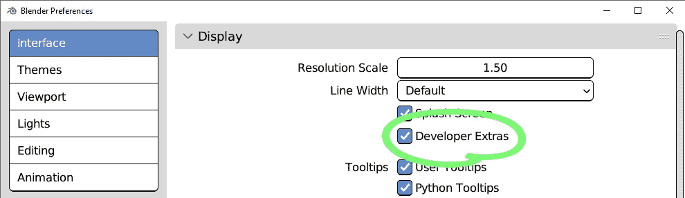

图 6.7：在首选项窗口中启用开发者附加功能

我们可以假设当**开发者附加功能**开启时，我们希望**重新加载脚本**操作符也重新加载我们的子模块。

## 使用开发者附加功能作为条件

我们需要找到**开发者附加功能**的完整 Python 路径以读取其值。为此，请按照以下步骤操作：

1.  确保已启用**开发者附加功能**。

1.  此外，请确保已启用**用户工具提示**和**Python 工具提示**。

1.  将鼠标指针悬停在 **开发者附加功能** 复选框或标签上。

1.  将鼠标停留在原地，不点击或移动它，会显示一个工具提示：

```py
Show options for developers (edit source in context …
Python: PreferencesView.show_developer_ui
```

根据 API 参考，`PreferencesView`是`Preferences`类的`view`成员，可以在`bpy.context.preferences`中找到：

[`docs.blender.org/api/3.3/bpy.types.Preferences.xhtml`](https://docs.blender.org/api/3.3/bpy.types.Preferences.xhtml)

#bpy.types.Preferences.view

因此，**开发者额外功能**设置的完整路径如下：

```py
bpy.context.preferences.view.show_developer_ui
```

`show_developer_ui`的值要么是`True`要么是`False`。使用它作为条件，如果**开发者额外功能**被禁用，我们将退出`reload_modules`：

```py
def reload_modules():
    if not bpy.context.preferences.view.show_developer_ui:
        return
```

然后，我们为每个我们想要刷新的`.py`文件添加一个`reload`调用。第一行重新加载`_refresh_.py`，在系统字典`sys.modules`中查找当前文件名。这样，我们可以更新`_refresh_`模块本身的变化。因此，`reload_modules`函数的完整体如下所示：

```py
def reload_modules():
    if not bpy.context.preferences.view.show_developer_ui:
        return
    reload(sys.modules[__name__])
    reload(img_loader)
    reload(panel)
```

现在，启用`__init__.py`，因为这是脚本重新加载时唯一要执行的文件。我们必须在导入部分调用`_refresh_.reload_modules()`：

```py
from . import img_loader
from . import panel
from . import _refresh_
_refresh_.reload_modules()
```

调用`OBJECT_PT_structured`：

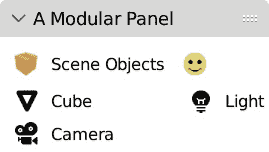

图 6.8：我们的面板源代码已被重新加载

可以在`max_objects = 3`静态成员中设置三个对象的限制。然而，有一个更好的地方可以存放我们的附加组件设置。在下一节中，我们将实现我们附加组件的正确首选项。

# 使用附加组件首选项

除了使用 Blender 首选项外，我们还可以使用`bpy.types.AddonPreferences`在附加组件激活复选框下显示附加组件特定的自定义设置。它是一个接口，就像`bpy.types.Panel`一样，我们可以使用它的`draw`方法向其布局添加设置。

`AddonPreferences`的`bl_idname`属性必须与附加组件的 Python 名称匹配。对于单个文件使用`__name__`和对于文件夹使用`__package__`可以使我们的代码更容易维护：这些变量始终匹配相应的 Python 名称，因此文件和文件夹名称的变化不会产生任何影响。

## 创建首选项

由于我们使用多个文件，我们将在`structured_addon`文件夹内创建`preferences.py`。它包含`StructuredPreferences`类：

```py
import bpy
class StructuredPreferences(bpy.types.AddonPreferences):
    bl_idname = __package__
    def draw(self, context):
        layout = self.layout
        layout.label(text="Structured Add-On Preferences")
```

然后，我们必须添加一个`register_classes`和一个`unregister_classes`函数：

```py
def register_classes():
    bpy.utils.register_class(StructuredPreferences)
def unregister_classes():
    bpy.utils.unregister_class(StructuredPreferences)
```

我们可以将`preferences`添加到`__init__.py`的`import`部分，如下所示：

```py
from . import panel
from . import img_loader
from . import preferences
from . import _refresh_
_refresh_.reload_modules()
```

然后，我们必须将首选项模块中的类与其它类一起注册：

```py
def register():
    img_loader.register_icons()
    preferences.register_classes()
    panel.register_classes()
def unregister():
    panel.unregister_classes()
    preferences.unregister_classes()
    img_loader.unregister_icons()
```

我们还必须确保首选项将在`_refresh_.py`中重新加载。`_reload_modules`函数看起来是这样的：

```py
def _reload_modules():
    reload(sys.modules[__name__])
    reload(img_loader)
    reload(preferences)
    reload(panel)
```

如果我们现在使用**重新加载脚本**，我们将在**附加组件**复选框下方看到我们的首选项，在**附加组件**列表中：

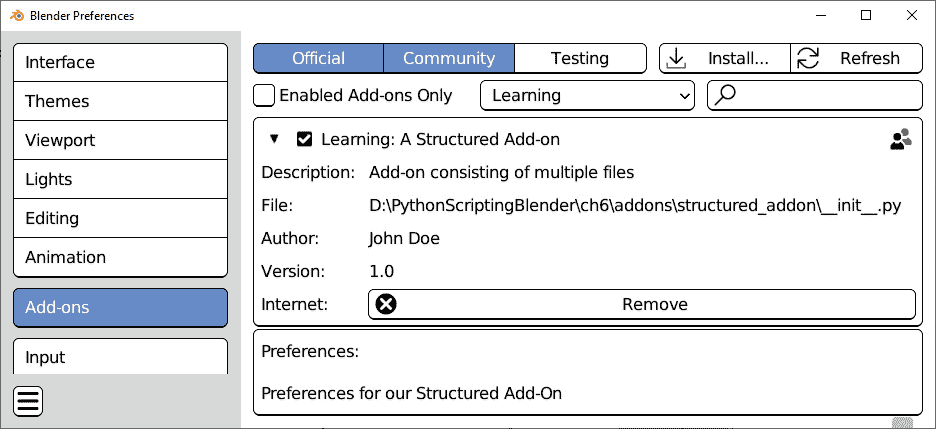

图 6.9：在首选项窗口中显示的附加组件设置

首选项显示出来，但仍然是空的。接下来，我们将添加一些值。

## 填充首选项

我们想用设置替换 `OBJECT_PT_structured .max_objects`。它是一个整数，因此我们将向 `StructuredPreferences` 类添加一个 `IntProperty`：

```py
import bpy
from bpy.props import IntProperty
class StructuredPreferences(bpy.types.AddonPreferences):
    bl_idname = __package__
    max_objects: IntProperty(
        name="Maximum number of displayed objects",
        default=3
    )
```

现在它包含一个整型属性，`StructuredPreferences` 可以存储最大显示对象设置。为了将此属性显示给用户，我们将在 `draw` 方法中将它添加到布局中。一个简单的 `layout.prop` 指令就足够了：

```py
self.layout.prop(self, max_objects)
```

但我们也可以使用 `split` 来获得更好的外观。一个分割布局为每个新条目创建一个列。添加一个空小部件，一个 `separator` 作为第一个元素，创建一个缩进：

```py
    def draw(self, context):
        layout = self.layout
        split = layout.split(factor=0.5)
        split.separator()
        split.label(text="Max Objects")
        split.prop(self, 'max_objects', text="")
```

重新加载脚本将显示 **最大对象数** 作为可编辑设置：

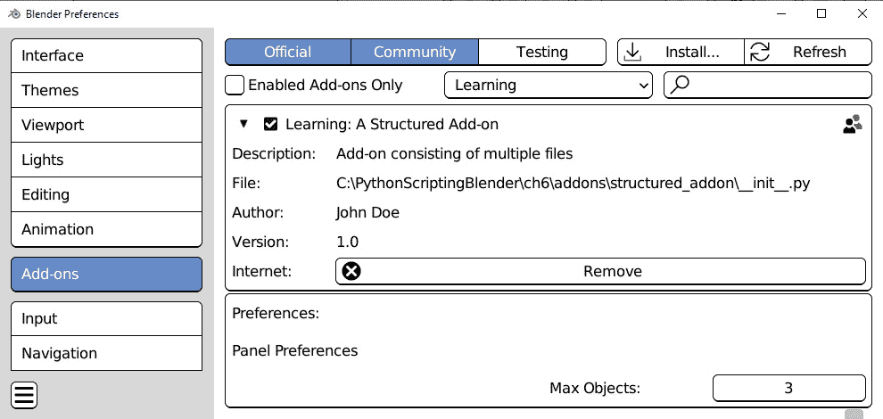

图 6.10：最大对象数作为首选项设置

此值将与其他用户首选项一起保存，并且 Blender 在应用程序重新启动时记住其值。我们目前还没有使用此设置：我们需要调整我们的面板中的代码，以便可以使用它。

## 在代码中使用扩展首选项

Python 脚本可以通过一行代码访问扩展的首选项：

```py
bpy.context.preferences.addons[ADDON_NAME].preferences
```

注意 `preferences` 在末尾被重复。这可能看起来是多余的，但这是有意义的，因为 `bpy.context.preferences.addons` 指的是应用程序首选项，而不是单个扩展的首选项。

`bpy.context.preferences.addons[ADDON_NAME]` 返回扩展作为 Python 对象。

在这个前提下，我们将回到 `OBJECT_PT_structured` 类在 *用户界面* 的 `panel.py` 模块中的 `OBJECT_PT_structured` 类。由于我们将使用首选项中的值，它不再应该有一个 `max_objects` 静态成员：

```py
class OBJECT_PT_structured(bpy.types.Panel):
    """Creates a Panel in the object context"""
    bl_label = "A Modular Panel"
    bl_idname = "MODULAR_PT_layout"
    bl_space_type = 'PROPERTIES'
    bl_region_type = 'WINDOW'
    bl_context = 'object'
```

现在，在我们迭代 `draw` 函数中的场景对象之前，我们必须从上下文中获取我们的 `add_on` 和 `preferences`。使用 `enumerate`，这样我们可以在显示对象时保持计数，当 `preferences.max_objects` 中存储的数量达到时，我们停止循环：

```py
    add_on = context.preferences.addons[__package__]
    preferences = add_on.preferences
    for i, ob in enumerate(context.scene.objects):
        if i >= preferences.max_objects:
            grid.label(text="...")
            break
```

这次，我们使用大于或等于 (`>=`) 的比较来检查 `max_objects`，因为枚举从 `0` 开始，在 `i > max_objects` 后中断会显示一个额外的对象。

为了清楚起见，使用单独的模块为扩展首选项不是必需的——本章中编写的全部代码本可以包含在一个单独的大 `.py` 文件中：我们只是为了可读性而拆分代码。

如果我们的扩展包含操作符，我们也可以为它们创建模块。

# 添加操作符

操作符可以根据其目的分组到不同的文件中。例如，与转换相关的操作符，如 `ops_transform.py`，而我们的前几个操作符，`ops_collections.py` 文件。所有这些类随后将通过 `__init__.py` 进行注册，如果需要，可以通过相对导入添加到扩展接口中。

另一个解决方案是为所有操作符创建一个模块，可以命名为 `operators.py`。在本节中，我们将为我们的扩展创建一个操作符模块。

## 编写操作员模块

在`structured _addon`文件夹中，我们将创建`operators.py`模块。它将包含我们的操作员类：我们将重用 Blender 脚本中无处不在的`bpy`，我们将导入`random`模块并在`add_random_location`函数中使用`randint`：

```py
import bpy
import random
def add_random_location(objects, amount=1,
                        do_axis=(True, True, True)):
    """Add units to the locations of given objects"""
    for ob in objects:
        for i in range(3):
            if do_axis[i]:
                loc = ob.location
                loc[i] += random.randint(-amount, amount)
```

现在，我们可以继续添加附加类。它和前一章的*显示按钮*部分相同 - `poll`返回`True`表示有选中的对象，而`execute`运行`add_random_location`，以操作员的数量和轴作为参数：

```py
class TRANSFORM_OT_random_location(bpy.types.Operator):
    """Add units to the locations of selected objects"""
    bl_idname = "transform.add_random_location"
    bl_label = "Add random Location"
    amount: bpy.props.IntProperty(name="Amount",
                                  default=1)
    axis: bpy.props.BoolVectorProperty(
                               name="Displace Axis",
                               default=(True, True, True)
                               )
@classmethod
    def poll(cls, context):
        return context.selected_objects
    def execute(self, context):
        add_random_location(context.selected_objects,
                            self.amount,
                            self.axis)
        return {'FINISHED'}
```

就像在`panel.py`的情况一样，我们必须添加注册模块类的函数：

```py
def register_classes():
    bpy.utils.register_class(TRANSFORM_OT_random_location)
def unregister_classes():
    bpy.utils.unregister_class(
                              TRANSFORM_OT_random_location
                              )
```

现在，我们可以将`operators.py`导入脚本的其他模块。

## 注册操作员类

要使用我们的操作员，我们必须在`__init__.py`中导入`operators.py`，其`import`部分将如下所示：

```py
from . import operators
from . import img_load
from . import panel
from . import preferences
from . import _refresh_
```

当然，我们可以使用`operator.register_class`和`operator.unregister_class`添加和删除我们的操作员。由于操作员可能用作按钮，我们在`panel.register_classes`之前调用`operators.register_classes`：

```py
def register():
    preferences.unregister_classes()
    operators.register_classes()
    img_load.register_icons()
    panel.register_classes()
def unregister():
    panel.unregister_classes()
    img_load.unregister_icons()
    operators.register_classes()
    preferences.unregister_classes()
```

这样，当我们在重新加载脚本时，`operators.py`将生效，我们必须将`operators`添加到`_refresh_.reload_modules`中。

## 重新加载时刷新操作员

多亏了我们在*重新加载缓存模块*部分所做的努力，向刷新的模块添加操作员变得容易：我们在`reload_modules`函数中添加`reload(operators)`。现在整个`_refresh_.py`文件如下所示：

```py
import sys
from importlib import reload
import bpy
from . import *
def reload_modules():
    if not bpy.context.preferences.view.show_developer_ui:
        return
    reload(sys.modules[__name__])
    reload(img_load)
    reload(preferences)
    reload(operators)
    reload(panel)
```

剩下的唯一事情就是在面板中显示操作员按钮。

## 添加操作员按钮

要添加`panel.py`，其导入部分将如下所示：

```py
import bpy
from . import img_loader
from . import operators
```

现在，我们的面板可以使用`operators`作为命名空间访问`TRANSFORM_OT_random_location`类，因此我们将向`draw`方法添加一个新元素：

```py
    layout.operator(
          operators.TRANSFORM_OT_random_location.bl_idname
          )
```

当显示`F3` **搜索栏**区域查找并运行**重新加载脚本**时，我们的面板将显示**添加随机** **位置**按钮：

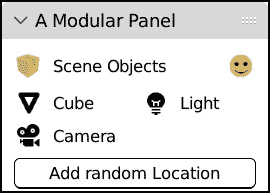

图 6.11：通过相对导入显示操作员的模块化面板

我们的附加组件完成了。然而，我们可以改进`panel.py`并添加我们在*第五章*中为`VerySimplePanel`编写的相同功能，即以下内容：

+   为选定的/活动对象着色的条目

+   一个具有上下文相关标签的**删除**按钮

实现这些留作练习。在下一节中，我们将学习如何将我们的附加组件文件夹分发给其他用户。

# 打包和安装附加组件

我们在*第三章*的*安装我们的附加组件*部分学习了如何安装单个`.py`附加组件。要分发由多个文件组成的附加组件，我们必须创建一个包含它的`.zip`存档。你们大多数人都会熟悉`.zip`文件是一个压缩存档，可以包含更多文件或文件夹。

Blender 可以从标准的 `.zip` 归档中安装文件夹，但有两条要求：

+   `.zip` 文件必须包含插件作为一级文件夹

+   第一级文件夹的名称不能包含任何点 (`.`)，因为它不会与 Python 的导入系统兼容。

有第三方工具，例如使用操作系统的文件实用程序创建 `.zip` 文件。在本节中，我们将学习如何在 **Windows**、**OSX** 和 **Ubuntu** 系统上压缩插件文件夹。

## 清理字节码

如果 `structured_addon.zip\structured_addon` 文件夹包含名为 `__pycache__` 的子文件夹，请确保您删除它：您不应该分发它包含的 `.pyc` 文件。

## 使用 7-Zip 创建 .zip 文件

**7-Zip** 是一款适用于 Windows 的免费压缩工具。它非常轻量级，并且与文件管理器集成。以下是使用它打包我们的插件步骤：

1.  从 [`www.7-zip.org`](https://www.7-zip.org) 下载并安装 7-Zip。

1.  打开 **文件资源管理器**。

1.  导航到包含 `structured_addon` 文件夹的目录。

1.  右键单击 `structured_addon` 文件夹以显示上下文菜单。

1.  选择 **7-Zip** | **添加** **到“structured_addon.zip”**。

`structured_addon.zip` 文件将与原始文件夹一起创建。如果由于某种原因无法安装 7-Zip 或任何其他压缩工具，我们仍然可以使用 Windows 文件资源管理器单独创建 `.zip` 文件。

## 使用 Windows 文件管理器创建 .zip 文件

1.  打开 **文件资源管理器**。

1.  导航到我们想要创建插件的文件夹。

1.  通过右键单击背景来显示上下文菜单。

1.  从右键菜单中选择 `structured_addon.zip`：

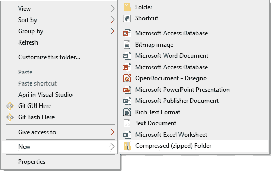

图 6.12：使用 Windows 文件资源管理器创建空 .zip 文件

到目前为止，我们已经创建了一个 `.zip` 文件，但它仍然是空的。接下来，我们将把我们的插件文件复制到那里：

1.  通过使用 *Ctrl* + *C* 或右键单击并选择 **复制**，将 `ch6\addons\structured_addon` 文件夹复制到剪贴板。

1.  双击 `structured_addon.zip` 归档以显示其内容。

1.  通过 *Ctrl* + *V* 或右键单击并选择 **粘贴**，将 `ch6\addons\structured_addon` 文件夹粘贴到归档中。

## 在 Mac 上使用 Finder 创建 .zip 文件

按照以下步骤操作：

1.  在 **Finder** 中右键单击 `structure_addon` 文件夹或左键单击不释放按钮。将出现一个菜单。

1.  从菜单中选择 **压缩“structured_addon”**：

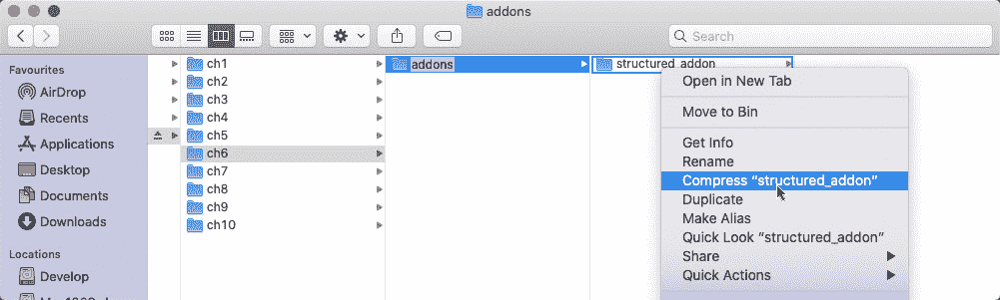

图 6.13：在 Mac 计算机上压缩文件夹

## 使用 Gnome 创建 .zip 文件

使用 Gnome 创建 `.zip` 文件：

1.  在文件浏览器中右键单击 `structure_addon` 文件夹。

1.  从菜单中选择 **压缩…** 选项。

1.  确认归档的文件名和 `.zip` 扩展名。

1.  点击 **创建** 按钮。

## 安装 .zip 插件

安装压缩附加组件的步骤与我们在*第三章*的*通过创建简单的附加组件扩展 Blender*部分中学到的步骤相同：

1.  通过顶部的菜单**编辑** | **首选项**打开**首选项**窗口。

1.  在左侧列中选择**附加组件**标签页。

1.  点击**附加组件首选项**右上角的**安装**按钮。

1.  在文件浏览器中找到`structured_addon.zip`文件。

1.  点击底部的**安装附加组件**按钮。

有了这些，我们已经完成了我们结构化附加组件的完整开发和发布。在编程中，模块化方法很重要，并且适用于相对简单的工具。此外，随着复杂性的增加，它使我们的脚本更容易管理。

# 摘要

在本章中，我们学习了如何通过将代码拆分为不同的文件来设置代码的模块化架构，同时保持其连贯性和清晰性。我们还学习了如何按程序加载文件以及如何为我们的附加组件编写设置。

这种方法为我们的代码提供了互操作性和通用性，并且通过应用适当的分离指南，简化了我们导航工具不同部分的任务。

在*第七章*中，我们将学习如何使用 Python 进行动画制作，并使用我们的脚本来更改动画设置。

# 问题

1.  Blender 附加组件可以由多个文件组成吗？

1.  附加组件文件夹中的哪个文件包含信息字典？

1.  相对导入是如何工作的？

1.  重新加载附加组件是否会刷新所有模块？

1.  我们在哪里存储附加组件的设置？

1.  我们如何在首选项中显示附加组件属性？

1.  我们如何分发多文件附加组件？
