# 7

# 动画系统

3D 的流行很大程度上归功于动画内容的制作。它在性能、质量和可扩展性方面的许多优势使其在电影、卡通、特技动画和视频游戏中无处不在。这随之而来的是需要定制工具来简化与动画相关的任务。

大多数应用程序以类似的方式处理动画，部分原因是从手绘工作流程中继承而来：一个序列被分解成帧，这些帧的快速连续出现产生了运动的错觉。

在 3D 领域工作的程序员必须考虑到动画值随时间变化，以及这些数据是如何存储的。

这可能在将来改变，但在撰写本文时，动画涉及大量的手动工作，为自动化留下了很大的空间。

在本章中，你将熟悉 Blender 的动画过程，学习如何在 Python 中访问动画数据，并构建一个设置播放范围的工具以及一个使对象动画化的工具。

本章将涵盖以下主题：

+   理解动画系统

+   更改播放设置

+   使用 Python 创建动画

# 技术要求

在本章中，我们将使用 Blender 和 Visual Studio Code。本章创建的示例可以在[`github.com/PacktPublishing/Python-Scripting-in-Blender/tree/main/ch7`](https://github.com/PacktPublishing/Python-Scripting-in-Blender/tree/main/ch7)找到。

# 理解动画系统

虽然动画由一系列帧组成，但屏幕上一次只显示一帧。动画师可以滚动这些帧，像播放视频一样播放他们的动画：

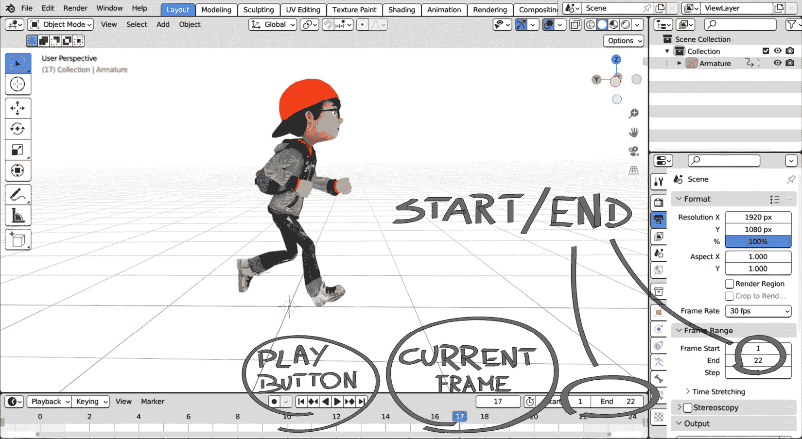

图 7.1：在 Blender 中播放动画

在**布局**工作空间屏幕底部，动画**时间轴**控制并显示当前帧以及序列的开始/结束。它提供即时视觉反馈，对于动画至关重要。

## 时间轴和当前帧

**时间轴**是 Blender 中播放动画和更改播放设置的区域。它带有时钟图标，由于其重要性，它存在于多个工作空间中：**动画**、**布局**、**渲染**和**合成**都显示时间轴。

除了帧的**开始**和**结束**值之外，还有一个用于**当前帧**区域的滑块和一个带有**媒体控制**按钮栏：

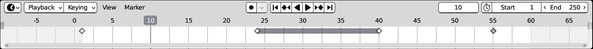

图 7.2：Blender 的动画时间轴

除了帧范围和控制之外，时间轴还显示**关键帧**——即包含对象属性变化的帧。

帧范围信息，这对于其他任务（如**渲染**）也相关，是场景的一个属性，也可以在场景属性中设置。

## 持续时间和帧率

当前场景的时长可以在**输出**属性的**格式**和**帧范围**面板中设置，从上面的第二个标签开始，带有打印机图标。

一个场景，四个标签页！

场景属性如此之多，以至于它们跨越了前四个标签页。这可能会令人困惑，因为它们的所有标题都读作**场景**。

这四个类别如下：

- **渲染**，带有电视图标

- **输出**，带有打印机图标

- **视图层**，其图标是一堆图片

- **场景**，其图标代表一个圆锥体和一个球体

只有**输出**属性包含与动画相关的设置。

**帧率**属性显示动画每秒包含多少帧，也称为**每秒帧数**（**FPS**）。

默认值是`24 FPS`，这是历史上有声电影的速率。由于电网的频率，美国电视的素材通常以`30` FPS 拍摄，而欧洲电视使用`25` FPS。动作捕捉或视频游戏动画可能有更高的速率，例如`60` FPS：

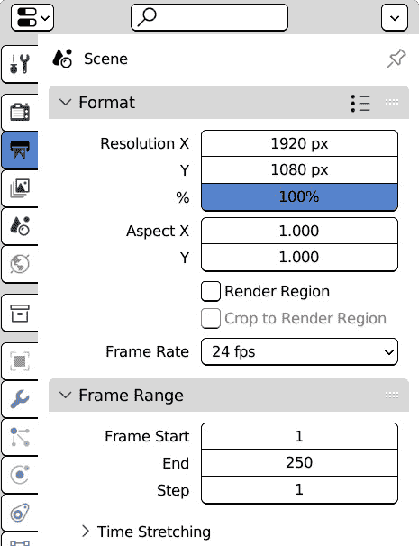

图 7.3：场景范围属性

提高**帧率**值会使动画每秒播放更多帧，因此缩短了播放时长，因为更多的帧在更少的时间内完成。

虽然图形界面允许动画师从预设列表中选择帧率或显示自定义值的附加属性，但在 Python 中，`fps`是`scene.render`属性的一个数值属性：

```py
>>> import bpy
>>> bpy.context.scene.render.fps
24
```

默认情况下，场景的第一帧是`1`，而最后一帧是`250`。这些值是任意的，并且会根据特定镜头的计划时长进行更改。

场景的第一帧和最后一帧可以通过 Python 作为场景属性访问：

```py
>>> import bpy
>>> bpy.context.scene.frame_start
1
>>> bpy.context.scene.frame_end
250
```

`1`。它可以增加，以便不是所有帧都被渲染，这是渲染管理器用来测试序列整体状态的功能：

```py
>>> import bpy
>>> bpy.context.scene.frame_step
1
```

虽然序列的开始、结束和步长在**输出**属性中也是可用的，但**当前帧**和**预览范围**仅在**时间轴**视图中显示。

## 当前帧和预览范围

与`frame_start`、`frame_end`和`frame_step`一样，当前帧作为场景的 Python 属性公开：

```py
>>> import bpy
>>> bpy.context.scene.frame_current
1
```

在**时间轴**视图中，位于**开始**/**结束**左侧带有计时器图标按钮切换预览范围。它显示一个不同的范围，与渲染设置不同：

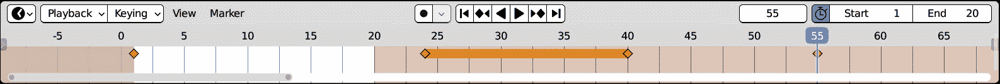

图 7.4：在时间轴视图中启用预览范围

预览范围之外的区域用深橙色标记。动画师在处理分配序列的一部分时，会打开预览范围以限制播放。

在 Python 中，我们可以这样访问`frame_preview_start`和`frame_preview_end`：

```py
>>> import bpy
>>> bpy.context.scene.frame_preview_start
1
>>> bpy.context.scene.frame_preview_end
250
```

在`start`和`end`之间的所有帧构成了动画序列，但并非所有帧都必须存储信息。那些存储信息的帧是动画的关键帧。

## 动画关键帧

在某一时刻物体的位置被存储为**关键帧**。在本节中，我们将简要介绍如何在用户界面以及使用 Python 指令创建和检索关键帧。

### 在 Blender 中添加关键帧

在 Blender 中设置关键帧至少有两种方式：

+   右键单击一个属性，然后在上下文菜单中点击**插入关键帧(s)**。

+   在视图中按**I**显示**插入关键帧菜单**区域并选择要动画化的属性

我们可以在不同的时间进行更改和插入关键帧来创建动画。

### 动画对象

为了更熟悉动画，我们可以打开 Blender 并为默认立方体的位置添加关键帧：

1.  打开 Blender 并选择一个对象。如果场景中没有对象，我们可以从顶部菜单使用**添加** | **网格** | **立方体**。

1.  按*N*键显示活动对象的属性。

1.  右键单击任何**位置**属性。

1.  选择**插入关键帧**。

然而，一个关键帧不足以让立方体在屏幕上移动。要创建合适的动画，我们需要做以下事情：

1.  为`24`设置一个新值。

1.  按下*G*键并将鼠标滚轮移动到新位置以移动立方体。

1.  通过左键单击或按*Enter*键确认新位置。

1.  按`I`插入一个**位置**关键帧。

我们可以通过按空格键或点击**播放**按钮来播放我们的动画。在某些情况下，我们可能想要限制帧范围以循环观看我们的动画。我们可以手动设置序列的**开始**和**结束**，或者我们可以编写一个插件为我们设置它们。

# 编写动作到范围插件

动画师根据镜头的持续时间设置场景的第一帧和最后一帧。如果有动画对象，此插件可以自动设置播放范围。

此操作符将允许您在渲染和预览范围之间进行选择。

## 设置环境

让我们在项目中为这一章节创建一个文件夹。然后，在`ch7`文件夹中作为我们的**脚本文件夹**。我们必须重新启动 Blender 以更新其搜索路径。

我们的插件包含一个操作符，就像第三章和第四章中的那些：

1.  选择`PythonScriptingBlender/ch7/addons`。

1.  通过点击**新建** **文件**图标创建一个新文件。

1.  将新文件命名为`action_to_range.py`。

1.  双击文件以打开它。

我们现在可以开始编写我们的第一个动画插件。

## 编写动作到范围信息

操作符将从**时间轴**视图的**视图**菜单中调用，如位置信息中所述：

```py
bl_info = {
    "name": "Action to Range",
    "author": "John Packt",
    "version": (1, 0),
    "blender": (3, 00, 0),
    "location": "Timeline > View > Action to Scene Range"
    "description": " Action Duration to Scene Range",
    "category": "Learning",
}
```

下一步操作如下：

1.  编写操作符。

1.  编写其菜单条目。

1.  注册类和用户界面。

让我们从操作符类及其信息开始。

## 编写动作到范围操作符

如同往常，`ActionToSceneRange`操作符从`bpy.types.Operator`派生，并以`bl_*`标识符开始：

```py
import bpy
class ActionToSceneRange(bpy.types.Operator):
    """Set Playback range to current action Start/End"""
    bl_idname = "anim.action_to_range"
    bl_label = "Action Range to Scene"
    bl_description = "Transfer action range to scene range"
    bl_options = {'REGISTER', 'UNDO'}
```

如同在*理解动画系统*部分中提到的，场景中有两个帧范围设置：主范围影响场景渲染，而预览范围仅影响视口播放。

我们需要一个参数在两个之间切换。我们将使用`BooleanProperty`，这样我们就可以影响主范围或预览范围：

```py
    use_preview: bpy.props.BoolProperty(default=False)
```

这就是操作符静态部分的全部内容。添加`poll`和`execute`方法将允许操作符运行。

## 编写操作符方法

正如我们在*第三章*中学到的，当操作符运行的条件不满足时，`poll`方法返回`False`；否则返回`True`。我们需要确定操作符的要求并将它们以 Python 形式表示。

### 在`poll()`方法中检查要求

为了获取活动动画的范围，我们必须验证以下条件：

+   必须有一个活动对象

+   活动对象必须是动画化的

当一个对象被动画化时，其关键帧被分组到一个**动作**中，这个动作反过来又成为对象**动画数据**中的活动动作。

我们将在下一节更深入地探讨这些实体，*在 Python 中访问动画数据*。现在，我们可以在以下代码中测试它们的存在：

```py
    @classmethod
    def poll(cls, context):
        obj = context.object
        if not obj:
            return False
        if not obj.animation_data:
            return False
        if not obj.animation_data.action:
            return False
        return True
```

当任何`not`条件满足时，操作符在界面中变灰。否则，可以启动操作符，这将运行其`execute`方法。

### 编写`execute`方法

`execute`方法执行操作符活动。它执行以下操作：

1.  查找当前动作的帧范围

1.  根据场景相应地设置第一帧和最后一帧

1.  在时间轴上可视地适应新的帧范围

我们已经知道如何访问活动对象的动作。它的`frame_range`属性包含动作的第一帧和最后一帧：

```py
    def execute(self, context):
        anim_data = context.object.animation_data
        first, last = anim_data.action.frame_range
```

我们获取当前`scene`并执行*步骤 2*。如果使用时间轴预览范围，我们应该设置预览的开始/结束帧。帧值存储为十进制浮点数，在使用它们之前我们需要将它们转换为整数：

```py
        scn = context.scene
        if self.use_preview:
            scn.frame_preview_start = int(first)
            scn.frame_preview_end = int(last)
```

否则，我们必须设置场景的标准`frame_start`和`frame_end`：

```py
        else:
            scn.frame_start = int(first)
            scn.frame_end = int(last)
```

现在我们已经设置了我们的值，我们可以调用`ops.action.view_all()`来使**时间轴**视图适应新的范围，并完成执行：

```py
        bpy.ops.action.view_all()
        return {'FINISHED'}
```

我们需要将`'UNDO'`添加到`bl_options`中，以便在执行后影响操作符属性，正如我们在*第四章*中学到的：

```py
bl_options = {'REGISTER', 'UNDO'}
```

不幸的是，在`use_preview`设置为`False`之外启动的操作符。

为了解决这个问题，我们可以在**时间轴** | **视图**菜单中创建两个条目。

## 编写菜单函数

在*第三章*中，我们了解到向菜单类添加一个函数可以使我们向其布局中添加元素。

此外，在*第五章*中，我们了解到操作符属性是由`layout.operator`函数返回的，并且可以编程设置。

结合这两种技术，我们可以创建两个菜单条目，它们调用相同的操作符，但我们只在一个条目上启用`use_preview`。这样，我们最终有两个菜单项。它们执行相同的操作符，但具有不同的设置和结果。

为了确保差异反映在操作符标签上，我们可以使用`text=`参数来更改它：

```py
def view_menu_items(self, context):
    props = self.layout.operator(
                         ActionToSceneRange.bl_idname,
                         text=ActionToSceneRange.bl_label +
                              " (preview)")
    props.use_preview = True
```

我们已经将`" (preview)"`添加到操作符标签中，以便清楚地表明这是一个`ActionToSceneRange`操作符的变体。

默认条目影响实际场景范围，因此不需要显式指定文本标签：

```py
    props = self.layout.operator(
                         ActionToSceneRange.bl_idname
                         )
    props.use_preview = False
```

菜单条目按照**后进先出**（**LIFO**）策略显示。我们首先添加了（preview）项，所以它将在默认的**动作到场景** **范围**条目之后显示。

它不会永远默认！

`ActionToSceneRange.use_preview`默认为`False`，但在`view_menu_items`中我们仍然将`props.use_preview`设置为`False`。

除非`is_skip_save`用于一个属性，否则默认值只影响操作符的第一个执行。从那时起，最后的用户选择成为新的默认值。

如果界面元素与特定的操作符设置匹配，那么我们应该在代码中显式设置它们。

现在我们已经创建了附加组件的元素，我们需要注册操作符和菜单条目。然后，它就可以使用了。

## 完成附加组件

我们需要**时间轴** | **查看**菜单的类名。为了找到它，我们可以查找 Blender 界面的 Python 源代码。

### 查找菜单的 Python 类

我们可以右键点击**时间轴** | **查看**菜单，选择**编辑源**来找到它的 Python 名称：

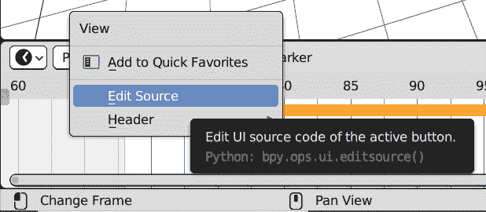

图 7.5：打开时间轴 | 查看

然后，在**文本** **编辑器**区域的`space_time.py`中：

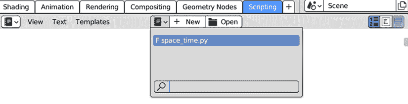

图 7.6：space_time.py 作为一个加载的文本块

在`menu()`函数中找到的脚本就是我们正在寻找的类名：

```py
        sub.menu("TIME_MT_view")
```

我们可以在我们的`register()`函数中使用这个名称。

### 编写注册/注销函数

我们可以使用`register_class`将`ActionToSceneRange`添加到 Blender 操作符中，并将我们的条目追加到`TIME_MT_view`以在**时间轴** | **查看**菜单中显示我们的新条目：

```py
def register():
    bpy.utils.register_class(ActionToSceneRange)
    bpy.types.TIME_MT_view.append(view_menu_items)
```

同样，当附加组件被禁用时，`unregister()`会从菜单中移除我们的条目，并从 Blender 中移除操作符：

```py
def unregister():
    bpy.types.TIME_MT_view.remove(view_menu_items)
    bpy.utils.unregister_class(ActionToSceneRange)
```

现在，操作符已经准备好了。我们可以用它来操作本章前面动画过的立方体，或者打开`ch7/_scenes_`中包含的其中一个文件。

## 启用和运行

如果`PythonScriptingBlender/ch7`文件夹被添加到`scripts`路径中，我们可以在**插件**首选项中找到并启用**动作到范围**：

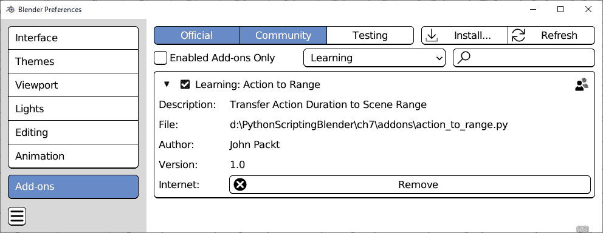

图 7.7：启用动作到范围插件

如果插件安装正确，我们将在**时间线** | **视图**中找到两个新的条目：

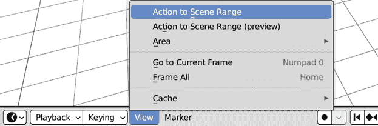

图 7.8：动作到场景范围及其“预览”变体

点击**动作到场景范围**将场景范围设置为 1-24，而**动作到场景范围（预览）**则设置预览范围。

由于我们在属性中设置了`bl_options = {'REGISTER', 'UNDO'}`，我们将看看这个操作符如何支持**调整最后** **操作**窗口。

### 更改最后操作的参数

我们可以使用顶部的菜单栏中的**编辑** | **调整最后操作**来更改上一次执行中的选项：

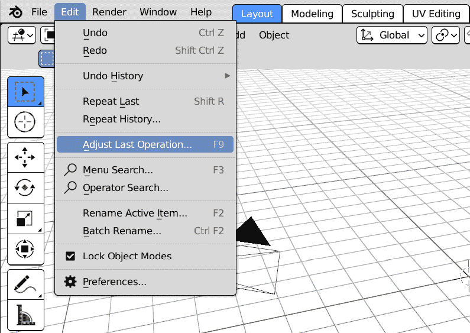

图 7.9：更改最后操作的结果

将出现一个小窗口，显示操作符属性。打开和关闭`use_preview`会改变操作的结果：

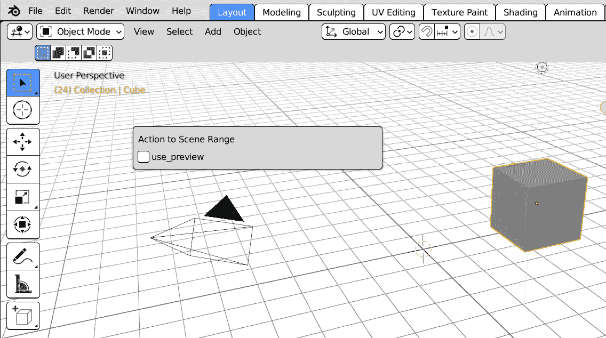

图 7.10：动作到场景范围属性窗口

插件已完成，但当涉及到重新居中`bpy.ops.action.view_all()`，一个时间线操作符时。在`execute`中调用其他操作符是可以的，但它们可能会对上下文的合法性施加额外的限制，因此我们必须考虑它们的`poll`方法可能会停止我们的脚本执行。

例如，通过将我们的操作符添加到需要它的`action.view_all()`中，永远不会失败。

但如果出现`F3` `RuntimeError`：

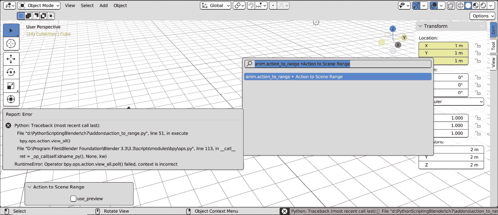

图 7.11：如果时间线未显示，我们的脚本将引发错误

我们可以只是警告用户或在我们的`poll`方法中检查时间线的存在，但通常，最佳实践如下：

+   在调用其他操作符时使用`try`语句

+   如果可能，如果发生`RuntimeError`，为运行其他操作符创建一个替代的`context`。

这样，即使出了问题，我们的操作符也会继续执行其任务。

## 为其他操作符修复上下文

通过使用`try`和`catch`语句，我们可以防止 Python 脚本在出现错误时停止。可能引发错误的代码位于`try`缩进块下，而特定错误发生时执行的代码位于`except` `ErrorType`缩进下。

在我们的案例中，当`RuntimeError`发生时，错误信息被触发：

```py
RuntimeError: Operator bpy.ops.action.view_all.poll() failed, context is incorrect
```

为了解决这个问题，我们必须在`except RuntimeError`块中提供一个备用计划。如果我们不想做任何事情，我们可以使用空的`pass`指令：

```py
try:
    bpy.ops.action.view_all()
except RuntimeError:
    pass
```

但我们可以做得更好：我们可以在窗口中查找时间轴，覆盖`context`，并将其传递给操作符。

在*第五章*中，我们了解到 Blender 窗口被分为`screen`、`areas`和`regions`。从文档中，我们知道时间轴编辑器属于`'DOPESHEET_EDITOR'`类型。

可能会有更多窗口打开。对于每一个，我们可以获取屏幕属性：

```py
    for window in context.window_manager.windows:
        screen = window.screen
```

然后，我们必须在屏幕的`areas`中查找`'DOPESHEET_EDITOR'`：

```py
        for area in screen.areas:
            if area.type != 'DOPESHEET_EDITOR':
                continue
```

通过跳过每个不是`'DOPESHEET_EDITOR'`的区域，我们可以确保以下行只在区域是时间轴时执行。我们需要查找其主区域，它属于`'WINDOW'`类型：

```py
            for region in area.regions:
                if region.type == 'WINDOW':
```

时间轴的`window`、`area`和`region`在`with`语句中传递到`context.temp_override`。

在 Python 中，`with`设置一个在它的作用域内保持有效的条件——即缩进的代码行。在那里，我们可以调用`bpy.ops.action.view_all()`：

```py
                    with context.temp_override(
                                            window=window,
                                            area=area,
                                            region=region):
                        bpy.ops.action.view_all()
                    break
                break
    return {'FINISHED'}
```

两个`break`语句在找到时间轴后停止搜索。我们确保只有在满足条件时才调用`view_all`。

我们通过检查动作帧范围来自动化一项繁琐的操作，而不需要查看它包含的关键帧。为了了解我们如何访问和操作动画数据，接下来，我们将学习如何显示和编辑关键帧。

# 编辑关键帧

动画软件通过视觉提示关键帧分布。在 Blender 中，关键帧在界面中以特殊颜色显示，并在动画编辑器中以菱形小部件显示。

动画属性有彩色背景。如果当前帧是关键帧，则背景为黄色；否则，为绿色：

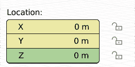

图 7.12：位置被动画化；当前帧是 X 和 Y 的关键帧

选择对象的关键帧在**时间轴**编辑器中以菱形显示：

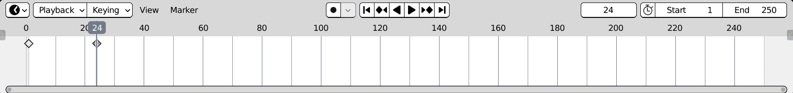

图 7.13：动画时间轴。帧 1 和 24 有关键帧

Blender 通过在两个关键帧之间绘制图表来从一个关键帧过渡到另一个。这些图表被称为**动画曲线**或**f 曲线**。

## 动画曲线和图编辑器

与大多数动画软件一样，Blender 通过在两个动画值之间插入两个或更多关键帧来生成过渡。关键帧包含两个元素——一个时间点和一个属性在该时间点的值。

这些随时间变化的价值在**图编辑器**区域中表示，这是一个坐标系统，其中水平轴是帧号，垂直轴是每帧的动画值：

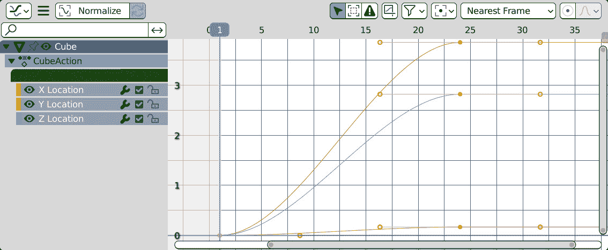

图 7.14：在图编辑器中的时间值作为动画曲线

在帧`1`创建的将属性设置为`0`的关键帧显示为一个坐标为`(``1, 0)`的点。

Blender 在关键帧之间进行插值。关键帧及其邻居之间的过渡是一个**F 曲线**——即连接两个关键帧的平滑连续图。

说他的 F 名！

F 曲线是以波音公司的研究员詹姆斯·弗格森的名字命名的，他在 1964 年发表了一篇名为*多变量曲线插值*的论文。他的插值公式推动了现代计算机图形学的发展。

这样，每个**动画曲线**，或**F 曲线**，都包含动画师设置的关键帧和 Blender 生成的过渡，既作为动画数据的存储，也作为填充它们缺失部分的插值器。

插值可以使用连接点的直线，或者带有切线手柄的曲线线——即**贝塞尔曲线**。

设置**位置**关键帧会为**X**、**Y**和**Z**通道创建曲线。

动画曲线在**图形编辑器**区域中显示。我们可以从任何区域标题左侧的下拉列表中选择**图形编辑器**：

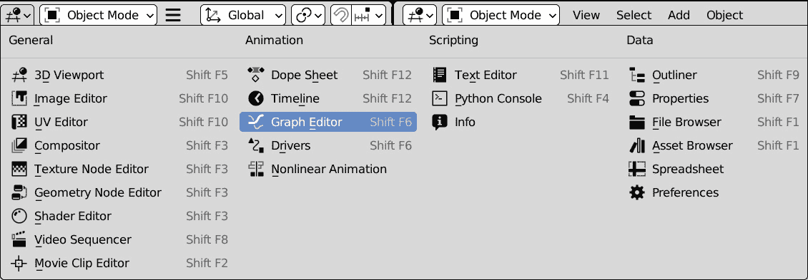

图 7.15：将图形编辑器作为 Blender 区域的内容

动画的 f 曲线存储在**动作**中，它们是动画数据中的顶级容器。

动画数据结构可以总结为**动作** | **F 曲线** | **关键帧**。

通过 Python 遍历这个层次结构的方式不同，我们可以从我们的脚本中检索动画值。

# 在 Python 中访问动画数据

让我们切换到**脚本工作区**区域，以便熟悉动画系统 API。

## 在 Python 中添加关键帧

每个可动画对象的 Python 类都提供了一个我们可以用来插入关键帧的方法，名为`keyframe_insert`。它与指定要动画化的属性的`data_path`字符串非常相似。可选参数如`index`和`frame`允许我们指定一个聚合属性的某个通道或不同于当前帧的帧：

```py
keyframe_insert(data_path,
                index=- 1,
                frame=bpy.context.scene.frame_current,
[…]
Returns
        Success of keyframe insertion.
```

以下行在帧`1`为活动物体的位置设置了`10.0, 10.0, 10.0`的关键帧：

```py
>>> import bpy
>>> bpy.context.object.location = 10.0, 10.0, 10.0
>>> bpy.context.object.keyframe_insert('location', frame=1)
True
```

动画需要随时间变化的值，所以一个关键帧是不够的。我们将在帧 24 设置另一个值：

```py
>>> bpy.context.object.location = -10.0, -10.0, -10.0
>>> bpy.context.object.keyframe_insert('location',frame=24)
True
```

我们只在动画的开始和结束处设置了一个关键帧，但默认情况下，Blender 会在两个相邻关键帧之间生成一个过渡，使得物体在 1 到 24 帧之间的每一帧都会稍微移动一点。

我们的对象从`-10.0, -10.0, -10.0`的`10.0, 10.0, 10.0`坐标开始。

从几何学角度来说，这些坐标标记了立方体的前上角和底左角，意味着运动发生在三维空间的对角线上。

## 在 Python 中检索关键帧

如果活动对象有关键帧，我们可以遍历其 `animation_data`：

```py
>>> bpy.context.object.animation_data
bpy.data.objects['Cube']...AnimData
```

由于 `animation_data` 包含当前动作、所有 f-curves 和关键帧，我们将大量使用此容器。将其存储为变量可能很方便，这样我们可以在收集数据时避免长代码行。以下是获取当前 `action` 的方法：

```py
>>> anim_data = bpy.context.object.animation_data
>>> anim_data.action
bpy.data.actions['CubeAction']
```

从动作中，我们可以检索到动画 `fcurves` 列表：

```py
>>> action = anim_data.action
>>> anim_data.action.fcurves
bpy.data.actions['CubeAction'].fcurves
```

对于每个曲线，我们可以获取动画的 `data_path`。数据路径标识了在 Blender 中属性存储的位置，但某些属性，如 `location`，需要每个通道的动画曲线 – 例如，一个用于 *x*，一个用于 *y*，一个用于 *z* 坐标。因此，f-curves 也具有 `array_index` 属性，一个指定聚合属性动画通道的数字。如果我们动画 `location` 的三个通道并使用 Python 滚动 f-curves，我们将找到三个具有相同路径 `'location'` 的曲线，每个曲线具有不同的索引：

```py
>>> fcurves = anim_data.action.fcurves
>>> for fc in fcurves:
...     print(fc.data_path, fc.array_index)
...
location 0
location 1
location 2
```

每个 `keyframe_point` 在 `co` 属性中存储两个坐标。第一个是帧号，而第二个是该帧的值：

```py
>>> for fc in fcurves:
...     print(fc.data_path, fc.array_index)
...     for kf in fc.keyframe_points:
...        frame, value = kf.co
...        print("\t frame", frame, "value", value)
location 0
    frame 1.0 value 0.0
    frame 24.0 value 0.2
location 1
    frame 1.0 value 0.0
    frame 24.0 value 4.0
location 2
    frame 1.0 value 0.0
    frame 24.0 value 3.0
```

当前的、第一个和最后一个场景帧存储为整数，而 `co[0]` 是一个 `float`。这允许我们在相邻帧之间插入动画（子帧动画）。

曲线插值模式存储在关键帧的 `interpolation` 属性中。最常用的插值如下：

+   `'CONSTANT'`: 无插值

+   `'LINEAR'`: 使用直线插值

+   `'BEZIER'`: 使用带 *handles* 的曲线插值

贝塞尔曲线，以法国工程师皮埃尔·贝塞尔的名字命名，由于它们的平滑和可控行为，在计算机图形学中得到了广泛应用。它们是 Blender 中的默认插值。关键帧与其邻居之间的当前 `interpolation` 存储为关键帧的 `interpolation` 属性：

```py
>>> kf.interpolation
'BEZIER'
```

贝塞尔曲线的点有两个额外的坐标 – 一个左侧手柄和一个右侧手柄，它们都影响插值路径。为了支持曲线插值，Blender 关键帧包含两个额外的坐标，存储为 `handle_left` 和 `handle_right` 属性。与 `co` 属性一样，曲线手柄是二维点：

```py
>>> kf.handle_left
Vector((16.0, 10.0))
>>> kf.handle_right
Vector((31.0, 10.0))
```

Blender 支持其他插值。它们覆盖非常特定的案例，并且在撰写本文时，它们在动画中并不常用。它们以用于其计算的数学函数命名，并在 API 文档中描述，在 [`docs.blender.org/api/3.2/bpy.types.Keyframe.xhtml`](https://docs.blender.org/api/3.2/bpy.types.Keyframe.xhtml) 和 #bpy.types.Keyframe.interpolation：

+   `QUAD`: 二次缓动

+   `CUBIC`: 三次缓动

+   `QUART`: 四次缓动

+   `QUINT`: 五次缓动

+   `SINE`: 正弦缓动（最弱，几乎线性但略有曲率）

+   `EXPO`: 指数缓动（戏剧性）

+   `CIRC`: 圆形缓动（最强且最动态）

+   `BACK`: 带有超调和稳定的立方缓动

+   `BOUNCE`: 指数衰减的抛物线反弹，类似于物体碰撞时的情况

+   `ELASTIC`: 指数衰减的正弦波，类似于弹性带

我们将在本章末尾回到关键帧；在此期间，我们将构建一个基于当前动画持续时间的场景播放设置工具。

在这些示例中，我们的脚本使用现有动画的属性。在下一节中，我们将使用 Python 创建动画。

# 编写 Vert Runner 附加组件

在本节中，我们将编写一个附加组件，该组件将选定的对象沿活动对象的几何形状动画化。动画将追踪连接网格顶点的路径，因此得名*Vert Runner*：

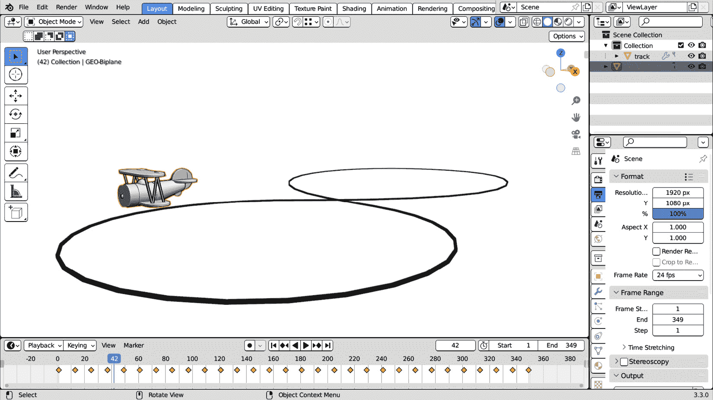

图 7.16：沿着路径顶点动画化玩具

这可以作为程序化行走或巡逻、运动效果或任何其他具有几何路径的情况的基础。

在此操作符中，选定的对象和活动对象被区别对待：活动对象是选定对象移动的参考几何形状。

## 设置环境

让我们从向我们的附加组件目录添加一个新的脚本开始：

1.  在 **VS Code** 中选择 `PythonScriptingBlender/ch7/addons`。

1.  通过点击**新建** **文件**图标创建一个新文件。

1.  将新文件命名为`vert_runner.py`。

1.  双击打开文件。

如同往常，我们将从附加信息开始。

## 编写 Vert Runner 信息

我们的新操作符可以通过选择`位置`信息来调用：

```py
bl_info = {
    "name": "Vert Runner",
    "author": "John Packt",
    "version": (1, 0),
    "blender": (3, 00, 0),
    "location": "Object > Animation > Vert Runner"
    "description": "Run on vertices of the active object",
    "category": "Learning",
}
```

我们将继续进行常规步骤：

1.  编写操作符

1.  编写菜单条目

1.  注册类和接口

## 编写 Vert Runner 操作符

在`import`部分之后，我们必须创建`VertRunner`类及其`bl_*`标识符：

```py
import bpy
class VertRunner(bpy.types.Operator):
    """Run over vertices of the active object"""
    bl_idname = "object.vert_runner"
    bl_label = "Vertex Runner"
    bl_description = "Animate along verts of active object"
    bl_options = {'REGISTER', 'UNDO'}
```

我们使用一个`整数`属性设置每个关键帧之间的距离：

```py
    step: bpy.props.IntProperty(default=12)
```

下一步是编写此操作符的`poll`和`execute`方法。

## 编写操作符方法

我们将根据运行所需操作的需要编写`poll`方法。

### 在 poll()方法中检查的要求

为了在活动对象的几何形状上动画化选定的对象，我们需要以下内容：

+   活动对象

+   网格数据

+   选定的对象

使用这些条件，要使`poll()`方法返回`False`，它们转换为以下内容：

```py
    @classmethod
    def poll(cls, context):
        obj = context.object
        if not obj:
            return False
        if not obj.type == 'MESH':
            return False
        if not len(context.selected_objects) > 1:
            return False
        return True
```

如果没有满足任何`return False`条件，则 poll 成功。在这种情况下，操作符可以运行其 execute 方法。

### 编写 execute() 方法

将操作符的目标分解为步骤，我们应该做以下事情：

1.  获取巡逻点的列表；在这种情况下，活动对象的顶点。

1.  滚动通过选定的对象。

1.  将它们通过巡逻点移动并设置关键帧。

我们首先将活动对象的顶点存储在一个`列表`中：

```py
    def execute(self, context):
        verts = list(context.object.data.vertices)
```

当我们遍历选定的对象时，我们应该确保跳过活动对象，因为它可能被选中：

```py
        for ob in context.selected_objects:
            if ob == context.active_object:
                continue
```

然后，我们必须遍历顶点列表并为每个坐标设置关键帧，从当前帧开始。我们必须在每次迭代中递增 `frame` 数量：

```py
            frame = context.scene.frame_current
            for vert in verts:
                ob.location = vert.co
                ob.keyframe_insert('location', frame=frame)
                frame += self.step
        return {'FINISHED'}
```

当 for 循环结束时，我们必须返回一个 `'FINISHED'` 状态并退出操作员。现在 `VertRunner` 类已经完成，我们可以开始处理其菜单条目。

## 编写菜单和注册函数

由于菜单元素以相反的顺序显示，我们必须首先添加一个 `separator`：

```py
def anim_menu_func(self, context):
    self.layout.separator()
    self.layout.operator(VertRunner.bl_idname,
                         text=VertRunner.bl_label)
```

现在，是时候注册操作员和菜单，以便它可以从界面运行：

```py
def register():
    bpy.utils.register_class(VertRunner)
    bpy.types.VIEW3D_MT_object_animation.append(
                                            anim_menu_func)
def unregister():
    bpy.types.VIEW3D_MT_object_animation.remove(
                                            anim_menu_func)
    bpy.utils.unregister_class(VertRunner)
```

如果我们刷新 **插件** 列表，我们将在 **学习** 类别中看到 **Vert Runner**。启用它将 **Vert Runner** 添加到 **对象** | **动画** 菜单：

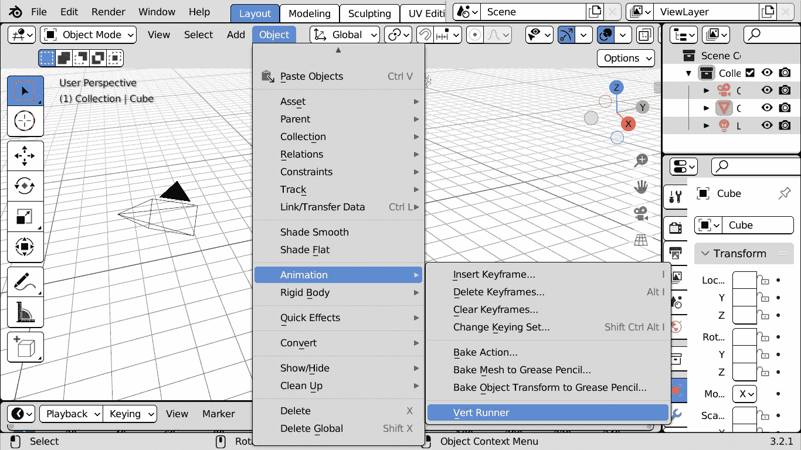

图 7.17：对象 | 动画 | Vert Runner 对选定的对象进行动画处理

在选择至少两个对象后使用 **Vert Runner** 将会沿着活动对象顶点动画化选定的对象。我们可以添加一个选项来使动画循环，并动画化对象的旋转。

## 创建循环动画

有时，我们希望动画的第一帧和最后一帧匹配，这样我们就可以循环观看它——例如，一个角色在圆形中奔跑的无尽剪辑。

在我们的案例中，一个对象穿过网格的所有点，从第一个点开始，以最后一个顶点结束，因此动画的第一帧和最后一帧将不同。

为了创建动画循环，我们需要在通过最后一个顶点后添加一个额外的步骤，回到第一个坐标。

用户必须能够选择他们是否想要循环动画，因此我们将向我们的操作员添加一个选项。`loop` 属性是一个布尔属性——当操作员运行时可以启用和禁用：

```py
class VertRunner(bpy.types.Operator):
    """Run over the vertices of the active object"""
    bl_idname = "object.vert_runner"
    bl_label = "Vert Runner"
    bl_description = "Animate along verts of active object"
    bl_options = {'REGISTER', 'UNDO'}
    step: bpy.props.IntProperty(default=12)
    loop: bpy.props.BoolProperty(default=True)
```

实现非常简单：在 `verts` 的末尾添加其第一个元素的副本，将对象在动画结束时带回到初始位置：

```py
        if self.loop:
            verts.append(verts[0])
```

动画化旋转稍微复杂一些。借助一点数学知识，在每一帧，我们可以将对象朝向其下一个目的地定位。

## 添加旋转

旋转背后的数学知识一开始可能具有挑战性，但因为我们只想围绕对象的 *Z* 轴旋转对象，我们可以使用基本的 **三角学**。

在三角学中，角度可以表示为半径为 1 的圆的弧，因此最大长度等于两倍的 π。字母 π（发音为 pi）是圆与其直径的比例。其近似值是 `3.14`。

三角学是一个包含许多关于角度、线段和旋转之间关系的有用函数的框架。其中有一个函数回答了我们提出的问题——也就是说，我们如何旋转一个对象使其面向一个点？

### 表示旋转弧

想象将一个物体旋转到一个已知的*X*和*Y*坐标点。如果旋转在想象中的圆上画出一个弧线，我们可以将我们点的`y`坐标视为该弧线的*高度*。这个维度被称为该角度的**正弦**，当比较角度和长度时非常有用。

正弦的逆函数称为**反正弦**。它对我们来说很有趣，因为它与正弦相关的旋转。换句话说，如果我们想测量一个角度并且知道它的正弦值，我们可以使用以下表达式来找到旋转：

```py
rotation = arcsin(sine)
```

我们知道正弦，即我们想要观察的点`y`坐标：

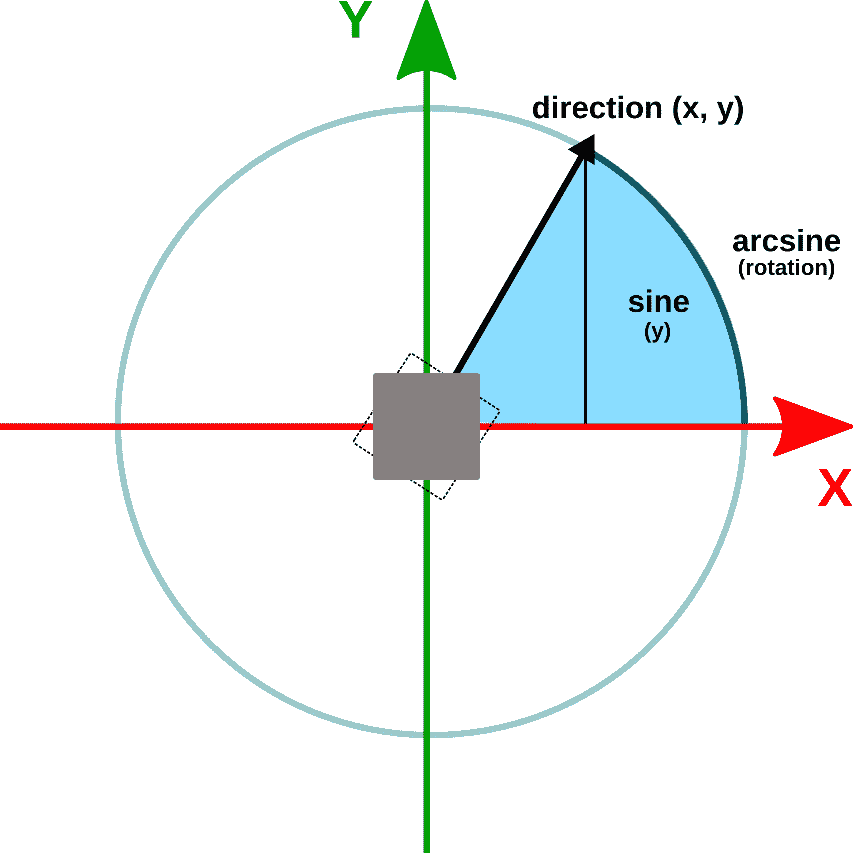

图 7.18：观察旋转的三角表示

因此，*反正弦*是我们正在寻找的三角函数。在 Python 中简写为`asin`，要使用它，我们必须从`math`模块中导入。

### 实现旋转

在三角学中，我们在代码中以`3.14`表示旋转，我们可以从`math`模块中导入`pi`常量。因此，除了`asin`之外，我们还需要`pi`，这样我们的导入部分看起来就像这样：

```py
import bpy
from math import asin
from math import pi
```

我们将编写`VertRunner.aim_to_point`方法来单独处理物体旋转。为此，第一步是从目标坐标中减去当前位置，以便我们可以得到一个方向：

```py
    def aim_to_point(self, ob, point_co):
        """Orient object to look at coordinates"""
        direction = point_co – ob.location
```

然后，我们必须规范化方向，以确保结果不受距离的影响：

```py
        direction.normalize()
```

观察旋转由`asin(direction.y)`返回，但有一个问题：反正弦始终假设它必须覆盖圆的右侧——即`direction.x`的正值。当我们的方向落在另一侧时会发生什么？

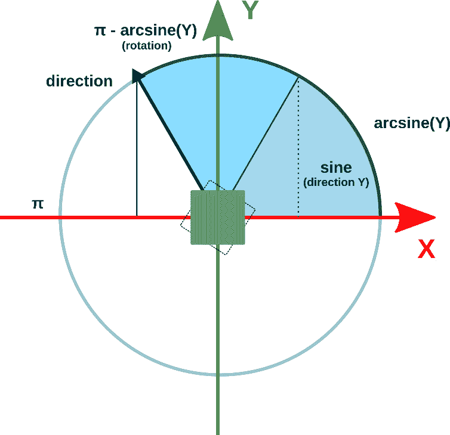

图 7.19：x 值为负时的观察旋转

在那种情况下，我们可以通过从`asin`结果中减去`pi`来到达圆的另一侧，因为`pi`表示单位圆周长的一半：

```py
        arc = asin(direction.y)
        if direction.x < 0:
            arc = pi – arc
```

我们还必须考虑到在 Blender 中，静止的物体看起来与*Y*轴的相反方向，因此我们必须在结果中添加一个顺时针旋转 90 度。

以弧度计，这是`pi / 2`：

```py
        arc += pi / 2
```

到目前为止，`arc`包含了我们正在寻找的旋转。我们可以立即使用它，但还有一个问题：有两种方式可以从一个旋转插值到另一个旋转。

### 寻找最短弧

想象将一个物体从 30°旋转到 330°。最快的方法是通过逆时针旋转，经过 0°并停止在-30°，这相当于 330°。最慢的方法是通过顺时针从 30°旋转到 180°，然后最终旋转到 330°：

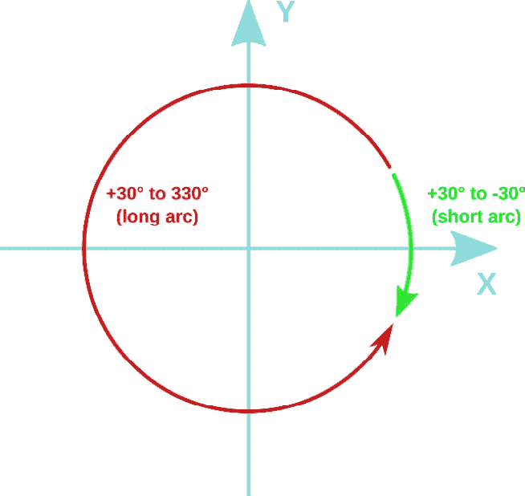

图 7.20：从 30 度到 330 度的旋转的短弧和长弧

这两种都是从 30°到 330°的有效过渡，但我们可能希望选择最短的旋转：否则会导致对象自身旋转。

要找到远离当前旋转的最短弧线，我们必须在元组中存储三个可能性——目标方向、顺时针旋转一周后的相同值以及逆时针旋转后的相同值：

```py
    arcs = (arc, arc + 2*pi, arc - 2*pi)
```

然后，我们必须使用列表推导存储绝对旋转差。从那里，我们可以使用`min`获取最短弧线：

```py
    diffs = [abs(ob.rotation_euler.z - a) for a in arcs]
    shortest = min(diffs)
```

我们必须使用与最小差值相关的弧。将此用作`next`语句的条件，我们可以找到它并将其分配给`rotation_euler.z`：

```py
    res = next(a for i, a in enumerate(arcs)
               if diffs[i] == shortest)
    ob.rotation_euler.z = res
```

现在，我们可以使用`execute`中的`aim_to_point`方法来动画旋转。

### 将所有这些放在一起

`execute`的最终版本只有一点不同。它以相同的方式开始：收集顶点列表，如果我们在动画循环，则再次添加第一个顶点，并跳过活动对象：

```py
  def execute(self, context):
      verts = list(context.object.data.vertices)
      if self.loop:
          verts.append(verts[0])
      for ob in context.selected_objects:
          if ob == context.active_object:
            continue
```

我们的方向方法基于当前对象位置，因此在开始动画之前，我们必须将对象移动到路径的末端：

```py
      ob.location = context.object.data.vertices[-1].co
```

这样，当动画开始时，`aim_to_point`会将对象朝向第一个顶点。现在，我们必须为`rotation_euler.z`插入关键帧，并重复此过程，直到所有点都被到达。之后，我们可以完成执行：

```py
      frame = context.scene.frame_current
      for vert in verts:
          self.aim_to_point(ob, vert.co)
          ob.keyframe_insert('rotation_euler',
                             frame=frame, index=2)
          ob.location = vert.co
          ob.keyframe_insert('location', frame=frame)
          frame += self.step
  return {'FINISHED'}
```

通过在附加组件列表中启用**Vert Runner**或更新脚本（如果已经启用），我们可以在任何一对对象上测试我们的附加组件。

## 使用 Vert Runner

我们可以在每一对对象上使用这个操作符。在 Blender 中可用的实体中有一个独特的条目——一个风格化的**猴子**头，幽默地插入到更常见的形状如**立方体**、**平面**、**球体**等形状之间。由于猴子的头部有一个明显的正面，因此亲切地命名为**苏珊**，这使得旋转更容易可视化，因此用它来测试我们的附加组件是一个自然的选择：

1.  通过从视图菜单栏选择**添加** | **网格** | **猴子**，将猴子头添加到场景中。

1.  将任何其他网格添加到场景中，或者如果默认场景中存在，则使用立方体形状。

1.  按住*Shift*（多选），选择猴子，然后选择用作动画向导的对象。

1.  从视图菜单栏选择**对象** | **动画** | **Vert Runner**。

1.  使用*Alt* + *A*或点击媒体控制按钮播放动画。

立方体将穿过活动对象的每个顶点。速度和循环动画可以在选项中切换。

虽然相对简单，但这个工具可以扩展并生成车辆或甚至关节角色的动作。

动画编程通常是将直观的概念，例如朝向一个方向，转化为数学术语，就像我们在外推旋转时做的那样。此外，我们还研究了几何结构并获取了顶点坐标。

这使我们到达了本章的结尾，我们在这里学习了如何影响动画设置和对象的动画。

# 摘要

在本章中，我们熟悉了对象动画，学习了动画是如何创建和存储的，并查看哪些场景设置与动画系统直接相关。我们还学习了动画可以部分自动化，并从几何角度进行探讨，同时简要了解了旋转角度的三角函数表示。

能够自动化动画过程的一部分是一项宝贵的技能。有时，涉及的数学问题可能会出现并需要解决，但我们不应害怕，因为数学通常为大多数普通用例提供了一套现成的解决方案。

我们刚刚开始我们的生成动画之旅，这将在*第八章*中继续，我们将学习如何通过程序效果丰富动画曲线。

# 问题

1.  动画值是如何存储的？

1.  一个动画曲线能否包含整个矢量属性的关键帧？

1.  动画曲线是如何分组的？

1.  当前帧编号是 1。在不更改该设置的情况下，我们能否使用用户界面在帧 4 插入一个关键帧？

1.  当前帧编号是 1。在不更改该设置的情况下，我们能否使用 Python API 在帧 4 插入一个关键帧？

1.  平滑运动是否需要在每一帧都有关键帧？

1.  关键帧是如何插值的？

1.  有没有更多种方法来插值两个旋转？
