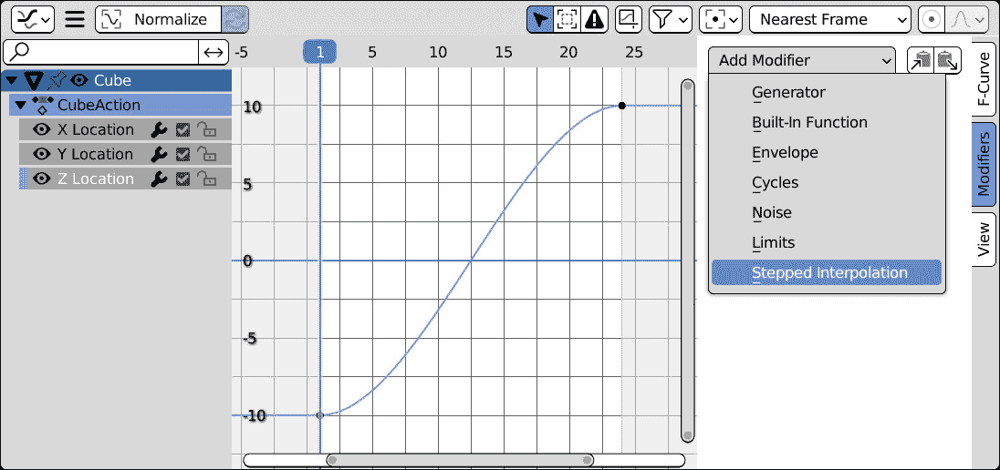
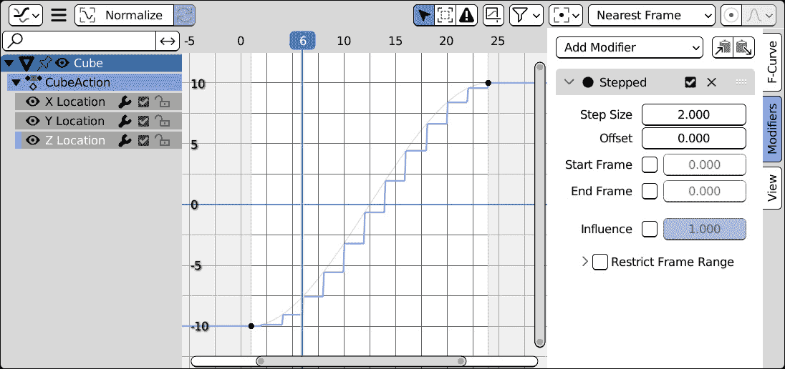

# 8

# 动画修饰符

动画曲线，或 F 曲线，可以通过修饰符进行更改，而无需更改其关键帧。这样，电影或运动效果可以完全替换初始曲线，或添加到其原始值上。

修饰符的输出可以是另一个修饰符的输入，当结合使用时，允许我们在简单动画之上构建复杂的结果。

可以使用 Python 脚本来帮助自动化此过程并简化工作流程。

更改参数会影响修饰符的结果，而其整体**影响**可以通过修饰符界面中的滑块来减少。

在本章中，您将学习如何使用脚本添加修饰符到动画 F 曲线以及如何更改它们的参数。

本章将涵盖以下主题：

+   在 Blender UI 中理解 F 曲线修饰符

+   通过 Python 添加 F 曲线修饰符

+   在我们的插件中使用 F 曲线修饰符

# 技术要求

本章我们将使用 Blender 和 Visual Studio Code。本章创建的示例可以在[`github.com/PacktPublishing/Python-Scripting-in-Blender/tree/main/ch8`](https://github.com/PacktPublishing/Python-Scripting-in-Blender/tree/main/ch8)找到。

# 使用 F 曲线修饰符

动画曲线的修饰符，称为**F 曲线修饰符**或**F 修饰符**，在保留原始数据的同时，为动画添加非破坏性更改。我们在*第四章*中考察了类似的功能，在**对象约束**中，我们学习了如何在不改变对象通道中存储的值的情况下影响对象的位置。

与对象约束类似，F 修饰符通过集合属性暴露给 Python 脚本。

在我们深入探讨如何编写 F 修饰符脚本之前，我们将看看如何在**图形编辑器**中创建它们。

## 在图形编辑器中添加 F 曲线修饰符

现在，我们将探讨如何使用 F 曲线修饰符为动画对象添加变化。

对于本例，我们将使用`ani_loop.blend`场景，来自配套的`PythonScriptingBlender/ch8/_scenes_`文件夹，但您可以使用任何场景。

在`ani_loop.blend`中的*8*字形路径上的动画并非手工创建：它是使用*第七章*中开发的**Vert Runner**插件生成的。

我们将通过在**图形编辑器**中创建 F 曲线修饰符来为动画对象的路径添加一些变化：

1.  选择一个动画对象。

1.  将 UI 区域之一更改为**图形编辑器**。一个好的位置是**动画工作区**中的左侧视图窗口。

1.  在**图形编辑器**的左侧面板中，选择**X****位置**通道。

1.  按*N*键显示属性选项卡。确保**图形编辑器**有焦点并且足够大，否则选项卡将不会显示。

1.  在**图形编辑器**的右侧面板中，选择**修饰符**选项卡。

1.  在**修饰符**选项卡中，从**添加修饰符**菜单中选择一个修饰符。在本例中，我们将使用**步进****插值**修饰符。



图 8.1：在图编辑器中添加曲线修饰符

**Z 位置**的动画曲线变为阶梯图。如果我们现在播放动画，我们会看到物体以小跳跃的方式前进，而不是像之前那样平滑。



图 8.2：在平滑曲线上应用了阶梯修饰符

Blender 手册在 **F 曲线** **修饰符** 页面上详细描述了修饰符：

[docs.blender.org/manual/en/3.2/editors/graph_editor/fcurves/modifiers.xhtml](https://docs.blender.org/manual/en/3.2/editors/graph_editor/fcurves/modifiers.xhtml%0D)

有七种可用的类型。前两种基于数学公式生成曲线：

+   **生成器**：用于直线、抛物线和更高次曲线的表达式

+   **内置**：三角函数和对数公式

其他五个涵盖了基本动画任务：

+   **信封**：控制点用于编辑曲线的整体形状

+   **循环**：在动画的最后帧之后循环重复动画

+   **噪声**：向动画添加随机抖动

+   **限制**：将动画值限制在一个范围内

+   **阶梯插值**：将平滑动画转换为颠簸运动

与约束一样，F 曲线的修饰符作为集合暴露给 Python。我们可以使用 `fcurve.modifiers.new` 方法通过脚本添加新的修饰符。

## 在 Python 中添加 F 曲线修饰符

`fcurve.modifiers.new(type)` 方法根据提供的参数类型创建一个新的修饰符。它返回新的修饰符。

除了 `FNGENERATOR` 和 `STEPPED` 之外，给定类型的修饰符使用大写字母的类型名称创建：

```py
type (enum in ['GENERATOR', 'FNGENERATOR', 'ENVELOPE', 'CYCLES', 'NOISE', 'LIMITS', 'STEPPED'])
```

因此，要向 `2` 添加一个 `'STEPPED'` 修饰符，我们使用以下方法：

```py
>>> import bpy
>>> anim_data = bpy.context.object.animation_data
>>> m = anim_data.action.fcurves[2].modifiers.new('STEPPED')
```

同样，可以使用 `fcurve.modifiers.remove` 方法移除修饰符。这次，必须使用修饰符的 Python 实例作为参数：

```py
>>> anim_data.action.fcurves[2].modifiers.remove(m)
```

现在我们已经了解了 F 修饰符的位置、工作原理以及如何在用户界面和 Python 控制台中添加更多修饰符，我们可以在脚本中使用这些知识。

我们将在下一节中编写的插件允许我们使用 F 修饰符创建摇晃动画。

# 编写 Shaker 插件

**Shaker** 插件通过向动画曲线添加噪声修饰符，在活动物体上创建摇晃效果。

有时候我们想在运动中添加一些摇晃。例如，导演经常使用 *相机摇晃* 来暗示物体被撞击或击中。另一个用例是车辆在崎岖路面上的运动，或者在风中飘动的毛发和羽毛。我们将编写的 Python 脚本将包含一个操作符和一个菜单函数，以便快速执行。

## 设置环境

我们首先为我们的插件创建一个 Python 脚本：

1.  创建 `PythonScriptingBlender/ch8/addons` 文件夹。我们可以使用文件管理器或代码编辑器的**文件**选项卡，例如**VS Code**。

1.  在该文件夹中创建一个新文件，并将其命名为 `object_shaker.py`。我们可以使用文件管理器或代码编辑器的**新建文件**按钮。

1.  使用您选择的编辑器打开文件。

1.  在 Blender 的 **文件** **路径** 首选项中设置 `PythonScriptingBlender/ch8`。

现在，我们将像往常一样开始编写插件代码。

## 编写 Shaker 插件信息

我们将在插件信息中添加我们的新操作符，`location` 属性：

```py
bl_info = {
    "name": "Object Shaker",
    "author": "Packt Man",
    "version": (1, 0),
    "blender": (3, 00, 0),
    "description": "Add Shaky motion to active object",
    "location": "Object Right Click -> Add Object Shake",
    "category": "Learning",
}
```

## 编写 Add Object Shake 操作符类

我们导入 `bpy` 模块，然后编写 `Object Shaker` 的 `bl_*` 标识符：

```py
import bpy
class ObjectShaker(bpy.types.Operator):
    """Set Playback range to current action Start/End"""
    bl_idname = "object.shaker_animation"
    bl_label = "Add Object Shake"
    bl_description = "Add Shake Motion to Active Object"
    bl_options = {'REGISTER', 'UNDO'}
```

此操作符需要两个浮点参数：

+   噪声 `duration` 以秒为单位

+   噪声 `strength`，即此修改器对动画的贡献程度

`duration` 应该是一个正数：不存在负时间量这样的东西。因此，我们将属性最小值设置为 `0.0`。另一方面，摇动的量可能从 `0.0` 或 `1.0` 以下的值中受益。这是一种更特殊的情况，我们仍然希望将值的范围从 `0.0` 到 `1.0` 设置为普通条件，但我们不希望阻止用户超出这些限制。我们可以设置适用于滑块的限制，但使用 `soft_min` 和 `soft_max` 参数接受超出范围的数值输入。

### 为属性添加限制和软限制

通常，修改器的强度或`influence`应该在 `0.0` 和 `1.0` 之间（分别表示没有影响和完全影响），但使用该范围之外的值会产生乘法效果。例如，`2.0` 的影响将使修改器的贡献加倍。

对于 Blender 属性的软限制在这种情况下很有用：`min`、`max`、`soft_min` 和 `soft_max` 限制界面中滑块的值域，但 `min` 和 `max` 从不接受超出其范围的任何数字，而 `soft_min` 和 `soft_max` 允许用户使用键盘点击滑块并输入他们想要的任何值。

超过初始 `soft_min` 和 `soft_max` 参数的值被视为有效输入，并成为滑块的新范围：

```py
    duration: bpy.props.FloatProperty(default=1.0, min=0)
    strenght: bpy.props.FloatProperty(default=1.0,
                                      soft_min=0,
                                      soft_max=1.0)
```

现在，我们可以编写用于验证条件的 `poll` 方法以及用于执行添加噪声动作的 `execute` 方法。

## 编写操作符方法

除了常用的 `poll` 和 `execute` 方法外，我们还将编写一个用于查找给定属性 F-Curve 的实用函数。

### 编写 poll 方法

`poll` 方法的条件非常简单——如果存在活动对象，则可以调用操作符：

```py
    @classmethod
    def poll(cls, context):
        return bool(context.object)
```

我们需要一个动画属性来添加噪声修改器。如果它已经动画化，我们选择现有的动画曲线，否则，我们创建一个新的。这个操作可以作为一个单独的函数实现，命名为 `get_fcurve`，它接受 `data_path` 作为参数并返回其动画曲线。如果它还不存在，它将创建一个新的曲线。

### 编写 get_fcurve 方法

我们将查找或创建属性动画曲线的任务委托给`get_fcurve`函数。由于它将由`ObjectShaker`操作符单独使用，所以我们将其编写为一个类方法，`self`作为其第一个参数。我们可能希望对多个属性和对象使用它，所以我们还传递要检查的对象以及要动画化的属性的`data_path`。在矢量属性的情况下，我们还传递`index`组件。我们使用`obj`而不是`object`作为参数名称，因为后者代表 Python 的基本类，我们不想覆盖这个术语。

从*第七章*我们知道，F-Curves 属于动作，并且我们的操作符向当前动作添加噪声，因此这个函数将查找对象动画数据中的`action`属性。在我们运行`get_fcurve`之前，我们应该确保存在这样的动作，因此，按照在*第六章*学到的*防御性编程*实践，我们使用`assert`来停止脚本，如果由于不可预见的原因找不到当前动作：

```py
    def get_fcurve(self, obj, data_path, index):
        """Returns F-Curve of given data_path/index"""
        action = obj.animation_data.action
        assert action
```

现在我们需要返回由参数提供的`data_path`实例所动画化的 F-Curve，如果它不存在则创建它。我们可以尝试使用`try`来创建它，这是在*第三章*的*改进我们的代码*部分学到的语句。

尝试创建具有相同路径的两个 F-Curves 会导致`RuntimeError`错误，在`try`语句中，这会触发`except`子句。通过只在需要时查找现有曲线，我们的代码将更加精简，并且稍微快一点。

在`except`语句下，我们对一个条件*迭代器*使用`next`函数，即满足我们标准的一系列对象，在这种情况下，是一个匹配的`data_path`和`index`：

```py
        try:
            crv = action.fcurves.new(data_path,index=index)
        except RuntimeError:
            crv = next(fc for fc in action.fcurves
                       if fc.data_path == data_path and
                          fc.array_index == index)
```

在任何情况下，我们都会得到包含我们正在寻找的 F-Curve 的`crv`变量。我们本可以使用`for`循环来迭代`action.fcurves`，但`next`函数提供了一个有效且紧凑的替代方案。

#### 高效地滚动集合

`next`函数返回序列的第一个有效元素。例如，输入`next(action.fcurves)`简单地给出动作的第一个曲线。`next`的参数可以是任何迭代器，而不仅仅是列表或集合。由于迭代器可以包含条件语句，如`if`，因此`next`可以是一个简洁且高效的`for`循环的替代方案。

当`fc for fc in action.fcurves`滚动`fcurves`的所有元素时，对`fc.data_path`和`fc.array_index`的条件确保返回符合那些要求的第一条曲线。

如果找不到曲线，`next`将因`StopIteration`错误而失败，但我们知道这种情况不会发生：一个现有的曲线最初就带我们进入了这个`try`语句的`except`块。所以，无论是在`try`块下还是在`except`块下，`crv`变量现在包含我们正在寻找的 F-Curve。在我们向它添加修饰符之前，我们必须确保它至少包含一个关键帧。

#### 确保存在关键帧

在这一点上，我们已经将动画曲线存储在`crv`变量中，但我们必须寻找其关键帧点，否则它将不会被评估。如果`keyframe_points`集合为空，我们将通过使用`keyframe_points.insert`向其中添加关键帧。我们将使用当前帧和值作为参数：

```py
        if not crv.keyframe_points:
            crv.keyframe_points.insert(
                         frame=context.scene.frame_current,
                         value=getattr(obj,
                                       data_path)[index])
```

现在我们已经有一个动画曲线，并且它保证支持修饰符，我们可以返回`crv`变量并退出`get_fcurve`函数：

```py
        return crv
```

这个函数将在`execute`方法中被调用，这是操作符的最后一块缺失的拼图。

### 编写`execute`方法

如果我们的对象尚未被动画化，我们创建新的`animation_data`，否则，我们将现有数据存储在`anim`变量中：

```py
    def execute(self, context):
        if not context.object.animation_data:
            anim = context.object.animation_data_create()
        else:
            anim = context.object.animation_data
```

同样，如果还没有创建新的动作，我们应该创建一个新的动作，或者获取当前的其中一个。在两种情况下，它都将被存储在`action`变量中：

```py
        if not anim.action:
            action = bpy.data.actions.new('ShakeMotion')
            anim.action = action
        else:
            action = anim_data.action
```

现在，是时候添加一些摇动动作了。首先，我们需要以帧为单位表达效果的持续时间，而不是以秒为单位。要做到这一点，我们需要将`duration`参数乘以场景的每秒帧数。一旦我们有了帧的持续时间，我们将它除以二，以便将对象摇动中心对准当前帧；一半的帧将在它之前播放，而另一半将在之后播放：

```py
        fps = context.scene.render.fps
        duration_frames = self.duration * fps / 2
        current = context.scene.frame_current
        start = current – duration_frames
        end = current + duration_frames
```

下一步是寻找我们想要修改的动画曲线：`location` Z，`rotation_euler` X，和`rotation_euler` Y。我们需要这些特定的曲线，因为它们分别代表了相机的上下摇动、偏航摇动和俯仰摇动。

如果它们不存在，我们的`get_fcurve`方法将创建并返回它们：

```py
        z_loc_crv = self.get_fcurve(context,
                                    'location',
                                    index=2)
        x_rot_crv = self.get_fcurve(context,
                                    'rotation_euler',
                                    index=0)
        y_rot_crv = self.get_fcurve(context,
                                    'rotation_euler',
                                    index=1)
```

由于 F-Modifiers 是针对每个曲线特定的，我们为每个曲线创建一个`NOISE`修饰符。我们使用一个`for`循环一次性创建所有三个。噪声`strength`值，一个浮点属性，可以直接从操作符的`strength`参数设置，而我们在之前已经计算了噪声的`start`和`end`值：

```py
        for crv in z_loc_crv, y_rot_crv, x_rot_crv:
            noise = crv.modifiers.new('NOISE')
            noise.strength = self.strenght
            noise.use_restricted_range = True
            noise.frame_start = start
            noise.frame_end = end
        return {'FINISHED'}
```

我们已经将`use_restricted_range`设置为开启，以限制`start`和`end`帧中的噪声：否则，`frame_start`和`frame_end`属性将没有效果。一旦我们为三个曲线设置了 F-Modifiers，我们就可以最终退出该方法。

现在我们已经完成了操作符，我们可以向界面添加一个菜单项，以及`register`/`unregister`函数。

## 添加菜单项

正如我们在编写接口时所学到的，一个菜单函数将`self`和`context`作为参数。

在菜单函数内部，我们向`self.layout`添加一个分隔符和`ObjectShaker`操作符：

```py
def m_items(self, context):
    self.layout.separator()
    self.layout.operator(ObjectShaker.bl_idname)
```

这个功能可以添加到任何菜单中，但由于我们的操作员影响对象变换的动画，我们可以使用在**对象模式**中由视口显示的右键菜单。

## 查找上下文菜单的类名

API 文档不包含所有菜单的列表。我们可以在`bpy.types`中查找它们，它包含所有 Blender 类，并记住我们正在寻找的类名以`VIEW3D_MT`开头并以`_context_menu`结尾。

我们可以在*列表推导*中使用这些标准，即由方括号分隔的类似列表的对象，就像我们在本节前面遇到的`next`函数一样，它是由条件迭代器构建的。我们可以在 Blender 的**Python 控制台**中运行它：

```py
>>> [c for c in dir(bpy.types) if
     c.endswith('context_menu')]
```

在列出的上下文菜单中，我们找到了`VIEW3D_MT_object_context_menu`：

```py
['ASSETBROWSER_MT_context_menu',
...
['VIEW3D_MT_edit_metaball_context_menu', 'VIEW3D_MT_gpencil_edit_context_menu', 'VIEW3D_MT_object_context_menu', 'VIEW3D_MT_particle_context_menu',
...
```

在返回匹配`context_menu`后缀的结果时，我们的列表推导几乎就像一个小型搜索引擎。为了进一步过滤结果，我们可以添加一个`"object"`字符串作为要求，以过滤输出到一个结果：

```py
[c for c in dir(bpy.types)if c.endswith('context_menu')
                          and 'object' in c]
```

这个列表推导将结果缩小到仅对象上下文菜单：

```py
>>> [c for c in dir(bpy.types)if c.endswith('context_menu')
...                           and 'object' in c]
['VIEW3D_MT_object_context_menu']
```

现在我们知道了要使用哪个菜单类，我们就可以继续注册这个插件了。

## 注册 Shaker 插件

启用插件会产生这两个结果：

+   将`ObjectShaker`类添加到 Blender 中

+   将`m_items`函数添加到对象的右键菜单中

这些任务都在`register`函数中发生：

```py
def register():
    bpy.utils.register_class(ObjectShaker)
    bpy.types.VIEW3D_MT_object_context_menu.append(m_items)
```

按照相同的逻辑，当插件禁用时，其代码将从 Blender 中清除，此时应该从菜单中删除`m_items`，从已注册的类中删除`ObjectShaker`。未能这样做会在 Blender 中留下孤儿实体。`unregister`函数负责处理这一点：

```py
def unregister():
    bpy.types.VIEW3D_MT_object_context_menu.remove(m_items)
    bpy.utils.unregister_class(ObjectShaker)
```

我们可以使用**刷新**按钮在**插件**首选项中刷新插件，并从**学习**类别中启用**Object Shaker**。当插件启用时，**添加对象震动**选项将出现在指定对象的右键菜单中。

## 使用 Shaker 插件

使用我们的插件，我们可以通过以下步骤为任何对象添加震动动作：

1.  使对象激活。

1.  右键点击（或者在**首选项** | **快捷键**中将**使用鼠标按钮选择**设置为**右键**时按`W`）。

1.  从菜单中选择**添加对象震动**。

1.  在**执行**面板中调整**持续时间**和**强度**值。

就像在*第七章*中提到的**Action Range 插件**一样，所选的**持续时间**和**强度**可以在执行后使用**编辑** | **调整最后操作**从顶部栏进行更改。

我们创建了一个工具，它使用动画修改器为对象添加了程序化行为。这在用 Python 进行动画时是一个非常有价值的快捷方式。此外，它还向我们介绍了非破坏性修改器的概念，即添加可以随意删除或编辑的参数化更改。

# 概述

我们已经学会了如何为我们的场景创建动画效果，并看到了如何将一个想法转化为程序化工具。艺术家和技术动画师可以提出复杂的概念配置，我们可以根据本章概述的过程将其转化为快速设置的操作员。

使用动画系统是实现参数化行为的一种便捷方式，因为它依赖于应用程序的更新逻辑，并产生快速、可靠的输出。

我们将在*第九章*中探索一个类似但更强大的技术，从而完成我们对动画系统的概述。

# 问题

1.  我们所说的非破坏性修改器是什么意思？

1.  修改器会改变曲线的关键帧点吗？

1.  我们能否将动画修改器添加到非动画对象中？

1.  我们如何确保一个属性是动画化的？

1.  参数软限制是什么？

1.  在哪些情况下我们使用软限制而不是强限制？

1.  我们如何在 Python 中查找类名？
