# 9

# 动画驱动器

**驱动器**是一个控制属性值的函数。它可以以其他属性的值作为输入，从而在两个或多个属性之间建立连接。例如，一个驱动器可能会根据另一个物体的旋转设置物体的*X*位置。

驱动器与动画类似，它们共享更新系统和 f-curve 数据，但更加灵活，并且可以与 Python 结合创建自定义设置。

它们是技术动画的重要组成部分，用于创建简单的控制或复杂的机械。驱动器没有特定的用途：它们被设计来创建自定义行为。因此，它们在绑定中无处不在，有助于连接属性，甚至在不同类型的实体之间，如物体和着色器。

在本章中，你将学习如何轻松创建和测试你的 Python 驱动器，以及如何脚本它们的创建。除了帮助自动化绑定机制外，这些知识还将使你更容易理解公式并在 Blender 中实现它们。

本章将涵盖以下主题：

+   创建驱动器

+   在驱动器中使用 Python 表达式

+   脚本数学公式

+   自动化驱动器设置

# 技术要求

在本章中，我们将使用 Blender 和**Visual Studio Code**，但任何 IDE 都可以。本章创建的示例可以在[`github.com/PacktPublishing/Python-Scripting-in-Blender/tree/main/ch9`](https://github.com/PacktPublishing/Python-Scripting-in-Blender/tree/main/ch9)找到。

# 创建驱动器

创建驱动器的步骤与创建动画的步骤非常相似。虽然动画时间是动画曲线的唯一输入，但驱动器可以依赖于以下一个或多个：

+   Python 表达式的结果

+   任何可以动画化的属性

+   物体的变换通道

+   物体之间旋转的差异

+   物体之间的距离

当我们创建一个驱动器时，我们必须指定至少一个输入。在本节中，我们将学习如何通过创建新的驱动器并使用用户界面来设置一个简单的轮子。

## 通过右键菜单创建快速驱动器

创建驱动器有一些快捷方式。

让我们通过一个例子来了解这些快捷方式。假设为了动画化一个轮子，我们想让一个物体的**位置 Y**驱动其**旋转 X**通道。我们可以为 Blender 的默认立方体设置这个：

1.  打开 Blender 或通过**文件** | **新建** | **通用**返回默认场景。

1.  选择默认的**立方体**使其变为活动状态。

1.  按*N*显示变换属性。

**位置 Y**是我们的输入。我们不会寻找它的数据路径，而是将其复制到剪贴板：

1.  右键点击**位置 Y**以显示**Y:** 菜单。

1.  从菜单中选择**复制为** **新驱动器**。

驱动器尚不存在，因此我们必须为我们要影响的属性创建它：

1.  右键点击**旋转 X**以显示**X:** 菜单。

1.  从菜单中选择 **粘贴驱动器**。

**旋转 X** 通道将呈现紫色，这是用于驱动属性的颜色。沿着立方体的 **Y** 轴移动 **立方体** 对象也会使其滚动：

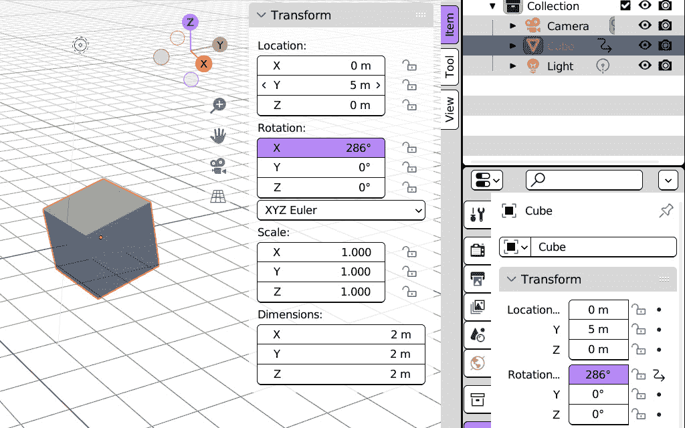

图 9.1：Y 位置驱动 X 旋转

使用 `5` 弧度的驱动器相当于大约 `286` 度的旋转，正如我们在 *图 9**.1* 中可以看到的值所反映的那样。

将 **旋转单位** 切换到 **弧度**，如图 *图 9**.2* 所示，使 **位置 Y** 和 **旋转** **X** 之间的一对一关系变得明显：

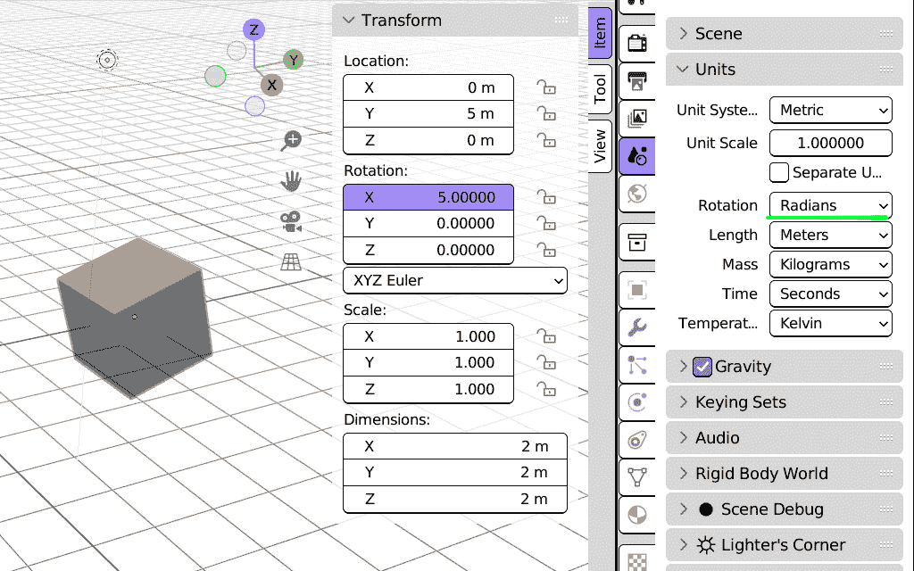

图 9.2：位置 X 和旋转 X 使用弧度显示相同的值

即使立方体在移动时滚动，它看起来也不像轮子：轮子是向相反方向旋转的。我们可以使用 **驱动器** **编辑器** 区域来设置这一点。

## 使用驱动器编辑器设置轮子

在 **驱动器编辑器** 区域，我们可以显示和编辑场景中存在的对象的驱动器。可以通过以下步骤打开：

1.  右键单击一个 **驱动属性**。

1.  选择 **打开** **驱动器编辑器**。

它与我们在 *第七章* 的第一 *部分* 中查看的 **图形编辑器** 区域非常相似，但它显示的是驱动器而不是动画曲线：

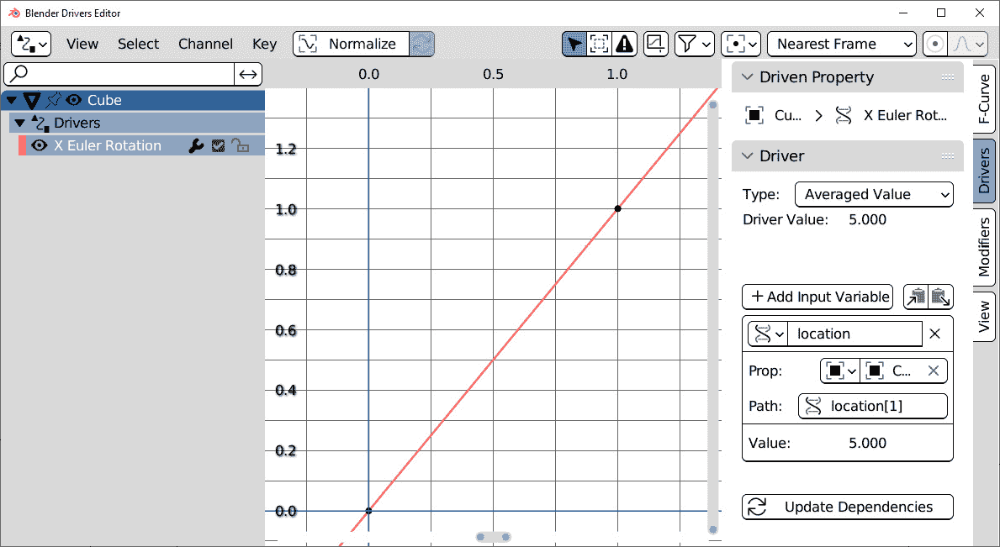

图 9.3：驱动器编辑器区域中的驱动器 f 曲线

我们可以通过从 **驱动器编辑器** 菜单栏选择 **视图** | **全部帧** 或按键盘上的 *Home* 键来选择更好地查看曲线。

默认的驱动器 f 曲线是正笛卡尔平面的对角线，控制点位于坐标 (`0.0`, `0.0`) 和 (`1.0`, `1.0`)。我们可以看到曲线的结果，显示在 `5.0`，与 **位置** 输入变量的相同值。

由于轮子的旋转方向与其运动方向相反，我们需要通过改变曲线来反转这个结果。为此，请按照以下步骤操作：

1.  在 **驱动器编辑器** 属性中，选择 **F 曲线** 选项卡。

1.  通过左键单击选择 f 曲线的右上角点。

1.  在 `1.0` 到 `-1.0`：

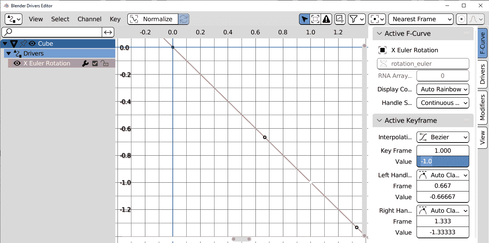

图 9.4：驱动器的 f 曲线指向下方

现在，将立方体沿其 **Y** 轴移动，使其向正确的方向滚动。如果你仔细观察，会发现仍然有问题：这个驱动器滚动得稍微慢了一些。

大小为 1 的圆的周长与其在一圈内覆盖的长度之比是 π，即数学常数 π，大约为 3.14。

那个距离只需要半个圆周就能到达一个直径是轮子两倍的轮子，就像我们默认的 `2` x `2` x `2` 大小的立方体，所以在 `1.571` 中输入 `pi/2`，一个略快于 `1` 的乘数。现在，将立方体沿其 **Y**-轴移动，它就像轮子一样滚动，尽管是正方形的。

我们使用除法得到那个结果，但也可以在驱动器中使用 Python 公式。我们也可以仅通过输入一个公式来创建驱动器。

## 在属性中创建驱动表达式

可以通过在属性字段中输入一个哈希符号 (`#`) 创建一种不同类型的驱动器，它依赖于 Python 数学公式。以下是创建驱动表达式步骤：

1.  打开 Blender 或通过 **文件** | **新建** | **通用** 返回默认场景。

1.  选择默认的立方体以使其处于活动状态。

1.  左键单击 `rotation_euler.x` 属性以编辑其值。

1.  输入 `#sin(frame)` 并按 *Enter* 键：

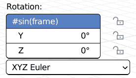

图 9.5：在对象属性中输入 Python 表达式

我们刚刚编写的表达式已经生效。如果我们通过按 **媒体控制** 区域中的三角形 **播放** 按钮或使用 *Alt* + *A* 来开始播放，立方体将在其 **X**-轴上快速抖动。

`sin(frame)` 表达式依赖于时间，就像动画一样，但每帧的值是 Python 指令的输出，我们可以用它来获得更复杂的结果。

在下一节中，我们将结合 `frame` 变量、`sin` 函数和驱动输入来创建一个程序化、参数化的摆动动画。

我们不想要结果！

省略 `#` 符号将设置表达式的结果而不是创建一个驱动器。输入 `frame` 将属性设置为当前帧的数值，例如 `1` 或 `24`。如果我们输入 `#frame`，值将随着动画的播放而改变。

# 驾驶循环运动

摆锤是从固定点悬挂的重量，可以自由来回摆动。它在时间、重力和地理测量中有许多实际应用，而在 3D 中，振荡运动用于显示时钟机构、悬挂道具和其他循环运动。三角函数 **正弦** 通常用于模拟这种运动。

来自 `math` 模块的 `sin` 函数是 Python 语法中的 *正弦*。我们在 *第七章* 中遇到了 *正弦*，我们使用它的反函数，*反正弦*，通过 Python 定位对象。正弦是一个周期性波函数——它在固定间隔内重复：

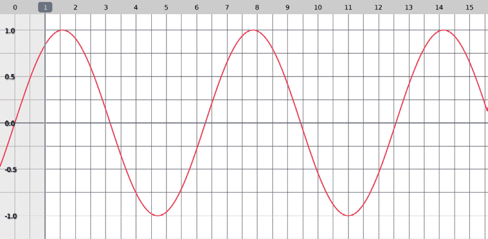

图 9.6：正弦函数

播放动画会使立方体非常快速地抖动。为了减慢它，我们可以点击 **驱动属性** 并给公式一个更慢的速度。

例如，我们可以将其更改为 `sin(frame/10)`，这将使速度减慢十倍。现在，立方体轻轻摇晃。我们可以做得更好，并为适当的摆动设置一个旋转支点。

## 通过约束更改旋转枢轴

影响对象枢轴的最简单方法是通过使用**约束**。我们在*第四章*中遇到了约束，并使用它们在不改变对象的变换属性的情况下改变对象的位置。这次，我们将使用**枢轴约束**来改变旋转中心。

### 在 Blender 中添加枢轴约束

**枢轴约束**将对象的旋转中心移动到另一个对象的位置或特定的坐标。我们将使用一个**空对象**，这是一个不包含任何几何形状的 Blender 对象：

1.  通过从**3D 视图**区域选择**添加** | **空对象** | **平面坐标轴**将一个空对象添加到场景中。这个对象将成为新的旋转枢轴。

1.  将这个**空对象**移动到**立方体**对象上方，使其可以作为悬挂点。

现在，我们可以创建约束：

1.  选择**立方体**对象，并在属性中的**约束**选项卡中找到它。它有一个连接杆的图标。

1.  从**添加对象约束**下拉菜单中选择**枢轴**。将创建一个新的约束：

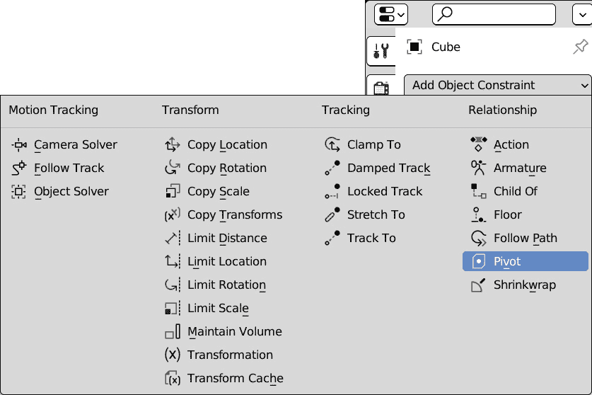

图 9.7：创建枢轴约束

1.  在**枢轴约束**面板中点击**目标**字段，并在对象列表中选择**空对象**。

1.  现在，点击**旋转范围**属性并将其更改为**始终**，以便所有方向的旋转都会受到影响。

如果我们播放动画，立方体会左右摆动：


图 9.8：枢轴约束改变立方体对象的旋转中心

它开始看起来像是一个摆锤，但摆动的速度应该取决于绳子的长度，而这在我们的公式中并没有考虑。为了改进我们的驱动程序，我们必须了解正弦函数的工作原理以及如何控制其周期。然后，我们必须研究摆的物理，并编写一个考虑绳子长度的表达式。

## 控制正弦函数的周期

为了更好地控制正弦周期，我们需要观察其图形，如图*图 9**.9*所示。它在帧`0`时值为`0`，在帧`1`和`2`之间上升后，在帧`3`之后稍微回到零：

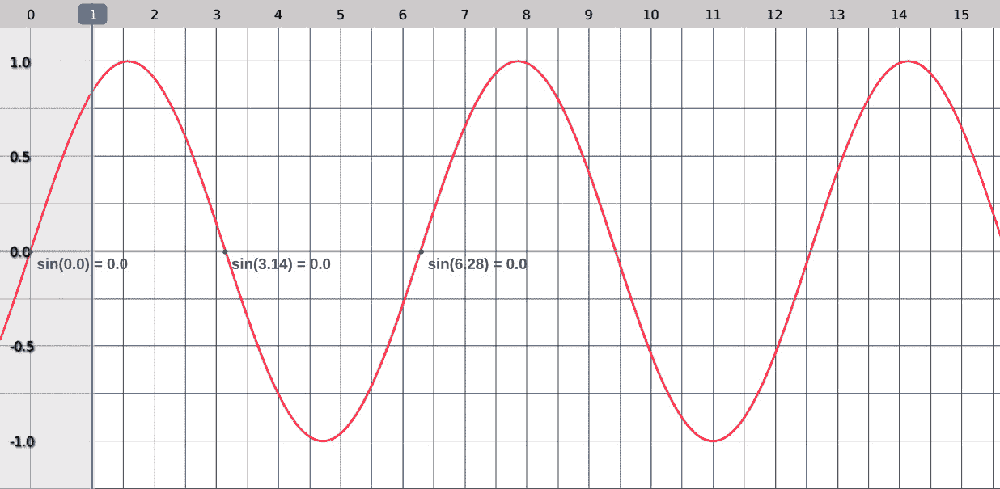

图 9.9：正弦函数

这是因为正弦，一个与角度相关的函数，依赖于数学常数π，其值在`3.14`、`6.28`等点为零。角度与圆之间的关系是由于角度如何描述圆弧。

如果正弦函数在每个完整圆周上重复，并且一个完整圆周为 2 * π弧度，那么我们可以说`sin(frame)`公式的周期是`2 *` `pi`帧。

通过将`2 * pi`作为`sin`函数的参数，我们得到一个周期正好为一帧的公式：

```py
sin(frame * 2 * pi)
```

这个公式的结果始终是`0`，但这比看起来更有用：将`frame * 2 * pi`除以特定的帧数，我们可以设置公式重复所需的时间——也就是说，我们现在可以控制周期。

例如，以下公式的结果每 10 帧重复一次：

```py
sin(frame * 2 * pi / 10)
```

现在，我们可以查找摆动公式并设置一个物理上正确的振荡。

## 实现摆动方程

根据维基百科([en.wikipedia.org/wiki/Pendulum](https://en.wikipedia.org/wiki/Pendulum))，摆动的周期取决于其绳索的长度，并使用以下公式进行近似：

*2π√(L/g)*

它读取`2`乘以`pi`乘以`length`除以`gravity`。在 Python 中，它看起来如下：

```py
2 * pi * sqrt(length / 9.8)
```

在这里，`sqrt`是平方根运算，`9.8`是按照**国际单位制**(**SI**)的地球重力。在这个系统中，时间单位是秒，因此我们需要在我们的驱动程序中用秒来表示公式。

在一帧中重复`sin`的表达式如下：

```py
sin(frame * 2 * pi)
```

由于我们需要以秒为单位应用周期，我们将该表达式除以每秒帧数：

```py
sin(frame/fps * 2 * pi)
```

这将我们的表达式减速到 1 秒的周期。

我们的目标是得到`2 * pi * sqrt(length / 9.8)`秒的周期，因此我们将`sin`的参数除以这个值。

除法后，我们得到一个关于两个变量`fps`和`length`的函数：

```py
sin((frame / fps) * length/9.8)))
```

`2 * pi / 2 *pi`的值是`1`，可以从乘法中删除。现在，我们的公式看起来好多了：

```py
sin(frame / fps / sqrt(length/9.8))
```

在**旋转 X**中输入它创建一个*驱动程序*：

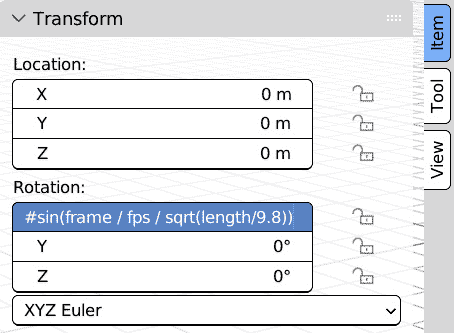

图 9.10：摆动公式的实现

尽管如此，驱动程序还不能工作——`frame`变量已经被 Blender 定义，但`length`和`fps`不存在并导致错误。我们需要将这些两个变量添加到驱动程序属性中。

### 向驱动程序添加变量

我们可以在本章*创建驱动程序*部分的**驱动程序编辑器**区域执行此操作，但由于我们不需要编辑*f-curve*，我们可以使用一个更简单的界面。

#### 显示驱动属性窗口

**驱动属性**窗口显示单个驱动程序的详细信息。它访问快捷，其内容与**驱动程序**区域中的**驱动程序**标签页相同。

显示和编辑驱动属性的步骤如下：

1.  右键单击一个驱动属性。

1.  从上下文菜单中选择**编辑驱动程序**。

**驱动属性**窗口总结了受影响属性的路径，它是哪种类型的驱动，如果驱动程序有错误，以及创建了哪些变量：

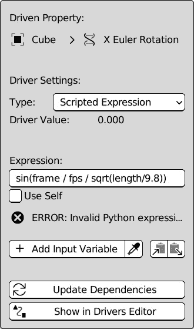

图 9.11：脚本表达式驱动程序的性质

在这个阶段，驱动类型将被设置为**脚本表达式**；**表达式**字段包含我们的摆动公式，而错误标签会通知我们 Python 表达式出了问题。

这个错误是由缺少`fps`和`length`变量引起的。添加它们将修复它。

稍等一下你的窗口！

**驱动属性**是一个弹出窗口，当鼠标指针移回其边界之外时消失。不过，不用担心；每次更改都会在您再次打开窗口时仍然存在。

#### 获取每秒帧数属性

点击`var`，它是一个**RNA 属性**变量——也就是说，它从 Blender 中的另一个属性读取值。为了获取这个值，我们需要指定以下内容：

+   实体的类型（对象、场景、动作等）

+   实体的名称

+   属性的名称

这些属性可以在**变量**面板中设置：

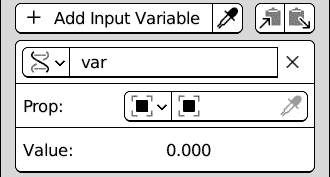

图 9.12：一个新创建的变量

通过这个变量获取场景的**每秒帧数**渲染设置的步骤如下：

1.  从属性类型列表中选择**场景**，该列表显示在变量名称下方的左侧按钮：

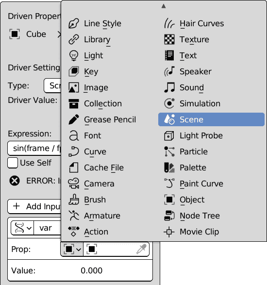

图 9.13：设置属性变量类型

1.  一个 Blender 文件可以包含多个场景。我们可以通过右侧的列表按钮显示它们的列表并选择一个。默认场景的名称是**场景**。

1.  现在场景已被选择，另一个字段`render.fps`获取每秒帧数，如渲染设置中所设置。

1.  我们必须通过点击位于遗传代码（RNA）图标右侧的当前名称将变量重命名为`fps`：

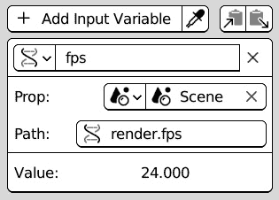

图 9.14：渲染设置中的 fps 变量

现在，变量名称与驱动表达式中所使用的名称相匹配，因此`frame/fps`是当前帧的时间，以秒为单位。这允许下一个变量`length`通过基于秒的公式影响周期。

#### 使用距离变量获取摆长

有四种类型的驱动变量：

+   **单个属性**

+   **变换通道**

+   **旋转差异**

+   **距离**

前两种，**单个属性**和**变换通道**依赖于属性值，而**旋转差异**和**距离**则是由两个对象的变换之间的差异产生的。

在这种情况下，绳子的长度是驱动对象与其支点之间的距离——即`length`：

1.  通过点击**+ 添加输入** **变量**按钮添加一个新变量。

1.  点击 RNA 图标将类型更改为**距离**。面板将改变，允许您选择两个对象：

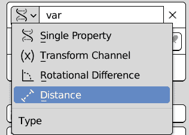

图 9.15：更改变量类型

1.  选择`length`：

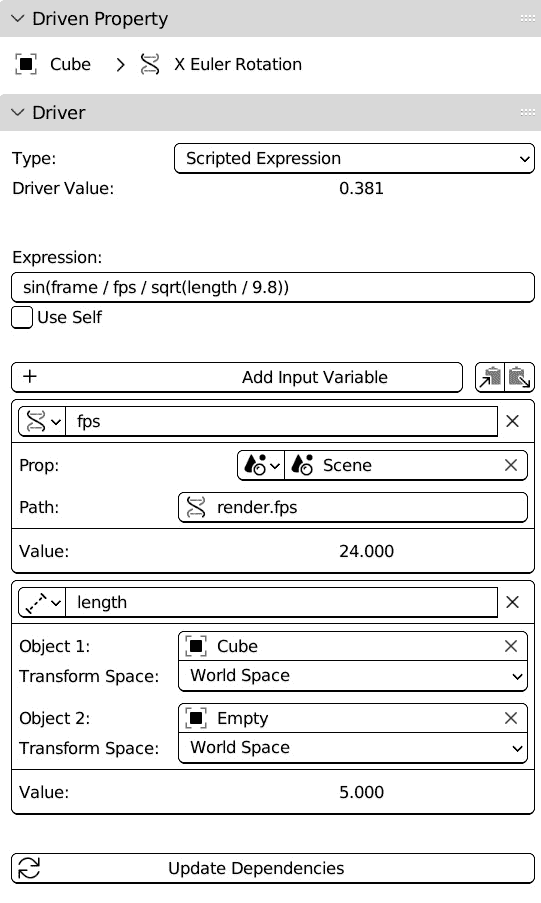

图 9.16：摆动驱动器的变量设置

在动画播放时将 **Empty** 或 **Cube** 对象移近，会使摆动变快，而将它们分开则会减慢摆动。

正弦函数的最大值是 `1`，将其从 *弧度* 转换后，给出了此驱动器达到的最大角度：

```py
>>> degrees(1)
57.29577951308232
```

这个值是振动的振幅。摆的振幅取决于其初始位置。在现实生活中，由于空气的摩擦，振幅会逐渐减小，直到摆达到其静止位置并停止。我们不在驱动器中实现空气阻力，但我们仍然可以添加一个控件来影响运动振幅。

## 控制振幅

当处理波形图时，**振幅** 这个术语有特定的含义，但对于我们的目标，我们可以将其视为运动的乘数。

由于我们正在为动画编程，我们的振幅控制在视觉上比在物理上更重要。

### 添加自定义属性

我们已经使用 **empty** 类型的对象控制了支点的位置。由于移动 **Empty** 已经改变了周期性运动，我们可以在它上面添加一个新的属性来控制振幅。这样，我们可以通过选择单个对象来影响摆的行为。

向对象添加属性的过程如下：

1.  选择我们用作支点的 **Empty** 对象。

1.  在 **对象属性** 面板中，找到 **自定义** **属性** 部分。

1.  点击 **+ 新建** 按钮添加属性。它将默认命名为 **prop**：

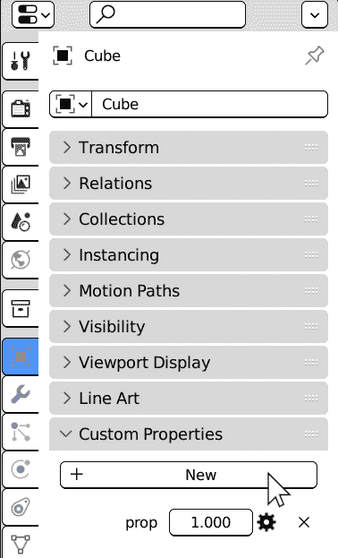

图 9.17：向活动对象添加自定义属性

1.  点击齿轮图标并将 **属性名称** 更改为 **amplitude**。

1.  右键点击值（默认值 `1.00` 是好的）并选择 **复制** **数据路径**。

这将属性路径复制到剪贴板。这将在我们添加下一个驱动器变量时很有用。

### 在驱动器中使用自定义属性

将驱动器表达式乘以 `amp` 变量会影响其结果，并允许我们调节其振幅。要这样做，请按照以下步骤操作：

1.  选择摆动的 **Cube**。

1.  右键点击驱动旋转通道并选择 **编辑驱动器** 以打开 **驱动** **属性** 编辑器。

1.  点击 `amp`。

1.  点击右侧的 **Prop:** 字段，并将属性对象选择为 **Empty**。

1.  点击 `["amplitude"]`。方括号是 *自定义属性* Python 路径的一部分：

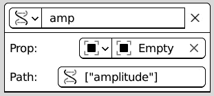

图 9.18：自定义属性作为驱动变量

我们可以在驱动器表达式中直接添加 `* amp`，但我们可以做得更好：因为驱动器影响旋转，我们还可以在乘法中添加 `pi`：

```py
sin(frame / fps / sqrt(length/9.8)) * amp * pi
```

`sin`函数在`-1.0`和`1.0`之间振荡，因此当`1.0`时，我们的驱动程序的结果在`-pi`到`pi`之间。

记住，完整圆弧的周长是`2 * pi`，因此期望一个`pi`值来描述半圆旋转的弧度是合理的。如果我们现在播放动画，我们会看到摆动振荡到其垂直方向——也就是说，向左旋转半圆，然后返回，再向右旋转半圆：`1.0`的振幅使摆动描述一个完整圆。

如果我们选择`0.5`，摆动将通过半圆弧。振幅等于`0.25`会得到更好的结果：每侧的最大旋转角度为 45 度；`0.0`的值将停止摆动。

从`0.0`（静止的摆）到`1.0`（整个旋转）的控制对动画师和 3D 用户来说有直接的意义，因为它允许他们通过改变振幅来设置他们想要的圆周分数。

我们在我们的驱动程序中使用了 Python 公式，但我们手动创建了整个设置。在下一节中，我们将编写一个 Python 附加组件来自动化此过程。

# 编写摆动附加组件

使用我们迄今为止所学到的知识，我们可以编写一个设置活动对象摆的附加组件。

我们将从*第三章*中的步骤开始，并为我们的附加组件创建一个`.py`文件。

## 设置环境

让我们在`ch9`文件夹中为*第九章*创建一个文件夹作为**脚本文件夹**属性，并重新启动应用程序。我们可以在我们的 IDE（本书中的 VS Code）中创建我们的新文件和文件夹，这样我们就可以开始编辑：

1.  在**VS Code**中选择`PythonScriptingBlender/ch9/addons`。

1.  点击**新建文件**图标创建一个新文件。

1.  将新文件命名为`pendulum.py`。

1.  双击文件以打开它。

我们现在可以添加大多数附加组件的标准元素：

+   附加组件信息

+   `Operator`类

+   菜单函数

+   注册函数

接下来，我们将学习如何编写这些信息。

## 编写信息

如同往常，关于我们的附加组件的信息将放入`bl_info`字典中：

```py
bl_info = {
    "name": "Object Pendulum",
    "author": "John Packt",
    "version": (1, 0),
    "blender": (3, 00, 0),
    "description": "Add swing motion to active object",
    "category": "Learning",
}
```

这个字典只是为了 Blender 在列表中显示附加组件的名称和描述。下一步是编写`Operator`类。

## 编写 Operator 类

`Operator`类执行实际工作。我们派生`bpy.types.Operator`并在类的静态部分填写信息：

```py
import bpy
class ObjectPendulum(bpy.types.Operator):
    """Set up swinging motion on active object"""
    bl_idname = "object.shaker_animation"
    bl_label = "Make Pendulum"
    bl_description = "Add swinging motion to Active Object"
    bl_options = {'REGISTER', 'UNDO'}
```

`bl_idname`以`object.`开头，因此它将被添加到`bpy.ops.object`操作符中。我们这样做是因为我们在操作符中做的所有事情都会影响对象级别的场景。

现在，我们必须将振荡参数添加到静态属性中：

```py
    amplitude: bpy.props.FloatProperty(default=0.25,
                                       min=0.0)
    length: bpy.props.FloatProperty(default=5.0, min=0.0)
```

它们将确定运动的`振幅`和`长度`变量。通过使用`'REGISTER'`和`'UNDO'`作为`bl_options`，操作符将允许实时更改：

```py
bl_options = {'REGISTER', 'UNDO'}
```

现在，轮到`poll`方法了，在这里检查运行操作的条件。如果有活动对象，它必须返回`True`。我们可以使用`bool`函数即时转换`context.object`：

```py
    @classmethod
    def poll(cls, context):
        return bool(context.object)
```

最后，我们有`execute`方法。它执行本章前一部分的所有操作：

+   创建枢轴对象

+   添加一个用于振幅的自定义属性

+   使用单摆公式和变量创建驱动器

在函数开始时，我们将活动对象存储在`ob`变量中，然后创建一个新对象，该对象将是枢轴。在*第二章*中，我们了解到新对象可以分两步创建：

1.  通过`bpy.data.objects.new`获取新对象。

1.  将对象链接到场景中存在的`Collection`。

我们将使用`context.collection`并将枢轴链接到活动集合：

```py
    def execute(self, context):
        ob = context.object
        pivot_name = f"EMP-{ob.name}_pivot"
        pivot = bpy.data.objects.new(pivot_name, None)
        context.collection.objects.link(pivot)
```

使用`None`作为`new`的第二个参数创建一个没有几何数据变换——即`matrix_world`。枢轴应该放置在活动对象上方，因为`location`存储在变换矩阵的第四列，我们可以提高`[2][3]`的值）：

```py
        pivot.matrix_world = ob.matrix_world
        pivot.matrix_world[2][3] += self.length
```

现在，是时候添加自定义属性了。我们已经看到，我们的`*振幅*`属性的数据路径是`["振幅"]`。这是因为 Python 对自定义属性的访问遵循与 Python 字典相同的语法。

在 Python 字典中，`dictionary["new_key"] = new_value`语法添加了一个新项。同样，创建`振幅`浮点属性并将其分配给操作员同名参数的 Python 代码如下：

```py
        pivot["amplitude"] = self.amplitude
```

`振幅`现在将出现在我们的枢轴对象下。我们将在驱动器中使用它。现在，我们将向活动对象添加一个**枢轴约束**：

```py
        constr = ob.constraints.new('PIVOT')
        constr.target = pivot
        constr.rotation_range = 'ALWAYS_ACTIVE'
```

现在，是时候创建我们的驱动器了。驱动器作为对象，比约束稍微复杂一些，因为它们包含其他实体，例如 f 曲线，并且是动画数据的一部分。因此，我们不会使用来自`animation_data`的`drivers.new`方法，而是求助于对象的`driver_add`方法，该方法设置所有要求。它返回驱动曲线：

```py
        driver_crv = ob.driver_add('rotation_euler', 0)
        driver = driver_crv.driver
```

谁是驱动器的驱动者？

`driver_add`方法返回 f 曲线而不是驱动器本身。实际的驱动器可以通过`curve.driver`属性访问。这使得访问新曲线变得更容易，但可以合理地期望`driver_add`返回驱动器。

我们的驱动器使用 Python 表达式，因此我们必须设置`type`和`expression`属性：

```py
        driver.type = "SCRIPTED"
        xpr = "sin(frame/fps/sqrt(length/9.8)) * amp * pi"
        driver.expression = xpr
```

可以使用`variables.new`添加`fps`、`length`和`amp`变量。

一旦我们创建了一个变量，我们就可以设置其目标。当前`context.scene.render.fps`属性是`render.fps`，所以只有一个目标。我们将变量类型设置为单个属性，并填写`targets[0]`的`id_type`、`id`和`data_path`：

```py
        fps = driver.variables.new()
        fps.name = "fps"
        fps.type = "SINGLE_PROP"
        fps.targets[0].id_type = 'SCENE'
        fps.targets[0].id = context.scene
        fps.targets[0].data_path = "render.fps"
```

我们的单摆长度是`pivot`和`ob`之间的距离，因此它有两个目标：

```py
        len = driver.variables.new()
        len.name = "length"
        len.type = "LOC_DIFF"
        len.targets[0].id = pivot
        len.targets[1].id = ob
```

最后，我们可以看看振幅。它是枢轴的一个自定义属性，变量类型为`'SINGLE_PROP'`，但这次，`id_type`是 Blender 对象。一旦驱动器设置完成，我们可以通过返回`'``FINISHED'`状态来退出函数：

```py
        amp = driver.variables.new()
        amp.name = "amp"
        amp.type = "SINGLE_PROP"
        amp.targets[0].id_type = "OBJECT"
        amp.targets[0].id = pivot
        amp.targets[0].data_path = "["amplitude"]"
        return {'FINISHED'}
```

`ObjectPendulum`类现在已经完整，因为它现在涵盖了整个设置过程。像往常一样，我们还必须将其添加到 Blender 的一个菜单中，以便更容易启动。

## 编写菜单和注册类

在*第三章*，我们学习了我们可以通过编写菜单函数将我们的条目添加到菜单中。self 和 context 参数分别是菜单实例和应用上下文。我们必须将操作员的`bl_idname`添加到菜单的`layout`中：

```py
def menu_func(self, context):
    self.layout.separator()
    self.layout.operator(ObjectPendulum.bl_idname)
```

然后，在注册函数中，我们必须将`menu_func`添加到 Blender 的一个菜单中。在这个例子中，我们将使用对象模式中可用的右键单击菜单。我们在*第八章*中学习了如何查找菜单类名，对象上下文菜单类是`VIEW3D_MT_object_context_menu`。我们还必须注册操作员类`ObjectPendulum`：

```py
def register():
    bpy.utils.register_class(ObjectPendulum)
    ob_menu =  bpy.types.VIEW3D_MT_object_context_menu
    ob_menu.append(menu_func)
```

当**对象摆锤**附加组件启用时，这为我们添加了新的功能。当然，当它被禁用时，我们必须撤销这些操作来清理我们的附加组件元素：

```py
def unregister():
    ob_menu =  bpy.types.VIEW3D_MT_object_context_menu
    ob_menu.remove(menu_func)
    bpy.utils.unregister_class(ObjectPendulum)
```

现在我们这个附加组件已经准备好了，设置摆锤的步骤如下：

1.  在**对象模式**下，选择一个对象使其变为活动状态。

1.  右键单击并选择**创建摆锤**来调用附加组件。

1.  在操作员属性中设置`length`和`amplitude`的值。

编写这个附加组件将使你在前几章中学到的许多技术得以应用。驱动器是脚本编写的一个非常富有创造性的领域，而这只是我们能够用它们做到的一小部分。

# 摘要

驱动器是位于动画、绑定和编程交叉路口的强大工具。一方面，它们可以包含 Python 表达式并自行实现自定义机制，另一方面，整个驱动器设置过程可以通过脚本自动化。

本章中我们编写的工具是一个小的**自动绑定**工具，它可以在任何 Blender 对象上复制相同的机制，并具有可编辑的参数。

能够结合驱动器、约束和自定义属性，以及自动化整个流程，是 3D 制作的一个基本部分，因为它允许非技术用户继续进行技术任务。

作为额外的好处，通过使用 Python，我们将一个物理公式转换成了一个可工作的驱动器表达式，这项任务有时可能会让人感到害怕，但可以通过观察和一点独创性来完成。

这个主题结束了我们对动画系统的探索。在下一章*第十章*，我们将学习我们的操作员如何与用户交互并监听事件。

# 问题

1.  接口上用于驱动属性的颜色是什么？

1.  我们能否为紫色属性设置关键帧？

1.  一个度量属性，例如**位置**，能否驱动一个角属性，例如**旋转**？

1.  我们能否改变驱动属性和被驱动属性之间的比率？

1.  当我们在界面中设置值时，能否输入 Python 表达式？

1.  我们如何告诉 Blender 我们输入的表达式应该是一个驱动器？

1.  我们如何在用户界面中编辑驱动器属性？是否只有一种方法？

1.  我们能否向对象添加自定义属性并使用它们来控制其他对象？

1.  在 Python 中，我们能否使用`collection.new`方法创建新的驱动器，就像我们使用约束一样？如果可以，为什么我们使用`object.driver_add`而不是其他方法？

1.  为什么驱动器变量的`targets`属性是一个列表？哪种类型的变量有多个目标？
