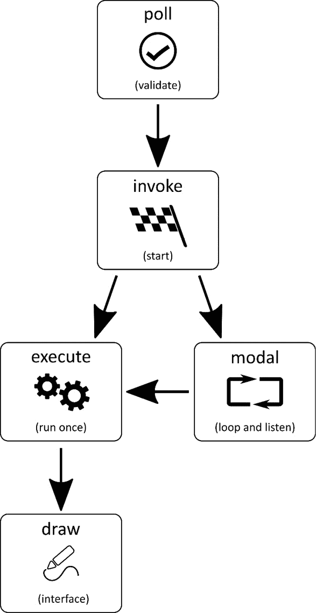
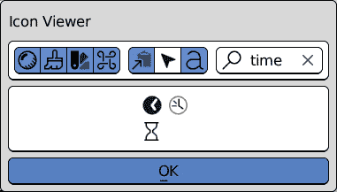
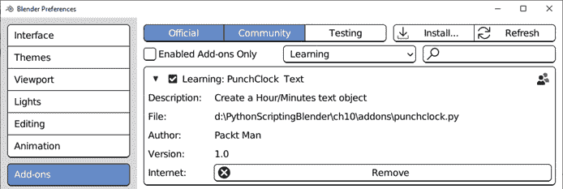
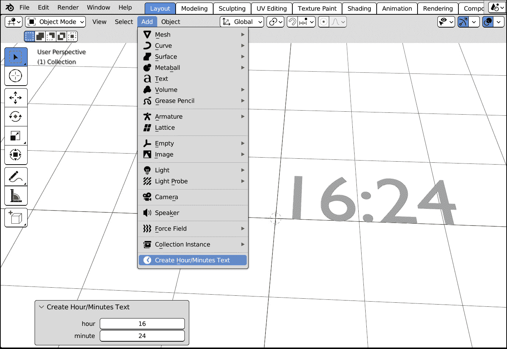
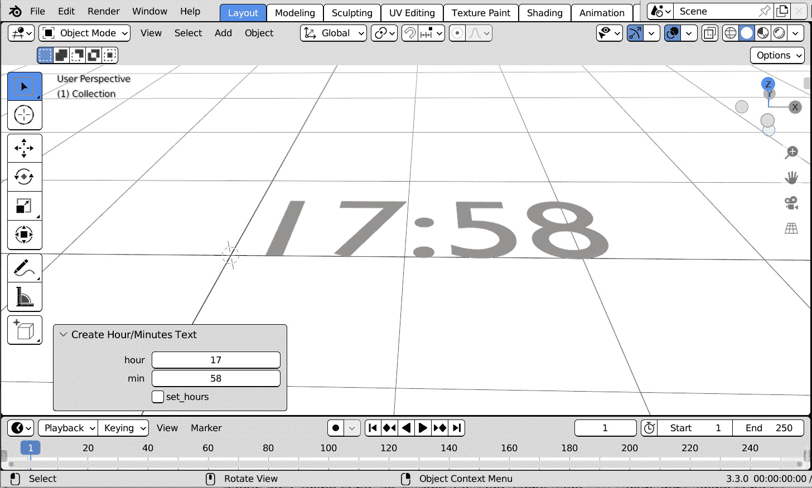
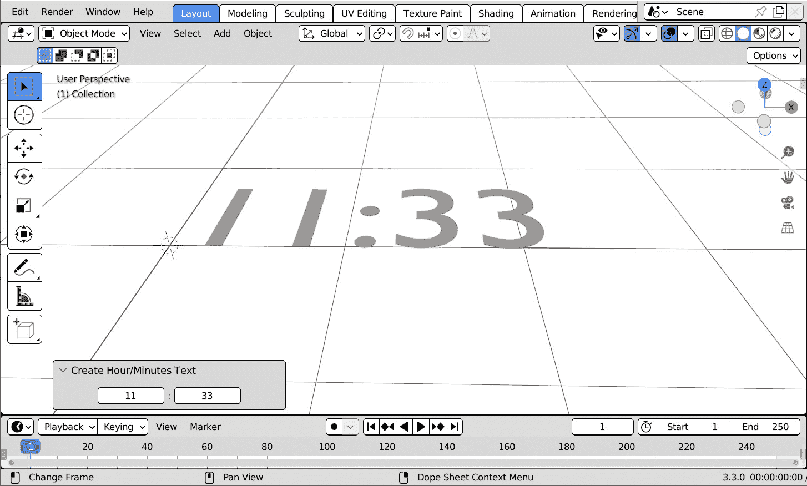

# 10

# 高级和模式操作符

自从*第三章*以来，我们就求助于操作符在 Blender 中实现我们的功能。

操作符已经证明具有极大的灵活性，具有自定义属性和外观。一旦我们学会了如何覆盖它们的所有方法，它们将变得更加强大。

在前几章中遇到的操作符在启动后立即运行并立即完成。如果我们需要，我们可以使执行模式化，并让操作符监听输入事件。

在本章中，你将学习如何控制操作符的执行，以及如何编写完全交互式的操作符。

本章将涵盖以下主题：

+   理解操作符流程

+   以编程方式设置属性

+   编写模式操作符

# 技术要求

在本章中，我们将使用 Blender 和 Visual Studio Code，但任何其他程序员文本编辑器都可以使用。本章创建的示例可以在[`github.com/PacktPublishing/Python-Scripting-in-Blender/tree/main/ch10`](https://github.com/PacktPublishing/Python-Scripting-in-Blender/tree/main/ch10)找到。

# 理解操作符流程

我们从*第三章*开始处理操作符，并学习了它们的`poll`方法如何检查操作符是否可以执行，而`execute`则执行操作并退出。

然后在*第四章*中，我们通过`'REGISTER'`和`'UNDO'`选项将可编辑参数添加到了*电梯*操作符中。

我们还了解了一个聪明的技巧，当用户更改参数时可以实时更改结果——Blender 秘密地撤销最后一个操作并再次执行它，因此需要`'UNDO'`。

这在前面的*第七章*中变得更加明显，当时我们学习了如何从菜单栏中使用**编辑** | **调整最后一个操作**来更改最后一个操作的结果。

虽然这些解决方案使我们能够轻松获取输入参数，但它们并不提供访问实际输入事件的能力，例如按键的压力或鼠标的移动。

这将需要立即的`execute`方法，因此它不可能等待输入；因此，事件必须由另一个方法处理。

在`execute`中我们还不能做的事情是设置操作符的可编辑参数。由于 Blender 在参数更改时再次运行`execute`，用户会发现他们无法设置属性，因为它会被立即覆盖。

捕获事件和初始化操作符参数是`execute`无法执行的两个任务。幸运的是，当操作符启动时，涉及的不仅仅是`execute`方法；我们将看到操作符的生命周期包括一系列方法，每个方法都有其特定的目的。

## 执行步骤

从*第三章*中我们知道，操作符的`poll`和`execute`方法分别用于验证和执行。在*第五章*中，我们使用了`invoke`来确保操作符属性在运行之前显示。

现在，我们将更详细地看看操作符是如何显示和运行的：

1.  Blender 检查`poll`的返回值。如果结果是`False`，则操作符会被灰色显示；否则，操作符可以被启动。

1.  操作符被启动，并运行`invoke`方法。此方法为可选；如果我们不编写它，其步骤将被跳过，Blender 将直接运行`execute`。

`invoke`的一个常见用途是初始化操作符的变量或内部值；与传统的 Python 类不同，操作符不实现传统的`__init__`方法。

与`execute`一样，`invoke`必须返回一个退出状态，可以是`'FINISHED'`、`'CANCELLED'`或`'RUNNING_MODAL'`。

1.  如果我们的操作符旨在监听鼠标和键盘事件，在`invoke`中，我们将它添加到应用程序`'RUNNING_MODAL'`。

1.  如果操作符是处理程序的一部分，它的`modal`方法会在每次触发事件（当鼠标光标移动、按键按下等）时执行，直到 modal 返回`'CANCELLED'`或`'FINISHED'`。否则，为了继续监听，它应该返回`'RUNNING_MODAL'`。

1.  如果`bl_options`是`{'REGISTER','UNDO'}`，则操作符属性将在屏幕左下角的面板中显示。该面板依赖于操作符的`draw`方法。

1.  默认情况下，所有在声明时未标记为`hidden`的操作符属性都会在面板中显示。重新实现此方法允许我们使用在*第五章*中学到的技术来实现自定义设计。

1.  在操作符面板中更改值会再次运行`execute`，并带有更新后的属性。

执行流程总结在*图 10**.1*中，这有助于我们理解当操作符启动时，执行流程中的方法是如何累加的。



图 10.1：从评估开始到结束的操作符方法

虽然`poll`在每次操作符显示时都会由界面运行，但`invoke`是操作符流程的第一步，因此我们可以用它来以编程方式设置操作符的参数，并从那里移动到`execute`或`modal`。在下一节中，我们将使用`invoke`根据一天中的时间初始化操作符参数。

# 编写“PunchClock”插件

一些工具可能需要从操作系统的时钟中获取当前日期和时间。在 Python 中，我们可以使用`datetime`模块在我们的脚本中获取它们，通常用于版本控制或日志记录目的。Blender 没有专门为时间单位设计的属性，但小时和分钟可以存储为操作符的两个单独的整型属性。

我们知道如何使用`default`参数来声明属性的初始值，但如果这个值并不总是相同怎么办？例如，一天中当前的小时和分钟会变化，但`default`只设置静态值。

但由于`invoke`方法在所有其他方法之前执行，我们可以在其中以编程方式设置默认值。

为了演示这一点，我们将创建一个附加组件来在当前场景中创建时间格式文本。默认情况下，文本显示一天中的当前时间，但用户可以更改它。

## 创建附加脚本

让我们在 Python 项目中创建`ch10`文件夹，然后在**Blender 首选项**中将其设置为**脚本**文件夹，并重新启动 Blender：

1.  在你的文件浏览器或程序员编辑器中选择`PythonScriptingBlender/ch10/addons` – 例如，**VS Code**。

1.  点击**新建**图标创建一个新文件。

1.  将新文件命名为`punch_clock.py`。

1.  打开文件进行编辑。

1.  在 Blender 的**文件路径**首选项中设置`PythonScriptingBlender/ch10`，并重新启动 Blender。

我们像往常一样在`bl_info`字典中存储附加信息：

```py
bl_info = {
    "name": "Text PunchClock",
    "author": "Packt Man",
    "version": (1, 0),
    "blender": (3, 00, 0),
    "description": "Create an Hour/Minutes text object",
    "category": "Learning",
}
```

此附加组件包含一个操作符，它将在 3D 视图的**添加**菜单中可用。

我们从一个创建*HH:MM*格式文本的操作符开始，就像数字时钟一样，其中*HH*代表两位数的小时数，*MM*代表分钟。

小时和分钟存储为`IntProperty`，小时的范围是`0`到`23`，分钟的范围是`0`到`59`。操作符的代码开始如下：

```py
import bpy
class PunchClock(bpy.types.Operator):
    """Create Hour/Minutes text"""
    bl_idname = "text.punch_clock"
    bl_label = "Create Hour/Minutes Text"
    bl_description = "Create Hour Minutes Text"
    bl_options = {'REGISTER', 'UNDO'}
    hour: bpy.props.IntProperty(default=0, min=0, max=23)
    mins: bpy.props.IntProperty(default=0, min=0, max=59)
```

如果 Blender 处于`poll`状态，我们可以添加一个新的对象，如下所示：

```py
    @classmethod
    def poll(cls, context):
        return context.mode == 'OBJECT'
```

在`execute`中，我们创建新的文本数据并将其设置为`{hour}:{min}`。Blender 中文本的类型名为`FONT`，其显示的文本存储在`body`属性中。

在变量后面使用`:02`表示我们想要显示一个两位数 – 例如，`f"{3:02}"`变为`"03"`：

```py
    def execute(self, context):
        txt_crv = bpy.data.curves.new(type="FONT",
                                      name="TXT-clock")
        txt_crv.body = f"{self.hour:02}:{self.mins:02}"
```

我们创建一个对象将其链接到当前集合，并查看场景中的文本：

```py
        txt_obj = bpy.data.objects.new(name="Font Object",
                                       object_data=txt_crv)
```

之后，我们将执行状态返回为`FINISHED`：

```py
        context.collection.objects.link(txt_obj)
        return {'FINISHED'}
```

我们的第一个操作符草稿已经准备好了，现在我们创建一个`menu`函数来添加到界面中。我们可以在搜索字段中使用`time`，最终得到三个相关的图标 – `TIME`、`MOD_TIME`和`SORTTIME`。任何这些都可以；在这个例子中我们将选择`TIME`。



图 10.2：图标查看器中的时间相关默认图标

我们在`menu_func`中使用`separator`开始，以将我们的操作符与其他内容区分开来，然后通过`Layout.operator`添加我们的`PunchClock`条目：

```py
def menu_func(self, context):
    self.layout.separator()
    self.layout.operator(PunchClock.bl_idname, icon='TIME')
```

最后，我们在`register`和`unregister`函数中添加和移除我们的操作符和菜单项：

```py
def register():
    bpy.utils.register_class(PunchClock)
    bpy.types.VIEW3D_MT_add.append(menu_func)
def unregister():
    bpy.types.VIEW3D_MT_add.remove(menu_func)
    bpy.utils.unregister_class(PunchClock)
```

如果我们重新启动 Blender 或刷新**插件**列表，我们应该能够看到**PunchClock**插件。



图 10.3：在插件列表中显示的 PunchClock

在这个阶段，在 3D 视图顶部的菜单中选择**添加** | **创建小时/分钟文本**会添加一个显示时间*00:00*的文本对象。

我们可以从`datetime`获取当前时间并将其转换为文本，但我们可以做得更好——通过在`invoke`中设置`self.hour`和`self.mins`，我们将达到相同的结果，同时允许用户更改显示的时间。

## 使用`invoke`初始化属性

要获取当前时间，我们在脚本开头导入`datetime`。导入部分变为以下内容：

```py
import bpy
import datetime
```

然后，在操作符类内部，我们实现`invoke`方法。它可以直接跟在`poll`之后，但只要在`PunchClock`类下面都可以：

```py
    @classmethod
    def poll(cls, context):
        return context.mode == 'OBJECT'
    def invoke(self, context, event):
        now = datetime.datetime.now()
        self.hour = now.hour
        self.mins = now.minute
        return self.execute(context)
```

现在，操作符的小时和分钟在`invoke`中设置，然后调用`execute`以继续操作。

使用`execute`完成操作很重要，因为 Blender 在更新操作时间顺序时期望这样做。

现在启动**创建小时/分钟文本**会显示当前时间在一个新的文本对象中，并允许我们使用操作符面板更改小时和分钟。



图 10.4：添加可编辑的小时和分钟字段，设置为当前时间

通过使用`invoke`，我们以编程方式设置了默认值。这在生产中是一个常见请求，因为所需的默认值可能会随着项目、任务和部门的不同而变化。

我们直接将我们的操作符添加到`execute`方法中。

为了防止菜单跳过`invoke`，我们需要在我们的菜单函数中覆盖布局的上下文。

## 在弹出菜单中确保默认的`invoke`

布局元素可以传递自定义上下文并强制对操作符进行设计选择。例如，显示在视口外的按钮会避免显示操作符属性，弹出菜单会绕过`invoke`方法。

我们在*第五章*的*显示按钮*部分和*第七章*的*编写 Action To Range 插件*部分遇到了这种行为。

我们通过在`invoke`中调用属性对话框或使用`invoke`来运行操作符，即使操作符是从`invoke`启动的，分别解决了这些问题。

因此，我们将布局的`operator_context`更改为`"INVOKE_DEFAULT"`。我们只需要为`PunchClock`这样做，因此，为了最小化对其他菜单项的潜在影响，我们添加了一个新行并仅更改其`operator_context`。

我们的下拉菜单函数变为以下内容：

```py
def menu_func(self, context):
    self.layout.separator()
    row = self.layout.row()
    row.operator_context = "INVOKE_DEFAULT"
    row.operator(PunchClock.bl_idname, icon='TIME')
```

通过使用默认上下文执行`PunchClock`，我们确保`invoke`永远不会被跳过。

现在，操作员将始终显示其属性并允许用户更改它们，但我们也可以实现一种通过移动鼠标来更改显示时间的方法。

在下一节中，我们将添加操作员对鼠标和键盘输入的响应，使我们的操作员成为 modal 应用程序处理程序。

# 添加 modal 行为

在用户界面中，术语**modal**指代一个子窗口或小部件，它为自己获取所有用户交互，直到操作被明确结束。

通常，操作员被设计为立即返回到主应用程序。如果我们不希望这样，它们应该被添加到窗口管理器的 modal 处理程序中。

然后，操作员被视为 modal，并将监听用户输入，直到手动关闭。

我们可以使`PunchClock`成为 modal，并使用鼠标移动来设置我们的时钟。modal 操作员有两个要求：

+   `invoke`将操作员添加到处理程序并返回`'RUNNING_MODAL'`。

+   `modal`已实现并返回`'RUNNING_MODAL'`。当用户结束操作时，它返回`'FINISHED'`，或者返回`'CANCELLED'`以无更改退出。

我们将通过更改`invoke`及其返回值来开始实现 modal 执行。

## 将操作员添加到 modal 处理程序

现在，`invoke`不再将参数传递给`execute`，而是调用当前`window_manager`的`modal_handler_add`方法，然后返回`{'RUNNING_MODAL'}`。返回状态通知操作员正在 Blender 中运行并监听事件。

由于`modal`在每次窗口更新时都会运行，我们应该保持它轻量级和小型。向场景添加对象是昂贵的，因此我们在`invoke`中创建和链接文本，并在`modal`中仅编辑其主体。`invoke`方法将`txt_crv`和`txt_obj`作为操作员成员属性存储：

```py
    def invoke(self, context, event):
        now = datetime.datetime.now()
        self.hour = now.hour
        self.mins = now.minute
        self.txt_crv = bpy.data.curves.new(type="FONT",
                                           name="TXT-hhmm")
        self.txt_obj = bpy.data.objects.new(name="OB-Txt",
                                 object_data=self.txt_crv)
        context.collection.objects.link(self.txt_obj)
        context.window_manager.modal_handler_add(self)
        return {'RUNNING_MODAL'}
```

可以作为状态返回的关键字列在 API 文档中（[`docs.blender.org/api/3.3/bpy_types_enum_items/operator_return_items.xhtml`](https://docs.blender.org/api/3.3/bpy_types_enum_items/operator_return_items.xhtml)），如下所示：

+   `RUNNING_MODAL`: 保持操作员在 Blender 中运行

+   `CANCELLED`: 操作员在没有做任何事情的情况下退出，因此不应推送任何撤销条目

+   `FINISHED`: 操作员在完成其动作后退出

+   `PASS_THROUGH`: 不做任何事情并将事件传递下去

+   `INTERFACE`: 已处理但未执行（弹出菜单）

我们已经处理了`'RUNNING_MODAL'`、`'CANCELLED'`和`'FINISHED'`，而`'PASS_THROUGH'`对于将事件传递到应用程序的其余部分非常有用，即使我们的脚本正在监听它。`'INTERFACE'`用于弹出菜单，但通常我们不需要在我们的脚本中使用它。

状态并非一切！

重要的是要知道，返回状态确认了方法中完成的工作，但它本身并不执行任何操作。

例如，仅返回`'CANCELLED'`并不能撤销方法中执行的操作；我们应该通过编程方式撤销所有更改——例如，删除方法可能创建的对象，然后返回`'CANCELLED'`。

现在应用程序处理程序将查找`modal`方法并运行它，我们可以继续为我们的操作员编写一个。

## 编写`modal`方法

一旦将操作员添加到处理程序中，窗口管理器将在用户界面的每个事件上运行其`modal`方法。与`invoke`一样，除了`self`和`context`之外，此方法还接受第三个参数——`event`。

`event`参数包含有关触发任何`modal`执行的触发器的信息。它可以是鼠标移动或按键。

最相关的信息是`type`，这是一个字符串，其关键字在[`docs.blender.org/api/3.3/bpy_types_enum_items/event_type_items.xhtml`](https://docs.blender.org/api/3.3/bpy_types_enum_items/event_type_items.xhtml)上有文档说明。

查看`event.type`，我们可以找出触发更新的原因，如下所示：

```py
    event.type == "MOUSEMOVE"
```

这意味着用户刚刚移动了鼠标。

如果事件是由键盘引起的，`event.type`将是一个字母，例如`"A"`，或者是对键的描述，例如`"LEFT_CTRL"`。与数字键相关的事件类型是该数字的大写字母——例如，`"THREE"`。

在这个例子中，将鼠标向右移动会增加当前时间，而向左移动则会减少它。

就像真实的时钟一样，我们可以设置小时或分钟——我们添加一个布尔属性来区分两者。属性部分变为以下内容：

```py
    hour: bpy.props.IntProperty(default=0, min=0, max=23)
    mins: bpy.props.IntProperty(default=0, min=0, max=59)
    set_hours: bpy.props.BoolProperty(default=True)
```

现在，我们终于可以编写`PunchClock.modal`了。

移动鼠标更新与光标相关的属性。例如，水平轴上的光标位置存储为`mouse_x`，而之前的位置仍然可用，作为`mouse_prev_x`。两者的差值给出了移动方向。

我们将那个数字存储为`delta`，然后除以它来减缓转换。10 倍因子足以达到我们的目的：

```py
    def modal(self, context, event):
        if event.type == 'MOUSEMOVE':
            delta = event.mouse_x - event.mouse_prev_x
            delta /= 10
```

`delta`是一个浮点数，因此它不能与小时和分钟（整数）相加。因此，我们将它四舍五入到整数值：

```py
            delta = round(delta)
```

我们使用`round`而不是`int`进行此转换。因为`int`近似于最接近或等于的整数值，这会使从一个值到下一个值的进度不够平滑。

`set_hours`的值决定了`delta`是添加到小时还是分钟：

```py
            if self.set_hours:
                self.hour += delta
            else:
                self.mins += delta
            txt = f"{self.hour:02}:{self.mins:02}"
            self.txt_crv.body = txt
```

要更改`set_hours`，我们求助于按键。我们通过按*Tab*键让用户在小时和分钟之间切换。

要获取那个按键，我们确保`event.type`是`'TAB'`且`event.value`是`'PRESS'`：

```py
        if event.type == 'TAB' and event.value == 'PRESS':
            self.set_hours = not self.set_hours
```

布尔变量只能是`True`或`False`，它们是对方的否定。因此，我们通过仅使用`not`将`set_hours`转换为它的对立面。

类型不足以！

按下的键也会释放，这个动作将生成另一个事件，其值为`'RELEASE'`。仅检查`event.type`而不检查`event.value`会使我们的代码面临响应按键两次的风险。

最后，当用户对显示的时间满意时，他们可以按下*Return*键并退出。按下*Return*键会触发类型为`'RET'`的事件。我们不需要担心退出事件中的`event.value`。一旦我们返回`{'FINISHED'}`，操作员就会停止，因此没有重复执行的风险：

```py
         elif event.type == 'RET':
            return {'FINISHED'}
```

然而，如果用户犹豫不决并想在不做任何事情的情况下退出工具？我们可以允许在按下`'ESC'`时取消操作。

要做到这一点，操作员必须在`invoke`中删除创建的文本后自行清理，然后返回`{'CANCELLED'}`以避免被添加到撤销队列：

```py
        elif event.type == 'ESC':
            bpy.data.objects.remove(self.txt_obj)
            return {'CANCELLED'}
```

那是我们操作员覆盖的最后一个事件。我们忽略任何其他事件，并默认返回`{'RUNNING_MODAL'}`作为状态以继续监听。

因此，`modal`的最后一条通常是以下内容：

```py
        return {'RUNNING_MODAL'}
```

调用**重新加载脚本**，然后**添加** | **创建小时/分钟文本**，将创建当前小时的文本并开始监听鼠标/键盘事件。左右移动鼠标会增加/减少当前值，按下*Tab*键在小时和分钟之间切换，按下*Return*或*Esc*键结束操作员。

由于所有动作现在都在`invoke`和`modal`之间进行，我们可以删除`execute`，但由于`bl_options`设置为`{'REGISTER', 'UNDO'}`，Blender 会显示操作员属性。当属性更改时，会运行`execute`方法。

我们可以看到，按下*返回*键后，**小时**、**分钟**和**设置小时**可以在操作面板中更改。



图 10.5：模态退出后的操作员属性

那个面板可以自定义 - 操作员有一个`draw`方法，它的工作方式与我们在*第五章*中了解到的`Panel.draw`相同。

因此，我们可以在操作面板中以时间格式显示小时和分钟，而不是按列显示。在下一节中，我们将实现`draw`方法并更改**创建小时/分钟** **文本**面板。

# 操作面板的样式

我们知道在这些情况下操作面板会显示：

+   当显式调用`context.window_manager.invoke_props_dialog`时。

+   当`bl_options`设置为`{'REGISTER', 'UNDO'}`并且操作员已完成时。

+   当`bl_options = {'``REGISTER', 'UNDO'}`。

默认情况下，所有属性都按列布局显示。大多数属性类型可以用`hidden=True`标志声明，但`BoolProperty`不是这种情况，所以我们不能在`set_hours`中这样做。

作为一种解决方案，我们可以将`set_hours`改为`IntProperty`，范围是`0`到`1`，并将`hidden`设置为`True`，但通过为我们的操作符实现`draw`方法，我们可以简单地省略我们不想显示的属性。

## 编写绘制方法

我们想在**创建小时/分钟****文本**面板中更改两件事：

+   小时和分钟应在同一行

+   `set_hours`内部变量不应显示

向操作符添加`draw`方法会改变其布局。方法参数是`self`和`context`，但我们只会使用第一个。为了在同一行显示我们的属性，我们将执行以下操作：

1.  创建一行来显示小时和分钟。

1.  为新的`row`启用`align`。

1.  将对齐设置为`'CENTER'`：

```py
    def draw(self, context):
        layout = self.layout
        row = layout.row(align=True)
        row.alignment = 'CENTER'
```

1.  使用`row.prop`显示`self.hour`，使用`row.label`显示分号，然后再次使用`row.prop`显示`self.mins`：

```py
        row.prop(self, 'hour', text="")
        row.label(text=' :',)
        row.prop(self, 'mins', text="")
```

我们将`hour`和`mins`的文本设置为`""`，因为没有必要进行解释。正如预期的那样，没有显示`set_hours`的复选框，因为它在`draw`中没有提到。



图 10.6：自定义小时/分钟操作面板

我们可以添加更多功能，例如数字输入来设置小时，但由于我们已经实现了所有操作符方法，我们可以认为**PunchClock**完成了。

尽管我们将在本书的其余部分讨论其他操作符，但这将是专门介绍它们的最后一章，因为我们已经学会了如何自定义它们执行的每一步。

# 摘要

我们已经深入了解了操作符如何在 Blender 的不同部分中集成，以及我们如何操纵它们的外观和行为。我们还学习了它们如何捕获输入以及它们如何与应用程序事件处理程序和界面交互。

本章标志着本书第二部分的结束。下一章，*对象修饰符*，是*第三部分*的开始，该部分讨论了场景数据如何被处理成最终输出。

# 问题

1.  哪个操作符方法在操作符启动之前运行？

1.  如果操作符的`poll`方法返回`False`，用户能否启动操作符？

1.  我们能否在函数中为操作符参数设置默认值？

1.  `modal`方法只能返回`'RUNNING_MODAL'`状态——是或否？

1.  返回`'CANCELLED'`是否会撤销我们在方法中做的所有操作？

1.  我们能否在函数中为操作符参数设置默认值？

1.  我们能否改变操作面板的布局？

# 第三部分：输出交付

本部分主要关注 3D 管道的最终阶段：生成和变形几何形状以及设置渲染和着色系统。探索简单机架的自动化和着色器节点树的构建。

本节包括以下章节：

+   *第十一章*，*对象修饰符*

+   *第十二章*，*渲染和着色器*
