# 第十二章：渲染和着色器

一个称为 *渲染* 的过程通过评估场景的几何形状、灯光和相机来生成完成图像的像素。

处理这些计算的渲染器可以是外部程序，独立于 3D 应用程序，或者动画包的完全集成功能。所有渲染器都有优点和缺点，可以分为两类：实时渲染，它通过假设一些近似值来实现即时可视化，和离线渲染，它需要更多时间来考虑更多细节。

为了生成图像，渲染器依赖于着色器——即关于物体如何对光线和观察者的位置做出反应，以及这如何转化为渲染像素的指令。

着色器可能很复杂，是一门独立的学科，但它们的工作基本概念并不难理解。

在本章中，你将学习如何设置渲染属性，如何使用 Python 自动创建着色器，以及如何使用 **文件浏览器** 加载图像。

本章涵盖了以下主题：

+   理解材料系统

+   在着色器编辑器中加载图像

+   连接和排列着色器节点

# 技术要求

本章我们将使用 Blender 和 Visual Studio Code。为本章创建的示例，以及媒体文件，可以在 [`github.com/PacktPublishing/Python-Scripting-in-Blender/tree/main/ch12`](https://github.com/PacktPublishing/Python-Scripting-in-Blender/tree/main/ch12) 找到。

# 渲染和材质

Blender 随带两个渲染引擎：**Eevee**，一个可以在视口使用的实时渲染器，以及 **Cycles**，一个离线渲染器。其他引擎，包括大多数商业产品，可以以渲染插件的形式安装。还有一个选项，**工作台**，可以用于在视口中快速简单地显示渲染。

## 设置渲染引擎

当前 **渲染引擎**，以及其他渲染设置，可以在场景 **渲染** 属性中找到。它是第一个标签页，并带有电视机的图标：

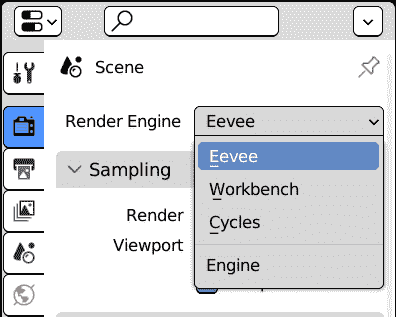

图 12.1：选择当前渲染引擎

虽然 **工作台** 设计时只包含少量渲染选项和没有着色系统，**Eevee** 和 **Cycles** 可以通过基于节点的系统结合图像、颜色和属性。这可以在 **着色器编辑器** 区域完成，该区域位于 **着色** 工作区。

## 着色工作区

着色涉及不同的活动，如访问图像文件、检查视口和编辑物体属性。一旦我们将 **渲染引擎** 设置为 Eeeve、Cycles 或支持 Blender 着色系统的外部引擎，我们就可以在 **着色** 工作区执行这些任务。它包含以下内容：

+   用于导入图像的 **文件浏览器**

+   用于检查材质的 **3D 视口** 区域

+   一个 **大纲**

+   数据**属性**；默认情况下，**世界**设置选项卡是激活的

+   **着色器****编辑器**区域

+   **图像****编辑器**区域：

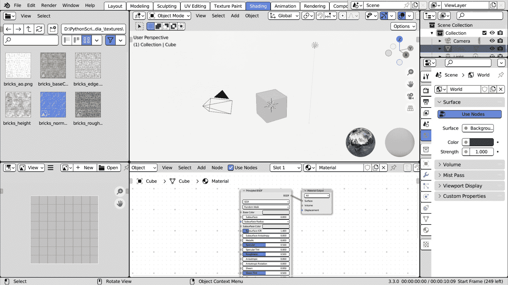

图 12.2：着色工作区

默认材质提供了一些可以在**材质属性**区域设置的着色属性。为了理解如何使用适当的布局编写可动材质的脚本，我们将简要概述着色器组件如何在着色器图中组合在一起。

## 理解物体材质

我们可以通过指定物体的材质来改变物体的整体外观。术语*材质*遵循现实世界物体的类比，其外观受其制成或涂层的材质影响。

物体的材质可以在**材质属性**区域中进行编辑。在 3.3 版本中，它是倒数第二个属性选项卡，带有带有棋盘图案的球体图标，如图*图 12*.3 所示。

## 设置材质属性

材质独立于物体存在。一种材质可以共享给多个物体，并且一个物体可以分配给不同面的集合的多个材质。

滚动到材质**设置**，我们可以编辑 Blender 如何处理材质——例如，其透明部分如何渲染在背景之上：

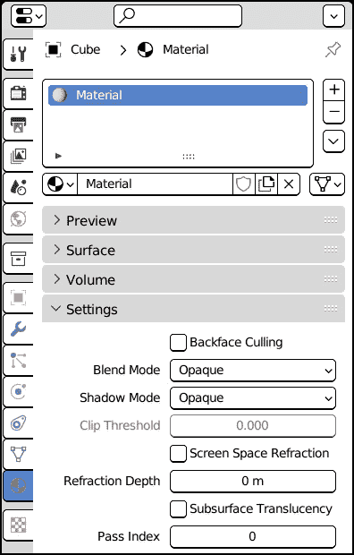

图 12.3：材质属性区域的设置

与实际材料通常关联的属性，如粗糙度、颜色和透明度，在**表面**面板中显示。这些属性是**着色器**的一部分，着色器是一种通用的算法，用于计算表面应该如何看起来。每种材料都与其关联一个着色器。

着色器为本书引入了一个新概念：称为**节点树**的可视框架。我们可以通过查看**着色器****编辑器**区域来了解它是如何工作的。

# 着色器编辑器

着色系统支持不同的风格：现实感、卡通或技术图纸等。而不是提供一个具有定义小部件的单个界面，渲染器的功能分散在称为**节点**的互联单元中。

就像函数一样，节点对一个或多个输入执行特定的操作，并通过一个或多个输出提供结果。节点是函数的可视表示，允许非程序员组合逻辑块以获得自定义结果。

节点不仅限于着色使用——它们还用于**合成**以及在**几何****节点**修改器中生成网格。

默认情况下，Blender 材质在**着色器编辑器**区域显示一个**材质输出**节点，其**表面**输入为**原理 BSDF**节点。**双向散射分布函数**（**BSDF**）是一个数学模型，描述了表面如何接收和反射光线。它是一种**基于物理的渲染**（**PBR**）形式，基于视觉属性如颜色、粗糙度和渗透性如何在现实世界中与光线相互作用。

**材质输出**是图中的最后一个节点，将着色传递到对象上。

任何时候只能有一个输出处于活动状态，因此着色器图也称为**节点树**，输出作为根节点，所有其他分支都由此节点衍生。

## 理解节点树

节点的输入和输出以彩色圆圈的形式显示，称为**插座**。输入插座位于节点的左侧，而输出插座位于右侧。它们的颜色取决于插座的数据类型。例如，**原理**节点的**基础颜色**插座，颜色为黄色，为材质分配颜色，而**粗糙度**，一个灰色插座，是一个浮点数，表示其与平滑度的距离。

紫色插座，如**法线**，是向量，可以包含方向数据。

输出插座位于节点的右侧，可以连接或链接到另一个节点的左侧输入插座：

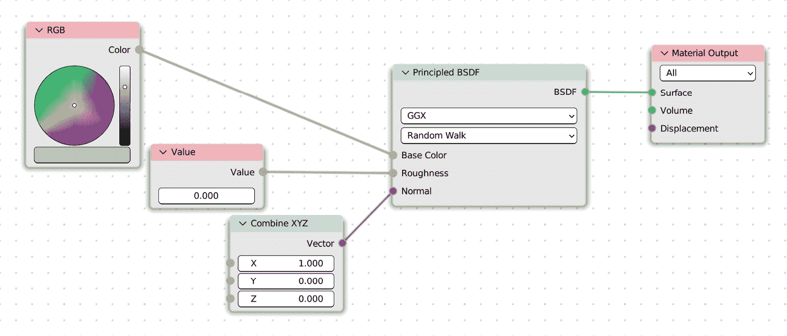

图 12.4：一个接受颜色、粗糙度和法线输入的原理节点

因此，**基础颜色**的颜色属性是一个输入插座，可以连接到来自另一个节点的任何颜色输出。例如，**原理**节点的**基础颜色**输入可以来自**RGB**节点，如图*12*.4*所示，也可以来自**图像纹理**，如图*12*.5*所示：

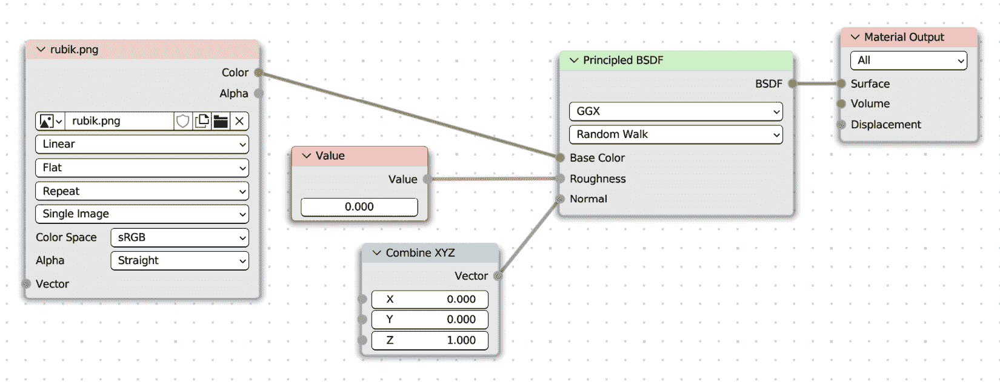

图 12.5：一个原理节点，以图像作为基础颜色的输入

连接即转换！

我们可以将不同类型的插座连接起来，例如向量和颜色；数据会自动转换。*X*、*Y*和*Z*向量分量被转换为颜色的红色、绿色和蓝色元素，而颜色的亮度被转换为浮点值。

既然我们已经了解了材质的工作原理，我们将编写一个脚本，帮助加载**图像纹理**。

# 编写 Textament 插件

虽然创建着色器可能需要时间，但我们也可以自动化一些简单的操作。例如，我们可以编写一个插件来简化从磁盘加载图像并将它们连接到着色器的任务。

## 使用纹理图像

使用**纹理图像**节点，我们可以使用图像来为对象着色。这增加了材质外观的多样性，因为图像可以沿着对象的延伸方向变化，而不仅仅是单一颜色：

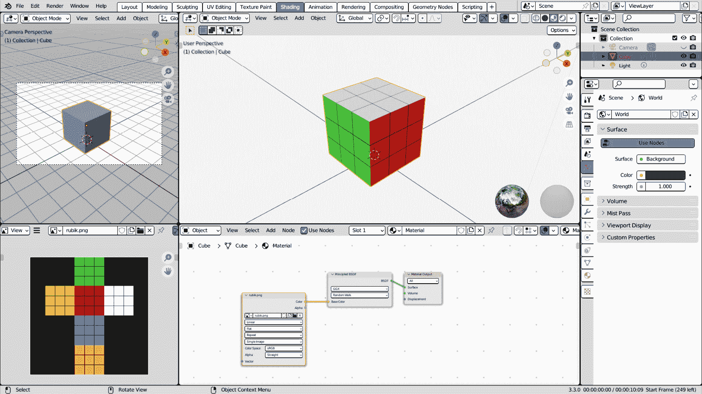

图 12.6：一个魔方的图像纹理，应用于一个平面立方体

我们将要编写的操作符将从磁盘加载多个图像，并从图像的文件名中猜测其用途。例如，名为 `Metallic.png` 的图像将被加载为**纹理图像**，并连接到**Principled**节点的**Metallic**输入。

与往常一样，我们将为开发新插件设置一个环境。

## 设置环境

我们将为我们的插件创建一个 Python 脚本，并通过执行以下步骤使其为 Blender 所知：

1.  在名为 `PythonScriptingBlender/ch12/addons` 的文件夹中创建一个文件夹。我们可以使用文件管理器或我们 IDE 的文件标签页来完成此操作，例如**VS Code**。

1.  在该文件夹中创建一个新文件，并将其命名为 `textament.py`。我们可以使用文件管理器或我们 IDE 的**新建文件**按钮来完成此操作。

1.  在您选择的编辑器中打开文件。

1.  在 Blender 的**文件** **路径**首选项中设置 `PythonScriptingBlender/ch12`。

1.  重新启动 Blender 以更新搜索路径。

现在，我们将像往常一样开始编写插件信息。

### 编写 Textament 插件信息

在信息中，我们必须指定插件的作用以及其工具的位置：

```py
bl_info = {
    "name": "Textament",
    "author": "Packt Man",
    "version": (1, 0),
    "blender": (3, 00, 0),
    "description": "Load and connect node textures",
    "location": "Node-Graph header",
    "category": "Learning"
}
```

该插件仅包含一个类——一个用于加载图像的导入操作符。

## 编写导入操作符

我们的操作符从磁盘加载图像纹理，因此我们需要 `os` 模块来处理磁盘路径。除了 `bpy`，此操作符还将继承自 `ImportHelper` 工具类，以便它可以访问 Blender 的**文件浏览器**

```py
import os
import bpy
from bpy_extras.io_utils import ImportHelper
```

从 `ImportHelper` 派生的操作符将所选文件路径存储在几个额外的属性中。

### 使用 Blender 的文件浏览器

与所有操作符一样，`AddTextures` 基于 `bpy.types.Operator`，但由于它操作文件，它也继承自 `ImportHelper` 类。通过继承这两个类，当它启动时，`AddTextures` 将运行 `ImportHelper` 的 `invoke` 方法，然后 `execute` 方法正常运行：

```py
Class AddTextures(bpy.types.Operator, ImportHelper):
    """Load and connect material textures"""
    bl_idname = "texture.textament_load"
    bl_label = "Load and connect textures"
    bl_description = "Load and connect material textures"
```

从 `ImportHelper` 派生为 `AddTexture` 添加了一个 `filepath` 属性，其中存储了所选文件的路径。

`filepath` 属性存储单个文件的磁盘路径，在我们的情况下这还不够，因为我们打算一次性加载多个文件。因此，我们需要将所选的 `directory` 存储在 `StringProperty` 中，并将所选的 `files` 作为 `OperatorFileListElement` 的集合：

```py
    directory: bpy.props.StringProperty()
    files: bpy.props.CollectionProperty(
                    name="File Path",
                    type=bpy.types.OperatorFileListElement,
                   )
```

在另一个 `StringProperty`，`filter_glob` 中设置应显示在 `.png` 和 `.jpg` 图像中的文件扩展名。此属性是 `"HIDDEN"`：我们不希望它在操作员的选项中显示：

```py
    filter_glob: bpy.props.StringProperty(
                                    default="*.png; *.jpg",
                                    options={"HIDDEN"})
```

现在，我们可以编写操作符方法。我们将从 `poll` 方法开始，该方法检查操作符是否可以启动。

### 检查活动节点的存在

此操作符在当前节点上工作，因此我们需要检查以下内容：

+   存在一个活动对象

+   存在一个活动的材质

+   已找到材质节点树

+   材料树有一个活动的节点

因此，`poll`方法在所有上述条件都适用的情况下才返回`False`：

```py
    @classmethod
    def poll(cls, context):
        ob = context.object
        if not ob:
            return False
        mat = ob.active_material
        if not ob:
            return False
        tree = mat.node_tree
        if not tree:
            return False
        return tree.nodes.active
```

如果启动了操作符并且选择了文件，它们将被存储以在`execute`方法中使用。

### 匹配纹理文件名

在`execute`的开始，我们将当前活动的节点存储在一个变量中：

```py
    def execute(self, context):
        mat = context.object.active_material
        target_node = mat.node_tree.nodes.active
```

继承自`ImportHelper`的操作符在**文件浏览器**中的选择确认后显示`execute`方法。

因此，当`execute`运行时，`self.files`属性将包含用户选择的文件选择。我们可以迭代`self.files`，并将每个文件名与着色器输入进行比较。我们更愿意找到一个与文件名和输入名在大体上相似的文件名，而不是寻找完全匹配。

例如，`"baseColor.png"`应该连接到`"Base Color"`插座。换句话说，我们希望进行不区分大小写和不区分空格的匹配。

实现这一点的快捷方式是使用`lower`和`replace`方法的组合。我们可以在任何 Python 控制台中测试这一点；例如：

```py
>>> "Base Color".lower().replace(" ", "")
'basecolor'
>>> "baseColor".lower().replace(" ", "")
'basecolor'
```

我们需要对每个文件、任何输入执行此操作，因此我们应该为这个操作创建一个函数。

`lambda`语句是一种通过仅声明其参数和一个表达式来创建函数的快捷方式。例如，将输入*x*转换为小写并作为一个无空格的字符串可以写成这种形式：

```py
        match_rule = lambda x : x.lower().replace(" ", "")
```

与`def`不同，`lambda`不将名称分配给函数，因为名称不是语法的要求：

```py
lambda arguments : expression
```

由于我们将结果存储在`match_rule`变量中，我们的示例等价于编写以下几行：

```py
def match_rule(x):
    return x.lower().replace(" ", "")
```

`lambda`可以用来编写更紧凑的代码，或者如果需要一个函数作为参数但不需要直接调用它。

我们将对每个文件名和每个潜在的插座使用`match_rule`，并在寻找匹配项时比较结果。

节点插座存储在`inputs`中，这是每个节点的类似字典的集合属性。我们可以使用`keys`方法获取插座名称列表：

```py
        input_names = target_node.inputs.keys()
```

现在，是时候寻找可以链接的纹理了。我们可以组合两个 for 循环，遍历`self.files`中的每个条目的所有输入。如果找到匹配项，输入/文件名对将被添加到`matching_names`字典中：

```py
        matching_names = {}
        for f in self.files:
            for inp in input_names:
                if match_rule(inp) in match_rule(f.name):
                    matching_names[inp] = f.name
                    break
```

`break`语句在找到匹配项时终止`input_names`循环，这样我们就可以继续处理下一个文件。

一旦`matching_names`字典包含了找到纹理的输入和相对文件名，我们就可以从磁盘加载图像并将它们添加到图中。

### 加载图像文件

`self.file`的元素不是完整的磁盘路径。我们可以从`directory`和`os.path.join`构建它，这样我们就可以使用`bpy.data.images.load`：

```py
        for inp, fname in matching_names.items():
            img_path = os.path.join(self.directory, fname)
            img = bpy.data.images.load(img_path,
                                       check_existing=True)
```

`check_existing`参数避免了加载相同的图像多次：如果它已经在`bpy.data.images`中存在，则`load`方法返回现有条目。

我们提到，并非所有插座都是颜色，但也提到当它们连接时，向量、颜色和浮点插座会自动转换。因此，非颜色数据，如金属（一个浮点数）或法线（一个向量），可以存储在图像中。

节点图的一个主要观点是我们应该能够连接不同但大致相似类型的插座。

### 从图像获取非颜色属性

图像的颜色在信息方面并不与向量不同，它们由三个通道或组成部分组成：**红色**、**绿色**和**蓝色**。

将**颜色**插座连接到**向量**插座时，将分别使用红色、绿色和蓝色通道作为三维向量的**X**、**Y**和**Z**坐标。

如果颜色输出连接到浮点插座，则亮度，也称为其**亮度**或**值**，将用作浮点输入。

当图像用于存储值而不是颜色时，向 Blender 告知这一点很重要；否则，渲染器的颜色调整会改变图像信息。

如果一个插座不是`"``RGBA"`类型，我们可以通过将图像颜色空间设置为`NonColor`来做这件事：

```py
            if target_node.inputs[inp].type != "RGBA":
                img.colorspace_settings.name = "Non-Color"
```

如果我们不这样做，即使是正确的纹理也会产生渲染伪影。

在这个阶段，图像已经加载到 Blender 中，但它们尚未出现在节点树中：我们需要为它创建一个**图像纹理**。

### 创建图像纹理节点

可以通过访问其`node_tree`的`nodes`集合来向材质着色图中添加新的材质节点。`new`集合方法需要节点为`argument`类型。在这种情况下，`ShaderNodeTexImage`是我们用于创建图像纹理的类型，但我们可以通过查看菜单提示来找到每个着色节点的 Python 类型。

如果在**编辑** | **首选项**中启用了**Python 工具提示**，就像我们在*第二章*中学到的那样，我们可以通过悬停在菜单项上查看节点类型：

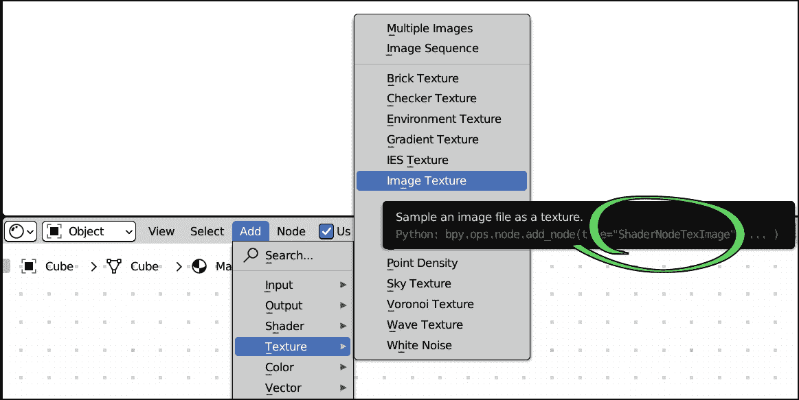

图 12.7：悬停在添加菜单项上会在提示中显示节点类型

这样，我们可以创建一个新的纹理节点，并将其`image`属性设置为从磁盘加载的图像：

```py
            tree = mat.node_tree
            tex_img = tree.nodes.new("ShaderNodeTexImage")
            tex_img.image = img
```

添加到图中的纹理节点现在已准备好创建连接链接。

## 连接节点

虽然大多数纹理输出可以直接连接到着色节点，但某些输入类型可能需要在之间使用辅助节点。最突出的情况是细节，或**法线贴图**。在创建新连接之前，我们的代码应该检查是否需要额外的节点。

### 连接图像颜色

可以使用`node_tree.links.new`方法创建连接链接。它的参数如下：

+   出节点输出插座

+   接收节点的输入插座

如果我们不是在处理法线贴图，我们可以将纹理的 `"Color"` 输出连接到活动节点的输入。不需要其他操作，因此我们可以使用 `continue` 来传递到下一个输入：

```py
            if inp != "Normal":
                tree.links.new(tex_img.outputs["Color"],
                               target_node.inputs[inp])
                continue
            # normal map code follows
```

一个 `normal` 输入不会触发 `continue`，因此我们不需要为它添加 `else` 语句：法线贴图代码随后，无需额外缩进。

### 连接法线贴图

仅使用几何形状渲染一个详细的表面将需要如此多的多边形，以至于生成的模型将过于庞大，无法存储或显示。

**法线贴图**使用 RGB 到 XYZ 转换在图像的像素中存储几何细节。

由于以这种方式存储的法线必须与原始法线合并，因此法线纹理不应直接连接到着色器节点；相反，它应通过一个 **NormalMap** 节点传递。

我们可以使用 `new` 在树中添加一个 `"ShaderNodeNormalMap"`：

```py
            normal_map = tree.nodes.new(
                                      "ShaderNodeNormalMap"
                                     )
```

`normal_map` 的 `"Normal"` 输出可以通过以下代码连接到节点输入：

```py
            tree.links.new(normal_map.outputs["Normal"],
                           target_node.inputs[inp])
```

然后，我们必须将 `tex_img` 连接到 `normal_map` 节点：

```py
            tree.links.new(tex_img.outputs["Color"],
                           normal_map.inputs["Color"])
```

一旦 `inp, fname` 循环结束，我们可以返回 `'FINISHED'` 状态并退出：

```py
        return {'FINISHED'}
```

由于此脚本旨在使设置纹理更快，我们可以添加一个操作符按钮以快速执行。

## 添加标题按钮

我们在这本书的大部分操作符中使用了菜单，但这次，我们将在 **Shader Editor** 区域的顶部栏中添加一个按钮——即其标题栏。步骤与添加菜单项时使用的步骤相同：

1.  创建一个接受两个参数 `self` 和 `context` 的函数。

1.  当插件注册时，将此函数附加到标题类型中。

使用 `NODE_TEXTURE`。`layout.operator` 方法将 `AddTextures` 显示为标题按钮：

```py
def shader_header_button(self, context):
    self.layout.operator(AddTextures.bl_idname,
                         icon="NODE_TEXTURE",
                         text="Load Textures")
```

现在，是时候注册操作符和标题函数了。我们可以通过查看 Blender 的源文件 `space_node.py` 来找到我们正在寻找的标题类 `NODE_HT_header`。可以通过右键单击并选择 **Edit Source** 将此文件加载到 Blender 的文本编辑器中。我们可以在 **Shader Editor** 区域的标题的任何元素上这样做：

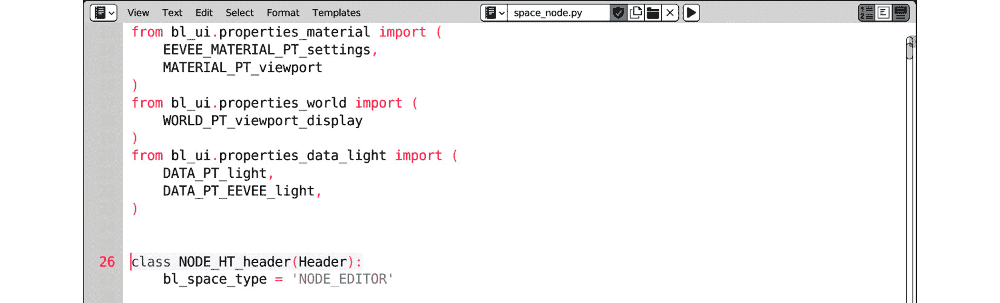

图 12.8：NODE_HT_header 是 space_node.py 中的第一类

作为替代方案，我们可以使用 Blender 的 Python 控制台中的 `comprehension` 打印所有标题类型的列表。我们已经在 *第八章* 中学习了如何这样做：

```py
>>> [c for c in dir(bpy.types) if
     "header" in c]
['CLIP_HT_header', 'CONSOLE_HT_header', 'DOPESHEET_HT_header', 'FILEBROWSER_HT_header', 'GRAPH_HT_header', 'IMAGE_HT_header', 'IMAGE_HT_tool_header', 'INFO_HT_header', 'NLA_HT_header', 'NODE_HT_header', 'OUTLINER_HT_header', 'PROPERTIES_HT_header', 'SEQUENCER_HT_header', 'SEQUENCER_HT_tool_header', 'SPREADSHEET_HT_header', 'STATUSBAR_HT_header', 'TEXT_HT_header', 'USERPREF_HT_header', 'VIEW3D_HT_header', 'VIEW3D_HT_tool_header']
```

`NODE_HT_header` 在列表的中间。我们必须在 `register` 函数内部将其添加到我们的条目中：

```py
def register():
    bpy.utils.register_class(AddTextures)
    bpy.types.NODE_HT_header.append(shader_header_button)
```

在 `unregister` 中，当插件禁用时，我们必须删除我们的界面和类： 

```py
def unregister():
    bpy.types.NODE_HT_header.remove(shader_header_button)
    bpy.utils.unregiser_class(AddTextures)
```

现在插件已经准备好了，我们可以用它来即时加载纹理。

## 使用加载纹理

如果 `ch12` 文件夹被添加到 **Scripts** 路径，我们可以在 **Add-ons** 预设的 **Learning** 类别中启用 **Textament**：

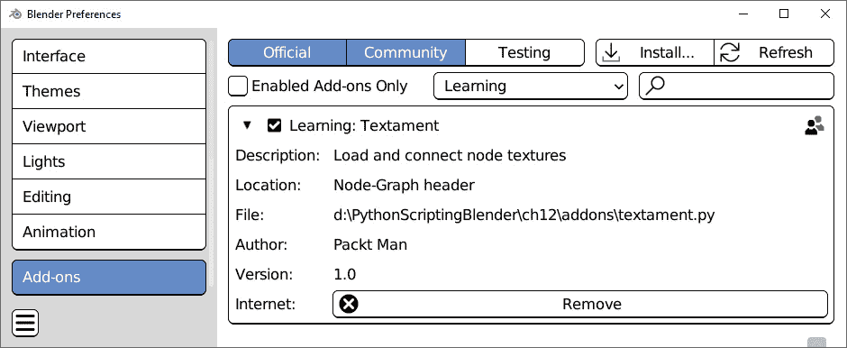

图 12.9：启用“Textament”插件

一旦启用，将在**着色器** **编辑器**标题栏中添加一个名为**加载纹理**的按钮：

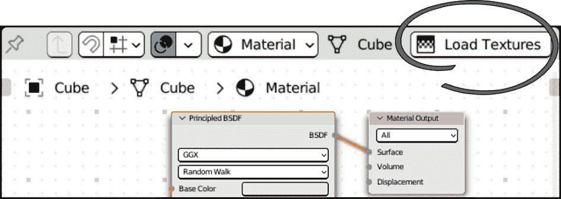

图 12.10：着色器编辑器标题栏中的加载纹理按钮

选择一个节点后，你可以点击**加载纹理**按钮，这将打开**文件** **浏览器**区域。

要在简单模型上测试此插件，我们可以通过以下步骤将砖墙材质应用到默认立方体上：

1.  打开 Blender 或通过**文件** | **新建** | **通用**返回默认场景。

1.  使用窗口顶部的选项卡切换到**着色**工作区。

1.  在**着色器编辑器**区域的标题栏中点击**加载纹理**。

1.  在**文件浏览器**区域，导航到一个包含图像的文件夹。本章伴随的纹理可以在[`github.com/PacktPublishing/Python-Scripting-in-Blender/tree/main/ch12/_media_/textures`](https://github.com/PacktPublishing/Python-Scripting-in-Blender/tree/main/ch12/_media_/textures)找到。

1.  可选地，我们可以通过点击右上角的缩略图按钮将**文件浏览器**区域切换到**缩略图**模式。这对于寻找纹理很有用：

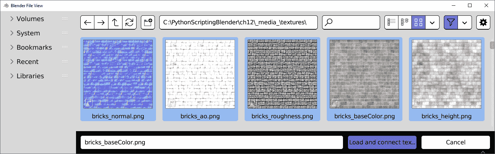

图 12.11：文件浏览器区域的“加载并连接”缩略图

1.  我们可以通过套索、*Ctrl* + 点击或按*A*键来选择多个文件。

1.  点击**加载并连接**将纹理添加到图中。

`bricks_baseColor`、`bricks_normal`和`bricks_roughness`纹理现在是材质的输入，使立方体看起来像砖墙：

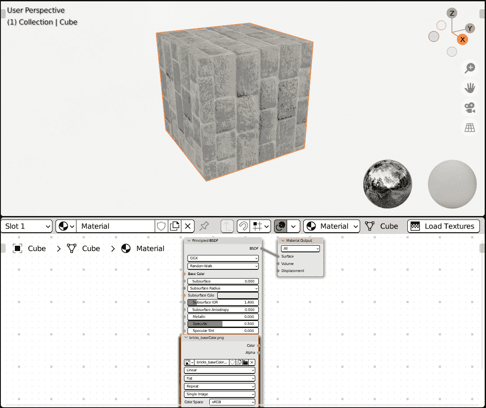

图 12.12：砖纹理加载到着色器编辑器区域

操作员成功，但所有节点都创建在图的中心。我们可以通过添加重新排列节点的代码来显著改进这一点。

# 改进加载纹理

可以通过设置节点`location`属性的`x`和`y`属性来将节点移动到不同的位置。这允许我们在脚本中排列它们。

## 安排着色器节点

即使我们可以自由移动节点，API 也带来了一些限制：

+   我们无法访问插座的精确位置

+   新节点的高度和宽度在脚本中不可用

这两个问题中的任何一个都是可以容忍的，因为我们可以在节点输入的高度移动节点，或者实时获取新节点所需的空间。由于它们同时发生，我们将求助于一个解决方案。

### 假设节点间距

我们无法在脚本中获取新节点的大小，但我们可以通过查看现有的着色器树来预先了解纹理节点默认的大小。例如，在使用`'Image' `Texture'`节点的`dimensions`属性后：

```py
>>> node_tree = C.object.active_material.node_tree
>>> node_tree.nodes['Image Texture'].dimensions
Vector((360.0, 410.0))
```

`dimensions` 返回的 `Vector` 属性包含节点的边界框，而不是节点的精确尺寸。我们可以通过查询节点的 `width` 来验证这一点：

```py
>>> node_tree = C.object.active_material.node_tree
>>> node_tree.nodes['Image Texture'].width
240.0
```

即使存在，`height` 属性也没有帮助，因为它尚未更新，其值保持在 `100.0` 不变。

尽管 API 存在这种弱点，但我们有足够的信息来重新排列我们的树：在两个节点之间留下 `100.0` 单位的空间为连接留出足够的空间，因此我们可以在纹理和初始节点之间使用 `340.0` 单位的间距。

我们必须在操作符的声明中存储该值：

```py
class AddTextures(bpy.types.Operator, ImportHelper):
    """Load and connect material textures"""
    bl_idname = "texture.textament_load"
    bl_label = "Load and connect textures"
    bl_description = "Load and connect material textures"
    _spacing = 340.0
```

为了垂直排列我们的节点，我们需要以正确的顺序处理它们。

### 节点创建排序

为了以正确的方式垂直排列节点，我们需要在处理它们的同时遵循目标节点布局中的插座顺序；否则，连接链接会相互交叉：

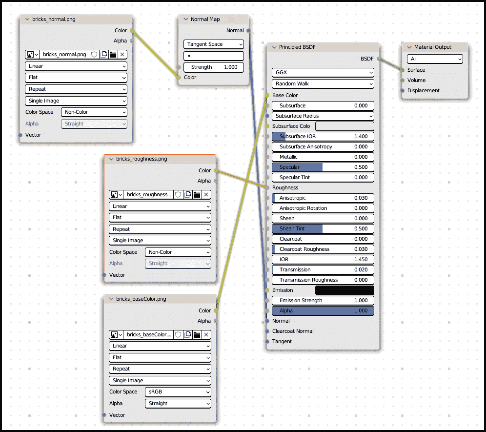

图 12.13：无序的垂直排列导致混乱、令人困惑的链接

Python 字典按设计是无序的，因此 `matching_names` 不遵循任何顺序，但 `input_names` 列表是按顺序排列的。通过使用 `matching_names` 过滤它，我们可以获得匹配输入的有序列表：

```py
        sorted_inputs = [
              i for i in input_names if i in matching_names
             ]
```

我们必须将 `for inp, fname in matching_names.items()` 循环替换为 `sorted_inputs` 的迭代。由于我们需要一个序号来进行垂直间距，我们必须使用 `enumerate` 来获取当前输入的索引。以下是新的图像循环：

```py
        for i, inp in enumerate(sorted_inputs):
            img_path = os.path.join(self.directory,
                                    matching_names[inp])
            img = bpy.data.images.load(img_path,
                                       check_existing=True)
            if target_node.inputs[inp].type != 'RGBA':
                img.colorspace_settings.name = 'Non-Color'
            img_node = mat.node_tree.nodes.new(
                                      "ShaderNodeTexImage")
            img_node.image = img
```

在连接纹理节点之后，我们可以更改其位置。我们首先使用与 `target_node` 相同的坐标，然后通过从 `location.x` 减去 `_spacing` 来将纹理向左移动：

```py
            img_node.location = target_node.location
            img_node.location.x -= self._spacing
```

我们可以通过从 `location.y` 减去 `self._spacing` 来向下移动纹理节点。我们正在垂直堆叠节点，因此它们的 `y` 坐标取决于它们的序号索引。第一个节点（索引为 `0`）将完全保持在初始位置不动，第二个节点向下移动 `self._spacing` 倍的 `1`，第三个向下移动 `self._spacing` 倍的 `2`，依此类推：

```py
            img_node.location.y -= i * self._spacing
```

连接 `ShaderNodeNormalMap` 需要水平空间，因此，在我们将 `normal_map` 与其 `img_node` 对齐后，我们必须通过将纹理向左移动和将 `normal_map` 向右移动一半的 `_spacing` 来腾出一些空间：

```py
            normal_map = mat.node_tree.nodes.new(
                                      "ShaderNodeNormalMap"
                                     )
            normal_map.location = img_node.location
            img_node.location.x -= self._spacing / 2
            normal_map.location.x += self._spacing / 2
```

现在，我们必须保存插件并更新它，通过点击 *F3* 并选择**重新加载脚本**。启动**加载纹理**设置了一个正确排列的节点树：

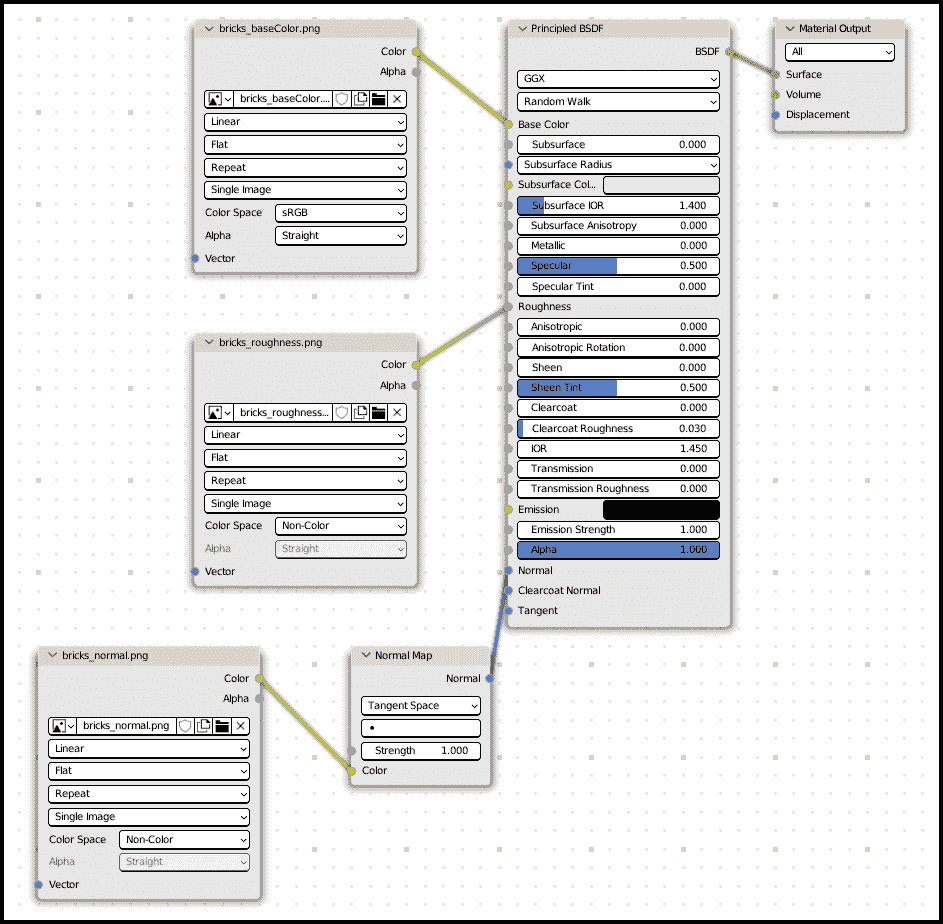

图 12.14：纹理设置，节点排列

现在基本功能已经完成，我们可以实现一个选项来自定义材质的颜色。

## 混合基础颜色

有时候，即使我们对纹理设置感到满意，我们仍然想要在保留纹理图案的同时更改颜色。我们可以通过在原则节点`Base Color`属性之前添加一个**MixRGB**节点来实现这一点：

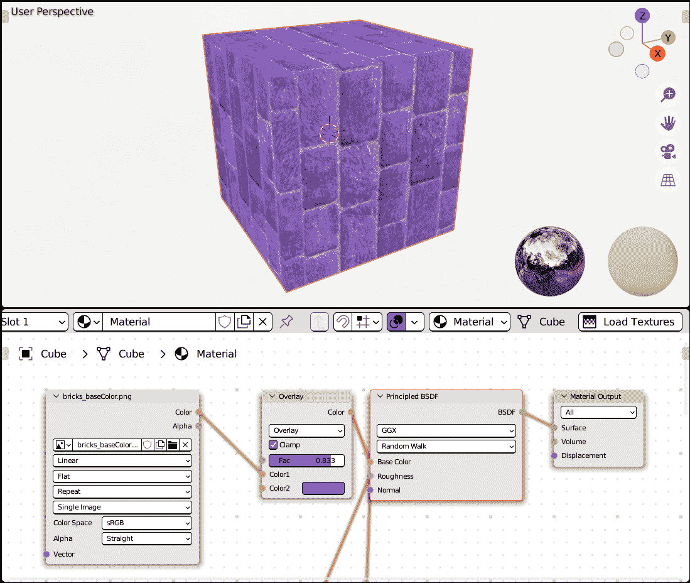

图 12.15：使用 MixRGB 节点影响材质颜色

**MixRGB**节点具有一个用于混合两种颜色的因子滑块（**Fac**）。默认的混合类型**Mix**用**Color2**替换**Color1**，但计算机图形学中已知的其他混合模式，如**Multiply**、**Overlay**和**Color Dodge**，也是可用的。

`ShaderNodeMixRGB`节点的 Python 设置与`"Base Color"`类似，我们创建一个中间节点：

```py
            if inp == "Base Color":
                mix = mat.node_tree.nodes.new(
                                        "ShaderNodeMixRGB")
```

然后，我们将图像纹理和**Mix**节点对齐，并为额外的连接链接留出空间：

```py
                mix.location = img_node.location
                img_node.location.x -= self._spacing / 2
                mix.location.x += self._spacing / 2
```

我们将图像颜色连接到**Mix**节点的`"Color1"`输入：

```py
                mat.node_tree.links.new(
                                 img_node.outputs["Color"],
                                 mix.inputs["Color1"])
```

在这个阶段，我们应该连接`img_node`变量。

这样，通过连接所有其他输入（除了`"Normal"`）的同一行代码，我们就可以将`target_node`连接起来：

```py
                img_node = mix
            if inp != "Normal":
                tree.links.new(tex_img.outputs["Color"],
                               target_node.inputs[inp])
                continue
```

如果我们执行**重新加载脚本**然后再次启动**加载纹理**，就会创建一个类似于*图 12.15*中显示的混合布局。我们可以点击**Color2**属性并从拾色器中选择颜色，或者从下拉菜单中更改**Mix**节点的**混合模式**。

我们还可以尝试不同的解决方案。例如，我们可以使用`"ShaderNodeMixRGB"`与`"ShaderNodeHueSaturation"`以及`"Color1"`与`"Color"`。

节点树很有趣，因为它们可以被视为可视化编程，但即使是加载几个纹理这样的简单操作，如果手动进行，也可能需要花费时间。

这次，我们不需要为操作混合颜色创建界面，因为混合节点已经提供了它，所以我们能够结合两种过程方法的优点。

# 摘要

在本章中，我们学习了材质的工作原理以及如何在**着色器编辑器**区域中创建和连接节点。我们还学习了图像纹理如何改变着色物体的外观以及它们如何存储非颜色数据。

这是我们第一次接触节点树，这是一种通用的可视化编程方法，不仅限于着色器，并计划在未来扩展到变形和绑定。

基于节点的系统灵活且强大，但它们从脚本工具中受益，就像 Blender 的其他所有方面一样。

渲染并不是生产的最终步骤，因为合成和编辑在计算机图形管道中紧随其后。但既然这一阶段将三维数据转换为图像，它通常被认为是 3D 工作流程的最后一步。

这就结束了我们对 Blender 脚本工作原理的探索。我们已经涵盖了对象创建、变形、动画和渲染，但最重要的是，工具的设计和实现方式，以及如何克服软件的限制。

这些技能，结合个人才能和经验，使技术指导员能够在艺术需求与软件能力之间架起桥梁，赋能他们的团队，并在过程中提高他们的能力和理解。 

# 问题

1.  Blender 中存在多少渲染引擎？

1.  “材质”和“着色器”这两个词有相同的意思吗？

1.  着色器节点是预先定义的值，用于确定对象的外观，还是独立执行操作的单独单元？

1.  我们能否使用图像为对象着色？

1.  我们能否在不同数据类型之间建立联系？

1.  我们如何在图中排列节点？

1.  在我们的着色器中，我们能否改变来自图像的颜色？

# 附录

Blender 和 Python 如此庞大，以至于即使是针对短列表用例编写脚本也涵盖了广泛的技能和学科。本书包含了动画、绑定和着色元素，并在探索这些过程中介绍了编程技术。

本附录包含一个全面的总结，可以作为复习，帮助读者巩固本书探讨的概念，并帮助读者在章节之间导航。

# 第一部分：Python 简介

本节涵盖了脚本编写的基础知识，并帮助您熟悉 Blender 的 Python 实用工具。除了为后续章节提供坚实的基础外，它还包含了编写完整工作工具所需的所有信息。

## 第一章，Python 与 Blender 的集成

本章介绍了用于脚本编写的工具，内部和外部文本编辑器，以及版本控制。

这里总结了本章讨论的主题。

### 在主要操作系统上安装多个版本的 Blender

Blender 3.3 是写作过程中使用的*长期支持*版本。尽管本书的内容对所有 3.x 系列的 Blender 版本都有效，但如果您想在其他版本旁边安装 3.3 版本，以下提供了相应的说明：

+   使用 Windows 安装程序

+   使用 Microsoft Store

+   下载便携式存档

+   在 macOS 上安装

### 在 Blender 中使用 Python

**脚本**工作区是一个针对快速运行 Python 优化的 Blender 布局。它包括一个交互式控制台、一个列出过去操作命令的记录器，以及一个可以运行脚本的文本编辑器。我们将通过以下主题熟悉它：

+   使用“Hello World！”示例产生控制台输出

+   如何从**信息日志**中复制和粘贴 Python 指令

+   使用脚本检查 Blender 和 Python 的当前版本

+   函数和参数的解释

### 使用外部编辑器和版本控制工具

尽管文本编辑器快速且有用，但程序员通常还会利用外部代码编辑器。本书中使用的是来自**Microsoft**的多平台编辑器**Visual Studio Code**，但还有许多替代方案。**版本控制**工具是用于存储代码更改历史的实用工具。我们通过以下主题学习如何使用这些工具：

+   在 Visual Studio Code 中加载文件夹

+   在 Blender 文本编辑器中刷新文本文件

+   初始化和使用**Git**仓库

## 第二章，Python 实体和 API

本章解释了如何使用脚本与 Blender 交互，如何利用开发者功能，以及**应用程序编程接口**（**API**）的工作原理。

以下各节是本章讨论主题的摘要。

### 开发者用户界面功能

在 Blender 首选项的**界面**部分有两个有用的选项：

+   **开发者附加功能**：当我们在界面元素上右键单击时，它会显示**编辑源**选项，以便我们可以轻松访问**用户界面**（**UI**）的 Python 源代码。它还使非 UI 操作员在搜索栏中可用。

+   **Python 提示**：此功能显示鼠标光标下 UI 元素的相对 Python 属性。

### 开发者控制台功能

交互式控制台提供了两个方便的功能，用于快速脚本编写：

+   通过按*Tab*键进行代码自动补全

+   通过按上箭头键查看命令历史

### 开发者视图功能

包含在 Blender 中并提供在**首选项** > **插件**对话框中**3D 视图**部分的**Math Vis (Console)**插件显示三维数学实体，如*向量*和*矩阵*在 3D 视图中。当处理对象位置和旋转值时可能很有用。

### 使用 Blender 模块

在脚本中使用`import`语句访问 Blender 的 Python 模块`bpy`。它的每个组件都涵盖 3D 应用程序的特定方面。最值得注意的是，`data`包含当前会话中所有可用的对象，而`context`包含用户交互的当前状态，例如当前选择。API 文档可在网上查看，也可以使用`help()`函数查看。

### 使用对象集合

对象列表通过`bpy_collection`访问，这是一种类似于 Python `dictionary`的聚合类型。集合的元素可以通过数字索引或关键字访问，并且可以在 Python 循环中迭代。

像重命名这样的操作可以重新排序集合的元素，因此在顺序至关重要时建议转换为`list`。

Blender 集合没有`append()`方法：使用`new()`方法创建新对象，该对象将自动附加。`remove()`方法从集合中删除元素并将其从 Blender 中删除。

### 上下文和用户活动

用户可以通过添加或选择对象来更改 Blender 的当前状态或上下文。最后选中的对象被认为是*活动*的，并且是对象相关操作的主要目标。

上下文信息作为`bpy.context`的属性可用，是只读的，并且只能间接更改。例如，`ob.select_set(True)`用于选择一个对象，因为它不可能追加到`bpy.context.selected_objects`列表中。

## 第三章，创建您的附加功能

本章说明了创建 Blender 附加功能的过程：可以作为 Blender 插件安装的 Python 脚本，以添加自定义功能。

下面是本章讨论主题的总结。

### 编写附加功能的脚本

附加功能是包含名为`bl_info`的字典的 Python 模块或包。此字典包含有关附加功能的作者和名称等信息。附加功能必须提供两个函数，`register()`和`unregister()`，用于在启用或禁用附加功能时使用。

附加功能可以在 Blender 首选项中安装，但将它们开发的文件夹设置为*F3*键搜索栏中的*重新加载脚本*。

### 编写对象收集器，一个将对象分组在 Outliner 中的附加功能

向 Blender 添加功能涉及创建一个操作符，即可以从用户界面启动的指令。`bl_idname`和`bl_label`属性决定了操作符在 Blender 中的查找和显示方式，而`poll()`和`execute()`函数则规定了何时可以启动以及运行时会发生什么。

附加功能在其`register()`和`unregister()`函数中向 Blender 添加操作符。

### 处理附加功能的技巧

当使用外部编辑器时，启用自动保存可能有助于确保 Python 脚本始终包含最新的更改。

从开发文件夹启用附加功能可能会留下*字节码*，即名为`__pycache__`文件夹中的 Python 编译文件。如果我们使用 Git 版本控制，我们可以创建一个名为`.gitignore`的文本文件，其中包含`__pycache__`以避免字节码文件被版本化。

### 使用 try 和 except 避免重复

为了防止我们的脚本创建相同的集合两次，导致重复，我们在`try`语句中查找集合，并添加一个`except KeyError`块，当找不到集合时触发。通过在`except`语句下创建新的集合，我们确保具有给定名称的集合只创建一次。try/except 模式被称为*宽恕而非许可*，因为它侧重于从非允许的操作中撤回，而不是检查操作是否首先可行。

我们使用`title()`字符串方法为具有大写首字母的名称提供良好的格式化。我们可以创建函数将我们的运算符添加到 Blender 菜单中。它们接受`self`和`context`参数，并将运算符添加到`self.layout`。菜单函数通过附加组件的`register()`和`unregister()`函数添加到 Blender 中。

## 第四章，探索对象变换

本章展示了如何使用 Python 影响对象的`location`、`rotation`和`scale`，以及变换信息在 Blender 中的存储方式。

这里是本章讨论主题的总结。

### 使用 Python 移动和缩放对象

`location`存储为三维向量的`x`、`y`和`z`坐标。向量的坐标可以单独或一起更改，使用元组赋值。

`scale`也存储为`x`、`y`、`z`向量。虽然`location`的其余值具有`(0.0, 0.0, 0.0)`坐标，但未缩放对象的`scale`属性是`(1.0,` `1.0, 1.0)`。

### 旋转的奇特之处

旋转比`location`和`scale`更复杂，因为三个轴上的旋转值可能会相互影响，导致一个称为*万向节锁*的问题。

旋转有多种表示方式；一些涉及多维实体，如四元数或旋转矩阵，以及两种角度度量单位：*度*和*弧度*。Blender 对象具有每个表示系统的属性，可以通过 Python 设置。提供了转换实用工具，用于在一种表示系统之间切换。

### 使用父亲和约束进行间接变换

对象可以按层次排列。层次中较高的对象（*父对象*）的变换会影响其下的所有对象（*子对象*）。

约束是另一种在不影响其通道的情况下转换对象的方法。它们可以通过使用`constraints`集合的`new()`方法添加。

### 使用矩阵变换对象

为`location`、`rotation`和`scale`通道设置值会影响对象的相对坐标。分配一个变换矩阵允许我们使用世界空间坐标。除非另有说明，矩阵值是延迟复制的；如果我们想存储一个矩阵作为变量并且不希望其值改变，我们需要使用它的`copy()`方法。

在 Python 中将对象作为变换对象进行父化会改变对象位置，除非在`matrix_parent_inverse`属性中设置了反向变换。

### 编写 Elevator，一个为所选对象设置楼层的附加组件

当启动时可以设置的`FloatProperty`运算符。可以通过切换其`BoolProperty`成员启用可选行为。

必须将可编辑属性作为*注释*、Python 任意属性添加。

在层次结构顶部移动父对象以避免重复变换。可以可选地使用约束。

## 第五章，设计图形界面

本章解释了如何添加自定义面板并将它们添加到 Blender 界面中。

下面是本章讨论主题的总结。

### UI 组件

Blender 窗口结构为区域、区域和面板。面板使用 Python 填充文本、图标和按钮的布局。

### 编写 Simple Panel 插件

此插件注册了一个简单的`Panel`类，该类在`row()`或`column()`方法中显示文本和图标，使用`split()`显示非均匀列，使用`grid_flow()`显示均匀表格。

可以使用**图标查看器**插件或在某些情况下使用 Python 的字符串格式化查找 Blender 图标名称。

可以使用红色和灰色颜色通过小部件的`alert`或`enabled`标志提供视觉反馈。

使用`operator()`方法添加到布局中的操作员将显示为按钮。

# 第二部分：交互工具和动画

本节解释了如何将插件编写为文件夹而不是单个文件，与动画系统交互，并编写等待用户输入的模式操作员。在本节结束时，您将能够编写高级的交互式工具。

## 第六章，构建我们的代码和插件

本章解释了如何编写包含文件夹中多个文件的插件，并分发这些插件。

下面是本章讨论主题的总结。

### 模块、包和插件之间的关系

虽然单个`.py`文件是一个 Python 模块，但包含`.py`文件的文件夹是一个 Python 包。包包含一个名为`__init__.py`的文件。如果我们的包是插件，则此文件必须包含`bl_info`字典。

### 分区代码的指南

通过不同的`.py`文件分离代码的一些标准如下：

+   媒体加载器

+   通用代码与特定代码

+   界面代码

+   操作员模块

+   导入模块的使用

例如，所有用于加载自定义图标（如*第五章*中所述）的代码都可以移动到名为`img_loader.py`的模块中。

只有`__init__.py`文件会被`importlib.reload()`函数重新加载。

可以在`preferences.py`文件中编写用于显示插件首选项的面板，而`panel.py`和`operators.py`分别包含 UI 和插件操作员。

将压缩为`.zip`存档的插件文件夹可以使用**首选项** | **插件** | **安装**按钮安装。

## 第七章，动画系统

本章解释了如何在 Blender 中动画化对象，以及如何使用 Python 创建和编辑动画。

下面是本章讨论主题的总结。

### 动画系统

**布局**和**动画**工作空间在**时间轴**上显示动画关键帧，包括场景动作、关键帧和范围。关键帧确定了某个时间点的属性值。

### 编写 Action to Range 插件

此附加组件将播放的开始和结束设置为活动对象当前动作的第一帧和最后一帧。如果屏幕上显示时间轴，它将重新居中到新的范围。为此，使用`context.temp_override()`将时间轴区域传递给`bpy.ops.action.view_all()`工厂操作符。

### 编写 Vert Runner 附加组件

此附加组件沿着活动对象的顶点动画化所选对象。读取存储在`context.object.data.vertices`中的顶点坐标，同时使用三角函数计算将对象定向到其下一个位置的最短旋转弧。

## 第八章，动画修改器

本章介绍了用于动画 f 曲线的非破坏性修改器及其在动画程序效果中的应用。

下面是本章讨论主题的总结。

### 添加 f 曲线修改器

可以通过在图编辑器中选择曲线并从 f 曲线的`modifiers`集合中点击`new()`方法来添加 f 曲线修改器。

### 编写震动附加组件

此附加组件使用**噪声**f 修改器在活动对象上添加颤抖效果，并允许设置颤抖的持续时间和数量。*软限制*对噪声强度参数设置初始限制，同时仍然允许您使用键盘输入超出范围的值。我们添加了一个菜单项，通过在视图中右键单击菜单调用此操作符。

## 第九章，动画驱动器

本章介绍了动画驱动器，它们是用于控制复杂动作的不同属性之间的连接。驱动器可以在其逻辑中包含简短的 Python 表达式。

下面是本章讨论主题的总结。

### 创建和设置驱动器

可以通过从 Blender 属性的右键单击菜单中选择**复制为新驱动器**和**粘贴驱动器**来快速创建驱动器。使用对象的定位作为其旋转的输入创建了一个轮设置，因为当对象移动时，对象会旋转。

### 使用 Python 驱动器

通过在编辑 Blender 属性时按*#*键，然后输入 Python 代码，可以快速创建基于 Python 表达式的驱动器。可以使用三角周期函数如`sin`创建振荡运动，并将物理课堂中的摆动方程实现为驱动器表达式。可以将对象自定义属性用作驱动器表达式中的参数。

### 编写摆动附加组件

此附加组件立即设置摆动表达式和参数。通过使用`object.driver_add()`方法添加驱动器。

## 第十章，高级和模态算子

本章解释了如何通过丰富执行流程和实现可选方法来编写高级算子。

下面是本章讨论主题的总结。

### 算子执行细节

`Operator` 的 `invoke()` 方法，如果已定义，则在启动操作时运行。在 `invoke()` 内部，我们可以切换到 `execute()` 方法或 `modal()` 方法。后者监听用户输入，如按键或鼠标移动。

### 编写 PunchClock 扩展插件

此插件在场景中创建时间格式化的文本。其操作符在 `invoke()` 中使用 Python `datetime` 工具设置其小时和分钟参数的初始值。当将操作符添加到菜单时，布局的 `operator_context` 设置为 `"INVOKE_DEFAULT"`，以确保 `invoke()` 的执行永远不会被跳过。

### 模态行为

操作符被添加到模态处理程序中，以便在 UI 的每次更新时运行其 `modal()` 方法。在模态内部，`"MOUSEMOVE"` 事件更改显示的小时和分钟。

### 自定义撤销面板

在通过实现 `draw()` 方法自定义执行后，撤销面板显示操作符属性。使用此方法，我们可以使用在 *第五章* 中学到的相同技术设计图形界面。

# 第三部分：输出交付

本节涵盖了 3D 管道的最终阶段：变形和渲染。

## 第十一章，对象修饰符

本章介绍了对象修饰符及其在动画中的应用。

下面是本章讨论主题的总结。

### 添加对象修饰符

修饰符分为四个类别：**修改**、**生成**、**变形**和**物理**。它们通过在 **修饰符** 属性中点击 **添加修饰符** 按钮来创建。

### 在 Python 中添加修饰符

`object.modifiers` 集合的 `new()` 方法需要一个 `type` 修饰符作为参数。可以通过访问 `bpy.types.ObjectModifiers.bl_rna.functions["new"]` 函数并查询其 `parameters["type"].enum_items` 来找到可能的 `type` 关键字列表。

### 编写 Latte Express 扩展插件

此插件设置一个 **晶格** 修饰符，使用三维网格笼变形对象。它通过查询其边界框找到模型的中心，并为改变晶格和对象的分辨率提供了输入参数。

### 使用骨架变形器

骨架通过变形骨架影响角色。在切换到 `bpy.ops.object.mode_set()` 后，可以使用 `object.data.edit_bones.new()` 在 Python 中创建骨骼。

在晶格对象上创建顶点组以将晶格顶点绑定到骨架骨骼。这样，可以通过脚本创建由骨架变形的晶格。

### 创建控制形状

用自定义线框形状替换默认的八面体形状使骨架更符合动画师的需求。因此，可以使用 `mesh.from_pydata` 方法在 Python 中创建一个简单的网格，并将其分配给 `pose_bone.custom_shape` 属性。

## 第十二章，渲染和着色器

本章介绍了渲染和材质、着色器编辑器及其节点树。尽管可能还有一些步骤，如后期处理和视频编码，但渲染通常被认为是 3D 流程的最后阶段。

下面是本章讨论主题的总结。

### 渲染的工作原理

像 Blender 的 **Eevee** 或 **Cycles** 这样的渲染引擎使用 *着色器* 将 3D 几何形状转换为完成的图像，以确定对象的外观。Blender 着色器是由称为节点的操作网络组成，即通过连接它们的输入/输出插孔来详细阐述和交换颜色和几何信息的块。

### 编写 Textament 插件

此插件从磁盘导入图像并创建 `ImportHelper` 和 `Operator`，并在调用时显示 Blender 文件浏览器。用户选择的文件作为 `directory` 和 `files` 成员属性访问。

### 在文件名中查找不区分大小写的匹配项

大写字母和空格可能会导致不希望的匹配错误，例如 `"base color"` 字符串没有与 `"Base Color"` 关联。可以使用常规语法编写字符串操作函数，或者使用一行 `lambda` 表达式定义。删除所有空格并将所有字母转换为小写的结果如下：

`lambda x : x.lower().replace(" ", "")`

### 图像中的非颜色数据

图像可以包含几何或遮罩信息。在这种情况下，必须将 `colorspace_setting.name` 图像属性设置为 `"Non-Color"`，否则 Blender 将应用颜色过滤器，这会污染信息。

### 在着色器中连接图像

将 `"ShaderNodeTexImage"` 作为 `node_tree.nodes.new("ShaderNodeTexImage")` 的参数创建，允许你在着色器中使用图像。使用 `node_tree.links.new()` 创建纹理节点和着色器节点输入之间的连接。

*法线贴图* 纹理提供了细节的错觉。它们必须连接到 **Normal Map**，然后连接到着色器的 **Normal** 输入。

### 在标题中添加自定义按钮

可以像在菜单中添加操作员一样在标题中添加操作员：使用一个接受 `self` 和 `context` 参数的函数，并将元素添加到 `self.layout`。此函数附加到插件 `register()` 函数中的 *标题类型*。

### 在节点编辑器中排列节点

在 Python 中创建的节点位于编辑器的中心，并且相互重叠。可以通过设置它们的 `location` `x` 和 `y` 坐标来移动它们。它们应该放置在输出节点的左侧，并按照输出节点插孔的顺序垂直排列。

### 修改纹理颜色

可以通过在纹理和其输出节点之间添加一个 **Mix** 节点来操纵纹理的颜色。这允许你改变物体的整体颜色，同时保留来自图像的细节。
