# 第三章。使用隐写术编码秘密信息

我们将从各种来源获取智能数据。在上一章中，我们在万维网（WWW）中进行了搜索。我们可能会使用自己的相机或录音设备。在本章中，我们将探讨图像处理和编码。

要在 Python 中处理图像，我们需要安装 Pillow。这个库为我们提供了处理图像文件的软件工具。Pillow 是较老 PIL 项目的分支；与 PIL 相比，Pillow 使用起来更方便。

在此过程中，我们将访问一些额外的 Python 编程技术，包括：

+   我们将回顾 Python 如何与操作系统文件协同工作，并查看一些常见的物理格式，包括 ZIP 文件、JSON 和 CSV。

+   我们将介绍 JPEG 文件，并学习使用 Pillow 处理它们。在我们可以使这成为可能之前，我们必须安装 Pillow。

+   我们将探讨几种图像转换，例如获取 EXIF 数据、创建缩略图、裁剪、增强和过滤。

+   我们将探讨如何调整构成整数值的各个单独的比特位。

+   我们还将了解如何与 Unicode 字符协同工作，以及字符如何编码成字节。

+   学习与 Unicode 字符协同工作将使我们能够在图像文件的像素中编码数据。我们将探讨两种常见的隐写术算法。

+   我们还将快速浏览一下安全散列。这将向我们展示如何创建在传输过程中无法更改的消息。

Python 是一种非常强大的编程语言。在本章中，我们将看到许多高级功能。我们还将为下一章查看网络服务和地理编码打下基础。

# 背景简报 - 处理文件格式

如我们所观察到的，我们的数据以广泛的物理格式存在。在 第一章，*我们的间谍工具包* 中，我们探讨了 ZIP 文件，它包含其他文件的存档。在 第二章，*获取情报数据* 中，我们探讨了 JSON 文件，它序列化了多种 Python 对象。

在本章中，我们将回顾一些以前的技术，然后具体探讨与 CSV 文件协同工作。重要的是要查看我们可能需要与之协同工作的各种图像文件。

在所有情况下，Python 鼓励将文件视为一种上下文。这意味着我们应该努力使用 `with` 语句打开文件，以确保在处理完成后文件能够正确关闭。这并不总是完美无缺，因此存在一些例外。

## 与操作系统文件系统协同工作

有许多用于处理文件的模块。我们将关注两个：`glob` 和 `os`。

### glob

`glob` 模块实现了文件系统 *globbing* 规则。当我们在终端提示符中使用 `*.jpg` 时，标准的操作系统外壳工具将 *glob* 或将通配符名称扩展为实际文件名列表，如下面的代码片段所示：

```py
MacBookPro-SLott:code slott$ ls *.jpg
1drachmi_1973.jpg      IPhone_Internals.jpg
Common_face_of_one_euro_coin.jpg  LHD_warship.jpg
```

POSIX 标准是，在运行 `ls` 程序之前，`*.jpg` 应由 shell 展开。在 Windows 上，情况并不总是如此。

Python 的 `glob` 模块包含一个 `glob()` 函数，可以在 Python 程序内部完成这项工作。以下是一个示例：

```py
>>> import glob
>>> glob.glob("*.jpg")
['1drachmi_1973.jpg', 'Common_face_of_one_euro_coin.jpg', 'IPhone_Internals.jpg', 'LHD_warship.jpg']
```

当我们评估 `glob.glob("*.jpg")` 时，返回值是一个包含匹配文件名的字符串列表。

### os

许多文件具有 `path/name.extension` 格式。对于 Windows，使用设备前缀和反斜杠（`c:path\name.ext`）。Python 的 `os` 包提供了一个 `path` 模块，其中包含许多用于处理文件名和路径的函数，无论标点符号如何。由于 `path` 模块位于 `os` 包中，组件将具有两层命名空间容器：`os.path`。

我们必须始终使用 `os.path` 模块中的函数来处理文件名。该模块提供了许多分割路径、连接路径和从相对路径创建绝对路径的函数。例如，我们应该使用 `os.path.splitext()` 来将文件名与扩展名分开。以下是一个示例：

```py
>>> import os
>>> os.path.splitext( "1drachmi_1973.jpg" )
('1drachmi_1973', '.jpg')
```

我们已经将文件名与扩展名分开，而没有编写任何自己的代码。当标准库已经提供了这些功能时，就没有必要编写自己的解析器。

## 处理简单的文本文件

在某些情况下，我们的文件包含普通文本。在这种情况下，我们可以打开文件并按以下方式处理行：

```py
with open("some_file") as data:
    for line in data:
       ... process the line ...
```

这是最常见的处理文本文件的方式。`for` 循环处理的每一行都会包含一个尾随的 `\n` 字符。

我们可以使用简单的生成器表达式来去除每行的尾随空格：

```py
with open("some_file") as data:
    for line in (raw.rstrip() for raw in data):
       ... process the line ...
```

我们在 `for` 语句中插入了一个生成器表达式。生成器表达式有三个部分：一个子表达式（`raw.rstrip()`）、一个目标变量（`raw`）和一个源可迭代集合（`data`）。源可迭代集合 `data` 中的每一行都分配给目标 `raw`，并评估子表达式。生成器表达式的每个结果都可供外部的 `for` 循环使用。

我们可以将生成器表达式单独写成一行代码：

```py
with open("some_file") as data:
    clean_lines = (raw.rstrip() for raw in data)
    for line in clean_lines:
        ... process the line ...
```

我们将生成器表达式写在了 `for` 语句外面。我们将生成器——而不是结果集合——赋值给 `clean_lines` 变量，以明确其目的。生成器不会产生任何输出，直到另一个迭代器（在这种情况下是 `for` 循环）需要单独的行。实际上没有开销：处理只是从视觉上分开。

这种技术使我们能够将不同的设计考虑因素分开。我们可以将文本清理与 `for` 语句中的重要处理分开。

我们可以通过编写额外的生成器来扩展清理过程：

```py
with open("some_file") as data:
    clean_lines = (raw.rstrip() for raw in data)
    non_blank_lines = (line for line in clean_lines if len(line) != 0)
    for line in non_blank_lines:
        ... process the line ...
```

我们将两个预处理步骤分解为两个单独的生成器表达式。第一个表达式从每行的末尾删除 `\n` 字符。第二个生成器表达式使用可选的 `if` 子句——它将从第一个生成器表达式获取行，并且只有当长度不为 0 时才传递行。这是一个拒绝空白行的过滤器。最终的 `for` 语句只获取已经删除 `\n` 字符的非空白行。

## 与 ZIP 文件一起工作

一个 ZIP 存档包含一个或多个文件。要使用 `with` 与 ZIP 存档一起，我们需要导入 `zipfile` 模块：

```py
import zipfile
```

通常，我们可以使用类似以下的方式打开一个存档：

```py
with zipfile.ZipFile("demo.zip", "r") as archive:
```

这创建了一个上下文，这样我们就可以处理文件，并确保在缩进上下文结束时文件被正确关闭。

当我们想要创建一个存档时，我们可以提供一个额外的参数：

```py
with ZipFile("test.zip", "w", compression=zipfile.zipfile.ZIP_DEFLATED) as archive:
```

这将创建一个使用简单压缩算法来节省空间的 ZIP 文件。如果我们正在读取 ZIP 存档的成员，我们可以使用嵌套上下文来打开此成员文件，如下面的代码片段所示：

```py
    with archive.open("some_file") as member:
        ...process member... 
```

正如我们在 第一章 中所展示的，*我们的间谍工具包*，一旦我们为读取打开了成员，它就类似于一个普通的操作系统文件。嵌套上下文允许我们对该成员使用普通的文件处理操作。我们之前使用了以下示例：

```py
import zipfile
with zipfile.ZipFile( "demo.zip", "r" ) as archive:
    archive.printdir()
    first = archive.infolist()[0]
    with archive.open(first) as member:
        text= member.read()
        print( text )
```

我们使用上下文打开存档。我们使用嵌套上下文打开存档的一个成员。并不是所有文件都可以这样读取。例如，图像成员不能直接由 Pillow 读取；它们必须提取到临时文件中。我们会这样做：

```py
import zipfile
with zipfile.ZipFile( "photos.zip", "r" ) as archive:
    archive.extract("warship.png")
```

这将从存档中提取一个名为 `warship.png` 的成员并创建一个本地文件。Pillow 可以处理提取的文件。

## 与 JSON 文件一起工作

一个 JSON 文件包含一个以 JSON 语法序列化的 Python 对象。要处理 JSON 文件，我们需要导入 `json` 模块：

```py
import json
```

文件处理上下文并不真正适用于 JSON 文件。我们通常在处理文件时不会长时间打开文件。通常，`with` 语句上下文只是一行代码。我们可能会创建一个像这样的文件：

```py
...create an_object...
with open("some_file.json", "w") as output:
    json.save(an_object, output)
```

创建 JSON 编码文件只需要这些。通常，我们会设法将我们要序列化的对象变成一个列表或字典，这样我们就可以在单个文件中保存多个对象。要检索对象，我们通常做的是类似的事情，如下面的代码所示：

```py
with open("some_file.json") as input:
    an_object= json.load(input)
...process an_object...
```

这将解码对象并将其保存到指定的变量中。如果文件包含一个列表，我们可以遍历对象以处理列表中的每个项目。如果文件包含一个字典，我们可能会处理这个字典的特定键值。

### 注意

应用到结果对象 `an_object` 上的处理是在 `with` 语句之外进行的。

一旦创建了 Python 对象，我们就不再需要文件上下文。与文件关联的资源可以被释放，我们可以将我们的处理步骤集中在结果对象上。

## 处理 CSV 文件

**CSV**代表**逗号分隔值**。虽然最常见的 CSV 格式使用引号字符和逗号，但 CSV 的概念可以轻松应用于任何具有列分隔符字符的文件。我们可能有一个文件，每个数据项由制表符字符分隔，在 Python 中写作`\t`。这也是一种使用制表符字符充当逗号角色的 CSV 文件。

我们将使用`csv`模块来处理这些文件：

```py
import csv
```

当我们打开 CSV 文件时，我们必须创建一个*读取器*或*写入器*来解析文件中的各种数据行。假设我们下载了比特币价格的历史记录。您可以从[`coinbase.com/api/doc/1.0/prices/historical.html`](https://coinbase.com/api/doc/1.0/prices/historical.html)下载这些数据。有关更多信息，请参阅第二章，“获取情报数据”。

数据使用 CSV 格式表示。一旦我们读取了字符串，就需要在数据周围创建一个 CSV 读取器。由于数据刚刚被读入一个大字符串变量中，我们不需要使用文件系统。我们可以使用内存处理来创建一个类似文件的对象，如下面的代码所示：

```py
import io
with urllib.request.urlopen( query_history ) as document:
    history_data= document.read().decode("utf-8") 
reader= csv.reader( io.StringIO(history_data) )
```

我们使用了`urllib.request.urlopen()`函数向给定的 URL 发起一个`GET`请求。响应将以字节形式返回。我们将从这些字节中解码字符并将它们保存在名为`history_data`的变量中。

为了使`csv.Reader`类能够处理，我们使用了`io.StringIO`类来包装数据。这创建了一个类似文件的对象，而实际上并不需要在磁盘上的某个位置创建文件，从而节省了时间。

我们现在可以像以下代码所示从`reader`对象中读取单个行。

```py
for row in reader:
    print( row )
```

这个`for`循环将遍历 CSV 文件的每一行。数据的不同列将被分隔；每一行将是一个包含单个列值的元组。

如果我们有*制表符分隔*的数据，我们可以通过提供有关文件格式的额外详细信息来修改读取器。例如，我们可以使用`rdr= csv.reader(some_file, delimiter='\t')`来指定存在制表符分隔值而不是逗号分隔值。

## JPEG 和 PNG 图形 – 像素和元数据

图像由称为像素的图像元素组成。每个像素是一个点。对于计算机显示器，单个点使用**红-绿-蓝**（**RGB**）颜色进行编码。每个显示的像素是红、绿和蓝光级别的总和。对于打印，颜色可能被切换到**青-品红-黄-黑**（**CMYK**）颜色。

图像文件包含图像各种像素的编码。图像文件也可能包含有关图像的元数据。元数据信息有时被称为**标签**，甚至**Exif 标签**。

图像文件可以为每个像素使用各种编码。纯黑白图像只需要每个像素 1 位。高质量的摄影可能每个颜色使用 1 字节，导致每个像素 24 位。在某些情况下，我们可能会添加一个透明度蒙版或寻找更高分辨率的颜色。这导致每个像素 4 字节。

问题迅速转变为所需存储量的多少。充满 iPhone 显示屏的图片每英寸有 326 像素。显示屏有 1136 x 640 像素。如果每个像素使用 4 字节的颜色信息，那么图像将涉及 3 MB 的内存。

考虑一张扫描图像，其尺寸为 8 1/2 英寸 x 11 英寸，分辨率为每英寸 326 像素。该图像的像素为 2762 x 3586，总大小为 39 MB。一些扫描仪能够以每英寸 1200 像素的分辨率生成图像：这样的文件大小将是 673 MB。

不同的图像文件反映了不同的策略，在不丢失图像质量的情况下压缩如此大量的数据。

一个简单的压缩算法可以使文件稍微小一些。例如，TIFF 文件使用相当简单的压缩。然而，JPEG 使用的算法相当复杂，在保持大部分（但不全部）原始图像的同时，导致相对较小的文件大小。虽然 JPEG 在压缩方面非常好，但压缩后的图像并不完美——为了实现良好的压缩，细节会丢失。这使得 JPEG 在隐写术中较弱，因为我们将在图像中调整位以隐藏消息。

我们可以将 JPEG 压缩称为有损压缩，因为一些位可以丢失。我们可以将 TIFF 压缩称为无损压缩，因为所有原始位都可以恢复。一旦位丢失，它们就无法恢复。由于我们的消息将只调整几个位，JPEG 压缩可能会破坏我们隐藏的消息。

当我们在 Pillow 中处理图像时，将类似于处理 JSON 文件。我们将打开和加载图像。然后我们可以在程序中处理该对象。完成后，我们将保存修改后的图像。

# 使用 Pillow 库

我们将添加一些酷炫的 Python 软件来处理图像。Pillow 包是一个复杂的图像处理库。这个库提供了广泛的文件格式支持，高效的内部表示，以及相当强大的图像处理能力。更多信息，请访问[`pypi.python.org/pypi/Pillow/2.1.0`](https://pypi.python.org/pypi/Pillow/2.1.0)。Pillow 文档将提供关于需要做什么的重要背景信息。PyPi 网页上的安装指南是必读的，你将在这里获得一些额外的细节。Pillow 的核心文档位于[`pillow.readthedocs.org/en/latest/`](http://pillow.readthedocs.org/en/latest/)。

注意，Pillow 将安装一个名为`PIL`的包。这确保了 Pillow（项目）创建的模块与**Python Imaging Library**（**PIL**）兼容。我们将从`PIL`包导入模块，尽管我们将安装由 Pillow 项目创建的软件。

## 添加所需的辅助库

如果你是一个 Windows 代理，那么你可以跳过这一部分。构建 Pillow 的人已经充分考虑了你的需求。对于其他人来说，你的操作系统可能还没有准备好 Pillow。

在安装 Pillow 之前，必须设置一些支持软件基础设施。一旦所有支持软件都准备就绪，然后才能安装 Pillow。

### GNU/Linux 秘籍

我们需要在我们的 GNU/Linux 配置中拥有以下库。这些文件很可能已经存在于给定的发行版中。如果这些文件不存在，那么是时候进行一些升级或安装了。安装以下内容：

+   **libjpeg**: 这个库提供了对 JPEG 图像的访问；已测试版本 6b、8 和 9

+   **zlib**: 这个库提供了对压缩 PNG 图像的访问

+   **libtiff**: 这个库提供了对 TIFF 图像的访问；已测试版本 3.x 和 4.0

+   **libfreetype**: 这个库提供了与字体相关的服务

+   **littlecms**: 这个库提供了色彩管理

+   **libwebp**: 这个库提供了对 WebP 格式的访问

每个 Linux 发行版都有独特的安装和配置库的方法。我们无法涵盖所有内容。

一旦辅助库就绪，我们就可以使用 `easy_install-3.3 pillow` 命令。我们将在 *安装和确认 Pillow* 部分中回顾这一点。

### Mac OS X 秘籍

要在 Mac 上安装 Pillow，我们需要执行三个初步步骤。我们需要 Xcode 和 homebrew，然后我们将使用 homebrew。

要获取 Mac OS X 的 Xcode，请访问 [`developer.apple.com/xcode/downloads/`](https://developer.apple.com/xcode/downloads/)。每个 Mac OS X 代理都应该有 Xcode，即使他们不打算编写本机 Mac OS X 或 iOS 应用程序。

在安装 Xcode 时，我们必须确保我们还安装了命令行开发者工具。这超出了基本 XCode 下载之外的另一个大型下载。

一旦我们有了 Xcode 命令行工具，第二个初步步骤是从 [`brew.sh`](http://brew.sh) 安装 Homebrew。此应用程序为 Mac OS X 构建和安装 GNU/Linux 二进制文件。Homebrew 与 Python 没有直接关系；这是一个流行的 Mac OS X 开发者工具。

Homebrew 的安装是在终端窗口中输入的单行命令：

```py
ruby -e "$(curl -fsSL https://raw.github.com/Homebrew/homebrew/go/install)"

```

这将使用 curl 程序从 GitHub 下载 Homebrew 安装套件。它将使用 Ruby 运行此安装程序，构建各种 Homebrew 工具和脚本。Homebrew 安装建议使用 `brew doctor` 来检查开发环境。在继续之前可能需要进行一些清理工作。

第三步是使用 `brew` 程序安装 Pillow 所需的附加库。该命令行将处理此事：

```py
brew install libtiff libjpeg webp littlecms

```

定期，我们可能需要升级 Homebrew 所知的库。命令很简单：`brew update`。我们可能还需要升级我们安装的各种包。这是使用 `brew upgrade libtiff libjpeg webp littlecms` 完成的。

完成这三个初步步骤后，我们可以使用`easy_install-3.3 pillow`命令。我们将在*安装和确认 Pillow*部分进行回顾。

### Windows 秘籍

Pillow 的 Windows 版本包含所有各种预先构建的库。套件将已经安装以下内容：

+   **libjpeg**

+   **zlib**

+   **libtiff**

+   **libfreetype**

+   **littlecms**

+   **libwebp**

安装完成后，这些模块都将存在并被 Pillow 使用。

## 安装和确认 Pillow

一旦所有必需的支持工具都已就绪（或者你是 Windows 代理），下一步就是安装 Pillow。

这应该对应以下命令：

```py
sudo easy_install-3.3 pillow

```

Windows 代理必须省略`easy_install`命令前的`sudo`命令。

输出的一部分可能看起来像这样（具体细节会有所不同）：

```py
--------------------------------------------------------------------
PIL SETUP SUMMARY
--------------------------------------------------------------------
version      Pillow 2.4.0
platform     darwin 3.3.4 (v3.3.4:7ff62415e426, Feb  9 2014, 00:29:34)
 [GCC 4.2.1 (Apple Inc. build 5666) (dot 3)]
--------------------------------------------------------------------
--- TKINTER support available
--- JPEG support available
*** OPENJPEG (JPEG2000) support not available
--- ZLIB (PNG/ZIP) support available
--- LIBTIFF support available
*** FREETYPE2 support not available
*** LITTLECMS2 support not available
--- WEBP support available
--- WEBPMUX support available
--------------------------------------------------------------------
To add a missing option, make sure you have the required
library, and set the corresponding ROOT variable in the
setup.py script.

To check the build, run the selftest.py script.

```

这告诉我们一些库不可用，我们无法进行所有类型的处理。如果我们不打算处理 JPEG2000 文件或进行复杂色彩管理，这是可以接受的。另一方面，如果我们认为我们将进行更复杂的处理，我们可能需要追踪额外的模块并重新安装 Pillow。

Pillow 的安装创建了 PIL。顶级包将被命名为`PIL`。

我们可以使用 Pillow 自己的内部测试脚本`PIL.selftest`来测试 Pillow。否则，我们可以这样使用它：

```py
>>> from PIL import Image
```

如果这行得通，那么 PIL 包已经安装。然后我们可以打开一个图片文件来查看是否一切正常。以下代码显示 PIL 愉快地为我们打开了一个图片文件：

```py
>>> pix= Image.open("1drachmi_1973.jpg")
>>> pix
<PIL.JpegImagePlugin.JpegImageFile image mode=RGB size=198x194 at 0x10183BA90>
```

这表明 PIL 能够以不同的格式保存文件：

```py
>>> pix.save("test.tiff")
```

这个看似简单的步骤需要 Pillow 进行大量的计算以将一种格式转换为另一种格式。

## 解码和编码图像数据

图片文件以一种便于读取和写入的形式编码，但并不适用于详细处理。我们需要将图片从文件格式解码为有用的内部表示。Pillow 大大简化了解码和编码图片文件的过程。我们处理图片文件的一般策略是以下步骤：

```py
from PIL import Image
pix= Image.open("LHD_warship.jpg")
```

Pillow 从图片元数据中提取了许多有趣的属性。与图片一起还有复杂的信息层次结构。我们将详细回顾一些这些元数据。

在最高级别，有一些描述编码细节的信息。这些信息在`pix`对象的`info`属性中可用。我们可以使用字典的`keys()`方法查看元数据中有什么，如下面的代码片段所示：

```py
>>> pix.info.keys()
dict_keys(['jfif_density', 'icc_profile', 'jfif_version', 'jfif', 'exif', 'jfif_unit', 'dpi'])
```

在这些键中，映射到`exif`键的值通常是最有趣的。这是提供关于图片额外详细信息的可交换图像文件格式数据。其他项是关于图片编码的技术细节。

Exif 数据不是由 Pillow 自动解码的。我们需要使用 `_getexif()` 方法来查看图像的 `exif` 键中有什么。注意这个名称前有一个下划线 `_` 符号。这是不寻常的。这个方法会给我们一个标签和值的字典。以下是一个例子：

```py
>>> exif= pix._getexif()
>>> exif.keys()
dict_keys([36864, 37121, 37378, 36867, 36868, 41989, 40960, 37383, 37385, 37386, 40962, 271, 272, 37521, 37522, 40963, 37396, 41495, 41988, 282, 283, 33434, 37500, 34850, 40961, 34853, 41986, 34855, 296, 34665, 41987, 41990, 42034, 33437, 305, 306, 42035, 42036, 41729])
```

这看起来不太有用。好消息是，这些数字代码定义在单独的模块中。我们可以使用字典查找将数字代码转换为文字。以下是一个例子：

```py
>>> import PIL.ExifTags
>>> for k, v in pix._getexif().items():
...     print( PIL.ExifTags.TAGS[k], v ) 
```

这将遍历 Exif 标签和值，将标签值转换为文字。现在我们可以找到关于图像的有用识别信息。输出显示了如下细节：

```py
  Software 7.1.1
  DateTime 2014:05:10 09:59:22
  LensMake Apple
  LensModel iPhone 4 back camera 3.85mm f/2.8
```

在这些 Exif 标签中，数字 `34853`，`GPSInfo` 标签形成了一个包含更多神秘数字键的子字典。这组数字代码由 `PIL.ExifTags.GPSTAGS` 映射定义。

这将引导我们进行如下操作，以输出图像的信息：

```py
    img= Image.open(name)
    print( name, img.format, img.mode, img.size )
    for key in img.info:
        if key == 'exif':
            for k,v in img._getexif().items():
                if k == 34853: # GPSInfo
                    print( " ", PIL.ExifTags.TAGS[k], v )
                    for gk, gv in v.items():
                        print( "  ", PIL.ExifTags.GPSTAGS[gk], gv )
                else:
                    print( " ", PIL.ExifTags.TAGS[k], v )
        elif key == 'icc_profile':
            print( key ) # Skip these details
        else:
            print( key, img.info[key] )
```

这将遍历与图像关联的顶层 `.info` 字典。在这个顶层 `.info` 字典中，如果键是 `exif`，我们将遍历 `Exif` 字典项。在 `Exif` 字典中，我们将数字键转换为有意义的字符串。如果我们找到键 `34853` (`GPSInfo`)，我们知道我们有一个更深嵌套的另一个字典。我们将使用另一个嵌套的 `for` 循环来遍历 `GPSInfo` 字典的项，将这些键转换为有用的字符串。

我们可能会看到这样的输出。

```py
Common_face_of_one_euro_coin.jpg JPEG RGB (320, 312)
  ExifOffset 26
  ExifImageWidth 320
  ExifImageHeight 312
jfif_version (1, 1)
jfif_unit 0
jfif_density (1, 1)
jfif 257
```

在这个输出中，Exif 数据并不太有趣。其他细节似乎也没有什么用处。

当我们查看一个详细且包含元数据的图片时，可能会有超过 30 个单独的 Exif 数据。例如，这是在一幅图像中找到的一些 Exif 数据的部分：

```py
  DateTimeOriginal 2009:03:18 04:24:24
  DateTimeDigitized 2009:03:18 04:24:24
  SceneCaptureType 0
  MeteringMode 3
  Flash 16
  FocalLength (20, 1)
  ApertureValue (35, 8)
  FocalPlaneXResolution (257877, 53)
  Make Canon
  Model Canon EOS DIGITAL REBEL XSi 
```

这可以告诉某人很多关于照片是如何拍摄的。

当我们使用带有 GPS 数据的现代相机（如手机相机）拍摄照片时，一些额外的信息会被打包到 Exif 中。对于某些相机，我们会找到如下这类信息：

```py
   GPSLatitudeRef N
   GPSLatitude ((36, 1), (50, 1), (4012, 100))
   GPSLongitudeRef W
   GPSLongitude ((76, 1), (17, 1), (3521, 100))
```

相机的 GPS 坐标看起来有点奇怪。我们可以将这些元组结构转换为数字，例如 36°50′40.12″N 和 76°17′35.21″W。一旦我们有了位置，我们就可以确定照片是在哪里拍摄的。

在海图 12253 上快速查看显示，照片是在弗吉尼亚州诺福克的一个码头拍摄的。*每个间谍都有一套海图，对吧？如果没有，请访问* [`www.nauticalcharts.noaa.gov/mcd/Raster/`](http://www.nauticalcharts.noaa.gov/mcd/Raster/)。

ICC 配置文件显示了图像的颜色和渲染细节。关于这里编码的数据的详细信息，请参阅 [`www.color.org/specification/ICC1v43_2010-12.pdf`](http://www.color.org/specification/ICC1v43_2010-12.pdf) 中的适用规范。这些信息对我们所做的事情是否有帮助并不明确。

更有帮助的是查看图片。涂在船体上的 LHD 3 似乎很重要。

## 操作图像 – 调整大小和缩略图

Pillow 软件允许我们对图像执行多种操作。我们可以在不进行太多额外工作的前提下，调整大小、裁剪、旋转或对图像应用任何数量的过滤器。

使用 PIL 的最重要原因是，我们有一个可重复的、自动化的过程。我们可以找到许多种类的手动图像处理软件。这些桌面工具的问题在于，一系列的手动步骤是不可重复的。使用 Pillow 进行此操作的好处是我们确切地知道我们做了什么。

一种常见的调整大小是创建一个从较大图像中生成的缩略图图像。以下是我们可以创建一组图像的有用缩略图版本的方法：

```py
from PIL import Image
import glob
import os

for filename in glob.glob("*.jpg"):
    name, ext = os.path.splitext( filename )
    if name.endswith("_thumb"):
        continue
    img = Image.open( filename )
    thumb= img.copy()
    w, h = img.size
    largest = max(w,h)
    w_n, h_n = w*128//largest, h*128//largest
    print( "Resize", filename, "from", w,h, "to", w_n,h_n )
    thumb.thumbnail( (w_n, h_n), PIL.Image.ANTIALIAS )
    thumb.save( name+"_thumb"+ext )
```

我们导入了所需的模块：`PIL.Image`、`glob`和`os`。我们使用`glob.glob("*.jpg")`在当前工作目录中定位所有 JPEG 文件。我们使用`os.path.splitext()`将基本文件名和扩展名分开。如果文件名已经以`_thumb`结尾，我们将继续`for`循环。对于此文件名将不再进行任何处理；`for`语句将前进到 glob 序列中的下一个项目。

我们打开了图像文件，并立即创建了一个副本。这允许我们在需要时使用原始图像，同时也可以使用副本。

我们已经提取了原始图像的大小，并将元组中的每个项分配给两个单独的变量，`w`和`h`。我们使用`max()`函数选择了两个维度中较大的一个。如果图片是横向模式，宽度将是最大的；如果图片是纵向模式，高度将是最大的。

我们已经计算了缩略图图像的大小，`w_t`和`h_t`。这对计算将确保最大尺寸限制在 128 像素，较小的一维将按比例缩放。

我们使用了`thumb`对象的`thumbnail()`方法，它是原始图片的一个副本。我们提供了一个包含新尺寸的两个元组。确保在`(w_n, h_n)`周围包含`()`以创建一个元组，作为`thumbnail()`方法的第一个参数值。我们还提供了要使用的重采样函数；在这种情况下，我们使用了`PIL.Image.ANTIALIAS`函数，因为它产生良好的（但较慢的）结果。

这是我们的 LHD 战舰的缩略图：


这张图片相当小。这使得它非常适合附加到电子邮件中。然而，对于更严肃的情报工作，我们需要将其放大、裁剪和增强。

## 操作图像 – 裁剪

当我们查看我们的 LHD 战舰图像时，我们注意到船号几乎在船首可见。我们希望裁剪图像的这一部分，也许还可以将其放大。没有视觉编辑器的裁剪涉及一定程度的试错处理。

即使是从命令行，我们也可以通过使用图像的 `show()` 方法交互式地裁剪图像，如下面的代码所示：

```py
>>> from PIL import Image
>>> ship= Image.open( "LHD_warship.jpg" )
>>> ship.size
(2592, 1936)
```

我们可以尝试不同的边界框，直到找到标志。一种开始的方法是将图像在每个方向上分成三部分；这导致九个部分，通过以下相对简单的规则计算得出：

```py
>>> w, h = ship.size
>>> ship.crop( box=(w//3,0,2*w//3,h//3) ).show()
>>> ship.crop( box=(w//3,h//3,2*w//3,2*h//3) ).show()
```

裁剪操作的边界框需要一个包含左、上、右和下四个边的四个元组，顺序依次为。这些值必须是整数，并且需要使用 `()` 括号来创建四个元组，而不是四个单独的参数值。水平分隔线在 `0`、`w//3`、`2*w//3` 和 `w`。垂直分隔线在 `0`、`h//3`、`2*h//3` 和 `h`。我们可以使用各种组合来定位图像的各个部分并显示每个部分。

输入这样的公式容易出错。使用由一对左上角坐标定义的边界框会更好。我们可以调整宽度和计算高度以保持图片的比例。如果我们使用以下方法，我们只需要调整 *x* 和 *y* 坐标：

```py
>>> p=h/w
>>> x,y=3*w//12, 3*h//12
>>> ship.crop( box=(x,y,x+600,int(y+600*p)) ).show()
>>> x,y=3*w//12, 5*h//12
>>> ship.crop( box=(x,y,x+600,int(y+600*p)) ).show()
```

我们可以调整 `x` 和 `y` 的值。然后我们可以使用上箭头键再次获取 `ship.crop().show()` 行。这允许我们手动遍历图像，只需更改 `x` 和 `y`。

我们可以更好地泛化图像部分的边界框。考虑以下分数列表：

```py
>>> from fractions import Fraction
>>> slices = 6
>>> box = [ Fraction(i,slices) for i in range(slices+1) ]
>>> box
[Fraction(0, 1), Fraction(1, 6), Fraction(1, 3), Fraction(1, 2), Fraction(2, 3), Fraction(5, 6), Fraction(1, 1)]
```

我们已经定义了我们想要制作的切片数量。在这种情况下，我们将图像分成 1/6，得到 36 个独立的框。然后我们在 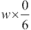 和 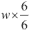 之间的位置计算了 `slice+1` 条线。这里有一个说明图像被切割成 6x6 网格的插图。每个单元格都有一个由 `box` 序列定义的边界：

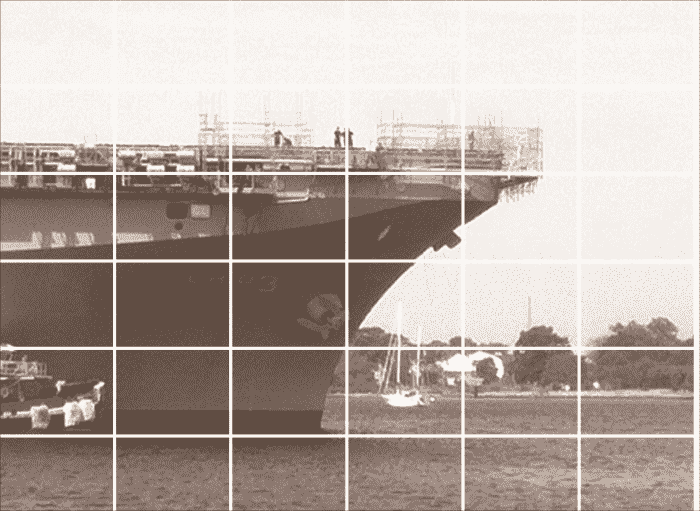

这使用以下成对的嵌套 `for` 循环和 `box` 分数来生成图像各个部分的单独边界：

```py
for i in range(slices):
    for j in range(slices):
       bounds = int(w*box[i]), int(h*box[j]), int(w*box[i+1]), int(h*box[j+1])
```

每个边界框都有左、上、右和下四个边作为四个元组。我们选取了两个变量的值来枚举从 (0,0) 到 (5,5) 的所有 36 种组合。我们从分数列表 `lines` 中选取了相邻的两个值。这将给我们从左上角到右下角的所有 36 个边界框。

然后，我们可以使用这些定义的框裁剪我们的原始图像，并显示所有 36 个切片，寻找最接近我们寻找的主题内容的切片。此外，我们可能还想调整每个图像的大小，使其变为原来的两倍。

我们可以使用以下方法来显示每个框：

```py
print( bounds )
ship.crop( bounds ).show() 
```

这将显示裁剪到每个切片的原始图像。`bounds` 对象是一个包含边界信息的四个元组。

我们可以使用 `map()` 函数稍微优化计算边界的表达式：

```py
bounds = map( int, (w*box[i], h*box[j], w*box[i+1], h*box[j+1]) )
```

`map()` 函数将一个函数应用到相关集合的每个元素上。在这个例子中，我们将 `int()` 函数应用到边界框的每个值上。结果证明这正是我们想要的图片：

```py
slices = 12
box = [ Fraction(i,slices) for i in range(slices+1) ]
bounds = map( int, (w*box[3], h*box[6], w*box[5], h*box[7]) )
logo= ship.crop( bounds )
logo.show()
logo.save( "LHD_number.jpg" )
```

我们使用两个相邻的框裁剪了图片。位于 (3,6) 和 (4,6) 的框很好地包含了船的识别号。我们创建了一个包含组合边界框的单个四元组，并将原始图片裁剪以仅获取标志。我们使用了 `logo` 对象的 `show()` 方法，这将弹出一个图片查看器。我们还保存了它，以便我们稍后可以工作。

我们可能想要调整裁剪图片的大小。我们可以使用如下代码放大图片：

```py
w,h= logo.size
logo.resize( (w*3,h*3) )
```

这将使用原始大小作为基础，以便扩展的图片保留原始比例。与其他操作一样，大小以元组的形式给出，并且需要使用内层的 `()` 括号来定义元组。如果没有内层的 `()` 括号，这些将视为两个单独的参数值。

这是裁剪后的图片：

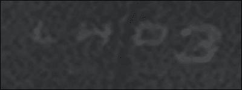

这有点模糊，难以处理。我们需要增强它。

## 操作图片 – 增强

原始图片相当粗糙。我们希望增强我们找到的切片的细节。Pillow 有许多过滤器可以帮助修改图片。与流行的电视节目和电影不同，没有增强功能可以神奇地使糟糕的图片变得精彩。

我们可以修改图片，有时，它变得更易用。我们也可以修改图片，使其不如我们找到它时那样好。第三种选择——通常不会提供给特工——是我们可能会使结果比原始图片更有艺术性。

在 Pillow 包中，我们有三个包含类似过滤处理的模块：

+   `ImageEnhance`

+   `ImageFilter`

+   `ImageOps`

`ImageEnhance` 模块包含 `enhance` 类定义。我们通过绑定一个增强器和一张图片来创建一个增强器对象。然后我们使用这个绑定对象来创建给定图片的增强版本。增强器允许我们对图片进行许多增量更改。我们可以将这些视为简单的旋钮，可以转动来调整图片。

`ImageFilter` 模块包含将修改图片的过滤器函数，这将创建一个新图片对象，我们可能需要保存。这些不同类型的过滤器对象被插入到图片的 `filter()` 方法中。过滤器可以想象成一种减少图片信息量的方式；过滤后的图片通常更简单。

`ImageOps` 模块包含将一个图片转换成新图片的函数。这些与过滤和增强不同。它们不一定减少数据量，也不是简单的旋钮来调整图片。`ImageOps` 模块倾向于执行更复杂的转换。

我们将从`PIL.ImageEnhance`模块中的简单增强器开始，特别是`Contrast`类。我们不会展示每个单独的类；更系统的探索留给现场特工。

我们将从四个增强器中的一个开始：`Contrast`类。下面是如何使用它的方法：

```py
>>> from PIL import ImageEnhance
>>> e= ImageEnhance.Contrast(logo)
>>> e.enhance(2.0).show()
>>> e.enhance(4.0).show()
>>> e.enhance(8.0).show()
```

这基于特定的算法和我们要处理的图像构建了一个增强器。我们将这个增强器分配给了`e`变量。然后我们执行了一个带有特定参数值的`enhance`操作，并显示了结果图像。

最后一张图像相当不错。我们可以使用`e.enhance(8.0).save( "LHD_Number_1.jpg" )`来保存这张图像的副本。

下面是当`Contrast`增强设置为`8`时标志的看起来：

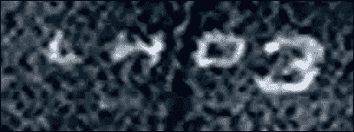

可能有人能够处理这张图像。作为一名现场特工，你需要尝试其他三个增强过滤器：颜色、亮度和锐度。你可能会从图像中提取更多细节。

这是定义可重复、自动化过程的第一步。使用 Python 命令行意味着我们记录了确切的操作。我们可以将这个过程简化为一个自动化脚本。

## 图像处理 – 过滤

我们已经查看`ImageEnhance`模块来改善图像。我们也可以通过图像的`filter()`方法进行过滤。`ImageFilter`模块定义了 18 种不同的过滤器。当我们使用过滤器时，我们将过滤器对象提供给`Image.filter()`方法。

我们将只选择这些过滤器中的一个。`ImageFilter.EDGE_ENHANCE`模块似乎有助于区分浅色字母和深色背景。强调颜色过渡可能会使字母更明显。

下面是一个在图像的`filter()`方法中使用`ImageFilter.EDGE_ENHANCE`过滤器的例子：

```py
>>> from PIL import ImageFilter
>>> logo.filter( ImageFilter.EDGE_ENHANCE ).show()
```

我们已经使用`filter`方法创建并显示了一个新的图像。

虽然这样很好，但似乎我们之前的增强尝试使用`ImageEnhance.Contrast`类效果会更好。下面我们来看看如何应用一系列的转换。

以下代码将特定的过滤器应用于图像并创建了一个新的图像：

```py
>>> e.enhance(8.0).filter( ImageFilter.EDGE_ENHANCE ).save( "LHD_Number_2.jpg" )
```

我们创建了一个增强图像，然后对其应用了一个过滤器。这创建了一个比原始图像更清晰、可能更实用的图像。

这是我们过滤和增强后的图像：

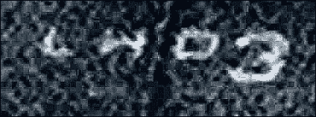

过滤器对之前保存的图像做了一些细微的修改。数字`3`下方的环边缘可能更加清晰。我们还需要做一些其他改变。

一些过滤器（如`EDGE_ENHANCE`对象）没有参数或选项。其他过滤器有参数，可以应用于改变它们的工作方式。例如，`ModeFilter()`将图像的某个部分减少到该部分中最常见的颜色值；我们提供了一个参数来指定在计算模式时考虑的像素数。

这里是一个将几个操作组合起来创建新图像的例子：

```py
>>> p1= e.enhance(8.0).filter( ImageFilter.ModeFilter(8) )
>>> p1.filter( ImageFilter.EDGE_ENHANCE ).show()
```

这似乎正趋向于艺术，而不是正当的情报收集。然而，一个好的现场特工会使用一些额外的过滤器和过滤参数来寻找更好的增强技术。

## 图像操作 – 图像处理

我们已经研究了`ImageEnhance`模块来改善图像。我们还研究了`ImageFilter`模块中的几个其他过滤器。`ImageOps`模块提供了 13 种额外的转换，我们可以使用这些转换来改善我们的图像。

我们将查看以下代码片段中的`ImageOps.autocontrast()`函数。这将调整各种像素，使亮度级别填满从 0 到 255 的整个 8 位空间。一个暗或褪色的图像缺乏对比度，像素都堆积在光谱的暗端或亮端。

```py
>>> from PIL import ImageOps
>>> ImageOps.autocontrast( logo ).show()
>>> logo.show()
```

这显示了应用了`autocontrast`的图像和原始图像。这显示了原始裁剪和使用了从暗到亮的全范围的图像之间的显著差异。这似乎正是 HQ 所想要的。

让我们进一步调整对比度，使数字更加突出：

```py
>>> ac= ImageEnhance.Contrast( ImageOps.autocontrast( logo ) )
>>> ac.enhance( 2.5 ).save( "LHD_Number_3.jpg" )
```

这似乎是我们能做的最惊人的增强：

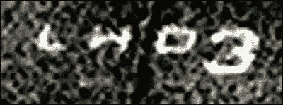

这可能已经足够好了。一个合格的现场特工应该尝试其他`ImageOps`转换，看看是否还有改进的空间。

到目前为止，我们已经有了一个可重复的、自动化的流程概要。我们确切地知道我们做了什么来增强图像。我们可以使用我们的实验系列来创建一个图像增强的自动化脚本。

# 隐写术的一些方法

我们可以用图像文件做很多事情。我们可以做的一件事是使用隐写术在图像文件中隐藏信息。由于图像文件大、复杂且相对嘈杂，添加一些额外的数据位不会对图像或文件造成太大的可见变化。

有时这可以总结为在图像上添加一个**数字水印**。我们将微妙地改变图像，以便我们可以在以后识别和恢复它。

在图像中添加信息可以被视为对图像的损失性修改。一些原始像素将无法恢复。由于 JPEG 压缩通常已经涉及轻微的损失，将图像作为隐写术的一部分进行调整将导致类似程度的图像损坏。

说到损失，JPEG 格式可以，并且将会调整我们图像中的一些位。因此，使用 JPEG 进行隐写术很困难。我们不会与 JPEG 的细节纠缠，我们将使用 TIFF 格式来隐藏我们的信息。

在图像中隐藏信息有两种常见的方法：

+   **使用颜色通道**：如果我们只覆盖一个颜色通道中的某些字节，我们将改变我们覆盖区域中几个像素的颜色的一部分。这只会是几百万像素中的一小部分，并且只会是三种（或四种）颜色中的一种。如果我们将调整限制在边缘，那么它不太会引人注目。

+   **使用每个字节的最低有效位（LSBs）**：如果我们覆盖一系列字节中的最低有效位，我们将在图像中产生一个非常小的变化。我们必须限制我们信息的大小，因为我们只能每个像素编码一个字节。一张小图片，其尺寸为*432 * 161 = 69,552*像素，可以编码 8,694 字节的数据。如果我们使用 UTF-8 编码我们的字符，我们应该能够将一个 8 K 的消息塞入那张图片。如果我们使用 UTF-16，我们只能得到一个 4 K 的消息。这种技术在只有单一通道的灰度图像中也能工作。

除了 JPEG 压缩问题之外，还有一些颜色编码方案与这两种隐写术方法都不太兼容。被称为**P**、**I**和**F**的模式带来了一些问题。这些颜色模式涉及将颜色代码映射到调色板。在这些情况下，字节不是灰度级别或颜色级别；当使用调色板时，字节是颜色的参考。对 1 比特的更改可能会导致从底层调色板选择的颜色发生显著变化。颜色`5`可能是一种令人愉快的海藻绿，颜色`4`可能是一种糟糕的洋红色。`5`和`4`之间的 1 比特变化可能是一个明显的格格不入的点。

在应用我们的隐写术编码之前，为了我们的目的，我们可以将源图像切换到 RGB（或 CMYK）。基本颜色模式的变化可能对有机会访问原始图像的人来说是可见的。然而，除非他们也知道我们的隐写术算法，否则隐藏的信息将保持隐蔽。

我们的战略是这样的：

1.  获取图像像素的字节。

1.  将我们的秘密信息从 Unicode 字符串转换为一系列比特。

1.  对于我们秘密信息的每一比特，我们需要在原始图像中篡改 1 个字节的值。由于我们在调整最低有效位，以下两种情况中的一种将会发生。

    +   我们将图像像素值调整为偶数以编码秘密信息中的 0 比特

    +   我们将图像像素值调整为奇数以编码秘密信息中的 1 比特

我们将处理两个平行的值序列：

+   来自图像的字节（理想情况下足够编码我们整个信息）

+   来自秘密信息的比特

策略是逐步遍历图像中的每个字节，并将秘密信息的 1 比特融入该图像字节。这个酷的特点是某些像素值可能实际上不需要改变。如果我们在一个已经是奇数的像素中编码一个字节，我们根本不会改变图像。

这意味着我们需要执行以下重要步骤：

+   获取图像红色通道中的字节

+   从 Unicode 消息中获取字节

+   从消息字节中获取位

+   使用消息位调整图像像素字节，并更新图像

我们将逐个解决这些问题，然后在最后将它们全部焊接在一起。

## 获取红色通道数据

让我们看看如何使用红色通道 LSB 编码在图像中编码我们的消息。为什么是红色？为什么不呢？男性可能有一定程度的红绿色盲；如果他们不太可能看到这个通道中的变化，那么我们就进一步隐藏了我们的图像，让一些好奇的眼睛难以察觉。

第一个问题：我们如何篡改原始图像的字节？

PIL `Image` 对象具有 `getpixel()` 和 `putpixel()` 方法，允许我们获取各种颜色通道值。

我们可以像这样从图像中提取单个像素：

```py
>>> y = 0
>>> for x in range(64):
...     print(ship.getpixel( (x,y) ))
... 
(234, 244, 243)
(234, 244, 243)
(233, 243, 242)
(233, 243, 242)
etc.
```

我们已经向 `getpixel()` 方法提供了一个 `(x,y)` 二元组。这表明图像中的每个像素都是一个三元组。这三个数字是什么并不明显。我们可以使用 `ship.getbands()` 获取这些信息，如下面的代码片段所示：

```py
>>> ship.getbands() 
('R', 'G', 'B')
```

我们心中几乎没有怀疑，三个像素值分别是红色级别、绿色级别和蓝色级别。我们已经使用 `getband()` 方法从 Pillow 获取确认，我们关于图像编码通道的假设是正确的。

我们现在可以访问图像的各个字节。下一步是从我们的秘密消息中获取位，然后使用秘密消息位篡改图像字节。

## 从 Unicode 字符中提取字节

为了将我们的秘密消息编码到图像的字节中，我们需要将我们的 Unicode 消息转换为字节。一旦我们有一些字节，我们就可以进行一次额外的转换，以获得位序列。

第二个问题是，我们如何获取消息文本的各个位？这个问题的另一种形式是，我们如何将一串 Unicode 字符串转换为位字符串？

这是一个我们可以处理的 Unicode 字符串：[`www.kearsarge.navy.mil`](http://www.kearsarge.navy.mil)。我们将把转换分为两个步骤：首先转换为字节，然后转换为位。有几种方法可以将字符串编码为字节。我们将使用 UTF-8 编码，因为它非常流行：

```py
>>> message="http://www.kearsarge.navy.mil"
>>> message.encode("UTF-8")
b'http://www.kearsarge.navy.mil'
```

那里似乎并没有发生太多事情。这是因为 UTF-8 编码恰好与 Python 字节字面量使用的 ASCII 编码相匹配。这意味着字符串的字节版本，恰好只使用 US-ASCII 字符，看起来会非常像原始的 Python 字符串。特殊 `b' '` 引号的存在是提示，表明字符串仅是字节，而不是完整的 Unicode 字符。

如果我们的字符串中有一些非 ASCII 的 Unicode 字符，那么 UTF-8 编码将变得更加复杂。

仅供参考，以下是我们的消息的 UTF-16 编码：

```py
>>> message.encode("UTF-16")
b'\xff\xfeh\x00t\x00t\x00p\x00:\x00/\x00/\x00w\x00w\x00w\x00.\x00k\x00e\x00a\x00r
\x00s\x00a\x00r\x00g\x00e\x00.\x00n\x00a\x00v\x00y\x00.\x00m\x00i\x00l\x00'
```

前一个编码的消息看起来像是一团糟。正如预期的那样，它的大小几乎是 UTF-8 的大小的两倍。

这是消息中各个字节的另一种视图：

```py
>>> [ hex(c) for c in message.encode("UTF-8") ]
['0x68', '0x74', '0x74', '0x70', '0x3a', '0x2f', '0x2f', '0x77', '0x77', '0x77', '0x2e', '0x6b', '0x65', '0x61', '0x72', '0x73', '0x61', '0x72', '0x67', '0x65', '0x2e', '0x6e', '0x61', '0x76', '0x79', '0x2e', '0x6d', '0x69', '0x6c']
```

我们使用生成器表达式将`hex()`函数应用于每个字节。这为我们提供了如何继续进行的线索。我们的信息被转换成了 29 字节，即 232 位；我们希望将这些位放入图像的前 232 像素中。

## 操作位和字节

由于我们将要操作单个位，我们需要知道如何将 Python 字节转换成 8 位的元组。其逆操作是将 8 位元组转换回单个字节的技术。如果我们将每个字节扩展成一个八元组，我们就可以轻松调整位并确认我们正在做正确的事情。

我们需要一些函数来将字节列表扩展成位，并将位收缩回原始的字节列表。然后，我们可以将这些函数应用于我们的字节序列以创建单个位的序列。

重要的计算机科学将在下面解释：

一个数，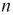，是某个特定基数中的多项式。以下是 234 值以 10 为基数的这个多项式：

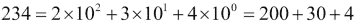

在 16 进制中，我们有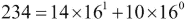。在写十六进制时，我们使用字母表示 14 和 10 的数字：`0xea`。

这种多项式表示在二进制中是正确的。一个数，，是二进制中的多项式。以下是 234 值的这个多项式：

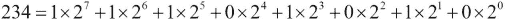

这里有一种从数值中提取低 8 位的方法：

```py
def to_bits( v ):
    b= []
    for i in range(8):
        b.append( v & 1 )
        v >>= 1
    return tuple(reversed(b))
```

`v&1`表达式对数字执行位操作以提取最右边的位。我们将计算出的位值追加到`b`变量中。`v >>= 1`语句等同于`v = v>>1`；`v>>1`表达式将值`v`右移一位。这样做八次后，我们就提取了`v`值的最低位。我们在列表对象`b`中组装了这个位序列。

结果以错误的顺序累积，因此我们反转它们并创建一个整洁的八元组对象。我们可以将其与内置的`bin()`函数进行比较：

```py
>>> to_bits(234)
(1, 1, 1, 0, 1, 0, 1, 0)
>>> bin(234)
'0b11101010'
```

对于大于 127 的值，`bin()`和`to_bits()`函数都产生 8 位的结果。对于较小的值，我们会看到`bin()`函数不产生 8 位；它只产生足够的位。

相反的转换评估多项式。我们可以进行一点代数运算来优化乘法次数：

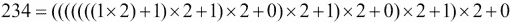

由于分组，最左边的 1 最终乘以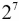。因为将位向左移位等同于乘以 2，我们可以根据以下方式从位元组重建字节值：

```py
def to_byte( b ):
    v= 0
    for bit in b:
        v = (v<<1)|bit
    return v
```

`(v<<1)|bit`表达式将`v`左移 1 位，实际上执行了`*2`操作。一个`OR`操作将下一个位折叠到正在累积的值中。

我们可以用这样的循环来测试这两个函数：

```py
for test in range(256):
    b = to_bits(test)
    v = to_byte(b)
    assert v == test
```

如果所有 256 个字节值都转换为比特然后再转换回字节，我们就绝对确信我们可以将字节转换为比特。我们可以使用这一点来查看我们消息的扩展：

```py
message_bytes = message.encode("UTF-8")
print( list(to_bits(c) for c in message_bytes) )
```

这将显示一个包含 8 元组的列表：

```py
[(1, 1, 1, 1, 1, 1, 1, 1), (1, 1, 1, 1, 1, 1, 1, 0), 
(0, 1, 1, 0, 1, 0, 0, 0), (0, 0, 0, 0, 0, 0, 0, 0),
  ...
(0, 1, 1, 0, 1, 1, 0, 0), (0, 0, 0, 0, 0, 0, 0, 0)]
```

秘密信息的每个字节都变成了一个由单独的比特组成的八元组。

## 比特的组装

到目前为止，我们有两个并行序列的值：

+   来自图像的字节（理想情况下足够编码我们的整个消息）

+   来自我们的秘密消息的比特（在示例中，我们只有 29 字节，即 232 比特）

理念是遍历图像的每个字节，并将秘密消息的一个比特合并到该字节中。

在我们能够完全调整图像的各种字节与我们的信息比特之前，我们需要组装一个由单独的比特组成的长序列。我们有两个选择来做这件事。我们可以创建一个包含所有比特值的`list`对象。这会浪费一点内存，而且我们可以做得更好。

我们也可以创建一个生成器函数，它看起来像是一个包含所有比特的`sequence`对象。

这是一个生成器函数，我们可以用它来发出消息的整个比特序列：

```py
def bit_sequence( list_of_tuples ):
    for t8 in list_of_tuples:
        for b in t8:
            yield b
```

我们遍历了列表中由`to_bits()`函数创建的每个八元组。对于 8 元组中的每个比特，我们使用了`yield`语句来提供单独的比特值。任何期望可迭代序列的表达式或语句都将能够使用这个函数。

以下是我们可以如何使用这个方法来累积来自消息的所有 232 比特的序列：

```py
print( list( bit_sequence(
    (to_bits(c) for c in message_bytes)
) ) )
```

这将对消息的每个字节应用`to_bits()`函数，创建一个 8 元组的序列。然后它将对这个八元组的序列应用`bit_sequence()`生成器。输出是一个单独比特的序列，我们将其收集到一个`list`对象中。结果列表看起来像这样：

```py
[1, 1, 1, 1, 1, 1, 1, 1, 1, 1, 1, 1, 1, 1, 1, 0, 
0, 1, 1, 0, 1, 0, 0, 0, 0, 0, 0, 0, 0, 0, 0, 0, 
... 
0, 1, 1, 0, 1, 1, 0, 0, 0, 0, 0, 0, 0, 0, 0, 0]
```

我们可以看到由原始信息构建的 232 个单独比特的列表。

这是`bit_sequence()`函数的逆函数。它将比特序列分组到八元组中：

```py
def byte_sequence( bits ):
    byte= []
    for n, b in enumerate(bits):
        if n%8 == 0 and n != 0:
            yield to_byte(byte)
            byte= []
        byte.append( b )
    yield to_byte(byte)
```

我们使用了内置的`enumerate()`生成器函数为原始序列中的每个单独比特提供一个编号。从`enumerate(bits)`表达式中输出的结果是两个元组的序列；每个元组包含编号的比特数（从`0`到`231`）以及比特值本身（`0`或`1`）。

当比特编号是`8`的倍数时（`n%8 == 0`），我们就看到了一个完整的八比特批次。我们可以使用`to_byte()`将这些八比特转换成一个字节，产生字节值，并将我们的临时累加器`byte`重置为空。

### 注意

我们为第一个字节做了特殊例外。

`enumerate()`函数将分配第一个字节的编号`0`；由于`0%8 == 0`，这看起来我们刚刚积累了八个比特来形成一个字节。我们通过确保`n`不是 0；它不是第一个比特值来避免这种复杂性。我们也可以使用`len(byte) != 0`表达式来避免第一次的复杂性。

最后的 `yield` 语句对于成功至关重要。最后的比特批次将包含 `n%8` 个从 `0` 到 `7` 的值。当比特集合耗尽时，`n%8` 测试将不会被使用，但我们在 `byte` 变量中仍然会积累八个比特。我们将作为额外步骤提供这最后一批八个比特。

这看起来是这样的：

```py
>>> list(byte_sequence(bits))
[255, 254, 104, 0, 116, 0, 116, 0, 112, 0, 58, 0, 47, 0, 47, 0, 119, 0, 119, 0, 119, 0, 46, 0, 107, 0, 101, 0, 97, 0, 114, 0, 115, 0, 97, 0, 114, 0, 103, 0, 101, 0, 46, 0, 110, 0, 97, 0, 118, 0, 121, 0, 46, 0, 109, 0, 105, 0, 108, 0]
```

我们已经将单独的比特序列收集成每批八个比特的字节。

## 信息编码

现在我们能够将任何 Unicode 字符串转换为比特，我们可以将信息编码成图片。最后的微妙之处在于如何界定信息。我们不希望不小心解码整个图片中的每一个字节。如果我们这样做，我们的信息将被随机字符填充。我们需要知道何时停止解码。

一种常见的技术是在字符串前包含一个终止字符。另一种常见的技术是在字符串前提供一个长度。我们将在字符串前包含一个长度，这样我们就不会受到字符串内容或从该字符串产生的编码字节的限制。

我们将在字符串前使用 2 字节长度；我们可以这样将其编码成字节和比特：

```py
len_H, len_L = divmod( len(message), 256 )
size = [to_bits(len_H), to_bits(len_L)]
```

我们使用了 Python 的 `divmod()` 函数来计算除法后的商和余数。`divmod(len(message), 256)` 表达式的结果将是 `len(message)//256` 和 `len(message)%256`。我们可以从 `len_H*256+len_L` 表达式中恢复原始值。

`size` 变量被设置为一个由两个八元组组成的短序列，这些八元组是由 `len_H` 和 `len_L` 值构建的。

包括长度在内的完整字节序列看起来是这样的：

```py
message_bytes= message.encode("UTF-8")
bits_list = list(to_bits(c) for c in message_bytes )
len_h, len_l = divmod( len(message_bytes), 256 )
size_list = [to_bits(len_h), to_bits(len_l)]
bit_sequence( size_list+bits_list ) 
```

首先，我们将信息编码成字节。根据涉及的 Unicode 字符和使用的编码，这可能会比原始信息更长。`bits_list` 变量是由编码信息的各个字节构建的八元组序列。

然后，我们创建了两个包含长度信息的额外字节并将它们转换为比特。`size_list` 变量是由编码长度的字节构建的八元组序列。

`size_list+bits_list` 表达式展示了如何连接两个序列以创建一个长序列的单独比特，我们可以将这些比特嵌入到我们的图片中。

这是使用 `putpixel()` 和 `getpixel()` 方法更新图片的方法：

```py
w, h = ship.size
for p,m in enumerate( bit_sequence(size_list+bits_list) ):
    y, x = divmod( p, w )
    r, g, b = ship.getpixel( (x,y) )
    r_new = (r & 0xfe) | m
    print( (r, g, b), m, (r_new, g, b) )
    ship.putpixel( (x,y), (r_new, g, b)  )
```

我们提取了原始图片的大小；这告诉我们 *x* 轴有多长，这样我们就可以在必要时使用图片的多个行。如果我们的图片每行只有 128 像素，我们需要超过一行来容纳 292 比特的信息。

我们已经将 `enumerate()` 函数应用于 `bit_sequence(size_list+bits_list)` 值。这将提供原始信息的序列号和单个比特。序列号可以通过 `divmod()` 函数转换为行和列。我们将 `y` 设置为 `sequence // width`；我们将 `x` 设置为 `sequence % width`。

如果我们使用宽度为 128 像素的缩略图，前 128 位将进入行 `0`。接下来的 128 位将进入行 `1`。剩下的 292 位将最终落在行 `3` 上。

我们使用 `ship.getpixel( (x,y) )` 从像素中获取 RGB 值。

我们已经突出显示了位操作的部分：`r_new = (r & 0xfe) | m`。这使用了一个 **掩码** 值 `0xfe`，即 `0b11111110`。这是因为 `&` 运算符有一个方便的特性。当我们使用 `b&1` 时，`b` 的值将被保留。当我们使用 `b&0` 时，结果是 `0`。

尝试以下代码，如图所示：

```py
>>> 1 & 1
1
>>> 0 & 1
0
```

当我们移除最低位时，`b` 的值（无论是 `1` 还是 `0`）将被保留。同样，`1 & 0` 和 `0 & 0` 都是 `0`。

在 `(r & 0xfe)` 中使用掩码值意味着 `r` 的最高七位将被保留；最低位将被设置为 `0`。当我们使用 `(r & 0xfe) | m` 时，我们将 `m` 的值折叠到最低位。我们打印出旧的和新的像素值，以提供一些关于这是如何工作的细节。以下是输出中的两行：

```py
(245, 247, 246) 0 (244, 247, 246)
(246, 248, 247) 1 (247, 248, 247)
```

我们可以看到红色通道的旧值是 `245`：

```py
>>> 245 & 0xfe
244
>>> (245 & 0xfe) | 0
244
```

值 `244` 展示了如何从 `245` 中移除最低位。当我们折叠一个新的位值 `0` 时，结果仍然是 `244`。偶数值编码了我们秘密信息中的 0 位。

在这种情况下，红色通道的旧值是 `246`：

```py
>>> 246 & 0xfe
246
>>> (246 & 0xfe) | 1
247
```

当我们移除最低位时，值保持为 `246`。当我们折叠一个新的位值 `1` 时，结果变为 `247`。奇数值编码了我们秘密信息中的 1 位。

### 注意

在图像前后使用 `ship.show()` 不会揭示图像有任何可感知的变化。

最终，我们只是在图像中调整了红色的级别，在 `256` 的尺度上加减 `1`，不到半百分比的改变。

## 解码一条信息

我们将分两步解码用隐写术隐藏的信息。第一步将解码长度信息的头两个字节，这样我们就可以恢复嵌入的信息。一旦我们知道我们要查找多少字节，我们就可以解码正确数量的位，只恢复我们的嵌入字符，不再有其他。

由于我们将要两次进入信息，编写一个位提取器会有所帮助。以下是用于从图像的红色通道中剥离位的函数：

```py
def get_bits( image, offset= 0, size= 16 ):
    w, h = image.size
    for p in range(offset, offset+size):
        y, x = divmod( p, w )
        r, g, b = image.getpixel( (x,y) )
        yield r & 0x01
```

我们定义了一个有三个参数的函数：一个图像、图像中的偏移量以及要提取的位数。长度信息是一个偏移量为零且长度为 16 位的偏移量。我们将这些值设置为默认值。

我们使用了一个常见的 `divmod()` 计算来将位置转换为基于图像总宽度的 *y* 和 *x* 坐标。`y` 值是 `position//width`；`x` 值是 `position%width`。这与将位嵌入信息时进行的计算相匹配。

我们使用图像的 `getpixel()` 方法提取三个颜色信息通道。我们使用 `r & 0x01` 来计算红色通道的最低位。

由于值是通过`yield`语句返回的，这是一个生成器函数：它提供一系列值。由于我们的`byte_sequence()`函数期望一系列值，我们可以将两者结合起来提取大小，如下面的代码所示：

```py
size_H, size_L = byte_sequence( get_bits( ship, 0, 16 ) )
size= size_H*256+size_L
```

我们使用`get_bits()`函数从图像中提取了 16 个比特。这串比特被提供给`byte_sequence()`函数。比特被分成八元组，八元组被转换成单个值。然后我们可以将这些值相乘并相加以恢复原始消息的大小。

现在我们知道了要获取多少字节，我们也知道要提取多少比特。提取看起来像这样：

```py
message= byte_sequence(get_bits(ship, 16, size*8))
```

我们使用`get_bits()`函数从第 16 位开始提取比特，直到找到总共`size*8`个单独的比特。我们将比特分成八元组，并将八元组转换为单个值。

给定一个字节序列，我们可以创建一个`bytes`对象，并使用 Python 的解码器恢复原始字符串。它看起来像这样：

```py
print( bytes(message).decode("UTF-8") )
```

这将正确地将字节解码为字符，使用 UTF-8 编码。

# 检测和防止篡改

我们可以使用隐写术来确保我们的消息没有被篡改。如果我们不能正确找到我们正确编码的数字水印，我们知道我们的图片被修改了。这是检测篡改的一种方法。检测篡改的更稳健的技术是使用哈希总和。有许多哈希算法用于生成字节序列的摘要或签名。我们分别发送消息和哈希码。如果接收到的消息与哈希码不匹配，我们知道出了问题。哈希的一个常见用途是确认文件的正确下载。下载文件后，我们应该将我们得到的文件的哈希值与单独发布的哈希值进行比较；如果哈希值不匹配，文件有问题。我们可以在打开它之前将其删除。

虽然加密似乎可以防止篡改，但它需要仔细管理加密密钥。加密不是万能的。即使使用一个好的加密算法，也可能失去对密钥的控制，使加密变得无用。如果有人未经授权访问密钥，他们可以重写文件，而没有人会知道。

## 使用哈希总和验证文件

Python 的`hashlib`模块中有许多哈希算法可用。软件下载通常附有软件包的 MD5 哈希值。我们可以使用`hashlib`计算文件的 MD5 摘要，如下面的代码所示：

```py
import hashlib
md5 = hashlib.new("md5")
with open( "LHD_warship.jpg", "rb" ) as some_file:
    md5.update( some_file.read() )
print( md5.hexdigest() )
```

我们使用`hashlib.new()`函数创建了一个 MD5 摘要对象；我们命名了要使用的算法。我们以*字节*模式打开文件。我们将整个文件提供给摘要对象的`update()`方法。对于非常大的文件，我们可能希望分块读取文件而不是一次性将整个文件读入内存。最后，我们打印了摘要的十六进制版本。

这将提供 MD5 摘要的十六进制字符串版本，如下所示：

```py
0032e5b0d9dd6e3a878a611b49807d24
```

有这个安全的哈希，我们可以确认文件在其从发送者到接收者的互联网旅程中没有被篡改。

## 使用密钥与摘要

通过向消息摘要添加密钥，我们可以提供相当多的安全性。这并不加密消息；它加密摘要以确保在传输过程中摘要不被篡改。

Python 标准库中的`hmac`模块为我们处理了这个问题，如下面的代码所示：

```py
import hmac
with open( "LHD_warship.jpg", "rb" ) as some_file:
    keyed= hmac.new( b"Agent Garbo", some_file.read() )
print( keyed.hexdigest() )
```

在这个例子中，我们创建了一个 HMAC 摘要对象，并将消息内容传递给该摘要对象。`hmac.new()`函数可以接受密钥（作为字节数组字符串）和消息体。

来自此 HMAC 摘要对象的十六进制摘要包括原始消息和我们所提供的密钥。以下是输出：

```py
42212d077cc5232f3f2da007d35a726c
```

由于 HQ 知道我们的密钥，他们可以确认消息来自我们。

同样，HQ 在向我们发送消息时必须使用我们的密钥。然后，当我们读取消息时，我们可以使用我们的密钥来确认消息是由 HQ 发送给我们的。

# 解决问题——加密消息

为了进行适当的加密，可以使用 PyCrypto 包，该包可以从[`www.dlitz.net/software/pycrypto/`](https://www.dlitz.net/software/pycrypto/)下载。与 Pillow 一样，这是一个庞大的下载。

正如我们在第一章中看到的，*我们的间谍工具包*，一个糟糕的密钥选择将使任何加密方案基本上毫无价值。如果我们使用一个单词密钥来加密文件，而这个单词在现成的词库中很容易找到，我们实际上并没有使我们的数据非常安全。暴力攻击将破解加密。

我们可以将隐写术与创建`ZipFile`存档相结合，在 ZIP 文件中嵌入图像中的消息。由于 ZIP 文件可以有注释字符串，我们可以将 HMAC 签名作为 ZIP 存档的注释。

理想情况下，我们会使用 ZIP 加密。然而，Python 的`ZipFile`库不创建加密的 ZIP 文件。它只能读取加密的文件。

我们将定义一个如下所示的功能：

```py
def package( text, image_source, key_hmac, filename ):
```

我们将提供我们的消息文本、图像源、我们将用于创建 HMAC 签名的密钥，以及输出文件名。这将输出一个包含图像和签名的 ZIP 文件。

我们`package()`函数的轮廓如下所示：

```py
    image= Image.open( image_source )
    steg_embed( image, text )
    image.save( "/tmp/package.tiff", format="TIFF" )
    with open("/tmp/package.tiff","rb") as saved:
        digest= hmac.new( key_hmac.encode("ASCII"), saved.read() )
    with ZipFile( filename, "w" ) as archive:
        archive.write( "/tmp/package.tiff", "image.tiff" )
        archive.comment= digest.hexdigest().encode("ASCII")
    os.remove( "/tmp/package.tiff" )
```

我们已经打开了源图像，并使用`steg_embed()`函数将我们的秘密消息放入图像中。我们将更新的图像保存到一个临时文件中。

在对图像文件进行其他操作之前，我们计算了其 HMAC 摘要。我们将摘要保存在`digest`变量中。

现在一切准备就绪，我们可以创建一个新的存档文件。我们可以将图像写入存档的一个成员中。当我们设置存档的`comment`属性时，这将确保在存档关闭时写入注释文本。

注意，我们必须将密钥转换为 ASCII 字节以创建摘要。HMAC 算法是为字节定义的，而不是 Unicode 字符。同样，结果 `hexdigest()` 字符串在放入存档之前必须转换为 ASCII 字节。ZIP 存档只支持字节，不能直接支持 Unicode 字符。

最后，我们删除了包含修改后的图像的临时文件。没有必要留下可能被指控的文件。

为了使这可行，我们需要完成实现我们的隐写术编码的函数 `steg_embed()`。有关如何实现这一点的详细信息，请参阅 *一些隐写术方法* 部分。

## 解包消息

我们还需要一个逆函数，可以解码 ZIP 存档中的消息。这个函数的定义可能如下所示：

```py
def unpackage( filename, key_hmac ):
```

这需要一个 ZIP 文件名和一个密钥来验证签名。这可以返回两件事：嵌入的消息和将消息编码进其中的图像。

我们的 `unpackage()` 函数的轮廓如下：

```py
    try:
        os.remove( "/tmp/image.tiff" )
    except FileNotFoundError:
        pass
    with ZipFile( filename, "r" ) as archive:
        with archive.open( "image.tiff", "r" ) as member:
            keyed= hmac.new( key_hmac.encode("ASCII"), member.read() )
        assert archive.comment == keyed.hexdigest().encode("ASCII"), "Invalid HMAC"
        archive.extract( "image.tiff", "/tmp" )
    image= Image.open( "/tmp/image.tiff" )
    text= steg_extract( image )
    os.remove( "/tmp/image.tiff" )
    return text, image
```

我们将删除可能存在的任何临时文件。如果文件本身不存在，那是一件好事，但它将引发 `FileNotFoundError` 异常。我们需要捕获并抑制这个异常。

我们的第一步是打开 ZIP 文件，然后打开 ZIP 文件中的 `image.tiff` 成员。我们计算这个成员的 HMAC 摘要。然后，我们断言存档注释与所选成员的十六进制摘要相匹配。如果 `assert` 语句中的条件为假且 HMAC 密钥不匹配，则这将引发异常并停止脚本运行。这也意味着我们的消息已被破坏。如果 `assert` 语句中的条件为真，它将静默执行。

如果断言是真实的，我们可以将图像文件提取到 `/tmp` 目录中的某个位置。从这里，我们可以打开文件并使用 `steg_extract()` 函数来恢复图像中隐藏的消息。Windows 代理可以使用 `os` 模块来定位临时目录。`os.environ['TEMP']` 的值将命名一个合适的临时目录。

一旦我们得到了消息，我们就可以删除临时文件。

为了使这可行，我们需要完成实现我们的隐写术解码的函数 `steg_extract()`。有关如何实现这一点的详细信息，请参阅 *一些隐写术方法* 部分。

# 摘要

在本章中，我们学习了如何在计算机文件系统和常见文件格式上工作。我们深入研究了图像文件。我们还看到了 Pillow 如何允许我们对图像应用裁剪、过滤和增强等操作。

我们介绍了 Python 位操作符，如 `&`、`|`、`<<` 和 `>>`。这些操作符作用于整数值的各个位。例如，`bin(0b0100 & 0b1100)` 将显示答案是基于对数字的每个单独位执行 `AND` 操作的结果。

我们还研究了如何将隐写术技术应用于在图像文件中隐藏信息。这涉及到在 Python 中对字节和位的操作。

在下一章中，我们将探讨如何将地理位置信息与我们的其他信息收集相结合。我们知道图片可以与地点相关联，因此地理编码和反向地理编码是必不可少的。我们还将探讨读取更复杂的在线数据集的方法，以及将多个网络服务组合成一个综合应用的方法。
