# 第四章. 降落点、藏身之处、会面和巢穴

我们将扩展在第二章中介绍的一些技术，*获取情报数据*，用于进行 RESTful 网络服务请求进行地理编码。这将使我们能够精确地定位各种秘密地点。这还将基于第三章中的图像位置处理，*使用隐写术编码秘密信息*。

我们将查看一些在线数据集，这将引导我们了解更多数据收集技术。为了处理各种类型的数据，我们需要将 HTML 解析器添加到我们的工具包中。我们将下载 BeautifulSoup，因为它非常擅长追踪 HTML 页面中隐藏的信息。

在本章中，我们还将探讨一些更复杂的 Python 算法。我们将从地理编码服务开始，这些服务可以将地址和经纬度坐标进行转换。

我们将研究**哈弗辛公式**来计算地点之间的距离。这意味着使用`math`库来访问三角函数。

我们将了解各种类型的网格编码方案，这将帮助我们简化纬度和经度的复杂性。这些编码方案将向我们展示多种数据表示技术。本章将展示通过改变表示来压缩数字的方法。

我们将了解如何解析 HTML `<table>` 标签，并创建我们可以与之工作的 Python 集合。我们还将查看提供干净 JSON 格式数据的在线数据源。这可以更容易地收集和处理。

我们的目标是使用 Python 结合多个在线服务。这将使我们能够集成地理编码和数据分析。有了这些信息，我们可以在不远离我们的秘密行动基地的情况下找到与我们的联系人会面的最佳地点。

# 背景简报 – 纬度、经度和 GPS

在我们能够获取地理信息之前，我们需要回顾一些基本术语。一项帮助平民和秘密特工的现代技术是**全球定位系统**（**GPS**），这是一个基于卫星的系统，用于确定位置。GPS 允许地面设备在空间和时间上精确地确定其位置。

GPS 背后的理念非常优雅。每个卫星产生一个包含位置和超级精确时间戳的数据流。具有多个数据流的接收器可以将位置和时间戳插入到一个矩阵中，以确定接收器相对于各个卫星的位置。如果有足够的卫星，接收器可以精确地计算出纬度、经度、海拔高度，甚至当前时间。

更多信息请参阅[`en.wikipedia.org/wiki/Global_Positioning_System#Navigation_equations`](http://en.wikipedia.org/wiki/Global_Positioning_System#Navigation_equations)。

位置纬度是相对于赤道和极地的角度测量。我们必须提供这个角度的方向：纬度的 N（北）或 S（南）。例如，36°50′40.12″N 是以度（°）、分（′）和秒（″）给出的，其中至关重要的 N 表示位置位于赤道的哪一侧。

我们也可以用度和分来表示纬度，例如 36°50.6687′N；或者，我们可以使用 36.844478，这被称为使用十进制度数。指向北方的方向用正角度表示。指向南方的方向用负角度表示。底层的`math`库以弧度为单位工作，但弧度并不广泛用于向人类显示位置。

经度是相对于**本初子午线**或**格林威治子午线**的东向角度。格林威治以西的角度用负数表示。因此，76°17′35.21″W 也可以表示为-76.293114。

当我们观察地球仪时，我们会注意到纬线都与赤道平行。每个纬度大约是南北方向 60 海里。

然而，经线却在南北极相交。这些南北线并不平行。在地图或海图上，却使用了一种扭曲（实际上称为**投影**），使得经线相互平行。根据我们通常在陆地上驾驶短距离的经验，这种扭曲并不重要，因为我们通常被限制在蜿蜒于河流和山脉之间的公路上驾驶。重要的是，地图的矩形网格很方便，但具有误导性。简单的平面几何分析并不适用。因此，我们必须转向球面几何。

## 应对 GPS 设备限制

GPS 接收器需要同时接收来自多个卫星的数据；至少可以使用三个卫星进行三角测量。室内可能有微波信号的干扰，甚至在城市环境中，也可能难以（或不可能）获得足够的数据来正确计算接收器的位置。高楼大厦和其他障碍物，如墙壁，阻止了直接信号访问，这对于准确性是必要的。可能需要很长时间才能获得足够的高质量卫星信号来计算位置。

对于卫星可见性问题的一个常见解决方案是依靠蜂窝电话塔作为计算位置的一种方法，即使没有 GPS 卫星数据也能非常快速地计算位置。一部与多个蜂窝电话塔保持联系的手机可以根据重叠的传输模式进行位置三角测量。在许多电话设备中，在计算 GPS 位置之前，需要使用本地蜂窝电话塔。

有许多非手机 GPS 设备可以直接连接到计算机，以获取准确的 GPS 定位，而不依赖于蜂窝数据。导航计算机（航海员称之为**海图定位仪**）无需连接到蜂窝网络即可工作。在许多情况下，我们可以使用如`pyserial`之类的模块从这些设备中提取数据。

有关 pySerial 项目和如何通过串行到 USB 适配器从 GPS 设备读取数据的更多信息，请参阅[`pyserial.sourceforge.net`](http://pyserial.sourceforge.net)。

## 处理政治——边界、选区、司法管辖区和社区

边界造成了无数的问题——有些是深刻的，有些是微妙的。整个人类历史似乎都围绕着边界和战争展开。社区边缘往往是主观的。在城市环境中，在讨论洛斯菲利斯和东好莱坞之间的差异时，一个或两个街区可能并不重要。另一方面，这种知识正是定义当地被居住者认可的**当地**餐馆的因素。

当涉及到更正式的定义时——例如城市、州和联邦层面的选举区——街道的一侧可能具有深远的影响。在一些城市，这种政治划分信息可以通过 RESTful 网络服务请求轻松获取。在其他地区，此类信息可能被埋藏在某个抽屉里，或者以某种难以处理的 PDF 文档形式发布。

一些媒体公司提供社区信息。例如，《洛杉矶时报》数据部门对洛杉矶大都会区周围的各个社区有一个相当严格的定义。有关如何处理此类信息的详细信息，请参阅[`www.latimes.com/local/datadesk/`](http://www.latimes.com/local/datadesk/)。

# 使用地理编码服务确定我们的位置

我们将使用一些地理编码服务来回答以下问题：

+   给定街道地址的纬度和经度是什么？这被称为地址地理编码，或者简单地称为地理编码。

+   哪个街道地址与给定的纬度和经度最接近？这被称为反向地理编码。

当然，我们还可以提出更多的问题。我们可能想知道在两个地址之间导航的路线。我们可能想知道从一地到另一地有哪些公共交通选择。目前，我们将限制自己只关注这两个基本的地理编码问题。

在互联网上（WWW）有许多可用的地理编码服务。有许多与地理编码相关的术语，包括地理营销、地理定位、地理位置和地理标记。它们本质上都是相似的；它们描述基于位置的信息。追踪具有我们所需功能的服务的间谍活动可能需要相当多的努力。

以下链接提供了一个服务列表：

[`geoservices.tamu.edu/Services/Geocode/OtherGeocoders/`](http://geoservices.tamu.edu/Services/Geocode/OtherGeocoders/)

这个列表远非详尽无遗。这里列出的某些服务可能效果不佳。一些大型公司并未列出；例如，MapQuest 似乎缺失。更多信息请见[`mapquest.com`](http://mapquest.com)。

大多数地理编码服务都希望跟踪使用情况。对于大量请求，他们希望为他们提供的服务付费。因此，他们发放凭证（一个密钥），这个密钥必须包含在每一个请求中。获取密钥的流程因服务而异。

我们将仔细研究 Google 提供的服务。他们提供了一种有限的服务，无需请求凭证。他们不会要求我们获取密钥，如果我们过度使用他们的服务，他们会限制我们的请求。

## 地理编码地址

从地址到经纬度的正向地理编码服务可以通过 Python 的`urllib.request`模块访问。为了快速回顾，请参阅第二章中关于*在 Python 中使用 REST API*的部分，*获取情报数据*。这通常是一个三步过程。

定义 URL 的各个部分。这有助于将静态部分与动态查询部分分开。我们需要使用`urllib.parse.urlencode()`函数来编码查询字符串。

使用`with`语句上下文打开 URL。这将发送请求并获取响应。JSON 文档必须在`with`上下文中解析。

处理接收到的对象。这是在`with`上下文之外完成的。它看起来是这样的：

```py
import urllib.request
import urllib.parse
import json

# 1\. Build the URL.
form = {
    "address": "333 waterside drive, norfolk, va, 23510",
    "sensor": "false",
    #"key": Provide the API Key here if you're registered,
}
query = urllib.parse.urlencode(form, safe=",")
scheme_netloc_path = "https://maps.googleapis.com/maps/api/geocode/json"
print(scheme_netloc_path+"?"+query)

# 2\. Send the request; get the response.
with urllib.request.urlopen(scheme_netloc_path+"?"+query) as geocode:
    print(geocode.info())
    response= json.loads( geocode.read().decode("UTF-8") )

# 3\. Process the response object.
print(response)
```

我们创建了一个包含两个必需字段的字典：`address`和`sensor`。如果你想通过 Google 注册以获得额外的支持和更高频率的请求，你可以获取一个 API 密钥。它将成为请求字典中的第三个字段。我们使用`#`注释来包含关于使用密钥项的提醒。

一个 HTML 网页表单本质上是一种包含名称和值的字典。当浏览器发起请求时，表单在传输到 Web 服务器之前会被编码。我们的 Python 程序使用`urllib.parse.urlencode()`函数来将表单数据编码成 Web 服务器可以使用的格式。

### 注意

Google 要求我们使用`safe=","`参数。这确保了地址中的`","`字符将被保留，而不是被重写为`"%2C"`。

一个完整的 URL 包含一个方案、位置、路径和一个可选的查询。方案、位置和路径通常保持不变。我们通过固定部分和动态查询内容组装了一个完整的 URL，打印出来，并将其用作`urllib.request.urlopen()`函数的参数。

在`with`语句中，我们创建了一个处理上下文。这将发送请求并读取响应。在`with`上下文中，我们打印了头部信息以确认请求成功。更重要的是，我们加载了 JSON 响应，这将创建一个 Python 对象。我们将该对象保存在`response`变量中。

在创建 Python 对象后，我们可以释放与地理编码请求相关的资源。保留`with`语句的缩进块确保所有资源都得到释放，并且文件响应被关闭。

在`with`上下文之后，我们可以处理响应。在这种情况下，我们只是打印对象。稍后，我们将对响应进行更多操作。

我们将看到以下片段中的三件事——我们构建的 URL、HTTP 响应的头部信息，以及最终以 JSON 格式文档表示的地理编码输出：

```py
https://maps.googleapis.com/maps/api/geocode/json?sensor=false&address=333+waterside+drive,+norfolk,+va,+23510

Content-Type: application/json; charset=UTF-8
Date: Sun, 13 Jul 2014 11:49:48 GMT
Expires: Mon, 14 Jul 2014 11:49:48 GMT
Cache-Control: public, max-age=86400
Vary: Accept-Language
Access-Control-Allow-Origin: *
Server: mafe
X-XSS-Protection: 1; mode=block
X-Frame-Options: SAMEORIGIN
Alternate-Protocol: 443:quic
Connection: close

{'results': [{'address_components': [{'long_name': '333',
                                      'short_name': '333',
                                      'types': ['street_number']},
                                     {'long_name': 'Waterside Festival Marketplace',
                                      'short_name': 'Waterside Festival Marketplace',
                                      'types': ['establishment']},
                                     {'long_name': 'Waterside Drive',
                                      'short_name': 'Waterside Dr',
                                      'types': ['route']},
                                     {'long_name': 'Norfolk',
                                      'short_name': 'Norfolk',
                                      'types': ['locality', 'political']},
                                     {'long_name': 'Virginia',
                                      'short_name': 'VA',
                                      'types': ['administrative_area_level_1',
                                                'political']},
                                     {'long_name': 'United States',
                                      'short_name': 'US',
                                      'types': ['country', 'political']},
                                     {'long_name': '23510',
                                      'short_name': '23510',
                                      'types': ['postal_code']}],
              'formatted_address': '333 Waterside Drive, Waterside Festival Marketplace, Norfolk, VA 23510, USA',
              'geometry': {'location': {'lat': 36.844305,
                                        'lng': -76.29111999999999},
                           'location_type': 'ROOFTOP',
                           'viewport': {'northeast': {'lat': 36.84565398029149,
                                                      'lng': -76.28977101970848},
                                        'southwest': {'lat': 36.8429560197085,
                                                      'lng': -76.29246898029149}}},
              'types': ['street_address']}],
 'status': 'OK'}
{'lng': -76.29111999999999, 'lat': 36.844305}
```

可以使用`json`模块加载 JSON 文档。这将创建一个包含两个键的字典：`results`和`status`。在我们的例子中，我们将字典加载到名为`response`的变量中。`response['results']`的值是一个字典列表。由于我们只请求了一个地址，我们只期望这个列表中有一个元素。因此，我们想要的绝大部分信息都在`response['results'][0]`中。

当我们检查这个结构时，我们发现一个包含四个键的子字典。其中，`'geometry'`键包含地理编码的经纬度信息。

我们可以将此脚本扩展以使用以下代码访问位置详情：

```py
print( response['results'][0]['geometry']['location'])
```

这为我们提供了一个看起来像这样的小字典：

```py
{'lat': 36.844305, 'lng': -76.29111999999999}
```

这是我们想要了解的街道地址信息。

此外，作为一个关于 Python 语言的纯技术说明，我们包含了`#`注释来显示算法中的重要步骤。注释以`#`开头，直到行尾。在这个例子中，注释单独一行。通常，它们可以放在任何代码行的末尾。

具体来说，我们用注释指出了这一点：

```py
form = {
    "address": "333 waterside drive, norfolk, va, 23510",
    "sensor": "false",
    #"key": Provide the API Key here if you're registered,
}
```

表单字典有两个键。可以通过删除`#`注释指示符并填写 Google 提供的 API 密钥来添加第三个键。

## 反向地理编码经纬度点

反向地理编码服务从经纬度位置定位附近的地址。这类查询涉及一定程度的固有歧义。例如，位于两座大型建筑之间的点可能与其中一座或两座建筑相关联。此外，我们可能对不同的细节级别感兴趣：而不是街道地址，我们可能只想知道特定位置所在的州或国家。

这就是这个网络服务请求看起来像什么：

```py
import urllib.request
import urllib.parse
import json

# 1\. Build the URL.
form = {
    "latlng": "36.844305,-76.29112",
    "sensor": "false",
    #"key": Provide the API Key here if you're registered ,
}
query = urllib.parse.urlencode(form, safe=",")
scheme_netloc_path = "https://maps.googleapis.com/maps/api/geocode/json"
print(scheme_netloc_path+"?"+query)

# 2\.  Send the request; get the response
with urllib.request.urlopen(scheme_netloc_path+"?"+query) as geocode:
    print(geocode.info())
    response= json.loads( geocode.read().decode("UTF-8") )

# 3\. Process the response object.
for alt in response['results']:
    print(alt['types'], alt['formatted_address'])
```

表单有两个必填字段：`latlng`和`sensor`。

使用 Google 进行注册以获得额外支持和更高频率的请求需要一个 API 密钥。它将成为请求表单中的第三个字段；我们在代码中留下了一个`#`注释作为提醒。

我们将表单数据编码并分配给`query`变量。`safe=","`参数确保纬度-经度对中的`","`字符将被保留，而不是被重写为`%2C`转义代码。

我们从 URL 的固定部分（方案、网络位置和路径）以及动态查询内容组装了一个完整的地址。方案、位置和路径通常是固定的。查询是从表单数据编码的。

在`with`语句中，我们创建了一个处理上下文来发送请求并读取响应。在`with`上下文中，我们显示了头信息并加载了生成的 JSON 文档，创建了一个 Python 对象。一旦我们有了 Python 对象，我们就可以退出处理上下文并释放资源。

响应是一个 Python 字典。有两个键：`'results'`和`'status'`。`response['results']`的值是一个字典列表。`results`列表中有多个替代地址。每个结果都是一个字典，包含两个有趣的键：`'types'`键，显示地址类型，以及`'formatted_address'`键，这是一个接近给定位置的格式化地址。

输出看起来是这样的：

```py
['street_address'] 333 Waterside Drive, Waterside Festival Marketplace, Norfolk, VA 23510, USA
['postal_code'] Norfolk, VA 23510, USA
['locality', 'political'] Norfolk, VA, USA
['administrative_area_level_1', 'political'] Virginia, USA
['country', 'political'] United States
```

每个选项都显示了地址嵌套的政治容器层次结构：邮政编码、地区、州（称为`administrative_area_level_1`）和国家。

# 多近？什么方向？

为了计算两点之间的距离，我们需要使用一些球面几何计算。我们必须克服的问题是我们的图表和地图是平的。但实际行星非常接近球形。虽然球面几何可能有点复杂，但编程相当简单。它将展示 Python `math`库的几个特性。

在球体上两点之间的距离定义为以下：

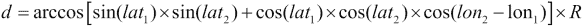

这个公式确定了两个位置之间的余弦值；与该余弦值相对应的角度乘以地球半径 R，以得到沿表面的距离。我们可以使用 R = 3,440 NM，R = 3,959 英里，或 R = 6,371 公里；我们得到合理准确的海里、英里或公里距离。

这个公式在小距离上效果不佳。水平距离公式更适合更精确地计算距离。以下是一些背景信息[`en.wikipedia.org/wiki/Haversine_formula`](http://en.wikipedia.org/wiki/Haversine_formula)。

根据 OED，术语“haversine”是在 1835 年由詹姆斯·英曼教授创造的。这个术语指的是正弦函数的使用方式。

水平距离计算通常表示为五个步骤：

1.  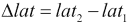

1.  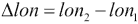

1.  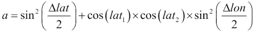

1.  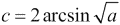

1.  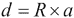

这个公式所需的正弦、余弦和平方根部分是 Python 的`math`库的一部分。当我们查看正弦和余弦的定义时，我们看到它们是以弧度为单位的。我们需要将我们的纬度和经度值从度转换为弧度。规则很简单 (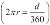)，但`math`库包括一个函数`radians()`，它将为我们完成这个转换。

我们可以查看[`rosettacode.org/wiki/Haversine_formula#Python`](http://rosettacode.org/wiki/Haversine_formula#Python)来从已有的示例中学习。

我们将使用这个作为两点之间的距离：

```py
from math import radians, sin, cos, sqrt, asin

MI= 3959
NM= 3440
KM= 6371

def haversine( point1, point2, R=MI ):
    """Distance between points.
    point1 and point2 are two-tuples of latitude and longitude.
    R is radius, R=MI computes in miles.
    """
    lat_1, lon_1 = point1
    lat_2, lon_2 = point2

    Δ_lat = radians(lat_2 - lat_1)
    Δ_lon = radians(lon_2 - lon_1)
    lat_1 = radians(lat_1)
    lat_2 = radians(lat_2)

    a = sin(Δ_lat/2)**2 + cos(lat_1)*cos(lat_2)*sin(Δ_lon/2)**2
    c = 2*asin(sqrt(a))

    return R * c
```

我们已经导入了进行此计算所需的`math`库中的五个函数。

我们已经定义了三个常数，它们以不同的单位表示地球的半径。我们可以将这些中的任何一个插入到我们的`haversine()`函数中作为`R`参数，以计算不同单位下的距离。这些值是近似值，但它们可以用来确定两点之间的距离。如果我们想要更精确的答案，我们可以插入更精确的值。由于地球不是完美的球形，我们必须确保使用平均半径值。

`haversine()`函数将接受两个必需的位置参数和一个可选参数。两个位置参数将是纬度和经度的两个元组。我们希望使用类似于`(36.12, -86.67)`的语法来将两个坐标绑定在单个 Python 值中。`R`参数是可选的，因为我们已经为它提供了一个默认值。我们可以使用这个函数以千米为单位而不是英里来获取距离：`haversine( (36.12, -86.67), (33.94, -118.40), R=KM)`。

我们函数的主体将两个元组分解为其纬度和经度值。我们通过减去并转换结果来计算`Δ_lat`变量。同样，我们通过减去并转换结果来计算`Δ_lon`变量。是的，以希腊字母Δ开头的变量名在 Python 中是完全有效的。在这之后，我们还可以将其他两个纬度转换为弧度。然后我们可以将这些值插入到其他公式中，以计算`a`、`c`，最后计算距离。

我们有一个基于 Rosetta Code 网站示例的测试用例：

```py
>>> from ch_4_ex_3 import haversine
>>> round(haversine((36.12, -86.67), (33.94, -118.40), R=6372.8), 5)
2887.25995
```

注意，我们将答案四舍五入到小数点后五位。浮点数是近似值；在硬件和操作系统上，精确地工作可能会有所不同。通过限制自己到小数点后五位，我们确信硬件的变化不会影响测试用例。

我们可以使用这个`haversine()`函数与我们的地理编码结果来计算地点之间的距离；这将帮助我们找到最近的地点。

## 结合地理编码和 haversine

在地理编码和`haversine()`函数之间，我们有计算地址之间近似距离的工具。

让我们把 333 Waterside，Norfolk，Virginia 作为我们的当前作战基地。假设我们的信息提供者想要在 456 Granby 或 111 W Tazewell 见面。哪一个更近？

首先，我们需要清理我们的地理编码脚本，使其成为一个可用的函数。而不仅仅是打印一个结果，我们需要从结果字典中获取值，以形成一个包含纬度和经度响应二元组的序列。

这是我们需要添加的内容：

```py
    def geocode( address ):
    ...  The previous processing ... 
    loc_dict= [r['geometry']['location'] for r in response['results']]
    loc_pairs= [(l['lat'],l['lng']) for l in loc_dict]
    return loc_pairs
```

我们使用了两个生成器表达式来分解结果。第一个生成器表达式从`response['results']`序列中的每个替代方案中提取位置信息。对于地理编码，应该只有一个表达式，但如果假设我们会得到多个响应，那么会更简单。

第二个生成器表达式将位置字典中的`'lat'`和`'lng'`元素转换为一个二元组。拥有纬度和经度二元组将很好地与我们的`haversine()`函数配合使用。

这样我们可以获取三个经纬度对：

```py
base = geocode( "333 Waterside, Norfolk, VA, 23510" )[0]
loc1 = geocode( "456 Granby St, Norfolk, VA" )[0]
loc2 = geocode( "111 W Tazewell, Norfolk, VA" )[0]
```

我们已经应用了我们的`geocode()`函数来获取一个包含两个元组的列表，然后使用`[0]`从每个响应列表中选取第一个元素。

这是我们可以报告从基地到每个位置的距离的方法：

```py
print("Base", base)
print("Loc1", loc1, haversine(base, loc1))
print("Loc2", loc2, haversine(base, loc2))
```

我们应用了我们的`haversine()`函数来计算距离。默认情况下，距离是以英里为单位，不过对于进行相对比较来说，单位并不重要。

这里是结果：

```py
Base (36.8443027, -76.2910835)
Loc1 (36.8525159, -76.2890381) 0.578671972401055
Loc2 (36.8493341, -76.291527) 0.3485214316218753
```

我们可以看到，第二个位置（`Loc2`），Tazewell 地址，比 Granby 街地址更接近我们的基地。

此外，我们还可以看到，我们需要格式化这些数字，使它们看起来更好。因为我们只使用大约的平均地球半径（以英里为单位），所以大部分的这些小数位只是视觉噪音。

# 压缩数据以生成网格代码

纬度和经度在传输时体积较大。它们有很多数字和一些特殊的标点符号。多年来，一些替代方案已经出现，它们使用更简单的符号来缩写位置。基本思想是将纬度和经度数字从度-分-秒数字转换为表示相同信息的字母和数字序列。

我们将探讨三种压缩方案：GeoRef 系统、Maindenhead 定位器和 NAC。这些编码中的每一个都涉及到进行一些算术计算，将数字从十进制（基数 10）转换为另一个基数。我们还将使用一系列字符串操作来将数字转换为字符，以及将字符转换为数字。

另一个有趣的编程问题是，这些编码不能直接与纬度和经度一起使用。简单地使用纬度和经度的问题在于它们是有符号的数字：-90（S）到+90（N）和-180（W）到+180（E）。此外，经度有更大的范围（360 个值），而纬度有较小的范围（180 个值）。为了简化编码，我们将应用一个常见的编程技巧：我们将偏移和缩放值。我们将看到应用这种巧妙技术的方法。

实际上，缩放和偏移将地图的(0, 0)原点移动到南极洲的某个地方：在南极和 180°经度上。这些网格地图的中心位于西非海岸线附近，而上右角最终会在白令海，正好在北极和 180°经度旁边。

## 创建 GeoRef 代码

GeoRef 系统使用四个字母和多达八个数字来压缩经纬度位置。此系统还可以用于编码区域描述以及海拔。我们将坚持使用地表位置。

对于一些背景信息，请参阅[`en.wikipedia.org/wiki/Georef`](http://en.wikipedia.org/wiki/Georef)。

这个系统使用从 A 到 Z 的 24 个字母代码（省略 I 和 O）来编码十进制数。这意味着我们不能简单地依赖像`string.ascii_uppercase`这样的字母表来提供字母代码。我们将不得不定义我们自己的 GeoRef 字母。我们可以用以下表达式来计算字母：

```py
>>> string.ascii_uppercase.replace("O","").replace("I","")
'ABCDEFGHJKLMNPQRSTUVWXYZ'
```

GeoRef 代码将世界地图切割成 12 x 24 的 15° x 15°网格。纬度从南极开始以正数测量。经度从国际日期线开始以正数测量。当我们把 180°的纬度分成 15°的步长时，我们可以使用从 A 到 M 的 12 个字母（省略 I）来编码这个三位数的一部分。当我们把 360°的经度分成 15°的步长时，我们可以使用从 A 到 Z 的 24 个字母（省略 I 和 O）来编码这个三位数的一部分。

然后，我们可以使用字母 A 到 Q（再次省略 I 和 O）将每个 15°的网格分成 15 个波段。这为纬度和经度的整个度数部分创建了一个四字符代码。

如果我们有 38°17′10″N 的纬度，我们将将其偏移到南极以北 128°，然后除以 15°：

```py
>>> divmod(38+90,15)
(8, 8)
```

这些值被编码为 J 和 J。

76°24′42″W 的经度被编码，如下所示代码所示。这是-76.41167°，我们在使用`divmod`计算两个字符之前，将其偏移 180°：

```py
>>> divmod( -76+180, 15 )
(6, 14)
```

这给我们字母 G 和 P。我们交错经度和纬度字符，使整个字符串为 GJPJ。我们已经将纬度和经度的六位数字编码为四个字符。

剩余的分钟和秒可以编码为两位、三位或四位数字。对于纬度，17′10″可以编码为 17.16 分钟。这是 17，一个中间值 171，或一个详细值 1716。

下面是 GeoRef 代码的整个编码器：

```py
def ll_2_georef( lat, lon ):
    f_lat, f_lon = lat+90, lon+180
    lat_0, lat_1 = divmod( int(f_lat), 15 )
    lon_0, lon_1 = divmod( int(f_lon), 15 )
    lat_m, lon_m = 6000*(f_lat-int(f_lat)), 6000*(f_lon-int(f_lon))
    return "{lon_0}{lat_0}{lon_1}{lat_1}{lon_m:04d}{lat_m:04d}".format(
        lon_0= georef_uppercase[lon_0],
        lat_0= georef_uppercase[lat_0],
        lon_1= georef_uppercase[lon_1],
        lat_1= georef_uppercase[lat_1],
        lon_m= int(lon_m),
        lat_m= int(lat_m),
    ) 
```

我们对纬度和经度进行了偏移，这样我们就不必处理有符号的数字。我们使用了 `divmod()` 函数来除以 15°，并得到一个商和一个余数。然后我们可以使用我们的 `georef_uppercase` 字母来将数值商和余数转换为预期的字符代码。

例如，分数值 `f_lat-int(f_lat)` 被缩放为 6000，以创建一个介于 0000 和 5999 之间的数字，这仅仅是 100 分之分钟的数字。

我们使用了 `format()` 字符串方法将四字符代码和四数字代码组合成一个单一的字符串。前两个字母是经度和纬度，以提供最接近 15°的位置。接下来的两个字母有更多的经度和纬度细节，以将精度细化到最接近的 1°。数字分为两个四位数块，以提供详细的分钟数。

这里是一个更完整的输出示例。我们将编码 36°50.63′N 076°17.49′W：

```py
lat, lon = 36+50.63/60, -(76+17.49/60)
print(lat, lon)
print(ll_2_georef(lat, lon))
```

我们已经将度和分钟转换为度。然后，我们将 GeoRef 转换应用于度数中的值。以下是输出结果：

```py
36.843833333333336 -76.2915
GJPG42515063
```

代码 `GJPG` 是给定位置的近似值；在赤道附近可能会偏差高达 80 海里。误差随着接近两极而减小。代码 `GJPG4250` 使用两位数的整分钟编码，以将坐标误差缩小到几英里以内。

# 解码 GeoRef 代码

当我们解码 GeoRef 代码时，我们必须将两部分分开：前四个字符和末尾的数字细节。一旦我们分离出前四个字符，我们可以将剩余字符的数量除以二。一半的数字将是经度，其余的是纬度。

前四位必须在我们的特殊 GeoRef 字母表中查找。我们将找到每个字符在 `ABCDEFGHJKLMNPQRSTUVWXYZ` 字符串中的位置以获得一个数值。例如，`georef_uppercase.find('Q')` 给出 14：Q 在该字母表中的位置。然后我们可以将一个位置乘以 15°，将另一个位置数字加到一起，将两个字符转换为 GeoRef 的度数部分。

剩余的数字仅仅是分钟，它们是 1/60 度。在转换过程中，涉及到创建一个数字，可能还需要将其除以 10 或 100。最后一步是移除用于避免有符号算术的偏移量。

整个过程看起来是这样的：

```py
def georef_2_ll( grid ):
    lon_0, lat_0, lon_1, lat_1= grid[:4]
    rest= grid[4:]
    pos= len(rest)//2
    if pos:
        scale= { 4: 100, 3: 10, 2: 1 }[pos]
        lon_frac, lat_frac = float(rest[:pos])/scale, float(rest[pos:])/scale
    else:
        lon_frac, lat_frac = 0, 0
    lat= georef_uppercase.find(lat_0)*15+georef_uppercase.find(lat_1)+lat_frac/60
    lon= georef_uppercase.find(lon_0)*15+georef_uppercase.find(lon_1)+lon_frac/60
    return lat-90, lon-180
```

这通过将代码的前四位分成四个经度和纬度字符来实现。请注意，位置是交错排列的：经度先，纬度后。

字符串的其余部分被分成两半。如果有任何字符在第二半，那么第一半（两个、三个或四个字符）将是经度分钟；第二半将是纬度分钟。

我们使用了一个简单的从长度（两个、三个或四个）到缩放值（1、10 和 100）的映射。我们定义了一个从位置到缩放因子的映射字典，并将位置数`pos`应用于该字典。我们也可以使用算术计算来完成这个操作：`10**(pos-1)`；这个计算也可以将`pos`转换为 10 的幂。

我们将字符字符串转换为浮点数，然后缩放以创建分钟的适当值。以下是一个缩放示例：

```py
>>> float("5063")/100
50.63
```

`else`条件处理只有四个位置的网格代码的情况。如果这是真的，那么我们只有字母，分钟将为零。

我们可以使用一个字母乘以 15°，下一个字母乘以 1°，以及分钟乘以度的 60 分来计算偏移值。当然，最后一步是移除偏移值以创建预期的有符号数字。

考虑到我们使用以下内容：

```py
print( georef_2_ll( "GJPG425506" ) )
```

我们将看到如下输出：

```py
(36.843333333333334, -76.29166666666667)
```

我们将较长的 GeoRef 代码缩短为 10 位代码。这有两个 3 位分钟的编码。我们选择牺牲一些精度，但这也可以简化秘密信息的传输。

## 创建梅登黑德网格代码

与之前提到的相对简单的网格代码相比，我们有一个称为**梅登黑德系统**的替代表示法。这是由业余无线电操作员用来交换他们站点位置信息的。梅登黑德是英格兰的一个城镇；梅登黑德代码是**IO91PM**。

更多信息，请参阅[`en.wikipedia.org/wiki/Maidenhead_Locator_System`](http://en.wikipedia.org/wiki/Maidenhead_Locator_System)。

梅登黑德算法涉及一些更复杂的数学，基于创建纬度和经度数字的基数为 240 的表示。我们可以使用字母-数字组合来编码基数 240 数字的每一位。我们将展示一个将浮点数转换为整数的常用技术，通过一系列步骤进行。

梅登黑德系统将世界地图切割成 180 × 180 的网格四边形；每个四边形在南北方向上有 1°，在东西方向上有 2°。我们可以使用基数为 240 的数字系统来编码这些四边形，其中字母和数字用于表示基数 240 系统中的每一位。由于网格只有 180×180，我们不需要基数 240 的全部范围。

为了更精确地指定位置，我们可以将网格的每个单元格切割成 240 x 240 更小的单元格。这意味着一个八位代码可以使我们在南北方向上达到 0.25 海里，在东西方向上达到 0.5 海里。对于业余无线电的目的，这可能是足够的。对于我们的地址级地理编码，我们需要更高的精度。

我们可以将相同的字母-数字操作进行第三次，将每个小矩形分割成 240 个更小的部分。这使我们达到了所需的精度以上。

我们在 240 进制系统中创建一个三位数，其中每个 240 的基数位由一个字母-数字对表示。我们执行以下计算来创建编码数字的三位数字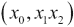，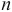：

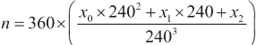

下面是这个整个过程的示例：

```py
def ll_2_mh( lat, lon ):
    def let_num( v ):
        l, n = divmod( int(v), 10 )
        return string.ascii_uppercase[l], string.digits[n]
    f_lat= lat+90
    f_lon= (lon+180)/2
    y0, y1 = let_num( f_lat )
    x0, x1 = let_num( f_lon )
    f_lat= 240*(f_lat-int(f_lat))
    f_lon= 240*(f_lon-int(f_lon))
    y2, y3 = let_num( f_lat )
    x2, x3 = let_num( f_lon )
    f_lat= 240*(f_lat-int(f_lat))
    f_lon= 240*(f_lon-int(f_lon))
    y4, y5 = let_num( f_lat )
    x4, x5 = let_num( f_lon )
    return "".join( [
        x0, y0, x1, y1, x2, y2, x3, y3, x4, y4, x5, y5 ] )
```

我们在`ll_2_mh()`函数内部定义了一个内部函数`let_num()`。内部`let_num()`函数将 0 到 240 范围内的数字转换为一个字母和一个数字。它使用`divmod()`函数将数字分解为 0 到 24 的商和 0 到 9 的余数。然后，这个函数使用这两个数值作为`string.ascii_uppercase`和`string.digits`字符串的索引来返回两个字符。每个字母-数字对是 240 进制系统中单个数字的表示。我们不是发明 240 个数字符号，而是重新利用字母-数字对来写出 240 个不同的值。

第一步是将原始的、有符号的纬度和经度转换为我们的梅登黑德网格版本。`f_lat`变量是原始纬度，偏移 90 度使其严格为正，范围在 0 到 180 度之间。`f_lon`变量是原始经度偏移 180 度然后除以 2，使其严格为正，范围在 0 到 180 度之间。我们从这些初始的度数值：`f_lat`和`f_lon`中创建了初始的字母-数字配对。

这对于度数来说工作得很好。那么，对于度数的分数部分呢？这里有一个处理浮点值表示的常见技术。

如果我们使用类似`lat-int(lat)`的方法，我们将计算纬度的分数部分。如果我们将其乘以 240，我们将得到一个可以用`divmod()`函数来获取 240 个字母位置和一个数字的数字。表达式`240*(f_lat-int(f_lat))`将`f_lat`的分数部分扩展到 0 到 240 的范围内。以下是如何进行这种缩放的示例：

```py
>>> f_lat= 36.84383
>>> 240*(f_lat-int(f_lat))
202.51919999999927
>>> 240*.84383
202.51919999999998
```

原始纬度是`36.84383`。`f_lat-int(f_lat)`的值将是该值的分数部分，即`.84383`。我们将其乘以`240`来得到值，大约的结果是`202.5192`。

我们使用`let_num()`函数创建了一个字母和数字的配对。剩余的分数值（`0.5192`）可以通过 240 倍缩放来得到另一个字母和数字的配对。

到这一点，细节已经达到了相关性的极限。1/240/240 度的精度大约是 6 英尺。大多数民用 GPS 仪器只能精确到大约 16 英尺。

最后一步是将经度和纬度字符交织在一起。我们通过创建一个字符列表来实现这一点，字符的顺序是预定的。`string.join()` 方法在将字符串列表组装成一个字符串时使用给定的字符串作为分隔符。通常使用 `", ".join(some_list)` 来创建以逗号分隔的项目。我们使用了 `"".join()` 来组装没有分隔符的最终字符串。

这里是一个更完整的输出示例。我们将编码 36°50.63′N 076°17.49′W：

```py
lat, lon = 36+50.63/60, -(76+17.49/60)
print( lat, lon )
print( ll_2_mh( lat, lon ) )
```

我们将度和分转换成了度。然后，我们将 Maidenhead 转换应用于度数值。输出看起来是这样的：

```py
36.843833333333336 -76.28333333333333
FM16UU52AM44
```

我们可以使用这些部分以不同的精度进行编码。`FM16` 比较粗糙，而 `FM16UU` 则更精确。

## 解码 Maidenhead 网格代码

要解码 Maidenhead 代码，我们需要反转我们用来从纬度和经度创建代码的程序。我们需要将所有偶数位置作为数字序列来创建经度，将所有奇数位置作为数字序列来创建纬度。通过对照 `string.ascii_uppercase` 和 `string.digits` 进行查找，我们可以将字符转换成数字。

一旦我们有一个数字序列，我们可以应用一系列的权重因子并将结果相加。整个过程看起来是这样的：

```py
def mh_2_ll( grid ):
    lon= grid[0::2] # even positions
    lat= grid[1::2] # odd positions
    assert len(lon) == len(lat)
    # Lookups will alternate letters and digits
    decode = [ string.ascii_uppercase, string.digits,
              string.ascii_uppercase, string.digits,
              string.ascii_uppercase, string.digits,
              ]
    lons= [ lookup.find(char.upper()) for char, lookup in zip( lon, decode ) ]
    lats= [ lookup.find(char.upper()) for char, lookup in zip( lat, decode ) ]
    weights = [ 10.0, 1.0,
               1/24, 1/240,
               1/240/24, 1/240/240, ]
    lon = sum( w*d for w,d in zip(lons, weights) )
    lat = sum( w*d for w,d in zip(lats, weights) )
    return lat-90, 2*lon-180
```

我们使用了 Python 非常优雅的切片表示法来将字符串拆分成偶数和奇数位置。表达式 `grid[0::2]` 指定了一个 `grid` 字符串的切片。`[0::2]` 切片从位置 `0` 开始，扩展到非常末尾，并增加 `2`。`[1::2]` 切片从位置 `1` 开始，扩展到非常末尾，也增加 `2`。

`decode` 列表包含六个字符串，这些字符串将被用来将每个字符转换成数值。第一个字符将在 `string.ascii_uppercase` 中找到，第二个字符将在 `string.digits` 中找到。这些字符串中字符的位置将变成我们可以用来计算经纬度的数值。

例如，`'ABCDEFGHIJKLMNOPQRSTUVWXYZ'.find('M')` 的值是 `12`。

我们使用生成器表达式和 `zip()` 函数来完成翻译的实际工作。`zip()` 函数将产生一系列的配对；每个配对将包含从输入网格代码中选择的一个字符和从 `decode` 列表中选择的一个查找字符串。然后我们可以使用 `lookup.find(char.upper())` 来在给定的查找字符串中定位给定的字符。结果将是一个整数位置序列。

一旦我们有一个数值序列，我们可以应用一系列的权重来将每个位置转换为度或度的分数。同样，我们使用 `zip()` 来从数字和权重中创建双元组。然后生成器将数值乘以权重。内置的 `sum()` 函数从数字和权重中创建最终值。

例如，我们可能在`lons`变量中有`[5, 1, 20, 6, 0, 0]`这样的值。权重是`[10.0, 1.0, 0.0416, 0.00416, 0.00017361, 1.7361e-05]`。当我们使用`zip()`将这些两个序列压缩在一起时，我们会得到这样的配对：

```py
[(5, 10.0), (1, 1.0), (20, 0.0416), 
(6, 0.00416), (0, 0.00017361), 
(0, 1.7361e-05)]
```

这些乘积看起来是这样的：

```py
[50.0, 1.0, 0.832, 0.024959999999999996, 0.0, 0.0]
```

总和是`51.85696`。

最后一步是撤销我们用来强制纬度为正值以及经度在 0 到 180 之间而不是-180 到+180 之间的偏移量。中间经度结果`51.85696`变为`-76.28608`。

考虑到我们评估以下内容：

```py
print( mh_2_ll( "FM16UU62" ) )
```

我们得到了以下解码的位置：

```py
(36.84166666666667, -76.28333333333333)
```

这很好地解码了我们之前章节中编码的值。

# 创建自然区域代码

**自然区域代码**（**NAC**）是将地理位置信息编码为短字符字符串的另一种方式。整个 NAC 系统可以包括海拔信息以及表面位置。我们将重点关注 NAC 的纬度和经度转换。

更多信息请参阅[`www.nacgeo.com/nacsite/documents/nac.asp`](http://www.nacgeo.com/nacsite/documents/nac.asp)。

这使用的是 30 进制而不是 240 进制；我们可以使用大部分的字母和一些数字来表示一个 30 进制的数字。这个实现将展示一种将浮点数转换为整数近似的方法。这将把多个计算步骤组合成更长的表达式。

NAC 使用 30 字符编码，该编码使用数字和辅音字母。用于编码和解码的字符串是：

```py
>>> nac_uppercase= "0123456789BCDFGHJKLMNPQRSTVWXZ"
>>> len(nac_uppercase)
30
>>> nac_uppercase[10]
'B'
>>> nac_uppercase.find('B')
10
```

我们可以取一个经度（-180 到+180），并添加一个偏移量将其放入 0 到 360 的范围内。如果我们将其乘以`(30**4)/360`，我们将得到一个介于 0 到 810000 之间的数字。这可以转换为四位数 30 进制数。

同样，我们可以取一个纬度（-90 到+90），并添加一个偏移量将其放入 0 到 180 的范围内。如果我们将其乘以`(30**4)/180`，同样，我们将得到一个可以转换为四位数 30 进制数的数字。这里的重大优势是我们用较短的 30 进制数字字符串替换了长串的 10 进制数字。

建议用于编码此信息的算法是：

```py
def ll_2_nac( lat, lon ):
    f_lon= (lon+180)/360
    x0 = int(   f_lon*30)
    x1 = int((  f_lon*30-x0)*30)
    x2 = int((( f_lon*30-x0)*30-x1)*30)
    x3 = int(.5+(((f_lon*30-x0)*30-x1)*30-x2)*30)

    f_lat= (lat+90)/180
    y0 = int(   f_lat*30 )
    y1 = int((  f_lat*30-y0)*30)
    y2 = int((( f_lat*30-y0)*30-y1)*30)
    y3 = int(0.5+(((f_lat*30-y0)*30-y1)*30-y2)*30)

    print( x0, x1, x2, x3, y0, y1, y2, y3 )
    return "".join( [
        nac_uppercase[x0], nac_uppercase[x1], 
        nac_uppercase[x2], nac_uppercase[x3],
        " ",
        nac_uppercase[y0], nac_uppercase[y1], 
        nac_uppercase[y2], nac_uppercase[y3],
    ])
```

我们通过添加偏移量并除以 360 来缩放经度。这创建了一个介于`0`和`1.0`之间的数字。然后我们可以通过大量的乘法和减法将这个数字编码为 30 进制。有几种方法可以优化这个过程。

每一步都遵循类似的模式。我们将逐步进行经度计算。以下是第一个字符的计算：

```py
>>> lon= -151.3947
>>> f_lon= (lon+180)/360
>>> f_lon
0.07945916666666666
>>> x0 = int(f_lon*30)  
>>> x0
2
```

第一步计算`f_lon`，即该经度（151.3947W）相对于 360 度的分数。当我们把`f_lon`乘以 30 时，得到`2.383775`。整数部分`2`将成为第一个字符。剩余的三个字符将用于编码分数。

这是基于第一个字符的下一个字符：

```py
>>> x1 = int((f_lon*30-x0)*30)
>>> x1
11
```

`(f_lon*30-x0)`的计算得到分数，`.383775`。然后我们将其乘以`30`得到`11.51325`。整数部分`11`将成为第二个字符。分数将编码在剩余的两个字符中。

在每一步中，我们将所有之前的数字用于计算剩余的分数部分。以下是最后两个字符：

```py
>>> x2 = int((( f_lon*30-x0)*30-x1)*30)
>>> x2
15
>>> x3 = int(0.5+(((f_lon*30-x0)*30-x1)*30-x2)*30)
>>> x3
12 
```

每个字符都通过将原始数字（`f_lon`）与之前计算的数字之间的差来获取剩余的分数。最后一步涉及大量的乘法。在之前的*创建梅登黑德网格码*部分，我们展示了这个主题的一个变体，它没有使用那么多乘法操作。

例如，我们可能执行以下操作：

```py
    lat, lon = 43.6508, -151.3947
    print( ll_2_nac( lat, lon ) )
```

这个输出的结果是：

```py
    2CHD Q87M
```

这是对纬度和经度的一个相当整洁的总结。

## 解码自然区域码

解码自然区域码实际上是将 30 进制数转换为 0 到 810,000 之间的值。然后将其缩放为适当的纬度或经度值。尽管 30 进制数看起来并不简单，但编程实际上相当简洁。以下是建议的算法：

```py
def nac_2_ll( grid ):
    X, Y = grid[:4], grid[5:]
    x = [nac_uppercase.find(c) for c in X]
    y = [nac_uppercase.find(c) for c in Y]
    lon = (x[0]/30+x[1]/30**2+x[2]/30**3+x[3]/30**4)*360-180
    lat = (y[0]/30+y[1]/30**2+y[2]/30**3+y[3]/30**4)*180-90
    return lat, lon
```

我们已经将九字符 NAC 网格码的每一部分分解为经度子串和纬度子串。我们使用生成器函数在我们的`nac_uppercase`字母表中查找每个字符。这将每个字符映射到 0 到 29 之间的数字位置。

一旦我们有了四个 30 进制数字的序列，我们就可以从数字中计算出一个数。以下表达式完成了基本的工作：

```py
(x[0]/30+x[1]/30**2+x[2]/30**3+x[3]/30**4)
```

上述表达式是对多项式的优化，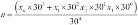。Python 代码简化了每个项中的常数——而不是计算`x[0]*30**3/30**4`；这被简化为`x[0]/30`。

中间结果通过 360 或 180 进行缩放并偏移，以获得最终结果的预期有符号值。

考虑以下评估：

```py
print( nac_2_ll( "2CHD Q87M" ) )
```

我们得到了以下结果：

```py
(43.650888888888886, -151.39466666666667)
```

这显示了如何解码 NAC 以恢复位置的纬度和经度。

# 解决问题——最近的良好餐馆

我们想在离基地合理距离的好餐馆与我们的秘密线人见面。为了定位好餐馆，我们需要收集一些额外的信息。在这种情况下，好意味着来自卫生检查员的好成绩。

在我们甚至能够开会之前，我们需要使用基本的间谍技巧来定位当地餐馆的健康码调查结果。

我们将创建一个 Python 应用程序来结合许多东西以筛选结果。我们将执行以下步骤：

1.  我们将从餐馆健康评分信息开始。

1.  如果尚未完成，我们需要对餐馆地址进行地理编码。在某些情况下，地理编码已经为我们完成。在其他情况下，我们将使用网络服务来完成这项工作。

1.  我们需要根据良好的评分过滤和组织餐厅。我们还需要使用我们的`haversine()`函数来计算我们基地的距离。

1.  最后，我们需要将这一点传达给我们的网络，理想情况下是使用嵌入在我们发布到社交媒体网站上的图片中的简短 NAC 代码。参见第三章，*使用隐写术编码秘密信息*，了解这一最终步骤的详细信息。

在许多城市，健康代码数据可在网上找到。仔细搜索将揭示一个有用的数据集。在其他城市，健康检查数据可能不容易在网上找到。我们可能需要深入挖掘以追踪我们运营基地附近的一些餐厅。

一些城市使用**Yelp**来公布餐厅健康代码检查数据。我们可以在以下链接上阅读关于 YELP API 的内容以搜索餐厅：

[`www.yelp.com/developers/documentation`](http://www.yelp.com/developers/documentation)

我们也可能在 InfoChimps 上找到一些有用的数据，[`www.infochimps.com/tags/restaurant`](http://www.infochimps.com/tags/restaurant)。

我们经常遇到的一个复杂性是使用基于 HTML 的 API 来处理这类信息。这并非有意混淆，但 HTML 的使用使得数据分析变得复杂。解析 HTML 以提取有意义的信息并不容易；我们需要额外的库来处理这一点。

我们将探讨两种方法：良好的、干净的数据和更复杂的 HTML 数据解析。在两种情况下，我们需要创建一个 Python 对象，作为属性集合的容器。首先，我们将转向查看`SimpleNamespace`类。然后，我们将使用这个类来收集信息。

## 创建简单的 Python 对象

我们有多种方式来定义自己的 Python 对象。我们可以使用内置的中心类型，如 dict，来定义一个具有属性值的集合的对象。在查看餐厅信息时，我们可以使用类似以下的方式：

```py
some_place = { 'name': 'Secret Base', 'address': '333 Waterside Drive' }
```

由于这是一个可变对象，我们可以添加属性值并更改现有属性值。虽然语法有点笨拙，但以下是更新此对象的方式：

```py
some_place['lat']= 36.844305
some_place['lng']= -76.29112
```

额外的`[]`方括号和`''`引号似乎是不必要的。我们希望有一个比这种非常通用的字典键值语法稍微干净一点的符号。

一种常见的解决方案是使用合适的类定义。其语法看起来像这样：

```py
class Restaurant:
    def __init__(self, name, address):
        self.name= name
        self.address= address
```

我们定义了一个具有初始化方法`__init__()`的类。初始化方法的名字是特殊的，只能使用这个名字。当对象被创建时，初始化方法会被评估以分配初始值给对象的属性。

这使我们能够更简洁地创建对象：

```py
some_place= Restaurant( name='Secret Base', address='333 Waterside Drive' )
```

我们已经使用了显式的关键字参数。使用`name=`和`address=`不是*必需的*。然而，随着类定义变得更加复杂，使用关键字参数值通常更加灵活和清晰。

我们也可以很好地更新对象，如下所示：

```py
some_place.lat= 36.844305
some_place.lng= -76.29112
```

当我们有很多与每个对象绑定的独特处理时，这效果最好。在这种情况下，我们实际上没有与属性关联的处理；我们只是想将这些属性收集在一个整洁的胶囊中。对于这样一个简单的问题，正式的类定义是过多的开销。

Python 还给我们提供了一个非常灵活的结构，称为**命名空间**。这是一个可变对象，我们可以使用简单的属性名称来访问它，如下面的代码所示：

```py
from types import SimpleNamespace
some_place= SimpleNamespace( name='Secret Base', address='333 Waterside Drive' )
```

创建命名空间时*必须*使用关键字参数（`name='The Name'`）。一旦我们创建了此对象，我们可以使用以下代码片段中所示愉快的方法来更新它：

```py
some_place.lat= 36.844305
some_place.lng= -76.29112
```

`SimpleNamespace`类给我们提供了一个构建包含多个单独属性值的对象的方法。

我们还可以使用 Python 的`**`符号从字典创建命名空间。以下是一个示例：

```py
>>> SimpleNamespace( **{'name': 'Secret Base', 'address': '333 Waterside Drive'} )
namespace(address='333 Waterside Drive', name='Secret Base')
```

`**`符号告诉 Python 字典对象包含函数的关键字参数。字典键是参数名称。这允许我们构建一个字典对象，然后将其用作函数的参数。

回想一下，JSON 倾向于将复杂的数据结构编码为字典。使用这个`**`技术，我们可以将 JSON 字典转换为`SimpleNamespace`，并用更干净的`object.key`表示法替换笨拙的`object['key']`表示法。

## 与 HTML 网络服务一起工作 – 工具

在某些情况下，我们想要的数据绑定在 HTML 网站上。例如，诺福克市依赖弗吉尼亚州的 VDH 健康门户来存储其餐馆健康代码检查数据。

为了理解在万维网上的 HTML 表示法中编码的智能，我们需要能够解析围绕数据的 HTML 标记。使用特殊的高能武器，在这个案例中是 BeautifulSoup，我们的工作大大简化了。

从[`pypi.python.org/pypi/beautifulsoup4/4.3.2`](https://pypi.python.org/pypi/beautifulsoup4/4.3.2)或[`www.crummy.com/software/BeautifulSoup/`](http://www.crummy.com/software/BeautifulSoup/)开始。

如果我们有 Easy Install（或 PIP），我们可以使用这些工具来安装 BeautifulSoup。在第一章 *我们的间谍工具包*中，我们应该已经安装了其中一个（或两个）这些工具来安装更多工具。

我们可以使用 Easy Install 来安装 BeautifulSoup，如下所示：

```py
sudo easy_install-3.3 beautifulsoup4 

```

Mac OS X 和 GNU/Linux 用户需要使用`sudo`命令。Windows 用户不需要使用`sudo`命令。

一旦我们有了 BeautifulSoup，我们就可以用它来解析 HTML 代码，寻找隐藏在复杂的 HTML 标签混乱中的特定事实。

在我们继续之前，你需要阅读快速入门文档，并熟悉 BeautifulSoup。一旦你完成了这些，我们将转向从 HTML 网页中提取数据。

从 [`www.crummy.com/software/BeautifulSoup/bs4/doc/#quick-start`](http://www.crummy.com/software/BeautifulSoup/bs4/doc/
#quick-start) 开始。

另一个工具是 **scrapy**。更多信息请参阅 [`scrapy.org`](http://scrapy.org)。此外，阅读 *Instant Scrapy Web Mining and Scraping*，作者 *Travis Briggs*，由 *Packt Publishing* 出版，以了解使用此工具的详细信息。不幸的是，截至本文撰写时，scrapy 专注于 Python 2，而不是 Python 3。

## 与 HTML 网络服务一起工作 – 获取页面

在诺福克市 VDH 健康数据的情况下，HTML 抓取相对简单。我们可以利用 BeautifulSoup 的优势，非常优雅地深入 HTML 页面。

一旦我们从 HTML 页面创建了 BeautifulSoup 对象，我们将拥有一种优雅的技术来遍历 HTML 标签的层次结构。每个 HTML 标签名（`html`、`body` 等）也是 BeautifulSoup 查询，用于定位该标签的第一个实例。

例如，`soup.html.body.table` 这样的表达式可以定位 HTML `<body>` 标签中的第一个 `<table>`。在 VDH 餐厅数据的情况下，这正是我们想要的数据。

一旦我们找到了表格，我们需要提取行。每行的 HTML 标签是 `<tr>`，我们可以使用 BeautifulSoup 的 `table.find_all("tr")` 表达式来定位给定 `<table>` 标签内的所有行。每个标签的文本是一个属性，`.text`。如果标签有属性，我们可以将标签视为一个字典来提取属性值。

我们将 VDH 餐厅数据的处理分解为两部分：构建 Soup 的网络服务查询和 HTML 解析以收集餐厅信息。

下面是第一部分，即获取原始 BeautifulSoup 对象：

```py
scheme_host= "http://healthspace.com"
def get_food_list_by_name():
    path= "/Clients/VDH/Norfolk/Norolk_Website.nsf/Food-List-ByName"
    form = {
        "OpenView": "",
        "RestrictToCategory": "FAA4E68B1BBBB48F008D02BF09DD656F",
        "count": "400",
        "start": "1",
    }
    query= urllib.parse.urlencode( form )
    with urllib.request.urlopen(scheme_host + path + "?" + query) as data:
        soup= BeautifulSoup( data.read() )
    return soup
```

这重复了我们之前看到的网络服务查询。在这里，我们区分了三件事：`scheme_host` 字符串、`path` 字符串和 `query`。这样做的原因是，我们的整体脚本将使用 `scheme_host` 与其他路径一起使用。我们还将插入大量不同的查询数据。

对于这个基本的 `food_list_by_name` 查询，我们构建了一个表单，将获取 400 家餐厅的检查结果。表单中的 `RestrictToCategory` 字段有一个神奇的关键字，我们必须提供这个关键字才能获取诺福克餐厅。我们通过基本的网络间谍技术找到了这个关键字：我们在网站上四处浏览，并检查了我们点击每个链接时使用的 URL。我们还使用了 Safari 的开发者模式来探索页面源代码。

从长远来看，我们想要所有检查结果。为了开始，我们限制了自己只获取 400 条，这样我们就不需要花费太多时间等待脚本测试。

响应对象被 BeautifulSoup 用于创建网页的内部表示。我们将它分配给`soup`变量，并将其作为函数的结果返回。

除了返回`soup`对象外，打印它也可能很有帮助。这是一大堆 HTML。我们需要解析它以从标记中提取有趣的细节。

## 与 HTML 网络服务一起工作 - 解析表格

一旦我们将一页 HTML 信息解析成 BeautifulSoup 对象，我们就可以检查该页的细节。这里有一个函数，可以找到页面中隐藏的餐厅检查详情表。

我们将使用生成器函数来逐行生成表格中的每一行，如下面的代码所示：

```py
def food_table_iter( soup ):
    """Columns are 'Name', '', 'Facility Location', 'Last Inspection', 
    Plus an unnamed column with a RestrictToCategory key
    """
    table= soup.html.body.table
    for row in table.find_all("tr"):
        columns = [ td.text.strip() for td in row.find_all("td") ]
        for td in row.find_all("td"):
            if td.a:
                url= urllib.parse.urlparse( td.a["href"] )
                form= urllib.parse.parse_qs( url.query )
                columns.append( form['RestrictToCategory'][0] )
        yield columns
```

注意，这个函数以三引号字符串开始。这是一个*文档字符串*，它提供了关于函数的文档。良好的 Python 风格要求每个函数都有一个文档字符串。Python 帮助系统将显示函数、模块和类的文档字符串。我们省略了它们以节省空间。在这里，我们包括了它，因为这个特定迭代器的结果可能相当令人困惑。

这个函数需要一个解析后的 Soup 对象。该函数使用简单的标签导航来定位 HTML `<body>` 标签中的第一个`<table>`标签。然后它使用表的`find_all()`方法来定位该表中的所有行。

对于每一行，有两个处理步骤。首先，使用生成器表达式找到该行内的所有`<td>`标签。每个`<td>`标签的文本去除了多余的空白字符，并形成一个单元格值的列表。在某些情况下，这种处理就足够了。

然而，在这种情况下，我们还需要解码一个 HTML `<a>` 标签，该标签包含对给定餐厅详细信息的引用。我们使用第二个`find_all("td")`表达式再次检查每一列。在每一列中，我们使用简单的`if td.a:`循环检查是否存在`<a>`标签。如果存在`<a>`标签，我们可以获取该标签上`href`属性的值。当查看源 HTML 时，这是`<a href="">`引号内的值。

HTML `href` 属性的此值是一个 URL。我们实际上不需要整个 URL。我们只需要 URL 中的查询字符串。我们使用了`urllib.parse.urlparse()`函数来提取 URL 的各个部分。`url.query`属性的值只是`?`之后的查询字符串。

结果表明，我们甚至不需要整个查询字符串；我们只需要`RestrictToCategory`键的值。我们可以使用`urllib.parse.parse_qs()`来解析查询字符串，以获取类似表单的字典，并将其分配给变量`form`。这个函数是`urllib.parse.urlencode()`的逆函数。`parse_qs()`函数构建的字典将每个键与一个值列表关联。我们只想获取第一个值，因此使用`form['RestrictToCategory'][0]`来获取所需的餐厅键。

由于这个 `food_table_iter()` 函数是一个生成器，所以必须使用 `for` 语句或另一个生成器函数来使用它。我们可以使用 `for` 语句如下：

```py
for row in  food_table_iter(get_food_list_by_name()):
    print(row)
```

这将打印 HTML 表格中的每一行数据。它开始如下：

```py
['Name', '', 'Facility Location', 'Last Inspection']
["Todd's Refresher", '', '150 W. Main St #100', '6-May-2014', '43F6BE8576FFC376852574CF005E3FC0']
["'Chick-fil-A", '', '1205 N Military Highway', '13-Jun-2014', '5BDECD68B879FA8C8525784E005B9926']
```

这将继续进行 400 个位置。

结果并不令人满意，因为每一行都是一个属性的单层列表。名称在 `row[0]` 中，地址在 `row[2]` 中。这种通过位置引用列的方式可能很模糊。如果我们将结果转换为 `SimpleNamespace` 对象，我们就可以使用 `row.name` 和 `row.address` 语法。

## 从数据列创建一个简单的 Python 对象

我们真正想要的是一个具有易于记忆的属性名的对象，而不是一系列匿名的列名。这里有一个生成器函数，它将从函数（如 `food_table_iter()` 函数）产生的值序列中构建 `SimpleNamespace` 对象：

```py
def food_row_iter( table_iter ):
    heading= next(table_iter)
    assert ['Name', '', 'Facility Location', 'Last Inspection'] == heading
    for row in table_iter:
        yield SimpleNamespace(
            name= row[0], address= row[2], last_inspection= row[3],
            category= row[4]
        ) 
```

这个函数的参数必须是一个迭代器，如 `food_table_iter(get_food_list_by_name())`。该函数使用 `next(table_iter)` 来获取第一行，因为那将只是一堆列标题。我们将断言这些列标题确实是 VDH 数据中的标准列标题。如果断言失败，这可能意味着 VDH 网络数据已更改。

对于第一行之后的每一行，我们通过从每一行中获取特定列并将它们分配给好的名称来构建一个 `SimpleNamespace` 对象。

我们可以这样使用这个函数：

```py
soup= get_food_list_by_name()
raw_columns=  food_table_iter(soup)
for business in food_row_iter( raw_column ):
    print( business.name, business.address )
```

处理现在可以使用好的属性名，例如，`business.name`，来引用我们从 HTML 页面提取的数据。这使得其余的编程更有意义和清晰。

也很重要的是，我们已经结合了两个生成器函数。`food_table_iter()` 函数将生成由 HTML 表格行构建的小列表。`food_row_iter()` 函数期望一个可迭代的列表序列，并将从该列表序列中构建 `SimpleNamespace` 对象。这定义了一种由较小步骤构建的复合处理管道。从 `food_table_iter()` 开始的 HTML 表格的每一行都会被 `food_row_iter()` 触及，并最终由 `print()` 函数处理。

## 用地理编码丰富 Python 对象

我们到目前为止得到的诺福克数据只是一个餐馆列表。我们还没有检查分数，也没有有用的地理编码。我们需要将这些详细信息添加到我们在初始列表中找到的每个企业。这意味着为每个企业再进行两次 RESTful 网络服务请求。

地理编码相对简单。我们可以使用一个简单的请求并更新我们用来模拟每个企业的 `SimpleNamespace` 对象。函数看起来像这样：

```py
def geocode_detail( business ):
    scheme_netloc_path = "https://maps.googleapis.com/maps/api/geocode/json"
    form = {
        "address": business.address + ", Norfolk, VA",
        "sensor": "false",
        #"key": An API Key, if you signed up for one,
    }
    query = urllib.parse.urlencode( form, safe="," )
    with urllib.request.urlopen( scheme_netloc_path+"?"+query ) as geocode:
        response= json.loads( geocode.read().decode("UTF-8") )
    lat_lon = response['results'][0]['geometry']['location']
    business.latitude= lat_lon['lat']
    business.longitude= lat_lon['lng']
    return business
```

我们正在使用之前使用过的 Google 地理编码 API。我们进行了一些修改。首先，`form` 变量中的数据包含来自 `SimpleNamespace` 对象的 `business.address` 属性。由于 VDH 地址中没有提供城市和州信息，我们不得不添加这些信息。

与之前的示例一样，我们只取了响应列表中的第一个位置，即 `response['results'][0]['geometry']['location']`，这是一个包含两个键的字典对象：`lat` 和 `lon`。我们通过设置这个小型字典中的值来更新代表我们业务的命名空间，添加了两个更多属性，`business.latitude` 和 `business.longitude`。

命名空间对象是可变的，因此这个函数将更新由变量 `business` 指向的对象。我们还返回了这个对象。`return` 语句不是必需的，但有时它很有用，因为它允许我们为一系列函数创建流畅的 API。

## 用健康评分丰富 Python 对象

坏消息是获取健康评分详情还需要更多的 HTML 解析。好消息是这些详情被放置在一个易于定位的 HTML `<table>` 标签中。我们将这个过程分为两个函数：一个用于获取 BeautifulSoup 对象的 Web 服务请求和更多的 HTML 解析来探索这个 Soup。

这是 URL 请求。这需要我们从之前显示的 `food_table_iter()` 函数中的 `<a>` 标签解析出的类别键：

```py
def get_food_facility_history( category_key ):
    url_detail= "/Clients/VDH/Norfolk/Norolk_Website.nsf/Food-FacilityHistory"
    form = {
        "OpenView": "",
        "RestrictToCategory": category_key
    }
    query= urllib.parse.urlencode( form )
    with urllib.request.urlopen(scheme_host + url_detail + "?" + query) as data:
        soup= BeautifulSoup( data.read() )
    return soup
```

这个请求，就像其他 HTML 请求一样，构建一个查询字符串，打开 URL 响应对象，并解析它以创建一个 `BeautifulSoup` 对象。我们只对 `soup` 实例感兴趣。我们返回这个值以用于 HTML 处理。

此外，请注意路径的一部分 `Norolk_Website.nsf` 存在拼写错误。现场的秘密特工负责在存在这类问题的前提下寻找信息。

我们将使用这个函数来更新我们用来模拟每个业务的 `SimpleNamespace` 对象。数据提取函数看起来像这样：

```py
def inspection_detail( business ):
    soup= get_food_facility_history( business.category )
    business.name2= soup.body.h2.text.strip()
    table= soup.body.table
    for row in table.find_all("tr"):
        column = list( row.find_all( "td" ) )
        name= column[0].text.strip()
        value= column[1].text.strip()
        setattr( business, vdh_detail_translate[name], value )
    return business
```

这个函数获取特定业务的 `BeautifulSoup` 对象。鉴于 Soup，它导航到 `<body>` 标签内的第一个 `<h2>` 标签。这应该重复业务名称。我们使用这个名称的第二个副本更新了 `business` 对象。

这个函数还通过 `soup.body.table` 表达式导航到 `<body>` 标签内的第一个 `<table>` 标签。HTML 表格有两列：左列包含标签，右列包含值。

为了解析这种表格，我们使用 `table.find_all("tr")` 遍历每一行。对于每一行，我们从一个 `row.find_all( "td" )` 构建一个列表。这个列表中的第一个项目是包含名称的 `<td>` 标签。第二个项目是包含值的 `<td>` 标签。

我们可以使用一个字典 `vdh_detail_translate` 来将左列中的名称翻译成更好的 Python 属性名称，如下面的代码所示：

```py
vdh_detail_translate = {
    'Phone Number:': 'phone_number',
    'Facility Type:': 'facility_type',
    '# of Priority Foundation Items on Last Inspection:':
        'priority_foundation_items',
    '# of Priority Items on Last Inspection:': 'priority_items',
    '# of Core Items on Last Inspection:': 'core_items',
    '# of Critical Violations on Last Inspection:': 'critical_items',
    '# of Non-Critical Violations on Last Inspection:': 'non_critical_items',
}
```

使用这样的字典，我们可以使用表达式`vdh_detail_translate[name]`来定位一个愉快的属性名（如`core_item`），而不是在原始 HTML 中显示的长字符串。

我们需要仔细查看用于更新`business`命名空间的`setattr()`函数的使用：

```py
setattr( business, vdh_detail_translate[name], value )
```

在其他函数中，我们使用了一个简单的赋值语句，如`business.attribute= value`来设置命名空间对象的属性。隐式地，简单的赋值语句实际上意味着`setattr(business, 'attribute', value)`。我们可以将`setattr(object, attribute_string, value)`视为 Python 实现简单的`variable.attribute= value`赋值语句的原因。

在这个函数中，我们不能使用简单的赋值语句，因为属性名是通过翻译查找的字符串。我们可以使用`setattr()`函数，通过从`vdh_detail_translate[name]`计算出的属性名字符串来更新业务对象。

## 结合各个部分

现在，我们可以看看真正的问题：寻找高质量的餐厅。我们可以构建一个组合函数，结合我们之前的功能。这可以成为一个生成器函数，按顺序生成命名空间对象的详细信息，如下面的代码所示：

```py
def choice_iter():
    base= SimpleNamespace( address= '333 Waterside Drive' )
    geocode_detail( base )
    print( base ) # latitude= 36.844305, longitude= -76.29111999999999 )
    soup= get_food_list_by_name()
    for row in food_row_iter( food_table_iter( soup ) ):
        geocode_detail( row )
        inspection_detail( row )
        row.distance= haversine(
            (row.latitude, row.longitude),
            (base.latitude, base.longitude) )
        yield row
```

这将构建一个小的对象`base`来描述我们的基地。该对象最初只有`address`属性。在应用`geocode_detail()`函数后，它还将具有纬度和经度。

`print()`函数将生成如下所示的行：

```py
namespace(address='333 Waterside Drive', latitude=36.844305, longitude=-76.29111999999999)
```

`get_food_list_by_name()`函数将获取一批餐厅。我们使用`food_table_iter()`获取 HTML 表格，并使用`food_row_iter()`从 HTML 表格构建单个`SimpleNamespace`对象。然后我们对这些`SimpleNamespace`对象进行一些更新，以提供餐厅检查结果和地理编码信息。我们再次更新对象，以添加从我们的基地到餐厅的距离。

最后，我们返回一个详细丰富的命名空间对象，它代表了我们了解一个企业所需知道的一切。

给定这个对象序列，我们可以应用一些过滤器来排除距离超过 0.75 英里或报告问题超过一个的地方：

```py
for business in choice_iter():
    if business.distance > .75: continue
    if business.priority_foundation_items > 1: continue
    if business.priority_items > 1: continue
    if business.core_items > 1: continue
    print( business )
```

此脚本将对每个响应应用四个不同的过滤器。例如，如果业务太远，`continue`语句将结束此项目的处理：`for`语句将前进到下一个。如果业务有太多项目，`continue`语句将拒绝此业务并前进到下一个项目。只有通过所有四个测试的业务才会被打印。

注意，我们通过 `geocode_detail()` 和 `inspection_detail()` 函数低效地处理了每个商业。一个更有效的算法会在处理早期应用距离过滤器。如果我们立即拒绝距离太远的地方，我们只需要为足够近的地方获取详细的餐厅健康数据。

这个例子序列的重要之处在于，我们集成了来自两个不同网络服务的数据，并将它们整合到我们自己的增值智能处理中。

## 与干净的数据门户合作

清洁数据门户的一个好例子是芝加哥市。我们可以通过简单的 URL 获取餐厅检查数据：

[`data.cityofchicago.org/api/views/4ijn-s7e5/rows.json?accessType=DOWNLOAD`](https://data.cityofchicago.org/api/views/4ijn-s7e5/rows.json?accessType=DOWNLOAD)

这将下载所有餐厅检查信息，以整洁、易于解析的 JSON 文档形式。唯一的问题是大小。它包含超过 83,000 次检查，下载时间非常长。如果我们应用过滤器（例如，只检查今年完成的），我们可以将文档缩减到可管理的尺寸。有关支持的各类过滤器的更多详细信息，请参阅[`dev.socrata.com/docs/queries.html`](http://dev.socrata.com/docs/queries.html)。

可用的复杂性相当多。我们将基于检查日期定义一个简单的过滤器，以限制自己只查看可用的餐厅检查子集。

获取数据的函数看起来是这样的：

```py
def get_chicago_json():
    scheme_netloc_path= "https://data.cityofchicago.org/api/views/4ijn-s7e5/rows.json"
    form = {
        "accessType": "DOWNLOAD",
        "$where": "inspection_date>2014-01-01",
    }
    query= urllib.parse.urlencode(form)
    with urllib.request.urlopen( scheme_netloc_path+"?"+query ) as data:
        with open("chicago_data.json","w") as output:
            output.write( data.read() )
```

`schem_netloc_path` 变量在路径中包含两个有趣的细节。`4ijn-s7e5` 是我们正在寻找的数据集的内部标识符，而 `rows.json` 指定了我们想要的数据格式。

我们构建的表单包括一个 `$where` 子句，这将减少数据量，仅保留最近的检查报告。Socrata API 页面显示我们在这里有很大的灵活性。

与其他网络服务请求一样，我们创建了一个查询，并使用 `urllib.request.urlopen()` 函数发出请求。我们打开了一个名为 `chicago_data.json` 的输出文件，并将文档写入该文件以进行进一步处理。这样我们就无需反复检索数据，因为它变化并不快。

我们通过嵌套的 `with` 语句进行处理，以确保文件被关闭并且网络资源得到适当释放。

## 从 JSON 文档创建简单的 Python 对象

JSON 文档包含大量的单个字典对象。虽然字典是一个方便的通用结构，但其语法有点笨拙。必须使用 `object['some_key']` 是尴尬的。使用 `SimpleNamespace` 对象和愉快的属性名称会更方便。使用 `object.some_key` 会更愉快。

这里有一个函数，它将遍历包含所有检查详细信息的庞大 JSON 文档：

```py
def food_row_iter():
    with open( "chicago_data.json", encoding="UTF-8" ) as data_file:
        inspections = json.load( data_file )
    headings = [item['fieldName']
        for item in inspections["meta"]["view"]["columns"] ]
    print( headings )
    for row in inspections["data"]:
        data= SimpleNamespace(
            **dict( zip( headings, row ) )
        )
        yield data
```

我们已经从源数据中的每一行构建了一个`SimpleNamespace`对象。JSON 文档的数据，在`inspections["data"]`中，是一个列表的列表。它很难解释，因为我们需要知道每个相关字段的定位。

我们根据在`inspections["meta"]["view"]["columns"]`中找到的字段名称创建了一个标题列表。字段名称似乎都是有效的 Python 变量名称，并且将作为`SimpleNamespace`对象中的良好 Python 属性名称。

给定这个标题列表，我们然后可以使用`zip()`函数来交错标题和每行找到的数据。这个由两个元组组成的序列可以通过使用`dict(zip(headings, row))`来创建一个字典。然后可以使用这个字典来构建`SimpleNamespace`对象。

`**`语法指定字典中的项将成为`SimpleNamespace`的单独关键字参数。这将优雅地将如`{'zip': '60608', 'results': 'Fail', 'city': 'CHICAGO', ... }`这样的字典转换为`SimpleNamespace`对象，就像我们写了`SimpleNamespace(zip='60608', results='Fail', city='CHICAGO', ... )`一样。

一旦我们有一个`SimpleNamespace`对象的序列，我们可以进行一些小的更新，使它们更容易处理。这里有一个函数，它对每个对象进行了一些调整：

```py
def parse_details( business ):
    business.latitude= float(business.latitude)
    business.longitude= float(business.longitude)
    if business.violations is None:
        business.details = []
    else:
        business.details = [ v.strip() for v in business.violations.split("|") ]
    return business
```

我们已经将经度和纬度值从字符串转换为浮点数。我们需要这样做才能正确使用`haversine()`函数来计算从我们的保密基地的距离。我们还已将`business.violations`值拆分为详细违规的列表。我们不清楚我们会做什么，但这可能有助于理解`business.res` `ults`值。

## 组合不同的部分

我们可以将处理组合成一个与之前在*组合各个部分*部分中显示的`choice_iter()`函数非常相似的功能。想法是创建看起来相似但以不同的源数据开始的代码。

这将遍历餐厅选择，取决于是否有更新过的`SimpleNamespace`对象：

```py
def choice_iter():
    base= SimpleNamespace( address="3420 W GRACE ST",
        city= "CHICAGO", state="IL", zip="60618",
        latitude=41.9503, longitude=-87.7138)
    for row in food_row_iter():
        try:
            parse_details( row )
            row.distance= haversine(
                (row.latitude, row.longitude),
                (base.latitude, base.longitude) )
            yield row
        except TypeError:
            pass
            # print( "problems with", row.dba_name, row.address )
```

这个函数定义了我们在 3420 W Grace St 的保密基地。我们已经计算出了纬度和经度，因此不需要为该位置进行地理编码请求。

对于`food_row_iter()`产生的每一行，我们使用了`parse_details()`来更新该行。我们需要使用`try:`块，因为一些行有无效的（或缺失的）纬度和经度信息。当我们尝试计算`float(None)`时，我们得到一个`TypeError`异常。我们只是跳过了这些位置。我们可以单独对它们进行地理编码，但这是芝加哥：街对面可能还有一家更好的餐厅。

这个函数的结果是一系列包含从我们的基地到距离和健康代码检查详情的对象。例如，我们可能应用一些过滤器来排除超过 0.25 英里远的地点或那些状态为`Fail`的地点：

```py
for business in choice_iter():
    if business.distance > .25: continue
    if business.results == "Fail": continue
    print( business.dba_name,
        business.address, business.results,
        len(business.details) ) 
```

这些例子的重要之处在于，我们利用了网络来源的数据，通过自己的智能处理增加了原始数据的价值。我们还把几个单独的步骤组合成一个更复杂的复合函数。

## 最终步骤

现在我们已经找到了可以见面的地方，我们还有两件事要做。首先，我们需要为我们选择的位置创建一个合适的网格代码。NAC 代码相当简洁。我们只需要与我们的信息提供者就我们将使用哪个代码达成一致。

其次，我们需要使用我们来自第三章的隐写术脚本，*使用隐写术编码秘密信息*，在图像中隐藏信息。同样，我们需要确保我们的信息提供者能够找到图像中的编码信息。

我们将把这些最终处理步骤的设计留给你自己来完成。

## 理解数据 - 模式和元数据

数据由额外的数据描述，我们通常称之为元数据。一个基本的数据可能为 6371。如果没有一些元数据，我们无法知道这代表什么。至少，元数据必须包括测量单位（在这种情况下为千米）以及被测量的对象（地球的平均半径）。

在不太客观的数据情况下，可能没有单位，而是一个可能的值域。对于餐馆来说，可能是一个 A-B-C 评分或通过-不通过的结果。追踪元数据以解释实际数据是很重要的。

另一个需要考虑的问题是模式问题。一组数据应由一些基本实体的多个实例组成。在我们的案例中，实体是特定餐馆的最新健康检查结果。如果每个实例都有一个一致的属性集合，我们可以称这些属性集合为该数据集的模式。

在某些情况下，数据可能不一致。可能存在多个模式，或者模式可能非常复杂，具有选项和替代方案。如果有良好的元数据，它应该解释模式。

芝加哥市的数据为餐馆健康检查信息提供了非常整洁和完整的元数据描述。我们可以在[`data.cityofchicago.org/api/assets/BAD5301B-681A-4202-9D25-51B2CAE672FF?download=true`](https://data.cityofchicago.org/api/assets/BAD5301B-681A-4202-9D25-51B2CAE672FF?download=true)上阅读它。它解释了分配给设施的风险类别和最终结果（通过、有条件通过、不通过）。注意这个长而丑陋的 URL；像这样的不透明路径通常不是一个好主意。

弗吉尼亚州卫生部门的数据并不那么整洁或完整。我们最终可以弄清楚数据似乎意味着什么。要完全确定，我们需要联系数据管理员，以确切了解每个属性的含义。这涉及到与州级卫生部门的电子邮件交流。在数据名称模糊的情况下，现场代理可能觉得这种额外的工作是必要的。

# 摘要

在本章中，我们学习了如何使用网络服务执行地理编码和反向地理编码。我们还使用了网络服务来获取大量公开可用的信息。

我们使用`math`库实现了哈弗辛公式来计算地点之间的距离。我们看到了一些复杂的处理、编码和解码技术，并使用它们来缩写网格位置。

我们在数据收集方面看到了更多使用 BeautifulSoup HTML 解析器的技术。我们结合了多个网络服务，创建了真正复杂的应用程序，这些应用程序集成了地理编码和数据分析。

在下一章中，我们将通过执行更复杂的数据分析来提高灵敏度，使用更深入的统计技术。我们将计算平均值、众数和中位数，并查看数据项之间的相关性。
