# 第五章。间谍大师的更敏感分析

我们之前的间谍任务大多集中在大量数据收集和处理上。HQ 并不总是需要细节。有时它需要摘要和评估。这意味着计算集中趋势、摘要、趋势和相关性，这意味着我们需要编写更复杂的算法。

我们将绕过一些非常强大的统计算法的边界。一旦我们越过这个前沿，我们就需要更强大的工具。为了支持复杂的数值处理，请检查[`www.numpy.org`](http://www.numpy.org)。对于某些分析，我们可能更成功地使用 SciPy 包（[`www.scipy.org`](http://www.scipy.org)）。一本好的参考书是 *Learning SciPy for Numerical and Scientific Computing*，作者 *Francisco J. Blanco-Silva*，出版社 *Packt Publishing*（[`www.packtpub.com/learning-scipy-for-numerical-and-scientific-computing/book`](http://www.packtpub.com/learning-scipy-for-numerical-and-scientific-computing/book)）。

我们可能会被拉入的另一个方向包括自然语言文档的分析。报告、演讲、书籍和文章有时与基本的事实和数字一样重要。如果我们想处理文字和语言，我们需要使用**自然语言工具包**（**NLTK**）。更多信息可以在[`www.nltk.org`](http://www.nltk.org)找到。

在本章中，我们将探讨几个更高级的主题，特工需要掌握，例如：

+   计算我们所收集数据的*集中趋势*——平均值、中位数和众数。

+   询问 CSV 文件以提取信息。

+   更多使用 Python 生成器函数的技巧和技术。

+   设计高级结构，如 Python 模块、库和应用。

+   类定义的快速介绍。

+   计算标准差、标准化分数和相关性系数。这种分析为情报资产增加了价值。任何秘密特工都可以挖掘出原始数据。提供有用的摘要需要真正的技能。

+   如何使用 doctest 确保这些更复杂的算法真正有效。软件错误的产生会对报告数据的整体质量提出严重质疑。

成为特工并不全是汽车追逐和豪华餐厅里令人困惑的鸡尾酒配方。*摇匀还是搅拌？谁能记得？*

有时，我们需要处理一些相当复杂的问题，这些问题是 HQ 分配给我们的。我们如何处理人均奶酪消费、床上意外窒息和勒死，以及土木工程博士学位的数量？我们应该应用哪些 Python 组件来解决这个问题？

# 创建统计摘要。

一种基本的统计摘要类型是*集中趋势的度量*。这个主题有几个变体；平均值、众数和中位数，如下所述：

+   平均值，也称为平均值，将所有值组合成一个单一值。

+   中位数是中间值——数据必须排序以找到中间的值

+   众数是最常见的值

这些都不完美地描述了一组数据。真正随机的数据通常可以通过平均值来概括。然而，非随机数据可以通过中位数更好地概括。对于连续数据，每个值可能与其他值略有不同。在一个小样本集中，每个测量值可能都是唯一的，这使得众数变得没有意义。

因此，我们需要算法来计算这三个基本摘要的所有内容。首先，我们需要一些数据来处理。

在第二章中，*获取情报数据*，HQ 要求我们收集奶酪消费数据。我们使用了 URL [`www.ers.usda.gov/datafiles/Dairy_Data/chezcon_1_.xls`](http://www.ers.usda.gov/datafiles/Dairy_Data/chezcon_1_.xls)。

很遗憾，数据格式我们无法轻易自动化，迫使我们复制粘贴年度奶酪消费数据。这就是我们得到的结果。希望复制粘贴过程中引入的错误不多。以下是我们收集到的数据：

```py
year_cheese = [(2000, 29.87), (2001, 30.12), (2002, 30.6), (2003, 30.66),
    (2004, 31.33), (2005, 32.62), (2006, 32.73), (2007, 33.5),
    (2008, 32.84), (2009, 33.02), (2010, 32.92), (2011, 33.27),
    (2012, 33.51)]
```

这将作为一个方便的数据集，我们可以使用。

注意，我们可以在`>>>`提示符下多行输入这些内容。Python 需要看到匹配的`[`和`]`对，才会认为语句已完整。匹配的`[]`规则允许用户舒适地输入长语句。

## 解析原始数据文件

我们被提供了使用 ICD 代码 W75 表示的死亡原因，即*床上意外窒息和勒颈*。然而，HQ 对此数据的含义并不完全清楚。然而，它已经变得很重要。我们访问了[`wonder.cdc.gov`](http://wonder.cdc.gov)网站，以获取按年份汇总的死亡原因摘要。

我们最终得到了一个以如下方式开始的文件：

```py
"Notes"  "Cause of death"  "Cause of death Code"  "Year"  "Year Code"  Deaths  Population  Crude Rate 
  "Accidental suffocation and strangulation in bed"  "W75"  "2000"  "2000"  327  281421906	0.1 
  "Accidental suffocation and strangulation in bed"  "W75"  "2001"  "2001"  456  284968955  0.2 
 … etc. … 
```

处理这个文件有点痛苦。它几乎——但并不完全——符合 CSV 格式。确实，逗号不多，但在 Python 中，这些逗号被编码为`\t`。这些字符足以构成一个 CSV 文件，其中制表符扮演了逗号的角色。

我们可以使用 Python 的`csv`模块和`\t`分隔符来读取这个文件：

```py
import csv
with open( "Cause of Death by Year.txt" ) as source:
    rdr= csv.DictReader( source, delimiter="\t" )
    for row in rdr:
        if row['Notes'] == "---": break
        print(row)
```

这段代码将创建一个使用`\t`分隔符的`csv.DictReader`对象，而不是默认的`,`分隔符。一旦我们有了使用`\t`字符的读取器，我们就可以遍历文档中的行。每一行将显示为一个字典。第一行中找到的列标题将是字典中项的键。

我们使用`row['Notes']`表达式从每一行的`Notes`列获取值。如果注释等于`---`，这是数据的脚注的开始。接下来是大量的元数据。

结果数据集可以很容易地概括。首先，我们将创建一个生成器函数来解析我们的数据：

```py
def deaths():
    with open( "Cause of Death by Year.txt" ) as source:
        rdr= csv.DictReader( source, delimiter="\t" )
        for row in rdr:
            if row['Notes'] == "Total": break
            yield int(row['Year']), int(row['Deaths'])
```

我们用`yield`语句替换了`print()`函数。我们还用`Total`替换了`---`来从数据中剪除总计。我们可以自己计算总计。最后，我们将年份和死亡人数转换为整数值，以便我们可以对它们进行计算。

这个函数将遍历数据的不同行，产生包含年份和死亡人数的两个元组。

一旦我们有了这个生成器函数，我们就可以这样收集摘要：

```py
year_deaths = list( deaths() )
```

我们得到的结果如下：

```py
[(2000, 327), (2001, 456), (2002, 509), (2003, 497), 
(2004, 596), (2005, 573), (2006, 661), (2007, 741), 
(2008, 809), (2009, 717), (2010, 684)]
```

这似乎就是他们正在寻找的数据。它为我们提供了更多的工作数据。

## 寻找平均值

均值是通过一个看起来令人畏惧的公式定义的，它看起来像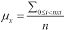。虽然公式看起来很复杂，但它的各个部分都是 Python 的一流内置函数。

大写的西格玛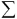是数学上对 Python `sum()`函数的表述。

给定一个值列表，均值是这样的：

```py
def mean( values ):
    return sum(values)/len(values)
```

我们提供两组数据作为包含年份和金额的两个元组。我们需要收集年份，将时间保留以供以后使用。我们可以使用一个简单的生成器函数来完成这个任务。我们可以使用表达式`cheese for year, cheese in year_cheese`来分离每个两个元组中的奶酪部分。

当我们使用生成器与我们的`mean()`函数一起使用时，会发生以下情况：

```py
>>> mean( cheese for year, cheese in year_cheese )
Traceback (most recent call last):
  File "<stdin>", line 1, in <module>
  File "<stdin>", line 2, in mean
TypeError: object of type 'generator' has no len()
```

等等。什么？

简单的生成器怎么可能不起作用呢？

实际上，它确实有效。但它并没有做我们假设的事情。

### 理解生成器表达式

有三个重要的规则适用于 Python 生成器：

+   许多（但不全是）函数可以与生成器对象一起工作。然而，有些函数与生成器不太兼容；它们需要一个序列对象。

+   生成器产生的对象只有在绝对必要时才会创建。我们可以将生成器描述为“懒惰”。例如，列表实际上包含对象。生成器表达式可以像列表一样操作，但对象实际上只有在需要时才会创建。

+   生成器函数只能使用一次。列表可以无限期地重复使用。

第一个限制特别适用于`len()`函数。这个函数适用于列表、元组和集合。然而，它不适用于生成器。我们无法知道生成器最终将创建多少项，因此`len()`无法返回大小。

第二个限制主要在尝试打印生成器的结果时相关。我们会看到类似`<generator object <genexpr> at 0x1007b4460>`这样的内容，直到我们实际评估生成器并创建对象。

第三个限制不太明显。我们需要一个例子。让我们尝试通过定义一个`count()`函数来绕过`len()`问题，该函数计算生成器函数产生的项数：

```py
def count( values ):
    return sum( 1 for x in values )
```

这将累加一系列 1，而不是实际值序列。

我们可以这样测试它：

```py
>>> count( cheese for year, cheese in year_cheese )
13
```

这看起来似乎没问题，对吧？基于这个实验，我们可以尝试像这样重写`mean()`函数：

```py
def mean2( values ):
    return sum(values)/count(values)
```

我们使用了`count()`，它与生成器表达式一起工作，而不是`len()`。

当我们使用它时，我们会得到一个`ZeroDivisionError: float division by zero`错误。为什么`count()`在`mean()`的上下文中不起作用？

这揭示了单次使用规则。`sum()`函数消耗了生成器表达式。当`count()`函数需要评估时，没有数据了。生成器为空，`sum( 1 for x in [] )`为零。

我们能做什么？

我们有三个选择，如下所示：

+   我们可以编写自己的更复杂的`sum()`，它从生成器的一次遍历中产生总和和计数。

+   或者，我们可以使用`itertools`库将一个*tee*适配器放入生成器管道中，这样我们就有两个可迭代的副本。这实际上是一个非常高效的解决方案，但对于现场特工来说，这有点高级。

+   更简单地说，我们可以从生成器创建一个实际的列表对象。我们可以使用`list()`函数或用`[]`包裹生成器表达式。

前两个选择对于我们来说太复杂了。第三个选择非常简单。我们可以这样做：

```py
>>> mean( [cheese for year, cheese in year_cheese] )
32.076153846153844
>>> mean( [death for year, death in year_deaths] )
597.2727272727273
```

通过包含`[]`，我们从一个生成器创建了一个列表对象。我们可以从列表对象中获取`sum()`和`len()`。这种方法非常好用。

它指出了编写函数文档字符串的重要性。我们真的需要这样做：

```py
def mean(values):
    """Mean of a sequence (doesn't work with an iterable)"""
    return sum(values)/len(values)
```

我们在这里提醒一下，该函数与一个序列对象一起工作，但它不与生成器表达式或其他仅可迭代的对象一起工作。当我们使用`help(mean)`时，我们会看到我们在文档字符串中留下的提醒。

这里有一个概念层次。可迭代性是许多 Python 对象的一个非常通用的特性。序列是许多可迭代 Python 对象中的一种。

## 查找中间的值

中位数是在一组排序后的值中间的值。为了找到中位数，我们需要对数据进行排序。

这是一个计算序列中位数的简单函数：

```py
def median(values):
    s = sorted(values)
    if len(s) % 2 == 1: # Odd
        return s[len(s)//2]
    else:
        mid= len(s)//2
        return (s[mid-1]+s[mid])/2
```

这包括当样本数量为偶数时，平均两个中间值的常用技术。

我们使用`len(s)%2`来确定序列长度是否为奇数。在两个不同的地方，我们计算`len(s)//2`；看起来我们可能能够使用`divmod()`函数简化一些事情。

我们可以这样做：

```py
mid, odd = divmod(len(s), 2)
```

这个更改移除了一点点重复计算`len(s)//2`的代码，但这真的更清晰吗？

这里有两个潜在问题与排序相关的开销：

+   首先，排序意味着有很多项目之间的比较。随着列表大小的增加，比较的项目数量增长得更快。此外，`sorted()`函数会产生序列的副本，在处理非常大的列表时可能会浪费内存。

+   替代方案是对快速选择算法的一种巧妙变体。对于现场特工来说，这种复杂程度是不必要的。更多信息请参阅[`en.wikipedia.org/wiki/Quickselect`](http://en.wikipedia.org/wiki/Quickselect)。

## 寻找最流行的值

模式值是集合中最受欢迎的单个值。我们可以使用 `collections` 模块中的 `Counter` 类来计算这个值。

这里有一个 `mode` 函数：

```py
from collections import Counter
def mode(values):
    c = Counter( values )
    mode_value, count = c.most_common(1)[0]
    return mode_value
```

`Counter` 类的 `most_common()` 方法返回一个包含两个元素的元组序列。每个元组包含一个值和该值出现的次数。就我们的目的而言，我们只需要值，因此我们必须从两个元素的元组序列中取出第一个元素。然后，我们必须将这对值和计数器分开。

演示的问题在于我们的数据集非常小，没有合适的模式。这里有一个人为的例子：

```py
>>> mode( [1, 2, 3, 3, 4] )
3
```

这证明了 `mode` 函数是有效的，尽管它对我们奶酪消耗和死亡率数据来说没有意义。

# 创建 Python 模块和应用程序

我们在 Python 库中大量使用了模块。此外，我们还添加了几个包，包括 Pillow 和 BeautifulSoup。应该出现这样的问题，*我们能否创建自己的模块？*

答案当然是 *是的*。Python 模块只是一个文件。结果证明，每个示例脚本都是一个模块。我们可以更深入地了解如何创建我们自己的可重用编程模块。当我们查看 Python 程序时，我们会观察到三种类型的文件：

+   纯定义性的库模块

+   执行我们应用程序实际工作的应用程序模块

+   同时是应用程序和可以作为库使用的混合模块

创建 Python 模块的基本要素是将顶层脚本的 *实际工作* 与支持这一实际工作的各种定义分开。我们所有的定义示例都是使用 `def` 语句创建的函数。其他导入定义的例子是 `class` 定义，我们将在下一节中讨论。

## 创建和使用模块

要创建仅包含定义的模块，我们只需将所有函数和类定义放入一个文件中。我们必须给文件一个可接受的 Python 变量名。这意味着文件名应该看起来像 Python 变量；字母、数字和 `_` 是完全合法的。Python 使用的运算符字符（`+`、`-`、`/` 等）可能由我们的操作系统允许作为文件名，但这些字符不能用于命名模块文件。

文件名必须以 `.py` 结尾。这不是模块名称的一部分；这是为了操作系统的便利。

我们可能会将我们的统计函数收集到一个名为 `stats.py` 的文件中。此文件定义了一个名为 `stats` 的模块。

我们可以导入整个函数集或单个函数，或者我们可以将整个模块导入。使用以下代码：

```py
>>> from stats import *
```

通过这种方式，我们导入了在 `stats` 模块中定义的所有函数（和类）。我们可以简单地使用如 `mean( some_list )` 这样的名称。

考虑我们使用这个：

```py
>>> from stats import mean, median
```

我们从 `stats` 模块中导入了两个特定的函数。我们忽略了该模块中可能存在的任何其他定义。

我们还可以使用以下方法：

```py
>>> import stats
```

这将导入模块，但不会将任何名称放入我们通常使用的全局命名空间中。`stats`模块中的所有名称都必须使用限定名称访问，例如`stats.mean( some_list )`。在非常复杂的脚本中，使用限定名称有助于澄清特定函数或类是在哪里定义的。

## 创建应用程序模块

创建具有**命令行界面**（CLI）的应用程序的最简单方法是编写一个文件，并在命令行中运行它。考虑以下示例：

```py
python3 basic_stats.py
```

当我们在终端窗口或命令窗口中输入时，我们使用 OS 的`python3`命令并提供一个文件名。在 Windows 中，`python.exe`有时用于 Python 3，因此命令可能是`python basic_stats.py`。在大多数其他操作系统上，通常会有`python3`和`python3.3`命令。在 Mac OS X 上，`python`命令可能指的是 Mac OS X 的一部分的旧`Python2.7`。

我们可以通过使用`python -V`命令来确定与名称`python`绑定的版本。

如前所述，我们希望将定义分开到文件中，然后将实际工作放在另一个文件中。当我们查看`basic_stats.py`内部时，我们可能会发现以下内容：

```py
"""Chapter 5 example 2.

Import stats library functions from ch_5_ex_1 module.
Import data acquisition from ch_5_ex_1 module.
Compute some simple descriptive statistics.
"""
from ch_5_ex_1 import mean, mode, median
from ch_5_ex_1 import get_deaths, get_cheese

year_deaths = list( get_deaths() )
years = list( year for year, death in year_deaths )
deaths= list( death for year, death in year_deaths )
print( "Year Range", min(years), "to", max(years) )
print( "Average Deaths {:.2f}".format( mean( deaths ) ) )

year_cheese= get_cheese()

print( "Average Cheese Consumption", 
    mean( [cheese for year, cheese in year_cheese] ) )
```

文件以一个三引号字符串开头，就像函数的 docstring 一样，这是模块的 docstring。我们从另一个模块导入了某些函数。

然后，我们使用导入的函数完成了一些处理。这是简单命令行模块的常见结构。

我们也可以通过命令`python3 -m basic_stats`运行此操作。这将使用 Python 的内部搜索路径来定位模块，然后运行该模块。运行模块与运行文件略有不同，但最终效果相同；文件通过`print()`语句产生我们设计的输出。有关`-m`选项如何工作的详细信息，请参阅`runpy`模块的文档。

## 创建混合模块

对于之前显示的`basic_stats.py`模块，我们可以进行两个重要的改进：

+   首先，我们将所有处理放入一个函数定义中。我们称它为`analyze_cheese_deaths`。

+   第二个是添加一个`if`语句来确定模块被使用的上下文。

这是`basic_stats.py`的更复杂版本：

```py
"""Chapter 5 example 3.

Import stats library functions from ch_5_ex_1 module.
Import data acquisition from ch_5_ex_1 module.
Compute some simple descriptive statistics.
"""
from ch_5_ex_1 import mean, mode, median
from ch_5_ex_1 import get_deaths, get_cheese

def analyze_cheese_deaths():

    year_deaths = list( get_deaths() )
    years = list( year for year, death in year_deaths )
    deaths= list( death for year, death in year_deaths )
    print( "Year Range", min(years), "to", max(years) )
    print( "Average Deaths {:.2f}".format( mean( deaths ) ) )

    year_cheese= get_cheese()
    print( "Average Cheese Consumption", 
        mean( [cheese for year, cheese in year_cheese] ) )

if __name__ == "__main__":
    analyze_cheese_deaths()
```

创建一个函数定义来封装实际工作，这为我们提供了扩展或重用此脚本的方法。我们可以比重用顶级脚本更容易地重用函数定义（通过`import`）。

`__name__`变量是一个 Python 设置的全球变量，用于显示处理上下文。顶级模块——在命令行上命名的模块——的`__name__`变量设置为`__main__`。所有其他模块导入的`__name__`变量都设置为模块名称。

是的，全局变量`__name__`前后都有双下划线。这标志着它是 Python 机制的一部分。同样，主模块名称的字符串值`__main__`也涉及双下划线。

这种技术允许我们创建一个可以作为命令运行并导入以提供定义的模块。想法是促进可重用编程。每次我们着手解决问题时，我们不需要重新发明轮子和其他相关技术。我们应该导入先前的工作并在此基础上构建。

# 创建我们自己的对象类

HQ 要求我们获取的两个数据值列表——奶酪消费和 W75 死亡人数——形成了两个非常相似的对象。它们似乎是同一类事物的两个实例。

在这种情况下，事物类似乎具有*年度统计*。它们是具有年份和测量的一致结构的集合。这两个年度统计对象都有一个共同的运算集。实际上，这些运算与测量紧密相关，并且与年份数字完全没有关系。

我们的统计函数集合与我们的数据几乎没有紧密的联系。

我们可以通过类定义来提高数据结构和处理之间的绑定。如果我们定义了一个可以称为“年度统计”的对象类的通用特征，我们可以创建这个类的两个实例，并使用定义的方法处理每个实例的独特数据。我们可以通过拥有多个同一类的对象来轻松重用我们的方法函数。

Python 中的类定义是一系列方法函数的集合。每个方法函数定义都有一个额外的参数变量，通常命名为`self`，它必须是每个函数的第一个参数。`self`变量是我们访问对象类每个实例的独特属性值的方式。

这是我们可能定义一个用于获取 HQ 要求的简单统计的类的示例：

```py
from collections import Counter
class AnnualStats:
    def __init__(self, year_measure):
        self.year_measure = list(year_measure)
        self.data = list(v for yr, v in self.year_measure)
        self.counter= Counter(self.data)
    def __repr__(self):
        return repr(self.year_measure)
    def min_year(self):
        return min( yr for yr, v in self.year_measure )
    def max_year(self):
        return max( yr for yr, v in self.year_measure )
    def mean(self):
        return sum(self.data)/len(self.data)
    def median(self):
        mid, odd = divmod( len(self.data), 2 )
        if odd:
            return sorted(self.data)[mid]
        else:
            pair= sorted(self.data)[mid-1:mid+1]
            return sum(pair)/2
    def mode(self):
        value, count = self.counter.most_common1)[0]
        return value
```

`class`语句为我们定义提供了一个名称。在类语句缩进的主体中，我们为这个类中的每个方法函数提供`def`语句。每个`def`语句都包含实例变量`self`。

我们定义了两个具有特殊名称的方法，如下所示。这些名称包含双下划线，由 Python 固定，我们必须使用这些确切名称来正确初始化或打印对象：

+   `__init__()`方法在创建实例时隐式地用于初始化。我们将在下一节中展示实例创建的示例。当我们创建`AnnualStats`对象时，会创建三个内部属性，如下所示：

    +   `self.year_measure`实例变量包含作为参数值提供的数据。

    +   `self.data`实例变量仅包含从年份数据二元组中提取的数据值。

    +   `self.counter`实例变量包含一个由数据值构建的`Counter`对象

+   当我们尝试打印对象时，会隐式地使用`__repr__()`方法。我们将内部`self.year_measure`实例变量的表示作为整个实例的表示返回。

其他方法函数看起来与之前展示的独立函数定义相似。这些方法函数都依赖于`__init__()`方法正确初始化实例变量。这些名称完全是我们软件设计的一部分；我们可以将它们命名为任何语法上合法且有意义的内容。

## 使用类定义

下面是如何使用我们的`AnnualStats`类定义：

```py
   from ch_5_ex_1 import get_deaths, get_cheese

deaths = AnnualStats( get_deaths() )
cheese = AnnualStats( get_cheese() )

print("Year Range", deaths.min_year(), deaths.max_year())
print("Average W75 Deaths", deaths.mean())

print("Median Cheese Consumption", cheese.median())
print("Mean Cheese Consumption", cheese.mean())

print(deaths )
```

我们创建了`AnnualStats`类的两个实例。`deaths`对象是由年份-死亡数据集构建的`AnnualStats`对象。同样，奶酪对象是由奶酪消费数据集构建的`AnnualStats`对象。

在这两种情况下，`AnnualStats.__init__()`方法使用给定的参数值进行评估。当我们评估`AnnualStats( get_deaths() )`时，`get_deaths()`的结果作为`year_measure`参数的值提供给`AnnualStats.__init__()`。然后`__init__()`方法的语句将设置三个实例变量的值。

当我们评估`deaths.min_year()`时，这将评估`AnnualStats.min_year()`方法函数。`self`变量将是`deaths`。这意味着`self.year_measure`表示由`get_deaths()`创建的原始对象。

当我们评估`deaths.mean()`时，这将评估`AnnualStats.min_year()`方法函数，其中`self`变量指向`deaths`。这意味着`deaths.data`是我们从`get_deaths()`创建的原始对象中导出的排序序列。

每个（`deaths`，`cheese`）实例都指的是由`__init__()`方法创建的实例变量。一个类封装了使用各种实例变量的方法函数的处理。封装的概念可以帮助我们设计更紧密聚焦且不太可能出现混淆性错误或不一致的软件。

# 比较和相关性

一个重要的统计问题集中在变量之间的相关性上。我们经常想知道两个值序列是否相关。如果我们有相关的变量，也许我们找到了一个有趣的因果关系。我们可能能够使用一个变量来预测另一个变量的值。我们也许还能证明它们是独立的，并且彼此无关。

这个统计工具的必要工具是*相关系数*。我们有几种计算这个系数的方法。一种解决方案是从以下链接下载 NumPy 或 SciPy：

+   [`docs.scipy.org/doc/scipy/reference/generated/scipy.stats.pearsonr.html`](http://docs.scipy.org/doc/scipy/reference/generated/scipy.stats.pearsonr.html)

+   [`docs.scipy.org/doc/numpy/reference/generated/numpy.corrcoef.html`](http://docs.scipy.org/doc/numpy/reference/generated/numpy.corrcoef.html)

然而，相关算法并不复杂。实现这两个计算将建立我们的基本数据收集间谍技能。我们将构建一些更基本的统计函数。然后，我们将构建相关计算，这将依赖于其他统计函数。

重要的数值依赖于计算平均值和标准差。我们之前已经讨论了平均值计算。我们将把标准差添加到我们的技巧包中。给定标准差，我们可以标准化每个值。我们将使用标准差作为距离的度量来计算与平均值的距离。然后，我们可以比较标准化分数，以查看两组数据是否相关。

## 计算标准差

为了计算相关系数，我们需要为数据集提供另一个描述性统计量：标准差。这是衡量数据分散程度的一个指标。当我们计算平均值时，我们找到了数据的一个中心。下一个问题是，*值是如何紧密围绕中心的？*

如果标准差小，数据紧密聚集。如果标准差大，数据分布广泛。标准差计算给出了一个数值范围，大约包含三分之二的数据值。

拥有标准差让我们能够发现异常数据。例如，平均奶酪消费量为每人 31.8 磅。标准差为 1.27 磅。我们预计大部分数据将聚集在 31.8 ± 1.27 的范围内，即介于 30.53 和 33.07 之间。如果我们的信息提供者试图告诉我们 2012 年的人均奶酪消费量为 36 磅，我们有充分的理由对报告表示怀疑。

计算标准差的主题有一些变体。还有一些与是否拥有整个总体或只是样本相关的统计细微差别。这里有一个标准公式 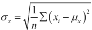。符号 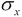 代表某个变量的标准差 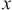。符号 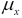 代表变量的平均值。

我们有一个方法函数，`mean()`，它计算  值。我们需要实现标准差公式。

标准差公式使用了`math.sqrt()`和`sum()`函数。我们将在脚本中依赖`import math`。

我们可以直接将方程式翻译成 Python。以下是我们可以添加到`AnnualStat`类中的方法函数：

```py
    def stddev(self):
        μ_x = self.mean()
        n = len(self.data)
        σ_x= math.sqrt( sum( (x-μ_x)**2 for x in self.data )/n )
        return σ_x
```

我们评估了`mean()`方法函数以获取均值，如所示，并将其分配给`μ_x`（是的，希腊字母对于 Python 变量名是合法的；如果你的操作系统没有提供对扩展 Unicode 字符的快速访问，你可能想使用`mu`代替）。我们还评估了`len(data)`以获取集合中元素的数量`n`。

我们可以将数学语言直接翻译成 Python。例如，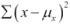变成了`sum((x-μ_x)**2 for x in self.data)`。这种数学符号与 Python 之间的直接匹配使得验证 Python 编程是否与数学抽象相匹配变得容易。

这里是标准差的一个基于略微不同公式的版本：

```py
    def stddev2(self):
        s_0 = sum(1 for x in self.data) # x**0
        s_1 = sum(x for x in self.data) # x**1
        s_2 = sum(x**2 for x in self.data)
        return math.sqrt( s_2/s_0 - (s_1/s_0)**2 )
```

这有一个优雅的对称性。公式看起来像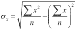。它不再高效或准确。它之所以有点酷，只是因为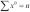，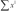和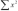之间的对称性。

## 计算标准化分数

一旦我们有了标准差，我们就可以将序列中的每个测量值标准化。这种标准化分数有时被称为 Z 分数。它是特定值与均值之间的标准差数。

在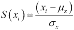中，标准化分数是分数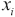与均值之差除以标准差。

如果我们有一个均值为 31.8，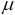，标准差为 1.27，，那么一个测量值为 29.87 的值将有一个 Z 分数为-1.519。大约 30%的数据将超出均值 1 个标准差。当我们的信息提供者试图告诉我们人均消费量跳升到 36 磅奶酪时，我们可以计算这个值的 Z 分数，3.307，并建议这不太可能是有效数据。

将我们的价值观标准化以生成分数是生成器表达式的一个很好的用途。我们也将把它添加到我们的类定义中：

```py
    def stdscore(self):
        μ_x= self.mean()
        σ_x= self.stddev()
        return [ (x-μ_x)/σ_x for x in self.data ]
```

我们计算了数据的均值并将其分配给`μ_x`。我们计算了标准差并将其分配给`σ_x`。我们使用生成器表达式评估`(x-μ_x)/σ_x`对于数据中的每个值`x`。由于生成器在`[]`中，我们将创建一个新的列表对象，包含标准化分数。

我们可以用以下方式展示它是如何工作的：

```py
print( cheese.stdscore() )
```

我们将得到以下序列：

```py
[-1.548932453971435, -1.3520949193863403, ... 0.8524854679667219]
```

### 比较序列和可迭代对象

当我们查看 `stdscore()` 方法的结果时，我们可以选择返回什么。在之前的例子中，我们返回了一个新的列表对象。我们实际上并不需要这样做。

我们可以在函数中使用这个序列来返回一个生成器而不是列表：

```py
return ((x-μ_x)/σ_x for x in self.data)
```

函数的其余部分与之前相同。最好给这个版本一个不同的名字。将旧的函数命名为 `stdscore2()`，这样我们就可以比较列表和生成器版本。

生成器 `stdscore()` 函数现在返回一个可以用来生成值的表达式。对于我们的大多数计算，实际列表对象和可迭代值序列之间没有实际差异。

我们会注意到三个差异：

+   首先，我们不能在生成器结果上使用 `len()`。

+   其次，生成器在我们使用它在一个 `for` 循环中或创建一个列表之前不会生成任何数据。

+   第三，一个可迭代对象只能使用一次。

尝试用这个简单的例子看看它是如何工作的：

```py
print(cheese.stdscore())
```

我们将看到生成器表达式，而不是生成的值。以下是输出结果：

```py
<generator object <genexpr> at 0x1007b4460>
```

我们需要这样做，以便将生成的值收集到一个对象中。`list()` 函数可以很好地完成这项工作。以下是评估生成器并实际生成值的操作方法：

```py
print(list(cheese.stdscore()))
```

这将评估生成器，生成一个我们可以打印的列表对象。

## 计算相关系数

在比较两个数据序列时，一个重要的问题是如何评估它们之间的相关性。当一个序列呈上升趋势时，另一个序列是否也是如此？它们是否以相同的速率变化？我们可以通过计算基于标准化分数乘积的系数来测量这种相关性：

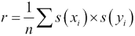

在这种情况下，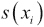 是每个单独值的标准化分数，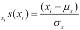。我们对其他序列做同样的计算，并计算每一对的乘积。各种标准化分数乘积的平均值将在 +1 和 -1 之间。接近 +1 的值意味着两个序列很好地相关。接近 -1 的值意味着序列相互对立。一个序列上升时，另一个序列下降。接近 0 的值意味着序列不相关。

这是一个计算两个 `AnnualStat` 数据集合实例之间相关性的函数：

```py
def correlation1( d1, d2 ):
    n= len(d1.data)
    std_score_pairs = zip( d1.stdscore(), d2.stdscore() )
    r = sum( x*y for x,y in std_score_pairs )/n
    return r
```

我们使用每个 `AnnualStat` 对象的 `stdscore()` 方法创建了一个标准化分数值的序列。

我们使用 `zip()` 函数创建了一个生成器，它将从两个不同的分数序列中产生二元组。这个乘积序列的平均值是两个序列之间的相关系数。我们通过求和并除以长度 `n` 来计算平均值。

# 编写高质量的软件

我们如何知道这些各种统计函数是如何工作的？这可能是非常棘手的编程，有很多机会出错。

确保软件工作的最佳工具是单元测试。单元测试背后的思想是将模块分解成单独的单元——通常是函数或类——并在隔离状态下测试每个单元。Python 为我们提供了两种执行单元测试的方法：

+   将示例放入模块、函数和类的文档字符串中

+   编写单独的`unittest.TestCase`类

大多数秘密特工都会对文档字符串测试用例感到非常满意。它们很容易编写。我们将它们放在代码的文档字符串中。当我们使用`help()`函数时，它们是可见的。

我们通过从交互式 Python 复制和粘贴已知正确结果来创建这些文档字符串测试用例。复制和粘贴将包括`>>>`提示，以便轻松找到示例。当然，我们也包括预期的输出。一旦我们将这些包含在文档字符串中，`doctest`模块就会找到并使用这些示例。

在某些情况下，我们需要伪造预期的结果。实际上，在编写任何有效的 Python 代码之前，就已经计算出答案应该是怎样的，这是很常见的。如果我们确信文档字符串示例有预期的正确答案，我们可以利用这一点，并使用它来帮助调试代码。

让我们看看我们之前编写的一个简单函数：

```py
def mean(values):
    """Mean of a sequence (doesn't work with an iterable)

    >>> from ch_5_ex_1 import mean
    >>> mean( [2, 4, 4, 4, 5, 5, 7, 9])
    5.0
    """
    return sum(values)/len(values)
```

我们将示例交互添加到函数的文档字符串中。我们包括了看起来像是复制和粘贴的交互序列，这些交互将测试这个函数。在某些情况下，我们根据我们计划编写的内容而不是已经编写的内容来构建这个序列。

我们可以练习几种不同的方法。最简单的是这个：

```py
python3 -m doctest ch_5_ex_1.py
```

我们将`doctest`模块作为顶级主应用程序运行。这个应用程序的单个参数是包含 doctest 示例并粘贴到文档字符串中的 Python 应用程序的名称。

如果一切正常，则没有输出。如果我们好奇，我们可以要求更详细的输出：

```py
python3 -m doctest -v ch_5_ex_1.py
```

这将产生大量的输出，显示模块文档字符串中找到的每个测试。

其他技术包括构建一个自测试模块和编写一个单独的脚本，该脚本仅运行测试。

## 构建一个自测试模块和一个测试模块

其中一种效果很好的技术是使用`__name__ == "__main__"`技术将测试脚本添加到库模块中。我们将评估`doctest.testmod()`函数来测试模块中定义的函数和类。

它看起来像这样：

```py
if __name__ == "__main__":
    import doctest
    doctest.testmod()
```

如果这个模块是从命令行运行的，它就是主模块，全局`__name__`将被设置为`"__main__"`。当这是真的时，我们可以导入 doctest 模块并评估`doctest.testmod()`以确认模块中的其他一切正常。

我们也可以编写一个单独的测试脚本。我们可能称之为"`test.py`"；它可能像这样简短：

```py
import doctest
import ch_5_ex_1
doctest.testmod( ch_5_ex_1 )
```

这个简短的脚本导入了 doctest 模块。它还导入了我们要测试的模块。

我们使用`doctest.testmod()`函数在给定的模块中定位 doctest 示例。输出看起来像这样：

```py
TestResults(failed=0, attempted=2)
```

这证实了有两个`>>>`示例行，并且一切工作得非常完美。

## 创建更复杂的测试

有时候，我们必须对 doctest 示例输出保持一定的谨慎。这些情况是 Python 的行为没有详细说明到我们可以复制粘贴交互结果而不考虑我们在做什么的程度。

当与字典和集合集合一起工作时，项的顺序是不保证的。

+   对于字典，doctest 字符串需要包含`sorted()`来强制特定的顺序。使用`sorted(some_dict.items())`而不是简单地使用`some_dict`是至关重要的。

+   同样的考虑也适用于集合。我们必须使用类似`sorted(some_set)`的东西而不是`some_set`。

一些内部函数，如`id()`和`repr()`，可以显示一个物理内存地址，这个地址在每次运行测试时可能不会相同。我们可以包含一个特殊的注释来提醒 doctest 跳过这些细节。我们将包含`#doctest: +ELLIPSIS`并将 ID 或地址替换为`...`（三个点）。

我们可能在输出非常长的输出时使用省略号来缩短。

例如，我们可能有一个模块文档字符串如下：

```py
"""Chapter 5, example 1

Some simple statistical functions.

>>> from ch_5_ex_1 import mean, median
>>> data = [2, 4, 4, 4, 5, 5, 7, 9]
>>> data # doctest: +ELLIPSIS
[2, 4..., 9]
>>> mean( data )
5.0
>>> median( data )
4.5

"""
```

模块文档字符串必须是模块文件中的（几乎）第一行。可能出现在模块文档字符串之前的是一行`#!`注释。如果存在，`#!`注释行是针对操作系统 shell 的，它将文件的其余部分标识为 Python 脚本，而不是 shell 脚本。

我们在我们的测试中使用了`# doctest: +ELLIPSIS`指令。结果并不完整，预期结果中包含"`...`"以显示 doctest 应该忽略的部分。

浮点值在不同处理器和操作系统之间可能不完全相同。我们必须小心地显示带有格式化或四舍五入的浮点数。我们可能使用`"{:.4f}".format(value)`或`round(value,4)`来确保忽略不重要的数字。

## 将 doctest 案例添加到类定义中

我们研究了模块和函数中的 doctests。我们可以在类定义的几个地方放置 doctests。这是因为我们有几个地方可以放置文档字符串。

整个类可以在顶部有一个文档字符串。它是`class`语句之后的第一个行。此外，类中的每个单独的方法也可以有自己的私有文档字符串。

例如，我们可以在类定义的开始处包含一个全面的文档字符串：

```py
class AnnualStats:
    """Collect (year, measurement) data for statistical analysis.

    >>> from ch_5_ex_4 import AnnualStats
    >>> test = AnnualStats( [(2000, 2),
    ...    (2001, 4),
    ...    (2002, 4),
    ...    (2003, 4),
    ...    (2004, 5),
    ...    (2005, 5),
    ...    (2006, 7),
    ...    (2007, 9),] )
    ...
    >>> test.min_year()
    2000
    >>> test.max_year()
    2007
    >>> test.mean()
    5.0
    >>> test.median()
    4.5
    >>> test.mode()
    4
    >>> test.stddev()
    2.0
    >>> list(test.stdscore())
    [-1.5, -0.5, -0.5, -0.5, 0.0, 0.0, 1.0, 2.0]
    """
```

这提供了一个关于此类所有功能的完整概述。

### 小贴士

我们的数据样本导致标准差恰好为 2.0。这个技巧表明，通过巧妙的设计测试数据，我们可以绕过一些 doctest 浮点数输出的限制。

# 解决问题——分析一些有趣的数据库

2000 年至 2009 年间，人均奶酪消费与死亡代码 W75（床上意外窒息和勒死）之间的相关系数是多少？

记住，奶酪数据来自[`www.ers.usda.gov/datafiles/Dairy_Data/chezcon_1_.xls`](http://www.ers.usda.gov/datafiles/Dairy_Data/chezcon_1_.xls)。

这是一段令人烦恼的数据，因为它在专有电子表格格式中。尽管我们不喜欢复制粘贴，但除此之外没有其他简单的方法来获取这些数据。

床上勒死的统计数据来自按年份分组的死亡原因 W75。数据请求过程从[`wonder.cdc.gov/controller/datarequest/D76`](http://wonder.cdc.gov/controller/datarequest/D76)开始。将需要一些额外的间谍工作来提交数据请求。如需更多帮助，请查看[`wonder.cdc.gov/wonder/help/ucd.html`](http://wonder.cdc.gov/wonder/help/ucd.html)。

这种关联为何可能如此之高？

是什么使得奶酪消费和床上勒死之间的这种关联如此令人惊讶？

## 获取更多数据

HQ 似乎正在研究关于乳制品的理论。奶酪电子表格还有同一时期（2000 年至 2009 年）的莫扎雷拉奶酪消费数据。

我们被要求获取关于这一时期授予的土木工程博士学位的详细信息。

一些初步的间谍活动揭露了这一组数据：

[`www.nsf.gov/statistics/infbrief/nsf12303/`](http://www.nsf.gov/statistics/infbrief/nsf12303/)

这是一个难以解析的表格。它稍微复杂一些，因为年份在列中，而我们正在寻找的数据在特定的行中，即`th.text == "Civil engineering"`的行。整个表格的标题在`th.text == "Field"`的行中。这意味着导航将相当复杂，以定位本页上正确的表格的`Field`行和`Civil engineering`行。

年人均莫扎雷拉奶酪消费量与土木工程博士学位之间有何关联？

这种关联为何可能如此之高？

跟奶酪、死亡和博士学位有什么关系呢？

## 进一步研究

这是否只是一个偶然的关联？

是否还有其他类似的关联？

我们还能从[`www.tylervigen.com/`](http://www.tylervigen.com/)学到什么？

# 摘要

我们看到了如何轻松地将复杂的统计分析实现为简短的 Python 编程片段。我们将基本的统计洞察力应用于我们所有的情报收集。

我们学会了设计 Python 模块。这使我们能够通过我们自己的更专业化的模块扩展 Python 标准库。现在，我们可以轻松地将可重用软件打包成模块，用于我们自己的目的，以及分发到我们的代理网络。

除了设计模块，我们还看到了如何编写测试来确认我们的软件确实工作。除非有正式的单元测试来确认事物是否按正确的方式运行，否则无法信任软件。我们看到了 Python 语言的基本要素、标准库以及相关项目和工具的生态系统。Python 语言相当简单：它只有大约 22 条语句，我们看到了几乎所有这些语句的示例。

在这一点上，每个秘密代理的兴趣领域和专长将开始分化。有众多可供探索的软件包、库和应用领域。

由于我们的重点是让现场代理变得高效，所以我们仔细避免涉及更严肃的软件开发问题。特别是，我们避开了面向对象设计的主题。需要做更复杂处理的代理将需要编写更复杂的软件。一本像《Python 3 Object Oriented Programming》（作者：Dusty Phillips，出版社：Packt Publishing）这样的书对于学习这项重要技术是必不可少的。请查看[`www.packtpub.com/python-3-object-oriented-programming/book`](http://www.packtpub.com/python-3-object-oriented-programming/book)。

代理的兴趣和能力往往会导致不同的方向。一些代理可能想要建立网站；一本像《Python 3 Web Development Beginner's Guide》（作者：Michel Anders，出版社：Packt Publishing）这样的书可能会有所帮助。一些代理可能想要构建交互式应用程序；一本像《Instant Pygame for Python Game Development How-to》（作者：Ivan Idris，出版社：Packt Publishing）这样的书可以帮助掌握 Pygame 框架。这个框架不仅仅适用于游戏。

一些代理可能会追求自然语言处理。一本像《Python 3 Text Processing with NLTK 3 Cookbook》（作者：Jacob Perkins，出版社：Packt Publishing）这样的书可能会有所帮助。其他代理可能会使用*Python Multimedia*（作者：Ninad Sathaye，出版社：Packt Publishing）或可能使用*Practical Maya Programming with Python*（作者：Robert Galanakis，出版社：Packt Publishing）来追求更复杂的媒体。对地理空间分析感兴趣的代理可能会追求《Programming ArcGIS 10.1 with Python Cookbook》（作者：Eric Pimpler，出版社：Packt Publishing）。

熟练的代理会发现 Python 可以用于各种任务。
