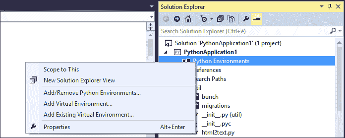

# 第三章。日常编码工具

在本章中，我们将介绍对于 Visual Studio 中 Python 程序员日常工作中必不可少的编码工具。

首先，我们将分析如何在 Visual Studio 中处理项目和解决方案，然后我们将介绍功能重构。最后，我们将介绍可用的调试器功能。

# 项目处理

Visual Studio 最重要的有用功能之一是解决方案和项目处理。由于整个工作流程都集成到 IDE 中，开发者无需处理文件、工作路径和库。所有这些都可以通过强大的 Visual Studio 用户界面直接在 IDE 中管理。

在我们详细探讨工具之前，我们首先将查看与项目处理相关的 Visual Studio 术语。本章中使用的两个主要概念是解决方案和项目。

## 解决方案

解决方案本质上是一个包含项目的容器，这些项目被捆绑在一起以覆盖一个独特的范围。项目可以相互引用，并且它们可以是不同类型的。例如，在一个解决方案中，你可以混合一个 Python 项目和一个 C++项目，同时将 Python 解决方案中项目的输出用作外部库。解决方案还提供了一种将整个工作代码库分组到单个文件/文件夹结构中的方法。然后你可以将分组插入并管理到你选择的版本控制工具中，以便快速共享。Visual Studio 解决方案还能够维护内部项目的共享配置，同时在不同的事件（即解决方案构建期间）处理不同的命令和操作。

## 项目

项目是经典的一组文件的定义，这些文件是用相同的语言编写的，并且覆盖单个范围。项目的类型可以从网站到库或控制台应用程序不等。

Visual Studio 中的 Python 项目包含环境定义：代码的目标位置、外部库的引用以及编译器必须在库中搜索的搜索路径。最后一个尤其重要，因为 PTVS 不使用计算机的 PythonPath 环境变量。

忽略系统设置的有意且实用的功能允许你在不同的项目中为不同的 Python 版本引用不同的库。此外，代码中的依赖列表还带来了调试过程更容易和在新计算机上设置新开发环境更简单的额外好处。

PTVS 提供了预配置的 Python 项目，称为项目模板，正如我们在第一章中看到的，它负责创建正确的项目结构，以便开发者可以专注于代码。

让我们来看看实际处理解决方案和项目的工具。其中最重要且功能最强大的是**解决方案资源管理器**窗口工具。此工具提供了对解决方案组成以及每个项目中可用的文件和配置的完整视图。


要添加内容或对解决方案或项目执行操作，请选择树视图中的解决方案或项目节点

到现在为止，你应该已经知道如何使用这个工具在代码中导航，正如我们在第二章“Visual Studio 中的 Python 工具”中学到的那样。**解决方案资源管理器**窗口工具还提供了文件处理功能，使我们能够直接在项目结构中添加或删除文件。只需在项目结构中选择一个文件夹项即可插入新文件。要向项目根目录添加内容，请选择**解决方案资源管理器**中的项目项，右键单击以打开上下文菜单，然后进入**添加**子菜单，如图下截图所示：


在这里，你可以选择添加**新项**、**现有项**或**新文件夹**。如果你选择添加**新项**，将显示**添加新项**窗口，如下所示：


从这里，你可以从项目中的各种类型创建新项。

如果你想要将现有文件添加到所选文件夹中，请从上下文添加菜单中选择**添加现有项**选项。这将打开一个标准的 Windows 浏览文件窗口；从这里，你可以通过文件系统导航并选择要添加到所选文件夹中的文件。该文件的副本将被添加到文件夹中。

要删除文件，只需在项目列表中选择项，然后从上下文菜单中选择**删除**菜单项。


**解决方案资源管理器**窗口中的文件上下文菜单提供了许多关于文件的功能，如“删除”、“重命名”等

现在我们对**解决方案资源管理器**更有信心了，让我们深入探讨**解决方案资源管理器**提供的 Python 特定选项。在以下章节中，你将了解有关 Python 项目配置的更多信息：环境、引用和搜索路径。

## 指定 Python 环境

有可能为项目特别定义一个 Python 环境版本，而不是使用机器上安装的默认 Python 版本。这对于我们与其他开发者一起工作的项目尤为重要。默认情况下，Visual Studio 在启动新项目时使用机器上安装的默认 Python 版本。要将项目链接到特定的 Python 版本（环境），请右键单击**解决方案资源管理器**中的**Python 环境**项以查看上下文菜单。如图下截图所示：



解决方案资源管理器窗口中的 Python 环境上下文菜单

这个上下文菜单提供了添加或删除 Python 环境以及将项目链接到虚拟 Python 环境或现有环境的功能。最后两个选项在需要在一个完全隔离的环境空间中运行项目时非常有用。项目可以在一个隔离的地方运行，其中包含所有依赖项和库，而不会干扰机器上现有的 Python 安装和 Python 路径配置。

在 Visual Studio 中创建虚拟环境非常简单。点击**添加虚拟环境**或**添加现有虚拟环境**，然后按照几个步骤完成设置。

例如，我们将为我们的项目创建一个虚拟环境。点击**添加虚拟环境**将显示以下模态窗口：


你可以在这个窗口中定义虚拟环境名称和目标 Python 版本。一旦按下**创建**按钮，Visual Studio 将创建虚拟环境。作为一项实用的额外功能，如果机器上没有安装必要的 Python 库——本质上包括`pip`、`setuptools`和`virtualEnv`——PTVS 将通过下载和安装它们来处理这个问题。像其他通用 Python 包一样，它们将被安装在系统定义的`site-packages`文件夹中。

要将项目链接到特定的 Python 版本，只需在上下文菜单中点击**添加 Python 环境**选项，然后会出现以下辅助框：


这个辅助框显示了机器上安装的 Python 版本列表以及你可以选择的版本。一旦选择了 Python 版本，引用将显示在**解决方案资源管理器**中。


项目中的**引用**项元素提供了紧密链接项目中的库或引用到`.pyd`文件中编译的包的能力

右键点击**引用**选项，然后点击**添加引用**以弹出以下辅助窗口：


我们将关注**项目**选项卡，它显示了你的解决方案中的所有其他项目。如果你希望使用另一个库项目来处理应用程序的子范围，请选择所需的项目并点击**确定**。这将创建项目中的一个引用。你可以在**解决方案资源管理器**窗口下的引用选项中找到引用列表：


## 定义搜索路径

**搜索路径**功能基本上告诉 Visual Studio 在哪里搜索项目中将使用的附加库。你可以引用系统中的一个文件夹或包含库的`.zip`文件：


搜索路径上下文菜单，包含“添加文件夹”和“添加 ZIP 存档”选项

一旦选择了`.zip`文件的文件夹，您可以在窗口中找到库：


# 重构

重构是现代 IDE 中最大的进步之一。它通过处理代码更改和自动操作的方式显著减少了时间并降低了错误率。Visual Studio 附带了一些出色的开箱即用的重构功能，如重命名和从所选代码片段创建方法。

重命名功能可以真正帮助解决代码中的潜在错误，例如更改元素名称时。在代码库中可能存在仍然使用旧名称的实例。让我们看看以下代码：

```py
class foo:
    """
    Documentation of the class.
    It can be multiline and contain any amount of text
    """
    @classmethod
    def bar(self, first=0, second=0):
        """This is the documentation for the method"""
        return first + second

print(foo.bar())
```

在此代码中，有一个名为`foo`的类，其中有一个名为`bar`的方法。如果重命名`bar`，它将通过引用一个不存在的方法来创建错误。

Visual Studio 的重构功能通过考虑元素的 所有引用来帮助重命名过程。选择您希望重命名的元素，然后通过右键单击它访问代码上下文菜单中的重构功能：


通过右键单击元素访问重构功能

选择**重命名**功能以启动两步过程：


您将被提示输入元素的新的名称。还有一个复选框允许您预览要重命名的元素的引用。当复选框未选中时，所有找到的引用都将被重命名；您将无法预览哪些引用将被重命名。


在您希望预览引用更改的情况下，将显示一个预览窗口。如图所示，在此窗口中，旧元素名称的所有引用都可以在顶部面板找到，代码预览将在底部。将分析项目中的所有文件以正确重构元素。每个引用旁边都有一个复选框，提供激活该引用重构的选项。单击**应用**按钮将重命名元素和所有选定的引用。

另一个重构功能是**提取** **方法**。当您希望将一段代码作为函数或方法在其他地方重用时，它非常有用。Visual Studio 可以将其生成为一个函数/方法。例如，参考以下截图：


在代码中，高亮的代码旨在创建一个通用方法，用于计算两个元素的和。选择代码，然后从上下文菜单中的**重构**子菜单中选择**提取方法**。这将弹出**提取方法**对话框，如下截图所示：


在**提取方法**窗口中，你可以在**新方法名称**字段中定义方法的名称，并在**提取到**字段中提供创建方法的路由。一个**预览**面板也显示了生成的代码。点击**确定**根据所选代码创建新方法。

# 调试

Visual Studio 提供了一套庞大的调试工具；PTVS 继承了其中许多工具，这有助于 Python 开发者通过逐步执行、运行时变量监视功能、断点和在调试会话中查看代码失败位置的能力来调试代码。

能够看到代码中断的位置可以显著加快调试会话的速度。在下面的屏幕截图中，我们可以看到一个未跟踪异常的示例：


调试 Python 应用程序时的错误对话框示例

当你运行代码时，Visual Studio 会停止执行，因为它检测到有问题的代码引发的异常。它突出显示了错误发生的确切位置，同时建议修复方法——即使现在 Visual Studio 可能不会为问题提供有用的解决方案。

调试过程不仅关乎理解异常在哪里被引发，还关乎理解代码在不符合预期行为时发生了什么。这就是逐步执行和断点派上用场的地方。

## 使用断点

断点是你可以在代码中定义的一个点，用于停止执行。Visual Studio 使设置断点变得非常简单。它允许更好地查看变量的内容，并遵循代码的流程。可以通过在代码窗口的空白处单击来设置断点，这将弹出一个红色圆圈。在代码的上下文菜单中的**断点**子菜单中选择**插入断点**。

一旦设置了断点，你可以在代码窗口中看到它，如下面的屏幕截图所示：


现在断点已设置，如果你运行应用程序，Visual Studio 将精确地在断点处停止执行，同时遵循代码的流程：


指定第 29 行为断点

IDE 将光标放在我们设置断点的代码行的第一列。当在该上下文中悬停在变量周围时，我们可以看到变量的当前值。

## 利用监视条目

我们还可以在变量上创建监视条目，以便在程序流程中查看变量的值如何变化。要监视一个变量，在调试过程中右键单击它，并在上下文菜单中点击**添加监视**。变量将被添加到如下所示的**监视**窗口中：


除了`监视`变量外，还可以从**局部变量**选项卡中查看当前作用域中的所有变量：


一旦遇到断点，可以使用以下三个函数之一来继续程序流程：`Step Into`、`Step Over`和`Step Out`。这些函数可以通过**调试**菜单或工具栏中的按钮访问。或者，你也可以使用`Run to Cursor`（*Ctrl* + *F10*）来运行程序直到达到光标所在位置：


+   `Step Into`: 这将执行下一个语句并停止。如果下一个语句是调用一个函数，调试器将在被调用函数的第一行停止，进入函数。

+   `Step Over`: 这将执行下一个语句。然而，如果下一个语句是调用一个函数，调用它将不会进入该函数。当你不愿意跟随函数的整个程序流程时，这很有用。

+   `Step Out`: 这将执行代码直到当前函数的末尾。当你不想遍历当前函数的整个程序流程时，这很有用。

如果你只想继续程序流程的执行而不进入代码的每一行，只需在工具栏中按**继续**按钮或*F5*。如果你的代码中还有其他断点，执行将继续通过所有断点直到最后一个。

# 摘要

在本章中，我们介绍了日常编码的工具。你现在熟悉了使用**解决方案资源管理器**浏览代码以及灵活设置 Python 环境。你还了解了更高效的重构和调试过程，以及设置断点和监视条目如何帮助你精确追踪代码的断点位置。

在下一章中，我们将探讨如何利用强大的 Visual Studio IDE 和可用的工具来加速 Django 开发。
