# 第五章：PTVS 中的高级 Django

一旦我们查看在 Visual Studio 中使用 PTVS 设置的 Django 开发环境，我们就可以开始分析一些强大的 Django 库以及如何在 Visual Studio 中使用它们。多年来，许多开发者为 Django 创建了强大的库和工具，以加快开发周期的各个方面。我们将在这里更详细地研究其中的一些，看看它们如何在 Visual Studio 和 PTVS 中集成。

在本章中，我们将分析两个对 Django 开发者有用的库，从两个不同的角度：使用 Fabric 库自动化任务，以及使用 South 管理 Django 的模型迁移。

# 库管理

我们已经学习了如何在 PTVS 中使用它提供的 GUI 工具安装新的软件包。现在，我们将了解如何选择一个软件包索引而不是另一个；换句话说，何时选择`easy_install`而不是`pip`。

通常来说，使用`pip`比使用`easy_install`要好得多，这有主要的原因。正如`pip`的创造者 Ian Bicking 在他自己的`pip`介绍中写的，优势如下：

+   在安装之前，所有软件包都会被下载。因此，不会发生部分完成的安装。

+   在控制台上呈现有用的输出时需要小心。

+   正在跟踪操作的原因。例如，如果正在安装软件包，`pip`会跟踪为什么需要该软件包。

+   错误信息应该是有用的。

+   代码相对简洁且结构紧凑，使得程序化使用更加容易。

+   软件包不必作为 egg 存档安装；它们可以平装安装（同时保留 egg 元数据）。

+   其他版本控制系统（`Git`、`Mercurial`和`Bazaar`）都提供了原生支持。

+   软件包的卸载很容易。

+   定义简单，有固定的需求集合，并且可靠地重现一组软件包。

可能看起来没有理由选择`easy_install`而不是`pip`。然而，这正是需要仔细考虑的地方。

有一个注意事项使得 Windows 环境的选择变得非常困难：一些库或依赖项是用 Python C 编写的，这是 Python 调用用 C/C++编写的库的一种方式。要在您的 Windows 机器上编译这些库，您必须安装与编译原始解释器相同的原始编译器的确切版本。例如，如果您使用 Python 2.7，则需要 Visual Studio 2008 的 C++编译器；如果您使用 Python 3，则需要 Visual Studio 2010。

这是因为有一个长期的传统，即 Python 扩展模块必须使用与 Python 本身相同的编译器版本（更具体地说，是 CRT 版本）来构建，这在[`mail.python.org/pipermail/python-list/2010-April/573606.html`](https://mail.python.org/pipermail/python-list/2010-April/573606.html)中提到。

使用`easy_install`包安装程序，预编译的包将被下载并安装到系统的`site-packages`文件夹中。

### 注意

一个经验法则：如果您试图在 Windows 机器上安装的库包含 Python C 扩展，那么选择`easy_install`会更好。对于所有其他情况，`pip`要好得多。

如果您不知道您正在导入的库的类型，您应该选择`pip`。如果在安装过程中遇到编译问题，您可以卸载库并使用`easy_install`重新安装。

通常，大多数具有底层功能（例如，加密、图形和数学函数）以及与其他软件（例如，驱动程序）交互的库（例如，加密、图形和数学函数）都使用 Python C 扩展。

# Fabric 库 – 部署和开发任务管理器

Fabric 是一个 Python 库和命令行工具，允许在应用程序部署和管理任务中执行。本质上，Fabric 是一个允许开发者通过命令行执行任意 Python 函数的工具，同时也提供了一套函数，以便通过 SSH 在远程服务器上执行 shell 命令。将这两者结合起来，为开发者提供了一种无需记住在命令行上需要执行的命令序列的强大方式来管理应用程序工作流程。

库文档可以在[`fabric.readthedocs.org/`](http://fabric.readthedocs.org/)找到。

在 PTVS 中安装库很简单。像所有其他库一样，要将此库插入 Django 项目，在**解决方案资源管理器**窗口的**Python 环境**中的**Python 2.7**节点上右键单击。然后，选择**安装 Python 包**条目。

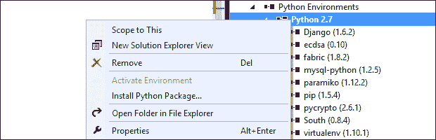

Python 环境上下文菜单

点击它将弹出**安装 Python 包**的模态窗口，如下截图所示：

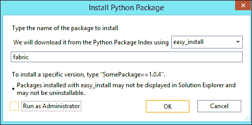

使用`easy_install`从 Python 包索引下载非常重要。这将把库的预编译版本带入系统，而不是需要在系统上编译的纯 Python C 库。

一旦包在系统中安装，您就可以开始创建可以在命令行外执行的任务。首先，为 Fabric 创建一个配置文件，`fabfile.py`。此文件包含 Fabric 将执行的任务。

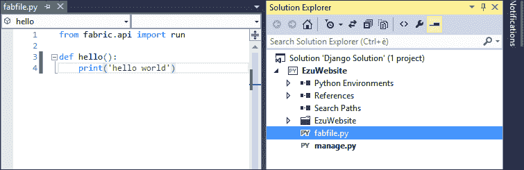

上一张截图显示了一个非常简单的任务：一旦执行，它将打印出字符串`hello world`。您可以通过使用 Fabric 命令`fab`从命令提示符执行它，如下截图所示：

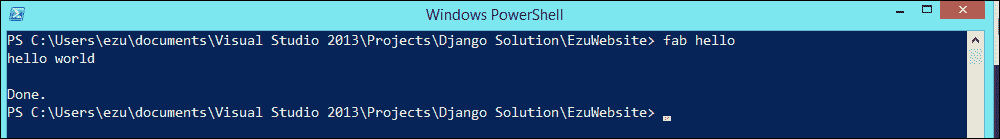

现在你已经知道系统运行良好，你可以继续到更有趣的部分，在那里你可以创建一些通过 `ssh` 与远程服务器交互的任务。创建一个连接到远程机器并找出其上运行的操作系统类型的任务。

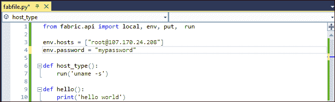

env 对象提供了一种以编程方式向 Fabric 添加凭据的方法

我们定义了一个 Python 函数 `host_type`，它在远程上运行 POSIX 命令 `uname –s`。我们还设置了一些变量来告诉 Fabric 我们连接到哪台远程机器，即 `env.hosts`，以及访问该机器所需的密码，即 `env.password`。

### 注意

将明文密码放入源代码中，就像前一个屏幕截图示例中所示，从来都不是一个好主意。

现在，我们可以在命令行中执行 `host_type` 任务，如下所示：

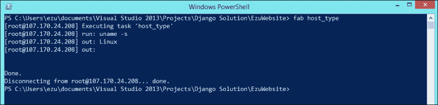

Fabric 库使用提供的信息连接到远程机器，并在服务器上执行命令。然后，它在响应的输出部分返回命令的结果。

我们还可以创建接受命令行参数的任务。创建一个在远程机器上回显消息的任务，从以下屏幕截图中的参数开始：


以下是如何执行任务的两个示例：

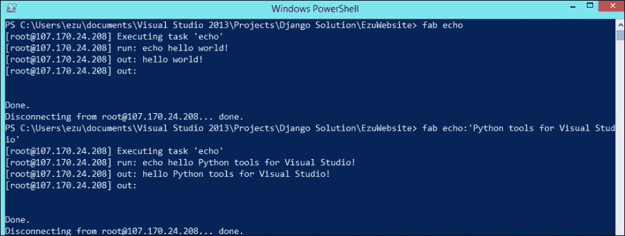

我们还可以创建一个辅助函数，在远程机器上执行任意命令，如下所示：

```py
def execute(cmd):
    run(cmd)
```

我们还可以通过使用 `put` 命令将文件上传到远程服务器：

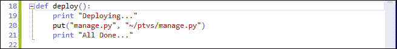

`put` 命令的第一个参数是你想要上传的本地文件，第二个参数是目标文件夹的文件名。让我们看看会发生什么：

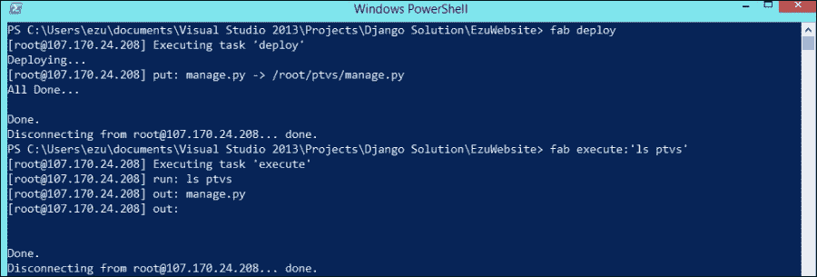

使用 Fabric 的部署过程

使用 Fabric 的可能性真的是无限的，因为任务可以用纯 Python 语言编写。这提供了自动化许多操作的机会，并使我们能够更多地关注开发，而不是关注如何将代码部署到服务器上以维护它们。

# South – 数据库部署库

由 Python 社区开发，South 是一个 Django 库，它将模式迁移引入 Django 应用程序。South 库的主要目标是提供一个简单、稳定且数据库无关的迁移层，以防止所有模式更改的麻烦。

South 的关键特性如下：

+   **自动迁移创建**：South 可以通过分析你的 `model.py` 文件来检测应用程序模型中的更改，并自动创建迁移代码——基本上是针对你使用的数据库的 SQL 命令，以匹配模型中的更改。

+   **数据库独立性**：South 对数据库不可知，支持不同的数据库后端。目前，South 支持 PostgreSQL、MySQL、SQLite、Microsoft SQL Server、Oracle 和 Firebird（beta 支持）。

+   **应用智能**：South 了解并使用 Django 应用程序的概念，允许开发者仅对某些应用程序而不是整个项目使用迁移。

+   **版本控制友好**：South 会注意到其他人向同一应用程序提交迁移，并可以检查是否存在冲突。

## 为什么要在 Django 中使用 South

Django 最有趣的部分之一是其 **对象关系映射**（**ORM**），它创建了一个一致的数据库结构抽象。这是一个非常强大的工具，允许程序员专注于 Python 代码。Django 只为新模型（例如，在创建它们时）妥善处理数据库结构管理。它没有现成的解决方案来管理可以应用于现有数据库模式的模型更新。

在应用程序生命周期中更改模型通常是一个痛苦的操作。技术上，当更改模型的模式或进行模式迁移时，无论你是修改字段还是添加另一个字段，都需要重新创建数据库结构。这意味着该模型的所有数据都会丢失，或者需要手动迁移来将数据从旧版本的表移动到数据库中的新版本。如果你需要将数据库从开发服务器环境对齐到生产服务器环境，这尤其耗时。

## 安装 South

让我们看看如何将 South 引入 PTVS。和其他 Python 库一样，我们可以通过在选择的（Python 2.7）环境上右键点击并通过选择**安装 Python 包**来从**解决方案资源管理器**窗口中安装它，从而弹出以下安装对话框：

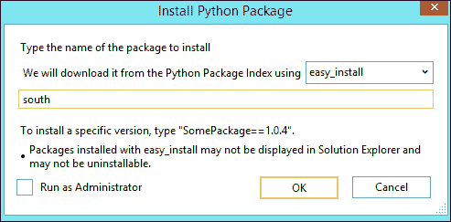

如 South 文档所述，你必须使用 `easy_install` **Python 包索引**；务必选择它。

一旦安装了包，确保在设置文件中激活它很重要。为此，在 `Installed_Apps` 代码的末尾添加 `south`。

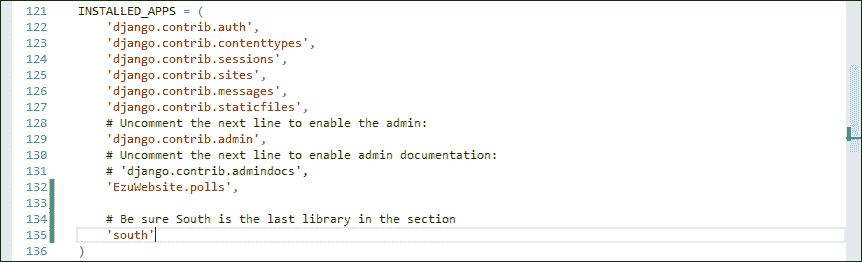

确保在 Settings.py 的 "Installed_Apps" 部分中 "south" 库是最后一个。

由于当 Django 执行库时，所有 Django 项目的模型都已经创建并且可以被 South 发现，因此 South 需要成为列表中的最后一个包。

为了测试一切是否正常工作，导航到 Django 壳并尝试导入库。普通的 Python 开发者会去命令行并运行`manage.py` shell，但在 PTVS 中有一个面板可以这样做。要打开它，在**解决方案资源管理器**窗口中快速右键单击**Django**项目条目，然后在**Django**中选择**打开 Django** **Shell**选项：

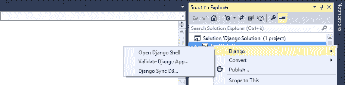

这将打开一个新的**Django 管理控制台**面板，它基本上是一个 REPL，但集成了 Django。从这里，你可以通过尝试导入库来检查 South 库是否工作正常：

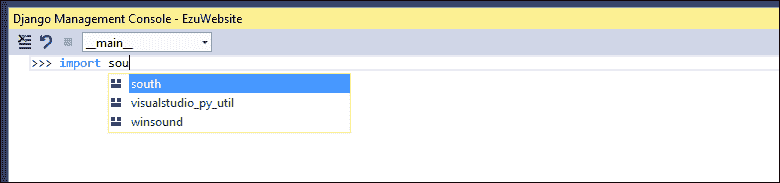

IntelliSense 在 Django 壳中是激活的，所以如果你看到**south**出现，那么一切正常。

为了完成初始化过程，运行`sync_db`以创建迁移跟踪表。这也可以像之前看到的那样从 Django 上下文菜单中完成：只需在**Django**菜单中选择**Django Sync DB**命令。

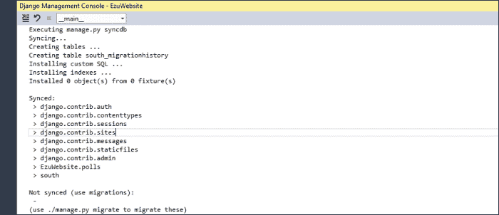

如前一张截图所示，这将在 South 中启动您应用程序当前模型同步的过程。

## 使用 South 的架构迁移

现在我们已经将`south`安装并在我解决方案中工作，让我们尝试创建一些东西来测试迁移。在项目中使用**Django 应用**命令在**添加**菜单中创建一个新的应用，并将其命名为`south2ptvs`，如下截图所示：

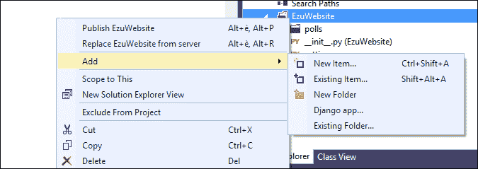

不要忘记在`settings.py`文件中注册新的应用，并确保`south`仍然是`Installed_Apps`部分的最后一个条目：

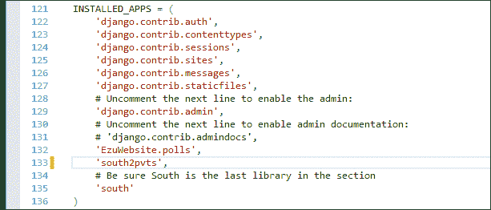

然后，打开新创建的应用中我们将定义测试模型的`models.py`文件：

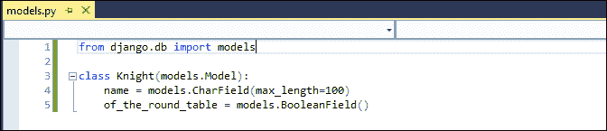

我们不使用标准的 Django `sync_db`命令来创建数据库中模型的架构，而是为`Knight`模型设置一个迁移。这个操作将是模型整个迁移历史的入口点。

导航到命令行，通过执行以下命令来执行初始化迁移：

```py
python manage.py schemamigration south2ptvs –-initial
```

这将在`south2pvts`应用上执行 South 的`schemamigration`命令以进行初始化过程。以下是将要发生的事情：

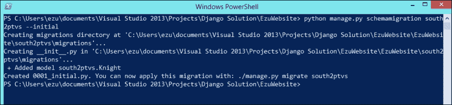

我们已经成功创建了迁移文件，但还没有将其应用到`db`上。由于**South**一次只处理一个应用，存储迁移信息的迁移文件被创建在`south2ptvs`文件夹中。

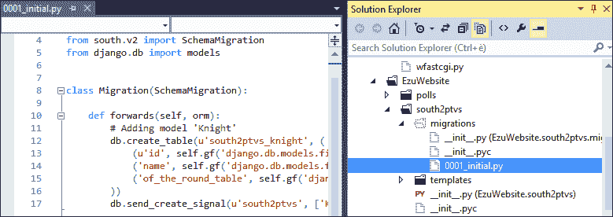

Django 应用中迁移文件夹的内容

迁移文件是纯 Python 编写的普通文件。它们可以编辑，但你应该谨慎操作，并且只有在必要时才这样做。

剩下的唯一事情是将迁移应用到数据库，通过在应用程序上调用 South 库的`migrate`命令，使用以下命令：

```py
python manage.py migrate south2ptvs
```

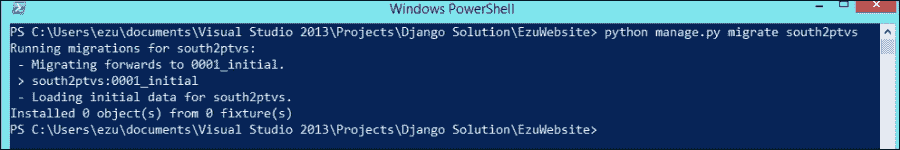

执行 South 的迁移命令

这将最终化迁移；现在我们的模型已准备好进行修改。未来的模型更新可以通过 South 使用迁移轻松地应用到数据库。

按以下方式添加新字段以更新模型：

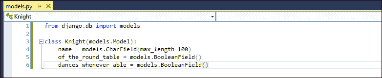

因此，现在我们必须创建一个新的迁移文件并将其应用到数据库。要创建迁移文件，再次使用`schemamigration`命令，如下所示。但是，不要使用`–-initial`参数，因为模型中已经定义了迁移。

```py
python manage.py schemamigration south2ptvs –-auto
```

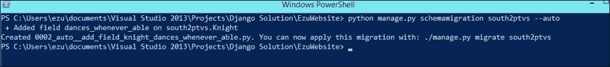

要获取创建迁移文件的状态并将迁移应用到`db`，只需运行以下`migrate`命令：

```py
python manage.py migrate south2ptvs
```

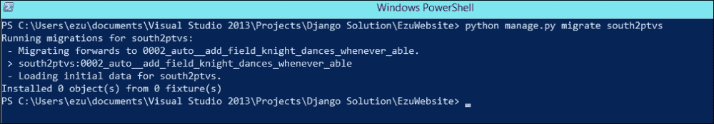

如果我们在管理界面中注册模型，我们可以进入我们网站的行政部分，查看新字段是否出现在模型中：

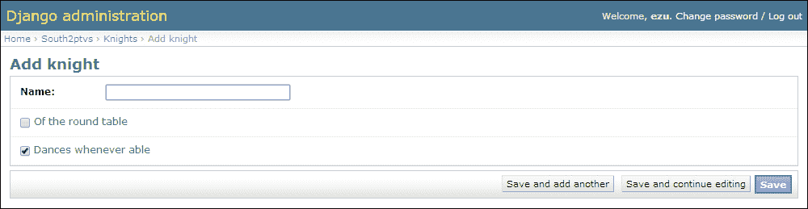

由于迁移存储在文件中，您只需将迁移文件复制到服务器，然后在远程系统上应用迁移即可（可能使用 Fabric）。

要了解更多细节和见解，请访问 South 的官方文档网站[`south.readthedocs.org/`](http://south.readthedocs.org/)。

# 摘要

在本章中，我们更深入地探讨了如何在 PTVS 中处理第三方 Python 库，`pip`和`easy_install`包索引之间的主要区别，以及它们如何处理使用 Python C 扩展编写的预编译库。

我们还探讨了两个流行的 Django 开源库，Fabric 和 South，它们为您的 Django 项目添加了远程任务管理和模式迁移功能。

在下一章中，我们将介绍 IPython 及其在 Visual Studio 中的图形功能，以便涵盖 IronPython 及其与.NET 框架集成的主题。
