# 第六章：PTVS 中的 IPython 和 IronPython

在本章中，我们将看到 PTVS 如何与两个特别有用的 Python 扩展程序交互：IPython 和 IronPython。

尽管它们的名称不同，但它们彼此之间非常不同。IPython 更倾向于以扩展 REPL 接口的方式，帮助您以更互动的方式处理代码，提供诸如即时图形绘图等特性。IronPython 提供了对 Python 代码的 .NET 类访问，并将 Python 集成到 .NET 应用程序中。

# PTVS 中的 IPython

IPython 是一个用于 Python（也适用于其他语言集成）的交互式计算命令行，它提供了增强的类型内省——在运行时检查对象类型或属性的可能性——丰富的媒体和 REPL 扩展。

作为一种用于数据分析和数学图形绘制的交互式外壳工具，IPython 源自学术科学计算背景，但通过图形集成功能吸引了数据科学家。

IPython 的一个有趣特性是它能够以交互式方式绘制表达式的数学图形，这与 MATLAB 类似。

PTVS 支持 IPython 库，并提供了将 REPL 内部生成的图形集成的功能。

我们需要从已经为 Windows 操作系统编译好所有代码的发行版中安装 IPython 及其支持依赖，如 matplotlib。此软件包的发行版可以从 [`www.lfd.uci.edu/~gohlke/pythonlibs/#scipy-stack`](http://www.lfd.uci.edu/~gohlke/pythonlibs/#scipy-stack) 下载。这个网页来自加州大学欧文分校，包含大量 Python 软件包的 Windows 二进制文件的非官方仓库。有不同版本的软件包可供选择，这取决于您使用的 Python 解释器和操作系统版本。对于我们的提案，我们将安装 Windows 32 位系统的 Python 2.7。

### 注意

作为一种替代方案，您可以使用包含一系列用于科学和工程软件的 Python 库的 Python (x, y) 发行版。安装程序可以从 [`code.google.com/p/pythonxy/`](https://code.google.com/p/pythonxy/) 下载。

运行安装程序后，您可以选择它提供的库；对于我们的范围，请确保包括 SciPy 库和 IPython。

一旦您从您选择的源获得了库，我们就可以通过从命令提示符执行以下命令来测试整个安装：

```py
ipython --pylab
```

此命令执行带有 `pylab` 扩展的 IPython 环境。它还允许您使用 matplotlib 库来绘制图形；这是一个可以与 Python 一起使用数学函数绘制图形的 Python 绘图库。例如，让我们尝试绘制 10,000 个随机数字的直方图，这些数字被分成 100 个样本：

```py
x = randn(10000)
hist(x, 100)
```

将前面的代码输入到 IPython 壳中，将显示以下结果：

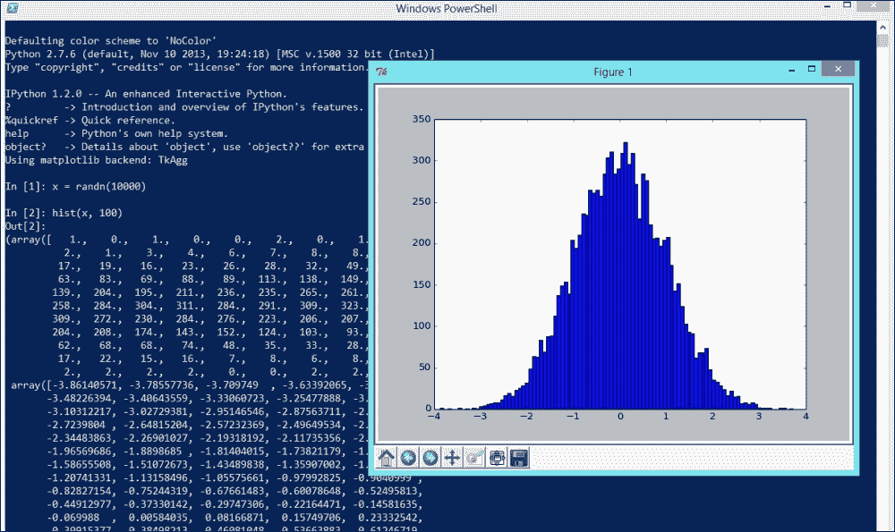

有关 matplotlib 库能做什么的更多详细信息，请参阅库网站 [`matplotlib.org/`](http://matplotlib.org/)。

现在 IPython 已经启动并运行，让我们指导 PTVS 以允许 REPL 与 IPython 通信，从而扩展其绘图功能。首先，我们需要找到 Python 解释器的 REPL 选项。您可以通过单击正在使用的 Python 环境中的 **交互选项** 标签，从 **Python 环境** 窗口中快速定位此选项。


这将弹出 **选项** 对话框，如下所示：

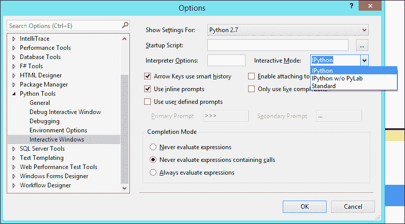

在 **交互模式** 下拉菜单中，PTVS REPL 工具的不同模式如下列出：

+   **标准模式**：此模式提供了默认的 REPL 交互式窗口，在其中我们可以执行 Python 代码

+   **IPython**：此模式允许我们在 REPL 与 PyLab 库直接交互时直接在 REPL 中查看图表

+   **无 PyLab 的 IPython**：此模式允许我们在独立窗口中看到渲染的图表

对于我们的例子，我们选择了 IPython 模式。现在我们已经设置了 **交互式窗口**，让我们看看 Visual Studio 的表现。你可以在代码编辑器中编写我们之前示例的代码，然后通过上下文菜单中的 **发送到交互式窗口** 选项在 REPL 中执行它，而不是在 **交互式窗口** 内部编写代码。正如我们在 第二章 中所看到的，“Visual Studio 中的 Python 工具”，预期的结果是以下内容：

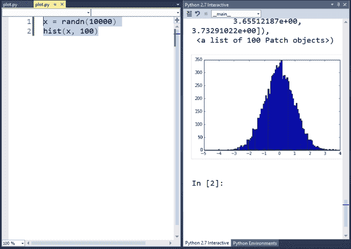

我们也可以通过一种方式执行文件中的代码，这样我们只能在外部窗口中看到生成的图表。然而，在我们能够这样做之前，我们需要添加一些其他代码，如下所示：

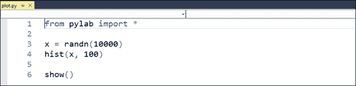

上一张截图中的第一行将引用 `pylab` 库，最后一行将渲染图表。要在外部窗口中运行代码，请右键单击 **解决方案资源管理器** 窗口中的文件节点，并选择以下截图所示的 **不调试启动** 命令：

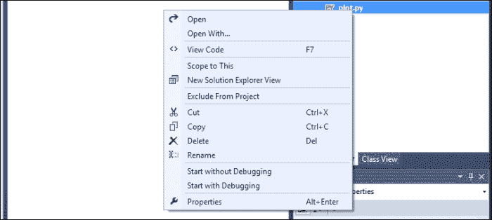

这将在控制台中执行代码，并在执行结束时出现生成的渲染窗口：

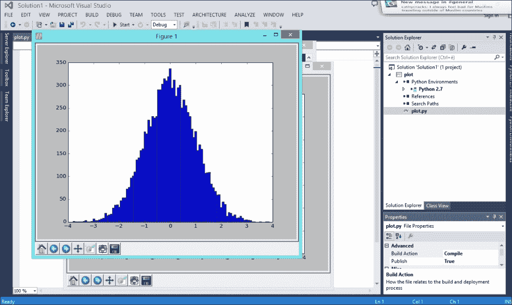

Matplotlib 库还提供了通过添加 `savefig` 命令仅用一行代码将生成的图表保存到文件的选项，如下所示：

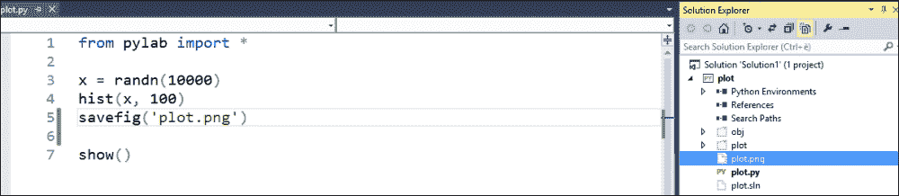

在这个例子中，生成的图表将被保存为项目文件夹根目录下的 `plot.png` 文件。

要深入了解功能以及深入挖掘 IPython 集成提供的绘图功能，请参阅 IPython 网站 [`ipython.org/`](http://ipython.org/)。您还可以参考 matplotlib 网站 [`matplotlib.org/`](http://matplotlib.org/)，其中包含与此主题相关的示例和出色的文档。

IronPython 的唯一限制是它不能与我们现在将要探索的其他库 IronPython 一起使用。尽管您可以在 **交互选项** 表单中选择它，但 IronPython 目前不支持 IPython。

# IronPython

IronPython 是 Python 语言的开放源代码实现，与 Microsoft .NET 框架紧密集成。这意味着您可以通过 IronPython 在您的 Python 应用程序中使用 .NET 库，或者在使用 .NET 语言时使用 Python 脚本。

## 在 Python 代码中使用 IronPython 的 .NET 类

要在 PTVS 中设置 IronPython，首先我们需要从官方网站下载 IronPython 安装程序，[`ironpython.net/`](http://ironpython.net/)。

下载适用于您操作系统的包版本后，通过双击它来安装包。安装完成后，您将在 **Python 环境窗口**中看到一个新的解释器，如下所示：

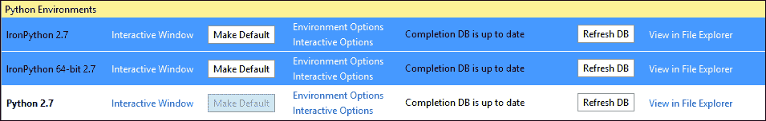

在前面截图所示的示例中，实际上有两个解释器。这是因为安装了 IronPython 的 64 位版本，这导致在机器上安装了 32 位和 64 位版本。

让我们尝试创建一个新的 IronPython 项目，以了解如何从 Python 交互 .NET 库。导航到 **文件** | **新建** | **项目** 来创建一个新的项目：

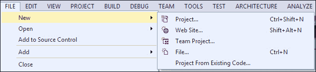

这将打开 **新建项目** 对话框。选择 **IronPython 应用程序** 模板，并为它指定一个项目名称：

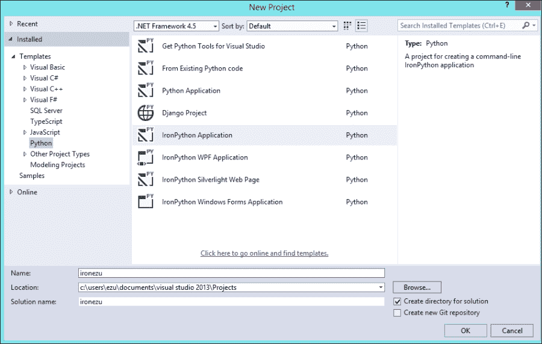

这将创建一个普通的 Python 项目，但项目环境将是 IronPython 而不是 Python。

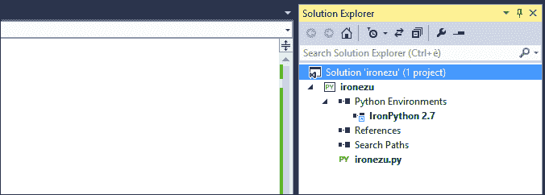

您可以在解决方案资源管理器中找到表示环境的 IronPython。

现在，您可以从 Python 应用程序内部访问 .NET 库。默认情况下，系统 .NET 命名空间被引用，因此我们可以开始使用其中的元素来了解如何与 Python 中的基类交互。

例如，让我们看看如何创建一个 **全局唯一标识符**（**GUID**），使用 `date` 函数进行操作，然后将它们打印到控制台；我们使用 Python 通过访问 .NET 类来完成所有这些操作。

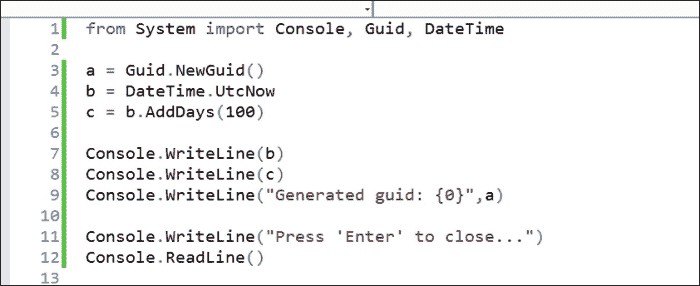

在 Python 中使用.NET 类的示例

如所示，我们导入了`Console`、`Guid`和`DateTime` .NET 对象，并在代码中使用它们创建一个新的 GUID 对象（第**3**行），获取当前的 UTC 日期和时间（第**4**行），并在此基础上添加 100 天（第**5**行）。之后，我们使用.NET 控制台对象打印出结果（第**7**到**11**行），并等待用户按下*Enter*键关闭应用程序。显然，我们可以使用正常的 Python `print`命令而不是`Console`对象来打印结果。然而，由于 IronPython 中 Python 和.NET 代码之间没有区别，我们为了看到不同对象集成的实际效果，使用了`Console`对象。

代码的执行将为我们提供以下结果：

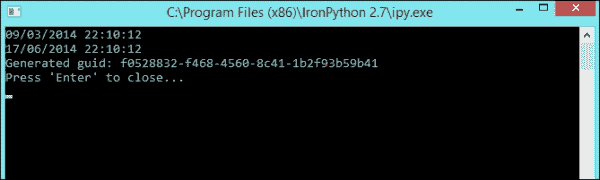

我们还可以利用 Core System 组件之外的其他.NET 命名空间。例如，如果我们想使用`System.Xml`组件，这是一个安装在系统**全局程序集缓存**（**GAC**）中的.NET 核心库，我们只需要在代码中使用`clr`模块的加载功能将其加载进来，如下所示：

```py
import clr
clr.AddReference('System.Xml')
```

现在，它可以在代码中引用，并且 IntelliSense 功能变得可用：

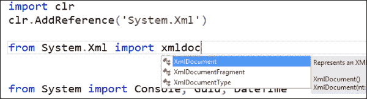

.NET 类型以 Python 类的形式暴露，你可以在.NET 类型上执行许多与 Python 类相同的操作。在两种情况下，你都是通过调用类型来创建实例。即使是复杂类型，例如`XmlDocument`，你也不需要像在.NET 中那样实例化它；这将在 IronPython 运行时幕后完成。

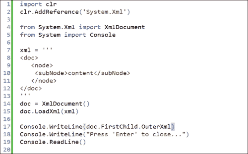

在 Python 中使用 XmlDocument 类的示例

## 在.NET 中使用 IronPython 的 Python 代码

到目前为止，我们已经学习了如何从 Python 代码中与.NET 类交互；现在让我们看看如何在.NET 代码中使用 Python。

首先，让我们创建一个新的 C#控制台应用程序。为了能够在.NET 代码中运行 Python 代码，你需要引用两个必要的组件，以添加我们的.NET 应用程序的集成功能：`IronPython`和`Microsoft.Scripting`。要在.NET 应用程序中添加对组件的引用，右键单击**解决方案资源管理器**窗口中的**引用**节点，并选择**添加引用**菜单项：

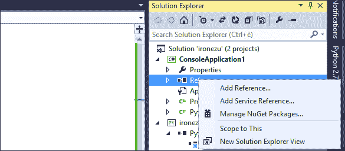

这将打开**引用管理器**对话框窗口。我们需要的两個组件位于**扩展**列表中，可以通过点击左侧的树视图来激活：

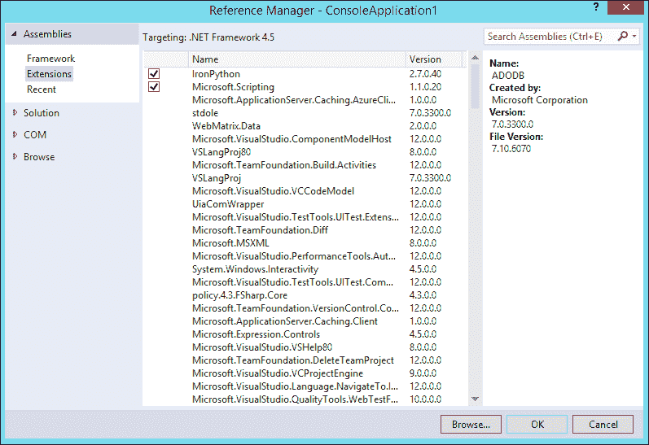

一旦从列表中选择两个程序集，通过在它们旁边的复选框中放置勾选标记，然后点击**确定**。这些程序集的引用已添加到项目中。

你将在**解决方案资源管理器**窗口的**引用**列表中看到它们，如下面的截图所示：


现在让我们在我们的项目中创建一个新的类，该类包含 Python 集成的代码：

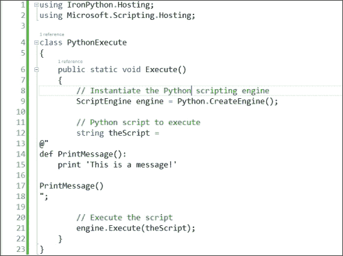

此代码将为 Python 创建`脚本引擎`（第**8**行），定义包含要执行 Python 代码的字符串（第**12**-**18**行），然后执行 Python 脚本。请特别注意包含 Python 代码的字符串。它必须正确缩进；否则，解释器将返回缩进错误。

要在控制台运行代码并查看结果，请将以下代码添加到`Program.cs`文件中：

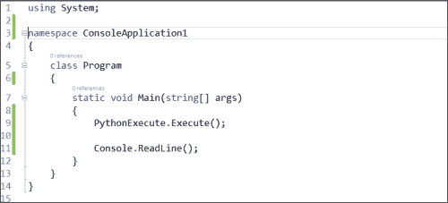

这将执行我们之前定义的函数，并期望用户按下*Enter*。运行应用程序以查看以下结果：

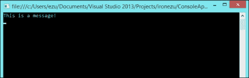

你还可以调用在.NET 应用程序中定义的变量和函数，并在 Python 代码中使用它们。为此，我们需要定义一个作用域，并将其作为参数传递给`Execute`方法，以便解释器可以将这些元素传递给 Python 代码。

通过添加包含`Add`函数的作用域来扩展我们之前的`Execute`方法：


我们使用 lambda 函数创建了一个作用域和`Add`函数（第**13**和**14**行）；然后，我们添加了一个新的 Python 命令（第**23**行），调用此函数。最后，我们执行了 Python 代码，并将作用域变量传递给脚本（第**27**行）。执行程序将显示以下结果：

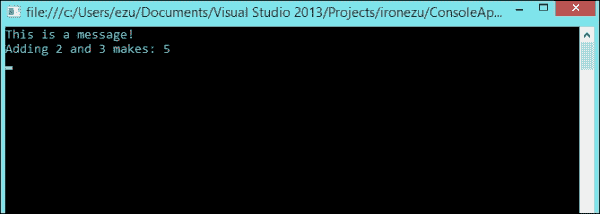

在我们的最后一个例子中，我们将看到如何执行来自外部文件的代码。假设我们有一个包含以下代码的 Python 文件，这实际上是我们在上一个例子中作为字符串拥有的代码：

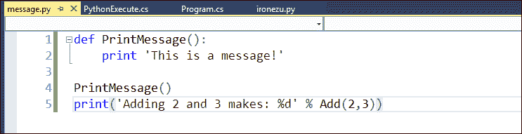

这就是我们如何在.NET 应用程序内部执行文件的方式：

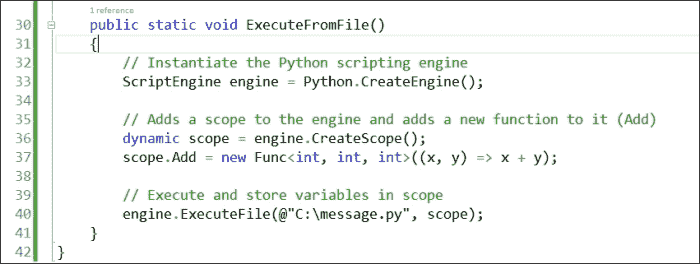

在这个例子中，我们定义了脚本引擎和作用域。我们不是在.NET 代码内部定义和执行 Python 代码，而是从外部文件加载它，将作用域传递给解释器，并执行它（第**40**行）。

将 Python 代码集成到.NET 应用程序中提供的可能性真的是无限的。与解释器共享作用域变量打开了一种可能性，即可以在.NET 应用程序内部使用现有的 Python 库，或者在我们的应用程序内部使用 Python 作为脚本语言。

# 摘要

在本章中，我们探讨了两种在 Visual Studio 中扩展 PTVS 和 Python 的方法，以及两个强大的工具：IPython 和 IronPython。IPython 与纯 Python 语言更为相关，而 IronPython 则与 Microsoft .NET 框架更为集成。

这两个工具展示了使用和交互 Python 的新方法，为探索这个强大语言提供了新的边界；所有这些都是在 Visual Studio 和 PTVS 内部实现的。

通过本章，我们探索 Visual Studio 中 Python 工具的旅程就此结束。我们试图向 Python 开发者展示 Visual Studio 的强大功能和 Microsoft IDE 提供的自动化和帮助；我们还探讨了使用 Python 作为创建新强大应用程序的语言的可能性。

除了工具本身，我们还探讨了在 Microsoft Windows 操作系统上使用 Python 库可能遇到的问题和解决方案。我们还研究了在 Visual Studio 中探索 Django 的主题，以及它提供的用于加速和管理应用程序生命周期的强大库。

我们只是触及了表面，但我们希望这本书已经为您提供了对 PTVS 的深入洞察，并激发了您进一步探索和学习的兴趣。

开心编码！
