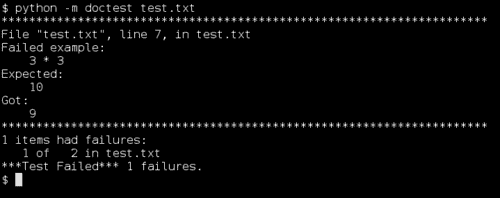
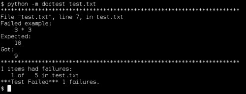
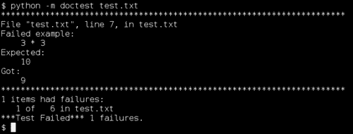
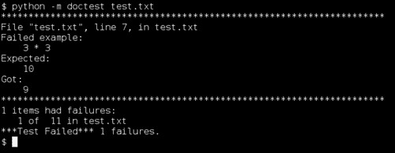
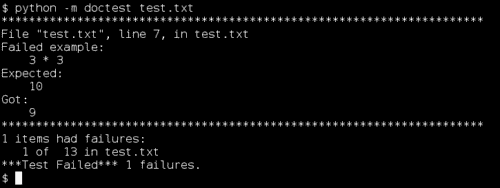
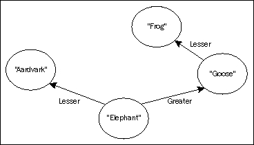
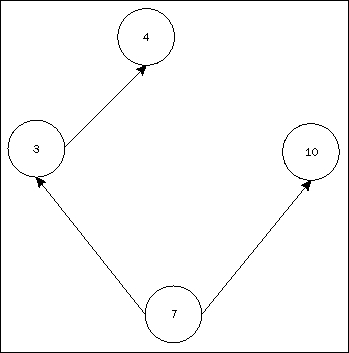

# 第二章. Doctest：最简单的测试工具

*本章将向你介绍一个名为 doctest 的神奇工具。Doctest 是 Python 附带的一个程序，它允许你以对人和计算机都容易阅读的方式写下你对代码的期望。Doctest 文件通常可以通过从 Python 交互式外壳中复制文本并将其粘贴到文件中来创建。Doctest 通常是编写软件测试最快、最简单的方式。*

在本章中，我们将：

+   学习 doctest 语言和语法

+   在文本文件中编写嵌入的 doctests

+   在 Python 文档字符串中编写嵌入的 doctests

# 基本 doctest

Doctest 将成为你的测试工具包中的主要工具。你当然会使用它来进行测试，但也会用于你现在可能不会认为是测试的事情。例如，程序规范和 API 文档都受益于以 doctests 的形式编写并在你的其他测试中一起检查。

与程序源代码一样，doctest 测试是用纯文本编写的。Doctest 提取测试并忽略其余文本，这意味着测试可以嵌入在可读的解释或讨论中。这正是使 doctest 非常适合非经典用途（如程序规范）的功能。

# 动手实践 – 创建和运行你的第一个 doctest

我们将创建一个简单的 doctest，以演示使用 doctest 的基本原理。

1.  在你的编辑器中打开一个新的文本文件，并将其命名为`test.txt`。

1.  将以下文本插入到文件中：

    ```py
    This is a simple doctest that checks some of Python's arithmetic
    operations.

    >>> 2 + 2
    4

    >>> 3 * 3
    10
    ```

1.  我们现在可以运行 doctest。我们如何运行它的细节取决于我们使用的 Python 版本。在命令提示符下，切换到保存`test.txt`的目录。

1.  如果你使用的是 Python 2.6 或更高版本，输入以下命令：

    ```py
    $ python -m doctest test.txt

    ```

1.  如果你使用的是 python 2.5 或更低版本，上述命令可能看起来可以工作，但不会产生预期的结果。这是因为 Python 2.6 是第一个在以这种方式调用时在命令行上查找测试文件名的版本。

1.  如果你使用的是较旧的 Python 版本，你可以通过输入以下命令来运行你的 doctest：

    ```py
    $ python -c "__import__('doctest').testfile('test.txt')"
    ```

1.  当测试运行时，你应该看到如下屏幕所示的输出：

## *刚才发生了什么？*

你编写了一个 doctest 文件，描述了一些算术运算，并执行它来检查 Python 是否像测试所说的那样表现。你是通过告诉 Python 在包含测试的文件上执行 doctest 来运行测试的。

在这种情况下，Python 的行为与测试不同，因为根据测试，三乘三等于十！然而，Python 并不同意这一点。由于 doctest 预期的是一种情况而 Python 做了不同的处理，doctest 向你展示了一个漂亮的错误报告，显示了失败测试的位置以及实际结果与预期结果之间的差异。报告底部是一个总结，显示了每个测试文件中失败的测试数量，当你有多个包含测试的文件时，这很有帮助。

记住，doctest 文件是供计算机和人类消费的。尽量以人类读者容易理解的方式编写测试代码，并添加大量的普通语言注释。

## doctests 的语法

你可能已经从查看之前的示例中猜到了：doctest 通过寻找看起来像是从 Python 交互会话中复制粘贴的文本部分来识别测试。任何可以用 Python 表达的内容都可以在 doctest 中使用。

以 `>>>` 提示符开头的行会被发送到 Python 解释器。以 `...` 提示符开头的行作为上一行代码的延续，允许你将复杂的块语句嵌入到你的 doctests 中。最后，任何不以 `>>>` 或 `...` 开头的行，直到下一个空白行或 `>>>` 提示符，代表从该语句期望得到的输出。输出将像在交互式 Python 会话中一样显示，包括返回值和打印到控制台的内容。如果你没有输出行，doctest 假设该语句在控制台上没有可见的结果。

Doctest 忽略文件中不属于测试的部分，这意味着你可以在测试之间放置解释性文本、HTML、行图或其他任何你喜欢的元素。我们在之前的 doctest 中就利用了这一点，在测试本身之前添加了一个解释性句子。

# 行动时间 – 编写一个更复杂的测试

我们将编写另一个测试（如果你喜欢，可以将其添加到 `test.txt` 文件中），展示 doctest 语法的大部分细节。

1.  将以下文本插入到你的 doctest 文件（`test.txt`）中，与现有测试至少隔一个空白行：

    ```py
    Now we're going to take some more of doctest's syntax for a spin.

    >>> import sys
    >>> def test_write():
    ...     sys.stdout.write("Hello\n")
    ...     return True
    >>> test_write()
    Hello
    True
    ```

    想想看：这会做什么？你期望测试通过，还是失败？

1.  如我们之前讨论的那样，在测试文件上运行 doctest。因为我们添加了新的测试到包含之前测试的同一文件中，所以我们仍然看到通知说三乘三不等于十。现在，尽管如此，我们还看到运行了五个测试，这意味着我们的新测试已经运行并成功。

## *刚才发生了什么？*

就 doctest 而言，我们在文件中添加了三个测试。

+   第一个测试表示，当我们 `import sys` 时，不应该有任何可见的操作发生。

+   第二个测试表示，当我们定义 `test_write` 函数时，不应该有任何可见的操作发生。

+   第三个测试说明，当我们调用`test_write`函数时，**Hello**和**True**应该按顺序出现在控制台上，每行一个。

由于这三个测试都通过了，doctest 对于它们并没有太多要说的。它所做的只是将底部报告的测试数量从两个增加到五个。

## 预期异常

对于测试预期中的行为是否正常，这当然很好，但同样重要的是要确保当预期失败时，确实会失败。换句话说；有时你的代码应该抛出一个异常，你需要能够编写测试来检查这种行为。

幸运的是，doctest 在处理异常时遵循了几乎与处理其他一切相同的原理；它寻找看起来像 Python 交互会话的文本。这意味着它寻找看起来像 Python 异常报告和回溯的文本，并将其与抛出的任何异常进行匹配。

Doctest 在处理异常方面与其他工具略有不同。它不仅仅精确匹配文本，如果匹配失败则报告失败。异常回溯通常包含许多与测试无关的细节，但这些细节可能会意外地改变。Doctest 通过完全忽略回溯来处理这个问题：它只关心第一行——**Traceback (most recent call last)**——这告诉它你预期会有一个异常，以及回溯之后的部分，这告诉它你预期哪种异常。只有当这些部分之一不匹配时，Doctest 才会报告失败。

这还有另一个好处：当你编写测试时，手动确定回溯的外观需要大量的努力，而且不会带来任何好处。最好是简单地省略它们。

# 行动时间——预期异常

这又是你可以添加到`test.txt`中的另一个测试，这次测试的是应该抛出异常的代码。

1.  将以下文本插入到你的 doctest 文件中（请注意，由于书籍格式的限制，这段文本的最后一行已被换行，应该是一行）：

    ```py
    Here we use doctest's exception syntax to check that Python is correctly enforcing its grammar.

    >>> def faulty():
    ...     yield 5
    ...     return 7
    Traceback (most recent call last):
    SyntaxError: 'return' with argument inside generator (<doctest test.txt[5]>, line 3)
    ```

1.  测试应该抛出一个异常，所以如果它没有抛出异常，或者抛出了错误的异常，测试就会失败。请确保你理解这一点：如果测试代码执行成功，那么测试就会失败，因为它预期会有一个异常。

1.  使用 doctest 运行测试，以下屏幕将显示：

## *发生了什么？*

由于 Python 不允许一个函数同时包含 yield 语句和带有值的 return 语句，因此测试定义这样的函数会导致异常。在这种情况下，异常是一个带有预期值的`SyntaxError`。因此，doctest 将其视为与预期输出匹配，从而测试通过。在处理异常时，通常希望能够使用通配符匹配机制。Doctest 通过其省略号指令提供这种功能，我们将在后面讨论。

## 预期输出中有空白行

Doctest 使用第一个空白行来识别预期输出的结束。那么，当预期输出实际上包含空白行时，您该怎么办？

Doctest 通过匹配预期输出中只包含文本`<BLANKLINE>`的行，与实际输出中的真实空白行进行匹配来处理这种情况。

## 使用指令控制 doctest

有时，doctest 的默认行为使得编写特定的测试变得不方便。这就是 doctest 指令发挥作用的地方。指令是特殊格式的注释，您将其放置在测试的源代码之后，告诉 doctest 以某种方式更改其默认行为。

指令注释以`# doctest:`开头，之后跟一个以逗号分隔的选项列表，这些选项可以启用或禁用各种行为。要启用一个行为，写一个`+`（加号符号）后跟行为名称。要禁用一个行为，写一个`–`（减号符号）后跟行为名称。

### 忽略部分结果

测试输出中只有一部分实际上与确定测试是否通过相关是很常见的。通过使用`+ELLIPSIS`指令，您可以使得 doctest 将预期输出中的文本`...`（称为省略号）视为通配符，这将匹配输出中的任何文本。

当您使用省略号时，doctest 将向前扫描，直到找到与预期输出中省略号之后文本匹配的文本，然后从那里继续匹配。这可能导致意外的结果，例如省略号匹配实际输出中的 0 长度部分，或匹配多行。因此，需要谨慎使用。

# 行动时间 – 在测试中使用省略号

我们将在几个不同的测试中使用省略号，以更好地了解它的作用和使用方法。

1.  将以下文本插入到您的 doctest 文件中：

    ```py
    Next up, we're exploring the ellipsis.

    >>> sys.modules # doctest: +ELLIPSIS
    {...'sys': <module 'sys' (built-in)>...}

    >>> 'This is an expression that evaluates to a string'
    ... # doctest: +ELLIPSIS
    'This is ... a string'
    >>> 'This is also a string' # doctest: +ELLIPSIS
    'This is ... a string'

    >>> import datetime
    >>> datetime.datetime.now().isoformat() # doctest: +ELLIPSIS
        '...-...-...T...:...:...'
    ```

1.  使用 doctest 运行测试，以下屏幕显示:.

1.  没有省略号，这些测试都不会通过。考虑一下这一点，然后尝试进行一些更改，看看它们是否产生您预期的结果。

## *发生了什么？*

我们刚刚看到了如何启用省略号匹配。此外，我们还看到了 doctest 指令注释可以放置的位置的一些变化，包括单独的块续行符。

我们有机会稍微玩一下省略号，也许看到了为什么应该小心使用。看看最后一个测试。你能想象任何输出不是 ISO 格式的日期时间戳，但它仍然会匹配的情况吗？

### 忽略空白

有时候，空白（空格、制表符、换行符及其类似物）带来的麻烦比它们的价值要大。也许你希望能够在测试文件中将单个预期输出行的内容拆分成多行，或者也许你正在测试一个使用大量空白但不会提供任何有用信息的系统。

Doctest 提供了一种“标准化”空白的方式，将预期输出和实际输出中的任何空白字符序列都转换为一个空格。然后它会检查这些标准化版本是否匹配。

# 行动时间 - 标准化空白

我们将编写几个测试来展示空白标准化是如何工作的。

1.  将以下文本插入到你的 doctest 文件中：

    ```py
    Next, a demonstration of whitespace normalization.

    >>> [1, 2, 3, 4, 5, 6, 7, 8, 9]
    ... # doctest: +NORMALIZE_WHITESPACE
    [1, 2, 3,
     4, 5, 6,
     7, 8, 9]

    >>> sys.stdout.write("This text\n contains weird     spacing.")
    ... # doctest: +NORMALIZE_WHITESPACE
    This text contains weird spacing.
    ```

1.  使用 doctest 运行测试，以下屏幕将显示：

1.  注意，其中一个测试在预期输出中插入额外的空白，而另一个测试则忽略了实际输出中的额外空白。当你使用`+NORMALIZE_WHITESPACE`时，你会在文本文件中格式化事物方面获得很大的灵活性。

## 完全跳过一个示例

在某些情况下，doctest 会将一些文本识别为要检查的示例，而实际上你只想让它作为普通文本。这种情况比最初看起来要少，因为通常让 doctest 检查所有它能检查的内容并没有什么坏处。事实上，通常让 doctest 检查所有它能检查的内容是有帮助的。然而，当你想限制 doctest 检查的内容时，可以使用`+SKIP`指令。

# 行动时间 - 跳过测试

这是一个跳过测试的例子：

1.  将以下文本插入到你的 doctest 文件中：

    ```py
    Now we're telling doctest to skip a test

    >>> 'This test would fail.' # doctest: +SKIP
    If it were allowed to run.
    ```

1.  使用 doctest 运行测试，以下屏幕将显示：

1.  注意，测试并没有失败，并且运行测试的数量没有改变。

## *发生了什么？*

跳过指令将原本应该是测试的内容转换成了纯文本（就 doctest 而言）。Doctest 从未运行过这个测试，实际上从未将其计为一个测试。

有几种情况下跳过测试可能是个好主意。有时候，你有一个测试没有通过（你知道它不会通过），但这并不是目前应该解决的问题。使用`skip`指令让你可以暂时忽略这个测试。有时候，你有一个看起来像测试的文本块，但 doctest 解析器认为它只是供人类阅读的。`skip`指令可以用来标记这段代码不是实际测试的一部分。

### 其他 doctest 指令

有许多其他指令可以发出以调整 doctest 的行为。它们在[`docs.python.org/library/doctest.html#option-flags-and-directives`](http://docs.python.org/library/doctest.html#option-flags-and-directives)中得到了全面记录，但这里有一个简要概述：

+   `+DONT_ACCEPT_TRUE_FOR_1`，这使得 doctest 将`True`和`1`视为不同的值，而不是像通常那样将它们视为匹配。

+   `+DONT_ACCEPT_BLANKLINE`，这使得 doctest 忽略`<BLANKLINE>`的特殊含义。

+   `+IGNORE_EXCEPTION_DETAIL`，这使得 doctest 在异常类型相同的情况下，无论其余的异常是否匹配，都将异常视为匹配。

+   `+REPORT_UDIFF`，这使得 doctest 在显示失败的测试时使用`unified diff`格式。如果你习惯于阅读`unified diff`格式，这很有用，这是开源社区中最常见的 diff 格式。

+   `+REPORT_CDIFF`，这使得 doctest 在显示失败的测试时使用`context diff`格式。如果你习惯于阅读`context diff`格式，这很有用。

+   `+REPORT_NDIFF`，这使得 doctest 在显示失败的测试时使用`ndiff`格式。如果你习惯于阅读`ndiff`格式，这很有用。

+   `+REPORT_ONLY_FIRST_FAILURE`使得 doctest 在应用后避免打印出失败报告，如果已经打印了失败报告。测试仍然被执行，doctest 仍然跟踪它们是否失败。只有通过使用此标志来更改报告。

## 执行范围

当 doctest 从文本文件中运行测试时，同一文件中的所有测试都在相同的执行范围内运行。这意味着如果你在一个测试中导入一个模块或绑定一个变量，那么这个模块或变量在后续的测试中仍然可用。我们已经在本章迄今为止编写的测试中多次利用了这个事实：例如，`sys`模块只导入了一次，尽管它在几个测试中使用。

这种行为并不一定有益，因为测试需要彼此隔离。我们不希望它们相互污染，因为如果一个测试依赖于另一个测试所做的东西，或者如果它因为另一个测试所做的东西而失败，那么这两个测试在某种程度上就变成了一个覆盖更大代码部分的测试。你不想这种情况发生，因为知道哪个测试失败了并不能给你提供太多关于出错原因和出错位置的信息。

那么，我们如何为每个测试提供自己的执行范围呢？有几种方法可以实现。一种方法是将每个测试简单地放在自己的文件中，以及所需的任何解释性文本。这工作得很好，但除非你有工具来查找和运行所有测试，否则运行测试可能会很痛苦。我们稍后会讨论这样一个工具（称为 nose）。

另一种给每个测试自己的执行范围的方法是在函数内定义每个测试，如下所示：

```py
>>> def test1():
...     import frob
...     return frob.hash('qux')
>>> test1()
77
```

通过这样做，最终在共享作用域中结束的只有测试函数（在这里命名为`test1`）。`frob`模块，以及函数内部绑定的任何其他名称，都是隔离的。

第三种方法是在创建名称时要谨慎，并确保在每个测试部分的开始将它们设置为已知值。在许多方面，这是一种最简单的方法，但也是最让你感到负担的方法，因为你必须跟踪作用域中的内容。

为什么 doctest 以这种方式行为，而不是将测试相互隔离？doctest 文件不仅是为了计算机阅读，也是为了人类阅读。它们通常形成一种叙事，从一件事流向另一件事。不断地重复之前的内容会打断叙事。换句话说，这种方法是在文档和测试框架之间的一种折衷，是一种既适合人类也适合计算机的中间地带。

在本书中我们深入研究（简单地称为 unittest）的另一个框架在更正式的层面上工作，并强制执行测试之间的分离。

## 快速问答——doctest 语法

这些问题没有答案。在 doctest 中尝试你的答案，看看你是否正确！

1.  doctest 如何识别测试表达式的开始？

1.  doctest 如何知道文本表达式的预期输出开始和结束的位置？

1.  你会如何告诉 doctest 你想要将一个长的预期输出拆分成多行，即使实际的测试输出并不是这样？

1.  异常报告中哪些部分被 doctest 忽略？

1.  当你在测试文件中绑定一个变量时，什么代码可以“看到”这个变量？

1.  我们为什么关心代码可以看到由测试创建的变量？

1.  我们如何让 doctest 不关心输出部分的内容？

## 尝试英雄——从英语到 doctest

是时候展翅飞翔了！我将给你一个关于单个函数的描述，用英语。你的任务是把这个描述复制到一个新的文本文件中，然后添加测试，以描述所有要求，让计算机能够理解和检查。

努力使 doctests 不仅仅是为了计算机。好的 doctests 往往也会为人类读者澄清事情。总的来说，这意味着你将它们作为例子呈现给人类读者，穿插在文本中。

不再拖延，以下是英文描述：

```py
The fib(N) function takes a single integer as its only parameter N. If N is 0 or 1, the function returns 1\. If N is less than 0, the function raises a ValueError. Otherwise, the function returns the sum of fib(N – 1) and fib(N – 2). The returned value will never be less than 1\. On versions of Python older than 2.2, and if N is at least 52, the function will raise an OverflowError. A naïve implementation of this function would get very slow as N increased.
```

我给你一个提示，并指出最后一句——关于函数运行缓慢——实际上并不是可测试的。随着计算机变得越来越快，任何依赖于“慢”的任意定义的测试最终都会失败。此外，没有好的方法来测试一个慢函数和一个陷入无限循环的函数之间的差异，所以尝试这样做是没有意义的。如果你发现自己需要这样做，最好是退一步，尝试不同的解决方案。

### 注意

计算机科学家称无法判断一个函数是否卡住还是只是运行缓慢为“停机问题”。我们知道除非我们有一天发现一种根本更好的计算机类型，否则这个问题是无法解决的。更快的计算机无法解决这个问题，量子计算机也无法，所以不要抱太大希望！

# 在 Python 文档字符串中嵌入 doctests

Doctests 并不局限于简单的文本文件。你可以将 doctests 放入 Python 的文档字符串中。

为什么想要这样做呢？有几个原因。首先，文档字符串是 Python 代码可用性的重要部分（但只有当它们讲述真相时）。如果一个函数、方法或模块的行为发生变化，而文档字符串没有更新，那么文档字符串就变成了错误信息，反而成为一种阻碍而不是帮助。如果文档字符串包含几个 doctest 示例，那么可以自动定位过时的文档字符串。将 doctest 示例放入文档字符串的另一个原因是它非常方便。这种做法将测试、文档和代码都放在同一个地方，可以轻松找到。

如果文档字符串成为太多测试的家园，这可能会破坏其作为文档的效用。应避免这种情况；如果你发现自己有太多的测试在文档字符串中，以至于它们不能作为快速参考，那么将大多数测试移动到单独的文件中。

# 行动时间 – 在文档字符串中嵌入 doctest

我们将直接在测试的 Python 源文件中嵌入一个测试，通过将其放置在文档字符串中来实现。

1.  创建一个名为 `test.py` 的文件，内容如下：

    ```py
    def testable(x):
        r"""
        The `testable` function returns the square root of its
        parameter, or 3, whichever is larger.
        >>> testable(7)
        3.0
        >>> testable(16)
        4.0
        >>> testable(9)
        3.0
        >>> testable(10) == 10 ** 0.5
        True
        """
        if x < 9:
            return 3.0
        return x ** 0.5
    ```

1.  在命令提示符下，切换到保存 `test.py` 的目录，然后通过输入以下命令来运行测试：

    ```py
    $ python -m doctest test.py

    ```

    ### 注意

    如前所述，如果你有一个较旧的 Python 版本，这对你来说不起作用。相反，你需要输入 `python -c "__import__('doctest').testmod(__import__('test'))"`

1.  如果一切正常，你根本不应该看到任何东西。如果你想确认 doctest 正在执行某些操作，请通过将命令更改为来开启详细报告：

    ```py
    python -m doctest -v test.py

    ```

### 注意

对于较旧的 Python 版本，请使用 `python -c "__import__('doctest').testmod(__import__('test'), verbose=True)"`

## *刚才发生了什么？*

你将 doctest 直接放在被测试函数的文档字符串中。这是一个展示用户如何做某事的测试的好地方。它不是一个详细、低级测试的好地方（上面的例子为了说明目的而相当详细，已经接近过于详细），因为文档字符串需要作为 API 文档。你只需回顾一下例子，就可以看到 doctests 占据了文档字符串的大部分空间，而没有告诉读者比单个测试更多的信息。

任何可以作为良好 API 文档的测试都是包含在文档字符串中的良好候选。

注意 docstring 使用了原始字符串（由第一个三引号前的`r`字符表示）。养成使用原始字符串作为 docstrings 的习惯是个好习惯，因为你通常不希望转义序列（例如`\n`表示换行）被 Python 解释器解释。你希望它们被当作文本处理，以便它们能正确地传递给 doctest。

## Doctest 指令

嵌入的 doctests 可以接受与文本文件中的 doctests 完全相同的指令，使用完全相同的语法。正因为如此，我们之前讨论的所有 doctest 指令也可以用来影响嵌入的 doctests 的评估方式。

## 执行范围

嵌入在 docstrings 中的 doctests 与文本文件中的 doctests 的执行范围略有不同。doctest 不是为文件中的所有测试提供一个单一的执行范围，而是为每个 docstring 创建一个单一的执行范围。共享同一个 docstring 的所有测试也共享一个执行范围，但它们与其他 docstrings 中的测试是隔离的。

将每个 docstring 独立于其自身的执行范围通常意味着，当它们嵌入在 docstrings 中时，我们不需要过多考虑隔离 doctests。这是幸运的，因为 docstrings 主要是为了文档而设计的，而隔离测试所需的技巧可能会模糊其含义。

# 将理论付诸实践：AVL 树

我们将逐步介绍使用 doctest 为名为 AVL 树的数据结构创建可测试规范的过程。AVL 树是一种组织键值对的方式，以便可以通过键快速定位它们。换句话说，它非常类似于 Python 内置的字典类型。AVL 这个名字指的是发明这种数据结构的人的姓名首字母。

如其名所示，AVL 树将存储在其中的键组织成一种树结构，每个键最多有两个**子**键——一个**子**键通过比较小于**父**键，另一个则更大。在下面的图片中，键**Elephant**有两个子键，**Goose**有一个，而**Aardvark**和**Frog**都没有。



AVL 树是特殊的，因为它保持树的某一侧不会比另一侧高得多，这意味着用户可以期望它无论在什么情况下都能可靠且高效地执行。在之前的图片中，如果**Frog**获得一个子键，AVL 树将重新组织以保持平衡。

我们将在这里编写 AVL 树实现的测试，而不是编写实现本身。因此，我们将详细阐述 AVL 树是如何工作的细节，以便查看它正常工作时应做什么。

### 注意

如果你想了解更多关于 AVL 树的信息，你将在互联网上找到许多很好的参考资料。关于这个主题的维基百科条目是一个很好的起点：[`en.wikipedia.org/wiki/AVL_tree`](http://en.wikipedia.org/wiki/AVL_tree)。

我们将从一份普通语言规范开始，然后在段落之间插入测试。

### 小贴士

你不必真的将这些内容全部输入到文本文件中；这里是为了让你阅读和思考。它也包含在这本书的代码下载中。

## 英文规范

第一步是用普通语言描述期望的结果。这可能是一些你自己做的事情，或者别人为你做的事情。如果你在为别人工作，希望你和你的雇主可以坐下来一起解决这个问题。

在这种情况下，没有太多需要解决的问题，因为 AVL 树已经描述了几十年。即便如此，这里的描述并不完全像你在其他地方能找到的。这种歧义性正是为什么纯语言规范不够好的原因。我们需要一个明确的规范，这正是 doctest 文件中的测试可以提供的。

以下文本将放入一个名为`AVL.txt`的文件中（你可以在附带的代码存档中找到其最终形式。在这个处理阶段，该文件只包含普通语言规范）：

```py
An AVL Tree consists of a collection of nodes organized in a binary tree structure. Each node has left and right children, each of which may be either None or another tree node. Each node has a key, which must be comparable via the less-than operator. Each node has a value. Each node also has a height number, measuring how far the node is from being a leaf of the tree -- a node with height 0 is a leaf.

The binary tree structure is maintained in ordered form, meaning that of a node's two children, the left child has a key that compares less than the node's key and the right child has a key that compares greater than the node's key.

The binary tree structure is maintained in a balanced form, meaning that for any given node, the heights of its children are either the same or only differ by 1.

The node constructor takes either a pair of parameters representing a key and a value, or a dict object representing the key-value pairs with which to initialize a new tree.

The following methods target the node on which they are called, and can be considered part of the internal mechanism of the tree:

Each node has a recalculate_height method, which correctly sets the height number.

Each node has a make_deletable method, which exchanges the positions of the node and one of its leaf descendants, such that the the tree ordering of the nodes remains correct.

Each node has rotate_clockwise and rotate_counterclockwise methods. Rotate_clockwise takes the node's right child and places it where the node was, making the node into the left child of its own former child. Other nodes in the vicinity are moved so as to maintain the tree ordering. The opposite operation is performed by rotate_counterclockwise.

Each node has a locate method, taking a key as a parameter, which searches the node and its descendants for a node with the specified key, and either returns that node or raises a KeyError.

The following methods target the whole tree rooted at the current node. The intent is that they will be called on the root node:

Each node has a get method taking a key as a parameter, which locates the value associated with the specified key and returns it, or raises KeyError if the key is not associated with any value in the tree.

Each node has a set method taking a key and a value as parameters, and associating the key and value within the tree.

Each node has a remove method taking a key as a parameter, and removing the key and its associated value from the tree. It raises KeyError if no values was associated with that key.
```

## 节点数据

规范的前三段描述了 AVL 树节点的成员变量，并告诉我们变量的有效值。它们还告诉我们如何测量树的高度，并定义了平衡树的意义。现在我们的任务是吸收这些想法，并将它们编码成计算机最终可以用来检查我们代码的测试。

我们可以通过创建一个节点并测试其值来检查这些规范，但这实际上只是对构造函数的测试。测试构造函数是很重要的，但我们真正想要做的是将检查节点变量是否处于有效状态的检查纳入到我们对每个成员函数的测试中。

为了达到这个目的，我们将定义一个我们的测试可以调用的函数来检查节点的状态是否有效。我们将在第三段之后定义这个函数：

### 注意

注意，这个测试被编写成好像 AVL 树实现已经存在。它试图导入一个包含`AVL`类的`avl_tree`模块，并试图以特定的方式使用`AVL`类。当然，目前并没有`avl_tree`模块，所以测试会失败。这正是应该发生的。失败仅仅意味着，当真正需要实现树的时候，我们应该在一个名为`avl_tree`的模块中实现，其内容应该符合我们的测试假设。这样测试的一个好处是能够在编写代码之前就测试代码。

```py
>>> from avl_tree import AVL

>>> def valid_state(node):
...     if node is None:
...         return
...     if node.left is not None:
...         assert isinstance(node.left, AVL)
...         assert node.left.key < node.key
...         left_height = node.left.height + 1
...     else:
...         left_height = 0
...
...     if node.right is not None:
...         assert isinstance(node.right, AVL)
...         assert node.right.key > node.key
...         right_height = node.right.height + 1
...     else:
...         right_height = 0
...
...     assert abs(left_height - right_height) < 2
...     node.key < node.key
...     node.value

>>> def valid_tree(node):
...     if node is None:
...         return
...     valid_state(node)
...     valid_tree(node.left)
...     valid_tree(node.right)
```

注意，我们实际上还没有调用那些函数。它们本身不是测试，而是我们将用来简化编写测试的工具。我们在这里定义它们，而不是在我们要测试的 Python 模块中定义，因为它们在概念上不是测试代码的一部分，并且任何阅读测试的人都需要能够看到辅助函数的作用。

## 构造函数

第四段描述了 AVL 节点的构造函数：节点构造函数接受一对表示键和值的参数，或者一个表示要初始化新树的键值对的`dict`对象。

构造函数有两种可能的操作模式：

+   它可以创建一个初始化的单个节点

+   或者它可以创建并初始化一个整个节点树。对于单个节点模式的测试很简单：

    ```py
    >>> valid_state(AVL(2, 'Testing is fun'))
    ```

构造函数的另一种模式是一个问题，因为它几乎肯定将通过创建一个初始树节点然后调用其 set 方法来添加其余节点来实现。为什么那是一个问题？因为我们不想在这里测试 set 方法：这个测试应该完全集中在构造函数是否正确工作，*当它所依赖的一切都正常工作时*。

### 提示

换句话说，测试应该能够假设除了正在测试的具体代码块之外的所有内容都工作正常。

然而，这并不总是有效的假设。那么，我们如何为调用测试之外代码的事情编写测试？

对于这个问题，我们将在第四章中了解到解决方案。现在，我们只需将构造函数的第二种操作模式留待测试。

## 重新计算高度

`recalculate_height`方法在第 5 段中描述。

为了测试它，我们需要一个树来操作，我们不想使用构造函数的第二种模式来创建它。毕竟，那种模式还没有经过测试，即使它经过了测试，我们也希望这个测试与它独立。我们更愿意使测试完全独立于构造函数，但在这个情况下，我们需要对规则做出一个小小的例外（因为在不以某种方式调用其构造函数的情况下创建对象是困难的）。

我们将定义一个函数来构建一个特定的树并返回它。这个函数将在我们后面的几个测试中也很有用。使用这个函数，测试`recalculate_height`将变得容易。

```py
>>> def make_test_tree():
...     root = AVL(7, 'seven')
...     root.height = 2
...     root.left = AVL(3, 'three')
...     root.left.height = 1
...     root.left.right = AVL(4, 'four')
...     root.right = AVL(10, 'ten')
...     return root

>>> tree = make_test_tree()
>>> tree.height = 0
>>> tree.recalculate_height()
>>> tree.height
2
```

`make_test_tree`函数通过手动构建其每个部分并将其连接成一个类似这样的结构来构建一个树：



## 可删除

您不能删除有子节点的节点，因为这会使节点的小孩与树的其他部分断开连接。如果我们从树的底部删除**Elephant**节点，那么**Aardvark**、**Goose**和**Frog**怎么办？如果我们删除**Goose**，之后如何找到**Frog**？


解决这个问题的方法是让节点与其左侧最大的叶子子节点交换位置（或者右侧最小的叶子子节点，但我们不会那样做）。

我们将通过使用之前定义的 `make_test_tree` 函数来创建一个新的树来工作，并检查 `make_deletable` 是否正确交换：

```py
Each node has a make_deletable method, which exchanges the positions of the node and one of its leaf descendants, such that the the tree ordering of the nodes remains correct.

>>> tree = make_test_tree()
>>> target = tree.make_deletable()
>>> (tree.value, tree.height)
('four', 2)
>>> (target.value, target.height)
('seven', 0)
```

### 注意

这里需要注意的一点是，`make_deletable` 函数不应该删除它被调用的节点。它应该将节点移动到一个可以安全删除的位置。它必须在不违反定义 AVL 树结构的任何约束的情况下进行这种树的重组织。

## 旋转

两个旋转函数在树中执行一些相当复杂的链接操作。你可能发现它们在普通语言描述中的操作有些令人困惑。在这些情况下，一点点的代码比任何数量的句子都要有意义得多。

虽然树旋转通常是通过重新排列树中节点之间的链接来定义的，但我们会通过查看值（而不是直接查看左右链接）来检查它是否成功。这允许实现者在需要时交换节点的内容——而不是节点本身。毕竟，对于规范来说，哪个操作发生并不重要，所以我们不应该排除一个完全合理的实现选择。

旋转测试代码的第一部分只是创建一个树并验证它看起来是否符合我们的预期：

```py
>>> tree = make_test_tree()
>>> tree.value
'seven'
>>> tree.left.value
'three'
```

一旦我们有一个可以工作的树，我们就尝试旋转操作，并检查结果是否看起来应该是这样的：

```py
>>> tree.rotate_counterclockwise()
>>> tree.value
'three'
>>> tree.left
None
>>> tree.right.value
'seven'
>>> tree.right.left.value
'four'
>>> tree.right.right.value
'ten'
>>> tree.right.left.value
'four'
>>> tree.left is None
True
```

最后，我们以相反的方向旋转，并检查最终结果是否与原始树相同，正如我们所期望的那样：

```py
>>> tree.rotate_clockwise()
>>> tree.value
'seven'
>>> tree.left.value
'three'
>>> tree.left.right.value
'four'
>>> tree.right.value
'ten'
>>> tree.right.left is None
True
>>> tree.left.left is None
True

```

## 定位一个节点

`locate` 方法预期返回一个节点，或者根据键值是否存在于树中而抛出 `KeyError` 异常。我们将再次使用我们特别构建的树，这样我们就能确切知道树的结构。

```py
>>> tree = make_test_tree()
>>> tree.locate(4).value
'four'
>>> tree.locate(17) # doctest: +ELLIPSIS
Traceback (most recent call last):
KeyError: …
```

`locate` 方法旨在通过键值来简化插入、删除和查找操作，但它不是一个高级接口。它返回一个节点对象，因为如果你有一个能为你找到正确节点的函数，实现高级操作就很容易了。

## 测试其余的规范

就像构造函数的第二种模式一样，测试其余的规范涉及到测试依赖于自身之外的事物的代码，我们将在第四章中介绍。

# 摘要

我们学习了 doctest 的语法，并探讨了几个示例，描述了如何使用它。之后，我们针对 AVL 树的实际规范进行了研究，探讨了如何将其形式化为一系列 doctests，以便我们可以用它来自动检查实现的正确性。

具体来说，我们涵盖了 doctest 的默认语法，以及如何修改它的指令，如何在文本文件中编写 doctests，如何在 Python 文档字符串中编写 doctests，以及使用 doctest 将规范转换为测试的感觉。

现在我们已经了解了 doctest，我们准备讨论如何使用 doctest 进行单元测试——这是下一章的主题。
