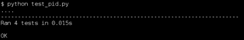
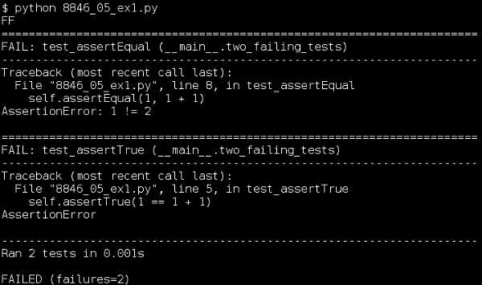
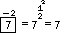
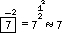
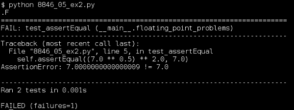
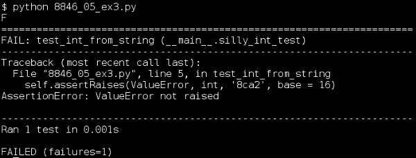

# 第五章。当 Doctest 不够用时：unittest 来拯救

*随着测试变得更加详细（或复杂），或者它们需要更多的设置代码来为它们做准备时，doctest 开始变得有点烦人。正是这种简单性使其成为编写可测试规范和其他简单测试的最佳方式，但它开始干扰编写复杂事物的测试。*

在本章中，我们将：

+   学习如何在 unittest 框架中编写和执行测试

+   学习如何使用 unittest 表达熟悉的测试概念

+   讨论使 unittest 适合更复杂测试场景的具体特性

+   了解几个与 unittest 很好地集成的 Mocker 特性

那我们就开始吧！

# 基本 unittest

在我们开始讨论新的概念和特性之前，让我们看看如何使用 unittest 来表达我们已经学过的想法。这样，我们就能有一个坚实的基础来巩固我们的新理解。

# 行动时间 – 使用 unittest 测试 PID

我们将重新审视第三章中的 PID 类（或者至少是 PID 类的测试）。我们将重写测试，以便它们在 unittest 框架内运行。

在继续之前，花点时间回顾一下第三章中`pid.txt`文件的最终版本。我们将使用 unittest 框架实现相同的测试。

1.  在与`pid.py`相同的目录下创建一个名为`test_pid.py`的新文件。请注意，这是一个`.py`文件：unittest 测试是纯 Python 源代码，而不是包含源代码的纯文本。这意味着测试在文档方面可能不太有用，但会带来其他好处。

1.  将以下代码插入你新创建的`test_pid.py`文件中（请注意，有几行足够长，可能会在书的页面上换行）：

    ```py
    from unittest import TestCase, main
    from mocker import Mocker

    import pid

    class test_pid_constructor(TestCase):
        def test_without_when(self):
            mocker = Mocker()
            mock_time = mocker.replace('time.time')
            mock_time()
            mocker.result(1.0)

            mocker.replay()

            controller = pid.PID(P=0.5, I=0.5, D=0.5,
                                 setpoint=0, initial=12)

            mocker.restore()
            mocker.verify()

            self.assertEqual(controller.gains, (0.5, 0.5, 0.5))
            self.assertAlmostEqual(controller.setpoint[0], 0.0)
            self.assertEqual(len(controller.setpoint), 1)
            self.assertAlmostEqual(controller.previous_time, 1.0)
            self.assertAlmostEqual(controller.previous_error, -12.0)
            self.assertAlmostEqual(controller.integrated_error, 0)

        def test_with_when(self):
            controller = pid.PID(P=0.5, I=0.5, D=0.5,
                                 setpoint=1, initial=12,
                                 when=43)

            self.assertEqual(controller.gains, (0.5, 0.5, 0.5))
            self.assertAlmostEqual(controller.setpoint[0], 1.0)
            self.assertEqual(len(controller.setpoint), 1)
            self.assertAlmostEqual(controller.previous_time, 43.0)
            self.assertAlmostEqual(controller.previous_error, -11.0)
            self.assertAlmostEqual(controller.integrated_error, 0)

    class test_calculate_response(TestCase):
        def test_without_when(self):
            mocker = Mocker()
            mock_time = mocker.replace('time.time')
            mock_time()
            mocker.result(1.0)
            mock_time()
            mocker.result(2.0)
            mock_time()
            mocker.result(3.0)
            mock_time()
            mocker.result(4.0)
            mock_time()
            mocker.result(5.0)

            mocker.replay()

            controller = pid.PID(P=0.5, I=0.5, D=0.5,
                                 setpoint=0, initial=12)

            self.assertEqual(controller.calculate_response(6), -3)
            self.assertEqual(controller.calculate_response(3), -4.5)
            self.assertEqual(controller.calculate_response(-1.5), -0.75)
            self.assertEqual(controller.calculate_response(-2.25), -1.125)

            mocker.restore()
            mocker.verify()
        def test_with_when(self):
            controller = pid.PID(P=0.5, I=0.5, D=0.5,
                                 setpoint=0, initial=12,
                                 when=1)

            self.assertEqual(controller.calculate_response(6, 2), -3)
            self.assertEqual(controller.calculate_response(3, 3), -4.5)
            self.assertEqual(controller.calculate_response(-1.5, 4), -0.75)
            self.assertEqual(controller.calculate_response(-2.25, 5), -1.125)

    if __name__ == '__main__':
        main()
    ```

1.  通过输入以下命令来运行测试：

    ```py
    $ python test_pid.py

    ```

    

## *刚才发生了什么？*

让我们逐行查看代码部分，看看每个部分的作用。之后，我们将讨论将这些部分组合在一起时的意义。

```py
from unittest import TestCase, main
from mocker import Mocker

import pid

class test_pid_constructor(TestCase):
    def test_without_when(self):
        mocker = Mocker()
        mock_time = mocker.replace('time.time')
        mock_time()
        mocker.result(1.0)

        mocker.replay()

        controller = pid.PID(P=0.5, I=0.5, D=0.5,
                             setpoint=0, initial=12)

        mocker.restore()
        mocker.verify()

        self.assertEqual(controller.gains, (0.5, 0.5, 0.5))
        self.assertAlmostEqual(controller.setpoint[0], 0.0)
        self.assertEqual(len(controller.setpoint), 1)
        self.assertAlmostEqual(controller.previous_time, 1.0)
        self.assertAlmostEqual(controller.previous_error, -12.0)
        self.assertAlmostEqual(controller.integrated_error, 0)
```

在一点设置代码之后，我们有一个测试，当没有提供`when`参数时，PID 控制器能正确工作。Mocker 被用来替换`time.time`，使其总是返回一个可预测的值，然后我们使用几个断言来确认控制器的属性已被初始化为预期的值。

```py
    def test_with_when(self):
        controller = pid.PID(P=0.5, I=0.5, D=0.5,
                             setpoint=1, initial=12,
                             when=43)

        self.assertEqual(controller.gains, (0.5, 0.5, 0.5))
        self.assertAlmostEqual(controller.setpoint[0], 1.0)
        self.assertEqual(len(controller.setpoint), 1)
        self.assertAlmostEqual(controller.previous_time, 43.0)
        self.assertAlmostEqual(controller.previous_error, -11.0)
        self.assertAlmostEqual(controller.integrated_error, 0)
```

这个测试确认当提供`when`参数时，PID 构造函数能正确工作。与之前的测试不同，不需要使用 Mocker，因为测试的结果不应该依赖于任何东西，除了参数值——当前时间是不相关的。

```py
class test_calculate_response(TestCase):
    def test_without_when(self):
        mocker = Mocker()
        mock_time = mocker.replace('time.time')
        mock_time()
        mocker.result(1.0)
        mock_time()
        mocker.result(2.0)
        mock_time()
        mocker.result(3.0)
        mock_time()
        mocker.result(4.0)
        mock_time()
        mocker.result(5.0)

        mocker.replay()

        controller = pid.PID(P=0.5, I=0.5, D=0.5,
                             setpoint=0, initial=12)

        self.assertEqual(controller.calculate_response(6), -3)
        self.assertEqual(controller.calculate_response(3), -4.5)
        self.assertEqual(controller.calculate_response(-1.5), -0.75)
        sel+f.assertEqual(controller.calculate_response(-2.25), -1.125)

        mocker.restore()
        mocker.verify()
```

这个类中的测试描述了`calculate_response`方法预期的行为。这个第一个测试检查当可选的`when`参数未提供时的行为，并模拟`time.time`以使该行为可预测。

```py
    def test_with_when(self):
        controller = pid.PID(P=0.5, I=0.5, D=0.5,
                             setpoint=0, initial=12,
                             when=1)

        self.assertEqual(controller.calculate_response(6, 2), -3)
        self.assertEqual(controller.calculate_response(3, 3), -4.5)
        self.assertEqual(controller.calculate_response(-1.5, 4), -0.75)
        self.assertEqual(controller.calculate_response(-2.25, 5), -1.125)
```

在这个测试中，提供了`when`参数，因此不需要模拟`time.time`。我们只需检查结果是否符合预期。

我们实际执行的测试与 doctest 中编写的测试相同。到目前为止，我们看到的是表达它们的不同方式。

首先要注意的是，测试文件被划分为继承自`unittest.TestCase`的类，每个类包含一个或多个测试方法。每个测试方法的名称都以单词*test*开头，这是 unittest 识别它们为测试的方式。

每个测试方法体现了一个单一单元的单一测试。这为我们提供了一个方便的方式来组织测试，将相关的测试组合到同一个类中，以便更容易找到。

将每个测试放入自己的方法意味着每个测试都在一个独立的命名空间中执行，这使得相对于 doctest 风格的测试，unittest 风格的测试之间相互干扰的可能性降低。这也意味着 unittest 知道你的测试文件中有多少个单元测试，而不是简单地知道有多少个表达式（你可能已经注意到 doctest 将每行`>>>`视为一个单独的测试）。最后，将每个测试放入自己的方法意味着每个测试都有一个名称，这可以是一个非常有价值的特性。

unittest 中的测试不直接关心`TestCase`的 assert 方法调用之外的任何内容。这意味着当我们使用 Mocker 时，除非我们想要使用它们，否则不需要担心从演示表达式返回的模拟对象。这也意味着我们需要记住为想要检查的测试的每个方面编写一个断言。我们将在稍后介绍`TestCase`的各种断言方法。

如果不能执行测试，测试就没有多大用处。目前，我们将通过在 Python 解释器将我们的测试文件作为程序执行时调用`unittest.main`来实现这一点。这是运行 unittest 代码最简单的方法，但当你有很多分散在多个文件中的测试时，这会很麻烦。我们将在下一章学习关于解决这个问题的工具。

### 注意

`if __name__ == '__main__':`可能看起来有些奇怪，但它的意义相当直接。当 Python 加载任何模块时，它会将模块的名称存储在模块内的一个名为`__name__`的变量中（除非模块是传递给解释器的命令行上的模块）。该模块总是将字符串`'__main__'`绑定到其`__name__`变量。因此，`if __name__ == '__main__':`意味着——如果这个模块直接从命令行执行。

## 断言

断言是我们用来告诉 unittest 测试的重要结果的机制。通过使用适当的断言，我们可以告诉 unittest 每个测试期望得到什么。

### assertTrue

当我们调用 `self.assertTrue(expression)` 时，我们正在告诉 unittest，表达式必须为真，测试才能成功。

这是一个非常灵活的断言，因为你可以通过编写适当的布尔表达式来检查几乎所有东西。它也是你最后应该考虑使用的断言之一，因为它没有告诉 unittest 你正在进行的比较类型，这意味着如果测试失败，unittest 不能清楚地告诉你出了什么问题。

为了说明这个问题，考虑以下包含两个保证失败的测试的测试代码：

```py
from unittest import TestCase, main

class two_failing_tests(TestCase):
    def test_assertTrue(self):
        self.assertTrue(1 == 1 + 1)

    def test_assertEqual(self):
        self.assertEqual(1, 1 + 1)

if __name__ == '__main__':
    main()
```

可能看起来这两个测试是可以互换的，因为它们都测试相同的东西。当然，它们都会失败（或者在极不可能的情况下，一个等于两个，它们都会通过），那么为什么偏爱其中一个而不是另一个呢？

看看当我们运行测试时会发生什么（同时注意测试的执行顺序并不与它们编写的顺序相同；测试彼此完全独立，所以这是可以接受的，对吧？）：



你看到区别了吗？`assertTrue` 测试能够正确地确定测试应该失败，但它不知道足够的信息来报告任何关于失败原因的有用信息。另一方面，`assertEqual` 测试首先知道它正在检查两个表达式是否相等，其次它知道如何呈现结果，以便它们最有用：通过评估它比较的每个表达式，并在结果之间放置一个 `!=` 符号。它告诉我们哪些期望失败了，以及相关的表达式评估结果是什么。

### assertFalse

当 `assertTrue` 方法失败时，`assertFalse` 方法将成功，反之亦然。它在产生有用输出方面的限制与 `assertTrue` 相同，并且在能够测试几乎所有条件方面的灵活性也相同。

### assertEqual

如同在 `assertTrue` 讨论中提到的，`assertEqual` 断言检查其两个参数实际上是否相等，如果它们不相等，则报告失败，并附带参数的实际值。

### assertNotEqual

当 `assertEqual` 断言成功时，`assertNotEqual` 断言将失败，反之亦然。当它报告失败时，其输出表明两个表达式的值相等，并提供了这些值。

### assertAlmostEqual

正如我们之前看到的，比较浮点数可能会有麻烦。特别是，检查两个浮点数是否相等是有问题的，因为那些你可能期望相等的东西——在数学上相等的东西——最终可能仍然在最低有效位上有所不同。只有当每个位都相同时，浮点数才相等。

为了解决这个问题，unittest 提供了 `assertAlmostEqual`，它检查两个浮点值几乎相同；它们之间的一小部分差异是可以容忍的。

让我们看看这个问题在实际中的应用。如果你对 7 开平方，然后再平方，结果应该是 `7`。这里有一对测试来检查这个事实：

```py
from unittest import TestCase, main

class floating_point_problems(TestCase):
    def test_assertEqual(self):
        self.assertEqual((7.0 ** 0.5) ** 2.0, 7.0)
    def test_assertAlmostEqual(self):
        self.assertAlmostEqual((7.0 ** 0.5) ** 2.0, 7.0)

if __name__ == '__main__':

    main()
```

`test_assertEqual` 方法检查 ，这在现实中是正确的。然而，在计算机可用的更专业的数字系统中，对 7 开平方后再平方并不完全回到 7，因此这个测试会失败。关于这一点，稍后会有更多说明。

测试 `test_assertAlmostEqual` 方法检查 ，即使是计算机也会同意这是正确的，因此这个测试应该通过。

运行这些测试会产生以下结果，尽管你得到的数字可能因测试运行的计算机的具体细节而异：



不幸的是，浮点数并不精确，因为实数线上的大多数数字不能用有限的非重复数字序列来表示，更不用说只有 64 位了。因此，从评估数学表达式得到的并不完全是 `7`。虽然对于政府工作或几乎所有其他类型的工作来说已经足够接近，但我们不希望我们的测试对那个微小的差异斤斤计较。正因为如此，当我们比较浮点数是否相等时，我们应该使用 `assertAlmostEqual` 和 `assertNotAlmostEqual`。

### 注意

这种问题通常不会影响到其他比较运算符。例如，检查一个浮点数是否小于另一个浮点数，由于微小的误差，产生错误结果的可能性非常低。只有在相等的情况下，这个问题才会困扰我们。

### assertNotAlmostEqual

`assertNotAlmostEqual` 断言在 `assertAlmostEqual` 断言成功时失败，反之亦然。当它报告失败时，其输出表明两个表达式的值几乎相等，并提供了这些值。

### assertRaises

总是，我们需要确保我们的单元能够正确地报告错误。当它们接收到良好输入时做正确的事情只是工作的一半；它们还需要在接收到不良输入时做合理的事情。

`assertRaises` 方法检查一个可调用对象（可调用对象是一个函数、一个方法或一个类。可调用对象也可以是任何具有 `__call__` 方法的任意类型的对象）在传递指定的参数集时是否会引发指定的异常。

这个断言只适用于可调用对象，这意味着你没有方法来检查其他类型的表达式是否会引发预期的异常。如果这不符合你的测试需求，你可以使用下面描述的 `fail` 方法来构建自己的测试。

要使用 `assertRaises`，首先传递预期的异常，然后传递可调用对象，最后传递在调用可调用对象时应传递的参数。

这里有一个使用`assertRaises`的示例测试。这个测试应该会失败，因为可调用函数不会抛出预期的异常。当你也传递`base = 16`时，`'8ca2'`是`int`的完全可接受的输入。注意，`assertRaises`将接受任意数量的位置参数或关键字参数，并在调用时将它们传递给可调用函数。

```py
from unittest import TestCase, main

class silly_int_test(TestCase):
    def test_int_from_string(self):
        self.assertRaises(ValueError, int, '8ca2', base = 16)

if __name__ == '__main__':
    main()
```

当我们运行这个测试时，它会失败（正如我们所预料的），因为`int`没有抛出我们告诉`assertRaises`期望的异常。



如果抛出了一个异常，但不是你告诉 unittest 期望的异常，unittest 会将其视为一个错误。错误与失败不同。失败意味着你的某个测试检测到了它所测试的单元中的问题。错误意味着测试本身存在问题。

### fail

当所有其他方法都失败时，你可以退回到`fail`。当你的测试代码调用`fail`时，测试就会失败。

这有什么好处？当没有 assert 方法能满足你的需求时，你可以将你的检查编写成这样，如果测试没有通过，就会调用`fail`。这允许你使用 Python 的全部表达能力来描述你的期望检查。

让我们来看一个示例。这次，我们将对一个小于操作进行测试，这不是 assert 方法直接支持的操作之一。使用`fail`，我们仍然可以轻松实现这个测试。

```py
from unittest import TestCase, main

class test_with_fail(TestCase):
    def test_less_than(self):
        if not (2.3 < 5.6):
            self.fail('2.3 is not less than 5.6, but it should be')

if __name__ == '__main__':
    main()
```

这里有几个需要注意的地方：首先，注意`if`语句中的`not`。由于我们希望在测试不应该通过时运行`fail`，但我们习惯于描述测试应该成功的情况，因此编写测试的一个好方法是先写出成功条件，然后用`not`取反。这样我们就可以继续以我们习惯的方式使用 fail。其次，需要注意的是，当你调用`fail`时，可以传递一个消息，这个消息将在 unittest 的失败测试报告中打印出来。如果你选择一个恰当的消息，它可能会非常有帮助。

由于这个测试应该通过，报告中不会包含任何有趣的内容，因此没有屏幕截图显示运行这个测试的预期结果。你可以尝试改变测试并运行它，看看会发生什么。

## 快速问答 - 基本的 unittest 知识

1.  这个 doctest 的 unittest 等价物是什么？

    ```py
    >>> try:
    ...     int('123')
    ... except ValueError:
    ...     pass
    ... else:
    ...     print 'Expected exception was not raised'
    ```

1.  你如何检查两个浮点数是否相等？

1.  你会在什么情况下选择使用`assertTrue`？又或者`fail`？

## 尝试一下英雄 - 转换为 unittest

回顾一下我们在前几章中编写的某些测试，并将它们从 doctests 转换为 unittests。鉴于你已经对 unittest 有所了解，你应该能够将任何测试进行转换。

当你这样做的时候，考虑一下 unittest 和 doctest 对于每个翻译的测试的相对优点。这两个系统有不同的优势，因此对于每种情况都将是更合适的选择。doctest 何时是更好的选择，何时是 unittest？

# 测试夹具

Unittest 具有一个重要且非常有用的功能，这是 doctest 所缺乏的。你可以告诉 unittest 如何为你的单元测试创建一个标准化的环境，以及如何在测试完成后清理该环境。能够创建和销毁一个标准化的测试环境是测试夹具的功能。虽然测试夹具并没有使之前不可能进行的任何测试成为可能，但它们确实可以使测试更短、更少重复。

# 行动时间 - 测试数据库支持的单元

许多程序需要访问数据库以进行操作，这意味着这些程序由许多也访问数据库的单元组成。关键是数据库的目的是存储信息并使其在其他任意位置可访问（换句话说，数据库的存在是为了打破单元的隔离）。（同样的问题也适用于其他信息存储：例如，永久存储中的文件。）

我们如何处理这个问题？毕竟，仅仅不测试与数据库交互的单元并不是解决方案。我们需要创建一个环境，其中数据库连接按常规工作，但所做的任何更改都不会持续。我们可以以几种不同的方式做到这一点，但无论细节如何，我们都需要在每次使用它的测试之前设置特殊的数据库连接，并在每次此类测试之后销毁任何更改。

Unittest 通过提供`TestCase`类的`setUp`和`tearDown`方法来帮助我们做到这一点。这些方法供我们重写，默认版本不执行任何操作。

下面是一些使用数据库的代码（假设它存在于一个名为`employees.py`的文件中），我们将为它编写测试：

### 注意

此代码使用随 Python 一起提供的`sqlite3`数据库。由于`sqlite3`接口与 Python 的 DB-API 2.0 兼容，因此你使用的任何数据库后端都将具有与这里看到类似的接口。

```py
class employees:
    def __init__(self, connection):
        self.connection = connection

    def add_employee(self, first, last, date_of_employment):
        cursor = self.connection.cursor()
        cursor.execute('''insert into employees
                            (first, last, date_of_employment)
                          values
                            (:first, :last, :date_of_employment)''',
                       locals())
        self.connection.commit()

        return cursor.lastrowid

    def find_employees_by_name(self, first, last):
        cursor = self.connection.cursor()
        cursor.execute('''select * from employees
                          where
                            first like :first
                          and
                            last like :last''',
                       locals())

        for row in cursor:
            yield row

    def find_employees_by_date(self, date):
        cursor = self.connection.cursor()
        cursor.execute('''select * from employees
                          where date_of_employment = :date''',
                       locals())

        for row in cursor:
            yield row
```

1.  我们将开始编写测试，通过导入所需的模块并介绍我们的`TestCase`类。

    ```py
    from unittest import TestCase, main
    from sqlite3 import connect, PARSE_DECLTYPES
    from datetime import date
    from employees import employees

    class test_employees(TestCase):
    ```

1.  我们需要一个`setUp`方法来创建我们的测试所依赖的环境。在这种情况下，这意味着创建一个新的数据库连接到仅内存的数据库，并使用所需的表和行填充该数据库。

    ```py
        def setUp(self):
            connection = connect(':memory:',
                                 detect_types=PARSE_DECLTYPES)
            cursor = connection.cursor()

            cursor.execute('''create table employees
                                (first text,
                                 last text,
                                 date_of_employment date)''')

            cursor.execute('''insert into employees
                                (first, last, date_of_employment)
                              values
                                ("Test1", "Employee", :date)''',
                           {'date': date(year = 2003,
                                         month = 7,
                                         day = 12)})

            cursor.execute('''insert into employees
                                (first, last, date_of_employment)
                              values
                                ("Test2", "Employee", :date)''',
                           {'date': date(year = 2001,
                                         month = 3,
                                         day = 18)})

            self.connection = connection
    ```

1.  我们需要一个`tearDown`方法来撤销`setUp`方法所做的任何操作，以便每个测试都可以在一个未受干扰的环境中运行。由于数据库仅在内存中，我们只需关闭连接，它就会消失。`tearDown`在其他场景中可能变得更为复杂。

    ```py
        def tearDown(self):
            self.connection.close()
    ```

1.  最后，我们需要测试本身以及执行测试的代码。

    ```py
        def test_add_employee(self):
            to_test = employees(self.connection)
            to_test.add_employee('Test1', 'Employee', date.today())

            cursor = self.connection.cursor()
            cursor.execute('''select * from employees
                              order by date_of_employment''')

            self.assertEqual(tuple(cursor),
                             (('Test2', 'Employee', date(year=2001,
                                                         month=3,
                                                         day=18)),
                              ('Test1', 'Employee', date(year=2003,
                                                         month=7,
                                                         day=12)),
                              ('Test1', 'Employee', date.today())))

        def test_find_employees_by_name(self):
            to_test = employees(self.connection)

            found = tuple(to_test.find_employees_by_name('Test1', 'Employee'))
            expected = (('Test1', 'Employee', date(year=2003,
                                                   month=7,
                                                   day=12)),)

            self.assertEqual(found, expected)

        def test_find_employee_by_date(self):
            to_test = employees(self.connection)

            target = date(year=2001, month=3, day=18)
            found = tuple(to_test.find_employees_by_date(target))

            expected = (('Test2', 'Employee', target),)

            self.assertEqual(found, expected)

    if __name__ == '__main__':
        main()

    ```

## *刚才发生了什么？*

我们为`TestCase`使用了`setUp`方法以及相应的`tearDown`方法。它们之间确保了测试执行的 环境（这是`setUp`的工作）以及每个测试的环境在测试运行后被清理，这样测试就不会相互干扰（这是`tearDown`的工作）。Unittest 确保在每次测试方法之前运行一次`setUp`，在每次测试方法之后运行一次`tearDown`。

因为测试用例——根据`setUp`和`tearDown`的定义——被包裹在`TestCase`类中的每个测试周围，所以包含太多测试的`TestCase`类的`setUp`和`tearDown`可能会变得非常复杂，并且浪费大量时间处理对某些测试不必要的细节。你可以通过将需要特定环境方面的测试组合在一起，为它们创建自己的`TestCase`类来避免这个问题。为每个`TestCase`提供一个适当的`setUp`和`tearDown`，只处理包含的测试所必需的环境方面。你可以有任意多的`TestCase`类，所以在决定将哪些测试组合在一起时，没有必要在这方面节省。

注意我们使用的`tearDown`方法有多简单。这通常是一个好兆头：当需要撤销的`tearDown`方法中的更改简单到可以描述时，这通常意味着你可以确信能够完美地完成它。由于`tearDown`的任何不完美都可能使测试留下可能改变其他测试行为的散乱数据，因此正确执行它非常重要。在这种情况下，我们所有的更改都局限于数据库中，因此删除数据库就能解决问题。

## 突击测验——测试用例

1.  测试用例的目的是什么？

1.  测试用例是如何创建的？

1.  测试用例能否在没有`setUp`方法的情况下有`tearDown`方法？又或者`setUp`方法在没有`tearDown`方法的情况下呢？

## 来试试英雄般的挑战——文件路径抽象

下面是一个描述文件路径抽象的类定义。你的挑战是编写单元测试（使用 unittest），检查该类的每个方法，确保它们的行为符合预期。你需要使用测试用例来创建和销毁文件系统中的沙盒区域，以便你的测试可以运行。

由于 doctest 不支持测试用例，使用该框架编写这些测试会很烦人。你必须在每次测试之前复制创建环境的代码，并在每次测试之后复制清理代码。通过使用`unittest`，我们可以避免这种重复。

这门课程有几个地方是错误的，或者至少没有像应该的那样正确。看看你是否能在你的测试中捕捉到它们。

```py
from os.path import isfile, isdir, exists, join
from os import makedirs, rmdir, unlink

class path:
    r"""

    Instances of this class represent a file path, and facilitate
    several operations on files and directories.

    Its most surprising feature is that it overloads the division
    operator, so that the result of placing a / operator between two
    paths (or between a path and a string) results in a longer path,
    representing the two operands joined by the system's path
    separator character.

    """

    def __init__(self, target):
        self.target = target

    def exists(self):
        return exists(self.target)

    def isfile(self):
        return isfile(self.target)

    def isdir(self):
        return isdir(self.target)

    def mkdir(self, mode = 493):
        makedirs(self.target, mode)

    def rmdir(self):
        if self.isdir():
            rmdir(self.target)
        else:
            raise ValueError('Path does not represent a directory')

    def delete(self):
        if self.exists():
            unlink(self.target)
        else:
            raise ValueError('Path does not represent a file')

    def open(self, mode = "r"):
        return open(self.target, mode)

    def __div__(self, other):
        if isinstance(other, path):
            return path(join(self.target, other.target))
        return path(join(self.target, other))

    def __repr__(self):
        return '<path %s>' % self.target

```

# 与 Python Mocker 集成

你已经足够熟悉 Mocker，可以看到在文本开头创建模拟上下文以及在结尾调用其`verify`和`restore`方法中的重复性。Mocker 通过在 mocker 模块中提供一个名为`MockerTestCase`的类来简化这一点。`MockerTestCase`的行为就像一个普通的 unittest `TestCase`一样，除了对于每个测试，它会自动创建一个模拟上下文，然后在测试之后验证和恢复它。模拟上下文存储在`self.mocker`中。

以下示例通过使用它来编写一个涉及`time.time`模拟的测试来演示`MockerTestCase`。在测试执行之前，一个模拟上下文被存储在`self.mocker`中。在测试运行之后，上下文会自动验证和恢复。

```py
from unittest import main
from mocker import MockerTestCase
from time import time

class test_mocker_integration(MockerTestCase):
    def test_mocking_context(self):
        mocker = self.mocker
        time_mock = mocker.replace('time.time')
        time_mock()
        mocker.result(1.0)

        mocker.replay()

        self.assertAlmostEqual(time(), 1.0)

if __name__ == '__main__':
    main()
```

上面的测试是一个简单的测试，它检查当前时间是否为`1.0`，如果不是因为我们没有模拟`time.time`，它就不会是。我们不是创建一个新的 Mocker 实例，而是已经有一个名为`self.mocker`的实例可用，所以我们使用它。我们还能够省略对`verify`和`restore`的调用，因为`MockerTestCase`会为我们处理这些。

# 摘要

本章包含了大量关于如何使用 unittest 框架编写测试的信息。

具体来说，我们涵盖了如何使用 unittest 来表达你从 doctest 中已经熟悉的概念，unittest 和 doctest 之间的差异和相似之处，如何使用测试固定装置将你的测试嵌入到一个受控和临时的环境中，以及如何使用 Python Mocker 的`MockerTestCase`来简化 unittest 和 Mocker 的集成。

到目前为止，我们一直是通过直接指示 Python 运行它们来单独或以小批量运行测试。现在我们已经学习了 unittest，我们准备讨论管理和执行大量测试的话题，这是下一章的主题。
