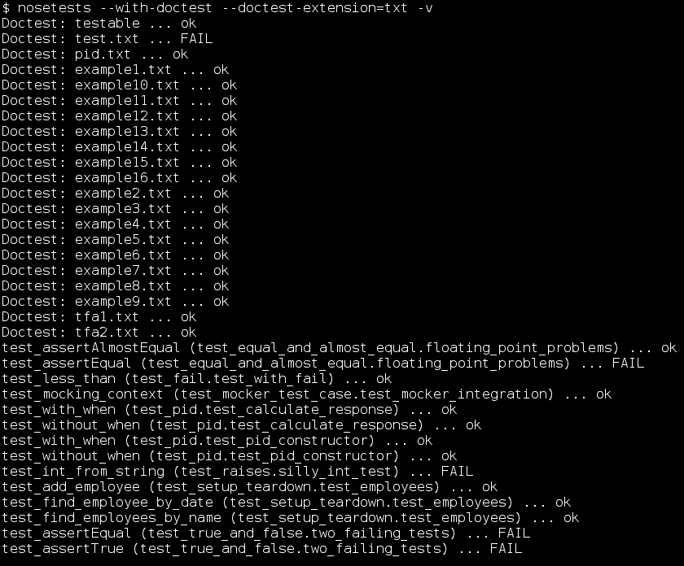

# 第六章：运行您的测试：跟随 Nose

*到目前为止，我们已经讨论了很多关于如何编写测试的内容，但我们还没有详细说明如何运行它们。我们不得不明确告诉 Python 要运行哪些测试，我们要么担心我们使用的 Python 版本（在 doctest 的情况下），要么在每个模块中放置一个`if __name__ == '__main__'`。显然，在运行测试方面还有改进的空间。*

在本章中，我们将：

+   了解一个名为 Nose 的 Python 工具，它可以自动找到并执行测试

+   学习如何让 Nose 找到并执行 doctest 测试

+   学习如何让 Nose 找到并执行 unittest 测试

+   学习如何使用 Nose 的内部测试框架

那么让我们开始吧！

# 什么是 Nose？

Nose 是一个工具，可以一步找到并运行您所有的测试。它可以在多个文件中找到测试，组织它们，运行它们，并在最后向您展示一份漂亮的报告。您不需要在文件中添加任何特殊代码来使测试可运行，也不必担心您正在运行的 Python 版本，除非您的测试使用了语言中最近添加的新特性。Nose 理解 doctest 和 unittest 测试；它甚至为两者添加了一些功能。

# 安装 Nose

在撰写本文时，Nose 的主页是[`code.google.com/p/python-nose/`](http://code.google.com/p/python-nose/)，您可以在[`code.google.com/p/python-nose/downloads/list`](http://code.google.com/p/python-nose/downloads/list)找到可用的下载。请下载最新版本，并将其解压缩到临时目录中。如果您使用的是 Windows，您需要像 7-Zip([`7-zip.org/`](http://7-zip.org/))这样的程序来解压缩文件；Linux 和 Mac 用户不需要任何特殊软件。

解压缩 Nose 后，我们需要安装它。在安装 Mocker 时需要考虑的所有事情在这里同样适用：如果您安装了 Python，您只需切换到 Nose 目录并输入：

```py
$ python setup.py install

```

如果您没有安装 Python，但正在使用 2.6 或更高版本，您可以输入以下命令：

```py
$ python setup.py install --user 

```

### 注意

如果您选择`--user`安装，您可能需要将一个目录添加到操作系统的搜索路径中。如果您在安装后无法运行`nosetests`程序，您就会知道需要这样做。在 Linux 或 Mac 上，您需要添加的目录是`~/.local/bin`，而在 Windows 上则是`%APPDATA%\Python\Scripts`。另外，在 Windows 上，您可能需要在`%APPDATA%\Python\Scripts`目录中创建一个名为`nosetests.bat`的文件，其中包含以下行：`@python %APPDATA%\Python\Scripts\nosetests.`。

有时，一个名为`easy_install`的工具可以简化 Python 模块和包的安装过程。如果您想尝试一下，请从[`pypi.python.org/pypi/setuptools`](http://pypi.python.org/pypi/setuptools)下载并安装 setuptools，然后运行命令 easy_install nose。一旦执行了这个命令，您就应该可以使用 Nose 了。

安装后，您应该能够在命令行中键入其名称来运行`nosetests`。如果您在空目录中运行它，您应该看到类似以下输出：


# 组织测试

好的，我们已经安装了 Nose，那么它有什么好处呢？Nose 会遍历目录结构，找到测试文件，整理出它们包含的测试，运行测试，并将结果反馈给您。这节省了您每次运行测试时（您应该经常这样做）需要做的很多工作。

Nose 根据文件名识别测试文件。任何文件名包含`test`或`Test`，无论是位于开头还是跟在任意字符`_`、`.`或`–`（通常称为下划线、点或破折号）之后，都被识别为包含 unittest `TestCase`s（或 Nose 自己的测试函数，我们稍后会讨论）的文件，应该执行。任何名称符合相同模式的目录都被识别为可能包含测试的目录，因此应该搜索测试文件。Nose 还可以找到并执行 doctest 测试，无论是嵌入在 docstrings 中还是单独编写在测试文件中。默认情况下，它不会寻找 doctest 测试，除非我们告诉它。我们很快就会看到如何更改默认设置。

由于 Nose 非常愿意寻找我们的测试，我们在组织测试方面有很大的自由度。通常，将所有测试分离到它们自己的目录中，或者对于更大的项目，分离到整个目录树中，都是一个很好的主意。大型项目可能最终会有数千个测试，因此为了便于导航而组织它们是一个很大的好处。如果 doctests 被用作文档以及测试，那么将它们存储在另一个单独的目录中，并使用一个传达它们是文档的名称，可能是一个好主意。对于中等规模的项目，建议的结构可能如下所示：


该结构仅作为一个建议（这是为了您的利益，而不是为了 Nose）。如果不同的结构能让您更容易操作，请随意使用。

# 行动时间 - 组织前几章的测试

我们将从前几章的测试中提取出来，将它们全部组织成一个目录树。然后我们将使用 Nose 来运行它们。

1.  创建一个目录来存放我们的代码和测试；您可以为它选择任何名称，但在这里我将称它为`project`。

1.  将`pid.py`、`operations.py`和`testable.py`放入`project`目录中。当我们运行`nosetests`在`project`目录下时，存储在`project`中的模块（和包）将可供所有测试访问，无论测试存储在目录树中的哪个位置。

1.  创建一个名为`test_chapter2`的子目录，并将第二章的`test.txt`和`test.py`文件放入其中。

1.  创建一个名为`test_chapter3`的子目录，并将第三章的最终`pid.txt`文件放入其中。

1.  创建一个名为`test_chapter4`的子目录，并将第四章示例（如果你有）和*执行动作*部分中的代码放入其中。

1.  创建一个名为`test_chapter5`的子目录，并将第五章示例（如果你有）和*执行动作*部分中的代码放入其中。因为第五章使用了 unittest 测试，我们还需要重命名每个文件，以便 Nose 能识别它们为测试文件。文件的好名字可以是：

    ```py
    test_equal_and_almost_equal.py,  test_fail.py,  test_mocker_test_case.py,  test_pid.py,  test_raises.py,  test_setup_teardown.py,  test_true_and_false.py.

    ```

1.  现在你已经将所有测试整理并组织好了，让我们来运行它们。为此，切换到`project`目录并输入以下命令：

    ```py
    $ nosetests --with-doctest --doctest-extension=txt -v

    ```

    ### 注意

    如果你不想使用`-v`选项，也可以。它只是告诉 Nose 提供更详细的操作报告。

1.  所有测试都应该运行。我们预计会看到一些失败，因为一些来自前几章的测试是为了说明目的而故意设计的。不过，有一个失败需要我们考虑：

1.  错误报告的第一部分可以安全忽略：它只是意味着整个 doctest 文件被 Nose 当作一个失败的测试处理。有用的信息在报告的第二部分。它告诉我们，我们期望得到一个 1.0 的先前时间，但我们得到的是一个非常大的数字（当你自己运行测试时，这个数字会不同，并且更大，因为它实际上代表了几十年前的某个时间点以来的秒数）。发生了什么？我们没有为那个测试替换`time.time`吗？让我们看看`pid.txt`的相关部分：

    ```py
    >>> import time
    >>> real_time = time.time
    >>> time.time = (float(x) for x in xrange(1, 1000)).next
    >>> import pid
    >>> controller = pid.PID(P = 0.5, I = 0.5, D = 0.5, setpoint = 0,
    ...                      initial = 12)
    >>> controller.gains
    (0.5, 0.5, 0.5)
    >>> controller.setpoint
    [0.0]
    >>> controller.previous_time
    1.0
    ```

1.  我们模拟了`time.time`，但我们使用的是临时方法，而不是通过 Mocker 的`replace`方法。这意味着在测试文件执行之前导入的模块，如果使用了`from time import time`，将会导入真实的`time`函数，而不知道我们的模拟。那么，`pid.py`是在`pid.txt`导入之前被其他东西导入的吗？实际上，是的：Nose 在扫描要执行的测试时将其导入。如果我们使用 Nose，我们不能指望我们的导入语句是导入任何给定模块的第一个。不过，我们可以通过使用 Mocker 轻松解决这个问题（注意，我们在这里只查看文件中的第一个测试。还有一个测试也需要以同样的方式修复）：

    ```py
    >>> from mocker import Mocker
    >>> mocker = Mocker()
    >>> mock_time = mocker.replace('time.time')
    >>> t = mock_time()
    >>> mocker.result(1.0)
    >>> mocker.replay()
    >>> import pid
    >>> controller = pid.PID(P = 0.5, I = 0.5, D = 0.5, setpoint = 0,
    ...                      initial = 12)
    >>> controller.gains
    (0.5, 0.5, 0.5)
    >>> controller.setpoint
    [0.0]
    >>> controller.previous_time
    1.0
    >>> controller.previous_error
    -12.0
    >>> controller.integrated_error
    0.0
    >>> mocker.restore()
    >>> mocker.verify()
    ```

1.  现在我们再次使用 nosetests 运行测试时，唯一的失败是预期的。这是 Nose 打印的概述，因为我们传递了`-v`命令行选项：

## *发生了什么？*

我们使用一条命令运行了所有这些测试。相当不错，对吧？我们现在正达到测试变得广泛有用的地步。

多亏了 Nose，我们不需要在每个 unittest 文件末尾的愚蠢的`if __name__ == '__main__'`块，也不需要记住任何神秘的命令来执行 doctest 文件。我们可以将我们的测试存储在单独且井然有序的目录结构中，并通过一个简单、快速、单一的命令运行它们。我们还可以通过传递包含我们想要运行的测试的文件名、模块名或目录作为命令行参数，轻松地运行测试的子集。

我们还看到了隐藏的假设如何破坏测试，就像它们可以破坏被测试的代码一样。到目前为止，我们一直假设当我们的测试导入一个模块时，这是模块第一次被导入。一些测试依赖于这个假设来用模拟对象替换库对象。现在我们正在处理运行许多聚合在一起的测试，没有保证执行顺序的情况，这个假设并不可靠。更不用说，我们遇到麻烦的模块实际上必须被导入以在运行任何测试之前搜索它。那会是一个问题，但我们已经有一个工具可以替换库对象，无论导入顺序如何。只需快速切换受影响的测试使用 Mocker，我们就可以继续前进。

## 查找 doctests

我们在上一节中使用的`nosetests`命令相当容易理解，但每次输入时仍然有点长。而不是：

```py
$ nosetests --with-doctest --doctest-extension=txt -v

```

我们真的很希望能够直接输入：

```py
$ nosetests -v

```

或者甚至：

```py
$ nosetests

```

为了执行我们的测试，并且仍然能够找到并执行所有的 doctests。

幸运的是，告诉 Nose 我们想要它为那些命令行开关的值使用不同的默认值是一件简单的事情。为此，只需在你的主目录中创建一个名为`nose.cfg`或`.noserc`（任一名称都行）的配置文件，并在其中放置以下内容：

```py
[nosetests]
with-doctest=1
doctest-extension=txt
```

从现在开始，每次你运行`nosetests`，它都会假设那些选项，除非你告诉它否则。你不再需要在命令行上输入它们。你可以为 Nose 可以接受的所有命令行选项使用同样的技巧。

### 注意

如果你是一个 Windows 用户，你可能不确定在这个上下文中短语“主目录”指的是什么。就 Python 而言，你的主目录由你的环境变量定义。如果`HOME`被定义，那就是你的主目录。否则，如果`USERPROFILE`被定义（通常是这样，指向`C:\Documents and Settings\USERNAME`），那么那被认为是你的主目录。否则，由`HOMEDRIVE`和`HOMEPATH`（通常是`C:\`）描述的目录是你的主目录。

## 自定义 Nose 的搜索

我们之前说过，Nose 会在以`test`或`Test`开头的目录和模块中查找测试，或者包含一个`'_'`、`'.'`、`'-'`后跟`test`或`Test`的字符。这是默认设置，但并不是全部故事。

如果你了解正则表达式，你可以自定义 Nose 用来查找测试的模板。你可以通过传递`--include=REGEX`命令行选项或在你的`nose.cfg`或`.noserc`文件中放入`include=REGEX`来实现这一点。

例如，如果你这样做：

```py
nosetests --include="(?:^[Dd]oc)"

```

除了上述描述的查找名称外，Nose 还会查找以`doc`或`Doc`开头的名称。这意味着你可以将包含你的 doctest 文件的目录命名为`docs`、`Documentation`、`doctests`等，Nose 仍然会找到它并运行测试。如果你经常使用此选项，你几乎肯定希望将其添加到你的配置文件中，如前一个标题下所述。

### 注意

正则表达式的完整语法和使用是一个主题本身，并且已经成为了许多书籍的主题。然而，你可以在 Python 文档中找到你需要的一切，以在[`docs.python.org/library/re.html`](http://docs.python.org/library/re.html)中做这类事情。

## 快速问答——使用 Nose 进行测试

1.  通过运行`nosetests --processes=4`，Nose 可以启动四个测试进程，如果你在一个四核系统上运行测试，这将提供很大的性能提升。你将如何让 Nose 始终启动四个测试进程，而无需在命令行中指定？

1.  如果一些测试存储在一个名为`specs`的目录中，你将如何告诉 Nose 它应该在该目录中搜索测试？

1.  以下哪个默认情况下会被 Nose 识别为可能包含测试的：`UnitTests`、`unit_tests`、`TestFiles`、`test_files`、`doctests`？

## 尝试一下英雄——Nose 探索

为以下规范编写一些`doctest`和`unittest`测试，并创建一个目录树来包含它们以及它们描述的代码。使用测试驱动的方法编写代码，并使用 Nose 运行测试。

```py
The graph module contains two classes: Node and Arc. An Arc is a connection between two Nodes. Each Node is an intersection of an arbitrary number of Arcs.

Arc objects contain references to the Node objects that the Arc connects, a textual identification label, and a "cost" or "weight", which is a real number.

Node objects contain references to all of the connected Arcs, and a textual identification label.

Node objects have a find_cycle(self, length) method which returns a list of Arcs making up the lowest cost complete path from the Node back to itself, if such a path exists with a length greater than 2 Arcs and less than or equal to the length parameter.

Node and Arc objects have a __repr__(self) method which returns a representation involving the identification labels assigned to the objects.
```

# Nose 和 doctest

不只是支持 doctest，它实际上增强了它。当你使用 Nose 时，你可以为你的 doctest 文件编写测试固定值。

如果你通过命令行传递`--doctest-fixtures=_fixture`，Nose 将在找到 doctest 文件时寻找一个固定值文件。固定值文件的名字基于 doctest 文件的名字，通过在 doctest 文件名的主要部分后添加 doctest 固定值后缀（换句话说，`doctest-fixtures`的值）并添加`.py`到末尾来计算。例如，如果 Nose 找到一个名为`pid.txt`的 doctest 文件，并且被告知`doctest-fixtures=_fixture`，它将尝试在一个名为`pid_fixture.py`的文件中找到测试固定值。

doctest 的测试固定值文件非常简单：它只是一个包含`setup()`或`setUp()`函数和`teardown()`或`tearDown()`函数的 Python 模块。设置函数在 doctest 文件之前执行，而清理函数在之后执行。

装置在 doctest 文件的不同命名空间中运行，因此固定装置模块中定义的任何变量在实际测试中都是不可见的。如果你想在装置和测试之间共享变量，你可能需要创建一个简单的模块来保存这些变量，你可以将其导入到装置和测试中。

在 doctest 装置中进行的模拟替换工作得很好。只要你在设置期间不调用`restore()`（你为什么要做这样愚蠢的事情？），那么当测试使用替换的对象时，它们仍然会保留。

# 行动时间 – 为 doctest 创建固定装置

我们将在测试装置中提供一个模拟的`time.time()`并在我们的 doctest 中使用它。

1.  创建一个名为`times.txt`的文件，包含以下 doctest 代码：

    ```py
    >>> from time import time

    This isn't a reasonable test for any purpose, but it serves to
    illustrate a test that can't work without a mock object in place.

    >>> '%0.1f' % time()
    '1.0'
    >>> '%0.1f' % time()
    '1.1'
    >>> '%0.1f' % time()
    '1.2'
    ```

1.  使用 Nose 运行 doctest 文件，以下屏幕会显示：

1.  除非你的计算机时钟恰好重置到纪元的开始，否则 doctest 会失败。如果我们想这些测试能够可靠地通过，我们需要一个模拟来替换`time.time()`。创建一个名为`times_fixture.py`的文件，并插入以下 Python 代码：

    ```py
    from mocker import Mocker

    mocker = Mocker()

    def setup():
        fake_time = mocker.replace('time.time')

        fake_time()
        mocker.result(1.0)
        fake_time()
        mocker.result(1.1)
        fake_time()
        mocker.result(1.2)

        mocker.replay()

    def teardown():
        mocker.restore()
        mocker.verify()
    ```

1.  现在我们运行 Nose 并告诉它如何找到 doctest 固定装置，doctest 通过，因为它使用了我们在装置中设置的模拟：

1.  如果你经常使用这个功能，将`doctest-fixtures=_fixture`添加到你的 Nose 配置文件中是有意义的。

# Nose 和 unittest

Nose 通过在包和模块级别提供测试装置来增强 unittest。包设置函数在包中任何模块的任何测试之前运行，而清理函数在包中所有模块的所有测试完成后运行。同样，模块设置在给定模块的任何测试执行之前运行，模块清理在模块中所有测试执行之后执行。

# 行动时间 – 创建模块固定装置

我们将使用模块级别的固定装置来构建一个测试模块。在这个装置中，我们将替换`datetime.date.today`函数，它通常返回一个表示当前日期的对象。我们希望它返回一个特定的值，这样我们的测试就可以知道期望什么。

1.  创建一个名为`tests`的目录。在这个*行动时间*以及下一个中，我们将使用这个目录。

1.  在`tests`目录中，创建一个名为`module_fixture_tests.py`的文件，包含以下代码：

    ```py
    from unittest import TestCase
    from mocker import Mocker
    from datetime import date

    mocker = Mocker()

    def setup():
        fake_date = mocker.replace(date)

        fake_date.today()
        mocker.result(date(year = 2009, month = 6, day = 12))
        mocker.count(1, None)

        mocker.replay()

    def teardown():
        mocker.restore()
        mocker.verify()

    class first_tests(TestCase):
        def test_year(self):
            self.assertEqual(date.today().year, 2009)

        def test_month(self):
            self.assertEqual(date.today().month, 6)

        def test_day(self):
            self.assertEqual(date.today().day, 12)

    class second_tests(TestCase):
        def test_isoformat(self):
            self.assertEqual(date.today().isoformat(), '2009-06-12')
    ```

1.  注意，在这个模块中有两个`TestCase`类。使用纯 unittest，我们不得不在每个类中复制固定装置代码。

1.  前往包含`tests`目录的目录，并输入以下命令来运行测试：

    ```py
    $ nosetests

    ```

1.  Nose 会将测试识别为可能包含测试的目录（因为目录名），找到`module_fixtures_tests.py`文件，运行`setup`函数，运行所有测试，然后运行`teardown`函数。不过，除了一个简单的测试通过报告外，你不会看到太多内容。

## *刚才发生了什么？*

通过使用一个额外的“层”测试固定件，我们将整个测试模块而不是单个测试方法封装起来，从而节省了一些时间和精力。通过这样做，我们避免了在每个测试类中重复固定件代码，但这种节省是有代价的。与正常的测试固定件不同，设置和清理不是在每个测试前后运行。相反，模块中的所有测试都在单个模块级设置/清理对之间发生，这意味着如果测试执行了影响设置函数创建的环境的操作，它不会在下一个测试运行之前被撤销。换句话说，测试的环境隔离性不能保证。

现在，我们将通过包括包级测试固定件来扩展之前的*行动时间*。与模块级测试固定件一样，这也是 Nose 的一个节省劳动力的特性。

# 行动时间 – 创建包固定件

现在我们将创建一个封装整个包中所有测试模块的测试固定件。

1.  在上一节*行动时间*中创建的`tests`目录中添加一个名为`__init__.py`的新文件。（这是两个下划线，单词'init'，还有两个下划线）。此文件的存在告诉 Python 该目录是一个包。将以下代码放置在`tests`目录下的`__init__.py`文件中：

    ```py
    from mocker import Mocker
    from datetime import datetime

    mocker = Mocker()

    def setup():
        fake_datetime = mocker.replace(datetime)

        fake_datetime.now()
        mocker.result(datetime(year = 2009, month = 6, day = 12,
                               hour = 10, minute = 15, second = 5))
        mocker.count(1, None)

        mocker.replay()

    def teardown():
        mocker.restore()
        mocker.verify()
    ```

    ### 注意

    `__init__.py`文件通常是空的，但它们是放置适用于整个包的通用代码的完美地方，因此 Nose 就在那里寻找包级固定件。

1.  在`tests`目录下添加一个名为`package_fixtures_tests.py`的新文件，其内容如下：

    ```py
    from unittest import TestCase
    from datetime import datetime

    class first_tests(TestCase):
        def test_year(self):
            self.assertEqual(datetime.now().year, 2009)

        def test_month(self):
            self.assertEqual(datetime.now().month, 6)

        def test_day(self):
            self.assertEqual(datetime.now().day, 12)

        def test_hour(self):
            self.assertEqual(datetime.now().hour, 10)

        def test_minute(self):
            self.assertEqual(datetime.now().minute, 15)

        def test_second(self):
            self.assertEqual(datetime.now().second, 5)
    ```

1.  将以下代码添加到已存在的`module_fixtures_tests.py`文件中（我们也可以将其放在自己的文件中。重点是将其放置在与步骤 2 中的测试分开的模块中，以便你能看到包测试固定件已经就位）：

    ```py
    from datetime import datetime
    class third_tests(TestCase):
        def test_isoformat(self):
            self.assertEqual(datetime.now().isoformat(), 
                             '2009-06-12T10:15:05')
    ```

1.  继续再次运行测试。（你不会看到太多输出，但这意味着一切正常）转到包含`tests`的目录，并运行以下命令：

    ```py
    $ nosetests

    ```

## *刚才发生了什么？*

我们与另一个测试固定件层合作，这次是封装了`tests`目录中的所有测试模块。从我们刚刚编写的代码中可以看出，包级测试固定件创建的环境在包中每个模块的每个测试中都是可用的。

与模块级测试固定件一样，包级测试固定件可以是一个节省大量劳动的快捷方式。然而，它们并不提供与真实测试级固定件相同的保护，以防止测试之间的通信。

# Nose 的自身测试框架

Nose 支持两种新的测试类型：独立的测试函数和非 TestCase 测试类。它通过使用与查找测试模块相同的模式匹配来找到这些测试。当遍历一个名称与模式匹配的模块时，任何名称也匹配该模式的函数或类都被假定是测试。

# 行动时间 - 使用 Nose 特定的测试

我们将编写一些测试来展示 Nose 对测试函数和非 TestCase 测试类的支持。

1.  创建一个名为`nose_specific_tests.py`的文件，并包含以下内容：

    ```py
    import sys
    from sqlite3 import connect

    class grouped_tests:
        def setup(self):
            self.connection = connect(':memory:')
            cursor = self.connection.cursor()
            cursor.execute('create table test (a, b, c)')
            cursor.execute('''insert into test (a, b, c) 
                              values (1, 2, 3)''')
            self.connection.commit()

        def teardown(self):
            self.connection.close()

        def test_update(self):
            cursor = self.connection.cursor()
            cursor.execute('update test set b = 7 where a = 1')

        def test_select(self):
            cursor = self.connection.cursor()
            cursor.execute('select * from test limit 1')
            assert cursor.fetchone() == (1, 2, 3)
    ```

1.  现在将以下文本添加到同一文件中，在`grouped_tests`类之外：

    ```py
    def platform_setup():
        sys.platform = 'test platform'

    def platform_teardown():
        global sys
        sys = reload(sys)

    def standalone_test():
        assert sys.platform == 'test platform'

    standalone_test.setup = platform_setup
    standalone_test.teardown = platform_teardown
    ```

1.  运行测试，尽管像往常一样，你不想看到除测试执行报告之外的任何输出：

    ```py
    $ nosetests

    ```

## *刚才发生了什么？*

`grouped_tests`类包含一个测试固定装置（`setup`和`teardown`方法）和两个测试，但它不是一个 unittest 的`TestCase`类。Nose 将其识别为测试类，因为其名称遵循 Nose 在检查模块名称以查找测试模块时寻找的相同模式。然后它遍历该类以查找测试固定装置（以及任何测试方法），并适当地运行它们。

由于该类不是`TestCase`，测试无法访问 unittest 的任何`assert`方法；Nose 认为这种测试通过，除非它引发异常。Python 有一个`assert`语句，如果其表达式为假，则会引发异常，这对于这种情况很有帮助。它不如`assertEqual`那样优雅，但在许多情况下可以完成任务。

我们在`standalone_test`函数中编写了另一个测试。像`grouped_tests`一样，`standalone_test`被 Nose 识别为测试，因为其名称与 Nose 用于搜索测试模块的相同模式匹配。Nose 将`standalone_test`作为测试运行，如果它引发异常，则报告失败。

我们能够通过将`standalone_test`的`setup`和`teardown`属性设置为定义的函数对来将其附加到`standalone_test`上。像往常一样，设置函数在测试函数之前执行，而清理函数在测试函数之后执行。

# 摘要

在本章中，我们关于 Nose 测试元框架学到了很多。

具体来说，我们涵盖了：

+   Nose 如何找到包含测试的文件，以及如何将此过程适应到你的组织方案中

+   如何使用 Nose 运行所有测试，无论它们是 doctest、unittest 还是 Nose 特定的测试

+   如何通过额外的测试固定装置支持增强其他框架

+   如何使用 Nose 的测试函数和非 TestCase 测试类

现在我们已经了解了 Nose 和轻松运行所有测试，我们准备着手一个完整的测试驱动型项目——这是下一章的主题。
