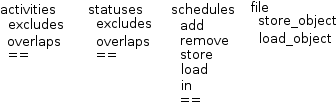
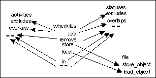
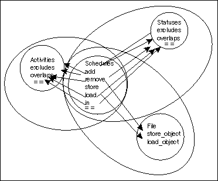
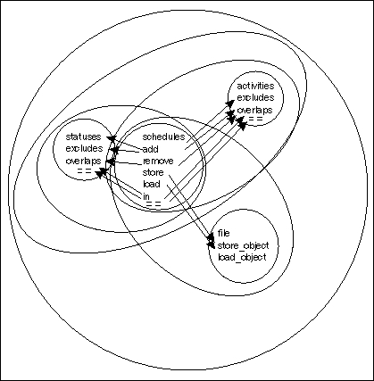

# 第九章。集成测试和系统测试

*到目前为止，我们已经讨论了所有的工具、技术和实践，但我们仍然只是在思考测试单元：代码中最小且具有实际测试意义的部分。现在是时候扩大关注范围，开始测试包含多个单元的代码了。*

在本章中，我们将：

+   描述集成测试和系统测试

+   学习如何将程序分解成可测试的多单元部分

+   使用 doctest、unittest 和 Nose 来自动化多单元测试

那么，让我们开始吧！

# 集成测试和系统测试

集成测试是检查构成您程序的单元是否能够与其他单元正确协作工作，而不是单独工作。在集成测试开始之前启动这个过程并不实际，因为如果单元不工作，集成也不会工作，而且追踪问题的原因会更困难。然而，一旦单元稳固，测试您从中构建的东西是否也工作就是必要的。单元之间的交互可能会令人惊讶。

当您执行集成测试时，您将把单元组合成更大和更大的集合，并测试这些集合。当您的集成测试扩展到覆盖整个程序时，它们就变成了系统测试。

集成测试中最棘手的部分是选择将哪些单元集成到每个测试中，以便您始终有一个可以信赖的稳固代码基础；一个可以立足的地方，在您引入更多代码的同时。

# 行动时间 - 确定集成顺序

我们将通过一个练习来帮助确定集成测试边界的放置过程。

1.  使用一张纸或图形程序，为第七章中的时间规划项目中的每个单元写出名称或表示。将每个类的方法定组。同一类中的单元之间存在明显的关联，我们将利用这一点。（这里的`==`符号代表 Python 的`==`运算符，它在对象上调用`__eq__`方法）。

1.  现在，在应该直接相互交互的单元之间画箭头，从调用者到被调用者。将所有内容有序地排列（就像步骤 1 中那样）实际上可能会使这个过程变得更难，所以请随意移动类以帮助线条有意义。

1.  在每个类和至少通过一条线连接的每一对类周围画圆圈。

1.  通过在重叠的圆圈对周围画圆，继续这个过程，直到只剩下三个圆圈。画出一对圆圈，然后在整个混乱中再画一个更大的圆圈。

1.  这些圆圈告诉我们应该按什么顺序编写我们的集成测试。圆圈越小，测试应该越早编写。

## *刚才发生了什么？*

我们刚才做的是一种可视化和具体化构建集成测试过程的方法。虽然实际上画线和圆圈不是必要的，但在脑海中跟随这个过程是有用的。对于较大的项目，实际绘制图表可以获得很多好处。当你看到图表时，正确的下一步通常会立即显现出来——特别是如果你使用多种颜色来渲染图表——否则它可能隐藏在程序的复杂性背后。

## 快速问答 - 绘制集成图

1.  在这个过程的早期阶段，将单元组合成类有什么意义？

1.  当我们移动类以帮助箭头有意义时，这对后续过程有什么影响？

1.  为什么我们总是在做这个的时候总是将单元组合在一起？

## 尝试自己绘制程序图

拿你自己的程序之一，并为它绘制一个集成图。如果你的程序足够大，以至于图表开始变得笨拙，尝试将图表的不同“级别”放在单独的页面上。

# 使用 doctest、unittest 和 Nose 进行自动化

集成测试和单元测试之间唯一的真正区别在于，在集成测试中，你可以将正在测试的代码分解成更小的、有意义的块。在单元测试中，如果你再细分代码，它就不再有意义了。因此，帮助自动化单元测试的工具也可以应用于集成测试。由于系统测试实际上是集成测试的最高级别，因此这些工具也可以用于此。

doctest 在集成测试中的作用通常相当有限。doctest 的真正优势在于开发过程的早期阶段。一个可测试的规范很容易进入集成测试——如前所述，只要有单元测试，那就没问题——但之后你可能会更喜欢 unittest 和 Nose 来编写你的集成测试。

集成测试需要彼此隔离。尽管它们在自身内部包含多个相互作用的单元，但你仍然受益于知道测试之外没有东西在影响它。因此，unittest 是编写自动化集成测试的好选择。与 unittest、Nose 和 Mocker 一起工作，可以很好地完成这个画面。

# 行动时间 – 为时间规划器编写集成测试

现在我们已经为时间规划器代码绘制了集成图，我们可以继续编写实际的自动化集成测试。

1.  整合图仅提供了集成测试的部分排序，并且有几个测试可能是我们首先编写的。查看图表，我们看到`statuses`和`activities`类位于许多箭头的末端，但不在任何箭头的起始处。这使得它们成为特别好的起点，因为这意味着它们不需要调用自身之外的东西来操作。由于没有东西能区分它们中哪一个比另一个更适合作为起点，我们可以任意选择它们。让我们从`statuses`开始，然后进行`activities`。我们将编写测试来测试整个类。在这个低级别上，集成测试将非常类似于同一类的单元测试，但我们不会使用模拟对象来表示同一类的其他实例：我们将使用真实实例。我们正在测试类是否能够正确地与自身交互。

1.  下面是`statuses`的测试代码：

    ```py
    from unittest import TestCase
    from planner.data import statuses, task_error
    from datetime import datetime

    class statuses_integration_tests(TestCase):
        def setUp(self):
            self.A = statuses('A',
                              datetime(year=2008, month=7, day=15),
                              datetime(year=2009, month=5, day=2))

        def test_repr(self):
            self.assertEqual(repr(self.A), '<A 2008-07-15T00:00:00 2009-05-02T00:00:00>')

        def test_equality(self):
            self.assertEqual(self.A, self.A)
            self.assertNotEqual(self.A, statuses('B',
                              datetime(year=2008, month=7, day=15),
                              datetime(year=2009, month=5, day=2)))
            self.assertNotEqual(self.A, statuses('A',
                              datetime(year=2007, month=7, day=15),
                              datetime(year=2009, month=5, day=2)))
            self.assertNotEqual(self.A, statuses('A',
                              datetime(year=2008, month=7, day=15),
                              datetime(year=2010, month=5, day=2)))

        def test_overlap_begin(self):
            status = statuses('status name',
                              datetime(year=2007, month=8, day=11),
                              datetime(year=2008, month=11, day=27))

            self.assertTrue(status.overlaps(self.A))

        def test_overlap_end(self):
            status = statuses('status name',
                              datetime(year=2008, month=1, day=11),
                              datetime(year=2010, month=4, day=16))

            self.assertTrue(status.overlaps(self.A))

        def test_overlap_inner(self):
            status = statuses('status name',
                              datetime(year=2007, month=10, day=11),
                              datetime(year=2010, month=1, day=27))

            self.assertTrue(status.overlaps(self.A))

        def test_overlap_outer(self):
            status = statuses('status name',
                              datetime(year=2008, month=8, day=12),
                              datetime(year=2008, month=9, day=15))

            self.assertTrue(status.overlaps(self.A))

        def test_overlap_after(self):
            status = statuses('status name',
                              datetime(year=2011, month=2, day=6),
                              datetime(year=2015, month=4, day=27))

            self.assertFalse(status.overlaps(self.A))
    ```

1.  下面是`activities`的测试代码：

    ```py
    from unittest import TestCase
    from planner.data import activities, task_error
    from datetime import datetime

    class activities_integration_tests(TestCase):
        def setUp(self):
            self.A = activities('A',
                              datetime(year=2008, month=7, day=15),
                              datetime(year=2009, month=5, day=2))
        def test_repr(self):
            self.assertEqual(repr(self.A), '<A 2008-07-15T00:00:00 2009-05-02T00:00:00>')

        def test_equality(self):
            self.assertEqual(self.A, self.A)
            self.assertNotEqual(self.A, activities('B',
                              datetime(year=2008, month=7, day=15),
                              datetime(year=2009, month=5, day=2)))
            self.assertNotEqual(self.A, activities('A',
                              datetime(year=2007, month=7, day=15),
                              datetime(year=2009, month=5, day=2)))
            self.assertNotEqual(self.A, activities('A',
                              datetime(year=2008, month=7, day=15),
                              datetime(year=2010, month=5, day=2)))

        def test_overlap_begin(self):
            activity = activities('activity name',
                              datetime(year=2007, month=8, day=11),
                              datetime(year=2008, month=11, day=27))

            self.assertTrue(activity.overlaps(self.A))
            self.assertTrue(activity.excludes(self.A))

        def test_overlap_end(self):
            activity = activities('activity name',
                              datetime(year=2008, month=1, day=11),
                              datetime(year=2010, month=4, day=16))

            self.assertTrue(activity.overlaps(self.A))
            self.assertTrue(activity.excludes(self.A))

        def test_overlap_inner(self):
            activity = activities('activity name',
                              datetime(year=2007, month=10, day=11),
                              datetime(year=2010, month=1, day=27))

            self.assertTrue(activity.overlaps(self.A))
            self.assertTrue(activity.excludes(self.A))

        def test_overlap_outer(self):
            activity = activities('activity name',
                              datetime(year=2008, month=8, day=12),
                              datetime(year=2008, month=9, day=15))

            self.assertTrue(activity.overlaps(self.A))
            self.assertTrue(activity.excludes(self.A))

        def test_overlap_after(self):
            activity = activities('activity name',
                              datetime(year=2011, month=2, day=6),
                              datetime(year=2015, month=4, day=27))

            self.assertFalse(activity.overlaps(self.A))
    ```

1.  查看我们的图表，我们可以看到从`statuses`或`activities`延伸出的下一级代表了这些类与`schedules`类的集成。在我们编写集成之前，我们应该编写任何涉及`schedules`类与自身交互的测试，而不使用模拟。

    ```py
    from unittest import TestCase
    from mocker import MockerTestCase, MATCH, ANY
    from planner.data import schedules, schedule_error
    from datetime import datetime

    class schedules_tests(MockerTestCase):
        def setUp(self):
            mocker = self.mocker

            A = mocker.mock()
            A.__eq__(MATCH(lambda x: x is A))
            mocker.result(True)
            mocker.count(0, None)
            A.__eq__(MATCH(lambda x: x is not A))
            mocker.result(False)
            mocker.count(0, None)
            A.overlaps(ANY)
            mocker.result(False)
            mocker.count(0, None)
            A.begins
            mocker.result(5)
            mocker.count(0, None)

            B = mocker.mock()
            A.__eq__(MATCH(lambda x: x is B))
            mocker.result(True)
            mocker.count(0, None)
            B.__eq__(MATCH(lambda x: x is not B))
            mocker.result(False)
            mocker.count(0, None)
            B.overlaps(ANY)
            mocker.result(False)
            mocker.count(0, None)
            B.begins
            mocker.result(3)
            mocker.count(0, None)

            C = mocker.mock()
            C.__eq__(MATCH(lambda x: x is C))
            mocker.result(True)
            mocker.count(0, None)
            C.__eq__(MATCH(lambda x: x is not C))
            mocker.result(False)
            mocker.count(0, None)
            C.overlaps(ANY)
            mocker.result(False)
            mocker.count(0, None)
            C.begins
            mocker.result(7)
            mocker.count(0, None)

            self.A = A
            self.B = B
            self.C = C

            mocker.replay()

        def test_equality(self):
            sched1 = schedules()
            sched2 = schedules()

            self.assertEqual(sched1, sched2)

            sched1.add(self.A)
            sched1.add(self.B)

            sched2.add(self.A)
            sched2.add(self.B)
            sched2.add(self.C)

            self.assertNotEqual(sched1, sched2)

            sched1.add(self.C)

            self.assertEqual(sched1, sched2)
    ```

1.  现在，`schedules`类内部的交互已经测试过了，我们可以编写将`schedules`与`statuses`或`activities`之一集成的测试。让我们从`statuses`开始，然后进行`activities`。以下是`schedules`和`statuses`的测试：

    ```py
    from planner.data import schedules, statuses
    from unittest import TestCase
    from datetime import datetime, timedelta

    class test_schedules_and_statuses(TestCase):
        def setUp(self):
            self.A = statuses('A',
                             datetime.now(),
                             datetime.now() + timedelta(minutes = 7))
            self.B = statuses('B',
                             datetime.now() - timedelta(hours = 1),
                             datetime.now() + timedelta(hours = 1))
            self.C = statuses('C',
                             datetime.now() + timedelta(minutes = 10),
                             datetime.now() + timedelta(hours = 1))

        def test_usage_pattern(self):
            sched = schedules()

            sched.add(self.A)
            sched.add(self.C)

            self.assertTrue(self.A in sched)
            self.assertTrue(self.C in sched)
            self.assertFalse(self.B in sched)

            sched.add(self.B)

            self.assertTrue(self.B in sched)

            self.assertEqual(sched, sched)

            sched.remove(self.A)

            self.assertFalse(self.A in sched)
            self.assertTrue(self.B in sched)
            self.assertTrue(self.C in sched)

            sched.remove(self.B)
            sched.remove(self.C)

            self.assertFalse(self.B in sched)
            self.assertFalse(self.C in sched)
    ```

1.  下面是`schedules`和`activities`的测试：

    ```py
    from planner.data import schedules, activities, schedule_error
    from unittest import TestCase
    from datetime import datetime, timedelta

    class test_schedules_and_activities(TestCase):
        def setUp(self):
            self.A = activities('A',
                              datetime.now(),
                              datetime.now() + timedelta(minutes = 7))
            self.B = activities('B',
                              datetime.now() - timedelta(hours = 1),
                              datetime.now() + timedelta(hours = 1))
            self.C = activities('C',
                              datetime.now() + timedelta(minutes = 10),
                              datetime.now() + timedelta(hours = 1))

        def test_usage_pattern(self):
            sched = schedules()

            sched.add(self.A)
            sched.add(self.C)

            self.assertTrue(self.A in sched)
            self.assertTrue(self.C in sched)
            self.assertFalse(self.B in sched)

            self.assertRaises(schedule_error, sched.add, self.B)

            self.assertFalse(self.B in sched)
            self.assertEqual(sched, sched)

            sched.remove(self.A)

            self.assertFalse(self.A in sched)
            self.assertFalse(self.B in sched)
            self.assertTrue(self.C in sched)

            sched.remove(self.C)

            self.assertFalse(self.B in sched)
            self.assertFalse(self.C in sched)
    ```

1.  现在是时候将`schedules`、`statuses`和`activities`全部整合到同一测试中。

    ```py
    from planner.data import schedules, statuses, activities, schedule_error
    from unittest import TestCase
    from datetime import datetime, timedelta

    class test_schedules_activities_and_statuses(TestCase):
        def setUp(self):
            self.A = statuses('A',
                              datetime.now(),
                              datetime.now() + timedelta(minutes = 7))
            self.B = statuses('B',
                              datetime.now() - timedelta(hours = 1),
                              datetime.now() + timedelta(hours = 1))
            self.C = statuses('C',
                             datetime.now() + timedelta(minutes = 10),
                             datetime.now() + timedelta(hours = 1))

            self.D = activities('D',
                              datetime.now(),
                              datetime.now() + timedelta(minutes = 7))

            self.E = activities('E',
                              datetime.now() + timedelta(minutes=30),
                              datetime.now() + timedelta(hours=1))

            self.F = activities('F',
                              datetime.now() - timedelta(minutes=20),
                              datetime.now() + timedelta(minutes=40))

        def test_usage_pattern(self):
            sched = schedules()

            sched.add(self.A)
            sched.add(self.B)
            sched.add(self.C)

            sched.add(self.D)

            self.assertTrue(self.A in sched)
            self.assertTrue(self.B in sched)
            self.assertTrue(self.C in sched)
            self.assertTrue(self.D in sched)

            self.assertRaises(schedule_error, sched.add, self.F)
            self.assertFalse(self.F in sched)

            sched.add(self.E)
            sched.remove(self.D)

            self.assertTrue(self.E in sched)
            self.assertFalse(self.D in sched)

            self.assertRaises(schedule_error, sched.add, self.F)

            self.assertFalse(self.F in sched)

            sched.remove(self.E)

            self.assertFalse(self.E in sched)

            sched.add(self.F)

            self.assertTrue(self.F in sched)
    ```

1.  下一步需要整合的是`file`类，但在将其与其他系统整合之前，我们需要将其与自身整合；不使用模拟对象检查其内部交互。

    ```py
    from unittest import TestCase
    from planner.persistence import file
    from os import unlink

    class test_file(TestCase):
        def setUp(self):
            storage = file('file_test.sqlite')

            storage.store_object('tag1', 'A')
            storage.store_object('tag2', 'B')
            storage.store_object('tag1', 'C')
            storage.store_object('tag1', 'D')
            storage.store_object('tag3', 'E')
            storage.store_object('tag3', 'F')

        def tearDown(self):
            unlink('file_test.sqlite')

        def test_other_instance(self):
            storage = file('file_test.sqlite')

            self.assertEqual(set(storage.load_objects('tag1')),
                             set(['A', 'C', 'D']))

            self.assertEqual(set(storage.load_objects('tag2')),
                             set(['B']))

            self.assertEqual(set(storage.load_objects('tag3')),
                             set(['E', 'F']))
    ```

1.  现在我们可以编写将`schedules`和`file`集成的测试。注意，对于这一步，我们仍然没有涉及`statuses`或`activities`，因为它们在椭圆形之外。

    ```py
    from mocker import Mocker, MockerTestCase, ANY
    from planner.data import schedules
    from planner.persistence import file
    from os import unlink

    def unpickle_mocked_task(begins):
        mocker = Mocker()
        ret = mocker.mock()
        ret.overlaps(ANY)
        mocker.result(False)
        mocker.count(0, None)
        ret.begins
        mocker.result(begins)
        mocker.count(0, None)
        mocker.replay()
        return ret
    unpickle_mocked_task.__safe_for_unpickling__ = True

    class test_schedules_and_file(MockerTestCase):
        def setUp(self):
            mocker = self.mocker

            A = mocker.mock()
            A.overlaps(ANY)
            mocker.result(False)
            mocker.count(0, None)
            A.begins
            mocker.result(5)
            mocker.count(0, None)
            A.__reduce_ex__(ANY)
            mocker.result((unpickle_mocked_task, (5,)))
            mocker.count(0, None)

            B = mocker.mock()
            B.overlaps(ANY)
            mocker.result(False)
            mocker.count(0, None)
            B.begins
            mocker.result(3)
            mocker.count(0, None)
            B.__reduce_ex__(ANY)
            mocker.result((unpickle_mocked_task, (3,)))
            mocker.count(0, None)

            C = mocker.mock()
            C.overlaps(ANY)
            mocker.result(False)
            mocker.count(0, None)
            C.begins
            mocker.result(7)
            mocker.count(0, None)
            C.__reduce_ex__(ANY)
            mocker.result((unpickle_mocked_task, (7,)))
            mocker.count(0, None)

            self.A = A
            self.B = B
            self.C = C

            mocker.replay()

        def tearDown(self):
            try:
                unlink('test_schedules_and_file.sqlite')
            except OSError:
                pass

        def test_save_and_restore(self):
            sched1 = schedules()

            sched1.add(self.A)
            sched1.add(self.B)
            sched1.add(self.C)

            store1 = file('test_schedules_and_file.sqlite')
            sched1.store(store1)

            del sched1
            del store1

            store2 = file('test_schedules_and_file.sqlite')
            sched2 = schedules.load(store2)

            self.assertEqual(set([x.begins for x in sched2.tasks]),
                             set([3, 5, 7]))
    ```

1.  我们现在已经构建到了最外层圆圈，这意味着现在是时候编写涉及整个系统的测试，没有任何模拟对象。

    ```py
    from planner.data import schedules, statuses, activities, schedule_error
    from planner.persistence import file
    from unittest import TestCase
    from datetime import datetime, timedelta
    from os import unlink

    class test_system(TestCase):
        def setUp(self):
            self.A = statuses('A',
                              datetime.now(),
                              datetime.now() + timedelta(minutes = 7))
            self.B = statuses('B',
                             datetime.now() - timedelta(hours = 1),
                             datetime.now() + timedelta(hours = 1))
            self.C = statuses('C',
                             datetime.now() + timedelta(minutes = 10),
                             datetime.now() + timedelta(hours = 1))

            self.D = activities('D',
                              datetime.now(),
                              datetime.now() + timedelta(minutes = 7))

            self.E = activities('E',
                              datetime.now() + timedelta(minutes=30),
                              datetime.now() + timedelta(hours = 1))

            self.F = activities('F',
                              datetime.now() - timedelta(minutes=20),
                              datetime.now() + timedelta(minutes=40))

        def tearDown(self):
            try:
                unlink('test_system.sqlite')
            except OSError:
                pass

        def test_usage_pattern(self):
            sched1 = schedules()

            sched1.add(self.A)
            sched1.add(self.B)
            sched1.add(self.C)
            sched1.add(self.D)
            sched1.add(self.E)

            store1 = file('test_system.sqlite')
            sched1.store(store1)

            del store1

            store2 = file('test_system.sqlite')
            sched2 = schedules.load(store2)

            self.assertEqual(sched1, sched2)

            sched2.remove(self.D)
            sched2.remove(self.E)

            self.assertNotEqual(sched1, sched2)

            sched2.add(self.F)

            self.assertTrue(self.F in sched2)
            self.assertFalse(self.F in sched1)

            self.assertRaises(schedule_error, sched2.add, self.D)
            self.assertRaises(schedule_error, sched2.add, self.E)

            self.assertTrue(self.A in sched1)
            self.assertTrue(self.B in sched1)
            self.assertTrue(self.C in sched1)
            self.assertTrue(self.D in sched1)
            self.assertTrue(self.E in sched1)
            self.assertFalse(self.F in sched1)

            self.assertTrue(self.A in sched2)
            self.assertTrue(self.B in sched2)
            self.assertTrue(self.C in sched2)
            self.assertFalse(self.D in sched2)
            self.assertFalse(self.E in sched2)
            self.assertTrue(self.F in sched2)

    ```

## *刚才发生了什么？*

我们刚刚测试了整个代码库，始终注意一次测试一件事。因为我们采取了逐步进行的做法，所以我们总是知道新发现的错误起源于何处，并且我们能够轻松地修复它们。

让我们花点时间检查代码的每个部分。

```py
class statuses_integration_tests(TestCase):
    def setUp(self):
        self.A = statuses('A',
                          datetime(year=2008, month=7, day=15),
                          datetime(year=2009, month=5, day=2))
```

在我们的`setUp`方法中，我们在这里创建了一个状态对象。因为这是一个`setUp`方法——测试固定的一部分——每个测试都将有自己的唯一版本`self.A`，一个测试中做出的更改对其他任何测试都是不可见的。

```py
    def test_equality(self):
        self.assertEqual(self.A, self.A)
        self.assertNotEqual(self.A, statuses('B',
                          datetime(year=2008, month=7, day=15),
                          datetime(year=2009, month=5, day=2)))
        self.assertNotEqual(self.A, statuses('A',
                          datetime(year=2007, month=7, day=15),
                          datetime(year=2009, month=5, day=2)))
        self.assertNotEqual(self.A, statuses('A',
                          datetime(year=2008, month=7, day=15),
                          datetime(year=2010, month=5, day=2)))
```

`test_equality`测试检查一个状态是否与自己比较相等，以及名称、开始时间或结束时间的差异会导致状态比较为不相等。

```py
def test_overlap_begin(self):
        status = statuses('status name',
                          datetime(year=2007, month=8, day=11),
                          datetime(year=2008, month=11, day=27))

        self.assertTrue(status.overlaps(self.A))

    def test_overlap_end(self):
        status = statuses('status name',
                          datetime(year=2008, month=1, day=11),
                          datetime(year=2010, month=4, day=16))

        self.assertTrue(status.overlaps(self.A))

    def test_overlap_inner(self):
        status = statuses('status name',
                          datetime(year=2007, month=10, day=11),
                          datetime(year=2010, month=1, day=27))

        self.assertTrue(status.overlaps(self.A))

    def test_overlap_outer(self):
        status = statuses('status name',
                          datetime(year=2008, month=8, day=12),
                          datetime(year=2008, month=9, day=15))

        self.assertTrue(status.overlaps(self.A))

    def test_overlap_after(self):
        status = statuses('status name',
                          datetime(year=2011, month=2, day=6),
                          datetime(year=2015, month=4, day=27))

        self.assertFalse(status.overlaps(self.A))
```

这一系列测试检查状态是否能够正确识别它们何时重叠，无论这种重叠发生在开始、结束，还是因为一个状态包含在另一个状态中。

```py
class activities_integration_tests(TestCase):
    def setUp(self):
        self.A = activities('A',
                          datetime(year=2008, month=7, day=15),
                          datetime(year=2009, month=5, day=2))

    def test_repr(self):
        self.assertEqual(repr(self.A), '<A 2008-07-15T00:00:00 2009-05-02T00:00:00>')

    def test_equality(self):
        self.assertEqual(self.A, self.A)
        self.assertNotEqual(self.A, activities('B',
                          datetime(year=2008, month=7, day=15),
                          datetime(year=2009, month=5, day=2)))
        self.assertNotEqual(self.A, activities('A',
                          datetime(year=2007, month=7, day=15),
                          datetime(year=2009, month=5, day=2)))
        self.assertNotEqual(self.A, activities('A',
                          datetime(year=2008, month=7, day=15),
                          datetime(year=2010, month=5, day=2)))
```

与状态一样，活动是通过在`setUp`方法中创建一个样本对象并在测试中对其执行操作来测试的。相等性检查与状态中的相同；我们希望确保不同的名称、开始时间或结束时间意味着两个活动不相等。

```py
def test_overlap_begin(self):
        activity = activities('activity name',
                          datetime(year=2007, month=8, day=11),
                          datetime(year=2008, month=11, day=27))

        self.assertTrue(activity.overlaps(self.A))
        self.assertTrue(activity.excludes(self.A))

    def test_overlap_end(self):
        activity = activities('activity name',
                          datetime(year=2008, month=1, day=11),
                          datetime(year=2010, month=4, day=16))

        self.assertTrue(activity.overlaps(self.A))
        self.assertTrue(activity.excludes(self.A))

    def test_overlap_inner(self):
        activity = activities('activity name',
                          datetime(year=2007, month=10, day=11),
                          datetime(year=2010, month=1, day=27))

        self.assertTrue(activity.overlaps(self.A))
        self.assertTrue(activity.excludes(self.A))

    def test_overlap_outer(self):
        activity = activities('activity name',
                          datetime(year=2008, month=8, day=12),
                          datetime(year=2008, month=9, day=15))

        self.assertTrue(activity.overlaps(self.A))
        self.assertTrue(activity.excludes(self.A))

    def test_overlap_after(self):
        activity = activities('activity name',
                          datetime(year=2011, month=2, day=6),
                          datetime(year=2015, month=4, day=27))

        self.assertFalse(activity.overlaps(self.A))
```

这一系列测试确保活动能够正确识别它们之间何时重叠，无论这种重叠发生在开始、结束还是中间。

```py
class schedules_tests(MockerTestCase):
    def setUp(self):
        mocker = self.mocker

        A = mocker.mock()
        A.__eq__(MATCH(lambda x: x is A))
        mocker.result(True)
        mocker.count(0, None)
        A.__eq__(MATCH(lambda x: x is not A))
        mocker.result(False)
        mocker.count(0, None)
        A.overlaps(ANY)
        mocker.result(False)
        mocker.count(0, None)
        A.begins
        mocker.result(5)
        mocker.count(0, None)

        B = mocker.mock()
        A.__eq__(MATCH(lambda x: x is B))
        mocker.result(True)
        mocker.count(0, None)
        B.__eq__(MATCH(lambda x: x is not B))
        mocker.result(False)
        mocker.count(0, None)
        B.overlaps(ANY)
        mocker.result(False)
        mocker.count(0, None)
        B.begins
        mocker.result(3)
        mocker.count(0, None)

        C = mocker.mock()
        C.__eq__(MATCH(lambda x: x is C))
        mocker.result(True)
        mocker.count(0, None)
        C.__eq__(MATCH(lambda x: x is not C))
        mocker.result(False)
        mocker.count(0, None)
        C.overlaps(ANY)
        mocker.result(False)
        mocker.count(0, None)
        C.begins
        mocker.result(7)
        mocker.count(0, None)

        self.A = A
        self.B = B
        self.C = C

        mocker.replay()
```

我们将测试`schedules`如何与自身交互，但尚未测试它与`activities`和`statuses`的交互。因此，我们需要一些模拟对象来代表这些事物。在这里的测试固定装置中，我们创建了三个模拟对象，正是为了这个目的。

```py
    def test_equality(self):
        sched1 = schedules()
        sched2 = schedules()

        self.assertEqual(sched1, sched2)

        sched1.add(self.A)
        sched1.add(self.B)

        sched2.add(self.A)
        sched2.add(self.B)
        sched2.add(self.C)

        self.assertNotEqual(sched1, sched2)

        sched1.add(self.C)

        self.assertEqual(sched1, sched2)
```

`schedules`与自身唯一的交互是相等性比较，因此在这里我们已经测试了两个实际计划之间的比较是否按预期工作。

```py
class test_schedules_and_statuses(TestCase):
    def setUp(self):
        self.A = statuses('A',
                          datetime.now(),
                          datetime.now() + timedelta(minutes = 7))
        self.B = statuses('B',
                          datetime.now() - timedelta(hours = 1),
                          datetime.now() + timedelta(hours = 1))
        self.C = statuses('C',
                          datetime.now() + timedelta(minutes = 10),
                          datetime.now() + timedelta(hours = 1))
```

在之前我们使用模拟对象来表示状态的情况下，现在我们可以使用真实的事物。由于我们正在测试` schedules`和` statuses`之间的交互，我们需要使用真实的事物。

```py
    def test_usage_pattern(self):
        sched = schedules()

        sched.add(self.A)
        sched.add(self.C)

        self.assertTrue(self.A in sched)
        self.assertTrue(self.C in sched)
        self.assertFalse(self.B in sched)

        sched.add(self.B)

        self.assertTrue(self.B in sched)
        self.assertEqual(sched, sched)
        sched.remove(self.A)

        self.assertFalse(self.A in sched)
        self.assertTrue(self.B in sched)
        self.assertTrue(self.C in sched)

        sched.remove(self.B)
        sched.remove(self.C)

        self.assertFalse(self.B in sched)
        self.assertFalse(self.C in sched)
```

这个测试在一个测试中运行了` schedules`和` statuses`之间整个预期的使用模式。当我们进行单元测试时，这种做法并不好，因为它自然涉及到多个单元。然而，我们现在正在进行集成测试，所有涉及的单元都已经单独进行了测试。我们实际上希望它们相互交互以确保它们可以正常工作，这是实现这一目标的好方法。

```py
class test_schedules_and_activities(TestCase):
    def setUp(self):
        self.A = activities('A',
                          datetime.now(),
                          datetime.now() + timedelta(minutes = 7))
        self.B = activities('B',
                          datetime.now() - timedelta(hours = 1),
                          datetime.now() + timedelta(hours = 1))
        self.C = activities('C',
                          datetime.now() + timedelta(minutes = 10),
                          datetime.now() + timedelta(hours = 1))

    def test_usage_pattern(self):
        sched = schedules()

        sched.add(self.A)
        sched.add(self.C)

        self.assertTrue(self.A in sched)
        self.assertTrue(self.C in sched)
        self.assertFalse(self.B in sched)

        self.assertRaises(schedule_error, sched.add, self.B)

        self.assertFalse(self.B in sched)

        self.assertEqual(sched, sched)

        sched.remove(self.A)

        self.assertFalse(self.A in sched)
        self.assertFalse(self.B in sched)
        self.assertTrue(self.C in sched)

        sched.remove(self.C)

        self.assertFalse(self.B in sched)
        self.assertFalse(self.C in sched)
```

这些测试与` schedules`和` statuses`一起的测试非常相似。差异是由于活动可以排除彼此参与计划，因此当我们尝试将重叠的活动添加到计划中时，应该抛出一个异常，然后不应将其添加到计划中。

```py
class test_schedules_activities_and_statuses(TestCase):
    def setUp(self):
        self.A = statuses('A',
                          datetime.now(),
                          datetime.now() + timedelta(minutes = 7))
        self.B = statuses('B',
                          datetime.now() - timedelta(hours = 1),
                          datetime.now() + timedelta(hours = 1))
        self.C = statuses('C',
                          datetime.now() + timedelta(minutes = 10),
                          datetime.now() + timedelta(hours = 1))

        self.D = activities('D',
                            datetime.now(),
                            datetime.now() + timedelta(minutes = 7))

        self.E = activities('E',
                            datetime.now() + timedelta(minutes=30),
                            datetime.now() + timedelta(hours=1))

        self.F = activities('F',
                            datetime.now() - timedelta(minutes=20),
                            datetime.now() + timedelta(minutes=40))
```

我们在这里根本不使用任何模拟。这些测试使用` schedules`、` activities`和` statuses`，没有任何限制它们的交互。我们的测试固定装置只是创建了一堆它们，所以我们不需要在每个测试中重复这段代码。

```py
    def test_usage_pattern(self):
        sched = schedules()

        sched.add(self.A)
        sched.add(self.B)
        sched.add(self.C)

        sched.add(self.D)

        self.assertTrue(self.A in sched)
        self.assertTrue(self.B in sched)
        self.assertTrue(self.C in sched)
        self.assertTrue(self.D in sched)

        self.assertRaises(schedule_error, sched.add, self.F)
        self.assertFalse(self.F in sched)

        sched.add(self.E)
        sched.remove(self.D)

        self.assertTrue(self.E in sched)
        self.assertFalse(self.D in sched)

        self.assertRaises(schedule_error, sched.add, self.F)
        self.assertFalse(self.F in sched)

        sched.remove(self.E)

        self.assertFalse(self.E in sched)

        sched.add(self.F)

        self.assertTrue(self.F in sched)
```

在这里，我们再次有一个针对完整使用模式的单个测试。我们故意不对测试组件之间的交互进行限制；相反，我们将它们组合在一起并确保它们可以正常工作。

```py
class test_file(TestCase):
    def setUp(self):
        storage = file('file_test.sqlite')

        storage.store_object('tag1', 'A')
        storage.store_object('tag2', 'B')
        storage.store_object('tag1', 'C')
        storage.store_object('tag1', 'D')
        storage.store_object('tag3', 'E')
        storage.store_object('tag3', 'F')

    def tearDown(self):
        unlink('file_test.sqlite')
```

我们的测试固定装置在每次测试运行之前创建一个持久化数据库，包含几个对象，并在每次测试之后删除该数据库。通常情况下，这意味着我们知道每个测试的环境看起来是什么样子，它们不会相互影响。

```py
    def test_other_instance(self):
        storage = file('file_test.sqlite')

        self.assertEqual(set(storage.load_objects('tag1')),
                         set(['A', 'C', 'D']))

        self.assertEqual(set(storage.load_objects('tag2')),
                         set(['B']))

        self.assertEqual(set(storage.load_objects('tag3')),
                         set(['E', 'F']))
```

在这个测试中，我们创建一个新的持久化文件对象，并告诉它从`setUp`方法中创建的数据库加载数据。然后我们确保加载的数据符合我们的预期。

当我们运行这个测试时，出现了一个之前没有出现的错误。数据库的更改没有被提交到文件中，因此它们在存储它们的交易之外是不可见的。没有在单独的交易中测试持久化代码是一个疏忽，但这正是我们进行集成测试来捕捉的错误。

我们可以通过修改`persistence.py`中`file`类的`store_object`方法来解决这个问题：

```py
    def store_object(self, tag, object):
        self.connection.execute('insert into objects values (?, ?)',
                               (tag, sqlite3.Binary(dumps(object))))
 self.connection.commit()
def unpickle_mocked_task(begins):
    mocker = Mocker()
    ret = mocker.mock()
    ret.overlaps(ANY)
    mocker.result(False)
    mocker.count(0, None)
    ret.begins
    mocker.result(begins)
    mocker.count(0, None)
    mocker.replay()
    return ret
unpickle_mocked_task.__safe_for_unpickling__ = True
```

`unpickle_mocked_task`函数是必要的，因为 mocks 处理得不是很好的一件事是“pickle”和“unpickle”。我们因为这样在`file`的测试中使用了元组，但我们需要对这个测试进行 mocks，所以我们必须额外麻烦地告诉 Pickle 如何处理它们。

```py
class test_schedules_and_file(MockerTestCase):
    def setUp(self):
        mocker = self.mocker

        A = mocker.mock()
        A.overlaps(ANY)
        mocker.result(False)
        mocker.count(0, None)
        A.begins
        mocker.result(5)
        mocker.count(0, None)
        A.__reduce_ex__(ANY)
        mocker.result((unpickle_mocked_task, (5,)))
        mocker.count(0, None)

        B = mocker.mock()
        B.overlaps(ANY)
        mocker.result(False)
        mocker.count(0, None)
        B.begins
        mocker.result(3)
        mocker.count(0, None)
        B.__reduce_ex__(ANY)
        mocker.result((unpickle_mocked_task, (3,)))
        mocker.count(0, None)

        C = mocker.mock()
        C.overlaps(ANY)
        mocker.result(False)
        mocker.count(0, None)
        C.begins
        mocker.result(7)
        mocker.count(0, None)
        C.__reduce_ex__(ANY)
        mocker.result((unpickle_mocked_task, (7,)))
        mocker.count(0, None)

        self.A = A
        self.B = B
        self.C = C

        mocker.replay()

    def tearDown(self):
        try:
            unlink('test_schedules_and_file.sqlite')
        except OSError:
            pass
```

到现在为止，这应该是一种相当熟悉的测试环境。新的东西是`tearDown`方法将删除一个数据库文件（如果存在的话），但不会对它不存在而抱怨。数据库预计将在测试本身中创建，我们不希望它留在外面，但如果它不存在，这并不是测试环境的错误。

```py
    def test_save_and_restore(self):
        sched1 = schedules()

        sched1.add(self.A)
        sched1.add(self.B)
        sched1.add(self.C)

        store1 = file('test_schedules_and_file.sqlite')
        sched1.store(store1)

        del sched1
        del store1

        store2 = file('test_schedules_and_file.sqlite')
        sched2 = schedules.load(store2)

        self.assertEqual(set([x.begins for x in sched2.tasks]),
                         set([3, 5, 7]))
```

我们正在测试调度和持久化文件之间的交互，这意味着我们已经创建并填充了一个调度，创建了一个持久化文件，存储了调度，然后使用相同的数据库文件创建了一个新的持久化文件对象，并从中加载了一个新的调度。如果加载的调度符合我们的预期，那么一切正常。

本章中的许多测试代码可能看起来很冗余。这在某种程度上是正确的。有些事情在不同的测试中被反复检查。为什么还要这样做呢？

重复性的主要原因在于每个测试都应该独立存在。我们不应该关心它们的运行顺序，或者是否有其他测试存在。每个测试都是自包含的，所以如果它失败了，我们就知道需要修复什么。因为每个测试都是自包含的，一些基础的东西最终会被多次测试。在这个简单的项目中，这种重复性比通常情况下更为明显。

无论这种重复性是明显的还是微妙的，都不是问题。所谓的 DRY（不要重复自己）原则并不特别适用于测试。多次测试某事物并没有多少缺点。这并不是说复制粘贴测试是个好主意，因为显然不是。不要对测试之间的相似性感到惊讶或恐慌，但不要以此为借口。

## 突击测验 - 编写集成测试

1.  你应该先编写哪些集成测试？

1.  当你有一大块集成代码，但下一个需要引入的部分根本没有任何集成测试时，会发生什么？

1.  写测试来检查代码块与自身集成的目的是什么？

1.  系统测试是什么，系统测试如何与集成测试相关？

## 尝试一下英雄 - 集成你自己的程序

之前，你为你的一个程序编写了一个集成图。现在是时候跟进并针对该代码编写集成测试，由图来指导。

# 摘要

在本章中，我们学习了从单元测试的基础构建到覆盖整个系统的测试集的过程。

具体来说，我们涵盖了：

+   如何绘制集成图

+   如何解释集成图以决定测试构建的顺序

+   如何编写集成测试

既然我们已经了解了集成测试，我们现在准备介绍一些其他有用的测试工具和策略——这是下一章的主题。
