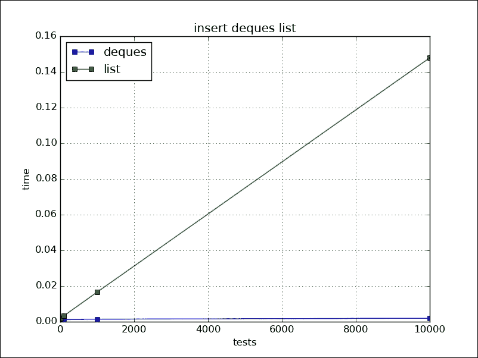
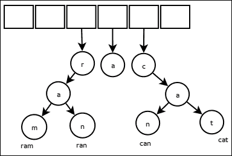

# 第四章 数据结构和算法

数据结构是解决编程问题的基石。它们为数据提供组织，算法提供解决问题的逻辑。Python 提供了许多高效的内建数据结构，可以有效地使用。标准库以及第三方库中也有其他优秀的数据结构实现。通常，更紧迫的问题是何时使用什么，或者哪种数据结构适合当前的问题描述。为了解决这个问题，我们将涵盖以下主题：

+   Python 数据结构

+   Python 库数据结构

+   第三方数据结构

+   规模算法

# Python 内置数据结构

**关键点 1：理解 Python 的内置数据结构。**

在深入探讨如何使用不同的数据结构之前，我们应该先看看对于内置数据结构来说重要的对象属性。为了默认排序能够工作，对象应该定义了`__lt__`和`__gt__`方法之一。否则，我们可以传递一个键函数给排序方法，以使用在获取用于比较的中间键，如下面的代码所示：

```py
def less_than(self, other):
    return self.data <= other.data

class MyDs(object):

    def __init__(self, data):
        self.data = data

    def __str__(self,):
        return str(self.data)
    __repr__ = __str__

if __name__ == '__main__':

    ml = [MyDs(i) for i in range(10, 1, -1)]
    try:
        ml.sort()
    except TypeError:
        print("unable to sort by default")

    for att in '__lt__', '__le__', '__gt__', '__ge__':
        setattr(MyDs, att, less_than)
        ml = [MyDs(i) for i in list(range(5, 1, -1)) + list(range(1, 5,))]
        try:
            ml.sort()
            print(ml)
        except TypeError:
            print("cannot sort")
        delattr(MyDs, att)

    ml = [MyDs(i) for i in range(10, 1, -1)]
    print("sorted", sorted(ml, key=lambda x: x.data))
    ml.sort(key=lambda x: x.data)
    print("sort", ml)
```

上述代码的输出如下：

```py
[1, 2, 2, 3, 3, 4, 4, 5]
cannot sort
[5, 4, 4, 3, 3, 2, 2, 1]
cannot sort
sorted [2, 3, 4, 5, 6, 7, 8, 9, 10]
sort [2, 3, 4, 5, 6, 7, 8, 9, 10]
```

两个对象在值上是否相等由`__eq__`方法的输出定义。如果集合具有相同的长度和所有项相同的值，则它们具有相同的值，如下面的代码所示：

```py
def equals(self, other):
    return self.data == other.data

class MyDs(object):

    def __init__(self, data):
        self.data = data

    def __str__(self,):
        return str(self.data)
    __repr__ = __str__

if __name__ == '__main__':
    m1 = MyDs(1)
    m2 = MyDs(2)
    m3 = MyDs(1)
    print(m1 == m2)
    print(m1 == m3)

    setattr(MyDs, '__eq__', equals)
    print(m1 == m2)
    print(m1 == m3)
    delattr(MyDs, '__eq__')

    print("collection")
    l1 = [1, "arun", MyDs(3)]
    l2 = [1, "arun", MyDs(3)]
    print(l1 == l2)
    setattr(MyDs, '__eq__', equals)
    print(l1 == l2)
    l2.append(45)
    print(l1 == l2)
    delattr(MyDs, '__eq__')

    print("immutable collection")
    t1 = (1, "arun", MyDs(3), [1, 2])
    t2 = (1, "arun", MyDs(3), [1, 2])
    print(t1 == t2)
    setattr(MyDs, '__eq__', equals)
    print(t1 == t2)
    t1[3].append(7)
    print(t1 == t2)
```

上述代码的输出如下：

```py
False
False
False
True
collection
False
True
False
immutable collection
False
True
False
```

哈希函数将较大的值集映射到较小的哈希集。因此，两个不同的对象可以有相同的哈希值，但具有不同哈希值的对象必须不同。换句话说，具有相等值的对象应该有相同的哈希值，而具有不同哈希值的对象必须有不同的值，以便哈希才有意义。当我们在一个类中定义`__eq__`时，我们也必须定义一个哈希函数。默认情况下，对于用户类实例，哈希使用对象的 ID，如下面的代码所示：

```py
class MyDs(object):

    def __init__(self, data):
        self.data = data

    def __str__(self,):
        return "%s:%s" % (id(self) % 100000, self.data)

    def __eq__(self, other):
        print("collision")
        return self.data == other.data

    def __hash__(self):
        return hash(self.data)

    __repr__ = __str__

if __name__ == '__main__':

    dd = {MyDs(i): i for i in (1, 2, 1)}
    print(dd)

    print("all collisions")
    setattr(MyDs, '__hash__', lambda x: 1)
    dd = {MyDs(i): i for i in (1, 2, 1)}
    print(dd)

    print("all collisions,all values same")
    setattr(MyDs, '__eq__', lambda x, y: True)
    dd = {MyDs(i): i for i in (1, 2, 1)}
    print(dd)
```

上述代码的输出如下：

```py
collision
{92304:1: 1, 92360:2: 2}
all collisions
collision
collision
{51448:1: 1, 51560:2: 2}
all collisions,all values same
{92304:1: 1}
```

可以看到，可变对象没有定义哈希。尽管这不被建议，但我们仍然可以在我们的用户定义类中这样做：

+   **元组**：这些是不可变列表，切片操作是*O(n)*，检索是*O(n)*，并且它们有较小的内存需求。它们通常用于在单个结构中组合不同类型的对象，例如 C 语言结构，其中特定类型的信息位置是固定的，如下所示：

    ```py
    >>> sys.getsizeof(())
    48
    >>> sys.getsizeof(tuple(range(100)))
    848
    ```

    从 collections 模块可用的命名元组可以用来使用对象表示法访问值，如下所示：

    ```py
    >>> from collections import namedtuple
    >>> student = namedtuple('student','name,marks')
    >>> s1 = student('arun',133)
    >>> s1.name
    'arun'
    >>> s1.marks
    133
    >>> type(s1)
    <class '__main__.student'>
    ```

+   **列表**：这些是类似于元组的可变数据结构，适合收集类似类型的对象。在分析它们的时间复杂度时，我们看到插入、删除、切片和复制操作需要 *O(n)*，检索需要 len *O(1)*，排序需要 *O(nlogn)*。列表作为动态数组实现。当大小增加超过当前容量时，它必须将其大小加倍。在列表前面插入和删除需要更多时间，因为它必须逐个移动其他元素的引用：

    ```py
    >>> sys.getsizeof([])
    64
    >>> sys.getsizeof(list(range(100)))
    1008
    ```

+   **字典**：这些是可以变动的映射。键可以是任何可哈希的对象。获取键的值、为键设置值和删除键都是 *O(1)*，复制是 *O(n)*：

    ```py
    >>> d = dict()
    >>> getsizeof(d)
    288
    >>> getsizeof({i:None for i in range(100)})
    6240
    ```

+   **集合**：这些可以被视为使用哈希检索项目的项目组。集合有检查并集和交集的方法，这比使用列表检查更方便。以下是一个动物组的例子：

    ```py
    >>> air = ("sparrow", "crow")
    >>> land = ("sparrow","lizard","frog")
    >>> water = ("frog","fish")
    >>> # find animal able to live on land and water
    ... 
    >>> [animal for animal in water if animal in land]
    ['frog']
    >>> 
    >>> air = set(air)
    >>> land = set(land)
    >>> water = set(water)
    >>> land | water #animal living either land or water
    {'frog', 'fish', 'sparrow', 'lizard'}
    >>> land & water #animal living both land and water
    {'frog'}
    >>> land ^ water #animal living on only one land or water
    {'fish', 'sparrow', 'lizard'}
    ```

    它们的实现和时间复杂度与字典非常相似，如下所示：

    ```py
    >>> s = set()
    >>> sys.getsizeof(s)
    224
    >>> s = set(range(100))
    >>> sys.getsizeof(s)
    8416
    ```

# Python 库数据结构

**关键 2：使用 Python 的标准库数据结构。**

+   **collections.deque**：collections 模块有一个`deque`实现。当结构两端都需要进行项目插入和删除时，deque 非常有用，因为它在结构开始处的插入效率很高。时间复杂度类似于复制 *O(n)*，插入—*O(1)*，删除—*O(n)*。以下图表显示了列表和 deque 在 0 位置插入操作的比较：

    ```py
    >>> d = deque()
    >>> getsizeof(d)
    632
    >>> d = deque(range(100))
    >>> getsizeof(d)
    1160
    ```

    以下图像是前面代码的图形表示：

    

+   **优先队列**：标准库队列模块有多个生产者和多个消费者队列的实现。我们可以使用`heapq`模块简化并重用其`PriorityQueue`，如下所示：

    ```py
    from heapq import heappush, heappop
    from itertools import count

    class PriorityQueue(object):
        def __init__(self,):
            self.queue = []
            self.counter = count()

        def __len__(self):
            return len(self.queue)

        def pop(self,):
            item = heappop(self.queue)
            print(item)
            return item[2],item[0]

        def push(self,item,priority):
            cnt = next(self.counter)
            heappush(self.queue, (priority, cnt, item))
    ```

除了这些，队列模块有`threadsafe`、`LifoQueue`、`PriorityQueue`、`queue`、`deque`的实现。此外，列表也可以用作栈或队列。集合也有`orderedDict`，它可以记住元素的顺序。

# 第三方数据结构

**关键 3：使用第三方数据结构。**

Python 在核心语言/库中有许多数据结构。但有时，一个应用程序有非常具体的要求。我们总是可以使用第三方数据结构包。这些模块中的大多数都是 Python 对 C、C++实现的封装：

+   `blist`模块提供了对列表、`sortedList`和`sortedset`的即插即用替换。在后面的章节中将有更详细的讨论。

+   `bintrees`模块提供了二叉树、AVL 树和红黑树。

+   `banyan`模块提供了红黑树、伸展树和有序列表。

+   `Sortedcontainers`模块提供了`SortedList`、`SortedDict`和`SortedSet`。因此，可以轻松地获得 Python 的几乎所有数据结构。应该更多地关注为什么某个数据结构在特定用例中比另一个更好。

## 数组/列表

对于涉及数学计算的数值计算，应考虑使用 NumPy 数组。它们速度快，内存高效，并提供许多矢量和矩阵操作。

## 二叉树

树在插入/删除、最小/最大值和查找方面比字典有更好的最坏情况性能，*O(log(n))*，并且有几种可用的实现。

一个模块是`bintrees`，它有 C 实现，可用于红黑树、AVL 树和二叉树。例如，在红黑树中，很容易找到最大值和最小值范围，如下面的示例所示：

```py
tr = bintrees.FastRBTree()
tr.insert("a",40)
tr.insert("b",5)
tr.insert("a",9)
print(list(tr.keys()),list(tr.items()))
print(tr.min_item())
print(tr.pop_max())
print(tr.pop_max())
tr = bintrees.FastRBTree([(i,i+1) for i in range(10)])
print(tr[5:9])
```

上述代码的输出如下：

```py
['a', 'b'] [('a', 9), ('b', 5)]
('a', 9)
('b', 5)
('a', 9)
FastRBTree({5: 6, 6: 7, 7: 8, 8: 9})
```

## 排序容器

这些是纯 Python 模块，具有`SortedList`、`SortedSet`和`SortedDict`数据结构，可以保持键/项的排序。`SortedContainers`模块声称其速度与 C 扩展模块相当，如下所示：

```py
import sortedcontainers as sc
import sys
l = sc.SortedList()
l.update([0,4,2,1,4,2])
print(l)
print(l.index(2),l.index(4))
l.add(6)
print(l[-1])
l = sc.SortedList(range(10))
print(l)
print(list(l.irange(2,6)))

seta = sc.SortedSet(range(1,4))
setb = sc.SortedSet(range(3,7))
print(seta - setb)
print(seta | setb )
print(seta & setb)
print([i for i in seta])
```

上述代码的输出如下：

```py
SortedList([0, 1, 2, 2, 4, 4], load=1000)
2 4
6
SortedList([0, 1, 2, 3, 4, 5, 6, 7, 8, 9], load=1000)
[2, 3, 4, 5, 6]
SortedSet([1, 2], key=None, load=1000)
SortedSet([1, 2, 3, 4, 5, 6], key=None, load=1000)
SortedSet([3], key=None, load=1000)
[1, 2, 3]
```

## Trie

这是一个有序树数据结构，其中树中的位置定义了键。键通常是字符串。与字典相比，它具有更快的最坏情况数据检索速度 *O(m)*。不需要哈希函数。如果我们只使用字符串作为键进行存储，那么它可能比字典占用更少的空间。



在 Python 中，我们有`marisa-trie`包，它提供这种功能作为静态数据结构。它是一个 C++库的 Cython 包装器。我们还可以将值与键关联起来。它还提供了内存映射 I/O，这有助于减少内存使用，但可能会牺牲速度。`datrie`是另一个提供读写 Trie 的包。以下是一些这些库的基本用法：

```py
>>> import string
>>> import marisa_trie as mtr
>>> import datrie as dtr
>>> 
>>> 
>>> # simple read-only keys
... tr = mtr.Trie([u'192.168.124.1',u'192.168.124.2',u'10.10.1.1',u'10.10.1.2'])
>>> #get all keys
... print(tr.keys())
['10.10.1.1', '10.10.1.2', '192.168.124.1', '192.168.124.2']
>>> #check if key exists
... print(tr.has_keys_with_prefix('192'))
True
>>> # get id of key
... print(tr.get('192.168.124.1'))
2
>>> # get all items
... print(tr.items())
[('10.10.1.1', 0), ('10.10.1.2', 1), ('192.168.124.1', 2), ('192.168.124.2', 3)]
>>> 
>>> # storing data along with keys
... btr = mtr.BytesTrie([('192.168.124.1',b'redmine.meeku.com'),
...                     ('192.168.124.2',b'jenkins.meeku.com'),
...                     ('10.5.5.1',b'gerrit.chiku.com'),
...                     ('10.5.5.2',b'gitlab.chiku.com'),
...                     ])
>>> print(list(btr.items()))
[('10.5.5.1', b'gerrit.chiku.com'), ('10.5.5.2', b'gitlab.chiku.com'), ('192.168.124.1', b'redmine.meeku.com'), ('192.168.124.2', b'jenkins.meeku.com')]
>>> print(btr.get('10.5.5.1'))
[b'gerrit.chiku.com']
>>> 
>>> with open("/tmp/marisa","w") as f:
...     btr.write(f)
... 
>>>     
... # using memory mapped io to decrease memory usage
... dbtr = mtr.BytesTrie().mmap("/tmp/marisa")
>>> print(dbtr.get("192.168.124.1"))
[b'redmine.meeku.com']
>>> 
>>> 
>>> trie = dtr.Trie('0123456789.') #define allowed character range
>>> trie['192.168.124.1']= 'redmine.meeku.com'
>>> trie['192.168.124.2'] = 'jenkins.meeku.com'
>>> trie['10.5.5.1'] = 'gerrit.chiku.com'
>>> trie['10.5.5.2'] = 'gitlab.chiku.com'
>>> print(trie.prefixes('192.168.245'))
[]
>>> print(trie.values())
['gerrit.chiku.com', 'gitlab.chiku.com', 'redmine.meeku.com', 'jenkins.meeku.com']
>>> print(trie.suffixes())
['10.5.5.1', '10.5.5.2', '192.168.124.1', '192.168.124.2']
>>> 
>>> trie.save("/tmp/1.datrie")
>>> ntr = dtr.Trie.load('/tmp/1.datrie')
>>> print(ntr.values())
['gerrit.chiku.com', 'gitlab.chiku.com', 'redmine.meeku.com', 'jenkins.meeku.com']
>>> print(ntr.suffixes())
['10.5.5.1', '10.5.5.2', '192.168.124.1', '192.168.124.2']
```

# 规模算法

**关键 4：为算法跳出思维定势。**

算法是我们解决问题的方法。无法解决问题的最常见问题是无法正确定义它。通常，我们只在较小范围内应用算法，例如在小的功能中或在一个函数中的排序。然而，当规模增加时，我们并没有考虑算法，主要关注的是速度。让我们以一个简单的需求为例，即对文件进行排序并将其发送给用户。如果文件大小为 10-20 KB 左右，最好简单地使用 Python 的 sorted 函数对条目进行排序。在下面的代码中，文件格式为列 ID、名称、到期日和到期日期。我们希望根据到期日进行排序，如下所示：

```py
10000000022,shy-flower-ac5,-473,16/03/25
10000000096,red-water-e85,-424,16/02/12
10000000097,dry-star-c85,-417,16/07/19
10000000070,damp-night-c76,-364,16/03/12
10000000032,muddy-shadow-aad,-362,16/08/05

def dosort(filename,result):
    with open(filename) as ifile:
        with open(result,"w") as ofile:
            for line in sorted(
                map(lambda x:x.strip(), ifile.readlines()
                    ),key=lambda x:int(x.split(',')[2])
                ):
                ofile.write(line)
                ofile.write('\n')
```

这效果很好，但随着文件大小的增加，内存需求也会增加。我们无法同时将所有内容加载到内存中。因此，我们可以使用外部归并排序将文件分成小块，对它们进行排序，然后将排序后的结果合并在一起。在以下代码中，我们使用了`heapq.merge`来合并迭代器：

```py
import tempfile
import heapq

def slowread(f, nbytes):
    while True:
        ilines = f.readlines(nbytes)
        if not ilines:
            break
        for line in ilines:
            yield int(line.split(',')[2]),line

def dosort(filename, result):
    partition = 5000
    with open(filename,"r") as ifile:
        with open(result,"w") as ofile:
            tempfiles = []
            while True:
                ilines  = ifile.readlines(partition)
                if len(ilines) == 0 :
                    break
                tfile = tempfile.TemporaryFile(mode="w+")
                tfile.writelines(
                    sorted(
                        ilines,
                        key=lambda x:int(x.split(',')[2])
                        ))
                tfile.seek(0)
                tempfiles.append(tfile)
            lentempfiles = len(tempfiles)
            read_generators = [slowread(tfile, partition//(lentempfiles+1))  for tfile in tempfiles]
            res = []
            for line in heapq.merge(*read_generators):
                res.append(line[1])
                if len(res) > 100:
                    ofile.writelines(res)
                    res.clear()
            if res:
                ofile.writelines(res)
            ofile.close()
```

一旦我们用完单个计算机的内存，或者在网络中的多台计算机上分布文件，基于文件的算法将无法工作。我们需要对来自上游服务器的传入流进行排序，并将排序后的流发送到下游。如果我们仔细查看以下代码，我们会发现我们没有改变底层机制。我们仍然使用`heapq.merge`来合并元素，但现在，我们从网络中获取元素。以下客户端代码很简单，它只是在接收到来自下游服务器的下一个命令后，逐行开始发送排序后的行：

```py
import socket
import sys
from sort2 import dosort2

HOST = '127.0.0.1'
PORT =  9002
NCLIENTS = 2

class Client(object):

    def __init__(self,HOST,PORT,filename):
        self.skt = socket.socket(socket.AF_INET,socket.SOCK_STREAM)
        self.skt.connect((HOST,PORT))
        self.filename = filename
        self.skt.setblocking(True)

    def run(self):
        for line in dosort2(self.filename):
            print("for",line)
            data = self.skt.recv(1024)
            print("data cmd",data)
            if data == b'next\r\n':
                data = None
                self.skt.send(line[1].encode())
            else:
                print("got from server",data)
        print("closing socket")
        self.skt.close()

c = Client(HOST,PORT,sys.argv[1])
c.run()
```

在服务器代码中，`ClientConn`类抽象了网络操作，并为`heapq.merge`提供了一个迭代器接口。我们可以通过缓冲区来大大增强代码。在这里，`get_next`方法从客户端获取新行。简单的抽象解决了大问题：

```py
import socket
import heapq
from collections import deque

HOST = '127.0.0.1'
PORT = 9002
NCLIENTS = 2

class Empty(Exception):
    pass

class ClientConn(object):
    def __init__(self, conn, addr):
        self.conn = conn
        self.addr = addr
        self.buffer = deque()
        self.finished = False
        self.get_next()

    def __str__(self, ):
        return '%s' % (str(self.addr))

    def get_next(self):
        print("getting next", self.addr)
        self.conn.send(b"next\r\n")
        try:
            ndata = self.conn.recv(1024)
        except Exception as e:
            print(e)
            self.finished = True
            ndata = None
        if ndata:
            ndata = ndata.decode()
            print("got from client", ndata)
            self.push((int(ndata.split(',')[2]), ndata))
        else:
            self.finished = True

    def pop(self):
        if self.finished:
            raise Empty()
        else:
            elem = self.buffer.popleft()
            self.get_next()
            return elem

    def push(self, value):
        self.buffer.append(value)

    def __iter__(self, ):
        return self

    def __next__(self, ):
        try:
            return self.pop()
        except Empty:
            print("iter empty")
            raise StopIteration

class Server(object):
    def __init__(self, HOST, PORT, NCLIENTS):
        self.nclients = NCLIENTS
        self.skt = socket.socket(socket.AF_INET, socket.SOCK_STREAM)
        self.skt.setblocking(True)
        self.skt.bind((HOST, PORT))
        self.skt.listen(1)

    def run(self):
        self.conns = []  # list of all clients connected

        while len(self.conns) < self.nclients:  # accept client till we have all
            conn, addr = self.skt.accept()
            cli = ClientConn(conn, addr)
            self.conns.append(cli)
            print('Connected by', cli)

        with open("result", "w") as ofile:
            for line in heapq.merge(*self.conns):
                print("output", line)
                ofile.write(line[1])

s = Server(HOST, PORT, NCLIENTS)
s.run()
```

# 摘要

在本章中，我们学习了 Python 标准库和一些第三方库中可用的数据结构，这些数据结构对于日常编程非常有用。了解数据结构的使用对于选择合适的工具至关重要。算法的选择高度依赖于具体的应用，我们应该总是试图找到一个更易于阅读的解决方案。

在下一章中，我们将介绍一些设计模式，这些模式在编写优雅的解决方案时提供了极大的帮助。
