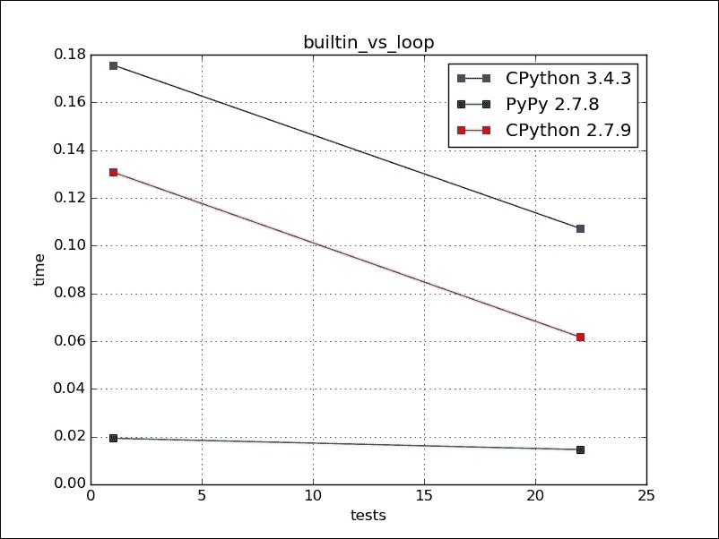
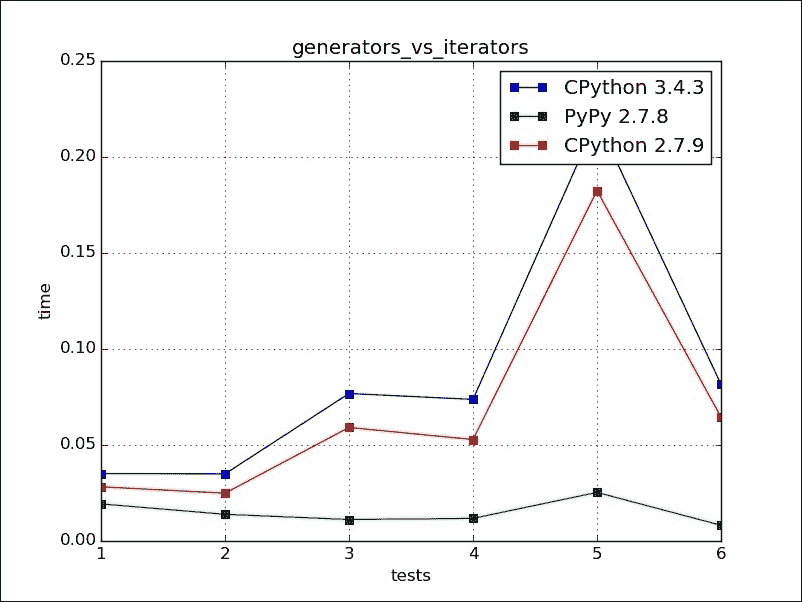
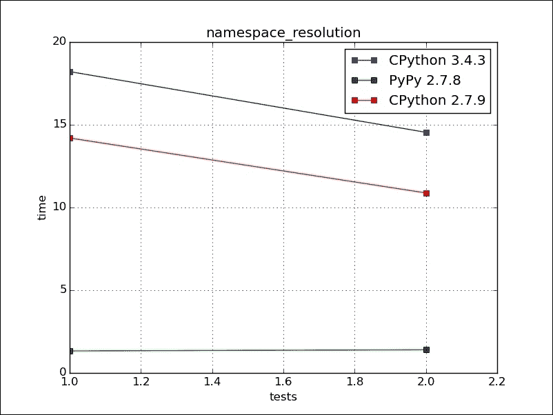
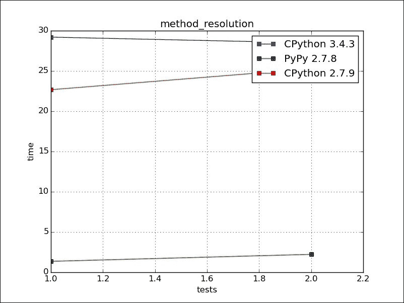
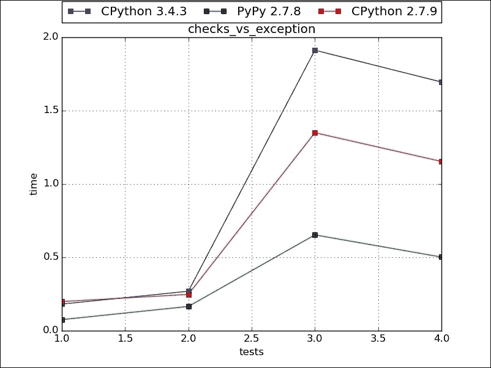
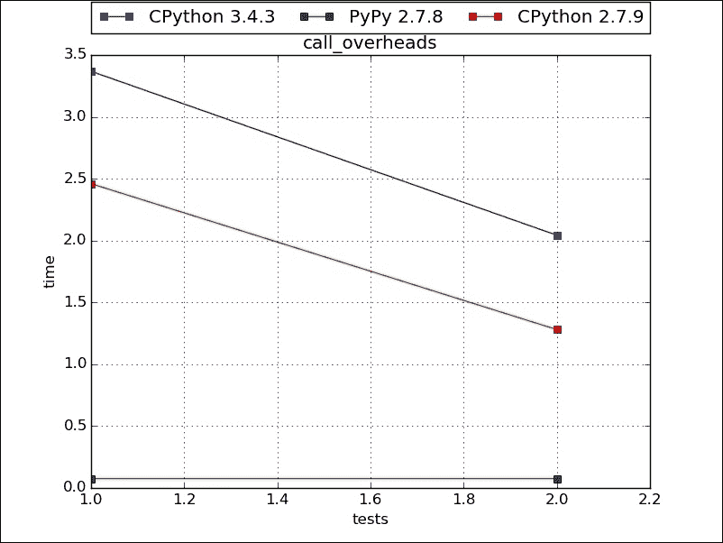
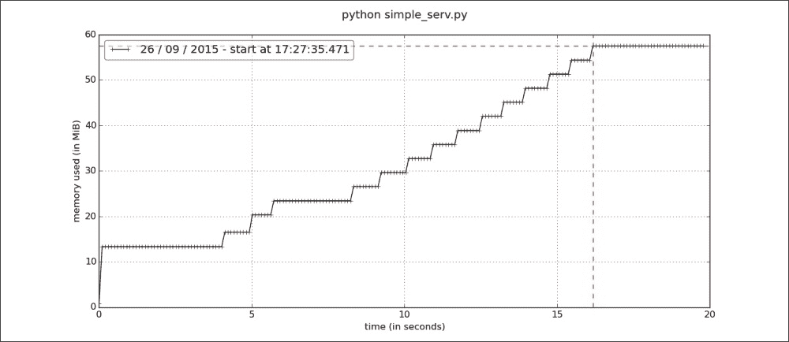

# 第七章。优化技术

在本章中，我们将学习如何优化我们的 Python 代码以获得更好的响应性程序。但是，在我们深入之前，我想强调的是，只有在必要时才进行优化。一个可读性更好的程序比一个简洁优化的程序有更好的生命周期和可维护性。首先，我们将看看简单的优化技巧以保持程序优化。我们应该了解它们，这样我们就可以从开始就应用简单的优化。然后，我们将查看分析以找到当前程序中的瓶颈并应用所需的优化。作为最后的手段，我们可以用 C 语言编译并提供作为 Python 扩展的功能。以下是我们将涵盖的主题概要：

+   编写优化代码

+   分析以找到瓶颈

+   使用快速库

+   使用 C 速度

# 编写优化代码

**关键 1：代码的简单优化。**

我们应该特别注意不要在循环内部使用循环，这会导致我们得到二次行为。如果可能的话，我们可以使用内置函数，如 map、ZIP 和 reduce，而不是使用循环。例如，在下面的代码中，使用 map 的版本更快，因为循环是隐式的，并且在 C 级别执行。通过将它们的运行时间分别绘制在图上作为 `test 1` 和 `test 2`，我们看到 PyPy 几乎是恒定的，但对于 CPython 来说减少了很大，如下所示：

```py
def sqrt_1(ll):
    """simple for loop"""
    res = []
    for i in ll:
        res.append(math.sqrt(i))
    return res

def sqrt_2(ll):
    "builtin map"
    return list(map(math.sqrt,ll))
The test 1 is for sqrt_1(list(range(1000))) and test 22 sqrt_2(list(range(1000))).
```

下面的图像是前面代码的图形表示：



当消耗的结果平均小于消耗的总结果时，应使用生成器。换句话说，最终生成的结果可能不会被使用。它们还用于节省内存，因为不会存储临时结果，而是在需要时生成。在下面的示例中，`sqrt_5` 创建了一个生成器，而 `sqrt_6` 创建了一个列表。`use_combo` 实例在给定次数的迭代后跳出迭代循环。Test 1 运行 `use_combo(sqrt_5,range(10),5)` 并从迭代器中消耗所有结果，而 test 2 是针对 `use_combo(sqrt_6,range(10),5)` 生成器的。Test 1 应该比 test 2 花更多的时间，因为它为所有输入范围创建了结果。测试 3 和 4 使用 `25` 的范围运行，测试 5 和 6 使用 `100` 的范围运行。正如所见，时间消耗的变化随着列表中元素数量的增加而增加：

```py
def sqrt_5(ll):
    "simple for loop, yield"
    for i in ll:
        yield i,math.sqrt(i)

def sqrt_6(ll):
    "simple for loop"
    res = []
    for i in ll:
        res.append((i,math.sqrt(i)))
    return res

def use_combo(combofunc,ll,no):
    for i,j in combofunc(ll):
        if i>no:
            return j
```

下面的图像是前面代码的图形表示：



当我们在循环内部引用外部命名空间变量时，它首先在局部中搜索，然后是非局部，接着是全局，最后是内置作用域。如果重复次数更多，那么这样的开销会累加。我们可以通过使这样的全局/内置对象在局部命名空间中可用来减少命名空间查找。例如，在下面的代码片段中，`sqrt_7(test2)` 由于相同的原因会比 `sqrt_1(test1)` 快：

```py
def sqrt_1(ll):
    """simple for loop"""
    res = []
    for i in ll:
        res.append(math.sqrt(i))
    return res

def sqrt_7(ll):
    "simple for loop,local"
    sqrt = math.sqrt
    res = []
    for i in ll:
        res.append(sqrt(i))
    return res
```

下面的图像是前面代码的图形表示：



子类化的成本不高，即使常识认为在继承层次结构中查找方法会花费很多时间，子类化也不会使方法调用变慢。让我们看以下示例：

```py
class Super1(object):
    def get_sqrt(self,no):
        return math.sqrt(no)

class Super2(Super1):
    pass

class Super3(Super2):
    pass

class Super4(Super3):
    pass

class Super5(Super4):
    pass

class Super6(Super5):
    pass

class Super7(Super6):
    pass

class Actual(Super7):
    """method resolution via hierarchy"""
    pass

class Actual2(object):
    """method resolution single step"""
    def get_sqrt(self,no):
        return math.sqrt(no)

def use_sqrt_class(aclass,ll):
    cls_instance = aclass()
    res = []
    for i in ll: 
        res.append(cls_instance.get_sqrt(i))
    return res
```

在这里，如果我们对`Actual(case1)`类调用`get_sqrt`，我们需要在其基类中搜索七层才能找到它，而对于`Actual2(case2)`类，它直接存在于类本身。下面的图表是这两种情况下的图表：



此外，如果我们程序逻辑中使用了过多的检查来处理返回代码或错误条件，我们应该看看实际上需要多少这样的检查。我们可以先不使用任何检查来编写程序逻辑，然后在异常处理逻辑中获取错误。这使得代码更容易理解。例如，下面的`getf_1`函数使用检查来过滤错误条件，但过多的检查使得代码难以理解。另一个`get_f2`函数具有相同的应用逻辑或算法，但使用了异常处理。对于测试 1（`get_f1`）和测试 2（`get_f2`），没有文件存在，因此所有异常都被触发。在这种情况下，异常处理逻辑，即测试 2，花费了更多的时间。对于测试 3（`get_f1`）和测试 4（`get_f2`），文件和键存在；因此，没有错误被触发。在这种情况下，测试 4 花费的时间更少，如下所示：

```py
def getf_1(ll):
    "simple for loop,checks"
    res = []
    for fname in ll:
        curr = []
        if os.path.exists(fname):
            f = open(fname,"r")
            try:
                fdict = json.load(f)
            except (TypeError, ValueError):
                curr = [fname,None,"Unable to read Json"]
            finally:
                f.close()
            if 'name' in fdict:
                curr = [fname,fdict["name"],'']
            else:
                curr = [fname,None,"Key not found in file"]
        else:
            curr = [fname,None,"file not found"]
        res.append(curr)
    return res

def getf_2(ll):
    "simple for loop, try-except"
    res = []
    for fname in ll:
        try:
            f = open(fname,"r")
            res.append([fname,json.load(f)['name'],''])
        except IOError:
            res.append([fname,None,"File Not Found Error"])
        except TypeError:
            res.append([fname,None,'Unable to read Json'])
        except KeyError:
            res.append([fname,None,'Key not found in file'])
        except Exception as e:
            res.append([fname,None,str(e)])
        finally:
            if 'f' in locals():
                f.close()
    return res
```

下面的图像是前面代码的图形表示：



函数调用有开销，如果通过减少函数调用可以消除性能瓶颈，我们应该这样做。通常，函数在循环中调用。在以下示例中，当我们直接编写逻辑时，它花费的时间更少。此外，对于 PyPy，这种效果通常较小，因为大多数在循环中调用的函数通常使用相同类型的参数调用；因此，它们被编译。对这些函数的任何进一步调用就像调用 C 语言函数一样：

```py
def please_sqrt(no):
    return math.sqrt(no)

def get_sqrt(no):
    return please_sqrt(no)

def use_sqrt1(ll,no):
    for i in ll:
        res = get_sqrt(i)
        if res >= no:
            return i

def use_sqrt2(ll,no):
    for i in ll:
        res = math.sqrt(i)
        if res >= no:
            return i
```

下面的图像是前面代码的图形表示：



# 性能瓶颈分析

**关键点 2：识别应用程序性能瓶颈。**

我们不应该依赖我们的直觉来优化应用程序。逻辑缓慢主要有两种方式；一种是 CPU 时间，另一种是等待来自其他实体的结果。通过分析，我们可以找出可以调整逻辑和语言语法的案例，以在相同硬件上获得更好的性能。以下是一个`showtime`装饰器，我使用它来计算函数调用的耗时。它简单而有效，可以快速得到答案：

```py
from datetime import datetime,timedelta
from functools import wraps
import time

def showtime(func):

    @wraps(func)
    def wrap(*args,**kwargs):
        st = time.time() #time clock can be used too
        result = func(*args,**kwargs)
        et = time.time()
        print("%s:%s"%(func.__name__,et-st))
        return result
    return wrap

@showtime
def func_c():
    for i in range(1000):
        for j in range(1000):
            for k in range(100):
                pass

if __name__ == '__main__':
    func_c()
```

这将给出以下输出：

```py
(py35) [ ch7 ] $ python code_1_8.py 
func_c:1.3181400299072266
```

当分析单个大型函数时，该函数执行了大量操作，我们可能需要知道我们花费最多时间的是哪一行。这个问题可以通过使用`line_profiler`模块来回答。你可以使用`pip install line_profiler`来获取它。它显示了每行花费的时间。要获取结果，我们应该用特殊的 profile 装饰器装饰函数，该装饰器将由`line_profiler`使用：

```py
from datetime import datetime,timedelta
from functools import wraps
import time
import line_profiler

l = []
def func_a():
    global l
    for i in range(10000):
        l.append(i)

def func_b():
    m = list(range(100000))

def func_c():
    func_a()
    func_b()
    k = list(range(100000))

if __name__ == '__main__':
    profiler = line_profiler.LineProfiler()
    profiler.add_function(func_c)
    profiler.run('func_c()')
    profiler.print_stats()
```

这将给出以下输出：

```py
Timer unit: 1e-06 s

Total time: 0.007759 s
File: code_1_9.py
Function: func_c at line 15

Line #      Hits         Time  Per Hit   % Time  Line Contents
==============================================================
    15                                           def func_c():
    16         1         2976   2976.0     38.4      func_a()
    17         1         2824   2824.0     36.4      func_b()
    18         1         1959   1959.0     25.2      k = list(range(100000))
```

另一种分析方法是使用`line_profiler`模块提供的`kernprof`程序。我们必须使用`@profile`装饰器将函数装饰为分析器，并运行程序，如下面的代码片段所示：

```py
from datetime import datetime,timedelta
from functools import wraps
import time

l = []
def func_a():
    global l
    for i in range(10000):
        l.append(i)

def func_b():
    m = list(range(100000))

@profile
def func_c():
    func_a()
    func_b()
    k = list(range(100000))
```

此输出的结果如下：

```py
(py35) [ ch7 ] $ kernprof -l -v code_1_10.py
Wrote profile results to code_1_10.py.lprof
Timer unit: 1e-06 s

Total time: 0 s
File: code_1_10.py
Function: func_c at line 14

Line #      Hits         Time  Per Hit   % Time  Line Contents
==============================================================
    14                                           @profile
    15                                           def func_c():
    16                                               func_a()
    17                                               func_b()
    18                                               k = list(range(100000))
```

内存分析器是估计程序内存消耗的一个非常好的工具。要分析一个函数，只需用 profile 装饰它，然后像这样运行程序：

```py
from memory_profiler import profile

@profile(precision=4)
def sample():
    l1 = [ i for i in range(10000)]
    l2 = [ i for i in range(1000)]
    l3 = [ i for i in range(100000)]
    return 0

if __name__ == '__main__':
    sample()
```

要在命令行上获取详细信息，请使用以下代码：

```py
(py36)[ ch7 ] $ python  ex7_1.py 
Filename: ex7_1.py

Line #    Mem usage    Increment   Line Contents
================================================
     8     12.6 MiB      0.0 MiB   @profile
     9                             def sample():
    10     13.1 MiB      0.5 MiB       l1 = [ i for i in range(10000)]
    11     13.1 MiB      0.0 MiB       l2 = [ i for i in range(1000)]
    12     17.0 MiB      3.9 MiB       l3 = [ i for i in range(100000)]
    13     17.0 MiB      0.0 MiB       return 0

Filename: ex7_1.py

Line #    Mem usage    Increment   Line Contents
================================================
    10     13.1 MiB      0.0 MiB       l1 = [ i for i in range(10000)]

Filename: ex7_1.py

Line #    Mem usage    Increment   Line Contents
================================================
    12     17.0 MiB      0.0 MiB       l3 = [ i for i in range(100000)]

Filename: ex7_1.py

Line #    Mem usage    Increment   Line Contents
================================================
    11     13.1 MiB      0.0 MiB       l2 = [ i for i in range(1000)]
```

我们还可以用它来调试长时间运行的程序。以下代码是一个简单的套接字服务器。它将列表添加到全局列表变量中，该变量永远不会被删除。在`simple_serv.py`中保存内容如下：

```py
from SocketServer import BaseRequestHandler,TCPServer

lists = []

class Handler(BaseRequestHandler):
    def handle(self):
        data = self.request.recv(1024).strip()
        lists.append(list(range(100000)))
        self.request.sendall("server got "+data)

if __name__ == '__main__':
    HOST,PORT = "localhost",9999
    server = TCPServer((HOST,PORT),Handler)
    server.serve_forever()
```

现在，通过以下方式运行程序，使用分析器：

```py
mprof run simple_serv.py
```

向服务器发送一些无效的请求。我使用了`netcat`实用程序：

```py
[ ch7 ] $ nc localhost 9999 <<END
hello
END
```

在一段时间后杀死服务器，并使用以下代码绘制随时间消耗的内存：

```py
[ ch7 ] $ mprof plot
```

我们得到了一张很好的图表，显示了随时间变化的内存消耗：



除了获取程序内存消耗外，我们还可能对携带空格的对象感兴趣。Objgraph ([`pypi.python.org/pypi/objgraph`](https://pypi.python.org/pypi/objgraph)) 能够为你的程序绘制对象链接图。Guppy ([`pypi.python.org/pypi/guppy/`](https://pypi.python.org/pypi/guppy/)) 是另一个包含 heapy 的包，heapy 是一个堆分析工具。对于查看运行程序中堆上的对象数量非常有帮助。截至本文写作时，它仅适用于 Python 2。对于分析长时间运行的过程，Dowser ([`pypi.python.org/pypi/dowser`](https://pypi.python.org/pypi/dowser)) 也是一个不错的选择。我们可以使用 Dowser 来查看 Celery 或 WSGI 服务器的内存消耗。Django-Dowser 很好，并且提供了一个与应用程序相同的功能，但正如其名所示，它仅与 Django 兼容。

# 使用快速库

**关键 3：使用易于替换的快速库。**

有许多库可以帮助优化代码，而不是自己编写一些优化例程。例如，如果我们有一个需要快速 FIFO 的列表，我们可能会使用 `blist` 包。我们可以使用库的 C 版本，如 `cStringIO`（比 StringIO 更快）、`ujson`（比 JSON 处理更快）、`numpy`（数学和向量）和 `lxml`（XML 处理）。这里列出的大多数库只是 C 库的 Python 封装。您只需为您的问题域搜索一次。除此之外，我们还可以非常容易地用 Python 创建 C 或 C++ 库接口，这也是我们下一个话题。

# 使用 C 加速

**关键 4：以 C 速度运行。**

## SWIG

SWIG 是一个接口编译器，它将 C 和 C++ 编写的程序与脚本语言连接起来。我们可以使用 SWIG 在 Python 中调用编译好的 C 和 C++。假设我们有一个在 C 中编写的阶乘计算库，源代码在 `fact.c` 文件中，相应的头文件是 `fact.h`：

`fact.c` 中的源代码如下：

```py
#include "fact.h"
long int fact(long int n) {
    if (n < 0){
        return 0;
    }
    if (n == 0) {
        return 1;
    }
    else {
        return n * fact(n-1);
    }
}
```

`fact.h` 中的源代码如下：

```py
long int fact(long int n);
```

现在，我们需要为 SWIG 编写一个接口文件，告诉它需要暴露给 Python 的内容：

```py
/* File: fact.i */
%module fact
%{
#define SWIG_FILE_WITH_INIT
#include "fact.h"
%}
long int fact(long int n);
```

在这里，模块表示 Python 库的模块名称，而 `SWIG_FILE_WITH_INIT` 表示生成的 C 代码应该与 Python 扩展一起构建。`` 中的内容用于生成的 C 封装代码。我们在目录中有三个文件，`fact.c`、`fact.h` 和 `fact.i`。我们运行 SWIG 生成 `wrapper_code`，如下所示：

```py
swig3.0 -python -O -py3 fact.i
```

`-O` 选项用于优化，`-py3` 是用于 Python 3 特定功能的。

这将生成 `fact.py` 和 `fact_wrap.c`。`fact.py` 是一个 Python 模块，而 `fact_wrap.c` 是 C 和 Python 之间的粘合代码：

```py
gcc -fpic -c fact_wrap.c fact.c -I/home/arun/.virtualenvs/py3/include/python3.4m
```

在这里，我必须包含我的 `python.h` 路径以编译它。这将生成 `fact.o` 和 `fact_wrap.o`。现在，最后一部分是创建动态链接库，如下所示：

```py
gcc -shared fact.o fact_wrap.o  -o _fact.so
```

`_fact.so` 文件被 `fact.py` 用于运行 C 函数。现在，我们可以在我们的 Python 程序中使用 fact 模块：

```py
>>> from fact import fact
>>> fact(10)
3628800
>>> fact(5)
120
>>> fact(20)
2432902008176640000
```

## CFFI

Python 的 **C 外部函数接口**（**CFFI**）是我认为最好的一个工具，因为它设置简单，界面友好。它在 ABI 和 API 层面上工作。

使用我们的阶乘 C 程序，我们首先为代码创建一个共享库：

```py
gcc -shared fact.o  -o _fact.so
gcc -fpic -c fact.c -o fact.o
```

现在，我们在当前目录中有一个 `_fact.so` 共享库对象。要在 Python 环境中加载它，我们可以执行以下非常直接的操作。我们应该有库的头文件，以便我们可以使用声明。按照以下方式从发行版或 pip 安装所需的 CFFI 包：

```py
>>> from cffi import FFI
>>> ffi = FFI()
>>> ffi.cdef("""
... long int fact(long int num);
... """)
>>> C = ffi.dlopen("./_fact.so")
>>> C.fact(20)
2432902008176640000
```

如果我们在导入模块时不调用 `cdef`，我们可以减少模块的导入时间。我们可以编写另一个 `setup_fact_ffi.py` 模块，它给我们一个带有编译信息的 `fact_ffi.py` 模块。因此，加载时间大大减少：

```py
from cffi import FFI

ffi = FFI()
ffi.set_source("fact_ffi", None)
ffi.cdef("""
    long int fact(long int n);
""")

if __name__ == "__main__":
ffi.compile()

python setup_fact_ffi.py 
```

现在，我们可以使用此模块来获取 `ffi` 并加载我们的共享库，如下所示：

```py
>>> from fact_ffi import ffi
>>> ll = ffi.dlopen("./_fact.so")
>>> ll.fact(20)
2432902008176640000
>>> 
```

到目前为止，因为我们使用的是预编译的共享库，所以我们不需要编译器。假设你需要在 Python 中使用这个小的 C 函数，而你不想为它再写一个.c 文件，那么可以这样操作。你还可以将其扩展到共享库。

首先，我们定义一个`build_ffi.py`文件，它将为我们编译并创建一个模块：

```py
__author__ = 'arun'

from cffi import FFI
ffi = FFI()

ffi.set_source("_fact_cffi",
    """
    long int fact(long int n) {
    if (n < 0){
        return 0;
    }
    if (n == 0) {
        return 1;
    }
    else {
        return n * fact(n-1);
    }
}
""",
               libraries=[]
    )

ffi.cdef("""
long int fact(long int n);
""")

if __name__ == '__main__':
    ffi.compile()
```

当我们运行 Python 的`fact_build.py`时，这将创建一个`_fact_cffi.cpython-34m.so`模块。要使用它，我们必须导入它并使用`lib`变量来访问模块：

```py
>>> from  _fact_cffi import ffi,lib
>>> lib.fact(20)
```

## Cython

Cython 类似于 Python 的超集，在其中我们可以选择性地提供静态声明。源代码被编译成 C/C++扩展模块。

我们将旧的阶乘程序写入`fact_cpy.pyx`，如下所示：

```py
cpdef double fact(int num):
    cdef double res = 1
    if num < 0:
        return -1
    elif num == 0:
        return 1 
    else:
        for i in range(1,num + 1):
            res = res*i
return res
```

在这里，`cpdef`是 CPython 的函数声明，它创建一个 Python 函数和参数转换逻辑，以及一个实际执行的 C 函数。`cpdef`定义了 res 变量的数据类型，这有助于加速。

我们必须创建一个`setup.py`文件来将此代码编译成扩展模块（我们可以直接使用`pyximport`，但现在我们将留到以后）。`setup.py`文件的内容如下：

```py
from distutils.core import setup
from Cython.Build import cythonize

setup(
  name = 'factorial library',
    ext_modules = cythonize("fact_cpy.pyx"),
    )
```

现在要构建模块，我们只需输入以下命令，我们就会在当前目录中得到一个`fact_cpy.cpython-34m.so`文件：

```py
python setup.py build_ext --inplace
```

在 Python 中使用此方法如下：

```py
>>> from fact_cpy import fact
>>> fact(20)
2432902008176640000
```

# 摘要

在本章中，我们看到了各种用于优化和性能分析的技巧。我再次指出，我们应该始终首先编写正确的程序，然后为其编写测试用例，最后再进行优化。我们应该编写当时我们知道如何优化的代码，或者第一次不进行优化，只有在从业务角度需要时才去寻找优化。编译 C 模块可以为 CPU 密集型任务提供良好的加速。此外，我们可以在 C 模块中放弃 GIL，这也有助于提高性能。但是，所有这些都只是在单系统上。现在，在下一章中，我们将看到当本章讨论的技巧不足以应对现实场景时，我们如何提高性能。
