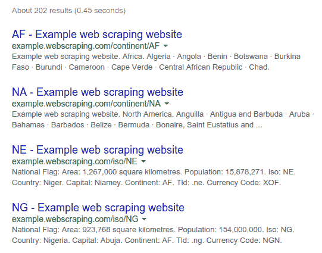
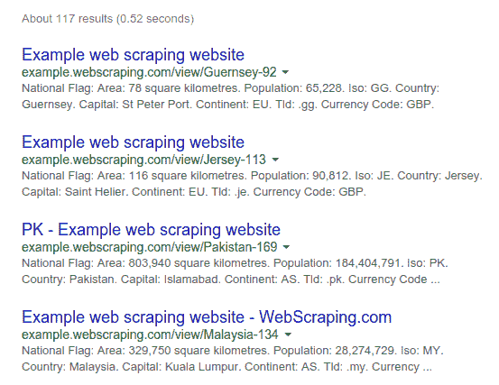
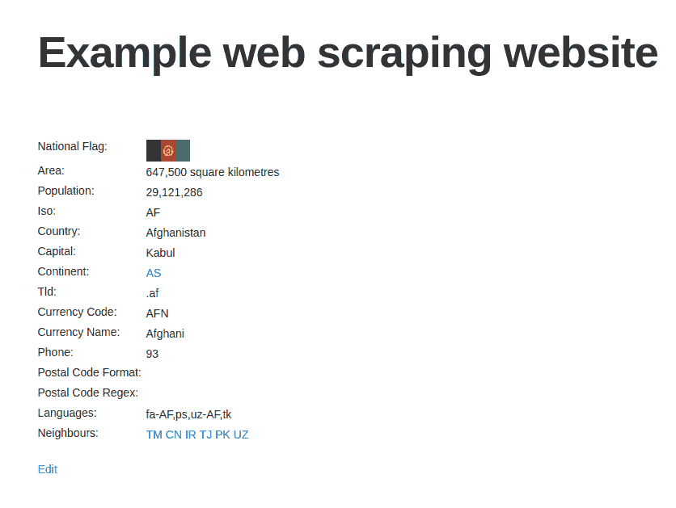

# 第一章：网络爬虫简介

欢迎来到网络爬虫的广阔世界！网络爬虫被许多领域用于收集其他格式难以获取的数据。你可能是一名记者，正在撰写新故事，或者是一名数据科学家，正在提取新的数据集。即使只是对编程感兴趣的程序员，如果需要检查你在大学页面上最新的作业并将其通过电子邮件发送给你，网络爬虫也是一个有用的工具。无论你的动机是什么，我们都希望你已经准备好学习！

在本章中，我们将涵盖以下主题：

+   介绍网络爬虫领域

+   解释法律挑战

+   解释 Python 3 设置

+   对我们的目标网站进行背景研究

+   逐步构建我们自己的高级网络爬虫

+   使用非标准库帮助抓取网络

# 何时使用网络爬虫？

假设我有一个卖鞋的商店，并想跟踪竞争对手的价格。我每天可以访问竞争对手的网站，并将每双鞋的价格与我自己的进行比较；然而，这将花费很多时间，如果我要卖成千上万双鞋或需要频繁检查价格变化，则这种方法不会很好地扩展。或者，也许我只是想在鞋子打折时购买。我每天回来检查鞋子网站，直到我幸运地找到，但我想买的鞋子可能几个月都不会打折。这些重复的手动过程可以用本书中介绍的网络爬虫技术自动解决。

在一个理想的世界里，网络爬虫是不必要的，每个网站都会提供一个 API 来以结构化格式共享数据。确实，一些网站提供了 API，但它们通常限制可用的数据以及可以访问的频率。此外，网站开发者可能会更改、删除或限制后端 API。简而言之，我们不能依赖 API 来访问我们可能想要的在线数据。因此，我们需要了解网络爬虫技术。

# 网络爬虫是否合法？

尽管过去二十年中已有众多裁决，但网络爬虫及其在法律上允许的范围仍在建立中。如果抓取的数据仅用于个人和私人用途，并且在不侵犯版权法的前提下，通常不会有问题。然而，如果数据将要被重新发布，如果抓取行为足够激进以至于可能使网站崩溃，或者如果内容受版权保护且抓取者违反了服务条款，那么有几个法律先例需要注意。

在 *Feist Publications, Inc. v. Rural Telephone Service Co.* 一案中，美国最高法院裁决，抓取和重新发布事实，如电话簿，是被允许的。在澳大利亚的一个类似案例，*Telstra Corporation Limited v. Phone Directories Company Pty Ltd* 中，表明只有可识别作者的资料才能获得版权。美国另一个抓取内容的案例，评估为聚合新闻产品重新使用美联社的故事，被判定为违反了 *Associated Press v. Meltwater* 的版权。在丹麦的一个欧盟案例，*ofir.dk vs home.dk* 中，得出结论认为，常规抓取和深度链接是允许的。

还有一些案例中，公司指控原告进行积极的抓取，并试图通过法律命令来阻止抓取。最近的案例，*QVC v. Resultly*，裁决除非抓取导致私人财产损害，否则不能被视为故意伤害，尽管爬虫活动导致了一些网站稳定性问题。

这些案例表明，当抓取的数据构成公共事实（如商业地点和电话簿）时，可以按照合理使用规则重新发布。然而，如果数据是原创的（如意见和评论或私人用户数据），则很可能因版权原因不能重新发布。在任何情况下，当你从网站抓取数据时，请记住你是他们的客人，需要礼貌行事；否则，他们可能会禁止你的 IP 地址或采取法律行动。这意味着你应该以合理的速率进行下载请求，并定义一个用户代理来识别你的爬虫。你还应该采取措施审查网站的条款和条件，确保你获取的数据不被视为私人或受版权保护。

如果你有疑问或问题，咨询居住地区的媒体律师了解先例可能是有益的。

你可以在以下网站了解更多关于这些法律案例的信息：

+   **Feist Publications Inc. v. Rural Telephone Service Co.**

    ([`caselaw.lp.findlaw.com/scripts/getcase.pl?court=US&vol=499&invol=340`](http://caselaw.lp.findlaw.com/scripts/getcase.pl?court=US&vol=499&invol=340))

+   **Telstra Corporation Limited v. Phone Directories Company Pvt Ltd**

    ([`www.austlii.edu.au/au/cases/cth/FCA/2010/44.html`](http://www.austlii.edu.au/au/cases/cth/FCA/2010/44.html))

+   **Associated Press v. Meltwater**

    ([`www.nysd.uscourts.gov/cases/show.php?db=special&id=279`](http://www.nysd.uscourts.gov/cases/show.php?db=special&id=279))

+   **ofir.dk vs home.dk**

    ([`www.bvhd.dk/uploads/tx_mocarticles/S_-_og_Handelsrettens_afg_relse_i_Ofir-sagen.pdf`](http://www.bvhd.dk/uploads/tx_mocarticles/S_-_og_Handelsrettens_afg_relse_i_Ofir-sagen.pdf))

+   **QVC v. Resultly**

    ([`www.paed.uscourts.gov/documents/opinions/16D0129P.pdf`](https://www.paed.uscourts.gov/documents/opinions/16D0129P.pdf))

# Python 3

在本《使用 Python 进行网络爬取》的第二版中，我们将使用 Python 3。Python 软件基金会已经宣布 Python 2 将在 2020 年停止开发和支持；因此，我们和许多其他 Python 开发者都旨在将开发转移到对 Python 3 的支持上，在本书出版时，Python 3 的版本是 3.6。本书符合 Python 3.4+的要求。

如果您熟悉使用[Python 虚拟环境](https://docs.python.org/3/library/venv.html)或[Anaconda](https://www.continuum.io/downloads)，您可能已经知道如何在新的环境中设置 Python 3。如果您想全局安装 Python 3，我们建议搜索您操作系统的特定文档。就我个人而言，我简单地使用**虚拟环境包装器**([`virtualenvwrapper.readthedocs.io/en/latest/`](https://virtualenvwrapper.readthedocs.io/en/latest/))来轻松维护针对不同项目和 Python 版本的不同环境。使用 Conda 环境或虚拟环境都强烈推荐，这样您可以根据项目需求轻松更改依赖项，而不会影响您正在进行的其他工作。对于初学者，我建议使用 Conda，因为它需要的设置较少。Conda 的**入门文档**([`conda.io/docs/intro.html`](https://conda.io/docs/intro.html))是一个良好的起点！

从现在开始，所有代码和命令都将假设您已正确安装 Python 3，并且正在使用 Python 3.4+环境。如果您看到导入或语法错误，请检查您是否处于正确的环境，并在 Traceback 中查找烦人的 Python 2.7 文件路径。

# 背景研究

在深入爬取网站之前，我们应该了解我们目标网站的规模和结构。网站本身可以通过`robots.txt`和`Sitemap`文件来帮助我们，同时也有外部工具可以提供更多详细信息，例如谷歌搜索和`WHOIS`。

# 检查 robots.txt

大多数网站都会定义一个`robots.txt`文件，以便爬虫在爬取网站时知道任何限制。这些限制只是建议，但好的网络公民会遵守它们。在爬取之前检查`robots.txt`文件是一个宝贵的资源，可以最小化被阻止的机会，并发现有关网站结构的线索。有关`robots.txt`协议的更多信息，请访问[`www.robotstxt.org`](http://www.robotstxt.org)。以下代码是我们示例`robots.txt`的内容，可在[`example.webscraping.com/robots.txt`](http://example.webscraping.com/robots.txt)找到：

```py
# section 1 
User-agent: BadCrawler 
Disallow: / 

# section 2 
User-agent: * 
Crawl-delay: 5 
Disallow: /trap 

# section 3 
Sitemap: http://example.webscraping.com/sitemap.xml 

```

在第一部分中，`robots.txt`文件要求一个名为`BadCrawler`的用户代理不要爬取他们的网站，但这不太可能有所帮助，因为恶意爬虫无论如何都不会尊重`robots.txt`。本章后面的一个示例将向您展示如何使您的爬虫自动遵循`robots.txt`。

第二部分指定了所有用户代理之间下载请求的延迟时间为 5 秒，应予以尊重，以避免过载他们的服务器。还有一个`/trap`链接，试图阻止遵循不允许链接的恶意爬虫。如果您访问此链接，服务器将阻止您的 IP 地址一分钟！一个真正的网站会永久性地阻止您的 IP 地址，但那样我们就无法继续这个例子了。

第三部分定义了一个`sitemap`文件，将在下一节中进行检查。

# 检查 Sitemap

`Sitemap`文件由网站提供，以帮助爬虫定位其更新的内容，而无需爬取每个网页。有关更多详细信息，请参阅[`www.sitemaps.org/protocol.html`](http://www.sitemaps.org/protocol.html)中定义的`sitemap`标准。许多网络发布平台都有自动生成`sitemap`文件的能力。以下是位于列出的`robots.txt`文件中的`sitemap`文件的内容：

```py
<?xml version="1.0" encoding="UTF-8"?> 
<urlset xmlns="http://www.sitemaps.org/schemas/sitemap/0.9"> 
  <url><loc>http://example.webscraping.com/view/Afghanistan-1</loc></url> 
  <url><loc>http://example.webscraping.com/view/Aland-Islands-2</loc></url> 
  <url><loc>http://example.webscraping.com/view/Albania-3</loc></url> 
  ... 
</urlset> 

```

此`sitemap`提供了指向所有网页的链接，将在下一节中用于构建我们的第一个爬虫。`Sitemap`文件提供了高效爬取网站的方法，但需要小心处理，因为它们可能缺失、过时或不完整。

# 估算网站规模

目标网站的规模将影响我们如何爬取它。如果网站只有几百个 URL，例如我们的示例网站，效率并不重要。然而，如果网站有超过一百万个网页，按顺序下载将需要数月。这个问题将在第四章中解决，即*并发下载*。

估算网站规模的一个快速方法是检查谷歌爬虫的结果，它很可能已经爬取了我们感兴趣的网站。我们可以通过使用`site`关键词进行谷歌搜索来访问这些信息，以过滤结果到我们的域名。此界面和其他高级搜索参数的界面可在[`www.google.com/advanced_search`](http://www.google.com/advanced_search)找到。

以下是当在谷歌搜索`site:example.webscraping.com`时，我们示例网站的网站搜索结果：



如我们所见，目前谷歌估计有超过 200 个网页（此结果可能有所不同），这大约是网站的规模。对于更大的网站，谷歌的估计可能不太准确。

我们可以通过向域名添加 URL 路径来过滤这些结果到网站的特定部分。以下是`site:example.webscraping.com/view`的结果，它将网站搜索限制在国家网页：



再次强调，您得到的结果大小可能会有所不同；然而，这个额外的过滤器是有用的，因为理想情况下，您只想爬取包含有用数据的网站部分，而不是每个页面。

# 识别网站所使用的技术

用于构建网站的技术类型将影响我们如何爬取它。一个检查网站所使用技术的有用工具是模块 `detectem`，它需要 Python 3.5+ 和 Docker。如果您还没有安装 Docker，请按照您操作系统的说明在[`www.docker.com/products/overview`](https://www.docker.com/products/overview)进行操作。一旦 Docker 安装完成，您就可以运行以下命令。

```py
docker pull scrapinghub/splash
pip install detectem

```

这将从 ScrapingHub 拉取最新的 Docker 镜像并通过 `pip` 安装软件包。建议使用 Python 虚拟环境 ([`docs.python.org/3/library/venv.html`](https://docs.python.org/3/library/venv.html)) 或 Conda 环境 ([`conda.io/docs/using/envs.html`](https://conda.io/docs/using/envs.html))，并检查项目的 ReadMe 页面 ([`github.com/spectresearch/detectem`](https://github.com/spectresearch/detectem)) 以获取任何更新或更改。

为什么使用环境？

假设您的项目使用的是 `detectem` 等库的早期版本，然后在后续版本中，`detectem` 引入了一些与旧版本不兼容的更改，这破坏了您的项目。然而，您正在工作的不同项目都希望使用较新版本。如果您的项目使用的是系统安装的 `detectem`，那么当库更新以支持其他项目时，它最终会崩溃。

Ian Bicking 的 `virtualenv` 通过将系统 Python 可执行文件及其依赖项复制到本地目录来创建一个隔离的 Python 环境，巧妙地解决了这个问题。这允许项目在本地独立于更广泛的系统安装特定版本的 Python 库。您甚至可以在不同的虚拟环境中使用不同的 Python 版本。更多详细信息请参阅文档[`virtualenv.pypa.io`](https://virtualenv.pypa.io)。Conda 环境使用 Anaconda Python 路径提供类似的功能。

`detectem` 模块使用一系列请求和响应来检测网站使用的技术，基于一系列可扩展的模块。它使用 Splash ([`github.com/scrapinghub/splash`](https://github.com/scrapinghub/splash))，这是一个由 ScrapingHub ([`scrapinghub.com/`](https://scrapinghub.com/)) 开发的可脚本化浏览器。要运行该模块，只需使用 `det` 命令：

```py
       $ det http://example.webscraping.com
       [('jquery', '1.11.0')]

```

我们可以看到示例网站使用了一个常见的 JavaScript 库，因此其内容很可能嵌入在 HTML 中，应该相对容易抓取。

Detectem 仍然相对较新，并旨在最终实现与 Wappalyzer ([`github.com/AliasIO/Wappalyzer`](https://github.com/AliasIO/Wappalyzer)) 相似的 Python 兼容性，Wappalyzer 是一个基于 Node.js 的项目，支持解析许多不同的后端以及广告网络、JavaScript 库和服务器设置。您也可以通过 Docker 运行 Wappalyzer。首先下载 Docker 镜像，运行：

```py
$ docker pull wappalyzer/cli

```

然后，您可以从 Docker 实例运行脚本：

```py
$ docker run wappalyzer/cli http://example.webscraping.com

```

输出有点难以阅读，但如果我们将其复制粘贴到 JSON 检查器中，我们可以看到检测到的许多不同库和技术：

```py
{'applications': 
[{'categories': ['Javascript Frameworks'],
     'confidence': '100',
     'icon': 'Modernizr.png',
     'name': 'Modernizr',
     'version': ''},
 {'categories': ['Web Servers'],
     'confidence': '100',
     'icon': 'Nginx.svg',
     'name': 'Nginx',
     'version': ''},
 {'categories': ['Web Frameworks'],
     'confidence': '100',
     'icon': 'Twitter Bootstrap.png',
     'name': 'Twitter Bootstrap',
     'version': ''},
 {'categories': ['Web Frameworks'],
     'confidence': '100',
     'icon': 'Web2py.png',
     'name': 'Web2py',
     'version': ''},
 {'categories': ['Javascript Frameworks'],
     'confidence': '100',
     'icon': 'jQuery.svg',
     'name': 'jQuery',
     'version': ''},
 {'categories': ['Javascript Frameworks'],
     'confidence': '100',
     'icon': 'jQuery UI.svg',
     'name': 'jQuery UI',
     'version': '1.10.3'},
 {'categories': ['Programming Languages'],
     'confidence': '100',
     'icon': 'Python.png',
     'name': 'Python',
     'version': ''}],
 'originalUrl': 'http://example.webscraping.com',
 'url': 'http://example.webscraping.com'}

```

在这里，我们可以看到 Python 和`web2py`框架被以非常高的置信度检测到。我们还可以看到，前端 CSS 框架 Twitter Bootstrap 被使用。Wappalyzer 还检测到 Modernizer.js 和作为后端服务器的 Nginx 的使用。因为该网站只使用了 JQuery 和 Modernizer，所以整个页面不太可能完全由 JavaScript 加载。如果网站是用 AngularJS 或 React 构建的，那么其内容很可能是动态加载的。或者，如果网站使用了 ASP.NET，那么在爬取网页时可能需要使用会话和表单提交。关于这些更复杂的情况将在第五章，*动态内容*和第六章，*与表单交互*中稍后讨论。

# 查找网站所有者

对于某些网站，网站所有者可能对我们很重要。例如，如果已知所有者会阻止网络爬虫，那么在下载速率上更加保守是明智的。为了找到网站的所有者，我们可以使用`WHOIS`协议来查看域名的注册所有者。这个协议的 Python 封装，在[`pypi.python.org/pypi/python-whois`](https://pypi.python.org/pypi/python-whois)有文档说明，可以通过`pip`安装：

```py
   pip install python-whois

```

使用此模块查询 appspot.com 域名时，`WHOIS`响应的最有信息部分如下：

```py
   >>> import whois
 >>> print(whois.whois('appspot.com'))
 {
 ...
 "name_servers": [
 "NS1.GOOGLE.COM", 
 "NS2.GOOGLE.COM", 
 "NS3.GOOGLE.COM", 
 "NS4.GOOGLE.COM", 
 "ns4.google.com", 
 "ns2.google.com", 
 "ns1.google.com", 
 "ns3.google.com"
 ], 
 "org": "Google Inc.", 
 "emails": [
 "abusecomplaints@markmonitor.com", 
 "dns-admin@google.com"
 ]
 }

```

我们可以看到，这个域名属于谷歌，这是正确的；这个域名是用于谷歌应用引擎服务的。尽管谷歌本身是一个网络爬虫业务，但谷歌经常阻止网络爬虫。我们在爬取这个域名时需要小心，因为谷歌经常阻止快速抓取其服务的 IP；而且你，或者你生活或工作在一起的人，可能需要使用谷歌服务。我经历过在谷歌域名上仅运行简单的搜索爬虫后，还被要求输入验证码才能短暂使用谷歌服务。

# 爬取你的第一个网站

为了抓取一个网站，我们首先需要下载包含感兴趣数据的网页，这个过程称为**爬取**。有几种方法可以用来爬取一个网站，合适的选择将取决于目标网站的结构。本章将探讨如何安全地下载网页，然后介绍以下三种常见的爬取网站方法：

+   爬取网站地图

+   使用数据库 ID 迭代每一页

+   跟随网页链接

到目前为止，我们已经将抓取和爬取这两个术语互换使用，但让我们花点时间来定义这两种方法之间的相似之处和不同之处。

# 抓取与爬取的区别

根据你想要的信息以及网站的内容和结构，你可能需要构建一个网络抓取器或网站爬虫。它们有什么区别？

网络抓取器通常构建来针对特定的网站或网站，并收集这些网站上的特定信息。网络抓取器构建来访问这些特定页面，如果网站发生变化或网站上的信息位置发生变化，则需要对其进行修改。例如，你可能想构建一个网络抓取器来检查你最喜欢的当地餐厅的每日特价，为此你需要抓取他们网站上定期更新该信息的部分。

相比之下，网络爬虫通常以通用方式构建；针对一系列顶级域名网站或整个网络。爬虫可以构建来收集更具体的信息，但通常用于*爬取*网络，从许多不同的网站或页面中获取小而通用的信息，并跟随链接到其他页面。

除了爬虫和抓取器，我们还将涵盖第八章中的网络蜘蛛，*Scrapy*。蜘蛛可以用于爬取一组特定的网站或进行跨许多网站甚至整个互联网的更广泛爬取。

通常，我们将使用特定的术语来反映我们的用例；随着你开发网络抓取，你可能会注意到在你想使用的科技、库和包中存在的区别。在这些情况下，你对这些术语差异的了解将帮助你根据使用的术语选择合适的包或技术（例如，它是否仅用于抓取？它是否也用于蜘蛛？）。

# 下载网页

要抓取网页，我们首先需要下载它们。以下是一个简单的 Python 脚本，它使用 Python 的`urllib`模块下载 URL：

```py
import urllib.request
def download(url): 
    return urllib.request.urlopen(url).read() 

```

当传递一个 URL 时，此函数将下载网页并返回 HTML。这个片段的问题在于，在下载网页时，我们可能会遇到超出我们控制范围的错误；例如，请求的页面可能已不存在。在这些情况下，`urllib`将引发异常并退出脚本。为了更安全，这里有一个更健壮的版本来捕获这些异常：

```py
import urllib.request
from urllib.error import URLError, HTTPError, ContentTooShortError

def download(url):
    print('Downloading:', url)
    try:
        html = urllib.request.urlopen(url).read()
    except (URLError, HTTPError, ContentTooShortError) as e:
        print('Download error:', e.reason)
        html = None
    return html

```

现在，当遇到下载或 URL 错误时，异常会被捕获，函数返回`None`。

在整本书中，我们将假设你正在创建没有提示（如上面的代码）的代码文件。当你看到以 Python 提示`>>>`或 IPython 提示`In [1]:`开始的代码时，你需要将其输入你一直在使用的主文件中，或者保存文件并将这些函数和类导入 Python 解释器中。如果你遇到任何问题，请查看[`github.com/kjam/wswp`](https://github.com/kjam/wswp)代码库中的代码。

# 重试下载

通常，下载过程中遇到的错误是临时的；例如，当网络服务器过载并返回`503 Service Unavailable`错误时。对于这些错误，我们可以在短时间后重试下载，因为服务器问题可能现在已经解决。然而，我们不希望对所有错误都进行重试。如果服务器返回`404 Not Found`，则表示网页当前不存在，相同的请求不太可能产生不同的结果。

可能的完整 HTTP 错误列表由**互联网工程任务组**定义，可在[`tools.ietf.org/html/rfc7231#section-6`](https://tools.ietf.org/html/rfc7231#section-6)查看。在这份文档中，我们可以看到`4xx`错误发生在我们的请求有误时，而`5xx`错误发生在服务器有误时。因此，我们将确保我们的`download`函数只重试`5xx`错误。以下是支持此功能的更新版本：

```py
def download(url, num_retries=2): 
    print('Downloading:', url)
    try: 
        html = urllib.request.urlopen(url).read()
    except (URLError, HTTPError, ContentTooShortError) as e: 
        print('Download error:', e.reason)
        html = None 
        if num_retries > 0: 
                 if hasattr(e, 'code') and 500 <= e.code < 600: 
                # recursively retry 5xx HTTP errors 
                return download(url, num_retries - 1) 
    return html

```

现在，当遇到带有`5xx`代码的`download`错误时，通过递归调用自身来重试`download`错误。该函数现在还接受一个额外的参数，用于指定可以重试下载的次数，默认设置为两次。我们限制尝试下载网页的次数，因为服务器错误可能无法恢复。为了测试这个功能，我们可以尝试下载[`httpstat.us/500`](http://httpstat.us/500)，它将返回 500 错误代码：

```py
 >>> download('http://httpstat.us/500')
Downloading: http://httpstat.us/500
Download error: Internal Server Error
Downloading: http://httpstat.us/500
Download error: Internal Server Error
Downloading: http://httpstat.us/500
Download error: Internal Server Error

```

如预期，`download`函数现在尝试下载网页，然后在收到 500 错误后，在放弃之前重试下载两次。

# 设置用户代理

默认情况下，`urllib`将以`Python-urllib/3.x`用户代理下载内容，其中`3.x`是当前环境的`Python`版本。如果我们的网络爬虫出现问题，使用可识别的用户代理会更好。此外，一些网站可能会阻止这个默认用户代理，可能是在他们经历过一个制作不佳的 Python 网络爬虫导致服务器过载之后。例如，[`www.meetup.com/`](http://www.meetup.com/)在用`urllib`的默认用户代理请求页面时，目前返回`403 Forbidden`。

为了可靠地下载网站，我们需要控制设置用户代理。以下是更新后的`download`函数，默认用户代理设置为`'wswp'`（代表**使用 Python 进行网络爬取**）：

```py
def download(url, user_agent='wswp', num_retries=2): 
    print('Downloading:', url) 
    request = urllib.request.Request(url) 
    request.add_header('User-agent', user_agent)
    try: 
        html = urllib.request.urlopen(request).read() 
    except (URLError, HTTPError, ContentTooShortError) as e:
        print('Download error:', e.reason)
        html = None 
        if num_retries > 0: 
            if hasattr(e, 'code') and 500 <= e.code < 600: 
                # recursively retry 5xx HTTP errors 
                return download(url, num_retries - 1) 
    return html

```

如果你现在尝试访问 meetup.com，你会看到有效的 HTML。我们的下载函数现在可以在后续代码中重用，以捕获错误，在可能的情况下重试网站，并设置用户代理。

# 网站地图爬虫

对于我们的第一个简单爬虫，我们将使用在示例网站的`robots.txt`中发现的网站地图来下载所有网页。为了解析网站地图，我们将使用一个简单的正则表达式来提取`<loc>`标签内的 URL。

我们需要更新我们的代码以处理编码转换，因为我们的当前 `download` 函数仅返回字节。注意，在下一章中将介绍一种更健壮的解析方法，称为 **CSS 选择器**。以下是我们的第一个示例爬虫：

```py
import re

def download(url, user_agent='wswp', num_retries=2, charset='utf-8'): 
    print('Downloading:', url) 
    request = urllib.request.Request(url) 
    request.add_header('User-agent', user_agent)
    try: 
        resp = urllib.request.urlopen(request)
        cs = resp.headers.get_content_charset()
        if not cs:
            cs = charset
        html = resp.read().decode(cs)
    except (URLError, HTTPError, ContentTooShortError) as e:
        print('Download error:', e.reason)
        html = None 
        if num_retries > 0: 
            if hasattr(e, 'code') and 500 <= e.code < 600: 
            # recursively retry 5xx HTTP errors 
            return download(url, num_retries - 1) 
    return html

def crawl_sitemap(url): 
    # download the sitemap file 
    sitemap = download(url) 
    # extract the sitemap links 
    links = re.findall('<loc>(.*?)</loc>', sitemap) 
    # download each link 
    for link in links: 
        html = download(link) 
        # scrape html here 
        # ... 

```

现在，我们可以运行站点地图爬虫来下载示例网站上的所有国家：

```py
    >>> crawl_sitemap('http://example.webscraping.com/sitemap.xml')
Downloading: http://example.webscraping.com/sitemap.xml
Downloading: http://example.webscraping.com/view/Afghanistan-1
Downloading: http://example.webscraping.com/view/Aland-Islands-2
Downloading: http://example.webscraping.com/view/Albania-3
...

```

如上所示，在我们的 `download` 方法中，我们必须更新字符编码以使用网站响应的正则表达式。Python 的 `read` 方法在响应上返回字节，而 `re` 模块期望一个字符串。我们的代码依赖于网站维护者将正确的字符编码包含在响应头中。如果未返回字符编码头，我们默认为 UTF-8 并寄希望于最好的结果。当然，如果返回的头部编码不正确，或者未设置编码且不是 UTF-8，这种解码将引发错误。还有一些更复杂的方法可以猜测编码（见：[`pypi.python.org/pypi/chardet`](https://pypi.python.org/pypi/chardet)），这些方法相对容易实现。

目前，Sitemap 爬虫按预期工作。但如前所述，`Sitemap` 文件往往不能保证提供指向每个网页的链接。在下一节中，将介绍另一个简单的爬虫，它不依赖于 `Sitemap` 文件。

如果您在任何时候不想继续爬取，可以按 *Ctrl + C* 或 *cmd* + *C* 退出 Python 解释器或程序执行。

# ID 迭代爬虫

在本节中，我们将利用网站结构中的弱点，轻松访问所有内容。以下是某些样本国家的 URL：

+   [`example.webscraping.com/view/Afghanistan-1`](http://example.webscraping.com/view/Afghanistan-1)

+   [`example.webscraping.com/view/Australia-2`](http://example.webscraping.com/view/Australia-2)

+   [`example.webscraping.com/view/Brazil-3`](http://example.webscraping.com/view/Brazil-3)

我们可以看到，URLs 只在 URL 路径的最后部分有所不同，即国家名称（称为 slug）和 ID。在 URL 中包含 slug 是一种常见的做法，有助于搜索引擎优化。通常，Web 服务器会忽略 slug，而只使用 ID 来匹配数据库中的相关记录。让我们通过删除 slug 并检查页面 [`example.webscraping.com/view/1`](http://example.webscraping.com/view/1) 来检查这在我们示例网站上是否有效：



网页仍然可以加载！这一点很有用，因为现在我们可以忽略 slug，而只需利用数据库 ID 下载所有国家。以下是一个利用这个技巧的示例代码片段：

```py
import itertools 

def crawl_site(url):
    for page in itertools.count(1): 
        pg_url = '{}{}'.format(url, page) 
        html = download(pg_url) 
        if html is None: 
            break 
        # success - can scrape the result

```

现在我们可以通过传递基本 URL 来使用该功能：

```py
>>> crawl_site('http://example.webscraping.com/view/-')
Downloading: http://example.webscraping.com/view/-1
Downloading: http://example.webscraping.com/view/-2
Downloading: http://example.webscraping.com/view/-3
Downloading: http://example.webscraping.com/view/-4
[...]

```

在这里，我们迭代 ID，直到遇到下载错误，我们假设这意味着我们的爬虫已经到达了最后一个国家。这种实现的一个弱点是，一些记录可能已被删除，导致数据库 ID 中留下空隙。然后，当达到这些空隙之一时，爬虫将立即退出。以下是代码的改进版本，它允许在退出之前发生多次连续的下载错误：

```py
def crawl_site(url, max_errors=5):
    for page in itertools.count(1): 
        pg_url = '{}{}'.format(url, page) 
        html = download(pg_url) 
        if html is None: 
            num_errors += 1
            if num_errors == max_errors:
                # max errors reached, exit loop
                break
        else:
            num_errors = 0
            # success - can scrape the result

```

上述代码中的爬虫现在需要遇到五个连续的`download`错误才能停止迭代，这降低了在记录被删除或隐藏时提前停止迭代的风险。

迭代 ID 是爬取网站的一种方便方法，但与站点地图方法类似，它并不总是可用。例如，一些网站会检查 slug 是否出现在 URL 中，如果没有，则返回`404 Not Found`错误。此外，其他网站使用大型的非顺序或非数字 ID，因此迭代并不实用。例如，亚马逊使用至少有十个数字的 ISBN 作为可用书籍的 ID。对于 ISBN 的 ID 迭代需要进行数十亿种可能的组合测试，这当然不是抓取网站内容的最有效方法。

在您跟随的过程中，您可能已经注意到一些带有消息`TOO MANY REQUESTS`的下载错误。目前不必担心这些错误；我们将在本章的*高级功能*部分中介绍更多关于处理这些类型错误的内容。

# 链接爬虫

到目前为止，我们已经实现了两个简单的爬虫，利用我们样本网站的架构下载所有已发布的国家。当这些技术可用时，应该使用它们，因为它们最小化了需要下载的网页数量。然而，对于其他网站，我们需要让我们的爬虫更像一个典型用户，并跟随链接以到达有趣的内容。

我们可以通过跟随每个链接简单地下载整个网站。然而，这可能会下载许多我们不需要的网页。例如，为了从在线论坛抓取用户账户详情，只需要下载账户页面，而不需要讨论线程。本章中我们使用的链接爬虫将使用正则表达式来确定它应该下载哪些网页。以下是代码的初始版本：

```py
import re 

def link_crawler(start_url, link_regex): 
    """ Crawl from the given start URL following links matched by link_regex 
    """ 
    crawl_queue = [start_url] 
    while crawl_queue: 
        url = crawl_queue.pop() 
        html = download(url) 
        if html is not None:
            continue
        # filter for links matching our regular expression 
        for link in get_links(html): 
            if re.match(link_regex, link): 
                crawl_queue.append(link) 

def get_links(html): 
    """ Return a list of links from html 
    """ 
    # a regular expression to extract all links from the webpage 
    webpage_regex = re.compile("""<a[^>]+href="'["']""", re.IGNORECASE) 
    # list of all links from the webpage 
    return webpage_regex.findall(html) 

```

要运行此代码，只需调用`link_crawler`函数，并传入您想要爬取的网站的 URL 以及匹配您想要跟随的链接的正则表达式。对于示例网站，我们想要爬取包含国家列表和国家本身的索引。

从查看网站可以看出，索引链接遵循以下格式：

+   [`example.webscraping.com/index/1`](http://example.webscraping.com/index/1)

+   [`example.webscraping.com/index/2`](http://example.webscraping.com/index/2)

国家网页遵循以下格式：

+   [`example.webscraping.com/view/Afghanistan-1`](http://example.webscraping.com/view/Afghanistan-1)

+   [`example.webscraping.com/view/Aland-Islands-2`](http://example.webscraping.com/view/Aland-Islands-2)

因此，一个简单的正则表达式来匹配这两种类型的网页是 `/(index|view)/`。当爬虫使用这些输入运行时会发生什么？你会收到以下 `download` 错误：

```py
>>> link_crawler('http://example.webscraping.com', '/(index|view)/') 
Downloading: http://example.webscraping.com 
Downloading: /index/1 
Traceback (most recent call last): 
  ... 
ValueError: unknown url type: /index/1 

```

正则表达式是提取字符串信息的好工具，我建议每个程序员都[学习如何阅读和编写几个](https://regexone.com/)。尽管如此，它们往往相当脆弱，容易出错。随着我们继续阅读本书，我们将介绍更多高级的提取链接和识别它们页面的方法。

下载 `/index/1` 的问题在于它只包括网页的路径，而遗漏了协议和服务器，这被称为**相对链接**。相对链接在浏览时工作，因为网络浏览器知道你当前正在查看哪个网页，并采取必要的步骤来解析链接。然而，`urllib` 并没有这个上下文。为了帮助 `urllib` 定位网页，我们需要将这个链接转换成**绝对链接**，它包含所有定位网页的详细信息。正如预期的那样，Python 在 `urllib` 中包含了一个模块来完成这项工作，称为 `parse`。以下是一个使用 `urljoin` 方法创建绝对链接的改进版 `link_crawler`：

```py
from urllib.parse import urljoin

def link_crawler(start_url, link_regex): 
    """ Crawl from the given start URL following links matched by link_regex 
    """ 
    crawl_queue = [start_url] 
    while crawl_queue: 
        url = crawl_queue.pop() 
        html = download(url) 
        if not html:
            continue
        for link in get_links(html): 
            if re.match(link_regex, link): 
                abs_link = urljoin(start_url, link) 
                crawl_queue.append(abs_link) 

```

当这个例子运行时，你可以看到它下载了匹配的网页；然而，它不断地下载相同的位置。这种行为的原因是这些位置之间有链接。例如，澳大利亚链接到南极洲，南极洲又链接回澳大利亚，因此爬虫将继续排队 URL 并永远不会到达队列的末尾。为了防止重新爬取相同的链接，我们需要跟踪已经爬取过的内容。以下 `link_crawler` 的更新版本存储了之前看到的 URL，以避免下载重复的内容：

```py
def link_crawler(start_url, link_regex): 
    crawl_queue = [start_url] 
    # keep track which URL's have seen before 
    seen = set(crawl_queue) 
    while crawl_queue: 
        url = crawl_queue.pop() 
        html = download(url)
        if not html:
            continue 
        for link in get_links(html): 
            # check if link matches expected regex 
            if re.match(link_regex, link): 
                abs_link = urljoin(start_url, link) 
                # check if have already seen this link 
                if abs_link not in seen: 
                    seen.add(abs_link) 
                    crawl_queue.append(abs_link) 

```

当这个脚本运行时，它将爬取位置并按预期停止。我们最终得到了一个工作的链接爬虫！

# 高级功能

现在，让我们添加一些功能，使我们的链接爬虫在爬取其他网站时更有用。

# 解析 robots.txt

首先，我们需要解释 `robots.txt` 以避免下载被阻止的 URL。Python 的 `urllib` 包含一个 `robotparser` 模块，这使得这个过程变得简单，如下所示：

```py
    >>> from urllib import robotparser
>>> rp = robotparser.RobotFileParser()
>>> rp.set_url('http://example.webscraping.com/robots.txt')
>>> rp.read()
>>> url = 'http://example.webscraping.com'
>>> user_agent = 'BadCrawler'
>>> rp.can_fetch(user_agent, url)
False
>>> user_agent = 'GoodCrawler'
>>> rp.can_fetch(user_agent, url)
True

```

`robotparser` 模块加载一个 `robots.txt` 文件，然后提供一个 `can_fetch()` 函数，它告诉你是否允许特定的用户代理访问网页。在这里，当用户代理设置为 `'BadCrawler'` 时，`robotparser` 模块表示这个网页不能被获取，正如我们在示例网站的 `robots.txt` 中的定义所看到的。

要将 `robotparser` 集成到链接爬虫中，我们首先想要创建一个新的函数来返回 `robotparser` 对象：

```py
def get_robots_parser(robots_url):
    " Return the robots parser object using the robots_url "
    rp = robotparser.RobotFileParser()
    rp.set_url(robots_url)
    rp.read()
    return rp

```

我们需要可靠地设置`robots_url`；我们可以通过向我们的函数传递一个额外的关键字参数来实现。我们还可以为用户未传递变量设置一个默认值。假设爬虫将从网站的根目录开始，我们只需将`robots.txt`添加到 URL 的末尾。我们还需要定义`user_agent`：

```py
def link_crawler(start_url, link_regex, robots_url=None, user_agent='wswp'):
    ...
    if not robots_url:
        robots_url = '{}/robots.txt'.format(start_url)
    rp = get_robots_parser(robots_url)

```

最后，我们在`crawl`循环中添加解析器检查：

```py
... 
while crawl_queue: 
    url = crawl_queue.pop() 
    # check url passes robots.txt restrictions 
    if rp.can_fetch(user_agent, url):
         html = download(url, user_agent=user_agent) 
         ... 
    else: 
        print('Blocked by robots.txt:', url) 

```

我们可以通过使用不良的用户代理字符串来测试我们的高级链接爬虫及其对`robotparser`的使用。

```py
>>> link_crawler('http://example.webscraping.com', '/(index|view)/', user_agent='BadCrawler')
Blocked by robots.txt: http://example.webscraping.com 

```

# 支持代理

有时候，通过代理访问网站是必要的。例如，Hulu 在美国以外的许多国家被封锁，YouTube 上的一些视频也是如此。使用`urllib`支持代理并不像它可能的那样简单。在本章的后面，我们将介绍`requests`，这是一个更用户友好的 Python HTTP 模块，也可以处理代理。以下是使用`urllib`支持代理的方法：

```py
proxy = 'http://myproxy.net:1234' # example string 
proxy_support = urllib.request.ProxyHandler({'http': proxy})
opener = urllib.request.build_opener(proxy_support)
urllib.request.install_opener(opener) 
# now requests via urllib.request will be handled via proxy

```

这里是更新后的`download`函数，以集成这些功能：

```py
def download(url, user_agent='wswp', num_retries=2, charset='utf-8', proxy=None): 
    print('Downloading:', url) 
    request = urllib.request.Request(url) 
    request.add_header('User-agent', user_agent)
    try: 
        if proxy:
            proxy_support = urllib.request.ProxyHandler({'http': proxy})
            opener = urllib.request.build_opener(proxy_support)
            urllib.request.install_opener(opener)
        resp = urllib.request.urlopen(request)
        cs = resp.headers.get_content_charset()
        if not cs:
            cs = charset
        html = resp.read().decode(cs)
    except (URLError, HTTPError, ContentTooShortError) as e:
        print('Download error:', e.reason)
        html = None 
        if num_retries > 0: 
            if hasattr(e, 'code') and 500 <= e.code < 600: 
            # recursively retry 5xx HTTP errors 
            return download(url, num_retries - 1) 
    return html

```

当前的`urllib`模块默认不支持`https`代理（Python 3.5）。这可能会随着 Python 未来版本的更新而改变，所以请检查最新的文档。或者，您可以使用文档中推荐的配方（[`code.activestate.com/recipes/456195/`](https://code.activestate.com/recipes/456195/))，或者继续阅读以了解如何使用`requests`库。

# 节流下载

如果我们爬取网站的速度太快，我们可能会被封锁或过载服务器。为了最小化这些风险，我们可以在下载之间等待一个设定的延迟来给爬虫节流。以下是一个实现此功能的类：

```py
from urllib.parse import urlparse
import time

class Throttle: 
    """Add a delay between downloads to the same domain 
    """ 
    def __init__(self, delay): 
        # amount of delay between downloads for each domain 
        self.delay = delay 
        # timestamp of when a domain was last accessed 
        self.domains = {} 

    def wait(self, url): 
        domain = urlparse(url).netloc 
        last_accessed = self.domains.get(domain) 

        if self.delay > 0 and last_accessed is not None: 
            sleep_secs = self.delay - (time.time() - last_accessed) 
            if sleep_secs > 0: 
                # domain has been accessed recently 
                # so need to sleep 
                time.sleep(sleep_secs) 
        # update the last accessed time 
        self.domains[domain] = time.time() 

```

`Throttle`类会跟踪每个域名最后一次访问的时间，如果自上次访问以来时间短于指定的延迟，则会休眠。我们可以在每次下载之前调用`throttle`来给爬虫添加节流：

```py
throttle = Throttle(delay) 
... 
throttle.wait(url) 
html = download(url, user_agent=user_agent, num_retries=num_retries, 
                proxy=proxy, charset=charset) 

```

# 避免蜘蛛陷阱

目前，我们的爬虫会跟随它之前未见过的任何链接。然而，一些网站会动态生成其内容，并且可以拥有无限数量的网页。例如，如果一个网站有一个包含下个月和年份链接的在线日历，那么下个月也将有链接指向下下个月，依此类推，直到小部件设置的时间长度（这可能是一个很长的时间）。该网站可能通过简单的分页导航提供相同的功能，本质上是在空搜索结果页面上进行分页，直到达到最大分页数。这种情况被称为**蜘蛛陷阱**。

避免陷入蜘蛛陷阱的一个简单方法是通过跟踪到达当前网页所跟随的链接数量，我们将此称为`depth`。然后，当达到最大深度时，爬虫不会将该网页的链接添加到队列中。为了实现最大深度，我们将当前跟踪已访问网页的`seen`变量更改为字典，以记录链接被找到的深度：

```py
def link_crawler(..., max_depth=4): 
    seen = {} 
    ... 
    if rp.can_fetch(user_agent, url): 
        depth = seen.get(url, 0)
        if depth == max_depth:
            print('Skipping %s due to depth' % url)
            continue
        ...
        for link in get_links(html):
            if re.match(link_regex, link):
                abs_link = urljoin(start_url, link)
                if abs_link not in seen: 
                    seen[abs_link] = depth + 1 
                    crawl_queue.append(abs_link) 

```

现在，有了这个功能，我们可以有信心爬取最终会完成。要禁用此功能，可以将`max_depth`设置为负数，这样当前深度永远不会等于它。

# 最终版本

这个高级链接爬虫的完整源代码可以在[`github.com/kjam/wswp/blob/master/code/chp1/advanced_link_crawler.py`](https://github.com/kjam/wswp/blob/master/code/chp1/advanced_link_crawler.py)下载。本章的每个部分在[`github.com/kjam/wswp`](https://github.com/kjam/wswp)的存储库中都有对应的代码。为了方便跟踪，您可以随意复制存储库并使用它来比较和测试您自己的代码。

要测试链接爬虫，让我们尝试将用户代理设置为`BadCrawler`，正如我们在本章前面看到的，它被`robots.txt`阻止了。不出所料，爬取被阻止并立即结束：

```py
    >>> start_url = 'http://example.webscraping.com/index'
>>> link_regex = '/(index|view)'
>>> link_crawler(start_url, link_regex, user_agent='BadCrawler')
Blocked by robots.txt: http://example.webscraping.com/

```

现在，让我们尝试使用默认用户代理并将最大深度设置为`1`，这样只下载主页的链接：

```py
    >>> link_crawler(start_url, link_regex, max_depth=1)
Downloading: http://example.webscraping.com//index
Downloading: http://example.webscraping.com/index/1
Downloading: http://example.webscraping.com/view/Antigua-and-Barbuda-10
Downloading: http://example.webscraping.com/view/Antarctica-9
Downloading: http://example.webscraping.com/view/Anguilla-8
Downloading: http://example.webscraping.com/view/Angola-7
Downloading: http://example.webscraping.com/view/Andorra-6
Downloading: http://example.webscraping.com/view/American-Samoa-5
Downloading: http://example.webscraping.com/view/Algeria-4
Downloading: http://example.webscraping.com/view/Albania-3
Downloading: http://example.webscraping.com/view/Aland-Islands-2
Downloading: http://example.webscraping.com/view/Afghanistan-1

```

如预期的那样，爬取在下载了国家的第一页后停止。

# 使用 requests 库

虽然我们只使用`urllib`构建了一个相当高级的解析器，但如今大多数用 Python 编写的爬虫都利用`requests`库来管理复杂的 HTTP 请求。最初这个小型库是为了帮助将`urllib`的功能包装成“可读性更强”的东西，现在已经成为一个拥有数百位贡献者的庞大项目。其中一些可用功能包括内置的编码处理、对 SSL 和安全的重大更新，以及轻松处理 POST 请求、JSON、cookies 和代理。

在本书的大部分内容中，我们将利用 requests 库的简单性和易用性，因为它已经成为大多数网络爬取的事实标准。

要安装`requests`，只需使用`pip`：

```py
pip install requests

```

要深入了解所有功能，您应该阅读[`python-requests.org`](http://python-requests.org)上的文档或浏览[`github.com/kennethreitz/requests`](https://github.com/kennethreitz/requests)上的源代码。

要比较这两个库之间的差异，我还构建了一个高级链接爬虫，使其可以使用`requests`。您可以在[`github.com/kjam/wswp/blob/master/code/chp1/advanced_link_crawler_using_requests.py`](https://github.com/kjam/wswp/blob/master/code/chp1/advanced_link_crawler_using_requests.py)中查看代码。主要的`download`函数展示了关键差异。`requests`版本如下：

```py
def download(url, user_agent='wswp', num_retries=2, proxies=None):
    print('Downloading:', url)
    headers = {'User-Agent': user_agent}
    try:
        resp = requests.get(url, headers=headers, proxies=proxies)
        html = resp.text
        if resp.status_code >= 400:
            print('Download error:', resp.text)
            html = None
            if num_retries and 500 <= resp.status_code < 600:
                # recursively retry 5xx HTTP errors
                return download(url, num_retries - 1)
    except requests.exceptions.RequestException as e:
        print('Download error:', e.reason)
        html = None

```

一个显著的区别是，每个请求都有一个可用的`status_code`属性，这使得使用起来更加方便。此外，我们不再需要测试字符编码，因为我们的`Response`对象的`text`属性会自动完成这项工作。在极少数无法解析的 URL 或超时的情况下，所有这些情况都由`RequestException`处理，这使得捕获语句变得简单。代理处理也可以通过简单地传递一个包含代理的字典（即`{'http': 'http://myproxy.net:1234', 'https': 'https://myproxy.net:1234'}`）来完成。

我们将继续比较并使用这两个库，以便您可以根据自己的需求和用例熟悉它们。我强烈建议在处理更复杂的网站或需要处理重要的人性化方法（例如使用 cookies 或会话）时使用`requests`库。我们将在第六章“与表单交互”中更多地讨论这些方法。

# 摘要

本章介绍了网络爬虫技术，并开发了一个复杂的爬虫，该爬虫将在后续章节中重复使用。我们涵盖了使用外部工具和模块来了解网站、用户代理、网站地图、爬取延迟以及各种高级爬取技术。

在下一章中，我们将探讨如何从爬取的网页中抓取数据。
