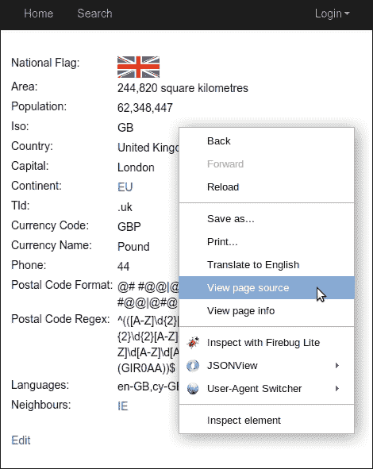
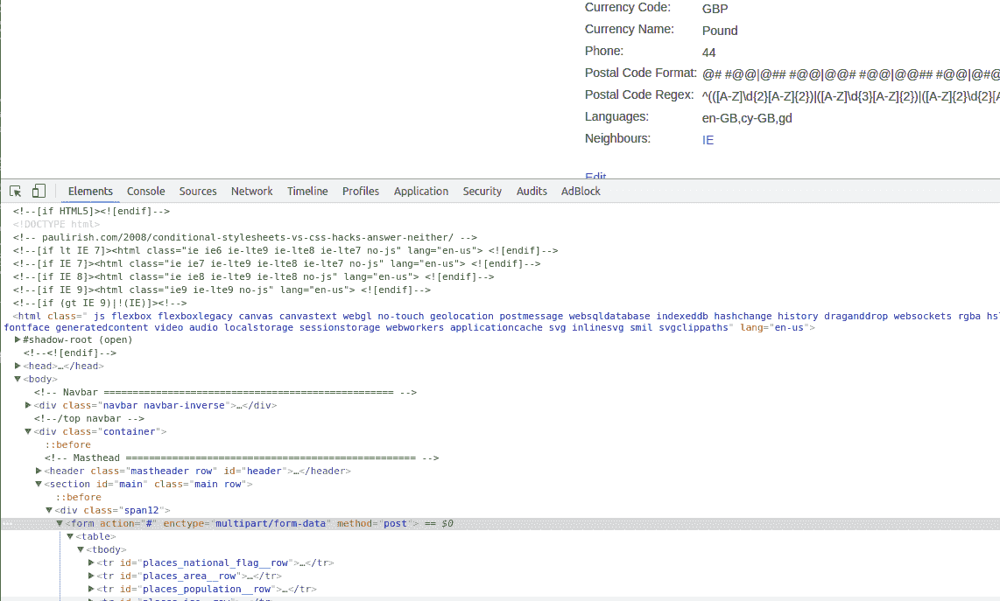
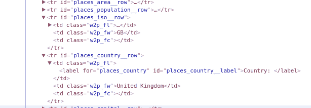
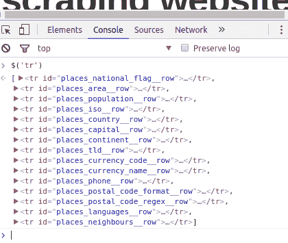
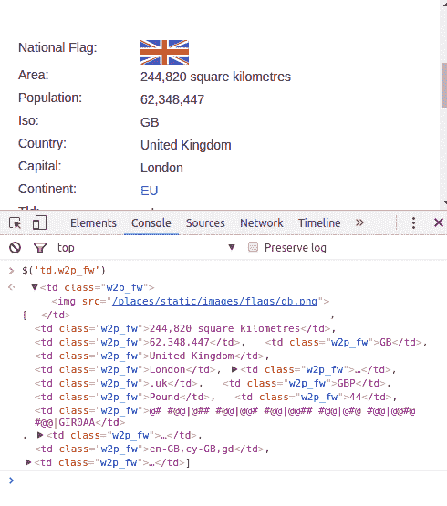
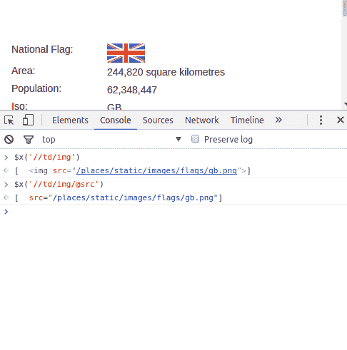
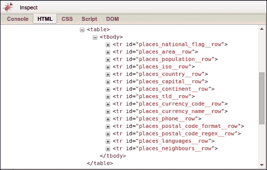
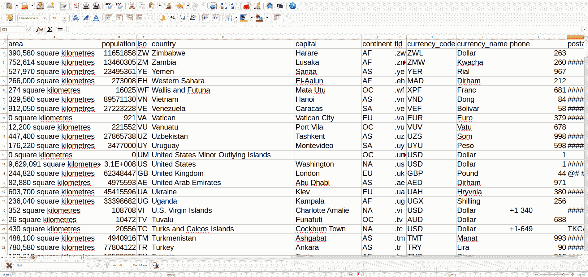

# 爬取数据

在上一章中，我们构建了一个爬虫，该爬虫会跟随链接下载我们想要的网页。这很有趣，但并不实用——爬虫下载了一个网页，然后丢弃了结果。现在，我们需要让这个爬虫通过从每个网页中提取数据来实现一些功能，这被称为**爬取**。

我们将首先介绍浏览器工具来检查网页，如果您有网络开发背景，您可能已经熟悉这些工具。然后，我们将通过使用正则表达式、Beautiful Soup 和 lxml 三种方法来提取网页数据。最后，本章将以这三种爬取替代方案的比较结束。

在本章中，我们将涵盖以下主题：

+   分析网页

+   爬取网页的方法

+   使用控制台

+   xpath 选择器

+   爬取结果

# 分析网页

要了解网页的结构，我们可以尝试检查源代码。在大多数网络浏览器中，可以通过右键点击页面并选择“查看页面源代码”选项来查看网页的源代码：



对于我们的示例网站，我们感兴趣的数据位于国家页面。查看页面源代码（通过浏览器菜单或右键点击浏览器菜单）。在示例页面的英国源代码（[`example.webscraping.com/view/United-Kingdom-239`](http://example.webscraping.com/view/United-Kingdom-239)）中，您将找到一个包含国家数据的表格（您可以在页面源代码中使用搜索来找到它）：

```py
<table> 
<tr id="places_national_flag__row"><td class="w2p_fl"><label for="places_national_flag"      id="places_national_flag__label">National Flag:</label></td>
<td class="w2p_fw"></td><td           class="w2p_fc"></td></tr> 
... 
<tr id="places_neighbours__row"><td class="w2p_fl"><label for="places_neighbours"      id="places_neighbours__label">Neighbours: </label></td><td class="w2p_fw"><div><a href="/iso/IE">IE </a></div></td><td class="w2p_fc"></td></tr></table>

```

对于浏览器来说，缺乏空白和格式化不是问题，但对我们来说阅读起来很困难。为了帮助我们解释这个表格，我们可以使用浏览器工具。要找到您浏览器的开发者工具，您通常可以简单地右键点击并选择一个选项，如“开发者工具”。根据您使用的浏览器，您可能有不同的开发者工具选项，但几乎每个浏览器都会有一个名为“元素”或“HTML”的标签页。在 Chrome 和 Firefox 中，您可以在页面上右键点击一个元素（您感兴趣要爬取的内容）并选择“检查元素”。对于 Internet Explorer，您需要通过按*F12*键打开开发者工具栏。然后您可以通过点击*Ctrl*+*B*来选择项目。如果您使用的是没有内置开发者工具的不同浏览器，您可能想尝试 Firebug Lite 扩展，该扩展适用于大多数网络浏览器，网址为[`getfirebug.com/firebuglite`](https://getfirebug.com/firebuglite)。

当我在网页上的表格上右键点击，并使用 Chrome 的“检查元素”功能时，我会看到一个包含所选元素周围 HTML 层次结构的打开面板：



在这个屏幕截图上，我可以看到 `table` 元素位于 `form` 元素内部。我还可以看到国家的属性包含在 `tr` 或具有不同 CSS ID 的表格行元素中（通过 `id="places_national_flag__row"` 显示）。根据你的浏览器，颜色或布局可能会有所不同，但你应该能够点击元素并遍历层次结构以查看页面上的数据。如果我通过点击它们旁边的箭头进一步展开 `tr` 元素，我会注意到这些行的数据都包含在类为 `w2p_fw` 的 `<td>` 元素中，这是 `<tr>` 元素的子元素，如下所示：



现在我们已经使用浏览器工具调查了页面，我们知道国家数据表的 HTML 层次结构，并拥有从页面爬取这些数据的必要信息。

# 爬取网页的三种方法

既然我们已经了解了这个网页的结构，我们将探讨三种不同的方法来爬取其数据，首先是使用正则表达式，然后是使用流行的 `BeautifulSoup` 模块，最后是使用强大的 `lxml` 模块。

# 正则表达式

如果你不熟悉正则表达式或需要提醒，可以在 [`docs.python.org/3/howto/regex.html`](https://docs.python.org/3/howto/regex.html) 找到详细的概述。即使你使用另一种编程语言使用正则表达式（或 regex），我也建议通过 Python 来复习正则表达式。

由于每个章节可能会构建或使用前几章的部分，我们建议设置你的文件结构类似于 [本书仓库](https://github.com/kjam/wswp) 中的结构。然后所有代码都可以从仓库中的 `code` 目录运行，以便导入正常工作。如果你想要设置不同的结构，请注意，你需要更改其他章节的所有导入（例如以下代码中的 `from chp1.advanced_link_crawler`）。

要使用正则表达式爬取国家区域，我们首先尝试匹配 `<td>` 元素的正文，如下所示：

```py
>>> import re 
>>> from chp1.advanced_link_crawler import download 
>>> url = 'http://example.webscraping.com/view/UnitedKingdom-239' 
>>> html = download(url) 
>>> re.findall(r'<td class="w2p_fw">(.*?)</td>', html) 
['', 
  '244,820 square kilometres', 
  '62,348,447', 
  'GB', 
  'United Kingdom', 
  'London', 
  '<a href="/continent/EU">EU</a>', 
  '.uk', 
  'GBP', 
  'Pound', 
  '44', 
  '@# #@@|@## #@@|@@# #@@|@@## #@@|@#@ #@@|@@#@ #@@|GIR0AA', 
  '^(([A-Z]d{2}[A-Z]{2})|([A-Z]d{3}[A-Z]{2})|([A-Z]{2}d{2}     [A-Z]{2})|([A-Z]{2}d{3}[A-Z]{2})|([A-Z]d[A-Z]d[A-Z]{2})       |([A-Z]{2}d[A-Z]d[A-Z]{2})|(GIR0AA))$', 
  'en-GB,cy-GB,gd', 
  '<div><a href="/iso/IE">IE </a></div>']

```

这个结果显示 `<td class="w2p_fw">` 标签用于多个国家属性。如果我们只想爬取国家区域，我们可以选择第二个匹配元素，如下所示：

```py
>>> re.findall('<td class="w2p_fw">(.*?)</td>', html)[1] 
'244,820 square kilometres'

```

这个解决方案是可行的，但如果网页被更新，它可能会很容易失败。考虑如果这个表格被更改，并且区域不再位于第二个匹配元素中。如果我们现在只需要爬取数据，未来的更改可以忽略。然而，如果我们想在某个时候重新爬取这些数据，我们希望我们的解决方案尽可能地对布局更改具有鲁棒性。为了使这个正则表达式更加具体，我们可以包括具有 ID 的父 `<tr>` 元素，这样它应该是唯一的：

```py
>>> re.findall('<tr id="places_area__row"><td class="w2p_fl"><label for="places_area" id="places_area__label">Area: </label></td><td class="w2p_fw">(.*?)</td>', html) 
['244,820 square kilometres']

```

这个迭代更好；然而，网页还有许多其他可能的方式更新，仍然会破坏正则表达式。例如，双引号可能被改为单引号，`<td>`标签之间可能添加额外的空格，或者`area_label`可能被更改。这里有一个改进的版本，尝试支持这些各种可能性：

```py
>>> re.findall('''<tr id="places_area__row">.*?<tds*class=["']w2p_fw["']>(.*?)</td>''', html) ['244,820 square kilometres']

```

这个正则表达式更具未来性，但构建起来比较困难，而且相当难以阅读。此外，还有许多其他微小的布局更改可能会使其失效，例如如果向`<td>`标签添加了标题属性，或者`tr`或`td`元素改变了它们的 CSS 类或 ID。

从这个例子中可以看出，正则表达式提供了一种快速抓取数据的方法，但它们太脆弱，当网页更新时很容易失效。幸运的是，有更好的数据提取解决方案，例如我们将在本章中涵盖的其他抓取库。

# 美味汤

**Beautiful Soup**是一个流行的库，它解析网页并提供了一个方便的接口来导航内容。如果你还没有这个模块，可以使用以下命令安装最新版本：

```py
 pip install beautifulsoup4

```

使用 Beautiful Soup 的第一步是将下载的 HTML 解析成一个 soup 文档。许多网页不包含完全有效的 HTML，Beautiful Soup 需要纠正不正确的开放和闭合标签。例如，考虑这个包含缺失属性引号和闭合标签的简单网页列表：

```py
        <ul class=country> 
            <li>Area 
            <li>Population 
        </ul>

```

如果将`Population`项解释为`Area`项的子项而不是列表，在抓取时可能会得到意外的结果。让我们看看 Beautiful Soup 是如何处理这个问题的：

```py
>>> from bs4 import BeautifulSoup 
>>> from pprint import pprint
>>> broken_html = '<ul class=country><li>Area<li>Population</ul>' 
>>> # parse the HTML 
>>> soup = BeautifulSoup(broken_html, 'html.parser') 
>>> fixed_html = soup.prettify() 
>>> pprint(fixed_html)

<ul class="country">
 <li>
  Area
  <li>
   Population
  </li>
 </li>
</ul>

```

我们可以看到，使用默认的`html.parser`并没有正确解析 HTML。从前面的代码片段中我们可以看到，它使用了嵌套的`li`元素，这可能会使其导航变得困难。幸运的是，还有更多的解析器选项。我们可以安装**LXML**（如下一节所述）或者我们也可以使用**html5lib**。要安装**html5lib**，只需使用 pip：

```py
pip install html5lib

```

现在，我们可以重复这段代码，只需更改解析器，如下所示：

```py
>>> soup = BeautifulSoup(broken_html, 'html5lib') 
>>> fixed_html = soup.prettify() 
>>> pprint(fixed_html)
<html>
   <head>
   </head>
   <body>
     <ul class="country">
       <li>
         Area
       </li>
       <li>
         Population
       </li>
     </ul>
   </body>
</html>

```

在这里，使用`html5lib`的`BeautifulSoup`能够正确地解释缺失的属性引号和闭合标签，并且添加了`<html>`和`<body>`标签以形成一个完整的 HTML 文档。如果你使用了`lxml`，你应该会看到类似的结果。

现在，我们可以使用`find()`和`find_all()`方法导航到我们想要的元素：

```py
>>> ul = soup.find('ul', attrs={'class':'country'}) 
>>> ul.find('li')  # returns just the first match 
<li>Area</li> 
>>> ul.find_all('li')  # returns all matches 
[<li>Area</li>, <li>Population</li>]

```

要获取所有可用方法和参数的完整列表，官方 Beautiful Soup 文档可在[`www.crummy.com/software/BeautifulSoup/bs4/doc/`](http://www.crummy.com/software/BeautifulSoup/bs4/doc/)找到。

现在，使用这些技术，这里有一个完整的示例来从我们的示例网站中提取国家面积：

```py
>>> from bs4 import BeautifulSoup 
>>> url = 'http://example.webscraping.com/places/view/United-Kingdom-239' 
>>> html = download(url) 
>>> soup = BeautifulSoup(html)   
>>> # locate the area row 
>>> tr = soup.find(attrs={'id':'places_area__row'}) 
>>> td = tr.find(attrs={'class':'w2p_fw'})  # locate the data element
>>> area = td.text  # extract the text from the data element
>>> print(area) 
244,820 square kilometres

```

这段代码比正则表达式更冗长，但更容易构建和理解。此外，我们也不再需要担心微小布局变化中的问题，例如额外的空白或标签属性。我们还知道，如果页面包含 Beautiful Soup 可以帮助清理页面并允许我们从非常损坏的网站代码中提取数据的损坏 HTML。

# Lxml

**Lxml** 是一个基于 C 语言编写的`libxml2` XML 解析库构建的 Python 库，这使得它比 Beautiful Soup 更快，但也更难在一些计算机上安装，特别是 Windows 系统。最新的安装说明可在[`lxml.de/installation.html`](http://lxml.de/installation.html)找到。如果您在安装库时遇到困难，也可以使用 Anaconda 来完成：[`anaconda.org/anaconda/lxml`](https://anaconda.org/anaconda/lxml)。

如果您不熟悉 Anaconda，它是一个由 Continuum Analytics 团队开发的包和环境管理器，主要专注于开放数据科学包。您可以通过遵循他们的设置说明来下载和安装 Anaconda：[`www.continuum.io/downloads`](https://www.continuum.io/downloads)。请注意，使用 Anaconda 快速安装将设置您的`PYTHON_PATH`为 Conda 安装的 Python。

与 Beautiful Soup 一样，使用`lxml`的第一步是将可能无效的 HTML 解析成一致格式。以下是一个解析相同损坏 HTML 的示例：

```py
>>> from lxml.html import fromstring, tostring
>>> broken_html = '<ul class=country><li>Area<li>Population</ul>' 
>>> tree = fromstring(broken_html)  # parse the HTML  
>>> fixed_html = tostring(tree, pretty_print=True) 
>>> print(fixed_html) 
<ul class="country"> 
    <li>Area</li> 
    <li>Population</li> 
</ul>

```

与`BeautifulSoup`一样，`lxml`能够正确解析缺失的属性引号和关闭标签，尽管它没有添加`<html>`和`<body>`标签。这些不是标准 XML 的要求，因此对于`lxml`插入来说是不必要的。

解析输入后，`lxml`有多个不同的选项来选择元素，例如 XPath 选择器和类似于 Beautiful Soup 的`find()`方法。相反，我们将在这里使用 CSS 选择器，因为它们更紧凑，可以在第五章“动态内容”解析动态内容时重复使用。一些读者可能已经从他们的 jQuery 选择器经验或前端 Web 应用开发中使用中熟悉它们。在本章的后面部分，我们将比较这些选择器的性能与 XPath。要使用 CSS 选择器，您可能需要像这样安装`cssselect`库：

```py
pip install cssselect

```

现在我们可以使用`lxml` CSS 选择器从示例页面中提取区域数据：

```py
>>> tree = fromstring(html) 
>>> td = tree.cssselect('tr#places_area__row > td.w2p_fw')[0] 
>>> area = td.text_content() 
>>> print(area) 
244,820 square kilometres

```

通过在我们的树结构上使用`cssselect`方法，我们可以利用 CSS 语法选择具有`places_area__row` ID 的表格行元素，然后是具有`w2p_fw`类的子表格数据标签。由于`cssselect`返回一个列表，我们然后索引第一个结果并调用`text_content`方法，该方法将遍历所有子元素并返回每个元素的连接文本。在这种情况下，我们只有一个元素，但了解这种功能对于更复杂的提取示例是有用的。

您可以在本书的代码存储库中查看此代码和其他章节的代码：[`github.com/kjam/wswp/blob/master/code/chp2.`](https://github.com/kjam/wswp/blob/master/code/chp2.)

# CSS 选择器和您的浏览器控制台

与我们使用 `cssselect` 提取时使用的符号类似，CSS 选择器是用于选择 HTML 元素的模式。以下是一些您应该了解的常见选择器示例：

```py
Select any tag: * 
Select by tag <a>: a 
Select by class of "link": .link  
Select by tag <a> with class "link": a.link 
Select by tag <a> with ID "home": a#home 
Select by child <span> of tag <a>: a > span 
Select by descendant <span> of tag <a>: a span 
Select by tag <a> with attribute title of "Home": a[title=Home]

```

`cssselect` 库实现了大多数 CSS3 选择器，有关不支持的功能（主要是浏览器交互）的详细信息，请参阅[`cssselect.readthedocs.io/en/latest/#supported-selectors`](https://cssselect.readthedocs.io/en/latest/#supported-selectors)。

CSS3 规范是由 W3C 制定的，可在[`www.w3.org/TR/2011/REC-css3-selectors-20110929/`](http://www.w3.org/TR/2011/REC-css3-selectors-20110929/)查看。Mozilla 还提供了一份有用且更易于访问的文档，介绍了 CSS 的开发者参考：[`developer.mozilla.org/en-US/docs/Web/CSS/CSS_Selectors`](https://developer.mozilla.org/en-US/docs/Web/CSS/CSS_Selectors)。

有时测试 CSS 选择器很有用，因为我们可能不会第一次就写得完美。在编写大量可能无法正常工作的 Python 代码之前，在某个地方测试它们以调试任何选择问题也是一个好主意。

当一个网站使用 jQuery 时，在浏览器控制台中测试 CSS 选择器非常容易。控制台是浏览器开发者工具的一部分，允许您在当前页面上执行 JavaScript（如果支持，还可以执行 jQuery）。

要了解更多关于 jQuery 的信息，有几个免费的在线课程。如果您想深入了解，可以在[`try.jquery.com/`](http://try.jquery.com/)的 Code School 课程中找到各种练习。

您需要了解的唯一语法是使用 jQuery 的简单对象选择（即 `$('div.class_name');`）。jQuery 使用 `$` 和括号来选择对象。在括号内，您可以编写任何 CSS 选择器。在支持 jQuery 的网站上的浏览器控制台中这样做，您可以看到您选择的对象。由于我们知道示例网站使用 jQuery（可以通过检查源代码，或者查看“网络”选项卡并寻找 jQuery 加载，或者使用 `detectem` 模块），我们可以尝试使用 CSS 选择器选择所有 `tr` 元素：



仅通过使用标签名，我就可以看到国家数据的每一行。我还可以尝试使用更长的 CSS 选择器来选择元素。让我们尝试选择所有具有类 `w2p_fw` 的 `td` 元素，因为我知道这是页面上的主要数据所在位置。



你可能也会注意到，当使用鼠标点击返回的元素时，你可以展开它们，并在上面的窗口中突出显示它们（取决于你使用的浏览器）。这是一种极其有用的测试数据的方法。如果你正在抓取的网站没有从你的浏览器加载 JQuery 或其他任何与选择器友好的库，你可以使用简单的 JavaScript 通过`document`对象执行相同的查找。`querySelector`方法的文档可在**Mozilla 开发者网络**上找到：[`developer.mozilla.org/en-US/docs/Web/API/Document/querySelector`](https://developer.mozilla.org/en-US/docs/Web/API/Document/querySelector)。

即使在控制台和`lxml`中使用 CSS 选择器之后，学习 XPath 也可能很有用，因为`lxml`在评估之前会将所有的 CSS 选择器转换为 XPath。为了继续学习如何使用 XPath，请继续阅读！

# XPath 选择器

有时候使用 CSS 选择器可能不起作用。这尤其适用于非常损坏的 HTML 或不正确格式化的元素。尽管像`BeautifulSoup`和`lxml`这样的库尽力正确解析和清理代码，但它并不总是有效 - 在这种情况下，XPath 可以帮助你根据页面元素之间的层次关系构建非常具体的选择器。

XPath 是一种描述 XML 文档中关系的方式，作为一个层次结构。因为 HTML 是使用 XML 元素形成的，所以我们也可以使用 XPath 在 HTML 文档中导航和选择元素。

要了解更多关于 XPath 的信息，请查看**Mozilla 开发者文档**：[`developer.mozilla.org/en-US/docs/Web/XPath`](https://developer.mozilla.org/en-US/docs/Web/XPath)。

XPath 遵循一些基本的语法规则，并且与 CSS 选择器有一些相似之处。请查看以下图表，了解两者之间的快速参考。

| **选择器描述** | **XPath 选择器** | **CSS 选择器** |
| --- | --- | --- |
| 选择所有链接 | '//a' | 'a' |
| 选择具有“main”类的 div | '//div[@class="main"]' | 'div.main' |
| 选择 ID 为“list”的 ul | '//ul[@id="list"]' | 'ul#list' |
| 从所有段落中选择文本 | '//p/text()' | 'p*' |
| 选择类中包含'test'的所有 div | '//div[contains(@class, 'test')]' | 'div [class*="test"]' |
| 选择包含链接或列表的所有 div | '//div[a | ul]' | 'div a, div ul' |
| 选择 href 中包含 google.com 的链接 | '//a[contains(@href, "google.com")] | 'a*' |

如您从前面的表中可以看出，语法之间有许多相似之处。然而，在图表中，有一些 CSS 选择器用 `*` 标记，这表明使用 CSS 无法精确地选择这些元素，我们已提供了最佳替代方案。在这些情况下，如果您使用 `cssselect`，您将需要在 Python 和/或 `lxml` 中进行进一步的操作或迭代。希望这个比较已经向您介绍了 XPath，并让您相信它比简单地使用 CSS 更精确和具体。

现在我们已经对 XPath 语法有了基本的了解，让我们看看我们如何可以将其用于我们的示例网站：

```py
>>> tree = fromstring(html)
>>> area = tree.xpath('//tr[@id="places_area__row"]/td[@class="w2p_fw"]/text()')[0]
>>> print(area)
244,820 square kilometres

```

与 CSS 选择器类似，您也可以在浏览器控制台中测试 XPath 选择器。要做到这一点，在具有选择器的页面上，只需使用 `$x('pattern_here');` 选择器。同样，您也可以使用简单的 JavaScript 中的 `document` 对象并调用 `evaluate` 方法。

Mozilla 开发者网络有一个有用的介绍，介绍了如何使用 XPath 与 JavaScript 教程：[`developer.mozilla.org/en-US/docs/Introduction_to_using_XPath_in_JavaScript`](https://developer.mozilla.org/en-US/docs/Introduction_to_using_XPath_in_JavaScript)

如果我们想要测试寻找包含图像的 `td` 元素以从国家页面获取标志数据，我们可以在浏览器中首先测试我们的 XPath 模式：



在这里，我们可以看到我们可以使用属性来指定我们想要提取的数据（例如 `@src`）。通过在浏览器中进行测试，我们可以节省调试时间，并立即获得易于阅读的结果。

我们将在本章和后续章节中使用 XPath 和 CSS 选择器，这样您可以更熟悉它们，并在提高您的网络爬虫能力时更有信心地使用它们。

# LXML 和家谱

`lxml` 还具有在 HTML 页面内遍历家谱的能力。什么是家谱？当您使用浏览器的开发者工具调查页面上的元素，并且能够展开或收起它们时，您正在观察 HTML 中的家谱关系。网页上的每个元素都可以有父元素、兄弟元素和子元素。这些关系可以帮助我们更轻松地遍历页面。

例如，如果我想在页面上找到同一节点深度级别的所有元素，我就会寻找它们的兄弟元素。或者，也许我想找到页面上特定元素的子元素。`lxml` 允许我们通过简单的 Python 代码使用这些关系中的许多。

例如，让我们调查示例页面上 `table` 元素的所有子元素：

```py
>>> table = tree.xpath('//table')[0]
>>> table.getchildren()
[<Element tr at 0x7f525158ec78>,
 <Element tr at 0x7f52515ad638>,
 <Element tr at 0x7f52515ad5e8>,
 <Element tr at 0x7f52515ad688>,
 <Element tr at 0x7f52515ad728>,
...]

```

我们还可以看到表格的兄弟元素和父元素：

```py
>>> prev_sibling = table.getprevious()
>>> print(prev_sibling)
None
>>> next_sibling = table.getnext()
>>> print(next_sibling)
<Element div at 0x7f5252fe9138>
>>> table.getparent()
<Element form at 0x7f52515ad3b8>

```

如果你需要一个更通用的方法来访问页面上的元素，结合遍历家族关系和 XPath 表达式是一种确保不遗漏任何内容的好方法。这可以帮助你从许多不同类型的页面上提取内容，在这些页面上，你只需通过识别出现在页面元素附近的内容，就能简单地识别页面的某些重要部分。这种方法即使在元素没有可识别的 CSS 选择器的情况下也能工作。

# 性能比较

为了帮助评估本节中描述的三个抓取方法之间的权衡，即“三种抓取网页的方法”，比较它们的相对效率将是有帮助的。通常，抓取器会从一个网页中提取多个字段。因此，为了进行更现实的比较，我们将实现每个抓取器的扩展版本，这些版本将从一个国家的网页中提取所有可用数据。为了开始，我们需要回到我们的浏览器中检查其他国家特征的格式，如下所示：



通过使用我们浏览器的检查功能，我们可以看到每一行表格都有一个以 `places_` 开头并以 `__row` 结尾的 ID。国家数据以与区域示例相同的格式包含在这些行中。以下是一些使用这些信息提取所有可用国家数据的实现示例：

```py
FIELDS = ('area', 'population', 'iso', 'country', 'capital', 'continent', 'tld', 'currency_code', 'currency_name', 'phone', 'postal_code_format', 'postal_code_regex', 'languages', 'neighbours') 

import re 
def re_scraper(html): 
    results = {} 
    for field in FIELDS: 
        results[field] = re.search('<tr id="places_%s__row">.*?<td class="w2p_fw">(.*?)</td>' % field, html).groups()[0] 
    return results 

from bs4 import BeautifulSoup 
def bs_scraper(html): 
    soup = BeautifulSoup(html, 'html.parser') 
    results = {} 
    for field in FIELDS: 
        results[field] = soup.find('table').find('tr',id='places_%s__row' % field).find('td',                  class_='w2p_fw').text 
    return results 

from lxml.html import fromstring
def lxml_scraper(html): 
    tree = fromstring(html) 
    results = {} 
    for field in FIELDS: 
        results[field] = tree.cssselect('table > tr#places_%s__row > td.w2p_fw' % field)[0].text_content() 
    return results 

def lxml_xpath_scraper(html):
    tree = fromstring(html)
    results = {}
    for field in FIELDS:
        results[field] = tree.xpath('//tr[@id="places_%s__row"]/td[@class="w2p_fw"]' % field)[0].text_content()
    return results

```

# 抓取结果

现在我们已经为每个抓取器完成了完整的实现，我们将使用此片段测试它们的相对性能。代码中的导入期望你的目录结构与本书的存储库相似，所以请根据需要调整：

```py
import time
import re
from chp2.all_scrapers import re_scraper, bs_scraper, 
    lxml_scraper, lxml_xpath_scraper
from chp1.advanced_link_crawler import download

NUM_ITERATIONS = 1000 # number of times to test each scraper
html = download('http://example.webscraping.com/places/view/United-Kingdom-239')

scrapers = [
   ('Regular expressions', re_scraper),
   ('BeautifulSoup', bs_scraper),
   ('Lxml', lxml_scraper),
   ('Xpath', lxml_xpath_scraper)]

for name, scraper in scrapers:
    # record start time of scrape
    start = time.time()
    for i in range(NUM_ITERATIONS):
        if scraper == re_scraper:
            re.purge()
        result = scraper(html)
        # check scraped result is as expected
        assert result['area'] == '244,820 square kilometres'
    # record end time of scrape and output the total
    end = time.time()
    print('%s: %.2f seconds' % (name, end - start))

```

此示例将运行每个抓取器 1000 次，检查抓取结果是否符合预期，然后打印出总耗时。这里使用的 `download` 函数是前面章节中定义的。注意高亮显示的调用 `re.purge()` 的行；默认情况下，正则表达式模块会缓存搜索，并且需要清除这个缓存，以便与其他抓取方法进行公平的比较。

这是我在我的电脑上运行此脚本的结果：

```py
    $ python chp2/test_scrapers.py 
    Regular expressions: 1.80 seconds
    BeautifulSoup: 14.05 seconds
    Lxml: 3.08 seconds
    Xpath: 1.07 seconds

```

由于使用的硬件不同，你电脑上的结果很可能会有所不同。然而，每种方法之间的相对差异应该是相似的。结果显示，当用于抓取我们的示例网页时，Beautiful Soup 比其他方法慢了六倍以上。这个结果是可以预料的，因为`lxml`和正则表达式模块是用 C 编写的，而`BeautifulSoup`是纯 Python 编写的。一个有趣的事实是，`lxml`与正则表达式相比表现相当好，因为`lxml`在搜索元素之前必须将输入解析为其内部格式的额外开销。当我们从网页抓取许多特征时，这种初始解析开销减少，`lxml`变得更加有竞争力。正如我们通过 XPath 解析器所看到的，`lxml`能够直接与正则表达式竞争。这真是一个令人惊叹的模块！

虽然我们强烈建议你使用`lxml`进行解析，但网络抓取的最大性能瓶颈通常是网络。我们将讨论并行化工作流程的方法，通过让多个请求并行工作来提高你爬虫的速度。

# 抓取概述

以下表格总结了每种抓取方法的优缺点：

| **抓取方法** | **性能** | **易用性** | **安装难度** |
| --- | --- | --- | --- |
| 正则表达式 | 快速 | 困难 | 容易（内置模块） |
| Beautiful Soup | 慢速 | 容易 | 容易（纯 Python） |
| Lxml | 快速 | 容易 | 中等难度 |

如果速度对你来说不是问题，并且你更喜欢只通过 pip 安装库，那么使用较慢的方法，例如 Beautiful Soup，就不会有问题。或者，如果你只需要抓取少量数据并且想避免额外的依赖，正则表达式可能是一个合适的选择。然而，总的来说，`lxml`是抓取的最佳选择，因为它既快又健壮，而正则表达式和 Beautiful Soup 则不那么快，也不容易修改。

# 在链接爬虫中添加抓取回调

现在我们知道了如何抓取国家数据，我们可以将此集成到第一章中构建的链接爬虫中，*网络抓取简介*。为了允许重用相同的爬虫代码抓取多个网站，我们将添加一个`callback`参数来处理抓取。`callback`是一个函数，将在某些事件（在这种情况下，网页下载后）之后被调用。这个抓取`callback`将接受一个`url`和`html`作为参数，并可选择返回一个要爬取的进一步 URL 列表。以下是 Python 中的实现，它很简单：

```py
def link_crawler(..., scrape_callback=None): 
    ... 
    data = [] 
    if scrape_callback: 
        data.extend(scrape_callback(url, html) or []) 
        ...

```

前面的代码片段中突出显示了抓取`回调`函数的新代码，这个版本的链接爬虫的完整源代码可在[`github.com/kjam/wswp/blob/master/code/chp2/advanced_link_crawler.py`](https://github.com/kjam/wswp/blob/master/code/chp2/advanced_link_crawler.py)找到。

现在，这个爬虫可以通过自定义传递给`scrape_callback`的函数来用于抓取多个网站。下面是一个修改后的`lxml`示例爬虫，它可以用于`回调`函数：

```py
def scrape_callback(url, html): 
    fields = ('area', 'population', 'iso', 'country', 'capital',
              'continent', 'tld', 'currency_code', 'currency_name',
              'phone', 'postal_code_format', 'postal_code_regex',
              'languages', 'neighbours')
    if re.search('/view/', url): 
        tree = fromstring(html) 
        all_rows = [
            tree.xpath('//tr[@id="places_%s__row"]/td[@class="w2p_fw"]' % field)[0].text_content()
            for field in fields] 
        print(url, all_rows)

```

这个`回调`函数将抓取国家数据并将其打印出来。我们可以通过导入这两个函数并使用我们的正则表达式和 URL 来测试它：

```py
>>> from chp2.advanced_link_crawler import link_crawler, scrape_callback
>>> link_crawler('http://example.webscraping.com', '/(index|view)/', scrape_callback=scrape_callback)

```

你现在应该能看到输出显示正在下载页面，以及一些显示 URL 和抓取数据的行，如下所示：

```py
Downloading: http://example.webscraping.com/view/Botswana-30
http://example.webscraping.com/view/Botswana-30 ['600,370 square kilometres', '2,029,307', 'BW', 'Botswana', 'Gaborone', 'AF', '.bw', 'BWP', 'Pula', '267', '', '', 'en-BW,tn-BW', 'ZW ZA NA ']

```

通常，当我们抓取网站时，我们希望重用数据而不是简单地打印它，因此我们将扩展这个示例以将结果保存到 CSV 电子表格中，如下所示：

```py
import csv 
import re
from lxml.html import fromstring
class CsvCallback: 
    def __init__(self): 
        self.writer = csv.writer(open('../data/countries.csv', 'w')) 
        self.fields = ('area', 'population', 'iso', 'country', 
                       'capital', 'continent', 'tld', 'currency_code', 'currency_name', 
                       'phone', 'postal_code_format', 'postal_code_regex', 
                       'languages', 'neighbours') 
        self.writer.writerow(self.fields) 

    def __call__(self, url, html): 
        if re.search('/view/', url): 
            tree = fromstring(html)
            all_rows = [
                tree.xpath(
                  '//tr[@id="places_%s__row"]/td[@class="w2p_fw"]' % field)[0].text_content()
                for field in self.fields] 
             self.writer.writerow(all_rows)

```

为了构建这个`回调`，使用了类而不是函数，以便可以维护`csv`写入器的状态。这个`csv`写入器在构造函数中实例化，然后在`__call__`方法中多次写入。请注意，`__call__`是一个特殊方法，当对象作为函数“调用”时会被调用，这就是链接爬虫中`cache_callback`的使用方式。这意味着`scrape_callback(url, html)`等同于调用`scrape_callback.__call__(url, html)`。有关 Python 特殊类方法的更多详细信息，请参阅[`docs.python.org/3/reference/datamodel.html#special-method-names`](https://docs.python.org/3/reference/datamodel.html#special-method-names)。

这是如何将这个回调传递给链接爬虫的示例：

```py
>>> from chp2.advanced_link_crawler import link_crawler
>>> from chp2.csv_callback import CsvCallback
>>> link_crawler('http://example.webscraping.com/', '/(index|view)', max_depth=-1, scrape_callback=CsvCallback())

```

注意，`CsvCallback`期望在运行代码的父文件夹同一级别上有一个`data`目录。这也可以修改，但我们建议你遵循良好的编码实践，并将你的代码和数据分开--这样你可以将代码置于版本控制之下，同时将`data`文件夹放在`.gitignore`文件中。以下是一个示例目录结构：

```py
wswp/
|-- code/
|    |-- chp1/
|    |    + (code files from chp 1)
|    +-- chp2/
|         + (code files from chp 2)
|-- data/
|    + (generated data files)
|-- README.md
+-- .gitignore

```

现在，当使用这个`scrape_callback`运行爬虫时，它将结果保存到 CSV 文件中，可以在 Excel 或 LibreOffice 等应用程序中查看。它可能比第一次运行时间稍长，因为它正在积极收集信息。当爬虫退出时，你应该能够查看包含所有数据的 CSV 文件：



成功！我们已经完成了我们的第一个工作爬虫。

# 摘要

在本章中，我们探讨了从网页中抓取数据的多种方法。正则表达式对于一次性抓取或避免解析整个网页的开销非常有用，而`BeautifulSoup`提供了一个高级接口，同时避免了任何复杂的依赖。然而，总的来说，由于`lxml`的速度和广泛的功能，它将是最佳选择，因此我们将在未来的示例中使用它。

我们还学习了如何使用浏览器工具和控制台检查 HTML 页面，并定义 CSS 选择器和 XPath 选择器以匹配和从下载的页面中提取内容。

在下一章中，我们将介绍缓存，这允许我们保存网页，以便在第一次运行爬虫时只需下载一次。
