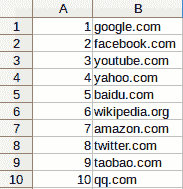
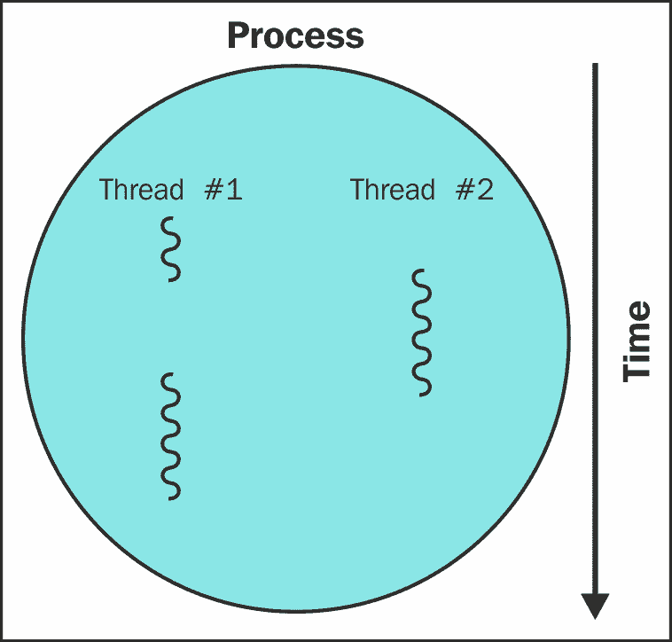

# 第四章：并发下载

在前面的章节中，我们的爬虫是顺序下载网页，每次下载完成后才开始下一个下载。对于相对较小的示例网站，顺序下载是可行的，但对于较大的爬取来说很快就会变得不切实际。以平均每秒下载一个网页的速度来爬取一百万个网页的网站，需要超过 11 天的连续下载时间。通过同时下载多个网页，可以显著提高这个时间。

本章将介绍使用多线程和多进程下载网页，并比较其与顺序下载的性能。

在本章中，我们将介绍以下主题：

+   一百万个网页

+   顺序爬虫

+   线程爬虫

+   多进程爬虫

# 一百万个网页

为了测试并发下载的性能，拥有一个更大的目标网站会更理想。因此，我们将使用 Alexa 排名列表，该列表根据安装了 Alexa 工具栏的用户追踪了最受欢迎的前一百万个网站。只有一小部分人使用这个浏览器插件，所以数据并非权威，但对于我们的目的来说足够好，并且为我们提供了更大的列表进行爬取。

这些前一百万个网页可以在 Alexa 网站上浏览，网址为[`www.alexa.com/topsites`](http://www.alexa.com/topsites)。此外，该列表的压缩电子表格可在[`s3.amazonaws.com/alexa-static/top-1m.csv.zip`](http://s3.amazonaws.com/alexa-static/top-1m.csv.zip)找到，因此不需要从 Alexa 抓取数据。

# 解析 Alexa 列表

Alexa 排名列表以电子表格的形式提供，包含排名和域名的列：



提取这些数据需要以下步骤：

1.  下载`.zip`文件。

1.  从`.zip`文件中提取 CSV 文件。

1.  解析 CSV 文件。

1.  遍历 CSV 文件的每一行以提取域名。

下面是一个实现这一点的示例：

```py
import csv 
from zipfile import ZipFile 
from io import BytesIO, TextIOWrapper 
import requests

resp = requests.get('http://s3.amazonaws.com/alexa-static/top-1m.csv.zip', stream=True) 
urls = [] # top 1 million URL's will be stored in this list 
with ZipFile(BytesIO(resp.content)) as zf:
    csv_filename = zf.namelist()[0]
    with zf.open(csv_filename) as csv_file:
        for _, website in csv.reader(TextIOWrapper(csv_file)):
            urls.append('http://' + website)

```

你可能已经注意到下载的压缩数据被`BytesIO`类包装，并传递给`ZipFile`。这是必要的，因为`ZipFile`期望一个文件接口而不是原始字节对象。我们还利用`stream=True`来加速请求。接下来，从文件名列表中提取 CSV 文件名。`.zip`文件只包含一个文件，因此选择第一个文件名。然后，使用`TextIOWrapper`读取 CSV 文件，以帮助处理编码和读取问题。然后迭代该文件，并将第二列中的域名添加到 URL 列表中。在每个域名前添加`http://`协议，使它们成为有效的 URL。

为了能够重用之前开发的爬虫函数，需要将其修改为一个易于调用的类：

```py
class AlexaCallback:
    def __init__(self, max_urls=500):
        self.max_urls = max_urls
        self.seed_url = 'http://s3.amazonaws.com/alexa-static/top-1m.csv.zip'
        self.urls = []

    def __call__(self):
        resp = requests.get(self.seed_url, stream=True)
        with ZipFile(BytesIO(resp.content)) as zf:
            csv_filename = zf.namelist()[0]
            with zf.open(csv_filename) as csv_file:
                for _, website in csv.reader(TextIOWrapper(csv_file)):
                    self.urls.append('http://' + website)
                    if len(self.urls) == self.max_urls:
                        break

```

在这里添加了一个新的输入参数，称为`max_urls`，它设置从 Alexa 文件中提取的 URL 数量。默认情况下，这设置为 500 个 URL，因为下载一百万个网页需要很长时间（如章节介绍中所述，顺序下载需要超过 11 天）。

# 顺序爬虫

现在我们可以使用稍作修改的链接爬虫，与之前开发的版本一起下载前 500 个 Alexa URL，以顺序方式下载。要更新链接爬虫，它现在可以接受一个起始 URL 或一组起始 URL：

```py
# In link_crawler function

if isinstance(start_url, list):
    crawl_queue = start_url
else:
    crawl_queue = [start_url]

```

我们还需要更新处理每个网站的`robots.txt`的方式。我们使用一个简单的字典来存储每个域的解析器（见：[`github.com/kjam/wswp/blob/master/code/chp4/advanced_link_crawler.py#L53-L72`](https://github.com/kjam/wswp/blob/master/code/chp4/advanced_link_crawler.py#L53-L72)）。我们还需要处理我们遇到的不一定是相对 URL 的事实，其中一些甚至不是我们可以访问的 URL，例如带有`mailto:`或`javascript:`事件命令的电子邮件地址。此外，由于一些网站没有`robots.txt`文件和其他格式不佳的 URL，我们添加了一些额外的错误处理部分和一个新的`no_robots`变量，允许我们在无法在良好信念下找到`robots.txt`文件时继续爬取。最后，我们添加了`socket.setdefaulttimeout(60)`来处理`robotparser`的超时，以及第三章中`Caching Downloads`的`Downloader`类的额外`timeout`参数。

处理这些情况的主要代码可在[`github.com/kjam/wswp/blob/master/code/chp4/advanced_link_crawler.py`](https://github.com/kjam/wswp/blob/master/code/chp4/advanced_link_crawler.py)找到。新的爬虫可以直接与`AlexaCallback`一起使用，并在命令行中按以下方式运行：

```py
python chp4/advanced_link_crawler.py
...
Total time: 1349.7983705997467s

```

查看文件`__main__`部分运行的代码，我们使用`'$^'`作为我们的模式以避免从每个页面收集链接。你也可以尝试使用`'.'`来匹配所有内容，以爬取每页上的所有链接。（警告：这可能会花费很长时间，可能需要几天！）

仅爬取第一页的时间与顺序下载的预期时间相同，平均每个 URL 大约需要 2.7 秒（这包括测试`robots.txt`文件的时间）。根据你的 ISP 速度，以及如果你在云服务器上运行脚本，你可能会看到更快的结果。

# 线程爬虫

现在我们将扩展顺序爬虫以并行下载网页。请注意，如果不当使用，线程爬虫可能会请求内容过快，从而超载一个 Web 服务器或导致你的 IP 地址被封锁。

为了避免这种情况，我们的爬虫将有一个`delay`标志来设置对同一域名请求之间的最小秒数。

本章中使用的 Alexa 列表示例涵盖了 100 万个独立域名，因此这个特定问题在这里不适用。然而，在将来从单个域名爬取许多网页时，应考虑在下载之间至少延迟一秒钟。

# 线程和进程的工作原理

下面是包含多个执行线程的进程图：



当运行 Python 脚本或任何其他计算机程序时，会创建一个进程，包含代码和状态，以及堆栈。这些进程由计算机的 CPU 核心执行。然而，每个核心一次只能执行一个线程，并且会快速在这些线程之间切换，以给人一种同时运行多个程序的感觉。同样，在进程内部，程序执行可以在多个线程之间切换，每个线程执行程序的不同部分。

这意味着当一个线程正在等待网页下载时，进程可以切换并执行另一个线程，以避免浪费 CPU 周期。因此，为了尽可能快地使用我们计算机上的所有计算资源来下载数据，需要将我们的下载分配到多个线程和进程中。

# 实现多线程爬虫

幸运的是，Python 使得线程相对简单。这意味着我们可以保持与第一章中开发的链接爬虫类似的排队结构，但将爬取循环移入一个函数中。以下是修改后的链接爬虫的开始部分，将`crawl`循环移动到函数中：

```py
import time 
import threading 
...
SLEEP_TIME = 1 

def threaded_crawler(..., max_threads=10, scraper_callback=None): 
    ...

    def process_queue(): 
        while crawl_queue: 
            ... 

```

下面是`threaded_crawler`函数的剩余部分，用于在多个线程中启动`process_queue`并等待它们完成：

```py
threads = [] 
    while threads or crawl_queue: 
        # the crawl is still active 
        for thread in threads: 
            if not thread.is_alive(): 
                # remove the stopped threads 
                threads.remove(thread) 
        while len(threads) < max_threads and crawl_queue: 
            # can start some more threads 
            thread = threading.Thread(target=process_queue) 
            # set daemon so main thread can exit when receives ctrl-c 
            thread.setDaemon(True) 
            thread.start() 
            threads.append(thread) 
        # all threads have been processed # sleep temporarily so CPU can focus execution elsewhere 
        for thread in threads:
            thread.join()        
        time.sleep(SLEEP_TIME))

```

上一段代码中的循环将在有要爬取的 URL 时持续创建线程，直到达到设置的线程最大数量。在爬取过程中，如果队列中没有更多的 URL，线程可能会提前关闭。例如，考虑有两个线程和两个要下载的 URL 的情况。当第一个线程完成下载后，爬取队列为空，因此该线程退出。然而，第二个线程可能完成下载并发现更多要下载的 URL。此时，`thread`循环将注意到仍有更多 URL 要下载，且线程数量尚未达到最大值，因此它将创建一个新的下载线程。

我们还可能希望稍后为此线程化爬虫添加解析功能。为此，我们可以添加一个用于函数回调的 HTML 返回值的部分。我们可能希望从这个逻辑或提取中返回更多链接，因此我们还需要在后面的`for`循环中扩展我们解析的链接：

```py
html = D(url, num_retries=num_retries)
if not html:
    continue
if scraper_callback:
    links = scraper_callback(url, html) or []
else:
    links = []
# filter for links matching our regular expression
for link in get_links(html) + links:
    ...

```

完全更新的代码可以在[`github.com/kjam/wswp/blob/master/code/chp4/threaded_crawler.py.`](https://github.com/kjam/wswp/blob/master/code/chp4/threaded_crawler.py)查看。为了进行公平测试，您还需要刷新您的`RedisCache`或使用不同的默认数据库。如果您已安装`redis-cli`，您可以从命令行轻松完成此操作：

```py
$ redis-cli
127.0.0.1:6379> FLUSHALL
OK
127.0.0.1:6379>

```

要退出，请使用正常的程序退出（通常是*Ctrl* + *C*或*cmd* + *C*）。现在，让我们使用以下命令测试这个多线程版本的链接爬虫的性能：

```py
$ python code/chp4/threaded_crawler.py
...
Total time: 361.50403571128845s

```

如果您查看这个爬虫的`__main__`部分，您会注意到您可以轻松地将参数传递给此脚本，包括`max_threads`和`url_pattern`。在先前的示例中，我们使用默认值`max_threads=5`和`url_pattern='$^'`。

由于有五个线程，下载速度几乎快了四倍！再次提醒，您的结果可能会根据您的 ISP 或是否从服务器运行脚本而有所不同。关于线程性能的进一步分析将在*性能*部分进行讨论。

# 多进程爬虫

为了进一步提高性能，可以将多线程示例扩展以支持多个进程。目前，爬取队列存储在本地内存中，这意味着其他进程不能为相同的爬取做出贡献。为了解决这个问题，爬取队列将被转移到 Redis。独立存储队列意味着即使在不同服务器上的爬虫也可以合作进行相同的爬取。

对于更健壮的队列，应考虑使用专门的分布式任务工具，如 Celery；然而，在这里将重用 Redis 以最小化引入的技术和依赖项。以下是新 Redis 支持的队列的实现：

```py
# Based loosely on the Redis Cookbook FIFO Queue:
# http://www.rediscookbook.org/implement_a_fifo_queue.html
from redis import StrictRedis

class RedisQueue:
    """ RedisQueue helps store urls to crawl to Redis
        Initialization components:
        client: a Redis client connected to the key-value database for
                the web crawling cache (if not set, a localhost:6379
                default connection is used).
        db (int): which database to use for Redis
        queue_name (str): name for queue (default: wswp)
    """

    def __init__(self, client=None, db=0, queue_name='wswp'):
        self.client = (StrictRedis(host='localhost', port=6379, db=db)
                       if client is None else client)
        self.name = "queue:%s" % queue_name
        self.seen_set = "seen:%s" % queue_name
        self.depth = "depth:%s" % queue_name

    def __len__(self):
        return self.client.llen(self.name)

    def push(self, element):
        """Push an element to the tail of the queue"""
        if isinstance(element, list):
            element = [e for e in element if not self.already_seen(e)]
            self.client.lpush(self.name, *element)
            self.client.sadd(self.seen_set, *element)
        elif not self.client.already_seen(element):
            self.client.lpush(self.name, element)
            self.client.sadd(self.seen_set, element)

    def pop(self):
        """Pop an element from the head of the queue"""
        return self.client.rpop(self.name)

    def already_seen(self, element):
       """ determine if an element has already been seen """
       return self.client.sismember(self.seen_set, element)

    def set_depth(self, element, depth):
        """ Set the seen hash and depth """
        self.client.hset(self.depth, element, depth)

    def get_depth(self, element):
        """ Get the seen hash and depth """
        return self.client.hget(self.depth, element)

```

在前面的`RedisQueue`类中，我们可以看到我们维护了几种不同的数据类型。首先，我们有预期的 Redis 列表类型，它通过`lpush`和`rpop`命令处理，队列的名称存储在`self.name`属性中。

接下来，我们有一个 Redis 集合，它的工作方式类似于具有唯一成员资格的 Python 集合。集合名称存储在`self.seen_set`中，并通过`sadd`和`sismember`方法（用于添加新键和测试成员资格）进行管理。

最后，我们将深度功能移动到了`set_depth`和`get_depth`方法中，这些方法使用一个普通的 Redis 哈希表，名称存储在`self.depth`中，每个 URL 作为键，深度作为值。代码中的一个有用补充是设置域名最后访问的时间，这样我们可以为我们的`Downloader`类提供一个更高效的`delay`功能。这留作读者的练习。

如果您需要一个具有更多功能但与 Redis 相同可用性的队列，我建议查看`python-rq`（[`python-rq.org/`](http://python-rq.org/)），这是一个易于使用和安装的 Python 作业队列，类似于 Celery，但功能较少且依赖项较少。

继续使用我们当前的`RedisQueue`实现，我们需要对线程爬虫进行一些更新以支持新的队列类型，这些更新在此处突出显示：

```py
def threaded_crawler_rq(...): 
    ... 
    # the queue of URL's that still need to be crawled 
    crawl_queue = RedisQueue() 
    crawl_queue.push(seed_url) 

    def process_queue(): 
        while len(crawl_queue):
            url = crawl_queue.pop()
        ...

```

第一个变化是将我们的 Python 列表替换为新的基于 Redis 的队列，命名为`RedisQueue`。这个队列内部处理重复的 URL，因此不再需要`seen`变量。最后，调用`RedisQueue`的`len`方法来确定队列中是否还有 URL。进一步处理深度和已见功能的逻辑更改如下所示：

```py
## inside process_queue
if no_robots or rp.can_fetch(user_agent, url):
    depth = crawl_queue.get_depth(url) or 0
    if depth == max_depth:
        print('Skipping %s due to depth' % url)
        continue
    html = D(url, num_retries=num_retries)
    if not html:
        continue
    if scraper_callback:
        links = scraper_callback(url, html) or []
    else:
        links = []
    # filter for links matching our regular expression
    for link in get_links(html, link_regex) + links:
        if 'http' not in link:
            link = clean_link(url, domain, link)
        crawl_queue.push(link)
        crawl_queue.set_depth(link, depth + 1)

```

完整的代码可以在[`github.com/kjam/wswp/blob/master/code/chp4/threaded_crawler_with_queue.py`](http://github.com/kjam/wswp/blob/master/code/chp4/threaded_crawler_with_queue.py)中查看。

使用这个片段可以启动更新后的线程爬虫，使用多个进程：

```py
import multiprocessing 

def mp_threaded_crawler(args, **kwargs): 
    num_procs = kwargs.pop('num_procs')
    if not num_procs:
        num_cpus = multiprocessing.cpu_count() 
    processes = [] 
    for i in range(num_procs): 
        proc = multiprocessing.Process(
            target=threaded_crawler_rq, args=args,                    
            kwargs=kwargs) 
        proc.start() 
        processes.append(proc) 
    # wait for processes to complete 
    for proc in processes: 
        proc.join()

```

这种结构可能看起来很熟悉，因为 multiprocessing 模块遵循与本章早期使用的 threading 模块相似的接口。此代码要么利用可用的 CPU 数量（在我的机器上是八个），要么通过启动脚本时传递的参数`num_procs`。然后，每个进程启动线程爬虫并等待所有进程完成执行。

现在，让我们使用以下命令测试这个多进程版本的链接爬虫的性能。`mp_threaded_crawler`的代码可以在[`github.com/kjam/wswp/blob/master/code/chp4/threaded_crawler_with_queue.py`](http://github.com/kjam/wswp/blob/master/code/chp4/threaded_crawler_with_queue.py)中找到。

```py
 $ python threaded_crawler_with_queue.py
 ...
 Total time: 197.0864086151123s

```

根据脚本的检测，我的机器有八个 CPU（四个物理核心和四个虚拟核心），线程的默认设置是五个。要使用不同的组合，你可以使用`-h`命令查看预期的参数，如下所示：

```py
$ python threaded_crawler_with_queue.py -h
usage: threaded_crawler_with_queue.py [-h]
 [max_threads] [num_procs] [url_pattern]

Multiprocessing threaded link crawler

positional arguments:
 max_threads maximum number of threads
 num_procs number of processes
 url_pattern regex pattern for url matching

optional arguments:
 -h, --help show this help message and exit

```

`-h`命令也适用于测试`threaded_crawler.py`脚本中的不同值。

对于默认选项，即每个进程五个线程和八个进程，运行时间比之前使用单个进程的线程爬虫快约 1.8 倍。在下一节中，我们将进一步研究这三种方法的相对性能。

# 性能

为了进一步了解增加线程和进程数量如何影响下载所需的时间，以下是爬取 500 个网页的结果表：

| **脚本** | **线程数** | **进程数** | **时间** | **与顺序比较** | **是否出现错误** |
| --- | --- | --- | --- | --- | --- |
| 顺序 | 1 | 1 | 1349.798 秒 | 1 | 否 |
| 线程 | 5 | 1 | 361.504 秒 | 3.73 | 否 |
| 线程 | 10 | 1 | 275.492 秒 | 4.9 | 否 |
| 线程 | 20 | 1 | 298.168 秒 | 4.53 | 是 |
| 进程 | 2 | 2 | 726.899 秒 | 1.86 | 否 |
| 进程 | 2 | 4 | 559.93 秒 | 2.41 | 否 |
| 进程 | 2 | 8 | 451.772 秒 | 2.99 | 是 |
| 进程 | 5 | 2 | 383.438 秒 | 3.52 | 否 |
| 进程 | 5 | 4 | 156.389 秒 | 8.63 | 是 |
| 进程 | 5 | 8 | 296.610 秒 | 4.55 | 是 |

第五列显示了与顺序下载的基本情况相比的时间比例。我们可以看到，性能的提升并不是与线程和进程的数量线性成比例，而是呈现出对数增长，也就是说，直到添加更多线程实际上会降低性能。例如，一个进程和五个线程可以带来 4 倍的性能提升，但十个线程只能带来 5 倍的性能提升，而使用 20 个线程实际上会降低性能。根据您的系统，这些性能的提升和损失可能会有所不同；然而，众所周知，每个额外的线程都有助于加快执行速度，但效果不如之前添加的线程（也就是说，它不是线性加速）。考虑到进程需要在更多线程之间切换，并且可以分配给每个线程的时间更少，这是可以预料的。

此外，可用的下载带宽是有限的，因此最终添加额外的线程不会导致下载速度更快。如果您亲自运行这些操作，您可能会在测试过程中注意到一些错误，例如`urlopen error [Errno 101] Network is unreachable`，尤其是在使用大量线程或进程时。这显然是不理想的，并且会导致比选择较少线程时更频繁的下载错误。当然，如果您在更分布式设置或云服务器环境中运行此操作，网络限制可能会有所不同。前表中最后一列跟踪了我使用普通 ISP 电缆连接的单个笔记本电脑在这些试验中遇到的错误。

您的结果可能会有所不同，此图表是使用笔记本电脑而不是服务器构建的（服务器会有更好的带宽和更少的后台进程）；因此，我挑战您为您的计算机和/或服务器构建一个类似的图表。一旦您发现了您机器的界限，要实现更高的性能就需要将爬取工作分布到多个服务器上，所有服务器都指向同一个 Redis 实例。

### Python 多进程和 GIL

对于 Python 线程和进程的更长时间性能评估，首先必须理解**全局解释器锁**（**GIL**）。GIL 是 Python 解释器用来一次只执行一个线程的机制，这意味着 Python 代码将只线性执行（即使在使用多进程和多核的情况下）。这个设计决策是为了让 Python 运行得更快，同时仍然保持线程安全。

如果您还没有看过，我建议您观看 David Beazley 的《理解 GIL》演讲。

PyCon 2010 ([`www.youtube.com/watch?v=Obt-vMVdM8s`](https://www.youtube.com/watch?v=Obt-vMVdM8s))。比泽利在他的博客上也有许多关于 GILectomies（尝试从 Python 中移除 GIL 以实现更快的多进程）的撰写，以及一些有趣的关于 GILectomies 的演讲。

GIL（全局解释器锁）给高 I/O 操作带来了额外的性能负担，就像我们在使用我们的爬虫时所做的那样。还有方法可以利用 Python 的多进程库来更好地在进程和线程之间共享数据。

我们可以将我们的爬虫编写为一个带有工作池或队列的映射，以比较 Python 自己的多进程内部机制与基于 Redis 的系统。我们还可以使用异步编程来提高线程性能和更高的网络利用率。异步库，如 async、tornado 或甚至 NodeJS，允许程序以非阻塞方式执行，这意味着当等待来自 Web 服务器的响应时，进程可以切换到不同的线程。这些实现中的一些可能对我们的用例来说可能更快。

此外，我们可以使用像 PyPy（[https://pypy.org/](https://pypy.org/））这样的项目来帮助提高线程和进程的速度。话虽如此，在实施优化之前（不要过早优化）衡量你的性能并评估你的需求是一个好习惯。速度与清晰度之间的重要性，以及正确直觉与实际观察之间的重要性，是一个好的规则。记住 Python 的 Zen，并据此行事！

# 摘要

本章介绍了为什么顺序下载会创建性能瓶颈。我们探讨了如何在多个线程和进程中高效地下载大量网页，并比较了何时优化或增加线程和进程可能是有用的，何时可能是有害的。我们还实现了一个新的 Redis 队列，我们可以使用它跨多台机器或多个进程。

在下一章中，我们将介绍如何从使用 JavaScript 动态加载内容的网页中抓取内容。
