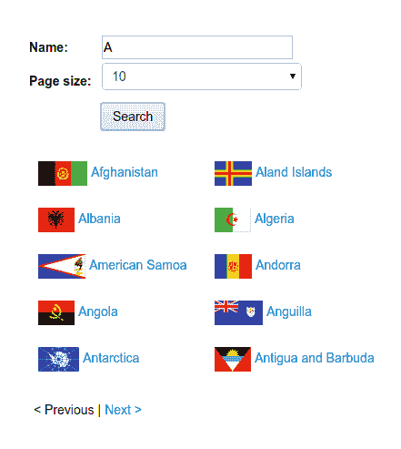
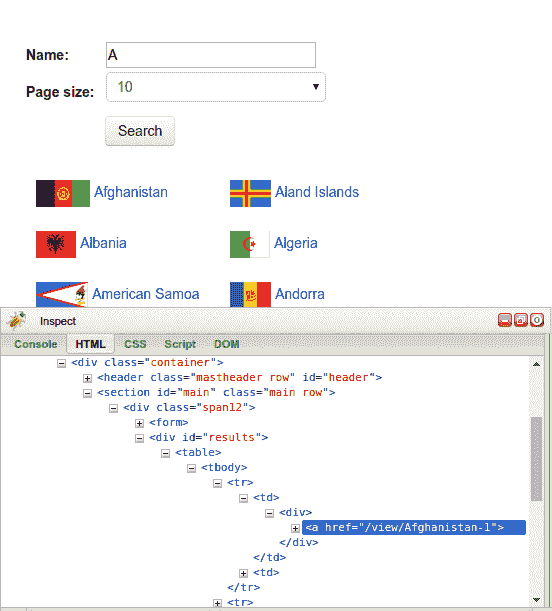
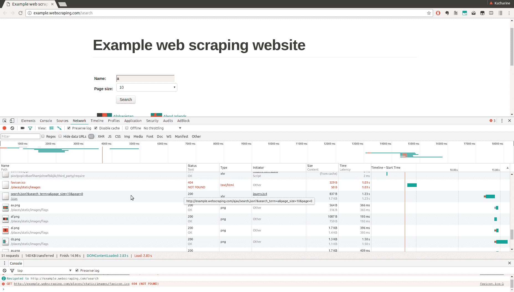
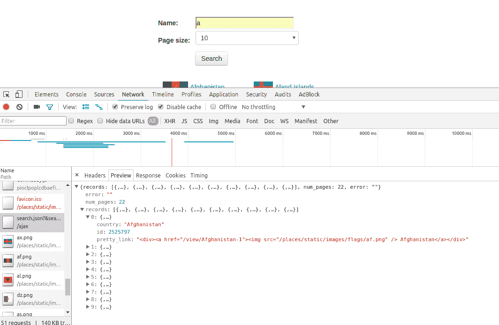
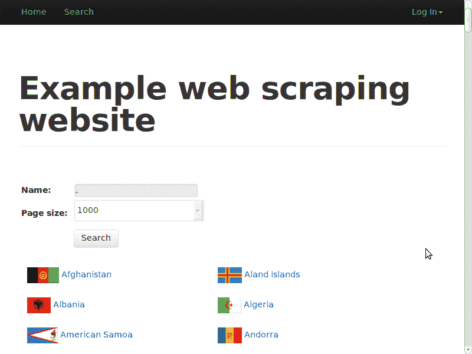
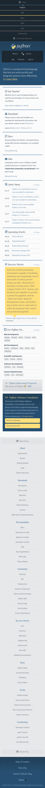

# 动态内容

根据联合国 2006 年的一项研究，73%的主要网站依赖于 JavaScript 来实现重要功能（参考[`www.un.org/esa/socdev/enable/documents/execsumnomensa.doc`](http://www.un.org/esa/socdev/enable/documents/execsumnomensa.doc)）。在 JavaScript 中，如 React、AngularJS、Ember、Node 等模型-视图-控制器（MVC）框架的增长和普及，进一步增加了 JavaScript 作为网页内容主要引擎的重要性。

JavaScript 的使用可以从简单的表单事件到单页应用，在加载后下载整个页面内容。这种架构的一个后果是内容可能不在原始 HTML 中，而我们之前介绍过的抓取技术将无法提取网站上的重要信息。

本章将介绍两种从动态 JavaScript 网站抓取数据的方法。具体如下：

+   反向工程 JavaScript

+   渲染 JavaScript

# 一个示例动态网页

让我们来看一个示例动态网页。这个示例网站有一个搜索表单，位于[`example.webscraping.com/search`](http://example.webscraping.com/search)，用于定位国家。假设我们想找到所有以字母 A 开头的国家：



如果我们右键点击这些结果，并使用我们的浏览器工具（如第二章，*抓取数据*中所述）检查它们，我们会发现结果存储在一个 ID 为`"results"`的`div`元素中：



让我们尝试使用`lxml`模块来提取这些结果，这个模块在第二章，*抓取数据*中也有介绍，以及来自第三章，*缓存下载*的`Downloader`类：

```py
>>> from lxml.html import fromstring
>>> from downloader import Downloader 
>>> D = Downloader() 
>>> html = D('http://example.webscraping.com/search') 
>>> tree = fromstring(html) 
>>> tree.cssselect('div#results a') 
[] 

```

这里示例的抓取器未能提取结果。通过检查这个网页的源代码（使用右键点击“查看页面源代码”选项而不是使用浏览器工具）可以帮助你理解原因。在这里，我们发现我们试图抓取的`div`元素是空的：

```py
<div id="results"> 
</div> 

```

我们的浏览器工具为我们提供了网页当前状态的一个视图。在这种情况下，这意味着网页使用了 JavaScript 动态加载搜索结果。在下一节中，我们将使用浏览器工具的另一个功能来了解这些结果是如何加载的。

什么是 AJAX？

**AJAX**代表**异步 JavaScript 和 XML**，于 2005 年提出，用于描述跨浏览器可用的功能，这些功能使得动态网络应用成为可能。最重要的是，原本由微软为 ActiveX 实现的 JavaScript `XMLHttpRequest`对象，在许多常见的网络浏览器中变得可用。这使得 JavaScript 能够向远程服务器发送 HTTP 请求并接收响应，这意味着网络应用可以发送和接收数据。之前客户端和服务器之间通信的方式是刷新整个网页，这导致当只需要传输少量数据时，用户体验不佳且带宽浪费。

谷歌的 Gmail 和地图网站是动态网络应用的早期例子，并帮助使 AJAX 成为主流。

# 反向工程动态网页

到目前为止，我们尝试以与第二章中介绍的方法相同的方式从网页中抓取数据，*抓取数据*。这种方法没有奏效，因为数据是使用 JavaScript 动态加载的。为了抓取这些数据，我们需要了解网页如何加载数据，这个过程可以描述为反向工程。继续前一小节中的例子，在我们的浏览器工具中，如果我们点击“网络”标签并执行搜索，我们将看到针对给定页面的所有请求。请求非常多！如果我们滚动查看请求，我们看到主要是图片（来自加载国家标志），然后我们注意到一个有趣的名称：`search.json`，路径为`/ajax`：



如果我们使用 Chrome 点击该 URL，我们可以看到更多详细信息（所有主要浏览器都有类似的功能，所以你的视图可能会有所不同；然而，主要功能应该以类似的方式工作）。一旦我们点击感兴趣的 URL，我们就可以看到更多详细信息，包括一个预览，它以解析形式显示给我们响应。在这里，类似于我们在元素标签页中的“检查元素”视图，我们使用胡萝卜来展开预览，并看到我们的结果中的每个国家都以 JSON 形式包含：



我们也可以通过右键单击并在新标签页中打开 URL 来直接打开该 URL。当你这样做时，你会看到它是一个简单的 JSON 响应。这种 AJAX 数据不仅可以从“网络”标签或通过浏览器访问，还可以直接下载，如下所示：

```py
>>> import requests
>>> resp = requests.get('http://example.webscraping.com/ajax/search.json?page=0&page_size=10&search_term=a') 
>>> resp.json()
{'error': '', 
 'num_pages': 22, 
 'records': [{'country': 'Afghanistan', 
 'id': 1261, 
 'pretty_link': '<div><a href="/view/Afghanistan-1">Afghanistan</a></div>'}, 
 ...] 
} 

```

如前所述的代码所示，`requests`库允许我们通过使用`json`方法将 JSON 响应作为 Python 字典访问。我们也可以下载原始字符串响应，并使用 Python 的`json.loads`方法加载它。

我们的代码为我们提供了一个简单的方法来抓取包含字母`A`的国家。要找到这些国家的详细信息，需要调用带有字母表中每个字母的 AJAX 搜索。对于每个字母，搜索结果被分成页面，页数由响应中的`page_size`指示。

不幸的是，我们无法保存所有返回的结果，因为相同的国家会在多次搜索中返回——例如，`Fiji`与对`f`、`i`和`j`的搜索匹配。这些重复的结果在这里通过在写入文本文件之前将结果存储在集合中来过滤——集合数据结构确保了唯一元素。

这里有一个示例实现，通过搜索字母表中的每个字母并迭代 JSON 响应的结果页面来抓取所有国家。然后，结果存储在一个简单的文本文件中。

```py
import requests
import string

PAGE_SIZE = 10

template_url = 'http://example.webscraping.com/ajax/' + 
    'search.json?page={}&page_size={}&search_term={}'

countries = set()

for letter in string.ascii_lowercase:
    print('Searching with %s' % letter)
    page = 0
    while True:
        resp = requests.get(template_url.format(page, PAGE_SIZE, letter))
        data = resp.json()
        print('adding %d more records from page %d' %
              (len(data.get('records')), page))
        for record in data.get('records'):
            countries.add(record['country'])
        page += 1
        if page >= data['num_pages']:
            break

with open('../data/countries.txt', 'w') as countries_file:
    countries_file.write('n'.join(sorted(countries)))

```

当你运行代码时，你会看到逐步的输出：

```py
$ python chp5/json_scraper.py
Searching with a
adding 10 more records from page 0
adding 10 more records from page 1
...

```

一旦脚本完成，相对文件夹`../data/`中的`countries.txt`文件将显示国家名称的排序列表。你也许会注意到页面长度可以通过`PAGE_SIZE`全局变量来设置。你可能想尝试切换这个值来增加或减少请求数量。

这个 AJAX 爬虫提供了一种比在第二章“抓取数据”中介绍的逐页爬取方法更简单的方式来提取国家详情。这是一个常见的经验：依赖于 AJAX 的网站最初看起来更复杂，然而它们的结构鼓励分离数据层和表示层，这实际上可以使我们提取数据的工作更容易。如果你找到一个像这个示例网站一样有公开应用程序编程接口（或 API）的网站，你可以简单地爬取 API 而不是使用 CSS 选择器和 XPath 从 HTML 中加载数据。

# 边界情况

AJAX 搜索脚本相当简单，但可以通过利用可能的边界情况进一步简化。到目前为止，我们已经查询了每个字母，这意味着有 26 个单独的查询，并且这些查询之间存在重复结果。如果可以使用单个搜索查询匹配所有结果将是非常理想的。我们将尝试用不同的字符进行实验，看看这是否可能。如果搜索词为空，会发生以下情况：

```py
>>> url = 'http://example.webscraping.com/ajax/search.json?page=0&page_size=10&search_term=' 
>>> requests.get(url).json()['num_pages'] 
0 

```

不幸的是，这并没有奏效——没有结果。接下来我们将检查是否“*”可以匹配所有结果：

```py
>>> requests.get(url + '*').json()['num_pages'] 
0 

```

仍然没有成功。然后我们检查`'.'`，这是一个匹配任何字符的正则表达式：

```py
>>> requests.get(url + '.').json()['num_pages'] 
26

```

完美！服务器必须是在使用正则表达式匹配结果。所以，现在搜索每个字母可以替换为对点字符的单次搜索。

此外，我们可以在 AJAX URL 中使用`page_size`查询字符串值来设置页面大小。网站搜索界面有设置此值为 4、10 和 20 的选项，默认设置为 10。因此，通过将页面大小增加到最大值，可以减少下载的页面数量。

```py
>>> url = 'http://example.webscraping.com/ajax/search.json?page=0&page_size=20&search_term=.' 
>>> requests.get(url).json()['num_pages'] 
13 

```

现在，如果使用比网页界面选择框支持的更大的页面大小会怎样呢？

```py
>>> url = 'http://example.webscraping.com/ajax/search.json?page=0&page_size=1000&search_term=.' 
>>> requests.get(url).json()['num_pages'] 
1 

```

显然，服务器没有检查页面大小参数是否与接口中允许的选项匹配，现在在单页中返回所有结果。许多 Web 应用程序在其 AJAX 后端不检查页面大小参数，因为它们期望所有 API 请求都通过 Web 界面进行。

现在，我们已经构建了一个 URL，以单次请求下载所有国家的数据。以下是更新后的、更简单的实现，它将数据保存到 CSV 文件中：

```py
from csv import DictWriter
import requests

PAGE_SIZE = 1000

template_url = 'http://example.webscraping.com/ajax/' + 
 'search.json?page=0&page_size={}&search_term=.'

resp = requests.get(template_url.format(PAGE_SIZE))
data = resp.json()
records = data.get('records')

with open('../data/countries.csv', 'w') as countries_file:
   wrtr = DictWriter(countries_file, fieldnames=records[0].keys())
   wrtr.writeheader()
   wrtr.writerows(records)

```

# 渲染动态网页

对于示例搜索网页，我们能够快速逆向工程 API 的工作原理以及如何使用它来在一次请求中检索结果。然而，网站可能非常复杂且难以理解，即使有高级浏览器工具。例如，如果网站是用**Google Web Toolkit**（**GWT**）构建的，生成的 JavaScript 代码将是机器生成的和压缩的。可以使用像`JS beautifier`这样的工具清理生成的 JavaScript 代码，但结果将是冗长的，原始变量名将丢失，因此难以理解和逆向工程。

此外，像`React.js`这样的高级框架以及其他基于 Node.js 的工具可以进一步抽象复杂的 JavaScript 逻辑，模糊数据变量名，并添加更多层 API 请求安全（通过要求 cookies、浏览器会话和时间戳或使用其他反爬虫技术）。

经过足够的努力，任何网站都可以被逆向工程。然而，可以通过使用浏览器渲染引擎来避免这种努力，这是网络浏览器解析 HTML、应用 CSS 格式和执行 JavaScript 以显示网页的部分。在本节中，将使用 WebKit 渲染引擎，它通过 Qt 框架提供了一个方便的 Python 接口。

WebKit 是什么？

WebKit 的代码最初起源于 1998 年的 KHTML 项目，它是 Konqueror 网络浏览器的渲染引擎。随后，苹果公司在 2001 年将其分支为 WebKit，用于其 Safari 网络浏览器。谷歌公司一直使用 WebKit 直到 Chrome 版本 27，然后在 2013 年从 WebKit 分支出自己的版本，称为**Blink**。Opera 最初从 2003 年到 2012 年使用其内部渲染引擎**Presto**，之后短暂切换到 WebKit，然后跟随 Chrome 使用 Blink。其他流行的浏览器渲染引擎包括由 Internet Explorer 使用的**Trident**和 Firefox 使用的**Gecko**。

# PyQt 或 PySide

有两种 Python 绑定到 Qt 框架，`PyQt`和`PySide`。`PyQt`于 1998 年首次发布，但商业项目需要许可证。由于这个许可问题，Qt 的开发公司，当时是诺基亚，现在是 Digia，后来在 2009 年开发了名为`PySide`的 Python 绑定，并在更宽松的 LGPL 许可证下发布。

这两个绑定之间有一些细微的差异，但这里开发的示例可以与任一绑定一起工作。以下代码片段可以用来导入已安装的任何 Qt 绑定：

```py
try: 
    from PySide.QtGui import * 
    from PySide.QtCore import * 
    from PySide.QtWebKit import * 
except ImportError: 
    from PyQt4.QtGui import * 
    from PyQt4.QtCore import * 
    from PyQt4.QtWebKit import * 

```

在这里，如果`PySide`不可用，将引发`ImportError`异常，并导入`PyQt`。如果`PyQt`也不可用，将再次引发`ImportError`异常，脚本将退出。

下载和安装 Qt 每个 Python 绑定的说明可在[`qt-project.org/wiki/Setting_up_PySide`](http://qt-project.org/wiki/Setting_up_PySide)和[`pyqt.sourceforge.net/Docs/PyQt4/installation.html`](http://pyqt.sourceforge.net/Docs/PyQt4/installation.html)找到。根据您使用的 Python 3 版本，可能还没有提供该库，但发布频率相对较高，所以您可以随时检查。

# 使用 Qt 进行调试

无论您使用 PySide 还是 PyQt，您都可能遇到需要调试应用程序或脚本的网站。我们已经介绍了一种方法，即通过利用`QWebView` GUI `show()`方法来“查看”您已加载的页面上的渲染内容。您还可以使用`page().mainFrame().toHtml()`链（当通过`BrowserRender`类使用`html`方法时很容易引用）在任何点提取 HTML，将其写入文件并保存，然后在浏览器中打开。

此外，还有几个有用的 Python 调试器，例如`pdb`，您可以将它集成到脚本中，然后使用断点逐步执行代码，以找到错误、问题或错误所在的位置。设置此环境有几种不同的方法，具体取决于您安装的库和 Qt 版本，所以我们建议搜索您确切的环境设置，并审查实现以允许设置断点或跟踪。

# 执行 JavaScript

要确认您的 WebKit 安装可以执行 JavaScript，有一个简单的示例可在[`example.webscraping.com/dynamic`](http://example.webscraping.com/dynamic)找到。

这个网页简单地使用 JavaScript 将`Hello World`写入`div`元素。以下是源代码：

```py
<html> 
    <body> 
        <div id="result"></div> 
        <script> 
        document.getElementById("result").innerText = 'Hello World'; 
        </script> 
    </body> 
</html> 

```

使用传统的下载原始 HTML 并解析结果的方法，`div`元素将是空的，如下所示：

```py
>>> import lxml.html
>>> from chp3.downloader import Downloader
>>> D = Downloader()
>>> url = 'http://example.webscraping.com/dynamic' 
>>> html = D(url) 
>>> tree = lxml.html.fromstring(html) 
>>> tree.cssselect('#result')[0].text_content() 
'' 

```

这里有一个使用 WebKit 的初始示例，它需要遵循上一节中显示的`PyQt`或`PySide`导入：

```py
>>> app = QApplication([]) 
>>> webview = QWebView() 
>>> loop = QEventLoop() 
>>> webview.loadFinished.connect(loop.quit) 
>>> webview.load(QUrl(url)) 
>>> loop.exec_() 
>>> html = webview.page().mainFrame().toHtml() 
>>> tree = lxml.html.fromstring(html) 
>>> tree.cssselect('#result')[0].text_content() 
'Hello World' 

```

这里有很多事情要做，所以我们将逐行分析代码：

+   第一行实例化了 Qt 框架在初始化其他 Qt 对象之前所需的`QApplication`对象。

+   接下来，创建了一个`QWebView`对象，这是一个用于网页文档的小部件。

+   创建了一个`QEventLoop`对象，用于创建本地事件循环。

+   `QwebView`对象的`loadFinished`回调与`QEventLoop`的`quit`方法相连接，因此当网页加载完成时，事件循环将停止。

+   然后将要加载的 URL 传递给`QWebView`。`PyQt`要求这个 URL 字符串被包裹在一个`QUrl`对象中，但对于`PySide`来说这是可选的。

+   `QWebView`异步加载，因此执行立即传递到下一行，同时网页正在加载——然而，我们希望等待此网页加载完成，所以调用`loop.exec_()`来启动事件循环。

+   当网页完成加载后，事件循环将退出，代码执行继续。使用`toHTML`方法从加载的网页中提取生成的 HTML。

+   最后的行显示 JavaScript 已成功执行，`div`元素包含`Hello World`。

这里使用的类和方法在 C++ Qt 框架网站上都有出色的文档，网址为[`qt-project.org/doc/qt-4.8/`](http://qt-project.org/doc/qt-4.8/)。`PyQt`和`PySide`都有自己的文档，然而，原始 C++版本的描述和格式更好，并且通常 Python 开发者会使用它。

# 使用 WebKit 进行网站交互

我们一直在检查的搜索网页要求用户修改并提交搜索表单，然后点击页面链接。然而，到目前为止，我们的浏览器渲染器只能执行 JavaScript 和访问生成的 HTML。抓取搜索页面需要扩展浏览器渲染器以支持这些交互。幸运的是，Qt 有一个出色的 API 来选择和操作 HTML 元素，这使得实现变得简单。

这里是之前 AJAX 搜索示例的替代版本，将搜索词设置为`'.'`，页面大小设置为`'1000'`，并在单个查询中加载所有结果：

```py
app = QApplication([]) 
webview = QWebView() 
loop = QEventLoop() 
webview.loadFinished.connect(loop.quit) 
webview.load(QUrl('http://example.webscraping.com/search')) 
loop.exec_() 
webview.show() 
frame = webview.page().mainFrame() 
frame.findFirstElement('#search_term'). 
       setAttribute('value', '.') 
frame.findFirstElement('#page_size option:checked'). 
       setPlainText('1000') 
frame.findFirstElement('#search'). 
       evaluateJavaScript('this.click()') 
app.exec_() 

```

前几行实例化了渲染网页所需的 Qt 对象，与之前的`Hello World`示例相同。接下来，调用`QWebView` GUI 的`show()`方法，以便显示渲染窗口，这对于调试很有用。然后，创建对框架的引用，以便使下面的行更短。

`QWebFrame`类有许多用于与网页交互的有用方法。包含`findFirstElement`的三个行使用 CSS 选择器在框架中定位元素，并设置搜索参数。然后，使用`evaluateJavaScript()`方法提交表单，该方法模拟点击事件。这个方法非常方便，因为它允许插入和执行我们提交的任何 JavaScript 代码，包括直接调用网页中定义的 JavaScript 方法。然后，最后一行进入应用程序事件循环，这样我们就可以查看表单中的发生情况。如果没有这个，脚本将立即退出。

当此脚本运行时，会显示以下内容：



我们运行的最后一行代码`app._exec()`是一个阻塞调用，将阻止此特定线程中的任何更多代码执行。通过使用`webkit.show()`来查看代码的运行情况是调试应用程序和确定网页上实际发生情况的好方法。

要停止运行的应用程序，你可以简单地关闭 Qt 窗口（或 Python 解释器）。

# 等待结果

实现我们的 WebKit 爬虫的最后一部分是抓取搜索结果，这证明是最困难的部分，因为不清楚 AJAX 事件何时完成以及国家数据何时加载。有三种可能的方法来处理这个难题：

+   等待设定的时间并希望 AJAX 事件完成

+   覆盖 Qt 的网络管理器以跟踪 URL 请求何时完成

+   轮询网页以查找预期内容的出现

第一种方法实现起来最简单，但效率不高，因为如果设置了安全的超时，通常脚本会花费太多时间等待。此外，当网络速度比平时慢时，固定的超时可能会失败。第二种方法更高效，但不能应用于存在客户端延迟的情况；例如，如果下载已完成，但需要在内容显示之前按下按钮。第三种方法更可靠且易于实现；尽管检查内容是否已加载时会有浪费 CPU 周期的微小缺点。以下是第三种方法的实现：

```py
>>> elements = None 
>>> while not elements: 
...     app.processEvents() 
...     elements = frame.findAllElements('#results a') 
... 
>>> countries = [e.toPlainText().strip() for e in elements] 
>>> print(countries)
['Afghanistan', 'Aland Islands', ... , 'Zambia', 'Zimbabwe'] 

```

在这里，代码将保持在`while`循环中，直到国家链接出现在`results` div 中。对于每个循环，都会调用`app.processEvents()`以给 Qt 事件循环时间来执行任务，例如响应用户点击事件和更新 GUI。我们还可以在这个循环中添加一个短暂的秒数`sleep`，以给 CPU 间歇性的休息时间。

到目前为止的代码完整示例可以在[`github.com/kjam/wswp/blob/master/code/chp5/pyqt_search.py`](https://github.com/kjam/wswp/blob/master/code/chp5/pyqt_search.py)找到。

# 渲染类

为了帮助使此功能在未来更容易使用，以下是使用的方法，这些方法被包装成一个类，其源代码也可在[`github.com/kjam/wswp/blob/master/code/chp5/browser_render.py`](https://github.com/kjam/wswp/blob/master/code/chp5/browser_render.py)找到。

```py
import time 

class BrowserRender(QWebView): 
    def __init__(self, show=True): 
        self.app = QApplication(sys.argv) 
        QWebView.__init__(self) 
        if show: 
            self.show() # show the browser 

    def download(self, url, timeout=60): 
        """Wait for download to complete and return result""" 
        loop = QEventLoop() 
        timer = QTimer() 
        timer.setSingleShot(True) 
        timer.timeout.connect(loop.quit) 
        self.loadFinished.connect(loop.quit) 
        self.load(QUrl(url)) 
        timer.start(timeout * 1000) 
        loop.exec_() # delay here until download finished 
        if timer.isActive(): 
            # downloaded successfully 
            timer.stop() 
            return self.html() 
        else: 
            # timed out 
            print 'Request timed out: ' + url 

    def html(self): 
        """Shortcut to return the current HTML""" 
        return self.page().mainFrame().toHtml() 

    def find(self, pattern): 
        """Find all elements that match the pattern""" 
        return self.page().mainFrame().findAllElements(pattern) 

    def attr(self, pattern, name, value): 
        """Set attribute for matching elements""" 
        for e in self.find(pattern): 
            e.setAttribute(name, value) 

    def text(self, pattern, value): 
        """Set attribute for matching elements""" 
        for e in self.find(pattern): 
            e.setPlainText(value) 

    def click(self, pattern): 
        """Click matching elements""" 
        for e in self.find(pattern): 
            e.evaluateJavaScript("this.click()") 

    def wait_load(self, pattern, timeout=60): 
        """Wait until pattern is found and return matches""" 
        deadline = time.time() + timeout 
        while time.time() < deadline: 
            self.app.processEvents() 
            matches = self.find(pattern) 
            if matches: 
                return matches 
        print('Wait load timed out') 

```

你可能已经注意到`download()`和`wait_load()`方法涉及一些额外的代码，包括计时器。这个计时器跟踪等待花费的时间，并在达到截止日期时取消事件循环。否则，当遇到网络问题时，事件循环将无限期运行。

这是使用这个新类抓取搜索页面的方法：

```py
>>> br = BrowserRender() 
>>> br.download('http://example.webscraping.com/search') 
>>> br.attr('#search_term', 'value', '.') 
>>> br.text('#page_size option:checked', '1000') 
>>> br.click('#search') 
>>> elements = br.wait_load('#results a') 
>>> countries = [e.toPlainText().strip() for e in elements] 
>>> print countries
['Afghanistan', 'Aland Islands', ... , 'Zambia', 'Zimbabwe'] 

```

# Selenium

在前一个部分中使用的 WebKit 库，我们可以完全控制自定义浏览器渲染器以按需行为。如果不需要这种级别的灵活性，一个好的且易于安装的替代方案是 Selenium，它提供了一个 API 来自动化几个流行的网络浏览器。可以使用以下命令使用`pip`安装 Selenium：

```py
pip install selenium

```

为了演示 Selenium 的工作原理，我们将使用 Selenium 重写之前的搜索示例。第一步是创建与网络浏览器的连接：

```py
>>> from selenium import webdriver 
>>> driver = webdriver.Firefox() 

```

当运行此命令时，将弹出一个空浏览器窗口。如果您收到错误，则可能需要安装`geckodriver` (`github.com/mozilla/geckodriver/releases`) 并确保它通过您的`PATH`变量可用。

使用可以查看和与之交互的浏览器（而不是 Qt 小部件）很方便，因为每次执行命令时，都可以检查浏览器窗口以查看脚本是否按预期工作。在这里，我们使用了 Firefox，但 Selenium 还提供了与其他常见网络浏览器的接口，例如 Chrome 和 Internet Explorer。请注意，您只能使用安装在系统上的网络浏览器的 Selenium 接口。

要查看您的系统浏览器是否受支持以及您可能需要安装的其他依赖项或驱动程序以使用 Selenium，请检查 Selenium 关于支持平台的文档：[`www.seleniumhq.org/about/platforms.jsp`](http://www.seleniumhq.org/about/platforms.jsp)。

要在所选网络浏览器中加载网页，请调用`get()`方法：

```py
>>> driver.get('http://example.webscraping.com/search') 

```

然后，为了设置要选择的元素，可以使用搜索文本框的 ID。Selenium 还支持使用 CSS 选择器或 XPath 选择元素。当找到搜索文本框时，我们可以使用`send_keys()`方法输入内容，该方法模拟键入：

```py
>>> driver.find_element_by_id('search_term').send_keys('.') 

```

为了在单个搜索中返回所有结果，我们希望将页面大小设置为 1000。然而，这并不简单，因为 Selenium 旨在与浏览器交互，而不是修改网页内容。为了克服这一限制，我们可以使用 JavaScript 来设置下拉框内容：

```py
>>> js = "document.getElementById('page_size').options[1].text = '1000';" 
>>> driver.execute_script(js)

```

现在表单输入已准备就绪，因此可以点击搜索按钮以执行搜索：

```py
>>> driver.find_element_by_id('search').click() 

```

在加载结果之前，我们需要等待 AJAX 请求完成，这是之前 WebKit 实现中脚本最困难的部分。幸运的是，Selenium 通过使用`implicitly_wait()`方法设置超时，提供了一个简单的解决方案：

```py
>>> driver.implicitly_wait(30) 

```

在这里，使用了 30 秒的延迟。现在，如果我们搜索尚未可用的元素，Selenium 会在抛出异常之前等待最多 30 秒。Selenium 还允许使用显式等待进行更详细的轮询控制（有关详细信息，请参阅[`www.seleniumhq.org/docs/04_webdriver_advanced.jsp`](http://www.seleniumhq.org/docs/04_webdriver_advanced.jsp)）。

要选择国家链接，我们使用与 WebKit 示例中相同的 CSS 选择器：

```py
>>> links = driver.find_elements_by_css_selector('#results a') 

```

然后，可以提取每个链接的文本以创建国家列表：

```py
>>> countries = [link.text for link in links] 
>>> print(countries)
['Afghanistan', 'Aland Islands', ... , 'Zambia', 'Zimbabwe'] 

```

最后，可以通过调用 `close()` 方法关闭浏览器：

```py
>>> driver.close() 

```

本例的源代码可在[`github.com/kjam/wswp/blob/master/code/chp5/selenium_search.py`](https://github.com/kjam/wswp/blob/master/code/chp5/selenium_search.py)找到。有关 Selenium 的更多详细信息，Python 绑定在[`selenium-python.readthedocs.org/`](https://selenium-python.readthedocs.org/)有文档说明。

# Selenium 和无头浏览器

虽然使用常见浏览器安装和配置 Selenium 很方便且相对简单；但在服务器上运行这些脚本时可能会出现问题。对于服务器来说，更常见的是使用无头浏览器。它们通常比功能完整的网络浏览器更快且更可配置。

在本出版物发布时，最受欢迎的无头浏览器是 PhantomJS。它通过自己的基于 JavaScript 的 webkit 引擎运行。PhantomJS 可以轻松安装在大多数服务器上，并且可以通过遵循最新的下载说明在本地安装（[`phantomjs.org/download.html`](http://phantomjs.org/download.html)）。

使用 Selenium 与 PhantomJS 仅需要不同的初始化：

```py
>>> from selenium import webdriver
>>> driver = webdriver.PhantomJS()  # note: you should use the phantomjs executable path here 
 # if you see an error (e.g. PhantomJS('/Downloads/pjs'))

```

您首先注意到的是没有打开浏览器窗口，但有一个 PhantomJS 实例正在运行。为了测试我们的代码，我们可以访问一个页面并截图。

```py
>>> driver.get('http://python.org')
>>> driver.save_screenshot('../data/python_website.png')
True

```

现在如果您打开那个保存的 PNG 文件，您可以看到 PhantomJS 浏览器渲染的内容：



我们注意到窗口很大。我们可以通过使用 `maximize_window` 或使用 `set_window_size` 设置窗口大小来改变这一点，这两个方法都在[Selenium Python WebDriver API 文档](http://selenium-python.readthedocs.io/api.html)中有说明。

截图选项非常适合调试任何 Selenium 问题，即使您在使用真实浏览器时也是如此——因为有时脚本可能因为页面加载缓慢或页面结构或网站上的 JavaScript 变化而无法正常工作。拥有错误发生时页面的截图可以非常有帮助。此外，您还可以使用驱动程序的 `page_source` 属性来保存或检查当前页面源代码。

利用基于浏览器的解析器如 Selenium 的另一个原因是它使得表现得像爬虫更困难。一些网站使用像 Honeypots 这样的爬虫避免技术，其中网站可能在页面上包含一个隐藏的有毒链接，如果你的脚本点击它，你的爬虫就会被禁止。对于这类问题，Selenium 由于其基于浏览器的架构而成为一个出色的爬虫。如果你在浏览器中不能点击或看到链接，你也不能通过 Selenium 与之交互。此外，你的头部信息将包括你使用的浏览器，你将能够访问正常的浏览器功能，如 cookies、会话以及加载图像和交互元素，这些有时是加载特定表单或页面所必需的。如果你的爬虫必须与页面交互并表现得“像人一样”，Selenium 是一个很好的选择。

# 摘要

本章介绍了从动态网页中抓取数据的两种方法。它从使用浏览器工具逆向工程一个动态网页开始，然后转向使用浏览器渲染器为我们触发 JavaScript 事件。我们首先使用 WebKit 构建了自己的自定义浏览器，然后使用高级的 Selenium 框架重新实现了这个抓取器。

浏览器渲染器可以节省理解网站后端工作原理所需的时间；然而，也有一些缺点。渲染网页会增加开销，并且比仅下载 HTML 或使用 API 调用要慢得多。此外，使用浏览器渲染器的解决方案通常需要轮询网页以检查生成的 HTML 是否已加载，这很脆弱，在网络速度慢时可能会失败。

我通常在短期解决方案中使用浏览器渲染器，因为在这种情况下长期性能和可靠性不太重要；对于长期解决方案，我尝试逆向工程网站。当然，一些网站可能需要“像人一样”的交互或已关闭 API，这意味着浏览器渲染的实现可能是获取内容的唯一方式。

在下一章中，我们将介绍如何与表单和 cookies 交互以登录网站并编辑内容。
