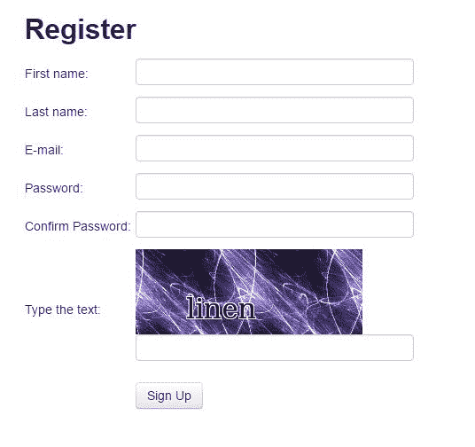
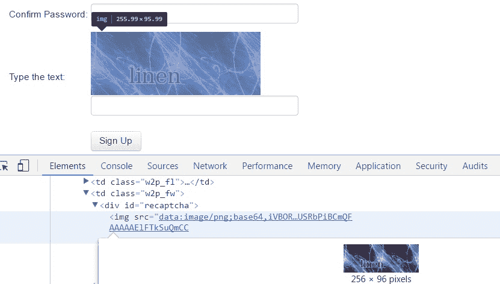
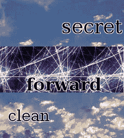

# 第七章：解决 CAPTCHA

**CAPTCHA** 代表 **Completely Automated Public Turing test to tell Computers and Humans Apart**。正如缩写所暗示的，这是一个测试，用来确定用户是否为人类。典型的 CAPTCHA 由扭曲的文本组成，计算机程序将难以解释，但人类（希望）仍然可以阅读。

许多网站使用 CAPTCHA 来防止机器人与其网站交互。例如，我的银行网站每次我登录时都强制我通过 CAPTCHA，这很麻烦。本章将介绍如何自动解决 CAPTCHA，首先是通过**光学字符识别**（**OCR**），然后是通过 CAPTCHA 解决 API。

在本章中，我们将介绍以下主题：

+   解决 CAPTCHA

+   使用 CAPTCHA 服务

+   机器学习和 CAPTCHA

+   报告错误

# 注册账户

在第六章“与表单交互”中，我们使用手动创建的账户登录了示例网站，但跳过了账户创建部分，因为注册表单需要通过 CAPTCHA：



注意，每次加载表单时，都会显示不同的 CAPTCHA 图像。为了理解表单的要求，我们可以重用前一章中开发的 `parse_form()` 函数。

```py
>>> import requests
>>> REGISTER_URL = 'http://example.webscraping.com/user/register' 
>>> session = requests.Session() 
>>> html = session.get(REGISTER_URL)
>>> form = parse_form(html.content) 
>>> form
{'_formkey': '1ed4e4c4-fbc6-4d82-a0d3-771d289f8661', 
 '_formname': 'register', 
 '_next': '/', 
 'email': '', 
 'first_name': '', 
 'last_name': '', 
 'password': '', 
 'password_two': None, 
 'recaptcha_response_field': None} 

```

前面的代码中显示的所有字段都很直接，除了 `recaptcha_response_field`，在这种情况下，需要从我们的初始页面视图中显示的图像中提取奇怪的文本。

# 加载 CAPTCHA 图像

在分析 CAPTCHA 图像之前，需要从表单中提取它。我们的浏览器开发者工具显示，该图像的数据嵌入在网页中，而不是从单独的 URL 加载：



要在 Python 中处理图像，我们将使用 `Pillow` 包，可以通过 `pip` 使用以下命令安装：

```py
pip install Pillow

```

安装 `Pillow` 的其他方法在[`pillow.readthedocs.io/en/latest/installation.html`](http://pillow.readthedocs.io/en/latest/installation.html)中介绍。

`Pillow` 提供了一个方便的 `Image` 类，包含许多高级方法，可以用来操作 CAPTCHA 图像。以下是一个函数，它接受注册页面的 HTML 并返回一个 `Image` 对象中的 CAPTCHA 图像：

```py
from io import BytesIO
from lxml.html import fromstring
from PIL import Image
import base64

def get_captcha_img(html):
    tree = fromstring(html)
    img_data = tree.cssselect('div#recaptcha img')[0].get('src')
    img_data = img_data.partition(',')[-1]
    binary_img_data = base64.b64decode(img_data)
    img = Image.open(BytesIO(binary_img_data))
    return img

```

这里前几行使用 `lxml` 从表单中提取图像数据。这些图像数据以一个定义数据类型的头信息开头。在这种情况下，它是一个 Base64 编码的 PNG 图像，Base64 是一种用于在 ASCII 中表示二进制数据的格式。这个头信息通过在第一个逗号处分割来移除。然后需要将图像数据从 Base64 解码回原始的二进制格式。为了加载图像，`PIL` 预期一个文件-like 接口，因此这些二进制数据被 `BytesIO` 包装，然后传递给 `Image` 类。

现在我们已经以更有用的格式获得了 CAPTCHA 图像，我们准备尝试提取文本。

Pillow 与 PIL

`Pillow`是更知名的**Python 图像库**（**PIL**）的一个分支，自 2009 年以来就没有更新过。它使用与原始`PIL`包相同的接口，并在[`pillow.readthedocs.org`](http://pillow.readthedocs.org)上有良好的文档。`Pillow`支持 Python3（与`PIL`不同），因此我们将专注于在这本书中使用它。

# 光学字符识别

**光学字符识别**（**OCR**）是从图像中提取文本的过程。在本节中，我们将使用开源的 Tesseract OCR 引擎，它最初由 HP 开发，现在主要在 Google 开发。Tesseract 的安装说明可在[`github.com/tesseract-ocr/tesseract/wiki`](https://github.com/tesseract-ocr/tesseract/wiki)找到。`pytesseract` Python 包装器可以使用`pip`安装：

```py
pip install pytesseract

```

如果将原始 CAPTCHA 图像传递给`pytesseract`，结果会很糟糕：

```py
>>> import pytesseract 
>>> img = get_captcha_img(html.content) 
>>> pytesseract.image_to_string(img) 
'' 

```

返回了一个空字符串，这意味着 Tesseract 未能从输入图像中提取任何字符。Tesseract 被设计用来提取更典型的文本，例如具有一致背景的书籍页面。如果我们想有效地使用 Tesseract，我们首先需要修改 CAPTCHA 图像以去除背景噪声并隔离文本。

为了更好地理解我们正在处理的 CAPTCHA 系统，这里有一些更多的示例：



上一张图像中的示例表明，CAPTCHA 文本总是黑色，而背景较亮，因此可以通过检查每个像素并只保留黑色像素来隔离这个文本，这个过程称为**阈值化**。使用`Pillow`实现这个过程很简单：

```py
>>> img.save('captcha_original.png') 
>>> gray = img.convert('L') 
>>> gray.save('captcha_gray.png') 
>>> bw = gray.point(lambda x: 0 if x < 1 else 255, '1') 
>>> bw.save('captcha_thresholded.png') 

```

首先，我们使用`convert`方法将图像转换为灰度。然后，我们使用`point`命令将图像映射到一个`lambda`函数上，这将遍历图像中的每个像素。在`lambda`函数中，使用小于`1`的阈值，这将只保留完全黑色的像素。这个片段保存了三张图像——原始 CAPTCHA 图像、灰度图像和阈值后的图像。

最终图像中的文本更清晰，并准备好传递给 Tesseract：

```py
>>> pytesseract.image_to_string(bw) 
'strange' 

```

成功！CAPTCHA 文本已成功提取。在我的 100 张图像测试中，这种方法正确解释了 82 张 CAPTCHA 图像。

由于样本文本总是小写 ASCII 字符，可以通过将这些字符限制为结果来进一步提高性能：

```py
>>> import string 
>>> word = pytesseract.image_to_string(bw) 
>>> ascii_word = ''.join(c for c in word.lower() if c in string.ascii_lowercase)

```

在我对相同样本图像的测试中，这提高了性能，100 次中有 88 次有效。

以下是迄今为止注册脚本的完整代码：

```py
import requests
import string
import pytesseract
from lxml.html import fromstring
from chp6.login import parse_form
from chp7.image_processing import get_captcha_img, img_to_bw

REGISTER_URL = 'http://example.webscraping.com/user/register'

def register(first_name, last_name, email, password):
    session = requests.Session()
    html = session.get(REGISTER_URL)
    form = parse_form(html.content)
    form['first_name'] = first_name
    form['last_name'] = last_name
    form['email'] = email
    form['password'] = form['password_two'] = password
    img = get_captcha_img(html.content)
    captcha = ocr(img)
    form['recaptcha_response_field'] = captcha
    resp = session.post(html.url, form)
    success = '/user/register' not in resp.url
    if not success:
        form_errors = fromstring(resp.content).cssselect('div.error')
        print('Form Errors:')
        print('n'.join(
              (' {}: {}'.format(f.get('id'), f.text) for f in form_errors)))
    return success

def ocr(img):
    bw = img_to_bw(img)
    captcha = pytesseract.image_to_string(bw)
    cleaned = ''.join(c for c in captcha.lower() if c in string.ascii_lowercase)
    if len(cleaned) != len(captcha):
        print('removed bad characters: {}'.format(set(captcha) - set(cleaned)))
    return cleaned

```

`register()`函数下载注册页面并像往常一样抓取表单，其中设置了新账户所需的名字、电子邮件和密码。然后提取 CAPTCHA 图像，传递给 OCR 函数，并将结果添加到表单中。随后提交这些表单数据，并检查响应 URL 以查看注册是否成功。

如果失败（没有正确重定向到主页），则打印出表单错误，因为我们可能需要使用更长的密码、不同的电子邮件，或者 CAPTCHA 可能没有成功。我们还打印出我们移除的字符，以帮助调试如何使我们的 CAPTCHA 解析器更好。这些日志可能有助于我们识别常见的 OCR 错误，例如将 l 错误地误认为是 1，以及类似的错误，这些错误需要在不同绘制的字符之间进行精细区分。

现在，要注册账户，我们只需调用 `register()` 函数并传入新的账户详细信息：

```py
>>> register(first_name, last_name, email, password) 
True 

```

# 进一步改进

为了进一步提高 CAPTCHA OCR 性能，有几种可能性，如下所示：

+   尝试不同的阈值水平

+   通过侵蚀阈值文本来强调字符的形状

+   调整图像大小（有时增加图像大小有帮助）

+   在 CAPTCHA 字体上训练 OCR 工具

+   限制结果为词典单词

如果你感兴趣，想尝试提高性能，所使用的样本数据可以在 [`github.com/kjam/wswp/blob/master/data/captcha_samples`](http://github.com/kjam/wswp/blob/master/data/captcha_samples) 找到。还有一个脚本来测试准确性，在 [`github.com/kjam/wswp/blob/master/code/chp7/test_samples.py`](http://github.com/kjam/wswp/blob/master/code/chp7/test_samples.py)。然而，当前的 88% 准确率对于我们的注册账户目的已经足够，因为实际用户在输入 CAPTCHA 文本时也会犯错。即使 10% 的准确率也足够，因为脚本可以多次运行直到成功，尽管这对服务器来说可能不太礼貌，可能会导致你的 IP 被封锁。

# 解决复杂的 CAPTCHA

到目前为止测试过的 CAPTCHA 系统相对容易解决——黑色字体颜色意味着文本可以很容易地与背景区分开来，此外，文本是水平的，不需要旋转以便 Tesseract 准确解释。通常，你会发现在使用类似这种简单自定义 CAPTCHA 系统的网站上，在这种情况下，OCR 解决方案是实用的。然而，如果网站使用更复杂的系统，例如 Google 的 reCAPTCHA，OCR 将需要更多的努力，可能变得不切实际。

在这些例子中，文本放置在不同的角度，使用不同的字体和颜色，因此在进行 OCR 之前，需要做更多的工作来清理和预处理图像。这些高级 CAPTCHA 有时甚至对人们来说也很难理解，这使得用简单的脚本来完成这项任务变得更加困难。

# 使用 CAPTCHA 解决服务

要解决这些更复杂的图像，我们将使用 CAPTCHA 解决服务。有许多 CAPTCHA 解决服务可供选择，例如 [2captcha.com](https://2captcha.com) 和 [`de-captcher.com/`](https://de-captcher.com/)，价格从大约 1000 个 CAPTCHA 的 0.50 美元到 2 美元不等。当一个 CAPTCHA 图像传递给 CAPTCHA 解决 API 时，一个人将手动检查图像，并在 HTTP 响应中提供解析后的文本，通常在 30 秒内完成。

对于本节中的示例，我们将使用 [9kw.eu](https://9kw.eu) 的服务，它不是最便宜的每个 CAPTCHA 价格或最佳设计的 API。然而，从积极的一面来看，您可以在不花钱的情况下使用 API。这是因为 [9kw.eu](https://9kw.eu) 允许用户手动解决 CAPTCHA 以积累信用，然后可以用这些信用来测试我们自己的 CAPTCHA。

# 开始使用 9kw

要开始使用 9kw，您需要首先在 [`www.9kw.eu/register.html`](https://www.9kw.eu/register.html) 创建账户。

然后，按照账户确认说明操作，登录后，导航至 [`www.9kw.eu/usercaptcha.html`](https://www.9kw.eu/usercaptcha.html)。

在此页面上，您可以解决他人的 CAPTCHA 以积累信用，以便以后在 API 调用中使用。解决几个 CAPTCHA 后，导航至 [`www.9kw.eu/index.cgi?action=userapinew&source=api`](https://www.9kw.eu/index.cgi?action=userapinew&source=api) 以创建 API 密钥。

# 9kw CAPTCHA API

9kw API 的文档位于 [`www.9kw.eu/api.html#apisubmit-tab`](https://www.9kw.eu/api.html#apisubmit-tab)。为了提交 CAPTCHA 并检查结果，以下是我们需要的重要部分总结：

要提交 CAPTCHA 以解决，您可以使用此 API 方法及参数：

**URL**: https://www.9kw.eu/index.cgi (POST)

**apikey**: 您的 API 密钥

**action**: 必须设置为 "usercaptchaupload"

**file-upload-01**: 要解决的图像（可以是文件、URL 或字符串）

**base64**: 如果输入是 Base64 编码，则设置为 "1"

**maxtimeout**: 等待解决方案的最大时间（必须在 60 - 3999 秒之间）

**selfsolve**: 设置为 "1" 以自行解决此 CAPTCHA

**json:** 设置为 "1" 以接收 JSON 格式的响应

**API 返回值**: 此 CAPTCHA 的 ID

要请求提交的 captcha 的结果，您需要使用不同的 API 方法及不同的参数：

**URL**: https://www.9kw.eu/index.cgi (GET)

**apikey**: 您的 API 密钥

**action**: 必须设置为 "usercaptchacorrectdata"

**id**: 要检查的 CAPTCHA ID

**info**: 设置为 "1" 以在尚未找到解决方案时返回 "NO DATA"（默认情况下不返回任何内容）

**json:** 设置为 "1" 以接收 JSON 格式的响应

**API 返回值**: 解决的 CAPTCHA 文本或错误代码

API 还有一些错误代码：

**0001** API 密钥不存在

**0002** API 密钥不存在

**0003** 未找到活动 API 密钥

...

**0031** 账户在系统中尚未满 24 小时。

**0032** 账户没有完整的权限。

**0033** 插件需要更新。

这里是将 CAPTCHA 图像发送到该 API 的初始实现：

```py
import requests

API_URL = 'https://www.9kw.eu/index.cgi' 

def send_captcha(api_key, img_data): 
    data = { 
        'action': 'usercaptchaupload', 
        'apikey': api_key, 
        'file-upload-01': img_data, 
        'base64': '1', 
        'selfsolve': '1', 
        'maxtimeout': '60',
        'json': '1', 
    } 
    response = requests.post(API_URL, data) 
    return response.content

```

到现在为止，这个结构应该看起来很熟悉了——首先，创建一个包含所需参数的字典，对它们进行编码，然后将数据提交到请求的主体中。请注意，`selfsolve` 选项设置为 `'1'`：这意味着如果我们目前在 9kw 网络界面解决 CAPTCHA，此 CAPTCHA 图像将被传递给我们解决，这可以节省我们的信用。如果没有登录，CAPTCHA 图像将被传递给另一个用户解决。

这里是获取已解决 CAPTCHA 图像结果的代码：

```py
def get_captcha_text(api_key, captcha_id): 
    data = { 
        'action': 'usercaptchacorrectdata', 
        'id': captcha_id, 
        'apikey': api_key,
        'json': '1', 
    } 
    response = requests.get(API_URL, data)  
    return response.content

```

9kw API 的一个缺点是错误信息与结果发送在同一个 JSON 字段中，这使得区分它们变得更加复杂。例如，如果没有人及时解决 CAPTCHA 图像，将返回 `ERROR NO USER` 字符串。希望我们提交的 CAPTCHA 图像永远不会包含此文本！

另一个困难是，`get_captcha_text()` 函数将返回错误信息，直到另一个用户有时间手动检查 CAPTCHA 图像，正如之前提到的，通常在 30 秒后。

为了使我们的实现更加友好，我们将添加一个包装函数来提交 CAPTCHA 图像并等待结果准备就绪。以下是扩展此功能并包装在可重用类中的版本，以及检查错误信息：

```py
import base64
import re
import time
import requests
from io import BytesIO

class CaptchaAPI:
    def __init__(self, api_key, timeout=120):
        self.api_key = api_key
        self.timeout = timeout
        self.url = 'https://www.9kw.eu/index.cgi'

    def solve(self, img):
        """Submit CAPTCHA and return result when ready"""
        img_buffer = BytesIO()
        img.save(img_buffer, format="PNG")
        img_data = img_buffer.getvalue()
        captcha_id = self.send(img_data)
        start_time = time.time()
        while time.time() < start_time + self.timeout:
            try:
                resp = self.get(captcha_id)
            except CaptchaError:
                pass # CAPTCHA still not ready
            else:
                if resp.get('answer') != 'NO DATA':
                    if resp.get('answer') == 'ERROR NO USER':
                        raise CaptchaError(
                            'Error: no user available to solve CAPTCHA')
                    else:
                        print('CAPTCHA solved!')
                        return captcha_id, resp.get('answer')
            print('Waiting for CAPTCHA ...')
            time.sleep(1)
        raise CaptchaError('Error: API timeout')

    def send(self, img_data):
        """Send CAPTCHA for solving """
        print('Submitting CAPTCHA')
        data = {
            'action': 'usercaptchaupload',
            'apikey': self.api_key,
            'file-upload-01': base64.b64encode(img_data),
            'base64': '1',
            'selfsolve': '1',
            'json': '1',
            'maxtimeout': str(self.timeout)
        }
        result = requests.post(self.url, data)
        self.check(result.text)
        return result.json()

    def get(self, captcha_id):
        """Get result of solved CAPTCHA """
        data = {
            'action': 'usercaptchacorrectdata',
            'id': captcha_id,
            'apikey': self.api_key,
            'info': '1',
            'json': '1',
        }
        result = requests.get(self.url, data)
        self.check(result.text)
        return result.json()

    def check(self, result):
        """Check result of API and raise error if error code"""
        if re.match('00dd w+', result):
            raise CaptchaError('API error: ' + result)

    def report(self, captcha_id, correct):
        """ Report back whether captcha was correct or not"""
        data = {
            'action': 'usercaptchacorrectback',
            'id': captcha_id,
            'apikey': self.api_key,
            'correct': (lambda c: 1 if c else 2)(correct),
            'json': '1',
        }
        resp = requests.get(self.url, data)
        return resp.json()

class CaptchaError(Exception):
    pass

```

`CaptchaAPI` 类的源代码也可在 [`github.com/kjam/wswp/blob/master/code/chp7/captcha_api.py`](http://github.com/kjam/wswp/blob/master/code/chp7/captcha_api.py) 找到，如果 9kw.eu 修改了他们的 API，此代码将保持更新。该类通过您的 API 密钥和一个默认设置为 120 秒的超时时间进行实例化。然后 `solve()` 方法将 CAPTCHA 图像提交到 API，并持续请求解决方案，直到 CAPTCHA 图像被解决或达到超时。

要检查 API 响应中的错误信息，`check()` 方法会检查初始字符是否遵循错误代码在错误信息之前的预期格式，即四位数字。为了更稳健地使用此 API，此方法可以扩展以涵盖 34 种错误类型中的每一种。

这里是使用 `CaptchaAPI` 类解决 CAPTCHA 图像的一个示例：

```py
>>> API_KEY = ... 
>>> captcha = CaptchaAPI(API_KEY) 
>>> img = Image.open('captcha.png') 
>>> captcha_id, text = captcha.solve(img) 
Submitting CAPTCHA 
Waiting for CAPTCHA ... 
Waiting for CAPTCHA ... 
Waiting for CAPTCHA ... 
Waiting for CAPTCHA ... 
Waiting for CAPTCHA ... 
Waiting for CAPTCHA ... 
Waiting for CAPTCHA ... 
Waiting for CAPTCHA ... 
Waiting for CAPTCHA ... 
Waiting for CAPTCHA ... 
Waiting for CAPTCHA ... 
CAPTCHA solved! 
>>> text 
juxhvgy 

```

这是本章前面展示的第一个复杂 CAPTCHA 图像的正确解决方案。如果在此之后不久再次提交相同的 CAPTCHA 图像，将立即返回缓存的解决方案，并且不会使用额外的信用：

```py
>>> captcha_id, text = captcha.solve(img_data) 
Submitting CAPTCHA 
>>> text 
juxhvgy 

```

# 报告错误

大多数 CAPTCHA 解决服务，如 9kw.eu，都提供报告已解决 CAPTCHA 问题的能力，并提供有关文本是否在网站上正确工作的反馈。您可能已经注意到，我们`CaptchaAPI`类中有一个`report`方法，允许我们传递 CAPTCHA ID 以及一个布尔值来确定 CAPTCHA 是否正确。然后它将数据发送到仅用于报告 CAPTCHA 正确性的端点。对于我们的用例，我们可以通过确定我们的注册表单是否成功来确定 CAPTCHA 是否正确。

根据您使用的 API，当您报告错误的 CAPTCHA 时，您可能会获得一些积分，如果您为该服务付费，这很有用。当然，这也可能被滥用，因此通常对每天的错误报告有一个上限。无论回报如何，报告正确和错误的 CAPTCHA 解决方案都可以帮助改进服务，并让您不必为无效的解决方案支付额外费用。

# 集成注册

现在我们已经有一个工作的 CAPTCHA API 解决方案，我们可以将其与之前的表单集成。以下是修改后的`register`函数版本，它现在使用`CaptchaAPI`类：

```py
from configparser import ConfigParser
import requests

from lxml.html import fromstring
from chp6.login import parse_form
from chp7.image_processing import get_captcha_img
from chp7.captcha_api import CaptchaAPI

REGISTER_URL = 'http://example.webscraping.com/user/register'

def get_api_key():
    config = ConfigParser()
    config.read('../config/api.cfg')
    return config.get('captcha_api', 'key')

def register(first_name, last_name, email, password):
    session = requests.Session()
    html = session.get(REGISTER_URL)
    form = parse_form(html.content)
    form['first_name'] = first_name
    form['last_name'] = last_name
    form['email'] = email
    form['password'] = form['password_two'] = password
    api_key = get_api_key()
    img = get_captcha_img(html.content)
    api = CaptchaAPI(api_key)
    captcha_id, captcha = api.solve(img)
    form['recaptcha_response_field'] = captcha
    resp = session.post(html.url, form)
    success = '/user/register' not in resp.url
    if success:
        api.report(captcha_id, 1)
    else:
        form_errors = fromstring(resp.content).cssselect('div.error')
        print('Form Errors:')

        print('n'.join(
            (' {}: {}'.format(f.get('id'), f.text) for f in form_errors)))
        if 'invalid' in [f.text for f in form_errors]:
            api.report(captcha_id, 0)
    return success

```

如您从前面的代码中可以看到，我们正在使用新的`CaptchaAPI`，并确保我们向 API 报告错误和成功。我们还使用了`ConfigParser`，因此我们的 API 密钥永远不会保存在仓库中，而是通过配置文件进行引用。要查看配置文件的示例，请检查仓库（[`github.com/kjam/wswp/blob/master/code/example_config.cfg`](http://github.com/kjam/wswp/blob/master/code/example_config.cfg)）。您也可以将 API 密钥存储在环境变量中或您计算机或服务器上的安全存储中。

我们现在可以尝试我们的新注册功能：

```py
>>> register(first_name, last_name, email, password) 
Submitting CAPTCHA 
Waiting for CAPTCHA ... 
Waiting for CAPTCHA ... 
Waiting for CAPTCHA ... 
Waiting for CAPTCHA ... 
Waiting for CAPTCHA ... 
Waiting for CAPTCHA ... 
Waiting for CAPTCHA ... 
True 

```

它成功了！CAPTCHA 图像已成功从表单中提取出来，提交给了 9kw API，由另一位用户手动解决，并将结果成功提交到网络服务器以注册新账户。

# CAPTCHA 和机器学习

随着深度学习和图像识别的进步，计算机在正确识别图像中的文本和对象方面变得越来越擅长。已经有一些有趣的论文和项目将深度学习图像识别方法应用于 CAPTCHA。一个基于 Python 的项目（[`github.com/arunpatala/captcha`](https://github.com/arunpatala/captcha)）使用 PyTorch 在大量的 CAPTCHA 数据集上训练了解决器模型。2012 年 6 月，墨西哥的一组学生 Claudia Cruz、Fernando Uceda 和 Leobardo Reyes 发表了一篇论文，该论文在 reCAPTCHA 图像上的解决准确率达到 82% ([`dl.acm.org/citation.cfm?id=2367894`](http://dl.acm.org/citation.cfm?id=2367894))。还有其他一些研究和破解尝试，特别是针对 CAPTCHA 图像中经常包含的音频组件（这些音频组件是为了可访问性目的而包含的）。

你可能不需要比你基于 OCR 或 API 的 CAPTCHA 服务更多的东西来解决你在网络爬取中遇到的 CAPTCHA，但如果你好奇想尝试并训练自己的模型以供娱乐，你首先需要找到或创建一个包含正确解码的 CAPTCHA 的大量数据集。深度学习和计算机视觉是快速发展的领域，自本书编写以来，很可能还有更多的研究和项目被发表出来！

# 摘要

本章展示了如何解决 CAPTCHA，首先是通过使用 OCR，然后是使用外部 API。对于简单的 CAPTCHA 或者当你需要解决大量 CAPTCHA 时，投入时间在 OCR 解决方案上可能是值得的。否则，使用 CAPTCHA 解决 API 可能会证明是一个成本效益高的替代方案。

在下一章中，我们将介绍 Scrapy，这是一个用于构建爬取应用程序的流行的高级框架。
