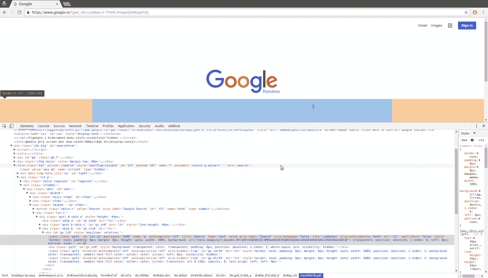
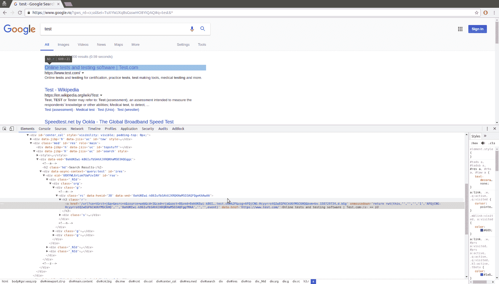
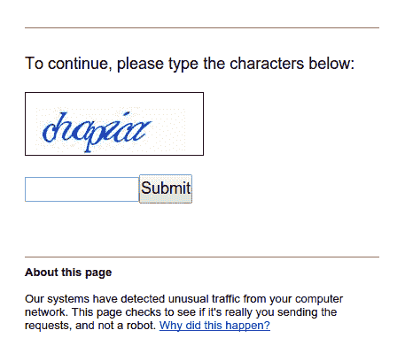
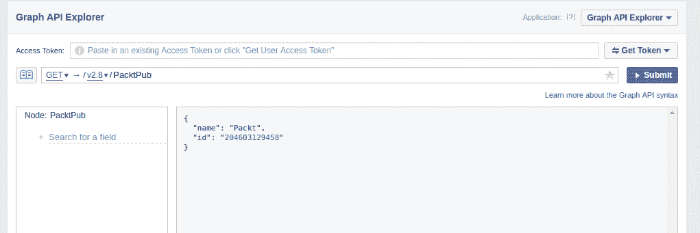
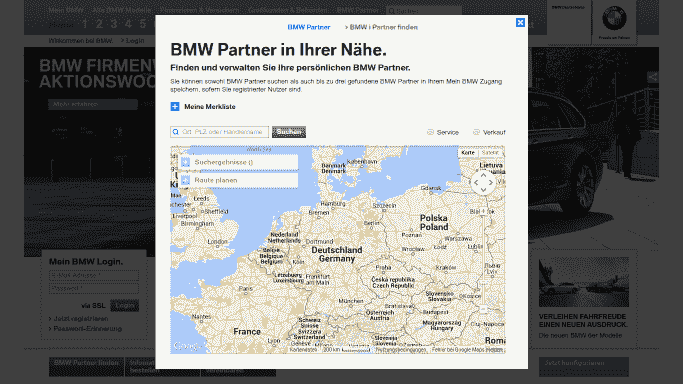
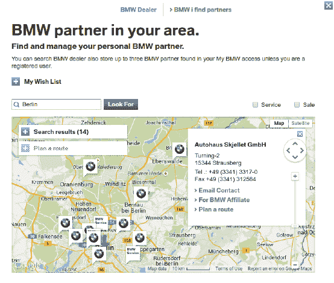

# 整合所有内容

本书迄今为止介绍了使用自定义网站进行抓取的技术，这有助于我们专注于学习特定的技能。在本章中，我们将分析各种现实世界的网站，以展示我们书中学到的技术如何应用。首先，我们将使用 Google 来展示现实世界的搜索表单，然后是 Facebook 的 JavaScript 依赖网站和 API，Gap 的典型在线商店，最后是宝马的地图界面。由于这些是实时网站，它们在您阅读此内容时可能会发生变化。然而，这是可以的，因为本章示例的目的在于展示我们学到的技术如何应用，而不是展示如何抓取任何特定的网站。如果您选择运行示例，请首先检查自这些示例制作以来网站结构是否已更改，以及它们的当前条款和条件是否禁止抓取。

在本章中，我们将涵盖以下主题：

+   抓取 Google 搜索结果网页

+   调查 Facebook API

+   使用多线程抓取 Gap 网站

+   反向工程宝马经销商定位页面

# Google 搜索引擎

为了调查使用我们对 CSS 选择器的了解，我们将抓取 Google 搜索结果。根据第四章中使用的 Alexa 数据，“并发下载”，google.com 是世界上最受欢迎的网站，并且方便的是，它的结构简单，易于抓取。

国际 Google 可能会根据您的位置重定向到特定国家的版本。在这些示例中，Google 被设置为罗马尼亚版本，因此您的结果可能会有所不同。

这是使用浏览器工具加载的 Google 搜索主页：



我们可以看到，搜索查询存储在一个名为`q`的输入中，然后表单通过`action`属性设置的路径`/search`提交。我们可以通过进行测试搜索来提交表单进行测试，然后将被重定向到 URL，例如[`www.google.ro/?gws_rd=cr,ssl&ei=TuXYWJXqBsGsswHO8YiQAQ#q=test&*`](https://www.google.ro/?gws_rd=cr,ssl&ei=TuXYWJXqBsGsswHO8YiQAQ#q=test&*)。确切的 URL 将取决于您的浏览器和位置。如果您启用了 Google Instant，将使用 AJAX 动态加载搜索结果而不是提交表单。此 URL 有许多参数，但唯一必需的是用于查询的`q`。

URL [`www.google.com/search?q=test`](https://www.google.com/search?q=test) 显示我们可以使用这个 URL 来生成搜索结果，如图所示：


可以使用浏览器工具检查搜索结果的架构，如图所示：



在这里，我们看到搜索结果被结构化为链接，其父元素是一个带有类名"`r`"的`<h3>`标签。

为了抓取搜索结果，我们将使用 CSS 选择器，这在第二章“抓取数据”中已介绍：

```py
>>> from lxml.html import fromstring
>>> import requests 
>>> html = requests.get('https://www.google.com/search?q=test') 
>>> tree = fromstring(html.content) 
>>> results = tree.cssselect('h3.r a') 
>>> results 
[<Element a at 0x7f3d9affeaf8>, 
 <Element a at 0x7f3d9affe890>, 
 <Element a at 0x7f3d9affe8e8>, 
 <Element a at 0x7f3d9affeaa0>, 
 <Element a at 0x7f3d9b1a9e68>, 
 <Element a at 0x7f3d9b1a9c58>, 
 <Element a at 0x7f3d9b1a9ec0>, 
 <Element a at 0x7f3d9b1a9f18>, 
 <Element a at 0x7f3d9b1a9f70>, 
 <Element a at 0x7f3d9b1a9fc8>] 

```

到目前为止，我们已经下载了谷歌搜索结果，并使用`lxml`提取了链接。在先前的屏幕截图中，链接包含了一堆额外的参数，这些参数与实际网站 URL 一起使用，用于跟踪点击。

这是我们在页面上找到的第一个链接：

```py
>>> link = results[0].get('href') 
>>> link 
'/url?q=http://www.speedtest.net/&sa=U&ved=0ahUKEwiCqMHNuvbSAhXD6gTMAA&usg=AFQjCNGXsvN-v4izEgZFzfkIvg' 

```

我们想要的内容是`http://www.speedtest.net/`，可以使用`urlparse`模块从查询字符串中解析出来：

```py
>>> from urllib.parse import parse_qs, urlparse 
>>> qs = urlparse(link).query 
>>> parsed_qs = parse_qs(qs)
>>> parsed_qs
{'q': ['http://www.speedtest.net/'], 
 'sa': ['U'], 
 'ved': ['0ahUKEwiCqMHNuvbSAhXD6gTMAA'], 
 'usg': ['AFQjCNGXsvN-v4izEgZFzfkIvg']}
>>> parsed_qs.get('q', []) 
['http://www.speedtest.net/']

```

这种查询字符串解析可以应用于提取所有链接。

```py
>>> links = [] 
>>> for result in results: 
...     link = result.get('href') 
...     qs = urlparse(link).query 
...     links.extend(parse_qs(qs).get('q', [])) 
... 
>>> links 
['http://www.speedtest.net/', 
'test', 
'https://www.test.com/', 
'https://ro.wikipedia.org/wiki/Test', 
'https://en.wikipedia.org/wiki/Test', 
'https://www.sri.ro/verificati-va-aptitudinile-1', 
'https://www.sie.ro/AgentiaDeSpionaj/test-inteligenta.html', 'http://www.hindustantimes.com/cricket/india-vs-australia-live-cricket-score-4th-test-dharamsala-day-3/story-8K124GMEBoiKOgiAaaB5bN.html', 
'https://sports.ndtv.com/india-vs-australia-2017/live-cricket-score-india-vs-australia-4th-test-day-3-dharamsala-1673771', 
'http://pearsonpte.com/test-format/'] 

```

成功！谷歌搜索第一页的链接已成功抓取。本例的完整源代码可在[`github.com/kjam/wswp/blob/master/code/chp9/scrape_google.py`](https://github.com/kjam/wswp/blob/master/code/chp9/scrape_google.py)找到。

Google 的一个困难之处在于，如果您的 IP 看起来可疑，例如下载速度过快时，将会显示验证码图像：



这个验证码图像可以使用第七章中介绍的技术解决，即“解决验证码”，尽管最好是避免引起怀疑并缓慢下载，或者如果需要更快的下载速度，则使用代理。过度使用谷歌可能会使您的 IP 或一系列 IP 被谷歌域名禁止数小时或一天；因此，请确保您对他人（以及您自己）使用网站的方式礼貌，以免您的家庭或办公室被列入黑名单。

# Facebook

为了演示使用浏览器和 API，我们将调查 Facebook 的网站。目前，Facebook 按月活跃用户数计算是世界上最大的社交网络，因此，其用户数据极其有价值。

# 网站内容

这里是 Packt 出版社在 Facebook 上的一个示例页面，[`www.facebook.com/PacktPub`](https://www.facebook.com/PacktPub):


查看此页面的源代码，您会发现前几条帖子是可用的，而后续帖子则在浏览器滚动时通过 AJAX 加载。Facebook 还有一个移动界面，正如在第一章“网络抓取简介”中提到的，它通常更容易抓取。使用移动界面的相同页面可在[`m.facebook.com/PacktPub`](https://m.facebook.com/PacktPub)找到：


如果我们与移动网站互动然后检查浏览器工具，我们会发现这个界面使用与 AJAX 事件相似的架构，因此并不容易抓取。这些 AJAX 事件可以被逆向工程；然而，不同类型的 Facebook 页面使用不同的 AJAX 调用，根据我的以往经验，Facebook 经常更改这些调用的结构；因此，抓取它们将需要持续维护。因此，如第五章所述，*动态内容*，除非性能至关重要，否则使用浏览器渲染引擎来执行 JavaScript 事件并为我们提供访问结果的 HTML 会更可取。

这里是一个使用 Selenium 自动登录 Facebook 并重定向到给定页面 URL 的示例片段：

```py
from selenium import webdriver

def get_driver():
    try:
        return webdriver.PhantomJS()
    except:
        return webdriver.Firefox()

def facebook(username, password, url):
    driver = get_driver()
    driver.get('https://facebook.com')
    driver.find_element_by_id('email').send_keys(username)
    driver.find_element_by_id('pass').send_keys(password)
    driver.find_element_by_id('loginbutton').submit()
    driver.implicitly_wait(30)
    # wait until the search box is available,
    # which means it has successfully logged in
    search = driver.find_element_by_name('q')
    # now logged in so can go to the page of interest
    driver.get(url)
    # add code to scrape data of interest here ...

```

这个函数可以被调用以加载感兴趣的 Facebook 页面并抓取生成的 HTML，使用有效的 Facebook 邮箱和密码。

# Facebook API

如 第一章 *网络抓取简介* 中所述，当数据不以结构化格式提供时，抓取网站是最后的手段。Facebook 为大多数公共或私人（通过您的用户账户）数据提供了 API，因此我们应该在构建密集型浏览器抓取器之前检查这些 API 是否提供了我们想要的数据。

首先要做的事情是确定通过 API 可用的数据。为了弄清楚这一点，我们应该首先参考 API 文档。可在 [`developers.facebook.com/docs/`](https://developers.facebook.com/docs/) 找到的开发者文档显示了所有不同类型的 API，包括我们想要的 Graph API。如果您需要通过 API 或 SDK 与 Facebook 建立其他交互，文档会定期更新且易于使用。

通过文档链接也提供了浏览器中的 Graph API 探索器，位于 [`developers.facebook.com/tools/explorer/`](https://developers.facebook.com/tools/explorer/)。如下面的截图所示，探索器是测试查询及其结果的好地方：



在这里，我可以搜索 API 以检索 PacktPub Facebook 页面 ID。这个图形探索器也可以用来生成访问令牌，我们将使用它来导航 API。

要使用 Python 利用 Graph API，我们需要使用稍微更高级的请求的特殊访问令牌。幸运的是，已经有一个维护得很好的库供我们使用，名为 `facebook-sdk` ([`facebook-sdk.readthedocs.io`](https://facebook-sdk.readthedocs.io))。我们可以使用 pip 轻易地安装它：

```py
pip install facebook-sdk

```

这里是使用 Facebook 的 Graph API 从 Packt 出版页面提取数据的示例：

```py
In [1]: from facebook import GraphAPI

In [2]: access_token = '....'  # insert your actual token here

In [3]: graph = GraphAPI(access_token=access_token, version='2.7')

In [4]: graph.get_object('PacktPub')
Out[4]: {'id': '204603129458', 'name': 'Packt'}

```

我们看到的结果与基于浏览器的图形探索器相同。我们可以通过传递一些我们想要提取的额外详细信息来请求更多关于页面的信息。为了确定哪些详细信息，我们可以查看图形文档中页面所有可用的字段 [`developers.facebook.com/docs/graph-api/reference/page/`](https://developers.facebook.com/docs/graph-api/reference/page/)。使用关键字参数 `fields`，我们可以从 API 中提取这些额外的可用字段：

```py
In [5]: graph.get_object('PacktPub', fields='about,events,feed,picture')
Out[5]: 
{'about': 'Packt provides software learning resources, from eBooks to video courses, to everyone from web developers to data scientists.',
 'feed': {'data': [{'created_time': '2017-03-27T10:30:00+0000',
 'id': '204603129458_10155195603119459',
 'message': "We've teamed up with CBR Online to give you a chance to win 5 tech eBooks - enter by March 31! http://bit.ly/2mTvmeA"},
...
 'id': '204603129458',
 'picture': {'data': {'is_silhouette': False,
 'url': 'https://scontent.xx.fbcdn.net/v/t1.0-1/p50x50/14681705_10154660327349459_72357248532027065_n.png?oh=d0a26e6c8a00cf7e6ce957ed2065e430&oe=59660265'}}}

```

我们可以看到这个响应是一个格式良好的 Python 字典，我们可以轻松解析。

图形 API 提供了许多其他调用以访问用户数据，这些调用在 Facebook 开发者页面上有文档记录，网址为 [`developers.facebook.com/docs/graph-api`](https://developers.facebook.com/docs/graph-api)。根据你需要的数据，你可能还想要创建一个 Facebook 开发者应用程序，这可以给你一个更长时间可用的访问令牌。

# Gap

为了演示使用网站地图来调查内容，我们将使用 Gap 网站。

Gap 拥有一个结构良好的网站，有一个 `Sitemap` 来帮助网络爬虫定位其更新的内容。如果我们使用第一章（py-web-scrp-2e_ch01.html）中介绍的网络爬取技术来调查一个网站，我们会找到他们的 `robots.txt` 文件在 [`www.gap.com/robots.txt`](http://www.gap.com/robots.txt)，其中包含指向此网站地图的链接：

```py
Sitemap: http://www.gap.com/products/sitemap_index.xml 

```

这里是链接的 `Sitemap` 文件的内容：

```py
<?xml version="1.0" encoding="UTF-8"?> 
<sitemapindex xmlns="http://www.sitemaps.org/schemas/sitemap/0.9"> 
    <sitemap> 
        <loc>http://www.gap.com/products/sitemap_1.xml</loc> 
        <lastmod>2017-03-24</lastmod> 
    </sitemap> 
    <sitemap> 
        <loc>http://www.gap.com/products/sitemap_2.xml</loc> 
        <lastmod>2017-03-24</lastmod> 
    </sitemap> 
</sitemapindex> 

```

如此所示，这个 `Sitemap` 链接只是一个索引，并包含指向其他 `Sitemap` 文件的链接。这些其他 `Sitemap` 文件然后包含指向数千个产品类别的链接，例如 [`www.gap.com/products/womens-jogger-pants.jsp`](http://www.gap.com/products/womens-jogger-pants.jsp)：


这里有很多内容需要爬取，因此我们将使用在第四章（py-web-scrp-2e_ch04.html）中开发的线程化爬虫，*并发下载*。你可能还记得这个爬虫支持一个 URL 模式来匹配页面。我们还可以定义一个 `scraper_callback` 关键字参数变量，这将允许我们解析更多链接。

这里是一个用于爬取 Gap `Sitemap` 链接的示例回调：

```py
from lxml import etree 
from threaded_crawler import threaded_crawler 

def scrape_callback(url, html): 
    if url.endswith('.xml'): 
        # Parse the sitemap XML file 
        tree = etree.fromstring(html) 
        links = [e[0].text for e in tree] 
        return links 
    else: 
        # Add scraping code here 
        pass 

```

这个回调首先检查下载的 URL 扩展名。如果扩展名是 `.xml`，则下载的 URL 是一个 `Sitemap` 文件，并使用 `lxml` `etree` 模块来解析 XML 并从中提取链接。否则，这是一个分类 URL，尽管这个示例没有实现爬取分类。现在我们可以使用这个回调与线程化爬虫来爬取 `gap.com`：

```py
In [1]: from chp9.gap_scraper_callback import scrape_callback

In [2]: from chp4.threaded_crawler import threaded_crawler

In [3]: sitemap = 'http://www.gap.com/products/sitemap_index.xml'

In [4]: threaded_crawler(sitemap, '[gap.com]*', scraper_callback=scrape_callback)
10
[<Thread(Thread-517, started daemon 140145732585216)>]
Exception in thread Thread-517:
Traceback (most recent call last):
...
 File "src/lxml/parser.pxi", line 1843, in lxml.etree._parseMemoryDocument (src/lxml/lxml.etree.c:118282)
ValueError: Unicode strings with encoding declaration are not supported. Please use bytes input or XML fragments without declaration.

```

不幸的是，`lxml`期望从字节或 XML 片段加载内容，而我们却存储了 Unicode 响应（因此我们可以在第三章“缓存下载”和第四章“并发下载”中使用正则表达式进行解析，并轻松保存到磁盘）。然而，我们在这个函数中可以访问 URL。虽然这样做效率不高，但我们可以再次加载页面；如果我们只为 XML 页面这样做，应该可以减少请求数量，因此不会增加太多加载时间。当然，如果我们使用缓存，这也会使其更有效率。

让我们尝试重写回调函数：

```py
import requests

def scrape_callback(url, html): 
    if url.endswith('.xml'): 
        # Parse the sitemap XML file 
        resp = requests.get(url)
        tree = etree.fromstring(resp.content) 
        links = [e[0].text for e in tree] 
        return links 
    else: 
        # Add scraping code here 
        pass

```

现在，如果我们再次尝试运行它，我们看到 成功：

```py
In [4]: threaded_crawler(sitemap, '[gap.com]*', scraper_callback=scrape_callback)
10
[<Thread(Thread-51, started daemon 139775751223040)>]
Downloading: http://www.gap.com/products/sitemap_index.xml 
Downloading: http://www.gap.com/products/sitemap_2.xml 
Downloading: http://www.gap.com/products/gap-canada-français-index.jsp 
Downloading: http://www.gap.co.uk/products/index.jsp 
Skipping http://www.gap.co.uk/products/low-impact-sport-bras-women-C1077315.jsp due to depth Skipping http://www.gap.co.uk/products/sport-bras-women-C1077300.jsp due to depth 
Skipping http://www.gap.co.uk/products/long-sleeved-tees-tanks-women-C1077314.jsp due to depth Skipping http://www.gap.co.uk/products/short-sleeved-tees-tanks-women-C1077312.jsp due to depth ...

```

如预期，首先下载了`Sitemap`文件，然后是服装类别。你会在你的网络爬取项目中发现，你可能需要修改和调整你的代码和类，以便它们适应新的问题。这只是从互联网上抓取内容时许多令人兴奋的挑战之一。

# 宝马

为了研究如何逆向工程一个新网站，我们将查看宝马网站。宝马网站有一个用于查找当地经销商的搜索工具，可在[`www.bmw.de/de/home.html?entryType=dlo`](https://www.bmw.de/de/home.html?entryType=dlo)找到：



此工具接受一个位置，然后在地图上显示其附近的点，例如对`柏林`的搜索：



使用浏览器开发者工具，如网络标签，我们发现搜索触发了此 AJAX 请求：

```py
https://c2b-services.bmw.com/c2b-localsearch/services/api/v3/ 
    clients/BMWDIGITAL_DLO/DE/ 
        pois?country=DE&category=BM&maxResults=99&language=en& 
            lat=52.507537768880056&lng=13.425269635701511 

```

在这里，`maxResults`参数设置为`99`。然而，我们可以将其增加到`1000`以在单个查询中下载所有位置，这是在第一章，“网络爬取简介”中介绍的技术。当`maxResults`增加到`1000`时，这是结果：

```py
>>> import requests
>>> url = 'https://c2b-services.bmw.com/c2b-localsearch/services/api/v3/clients/BMWDIGITAL_DLO/DE/pois?country=DE&category=BM&maxResults=%d&language=en&         lat=52.507537768880056&lng=13.425269635701511' 
>>> jsonp = requests.get(url % 1000) 
>>> jsonp.content 
'callback({"status":{ 
... 
})' 

```

此 AJAX 请求以**JSONP**格式提供数据，代表**带有填充的 JSON**。填充通常是一个要调用的函数，其中纯 JSON 数据作为参数，在本例中是`callback`函数调用。填充不容易被解析库理解，因此我们需要移除它以正确解析数据。

要使用 Python 的`json`模块解析此数据，我们首先需要移除此填充，我们可以通过切片来完成：

```py
>>> import json 
>>> pure_json = jsonp.text[jsonp.text.index('(') + 1 : jsonp.text.rindex(')')] 
>>> dealers = json.loads(pure_json) 
>>> dealers.keys() 
dict_keys(['status', 'translation', 'metadata', 'data', 'count'])
>>> dealers['count'] 
715 

```

现在，我们已将所有德国宝马经销商加载到 JSON 对象中-目前有 715 家。以下是第一家经销商的数据：

```py
>>> dealers['data']['pois'][0] 
{'attributes': {'businessTypeCodes': ['NO', 'PR'],
 'distributionBranches': ['T', 'F', 'G'],
 'distributionCode': 'NL',
 'distributionPartnerId': '00081',
 'facebookPlace': '',
 'fax': '+49 (30) 200992110',
 'homepage': 'http://bmw-partner.bmw.de/niederlassung-berlin-weissensee',
 'mail': 'nl.berlin@bmw.de',
 'outletId': '3',
 'outletTypes': ['FU'],
 'phone': '+49 (30) 200990',
 'requestServices': ['RFO', 'RID', 'TDA'],
 'services': ['EB', 'PHEV']},
 'category': 'BMW',
 'city': 'Berlin',
 'country': 'Germany',
 'countryCode': 'DE',
 'dist': 6.662869863289401,
 'key': '00081_3',
 'lat': 52.562568863415,
 'lng': 13.463589476607,
 'name': 'BMW AG Niederlassung Berlin Filiale Weißensee',
 'oh': None,
 'postalCode': '13088',
 'postbox': None,
 'state': None,
 'street': 'Gehringstr. 20'}

```

现在，我们可以保存感兴趣的数据。以下是将这些经销商的名称和经纬度写入电子表格的代码片段：

```py
with open('../../data/bmw.csv', 'w') as fp: 
    writer = csv.writer(fp) 
    writer.writerow(['Name', 'Latitude', 'Longitude']) 
    for dealer in dealers['data']['pois']: 
        name = dealer['name'] 
        lat, lng = dealer['lat'], dealer['lng'] 
        writer.writerow([name, lat, lng]) 

```

运行此示例后，`bmw.csv`电子表格的内容将类似于以下内容：

```py
Name,Latitude,Longitude 
BMW AG Niederlassung Berlin Filiale Weissensee,52.562568863415,13.463589476607 
Autohaus Graubaum GmbH,52.4528925,13.521265 
Autohaus Reier GmbH & Co. KG,52.56473,13.32521 
... 

```

从宝马网站抓取此数据的完整源代码可在[`github.com/kjam/wswp/blob/master/code/chp9/bmw_scraper.py`](https://github.com/kjam/wswp/blob/master/code/chp9/bmw_scraper.py)找到。

翻译外语内容

你可能已经注意到，宝马的第一张截图是德语，而第二张是英语。这是因为第二张截图使用了 Google Translate 浏览器扩展进行翻译。当尝试理解如何在外语网站上导航时，这是一个有用的技术。当宝马网站被翻译时，网站仍然可以正常工作。不过，请注意，Google Translate 可能会破坏一些网站，例如，如果选择框的内容被翻译，而表单依赖于原始值。

Google Translate 作为 Chrome 的`Google Translate`扩展、Firefox 的`Google Translator`插件，以及可以安装到 Internet Explorer 的`Google Toolbar`提供。或者，可以使用[`translate.google.com`](http://translate.google.com)进行翻译；然而，这仅适用于原始文本，因为格式不会被保留。

# 摘要

本章分析了各种知名网站，并展示了本书中涵盖的技术如何应用于这些网站。我们使用 CSS 选择器抓取谷歌搜索结果，测试了浏览器渲染器和 Facebook 页面的 API，使用`Sitemap`爬取 Gap，并利用 AJAX 调用从地图中抓取所有宝马经销商。

现在，你可以将本书中涵盖的技术应用于抓取包含你感兴趣的数据的网站。正如本章所示，你在本书中学到的工具和方法可以帮助你抓取许多不同的网站和互联网上的内容。我希望这能开启一段漫长而富有成效的职业道路，通过 Python 从网络中提取内容并自动化数据提取！
