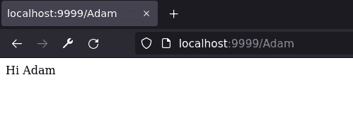
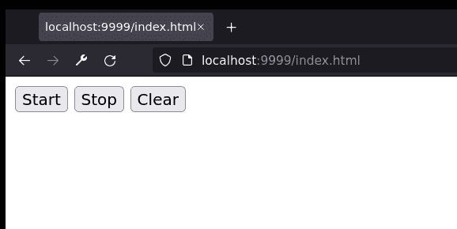
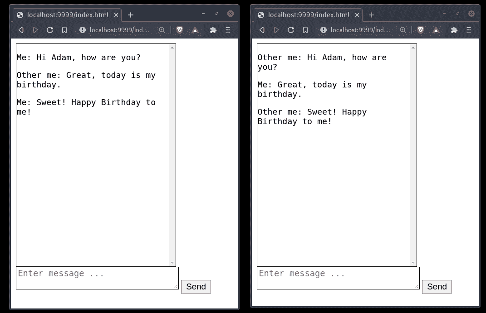

# 5 处理和响应视图

到目前为止，我们的应用程序在很大程度上是反应式的。我们致力于 Web 应用程序的不同部分，以了解如何管理传入的 HTTP 请求。如果我们想象 HTTP 请求/响应周期为一场对话，那么到目前为止，我们只是在倾听。我们的应用程序被构建成听取传入客户端要说的内容。

现在，轮到我们发言了。在本章中，我们将开始探索 HTTP 响应的不同方面。正如我们通过查看原始请求对象开始学习 HTTP 请求一样，我们将查看原始响应。它看起来几乎相同，在这个阶段应该很熟悉。我们将继续探索 Sanic 提供的强大工具。当然，有机制用于 JSON 和 HTML 响应，这些可能是今天在网络上交付的最受欢迎的内容类型。然而，Sanic 作为一个异步框架，具有优势：实现服务器驱动的响应（如：Websockets、服务器发送事件（SSE）和流式响应）非常简单。我们将在本章中探讨这些内容：

+   检查 HTTP 响应结构

+   渲染 HTML 内容

+   序列化 JSON 内容

+   流式传输数据

+   用于推送通信的服务器发送事件

+   用于双向通信的 Websockets

+   设置响应头和 cookie

## 技术要求

我们的一些示例将开始比我们之前看到的要长一些。为了方便起见，当你阅读本章时，你可能想将 GitHub 仓库放在手边：[`github.com/PacktPublishing/Web-Development-with-Sanic/tree/main/chapters/05.`](https://github.com/PacktPublishing/Web-Development-with-Sanic/tree/main/chapters/05.)

## 检查 HTTP 响应结构

回到*第三章，路由和接收 HTTP 请求*，我们探讨了 HTTP 请求的结构。当 Web 服务器准备发送响应时，其格式与我们之前看到的非常相似。HTTP 响应将看起来像这样：

```py
HTTP 1.1 200 OK
Content-Length: 13
Connection: keep-alive
Content-Type: text/plain; charset=utf-8
Hello, world.
```

我们看到的是以下内容：

1.  包含使用的 HTTP 协议、状态码和状态描述的第一行

1.  以`key: value`格式和换行符分隔的响应头

1.  一行空白

1.  响应体

我们在这里查看这并不是因为我们必须知道它来构建一个 Web 应用。毕竟，将响应对象构建为有效的 HTTP 规范正是我们使用 Web 框架的原因之一。没有它们，构建这些数据块将会是乏味且容易出错的。相反，对我们来说，回顾和理解所发生的事情，以便我们能够增加我们对 HTTP 和 Web 应用开发的掌握是有帮助的。

大部分结构与我们之前学过的内容重复。

### HTTP 响应状态

如果您比较 HTTP 请求和响应对象，最明显的区别可能是第一行。请求的第一行有三个不同的部分，而响应则更容易想象为只有两个部分：正在使用的 HTTP 协议和响应状态。我们在这本书中之前讨论了 HTTP 协议，例如见*第三章*，*路由和接收 HTTP 请求*，所以在这里我们将跳过它，并专注于响应状态。响应状态旨在成为既适合计算机又适合人类的工具，以便让客户端知道请求发生了什么。它是成功的吗？请求错误吗？服务器出错吗？这些问题以及更多，都由 HTTP 响应状态回答。

如果您过去曾经构建过网站，您可能对不同的响应码有基本的了解。即使从未构建过应用程序的人，也肯定在某个时候看到过网页上写着**404 未找到**或**500 内部服务器错误**。这些都是响应状态。HTTP 响应状态由一个数字和一个描述组成。这些数字及其具体描述的定义在*RFC 7231 § 6*中。[`datatracker.ietf.org/doc/html/rfc7231#section-6.`](https://datatracker.ietf.org/doc/html/rfc7231#section-6.)

为了明确起见，如果您看到术语*响应状态*、*状态码*或*响应码*，它们都描述的是同一件事。我通常更喜欢使用*响应状态*来描述一般概念，而在谈论状态码的数值时使用*状态码*。然而，它们相当可以互换，这本书也使用了这些术语的互换。

最常见的三种状态如下：

+   200 OK

+   404 未找到

+   500 内部服务器错误

通常，Sanic 会尝试以最合适的状态响应。如果有错误，您可能会得到一个`500`。如果路径不存在，它将是一个`404`。如果服务器可以正确响应，Sanic 将使用`200`。让我们深入探讨一下，看看状态是如何组织的。

### 响应分组

标准响应被分组为 100 系列，如下所示：

+   **100 系列**：*信息性* - 提供有关客户端应如何继续的信息的临时响应

+   **200 系列**：*成功* - 表示请求按预期处理

+   **300 系列**：*重定向* - 表示客户端必须采取进一步行动的响应

+   **400 系列**：*客户端错误* - 表示客户端在尝试访问或处理某些资源时出现了错误

+   **500 系列**：*服务器错误* - 表示服务器出现了错误，无法生成预期的响应

除了这三个主要类别之外，还有一些其他重要的响应您应该熟悉：

| **代码** | **描述** | **用途** |
| --- | --- | --- |
| `201` | 已创建 | 端点成功创建了一个新资源；通常响应将包括新数据以及/或可以用来查找它的 ID |
| `202` | 已接受 | 应用程序已接收请求并将其推送到队列或后台进程以进行进一步操作 |
| `204` | 无内容 | 没有主体；通常在 OPTIONS 请求中 |
| `301` | 永久移动 | 目标资源现在位于一个新的永久 URI |
| `302` | 找到 | 目标资源临时位于不同的 URI |
| `400` | 错误请求 | 服务器拒绝响应请求，因为客户端有不适当的行为 |
| `401` | 未授权 | 请求缺少有效的认证凭据，不允许访问 |
| `403` | 禁止 | 请求已认证，但服务器不识别有效的授权以继续响应 |

表 5.1 – 常见状态码

### 通过异常进行响应

Sanic 的大多数内置异常都与特定的状态码相关联。这意味着我们可以引发一个异常，Sanic 将自动捕获该异常，并使用适当的响应和状态码提供响应。这使得它非常方便，并且简单易行。

例如，让我们想象我们正在构建一个音乐播放器应用程序。我们的端点之一允许登录用户查看他们的播放列表。然而，它被认证保护，只有与播放列表共享过的用户才能访问它。类似于以下内容：

```py
from sanic.exceptions import NotFound
@app.get("/playlist/<playlist_name:str>")
async def show_playlist(request, playlist_name: str):
    can_view = async check_if_current_user_can_see_playlist(
        request,
        playlist_name
    )
    if not can_view:
        raise NotFound("Oops, that page does not exist")
    ...
```

通过引发`NotFound`，Sanic 将自动知道它应该返回一个`404 Not Found`响应：

```py
$ curl localhost:7777/playlist/adams-awesome-music -i
HTTP/1.1 404 Not Found
content-length: 83
connection: keep-alive
content-type: application/json
{"description":"Not Found","status":404,"message":"Oops, that page does not exist"}
```

我们还可以通过我们自己的自定义异常处理程序扩展这个概念。

```py
from sanic.exceptions import SanicException
class NotAcceptable(SanicException):
    status_code = 406
    quiet = True
@app.post("/")
async def handler(request):
    if "foobar" not in request.headers:
        raise NotAcceptable("You must supply a Foobar header")
    return text("OK")
```

在这个例子中，通过继承`SanicException`，我们可以将异常与状态码关联起来。我们还设置了一个类属性：`quiet=True`。这不是必需的，但可能是期望的。这意味着异常及其跟踪信息（有关异常类型和位置的详细信息）将不会出现在您的日志中。这是`SanicException`的一个特定功能。对于在应用程序的正常运行过程中可能预期（但未捕获）的异常，它是有帮助的。

### 自定义状态

正如我们所看到的 HTTP 方法一样，只要它们有三位数，就可以创建自己的状态码。我并不是建议这是一个*好*主意，只是指出这是可能的，Sanic 允许我们这样做，尽管你可能不应该这样做。创建自己的状态码可能会让使用你的应用程序的浏览器或客户端感到困惑。不顾一切，我们仍然会尝试一下，看看 Sanic 是否允许我们这样做。

1.  向一个“私有”变量（记住，它只是 Python，所以如果我们想，我们可以对其进行修改）添加一个新的状态类型：

    ```py
    from sanic.headers import _HTTP1_STATUSLINES
    _HTTP1_STATUSLINES[999] = b"HTTP/1.1 999 ROCK ON\r\n"
    @app.get("/rockon")
    async def handler(request):
        return empty(status=999)
    ```

    很好。现在让我们看看会发生什么。

1.  检查 HTTP 返回，确保使用`-i`以便我们看到原始响应：

    ```py
    $ curl localhost:7777/rockon -i
    HTTP/1.1 999 ROCK ON
    content-length: 0
    connection: keep-alive
    content-type: None
    ```

    总结一下，这里有一个有趣的小实验，以及 HTTP 规范的怪癖。将此路由输入您的应用程序：

    ```py
    @app.get("/coffee")
    async def handler(request):
        return text("Coffee?", status=418)
    ```

现在，使用`curl`查询它，以便您可以看到响应（别忘了`-i`）：

```py
$ curl localhost:7777/coffee -i
```

### 标题

HTTP 响应的第二部分与 HTTP 请求的第二部分相同：以`key: value`格式每行排列的标题。像之前一样，键不区分大小写，可以在响应中重复多次。

有一个有趣的事情需要记住，当一个网络服务器以信息状态（系列 100）响应时，它*不*包括标题。这些响应通常仅在将 HTTP 连接升级为 websocket 连接的上下文中使用。由于这是框架的责任，我们可以安全地忽略它，并将其作为有用的信息存档。

在 Sanic 中使用标题通常很简单。我们稍后会深入探讨它们，但到目前为止，我们需要记住我们可以简单地传递一个包含值的字典。

1.  在任何响应函数中添加一个包含值的`headers`参数。这里我们使用`empty`，因为我们没有发送任何正文响应，只是标题：

    ```py
    @app.get("/")
    async def handler(request):
        return empty(headers={"the-square-root-of-four": "two"})
    ```

1.  让我们看看使用 curl 的响应是什么样的，并确保使用`-i`以便我们看到标题：

    ```py
    $ curl localhost:7777/ -i
    HTTP/1.1 204 No Content
    the-square-root-of-four: two
    connection: keep-alive
    ```

    精明的数学家在审视我的例子时会注意到，我只部分正确。2 并不是唯一的值。我们如何会有重复的标题键？由于 Python 常规字典不允许我们重复键，我们可以使用 Sanic 为我们提供的特殊数据类型来完成这项工作。

1.  使用之前相同的响应，插入一个具有两个相同键的`Header`对象，如下所示：

    ```py
    from sanic.compat import Header
    @app.get("/")
    async def handler(request):
        return empty(
            headers=Header(
                [
                    ("the-square-root-of-four", "positive two"),
                    ("the-square-root-of-four", "negative two"),
                ]
            )
        )
    ```

1.  我们希望现在能看到更数学上正确的响应头；相同的键两次，但每次都有不同的值：

    ```py
    $ curl localhost:7777/ -i
    HTTP/1.1 204 No Content
    the-square-root-of-four: positive two
    the-square-root-of-four: negative two
    connection: keep-alive
    ```

### 响应正文

HTTP 响应的最后一部分是正文。它可以说是我们称之为 HTTP 的整个业务中最重要的一部分。我们可以合理地说，HTTP 响应正文是整个网络驱动的动力：内容的共享。本章的其余部分将重点介绍我们可以在 HTTP 响应正文中结构化数据的一些不同且更流行的方法。无论是 HTML、JSON 还是原始字节，我们即将深入探讨的内容将是每个你构建的 Web 应用程序的基石之一。首先是 HTML 内容，我们将探讨发送静态 HTML 内容和生成动态 HTML 内容的方法。

## 渲染 HTML 内容

网络的基础是 HTML。它是使浏览器能够工作的媒体，因此，一个网络服务器必须能够传递 HTML 内容是基本的。无论是构建传统的基于页面的应用程序，还是单页应用程序，HTML 传递都是必要的。在*第三章*，*路由和接收 HTTP 请求*中，我们讨论了如何将网络请求路由到我们的静态文件。如果你有静态 HTML 文件，那么这是一个很好的选择。但是，如果你需要为你的应用程序生成动态 HTML 呢？

由于有无数种实现方式，我们将查看一些可以使用 Sanic 的一般模式。

### 交付 HTML 文件

服务器 HTML 内容通常是一个简单的操作。我们需要向客户端发送一个包含 HTML 文本和头部的响应，告诉接收者该文档应被视为 HTML。最终，原始 HTTP 响应将看起来像这样：

```py
HTTP/1.1 200 OK
content-length: 70
connection: keep-alive
content-type: text/html; charset=utf-8
<!DOCTYPE html><html lang="en"><meta charset="UTF-8"><title>Hello</title><div>Hi!</div>
Notice the critical HTTP response header: content-type: text/html; charset=utf-8\. Sanic has a convenient reponse function:
from sanic import html, HTTPResponse
@app.route("/")
async def handler(request) -> HTTPResponse:
    return html(
        '<!DOCTYPE html><html lang="en"><meta charset="UTF-8"><title>Hello</title><div>Hi!</div>'
    )
```

快速说明，虽然前面的例子可能是有效的 HTML，但接下来的所有例子可能不是。本书的目标不是达到 100% 的 HTML 语义，所以我们可能会打破一些规则。

让我们假设我们现在正在构建一个音乐播放器应用程序。当有人访问我们的网站时，需要发生的第一个事情是登录。如果那个人已经有了一个活跃的会话，我们希望他们去**最新内容**页面。在第六章和第七章中，我们将探讨如何使用中间件并将其与身份验证集成。现在，我们将假设我们的应用程序已经确定了身份验证和授权。它已经将这些值存储为 `request.ctx.user`：

```py
@app.route("/")
async def handler(request) -> HTTPResponse:
    path = "/path/to/whatsnew.html" if request.ctx.user else "/path/to/login.html"
    with open(path, "r") as f:
        doc = f.read()
    return html(doc)
```

你注意到一个模式了吗？我们真正需要做的，为了使用 Sanic 生成 HTML 内容，只是基本的字符串构建！所以，如果我们可以用字符串插值将值注入到字符串中，那么我们就有了动态 HTML。这里有一个简单的说明：

```py
@app.route("/<name:str>")
async def handler(request, name: str) -> HTTPResponse:
    return html(f"<div>Hi {name}</div>")
```

这次我们不用 `curl`，看看在浏览器中是什么样子：



图 5.1 - 混插 HTML 的浏览器截图

HTML 字符串插值只是模板化的一种花哨说法。

### 基本模板化

在过去，我参加过几次 Python 网络会议。在准备我的演讲时，我寻找能够使生成幻灯片变得超级简单的工具。由于我最舒服的工作环境是文本编辑器，我对将 Markdown 转换为幻灯片的解决方案特别感兴趣。我找到了一个名为 `remark.js` 的工具。如果你想了解更多关于 remark 的信息：[`remarkjs.com/`](https://remarkjs.com/)

为了从 Markdown 渲染幻灯片，我只需要一个 HTML 文件和一些 Markdown 文本：

```py
<!-- Boilerplate HTML here -->
    <textarea id="source">
class: center, middle
# Title
---
# Agenda
1\. Introduction
2\. Deep-dive
3\. ...
---
# Introduction
    </textarea>
    <script src="https://remarkjs.com/downloads/remark-latest.min.js">
<!-- Boilerplate HTML and here -->
```

这非常简单，正好是我想要的。然而，有一个问题，因为我的 IDE 不知道 `<textarea>` 中的文本是 Markdown。因此，我没有语法高亮。真糟糕。

解决方案实际上非常简单。我只需要一种方法将我的 Markdown 注入到 HTML 文件中，并提供服务。

对 HTML 的快速修复：

```py
<!-- Boilerplate HTML here -->
    <textarea id="source">
__SLIDES__
    </textarea>
    <script src="https://remarkjs.com/downloads/remark-latest.min.js">
<!-- Boilerplate HTML and here -->
```

哇！一个 HTML 模板。现在，让我们*渲染*它。

```py
from pathlib import Path
PRESENTATION = Path(__file__).parent / "presentation"
@app.get("/")
def index(_):
    with open(PRESENTATION / "index.html", "r") as f:
        doc = f.read()
    with open(PRESENTATION / "slides.md", "r") as f:
        slides = f.read()
    return html(doc.replace("__SLIDES__", slides))
```

就这样，我们构建了一个模板引擎。任何模板引擎的基本思想是存在某种协议，用于告诉应用程序如何转换和注入动态内容。Python 通过其多种字符串插值形式来实现这一点。在我的超级简单的解决方案引擎中，我只需要替换`__SLIDES__`值。我相信你已经开始思考如何构建自己的简单引擎了。

事实上，也许你现在应该尝试一下。这里有一个 HTML 模板：

```py
<p>
    Hi, my name is <strong>__NAME__</strong>.
</p>
<p>
    I am <em>__AGE__</em> years old.
</p>
```

现在开始：

```py
def render(template: str, context: Dict[str, Any]) -> str:
    ...
@app.get("/hello")
async def hello(request) -> HTTPResponse:
    return html(
        render("hello.html", {"name": "Adam", "age": 38})
    )
```

现在轮到你了，通过构建渲染代理来填写剩余的部分。尝试构建一个可以与**任何**变量名一起工作的`render`函数，而不仅仅是`name`和`age`。我们希望这个函数能在多个位置重复使用。

### 使用模板引擎

当然，你不必总是创建自己的模板引擎。已经有很多优秀的选项可供选择。Python 中流行的模板引擎有 Genshi、Mako 和 Jinja2。但请记住，我们真正需要做的只是构建一个字符串。所以任何可以做到这一点的工具都可以工作。这些包可以被视为 Python 格式函数的高级版本。它们接受字符串并将数据注入其中以生成更长的字符串。你选择的任何 Python 模板工具都可以与 Sanic 一起工作。具体到 Jinja2，已经有了一些 Sanic 插件，可以让 Sanic 和 Jinja2 之间的交互变得非常简单。你可以随时查看它们。在基本层面上，使用 Jinja2 进行模板化可以像这样轻量级：

```py
from jinja2 import Template
template = Template("<b>Hello {{name}}</b>")
@app.get("/<name>")
async def handler(request, name):
    return html(template.render(name=name))
```

现在来看看结果：

```py
$ curl localhost:7777/Adam
<b>Hello Adam</b>
```

为了将我们的模板从 Python 移动到它们自己的 HTML 文件中，我们可以使用 Jinja2 的`Environment`构造。

1.  使用 Jinja2 语法创建一些 HTML。这将保存在`templates`目录下的`index.html`文件中。你可以在 GitHub 仓库中看到使用的结构：

    ```py
    <!DOCTYPE html>
    <html>
        <head>
            <title>Adam's Top Songs</title>
        </head>
        <body>
            <h1>Adam's Top Songs</h1>
            <ul>
                
                    <li>{{song}}</li>
                
            </ul>
        </body>
    </html>
    ```

1.  现在设置`Environment`并将其附加到我们的应用程序上下文中，以便在整个应用程序中轻松访问：

    ```py
    from pathlib import Path
    from jinja2.loaders import FileSystemLoader
    from jinja2 import Environment
    @app.before_server_start
    def setup_template_env(app, _):
        app.ctx.env = Environment(
            loader=FileSystemLoader(Path(__file__).parent / "templates"),
            autoescape=True,
        )
    ```

1.  最后，在我们的路由处理程序中通过文件名获取模板，并向其中注入一些内容：

    ```py
    @app.get("/")
    async def handler(request):
        template = request.app.ctx.env.get_template("index.html")
        output = template.render(
            songs=[
                "Stairway to Heaven",
                "Kashmir",
                "All along the Watchtower",
                "Black Hole Sun",
                "Under the Bridge",
            ]
        )
        return html(output)
    ```

所有这些都完成之后，我们应该能够在网页浏览器中访问我们的应用程序并看到渲染的 HTML。

> **提示**
> 
> 当使用 Sanic 构建时，你可能已经注意到启用`auto_reload`是多么方便。每次你点击保存按钮时，应用程序都会重新启动，并立即可供你测试。如果构建 HTML 文件时也能这样那就太好了。有一个叫做**livereload**的工具可以做到这一点。本质上，它会将一些 JavaScript 注入到你的 HTML 中，使其能够监听刷新页面的命令。在我之前提到的那个幻灯片演示中，我创建了一个 livereload 服务器，这样我可以在编写代码的同时，将浏览器和 IDE 并排打开。每次我点击**保存**，浏览器都会刷新，我可以在不离开键盘的情况下看到渲染的内容。如果你对这个主题感兴趣，可以查看*第十一章*。

## 序列化 JSON 内容

在 HTML 内容旁边，JSON 是网络上传输的最常见的数据格式之一。如果你正在构建**单页应用程序**（SPA），（也称为**渐进式 Web 应用程序**或**PWA**），很可能会让你的后端服务器**仅**或**主要**返回 JSON 内容。现代 Web 应用程序的一个常见构建模式是使用 JavaScript 框架构建前端用户界面，并由后端服务器提供动态 JSON 文档。

### 选择序列化器

Python 标准库当然附带了一个 JSON 包，它使得将 Python 对象序列化为 JSON 字符串（反之亦然）变得非常简单。然而，它并不是最有效的实现。实际上，它相当慢。许多第三方包已经出现，试图解决这个问题。我们将探索两个常与 Sanic 一起使用的常见包。

当谈到响应序列化时，我们关心的是`dumps()`方法的操作。这些项目中的每一个都提供了一个具有此方法的面板。要选择序列化器，我们需要做的是在两个位置之一设置`dumps()`方法：在响应级别或应用程序范围内。我们很快就会看到如何做到这一点。

#### UJSON

**UltraJSON**（也称为**ujson**）是一个用 C 编写的 JSON 实现替代方案。由于其注重性能，它被选为 Sanic 的默认 JSON 工具。如果你什么都不做，这就是 Sanic 将使用的包。

它包括一些有用的编码器选项，例如：`encode_html_chars`、`ensure_ascii`和`escape_forward_slashes`。考虑以下示例：

```py
 return json(
        {
            "homepage": request.app.url_for(
                "index",
                _external=True,
                _server="example.com",
            )
        },
    )
```

当我们访问这个端点时，`ujson`将默认转义我们的斜杠：

```py
$ curl localhost:7777
{"homepage":"http:\/\/example.com\/index.html"}
```

我们可以使用`functools.partial`来改变行为。

```py
dumps = partial(ujson.dumps, escape_forward_slashes=False)
@app.get("/")
async def handler(request):
    return json(
        {
            "homepage": request.app.url_for(
                "index",
                _external=True,
                _server="example.com",
            )
        },
        dumps=dumps,
    )
```

通过使用`dumps`关键字参数，我们已告诉 Sanic 使用不同的序列化器。结果应该是我们想要的：

```py
$ curl localhost:7777 
{"homepage":"http://example.com/index.html"}
```

如果你不想在你的项目中使用 ujson，那么你可以强制 Sanic 跳过 ujson 的安装：

```py
$ export SANIC_NO_UJSON=true
$ pip install --no-binary :all: sanic
```

虽然`ujson`是一个很好的项目，它为 Python 中的 JSON 字符串操作添加了一些急需的性能，但它**可能**并不是最快的。接下来，我们将看看另一个相对较新的包，它试图将性能带到 JSON 操作中。

#### ORJSON

游戏中有一个新玩家是 orjson。它是用 Rust 编写的，根据基准测试声称是最快的替代方案。因此，许多人喜欢用 orjson 替换 ujson。

关于 orjson 的一个有趣的事情是它内置了对常见 Python 对象如`datetime.datetime`和`uuid.UUID`的序列化支持。由于这些在构建 Web 应用程序时都非常常见，因此无需考虑如何处理这些对象类型是非常方便的。还应该注意的是，标准库和 ujson 返回一个`str`值，而 orjson 返回一个`bytes`字符串。

我们可以轻松地告诉 Sanic 在所有地方使用 orjson：

```py
import orjson
app = Sanic(__name__, dumps=orjson.dumps)
```

### 序列化自定义对象

在最后两个部分中，你可能已经注意到有两种方法可以覆盖默认的 `dumps` 方法。第一种是通过更改单个响应：

```py
return json(..., dumps=orjson.dumps)
```

第二种方法将应用于全局所有路由：

```py
Sanic(..., dumps=orjson.dumps)
```

随意混合使用特定处理器的方法和全局应用方法，以满足您的应用需求。

我们快速浏览了两个替代包。当然还有其他的。那么，你应该如何决定使用哪个包呢？在决定实现时，通常最大的考虑之一是如何处理自定义的非标量对象。也就是说，我们希望没有明显和内置映射到 JSON 类型（如字符串、整数、浮点数、布尔值、列表和字典）的对象在渲染为 JSON 时如何表现。为了使这一点更清晰，考虑以下示例：

假设我们有一个 `Thing`。它看起来像这样：

```py
class Thing:
    ...
data = {"thing": Thing()}
```

如果我们什么都不做，序列化一个 `Thing` 对象并不那么直接，JSON 工具通常会抛出一个错误，因为它们不知道如何处理它。在不进行手动干预的情况下，我们可以依赖每个工具的方法来明确提供指令，当遇到 `Thing` 对象时。我们将考虑每个替代方案，看看我们如何将 `Thing` 减少到可访问的 JSON 对象。

也许，最简单的是 `ujson`。除了其性能外，这恰好也是我最喜欢的功能之一。如果一个对象有一个 `__json__` 方法，ujson 在将对象转换为 JSON 时会调用它：

```py
class Thing:
    def __json__(self):
        return json.dumps("something")
ujson.dumps(data)
```

由于这个功能，当我在一个项目上工作时，我经常做的事情之一是确定一些对象的基本模型，并包括一个 `__json__` 方法。但其他工具怎么办呢？

Orjson 允许我们将一个 `default function` 传递给序列化器。如果它不知道如何渲染一个对象，它将调用这个函数。虽然 ujson 选择在对象/模型上处理这个问题，但 orjson 选择在每个单独的序列化器中处理它。你想要添加的复杂性实际上是没有限制的。由于我是一个喜欢在我的自定义对象上使用 `__json__` 方法的粉丝，我们可以像这样使用 orjson 实现相同的功能：

```py
def default(obj):
    if hasattr(obj, "__json__"):
        return json.loads(obj.__json__())
    raise TypeError
orjson.dumps(data, default=default)
```

如果你经常在响应处理器中重新定义序列化方法，这可能会变得有点重复。相反，也许使用标准库来帮助是有价值的。我们可以创建一个部分函数，其中 `default` 参数已经填充。

```py
from functools import partial
odumps = partial(orjson.dumps, default=default)
odumps(data)
```

最繁琐的实现是标准库，它要求你传递一个自定义编码器类。它与 orjson 方法非常相似，尽管需要更多的样板代码。

```py
class CustomEncoder(json.JSONEncoder):
    def default(self, obj):
        return default(obj)
json.dumps(data, cls=CustomEncoder)
```

通过查看上述示例，你现在应该能够将 `__json__` 方法添加到 `CustomEncoder` 中。

无论项目是什么，你很可能都会遇到这个问题。有一个标准和一致的方式来处理非标量对象是很重要的。评估你计划如何构建，并寻找有意义的模式。我通常发现这比原始性能更重要。从一个包到下一个包的性能增量变化可能不会像基于你的应用程序如何构建和维护所做的决策那样有影响。例如，如果你需要渲染一个大于 64 位的整数呢？ujson 和 orjson 都有局限性，它们会引发异常，无法处理你的数据。然而，标准库实现确实有这个能力。正如我们一开始所说的，做出最符合你需求的正确决策。但是，让我们转向一些常见的做法，看看我们能学到什么。

### 最佳实践

对于*典型*的 JSON 响应格式，有许多常见的做法。当然，内容和你的组织结构将由你的应用程序需求决定。但是，你会在开发者论坛上经常看到的一个常见问题是：“*我应该如何格式化对象数组？*”

回到我们之前的例子，让我们假设我们仍在构建我们的音乐应用。我们现在想要构建一个端点，列出所有可用的歌曲。每个单独的歌曲“对象”看起来可能像这样：

```py
{
    "name": "Kashmir",
    "song_uid": "75b723e3-1132-4f73-931b-78bbaf2a7c04",
    "released": "1975-02-24",
    "runtime": 581
}
```

我们应该如何组织歌曲数组？有两种观点：只使用顶级对象，使用最适合你数据结构的结构。我们讨论的是以下两种结构之间的区别：

```py
{
    "songs": [
        {...},
        {...}
    ]
}
```

和：

```py
[
    {...},
    {...}
]
```

为什么会有这样的争论？为什么有些人严格只使用顶级对象？2006 年，浏览器中发现了 JSON 的一个安全漏洞，允许攻击者根据第二种选择，顶级 JSON 数组执行代码。因此，许多人建议使用第一种结构更安全。

虽然这个问题现在已经不再存在，因为受影响的浏览器已经过时，但我仍然喜欢顶级对象模式。它仍然提供了第二个选项所没有的一个关键好处：灵活性而不牺牲兼容性。

如果我们的对象数组嵌套在顶级对象中，那么我们可以在未来轻松地修改我们的端点，添加新的键到顶级，而不会影响使用该端点的人。我喜欢包含的一个模式是有一个`meta`对象，它包含查询的一些细节，并包含分页信息。

```py
{
    "meta": {
        "search_term": "Led Zeppelin",
        "results": 74,
        "limit": 2,
        "offset": 0
    },
    "songs": [
        {...},
        {...}
    ]
}
```

因此，我建议，当有选择时，你应该像这样嵌套你的对象。有些人也喜欢嵌套单个对象：

```py
{
    "song": {
        "name": "Kashmir",
        "song_uid": "75b723e3-1132-4f73-931b-78bbaf2a7c04",
        "released": "1975-02-24",
        "runtime": 581
    }
}
```

有人说，同样的原则也适用。如果对象是嵌套的，端点更容易扩展。然而，当处理单个对象时，这个论点似乎不太有说服力且不实用。通常，端点的任何变化都会与对象本身相关。因此，这可能是一个版本化的用例，我们在第三章中探讨了这一点。

无论你决定如何结构化数据，以 JSON 格式发送我们歌曲的信息仍然只是由构建的应用程序约束所决定的架构决策。现在我们想要进行下一步：实际上发送歌曲本身。让我们看看我们如何做到这一点。

## 流式数据

在第四章介绍流的概念时，我说请求流可能是两种类型中不太受欢迎的一种。我没有任何经验数据来证实这一点，但对我来说，当大多数人听到“流”这个词——无论他们是开发者还是普通人——其含义通常是“从云端”消费某种形式的媒体。

在本节中，我们想要了解我们如何实现这一点。这究竟是如何工作的？当构建流式响应时，Sanic 会添加与流式请求中看到的相同的 `Transfer Encoding: chunked` 标头。这是向客户端的指示，表明服务器即将发送不完整的数据。因此，它应该保持连接打开。

一旦发生这种情况，服务器就有权自行发送数据。数据块是什么？它遵循一个协议，其中服务器发送它即将发送的字节数（十六进制格式），然后是一个 `\r\n` 换行符，接着是一些字节，再是一个 `\r\n` 换行符：

```py
1a\r\n
Now I'm free, free-falling\r\n"
```

当服务器完成时，它需要发送一个长度为 `0` 的数据块：

```py
0\r\n
\r\n
```

如你所能猜到的，Sanic 将负责设置标头、确定数据块大小和添加适当的换行符的大部分工作。我们的工作是控制业务逻辑。让我们看看一个超级简单的实现是什么样的，然后我们可以从这里开始构建：

```py
@app.get("/")
async def handler(request: Request):
    resp = await request.respond()
    await resp.send(b"Now I'm free, free-falling")
    await resp.eof()
```

当我们消费流式请求时，我们需要使用 `stream` 关键字参数或装饰器。对于响应，最简单的方法是提前生成响应：`resp = await request.respond()`。在我们的例子中，`resp` 是一个 `<class 'sanic.response.HTTPResponse'>` 类型的对象。

一旦我们有了响应对象，我们就可以随时以任何方式写入它，无论是使用常规字符串 `("hello")` 还是字节字符串 `(b"hello")`。当没有更多数据要传输时，我们使用 `resp.eof()` 告诉客户端，然后我们就完成了。

这种随意发送数据的异步行为确实引发了一个关于请求生命周期的有趣问题。由于我们稍微超前了一些，如果你想看看中间件如何处理流式响应，现在就跳转到第六章。

如您从我们的简单示例中可能想象到的，由于我们有 `resp.send()` 方法可用，我们现在可以自由地按需执行异步调用。当然，为了说明我们的观点，添加一个带有时间延迟的循环可能是一个愚蠢的例子：

```py
@app.get("/")
async def handler(request: Request):
    resp = await request.respond()
    for _ in range(4):
        await resp.send(b"Now I'm free, free-falling")
        await asyncio.sleep(1)
    await resp.eof()
```

在下一节中，我们将看到一个更有用且更复杂的示例，当我们开始发送服务器发送事件（SSE）时。但首先，让我们回到我们的目标。我们想要发送实际的歌。不仅仅是元数据，不仅仅是歌词：实际的音频文件，这样我们就可以通过我们的网络应用程序来听它。

### 文件流

做这件事最简单的方法是使用 `file_stream` 便利包装器。这个方法为我们处理所有工作。它将异步读取文件内容，以块的形式向客户端发送数据，并封装响应。

```py
from sanic.response import file_stream
@app.route("/herecomesthesun")
async def handler(request):
    return file_stream("/path/to/herecomesthesun.mp4")
```

现在是时候打开浏览器，调高音量，访问我们的网页，并享受了。

好吧，所以依赖浏览器作为我们的媒体播放器可能不是最好的用户界面。如果我们想在我们的前端嵌入歌曲内容并拥有一个实际的播放器用户界面呢？显然，HTML 和设计超出了本书的范围。但你可以至少使用以下方法开始：

```py
<audio controls src="http://localhost:7777/herecomesthesun" />
```

Sanic 使用此方法默认发送 4096 字节的块。你可能希望增加或减少这个数字：

```py
return file_stream("/path/to/herecomesthesun.mp4", chunk_size=8192)
```

还值得一提的是，Sanic 在幕后做一些工作，试图确定你发送的是哪种类型的文件。这样它就可以正确设置内容类型头。如果它无法确定，那么它将回退到 text/plain。Sanic 将查看文件扩展名，并尝试与操作系统的 MIME 类型定义相匹配。

## 服务器发送事件用于推送通信

现在我们知道我们可以控制从服务器来的信息流，我们正在进入能够为我们的网络应用构建一些伟大功能的地盘。

在过去，当我们的应用程序想要检查某物的状态时，它需要通过反复发送相同的请求来轮询网络服务器。我们讨论了构建音乐网络应用程序。我们看到了如何显示内容，获取信息，甚至流式传输一些内容来听音乐。下一步当然是使应用程序变得社交，因为我们当然想与我们的朋友分享我们的音乐。我们希望添加一个功能，可以列出谁在线，以及他们正在听的歌曲的名称。不断刷新页面可以工作，但体验不好。通过反复发送相同的请求不断轮询也行得通，但这会消耗资源，体验也不佳。

更好的是，如果我们的服务器在有人上线或他们的音乐播放器发生变化时简单地通知浏览器，这将是什么样子。这就是服务器发送事件（SSE）提供的：一套非常简单的指令，让我们的服务器向浏览器发送推送通知。

SSE 协议的基本单位是*事件*，它是一行文本，包含一个字段和一些正文：

```py
data: foo
```

在这种情况下，字段是`data`，正文是`foo`。一条消息可以由一个或多个事件组成，这些事件由单个换行符分隔：`\n`。以下是一个示例：

```py
data: foo
data: bar
```

当浏览器接收到这条消息时，它将被解码为：`foo\nbar`。服务器应通过发送两个（2）换行符来终止消息：`\n\n`。

SSE 协议有五个基本字段：

| **字段** | **描述** | **示例** |
| --- | --- | --- |
| `<null>` | 应被视为注释 | `: 这是一条注释` |
| `event` | 发送事件的类型描述 | `event: songplaying` |
| `data` | 消息的主体，通常是纯文本或 JSON | `data: All Along the Watchtower` |
| `id` | 用于跟踪的自创建事件 ID | `id: 123456ABC` |
| `retry` | 重新连接时间（毫秒） | `retry: 1000` |

图 5.2 - 允许的 SSE 字段概述

### 从基础知识开始

在深入探讨如何从 Sanic 实现 SSE 之前，我们需要一个可以理解如何处理这些事件的前端应用程序。我们不太关心如何构建 SSE 客户端。你可以在 GitHub 仓库中找到一个预构建的前端 HTML 客户端：…只需获取代码来跟随。

为了向客户交付，我们将把该 HTML 存储为`index.html`，并使用我们已知的现有工具来提供该文件。为了确保我们覆盖空白根路径（`/`），我们还将将其重定向到我们的`index.html`：

```py
app.static("/index.html", "./index.html", name="index")
@app.route("/")
def home(request: Request):
    return redirect(request.app.url_for("index"))
```

现在我们有一个简单的客户端，让我们构建一个与之匹配的简单服务器：

```py
@app.get("/sse")
async def simple_sse(request: Request):
    headers = {"Cache-Control": "no-cache"}
    resp = await request.respond(
        headers=headers,
        content_type="text/event-stream"
    )
    await resp.send("data: hello\n\n")
    await asyncio.sleep(1)
    await resp.send("event: bye\ndata: goodbye\n\n")
    await resp.eof()
```

大部分内容应该看起来很熟悉。我们之前已经看到我们可以如何控制向客户端发送的数据块，这里我们只是以更结构化的模式来做。当然，然而，这个超级简单的概念证明远远不是一个功能完整的构建，可以用于我们的音乐应用。让我们看看我们如何通过创建一个迷你框架来使其变得更好。

### 构建一些 SSE 对象

为了创建我们的 SSE 框架，我们将首先构建一些基本对象来帮助我们创建消息。SSE 消息确实非常简单，所以这可能有点过度。另一方面，确保我们适当地使用换行符和字段名听起来像是一场灾难。因此，在开始时采取一些深思熟虑的步骤对我们来说将大有裨益。

我们首先将构建一些用于创建正确格式化字段的对象：

```py
class BaseField(str):
    name: str
    def __str__(self) -> str:
        return f"{self.name}: {super().__str__()}\n"
class Event(BaseField):
    name = "event"
class Data(BaseField):
    name = "data"
class ID(BaseField):
    name = "id"
class Retry(BaseField):
    name = "retry"
class Heartbeat(BaseField):
    name = ""
```

注意我们是如何从`str`开始继承的。这将使我们的对象作为字符串操作，只是涉及一些自动格式化：

```py
>>> print(Event("foo"))
event: foo
```

接下来，我们需要一种方便的方式来组合字段，形成一个单一的消息。它还需要有适当的字符串格式化，这意味着在末尾添加额外的`\n`：

```py
def message(*fields: BaseField):
    return "".join(map(str, fields)) + "\n"
```

现在，看着这个，我们应该看到一个正确格式化的 SSE 消息：

```py
>>> print(f"{message(Event('foo'), Data('thing'))}".encode())
b'event: foo\ndata: thing\n\n'
```

下一步是尝试我们的新构建模块，看看它们是否按预期向前端发送消息：

```py
@app.get("/sse")
async def simple_sse(request: Request):
    headers = {"Cache-Control": "no-cache"}
    resp = await request.respond(headers=headers, content_type="text/event-stream")
    await resp.send(message(Data("hello!")))
    for i in range(4):
        await resp.send(message(Data(f"{i=}")))
        await asyncio.sleep(1)
    await resp.send(message(Event("bye"), Data("goodbye!")))
    await resp.eof()
```

让我们暂停一下，回顾一下我们试图实现的目标。目标是当某个事件发生时向浏览器发送通知。到目前为止，我们已经确定了两个事件：另一个用户登录（或退出）系统，以及用户开始（或停止）听歌。当这些事件之一被触发时，我们的流应该向浏览器广播通知。为了实现这一点，我们将构建一个 pubsub。

Pubsub 是一种设计范式，其中有两个参与者：发布者和订阅者。发布者的任务是发送消息，订阅者的任务是监听消息。在我们的场景中，我们希望流成为订阅者。它将监听传入的消息，并在收到消息时知道它应该调度 SSE。

由于我们仍在确定我们的通知系统应该如何工作，我们将保持其简单。我们的 pubsub 机制将是一个简单的`asyncio.Queue`。消息可以进来，消息也可以被消费。需要注意的是，这种设计模式将是有限的。记得一开始我们决定要使用两个工作进程来运行我们的开发服务器吗？这样做的原因是考虑到水平扩展。我们即将要做的事情将绝对破坏这一点，并且在一个分布式系统中将无法工作。因此，为了使这个系统能够投入生产，我们需要一个新的计划来跨集群分发消息。我们将在本书的*第十一章*的完整示例中稍后实现这一点。

1.  首先，我们需要设置一个单独的队列。我们将通过一个监听器来完成这项工作：

    ```py
    @app.after_server_start
    async def setup_notification_queue(app: Sanic, _):
        app.ctx.notification_queue = asyncio.Queue()
    ```

    现在，当我们的应用程序启动时，无论我们在哪里可以访问应用程序实例，我们也可以访问通知队列。

    > **重要提示**
    > 
    > 当我们开始构建更复杂的应用程序时，我们将看到更多`ctx`对象的使用。这些是 Sanic 为我们——开发者——提供的方便位置，我们可以根据需要对其进行操作。这是一个“东西”的存储位置。Sanic 几乎从不直接使用它们。因此，我们可以在这个对象上设置任何我们想要的属性。

1.  接下来，我们将创建我们的订阅者。这个实例将监听队列，并在找到队列中尚未调度的消息时发送消息：

    ```py
    class Notifier:
        def __init__(
            self,
            send: Callable[..., Coroutine[None, None, None]],
            queue: asyncio.Queue,
        ):
            self.send = send
            self.queue = queue
        async def run(self):
            await self.send(message(Heartbeat()))
            while True:
                fields = await self.queue.get()
                if fields:
                    if not isinstance(fields, (list, tuple)):
                        fields = [fields]
                    await self.send(message(*fields))
    ```

    如您所见，我们的`run`操作由一个无限循环组成。在这个循环内部，`Notifier`将暂停并等待队列中有东西。当有东西时，它会从队列中移除项目并继续循环的当前迭代，即发送该项目。但是，在我们循环之前，我们将发送一个单一的心跳消息。这将清除任何启动事件，以便我们的客户端清除其自己的队列。这不是必需的，但我认为这是一种有用的实践。

1.  在我们的端点中实现这一点，看起来是这样的：

    ```py
    @app.get("/sse")
    async def simple_sse(request: Request):
        headers = {"Cache-Control": "no-cache"}
        resp = await request.respond(
            headers=headers,
            content_type="text/event-stream"
        )
        notifier = Notifier(resp.send, request.app.ctx.notification_queue)
        await notifier.run()
        await resp.eof()
    ```

使用`request.respond`创建响应对象。然后，我们创建`Notifier`并让它运行。最后，调用`eof`来关闭连接。

> **重要提示**
> 
> 完全坦白地说，之前的代码示例有些缺陷。我故意让它保持简单，以便说明问题。然而，由于没有方法跳出无限循环，服务器实际上根本无法自己关闭连接。这使得包含`eof`变得有些多余。虽然作为一个例子它很好，但按照这样的代码编写，它只会被客户端通过导航离开端点来停止。

1.  现在应该很容易将消息推入队列。我们可以在一个单独的端点上这样做：

    ```py
    @app.post("login")
    async def login(request: Request):
        request.app.ctx.notification_queue.put_nowait(
            [Event("login"), Data("So-and-so just logged in")]
        )
        return text("Logged in. Imagine we did something here.")
    ```

1.  我们现在可以测试一下！打开你的浏览器，访问：`http://localhost:7777/index.html`你应该会看到类似这样的内容：

    

    图 5.3 - 测试 SSE 的 HTML 截图

1.  一旦我们通过点击按钮“开始”流，切换回终端，我们将访问我们的假登录端点：

    ```py
    $ curl localhost:7777/login -X POST
    Logged in. Imagine we did something here.
    ```

你在浏览器中看到了什么？继续做，随意玩这个例子，以了解不同的组件是如何工作的。

你认为你能构建一个假的“开始播放音乐”端点吗？只需确保如果你要使用`Event`，你的前端应用程序通过使用`eventSource.addEventListener`知道它。看看`index.html`，你会看到`login`事件。我建议你暂停一下，花点时间深入研究这段代码，看看不同的组件是如何协同工作以促进数据交换的。你能用这个构建出什么样的奇妙事物？

在*第六章*中，我们将回到这个相同的例子，并看看我们如何通过使用信号来实现它。我还应该指出，在这个例子中使用`asyncio.Queue`还有一个缺点：它实际上只能在单个浏览器中工作。由于我们的消费者（`Notifier`）会清空队列，当多个浏览器同时运行时会发生什么？嗯，只有第一个会收到消息。再次强调，这个解决方案对于实际应用来说过于简单，但希望它已经激发了您如何构建更健壮系统的想法。完全透明地说，在这种情况下，我真的很喜欢回退到 Redis。如果你熟悉 Redis，你可能知道它内置了 pubsub。通过合适的 Python 库接口，你可以轻松解决`asyncio.Queue`实现给我们带来的两个问题：它可以用来一次性推送消息给多个订阅者，并且可以在分布式系统中使用，其中多个发布者向它推送消息。也许在到达*第十一章*之前，你想看看是否能在我们当前的例子中让它工作？

如果没有其他的话，我希望你在浏览器中看到消息弹出时感到兴奋。对我来说，看到消息被推送到浏览器会话中仍然非常有趣和有趣。SSE 是一个超级简单的解决方案，可以解决一些可能很复杂的问题，最终导致强大的功能集。能够将数据推送到网络浏览器确实有助于使应用程序感觉像是从网页转变为网络应用程序。

这种实现的缺点是它们仍然只是单向的。要实现双向异步通信，我们需要使用 WebSocket。

## 用于双向通信的 WebSocket

你几乎肯定在你的最爱网络应用程序中体验过 WebSocket。这是一个帮助创建超级丰富用户体验的工具，可以在各种环境中使用。虽然 SSE 本质上只是一个尚未终止的开放流，但 WebSocket 是完全不同的东西。

纯粹的 HTTP 只是一个规范（或协议），用于描述如何在机器之间的 TCP 连接上格式化和传输消息。WebSocket 是一个独立的协议，其中包含了关于消息应该如何格式化、发送、接收等的详细说明。这个规范相当复杂，我们可能需要用整整一本书来讨论 WebSocket。因此，我们将简单地关注 Sanic 中的实现。关于 WebSocket 的一个值得注意的技术细节是，它们的生命周期始于一个普通的 HTTP 连接。请求到来并请求服务器升级其连接为 WebSocket。然后，客户端和服务器进行一些互动，以澄清细节。当谈判完成时，我们有一个开放的套接字，可以传递消息。想象它就像是一条双车道的高速公路，消息可以在前往两端的过程中相互通过。

想象 WebSocket 最简单的方法可能是将其视为一个聊天应用程序。我们在后端服务器上有一个单一的端点。两个独立的网络浏览器连接到服务器，并且它们以某种方式连接起来，以便当一个浏览器推送一条消息时，服务器会将该消息推送到另一侧。这样，两个客户端都能够发送和接收消息，而不管其他事情如何。

这是真正的异步网络行为。Sanic 使用`async/await`来利用和优化服务器效率以实现性能。但，副作用是它还允许 Sanic 提供一个几乎无需努力的机制来实现 WebSocket。虽然我们不会深入探讨它是如何工作的，你应该知道 Sanic 在底层使用了 Python 的`websockets`包。这是一个出色的项目，当你在 Sanic 中构建自己的 WebSocket 端点时，查看他们的文档可能会有所帮助：[`websockets.readthedocs.io`](https://websockets.readthedocs.io)。

在上一节中，我们开始使我们的音乐播放器应用变得社交，通过分享谁已登录的信息。让我们通过添加聊天功能来增强社交性。我们的目标是让两个浏览器并排打开，并能够相互传递文本消息。就像 SSE 示例一样，您可以从 GitHub 仓库中获取前端代码，这样我们就不必担心那些实现细节。[`github.com/PacktPublishing/Web-Development-with-Sanic/tree/main/chapters/05/websockets`](https://github.com/PacktPublishing/Web-Development-with-Sanic/tree/main/chapters/05/websockets)

1.  我们首先要创建的是一个`Client`。当有人进入应用时，前端会立即打开 websocket。`Client`将是我们跟踪谁在应用中，以及如何向他们发送消息的存放地。因此我们需要一个唯一的标识符，以及发送消息的可调用函数：

    ```py
    class Client:
        def __init__(self, send) -> None:
            self.uid = uuid4()
            self.send = send
        def __hash__(self) -> int:
            return self.uid.int
    ```

    如您所见，我们将通过为每个客户端分配一个`UUID`来跟踪进入的会话。

1.  在`websocket`处理程序内部实例化这个`Client`对象。

    ```py
    @app.websocket("/chat")
    async def feed(request, ws):
        client = Client(ws.send)
    ```

1.  接下来，我们需要创建我们的`ChatRoom`。这将是一个在整个应用生命周期中存在的全局实例。它的作用是跟踪所有进入或离开的客户端。当有人尝试发送消息时，它将负责将消息发布给其他客户端。就像我们的 SSE 示例一样，我即将展示的实现是有限的，因为它不能在分布式集群上运行。它将在单个实例上运行得很好。这是因为我们在内存中的单个实例上注册了客户端。为了构建一个更可扩展的应用程序，用于生产环境，我们应该使用类似 Redis 或 RabbitMQ 的东西来在多个 Sanic 实例之间分发消息。现在，这就可以了：

    ```py
    class ChatRoom:
        def __init__(self) -> None:
            self.clients: Set[Client] = set()
        def enter(self, client: Client):
            self.clients.add(client)
        def exit(self, client: Client):
            self.clients.remove(client)
        async def push(self, message: str, sender: UUID):
            recipients = (client for client in self.clients if client.uid != sender)
            await asyncio.gather(*[client.send(message) for client in recipients])
    ```

    存在一种机制可以添加和删除客户端，以及一种方法可以向已注册的客户端推送事件。在这里需要指出的一点是，我们不希望将消息发送回发送者。那会显得有些尴尬，并且对用户来说，不断收到自己的消息会有些烦恼。因此，我们将过滤掉发送客户端。

1.  记住，`ChatRoom`实例是一个在整个应用实例生命周期中存在的单一对象。那么，你认为它应该在何处实例化呢？没错，一个监听器！

    ```py
    @app.before_server_start
    async def setup_chatroom(app, _):
        app.ctx.chatroom = ChatRoom()
    ```

1.  现在我们只需要将其连接起来！

    ```py
    @app.websocket("/chat")
    async def feed(request, ws):
        try:
            client = Client(ws.send)
            request.app.ctx.chatroom.enter(client)
            while True:
                message = await ws.recv()
                if not message:
                    break
                await request.app.ctx.chatroom.push(message, client.uid)
        finally:
            request.app.ctx.chatroom.exit(client)
    ```

当用户进入时，我们将他们添加到聊天室。然后它进入一个无限循环并等待接收消息。这与我们在上一节中看到的 SSE 实现非常相似。当当前 websocket 收到消息时，它会被传递给负责将其发送给所有已注册客户端的`ChatRoom`对象。看起来太简单了，对吧？！现在来测试一下。打开两个并排的浏览器，并开始添加消息。享受和自己聊天的乐趣！



图 5.4 - 两个并排的 HTML websocket 应用程序的截图：我在和自己说话

运行上述 websocket HTML 应用程序（以及我们刚刚查看的后端聊天室代码）所需的代码可在 GitHub 上找到：______。

## 设置响应头部和 Cookies

我们已经讨论了很多关于头部的内容。在构建 Web 应用程序时，它们非常重要，通常是应用程序设计的基本部分。当构建您的应用程序响应时，您可能会找到添加处理程序到响应对象的原因。这可能出于安全目的，如 CORS 头部或内容安全策略，或者出于信息跟踪目的。当然，还有 cookies，它们是它们自己的特殊类型的头部，在 Sanic 中会得到特殊处理。

您可能已经注意到，在早期的一些示例（如 SSE 示例）中，我们实际上设置了头部。这是一个如此简单直观的过程，也许您甚至没有注意到。每次我们构建一个响应对象时，我们只需要传递一个包含键/值对的字典：

```py
text("some message", headers={
    "X-Foobar": "Hello"
})
```

这就是全部内容！请记住，您并不总是需要设置自己的头部。Sanic 为您处理了一些，包括：

+   `content-length`

+   `content-type`

+   `connection`

+   `transfer-encoding`

### 使用请求 ID 进行响应

一个特别有帮助的模式是在每个响应上设置一个`x-request-id`头部。如果习惯于在日志记录或通过应用程序跟踪请求时使用`request.id`，那么在不可避免地需要调试某些内容时，跟踪发生的事情会变得更容易。

我们想要确保我们的响应包括以下头部：

```py
@app.route("/")
async def handler(request):
    ...
    return text("...", headers={"x-request-id": request.id})
```

这只是一个简单的例子。您可能已经意识到，如果我们想在所有请求上都这样做，这个简单的例子可能会变得乏味。您想要尝试为所有响应添加这个解决方案吗？装饰器和中间件又是潜在的工具。我们将回到这个问题，您将在第十一章的完整示例中看到一些全局设置此头部的实现。

要真正使这有用，我们应该设置我们的日志记录以包括请求 ID。我们还没有过多地谈论它，但 Sanic 为你提供了一个默认的日志记录器。你可能需要在其基础上进行扩展，但为了覆盖默认的日志格式以包括那个请求 ID。如果你想了解更多关于如何设置它的信息，请跳转到 *第六章*。

### 设置响应 cookie

你可以在单个响应上设置的最重要类型之一就是 cookie 标头。由于它们非常突出，并且设置它们可能包含一些复杂性，你可以避免直接使用 `Set-Cookie`。

响应 cookie 实际上是一个键/值对，它在响应中被连接成一个字符串，然后由浏览器解释。这是网络对话中的另一种共享语言。因此，虽然单个 cookie 可能像 `flavor=chocolatechip` 这样简单，但这种共享语言允许我们在简单示例之上设置大量的元数据。

在我们进入元数据之前，让我们看看一个简单的例子：

```py
@app.get("/ilikecookies")
async def cookie_setter(request):
    resp = text("Yum!")
    resp.cookies["flavor"] = "chocolatechip"
    return resp
```

这看起来相当直接。让我们看看它对我们的响应做了什么：

```py
$ curl localhost:7777/ilikecookies -i
HTTP/1.1 200 OK
Set-Cookie: flavor=chocolatechip; Path=/
content-length: 4
connection: keep-alive
content-type: text/plain; charset=utf-8
Yum!
```

我们现在的响应头有：`Set-Cookie: flavor=chocolatechip; Path=/.` 那么，那个 `Path` 是怎么回事？这是 cookie 元数据在起作用。以下是我们可以添加的一些各种元值：

| `expires: datetime` | 浏览器应在何时丢弃 cookie |
| --- | --- |
| `path: str` | cookie 将应用到的路径 |
| `comment: str` | 注释 |
| `domain: str` | cookie 将应用到的域名 |
| `max-age: str` | 浏览器应在多少秒后将 cookie 丢弃 |
| `secure: bool` | 是否应该仅通过 HTTPS 发送 |
| `httponly: bool` | 是否可以被 JavaScript 访问 |
| `samesite: str` | 它可以从哪里发送，值可以是：lax、strict、none |

表 5.2 - Cookie 元字段

当我们设置我们的 `flavor` cookie 时，它看起来就像我们只是在看起来像这样的字典中添加一个字符串值：

```py
{
    "flavor": "chocolatechip"
}
```

这并不是真的情况。`response.cookies` 对象实际上是一个 `CookieJar` 对象，它本身是一种特殊的 `dict` 类型。当我们在这个 `CookieJar` 上设置新的键/值时，实际上是在创建一个 `Cookie` 对象。嗯？

当我们这样做时：

```py
resp.cookies["flavor"] = "chocolatechip"
```

这更像是你正在创建一个 `Cookie("flavor", "chocolatechip")`，然后将其放入 `CookieJar()` 中。为了清理与这些实例管理相关的复杂性，Sanic 允许我们仅使用字符串。当我们设置元数据时，我们应该记住这一点，这就是我们接下来要做的。

让我们假设我们有一个应该超时的 cookie。经过一段时间后，我们希望浏览器会话忘记它的存在。例如，这对于会话 cookie 可能很有用。我们设置一些值来标识与特定用户的浏览器会话。将其存储在 cookie 中意味着在后续请求中我们可以识别出这个人是谁。然而，通过设置最大存活时间，我们可以控制这个人在需要再次登录之前可以使用应用程序的时间长度。

```py
resp.cookies["session"] = "somesessiontoken"
resp.cookies["session"]["max-age"] = 3600
```

这同样适用于所有其他元字段：

```py
resp.cookies["session"]["secure"] = True
resp.cookies["session"]["httponly"] = True
resp.cookies["session"]["samesite"] = "Strict"
```

如果我们将所有这些结合起来，我们的 cookie 头部最终将看起来像这样：

```py
Set-Cookie: flavor=chocolatechip; Path=/
Set-Cookie: session=somesessiontoken; Path=/; Max-Age=3600; Secure; HttpOnly; SameSite=Strict
```

我们最后应该考虑的是如何删除 cookies。当你想要删除一个 cookie 时，可能会倾向于像对待任何其他字典对象一样使用 del。问题是这只能做到这一步。通常，你想要做的是告诉浏览器它需要删除 cookie，这样浏览器就不会在未来的请求中发送它。实现这一点的最简单方法是将 cookie 的最大存活时间设置为 0。

```py
resp.cookies["session"]["max-age"] = 0
```

你现在应该感到舒适地添加和删除响应中的 cookies。这可能是一个创建响应处理器并使用浏览器 cookie 检查工具查看如何从服务器设置、操作和删除 cookies 的好机会。

## 摘要

现在我们已经看到了如何操作请求和响应，我们完全有可能构建一些真正强大的应用程序。无论是构建基于 HTML 的网站、由 JSON 驱动的 Web API、流媒体内容应用程序，还是它们的组合，Sanic 都为我们提供了所需的工具。

我们首先讨论的第一件事是 Sanic 努力不阻碍应用程序的构建。作为开发者，我们有自由使用不同的工具，并将它们组合起来构建一个真正独特的平台。当我们意识到开发者获得的响应对象所赋予的自由时，这一点尤为明显。需要直接写入字节？当然可以。想要使用特定的模板引擎？没问题。

现在我们已经对如何处理 HTTP 连接的生命周期有了基本理解，从请求到响应，我们可以开始看到我们还有哪些可以利用的资源。在下一章中，我们将更深入地探讨一些已经介绍的概念，如中间件、后台任务和信号。结合这些基本构建块将帮助我们构建不仅功能强大，而且易于维护、更新和扩展的应用程序。
