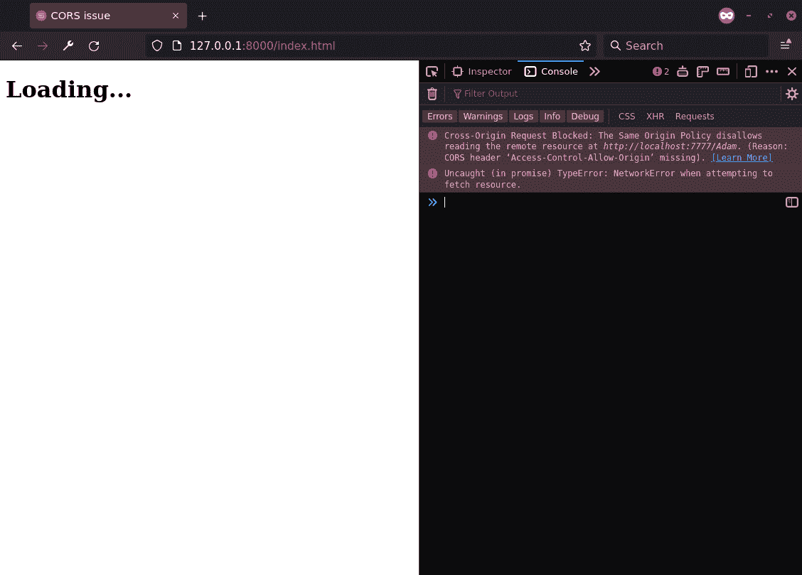

# 第八章：7 处理安全关注

在构建 Web 应用程序时，可能会非常诱人坐下来，规划您的功能，构建它，测试它，然后才回来考虑安全问题。例如，在构建单页应用程序时，您可能甚至直到第一次在浏览器测试中看到这条消息之前都不会考虑 CORS：

```py
Cross-Origin Request Blocked: The Same Origin Policy disallows reading the remote resource at $somesite.
```

在很大程度上，这就是我们在本书中一直在构建的方式。我们看到一个功能，就构建它。任何时候我们在本书中遇到潜在的安全问题，我们都会将其推迟到以后。我们最终到了这个阶段，将学习如何处理 Sanic 中的安全问题。网络安全这个话题当然非常广泛，本书的范围并不包括对其进行全面研究。

相反，在本章中，我们将探讨：

+   设置有效的 CORS 策略

+   保护应用程序免受 CSRF 攻击

+   使用身份验证保护您的 Sanic 应用程序

尤其是我们希望对安全问题有一个基本的了解，这样我们就可以构建 Sanic 解决方案来解决它们。本章的更大收获将是让您对这些主题感到足够舒适，以至于它们不会成为事后之想。当这些问题被分解时，我们可以看到，从一开始就将它们构建到应用程序设计中会使它们更有效，并且实施起来不那么繁重。

## 技术要求

本章的要求将再次建立在我们在前几章中使用的内容之上。由于网络安全通常包括前端 JavaScript 应用程序和后端 Python 应用程序之间的交互，我们可能会看到一些使用在主流网络浏览器中广泛可用的 JavaScript 的示例。您可以在以下位置找到本章的所有源代码：[`github.com/PacktPublishing/Web-Development-with-Sanic/tree/main/chapters/07`](https://github.com/PacktPublishing/Web-Development-with-Sanic/tree/main/chapters/07)。

此外，我们还将使用三个常见（且经过实战考验）的安全库：`cryptography`、`bcrypt`和`pyjwt`。如果您还没有在虚拟环境中安装它们，现在可以添加它们：

```py
$ pip install cryptography bcrypt pyjwt
```

## 设置有效的 CORS 策略

如果您正在构建一个服务器仅对单台计算机上的请求做出响应的 Web 应用程序，并且该计算机物理上与互联网断开连接，那么这个部分可能对您来说并不那么相关。对于其他人来说，请注意！为了清楚起见，您是“其他人”的一部分。这是重要的事情。

简而言之，**跨源资源共享（CORS）**是一种说法，即通过浏览器从一个域访问另一个域。如果没有有效的处理策略，您的应用程序可能会为您的用户打开一个安全风险。

### 无效的 CORS 存在哪些安全问题？

现代网络在浏览器中使用了大量的 JavaScript。它当然能够实现各种交互性和高质量的用户体验。这些能力之一就是代表用户发出数据请求，而用户并不知道这一点。这个特性是当今网络应用程序与 90 年代末的网络应用程序之间最大的区别之一。当用户在网站上时请求数据，这就是使网页感觉像应用程序的原因。也就是说，它使它们交互性和引人入胜。

假设你有一个假设的应用程序，对用户来说看起来是这样的：`https://superawesomecatvideos.com`。这是一个非常成功的网站，很多人喜欢来访问它，看看他们最喜欢的汽车视频。如果它开始在后台请求信息（因为黑客攻击或其他原因）从`https://mybank.com`，那么，我们当然不希望让它成功。没有任何理由让超级神奇猫视频网站能够访问我的银行中的任何内容，尤其是如果我正在我的银行网站上有一个经过验证的 Web 会话。

由于这个原因，默认情况下，网络浏览器不会允许这样做，因为存在**同源策略**。这意味着网络应用程序只能与同源的资源进行交互。一个源由以下部分组成：

+   HTTP 方案

+   域名

+   端口

让我们看看一些被认为是和不是同源的 URL 的例子：

| **URL A** | **URL B** | **同源？** |
| --- | --- | --- |
| [`sacv.com`](http://sacv.com) | [`sacv.com`](http://sacv.com) | 是 |
| [`sacv.com`](http://sacv.com) | [`sacv.com`](http://sacv.com) `/about` | 是，路径无关紧要 |
| [`sacv.com`](http://sacv.com) | [`sacv.com`](https://sacv.com) | 不，不同的 HTTP 方案 |
| [`sacv.com`](http://sacv.com) | [`sacv.com`](http://sacv.com) `:8080` | 不，不同的端口 |
| [`sacv.com`](http://sacv.com) | [`api.sacv.com`](http://api.sacv.com) | 不，不同的域名 |

表 7.1 - URL 及其同源状态的比较

我们假设我们的超级酷猫视频网站也有域名：sacv.com。例如，如果 `https://superawesomecatvideos.com` 想要加载：`https://superawesomecatvideos.com/catvid1234.mp4`，这是可以的。当只有路径或加载的资源不同时，URL 被认为是同源的。在我们的例子中，两个 URL 都包含相同的 HTTP 方案、域名和端口指定。但是，当同一个网站 [`superawesomecatvideos`](https://superawesomecatvideos) 尝试从 `https://api.superawesomecatvideos.com/videos` 获取数据时，哎呀，出错了。这些都是同源策略旨在保护免受的潜在攻击向量。因此，问题变成了：我们如何允许合法的跨源请求，而不允许 *所有* 跨源请求？答案是，我们实际上需要创建一个白名单，并让浏览器知道我们的服务器将接受来自哪些源请求。

让我们构建一个超级简单的示例，以展示问题。我们将在这里构建两个 web 服务器。一个将作为前端应用程序的替代品，另一个将是向前端提供数据的后端。

我们首先构建并运行一个简单的 API 端点，它看起来与我们之前看到的没有任何不同。使用我们之前使用的方法搭建应用程序。以下是您的端点可能的样子：

```py
@app.get("/<name>")
async def handler(request, name):
    return text(f"Hi {name}")
```

您现在应该有一个在端口 `7777` 上运行的 Sanic 服务器，使用我们已学到的知识。您可以通过访问：`http://localhost:7777/Adam` 来测试它。

1.  在某个位置创建一个目录，并将这个名为 `index.html` 的文件添加到其中。以我的例子来说，它将是 `/path/to/directory`：

    ```py
    <!DOCTYPE html>
    <html lang="en">
        <head>
            <meta charset="utf-8" />
            <meta name="viewport" content="width=device-width, initial-scale=1">
            <title>CORS issue</title>
        <body>
            <h1>Loading...</h1>
            <script>
                const element = document.querySelector("h1")
                fetch("http://localhost:7777/Adam")
                .then(async response => {
                    const text = await response.text()
                    element.innerHTML = text
                })
            </script>
        </body>
    ```

    如您所见，这个应用程序将在后台向运行在 `http://localhost:7777` 的应用程序发送请求。在获取内容后，它将把内容替换为屏幕上的 `Loading ...` 文本。

1.  要运行此应用程序，我们将使用 Sanic 包含的一个小巧的技巧，称为“*Sanic Simple Server*”。我们不会构建一个 Sanic 应用程序，而是将 Sanic CLI 指向一个目录，然后它将为我们提供网站服务：

    ```py
    $ sanic -s /path/to/directory
    ```

    > **提示**
    > 
    > 这是一个超级有用的工具，即使在不构建 Sanic 应用程序时也应该放在您的口袋里。在开发过程中，我经常发现需要快速搭建一个 Web 应用程序来在浏览器中查看静态内容。当构建仅使用静态内容的应用程序或构建需要开发服务器的 JavaScript 应用程序时，这可能很有用。

1.  打开一个网页浏览器，并访问这个应该运行在 [`localhost:8000`](http://localhost:8000) 的应用程序。您应该看到类似这样的内容：



图 3.1 - 带有 CORS 问题的 Web 应用程序截图

哎呀，出错了。我们的应用程序抛出了一个错误：

```py
Cross-Origin Request Blocked: The Same Origin Policy disallows reading the remote resource at http://localhost:7777/Adam. (Reason: CORS header ‘Access-Control-Allow-Origin’ missing).
```

对于大多数刚开始接触网页开发的人来说，这次经历将是他们第一次遇到 CORS。这究竟是什么意思？什么是“*跨源请求*”，为什么会被阻止？CORS 头信息是什么？最重要的是，我该如何让它消失？！这个问题让我很烦恼。我们不会“*让它消失*”，我们会理解它的含义，为什么浏览器决定设置障碍，然后继续寻找解决方案。

当一个天真的网页开发者看到这个错误时，会立即上网搜索如何处理这个问题，找到一堆部分或过于深入的信息，然后继续前进，却从未真正理解实际的问题。让错误消失会让你回到开发中，因为错误不再阻碍你的进度，但这并不能解决问题。事实上，你只是创造了一个新的问题。为了成为一名更好的开发者，我们不会在不理解的情况下仅仅实施现成的解决方案。相反，我们会停下来学习正在发生的事情以及为什么会这样。也许你自己也遇到过这个问题，如果没有，你迟早会遇到的。无论你是否在过去“解决了”这个问题，我们都会花些时间来学习这个错误背后的原因，然后再提出一个适当——或者更确切地说，*明显*——的解决方案。一旦你揭开了 CORS 的层层面纱，你会发现它开始变得很有道理，并且可以变得简单易掌握。

我就是那些搜索这个错误、点击第一个链接、复制粘贴解决方案以消除错误然后继续生活的人之一。浏览器不再抱怨：问题解决了。至少我认为是这样。我没有考虑我行动的后果以及我引入的安全漏洞。那个安全漏洞伪装成解决方案是什么？我找到的解决方案是添加一个简单的头信息，我没有再想它：`Access-Control-Allow-Origin: *`。*不要这样做!* 我不知道更好的做法，我继续前进，从未再次考虑过 CORS，除了它似乎在浏览器中给我带来麻烦之外。

这里的问题在于前端应用程序试图访问另一个源的数据：因此是*跨源*。当我添加那个头信息时，我实际上是在禁用浏览器创建的同源保护。`*`的意思是：*允许这个应用程序请求它想要的任何跨源信息*。

我的浏览器为保护我创建了一个城堡。而不是学习如何有效处理 CORS，我决定放下吊桥，打开所有的城门，让守卫们回家睡觉。

我应该做什么呢？让我们来找出答案。

#### 制定有效处理 CORS 的策略

显然，我完全禁用浏览器防御的策略并不是最好的方法。这是条捷径，是懒惰的方法，也是不负责任的方法。我应该做的是去像 Mozilla 提供的那种资源上了解这个问题：[`developer.mozilla.org/en-US/docs/Web/HTTP/CORS`](https://developer.mozilla.org/en-US/docs/Web/HTTP/CORS)。如果那样做了，这会吸引我的注意： 

**谁应该阅读这篇文章**？

**每个人，真的**。

哦，**每个人都**应该阅读它吗？如果你还没有读过，现在你有机会选择与我不同的路径，现在就去读它。我不是在开玩笑。请自己做个好事：在这本书里做个书签，然后去读那个网页。然后回来这里。我保证我们会等你。它用相当简单的术语来理解，并且是一个值得你放在口袋里的权威资源。

根据官方 HTTP 规范，`OPTIONS`方法**允许客户端确定与资源相关联的选项和/或要求，或服务器的功能，而不涉及资源操作**（[`datatracker.ietf.org/doc/html/rfc7231#section-4.3.7`](https://datatracker.ietf.org/doc/html/rfc7231#section-4.3.7)）。换句话说，它给 HTTP 客户端提供了在发送实际请求之前检查端点可能需要什么的能力。如果你曾经构建过基于浏览器的 Web 应用程序，或者打算这样做，这个方法非常重要。因此，当我们深入研究 CORS 头信息时，我们也会重新回顾并大量使用我们在**第三章**中提到的`OPTIONS`处理器，即**路由和接收 HTTP 请求**。请翻回那一节，重新熟悉我们将如何自动为所有路由附加`OPTIONS`处理器。

##### 理解 CORS 头信息

通过应用响应头来解决这些跨源访问问题。因此，我们需要了解这些头信息是什么，以及它们应该在何时应用和使用。在本节中，我们的任务将是构建包含一些基本 CORS 头的 HTTP 响应，我们可以在我们的应用程序中使用这些头。当然，我们可以选择走捷径，安装 PyPI 上的第三方包，它会自动为我们添加这些头。

实际上，我确实建议你在生产应用中这样做。CORS 问题可能很复杂，实施一个**可信**的解决方案应该能带来一定程度的安慰和安心。然而，在不了解基础知识的情况下依赖这些包，与完全禁用同源策略的第一种解决方案相比，也只是稍微好一点。

这里有一些我们应该知道的常见 CORS 响应头：

+   **Access-Control-Allow-Origin**：这是服务器用来告诉客户端它将接受和拒绝哪些来源进行跨源请求的；

+   **Access-Control-Expose-Headers**：服务器使用此选项告诉浏览器它可以允许 JavaScript 安全访问哪些 HTTP 头部（意味着它不包含敏感数据）；

+   **Access-Control-Max-Age**：服务器使用此选项告诉客户端它可以缓存预检请求结果多长时间（有关预检请求的详细信息，请参阅下一节）；

+   **Access-Control-Allow-Credentials**：服务器使用此选项告诉客户端在发送请求时是否可以或不能包含凭据；

+   **Access-Control-Allow-Methods**：在预检请求中，服务器使用此选项告诉客户端在给定端点上它将接受哪些 HTTP 方法；

+   **Access-Control-Allow-Headers**：在预检请求中，服务器使用此选项告诉客户端它允许它添加哪些 HTTP 头部。

##### 理解预检请求

在某些场景下，在浏览器尝试访问跨源 *某物* 之前，它将发出一个被称为 **预检请求** 的请求。这是一个针对目标资源相同域名和端点的请求，发生在实际调用之前，除了使用 `OPTIONS` HTTP 方法。这个请求的目的是获取访问 CORS 头部信息，以了解服务器将允许和不允许什么操作。如果浏览器确定响应不是“安全的”，则不会允许它。

当浏览器决定发出预检请求时？Mozilla 在他们的 CORS 页面上提供了一个很好的概述（[`developer.mozilla.org/en-US/docs/Web/HTTP/CORS#simple_requests`](https://developer.mozilla.org/en-US/docs/Web/HTTP/CORS#simple_requests)）。总之，当：

它是 `GET`、`HEAD` 或 `POST`

不包含任何手动设置的头部，除了 `Accept`、`Accept-Language`、`Content-Language` 或 `Content-Type`

请求头部包括 `Content-Type`，并设置为 `application/x-www-form-urlencoded`、`multipart/form-data` 或 `text/plain` 之一

请求上没有 JavaScript 事件监听器

客户端不会对响应进行流式传输

这些请求通常旨在涵盖正常网络流量遇到的场景：导航到页面、提交 HTML 表单和基本的 AJAX 请求。一旦你的应用程序开始添加大多数单页网络应用程序典型的功能，你将开始注意到你的浏览器发出预检请求。在这种情况下，触发预检请求的最常见的两种类型是：

注入自定义头部（`Authorization`、`X-XSRF-Token`、`Foobar` 等）的 JS 应用程序

使用 `Content-Type`: `application/json` 提交 JSON 数据的 JS 应用程序

你可能会想：这有什么关系？了解这一点很重要，这样我们才知道何时需要响应上一节中看到的六个 CORS 响应头部。

#### 解决 CORS 问题的 Sanic

到目前为止，我们完全避免了使用任何第三方插件。也就是说，我们避免采用任何需要我们`pip install`解决方案的实现。这是一个有意识的决策，以便我们在将解决方案外包给他人之前，先学习构建我们的 Web 应用程序所需的原则。虽然这在这里仍然有效，也是我们即将手动处理 CORS 请求的原因，但重要的是指出，这已经是一个已经被解决的问题。官方支持的`sanic-ext`包和社区支持的`sanic-cors`包都是实现 CORS 保护的可信选项。

话虽如此，让我们考虑每个六个（6）个响应头，以及我们将在何时以及如何实现它们。我们有一些头无论请求类型如何都要添加，还有一些只有在预请求中才会添加。我们需要一个标准且可重复的方法来在这两种情况下添加响应头。我们在这个问题上的首选策略是什么？中间件。

让我们从这个基本的中间件开始，并向其中添加代码：

```py
def is_preflight(request: Request):
    return (
        request.method == "OPTIONS"
        and "access-control-request-method" in request.headers
    )
@app.on_response
async def add_cors_headers(request: Request, response: HTTPResponse) -> None:
    # Add headers here on all requests
    if is_preflight(request):
        # Add headers here for preflight requests
        ...
```

我们正在做两件事来确定一个请求确实是一个预请求：

1.  首先，我们知道浏览器将始终以`OPTIONS`请求的形式发出它

1.  其次，浏览器将始终附加一个名为`Access-Control-Request-Method`的请求头，其值为它即将发送的 HTTP 请求类型

为了模拟预请求，我们将使用以下 curl 请求，该请求添加了触发预请求响应所需的两个头（`Origin`头和`Access-Control-Request-Method`头）：

```py
$ curl localhost:7777 -X OPTIONS -H "Origin: http://mysite.com" -H "Access-Control-Request-Method: GET" -i
```

我们最后需要的是一种能力，可以为我们的应用程序中每个现有的路由添加`OPTIONS`作为可行的 HTTP 方法。这是`sanic-ext`添加的功能，我们将在第十一章“一个完整的真实世界示例”中学习一种简单的方法来实现这一点。但首先，你可能还记得这是我们在第三章“路由和接收 HTTP 请求”中构建的。我们将重用遍历所有定义的路由并添加`OPTIONS`端点的代码。你可以在该章节的“对 OPTIONS 和 HEAD 的全面支持”部分找到它。

在建立这一点之后，我们将查看每个响应头，以更全面地了解它们。

##### Access-Control-Allow-Origin

这个头可能是最重要的一个，也是最容易被当作核选项，完全禁用 CORS 保护，正如之前讨论的那样。除非你有特定的理由接受来自任何浏览器源头的请求，你应该避免使用`*`。

该值应该是您预期请求来源的地址。您 *不应* 只是回收传入请求的 `Origin` 头部并将其应用。这实际上等同于 `*`。相反，有一个预定义的允许来源列表并与传入的 `Origin` 进行交叉引用是一个好的做法。如果没有匹配项，则简单地不要添加任何 CORS 头部。

这里是我们将添加到中间件中的第一个片段以实现此目的：

```py
origin = request.headers.get("origin")
if not origin or origin not in request.app.config.ALLOWED_ORIGINS:
    return
response.headers["access-control-allow-origin"] = origin
```

确保您还设置了配置 `ALLOWED_ORIGINS` 的值。这可以在创建应用程序实例的任何地方完成。

```py
app = Sanic(__name__)
app.config.ALLOWED_ORIGINS = ["http://mysite.com"]
```

如您所见，我们将将其添加到所有来自浏览器的响应中。我们如何知道这是一个浏览器请求？因为我们预期浏览器会添加 `Origin` 头部。

##### Access-Control-Expose-Headers

`Access-Control-Expose-Headers` 头部提供了服务器控制哪些头部可以被 JavaScript 访问的能力。这是一个安全措施，用于提供白名单控制，以确定浏览器应用程序可以访问哪些信息。

让我们在浏览器中开始添加一些测试。对于这些示例，我们将使用与之前类似的基本 HTML 结构。

1.  我们首先设置 HTML。这里的目的是在 JavaScript 中读取 `foobar` 头部并在屏幕上输出：

    ```py
    <body>
        <h1>CORS Testing</h1>
        <h2 id="foobar">Loading...</h2>
        <script>
            const element = document.querySelector("#foobar")
            fetch("http://localhost:7777/").then(async response => {
                const text = await response.text()
                element.innerHTML = `foobar='${response.headers.get("foobar")}'`
            })
        </script>
    </body>
    ```

    我们需要设置我们的应用程序以查看 HTML 并添加头部信息：

    ```py
    @app.get("/")
    async def handler(request):
        response = text("Hi")
        response.headers["foobar"] = "hello, 123"
        return response
    app.static("/test", "./test.html")
    ```

1.  为了验证我们的好奇心，我们将使用 `curl` 重新检查响应，以确保确实发送了头部信息：

    ```py
    $ curl localhost:7777 -i
    HTTP/1.1 200 OK
    foobar: hello, 123
    content-length: 2
    connection: keep-alive
    content-type: text/plain; charset=utf-8
    Hi
    ```

1.  现在，打开您的浏览器到 `http://127.0.0.1:7777/test`。您应该看到：

    ```py
    CORS Testing
    foobar=‘null’
    ```

    发生的事情是浏览器被阻止访问头部。如果我们想允许它，那么我们需要明确指出。

1.  因此，回到我们正在构建的 `add_cors_headers` 中间件，让我们添加以下片段：

    ```py
    response.headers["access-control-expose-headers"] = "foobar"
    ```

    不要忘记，由于我们实际上是在浏览器上测试这个，我们需要适当地设置 `ALLOWED_ORIGINS` 配置值：

    ```py
    app.config.ALLOWED_ORIGINS = ["http://mysite.com", "http://127.0.0.1:7777"]
    ```

    这次当您访问浏览器时，您应该看到 JavaScript 能够深入获取 `Foobar` 头部的值：

    ```py
    CORS Testing
    foobar=‘hello, 123’
    ```

因此，如果您打算在应用程序的客户端使用任何类型的元数据，您需要正确使用 `access-control-expose-headers`。

##### Access-Control-Max-Age

当浏览器 *确实* 发出一个预检请求时，它有缓存该响应的能力，以便下次它发出相同的请求时不需要击中服务器。这种性能提升可以通过服务器使用 `Access-Control-Max-Age` 来控制（在一定程度上），该选项指定了预检请求可以被缓存的时长（以秒为单位）。

通常，网络浏览器会为此设置一个最大值。如果你尝试将其设置为一些荒谬的大数字，它们会将其降低到预定义的最大值。因此，我通常建议使用大约 10 分钟的值。一些浏览器允许你设置到 24 小时，但这可能就是允许的最大值了。

我们现在将在我们的中间件中看到这一点：

```py
response.headers["access-control-max-age"] = 60 * 10
```

##### Access-Control-Allow-Credentials

这个头部仅用于预检请求。因此，我们将添加的片段需要放在我们的`is_preflight(request)`块内部。

当一个 JavaScript 应用程序发起请求时，它必须**明确地**调用允许发送凭证的调用。如果不这样做，浏览器就不会在请求中包含它们。然后服务器可以发挥作用，告诉浏览器这个包含凭证的请求是否安全地暴露给 JavaScript 应用程序。

要允许它，我们设置头部如下：

```py
response.headers["access-control-allow-credentials"] = "true"
```

##### Access-Control-Allow-Methods

到目前为止，实际上并没有必要使用任何插件。添加这些 CORS 头部相对直接。然而，下一部分可能会变得稍微复杂一些。

`Access-Control-Allow-Methods`头部旨在在预检请求期间向浏览器发出警告，告知浏览器允许发送到端点的跨源 HTTP 方法。许多应用程序通过允许一切来禁用这种保护。

```py
response.headers[
    "access-control-allow-methods"
] = "get,post,delete,head,patch,put,options"
```

这当然是一个简单的解决方案。它比我在网上找到的第一个允许任何源头的 CORS 解决方案要安全得多。但，我们仍然可以做得更好。

为了实现动态方法，这些方法与*实际*端点可能性相匹配，我们将在我们的代码中做一些调整。

1.  记得我们是如何定义预检请求的吗？让我们在请求中间件中提前这样做。

    ```py
    @app.on_request
    async def check_preflight(request: Request) -> None:
        request.ctx.preflight = is_preflight(request)
    ```

1.  接下来，当我们为`OPTIONS`请求生成处理程序时，我们将注入一个包含所有允许方法的列表，如下所示：

    ```py
    from functools import partial
    @app.before_server_start
    def add_info_handlers(app: Sanic, _):
        app.router.reset()
        for group in app.router.groups.values():
            if "OPTIONS" not in group.methods:
                app.add_route(
                    handler=partial(
                        options_handler,
                        methods=group.methods
                    ),
                    uri=group.uri,
                    methods=["OPTIONS"],
                    strict_slashes=group.strict,
                    name="options_handler",
                )
        app.router.finalize()
    ```

1.  现在我们已经可以在我们的选项处理程序中访问预检检查，我们可以在那里进行检查并添加头部。我们还可以将传入的方法列表连接成一个逗号分隔的列表。现在，这应该提供了一组自动化的`OPTIONS`端点，这些端点正好使用了将要使用的 HTTP 方法。

    ```py
    async def options_handler(request, methods):
        resp = response.empty()
        if request.ctx.preflight:
            response.headers["access-control-allow-credentials"] = "true"
            resp.headers["access-control-allow-methods"] = ",".join(methods)
        return resp
    ```

1.  我们将使用 curl 查看预检响应，以查看所有我们的头部信息：

    ```py
    $ curl localhost:7777 -X OPTIONS -H "Origin: http://mysite.com" -H "Access-Control-Request-Method: GET" -i    
    HTTP/1.1 204 No Content
    access-control-allow-credentials: true
    access-control-allow-methods: GET,PATCH,POST
    vary: origin
    access-control-allow-origin: http://mysite.com
    access-control-expose-headers: foobar
    connection: keep-alive
    ```

##### Access-Control-Request-Headers

我们在这里关注的最后一个头部是`Access-Control-Request-Headers`，它也是应该在预检响应中发送的头部。它是向浏览器指示哪些非标准头部可以在跨源请求中发送的指示。

如果 JavaScript 想要发送一个名为*counting*的头部，那么它会这样做：

```py
fetch("http://localhost:7777/", {
    headers: {counting: "1 2 3"}
})
```

然而，由于这会触发预检请求，浏览器会因为服务器没有明确允许计数作为一个可接受的头而失败，并显示 CORS 错误。

要做到这一点，我们在预检块中启用它：

```py
resp.headers["access-control-allow-headers"] = "counting"
```

我们对 CORS 头的审查增加了大量的代码。要查看完整版本，请查看 GitHub 仓库：[`github.com/PacktPublishing/Web-Development-with-Sanic/tree/main/chapters/07/corsissue`](https://github.com/PacktPublishing/Web-Development-with-Sanic/tree/main/chapters/07/corsissue)。现在我们已经完成了 CORS 的审查，接下来是类似相关的话题：CSRF

## 保护应用程序免受 CSRF 攻击

我们旅程的下一步是处理跨站请求伪造（CSRF）。还应注意的是，这通常也带有缩写 XSRF。如果你在网上看到这两个词，它们指的是同一个问题。那么，这个问题是什么呢？

你知道你收到的那封可疑的尴尬电子邮件，上面写着“点击这里领取你的 500 美元奖金”吗？很可能那个链接会把你带到由试图黑客攻击你的人控制的恶意网站。他们可能放置了一些链接或者在他们的网站上诱导你做一些事情，从而向合法网站发送后台请求以执行不良行为。如果你的应用程序没有保护免受这种 CSRF 攻击，那么恶意行为者可能会诱导你的用户更改密码，而他们甚至都不知道这一点！

阻止这些攻击可以在两个方面进行。当然，你的用户可以更加小心，不要在垃圾邮件箱中打开他们的电子邮件。但作为负责任的 Web 应用程序开发者，你也有责任保护你的用户。

### 不起作用的解决方案

Cookies。如果你跳过前面的内容，提前查看我提供的解决方案，你会发现它确实包括了 cookies。确实，cookies 可以在解决问题中发挥作用。然而，它们是一个有缺陷的安全措施，**不能**单独作为解决 CSRF 问题的答案。

这究竟是如何工作的呢？想象一下，你在 cookie 中设置了一个会话 ID。它是一个相当好的随机字符混合，使得有人猜对它是不切实际的。问题是，cookie 是随着每个请求发送的，不是基于请求发起的地方，而是它要去的地方。所以，如果你的浏览器看到它存储了`yourapplication.com`的 cookie，那么即使请求是在`h4ck3rsp4r4d1se.com`发起的，浏览器也会发送 cookie。

还应注意的是，引入 TLS 和读取 Origin 头也不是充分的解决方案。当然，这些是应用程序应该执行的有用和有效的事情，但单独它们并不能提供对 CSRF 的保护。例如，`Origin`头很容易被欺骗。

### 起作用的解决方案

现在我们知道了什么不能保护我们免受 CSRF 攻击，我们可以看看一些可行的解决方案，它们将有助于保护我们的 Web 应用程序。这些方案不是相互排斥的，我建议您考虑以某种形式实施它们。当然，您的决定将取决于具体情况，但以下是一些在保护应用程序免受 CSRF 攻击时需要记住的良好实践。

#### 不要在`GET`请求中改变状态

这非常重要。我们之前在*第三章*中讨论了这个问题，但是`GET`请求不应该改变状态。这意味着应用程序不应该从`GET`请求中获取任何指示去做某事。这些请求应该只用于获取信息。通过从黑客的武器库中移除`GET`，我们迫使他们在其恶意网站上使用 JavaScript 漏洞。

我们想要允许这样做的原因是，浏览器有一些内置的安全措施，我们知道这些措施，并且可以利用它们来获得优势。首先，从浏览器内部，无法伪造 Origin 头。

假设我们的不良网站中包含以下代码：

```py
fetch("http://localhost:7777/", {
    headers: {origin: "http://localhost:7777"}
})
```

如果您访问了`somebadwebsite.com`，源地址仍然是`http://somebadwebsite.com`。这就是为什么 CORS 保护起作用的原因。通过禁止`GET`请求进行状态改变，我们确保了这种类型的攻击不会成功：

```py

```

将黑客强制使用 JavaScript——尤其是那些被强制发出预检请求的 JavaScript 请求——在接下来我们将看到的情况下，这给了我们更多的控制权。

#### Cookies

下一个有用的解决方案涉及 Cookies。

等一下？Cookies 不是在“不起作用”的解决方案类别中吗？这是怎么回事？

我们刚刚说过，我们想要迫使恶意攻击者在其漏洞中使用 JavaScript。这是因为我们也知道浏览器 Cookies 有一个我们可以控制的功能：`HttpOnly`。当服务器创建一个 Cookies 时，它可以决定 JavaScript 是否应该能够访问该 Cookies。这意味着当启用时，Cookies 将在每个 Web 请求中继续发送，但任何 JavaScript 代码都无法访问它。这使得它成为存储像会话令牌这样的安全凭证的理想位置。如果没有这个，Cookies 就会受到所谓的跨站脚本攻击（也称为“XSS”）的威胁。这是一种攻击，其中一些黑客能够使用 JavaScript 从前端浏览器中提取安全细节。

> **重要提示**
> 
> 如果您的浏览器应用程序可以使用 JavaScript 访问某些信息，黑客也可以。

我们还提到，`yourapplication.com`的 Cookies 仍然可能从`h4ck3rsp4r4d1se.com`不知情地发送。由于 JavaScript 在允许访问 Cookies 时，只能在其当前域上操作，我们在构建解决方案时又多了一个工具可以使用。

当用户登录时，如果我们设置两个 cookie（一个用于会话，一个用于 CSRF 保护），我们可以根据预期的使用情况设置`HttpOnly`值。会话 cookie 保持不可访问，而专门为 CSRF 保护设置的 cookie 可以是 JavaScript 可访问的。然后我们可以要求 JavaScript 在发送请求时使用该 cookie 的值。这将有效，因为运行在`h4ck3rsp4r4d1se.com`上的 JavaScript 将无法访问标记为其他域的 cookie。

这个 cookie 的值应该是什么？好吧，实际上任何难以猜测的东西都可以。最好保持该值与用户特定相关，这样你才能验证其内容并确信令牌是真实的。此外，该值应该改变，而不是静态的。这将使任何潜在的攻击者更难攻击。这种双重 cookie 方法并非 100%无懈可击。但对于大多数应用程序的需求来说，应该是相当安全的。问题是当你的用户开始意外下载能够绕过浏览器保护的恶意软件时。我们将把这个问题放在一边，因为它超出了我们控制的能力，并且超出了这本书的范围的深入讨论。

应该注意的是，我们并不一定关心 CSRF 令牌可能被破坏并被恶意行为者使用。这是可以的。因为即使他们能够访问它，他们也没有办法发送带有正确的来源和正确的会话令牌。

#### 表单字段

其他框架还使用另一种形式的 CSRF 保护。例如，Django 使注入一些隐藏的 HTML 到页面上的想法变得流行：

```py
<input type="hidden" name="csrftoken" value="SOMETOKEN" />
```

此值将被包含在表单响应中，或者以某种预期的方式读取到请求中。这本质上是我在这里提出的完全相同的想法。唯一的区别是，我们不是将值注入到一个隐藏的（尽管可以通过 JavaScript 访问）位置输入中，而是将其存储在 cookie 中。这两种解决方案最终都将取决于下一节中该值发送回服务器时发生的情况。

#### 将解决方案付诸实践

现在我们对我们的方法有一个大致的了解，让我们回顾一下，以便明确。我们希望只允许认证用户在我们的应用程序中进行状态更改。为了确保更改来自我们的用户而不是黑客，我们将在以下情况下允许更改：

+   HTTP 方法为`POST`、`PATCH`、`PUT`或`DELETE`

+   进入请求的来源与我们预期的相符

+   进入请求有一个使用`HttpOnly`存储的 cookie

+   进入的请求有一个有效的 CSRF 令牌

为了实现我们的目标，我们需要决定我们将把实现这个目标的代码放在哪里。因此，我们回到了我们已经看到几次的辩论：装饰器或中间件。没有正确的选择，答案当然将取决于你正在构建的内容。

对于我们的示例，我们将构建它作为一个装饰器。当我们进入下一节的认证时，将更清楚地了解为什么在这里使用装饰器模式。如果你认为中间件适合你，那就继续尝试将其重建为中间件。这两种选项都是合法的模式，可能在不同的环境下满足你的需求。然而，说实话，我通常发现装饰器模式更容易适应更广泛的使用案例。以下是步骤：

1.  首先，我们将创建一个基本的装饰器。为了使工作更容易，你可以从 Sanic 用户指南中获取装饰器模板：[`sanicframework.org/en/guide/best-practices/decorators.html#templates`](https://sanicframework.org/en/guide/best-practices/decorators.html#templates)。

    ```py
    def csrf_protected(func):
        def decorator(f):
            @wraps(f)
            async def decorated_function(request, *args, **kwargs):
                response = f(request, *args, **kwargs)
                if isawaitable(response):
                    response = await response
                return response
            return decorated_function
        return decorator(func)
    ```

    当发生 CSRF 失败时，正确的响应应该是`403 Forbidden`。我们将创建一个自定义异常，以便在发生这种情况时抛出：

    ```py
    from sanic.exceptions import Forbidden
    class CSRFFailure(Forbidden):
        message = "CSRF Failure. Missing or invalid CSRF token."
    ```

1.  考虑到我们的目标和需求，我们想要以某种方式确定请求来自浏览器。这是因为浏览器请求将受到 CSRF 保护。没有必要在直接访问 API 请求上实现它。我个人喜欢通过在每个请求上添加一个`HttpOnly` cookie（如果不存在的话）来做这件事。这个值完全无关紧要。我们唯一关心的是这个值被发送了。对于`Origin`头也是如此。如果发送了`Origin`，我们将假设这是一个浏览器请求，并对其施加我们接下来将施加的更严格的要求。这确实是一个腰带加背带的方法，因为它们有点重复。然而，它确实给你一个想法，在设计自己的解决方案时应该考虑哪些类型的策略。

    ```py
    @app.on_request
    async def check_request(request: Request):
        request.ctx.from_browser = (
            "origin" in request.headers or
            "browser_check" in request.cookies
        )
    @app.on_response
    async def mark_browser(_, response: HTTPResponse):
        response.cookies["browser_check"] = "1"
        response.cookies["browser_check"]["domain"] = "mydomain.com"
        response.cookies["browser_check"]["httponly"] = True
    ```

    > **提示**
    > 
    > 在每个请求上标记`browser_check` cookie 是过度的。我通常建议在着陆页上这样做。或者，以某种方式捕捉到存在`Origin`但没有 cookie 设置的情况。我将把这个决定权交给你，以确定设置此 cookie 的适当位置和方法。如果你控制前端应用程序，你甚至可以考虑在那里设置它。这个 cookie 的目的只是给我们一个额外的指示，表明这不是一个直接访问 API 请求。

1.  再次查看我们的需求列表，让我们在我们的装饰器装饰函数中添加一些代码，以确保来源匹配。这是必要的，因为我们已经知道当请求来自浏览器的 JavaScript 时，这个值不能被伪造：

    ```py
    origin = request.headers.get("origin")
    if request.ctx.from_browser and origin not in app.config.ALLOWED_ORIGINS:
        raise CSRFFailure
    ```

1.  我们下一个需求是确保存在一个`HttpOnly`令牌。目前，我们将使用我们的`browser_check` cookie。如果你有一个会话 cookie，这也可以满足：

    ```py
    origin = request.headers.get("origin")
    if request.ctx.from_browser and (
        origin not in app.config.ALLOWED_ORIGINS
        or "browser_check" not in request.cookies
    ):
        raise CSRFFailure
    ```

1.  最后，我们需要验证我们的 CSRF 令牌。我知道我们还没有讨论这是什么，如何生成它，所以当然我们还没有到达验证的部分。我们很快就会到达那里。在此之前，让我们简单地添加一个函数来完善我们的装饰器：

    ```py
    origin = request.headers.get("origin")
    if request.ctx.from_browser and (
        origin not in app.config.ALLOWED_ORIGINS
        or "browser_check" not in request.cookies
        or not csrf_check(request)
    ):
        raise CSRFFailure
    ```

现在我们终于转向 CSRF 令牌。对于我们的实现，我们将使用 Fernet 令牌。这是一种使用密钥加密一些文本的方法，这样在没有该密钥的情况下就无法更改或读取。我们将把这个令牌设置在一个 cookie 中，这个 cookie 将明确地**不是**`HttpOnly`。我们希望前端 JavaScript 应用程序读取这个值，并通过头部将其发送回应用程序。当可能有害的状态改变请求到来时，我们将验证头部和 cookie 是否匹配。我们还将提取 Fernet 令牌的有效负载并验证其内容。该令牌的实际值我们将存储在第二个 cookie 中，该 cookie 将是`HttpOnly`。这个双重 cookie 和双重提交验证的目的是为了保护我们的应用程序免受可能破坏我们策略的各种攻击。解决方案可能听起来比实际要复杂得多，所以让我们看看一些代码来开始拼凑这个解决方案：

1.  我们将首先设置一些我们将需要的配置值。

    ```py
    app.config.CSRF_REF_PADDING = 12
    app.config.CSRF_REF_LENGTH = 18
    app.config.CSRF_SECRET = "DZsM9KOs6YAGluhGrEo9oWw4JKTjdiOot9Z4gZ0dGqg="
    ```

    > **重要提示**
    > 
    > 毫不奇怪，你绝对不应该，**绝对不应该**，**绝对不应该**在你的应用程序中硬编码这样的秘密。这只是为了示例目的。相反，你应该通过环境变量或比这更安全的方法注入秘密值。

1.  我们需要一个函数来生成我们的 CSRF 引用值和令牌。为了完成这个任务，我们将使用本章开头提到的加密库。它经过实战检验，是可靠的。它应该是我们在 Python 中解决所有加密需求时的首选之地。以下是代码：

    ```py
    from base64 import b64encode
    from cryptography.fernet import Fernet
    def generate_csrf(secret, ref_length, padding) -> Tuple[str, str]:
        cipher = Fernet(secret)
        ref = os.urandom(ref_length)
        pad = os.urandom(padding)
        pretoken = cipher.encrypt(ref)
        return ref.hex(), b64encode(pad + pretoken).decode("utf-8")
    ```

    如您所见，这相当简单。我们使用我们的密钥创建加密对象。然后，根据加密库的建议，我们使用操作系统的随机生成器逻辑，通过 `os.urandom` 来生成我们的引用值和一些额外的填充。引用值被加密，然后我们的令牌被填充并返回，同时附带引用值。

1.  为了验证我们的令牌，我们需要执行这些步骤的逆操作，并将加密值与传递的引用值进行比较：

    ```py
    def verify_csrf(secret, padding, ref, token):
        if not ref or not token:
            raise InvalidToken("Token is incorrect")
        cipher = Fernet(secret)
        raw = b64decode(token.encode("utf-8"))
        pretoken = raw[padding:]
        encoded_ref = cipher.decrypt(pretoken)
        if ref != encoded_ref.hex():
            raise InvalidToken("Token is incorrect")
    ```

1.  我们需要一种方法来确保这些值作为 cookie 存在。因此，我们将在这个示例中在中间件中生成它们。然而，在登录端点执行此功能可能更合理：

    ```py
    @app.on_response
    async def inject_csrf_token(request: Request, response: HTTPResponse):
        if (
            "csrf_token" not in request.cookies
             or "ref_token" not in request.cookies
        ):
            ref, token = generate_csrf(
                request.app.config.CSRF_SECRET,
                request.app.config.CSRF_REF_LENGTH,
                request.app.config.CSRF_REF_PADDING,
            )
            response.cookies["ref_token"] = ref
            response.cookies["ref_token"]["domain"] = "localhost"
            response.cookies["ref_token"]["httponly"] = True
            response.cookies["csrf_token"] = token
            response.cookies["csrf_token"]["domain"] = "localhost"
    ```

    记住，我们的计划是让 `csrf_token` 可由 JavaScript 访问。我们希望传入的请求不仅包含在 cookie 值中，还要在 HTTP 头部注入这个值。由于同源策略，这只能通过在我们应用程序上运行的 JavaScript 来完成。CORS 来拯救。这意味着，不要忘记白名单我们即将看到的请求头部：`X-XSRF-Token`。

记得在我们之前的 `@csrf_protected` 装饰器中，有一个检查是 `csrf_check(request)`。现在我们终于要揭露这个函数是什么了：

```py
def csrf_check(request: Request):
    csrf_header = request.headers.get("x-xsrf-token")
    csrf_cookie = request.cookies.get("csrf_token")
    ref_token = request.cookies.get("ref_token")
    if csrf_header != csrf_cookie:
        raise CSRFFailure

    try:
        verify_csrf(
            request.app.config.CSRF_SECRET,
            request.app.config.CSRF_REF_PADDING,
            ref_token,
            csrf_cookie,
        )
    except InvalidToken as e:
        raise CSRFFailure from e
    return True
```

我们应该关注三个值：我们刚刚设置的两个 cookie 和传入的 `X-XSRF-Token` 头部。正如我们所知，这个头部将在客户端生成，通过提取 cookie 并将其值注入头部。现在，简单地验证这一点就足够了：

+   cookie 和头部匹配

+   受保护的 `HttpOnly` 引用值与加密值相同

如果所有检查都无误，我们可以确信请求是真实的。

> **提示**
> 
> 你可能想知道为什么我选择在这里使用 XSRF 而不是 `X-CSRF-Token`，甚至只是 `CSRF-Token` 作为头部名称。原因是一些前端框架会自动为你客户端添加这个头部注入。由于从我们的角度来看，头部的名称并不重要，我们不妨与其他喜欢这样命名的工具友好地合作。

### Samesite cookies

你可能熟悉 CSRF 保护中的一个较新的概念，称为 **samesite** cookies。这是一个可以附加到 cookie 上的值，为浏览器提供了额外的指示，说明如何处理该 cookie。简而言之，通过在服务器上的 cookie 上设置此值，我们允许应用程序告诉浏览器何时可以发送 cookie，何时不可以。仅此一项几乎可以缓解 CSRF 的问题，但它**不应**单独作为解决方案使用。

事实上，**开放网络应用安全项目 (OWASP)**——一个促进在线安全实践增强的非营利性基金会——明确指出，samesite 属性“*不应取代 CSRF Token。相反，它应该与该令牌共存，以便以更稳健的方式保护用户。*” [`cheatsheetseries.owasp.org/cheatsheets/Cross-Site_Request_Forgery_Prevention_Cheat_Sheet.html#samesite-cookie-attribute`](https://cheatsheetseries.owasp.org/cheatsheets/Cross-Site_Request_Forgery_Prevention_Cheat_Sheet.html#samesite-cookie-attribute)

现在，我们将了解 samesite cookie 保护以及如何将其集成到我们的解决方案中。有三个允许的值：`None`、`Lax` 和 `Strict`

#### Samesite=None

使用 `Samesite=None` 的 cookies 应仅考虑用于非安全相关的 cookies。这是因为它们将与每个请求一起发送，无论它们来自哪个网站。因此，如果你在黑客的网站上，那个黑客将能够代表你向其他你访问过的网站提交请求，并利用你电脑上的 cookies。这可不是什么好事。

但是，对于正确类型的 cookies，这实际上并不是一个问题。只要这个值与安全或会话无关，这是可以接受的。然而，也应该注意的是，为了使这个功能生效，它也只有在 cookie 被标记为 Secure 时才允许。也就是说，它只允许在 `https` 请求中传递。在你的生产级代码中，你应该始终这样做。你使用 TLS 加密吗？如果不使用，我们将在第八章和第十章中看到这个问题的简单解决方案。

设置 `Samesite=None` 就像以下这样简单：

```py
response.cookies["myfavorite"] = "chocolatechip"
response.cookies["myfavorite"]["domain"] = "mydomain.com"
response.cookies["myfavorite"]["samesite"] = None
response.cookies["myfavorite"]["secure"] = True
```

这将导致以下 cookie：

```py
Set-Cookie: myfavorite=chocolatechip; Path=/; Domain=mydomain.com; SameSite=None; Secure
```

#### Samesite=Lax

现在大多数现代网络浏览器默认就是这样。然而，你不应该依赖于这个事实，并且明确地这样做仍然是最佳实践。

这个值是什么意思？它的意思是，我们一直担心的跨站 `POST` 请求将不会包含 cookies（这是 CSRF 保护的一大部分）。然而，在某些情况下，它将允许它们存在。要在一个跨站请求中发送，请求必须是顶级导航（可以想象成浏览器的地址栏），并且 HTTP 方法必须是 `GET` 或 `HEAD`。

这基本上归结为对 AJAX 请求的保护，但允许当有人从第三方链接导航到网站时发送 cookie。这实际上很有道理，可能是你想要为许多 cookies 使用的。

例如，如果你的会话 cookies 没有被设置为 Lax（而是 `Strict`），当有人从另一个网站点击链接来到你的网站时，他们不会显示为已登录。然而，一旦他们开始浏览，他们的会话突然出现。这可能会给用户带来尴尬的体验。因此，建议对于大多数典型应用，会话管理和认证 cookies 应使用 `Lax`。如果你正在构建一个安全的银行应用程序，你可能不希望有人链接到安全的银行页面，也许 `Lax` 不是一个正确的答案。然而，通常使用 Lax 进行认证是可以接受的。

如前所述，你不再需要明确声明 samesite 属性，但明确总是优于隐含。

```py
response.cookies["session_token"] = session_token
response.cookies["session_token"]["domain"] = "localhost"
response.cookies["session_token"]["httponly"] = True
response.cookies["session_token"]["samesite"] = "lax"
response.cookies["session_token"]["secure"] = True
```

这将生成一个看起来像这样的 cookie：

```py
Set-Cookie: session_token=<TOKEN>; Path=/; Domain=localhost; HttpOnly; SameSite=lax; Secure
```

#### Samesite=Strict

如上一节所暗示的，只有当请求来自正确的网站时，才会发送`Strict` cookie。这意味着用户必须首先登录你的应用，然后才能提交请求。在我看来，这听起来就像是一种会改变状态的请求。你明白我的意思了吗？

在我看来（而且你无疑会遇到不同的观点），CSRF 保护 cookie 应该设置为`Samesite=Strict`。至少在我的应用中，我想不出任何合法的使用场景（至少不是我想保护的请求类型），我会希望用户在发起这些请求之前先登录我的应用。你可能有不同的需求，这可能不适合你。如果你觉得`Lax`更合适，那就按你的去做。我会坚持我的选择：

```py
response.cookies["ref_token"] = ref
response.cookies["ref_token"]["domain"] = "localhost"
response.cookies["ref_token"]["httponly"] = True
response.cookies["ref_token"]["samesite"] = "strict"
response.cookies["ref_token"]["secure"] = True
response.cookies["csrf_token"] = token
response.cookies["csrf_token"]["domain"] = "localhost"
response.cookies["csrf_token"]["samesite"] = "strict"
response.cookies["csrf_token"]["secure"] = True
```

如你大概能猜到的，我们的 cookie 现在看起来是这样的：

```py
Set-Cookie: ref_token=<TOKEN>; Path=/; Domain=localhost; HttpOnly; SameSite=strict; Secure
Set-Cookie: csrf_token="<TOKEN>"; Path=/; Domain=localhost; SameSite=strict; Secure
```

> **重要提示**
> 
> 正如之前提到的，samesite cookie 的支持并不是普遍的。你应该检查像 CanIUse 这样的网站，看看你目标浏览器是否实现了它：[`caniuse.com/same-site-cookie-attribute`](https://caniuse.com/same-site-cookie-attribute)。此外，在这个上下文中，“相同”的网站也包括子域名。有一个公共地址列表被认为是这个上下文中的“顶级”地址，它并不完全与.com、.org、.io 等匹配。例如，github.io 上的两个网站不被认为是 samesite。完整的列表，请查看这里：[`publicsuffix.org`](https://publicsuffix.org)。

在我们对 CSRF 的审查中，提到了很多关于会话令牌和身份验证的内容，但我们还没有探讨这一点。虽然这是一个非常深入的话题，我们将探讨如何使用 Sanic 在你的应用中实现身份验证。

## 使用身份验证保护你的 Sanic 应用

当许多人思考一个 Web 应用时，他们脑海中浮现的是一种在 Web 上的平台类型，他们登录后去做…*某件事*。这里的活动并不是我们关心的。当你读完这本书后，你将去构建一些令人惊叹的应用。我们关心的是旅程和过程。而我们现在关心的过程部分是：登录。

更具体和准确地说，我们即将探讨的是**身份验证**，而不是那么多的**授权**。虽然这两个概念非常紧密相关，但它们并不相同，也不能互换。事实上，授权通常假定身份验证已经发生。

有什么区别？

+   **身份验证**：回答的问题是：你是谁？

+   **授权**：回答的问题是：你被允许做什么？

更让人困惑的是，**身份验证**失败会返回`401 Unauthorized`响应。这是互联网早期的一个非常不幸的命名。**授权**失败会返回`403 Forbidden`响应。

在 2020 年，我在 EuroPython 会议上讨论了访问控制问题。幻灯片和 YouTube 演示文稿的链接在我的 GitHub 页面上：[`github.com/ahopkins/europython2020-overcoming-access-control`](https://github.com/ahopkins/europython2020-overcoming-access-control)。如果你有大约 30 分钟的时间观看关于这个激动人心的主题的引人入胜的演示，这是一个“不容错过”的机会。

演示涵盖了认证/授权这个主题，但同时也很大程度上试图回答这个问题：“保护我的 API 的不同方法有哪些？”它通过比较基于会话的认证与非基于会话的（即无状态）来回答这个问题。我们在这里将回顾这两种策略，同时也会包括如何实现 API 密钥（这在那个演示中未涉及）。

要做到这一点，有一系列问题需要回答。在我们深入探讨如何使用 Sanic 实现一些常见策略之前，我们将回顾一些在决定策略之前你应该问自己的问题。

1.  谁将消费这个 API？你应该考虑 API 是否将被其他应用程序或脚本使用，或者由实际的人使用。它将被用于将集成到其应用程序中的程序员吗？或者，它将被用于为移动应用程序提供动力？前端 JavaScript 应用程序需要访问它吗？你应该关心的原因是你必须了解你的预期用例的技术能力，但也要了解其弱点。如果你的 API 将仅由其他后端脚本和应用程序消费，那么你将更容易保护它。我们之前讨论的大部分关于 cookie 的内容都高度不相关；而且 CORS 不是一个问题。另一方面，如果你打算为基于浏览器的单页应用程序提供动力，那么你可能需要一个比简单的 API 密钥更健壮的认证策略。

1.  你是否控制着客户？这个问题的核心在于你（或你的组织）是否会成为 API 的消费者。将此与旨在被集成和其他应用程序消费的 API 进行对比，你应该看到这会在你如何控制访问上产生差异。例如，如果你正在构建一个不面向互联网、仅存在于高度受控网络中的微服务，那么你显然会有与为你的银行网站提供动力的 API 不同的安全担忧。

1.  这将支持一个网络浏览器前端应用程序吗？这实际上是第一个问题的子集，但它的重要性足以单独考虑。这个问题之所以如此重要，是因为浏览器存在缺陷。当互联网最初被创建，并且网络浏览器最初被发布时，没有人能够准确预测互联网的方向和重要性。安全问题是——以及缓解这些问题的解决方案——是在多年的黑客试图利用一个从未真正以安全为首要考虑的系统后产生的。例如，在当今世界，非加密的`http://`网站甚至存在，这真的很令人震惊。到目前为止，本章已经投入了大量精力来探讨如何处理仅因为网络浏览器存在缺陷而存在的某些安全问题。因此，知道你的应用程序甚至存在前端使用的可能性，应该在你早期就触发警告，你必须为此话题投入时间和精力。

在心中牢记这三个问题后，我们现在将探讨三种潜在的认证用户方案。但首先，还有一个提醒，即我这里所做的一些事情并不意味着你也应该这样做。运用你的技能，利用所提供的内容构建你应用程序所需的解决方案。我们谈论的是安全，所以在你走得太远之前可能需要小心。如果你对某个策略有疑问，随时可以将问题带到 Discord 社区或论坛上。

接下来，我们将探讨你可能会发现的一些策略。

### 使用 API 密钥

到目前为止，API 密钥是最简单的认证方案。它们易于设置，也易于最终用户实施。这也意味着它们提供的安全性较低。但这并不意味着它们应该被忽视。在适当的背景下，如果采取缓解安全问题的措施，API 密钥可以成为完成工作的确切工具。

API 密钥有许多名称，但它们归结为一个简单的概念：你的应用程序提供了一个安全的持久令牌。当请求伴随该令牌时，它就会生效。如果没有，它就会失败。就是这样简单。除了简单之外，主要好处之一是密钥易于作废。由于你将密钥存储在某个地方，你只需要更改存储的值或删除它，该密钥就不再有效。

API 密钥更容易受到攻击的原因是它们是一个单一、持久的值。这意味着理论上更容易对其进行暴力破解。黑客可以设置一台机器并尝试每一个组合，直到找到一个有效的。因此，确保您的 API 方案安全的第一步是**使用强密钥**。这意味着需要高熵量。

一旦生成了一个足够复杂的 API 密钥，在存储之前应该对其进行散列。**不要加密**你的密钥。散列和加密有什么区别？当你“加密”数据时，它可以被反转。就像我们看到的 Fernet 加密一样，我们能够反转这个过程并解密原始值。这对于 API 密钥来说是不允许的。另一方面，散列是一条单行道。一旦散列，就无法恢复原始值。因此，为了验证值，你需要使用相同的策略对传入的值进行散列，并将结果与存储的散列值进行比较。

这听起来可能像是密码管理，对吧？这是因为你应该基本上将 API 密钥当作密码来处理。这提出了使用 API 密钥时的第二个潜在安全陷阱：存储。**永远**不要以纯文本形式存储，**永远**不要以原始值可以恢复的格式存储，**永远**不要以散列值可以轻易预测的方式存储。

一旦你得到了新生成密钥的值，你将在存储之前添加一个“盐”。密码盐是一段随机文本，它被添加到密码中，以便在密码被散列时，它以不可预测的格式进行。如果你不加盐密码，那么散列值可以通过与常见密码的已知散列值进行比较而被破解。黑客出于这个原因保留了常见密码的散列值数据库。即使他们可能无法解密散列值，如果你没有加盐，那么他们通过简单地查看已知值就可以非常容易地反向工程出值。幸运的是，`bcrypt`模块使这变得简单。让我们深入一些代码。

1.  我们将首先创建一个生成 API 密钥的函数。为此，我们将使用来自 Python 标准库的`secrets`模块。在我们的例子中，我们将使用`secrets.token_urlsafe`来生成值。你也可以使用`secrets.token_hex`，但它将产生一个稍长的字符串来表示相同的值。我建议使用这个库及其默认设置的原因是，Python 的维护者将根据当前最佳实践更改所需的熵量。在撰写本文时，默认值是 32 字节。如果你觉得需要更多，你可以自由地增加这个值：

    ```py
    from secrets import token_urlsafe
    from bcrypt import hashpw, gensalt
    def generate_token():
        api_key = token_urlsafe()
        hashed_key = hashpw(api_key.encode("utf-8"), gensalt())
        return api_key, hashed_key
    ```

    我们还使用了`bcrypt`模块来生成盐。这样做是添加随机文本，创建散列，然后重复这个过程几次。通过将散列值与多轮盐值折叠，它变得难以与已知值进行比较（它也变得计算上更昂贵，所以设置得太高可能会非常耗时）。我们将使用`gensalt`并使用默认的 12 轮。

1.  你需要一个生成并存储这些值的端点。一个典型的实现将有一个前端 UI，用户点击按钮生成 API 密钥。该值在屏幕上显示的时间足够长，以便他们复制。一旦他们离开，该值就会消失，无法恢复。在后端，这意味着我们需要一个端点，该端点使用 `generate_token`，将 API 密钥发送给用户，并将散列密钥存储在数据库中：

    ```py
    @app.post("/apikey")
    async def gen_handler(request):
        api_key, hased_key = generate_token()
        user = await get_user_from_request(request)
        await store_hashed_key(user, hased_key)
        return json({"api_key": api_key})
    ```

    作为提醒，你可以回顾一下 *第四章* 中关于如何从请求中提取数据以获取用户等策略。在上文中，`get_user_from_request` 是一个占位符，表示你将根据传入的请求提取用户信息。同样，由于我们还没有查看如何与数据库交互，`store_hashed_key` 只是一个占位符，表示你需要使用用户和散列密钥以某种方式存储值。

1.  我们将创建一个新的装饰器来保护我们的 API 密钥。在这个装饰器中，我们将从请求中提取用户，并将散列密钥与用户发送的内容进行比较：

    ```py
    from bcrypt import checkpw
    from sanic.exceptions import Unauthorized
    def api_key_required(
        maybe_func=None,
        *,
        exception=Unauthorized,
        message="Invalid or unknown API key"
    ):
        def decorator(f):
            @wraps(f)
            async def decorated_function(request, *args, **kwargs):
                user = await get_user_from_request(request)
                is_valid = checkpw(request.token.encode("utf-8"), user.hashed_key)
                if not is_valid:
                    raise exception(message)
                response = f(request, *args, **kwargs)
                if isawaitable(response):
                    response = await response
                return response
            return decorated_function
        return decorator(maybe_func) if maybe_func else decorator
    ```

    在这里指出的一点是，Sanic 会为我们从 `Authorization` 标头中提取一个令牌。将令牌发送在头部的这种方案被称为所谓的 **bearer tokens**。它们看起来像这样：

    ```py
    Authorization: Bearer <token_here>
    ```

    或者：

    ```py
    Authorization: Token <token_here>
    ```

    因此，要获取该令牌的访问权限，你只需要使用 `request.token`，Sanic 就会从任一位置找到它。

1.  现在，要实现这一点，我们只需要将我们的端点包装起来：

    ```py
    @app.get("/protected")
    @api_key_required
    async def protected_handler(request):
        return text("hi")
    ```

另一点需要指出的是，当出现问题时未能使用正确的状态码和异常消息，这会存在固有的安全漏洞。我们之前在 *第六章* 中提到过这一点，并且在这里看到如何解决这个问题是有价值的。你可能已经注意到，我们允许装饰器传递一个异常类和消息。这样做是为了让我们能够控制发送给最终用户的信息。

现在我们已经看到实现 *正确* 的 API 密钥是多么容易，唯一剩下的问题是：何时使用它们是合适的？

*永远不要使用 API 密钥来保护基于浏览器的 UI*。

API 密钥提供的安全性不足以处理浏览器由于存储凭据而引发的所有问题。这实际上只适用于来自外部脚本或应用程序的集成。

由于这个原因，我喜欢使用我们在本章早期创建的 `check_request` 中间件，以及我的授权装饰器。由于 `@api_key_required` 从来不应该对来自浏览器的请求有效，我喜欢将其改为：

```py
if not is_valid:
    raise exception(message)
```

到这里为止：

```py
if request.ctx.from_browser or not is_valid:
    raise exception(message)
```

现在我们知道了如何以及何时使用 API 密钥，让我们看看在适合 Web 应用的场景中处理身份验证的方法。

### 理解基于会话和非会话的身份验证

用户会话可能是处理 Web 应用程序中身份验证最常见的方法。一种较新的策略采用被称为**JSON Web Tokens (JWT)**的令牌。在大多数其他情况下，你会听到它们被称作*有状态*与*无状态*。用户会话是有状态的，JWT 是无状态的。这些都是真的，但我喜欢将它们称为**基于会话**和**非基于会话**。叫我叛逆者吧，但我觉得这样更清楚地描述了我们试图实现的目标。

首先，什么是会话？如果一个用户登录到你的应用程序，并且你在数据库中记录这次登录以便可以随意使其失效，那么你就是在创建一个会话。这意味着只要这个记录存在于你的数据库中，就有一个活跃的会话可以用来验证该特定用户。

基于会话的身份验证在前后端都非常简单易实现。而且，因为它提供了高度的安全性，这就是为什么它已经成为许多 Web 应用程序的默认方法。它的一大好处是任何活跃的会话都可以在任何时候被停用。你有没有在 Web 应用程序（可能是你的电子邮件提供商）上看到列出你所有登录位置的情况？点击一个按钮，你就可以注销其他位置。这在会话被破坏或被黑客攻击的情况下非常有帮助。

另一方面，非会话基于身份验证提供了更大的灵活性。非会话基于令牌的典型例子是 JWT。所以尽管我在具体谈论 JWT，但它们并不是处理非会话基于身份验证的唯一方式。这种策略提供最关键组件是令牌本身是自我认证的。这意味着服务器只需要查看令牌就能确定它是否真实，以及是否被篡改。

由于这个原因，JWT 的身份验证变得高度便携。你可以有一个处理身份验证和生成令牌的微服务，然后其他服务可以验证它们，而无需涉及任何身份验证服务！这允许非常可扩展的架构。这也突出了另一个好处。每次收到会话令牌时，为了验证它，你*必须*对你的存储引擎进行往返调用。这意味着每个 API 调用至少包含一个额外的网络调用到数据库。通过自我认证的令牌，这可以完全避免，并可能导致整体性能的提升。

JWT 特别的好处是它们可以嵌入非秘密的有效负载。这通常意味着你可以包含一个权限列表，或者关于用户的前端应用程序可以使用的元信息。

这听起来很棒，但 JWT 的缺点是，一旦发行，它们就不能被撤销。当它们被创建时，它们会被赋予一个过期时间。令牌将保持有效，直到那个时间过期。这就是为什么这些过期时间通常非常短，通常以分钟为单位（而不是像会话那样可能是小时或天）。如果一个令牌每十分钟过期一次，那么对于网络应用程序用户来说，需要频繁地重新登录将非常不方便。因此，JWT 通常伴随着刷新令牌。这个令牌是一个值，允许用户用新的 JWT 交换过期的 JWT。

此外，基于会话的令牌通常更容易通过使用我们之前看到的 `HttpOnly` cookies 来保护免受 XSS 攻击。由于 JWT 通常像 API 密钥一样作为携带令牌发送，实现它们也意味着我们需要重新考虑如何在浏览器内部保护它们。如果你在思考所有试图以既安全又用户友好的方式实现 JWT 的担忧，那么你并不孤单。将 JWT 添加到应用程序中肯定比会话更复杂。因此，在决定使用哪种策略时，你必须考虑你特定的应用程序需求。

“*等等！*” 你可能正在对自己说，“*如果 JWT 有这么多好处，为什么不把它们当作会话令牌来处理，并将它们存储为 cookies？此外，我们可以通过将它们与黑名单进行比较来绕过令牌的失效！然后，我们可以使它们更长，并在想要登出或使它们失效时将它们添加到黑名单中。两个问题都解决了。””

是的，这是真的。让我们依次查看这两个建议。

首先，将 JWT 存储为类似于会话令牌的 cookie 是可行的。但是，你现在失去了一个很大的好处：认证的有效载荷。记住，其中一个好处是它们可以携带元数据，这些数据可以被你的前端应用程序使用。如果它们被困在 `HttpOnly` cookie 中，那么这些信息将不可用。（当我们查看 JWT 实现时，我们将探讨解决这个问题的一种方法）。

其次，如果你在维护一个令牌黑名单以允许撤销或使令牌失效，那么你不再使用基于非会话的认证。相反，你正在使用基于 JWT 的会话方案。这是可以接受的，人们确实这么做。然而，这使得你的令牌更不便携，因为它们需要一个集中的存储库来验证，并且还需要额外的网络调用。自行承担风险。

现在我们转向 Sanic 中的实现策略。因为我们还没有查看数据库实现，所以当需要获取和存储信息时，我们仍然会使用一些替代函数。现在先尝试了解这些细节，因为我们更关注如何处理不持久化数据的身份验证。如果你查看 GitHub 仓库中的这些示例，将会有一些这些函数的模拟版本，以便使示例能够运行。现在尽量不要纠结于这些细节。

### 使用会话

在阅读了*基于会话的身份验证与非基于会话的身份验证*这一节之后，你已经决定状态会话是你的应用程序的正确选择。太好了，你实际上已经知道了你需要的几乎所有东西。

我们已经看到了如何处理密码（与 API 密钥相同）。因此，实现登录路由应该是简单的。

我们已经知道会话令牌需要*不*从 JavaScript 中访问，以对抗 XSS 攻击。因此，我们将使用`HttpOnly`cookie。

我们也知道，仅使用`HttpOnly`cookie 会使应用程序容易受到 CSRF 攻击。因此，我们将我们的实现与之前提出的 CSRF 保护方案相结合。

还剩下什么？不多。我们需要为以下内容创建端点：

注册用户（负责安全地存储密码）；

登录（接受用户名和密码并验证它，就像在 API 密钥示例中一样，创建会话密钥，存储它，并将其设置为 cookie）；以及

登出（从数据库中删除会话）。

这是一个很好的机会，让你尝试根据这些要求构建自己的解决方案。放下这本书，构建这三个端点。如果你卡住了，GitHub 仓库中有一个示例解决方案。

为了保护您的端点，我们将采用与装饰器类似的方法。你还记得我们之前构建的`@csrf_protected`装饰器吗？如果你正在使用基于会话的身份验证，那么我建议将这个装饰器与我们正在构建的装饰器结合起来。它们很好地互补，这样就可以更容易地正确保护您的端点。

1.  这里是我们将如何重建它的方法。我们正在添加一个类似于 API 密钥装饰器的块，如果会话验证失败，它将引发异常：

    ```py
    def session_protected(
        maybe_func=None,
        *,
        exception=Unauthorized,
        message="Invalid or unknown API key"
    ):
        def decorator(f):
            @wraps(f)
            async def decorated_function(request, *args, **kwargs):
                origin = request.headers.get("origin")
                if request.ctx.from_browser and (
                    origin not in app.config.ALLOWED_ORIGINS
                    or "browser_check" not in request.cookies
                    or not csrf_check(request)
                ):
                    raise CSRFFailure
                session_token = request.cookies.get("session_token")
                if not session_token or not await verify_session(session_token):
                    raise exception(message)
                response = f(request, *args, **kwargs)
                if isawaitable(response):
                    response = await response
                return response
            return decorated_function
        return decorator(maybe_func) if maybe_func else decorator
    ```

1.  会话验证确实取决于你的数据库实现。但，一般来说，它应该看起来像这样：

    ```py
    async def verify_session(session_token):
        try:
            await get_session_from_database(session_token):
        except NotFound:
            return False
        return True
    ```

如果会话令牌存在，那么我们可以继续。如果不存在，则返回 False。

如你所见，一旦你有了从数据库存储和检索数据的基本功能，会话通常很容易实现。我们现在转向更复杂的替代方案。

### JWT (JSON Web Token)

所以，你已经阅读了关于*基于会话和非会话认证*的部分，并决定实施 JWT。现在怎么办？我们需要解决的问题是，在前端应用程序中充分利用它们会带来两个问题：

+   如何存储和发送它们，既不牺牲功能也不牺牲安全性？

+   如何在不牺牲安全性的情况下保持合理的用户体验？

我们将依次解决这些问题，然后开发一个既能让我们满意的解决方案。

#### 要 cookie，还是不要 cookie？

在决定如何发送访问令牌（请注意，从现在开始，访问令牌与 JWT 同义）时，有两个相互竞争的利益：可用性和安全性。如果我们通过头部发送令牌，它看起来会是这样：

```py
Authentication: Bearer <JWT>
```

为了实现这一点，我们需要一些客户端 JavaScript 来读取值并将其注入到我们的请求中：

```py
const accessToken = document.cookie
    .split('; ')
    .find(row => row.startsWith('access_token='))
    .split('=')[1]
fetch(url, {headers: {Authorization: `Bearer ${accessToken}`}})
```

你现在可能已经怀疑了这个问题：XSS 漏洞！如果我们的前端应用程序可以从 JavaScript 中访问令牌，那么这意味着任何恶意脚本也可以。真糟糕。

> **重要提示**
> 
> 你可能自己在想，为什么 JWT 被存储在客户端的 cookie 中，而不是在 web 存储（无论是 localStorage 还是 sessionStorage）中？原因在于，这两个解决方案都非常适合处理非敏感细节。它们容易受到我们试图防止的 XSS 攻击。你可能在网上看到很多建议说你可以用这些来存储 JWT。*不要这么做!* 这里提供的解决方案将更加安全，并且仍然不会牺牲可用性。这只需要在服务器端做一点额外的工作，所以请耐心等待，不要匆忙选择这个次标准的替代方案。

为了解决这个问题，我们使用`HttpOnly`，并让我们的应用程序自己发送 cookie。在这种情况下，我们将依赖服务器根据需要写入和读取 cookie。但是，在这样做的时候，我们无法访问 JWT 的有效载荷。还有我们之前已经看到几次的 CSRF 问题，但现在你应该已经理解如何解决这个问题。如果不理解，请回到本章阅读*保护应用程序免受 CSRF 攻击*的部分。

一种选择是在你首次登录时返回访问令牌的有效载荷。这些细节可以安全地存储在 web 存储中，并在需要时使用。在服务器上，这可能看起来像这样：

```py
@app.post("/login")
async def login(request):
    user = await authenticate_login_credentials(
        request.json["username"],
        request.json["password"],
    )
    access_token = generate_access_token(user)
    response = json({"payload": access_token.payload})
    response.cookies["access_token"] = access_token
    response.cookies["access_token"]["domain"] = "localhost"
    response.cookies["access_token"]["httponly"] = True
    response.cookies["access_token"]["samesite"] = "lax"
    response.cookies["access_token"]["secure"] = True
    return response
```

我支持这种方法，并且它肯定能行。你可以访问有效载荷，并且有安全的方式来传输和存储访问令牌。

第二个选择是使用分割的 cookie。关于这一点，稍后我会详细说明。您可以随意跳过，或者回到本章开头我提到的那个 EuroPython 演讲，我在那里讨论了这种方法。

#### “您的会话在 10 分钟后已过期，请重新登录？”

你是否曾访问过这样做的一个网站？通常，这是银行或金融应用程序，因为它们担心用户从电脑上站起来离开，留下登录会话。也许这正是你的需求，太好了！你可以安心地使用 JWT 作为解决方案，并且无需担心频繁地使令牌过期。

然而，对于大多数应用程序来说，这会导致糟糕的用户体验。

记住，我们之所以在如此短的时间内使访问令牌过期，是为了减少潜在的攻击面。如果令牌落入错误的手中，它只能在一个非常小的窗口中使用。过期时间越短，令牌就越安全。

解决这个问题的解决方案需要一点前端复杂性。但，我认为它提供的保护是值得的。实际上有两种解决方案你可以选择：

使用 JavaScript 的 `setInterval` 在用户不知情的情况下定期发送请求以刷新令牌

将你的 JavaScript fetch 调用包裹在一个合适的异常处理器中。它捕获了提交了过期令牌的场景，发送请求来刷新令牌，然后使用新的令牌重试原始请求

随意选择对你来说有效的方法。GitHub 仓库有一些实现每种策略的示例 JavaScript 代码。

为了实现刷新令牌，我们将借用我们之前用于制作 API 令牌的一些概念。当用户执行登录时，我们将继续生成访问令牌，但我们将通过重用 API 令牌逻辑生成和存储刷新令牌。

1.  创建一个同时生成和存储刷新令牌的登录端点：

    ```py
    @app.post("/login")
    async def login(request):
        user = await authenticate_login_credentials(
            request.json["username"],
            request.json["password"],
        )

        access_token = generate_access_token(user)
        refresh_token, hased_key = generate_token()
        await store_refresh_token(user, hased_key)

        response = json({"payload": access_token.payload})
        response.cookies["access_token"] = access_token
        response.cookies["access_token"]["domain"] = "localhost"
        response.cookies["access_token"]["httponly"] = True
        response.cookies["access_token"]["samesite"] = "lax"
        response.cookies["access_token"]["secure"] = True
        response.cookies["refresh_token"] = refresh_token
        response.cookies["refresh_token"]["domain"] = "localhost"
        response.cookies["refresh_token"]["httponly"] = True
        response.cookies["refresh_token"]["samesite"] = "strict"
        response.cookies["refresh_token"]["secure"] = True

        return response
    ```

    返回到 *使用 API 密钥* 部分，查看 `generate_token` 函数。

1.  要发行新的访问令牌，我们需要创建一个新的端点来验证刷新令牌（就像我们验证 API 令牌一样）。作为额外的安全级别（因为从浏览器来的单一认证点不是一个好主意），即使它已经过期，我们也将要求提供一个之前发行的访问令牌：

    ```py
    from bcrypt import checkpw
    from sanic.exceptions import Forbidden
    from sanic.response import empty
    @app.post("/refresh")
    async def refresh_access_token(request):
        user = await get_user_from_request(request)
        access_token = request.cookies["access_token"]
        refresh_token = request.cookies["refresh_token"]

        is_valid_refresh = checkpw(
            refresh_token.encode("utf-8"),
            user.refresh_hash
        )
        is_valid_access = check_access_token(access_token, allow_expired=True)
        if not is_valid_refresh or not is_valid_access:
            return Forbidden("Invalid request")
        access_token = generate_access_token(user)
        response = empty()
        response.cookies["access_token"] = access_token
        response.cookies["access_token"]["domain"] = "localhost"
        response.cookies["access_token"]["httponly"] = True
        response.cookies["access_token"]["samesite"] = "lax"
        response.cookies["access_token"]["secure"] = True
        return response
    ```

我们还没有看到如何验证 JWT，所以不要担心你不确定如何实现 `check_access_token`。我们将在下一步做那件事。

#### 解决基于浏览器的应用程序中的 JWT

到现在为止，我们一般已经理解了我们想要实现的目标。我们现在需要关注的是：

+   如何生成访问令牌

+   如何验证访问令牌（无论是带过期还是不带过期）

+   如何“分割”令牌使其可用且安全

要生成令牌，我们将使用 `pyjwt`。我们首先需要做的是创建一个带有密钥的应用程序。就像之前一样，我将在示例中硬编码它，但你会从环境变量或其他安全方法中获取值。

1.  设置密钥和一些其他我们需要配置的值：

    ```py
    from datetime import timedelta
    app.config.JWT_SECRET = "somesecret"
    app.config.JWT_EXPIRATION = timedelta(minutes=10)
    app.config.REFRESH_EXPIRATION = timedelta(hours=24)
    app.config.COOKIE_DOMAIN = "127.0.0.1"
    ```

1.  创建一个将保存我们的 JWT 细节的模型：

    ```py
    from dataclasses import dataclass
    @dataclass
    class AccessToken:
        payload: Dict[str, Any]
        token: str
        def __str__(self) -> str:
            return self.token
        @property
        def header_payload(self):
            return self._parts[0]
        @property
        def signature(self):
            return self._parts[0]
        @property
        def _parts(self):
            return self.token.rsplit(".", maxsplit=1)
    ```

1.  使用一些负载生成令牌。在 JWT 的术语中，负载本质上只是一个值的字典。它可以包含一个“声明”，这是一个特殊的键值对，可以用于验证令牌。如果你开始使用 JWT，我建议你深入研究一些标准的声明。在我们的例子中，我们只使用了一个，那就是过期声明：`exp`。除此之外，你可以随意将任何你想要的内容添加到负载中：

    ```py
    import jwt
    def generate_access_token(user: User, secret: str, exp: int) -> AccessToken:
        payload = {
            "whatever": "youwant",
            "exp": exp,
        }
        raw_token = jwt.encode(payload, secret, algorithm="HS256")
        access_token = AccessToken(payload, raw_token)
        return access_token
    To verify the token, we can do the reverse. We do have a use case for when we will accept an expired token (when using the refresh token). Therefore, we need a flag to allow us to skip the check of the exp claim.
    def check_access_token(
        access_token: str, secret: str, allow_expired: bool = False
    ) -> bool:
        try:
            jwt.decode(
                access_token,
                secret,
                algorithms=["HS256"],
                require=["exp"],
                verify_exp=(not allow_expired),
            )
        except jwt.exceptions.InvalidTokenError as e:
            error_logger.exception(e)
            return False
    ```

1.  一旦你生成了`AccessToken`对象，将其拆分为两个 cookie 将变得非常简单。其中一个将是 JavaScript 可访问的，另一个将是`HttpOnly`。我们还想让刷新令牌也是`HttpOnly`。你的登录处理程序可能如下所示：

    ```py
    access_token_exp = datetime.now() + request.app.config.JWT_EXPIRATION
    refresh_token_exp = datetime.now() + request.app.config.REFRESH_EXPIRATION
    access_token = generate_access_token(
        user,
        request.app.config.JWT_SECRET,
        int(access_token_exp.timestamp()),
    )
    refresh_token, hased_key = generate_token()
    await store_refresh_token(user, hased_key)
    response = json({"payload": access_token.payload})
    ```

1.  我们随后使用便利函数设置所有 cookie。请仔细注意这些 cookie 是如何设置与`httponly`和`samesite`相关的：

    ```py
    set_cookie(
        response,
        "access_token",
        access_token.header_payload,
        httponly=False,
        domain=request.app.config.COOKIE_DOMAIN,
        exp=access_token_exp,
    )
    set_cookie(
        response,
        "access_token",
        access_token.signature,
        httponly=True,
        domain=request.app.config.COOKIE_DOMAIN,
        exp=access_token_exp,
    )
    set_cookie(
        response,
        "refresh_token",
        refresh_token,
        httponly=True,
        samesite="strict",
        domain=request.app.config.COOKIE_DOMAIN,
        exp=refresh_token_exp,
    )
    ```

我们现在已经拥有了构建端点和装饰器所需的所有构建块。现在是时候检验你的技能，并尝试从本章的知识中拼凑出端点。不用担心，GitHub 仓库中有一个完整的解决方案，包括上面使用的`set_cookie`便利函数。

这里有一点自我推销：我为 Sanic 构建的第一个库之一是一个用于处理 JWT 的认证和授权的包。它允许处理这种拆分令牌的方法，并包括所有其他各种好东西和保护。如果你不想自己构建解决方案，它已经在社区中得到了广泛采用。查看我的个人 GitHub 页面以获取更多详细信息：[`github.com/ahopkins/sanic-jwt`](https://github.com/ahopkins/sanic-jwt)。

## 摘要

本章涵盖了大量的内容。即便如此，它也只是触及了 Web 安全的表面。要真正提高安全标准，你应该继续做一些自己的研究。还有一些其他常见的头部信息，比如：`Content-Security-Policy`、`X-Content-Type-Options`和`X-Frame-Options`，我们没有机会涉及。尽管如此，凭借你在这里收集的信息和你的独创性，你应该能够实现——例如——适用于你应用的`Content-Security-Policy`。我寻找这类材料的第一地方是 Mozilla 的 MDN 网站：[`developer.mozilla.org/en-US/`](https://developer.mozilla.org/en-US/)。我强烈建议你访问它，了解 Web 标准和实践。

那么，我们涵盖了哪些内容？

你应该熟悉同源概念，以及如何开发 CORS 策略来抵御 CSRF 和 XSS 攻击。我们还探讨了三种常见的用户认证方案：API 密钥、会话令牌和 JWT。当然，通过查看所有示例，你应该正在学习如何使用 Sanic 工具集来定制你自己的独特且*明显*的模式以满足应用程序的需求。在本书的这一部分，我们实际上已经涵盖了构建 Web 应用程序所需的大部分内容。你应该熟悉所有基本构建块，并开始有一些想法，了解如何将它们组合起来构建解决方案。

我们现在所缺少的是关于如何部署我们的应用程序和运行它们的知识。这正是我们将要探讨的内容。
