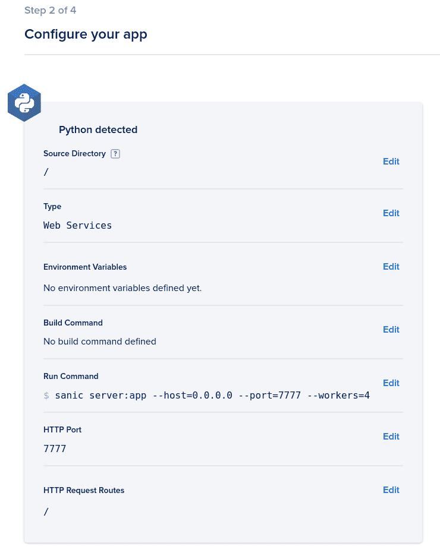

# 8 运行 Sanic 服务器

在我参与 Sanic 项目的时间里——特别是，通过回答其他开发者的支持问题来帮助他们——有一个主题似乎比其他任何主题都更频繁地出现：部署。这个单词常常与困惑和恐惧的混合情绪联系在一起。

构建 Web 应用程序可以非常有趣。我怀疑我不是唯一一个在构建过程中本身就能找到巨大满足感的人。我喜欢软件开发的其中一个原因——尤其是 Web 开发——是因为我喜欢将解决方案与给定问题相匹配的几乎像谜一样的氛围。当构建完成，是时候启动时，焦虑就出现了。

我无法过分强调接下来的观点。Sanic 最大的优势之一是其捆绑的 Web 服务器。这不仅仅是一个噱头，或者一些可以忽略的辅助功能。Sanic 附带自己的 Web 服务器确实简化了构建过程。想想传统的 Python Web 框架，比如 Django 或 Flask，或者一些较新的 ASGI 框架。为了使它们能够运行并连接到网络，你需要一个生产级的 Web 服务器。构建应用程序只是第一步。部署它需要另一项工具的知识和熟练度。通常，用于部署使用这些框架构建的应用程序的网络服务器与您开发时使用的服务器不同。为此，您有一个开发服务器。这不仅增加了复杂性和依赖性，还意味着您不是在针对将在生产中运行您代码的实际服务器进行开发。还有人在想我正在想的事情吗？错误。

在本章中，我们将探讨运行 Sanic 所需的内容。我们将探索在开发和生产环境中运行 Sanic 的不同方法，以使部署过程尽可能简单。我们将首先查看服务器生命周期。然后，我们将讨论设置本地和具有生产级可扩展性的服务。我们将涵盖：

+   处理服务器生命周期

+   配置应用程序

+   在本地运行 Sanic

+   部署到生产环境

+   使用 TLS 保护您的应用程序

+   部署示例

当我们完成时，您因部署而产生的焦虑应该会成为过去式。

## 技术要求

当然，我们将继续构建前几章的工具和知识。在*第三章*，*路由和接收 HTTP 请求*中，我们看到了一些使用 Docker 的实现。具体来说，我们使用 Docker 运行 Nginx 服务器来提供静态内容。虽然这不是部署 Sanic 所必需的，但了解 Docker 和（在一定程度上）Kubernetes 将有所帮助。在本章中，我们将探讨与 Sanic 部署一起使用 Docker 的方法。如果你不是黑带 Docker 或 Kubernetes 专家，不要担心。GitHub 仓库中将有示例：[`github.com/PacktPublishing/Web-Development-with-Sanic/tree/main/chapters/08`](https://github.com/PacktPublishing/Web-Development-with-Sanic/tree/main/chapters/08)。我们希望和期望的是对这些工具有一些基本的理解和熟悉。

如果你没有安装这些工具，你需要它们来跟上进度：

+   `git`

+   `docker`

+   `doctl`

+   `kubectl`

## 处理服务器生命周期

在这本书中，我们花了很多时间讨论传入 HTTP 请求的生命周期。在那段时间里，我们看到了我们如何在生命周期中的不同点附加、修改和运行代码。嗯，整个应用服务器的生命周期也没有什么不同。

虽然我们有中间件和信号，但服务器生命周期中有什么被称为“监听器”。实际上，监听器在本质上（有一个小的例外）就是信号本身。在我们探讨如何使用它们之前，我们将看看有哪些监听器可用。

### 服务器监听器

**监听器**的基本前提是你在服务器生命周期中的某个**事件**上附加了一个函数。随着服务器通过启动和关闭过程，Sanic 将触发这些事件，因此你可以轻松地插入自己的功能。Sanic 在启动和关闭阶段都会触发事件。对于服务器生命周期中的任何其他事件，你应该参考*第六章*，*响应周期之外*中的*利用信号进行工作进程间通信*部分。

事件的顺序如下：

1.  `before_server_start`：这个事件自然是在服务器启动之前运行的。这是一个连接数据库或执行任何需要在应用程序生命周期开始时进行的操作的绝佳地方。你可能会在全局范围内做的事情几乎总是在这里做得更好。唯一值得注意的注意事项是，如果你在 ASGI 模式下运行，服务器在 Sanic 被触发之前就已经运行了。在这种情况下，`before_server_start`和`after_server_start`之间没有区别。

1.  `after_server_start`：关于这个事件的常见误解是它可能会遇到一个竞态条件，其中事件在服务器开始响应 HTTP 请求时运行。这并不是情况。这个事件意味着已经创建并附加到操作系统上的 HTTP 服务器。基础设施已经到位，可以开始接受请求，但还没有发生。只有当所有 `after_server_start` 的监听器都完成后，Sanic 才会开始接受 HTTP 流量。

1.  `before_server_stop`：这是一个开始任何你需要进行的清理工作的好地方。当你在这个位置时，Sanic 仍然能够接受传入的流量，所以你可能需要处理的所有东西仍然可用（比如数据库连接）。

1.  `after_server_stop`：一旦服务器被关闭，现在可以安全地开始任何剩余的清理工作。如果你处于 ASGI 模式，就像 `before_server_start`，这个事件实际上在服务器关闭后并不会被触发，因为 Sanic 不控制这一点。相反，它将立即跟随任何 `before_server_stop` 监听器以保持它们的顺序。

还有两个额外的监听器可供你使用。然而，这些额外的监听器仅在 Sanic 服务器上可用，因为它们是特定于 Sanic 服务器生命周期的。这是由于服务器的工作方式。当你使用多个工作者运行 Sanic 时，发生的情况是有主进程充当指挥者。它为每个请求的工作者启动多个子进程。如果你想深入了解每个工作者进程的生命周期，那么你已经有了我们刚才看到的四个监听器所提供的工具。

然而，如果你想在主进程而不是每个工作进程中运行一些代码：那个指挥者？答案是 Sanic 服务器的主进程事件。它们是 `main_process_start` 和 `main_process_stop`。除了它们在主进程中运行而不是在工作者中，它们在其他方面的工作方式与其他监听器相同。记得我提到监听器本身就是信号，但有例外吗？这就是那个例外。这些监听器不是伪装成信号的。从所有实际目的来看，这种区别并不重要。

还值得一提的是，尽管这些事件旨在允许在多工作者模式下在主进程中而不是工作者进程中运行代码，但即使你在单个工作者进程中运行时，它们也会被触发。在这种情况下，它们将在你的生命周期的极端开始和极端结束时运行。

这引发了一个有趣且经常出现的错误：双重执行。在继续处理监听器之前，我们将关注错误地多次运行代码。

#### 在全局作用域中运行代码

当你准备应用程序运行时，初始化各种服务、客户端、接口等是很常见的。你很可能需要在服务器开始运行之前，在处理过程的早期对应用程序执行一些操作。

例如，让我们假设你正在寻找一个解决方案来帮助你更好地跟踪你的异常。你发现了一个第三方服务，你可以将所有的异常和回溯报告给它，以帮助你更好地分析、调试和修复你的应用程序。要开始使用，该服务提供了一些文档，说明如何使用他们的**软件开发工具包**（**SDK**）如下：

```py
from third_party_sdk import init_error_reporting
init_error_reporting(app)
```

你将这个设置和运行在你的多工作进程应用程序中，然后你立即开始注意到它运行了多次，而不是像预期的那样在你的工作进程中。这是怎么回事？

很可能的问题是你在全局范围内运行了初始化代码。在 Python 中，我们所说的“全局范围”是指不在函数或方法中执行的部分。它在 Python 文件的最外层运行。在上面的例子中，`init_error_reporting` 在全局范围内运行，因为它没有被另一个函数包裹。问题是，当多个工作进程运行时，你需要意识到代码在哪里以及何时运行。由于多个工作进程意味着多个进程，并且每个进程都可能运行你的全局范围，因此你需要小心地放置其中的内容。

作为一条非常普遍的规则，坚持将任何可操作的代码放在监听器中。这允许你控制位置和时机，并且将以更一致和易于预测的方式运行。

#### 设置监听器

使用监听器应该看起来非常熟悉，因为它们遵循 Sanic 其他地方发现的类似模式。你创建一个监听器处理程序（它只是一个函数），然后使用装饰器将其包装起来。它应该看起来像这样：

```py
@app.before_server_start
async def setup_db(app, loop):
    app.ctx.db = await db_setup()
```

我们在这里看到的是 Sanic 开发中非常重要的一点。这个模式应该牢记在心，因为将元素附加到你的应用程序`ctx`对象中，可以增加你在开发中的整体灵活性。在这个例子中，我们设置了数据库客户端，以便可以从任何地方访问它，即代码中的任何地方。

有一个重要的事情要知道，你可以根据定义的时间来控制监听器的执行顺序。对于“启动”时间监听器（`before_server_start`、`after_server_start` 和 `main_process_start`），它们按照声明的顺序执行。

对于“停止”时间监听器（`before_server_stop`、`after_server_stop` 和 `main_process_stop`），情况正好相反。它们按照声明的相反顺序运行。

#### 如何决定使用“在...之前”监听器或“在...之后”监听器

如上所述，存在一个常见的误解，即在你想在请求开始之前执行某些操作的情况下，逻辑必须添加到 `before_server_start` 中。这种担忧是，使用 `after_server_start` 可能会导致某种竞争条件，其中某些请求可能会在触发该事件之前的一瞬间击中服务器。

这是不正确的。`before_server_start` 和 `after_server_start` 都会在允许任何请求进入之前运行完成。

那么，问题就变成了何时应该优先考虑其中一个？当然，可能会有一些个人和特定于应用程序的偏好。然而，一般来说，我喜欢使用 `before_server_start` 事件来设置我的应用程序上下文。如果需要初始化某个对象并将其持久化到 `app.ctx`，那么我会选择 `before_server_start`。对于任何其他用例（如执行其他类型的外部调用或配置），我喜欢使用 `after_server_start`。这绝对不是一条不可更改的规则，我经常自己打破它。

现在我们已经了解了服务器的生命周期，但在我们可以运行应用程序之前，我们还需要了解一些其他的信息：配置。

## 配置应用程序

Sanic 尝试在默认情况下对你的应用程序做出一些合理的假设。考虑到这一点，你当然可以启动一个应用程序，并且它应该已经有一些合理的默认设置。虽然这可能适用于一个简单的原型，但当你开始构建应用程序时，你会意识到你需要对其进行配置。

正是这个时候，Sanic 的配置系统开始发挥作用。

配置主要有两种形式：调整 Sanic 运行时操作，以及声明一个全局常量的状态，以便在整个应用程序中使用。这两种类型的配置都很重要，并且都遵循应用值的一般原则。

我们将更详细地探讨配置对象是什么，我们如何访问它，以及如何更新或更改它。

#### Sanic 配置对象是什么？

当你创建一个 Sanic 应用程序实例时，它将创建一个配置对象。这个对象实际上只是一个花哨的 `dict` 类型。正如你将看到的，它确实有一些特殊属性。不要被它迷惑。你应该记住：*它是一个* `dict`。你可以像处理任何其他 `dict` 对象一样处理它。这在我们探索如何使用该对象时将非常有用。

如果你不同意我的观点，那么请将以下代码放入你的应用程序中：

```py
app = Sanic(__name__)
assert isinstance(app.config, dict)
```

这意味着，使用默认值获取配置值与 Python 中的任何其他 `dict` 没有区别：

```py
environment = app.config.get("ENVIRONMENT", "local")
```

然而，配置对象比任何其他 `dict` 都要重要得多。它包含了许多对应用程序操作至关重要的设置。当然，我们在 *第六章* 中已经看到，我们可以用它来修改我们的默认错误处理：

```py
app.config.FALLBACK_ERROR_FORMAT = "text"
```

要了解您可以调整的全套设置，您应该查看 Sanic 文档：[`sanicframework.org/en/guide/deployment/configuration.html#builtin-values.`](https://sanicframework.org/en/guide/deployment/configuration.html#builtin-values.)

#### 如何访问应用程序的配置对象？

访问配置对象的最佳方式是首先获取访问应用程序实例的权限。根据您当前面临的场景，有三种主要方式可以获取应用程序实例的访问权限：

+   使用请求对象（`request.app`）访问应用程序实例

+   从 Blueprint 实例访问应用程序（`bp.apps`）

+   从应用程序注册表中检索应用程序实例（`Sanic.get_app()`）

获取应用程序实例（以及由此扩展的配置对象）最常见的方式可能是从处理器内部的请求对象中获取：

```py
@bp.route("")
async def handler(request):
environment = request.app.config.ENVIRONMENT
```

如果您不在易于访问请求对象的路由处理器（或中间件）外部，那么下一个最佳选择可能是使用应用程序注册表。很少会使用 Blueprint 的 `apps` 属性。它是蓝图应用到的应用程序集合。然而，因为它只存在于注册之后，并且可能不清楚您需要哪个应用程序，所以我通常不会将其作为解决方案。尽管如此，了解它的存在是好的。

您可能已经看到我们使用第三个选项了。一旦应用程序被实例化，它就成为了一个全局注册表的一部分，可以通过以下方式查找：

```py
from sanic import Sanic
app = Sanic.get_app()
```

每当我不在处理器中时，我通常会采用这个解决方案。您需要注意的两个限制是：

1.  确保应用程序实例已经实例化。如果您不小心处理导入顺序，使用 `app = Sanic.get_app()` 在全局范围内可能会很棘手。稍后，在 *第十一章*，*一个完整的真实世界示例* 中，当我们构建一个完整的应用程序时，我会向您展示我用来绕过这个问题的技巧。

1.  如果您正在构建包含多个应用程序实例的运行时，那么您需要使用应用程序名称来区分它们：

    ```py
    main_app = Sanic("main")
    side_app = Sanic("side")
    assert Sanic.get_app("main") is main_app
    ```

一旦您有了这个对象，您通常会直接将其作为属性访问配置值，例如，`app.config.FOOBAR`。如前所述，您也可以使用各种 Python 访问器：

> `app.config.FOOBAR`
> 
> > `app.config.get("FOOBAR")`
> > 
> > `app.config["FOOBAR"]`
> > 
> > `getattr(app.config, "FOOBAR")`

#### 如何设置配置对象？

如果您访问 Sanic 文档，您会看到已经设置了一堆默认值。这些值可以通过多种方法进行更新。当然，您可以使用 `object` 和 `dict` 设置器：

```py
app.config.FOOBAR = 123
setattr(app.config, "FOOBAR", 123)
app.config["FOOBAR"] = 123
app.config.update({"FOOBAR": 123})
```

你通常会在创建应用程序实例后立即设置这些值。例如，在这本书中，我反复使用`curl`来访问我创建的端点。查看异常的最简单方法就是使用基于文本的异常渲染器。因此，在大多数情况下，我使用了以下模式来确保当出现异常时，它能够轻松地格式化以在本书中显示：

```py
app = Sanic(__name__)
app.config.FALLBACK_ERROR_FORMAT = "text"
```

这通常**不是**一个完全构建的应用的理想选择。如果你之前参与过 Web 应用开发，那么你可能不需要我告诉你配置应该根据你的部署环境轻松更改。因此，Sanic 会在配置值以`SANIC_`为前缀的情况下将其加载为环境变量。

这意味着上述`FALLBACK_ERROR_FORMAT`也可以通过环境变量在应用程序外部设置：

```py
$ export SANIC_FALLBACK_ERROR_FORMAT=text
```

实现这一点的最佳方法显然取决于你的部署策略。我们将在本章的后面更深入地探讨这些策略，以及如何设置这些变量的具体细节将有所不同，并且超出了本书的范围。

另一个你可能熟悉的选择是将所有配置集中在一个位置。Django 通过`settings.py`来实现这一点。虽然我个人并不喜欢这种模式，但你可能喜欢。你可以轻松地像这样复制它：

1.  创建一个`settings.py`文件。

    ```py
    FOO = "bar"
    ```

1.  将配置应用到应用程序实例：

    ```py
    import settings
    app.update_config(settings)
    ```

1.  根据需要访问值：

    ```py
    print(app.config.FOO)
    ```

    `settings.py`文件名并没有什么特殊之处。你只需要一个包含大量大写属性的全局模块。实际上，你可以通过一个对象来复制这个功能。

1.  现在将所有常量放入一个对象中：

    ```py
    class MyConfig:
    FOO = "bar"
    ```

1.  应用来自该对象的配置。

    ```py
    app.update_config(MyConfig)
    ```

结果将是相同的。

#### 关于配置的一些通用规则

我有一些关于配置的通用规则，我喜欢遵循。我鼓励你采用它们，因为它们是从多年的错误中演变而来的。但是，我也同样强烈地鼓励你在必要时打破这些规则：

+   *使用简单值*：如果你有一些复杂的对象，比如`datetime`，那么配置可能不是放置它的最佳位置。配置的一部分灵活性在于它可以以多种不同的方式设置；包括在应用程序外部通过环境变量。虽然 Sanic 能够转换布尔值和整数，但其他所有内容都将是一个字符串。因此，为了保持一致性和灵活性，尽量只使用简单值类型。

+   *将它们视为常量*：是的，这是 Python。这意味着一切都是对象，并且一切都会受到运行时变化的影响。但不要这样做。如果你有一个需要在应用程序运行时更改的值，请使用`app.ctx`。在我看来，一旦`before_server_start`完成，你的配置对象应该被视为固定不变。

+   *不要硬编码值*：或者，至少要尽力避免。在构建你的应用程序时，你无疑会发现需要创建某种类型的常量值。如果不了解你的具体应用程序，很难猜测这种情况可能出现的场景。但当你意识到你即将创建一个常量或某个值时，问问自己这个配置是否更合适。最具体的例子可能是你用来连接数据库、供应商集成或任何其他第三方服务的设置。

配置你的应用程序几乎肯定会在应用程序的生命周期中发生变化。随着你构建它、运行它并添加新功能（或修复损坏的功能），经常返回配置是很常见的。专业级应用程序的一个标志是它严重依赖于这种类型的配置。这是为了提供你在不同环境中运行应用程序的灵活性。例如，你可能有一些只在本地开发中才有益的功能，但在生产环境中没有。也可能相反。因此，配置通常总是与你要部署应用程序的环境紧密耦合。

我们现在将注意力转向这些部署选项，看看 Sanic 在开发和生产环境中的表现会如何。

## 本地运行 Sanic

我们终于到了运行 Sanic 的时候了——好吧，是在本地。然而，我们也知道自从 *第二章，组织项目* 以来，我们一直在做这件事。Sanic CLI 已经可能是一个相当舒适且熟悉的工具了。但还有一些事情你应该知道。其他框架只有开发服务器。由于我们知道 Sanic 的服务器旨在用于开发和生产环境，我们需要了解这些环境有何不同。

### 本地运行 Sanic 与生产环境有何不同？

本地生产中最常见的配置更改是开启调试模式。这可以通过三种方式实现：

1.  它可以直接在应用程序实例上启用。你通常会在 Sanic 从脚本（而不是 CLI）以编程方式运行时看到这种工厂模式。你可以直接设置值，如下所示：

    ```py
    def create_app(..., debug: bool = False) -> Sanic:
        app = Sanic(__name__)
        app.debug = debug
        ...
    ```

1.  它可能更常见的是将其设置为 `app.run` 的参数。这种用法的一个常见场景可能是当读取环境变量以确定 Sanic 应如何初始化时。在以下示例中，当 Sanic 服务器开始运行时，会读取并应用环境值。

    ```py
    from os import environ
    from path.to.somewhere import create_app

    def main():
        app = create_app()

        debug = environ.get("RUNNING_ENV", "local") != "production"

        app.run(..., debug=debug)
    ```

1.  最终的选择是使用 Sanic CLI。这通常是我的首选解决方案，如果你一直跟随这本书学习，那么我们一直都在使用这个方案。这个方法如以下所示非常直接：

    ```py
    $ sanic path.to:app --debug
    ```

我更喜欢这个最终选项的原因是我喜欢将服务器的操作方面与其他配置区分开来。

例如，超时是配置值，这些值与框架的操作紧密相关，而不是服务器本身。它们影响框架对请求的响应。通常，这些值无论应用程序部署在哪里都会是相同的。

另一方面，调试模式与部署环境的关系更为紧密。你希望在本地将其设置为 `True`，但在生产环境中设置为 `False`。因此，由于我们将使用 Docker 等工具来控制 Sanic 的部署，控制服务器在应用程序之外的操作能力是有意义的。

“*好吧*”，你说，“*开启调试模式很简单，但我为什么要这么做呢？*”我很高兴你问了这个问题。当你以调试模式运行 Sanic 时，它会进行一些重要的更改。最明显的是，你开始看到来自 Sanic 的调试日志和访问日志。当然，这在开发过程中是非常有帮助的。

> **提示**
> 
> 当我坐下来开发一个网络应用程序时，我总是同时看到三个窗口：
> 
> 我的集成开发环境（IDE）
> 
> 类似 Insomnia 或 Postman 的 API 客户端
> 
> 一个显示我的 Sanic 日志（在调试模式下）的终端
> 
> 调试级别日志的终端是你了解应用程序构建过程中发生情况的窗口。

调试模式可能带来的最大变化是，任何异常都将包括其跟踪信息在响应中。在下一章中，我们将探讨一些如何充分利用这些异常信息的例子。

这在开发过程中非常重要且有用。然而，在生产环境中意外地将其留下是一个巨大的安全问题。*绝对不要在实时网络应用程序中开启调试模式*。这包括任何不在本地机器上的应用程序实例。例如，如果你有一个托管在互联网上的测试环境，它可能不是你的“生产”环境。然而，它仍然*绝对不能*运行调试模式。最好的情况是，它会泄露有关应用程序构建的细节。最坏的情况是，它会使敏感信息可用。请确保在生产环境中关闭调试模式。

说到生产环境，让我们继续探讨将 Sanic 部署到野外生产环境所需的内容。

## 部署到生产环境

我们终于做到了。在经历了应用程序开发过程后，终于有一个产品可以发布到万维网的浩瀚之中。那么，显而易见的问题就是：我的选择有哪些？实际上，有两个问题集需要回答：

+   第一个问题：哪个服务器应该运行 Sanic？有三个选项：Sanic 服务器、ASGI 服务器或 Gunicorn。

+   第二个问题：你希望在何处运行应用程序？一些典型的选择包括：*裸机*虚拟机、容器化镜像、**平台即服务**（**PaaS**）、或自托管或完全管理的编排容器集群。如果我们把这些常用的产品名称加到这些选择上，可能更有意义：

| **部署类型** | **潜在供应商** |
| --- | --- |
| 虚拟机 | Amazon EC2, Google Cloud, Microsoft Azure, Digital Ocean, Linode |
| 容器 | Docker |
| 平台即服务 | Heroku |
| 编排集群 | Kubernetes |

表 8.1 – 常见托管提供商和工具的示例

### 选择正确的服务器选项

正如我们所提到的，运行 Sanic 主要有三种方式：内置服务器、与 ASGI 兼容的服务器或使用 Gunicorn。在我们决定运行哪种服务器之前，我们将简要地看看每种选项的优缺点，从性能最低的选项开始。

#### Gunicorn

如果你是从 WSGI 世界来到 Sanic 的，你可能已经熟悉 Gunicorn 了。实际上，你可能甚至会对了解到 Sanic 可以用 Gunicorn 运行感到惊讶，因为它是为 WSGI 应用程序构建的，而不是像 Sanic 这样的异步应用程序。正因为如此，使用 Gunicorn 运行 Sanic 的最大缺点是性能的**显著**下降。Gunicorn 实际上破坏了利用`asyncio`模块进行**并发**的大部分工作。这是运行 Sanic 最慢的方式，在大多数情况下并不推荐。

在某些情况下，这仍然可能是一个不错的选择。特别是，如果你需要一组功能丰富的配置选项，而又不能使用像 Nginx 这样的工具，那么这可能是一个方法。Gunicorn 提供了大量的选项，可以用来微调服务器操作。然而，根据我的经验，我通常看到人们出于习惯而不是必要性而选择它。人们只是因为熟悉而使用它。对于从 Flash/Django 世界过渡到 Sanic 的人来说，他们可能已经习惯了以像 Supervisor 和 Gunicorn 这样的工具为中心的特定部署模式。这当然是可以的，但它有点过时了，不应该成为 Sanic 部署的首选模式。

对于这些人，我强烈建议你们考虑另一个选择。你们正在使用一个新的框架进行构建，为什么不也用一个新的策略来部署呢？

然而，如果你确实发现自己需要 Gunicorn 提供的更多精细控制，我建议你看看 Nginx，它拥有同样（如果不是更多）令人印象深刻的特性集。Gunicorn 会设置为实际运行 Sanic，而 Nginx 的实现将依赖于 Sanic 通过其他两种策略之一运行，并在其前面放置一个 Nginx 代理。关于 Nginx 代理的更多内容将在本章后面讨论。这个选项将允许你在不牺牲性能的情况下保留大量的服务器控制。然而，这确实需要更多的复杂性，因为你实际上需要运行两个服务器而不是一个。

如果最后你仍然决定使用 Gunicorn，那么最好的方法就是使用 Uvicorn 的工作器适配器。Uvicorn 是一个 ASGI 服务器，我们将在下一节中了解更多关于它的内容。然而，在这个上下文中，它还附带了一个工作器类，允许 Gunicorn 与之集成。这实际上将 Sanic 置于 ASGI 模式。Gunicorn 仍然作为网络服务器运行，但它会将流量传递给 Uvicorn，然后 Uvicorn 将像处理 ASGI 应用程序一样深入 Sanic。这将保留 Sanic 提供的许多性能和异步编程（尽管仍然不如 Sanic 服务器本身高效）。你可以按照以下方式完成此操作：

1.  首先，确保 Gunicorn 和 Uvicorn 都已安装：

    ```py
    $ pip install gunicorn uvicorn
    ```

1.  接下来，按照以下方式运行应用程序：

    ```py
    $ gunicorn \
        --bind 127.0.0.1:7777 \
        --worker-class=uvicorn.workers.UvicornWorker \
        path.to:app
    ```

你现在应该已经掌握了 Gunicorn 配置的全套内容。

#### ASGI 服务器

我们在*第一章，Sanic 和异步框架的介绍*中简要介绍了 ASGI。如果你还记得，**ASGI**代表**异步服务器网关接口**，它是一种设计规范，说明了服务器和框架如何异步地相互通信。它是作为与较旧的、与现代异步 Python 实践不兼容的 WSGI 标准替代方法开发的。这个标准催生了三个流行的 ASGI 网络服务器：Uvicorn、Hypercorn 和 Daphne。所有这三个都遵循 ASGI 协议，因此可以运行任何遵循该协议的框架。因此，目标是创建一种通用语言，允许这些 ASGI 服务器之一运行任何 ASGI 框架。

在这里，我们必须讨论 Sanic 与 ASGI 的关系，我们必须在心中清楚地区分服务器和框架之间的差异。*第一章*详细讨论了这种差异。作为一个快速回顾，网络服务器是应用程序中负责连接到操作系统的套接字协议并处理字节到可用网络请求转换的部分。框架接收处理过的网络请求，并为应用程序开发者提供响应和构建适当 HTTP 响应所需的工具。然后，服务器将此响应发送回操作系统，以便将其发送回客户端。

Sanic 处理整个流程，并且在执行时，它是在 ASGI 之外操作的，因为那个接口并不需要。然而，它也有能力使用 ASGI 框架的语言，因此可以与任何 ASGI 网络服务器一起使用。

将 Sanic 作为 ASGI 应用程序运行的一个好处是，它使用更广泛的 Python 工具集标准化了运行时环境。例如，有一组 ASGI 中间件可以实现，在服务器和应用程序之间添加一层功能。

然而，一些标准化是以性能为代价的。

#### Sanic 服务器

默认机制是使用内置的网络服务器运行 Sanic。它是以性能为导向构建的，这一点并不令人意外。因此，Sanic 服务器通过放弃 ASGI 的标准化和互操作性所失去的，它通过作为单一用途服务器的优化能力来弥补。

我们已经提到了使用 Sanic 服务器的一些潜在缺点。其中之一是静态内容。没有 Python 服务器能够在处理静态内容方面与 Nginx 相匹敌。如果你已经使用 Nginx 作为 Sanic 的代理，并且你知道静态资源的已知位置，那么使用它来处理这些资源可能是有意义的。然而，如果你没有使用它，那么你需要确定性能差异是否值得额外的运营成本。在我看来，如果你可以轻松地将它添加到你的 Nginx 配置中：很好。然而，如果需要大量的复杂努力，或者你直接暴露 Sanic，那么这种好处可能不如让它保持原样并从 Sanic 提供内容那么大。有时，例如，最简单的事情就是从单个服务器运行你的整个前端和后端。这确实是一个我会建议学习竞争利益并做出适当决定，而不是试图做出*完美*决定的案例。

带着这些知识，你现在应该能够决定哪个服务器最适合你的需求。我们假设这本书的剩余部分我们仍然使用 Sanic 服务器进行部署，但由于这主要是一个更改命令行可执行文件的问题，所以这种差异不应该造成影响。

### 如何选择部署策略？

上一节概述了三个用于 Sanic 应用的潜在网络服务器。但是，那个网络服务器需要在网络主机上运行。但是，在决定使用哪家网络托管公司之前，还有一个非常重要的缺失组件：你将如何将你的代码从你的本地机器传输到网络主机？换句话说：你将如何部署你的应用程序？现在，我们将探讨一些部署 Sanic 应用程序的选择。

这里有一些假设的知识，所以如果这里的一些技术或术语不熟悉，请随时停下来查阅它们。

#### 虚拟机

这可能是最简单的方法。好吧，除了 PAAS 之外，设置一个**虚拟机**（**VM**）现在非常简单。只需点击几个按钮，你就可以为 VM 配置一个自定义配置。这使得这成为一个简单选项的原因是，你只需以与你在本地机器上相同的方式运行你的 Sanic 应用程序。这在使用 Sanic 服务器时尤其吸引人，因为这实际上意味着你可以使用与本地相同的命令在生产环境中运行 Sanic。然而，将你的代码部署到 VM 中，维护它，然后最终扩展它将使这个选项变得最困难。坦白说，我几乎永远不会推荐这个解决方案。它对新手来说很有吸引力，因为它看起来很简单。但外表可能会欺骗人。

实际上，可能会有这种解决方案是合适的时刻。如果是这样，那么部署会是什么样的呢？实际上，与本地运行并没有太大的不同。你运行服务器并将其绑定到地址和端口。随着云计算的普及，服务提供商已经使得建立虚拟机变得如此简单。我个人发现 Digital Ocean 和 Linode 这样的平台非常用户友好，是极佳的选择。其他明显的选择包括 Amazon AWS、Google Cloud 和 Microsoft Azure。然而，在我看来，它们对云计算新手来说稍微不那么友好。有了它们良好的文档，使用 Digital Ocean 和 Linode 相对便宜且痛苦不大，只需点击几个按钮就可以运行一个实例。一旦他们给你提供了一个 IP 地址，现在就是你的责任将你的代码部署到机器上并运行应用程序。

你可能会想，将你的代码移动到服务器的最简单方法就是使用 git。然后你只需要启动应用程序就完成了。但是，如果你需要更多实例或冗余怎么办？是的，Sanic 自带启动多个工作进程的能力。但如果这还不够怎么办？现在你需要另一个 VM 以及某种方式来管理在它们之间平衡你的传入 Web 流量。你将如何处理错误补丁或新功能的重新部署？环境变量的更改怎么办？如果你不小心，这些复杂性可能会导致许多不眠之夜。

这也在一定程度上忽略了另一个事实，即并非所有环境都是平等的。虚拟机可能具有不同的依赖项，导致维护服务器和包的时间浪费。

这并不意味着这不能或不应该是一个解决方案。实际上，如果你只是为了自己的使用创建一个简单的服务，这可能是一个非常棒的解决方案。也许你需要一个网络服务器来连接到智能家居网络。但无疑这是一个需要开发者小心的案例。在裸金属虚拟机上运行网络服务器通常不像乍一看那么简单。

#### 使用 Docker 的容器

解决上述问题的方法之一是使用 Docker 容器。对于那些已经使用过 Docker 的人来说，你可能可以跳到下一节，因为你已经理解了它提供的强大功能。如果你是容器的新手，那么我强烈建议你了解它们。

简而言之，你编写一个简单的清单，称为 Dockerfile。这个清单描述了一个预期的操作系统以及构建运行应用程序的理想环境所需的指令。一个示例清单可以在 GitHub 仓库中找到：[`github.com/PacktPublishing/Web-Development-with-Sanic/blob/main/chapters/08/k8s/Dockerfile`](https://github.com/PacktPublishing/Web-Development-with-Sanic/blob/main/chapters/08/k8s/Dockerfile)。

这可能包括安装一些依赖项（包括 Sanic），复制源代码，并定义一个用于运行应用程序的命令。有了这些准备，Docker 随后构建一个包含运行应用程序所需所有内容的单个镜像。这个镜像可以被上传到仓库，并在任何环境中运行。例如，你可以选择使用这种方法来代替管理所有那些独立的虚拟机环境。将所有这些捆绑在一起并简单地运行它要简单得多。

在构建我们的新版本和决定在哪里运行镜像方面，仍然存在一些复杂性，但保持一致的构建是一个巨大的收益。这应该真正成为你部署的重点。因此，尽管容器是解决方案的一部分，但仍然存在运行它和维护其运行和更新的成本问题。

我几乎**总是**会建议将 Docker 作为部署实践的一部分。如果你了解 Docker Compose，你可能认为它是管理部署的一个很好的选择。我会同意你的看法，只要我们谈论的是在本地机器上的部署。在生产环境中使用 Docker Compose 通常不是我会考虑的事情。原因很简单：水平扩展。就像在虚拟机上运行 Sanic，或者在单个虚拟机上运行单个容器一样，在单个虚拟机上运行 Docker Compose 也带来了相同的问题：水平扩展。解决方案是编排。

#### 使用 Kubernetes 进行容器编排

容器的问题在于，它们只能通过为你的应用程序创建一个一致且可重复的策略来解决环境问题。但它们仍然面临着可扩展性问题。再次强调，当你的应用程序需要扩展到单台机器上可用的资源之外时，会发生什么？像 Kubernetes（又称“K8S”）这样的容器编排器对于过去做过 DevOps 的人来说是一个梦想成真。通过创建一组清单，你将向 Kubernetes 描述你的理想应用程序将是什么样子：副本的数量、它们需要的资源数量、如何暴露流量等等。就是这样！你所需要做的就是用一些 YAML 文件描述你的应用程序。Kubernetes 将处理其余的事情。它还有一个额外的优点，即允许滚动部署，这样你可以在应用程序零停机的情况下推出新代码。

当然，这个选项是最复杂的。它适用于更严肃的应用程序，其中复杂性是可接受的，并且可以带来额外的收益。然而，对于许多项目来说，这可能是一种过度设计。这是任何将会有大量流量的应用程序的默认部署策略。当然，K8S 集群的复杂性和规模可以根据其需求进行扩展。这种动态特性使其成为越来越多行业专业人士采用的标准化部署策略。

它是适用于由多个服务协同工作或需要超出单台机器边界进行扩展的平台的理想解决方案。

然而，这确实提出了一个有趣的问题。我们知道 Sanic 有能力通过在多个进程中复制其工作进程在单个主机上进行水平扩展。Kubernetes 通过启动副本**Pod**来具备水平扩展的能力。假设你假设你需要四个应用程序实例来处理负载。你应该有两个每个运行两个工作进程的 Pod，还是四个每个只有一个工作进程的 Pod？

我听说这两种方法都被提出作为*理想*的解决方案。有些人说你应该最大化每个容器的资源。另一些人则说每个容器不应有超过一个进程。从性能的角度来看，它们表现相同。这些解决方案实际上执行相同的操作。因此，这完全取决于应用程序构建者的选择。没有正确或错误答案。

在本章的后面部分，我们将更详细地探讨使用 Kubernetes 启动 Sanic 应用程序所需的内容。

#### 平台即服务

Heroku 可能是最知名的**PAAS**供应商之一。它已经存在了一段时间，并已成为这些低接触部署策略的行业领导者。Heroku 并非唯一提供者，Google 和 AWS 分别在各自的云平台上提供 PAAS 服务，Digital Ocean 也推出了自己的竞争性服务。PAAS 之所以非常方便，是因为你只需要编写代码。没有容器管理、环境处理或部署难题。它旨在成为部署代码的超简单低接触解决方案。通常，部署应用程序就像将代码推送到 git 仓库一样简单。

因此，这个简单的选项非常适合原型应用或其他需要快速部署的构建。我也知道很多人通过这些服务运行更健壮和可扩展的应用程序，它们确实可以是一个很好的替代品。这些服务的一个巨大卖点是通过将部署、扩展和服务维护外包给服务提供商，你可以腾出时间专注于应用程序逻辑。

由于这种简单性和最终灵活性，我们将在本章的“部署示例”部分稍后更详细地探讨如何使用 PAAS 供应商启动 Sanic。PAAS 的一个优点是它处理了很多细节，比如设置 TLS 证书并为你的应用程序启用`https://`地址。然而，在下一节中，我们将学习在没有 PAAS 便利性的情况下如何为你的应用程序设置`https://`地址。

## 使用 TLS 保护你的应用程序

如果你没有加密你的 Web 应用程序的流量，你就是在做错事。为了在浏览器和你的应用程序之间传输信息时保护信息，添加加密是绝对必要的。国际标准是 TLS（代表传输层安全性）。它是一种数据可以在两个来源之间加密的协议。然而，它通常被称为*SSL*（这是一个较早的协议，TLS 取代了它）或*HTTPS*（技术上它是 TLS 的实现，而不是 TLS 本身）。由于我们并不关心它是如何工作的，我们只关心它是否需要完成，因此我们可以将这些术语互换使用。因此，你可以安全地认为 TLS 和 HTTPS 是同一件事。

那么，它是什么呢？简单的答案是，你从互联网上某个信誉良好的来源请求一对密钥。你的下一步是让它们可供你的 Web 服务器使用，并在安全端口上公开你的应用程序——通常是端口 443。之后，你的 Web 服务器应该处理剩下的工作，你现在应该能够通过`https://`地址而不是`http://`访问你的应用程序。

### 在 Sanic 中设置 TLS

你应该熟悉两种常见的场景。如果你直接公开你的 Sanic 应用程序，或者如果你将 Sanic 放在代理后面。这将决定你希望在何处 *终止* 你的 TLS 连接。这仅仅意味着你应该在哪里设置你的面向公众的证书。我们目前假设 Sanic 是直接公开的。我们还假设你已经有了证书。如果你不知道如何获取它们，不要担心，我们将在下一节提供一个可能的解决方案。

我们需要做的只是告诉 Sanic 服务器如何访问这些证书。此外，由于 Sanic 默认使用端口 `8000`，我们需要确保将其设置为 `443`。

1.  考虑到这一点，我们的新运行时命令（在生产环境中）将是这样的：

    ```py
    $ sanic \
        --host=0.0.0.0 \
        --port=443 \
        --cert=/path/to/cert \
        --key=/path/to/keyfile \
        --workers=4 \
        path.to.server:app
    ```

1.  如果你使用 `app.run` 而不是 `app.run`，操作基本上是相同的：

    ```py
    ssl = {"cert": "/path/to/cert", "key": "/path/to/keyfile"}
    app.run(host="0.0.0.0", port=443, ssl=ssl, workers=4)
    ```

当你直接公开你的 Sanic 应用程序，并且因此通过 Sanic 终止 TLS 时，通常会希望添加 HTTP 到 HTTPS 的重定向。为了用户的方便，你可能希望他们始终被重定向到 HTTPS，并且这个重定向对他们来说是 *神奇地* 发生的，而无需思考。

Sanic 用户指南为我们提供了一个简单的解决方案，该方案涉及在我们的主应用内部运行第二个 Sanic 应用程序。它的唯一目的将是绑定到端口 80（这是默认的非加密 HTTP 端口）并重定向所有流量。让我们快速检查这个解决方案并逐步进行：

1.  首先，除了我们的主应用程序外，我们还需要一个负责重定向的第二个应用程序。因此，我们将设置两个应用程序和一些配置细节：

    ```py
    main_app = Sanic("MyApp")
    http_app = Sanic("MyHTTPProxy")

    main_app.config.SERVER_NAME = "example.com"
    http_app.config.SERVER_NAME = "example.com"
    ```

1.  我们只向 `http_app` 添加了一个端点，该端点将负责将所有流量重定向到 `main_app`。

    ```py
    @http_app.get("/<path:path>")
    def proxy(request, path):
        url = request.app.url_for(
            "proxy",
            path=path,
            _server=main_app.config.SERVER_NAME,
            _external=True,
            _scheme="https",
        )
        return response.redirect(url)
    ```

1.  为了使运行 HTTP 重定向应用程序更容易，我们将利用主应用程序的生命周期，这样就不需要创建另一个可执行文件。因此，当主应用程序启动时，它也将创建和绑定 HTTP 应用程序：

    ```py
    @main_app.before_server_start
    async def start(app, _):
        app.ctx.http_server = await http_app.create_server(
            port=80, return_asyncio_server=True
        )
        app.ctx.http_server.app.finalize()
    ```

    你应该注意我们是如何将那个服务器分配给我们的主应用程序的 `ctx`，这样我们就可以再次使用它。

1.  最后，当主应用程序关闭时，它也将负责关闭 HTTP 应用程序：

    ```py
    @main_app.before_server_stop
    async def stop(app, _):
        await app.ctx.http_server.close()
    ```

在此设置完成后，任何对 `http://example.com` 的请求都应自动重定向到同一页面的 `https://` 版本。

在步骤 1 和步骤 2 中，这个例子似乎跳过了这样一个事实，即你需要获取实际用于加密网络流量的证书文件。这主要是因为你需要自带证书到桌面上。如果你不熟悉 *如何* 做这件事，下一节提供了一个可能的解决方案。

### 从 Let’s Encrypt 获取和更新证书

回到互联网的古老时代，如果您想为您的 Web 应用程序添加 HTTPS 保护，这将花费您一定的成本。证书并不便宜，而且管理起来有些繁琐和复杂。实际上，如果您自己购买证书，证书仍然不便宜，尤其是如果您想购买覆盖子域的证书。然而，这不再是您的唯一选择，因为一些参与者联合起来寻找创建更安全在线体验的方法。解决方案：免费 TLS 证书。这些免费（且信誉良好的）证书由*Let’s Encrypt*提供，也是为什么*每个*生产网站都应该加密的原因。成本不再是借口。在这个时候，如果我看到某个网站在实时环境中仍在运行`http://`，我的一部分会感到厌恶，就像我正在逃跑一样。

如果您目前的应用程序还没有 TLS 证书，请前往[`letsencrypt.org`](https://letsencrypt.org)获取一个。从*Let’s Encrypt*获取证书的过程需要您遵循一些基本步骤，然后证明您拥有该域名。由于平台具体细节较多，且超出了本书的范围，我们不会深入探讨如何获取证书的细节。稍后，本章将在*Kubernetes (as-a-service)*部分逐步介绍如何获取用于 Kubernetes 部署的 Let’s Encrypt 证书。

然而，我强烈建议您在项目预算不允许您外出购买证书的情况下使用 Let’s Encrypt。

拿到证书后，终于可以查看一些实际代码并决定哪种部署策略适合您的项目。

## 部署示例

在之前讨论各种部署策略选择时，有两个选项脱颖而出：PAAS 和 Kubernetes。当部署 Sanic 到生产环境时，我几乎总是推荐这些解决方案之一。这里没有固定的规则，但我通常认为 Kubernetes 是适用于将运行多个服务、需要更多控制部署配置以及拥有更多资源和开发团队的平台的最佳选择。另一方面，PAAS 更适合单开发者项目或没有资源维护更丰富部署管道的项目。现在，我们将探讨在两个环境中运行 Sanic 所需的条件。

### 平台即服务

正如我们之前所述，Heroku 是通过 PAAS 部署应用程序的知名行业领导者。这有很好的原因，因为他们自 2007 年以来一直在提供这些服务，并在推广这一概念中发挥了关键作用。他们使新开发者和经验丰富的开发者都感到过程非常简单。然而，在本节中，我们将转而查看使用 Digital Ocean 的 PAAS 提供的 Sanic 应用程序的部署。步骤应该几乎相同，并且适用于 Heroku 或其他任何现有的服务：

1.  首先，当然，你需要访问他们的网站并注册一个账户，如果你还没有的话。他们的 PAAS 被称为 **Apps**，你可以在登录后从主仪表板的左侧找到它。

1.  接下来，你将经历一系列步骤，这些步骤将要求你连接一个 git 仓库。

1.  接下来，你需要通过他们的 UI 配置应用程序。你的屏幕可能看起来像这样：

    

    图 8.1 - PAAS 设置的示例配置

    这里需要注意的一个重要事项是，我们设置了 `--host=0.0.0.0`。这意味着我们正在告诉 Sanic 它应该绑定到 Digital Ocean 提供的任何 IP 地址。没有此配置，Sanic 将绑定到 `127.0.0.1` 地址。正如任何做过网页开发的人都知道，127.0.0.1 地址映射到大多数计算机上的 localhost。这意味着 Sanic 只能在该特定计算机上的网络流量中访问。这并不好。如果你部署的应用程序无法访问，首先要检查的是端口和主机是否设置正确。最简单的方法之一就是使用 `0.0.0.0`，这就像通配符 IP 地址的等效物。

1.  接下来，你将被要求选择一个数据中心的位置。通常，你希望选择一个靠近你目标受众的位置，以减少延迟。

1.  然后，你需要选择一个合适的包。如果你不知道该选择什么，从小规模开始，然后根据需要扩展。

1.  剩下的唯一事情就是设置我们仓库中的文件。GitHub 上有一个示例供你参考：[`github.com/PacktPublishing/Web-Development-with-Sanic/tree/main/chapters/08/paas`](https://github.com/PacktPublishing/Web-Development-with-Sanic/tree/main/chapters/08/paas)。

1.  最后，我们需要一个 `requirements.txt` 文件，列出我们的依赖项：sanic 和一个 `server.py`，就像我们迄今为止所做的每个构建一样。

完成这些后，每次你向仓库推送时，你的应用程序都应该被重新构建并可供你使用。这个好处之一是，你将获得一个 TLS 证书，无需配置即可使用 https。

看起来很简单吗？让我们看看一个更复杂的 Kubernetes 设置。

### Kubernetes (作为服务)

我们将把注意力转向 Kubernetes：这是最广泛采用和使用的容器部署编排平台之一。当然，你也可以启动一些虚拟机，在上面安装 Kubernetes，并管理你自己的集群。然而，我发现一个更有价值的解决方案是直接采用 Kubernetes 作为服务的解决方案。你仍然拥有 Kubernetes 的全部功能（我们将使用常见的缩写：K8S），但没有任何维护的烦恼。

我们将再次查看 Digital Ocean 并使用他们的平台作为我们的示例。

1.  在我们的本地目录中，我们需要几个文件：

    +   `Dockerfile`用于描述我们的 Docker 容器

    +   `app.yml`，下面将描述的 K8S 配置文件

    +   `ingress.yml`，下面将描述的 K8S 配置文件

    +   `load-balancer.yml`，下面将描述的 K8S 配置文件

    +   `server.py`，这同样是一个 Sanic 应用程序你可以通过 GitHub 仓库中的文件来跟进：[`github.com/PacktPublishing/Web-Development-with-Sanic/tree/main/chapters/08/k8s`](https://github.com/PacktPublishing/Web-Development-with-Sanic/tree/main/chapters/08/k8s)。

1.  我们的 Dockerfile 是构建我们容器的一组指令。我们将采取捷径，使用 Sanic 社区的一个预安装了 Python 和 Sanic 的基础镜像：

    ```py
    FROM sanicframework/sanic:3.9-latest

    COPY . /srv
    WORKDIR /srv
    EXPOSE 7777

    ENTRYPOINT ["sanic", "server:app", "--port=7777", "--host=0.0.0.0", ]
    ```

    就像我们在 PAAS 解决方案中看到的那样，我们绑定到主机`0.0.0.0`出于相同的原因。我们在这里**不会**为每个容器添加多个工作进程。再次强调，如果你愿意，你也可以这样做。

1.  接下来，我们需要构建一个镜像：

    ```py
    $ docker build -t admhpkns/my-sanic-example-app .
    ```

1.  让我们尝试在本地运行它以确保它工作

    ```py
    $ docker run -p 7000:7777 --name=myapp admhpkns/my-sanic-example-app 
    ```

1.  不要忘记清理你的环境，并在完成时删除容器，如下所示：

    ```py
    $ docker rm myapp 
    ```

1.  当然，你还需要将你的容器推送到某个可访问的仓库。为了方便使用和演示目的，我将将其推送到我的公共 Docker Hub 仓库：

    ```py
    $ docker push admhpkns/my-sanic-example-app:latest
    ```

1.  在接下来的部分，我们将通过 Digital Ocean 的 CLI 工具与之交互。如果你还没有安装，请访问[`docs.digitalocean.com/reference/doctl/how-to/install/`](https://docs.digitalocean.com/reference/doctl/how-to/install/)。你需要确保你登录：

    ```py
    $ doctl auth init
    ```

1.  我们需要一个 Digital Ocean K8S 集群。登录到他们的网络门户，在主仪表板上点击**Kubernetes**并设置一个集群。目前，默认设置是足够的。

1.  接下来，我们需要启用`kubectl`（与 K8S 交互的工具）以便能够与我们的 Digital Ocean K8S 集群通信。如果`kubectl`未安装，请查看以下说明：[`kubernetes.io/docs/reference/kubectl/overview/`](https://kubernetes.io/docs/reference/kubectl/overview/)。你需要执行的命令可能看起来像这样：

    ```py
    $ doctl kubernetes cluster kubeconfig save afb87d0b-9bbb-43c6-a711-638bc4930f7a
    ```

    一旦你的集群可用并且`kubectl`已设置，你可以通过运行以下命令来验证它：

    ```py
    $ kubectl get pods
    ```

    当然，我们还没有设置任何东西，所以目前还没有任何东西可以查看。

1.  当配置 Kubernetes 时，我们需要首先在我们的`app.yml`上运行`kubectl apply`。

    > **提示**
    > 
    > 在继续之前，您会看到很多在线教程使用这种命令风格：
    > 
    > `$ kubectl create ...`
    > 
    > 我通常尽量避免这样做，而是选择以下方式：
    > 
    > `$ kubectl apply ...`
    > 
    > 它们基本上做的是同一件事，但便利之处在于使用 `apply` 创建的资源可以通过反复“应用”相同的清单进行持续修改。

    `app.yml` 中有什么内容？查看 GitHub 仓库以获取完整版本。它相当长，包括一些与当前讨论无关的样板内容，所以在这里我只展示相关片段。这适用于我们示例中的所有 K8S 清单。该文件应包含运行应用程序所需的 Kubernetes 基本组件：一个 **服务** 和一个 **部署**。该服务应该看起来像以下这样：

    ```py
    spec:
      ports:
        - port: 80
          targetPort: 7777
      selector:
        app: ch08-k8s-app
    ```

    注意我们是如何将端口 `7777` 映射到 `80` 的。这是因为我们将在 Sanic 前终止 TLS，并且我们的入口控制器将通过未加密的 HTTP 与 Sanic 通信。由于所有这些都位于单个集群中，这是可以接受的。您的需求可能更为敏感，那么您应该考虑加密该连接。`app.yml` 中的另一件事是部署，它应该看起来像以下这样：

    ```py
    spec:
      selector:
        matchLabels:
          app: ch08-k8s-app
      replicas: 4
      template:
        metadata:
          labels:
            app: ch08-k8s-app
        spec:
          containers:
            - name: ch08-k8s-app
              image: admhpkns/my-sanic-example-app:latest
              ports:
                - containerPort: 7777
    ```

    在这里，我们定义了我们想要的副本数量，并将容器指向我们的 Docker 镜像仓库。

1.  创建该文件后，我们将应用它，您应该看到类似以下的结果：

    ```py
    $ kubectl apply -f app.yml
    service/ch08-k8s-app created
    deployment.apps/ch08-k8s-app created
    ```

    您现在可以检查以确认它是否成功：

    ```py
    $ kubectl get pods
    $ kubectl get svc
    ```

1.  我们接下来将使用现成的解决方案来创建一个 NGINX 入口。这将是我们终止 TLS 的代理层，并将 HTTP 请求馈入 Sanic。我们将按照以下方式安装它：

    ```py
    $ kubectl apply -f https://raw.githubusercontent.com/kubernetes/ingress-nginx/controller-v1.0.0/deploy/static/provider/do/deploy.yaml
    ```

    注意，在撰写本文时，v1.0.0 是最新版本。这可能不是您阅读本文时的真实情况，因此您可能需要更改它。您可以在他们的 GitHub 页面上找到最新版本：[`github.com/kubernetes/ingress-nginx`](https://github.com/kubernetes/ingress-nginx)。

1.  接下来，我们将设置我们的入口。创建一个 `ingress.yml`，按照我们 GitHub 仓库示例中的模式进行。

    ```py
    $ kubectl apply -f ingress.yml
    ```

    您会注意到有一些行被故意注释掉了。我们稍后会讨论这个问题。让我们快速验证它是否成功：

    ```py
    $ kubectl get pods -n ingress-nginx
    ```

1.  我们应该退一步，跳转到 **Digital Ocean** 控制台。在左侧有一个名为 **网络** 的标签页。转到那里，然后在 **域名** 标签页中按照以下步骤添加您自己的域名。在示例中，我们在 `ingress.yml` 中添加了 `example.com` 作为入口域名。您添加到 Digital Ocean 站点的任何域名都应该与您的入口匹配。如果您需要返回并更新并重新应用带有域名的 `ingress.yml` 文件，请现在就做。

1.  一旦所有配置都完成，我们应该能够看到我们的应用程序正在运行：

    ```py
    $ curl http://example.com       
    Hello from 141.226.169.179
    ```

    当然，这并不是理想的情况，因为它仍然位于 `http://` 上。我们现在将获取一个 Let’s Encrypt 证书并设置 TLS。

1.  最简单的方法是设置一个名为`cert-manager`的工具。它将为我们与 Let’s Encrypt 进行所有必要的接口操作。首先安装它：

    ```py
    $ kubectl apply --validate=false -f https://github.com/jetstack/cert-manager/releases/download/v1.5.3/cert-manager.yaml
    ```

    再次，请检查最新的版本是什么，并相应地更新此命令。我们可以在以下位置验证其安装：

    ```py
    $ kubectl get pods --namespace cert-manager
    ```

1.  接下来，根据 GitHub 仓库中的示例创建`load-balancer.yml`。它应该看起来像这样：

    ```py
    apiVersion: v1
    kind: Service
    metadata:
      annotations:
        service.beta.kubernetes.io/do-loadbalancer-hostname: example.com
      name: ingress-nginx-controller
      namespace: ingress-nginx
    spec:
      type: LoadBalancer
      externalTrafficPolicy: Local
      ports:
        - name: http
          port: 80
          protocol: TCP
          targetPort: http
        - name: https
          port: 443
          protocol: TCP
          targetPort: https
      selector:
        app.kubernetes.io/name: ingress-nginx
        app.kubernetes.io/instance: ingress-nginx
        app.kubernetes.io/component: controller
    ```

1.  应用该清单并确认它已成功：

    ```py
    $ kubectl apply -f load-balancer.yml
    service/ingress-nginx-controller configured
    ```

1.  你的 K8S 集群现在将开始获取证书的过程。

    > **提示**
    > 
    > 你可能会遇到的一个问题是，在请求证书时进程会卡住。如果你遇到这种情况，解决方案是在你的**Digital Ocean**仪表板上开启**代理协议**。前往以下设置，如果需要就将其开启：
    > 
    > **网络** > **负载均衡器** > **管理设置** > **代理协议** > **启用**

1.  我们几乎完成了！打开那个`ingress.yml`文件，取消注释之前注释掉的几行。然后`apply`该文件。

    ```py
    $ kubectl apply -f ingress.yml
    ```

完成！你不应该自动从`http://`重定向到`https://`，并且你的应用程序得到了完全保护。

更好的是，你现在拥有了一个可部署的 Sanic 应用程序，它具有 K8S 容器编排提供的所有好处、灵活性和可扩展性。

## 摘要

构建一个优秀的 Sanic 应用程序只是工作的一半。将其部署以使我们的应用程序在野外可用是另一半。在本章中，我们探讨了你需要考虑的一些重要概念。考虑部署永远不会太早。你越早知道将使用哪个服务器，以及你的应用程序将托管在哪里，你就越早可以相应地规划。

当然，有许多部署选项的组合，我只为你提供了一小部分样本。一如既往，你需要了解对你项目和团队有效的方法。将你在这里学到的知识应用到实践中。

然而，如果你要问我如何将这些信息归纳起来，并询问我关于如何部署 Sanic 的个人建议，我会告诉你这一点：

+   使用内置的 Sanic 服务器运行你的应用程序

+   在应用程序外部终止 TLS

+   对于个人或较小项目，或者如果你想要一个更简单的部署选项，使用 PAAS 提供商

+   对于需要扩展并拥有更多开发资源的较大项目，使用托管 Kubernetes 解决方案

就这样。你现在应该能够构建一个 Sanic 应用程序并在互联网上运行它。我们的时间结束了，对吧？你现在应该具备走出去并构建一些伟大事物的技能和知识，所以现在就去做吧。在这本书的剩余部分，我们将开始探讨在构建 Web 应用程序时出现的更多实际问题，并查看一些最佳实践策略来解决这些问题。
