# 第二章：绘制基本形状

在本章中，我们将涵盖：

+   直线和坐标系统

+   绘制虚线

+   带箭头和端盖的样式各异的线条

+   带有尖锐弯曲的两段线条

+   带有弯曲的线条

+   绘制复杂的存储形状 - 卷须

+   绘制矩形

+   绘制重叠的矩形

+   绘制同心正方形

+   从椭圆得到的圆

+   从弧得到的圆

+   三个椭圆

+   最简单的多边形

+   星形多边形

+   复制星星的艺术

# 简介

图形都是关于图片和绘制的。在计算机程序中，线条不是由手持铅笔的手绘制的，而是通过在屏幕上操作数字来绘制的。本章提供了本书其余部分所需的精细细节或原子结构。在这里，我们以最简单的形式阐述了最基本的图形构建块。最有用的选项在自包含的程序中展示。如果您愿意，可以使用代码而不必详细了解其工作原理。您可以边做边学。您可以边玩边学，而玩耍是无技能动物为了学习几乎一切生存所需的东西而进行的严肃工作。

您可以复制粘贴代码，它应该无需修改即可正常工作。代码很容易修改，并鼓励您对其进行调整，修改绘图方法中的参数。您调整得越多，理解得就越多。

在 Python 中，绘制线条和形状的屏幕区域是画布。当执行 Tkinter 方法 `canvas()` 时创建画布。

使用数字描述线条和形状的核心是一个坐标系统，它说明了线条或形状的起始点和结束点。在 Tkinter 中，就像在大多数计算机图形系统中一样，屏幕或画布的左上角是起点，而右下角是终点，最大的数字描述了位置。这个系统在下一张图中展示，它是通用的计算机屏幕坐标系统。

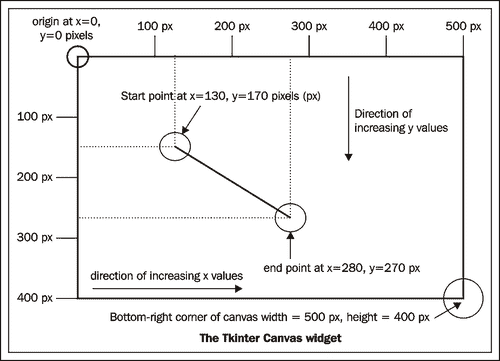

# 直线和坐标系统

在画布上绘制一条直线。重要的是要理解，坐标系统的起点始终位于画布的左上角，如图中所示。

## 如何操作...

1.  在文本编辑器中输入出现在两个 `#>>>>>>>>>>>>>>>>>>>>>>>>>>>>>>>>>` 分隔符之间的以下行。

1.  将其保存为名为 `line_1.py` 的文件，再次放在名为 `constr` 的目录中。

1.  如前所述，如果您使用的是 MS Windows，请打开一个 X 终端或 DOS 窗口。

1.  切换目录（命令 `cd /constr`）到 `constr` 目录 - 其中包含 `line_1.py`。

1.  输入 `python line_1.py` 并运行您的程序。结果应该看起来像下面的截图：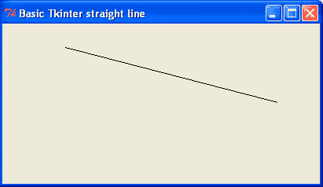

    ```py
    # line_1.py
    #>>>>>>>>>>>>>>>>>>>>>>>>>>>>>>>>>>
    from Tkinter import *
    root = Tk()
    root.title('Basic Tkinter straight line')
    cw = 800 # canvas width, in pixels
    ch = 200 # canvas height, in pixels
    canvas_1 = Canvas(root, width=cw, height=ch)
    canvas_1.grid(row=0, column=1) # placement of the canvas
    x_start = 10 # bottom left
    y_start = 10
    x_end = 50 # top right
    y_end = 30
    canvas_1.create_line(x_start, y_start, x_end,y_end)
    root.mainloop()
    #>>>>>>>>>>>>>>>>>>>>>>>>>>>>>>>>>>>

    ```

## 如何工作...

我们为线条编写的坐标与上一章中的方式不同，因为我们想将符号赋值引入到 `create_line()` 方法中。这是使我们的代码可重用的初步步骤。指定定义线条位置的点的位置有多种方法。最整洁的方法是定义一个名为 Python 列表或元组的名称，然后只需将此列表名称作为 `create_line()` 方法的参数插入即可。

例如，如果我们想画两条线，一条从 (x=50, y=25) 到 (x=220, y=44)，另一条线从 (x=11, y=22) 到 (x=44, y=33)，那么我们可以在程序中写下以下几行：

+   `line_1 = 50, 25, 220, 44 #` 这是一个元组，永远不能改变

+   `line_2 = [11, 22, 44, 33] #` 这是一个列表，可以随时更改。

+   `canvas_1.create_line(line_1)`

+   `canvas_1.create_line(line_2)`

注意，尽管 `line_1 = 50, 25, 220, 44` 在语法上是正确的 Python 代码，但它被认为是一种较差的 Python 语法。更好的写法是 `line_1 = (50, 25, 220, 44)`，因为这更加明确，因此对阅读代码的人来说更清晰。另一个需要注意的点是 `canvas_1` 是我给特定大小的画布实例所取的一个任意名称。你可以给它取任何你喜欢的名字。

## 还有更多...

大多数形状都可以由以多种方式连接在一起的线段组成。Tkinter 提供的一个极其有用的属性是将直线序列转换为平滑曲线的能力。这种线条属性可以用令人惊讶的方式使用，并在第 6 个菜谱中进行了说明。

# 画一条虚线

画一条直线虚线，线宽为三像素。

## 如何做到...

在上一个示例中使用的说明仍然适用。唯一的变化是 Python 程序的名称。这次你应该使用名称 `dashed_line.py` 而不是 `line_1.py`。

```py
# dashed_line.py
#>>>>>>>>>>>>>>>>>>>>>>>>>>>>>>>>>>>>>>>>>>>
from Tkinter import *
root = Tk()
root.title('Dashed line')
cw = 800 # canvas width
ch = 200 # canvas height
canvas_1 = Canvas(root, width=cw, height=ch)
canvas_1.grid(row=0, column=1)
x_start = 10
y_start = 10
x_end = 500
y_end = 20
canvas_1.create_line(x_start, y_start, x_end,y_end, dash=(3,5), width = 3)
root.mainloop()#

```

## 它是如何工作的...

这里新增加的是为线条添加一些样式规范。

`dash=( 3,5)` 表示应该有三个实像素后跟五个空白像素，`width = 3` 指定线宽为 3 像素。

## 还有更多...

你可以指定无限多种虚线-空格模式。一个指定为 `dash = (5, 3, 24, 2, 3, 11)` 的虚线-空格模式将导致一条线，其模式在整个线长上重复三次。模式将包括五个实像素后跟三个空白像素。然后会有 24 个实像素后跟仅两个空白像素。第三种变化是三个实像素后跟 11 个空白像素，然后整个三模式集再次开始。虚线-空格对的列表可以无限延长。偶数长度的规范将指定实像素的长度。

### 注意

在不同的操作系统上，虚线属性可能会有所不同。例如，在 Linux 操作系统上，它应该遵守线与空间距离的指令，但在 MS Windows 上，如果虚线长度超过十像素，则不会尊重实线-虚线指令。

# 带有箭头和端盖的样式各异的线条

画了四条不同风格的线条。我们看到如何获得颜色和端形状等属性。使用虚线属性的说明，通过 Python 的`for 循环`制作了一个有趣的图案。此外，画布背景的颜色已被设置为绿色。

## 如何做...

应再次使用配方 1 中的说明。

当你编写、保存和执行这个程序时，只需使用名称`4lines.py`。

已经将箭头和端盖引入到线规格中。

```py
#4lines.py
#>>>>>>>>>>>>>>>>>>>>>>>>>>>>>>>>>>>>>>>>>>>>>>
from Tkinter import *
root = Tk()
root.title('Different line styles')
cw = 280 # canvas width
ch = 120 # canvas height
canvas_1 = Canvas(root, width=cw, height=ch, background="spring \ green")
canvas_1.grid(row=0, column=1)
x_start, y_start = 20, 20
x_end, y_end = 180, 20
canvas_1.create_line(x_start, y_start, x_end,y_end,\
dash=(3,5), arrow="first", width = 3)
x_start, y_start = x_end, y_end
x_end, y_end = 50, 70
canvas_1.create_line(x_start, y_start, x_end,y_end,\
dash=(9,5), width = 5, fill= "red")
x_start, y_start = x_end, y_end
x_end, y_end = 150, 70
canvas_1.create_line(x_start, y_start, x_end,y_end, \
dash=(19,5),width= 15, caps="round", \ fill= "dark blue")
x_start, y_start = x_end, y_end
x_end, y_end = 80, 100
canvas_1.create_line(x_start, y_start, x_end,y_end, fill="purple")
#width reverts to default= 1 in absence of explicit spec.
root.mainloop()
#>>>>>>>>>>>>>>>>>>>>>>>>>>>>>>>>>>>>>>>>>>>>>>

```

## 它是如何工作的...

要画线，你只需要给出起点和终点。

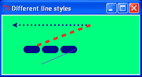

上一张截图显示了在 Ubuntu Linux 上执行的结果。

在这个例子中，我们通过重新使用之前的线位置说明节省了一些工作。请看接下来的两张截图。


上一张截图显示了在 MS Windows XP 上执行的结果。

## 还有更多...

这里你可以看到 Linux 和 MS Windows 使用 Tkinter 绘制虚线的能力差异。虚线的实线部分被指定为 19 像素长。在 Linux（Ubuntu9.10）平台上，这个指定被尊重，但 Windows 忽略了指令。

# 一个有两个段且弯曲尖锐的线条

线不必是直的。更一般类型的线可以由许多直线段连接而成。你只需决定你想连接多段线各部分的位置以及它们应该连接的顺序。

## 如何做...

指令与配方 1 相同。当你编写、保存和执行这个程序时，只需使用名称`sharp_bend.py`。

只需列出定义每个点的`x,y`对，并将它们按你想要连接的顺序排列。列表可以任意长。

```py
#sharp_bend.py
#>>>>>>>>>>>
from Tkinter import *
root = Tk()
root.title('Sharp bend')
cw = 300 # canvas width
ch = 200 # canvas height
canvas_1 = Canvas(root, width=cw, height=ch, background="white")
canvas_1.grid(row=0, column=1)
x1 = 50
y1 = 10
x2 = 20
y2 = 80
x3 = 150
y3 = 60
canvas_1.create_line(x1,y1, x2,y2, x3,y3)
root.mainloop()

```

## 它是如何工作的...

为了清晰起见，只定义了三个点：第一个点为=(x1,y1)，第二个点为=(x2,y2)，第三个点为=(x3, y3)。然而，指定顺序点的数量并没有限制。

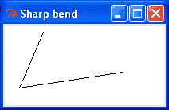

上一张截图显示了带有尖锐弯曲的线条。

## 还有更多...

最终，你可以在某些存储设备上的文件中存储复杂的图形，作为长序列的点。例如，你可能想制作类似卡通条的东西。

你可以构建一个从不同角度看到的身体部位和面部特征的库。可能会有不同形状的嘴和眼睛。组装你的漫画条的任务可以部分自动化。你需要考虑的一件事是如何调整组件的大小，以及如何将它们放置在不同的位置，甚至将它们旋转到不同的角度。所有这些想法都在这本书中得到了发展。

尤其是查看以下示例，了解复杂形状如何以相对紧凑的形式存储和处理。用于绘图操作的**SVG**（**缩放矢量图形**）标准，尤其是在网页上，用于表示形状的约定与 Tkinter 类似但不同。由于 SVG 和 Tkinter 都得到了很好的定义，这意味着你可以构建代码以将一种形式转换为另一种形式。

有关此内容的示例请见第六章，

# 一条带有弯曲的线

最有趣的线条是弯曲的。将上一个例子中的直线、两段线改为与每段线端平行拟合的平滑曲线。Tkinter 使用 12 段直线来制作曲线。12 段是默认数量。然而，你可以将其更改为任何其他合理的数字。

## 如何做到...

将`canvas_1.create_line(x1,y1, x2,y2, x3,y3)`这一行替换为`canvas_1.create_line(x1,y1, x2,y2, x3,y3, smooth="true")`。

线现在弯曲了。这在制作我们只需要指定少量点的绘图时非常有用，Tkinter 会将其拟合成曲线形状。

## 如何工作...

当`smooth="true"`属性被设置时，程序输出结果将在下一张截图显示。`smooth='true'`属性隐藏了大量在幕后进行的严肃数学曲线制造过程。

要将曲线拟合到一对相交的直线，曲线和直线在开始和结束时需要平行，但在中间则使用一种称为**样条拟合**的完全不同的过程。结果是这种曲线平滑处理在计算上非常昂贵，如果你做得太多，程序执行速度会减慢。这影响了哪些动作可以被成功动画化。

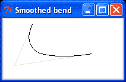

## 还有更多...

我们稍后要做的是使用曲线属性来制作更令人愉悦和令人兴奋的形状。最终，你可以为自己积累一个形状库。如果你这样做，你将重新创建一些可以从网络上免费获取的矢量图形。看看 [www.openclipart.org](http://www.openclipart.org)。从这个网站上免费下载的图片是 SVG（缩放矢量图形）格式。如果你在文本编辑器中查看这些图片的代码，你会看到一些代码行，它们与这些 Tkinter 程序指定点的方略有几分相似。在 第六章 中将演示从现有的 SVG 图片中提取有用形状的一些技术，

# 绘制复杂的形状——卷曲的藤蔓

这里的任务是绘制一个复杂的形状，以便你可以将其用作框架，产生无限多样性和美丽。

我们开始用铅笔和纸绘制一个卷曲生长的藤蔓形状，并以最简单、最直接的方式将其转换成一些代码，以绘制它。

这是一个非常重要的例子，因为它揭示了 Python 和 Tkinter 的基本优雅性。Python 的核心启发设计理念可以用两个词来概括：简单和清晰。这就是 Python 成为有史以来最好的计算机编程语言之一的原因。

## 准备工作

当他们想要创建一个全新的设计时，大多数图形艺术家都会从铅笔和纸草图开始，因为这给了他们无杂乱的潜意识自由。对于这个例子，需要一个复杂的曲线，这种有机设计用于在古董书中装裱图片。

用铅笔在纸上画出平滑的线条，并在大约均匀间隔的地方用 X 标记。使用毫米刻度尺，测量每个 x 到左边和纸张底部的距离，大约测量。由于线条的曲线性质会补偿小的缺陷，所以不需要高精度。

## 如何做到这一点...

这些测量值，Tkinter 画布的 x 和 y 方向上各有 32 个，被输入到单独的列表中。一个叫做 `x_vine` 的用于 x 坐标，另一个叫做 `y_vine` 的用于 y 坐标。

除了这种手工制作原始形状的方式之外，其余的步骤与所有之前的示例相同。

```py
# vine_1.py
#>>>>>>>>>>>>>
from Tkinter import *
root = Tk()
root.title('Curley vine ')
cw = 180 # canvas width.
ch = 160 # canvas height.
canvas_1 = Canvas(root, width=cw, height=ch, background="white")
canvas_1.grid(row=0, column=1)
# The curly vine coordinates as measured from a paper sketch.
vine_x = [23, 20, 11, 9, 29, 52, 56, 39, 24, 32, 53, 69, 63, 47, 35, 35, 51,\
82, 116, 130, 95, 67, 95, 114, 95, 78, 95, 103, 95, 85, 95, 94.5]
vine_y = [36, 44, 39, 22, 16, 32, 56, 72, 91, 117,125, 138, 150, 151, 140, 123, 107,\
92, 70, 41, 5, 41, 66, 41, 24, 41, 53, 41, 33, 41, 41, 39]
#=======================================
# The merging of the separate x and y lists into a single sequence.
#=======================================
Q = [ ]
# Reference copies of the original vine lists - keep the originals # intact
X = vine_x[0:]
Y = vine_y[0:]
# Name the compact, merged x & y list Q
# Merge (alternate interleaves of x and y) into a single polygon of # points.
for i in range(0,len(X)):
Q.append(X[i]) # append the x coordinate
Q.append(Y[i]) # then the y - so they alternate and you end # with a Tkinter polygon.
canvas_1.create_line(Q, smooth='true')
root.mainloop()
#>>>>>>>>>>>>

```

## 它是如何工作的...

结果在下一张屏幕截图中显示，这是一条由 32 段直线组成的平滑线条。


这个任务中的关键技巧是创建一个数字列表，该列表可以精确地放入 `create_line()` 方法中。它必须是一个不间断的序列，由逗号分隔，包含我们想要绘制的复杂曲线的匹配的 x 和 y 位置坐标对。

因此，我们首先创建一个空列表 `Q[]`，我们将向其中追加 x 和 y 坐标的交替值。

因为我们希望保留原始列表 `x_vine` 和 `y_vine` 的完整性（可能用于其他地方的重用），所以我们使用以下方式创建工作副本：

```py
X = vine_x[0:]
Y = vine_y[0:]

```

最后，通过以下方式将魔法交错合并到一个列表中：

```py
for i in range(0,len(X)):
Q.append(X[i]) # append the x coordinate
Q.append(Y[i]) # then the y

```

`for in range()` 组合及其后的代码块以循环方式遍历代码，从 `i=0` 开始，每次增加一个，直到达到最后一个值 `len(X)`。然后退出代码块，执行继续到块下方。`len(X)` 是一个返回（在程序员术语中称为“返回”）`X` 中元素数量的函数。`Q` 从这里产生，非常适合立即在 `create_line(Q)` 中绘制。

如果你省略了 `smooth='true'` 属性，你将看到来自原始论文绘制和测量过程的原始连接点。

## 还有更多...

通过以各种方式复制和变换卷曲的藤蔓，在第六章中产生了诸如卷曲烟雾、炭笔和发光霓虹灯等有趣的效果，

# 绘制一个矩形

通过指定位置、形状和颜色属性作为命名变量来绘制基本矩形。

## 如何操作...

应使用配方 1 中使用的说明。

写作、保存和执行此程序时，只需使用名称 `rectangle.py`。

```py
# rectangle.py
#>>>>>>>>>>
from Tkinter import *
root = Tk()
root.title('Basic Rectangle')
cw = 200 # canvas width
ch =130 # canvas height
canvas_1 = Canvas(root, width=cw, height=200, background="white")
canvas_1.grid(row=0, column=1)
x_start = 10
y_start = 30
x_width =70
y_height = 90
kula ="darkblue"
canvas_1.create_rectangle( x_start, y_start,\
x_start + x_width, y_start + y_height, fill=kula)
root.mainloop()
#>>>>>>>>>>>>>>>>>>>>>>>>>>>>>>>>>>>>>>>>>>

```

## 如何操作...

结果在下一张屏幕截图给出，显示了一个基本矩形。

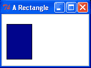

在绘制矩形、圆形、椭圆和弧时，你指定围绕要绘制的图形的边界框的起点（左下角）和终点（右上角）。在矩形和正方形的情况下，边界框与图形重合。但在圆形、椭圆和弧的情况下，边界框当然更大。

通过这个配方，我们尝试了一种新的定义矩形形状的方法。我们将起点指定为 `[x_start, y_start]`，然后我们只声明我们想要的宽度为 `[x_width, y_height]`。这样，终点就是 `[x_start + x_width, y_start + y_height]`。这样，如果你想创建具有相同高度和宽度的多个矩形，你只需要声明新的起点。

## 还有更多...

在下一个示例中，我们使用一个常见的形状来绘制一系列相似但不同的矩形。

# 绘制重叠矩形

通过改变定义其位置、形状和颜色变量的数值，绘制三个重叠的矩形。

## 如何操作...

如前所述，应使用配方 1 中使用的说明。

写作、保存和执行此程序时，只需使用名称 `3rectangles.py`。

```py
# 3rectangles.py
#>>>>>>>>>>>>>>>>>>>>>>>>>>>>>>>>>>>>>>>>>>>
from Tkinter import *
root = Tk()
root.title('Overlapping rectangles')
cw = 240 # canvas width
ch = 180 # canvas height
canvas_1 = Canvas(root, width=cw, height=200, background="green")
canvas_1.grid(row=0, column=1)
# dark blue rectangle - painted first therefore at the bottom
x_start = 10
y_start = 30
x_width =70
y_height = 90
kula ="darkblue"
canvas_1.create_rectangle( x_start, y_start,\
x_start + x_width, y_start + y_height, fill=kula)
# dark red rectangle - second therefore in the middle
x_start = 30
y_start = 50
kula ="darkred"
canvas_1.create_rectangle( x_start, y_start,\
x_start + x_width, y_start + y_height, fill=kula)
# dark green rectangle - painted last therefore on top of previous # ones.
x_start = 50
y_start = 70
kula ="darkgreen"
canvas_1.create_rectangle( x_start, y_start,\
x_start + x_width, y_start + y_height, fill=kula)
#>>>>>>>>>>>>>>>>>>>>>>>>>>>>>>>>>>>>>>>>>>>

```

## 如何操作...

结果在下一张屏幕截图给出，显示了按顺序绘制的重叠矩形。

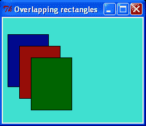

矩形的高度和宽度保持不变，但它们的起始位置已经移动到不同的位置。此外，一个名为`kula`的通用变量被用作每个`create-rectangle()`方法中的通用属性。在绘制每个矩形之间，`kula`被分配一个新的值，以使每个连续的矩形具有不同的颜色。

这里只是对颜色做一个简短的评论。最终，Tkinter 代码中使用的颜色是数值，每个数值指定了混合多少红色、绿色和蓝色。然而，在 Tkinter 库中，有一些浪漫命名的颜色集合，如“玫瑰粉”、“草绿色”和“矢车菊蓝”。每个命名的颜色都被分配了一个特定的数值，以创建与名称建议的颜色。有时你会看到这些颜色被称为网络颜色。有时你给颜色起一个名字，但 Python 解释器会拒绝它，或者只使用灰色调。这个棘手的话题在第五章中得到了解决，

## 还有更多...

规定绘制形状属性的方式可能看起来很冗长。如果我们只是将参数的绝对数值放入绘制函数的方法中，程序将会更短、更整洁。在前面的例子中，我们可以将矩形表示为：

```py
canvas_1.create_rectangle( 10, 30, 70 ,90, , fill='darkblue')
canvas_1.create_rectangle( 30, 50, 70 ,90, , fill='darkred')
canvas_1.create_rectangle( 50, 70, 70 ,90, , fill='darkgreen')

```

在方法之外指定属性值有很好的理由。

+   它允许你创建可重用的代码，可以重复使用，而不管变量的具体值如何。

+   当你使用`x_start`而不是数字时，这使得代码更加自解释。

+   它允许你以受控的系统性方式改变属性值。后面有很多这样的例子。

# 绘制同心正方形

通过改变定义位置、形状和颜色变量的数值，绘制三个同心正方形。

## 如何做到这一点...

应该使用菜谱 1 中使用的指令。

当你编写、保存和执行这个程序时，只需使用名称`3concentric_squares.py`。

```py
# 3concentric_squares.py
#>>>>>>>>>>>>>>>>>
from Tkinter import *
root = Tk()
root.title('Concentric squares')
cw = 200 # canvas width
ch = 400 # canvas height
canvas_1 = Canvas(root, width=cw, height=200, background="green")
canvas_1.grid(row=0, column=1)
# dark blue
x_center= 100
y_center= 100
x_width= 100
y_height= 100
kula= "darkblue"
canvas_1.create_rectangle( x_center - x_width/2, \
y_center - y_height/2,\
x_center + x_width/2, y_center + y_height/2, fill=kula)
#dark red
x_width= 80
y_height= 80
kula ="darkred"
canvas_1.create_rectangle( x_center - x_width/2, \
y_center - y_height/2,\
x_center + x_width/2, y_center + y_height/2, fill=kula)
#dark green
x_width= 60
y_height= 60
kula ="darkgreen"
canvas_1.create_rectangle( x_center - x_width/2, \
y_center - y_height/2,\
x_center + x_width/2, y_center + y_height/2, fill=kula)
root.mainloop()
#>>>>>>>>>>>>>>>>>>>>>>>>>>>>>>>>>>>>>>>>>>>

```

## 它是如何工作的...

结果将在下一张屏幕截图给出。

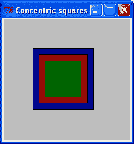

在这个菜谱中，我们指定了矩形的几何中心所在的位置。在每个实例中，这是 `[x_center, y_center]` 位置。每当你想要绘制同心形状时，你需要这样做。通常，通过操纵底右角来尝试定位某个绘制图形的中心总是很尴尬。当然，这也意味着在计算边界框的左下角和右上角时需要进行一些算术运算，但这是为了你获得的艺术自由而付出的微小代价。你只需使用这种技术一次，它就会永远听从你的召唤。

# 从椭圆形到圆形

画圆的最佳方式是使用 Tkinter 的`create_oval()`方法，该方法来自画布小部件。

## 如何做到这一点...

应使用第一个菜谱中使用的说明。

编写、保存和执行此程序时，只需使用名称 `circle_1.py`。

```py
#circle_1.py
#>>>>>>>>>>>>>>
from Tkinter import *
root = Tk()
root.title('A circle')
cw = 150 # canvas width
ch = 140 # canvas height
canvas_1 = Canvas(root, width=cw, height=ch, background="white")
canvas_1.grid(row=0, column=1)
# specify bottom-left and top-right as a set of four numbers named # 'xy'
xy = 20, 20, 120, 120
canvas_1.create_oval(xy)
root.mainloop()

```

## 如何工作...

结果将在下一张截图给出，显示一个基本的圆。


圆只是一个高度和宽度相等的椭圆。在这里的例子中，我们使用一个非常紧凑的语句创建了一个圆：`canvas_1.create_oval(xy)`。

紧凑性来自于将维度属性指定为 Python 元组 `xy = 20, 20, 420, 420` 的技巧。实际上，在其他情况下，使用列表如 `xy = [ 20, 20, 420, 420 ]` 可能会更好，因为列表允许你更改单个成员变量的值，而元组是一个不可变的常量值序列。元组被称为不可变。

## 还有更多...

将圆作为椭圆的特殊情况绘制确实是绘制圆的最佳方式。Tkinter 的不熟练用户可能会被诱惑使用圆弧来完成这项工作。这是一个错误，因为如下一道菜谱所示，`create_arc()` 方法的行为不允许绘制无瑕疵的圆。

# 从圆弧创建圆

制作圆的另一种方法是使用 `create_arc()` 方法。这种方法可能看起来是制作圆的更自然方式，但它不允许你完全完成圆。如果你尝试这样做，圆就会消失。

## 如何操作...

应使用第一个示例中使用的说明。

编写、保存和执行此程序时，只需使用名称 `arc_circle.py`。

```py
# arc_circle.py
#>>>>>>>>>>>>>>>>>>>>>>>>>>>>>>>>>>>>>
from Tkinter import *
root = Tk()
root.title('Should be a circle')
cw = 210 # canvas width
ch = 130 # canvas height
canvas_1 = Canvas(root, width=cw, height=ch, background="white")
canvas_1.grid(row=0, column=1)
xy = 20, 20, 320, 320 # bounding box from x0,y0 to x1, y1
# The Arc is drawn from start_angle, in degrees to finish_angle.
# but if you try to complete the circle at 360 degrees it evaporates.
canvas_1.create_arc(xy, start=0, extent=359.999999999, fill="cyan")
root.mainloop()
#>>>>>>>>>>>>>>>>>>>>>>>>>>>>>>>>>>>>>>

```

## 如何工作...

结果将在下一张截图给出，显示由于 `create_arc()` 导致的失败圆圈。


通常，`create_arc()` 方法不是制作完整圆的最佳方法，因为从 0 度到 360 度的尝试会导致圆从视图中消失。相反，使用 `create_oval()` 方法。然而，有时你需要 `create_arc()` 方法的属性来创建特定的颜色分布。参见后续章节中的颜色轮，这是一个很好的例子。

## 还有更多...

`create_arc()` 方法非常适合制作企业演示中喜欢的饼图。`create_arc()` 方法绘制圆的一段，弧的端点通过径向线与中心相连。但如果我们只想画一个圆，那些径向线是不需要的。

# 三个圆弧椭圆

绘制了三个椭圆弧。

## 如何操作...

应使用菜谱 1 中使用的说明。

编写、保存和执行此程序时，只需使用名称 `3arc_ellipses.py`。

```py
# 3arc_ellipses.py
#>>>>>>>>>>>>>>>>>>>>>>>>>>>>>>>>>>>>>>>>>
from Tkinter import *
root = Tk()
root.title('3arc ellipses')
cw = 180 # canvas width
ch = 180 # canvas height
canvas_1 = Canvas(root, width=cw, height=ch)
canvas_1.grid(row=0, column=1)
xy_1 = 20, 80, 80, 20
xy_2 = 20, 130, 80, 100
xy_3 = 100, 130, 140, 20
canvas_1.create_arc(xy_1, start=20, extent=270, fill="red")
canvas_1.create_arc(xy_2, start=-50, extent=290, fill="cyan")
canvas_1.create_arc(xy_3, start=150, extent=-290, fill="blue")
root.mainloop()
#>>>>>>>>>>>>>>>>>>>>>>>>>>>>>>>>>>>>>>>>>>>

```

## 如何工作...

结果将在下一张截图给出，显示行为良好的 `create_arc()` 椭圆。

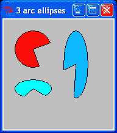

这里需要注意的要点是，就像矩形和椭圆形一样；绘制对象的总体形状由边界框的形状决定。起始和结束（即范围）角度以传统度数表示。请注意，如果将要使用三角函数，则圆形度量必须是弧度而不是度数。

## 还有更多...

`create_arc()` 方法通过要求以度数而不是弧度进行角度测量，使其对用户更加友好，因为大多数人更容易可视化度数而不是弧度。但是，你需要知道，在 math 模块使用的任何函数中，角度测量并不是这种情况。所有像正弦、余弦和正切这样的三角函数都使用弧度角度测量，这只是一个小的便利。math 模块提供了易于使用的转换函数。

# 多边形

绘制一个多边形。多边形是一个封闭的、多边形的图形。这些边由直线段组成。点的指定与多段线的指定相同。

## 如何操作...

应该使用配方 1 中使用的说明。

当你编写、保存和执行此程序时，只需使用名称 `triangle_polygon.py`。

```py
# triangle_polygon.py
#>>>>>>>>>>>>>>>>
from Tkinter import *
root = Tk()
root.title('triangle')
cw = 160 # canvas width
ch = 80 # canvas height
canvas_1 = Canvas(root, width=cw, height=ch, background="white")
canvas_1.grid(row=0, column=1)
# point 1 point 2 point 3
canvas_1.create_polygon(140,30, 130,70, 10,50, fill="red")
root.mainloop()

```

## 它是如何工作的...

结果将在下一张截图给出，显示一个多边形三角形。

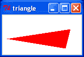

`create_polygon()` 方法在作为方法参数指定的点之间绘制一系列直线段。最后一个点自动与第一个点相连以闭合图形。由于图形是闭合的，你可以用颜色填充内部。

# 星形多边形

使用命名变量来指定多边形属性，以使用单个起始位置定义星的所有点或顶点或尖端。我们称这个位置为锚点位置。

## 如何操作...

应该使用配方 1 中使用的说明。

当你编写、保存和执行此程序时，只需使用名称 `star_polygon.py`。

```py
# star_polygon.py
#>>>>>>>>>>>>
from Tkinter import *
root = Tk()
root.title(Polygon')
cw = 140 # canvas width
ch = 80 # canvas height
canvas_1 = Canvas(root, width=cw, height=ch, background="white")
canvas_1.grid(row=0, column=1)
# blue star, anchored to an anchor point.
x_anchor = 15
y_anchor = 50
canvas_1.create_polygon(x_anchor, y_anchor,\
x_anchor + 20, y_anchor - 40,\
x_anchor + 30, y_anchor + 10,\
x_anchor, y_anchor - 30,\
x_anchor + 40, y_anchor - 20,\
fill="blue")
root.mainloop()
#>>>>>>>>>>>>>>>>>>>>>>>>>>>>>>>>>>>>>>>>>

```

## 它是如何工作的...

结果将在下一张截图给出，一个多边形星形。

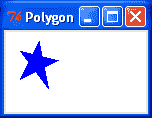

星的第一位置是点 `[x_anchor, y_anchor]`。所有其他点都是相对于锚点位置的正值或负值。这个概念在三个重叠矩形的配方中已经介绍过。这种以一对命名变量定义的点为参考绘制复杂形状的想法非常有用，并且在本书的后半部分被广泛使用。

为了提高代码的可读性，定义每个点的 x 和 y 变量的成对排列是垂直的，利用了行续字符 \ (反斜杠)。

# 克隆和调整星形大小

展示了一种同时重新定位和调整一组星形大小的技术。

## 如何操作...

应该使用配方 1 中使用的说明。

当你编写、保存和执行此程序时，只需使用名称 `clone_stars.py`。

```py
# clone_stars.py
#>>>>>>>>>>>>>>>>>>>>>>>>>>>>>>>>>>>>>>>
from Tkinter import *
root = Tk()
root.title('Re-sized and re-positioned polygon stars')
cw = 200 # canvas width
ch = 100 # canvas height
canvas_1 = Canvas(root, width=cw, height=ch, background="white")
canvas_1.grid(row=0, column=1)
# blue star, anchored to an anchor point.
x_anchor = 15
y_anchor = 150
size_scaling = 1
canvas_1.create_polygon(x_anchor, y_anchor,\
x_anchor + 20 * size_scaling, y_anchor - \ 40* size_scaling,\
x_anchor + 30 * size_scaling, y_anchor + \ 10* size_scaling,\
x_anchor, y_anchor - 30* size_scaling,\
x_anchor + 40 * size_scaling, y_anchor - \ 20* size_scaling,\
fill="green")
size_scaling = 2
x_anchor = 80
y_anchor = 120
canvas_1.create_polygon(x_anchor, y_anchor,\
x_anchor + 20 * size_scaling, y_anchor - \ 40* size_scaling,\
x_anchor + 30 * size_scaling, y_anchor + \ 10* size_scaling,\
x_anchor, y_anchor - 30* size_scaling,\
x_anchor + 40 * size_scaling, y_anchor - \ 20* size_scaling,\
starsresizingfill="darkgreen")
size_scaling = 3
x_anchor = 160
y_anchor = 110
canvas_1.create_polygon(x_anchor, y_anchor,\
x_anchor + 20 * size_scaling, y_anchor - \ 40* size_scaling,\
x_anchor + 30 * size_scaling, y_anchor + \ 10* size_scaling,\
x_anchor, y_anchor - 30* size_scaling,\
x_anchor + 40 * size_scaling, y_anchor - \ 20* size_scaling,\
fill="lightgreen")
size_scaling = 3
x_anchor = 160
y_anchor = 110
canvas_1.create_polygon(x_anchor, y_anchor,\
x_anchor + 20 * size_scaling, y_anchor - \ 40* size_scaling,\
x_anchor + 30 * size_scaling, y_anchor + \ 10* size_scaling,\
x_anchor, y_anchor - 30* size_scaling,\
x_anchor + 40 * size_scaling, y_anchor - \ 20* size_scaling,\
fill="forestgreen")
root.mainloop()
#>>>>>>>>>>>>>>>>>>>>>>>>>>>>>>>>>>>>>>>

```

## 它是如何工作的...

下一个屏幕截图显示了大小变化的星串。


除了多边形星形的可变和方便重新分配的锚点外，我们还引入了一个放大因子，可以改变任何特定星形的大小而不会扭曲它。

## 还有更多...

最后三个例子已经展示了用于绘制任何大小和位置的预定义形状的一些重要和基本思想。在这个阶段，将这些效果分开在不同的例子中是很重要的，这样单独的动作就更容易理解。稍后，当这些效果被组合使用时，理解正在发生的事情就变得困难，尤其是如果涉及到额外的变换，如旋转。如果我们对生成图像的代码进行动画处理，那么理解几何关系会容易得多。通过动画，我指的是以类似于电影中处理图像的方式，通过短时间间隔显示连续图像。这种时间调节的动画，出人意料地，提供了检查图像生成代码行为的方法，这对人类大脑来说更加直观和清晰。这个想法在后面的章节中得到了发展。
