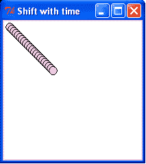
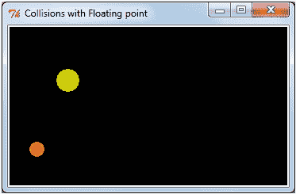
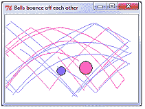
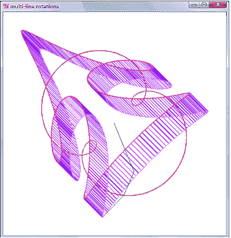

# 第四章。动画原理

在本章中，我们将涵盖：

+   球的静态移动

+   球的定时移动

+   动画定时绘制和擦除循环

+   两个无阻碍移动的球

+   一个弹跳的球

+   在重力场中的弹跳

+   带有追踪轨迹的碰撞球

+   弹性球与球碰撞

+   动态调试

+   轨迹追踪

+   旋转线条和重要的三角学

+   旋转线条，旋转线条

+   数字花

# 简介

动画是关于在屏幕上使图形对象平滑移动。创建平滑动态动作感觉的方法很简单：

1.  首先向观众展示一幅图画。

1.  允许图像在视图中停留大约二十分之一秒。

1.  以最小的延迟，展示另一个图像，其中对象已经通过一个小量移动，并重复此过程。

除了在屏幕上制作动画图形供娱乐的明显应用外，动画化计算机代码的结果能让你深入了解代码在详细层面的工作方式。动画为程序员的调试工具箱提供了一个额外的维度。它为你提供了一个全面的、整体的观点，关于正在进行的软件执行，这是其他任何东西都无法提供的。

# 球的静态移动

我们制作了一个小彩色圆盘的图像，并在不同的位置绘制它。

## 如何做到这一点...

以与第二章、“绘制基本形状”中所有示例完全相同的方式执行程序，你会看到一排整齐的彩色圆盘从左上角到右下角依次排列。这个想法是展示我们将反复使用的方法，即系统的位置移动方法。

```py
# moveball_1.py
#>>>>>>>>>>>>>
from Tkinter import *
root = Tk()
root.title("shifted sequence")
cw = 250 # canvas width
ch = 130 # canvas height
chart_1 = Canvas(root, width=cw, height=ch, background="white")
chart_1.grid(row=0, column=0)
# The parameters determining the dimensions of the ball and its # position.
# ==========================================
posn_x = 1 # x position of box containing the ball (bottom)
posn_y = 1 # y position of box containing the ball (left edge)
shift_x = 3 # amount of x-movement each cycle of the 'for' loop
shift_y = 2 # amount of y-movement each cycle of the 'for' loop
ball_width = 12 # size of ball - width (x-dimension)
ball_height = 12 # size of ball - height (y-dimension)
color = "violet" # color of the ball
for i in range(1,50): # end the program after 50 position shifts
posn_x += shift_x
posn_y += shift_y
chart_1.create_oval(posn_x, posn_y, posn_x + ball_width,\
posn_y + ball_height, fill=color)
root.mainloop()
#>>>>>>>>>>>>>>>>>>>>>>>>>>>>>>>>>>>>>>>>>>

```

## 它是如何工作的...

一个简单的球在画布上按顺序绘制，一层叠在另一层之上。对于每一步，球的位置根据`shift_x`的大小移动三个像素。同样，`shift_y`的值减少两个像素，以实现向下移动。`shift_x`和`shift_y`只指定移动量，但它们并不直接导致移动。使移动发生的是两个命令`posn_x += shift_x`和`posn_y += shift_y`。`posn`是位置（position）的缩写。这里需要解释一下这种记法，因为我们会在整本书中经常使用它。它既整洁又方便。

`posn_x += shift_x`意味着“将变量`posn_x`增加一个`shift_x`的量。”它与`posn_x = posn_x + shift_x`相同。

另一个需要注意的细微之处是使用行续字符，即反斜杠“\”。当我们想要将相同的 Python 命令延续到下一行以方便阅读时，我们会使用它。严格来说，对于括号内的文本“(…）”，这并不是必需的。在这个特定情况下，你可以简单地插入一个回车字符。然而，反斜杠使得阅读你代码的人清楚地知道你的意图。

## 还有更多...

本食谱中的球图像系列是在几微秒内绘制的。为了创建看起来不错的动画，我们需要能够通过适当的方式减慢代码的执行速度。我们需要将相当于电影帧的内容绘制到屏幕上，并保持一段时间，然后移动到下一个略微偏移的图像。这个过程将在下一个食谱中完成。

# 通过时间控制移动球

在这里，我们介绍了时间控制函数 `canvas.after(milliseconds)` 和 `canvas.update()` 函数，后者刷新画布上的图像。这些是 Python 动画的基础。

通过标准 Python 库中的时间模块，我们可以控制代码何时执行。

## 如何做...

按照之前的方式执行程序。你将看到一条对角线排列的圆盘，在更新之间有五分之一秒（200 毫秒）的短暂延迟。结果在下面的屏幕截图中显示，显示了球在规律间隔内的移动。



```py
# timed_moveball_1.py
#>>>>>>>>>>>>>>>>>>>>>>>>>>>>>>>>>>>>>>>>>>>>
from Tkinter import *
root = Tk()
root.title("Time delayed ball drawing")
cw = 300 # canvas width
ch = 130 # canvas height
chart_1 = Canvas(root, width=cw, height=ch, background="white")
chart_1.grid(row=0, column=0)
cycle_period = 200 # time between fresh positions of the ball
# (milliseconds).
# The parameters determining the dimensions of the ball and it's # position.
posn_x = 1 # x position of box containing the ball (bottom).
posn_y = 1 # y position of box containing the ball (left edge).
shift_x = 3 # amount of x-movement each cycle of the 'for' loop.
shift_y = 3 # amount of y-movement each cycle of the 'for' loop.
ball_width = 12 # size of ball - width (x-dimension).
ball_height = 12 # size of ball - height (y-dimension).
color = "purple" # color of the ball
for i in range(1,50): # end the program after 50 position shifts.
posn_x += shift_x
posn_y += shift_y
chart_1.create_oval(posn_x, posn_y, posn_x + ball_width,\
posn_y + ball_height, fill=color)
chart_1.update() # This refreshes the drawing on the canvas.
chart_1.after(cycle_period) # This makes execution pause for 200 # milliseconds.
root.mainloop()

```

## 它是如何工作的...

这个食谱与上一个食谱相同，只是增加了 `canvas.after(...)` 和 `canvas.update()` 方法。这两个函数来自 Python 库。第一个允许你通过指定延迟来控制代码执行时间。第二个强制画布完全重新绘制所有应该存在的对象。虽然还有更复杂的方法来刷新屏幕的特定部分，但它们会带来困难，所以这里不会处理。

`canvas.after(your-chosen-milliseconds)` 方法只是简单地使代码执行产生定时暂停。在所有前面的代码中，暂停执行的速度尽可能快，然后当遇到由 `canvas.after()` 方法触发的暂停时，执行将暂停指定的毫秒数。暂停结束后，执行将继续，就像什么都没发生过一样。

`canvas.update()` 方法强制画布上的所有内容立即重新绘制，而不是等待某个未指定的事件导致画布刷新。

## 还有更多...

在有效动画的下一步中，在画布上绘制新的、偏移的克隆图像之前，需要短暂擦除动画对象的先前图像。这将在下一个示例中发生。

### Tkinter 的健壮性

值得注意的是，Tkinter 非常健壮。当你给出超出画布范围的坐标时，Python 不会崩溃或冻结。它只是继续绘制“超出页面”的对象。Tkinter 画布可以看作是进入几乎无限视觉空间的一个小窗口。我们只有在对象移动到 Tkinter 画布的视野中时才能看到对象。

# 使用绘制-移动-暂停-擦除循环完成完整动画

这个菜谱提供了整个动画过程。在这个例子中，所有必要的人类大脑将视网膜上的图像解释为移动对象的行为都存在。动画的全部工艺以及基于此的百万美元电影在这里以最简单和最纯粹的形式展示。

## 如何做...

按照我们之前的方式执行此程序。注意这次我们将计时暂停缩短到 50 毫秒，即每秒 20 次。这接近电影中使用的标准 24 帧每秒。然而，如果没有图形卡，这次暂停时间会变得不那么准确，因为指定的暂停时间更短。此外，球在位置变化之间的移动距离已经减少到一像素。

```py
# move_erase_cycle_1.py
# >>>>>>>>>>>>>>>>>>>>>>>>>>>>>>>>>>>>>>>>>>>>>>
from Tkinter import *
root = Tk()
root.title("move-and-erase")
cw = 230 # canvas width
ch = 130 # canvas height
chart_1 = Canvas(root, width=cw, height=ch, background="white")
chart_1.grid(row=0, column=0)
cycle_period = 50 # time between new positions of the ball
# (milliseconds).
# The parameters determining the dimensions of the ball and its
# position.
posn_x = 1 # x position of box containing the ball (bottom).
posn_y = 1 # y position of box containing the ball (left edge).
shift_x = 1 # amount of x-movement each cycle of the 'for' loop.
draw-move-pause-erase cyclesusing, in animationshift_y = 1 # amount of y-movement each cycle of the 'for' loop.
ball_width = 12 # size of ball - width (x-dimension).
ball_height = 12 # size of ball height (y-dimension).
color = "hot pink" # color of the ball
for i in range(1,500): # end the program after 500 position shifts.
posn_x += shift_x
posn_y += shift_y
chart_1.create_oval(posn_x, posn_y, posn_x + ball_width,\
posn_y + ball_height, fill=color)
chart_1.update() # This refreshes the drawing on the canvas.
chart_1.after(cycle_period) # This makes execution pause for 200 # milliseconds.
chart_1.delete(ALL) # This erases everything on the canvas.
root.mainloop()
# >>>>>>>>>>>>>>>>>>>>>>>>>>>>>>>>>>>>>>>>>>>>>>

```

## 它是如何工作的...

在这个自包含动画中的新元素是`canvas.delete(ALL)`方法，它可以清除画布上绘制的一切。可以通过使用标识标签来擦除屏幕上的特定对象。现在这不需要了。使用标签进行选择性对象删除将在本章的最后三个菜谱中使用。

## 更多...

`pause()`方法的计时精度如何？

使用现代计算机，五毫秒的暂停是现实的，但随着暂停时间的缩短，动画变得不流畅。

# 多个移动对象

我们希望能够开发出包含多个独立图形对象共存并按照某些规则相互作用的程序。大多数计算机游戏就是这样工作的。飞行员训练模拟器和严肃的工程设计模型也是基于相同的原则设计的。我们通过创建一个最终有两个球在重力损失和相互碰撞的影响下反弹到墙上的应用程序来开始这个过程。

## 如何做...

以下代码与上一个菜谱中的代码非常相似，只是创建了两个相似的对象。它们彼此独立，并且以任何方式都不相互作用。

```py
# two_balls_moving_1.py
# >>>>>>>>>>>>>>>>>>>>>>>>>>>>>>>>>>>>>>>>>>>>>>
from Tkinter import *
root = Tk()
root.title("Two balls")
cw = 200 # canvas width
ch = 130 # canvas height
chart_1 = Canvas(root, width=cw, height=ch, background="white")
chart_1.grid(row=0, column=0)
cycle_period = 100 # time between new positions of the ball
# (milliseconds).
# The parameters defining ball no 1.
posn_x_1 = 1 # x position of box containing the ball (bottom).
posn_y_1 = 1 # y position of box containing the ball (left edge).
shift_x_1 = 1 # amount of x-movement each cycle of the 'for' loop.
shift_y_1 = 1 # amount of y-movement each cycle of the 'for' loop.
ball_width_1 = 12 # size of ball - width (x-dimension).
ball_height_1 = 12 # size of ball - height (y-dimension).
color_1 = "blue" # color of ball #1
# The parameters defining ball no 2.
posn_x_2 = 180 # x position of box containing the ball (bottom).
multiple objectsmovingposn_y_2 = 180 # x position of box containing the ball (left # edge).
shift_x_2 = -2 # amount of x-movement each cycle of the 'for' # loop.
shift_y_2 = -2 # amount of y-movement each cycle of the 'for' # loop.
ball_width_2 = 8 # size of ball - width (x-dimension).
ball_height_2 = 8 # size of ball - height (y-dimension).
color_2 = "green" # color of ball #2.
for i in range(1,100): # end the program after 50 position shifts.
posn_x_1 += shift_x_1
posn_y_1 += shift_y_1
posn_x_2 += shift_x_2
posn_y_2 += shift_y_2
chart_1.create_oval(posn_x_1, posn_y_1, posn_x_1 + ball_width_1,\
posn_y_1 + ball_height_1, fill=color_1)
chart_1.create_oval(posn_x_2, posn_y_2, posn_x_2 + ball_width_2,\
posn_y_2 + ball_height_2, fill=color_2)
chart_1.update() # This refreshes the drawing on the canvas.
chart_1.after(cycle_period) # This makes execution pause for 100 # milliseconds.
chart_1.delete(ALL) # This erases everything on the canvas
root.mainloop()
# >>>>>>>>>>>>>>>>>>>>>>>>>>>>>>>>>>>>>>>>>>>>>>

```

## 它是如何工作的...

需要注意的主要点是，这些程序，以及本书中的许多其他程序，分为五个部分：

1.  创建对象存在的环境。

1.  定义单个对象及其属性。

1.  定义对象之间的交互规则。

1.  创建对象。

1.  使用循环通过改变位置等属性来模拟时间的流逝，这些属性的变化速率模仿实时运动。

1.  控制对象存在的环境。

在我们的大多数例子中，环境是 Tkinter 画布。在这个例子中，将在画布环境中存在的对象是两个彩色球。交互规则是它们将不会对彼此产生任何影响，并且它们也不会受到画布边缘的影响。另一个交互规则是每次执行`for`循环时它们的位置将如何变化。

最后，环境由受时间调节的`canvas.update()`和`canvas.delete(ALL)`方法控制。

## 还有更多...

这个配方中展示的基本思想是，我们可以创建多个相似但不同的对象，并且它们可以独立地反应。这引发了面向对象编程的想法。

Python 提供了多种使用面向对象编程思想的方法。在这本书中，我们使用三种方式来创建对象：列表、字典和类。

# 一个弹跳的球

现在，以及接下来的三个例子中，我们添加了越来越复杂的交互规则。总体目标是向我们的虚拟世界引入行为和交互，使其更像现实世界。我们使用数字、计算和图形绘制来表示我们所知的现实世界的各个方面。

第一个新行为是，我们的彩色圆盘将在 Tkinter 画布的容器墙上弹性弹跳。

## 如何实现...

为了让我们感觉仍然处于熟悉的领域，随着我们创建的世界变得越来越复杂，代码有意识地保持与前面四个例子尽可能相似。如果我们不这样做，我们就会迷失方向，感到困惑。成功构建复杂计算机程序的全部秘密在于逐步和系统地逐步构建。这并不是沿着一条已经绘制好的道路的计划之旅，而是一次艰苦的未知的丛林探险。

```py
# bounce_ball.py
#>>>>>>>>>>>>>>>>>>>>>>>>>>>>>>>>>>>>>>>>>>
from Tkinter import *
import time
root = Tk()
root.title("The bouncer")
cw = 200 # canvas width
ch = 120 # canvas height
chart_1 = Canvas(root, width=cw, height=ch, background="white")
chart_1.grid(row=0, column=0)
cycle_period = 50 # time between new positions of the ball
# (milliseconds).
# The parameters determining the dimensions of the ball and its position.
posn_x = 1 # x position of box containing the ball (bottom).
posn_y = 1 # x position of box containing the ball (left edge).
shift_x = 1 # amount of x-movement each cycle of the 'for' loop.
shift_y = 1 # amount of y-movement each cycle of the 'for' loop.
ball_width = 12 # size of ball - width (x-dimension).
ball_height = 12 # size of ball - height (y-dimension).
color = "firebrick" # color of the ball
# Here is a function that detects collisions with the walls of the # container
# and then reverses the direction of movement if a collision is # detected.
def detect_wall_collision():
global posn_x, posn_y, shift_x, shift_y, cw, cy
if posn_x > cw : # Collision with right-hand container wall.
shift_x = -shift_x # reverse direction.
if posn_x < 0 : # Collision with left-hand wall.
shift_x = -shift_x
if posn_y > ch : # Collision with floor.
ballbouncingshift_y = -shift_y
if posn_y < 0 : # Collision with ceiling.
shift_y = -shift_y
for i in range(1,1000): # end the program after1000 position shifts.
posn_x += shift_x
posn_y += shift_y
chart_1.create_oval(posn_x, posn_y, posn_x + ball_width,\
posn_y + ball_height, fill=color)
detect_wall_collision() # Has the ball collided with # any container wall?
chart_1.update() # This refreshes the drawing on the canvas.
chart_1.after(cycle_period) # This makes execution pause # for 200 milliseconds.
chart_1.delete(ALL) # This erases everything on the canvas.
root.mainloop()
#>>>>>>>>>>>>>>>>>>>>>>>>>>>>>>>>>

```

## 它是如何工作的...

这里新增加的功能是函数`detect_Wall_Collision()`。每次调用它时，都会检查球的位置是否已经移动到画布边界之外。如果是，则球的运动方向会被反转。这种方法比较粗糙，因为它没有考虑到球的大小。因此，球会突然消失。

# 在重力场中的弹跳

在这个配方中，我们增加了重力场的影响，作为之前在画布墙上弹跳规则的补充。

## 如何实现...

与之前的所有配方不同的地方在于球的新属性`velocity_y`。在`for i in range(0,300)`循环的每一轮中，速度都会像在现实世界的重力场中一样被修改。

```py
# gravityball.py
# >>>>>>>>>>>>>>>>>>>>>>>>>>>>>
from Tkinter import *
root = Tk()
root.title("Gravity bounce")
cw = 220 # canvas width
ch = 200 # canvas height
GRAVITY = 4
chart_1 = Canvas(root, width=cw, height=ch, background="white")
chart_1.grid(row=0, column=0)
cycle_period = 30
# The parameters determining the dimensions of the ball and its # position.
posn_x = 15
posn_y = 180
shift_x = 1
velocity_y = 50
ball_width = 12
ball_height = 12
color = "blue"
# The function that detects collisions with the walls and reverses # direction
def detect_wall_collision():
global posn_x, posn_y, shift_x, velocity_y, cw, cy
if posn_x > cw -ball_width: # Collision with right-hand # container wall.
shift_x = -shift_x # reverse direction.
if posn_x < ball_width: # Collision with left-hand wall.
shift_x = -shift_x
ballbouncing, in gravity fieldif posn_y < ball_height : # Collision with ceiling.
velocity_y = -velocity_y
if posn_y > ch - ball_height : # Floor collision.
velocity_y = -velocity_y
for i in range(1,300):
posn_x += shift_x
velocity_y = velocity_y + GRAVITY # a crude equation # incorporating gravity.
posn_y += velocity_y
chart_1.create_oval(posn_x, posn_y, posn_x + ball_width, \
posn_y + ball_height, \ fill=color)
detect_wall_collision() # Has the ball collided with any # container wall?
chart_1.update() # This refreshes the drawing on the canvas.
chart_1.after(cycle_period) # This makes execution pause for 200 # milliseconds.
chart_1.delete(ALL) # This erases everything on the canvas.
root.mainloop()

```

## 它是如何工作的...

每次计算新位置时，我们球的垂直`velocity_y`属性都会增加一个常数量 GRAVITY。结果是，当球向下落时速度会加快，当球向上移动时速度会减慢。因为 Tkinter 画布的 y 方向是向下增加的（与我们的现实世界相反），这会导致球向上移动时速度减慢，向下移动时速度加快。

## 还有更多...

这种弹球模拟存在一个缺陷。球在弹跳大约三次后从画布上消失，因为计算球的新位置和检测与墙壁碰撞所使用的整数算术过于粗糙。结果是球发现自己超出了我们设定的条件，当它碰到地板时无法反转方向。添加到其速度中的重力将其踢出 `posn_y > ch ball_height` 的区间，球永远不会被放回画布内。

画布上的位置仅定义为整数，但在计算球的位置时，我们需要处理比这更高的精度。结果证明这里没有问题。在他们的智慧中，Python 设计者允许我们使用所有非常精确的浮点数变量来工作，并且仍然可以将它们传递给 `canvas.create_oval(...)` 方法，该方法在画布上绘制球。对于最终的绘图，显然它们被转换成了整数。感谢明智的 Python 朋友们。

## 参见

下一个配方 `floating_point_collisions_1.py` 使用浮点数位置计算来修复这个示例中的缺陷。

# 使用浮点数进行精确碰撞

在这里，通过使用浮点数进行所有球位置计算，消除了由整数算术粗糙性引起的模拟缺陷。

## 如何操作...

所有位置、速度和重力变量都通过显式的小数点写成浮点数。结果在下面的屏幕截图中显示，显示了带有轨迹追踪的弹跳球。



```py
from Tkinter import *
root = Tk()
root.title("Collisions with Floating point")
cw = 350 # canvas width
ch = 200 # canvas height
GRAVITY = 1.5
chart_1 = Canvas(root, width=cw, height=ch, background="black")
chart_1.grid(row=0, column=0)
cycle_period = 80 # Time between new positions of the ball # (milliseconds).
simulation flawseliminatingtime_scaling = 0.2 # This governs the size of the differential steps
# when calculating changes in position.
# The parameters determining the dimensions of the ball and it's # position.
ball_1 = {'posn_x':25.0, # x position of box containing the # ball (bottom).
'posn_y':180.0, # x position of box containing the # ball (left edge).
'velocity_x':30.0, # amount of x-movement each cycle of # the 'for' loop.
'velocity_y':100.0, # amount of y-movement each cycle of # the 'for' loop.
'ball_width':20.0, # size of ball - width (x-dimension).
'ball_height':20.0, # size of ball - height (y-dimension).
'color':"dark orange", # color of the ball
'coef_restitution':0.90} # proportion of elastic energy # recovered each bounce
ball_2 = {'posn_x':cw - 25.0,
'posn_y':300.0,
'velocity_x':-50.0,
'velocity_y':150.0,
'ball_width':30.0,
simulation flawseliminating'ball_height':30.0,
'color':"yellow3",
'coef_restitution':0.90}
def detectWallCollision(ball):
# Collision detection with the walls of the container
if ball['posn_x'] > cw - ball['ball_width']: # Collision # with right-hand wall.
ball['velocity_x'] = -ball['velocity_x'] * ball['coef_ \ restitution'] # reverse direction.
ball['posn_x'] = cw - ball['ball_width']
if ball['posn_x'] < 1: # Collision with left-hand wall.
ball['velocity_x'] = -ball['velocity_x'] * ball['coef_ \restitution']
ball['posn_x'] = 2 # anti-stick to the wall
if ball['posn_y'] < ball['ball_height'] : # Collision # with ceiling.
ball['velocity_y'] = -ball['velocity_y'] * ball['coef_ \ restitution']
ball['posn_y'] = ball['ball_height']
if ball['posn_y'] > ch - ball['ball_height']: # Floor # collision.
ball['velocity_y'] = - ball['velocity_y'] * ball['coef_ \restitution']
ball['posn_y'] = ch - ball['ball_height']
def diffEquation(ball):
# An approximate set of differential equations of motion # for the balls
ball['posn_x'] += ball['velocity_x'] * time_scaling
ball['velocity_y'] = ball['velocity_y'] + GRAVITY # a crude # equation incorporating gravity.
ball['posn_y'] += ball['velocity_y'] * time_scaling
chart_1.create_oval( ball['posn_x'], ball['posn_y'], ball['posn_x'] + ball['ball_width'],\
ball ['posn_y'] + ball['ball_height'], \ fill= ball['color'])
detectWallCollision(ball) # Has the ball collided with # any container wall?
for i in range(1,2000): # end the program after 1000 position shifts.
diffEquation(ball_1)
diffEquation(ball_2)
chart_1.update() # This refreshes the drawing on the canvas.
chart_1.after(cycle_period) # This makes execution pause for 200 # milliseconds.
chart_1.delete(ALL) # This erases everything on the
root.mainloop()

```

## 工作原理...

精度算术的使用使我们能够注意到以前由于仅使用整数计算而隐藏的模拟行为。这是图形模拟作为调试工具的独特价值。如果你能用视觉方式而不是数字列表来表示你的想法，你将很容易发现代码中的细微差异。人类大脑最适合在图形图像中工作。这是作为猎人的直接后果。

## 一个图形调试工具...

软件调试器工具箱中还有一个非常实用的技巧，那就是可视化追踪。追踪是一种显示动态行为历史的视觉轨迹。所有这些都在下一个示例中揭示。

# 轨迹追踪和球与球碰撞

现在我们介绍我们模拟中更复杂行为之一的中空碰撞。

当你在调试程序时，最难的事情是试图将最近观察到的行为保存在你的短期记忆中，并与当前行为进行有意义的比较。这种记忆是一个不完美的记录器。克服这种困难的方法是创建一种图形形式的记忆，某种类型的图片，可以准确地显示过去发生的事情。就像军事大炮瞄准手使用发光的曳光弹来调整他们的瞄准一样，图形程序员可以使用轨迹痕迹来检查执行的历史。

## 如何做到...

在我们的新代码中，有一个名为 `detect_ball_collision (ball_1, ball_2)` 的新函数，其任务是预测两个球无论在哪里即将发生的碰撞。碰撞可能来自任何方向，因此我们需要能够测试所有可能的碰撞场景，并检查每一个的行为，看看它是否按计划工作。除非我们创建测试结果的工具，否则这可能过于困难。在这个菜谱中，测试结果的工具是图形轨迹痕迹。这是一条跟随球路径的线，显示了从模拟开始以来球的确切位置。结果在下面的屏幕截图中显示，显示了球与球碰撞的反弹。



```py
# kinetic_gravity_balls_1.py
animationmid-air collision# >>>>>>>>>>>>>>>>>>>>>>>>>>>>>>>>>>>>>>>>>>>>>>>>>>
from Tkinter import *
import math
root = Tk()
root.title("Balls bounce off each other")
cw = 300 # canvas width
ch = 200 # canvas height
GRAVITY = 1.5
chart_1 = Canvas(root, width=cw, height=ch, background="white")
chart_1.grid(row=0, column=0)
cycle_period = 80 # Time between new positions of the ball # (milliseconds).
time_scaling = 0.2 # The size of the differential steps
# The parameters determining the dimensions of the ball and its # position.
ball_1 = {'posn_x':25.0,
'posn_y':25.0,
'velocity_x':65.0,
'velocity_y':50.0,
'ball_width':20.0,
'ball_height':20.0,
'color':"SlateBlue1",
'coef_restitution':0.90}
ball_2 = {'posn_x':180.0,
'posn_y':ch- 25.0,
'velocity_x':-50.0,
'velocity_y':-70.0,
'ball_width':30.0,
'ball_height':30.0,
'color':"maroon1",
'coef_restitution':0.90}
def detect_wall_collision(ball):
animationmid-air collision# detect ball-to-wall collision
if ball['posn_x'] > cw - ball['ball_width']: # Right-hand wall.
ball['velocity_x'] = -ball['velocity_x'] * ball['coef_ \restitution']
ball['posn_x'] = cw - ball['ball_width']
if ball['posn_x'] < 1: # Left-hand wall.
ball['velocity_x'] = -ball['velocity_x'] * ball['coef_ \restitution']
ball['posn_x'] = 2
if ball['posn_y'] < ball['ball_height'] : # Ceiling.
ball['velocity_y'] = -ball['velocity_y'] * ball['coef_ \restitution']
ball['posn_y'] = ball['ball_height']
if ball['posn_y'] > ch - ball['ball_height'] : # Floor
ball['velocity_y'] = - ball['velocity_y'] * ball['coef_ \restitution']
ball['posn_y'] = ch - ball['ball_height']
def detect_ball_collision(ball_1, ball_2):
#detect ball-to-ball collision
# firstly: is there a close approach in the horizontal direction
if math.fabs(ball_1['posn_x'] - ball_2['posn_x']) < 25:
# secondly: is there also a close approach in the vertical # direction.
if math.fabs(ball_1['posn_y'] - ball_2['posn_y']) < 25:
ball_1['velocity_x'] = -ball_1['velocity_x'] # reverse # direction.
ball_1['velocity_y'] = -ball_1['velocity_y']
ball_2['velocity_x'] = -ball_2['velocity_x']
ball_2['velocity_y'] = -ball_2['velocity_y']
# to avoid internal rebounding inside balls
ball_1['posn_x'] += ball_1['velocity_x'] * time_scaling
ball_1['posn_y'] += ball_1['velocity_y'] * time_scaling
ball_2['posn_x'] += ball_2['velocity_x'] * time_scaling
ball_2['posn_y'] += ball_2['velocity_y'] * time_scaling
animationmid-air collisiondef diff_equation(ball):
x_old = ball['posn_x']
y_old = ball['posn_y']
ball['posn_x'] += ball['velocity_x'] * time_scaling
ball['velocity_y'] = ball['velocity_y'] + GRAVITY
ball['posn_y'] += ball['velocity_y'] * time_scaling
chart_1.create_oval( ball['posn_x'], ball['posn_y'],\
ball['posn_x'] + ball['ball_width'],\
ball['posn_y'] + ball['ball_height'],\
fill= ball['color'], tags="ball_tag")
chart_1.create_line( x_old, y_old, ball['posn_x'], \ ball ['posn_y'], fill= ball['color'])
detect_wall_collision(ball) # Has the ball # collided with any container wall?
for i in range(1,5000):
diff_equation(ball_1)
diff_equation(ball_2)
detect_ball_collision(ball_1, ball_2)
chart_1.update()
chart_1.after(cycle_period)
chart_1.delete("ball_tag") # Erase the balls but # leave the trajectories
root.mainloop()

```

## 它是如何工作的...

空中球与球碰撞分为两个步骤。在第一步中，我们测试两个球是否在由 `if math.fabs(ball_1['posn_x'] - ball_2['posn_x']) < 25` 定义的垂直条带内彼此靠近。用简单的话说，这是在问“球之间的水平距离是否小于 25 像素？”如果答案是肯定的，那么通过语句 `if math.fabs(ball_1['posn_y'] - ball_2['posn_y']) < 25`，检查区域被缩小到小于 25 像素的小垂直距离。所以每次循环执行时，我们都会扫描整个画布，看看两个球是否都位于一个区域，它们的左下角彼此之间的距离小于 25 像素。如果它们如此接近，那么我们只需通过在水平和垂直方向上反转它们的移动方向，简单地使它们相互反弹。

## 还有更多...

简单地反转方向并不是数学上正确的方式来反转碰撞球的方向。当然，台球不会那样表现。支配碰撞球体的物理定律要求动量守恒。这需要更复杂的数学，而这本书没有涵盖。

## 为什么我们有时会得到 tkinter.TckErrors？

如果我们在 Python 暂停时点击关闭窗口按钮（右上角的 X），当 Python 恢复并调用`Tcl`（Tkinter）在画布上绘制东西时，我们会得到一个错误消息。可能发生的情况是应用程序已经关闭，但`Tcl`还有未完成的事务。如果我们允许程序运行完成后再尝试关闭窗口，那么终止将是有序的。

# 旋转线

现在我们将看到如何处理旋转线。在任何类型的图形计算机工作中，最终都会出现需要旋转对象的情况。通过尽可能简单地开始，并逐步添加行为，我们可以处理一些越来越复杂的情况。这个步骤是制作旋转对象艺术中的第一步简单步骤。

## 准备工作

要理解旋转的数学，你需要对正弦、余弦和正切等三角函数有合理的熟悉度。对于那些一提到三角函数眼睛就发花的人来说，好消息是你可以使用这些例子而不需要理解三角函数。然而，如果你真的试图弄懂数学，那会更有成就感。这就像看足球和踢足球的区别。只有球员才会变得健康。

## 如何操作...

你只需要编写并运行这段代码，就像你为所有其他食谱所做的那样观察结果。洞察力来自于反复的尝试和修改代码。逐个改变变量`p1_x`到`p2_y`的值，并观察结果。

```py
# rotate_line_1.py
#>>>>>>>>>>>>>>>>>>>>>>>>>>>>>>>>>>>>>>>>>>
from Tkinter import *
import math
root = Tk()
root.title("Rotating line")
cw = 220 # canvas width
ch = 180 # canvas height
chart_1 = Canvas(root, width=cw, height=ch, background="white")
chart_1.grid(row=0, column=0)
cycle_period = 50 # pause duration (milliseconds).
p1_x = 90.0 # the pivot point
p1_y = 90.0 # the pivot point,
p2_x = 180.0 # the specific point to be rotated
p2_y = 160.0 # the specific point to be rotated.
a_radian = math.atan((p2_y - p1_y)/(p2_x - p1_x))
a_length = math.sqrt((p2_y - p1_y)*(p2_y - p1_y) +\
(p2_x - p1_x)*(p2_x - p1_x))
for i in range(1,300): # end the program after 300 position shifts
a_radian +=0.05 # incremental rotation of 0.05 radians
p1_x = p2_x - a_length * math.cos(a_radian)
p1_y = p2_y - a_length * math.sin(a_radian)
chart_1.create_line(p1_x, p1_y, p2_x, p2_y)
chart_1.update()
chart_1.after(cycle_period)
chart_1.delete(ALL)
root.mainloop()

```

## 它是如何工作的...

从本质上讲，所有旋转都归结为以下：

+   建立旋转中心或支点

+   选择你想要旋转的对象上的一个特定点

+   计算从支点到特定兴趣点的距离

+   计算连接支点和特定点的线的角度

+   将连接点的线的角度增加一个已知的量，即旋转角度，然后重新计算该点的新的 x 和 y 坐标。

对于数学学生来说，你所要做的是将你的矩形坐标系的原点移动到支点，将你的特定点的坐标表达为极坐标，增加一个增量到角位置，然后将新的极坐标位置转换成一对新的矩形坐标。上述步骤执行了所有这些操作。

## 更多内容...

轴点故意放置在画布的底部角落，这样在旋转过程中，要旋转的线末端的点大部分时间都会落在画布之外。旋转过程继续进行，没有错误或不良行为，强调了本章前面提到的一个观点，即 Python 在数学上是稳健的。然而，在使用`arctangent`函数`math.atan()`时，我们需要小心，因为它会在角度通过 90 度和 270 度时从正值无穷大翻转到负值无穷大。`Atan()`可能会给出模糊的结果。再次强调，Python 的设计者通过创建`atan2(y,x)`函数来很好地处理了这个问题，该函数考虑了 y 和 x 的符号，从而在 180 度和-180 度之间给出无歧义的结果。

# 多行旋转的轨迹追踪

这个例子绘制了一种视觉上吸引人的新艺术风格箭头，但这只是快乐的一面的问题。这个菜谱的真正目的是看看你如何拥有任意数量的轴点，每个轴点都有不同的运动，而在 Python 中，基本的算术仍然简单且看起来干净。使用动画方法来减慢执行速度使得观看变得有趣。我们还看到，给画布上绘制对象的各个部分赋予的标签名称允许在调用`canvas.delete(...)`方法时选择性地删除它们。

## 准备工作

想象一个熟练的鼓队长在游行中行进，同时旋转着指挥棒。握住指挥棒末端的是一只小猴子，也在以不同的速度旋转着指挥棒。在猴子指挥棒的尖端是一只微型卷尾猴，以相反的方向旋转着指挥棒...

现在运行程序。

## 如何做...

按照我们之前做的那样运行下面的 Python 代码。结果将在下面的屏幕截图显示，显示了多行旋转轨迹。



```py
# multiple_line_rotations_1.py
multiple line rotationstrajectory tracing#>>>>>>>>>>>>>>>>>>>>>>>>>>>>>>>>>>>>>>>>>>>>>>
from Tkinter import *
import math
root = Tk()
root.title("multi-line rotations")
cw = 600 # canvas width
ch = 600 # canvas height
chart_1 = Canvas(root, width=cw, height=ch, background="white")
chart_1.grid(row=0, column=0)
cycle_period = 50 # time between new positions of the ball # (milliseconds).
p0_x = 300.0
p0_y = 300.0
p1_x = 200.0
p1_y = 200.0
p2_x = 150.0 # central pivot
p2_y = 150.0 # central pivot
p3_x = 100.0
p3_y = 100.0
p4_x = 50.0
p4_y = 50.0
alpha_0 = math.atan((p0_y - p1_y)/(p0_x - p1_x))
length_0_1 = math.sqrt((p0_y - p1_y)*(p0_y - p1_y) +\
(p0_x - p1_x)*(p0_x - p1_x))
alpha_1 = math.atan((p1_y - p2_y)/(p1_x - p2_x))
multiple line rotationstrajectory tracinglength_1_2 = math.sqrt((p2_y - p1_y)*(p2_y - p1_y) +\
(p2_x - p1_x)*(p2_x - p1_x))
alpha_2 = math.atan((p2_y - p3_y)/(p2_x - p3_x))
length_2_3 = math.sqrt((p3_y - p2_y)*(p3_y - p2_y) +\
(p3_x - p2_x)*(p3_x - p2_x))
alpha_3 = math.atan((p3_y - p4_y)/(p3_x - p4_x))
length_3_4 = math.sqrt((p4_y - p3_y)*(p4_y - p3_y) +\
(p4_x - p3_x)*(p4_x - p3_x))
for i in range(1,5000):
alpha_0 += 0.1
alpha_1 += 0.3
alpha_2 -= 0.4
p1_x = p0_x - length_0_1 * math.cos(alpha_0)
p1_y = p0_y - length_0_1 * math.sin(alpha_0)
tip_locus_2_x = p2_x
tip_locus_2_y = p2_y
p2_x = p1_x - length_1_2 * math.cos(alpha_1)
p2_y = p1_y - length_1_2 * math.sin(alpha_1)
tip_locus_3_x = p3_x
tip_locus_3_y = p3_y
p3_x = p2_x - length_2_3 * math.cos(alpha_2)
p3_y = p2_y - length_2_3 * math.sin(alpha_2)
tip_locus_4_x = p4_x
tip_locus_4_y = p4_y
p4_x = p3_x - length_3_4 * math.cos(alpha_3)
p4_y = p3_y - length_3_4 * math.sin(alpha_3)
chart_1.create_line(p1_x, p1_y, p0_x, p0_y, tag='line_1')
chart_1.create_line(p2_x, p2_y, p1_x, p1_y, tag='line_2')
chart_1.create_line(p3_x, p3_y, p2_x, p2_y, tag='line_3')
chart_1.create_line(p4_x, p4_y, p3_x, p3_y, fill="purple", \tag='line_4')
# Locus tip_locus_2 at tip of line 1-2
chart_1.create_line(tip_locus_2_x, tip_locus_2_y, p2_x, p2_y, \ fill='maroon')
# Locus tip_locus_2 at tip of line 2-3
chart_1.create_line(tip_locus_3_x, tip_locus_3_y, p3_x, p3_y, \ fill='orchid1')
# Locus tip_locus_2 at tip of line 2-3
chart_1.create_line(tip_locus_4_x, tip_locus_4_y, p4_x, p4_y, \ fill='DeepPink')
chart_1.update()
chart_1.after(cycle_period)
chart_1.delete('line_1', 'line_2', 'line_3')
root.mainloop()

```

## 它是如何工作的...

正如我们在前面的菜谱中所做的那样，我们通过连接两个点来定义线，每个点都是用 Tkinter 绘图方法使用的矩形坐标来指定的。有三条这样的线连接轴点到尖端。将每个轴点到尖端线想象成一个鼓队长或是一只猴子可能会有所帮助。我们将每个轴点到尖端线转换为长度和角度的极坐标。然后，每个轴点到尖端线都以其自己的增量角度旋转。如果你改变这些角度 alpha_1 等或各种轴点的位置，你将得到无限多样有趣的图案。

## 还有更多...

一旦你能够控制和改变颜色，你就能创造出前所未有的非凡美丽图案。颜色控制是下一章的主题。

# 给你的玫瑰

本章的最后一个例子只是给读者的一个礼物。没有提供插图。我们只有在运行代码后才能看到结果。这是一个惊喜。

```py
from Tkinter import *
root = Tk()
root.title("This is for you dear reader. A token of esteem and affection.")
import math
cw = 800 # canvas width
ch = 800 # canvas height
chart_1 = Canvas(root, width=cw, height=ch, background="black")
chart_1.grid(row=0, column=0)
p0_x = 400.0
p0_y = 400.0
p1_x = 330.0
p1_y = 330.0
p2_x = 250.0
p2_y = 250.0
p3_x = 260.0
p3_y = 260.0
p4_x = 250.0
p4_y = 250.0
p5_x = 180.0
p5_y = 180.0
alpha_0 = math.atan((p0_y - p1_y)/(p0_x - p1_x))
length_0_1 = math.sqrt((p0_y - p1_y)*(p0_y - p1_y) + (p0_x - p1_ \x)*(p0_x - p1_x))
alpha_1 = math.atan((p1_y - p2_y)/(p1_x - p2_x))
length_1_2 = math.sqrt((p2_y - p1_y)*(p2_y - p1_y) + (p2_x - p1_ \x)*(p2_x - p1_x))
alpha_2 = math.atan((p2_y - p3_y)/(p2_x - p3_x))
length_2_3 = math.sqrt((p3_y - p2_y)*(p3_y - p2_y) + (p3_x - p2_ \ x)*(p3_x - p2_x))
alpha_3 = math.atan((p3_y - p4_y)/(p3_x - p4_x))
length_3_4 = math.sqrt((p4_y - p3_y)*(p4_y - p3_y) + (p4_x - p3_ \ x)*(p4_x - p3_x))
alpha_4 = math.atan((p3_y - p5_y)/(p3_x - p5_x))
length_4_5 = math.sqrt((p5_y - p4_y)*(p5_y - p4_y) + (p5_x - p4_ \x)*(p5_x - p4_x))
for i in range(1,2300): # end the program after 500 position # shifts.
animationdigital flower examplealpha_0 += 0.003
alpha_1 += 0.018
alpha_2 -= 0.054
alpha_3 -= 0.108
alpha_4 += 0.018
p1_x = p0_x - length_0_1 * math.cos(alpha_0)
p1_y = p0_y - length_0_1 * math.sin(alpha_0)
tip_locus_2_x = p2_x
tip_locus_2_y = p2_y
p2_x = p1_x - length_1_2 * math.cos(alpha_1)
p2_y = p1_y - length_1_2 * math.sin(alpha_1)
tip_locus_3_x = p3_x
tip_locus_3_y = p3_y
p3_x = p2_x - length_2_3 * math.cos(alpha_2)
p3_y = p2_y - length_2_3 * math.sin(alpha_2)
tip_locus_4_x = p4_x
tip_locus_4_y = p4_y
p4_x = p3_x - length_3_4 * math.cos(alpha_3)
p4_y = p3_y - length_3_4 * math.sin(alpha_3)
tip_locus_5_x = p5_x
tip_locus_5_y = p5_y
p5_x = p4_x - length_4_5 * math.cos(alpha_4)
p5_y = p4_y - length_4_5 * math.sin(alpha_4)
chart_1.create_line(p1_x, p1_y, p0_x, p0_y, tag='line_1', \ fill='gray')
chart_1.create_line(p2_x, p2_y, p1_x, p1_y, tag='line_2', \ fill='gray')
chart_1.create_line(p3_x, p3_y, p2_x, p2_y, tag='line_3', \ fill='gray')
chart_1.create_line(p4_x, p4_y, p3_x, p3_y, tag='line_4', \ fill='gray')
animationdigital flower examplechart_1.create_line(p5_x, p5_y, p4_x, p4_y, tag='line_5', \ fill='#550000')
chart_1.create_line(tip_locus_2_x, tip_locus_2_y, p2_x, p2_y, \ fill='#ff00aa')
chart_1.create_line(tip_locus_3_x, tip_locus_3_y, p3_x, p3_y, \ fill='#aa00aa')
chart_1.create_line(tip_locus_4_x, tip_locus_4_y, p4_x, p4_y, \ fill='#dd00dd')
chart_1.create_line(tip_locus_5_x, tip_locus_5_y, p5_x, p5_y, \ fill='#880066')
chart_1.create_line(tip_locus_2_x, tip_locus_2_y, p5_x, p5_y, \ fill='#0000ff')
chart_1.create_line(tip_locus_3_x, tip_locus_3_y, p4_x, p4_y, \ fill='#6600ff')
chart_1.update() # This refreshes the drawing on the # canvas.
chart_1.delete('line_1', 'line_2', 'line_3', 'line_4') # Erase # selected tags.
root.mainloop()

```

## 它是如何工作的...

这个程序的结构与之前的示例相似，但旋转参数已被调整以唤起玫瑰花的形象。所使用的颜色是为了提醒我们，在图形中控制颜色非常重要。
