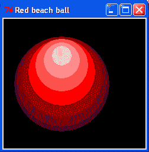
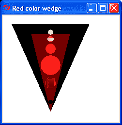
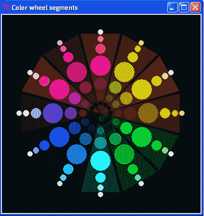
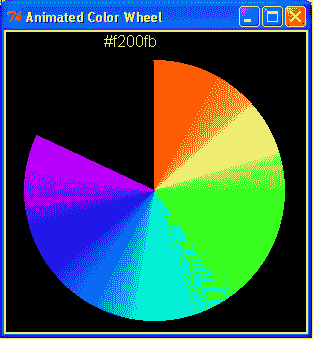
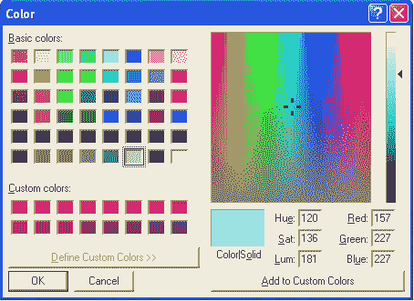
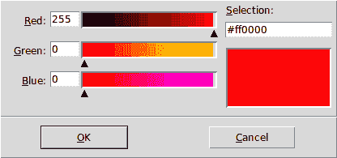

# 第五章。颜色的魔法

在本章中，我们将涵盖：

+   一组有限的命名颜色

+   九种指定颜色的方法

+   变化阴影的红球

+   红色渐变色调楔形

+   艺术家的色轮（牛顿色轮）

+   数值颜色混合匹配色板

+   动画分级色轮

+   Tkinter 自带的颜色混合选择器

# 简介

Tkinter 允许您使用超过 1600 万种颜色。这是红色、绿色和蓝色 256 个级别的总和。有两种主要的方式来指定颜色：通过名称，或作为字符串打包的十六进制值。一个合格的颜色专家可以通过以不同比例混合红色、绿色和蓝色来创建任何可能的颜色。对于构成令人愉悦和有品位的颜色组合，有接受的标准规则和惯例。有时你想要制作阴影混合的颜色，而在其他时候，你只想使用尽可能少的颜色，并且两者的数量都尽可能少。我们将在本章中处理这些问题。

# 一组有限的命名颜色

有许多浪漫命名的颜色，如矢车菊蓝、雾色玫瑰或木瓜冰淇淋。大约有 340 种这些命名颜色可以在 Python 中使用。

颜色获得名称是因为人们最容易通过与一个地方和一个情感情绪的关联来记住它们。记住富有启发性的名称更容易，因此也更容易使用。在这个例子中，我们通过使用系统名称和消除非常相似的颜色，将长长的列表缩减到 140 个。

## 如何做到...

按照与前面章节中所有示例完全相同的方式执行程序。你应该在屏幕上看到的是一个逻辑排列的矩形色卡图表。每个色卡上都会有其可调用的名称。这些是在 Python/Tkinter 程序中可以使用的名称，并且它们将被正确显示。

```py
#systematic_colorNames_1.py
#>>>>>>>>>>>>>>>>>>>>>>>>>>>>>>>>>>>>>>>>>>>>>>
from Tkinter import *
root = Tk()
root.title("Systematically named colors - limited pallette")
cw = 1000 # canvas width
ch = 800 # canvas height
canvas_1 = Canvas(root, width=cw, height=ch, background="black")
canvas_1.grid(row=0, column=1)
whiteColors = "Gainsboro","peach puff","cornsilk",\
"honeydew","aliceblue","misty rose","snow", "snow3","snow4",\
"SlateGray1", "SlateGray3", "SlateGray4",\
"gray", "darkGray","DimGray","DarkSlateGray"
redColors = "Salmon","salmon1","salmon2","salmon3","salmon4",\
"orange red","OrangeRed2","OrangeRed3","OrangeRed4",\
"red","red3","red4",\
"IndianRed1","IndianRed3","IndianRed4",\
"firebrick","firebrick1","firebrick3","firebrick4",\
"sienna","sienna1","sienna3","sienna4"
pinkColors = "Pink","pink3","pink4",\
"hot pink","HotPink3","HotPink4",\
"deep pink","DeepPink3","DeepPink4",\
"PaleVioletRed1","PaleVioletRed2","PaleVioletRed3","PaleVioletRed4",\
"maroon","maroon1","maroon3","maroon4"
magentaColors = "magenta","magenta3","magenta4","DarkMagenta",\
"orchid1","orchid3","orchid4",\
"MediumOrchid3","MediumOrchid4",\
"DarkOrchid","DarkOrchid1","DarkOrchid4",\
"MediumPurple1","MediumPurple3", "MediumPurple4",\
"purple","purple3","purple4"
blueColors = "blue","blue3","blue4",\
"SlateBlue1", "SlateBlue3","SlateBlue4",\
"DodgerBlue2", "DodgerBlue3","DodgerBlue4",\
"deep sky blue","DeepSkyBlue3", "DeepSkyBlue4",\
"sky blue", "SkyBlue3", "SkyBlue4"
cyanColors = "CadetBlue1", "CadetBlue3", "CadetBlue4",\
"pale turquoise", "PaleTurquoise3","PaleTurquoise4",\
"cyan", "cyan3", "cyan4",\
"aquamarine","aquamarine3", "aquamarine4"
greenColors = "green", "green3", "green4","dark green",\
colorssimilar colors, eliminating"chartreuse", "chartreuse3", "chartreuse4",\
"SeaGreen","SeaGreen1", "SeaGreen3",\
"pale green", "PaleGreen3", "PaleGreen4",\
"spring green", "SpringGreen3", "SpringGreen4",\
"olive drab","OliveDrab1", "OliveDrab4",\
"dark olive green","DarkOliveGreen1", "DarkOliveGreen3", \ "DarkOliveGreen4",\
yellowColors= "yellow", "yellow3","yellow4",\
colorsrectangular color swatches chart"gold","gold3","gold4",\
"goldenrod","goldenrod1","goldenrod3","goldenrod4",\
"orange","orange3","orange4",\
"dark orange","DarkOrange1","DarkOrange4"
x_start = 10
y_start = 25
x_width = 118
x_offset = 2
y_height = 30
y_offset = 3
text_offset = 0
text_width = 95
kbk = [x_start, y_start, x_start + x_width, y_start + y_height]
defshowColors(selectedColor):
# Basic columnar color swatch display. All colours laid down in a # vertical stripe.
print "number of colors --> ", len(selectedColor)
for i in range (0,len(selectedColor)):
kula = selectedColor[i]
canvas_1.create_rectangle(kbk, fill=kula)
canvas_1.create_text(kbk[0]+10, kbk[1] , text=kula, \ width=text_width, fill ="black", anchor=NW)
kbk[1] += y_offset + y_height
y0 = kbk[1]
kbk[3] += y_offset + y_height
y1 = kbk[3]
kbk[1] = y_offset + y_height
kbk[3] = y_offset + 2 * y_height
kbk[0] += x_width + 2*x_offset
kbk[2] += x_width + 2*x_offset
return y0,y1
showColors(redColors)
showColors(pinkColors)
showColors(magentaColors)
showColors(cyanColors)
showColors(blueColors)
showColors(greenColors)
showColors(yellowColors)
showColors(whiteColors)
root.mainloop()
#>>>>>>>>>>>>>>>>>>>>>>>>>>>>>>>>>>>>>>>>>>

```

## 它是如何工作的...

这个程序使用了在第二章中开发的技巧，*绘制基本形状*。有八个颜色家族的命名颜色列表，每个家族按照逻辑顺序排列。主要技术是使用一个通用函数，该函数将使用预定义的矩形，并通过`for`循环按顺序遍历颜色名称列表。在循环的每次迭代中，一个矩形被填充为该颜色，并在其上打印颜色名称。

## 更多...

这些颜色是通过试错选择的，以提供适合大多数目的的合理广泛的调色板。在编号的颜色序列中，如红色，其中 red1、red2、red3 和 red4 代表越来越深的阴影，与周围其他颜色非常相似的颜色已被省略。还发现许多颜色是假的，因为它们被涂在画布上作为灰色。 

Tkinter 识别的所有颜色名称的完整集合可以在[`wiki.tcl.tk/16166`](http://wiki.tcl.tk/16166)找到

### 要获得原色的细腻阴影

为了实现颜色组合的微妙阴影和渐变，你需要以受控的量混合计算机屏幕上使用的原色。我们将在下一个配方中开始这个过程。

### 一个更紧凑的颜色列表

在以下颜色列表中，还有一些有用的命名颜色更短的子集：

+   white_Colors = "白色", "柠檬绸", "蜜桃冰沙","矢车菊蓝","风信子", "薄雾玫瑰"

+   blue_Colors = "蓝色","蓝色 4","板岩蓝色 1","闪蓝色","钢蓝色","天蓝色"

+   grey_Colors ="板岩灰色 3", "板岩灰色 4", "浅灰色", "深灰色", "暗灰色", "浅板岩灰色"

+   cyan_Colors = "军蓝 1", "青色", "青色 4", "浅海绿色", "碧绿", "碧绿 3"

+   red_Colors = "浅粉色","印度红 1","红色","红色 2","红色 3","红色 4"

+   pink_Colors = "浅粉色","深粉色","热粉色","HotPink3","浅粉色","浅粉色 2"

+   magenta_Colors = "淡紫罗兰红 1", "栗色", "栗色 1", "洋红色","洋红色 4", "兰花 1"

+   purple_Colors = "紫色", "紫色 4", "中紫色 1", "李子 2", "中兰花", "深兰花"

+   brown_Colors = "橙色", "深橙色 1", "深橙色 2", "深橙色 3", "深橙色 4", "马鞍棕色"

+   green_Colors = "绿色", "绿色 3", "绿色 4","黄绿色","绿黄色", "春绿色 2"

+   yellow_Colors= "浅黄色", "黄色", "黄色 3","金色", "金罗盘 1", "卡其色"

如果你将这些列表剪切并粘贴到`systematic_colorNames_1.py`中替换之前的列表，你将拥有一个更小、更容易管理的 55 色调板，你可能发现它更容易使用。

# 指定颜色的九种方式

通过这个配方，我们可以看到 Tkinter 识别的所有有效颜色指定的示例。基本上，Tkinter 有两种指定颜色的方法，但总共有九种表达这些颜色的方式。感谢 Python 的设计者，系统非常灵活，可以接受所有这些而不抱怨。

## 如何做到这一点...

以与第二章中所有示例完全相同的方式执行程序，*绘制基本形状*，你将看到三个填充红色的圆盘和四个填充蓝色的圆盘。每个圆盘的指定方式都不同。

```py
# color_arithmetic_1.py
#>>>>>>>>>>>>>>>>>>>>>>>>>>>>>>>>>>>>>>>>>>
from Tkinter import *
root = Tk()
root.title('Ways of Specifying Color')
cw = 270 # canvas width
ch = 80 # canvas height
canvas_1 = Canvas(root, width=cw, height=ch, background="white")
canvas_1.grid(row=0, column=1)
# specify bottom-left and top-right as a set of four numbers named # 'xy'
named_color_1 = "light blue" # ok
named_color_2 = "lightblue" # ok
named_color_3 = "LightBlue" # ok
named_color_4 = "Light Blue" # ok
named_color_5 = "Light Blue" # Name error - not ok: Tcl Error, # unknown color name
rgb_color = "rgb(255,0,0)" # Unknown color name.
#rgb_percent_color = rgb(100%, 0%, 0%) # Invalid syntax
rgb_hex_1 = "#ff0000" # ok - 16.7 million colors
rgb_hex_2 = "#f00" # ok
rgb_hex_3 = "#ffff00000000" # ok - a ridiculous number
tk_rgb = "#%02x%02x%02x" % (128, 192, 200)
printtk_rgb
y1, width, height = 20,20,20
canvas_1.create_oval(10,y1,10+width,y1+height, fill= rgb_hex_1)
canvas_1.create_oval(30,y1,30+width,y1+height, fill= rgb_hex_2)
canvas_1.create_oval(50,y1,50+width,y1+height, fill= rgb_hex_3)
canvas_1.create_oval(70,y1,70+width,y1+height, fill= tk_rgb)
y1 = 40
canvas_1.create_oval(10,y1,10+width,y1+height, fill= named_color_1)
canvas_1.create_oval(30,y1,30+width,y1+height, fill= named_color_2)
canvas_1.create_oval(50,y1,50+width,y1+height, fill= named_color_3)
canvas_1.create_oval(70,y1,70+width,y1+height, fill= named_color_4)
root.mainloop()#>>>>>>>>>>>>>>>>>>>>>>>>>>>>>>>>>>>>>>>>>

```

## 它是如何工作的...

Tkinter 在 Tkinter 模块库的某个地方定义了不同的名称字符串。

## 将颜色元组转换为 Tkinter 兼容的十六进制指定符

一些其他语言将颜色指定为红色、绿色和蓝色的数值混合，每个波段的范围从 0 到 255，作为一个元组。例如，纯红色将是(255,0,0)，纯绿色将是(0,255,0)，蓝色将是(0,0,255)。大量红色与中等绿色和一点蓝色混合可以是(230, 122, 20)。这些元组 Tkinter 不识别，但以下 Python 代码行将任何 color_tuple 转换为 Tkinter 可识别并用作颜色的十六进制数：

`Tkinter_hex_color = '#%02x%02x%02x' % color_tuple`,

其中 `color_tuple = (230, 122, 20)` 或我们选择的任何数字组合。

# 一个色调各异的红色沙滩球

我们使用十六进制颜色规范方案，根据预定义的数值常量列表排列一系列颜色深浅。其基本思想是建立一种方法，以便以可重用的方式访问这些常数，用于相当不同的图片设计。

## 如何做到这一点...

按照通常的方式执行显示的程序，你会看到一系列从深到浅的彩色圆盘叠加在一起。每个圆盘的大小和位置由列表 `hFac` 和 `wFac` 决定。`hFac` 是 "高度因子" 的缩写，`wFac` 是 "宽度因子"。以下截图显示了分级色彩球。



```py
# red_beach_ball_1.py
# >>>>>>>>>>>>>>>>>
from Tkinter import *
root = Tk()
root.title("Red beach ball")
cw = 240 # canvas width
ch = 220 # canvas height
chart_1 = Canvas(root, width=cw, height=ch, background="black")
chart_1.grid(row=0, column=0)
x_orig = 100
y_orig = 200
x_width = 80
y_hite = 180
xy0 = [x_orig, y_orig]
hexadecimal color specification schemecolor shades series, preparingxy1 = [x_orig - x_width, y_orig - y_hite]
xy2 = [x_orig + x_width, y_orig - y_hite ]
wedge =[ xy0, xy1 , xy2 ]
width= 80 # Standard disk diameter
hite = 80 # Median distance from origin (x_orig, y_orig).
hFac = [1.1, 1.15, 1.25, 1.35, 1.5, 1.6, 1.7] # Height # radial factors.
wFac = [ 2.0, 1.9, 1.7, 1.4, 1.1, 0.75, 0.40] # Disk # diameter factors.
# Color list. Elements incresing in darkness.
kulaRed = ["#500000","#6e0000","#a00000","#ff0000",\
"#ff5050", "#ff8c8c", "#ffc8c8", "#ffffff" ]
kula = kulaRed
for i in range(0, 7): # Red disks
x0_disk = xy0[0] - width * wFac[i]/2 # Bottom left
y0_disk = xy0[1] - hite * hFac[i] + width * wFac[i]/2
xya = [x0_disk, y0_disk] # BOTTOM LEFT
x1_disk = xy0[0] + width * wFac[i]/2 # Top right
y1_disk = xy0[1] - hite * hFac[i] - width * wFac[i]/2
xyb = [x1_disk, y1_disk] # TOP RIGHT
chart_1.create_oval(xya ,xyb , fill=kula[i], outline=kula[i])
root.mainloop()

```

## 它是如何工作的...

通过一个循环，将不同深浅的红盘图像按特定顺序排列。匹配的红色深浅保存在按顺序排列的十六进制颜色列表中。`Hex` 是十六进制的简称。

用于指定参考原点以及所有其他位置参数的变量已经设置好，以便以后在其他模式中重用。这里的重要原则是，通过我们编程的精心规划，我们只需要以通用、专为重用设计的方案解决一个问题。当然，在实践中，这种计划设计需要更多时间，包括大量的实验，比简单的单次编写代码的方式要复杂得多。无论如何，整个实验过程都是从编写混乱、粗糙且能勉强工作的代码开始的。这种初步的粗糙工作是创造性过程中的一个非常重要的部分，因为它允许模糊形成的思想成长和演变成为有效的软件程序。

## 还有更多...

在确定了在选择的几何排列中绘制阴影圆盘的方案后，我们现在可以尝试不同的排列，并最终得到更丰富、更有用的想法。接下来的两个配方将这一想法发展成艺术家色彩轮的一个版本，展示了如何通过控制混合原色来达到任何颜色。

# 一个按色调分级的红色色楔

我们创建一个楔形段来形成一个逻辑模式，该模式可以融入一个轮状排列，用以展示不同颜色之间的关系。

## 如何做到这一点...

在前面的配方中使用的代码结构在此处被重用。当你执行以下代码时，你会看到一排整齐的彩色圆盘被叠加在一个深色阴影的三角形楔形上，从深红色到浅红色。以下截图显示了分级色彩楔形。



```py
# red_color_segment_1.py
#>>>>>>>>>>>>>>>>>>>
from Tkinter import *
root = Tk()
root.title("Red color wedge")
cw = 240 # canvas width
ch = 220 # canvas height
chart_1 = Canvas(root, width=cw, height=ch, background="white")
chart_1.grid(row=0, column=0)
theta_deg = 0.0
x_orig = 100
y_orig = 200
x_width = 80
y_hite = 180
xy0 = [x_orig, y_orig]
wedge-shaped segmentcreatingxy1 = [x_orig - x_width, y_orig - y_hite]
xy2 = [x_orig + x_width, y_orig - y_hite ]
wedge =[ xy0, xy1 , xy2 ]
width= 40 #standard disk diameter
hite = 80 # median wedge height.
hFac = [0.25, 0.45, 0.75, 1.2, 1.63, 1.87, 2.05] # Radial # factors
wFac = [ 0.2, 0.36, 0.6, 1.0, 0.5, 0.3, 0.25] # disk # diameter factors
# Color list. Elements increasing in darkness.
kulaRed = ["#000000","#6e0000","#a00000","#ff0000",\
"#ff5050", "#ff8c8c", "#ffc8c8", \ "#440000" ]
kula = kulaRed
wedge =[ xy0, xy1 , xy2 ] # black background
chart_1.create_polygon(wedge,fill=kula[0])
x_width = 40 # dark red wedge
y_hite = 160
xy1 = [x_orig - x_width, y_orig - y_hite]
xy2 = [x_orig + x_width, y_orig - y_hite ]
wedge =[ xy0, xy1 , xy2 ]
chart_1.create_polygon(wedge,fill=kula[1])
for i in range(0, 7): # red disks
x0_disk = xy0[0] - width * wFac[i]/2 # bottom left
y0_disk = xy0[1] - hite * hFac[i] + width * wFac[i]/2
xya = [x0_disk, y0_disk] # BOTTOM LEFT
x1_disk = xy0[0] + width * wFac[i]/2 # top right
y1_disk = xy0[1] - hite * hFac[i] - width * wFac[i]/2
xyb = [x1_disk, y1_disk] #TOP RIGHT
chart_1.create_oval(xya ,xyb , fill=kula[i], outline=kula[i])
root.mainloop()

```

## 它是如何工作的...

通过调整列表 `hFac` 和 `wFac` 中的数值，我们将彩色圆盘排列在背景楔形区域内，这个楔形区域恰好是形成圆形十二分之一切片的正确形状。

## 还有更多...

我们对颜色列表的命名和重新命名方式**kula**似乎有些冗余，因此可能有些令人困惑。然而，这种看似疯狂的方法是，如果我们同时使用许多其他颜色列表，那么重用现有方法就会变得简单得多。

# 牛顿的色彩混合大轮

我们制作了一个艺术家色彩轮的版本，展示了如何通过巧妙地混合红色、绿色和蓝色三种原色，获得任何已知颜色和色调。

## 如何做...

我们制作了一套十二种颜色的列表。每个列表代表当你混合它两侧的颜色时产生的颜色，除了红色、绿色和蓝色这三种原色。代码中的另一个关键添加是函数 `rotate(xya, xyb, theta_deg_incr)`，它用于将颜色楔形图案旋转到新的选择位置，围绕中心点。由于使用了三角函数进行旋转，因此需要在代码顶部导入数学模块。每个部分都构成了完整颜色变化圆的一部分。以下截图显示了艾萨克·牛顿的色彩轮版本。



```py
# primary_color_wheel_1.py
#>>>>>>>>>>>>>>>>>>>>>
from Tkinter import *
import math
root = Tk()
root.title("Color wheel segments")
cw = 400 # canvas width
ch = 400 # canvas height
chart_1 = Canvas(root, width=cw, height=ch, background="black")
chart_1.grid(row=0, column=0)
theta_deg = 0.0
color mixingx_orig = 200
y_orig = 200
x_width = 40
y_hite = 160
xy0 = [x_orig, y_orig]
xy1 = [x_orig - x_width, y_orig - y_hite]
xy2 = [x_orig + x_width, y_orig - y_hite ]
wedge =[ xy0, xy1 , xy2 ]
width= 40 #standard disk diameter
hite = 80 # median wedge height.
hFac = [0.25, 0.45, 0.75, 1.2, 1.63, 1.87, 2.05] # Radial # factors
wFac = [ 0.2, 0.36, 0.6, 1.0, 0.5, 0.3, 0.25] # disk # diameter factors
x_DiskRot = [1.0, 1.0, 1.0, 1.0, 1.0, 1.0, 1.0] # rotational coordinates
y_DiskRot = [1.0, 1.0, 1.0, 1.0, 1.0, 1.0, 1.0]
#RED
kulaRed = ["#000000", "#6e0000", "#a00000", "#ff0000",\
"#ff5050", "#ff8c8c", "#ffc8c8", \ "#440000" ]
# Khaki
kulaRRedGreen = ["#000000", "#606000", "#8f9f00", "#b3b300",\
"#d6d600", "#dbdb30", \ "#dbdb77", "#3e2700" ]
# Yellow
kulaRedGreen = ["#000000", "#6e6e00", "#a0a000", "#ffff00",\
"#ffff50", "#ffff8c", \ "#ffffc8", "#444400" ]
# Orange
kulaRedGGreen = ["#000000", "#493100", "#692f00", "#a25d00",\
"#ff8300", "#ffa55a", \ "#ffb681", "#303030" ]
# Green
kulaGreen = ["#000000", "#006e00", "#00a000", "#00ff00",\
"#50ff50", "#8cff8c", "#c8ffc8", \ "#004400" ]
# Dark green
kulaGGreenBlue = ["#000000", "#003227", "#009358", "#00a141",\
"#00ff76", "#72ff99", \ "#acffbf", "#003a1d" ]
# Cyan
kulaGreenBlue = ["#000000", "#006e6e", "#00a0a0", "#00ffff",\
"#50ffff", "#8cffff", \ "#c8ffff", "#004444" ]
# Steel Blue
kulaGreenBBlue = ["#000000", "#002c46", "#00639c", "#008cc8",\
"#00b6ff", "#7bb6ff", \ "#addfff", "#001a27" ]
# Blue
kulaBlue = ["#000000", "#00006e", "#0000a0", "#0000ff",\
"#5050ff", "#8c8cff", "#c8c8ff", \ "#000044" ]
# Purple
kulaBBlueRed = ["#000000", "#470047", "#6c00a2", "#8f00ff",\
"#b380ff", "#d8b3ff", "#f1deff", \ "#200031" ]
# Crimson
kulaBlueRed = ["#000000", "#6e006e", "#a000a0", "#ff00ff",\
"#ff50ff", "#ff8cff", "#ffc8ff", \ "#440044" ]
# Magenta
kulaBlueRRed = ["#000000", "#380023", "#80005a", "#b8007b",\
"#ff00a1", "#ff64c5", "#ff89ea", \ "#2e0018" ]
# ROTATE
def rotate(xya, xyb, theta_deg_incr): #xya, xyb are 2 component # points
# General purpose point rotation function
theta_rad = math.radians(theta_deg_incr)
a_radian = math.atan2( (xyb[1] - xya[1]) , (xyb[0] - xya[0]) )
a_length = math.sqrt( (xyb[1] - xya[1])**2 + (xyb[0] - xya[0])**2)
theta_rad += a_radian
theta_deg = math.degrees(theta_rad)
new_x = a_length * math.cos(theta_rad)
new_y = a_length * math.sin(theta_rad)
return new_x, new_y, theta_deg # theta_deg = post # rotation angle
# GENL. SEGMENT BACKGROUND FUNCTION
defsegmentBackground(kula, angle, xy1, xy2):
xy_new1 = rotate(xy0, xy1, angle) # rotate xy1
xy1 =[ xy_new1[0] + xy0[0], xy_new1[1] + xy0[1] ]
xy_new2 = rotate(xy0, xy2, angle) # rotate xy2
xy2 =[ xy_new2[0] + xy0[0], xy_new2[1] + xy0[1] ]
wedge =[ xy0, xy1 , xy2 ]
chart_1.create_polygon(wedge,fill=kula[7])
# GENL. COLOR DISKS FUNCTION
defcolorDisks( kula, angle):
global hite, width, hFac, wFac
for i in range(0, 7): # green segment disks
xya = [xy0[0], xy0[1] - hite * hFac[i] ] # position of point for # rotation
xy_new1 = rotate(xy0, xya, angle) # rotate xya
# NEW CIRCLE CENTERS AFTER ROTATION OF CENTERLINE
x0_disk = xy_new1[0] + xy0[0] - width*wFac[i]/2
y0_disk = xy_new1[1] + xy0[1] + width * wFac[i]/2
xya = [x0_disk, y0_disk] # BOTTOM LEFT
x1_disk = xy_new1[0] + xy0[0] + width*wFac[i]/2
y1_disk = xy_new1[1] + xy0[1] - width * wFac[i]/2
xyb = [x1_disk, y1_disk] #TOP RIGHT
chart_1.create_oval(xya ,xyb , fill=kula[i], outline=kula[i])
for i in range(0,12):
if i==0:
angle = 0.0
kula = kulaRed
if i==1:
angle = 30.0
kula = kulaRRedGreen
if i==2:
angle = 60.0
kula = kulaRedGreen
if i==3:
angle = 90.0
kula = kulaRedGGreen
if i==4:
angle = 120.0
kula = kulaGreen
if i==5:
angle = 150.0
kula = kulaGGreenBlue
if i==6:
angle = 180.0
kula = kulaGreenBlue
if i==7:
angle = 210.0
kula = kulaGreenBBlue
if i==8:
angle = 240.0
kula = kulaBlue
if i==9:
angle = 270.0
kula = kulaBBlueRed
if i==10:
angle = 300.0
kula = kulaBlueRed
if i==11:
angle = 330.0
kula = kulaBlueRRed
if i==12:
angle = 360.0
kula = kulaBlueRRed
segmentBackground( kula, angle, xy1, xy2)
colorDisks( kula, angle)
root.mainloop()

```

## 它是如何工作的...

对于轮盘上的每个颜色部分，列表中都包含了一系列的阴影十六进制颜色值。要混合出需要所有三种原色部分的颜色，所需的红色、绿色和蓝色的确切比例并不是一件简单的事情。一般来说，为了使颜色变亮，我们需要添加一些不属于目标颜色的额外颜色。例如，如果我们想要浅黄色，我们需要等量的红色和绿色。但要使黄色更浅，我们需要添加一些蓝色。为了使黄色变暗，我们确保没有蓝色，并组合较小但相等的红色和蓝色比例。

## 还有更多...

混合颜色既是艺术也是科学。精明的颜色混合需要实践和实验。对人类大脑来说，数值上混合颜色并不自然。我们需要一些视觉-数值-计算工具来帮助我们混合颜色。但数学必须是隐形的。它不能阻碍艺术家。我们希望有原色管和调色板来混合它们。我们的调色板必须自动显示代表我们混合颜色的数值，这样我们就可以记录并将它们纳入 Python 代码中。如果我们的调色板可以放在现有图片的顶部或旁边，以便我们可以匹配图片中的现有颜色，那会是一件好事吗？嗯，下一个菜谱试图实现这个愿望。

# 数值颜色混合匹配调色板

我们制作了一个小部件，可以轻松混合红色、绿色和蓝色三种基色的任何比例。混合后的颜色会显示在一个大色卡上，可以拖动到显示屏幕的任何位置。色卡位于小部件的边缘，中间颜色最少。我们可以将色卡放置在我们想要匹配的图片中的任何颜色旁边，并使用直观的滑动控件调整混合颜色。

## 如何操作...

为了制作这个混合工具，我们在正式介绍它们之前的两章中使用了 Tkinter 滑动控件。在这个阶段，您只需复制并使用代码，无需了解它们的工作细节，知道它们将在第七章中解释。

以下截图显示了一个颜色混合调色板。

.jpg)

```py
# color_mixer_1.py
#>>>>>>>>>>>>>>>>>>>>>>>>>>>>>>>>>>>>>>>>>>>>
from Tkinter import *
root = Tk()
root.title("Color mixer in Hex and Integer")
canvas_1 = Canvas(root, width=320, height=400, background="white")
canvas_1.grid(row=0, column=1)
slide_value_red = IntVar() # variables used by slider controls
slide_value_green = IntVar()
slide_value_blue = IntVar()
fnt = 'Bookantiqua 14 bold'
combined_hex = '000000'
red_hex = '00'
green_hex = '00'
blue_hex = '00'
red_int = 0
green_int = 0
blue_int = 0
red_text = 0
green_text = 0
blue_text = 0
# red display
canvas_1.create_rectangle( 20, 30, 80, 110)
canvas_1.create_text(20,10, text="Red", width=60, font=fnt,\
anchor=NW, fill='red' )
# green display
canvas_1.create_rectangle( 100, 30, 160, 110)
canvas_1.create_text(100,10, text="Green", width=60, font=fnt,\
anchor=NW, fill='green' )
# blue display
canvas_1.create_rectangle( 180, 30, 240, 110)
canvas_1.create_text(180,10, text="Blue", width=60, font=fnt,\
anchor=NW, fill='blue' )
# Labels
canvas_1.create_text(250,30, text="integer 256", width=60, anchor=NW )
canvas_1.create_text(250,60, text="% of 256", width=60, anchor=NW )
canvas_1.create_text(250,86, text="hex", width=60, anchor=NW )
# combined display
fnt = 'Bookantiqua 12 bold'
canvas_1.create_rectangle( 20, 170, 220, 220 )
canvas_1.create_text(20,130, text="Combined colors", width=200, font=fnt,\
anchor=NW, fill='black' )
canvas_1.create_text(20,150, text="Hexadecimal red-green-blue", width=300,
font=fnt,anchor=NW, fill='black' )
# callback functions to service slider changes
#=============================================
defcodeShorten(slide_value, x0, y0, width, height, kula):
# This allows the callback functions to be reduced in length.
global combined_hex, red_int, green_int, blue_int
fnt = 'Bookantiqua 12 bold'
slide_txt = str(slide_value)
slide_int = int(slide_value)
slide_hex = hex(slide_int)
slide_percent = slide_int * 100 / 256
canvas_1.create_rectangle(x0, y0, x0 + width, y0 + height, \ fill='white')
canvas_1.create_text(x0+6, y0+6, text=slide_txt, width=width, \ font=fnt,\
anchor=NW, fill=kula )
canvas_1.create_text(x0+6, y0+28, text=slide_percent, \ width=width,\
font=fnt, anchor=NW, fill=kula)
canvas_1.create_text(x0+6, y0+50, text=slide_hex, width=width,\
font=fnt, anchor=NW, fill=kula)
return slide_int
defcallback_red(*args): # red slider event handler
global red_int
kula = "red"
jimmy = str(slide_value_red.get())
red_int = codeShorten(jimmy, 20, 30, 60, 80, kula)
update_display(red_int, green_int, blue_int)
defcallback_green(*args): # green slider event handler
global green_int
kula = "darkgreen"
jimmy = str(slide_value_green.get())
green_int = codeShorten(jimmy, 100, 30, 60, 80, kula)
update_display(red_int, green_int, blue_int)
defcallback_blue(*args): # blue slider event handler
global blue_int
kula = "blue"
jimmy = str(slide_value_blue.get())
blue_int = codeShorten(jimmy, 180, 30, 60, 80, kula)
update_display(red_int, green_int, blue_int)
defupdate_display(red_int, green_int, blue_int):
# Refresh the swatch and nymerical display.
combined_int = (red_int, green_int, blue_int)
combined_hex = '#%02x%02x%02x' % combined_int
canvas_1.create_rectangle( 20, 170, 220 , 220, fill='white')
canvas_1.create_text(26, 170, text=combined_hex, width=200,\
anchor=NW, font='Bookantiqua 16 bold')
canvas_1.create_rectangle( 0, 400, 300, 230, fill=combined_hex)
slide_value_red.trace_variable("w", callback_red)
slide_value_green.trace_variable("w", callback_green)
slide_value_blue.trace_variable("w", callback_blue)
slider_red = Scale(root, # red slider specification # parameters.
length = 400,
fg = 'red',
activebackground = "tomato",
background = "grey",
troughcolor = "red",
label = "RED",
from_ = 0,
to = 255,
resolution = 1,
variable = slide_value_red,
orient = 'vertical')
slider_red.grid(row=0, column=2)
slider_green =Scale(root, # green slider specification # parameters.
length = 400,
fg = 'dark green',
activebackground = "green yellow",
background = "grey",
troughcolor = "green",
label = "GREEN",
from_ = 0,
to = 255,
resolution = 1,
variable = slide_value_green,
orient = 'vertical')
slider_green.grid(row=0, column=3)
slider_blue = Scale(root, # blue slider specification # parameters.
length = 400,
fg = 'blue',
activebackground = "turquoise",
background = "grey",
troughcolor = "blue",
label = "BLUE",
from_ = 0,
to = 255,
resolution = 1,
variable = slide_value_blue,
orient = 'vertical')
slider_blue.grid(row=0, column=4)
root.mainloop()

```

## 它是如何工作的...

红色、绿色和蓝色颜色值从零（完全没有颜色）到 255（完全饱和的基色）通过一个滑动控件的位置来设置，这个控件的使用非常直观。每次移动滑动条时，三个滑动条的所有值都会组合并图形化地显示在色卡上，同时以数值形式显示。没有比用 0 到 255 的整数值、十六进制值和纯色或混合色表示的基色成分之间的关系更好的解释方式了。

## 更多内容...

此小部件将色卡放置在底部的左上角边缘，以便您可以将其拖动到屏幕下方的图片区域的附近，以便能够直观地匹配颜色并读取其十六进制值。还有一个单独的窗口，里面充满了颜色，可以在屏幕上自由移动。如果您想要匹配图像中某个部分的颜色，可以将此色卡放置在图像中感兴趣的区域旁边，并移动滑动条，直到达到满意的匹配，然后记录下十六进制值。

### 有其他工具可以用来选择颜色

本章的最后一个示例演示了在 Python 模块中构建的颜色混合器。

### 有没有办法制作更整洁的滑动控制器？

使用滑动控件作为输入数字的图形方法，有时会不方便。为什么我们不能让我们的数字控制器成为画布内的一种绘制对象呢？我们能否使滑动控制器更小、更整洁、不那么显眼？答案是肯定的，我们在第七章中探讨了这一想法，

# 动态分级色轮

我们绘制了一个艺术家颜色混合轮的平滑分级版本，并对其进行了动画处理，以便观众可以观察当绘制混合颜色光谱时`rgb`十六进制颜色值的变化。

## 如何操作...

按照您之前的方式复制、保存并运行此示例，并观察光谱如何以数字和色彩的方式展开。以下截图显示了一个分级色轮。



```py
#animated_color_wheel_1.py
# >>>>>>>>>>>>>>>>>>>>>>>
from Tkinter import *
root = Tk()
root.title("Animated Color Wheel")
cw = 300 # canvas width
ch = 300 # canvas height
canvas_1 = Canvas(root, width=cw, height=ch, background="black")
canvas_1.grid(row=0, column=1)
cycle_period = 200
redFl = 255.0
greenFl = 0
blueFl = 0
kula = "#000000"
arcStart = 89
arcEnd = 90
xCentr = 150
yCentr = 160
radius = 130
circ = xCentr - radius, yCentr + radius, xCentr + radius, yCentr - \ radius
# angular position markers, degrees
A_ANG = 0
B_ANG = 60
C_ANG = 120
D_ANG = 180
E_ANG = 240
F_ANG = 300
#G_ANG = 1
G_ANG = 359
intervals = 60 # degrees
# Percent color at each position marker
# index 0 1 2 3 4 5 6 7
redShift = 100, 100, 0, 0, 0, 100, 100 # percent of red
greenShift = 0, 100, 100, 100, 0, 0, 0 # percent of green
blueShift = 0, 0, 0, 100, 100, 100, 0 # percent of blue
# Rate of change of color per degree, rgb integer counts per degree.
red_rate = [0,1,2,3,4,5,6,7]
green_rate = [0,1,2,3,4,5,6,7]
blue_rate = [0,1,2,3,4,5,6,7]
# Calibrate counts-per-degree in each interval, place in xrate list
for i in range(0,6):
red_rate[i] = 256.0 * (redShift[i+1] - redShift[i])/(100 * \ intervals)
green_rate[i] = 256.0 * (greenShift[i+1] - greenShift[i])/(100 * \ intervals)
blue_rate[i] = 256.0 * (blueShift[i+1] - blueShift[i])/(100 * \ intervals)
def rgb2hex(redFl, greenFl, blueFl):
# Convert integer to hex color.
red = int(redFl)
green = int(greenFl)
blue = int(blueFl)
rgb = red, green, blue
return '#%02x%02x%02x' % rgb
for i in range (0, 359):
canvas_1.create_arc(circ, start=arcStart, extent=arcStart - arcEnd,\
fill= kula, outline= kula)
arcStart = arcEnd
arcEnd -=1
# Color component transitions in 60 degree sectors
if i>A_ANG and i<B_ANG:
redFl += red_rate[0]
greenFl += green_rate[0]
blueFl += blue_rate[0]
kula = rgb2hex(redFl, greenFl, blueFl)
if i>B_ANG and i<C_ANG:
redFl += red_rate[1]
greenFl += green_rate[1]
blueFl += blue_rate[1]
kula = rgb2hex(redFl, greenFl, blueFl)
if i>C_ANG and i<D_ANG:
redFl += red_rate[2]
greenFl += green_rate[2]
blueFl += blue_rate[2]
kula = rgb2hex(redFl, greenFl, blueFl)
if i>D_ANG and i<E_ANG:
redFl += red_rate[3]
greenFl += green_rate[3]
blueFl += blue_rate[3]
kula = rgb2hex(redFl, greenFl, blueFl)
if i>E_ANG and i<F_ANG:
redFl += red_rate[4]
greenFl += green_rate[4]
blueFl += blue_rate[4]
kula = rgb2hex(redFl, greenFl, blueFl)
if i>F_ANG and i<G_ANG:
redFl += red_rate[5]
greenFl += green_rate[5]
blueFl += blue_rate[5]
kula = rgb2hex(redFl, greenFl, blueFl)
#kula = rgb2hex(redFl, greenFl, blueFl)
canvas_1.create_text(100, 20, text=kula, fill='white', \ width=200,\
font='SansSerif 12 ', tag= 'degreesAround', anchor= SW)
canvas_1.update() # This refreshes the # drawing on the canvas.
canvas_1.after(cycle_period) # This makes execution pause for # 200 milliseconds.
canvas_1.delete('degreesAround') # This erases the # changing text
root.mainloop()

```

## 它是如何工作的...

这里使用的编码思想相对简单。本质上，我们让执行代码通过绘制从 0 到 358 度的彩色弧的过程来完成。在扇形的每一小块中，根据线性增加或减少的斜坡值`redFL`、`greenfly`和`blueFL`（以每度计数）的计算，添加红色、绿色和蓝色成分。斜坡意味着从 0 逐渐增加到 100%的值。斜坡值由过渡点（A_ANG、`B_ANG`等）控制，这些过渡点在彩色圆盘边缘以 60 度间隔均匀分布。

`rgb2hex(red, green, blue)`函数将红色、绿色和蓝色的浮点值转换为 Tkinter 解释为颜色的十六进制数形式。为了方便观众理解，这个数字显示在画布的顶部。

# Tkinter 自带的颜色选择器-混合器

Tkinter 有一个自己非常简单易用的颜色选择工具。

四行代码就能得到一个既优雅又实用的工具。

## 如何做...

按照您之前处理程序的方式复制、保存并运行此示例。以下截图显示了 Tkinter 的颜色选择器（MS Windows XP）。



以下截图显示了 Tkinter 的颜色选择器（Linux Ubuntu 9.10）。



```py
# color_picker_1 .py
#>>>>>>>>>>>>>>>
from Tkinter import *
from tkColorChooser import askcolor
askcolor()
mainloop()

```

## 它是如何工作的...

这个工具非常简单易用，您可能会问为什么我们还要在数值颜色混合匹配调色板示例中展示更繁琐的版本。有两个原因。首先，我们可以看到如何在 Python 代码中操作颜色。其次，您可以移动到图片上方的独立样本窗口可能很有用。

## 更多...

颜色混合、命名法和有品位的颜色组合的主题非常广泛且有趣。网络提供了一些非常优雅地解释这种艺术和科学的优秀网站。

这里是一些解释这些想法非常好的网页精选。

+   [`www.1728.com/colors.htm:`](http://www.1728.com/colors.htm) 显示了超过 400 种可由 html 识别的命名颜色样本及其十六进制等效值，按字母顺序排列。显示的颜色样本较大，以便您可以看到相似颜色之间的细微差别。

+   [`aggie-horticulture.tamu.edu/floriculture/container-garden/lesson/colorwheel.html:`](http://aggie-horticulture.tamu.edu/floriculture/container-garden/lesson/colorwheel.html) 使用花店使用的颜色名称的花色轮。

+   [`realcolorwheel.com/tubecolors.htm:`](http://realcolorwheel.com/tubecolors.htm) 艺术家的色轮，其中颜色与艺术家从艺术用品店购买的管状颜料名称相匹配。

+   [`www.colormatters.com/colortheory.html:`](http://www.colormatters.com/colortheory.html) 精美简化的色彩搭配实践，拥有丰富的参考资料和补充信息。这里包含大量的插图和示例。

+   [`en.wikipedia.org/wiki/Web_colors`](http://en.wikipedia.org/wiki/Web_colors)

+   维基百科中关于“网络颜色”的文章。

+   [`colorschemedesigner.com/:`](http://colorschemedesigner.com/) 这个网站是关于色彩艺术和科学的最为宏伟和完整的论文。它应有尽有。在这里使用工具玩上 15 分钟，你将学会关于色彩混合以及如何优雅地搭配色彩所需了解的几乎所有内容。这个网站是最佳中的最佳。
