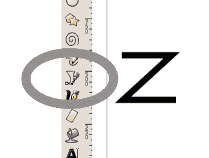
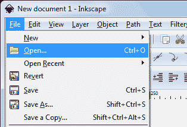
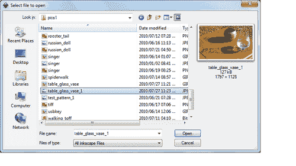
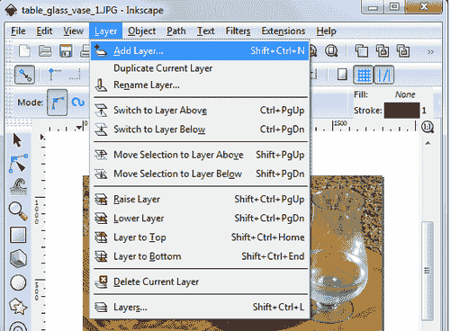
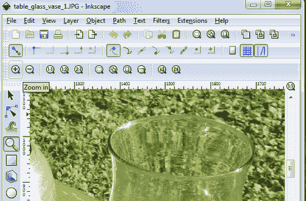
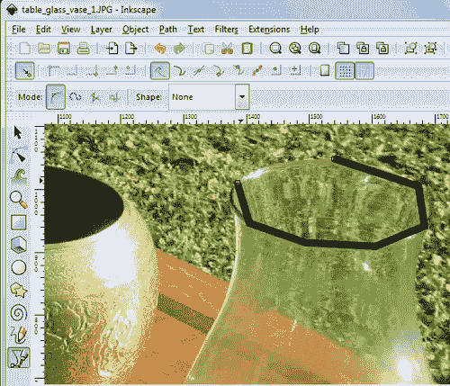
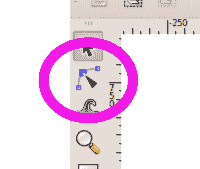
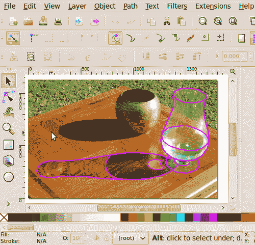
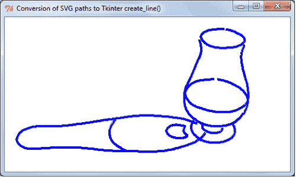

# 第九章。交换 Inkscape SVG 绘图与 Tkinter 形状

在本章中，我们将涵盖：

+   Inkscape 作为获取 Tkinter 线形状（路径）的工具

+   寻找和安装 Inkscape

+   哪里可以找到 SVG 裁剪艺术

+   从矢量图像中获取 Tkinter 路径

+   将 SVG 图像中的路径数据转换为其他格式

+   使用 Inkscape 作为 Tkinter 路径的图形工具

# 简介

在本章中，我们探讨将图形形状数据引入 Tkinter 程序的替代方法和手段。最普遍的矢量图形格式是为网页设计的，这被称为 **SVG**，即 **缩放矢量图形** 的缩写。它是世界 Wide Web 联盟定义的官方标准规范，自 1999 年以来一直存在。

我们对 SVG 的兴趣源于它在 Python 中使用 Tkinter 模块创建绘制形状的实用价值。

像 Inkscape 这样的专业矢量绘图软件包和一些专有绘图软件包，通过一些 Python 代码的帮助，使我们能够获取可以直接用于 Tkinter 的 `create_line(x0,y0 …)` 函数中的坐标列表。

网上可用的无版权 SVG 图片库正在不断增长。借助像 Inkscape 这样的工具，我们可以拆解现有图像，并使用其部分内容用于我们的图形工作和 Python 程序。其中一个这样的网站是 [www.openclipart.org/](http://www.openclipart.org/)，它允许并鼓励任何人复制存储在该网站上的数千个 SVG 格式的图像。

SVG 绘图以多种方式编码线条。一种方式是将线条表示为画布上的 x-y 坐标点序列。每个点被定义为相对于画布零位置的数字对，该位置是西北角（右上角）。第二种方式是将每个点表示为相对于前一点的相对位移。

# SVG 绘图的架构

我们将研究 Inkscape 如何编码绘图，以便我们可以在 Python 中对其进行解释以供使用。我们将要做的是：

1.  在 Inkscape 中绘制一些简单的对象，并将它们保存为“Plain SVG”格式的文件。

1.  然后我们在文本编辑器中打开文件，检查内容，以便我们能够识别出我们感兴趣的行。

1.  最后，我们将编写代码将感兴趣的 SVG 线转换为 Tkinter 列表，我们可以在我们的 Python 程序中直接使用。

## 准备工作

我们现在需要做的第一件事是获取并安装 Inkscape 到我们的计算机上。我们可以在 [www.inkscape.org/download/](http://www.inkscape.org/download/) 找到它，那里有适用于 Linux 和 Microsoft Windows 的版本。

Inkscape 的在线文档和教程非常出色。然而，我们希望使用最少的 Inkscape，所以这个配方就是提供一些基本指导，以完成最小任务。

## 如何操作...

在 Inkscape 中我们需要使用的唯一工具是下面的截图所示的线条绘制笔。我们使用这个工具绘制了一个“Z”形状，并将文件保存为 `z_inkscape.svg`。

产生的代码，在文本编辑器中显示，如下截图所示：



```py
<?xml version="1.0" encoding="UTF-8" standalone="no"?>
<!-- Created with Inkscape (http://www.inkscape.org/) -->
<svg

version="1.1"
width="744.09448"
height="1052.3622"
id="svg3741">
<defs
id="defs3743" />
<g
id="layer1">
<path
d="m 122.85714,89.50504 280,0 -280,45.71429 271.42857,0 "
id="path3751"
style="fill:none;stroke:#000000;stroke-width:1px;stroke-linecap:butt;stroke-linejoin:miter;stroke-opacity:1" />
</g>
</svg>

```

## 它是如何工作的...

之前的大部分代码对我们来说没有兴趣。它是网络浏览器解释以显示网页的 XML 代码。然而，其中嵌入的 SVG 路径是我们想要以某种方式转移到 Python 中的，以便 Tkinter 可以将其显示为绘制的形状。

我们感兴趣的部分是从 `<path` 开始的段落，因为这是用笔工具绘制的 "Z" 形状的 SVG 格式描述。这是代码的部分：

```py
<path
d="m 122.85714,89.50504 280,0 -280,45.71429 271.42857,0 " id="path3751"
style="fill:none;stroke:#000000;stroke-width:1px;stroke- linecap:butt;stroke-linejoin:miter;stroke-opacity:1" />

```

这是整个 'Zorro' 标志的 SVG 描述以及随后的行，已经稍微简化，去掉了小数点，以提高可读性：

```py
d="m 122, 89 280,0 -280,45 271,0"

```

这条线相当于可以写成的 Tkinter 指令组：

```py
x0 = 122
y0 = 89
canvas.create_line(x0,y0, x0+280,y0+0, x0-280,y0+45, x0+271,y0,+0 )

```

'm' 符号是 SVG 指令 "移动到"，其中移动的像素数是加到线上前一个点的坐标的增量，除了第一个点 122,89，它告诉笔从哪里开始。

## 还有更多...

我们不想成为 SVG 专家。我们只想知道足够多的知识，以便能够识别出我们可以用于 Python 的图形数据。本着这个精神，这里给出了一些最常见的 SVG 指令的总结。

+   `m x,y` 是 "移动到" 指令，它将笔移动到点 `x,y` 而不绘制线。

+   `m x0,y0 x1,y1 x2,y2` 将从 `x0,y0` 绘制一条线到 `x1,y1`，然后从 `x1,y1` 绘制另一段线到 `x2, y2`。注意，SVG 解释器只将第一个点 `x0,y0` 解释为 "移动到" 指令，但将后续的点对解释为 "线到" 指令。"线到" 指令是将笔尖放到表面上并绘制的指令。

+   `m x0,y0 x1,y1 x2,y2` 将从 `x0,y0` 绘制一条线到 `x0+x1,y0+y1`，然后从 `x0+x1,y0+y1` 绘制另一段线到 `x0+x2,y0+y2`。

    需要注意的是，小写字母的使用很重要，并且告诉 SVG 解释器将坐标计算为增量值，这些值必须加到前一个位置上。与 `m` 指令一样，笔移动到第一个点 x0,y0 而不绘制任何东西，但所有后续的点都作为连接相邻点的线段绘制。

+   `l x,y` 指令让笔从当前笔所在的位置绘制一条线到点 `x,y`。

+   `l x,y` 指令让笔从当前笔的位置（例如 x0,y0）绘制一条线到点 `x0 + x, y0 + y`。

+   在路径坐标列表末尾的 `z` 将通过绘制一条线从当前点回到起点来闭合路径。

### 独立路径的 SVG 代码

每个独立的路径都有自己的 `<path innards-of the path />` 代码。

因此，三个独立路径的 SVG 代码可能如下所示：

```py
<path
d="M 125,100 340,149 340,100"
id="path3000"
style="style-descriptors" />
<path
d="m 128,258 0,137 148,0 0,-145 -148,8 z"
id="path3001"
style="style-descriptors" />
<path
d="m 114,629 0,-134 0,122 102,0 0,-134 105,0 0,120 82,0 0,-114"
id="path3002"
style="style-descriptors " />

```

我们感兴趣的是从 `d=` 开始的三条线，因为这些提供了 `x,y` 对的字符串，它们给出了绘制形状上点的位置。由于 Tkinter 只会使用整数部分，因此高算术精度是多余的。然而，如果我们需要通过将每个数字乘以一个放大因子来放大图片，那么高算术精度可以避免形状的一小部分扭曲。

# 在 Inkscape 中追踪图像的形状

我们想使用 Inkscape 来捕捉一系列复杂的形状，这些形状用铅笔和纸绘制会既繁琐又困难。一个实际的应用例子可能是你想要画一头大象的画，你需要一些可靠的指南，基于杂志图片或照片，来确定四肢和身体的轮廓。一种方法是用铅笔和直尺在图片上画一个网格，然后在空白画布上重复缩放版本的网格，最后用铅笔画出轮廓。另一种方法是把大象的 `JPG, GIF, PNG, BMP` 或 `TIFF` 图像拖入 Inkscape，并使用笔工具在其上追踪一系列线条。这些轮廓可以打印出来，然后追踪到你的画布上。这些相同的形状可以用 Python 中的 Tkinter 来使用。

将位图图像转换为 SVG 路径还有其他方法，但它们需要对图像进行相当多的预处理，例如颜色分离和将连续的灰度转换为纯黑白。下面所示的方法允许我们决定我们的线条必须遵循的确切路径，即使原始图像提供了许多微妙和模糊的选择。

## 准备工作

将我们要处理的图像放在一个方便的文件夹中。在这个菜谱中，我们使用 `/constr/pics1`。

## 如何操作...

1.  打开 Inkscape 并选择 **文件** | **打开**。

1.  选择你想要处理的图像。

1.  添加一个新图层。这允许我们在一个图层上绘制线条，而不会干扰包含照片图像的背景图层。

1.  放大图像以便更容易看到放置笔工具的位置。这也有助于提高我们将要追踪的路径的准确性。

    我们这样做是通过点击左侧边栏工具栏上的放大镜图标，然后点击带有加号符号的放大镜来放大。这位于顶部边栏出现的工具栏中。

    

1.  在左侧边栏工具栏上点击笔工具，然后跟随我们想要捕捉、保存并最终转换为 Tkinter 形式的图片上的路径。

    +   注意，Inkscape 允许我们在不中断追踪线条动作的情况下移动图片和放大或缩小。然后我们可以开始点击图像中选定路径上的点，并将鼠标指针移到滚动条或缩放图标上，移动或点击它们。Tkinter 在指针位于绘图区域外时暂时挂起笔工具的动作。

        另一个方便的功能是，如果我们不小心在错误的位置点击鼠标，我们可以通过在键盘上按一次删除键（"del"）来擦除这个错误。这将撤销正在追踪的线条上的最后一个点击位置。

        如果我们希望重新定位完成线条上的任何点，可以使用位于左侧边栏工具栏第二行的点编辑工具来完成。

    

1.  在每个单独路径的最终点，必须双击笔工具。这结束了该特定路径的绘制，并将笔移开。对于下一条线，我们需要再次在工具栏上点击笔图标。

1.  以下截图显示了感兴趣线条的完整追踪集：

1.  现在我们将我们的工作保存为 SVG 格式文件。

    要提取 SVG 路径以转换为 Tkinter 线条，我们只需打开一个文本编辑器，然后在编辑器中打开我们刚刚保存的 SVG 格式文件。这个文件是一个包含一些 SVG 代码的 XML 文本文件，正如本章第一道菜谱中解释的那样。我们感兴趣的部分是以下开始的线条：

    ```py
    d="m 1 ...

    ```

    下一道菜谱提供了将 SVG 路径转换为 Tkinter 线条并显示以供确认的 Python 代码。

## 我们需要多频繁地点击鼠标？

一旦我们开始追踪线条的活动，我们会发现我们必须在多频繁地左击鼠标以创建新点方面进行判断。你将发现，使用许多点可以获得最佳精度，而使用最少的点可以获得最低的保真度。我们会惊讶地发现，只需要很少的点就可以以可接受的保真度表示我们的形状。

这是因为 Tkinter 平滑线函数中`smooth='true'`属性的魔力：如下一道菜谱所示，`canvas_1.create_line(Q, `fill='green', smooth='true')`。

## 从位图图像获取 SVG 路径的另一种方法

从位图图像获取 SVG 矢量代码的另一种方法是使用 Inkscape 的追踪路径和路径简化工具。

# 将 SVG 路径转换为 Tkinter 线条

我们将长而复杂的 Inkscape 追踪路径（SVG 编码）转换为 Tkinter 线条，可以使用如`canvas.create_line(x0,y0, x1,y1, x2,y2, ...)`这样的方法来显示。

以下程序以略微编辑过的 SVG 路径形式，将其转换为`Tkintercreate_line()`函数中可用的形式。

要做到这一点，我们需要交换分隔坐标对的单个空格字符，并用逗号替换它们。

同时，我们希望将 SVG 路径使用的增量坐标值转换为绝对值，通过将增量值加到相应的上一个值上。

## 准备工作

下面是一个 5 点线条的典型 SVG 路径：

`d="m 128,258 0,137 148,0 0,-145 -148,8 z"`

在文本编辑器中，将文本转换为列表形式非常简单，例如 `a = "[128,258 0,137 148,0 0,-145 -148,8] "`。

这些数字列表可能长达数百行，因此我们希望自动化繁琐且易出错的替换每个空格为逗号，并随后进行将增量值替换为绝对值的算术运算。这正是代码所做的事情。

该程序使用 Inkscape 之前追踪的线条之一，并插入逗号，进行算术运算以获取用于 `canvas.create_line(x0,y0, x1,y1, x2,y2, ...) ` 的坐标列表。

## 如何做...

按照常规方式执行以下代码。

```py
# spaces_for_commas_svg2tkinter_1.py
# >>>>>>>>>>>>>>>>>>>>>>>>>>>>>>>>>>>>>>>>>>>>>>>>>>>>>>>
fromTkinter import *
root = Tk()
root.title("Conversion of SVG paths to Tkintercreate_line()")
cw = 1000 # canvas width.
ch = 800 # canvas height.
canvas_1 = Canvas(root, width=cw, height=ch, background="white")
canvas_1.grid(row=0, column=1)
tkint_line = []
svg_line_coords = '1551.2964,83.663208 -92.9426,0 -64.2149,28.727712 -13.5189,32.10744\
37.177,43.9365 65.9048,27.03785 82.8034,5.06959 82.8034,-11.82906\
45.6264,-30.41757 -3.3798,-38.86691 -72.6642,-42.246629 -59.1453,-11.829058'
# replace each space with a comma. b is a string
Tkinter LineSVG path, converting tob = svg_line_coords.replace(' ', ',')
# separates string b, at each comma, into a list.
c = b.split(',')
# Convert string elements into a floating point number list.
p= len(c)
for i in range(0,p):
tkint_line.append(float(c[i]))
# Add incremental coordinates to the previous value
for i in range(0, p-2):
# Add the increment to the value two positions back
# because two positions separate each x and each y.
tkint_line[i +2] = tkint_line[i +2] + tkint_line[i]
# Scale it to a convenient size
for i in range(0,len(tkint_line)):
tkint_line[i] =int((tkint_line[i]+1)/ 2)
canvas_1.create_line(tkint_line, fill='green', smooth='true')
root.mainloop()

```

## 它是如何工作的...

为了使代码简单且简短，我们将 SVG 路径的略微编辑形式放入 Python 代码中，如以下行所示：

`a ='1551.2964,83.663208 ...'。

代码执行四个基本操作：

+   它在 SVG 路径字符串中找到空格的地方放置逗号。

+   它将单个字符串在每个逗号处分割成单独的字符串元素列表。

+   它将每个元素转换为浮点数。

+   它通过将每个元素加到前一个元素上两个位置进行算术运算。x 坐标与 y 坐标交替，因此要将 x 值加到前一个 x 值上，我们需要跳过中间的 y 值。

修改后的 SVG 路径被转换为可以直接在行 `canvas_1.create_line(Q, fill='green', smooth='true')` 中使用的 Python 列表，以在画布上绘制它。

## 还有更多...

当其他七个来自 `table_glass_vase_inkscape.svg` 的 Inkscaped 线条以相同方式转换时，我们得到以下截图所示的结果：



### 我们应该在图像转换代码上走多远？

我们已经尽力使代码简单且简短。我们本可以投入更多精力来自动化我们在文本编辑器中进行的轻微编辑，以删除 `m` 并在引号内适当位置放置方括号。

### 从位图图像获取 SVG 路径的另一种方法

从位图图像中提取 SVG 路径的另一种方法是使用 Inkscape 中的路径、追踪位图工具，然后是路径和简化工具。这种方法对于像我们这里使用的透明玻璃花瓶这样的复杂图像效果不佳。它最适合简单的黑白图像。Inkscape 工具基于另一个名为 **potrace** 的工具，它有一个名为 **potracegui** 的界面。potrace 工具的问题是你首先必须将你的图像转换为位图格式。我们在本章中使用的方法允许我们针对我们想要使用的特定线条做出非常具体的选择，无论图像多么复杂。
