# 第十章。GUI 构建：第一部分

在本章中，我们将涵盖：

+   小部件配置

+   按钮焦点

+   带有验证的最简单推按钮

+   数据输入框

+   引起消息弹出的彩色按钮

+   按钮之间的复杂交互

+   按钮和组件布局中的图像

+   网格几何管理器和按钮数组

+   从列表中选择的下拉菜单

+   列表框

+   窗口中的文本

# 简介

在本章中，我们提供了用于创建图形用户界面的组件的配方。这些被称为**GUI**或**图形用户界面**。GUI 组件的常用术语是**小部件**。Widget 这个词没有特定的含义，除了“一般类型的装置”。如果你使用了第四章中的示例，在颜色混合调色板上的*动画原理*，那么你就使用了在本章中将要解释的滑块或刻度小部件。我们还将演示创建我们自己的小部件并不太难。

# 小部件配置：标签

我们在这里看到如何使用其`configuration()`方法更改大多数小部件的属性（属性）。

## 如何做到这一点...

以通常的方式执行显示的程序。

```py
# widget_configuration_1.py
#>>>>>>>>>>>>>>>>>>>>>>>>>>>>>>>>>>>>>>>>>>
from Tkinter import *
root = Tk( )
labelfont = ('times', 30, 'bold')
widget = Label(root, text='Purple and red mess with your focus')
widget.config(bg='red', fg='purple')
widget.config(font=labelfont)
widget.config(bd=6)
widget.config(relief=RAISED)
widget.config(height=2, width=40) # lines high, characters wide
widget.pack(expand=YES, fill=BOTH)
root.mainloop( )

```

## 它是如何工作的...

所有小部件都有默认值，例如灰色背景和 12 点字体大小。一旦执行了创建小部件的代码，小部件就会带有所有分配的属性出现在屏幕上。在代码的下方，当程序正在执行时，可以使用`widget.config(attribute=new value)`方法更改小部件的属性。结果如下所示截图：

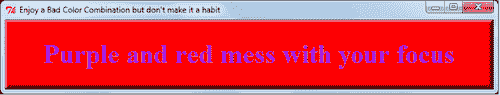

## 更多...

选择是好的，因为它允许我们的 GUI 看起来很好。这种选择的缺点是它允许我们做出糟糕的选择。但正如谚语所说：用智慧做出的糟糕选择会导向好的选择。

如果我们运行这个程序，我们会看到所组合的颜色几乎是最糟糕的组合，因为这两种颜色具有不同的波长，并且在到达视网膜的过程中略微遵循不同的路径。

# 按钮焦点

在这里，我们演示了焦点概念，这比描述更容易展示。当窗口内有一组小部件时，只有一个小部件可以响应像鼠标按钮点击这样的事件。在这个例子中，鼠标光标下的按钮具有焦点，因此它是响应鼠标点击的那个按钮。当光标移到另一个按钮上时，*那个按钮就具有焦点*。在这个例子中，具有焦点的按钮在 Linux 操作系统中会改变颜色。在 MS Windows 中，按钮不会改变颜色，但鼠标光标会改变。

## 如何做到这一点...

以通常的方式执行显示的程序。

```py
#button_focus_1.py
#>>>>>>>>>>>>>>>
from Tkinter import *
root = Tk()
butn_widget_1 = Button(text='First, RAISED', padx=10, pady=10)
butn_widget_1.config(cursor='gumby')
butn_widget_1.config(bd=8, relief=RAISED)
butn_widget_1.config(bg='dark green', fg='white')
butn_widget_1.config(font=('helvetica', 20, 'underline italic'))
butn_widget_1.grid(row=1, column = 1)
butn_widget_2 = Button(text='Second, FLAT', padx=10, pady=10)
butn_widget_2.config(cursor='circle')
butn_widget_2.config(bd=8, relief=FLAT)
butn_widget_2.grid(row=1, column = 2)
butn_widget_3 = Button(text='Third, SUNKEN', padx=10, pady=10)
butn_widget_3.config(cursor='heart')
butn_widget_3.config(bd=8, relief=SUNKEN)
butn_widget_3.config(bg='dark blue', fg='white')
butn_widget_3.config(font=('helvetica', 30, 'underline italic'))
butn_widget_3.grid(row=1, column = 3)
butn_widget_4 = Button(text='Fourth, GROOVE', padx=10, pady=10)
butn_widget_4.config(cursor='spider')
butn_widget_4.config(bd=8, relief=GROOVE)
butn_widget_4.config(bg='red', fg='white')
butn_widget_4.config(font=('helvetica', 20, 'bold'))
butn_widget_4.grid(row=1, column = 4)
butn_widget_5 = Button(text='Fifth RIDGE', padx=10, pady=10)
butn_widget_5.config(cursor='pencil')
butn_widget_5.config(bd=8, relief=RIDGE)
butn_widget_5.config(bg='purple', fg='white')
butn_widget_5.grid(row=1, column = 5)
root.mainloop( )

```

## 它是如何工作的...

当我们在 Linux 下运行前面的代码时，我们会看到每个按钮的颜色随着它获得焦点而改变。获得焦点的按钮是这一组中唯一会响应左键点击的按钮。在 Windows 7 下，这种带焦点的颜色变化不起作用。尽管如此，焦点行为和鼠标事件反应的逻辑并未受到影响。

我们还趁机查看可用的不同按钮边框样式。

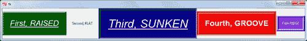

## 还有更多...

在这个例子中需要注意的一点是，按钮的大小由字体大小和放置在按钮上的文本量决定。

# 带验证的最简单的按钮

我们现在聚焦于通过 `callback()` 函数进行事件处理的最简单示例。

之前提到的验证是指任何提供确认我们代码做了我们想要它做的事情的反应。当你以实验性方式开发代码时，你需要在最早阶段就进行某种验证，以便建立洞察力。

## 如何做到这一点...

复制、保存并执行。结果如下所示：

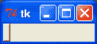

```py
# button_1.py
push buttonwith validation#>>>>>>>>>>>>>
from Tkinter import *
root = Tk()
def callback_1(): # The event processor function
print "Someone pushed a button"
# The instantiation (i.e. creation of a specific instance or # realization) of a button.
button_1= Button(root, command=callback_1).grid(row=1, column=0)
root.mainloop()

```

## 它是如何工作的...

当你用鼠标指针点击小按钮时，你的终端上会出现一条消息。消息的出现是程序产生的关键验证操作。

这个简单的例子展示了所有响应用户输入的程序的基本设计。然后你只需要做以下事情：

+   等待某些外部事件，例如鼠标点击或键盘上的按键。

+   如果外部事件发生，我们必须在我们的程序中有一个 `事件处理程序` 函数，该函数指定必须执行的操作。这些通常被称为 `callback` 函数。

在代码内部，创建任何设计用于接受用户输入的小部件的实例时，必须始终有一个选项指定符，如 `command=callback_1`，它指向名为 `callback_1` 的事件处理函数，该函数将在事件发生时执行我们希望它执行的所有操作。我们不必使用实际的单词 `callback_1` - 我们可以选择任何我们喜欢的单词。在这种情况下，事件是按钮的点击。我们要求它在 `callback()` 函数内部做的所有事情只是打印一条消息。然而，由我们的 `callback()` 函数引发的行动列表可以像我们喜欢的那样长。

## 还有更多...

编程文献经常使用“实例化”这个词，尤其是在面向对象编程的上下文中提及对象时。这个词的意思是将某个对象从之前仅存在的半抽象描述转变为一个实际的代码块，该代码块具有一个真实的命名空间，其变量与程序内部的数据和命令进行交互。Python 与 Tkinter 有一个预定义的对象，称为按钮。在我们的上一个程序中，我们通过以下命令将一个名为 `button_1` 的按钮实例化出来：

`button_1= Button(root, command=callback_1).grid(row=1, column=0)`

等号右侧的描述是从 Tkinter 库内部的长列表对象中提取的现有抽象描述。左侧的`button_1`名称是实例的名称，该实例将具有所有之前只是库中文字的实际属性。这就像有一个带有工程图纸和赛车组装说明的文件（抽象描述），然后让某个工程车间实际制造一个闪亮的钢制和铬制跑车实例。带有金属蓝色漆面的东西，你将坐在里面，随风驾驶，是对象的实例。这个带有图纸和制造说明的文件相当于我们 Python 代码中的对象定义。那个金属蓝色的东西，你将坐在里面，随风驾驶，是对象的实例。

### 按钮在 Windows 上的行为不同

在此配方中，按钮在 MS Windows 中的行为与 Linux 略有不同。Windows 在包含按钮的框架右上角显示正常的最小化、最大化、关闭符号。我们通过点击右上角的“X”符号来关闭应用程序。在 Linux 中，框架顶部有一个圆形按钮。当我们点击这个按钮时，会弹出一个菜单，其中包含一个关闭命令，可以结束程序。

# 数据输入框

我们创建一个 GUI，它提供了一个数据输入框和一个按钮来处理输入框中输入的任何文本。

**Entry**小部件是 Tkinter 的标准小部件，用于输入或显示单行文本。

按钮的`callback()`函数（事件处理器）将文本框的内容分配给变量的值。所有这些操作都通过显示这个变量的值来验证。

## 如何操作...

以正常方式执行显示的程序。

```py
# entry_box_1.py
#>>>>>>>>>>>>>>>
from Tkinter import *
from Dialog import Dialog
root = Tk()
root.title("Data Entry Box")
enter_data_1 = Entry(root, bg = "pale green") # Creates a text entry
# field
enter_data_1.grid(row=1, column=1)
enter_data_1.insert(0, "enter text here") # Place text into the box.
def callback_origin():
# Push button event handler.
data_inp_1 = enter_data_1.get() # Fetch text from the box.
# Create a label and write the value of 'data_inp_1' to it.
# ie. Validate by displaying the newly acquired data as a label on
# the frame.
label_2_far_right = Label(root, text=data_inp_1)
label_2_far_right.grid(row=1, column=3)
# This is button that triggers data transfer from entry box to named
# variable 'data_inp_1'.
but1= Button(root, text="press to \
transfer",command=callback_origin).grid(row=5, column=0)
root.mainloop()

```

## 如何工作...

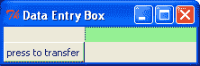

单独的文本输入框并没有太大的用处。它就像一个邮筒，文本可以发送到它或从它那里取走。

此程序执行以下操作：

+   它设置了一个名为`root`的父框架或窗口，其中包含一个标签按钮和一个显示初始消息“在此输入文本”的文本框。

+   我们可以点击输入框，并用新文本替换初始文本。

+   如果我们点击按钮，它将框中的内容作为变量`data_inp_1`的值。

+   它将`data_inp_1`的值显示为文本框右侧的标签。

## 更多...

按钮执行有用功能的关键在于放置在`callback()`函数中的代码，该函数在按钮被按下时执行。

编程按钮可能会变得非常复杂，我们很容易被自己的独创性所困惑。规则是保持简单。

你可以在框架内的同一位置定位多个按钮，可见的按钮是 Python 程序最后放置的那个按钮。

之后，我们可以制作一组按钮，当开启时看起来“发光”，当关闭时看起来“暗淡”。做这些事情很有趣，但要注意不要过于聪明。一位非常聪明和明智的程序员说过以下的话：

—Brian W. Kernighan，C 编程语言合著者。

### 我们是否保持了事情简单？

在本章第六个名为“按钮之间的复杂交互”的菜谱中，我们忽略明智的建议，只是为了探索可能的可能性。我们这样做是为了自己的教育和乐趣，但对于任何专业工作都应该避免。

### 单行与多行输入

这里使用的部件被称为**输入**部件，仅用于单行输入。还有一个名为**文本**的部件，它被设计用于多行输入。本章后面将有一个如何使用此部件的示例。

### 聪明的几何管理器

注意在程序执行过程中，父窗口的大小如何改变以适应标签文本的大小。这是一个非常智能的程序设计。

# 带有消息弹出的彩色按钮

按钮可以被赋予不同的视觉属性和复杂的行为。在这里，我们创建了一个蓝色的凸起按钮，当用鼠标点击时，其外观会发生变化。当按钮被按下时，会弹出一个消息框小部件。

## 如何去做...

以正常方式执行显示的程序。

```py
# button_message_1.py
#>>>>>>>>>>>>>>>>>>>
from Tkinter import *
import tkMessageBox
root = Tk()
root.title("Message Button")
def callback_button():
tkMessageBox.showinfo( "Certificate of Button Pushery", \ "Are glowing pixels a reality?")
message_button = Button(root,
bd=6, # border width
relief = RAISED, # raised appearance # to button border
bg = "blue", # normal background
# color
fg = "green", # normal foreground
# (text) color
font = "Arial 20 bold",
text ="Push me", # text on button
activebackground = "red", # background when
# button is clicked
activeforeground = "yellow", # text color when
# clicked
command = callback_button) # name of event
# handler
message_button.grid(row=0, column=0)
root.mainloop()

```

## 它是如何工作的...

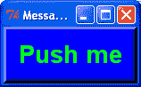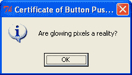

我们现在看到的是，按钮非常可定制，正如 Tkinter 中的许多小部件一样。这个菜谱说明了你作为 GUI 程序员肯定会遇到的另一个术语，那就是“焦点”这个词。

重点是当有多个小部件在一个图形容器上时，一次只能给予一个关注或监听。每个按钮都被编程为响应鼠标点击，但当鼠标点击时，只有一个按钮应该响应。响应的部件是程序所关注的部件。在我们的例子中，当鼠标指针移动到按钮上时，你会看到焦点被给予按钮（焦点被用来在 Linux 操作系统中改变按钮的颜色）。这就像主席向想要发表讲话的会议小组提供发言机会一样。有抱负的演讲者只能在主席提供发言机会（给予他们焦点）时才能这样做。当这种情况发生时，其他人预计要安静地礼貌地倾听。

# 按钮之间的复杂交互

在这个菜谱中，我们展示了如何通过获取一组三个相互修改的按钮，使按钮动作变得尽可能复杂。

## 如何去做...

以正常方式执行显示的程序。

```py
# button_interaction_1.py
#>>>>>>>>>>>>>>>>>>>>
from Tkinter import *
root = Tk()
root.title("now what?")
def callback_button_1():
message_button_1.flash()
message_button_2["bg"]= "grey"
message_button_2.flash()
message_button_3.flash()
message_button_3["bg"]= "pink"
message_button_1["relief"] = SUNKEN
message_button_1["text"]= "What have you done?"
def callback_button_2():
message_button_2["bg"]= "green"
message_button_3["bg"]= "cyan"
message_button_1["relief"] = RAISED
message_button_1["text"]= "Beware"
def callback_button_3():
message_button_1.destroy()
message_button_2.destroy()
message_button_3.destroy()
root.destroy()
message_button_1 = Button(root,
bd=6,
relief = RAISED, # Raised # appearance.
bg = "blue" # Normal (without
# focus) # background
# color
fg = "green", # Normal (without
# focus) # foreground
# (text) color
font = "Arial 20 bold",
text ="Push me first", # Text on button
activebackground = "red", # Background when
# button has # focus
activeforeground = "yellow", #Text with focus
command = callback_button_1) # event handler
message_button_1.grid(row=0, column=0)
message_button_2 = Button(root,
bd=6,
relief = SUNKEN,
bg = "green",
fg = "blue",
font = "Arial 20 bold",
text ="Now Push me",
activebackground = "purple",
activeforeground = "yellow",
command = callback_button_2)
message_button_2.grid(row=1, column=0)
set of three buttonsmodifying, one anothermessage_button_3 = Button(root,
bd=6,
relief = SUNKEN,
bg = "grey",
fg = "blue",
font = "Arial 20 bold",
text ="kill everything",
activebackground = "purple",
activeforeground = "yellow",
command = callback_button_3)
message_button_3.grid(row=2, column=0)
root.mainloop()

```

## 如何工作...

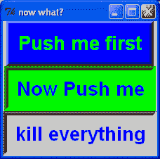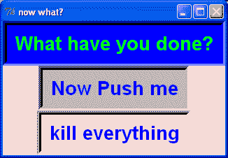

所有的动作都发生在事件处理程序（回调函数）中。每个实例化的对象，如这里使用的按钮，都有一个属性集合，如颜色、文本和外观，可以通过以下规范进行修改：`message_button_2["bg"]= "grey"`

所以，当按钮 1 被点击时，按钮 2 的背景颜色从绿色变为灰色。

虽然使用按钮动作创建非常复杂的交互式行为很有趣，但很快就会变得几乎不可能跟踪你想要的行为。你添加的复杂性越多，就会出现越多的意外行为。因此，最好的建议是尽量保持简单。

# 按钮上的图片和按钮打包

通过将 GIF 格式的图片放置在按钮上，我们可以创建任何期望的外观。图片可以传达关于按钮功能的有关信息。需要考虑图片的大小，并且要谨慎地使用几何管理器。

## 如何实现...

按照通常的方式执行显示的程序。

```py
# image_button_1.py
#>>>>>>>>>>>>>>>>>>>>>>>>>>>>>>>>>>>>>>>>>>
from Tkinter import *
root = Tk()
root.title("Image Sized Buttons")
go_image = PhotoImage(file = "/constr/pics1/go_on.gif")
fireman_image = PhotoImage(file = "/constr/pics1/fireman_1.gif")
winged_lion_image = PhotoImage(file = "/constr/pics1/winged_lion.gif")
earth_image = PhotoImage(file = "/constr/pics1/earth.gif")
def callback_go():
print "Go has been pushed to no purpose"
def callback_fireman():
print "A little plastic fireman is wanted"
def callback_lion():
print "A winged lion rampant would look cool on a t-shirt"
def callback_earth():
print "Think of the children (and therefore also of their parents)"
btn_go= Button(root, image = go_image, \
command=callback_go ).grid(row=0, column=0)
btn_firmean= Button(root, image = fireman_image, \
command=callback_fireman).grid(row=0, column=1)
btn_lion= Button(root, image = winged_lion_image, \
command=callback_lion ).grid(row=0, column=2)
btn_earth= Button(root, image = earth_image, \
command=callback_earth ).grid(row=0, column=3)
root.mainloop()

```

## 如何工作...

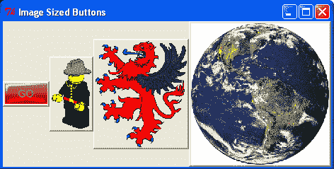

这里需要注意的事情是，网格几何管理器会尽可能整齐地将所有小部件打包在一起，无论小部件的大小如何。

## 还有更多...

Python 模块设计背后的一个美妙思想是，它们的行为应该是友好和宽容的。这意味着如果属性被编码为不合适的值，则解释器将选择默认值，至少是一种可能工作的选择。这对程序员来说是一个巨大的帮助。如果你遇到过 Python 开发者圈子中的任何成员，他们仅仅因为这个原因就值得得到一个亲切的拥抱。

# 网格几何管理器和按钮数组

通过将 GIF 格式的图片放置在按钮上，我们可以创建任何期望的外观。需要考虑图片的大小，并且要谨慎地使用几何管理器。

## 如何实现...

按照正常方式执行显示的程序。

```py
# button_array_1.py
#>>>>>>>>>>>>>>>>>
from Tkinter import *
root = Tk()
root.title("Button Array")
usb = PhotoImage(file = "/constr/pics1/Usbkey_D.gif")
galaxy = PhotoImage(file = "/constr/pics1/galaxy_D.gif")
alert = PhotoImage(file = "/constr/pics1/alert_D.gif")
earth = PhotoImage(file = "/constr/pics1/earth_D.gif")
eye = PhotoImage(file = "/constr/pics1/eye_D.gif")
rnd_2 = PhotoImage(file = "/constr/pics1/random_2_D.gif")
rnd_3 = PhotoImage(file = "/constr/pics1/random_3_D.gif")
smile = PhotoImage(file = "/constr/pics1/smile_D.gif")
vine = PhotoImage(file = "/constr/pics1/vine_D.gif")
blueye = PhotoImage(file = "/constr/pics1/blueeye_D.gif")
winglion = PhotoImage(file = "/constr/pics1/winglion_D.gif")
def cb_usb(): print "usb"
def cb_galaxy(): print "galaxy"
def cb_alert(): print "alert"
def cb_earth(): print "earth"
def cb_eye(): print "eye"
def cb_rnd_2(): print "random_2"
def cb_rnd_3(): print "random_3"
def cb_smile(): print "smile"
GIF format imagesplacing, on button arraysdef cb_vine(): print "vine"
def cb_blueeye(): print "blueeye"
def cb_winglion(): print "winglion"
butn_usb = Button(root, image = usb, command=cb_usb \
).grid(row=0, column=0)
butn_galaxy = Button(root, image = galaxy, command=cb_galaxy).grid(row=1, column=0)
butn_alert = Button(root, image = alert, command=cb_alert \
).grid(row=2, column=0)
butn_earth = Button(root, image = earth, command=cb_earth \
).grid(row=3, column=0)
butn_eye = Button(root, image = eye, command=cb_eye \
).grid(row=0, column=1, rowspan=2)
butn_rnd_2 = Button(root, image = rnd_2, command=cb_rnd_2 \
).grid(row=2, column=1)
butn_rnd_3 = Button(root, image = rnd_3, command=cb_rnd_3 \
).grid(row=3, column=1)
butn_smile = Button(root, image = smile, command=cb_smile \
).grid(row=0, column=2, columnspan=2)
butn_vine = Button(root, image = vine, command=cb_vine \
).grid(row=1, column=2, rowspan=2, columnspan=2)
butn_blueye = Button(root, image = blueye, \
command=cb_blueeye).grid(row=3, column=2)
butn_winglion= Button(root, image = winglion, command=cb_winglion \
).grid(row=3, column=3)
root.mainloop()

```

## 它是如何工作的...

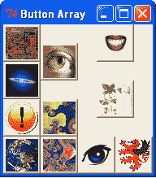

Tkinter 中有两种几何管理器。在这本书中，我们一直独家使用网格几何管理器，因为它可以降低复杂性，而且使用起来简单，还能直接控制界面布局。另一种布局几何管理器称为 **pack**，将在下一章中介绍。

规则很简单。我们的父窗口或框架被分成行和列。`Row=0` 是顶部的第一行，`column=0` 是左侧的第一列。`columnspan=2` 意味着使用此属性的控件位于两个相邻列的中心。请注意，带有藤蔓图标的按钮位于四个网格区域的中心，因为它同时具有 `columnspan=2` 和 `rowspan=2`。

## 还有更多...

通过更改此示例中的网格属性，您可以帮助自己获得对网格几何管理器的洞察。请花一些时间实验网格管理器，它将在您的编程努力中带来回报。

# 从列表中选择的下拉菜单

在这里，我们使用下拉菜单小部件作为从提供的几个选项中选择一个项的方法。

## 如何实现...

以通常的方式执行显示的程序。结果如下截图所示：

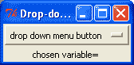

```py
# dropdown_1.py
# >>>>>>>>>>>>>>>>>>>
from Tkinter import *
root = Tk()
root.title("Drop-down boxes for option selections.")
var = StringVar(root)
var.set("drop down menu button")
def grab_and_assign(event):
chosen_option = var.get()
label_chosen_variable= Label(root, text=chosen_option)
label_chosen_variable.grid(row=1, column=2)
print chosen_option
drop_menu = OptionMenu(root, var, "one", "two", "three", "four", \ "meerkat", "12345", "6789", command=grab_and_assign)
drop_menu.grid(row=0, column=0)
label_left=Label(root, text="chosen variable= ")
label_left.grid(row=1, column=0)
root.mainloop()

```

## 它是如何工作的...

下拉菜单有自己的按钮。当点击此按钮时被调用的 `callback()` 函数在此特定菜谱中命名为 `grab_and_assign`，此事件服务程序中的一条指令是将所选菜单项的值分配给变量 `chosen_option`。执行此操作的指令是 `chosen_option = var.get()`。

如我们之前所做的那样，我们通过在父窗口上打印 `chosen_option` 的新值作为标签来确保一切按预期工作。

# 列表框变量选择

**列表框**是一个以列表形式显示选择项的控件。可以通过在列表项上点击鼠标光标来选择列表中的项。

## 如何实现...

以通常的方式执行显示的程序。

```py
# listbox_simple_1.py
#>>>>>>>>>>>>>>>>>>
from Tkinter import *
root = Tk()
root.title("Listbox Data Input")
def get_list(event):
# Mouse button release callback
# Read the listbox selection and put the result in an entry box
# widget
index = listbox1.curselection()[0] # get selected line index
seltext = listbox1.get(index) # get the line's text & # assign
# to a variable
enter_1.delete(0, 50) # delete previous text in
# enter_1 otherwise the # entries
# append to each other.
enter_1.insert(0, seltext) # now display the selected # text
# Create the listbox (note that size is in characters)
listboxitem, selecting fromlistbox1 = Listbox(root, width=50, height=6)
listbox1.grid(row=0, column=0)
# Fill the listbox with data
listbox1.insert(END, "a list entry")
for item in ["one has begun", "two is a shoe", "three like a knee", \
"four to the door"]:
listbox1.insert(END, item)
# use entry widget to display/edit selection
enter_1 = Entry(root, width=50, bg='yellow')
enter_1.insert(0, 'Click on an item in the listbox')
enter_1.grid(row=1, column=0)
# left mouse click on a list item to display selection
listbox1.bind('<ButtonRelease-1>', get_list)
root.mainloop()

```

## 它是如何工作的...

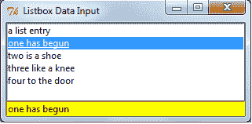

命名为 `listbox1` 的列表框被创建并放置在 Tkinter 窗口中。它使用 for 循环填充了五个字符串项。

当鼠标光标点击一个项时，`get_list` 函数将该项作为变量 `seltext` 的值。此变量的值显示在黄色输入框中。

# 窗口中的文本

这是一个在窗口中放置文本的简单方法。没有提供与文本交互的选项。

## 如何实现...

以通常的方式执行显示的程序。

```py
# text_in_window_1.py
#>>>>>>>>>>>>>>>>>>>>>>>>>>>>>>>>>>>>>>>>>>
from Tkinter import *
root = Tk()
root.title("Text in a window")
text_on_window = Text(root)
text_on_window.grid(row=0, column=0)
for i in range(20):
text_on_window.insert(END, "Fill an area with some text: line %d\n"\
% i)
root.mainloop()

```

## 它是如何工作的...

通过 `Text(root)` 方法创建 Text 控件，并通过 `insert(…)` 函数将文本放置其中。END 属性将每行新文本放置在上一行的末尾。
