# 第十一章 GUI 构建：第二部分

在本章中，我们将涵盖：

+   网格布局几何管理器

+   打包几何管理器

+   单选按钮从多个选项中选择一个

+   复选框（勾选框）从多个选项中选择一些

+   按键事件处理

+   滚动条

+   框架

+   自定义 DIY 控制器小部件（一个更瘦的滑块）

# 简介

在本章中，我们提供了更多关于**图形用户界面(GUI)**的食谱。上一章中的食谱被设计为运行时与你的代码交互的基本方式。在本章中，我们扩展了这些想法并试图将它们结合起来。

我们首先探索两个布局几何管理器的特性。在整个这本书中，直到本章，我们一直使用网格管理器，因为它似乎给我们提供了对 GUI 外观的最大控制。

当我们编写使用小部件的 Tkinter 代码时，我们必须做出的一个选择是如何在我们包含它们的主小部件内部安排这些小部件。有两个布局几何管理器可供选择：打包和网格。打包管理器是最容易使用的，直到你有了自己关于如何在家居中安排家具的想法，家具和房屋是对于小部件和包含小部件的有用隐喻。网格管理器给你提供了对布局的绝对控制。

# 网格布局几何管理器

我们查看以计划的方式布局 16 个标签按钮的代码。根据每个按钮上的标签，它只应该在北、南、东、西参考系统中的一个位置。

## 准备工作

网格和打包都有导航参考方案。从我们的 GUI 将如何显示的角度来理解，最简单的方法是使用网格，它使用清晰的行、列方案来指定我们的小部件位置，如下面的截图所示：

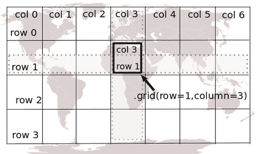

## 如何做...

以通常的方式执行程序。结果如下面的截图所示：

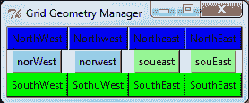

```py
# grid_button_array_1.py
#>>>>>>>>>>>>>>>>>>>
from Tkinter import *
root = Tk()
root.title("Pack Geometry Manager")
butn_NW = Button(root, bg='blue',text="NorthWest").grid(row=0, \ column=0)
butn_NW1 = Button(root, bg='blue',text="Northwest").grid(row=0, \ column=1)
butn_NE1 = Button(root, bg='blue',text="Northeast").grid(row=0, \ column=2)
butn_NE = Button(root, bg='blue',text="NorthEast").grid(row=0, \ column=3)
butn_N1W = Button(root, bg='sky blue',text="norWest").grid(row=1, \ column=0)
Grid Layout Geometry Managerexamplebutn_N1W1 = Button(root, bg='sky blue',text="norwest").grid(row=1, \ column=1)
butn_S1E1 = Button(root, bg='pale green',text="soueast").grid(row=1, column=2)
butn_S1E = Button(root, bg='pale green',text="souEast").grid(row=1, column=3)
butn_SW = Button(root, bg='green',text="SouthWest").grid(row=2, \column=0)
butn_SW1 = Button(root, bg='green',text="SothuWest").grid(row=2, \ column=1)
butn_SE1 = Button(root, bg='green',text="SouthEast").grid(row=2, \ column=2)
butn_SE = Button(root, bg='green',text="SouthEast").grid(row=2, \ column=3)
root.mainloop()

```

## 它是如何工作的...

网格布局管理器在解释布局指令时是明确的。没有歧义，结果容易理解。幸运的是，对于我们用户来说，Python 语言的一个根深蒂固的哲学是，在可能的情况下，解释器应该对轻微的编程疏忽表现出友好和宽容。例如，假设我们给所有按钮分配了相同的网格布局地址。例如，假设我们将所有按钮分配为`grid(row=5, column=5)`。结果看起来像窗口中只有一个按钮。实际上，布局管理器会将所有按钮堆叠在一起，第一个在底部，最后一个在顶部。如果我们按相反的顺序逐个销毁它们，我们会看到这个序列展开。

## 更多内容...

只需记住，我们永远不会在同一个程序中混合使用包和网格布局管理器。如果您这样做，您的程序将冻结，因为每个管理器都试图遵守冲突的指令。

# 包布局管理器

我们试图实现前一个截图所示的结果，但并不完全成功，因为包试图将小部件排列成一条单行。包提供的有限灵活性在于它允许我们决定条带应该从哪里开始。

## 准备中

包布局管理器使用导航者指南针方案，如下所示：

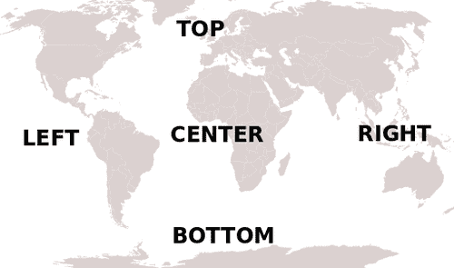

## 如何操作...

按照常规方式执行显示的程序。结果如下截图所示：

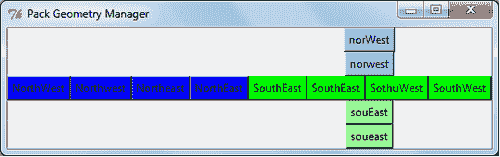

```py
# pack_button_array_1.py
#>>>>>>>>>>>>>>>>>>>>>>
from Tkinter import *
root = Tk()
root.title("Pack Geometry Manager")
butn_NW = Button(root, bg='blue',text="NorthWest").pack(side=LEFT)
butn_NW1 = Button(root, bg='blue',text="Northwest").pack(side=LEFT)
butn_NE1 = Button(root, bg='blue',text="Northeast").pack(side=LEFT)
butn_NE = Button(root, bg='blue',text="NorthEast").pack(side=LEFT)
butn_N1W = Button(root, bg='sky blue',text="norWest").pack()
butn_N1W1 = Button(root, bg='sky blue',text="norwest").pack()
butn_S1E1 = Button(root, bg='pale green',text="soueast").pack(side=BOTTOM)
Pack Geometry Managerexamplebutn_S1E = Button(root, bg='pale green',text="souEast").pack(side=BOTTOM)
butn_SW = Button(root, bg='green',text="SouthWest").pack(side=RIGHT)
butn_SW1 = Button(root, bg='green',text="SothuWest").pack(side=RIGHT)
butn_SE1 = Button(root, bg='green',text="SouthEast").pack(side=RIGHT)
butn_SE = Button(root, bg='green',text="SouthEast").pack(side=RIGHT)
root.mainloop()

```

## 它是如何工作的...

包布局管理器将小部件排列成行或列。如果我们尝试同时做这两件事，结果将难以预测，如前一个截图所示。

它所做的是从一个可能指定的边缘开始，然后按照它们在代码中出现的顺序，一个接一个地排列小部件。如果您没有指定开始边缘，默认为顶部，因此小部件将作为一个单独的列排列。

也有一些参数指定小部件是否应该填充到可用空间。我们可以从这个细节中获取：

[`effbot.org/tkinterbook/pack.htm`](http://effbot.org/tkinterbook/pack.htm)

# 单选按钮从多个选项中选择一个

我们使用单选按钮从一组选择中做出一个选择。集合中的每个按钮都与同一个变量相关联。当鼠标左键点击某个按钮时，与该特定按钮关联的值被分配为变量的值。

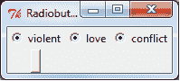

## 如何操作...

按照常规方式执行显示的程序。

```py
# radiobuttons_1.py
#>>>>>>>>>>>>>>>
from Tkinter import *
root = Tk( )
root.title("Radiobuttons")
var_1 = StringVar( )
rad_1 = Radiobutton(root, text='violent', variable = var_1, \ value="action").grid(row=0, column=0)
rad_2 = Radiobutton(root, text='love', variable = var_1, \ value="romance").grid(row=0, column=1)
rad_2 = Radiobutton(root, text='conflict', variable = var_1, \ value="war").grid(row=0, column=2)
def callback_1():
v_1 = var_1.get()
print v_1
button_1= Button(root, command=callback_1).grid(row=4, column=0)
root.mainloop()

```

## 它是如何工作的...

我们指定了一个特殊的 Tkinter 字符串变量，我们将其命名为`var_1`。我们可以根据哪个单选按钮被点击分配三个可能的字符串值。一个普通按钮用于显示`var_1`在任何时刻的值。

# 复选框（勾选框）从多个选项中选择一些

勾选框始终有一个值。它们与单选按钮相反，允许从一组中选择多个选项。每个勾选框都与一个不同的变量名相关联。

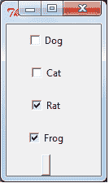

## 如何操作...

按照常规方式执行显示的程序。

```py
# checkbox_1.py
#>>>>>>>>>>>>>>>>>>>>
from Tkinter import *
import tkMessageBox
root = Tk()
root.title("Checkboxes")
check_var1 = IntVar()
check_var2 = IntVar()
check_var3 = StringVar()
check_var4 = StringVar()
def change_it():
print "Why do you want to change things?"
Ck_1 = Checkbutton(root, text = "Dog", variable = check_var1, \ command=change_it, \
onvalue = 1, offvalue = 0, height=3, \
width = 10).grid(row=0, column=0)
Ck_2 = Checkbutton(root, text = "Cat", variable = check_var2, \
onvalue = 1, offvalue = 0, height=6, \
width = 10).grid(row=1, column=0)
Ck_3 = Checkbutton(root, text = "Rat", variable = check_var3, \
onvalue = "fly me", offvalue = "keep walking", \ height=9, \
width = 10).grid(row=2, column=0)
Ck_4 = Checkbutton(root, text = "Frog", variable = check_var4, \
onvalue = "to the moon", offvalue = "to Putney road", \height=12, \
width = 10).grid(row=3, column=0)
def callback_1():
v_1 = check_var1.get()
v_2 = check_var2.get()
v_3 = check_var3.get()
v_4 = check_var4.get()
print v_1, v_2, v_3, v_4
button_1= Button(root, command=callback_1).grid(row=4, column=0)
root.mainloop()

```

## 它是如何工作的...

有四个勾选框（勾选框），因此有四个变量。其中两个是整数，两个是字符串。每当底部按钮被点击时，所有四个值都会显示出来。

# 键击事件处理

在图形用户界面术语中，**事件处理器**是指当外部事件（如按键或鼠标点击）发生时执行的功能的术语。本书中使用的等效术语是`回调`函数。我们通过函数定义中包含的单词`event`来识别`回调`函数。

在这里，我们创建了一个对按键做出反应的事件处理器。

## 如何操作...

按照常规方式执行程序。

```py
# keypress_1.py
#>>>>>>>>>>>>>>>>>>
from Tkinter import *
root = Tk()
root.title("Key symbol Getter")
def key_was_pressed(event):
print 'keysym=%s' % (event.keysym)
text_1 = Text(root, width=20, height=5, highlightthickness=15)
text_1.grid(row=0, column=0)
text_1.focus_set()
root.mainloop()

```

## 如何工作...

我们创建了一个文本框来显示当键盘“事件”发生时按下的哪个键。我们选择在文本框内显示和验证我们的按键，该文本框不会对功能键按下做出反应。如果我们使用标签小部件代替，我们会看到预期的`function`键显示。换句话说，函数`event.keypress`正确地感知了所有按键，即使它们不是由正常字符表示。

# 滚动条

滚动条提供了一种使用鼠标控制的滑块在更大的图像或文本区域中移动查看窗口的方法。它可以与列表框、画布、输入小部件或文本小部件一起使用。在这个例子中，我们使用垂直滚动条在滚动条的查看窗口后面上下移动 GIF 图像。

## 如何操作...

需要在画布和滚动条之间建立双向连接：

+   画布的`yscrollcommand`选项必须连接到垂直滚动条的`.set`方法，并且

+   滚动条的`command`选项必须连接到画布的`.yview`方法。

按照常规方式执行显示的程序。

```py
scrollbar_1.py
#>>>>>>>>>>>>>>>>>>>>>>>>>>>>>>>>>>>>>>>>>>
from Tkinter import *
root = Tk()
frame_1 = Frame(root, bd=2, relief=SUNKEN)
frame_1.grid(row=0, column=0)
pic_1 = PhotoImage(file="/constr/pics1/table_glass_vase.gif")
yscrollbar = Scrollbar(frame_1, orient=VERTICAL, \ bg="skyblue",activebackground="blue")
yscrollbar.grid(row=0, column=1, sticky=N+S)
canvas_1 = Canvas(frame_1, bd=0, scrollregion=(0, 0, 2100, 2000), # The extent of the scrollable area.
yscrollcommand=yscrollbar.set, # Link to the # scrollbar.
)
canvas_1.grid(row=0, column=0)
canvas_1.create_image(0 ,0 ,anchor=NW, image= pic_1)
yscrollbar.config(command=canvas_1.yview) # Link to the #canvas.
mainloop()

```

## 它是如何工作的...

画布和滚动条之间的双向连接是通过`canvas_1 = Canvas(…配置`命令中的`yscrollcommand=yscrollbar.set`选项和在滚动条配置选项`yscrollbar.config(command=canvas_1.yview)`中实现的。

在 Python 中，我们不能在定义变量之前引用它，这就是为什么在`yscrollbar`声明之前不能使用`yscrollbar.config`语句的原因。

## 更多...

上述示例为了简单起见，只有垂直滚动条。如果我们想包括水平滚动条，我们会插入以下语句：

```py
xscrollbar = Scrollbar(frame_1, orient=HORIZONTAL, bg="orange",activebackground="red")
xscrollbar.grid(row=1, column=0),
canvas_1 = Canvas(frame_1, bd=0, scrollregion=(0, 0, 2100, 2000), # The extent of the area across which can be scrolled.
xscrollcommand=xscrollbar.set,
yscrollcommand=yscrollbar.set,

```

在画布声明之后，添加以下代码行：

`xscrollbar.config(command=canvas_1.xview)`

# 定制 DIY 控制器小部件

我们从画布上的基本图形元素构建自己的小部件。Tkinter 提供的现有滑动控制小部件有时看起来有点大而笨重。如果我们需要一个更整洁、紧凑的滑动式用户输入设备，我们可以自己制造。

这里所做的选择是将基本滑块功能作为图形和文本元素组装在 Tkinter 画布上。

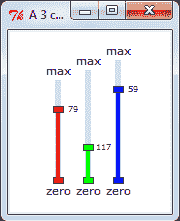

## 如何操作...

在以下代码中，我们看到三组相似的代码，由双行和`回调`函数分隔，该函数根据名为`focus_flag`的变量的值关注三个段中的其中一个。按照常规方式执行显示的程序。

```py
# mini_slider_widget_1.py
#>>>>>>>>>>>>>>>>>>>>
from Tkinter import *
import math
root = Tk()
root.title("A 3 color linear slider control gadget")
cw = 200 # canvas width
ch = 200 # canvas height
chart_1 = Canvas(root, width=cw, height=ch, background="#ffffff")
chart_1.grid(row=1, column=1)
#============================================
# Mini slider canvas widget
focus_flag = 0 # 0-> uncommited, 1 -> slider #1, 2 -> slider #2 etc.
x_1 = 50 # Position of slider #1 base.
y_1 = 150
x_2 = 80 # Position of slider #2 base.
y_2 = 150
x_3 = 110 # Position of slider #3 base.
y_3 = 150
length_1 = 100 # Length of slider #1 (pixels) - constant.
length_2 = 110
length_3 = 120
slide_1 = y_1 # Position of slider handle #1 - variable.
slide_2 = y_2
slide_3 = y_3
#==============================================
def separation(x_now, y_now, x_dot, y_dot): # distance # measurement
# Distance to points - used to find out if the mouse clicked # inside a circle
sum_squares = (x_now - x_dot)**2 + (y_now -y_dot)**2
distance= int(math.sqrt(sum_squares)) # get #pythagorean distance
widgetsconstructingreturn( distance)
#==============================================
def canv_slider(xn, yn, length, kula):
# Draw the background slider gadgets.
y_top = yn -length
chart_1.create_line(xn, yn, xn, y_top, fill="gainsboro", width = 6)
chart_1.create_rectangle(xn - 5, yn -3, xn + 5, yn + 3, fill=kula, tag="knob_active")
chart_1.create_text(xn, yn + 10, text='zero',font=('verdana', 8))
chart_1.create_text(xn, y_top - 10, text='max',font=('verdana', 8))
canv_slider(x_1, y_1, length_1, "red")
canv_slider(x_2, y_2, length_2, "green")
canv_slider(x_3, y_3, length_3, "blue")
#==============================================
def dyn_slider(xn, yn, slide_val, kula, tagn):
# Draw the dynamic slider position.
chart_1.delete(tagn)
chart_1.create_line(xn, yn, xn, slide_val, fill=kula, width=4, tag =tagn)
chart_1.create_rectangle(xn - 5, slide_val -3 , xn + 5,slide_val + 3, fill=kula, tag=tagn)
chart_1.create_text(xn + 15, slide_val, text=str(slide_val), font=('verdana', 6),tag =tagn)
#==============================================
def callback_1(event):
# LEFT CLICK event processor.
global x_1, y_1, x_2, y_2, x_3, y_3, focus_flag
global slide_1, slide_2, slide_3
# Measure distances to identify which point has been clicked on.
d1 = separation(event.x, event.y, x_1, slide_1)
d2 = separation(event.x, event.y, x_2, slide_2)
d3 = separation(event.x, event.y, x_3, slide_3)
if d1 <= 5:
focus_flag = 1
if d2 <= 5:
focus_flag = 2
if d3 <= 5:
focus_flag = 3
def callback_2(event):
widgetsconstructing# LEFT DRAG event processor.
global length_1, length_2, length_3
global x_1, y_1, x_2, y_2, x_3, y_3, focus_flag
global slide_1, slide_2, slide_3
pos_x = event.x
slide_val = event.y
if focus_flag == 1 and slide_val <= y_1 and slide_val >= y_1 - length_1\
and pos_x <= x_1 + 10 and pos_x >= x_1 - 10:
dyn_slider(x_1, y_1, slide_val, "red", "slide_red")
slide_1 = slide_val
if focus_flag == 2 and slide_val <= y_2 and slide_val >= y_2 - length_2\
and pos_x <= x_2 + 10 and pos_x >= x_2 - 10:
dyn_slider(x_2, y_2, slide_val, "green", "slide_green")
slide_2 = slide_val
if focus_flag == 3 and slide_val <= y_3 and slide_val >= y_3 - length_3\
and pos_x <= x_3 + 10 and pos_x >= x_3 - 10:
dyn_slider(x_3, y_3, slide_val, "blue", "slide_blue" )
slide_3 = slide_val
#==============================
chart_1.bind("<Button-1>", callback_1)
chart_1.bind("<B1-Motion>", callback_2)
root.mainloop()

```

## 如何工作...

这是一个数值输入小部件数组，它使用彩色条的长度以及数值读数来向用户提供反馈。

函数`callback_1`对鼠标左键的点击做出反应，而`callback_2`在按钮按下时对鼠标拖动做出响应。通过测量鼠标左键点击时的鼠标位置来确定由鼠标左键控制的是哪三组控制。这个测量是通过函数`separation(x_now, y_now, x_dot, y_dot)`完成的。它测量鼠标点击位置与每个滑块控制矩形的距离。如果它很近（在 5 像素以内）接近一个控制矩形，那么`focus_flag`的值将被设置为与该位置关联的整数。

它的工作原理与官方 Tkinter 的刻度/滑块小部件类似。

当您想在画布上放置一个幻灯控制器时，这很有用。

它们占用的屏幕面积比 Ttkinter 刻度小部件少。

## 更多...

如果我们只需要一个画布滑块小部件而不是三个，那么注释掉或删除处理两个小部件的任何代码行就是一个简单的问题。

# 在框架内组织小部件

我们使用 Tkinter 框架将相关的小部件组合在一起。当我们这样做之后，我们只需要考虑我们希望框架如何排列，因为它们的内容已经被处理好了。

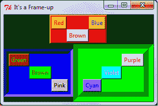

## 如何操作...

以通常的方式执行程序。

```py
# frame_1.py
#>>>>>>>>>>>>>>
from Tkinter import *
root = Tk()
root.config(bg="black")
root.title("It's a Frame-up")
#================================================
# frame_1 and her motley little family
frame_1 = Frame(root, bg="red", border = 4, relief="raised")
frame_1.grid(row=0, column=0, columnspan=2)
redbutton_1 = Button(frame_1, text="Red",bg ="orange", fg="red")
redbutton_1.grid(row=0, column=1)
greenbutton_1 = Button(frame_1, text="Brown",bg ="pink", fg="brown")
greenbutton_1.grid(row=1, column=2)
bluebutton_1 = Button(frame_1, text="Blue",bg ="yellow", fg="blue")
bluebutton_1.grid(row=0, column=3)
#================================================
# frame _2 and her neat blue home
frame_2 = Frame(root, bg="blue", border = 10, relief="sunken")
frame_2.grid(row=1, column=0)
redbutton_2 = Button(frame_2, text="Green",bg ="brown", fg="green")
redbutton_2.grid(row=0, column=1)
greenbutton_2 = Button(frame_2, text="Brown",bg ="green", fg="brown")
greenbutton_2.grid(row=2, column=2)
bluebutton_2 = Button(frame_2, text="Pink",bg ="gray", fg="black")
bluebutton_2.grid(row=3, column=3)
#================================================
# frame_3 with her friendly green home
frame_3 = Frame(root, bg="green", border = 20, relief="groove")
frame_3.grid(row=1, column=1)
redbutton_3 = Button(frame_3, text="Purple",bg ="white", fg="red")
redbutton_3.grid(row=0, column=3)
greenbutton_3 = Button(frame_3, text="Violet",bg ="cyan", fg="violet")
greenbutton_3.grid(row=2, column=2)
bluebutton_3 = Button(frame_3, text="Cyan",bg ="purple", fg="blue")
bluebutton_3.grid(row=3, column=0)
root.mainloop()

```

## 它是如何工作的...

框架的位置是相对于“根”窗口来指定的。

在每个框架内部，属于该框架的小部件都是按照不参考该框架外部任何内容的方式进行排列的。

例如，指定`redbutton_1.grid(row=0, column=1)`将`red_button`放置在网格几何中的`row=0`和`column=1`，这是红色框架`frame_1`的宇宙。红色按钮对框架外的世界一无所知。

## 更多...

第一次，我们将根 Tkinter 窗口的背景颜色从默认的灰色改为黑色。

# 附录 appA. 在 Microsoft Windows 中运行 Python 程序的快速提示

# 在 Microsoft Windows 中运行 Python 程序

在 Linux 操作系统上，Python 通常已经安装。它已经安装了 Tkinter、math 和其他许多库。您不需要修改任何系统搜索路径变量，如`Path`，来运行 Python。

Microsoft Windows 可能会抛出一些障碍，但克服它们并不太难。如果 Python 版本是 2.7，Python Windows 安装程序将在 Windows 目录`C:\Python27`中安装它需要的所有东西。Python 版本 2.6 将被存储在`C:\Python26`。

# 我们在哪里可以找到 Windows 安装程序？

我们可以在[www.python.org/download/](http://www.python.org/download/)找到它。当[www.python.org/download/](http://www.python.org/download/)页面打开时，选择**Python 2.7 Windows 安装程序（Windows 二进制文件不包含源代码）**。

这将下载一个名为`Python-2.7.msi`的文件到我们的 Windows `下载`文件夹。我们只需双击此文件，Python 2.7 版本就会自动安装到我们的系统中的`C:\Python27`。

# 我们必须使用 Python 2.7 版本吗？

不，这本书中的代码应该在 Python 版本 2.4、2.5、2.6 和 2.7 上运行。它已经被不同版本的人运行过。如果不修改新 Python 语法的要求，它将无法在 Python 3.0 及以上版本上运行。例如，print 必须改为 print（要打印的内容）。

# 为什么会出现"python 未识别…"？

这是因为当你在命令窗口中输入`python`时，Windows 操作系统不知道在哪里找到 Python，如下面的截图所示：

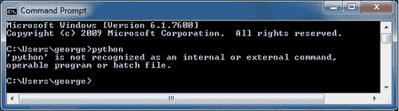

有三种方法可以解决这个问题：

1.  输入 python 和我们要运行的程序的全路径名称。在这个例子中，我们使用了名为`entry_box_1.py`的 python 程序。它被存储在名为`constr`的文件夹中，正如第一章中第一个示例*运行简短的 Python 程序*中所述。下面的截图显示了命令行对话框。`george`是登录到 Windows 的用户名。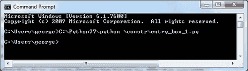

1.  在`Python27`文件夹内工作。我们执行的操作是`cd.`. 和 `cd.`. 再次。然后进入文件夹`Python27`。然后我们可以在命令行中输入`python \constr\entry_box_1.py`，如下面的截图所示：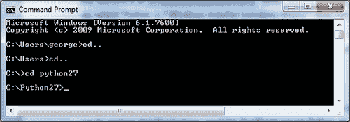

1.  修改 Windows 系统变量，告知 Windows 在哪里搜索可执行文件。我们通过在命令行窗口中输入`set PATH=%PATH%;C:\Python27`来完成此操作。从现在起，我们只需在任何文件夹中输入`python \constr\entry_box_.py`即可。实现这一点的对话框如下所示：

    截图：
