# 面向对象设计

在软件开发中，设计通常被认为是编程之前的步骤。这并不正确；实际上，分析、编程和设计往往重叠、结合和交织在一起。在本章中，我们将涵盖以下主题：

+   面向对象意味着什么

+   面向对象设计与面向对象编程之间的区别

+   面向对象设计的基本原则

+   基本统一建模语言（**UML**）及其不是邪恶的一面

# 介绍面向对象

每个人都知道什么是对象：一个我们可以感知、触摸和操作的有形物体。我们最早与之互动的对象通常是婴儿玩具。木块、塑料形状和超大的拼图块是常见的第一个对象。婴儿很快就会学到某些物体可以执行某些操作：铃铛会响，按钮会被按下，杠杆会被拉动。

软件开发中对象的定义并没有太大的不同。软件对象可能不是你可以拿起、感知或触摸的实体，但它们是能够执行某些操作并受到某些操作影响的模型。正式来说，对象是一组 **数据** 和相关的 **行为** 的集合。

那么，知道了什么是对象，面向对象意味着什么呢？在字典中，*面向* 意味着 *指向*。所以面向对象意味着功能上指向建模对象。这是用于建模复杂系统的许多技术之一。它通过描述一组通过其数据和行为的交互对象来定义。

如果你读过任何炒作，你可能已经遇到了术语 *面向对象分析*、*面向对象设计*、*面向对象分析与设计* 和 *面向对象编程*。这些都是在一般 *面向对象* 框架下高度相关的概念。

事实上，分析、设计和编程都是软件开发阶段。称它们为面向对象只是简单地指明了正在追求的软件开发级别。

**面向对象分析**（**OOA**）是观察一个问题、系统或任务（某人想要将其转化为应用程序）并确定这些对象及其之间交互的过程。分析阶段完全是关于 *需要做什么*。

分析阶段的输出是一系列需求。如果我们能够一步完成分析阶段，我们就会将一个任务，例如 *我需要一个网站*，转化为一系列需求。例如，以下是一些关于网站访问者可能需要执行的操作的需求（*斜体* 表示动作，**粗体** 表示对象）：

+   *回顾* 我们的 **历史**

+   *申请* **工作**

+   *浏览*、*比较* 和 *订购* **产品**

在某些方面，*分析*这个术语是不恰当的。我们之前讨论的那个婴儿并不是分析积木和拼图块。相反，她探索她的环境，操作形状，并观察它们可能适合的地方。更好的说法可能是*面向对象的探索*。在软件开发中，分析的初始阶段包括采访客户、研究他们的流程和排除可能性。

**面向对象设计**（**OOD**）是将这些需求转换成实施规范的过程。设计者必须命名对象、定义行为，并正式指定哪些对象可以激活其他对象上的特定行为。设计阶段完全是关于*如何*完成事情的问题。

设计阶段的输出是实施规范。如果我们能够一次性完成设计阶段，我们将把面向对象分析期间定义的需求转换成一组可以在（理想情况下）任何面向对象编程语言中实现的类和接口。

**面向对象编程**（**OOP**）是将这种完美定义的设计转换成能够完全满足 CEO 最初要求的实际程序的过程。

哎，对吧！如果世界能够达到这个理想状态，我们能够按部就班地遵循这些阶段，就像所有老教科书告诉我们的那样，那将是多么美好。但通常情况下，现实世界要复杂得多。无论我们多么努力地试图将这些阶段分开，我们总会发现设计过程中需要进一步分析的事情。当我们编程时，我们会发现设计中的特性需要澄清。

在大多数 21 世纪的发展中，都是在迭代开发模型下进行的。在迭代开发中，一小部分任务被建模、设计和编程，然后程序被审查和扩展，以改进每个特性并包含一系列短期开发周期中的新特性。

本书剩余部分是关于面向对象编程的，但在这章中，我们将从设计的角度介绍基本面向对象原则。这使我们能够在不与软件语法或 Python 跟踪回溯争论的情况下理解这些（相当简单）的概念。

# 对象和类

因此，对象是一组数据及其相关行为的集合。我们如何区分不同类型的对象？苹果和橙子都是对象，但有一个常见的谚语说它们不能比较。在计算机编程中，苹果和橙子很少被建模，但让我们假设我们正在为一个水果农场开发一个库存应用程序。为了方便这个例子，我们可以假设苹果放在桶里，橙子放在篮子里。

现在，我们有四种类型的对象：苹果、橙子、篮子和桶。在面向对象建模中，用于表示*对象类型*的术语是**类**。所以，从技术角度来说，我们现在有四种对象类别。

理解对象和类之间的区别很重要。类描述对象。它们是创建对象的蓝图。你面前桌子上可能有三只橙子。每个橙子都是一个独特的对象，但所有三个都具有与一个类相关的属性和行为：橙子的一般类别。

我们库存系统中四个对象类之间的关系可以用**统一建模语言**（通常简称为**UML**，因为三字母的首字母缩略词永远不会过时）的类图来描述。这是我们第一个类图：

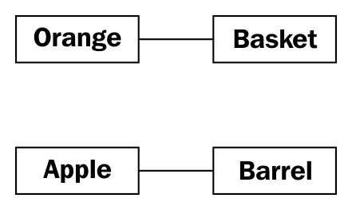

这个图显示了一个**橙子**与一个**篮子**有某种关联，而一个**苹果**也与一个**桶**有某种关联。*关联*是两个类之间最基本的关系方式。

UML 在管理者中非常受欢迎，偶尔也会被程序员所贬低。UML 图的语法通常相当明显；你不需要阅读教程就能（大部分情况下）理解你看到的内容。UML 也相当容易绘制，而且非常直观。毕竟，当描述类及其关系时，许多人会自然地画出带有线条的盒子。基于这些直观的图的标准使得程序员与设计师、管理者以及彼此之间的沟通变得容易。

然而，一些程序员认为 UML 是浪费时间。他们引用迭代开发，争论说，用花哨的 UML 图做出来的正式规范在实施之前就会变得多余，而且维护这些正式图只会浪费时间，对任何人都没有好处。

根据涉及的公司结构，这可能是真的，也可能不是。然而，任何由多个人组成的编程团队都可能会偶尔坐下来，讨论他们目前正在工作的子系统的细节。UML 在这些头脑风暴会议中对于快速而轻松的沟通非常有用。即使那些嘲笑正式类图的组织，在设计会议或团队讨论中也倾向于使用一些非正式版本的 UML。

此外，你将不得不与之沟通的最重要的人是你自己。我们都认为我们可以记住我们做出的设计决策，但总会有一些隐藏在我们未来的*我为什么要这么做？*的时刻。如果我们保留我们在开始设计时用于最初绘图的一些纸张碎片，我们最终会发现它们是一个有用的参考。

然而，本章的目的并不是要成为 UML 教程。互联网上有许多这样的教程，还有许多关于这个主题的书籍。UML 涵盖了远不止类和对象图；它还包括用例、部署、状态变化和活动的语法。在本章中，我们将讨论面向对象设计时的一些常见的类图语法。你可以通过例子来掌握结构，你会在自己的团队或个人设计会议中无意识地选择受 UML 启发的语法。

我们的初始图虽然正确，但并没有提醒我们苹果是放在桶里的，或者一个苹果可以放入多少个桶。它只告诉我们苹果以某种方式与桶相关联。类之间的关联通常是显而易见的，不需要进一步解释，但我们可以根据需要添加进一步的说明。

UML 的美丽之处在于大多数事情都是可选的。我们只需要在图中指定当前情况下有意义的信息。在快速的白板会议中，我们可能只是快速地在盒子之间画线。在正式的文档中，我们可能会更详细地说明。在苹果和桶的情况下，我们可以相当有信心地认为关联是**许多苹果放入一个桶中**，但为了确保没有人将其与**一个苹果坏了一个桶**混淆，我们可以增强如图所示的图：

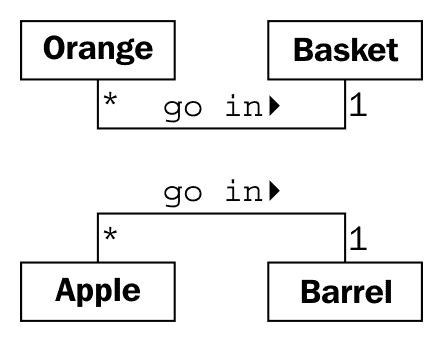

这个图告诉我们橙子**放入**篮子里，有一个小箭头显示是什么放入什么。它还告诉我们该对象在关系两边的关联中可以使用的数量。一个**篮子**可以容纳许多（用*****表示）**橙子**对象。任何一个**橙子**可以放入恰好一个**篮子**。这个数字被称为对象的**多重性**。你也可能听到它被描述为**基数**。这些实际上是略有区别的术语。基数指的是集合中实际的项目数量，而多重性指定了集合可能有多小或多大的范围。

我有时会忘记关系线的哪一端应该对应哪个多重性数字。离一个类最近的重数是该类中可以与关系线另一端任意一个对象关联的对象数量。对于苹果进桶的关联，从左到右阅读，许多**苹果**类的实例（即许多**苹果**对象）可以放入任何一个**桶**。从右到左阅读，恰好有一个**桶**可以与任何一个**苹果**关联。

# 指定属性和行为

现在我们已经掌握了一些基本的面向对象术语。对象是类的实例，可以相互关联。对象实例是具有自己数据和行为的具体对象；我们面前桌子上的一个特定橙子被称为橙子一般类的一个实例。这很简单，但让我们深入探讨这两个词的含义，*数据*和*行为*。

# 数据描述对象

让我们从数据开始。数据代表某个对象的个体特征。一个类可以定义一组特定的特征，这些特征被该类中的所有对象共享。任何特定的对象都可以具有给定特征的不同数据值。例如，我们桌子上的三个橙子（如果我们没有吃掉任何的话）可能每个的重量都不同。橙子类可以有一个重量属性来表示这个数据。所有橙子类的实例都有一个重量属性，但每个橙子在这个属性上都有不同的值。属性不必是唯一的；任何两个橙子可能重量相同。作为一个更现实的例子，代表不同客户的两个对象可能具有相同的姓氏属性。

属性通常被称为**成员**或**属性**。一些作者建议这两个术语有不同的含义，通常认为属性是可设置的，而属性是只读的。在 Python 中，*只读*的概念相当没有意义，所以在这本书的整个过程中，我们将看到这两个术语被互换使用。此外，正如我们将在第五章中讨论的，*何时使用面向对象编程*，Python 中的`property`关键字对于特定类型的属性有特殊含义。

在我们的水果库存应用中，水果农民可能想知道橙子来自哪个果园，什么时候采摘的，以及它的重量。他们还可能想要跟踪每个**篮子**的存放位置。苹果可能有颜色属性，桶可能有不同的大小。一些这些属性也可能属于多个类（我们可能还想知道苹果的采摘时间），但在这个第一个例子中，让我们只为我们的类图添加一些不同的属性：

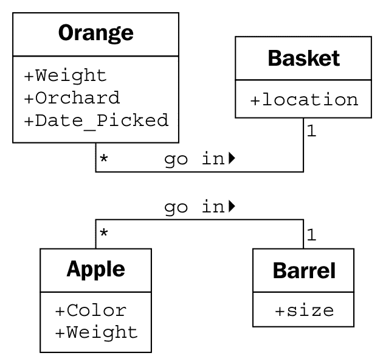

根据我们的设计需求有多详细，我们还可以指定每个属性的类型。属性类型通常是大多数编程语言的标准原语，例如整数、浮点数、字符串、字节或布尔值。然而，它们也可以表示数据结构，如列表、树或图，或者最值得注意的是，其他类。这是设计阶段可以与编程阶段重叠的一个领域。一种编程语言中可用的各种原语或对象可能与另一种语言中可用的不同：

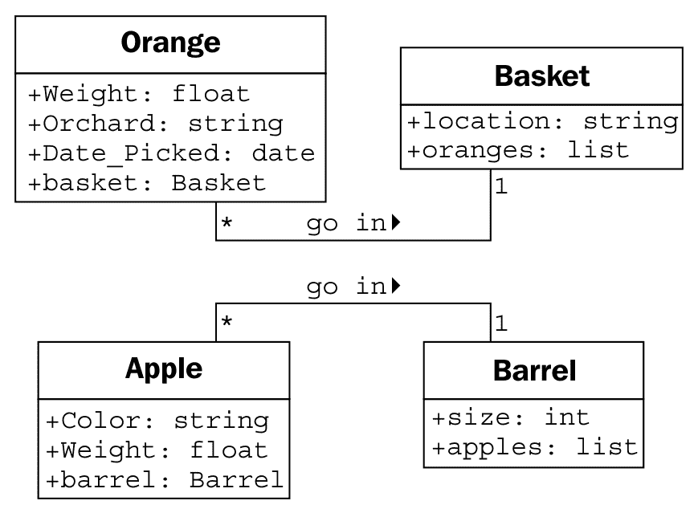

通常，在设计阶段我们不需要过分关注数据类型，因为实现特定的细节是在编程阶段选择的。通用名称通常足以用于设计。如果我们的设计需要列表容器类型，Java 程序员可以选择在实现时使用`LinkedList`或`ArrayList`，而 Python 程序员（也就是我们！）可能会在`list`内置和`tuple`之间进行选择。

在我们之前的果农例子中，我们的属性都是基本原始数据类型。然而，有一些隐含的属性我们可以明确化——关联。对于一个特定的橙子，我们可能有一个属性指向包含该橙子的篮子。

# 行为是动作

现在我们已经知道了什么是数据，最后一个未定义的术语是*行为*。行为是在对象上可以发生的动作。可以在特定类对象上执行的行为被称为**方法**。在编程层面，方法类似于结构化编程中的函数，但它们*神奇地*可以访问与该对象关联的所有数据。像函数一样，方法也可以接受**参数**并返回**值**。

方法参数以对象列表的形式提供给方法，这些对象需要传递到该方法中。在特定调用期间传递到方法中的实际对象实例通常被称为**参数**。这些对象被方法用来执行它打算执行的行为或任务。返回值是那个任务的结果。

我们已经将我们的*比较苹果和橙子*例子扩展成了一个基本的（如果有些牵强）库存应用。让我们再进一步扩展它，看看它是否会崩溃。可以与橙子关联的一个动作是**采摘**动作。如果你考虑实现，**采摘**需要做两件事：

+   通过更新橙子的**篮子**属性将橙子放入篮子

+   将橙子添加到给定**篮子**上的**橙子**列表中。

因此，**采摘**需要知道它正在处理哪个篮子。我们通过给**采摘**方法一个**篮子**参数来实现这一点。由于我们的果农也出售果汁，我们可以在**橙子**类中添加一个**挤压**方法。当被调用时，**挤压**方法可能会返回提取的果汁量，同时也会从它所在的**篮子**中移除**橙子**。

**篮子**类可以有一个**出售**动作。当一个篮子被出售时，我们的库存系统可能会更新一些尚未指定的对象上的数据，用于会计和利润计算。或者，我们的橙子篮子在我们能够出售它们之前可能会变质，所以我们添加了一个**丢弃**方法。让我们将这些方法添加到我们的图中：

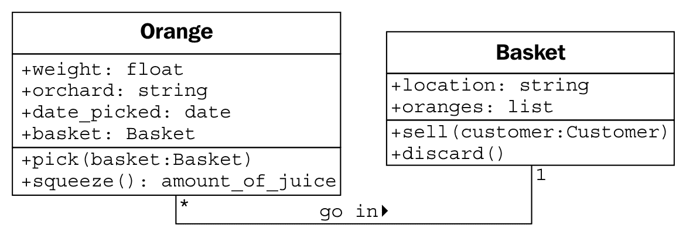

向单个对象添加属性和方法使我们能够创建一个**系统**，其中包含交互的对象。系统中的每个对象都是某个类的成员。这些类指定了对象可以持有哪些类型的数据以及可以对其调用的方法。每个对象中的数据可能与其他相同类的实例处于不同的状态；由于状态的不同，每个对象可能对方法调用的反应不同。

面向对象的分析与设计主要是关于弄清楚那些对象是什么以及它们应该如何交互。下一节将描述可以用来使这些交互尽可能简单直观的原则。

# 隐藏细节和创建公共接口

在面向对象设计中建模对象的关键目的是确定该对象的公共**接口**将是什么。接口是其他对象可以访问以与该对象交互的属性和方法集合。它们不需要，并且通常不允许访问对象的内部工作原理。

一个常见的现实世界例子是电视。我们与电视的接口是遥控器。遥控器上的每个按钮都代表可以在电视对象上调用的方法。当我们作为调用对象访问这些方法时，我们不知道或关心电视是从有线电视连接、卫星天线还是互联网设备接收信号。我们不在乎调整音量的电子信号是什么，或者声音是针对扬声器还是耳机。如果我们打开电视以访问内部工作原理，例如，将输出信号分割到外部扬声器和一套耳机，我们将使保修失效。

这种隐藏对象实现的过程被称为**信息隐藏**。它有时也被称为**封装**，但实际上封装是一个更全面的术语。封装的数据不一定被隐藏。封装字面上是指创建一个胶囊（想想创建一个时间胶囊）。如果你把一堆信息放入一个时间胶囊，锁上并埋藏起来，它既被封装，信息也被隐藏了。另一方面，如果时间胶囊没有被埋藏，或者被打开或者是由透明塑料制成，里面的物品仍然被封装，但没有信息隐藏。

封装和信息隐藏之间的区别在很大程度上是不相关的，尤其是在设计层面。许多实际参考手册将这些术语互换使用。作为 Python 程序员，我们实际上没有或不需要真正的信息隐藏（我们将在第二章，*Python 中的对象*）中讨论这个原因），所以封装的更全面的定义是合适的。

然而，公共接口非常重要。它需要仔细设计，因为将来很难更改它。更改接口将破坏所有访问它的客户端对象。我们可以随意更改内部结构，例如，使其更高效，或者通过网络以及本地访问数据，客户端对象仍然可以通过公共接口与之通信，无需修改。另一方面，如果我们通过更改公开访问的属性名称或方法可以接受的参数的顺序或类型来更改接口，所有客户端类也必须进行修改。在设计公共接口时，要简单。始终根据使用难度来设计对象的接口，而不是编码难度（这条建议也适用于用户界面）。

记住，程序对象可能代表真实对象，但这并不意味着它们是真实对象。它们是模型。建模最大的礼物之一是能够忽略无关的细节。我小时候制作的模型汽车在外观上看起来像 1956 年的真实雷鸟，但它显然不能行驶。当我太小不能开车时，这些细节过于复杂且无关紧要。模型是对真实概念的**抽象**。

**抽象**是另一个与封装和信息隐藏相关的面向对象术语。抽象意味着处理与给定任务最合适的细节级别。它是从内部细节中提取公共接口的过程。汽车的驾驶员需要与方向盘、油门和刹车进行交互。发动机、传动系统和刹车子系统的运作对驾驶员来说并不重要。另一方面，机械师在另一个抽象级别上工作，调整发动机和放刹车。以下是一个关于汽车的两种抽象级别的例子：

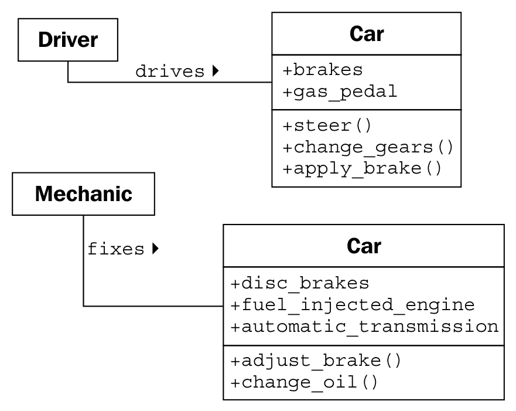

现在，我们有几个新术语指的是类似的概念。让我们用几句话总结所有这些术语：抽象是将信息封装在独立的公共和私有接口中的过程。私有接口可以受到信息隐藏的影响。

从所有这些定义中可以吸取的重要教训是，使我们的模型易于其他与之交互的对象理解。这意味着要仔细关注细节。确保方法和属性有合理的名称。在分析系统时，对象通常代表原始问题中的名词，而方法通常是动词。属性可能表现为形容词或更多的名词。相应地命名你的类、属性和方法。

在设计接口时，想象你自己是对象，并且你对隐私有着非常强烈的偏好。不要让其他对象访问关于你的数据，除非你认为这对他们来说是有利的。除非你确信你想让他们能够这样做，否则不要给他们一个接口来强迫你执行特定的任务。

# 组成

到目前为止，我们已经学会了将系统设计为一组相互作用的对象，其中每个交互都涉及在适当的抽象层次上查看对象。但我们还不知道如何创建这些抽象层次。有各种方法可以做到这一点；我们将在第八章“字符串和序列化”和第九章“迭代器模式”中讨论一些高级设计模式。但即使大多数设计模式也依赖于两个基本面向对象原则，即**组合**和**继承**。组合更简单，所以让我们从它开始。

组成是将几个对象组合在一起以创建一个新的对象的行为。当某个对象是另一个对象的一部分时，组成通常是一个不错的选择。我们在力学示例中已经看到了组成的一个初步提示。一辆化石燃料汽车由发动机、变速箱、起动机、前灯和挡风玻璃等众多部件组成。发动机反过来又由活塞、曲轴和阀门组成。在这个例子中，组成是一种提供抽象层次的好方法。**汽车**对象可以提供驾驶员所需的接口，同时也可以访问其组成部分，这为机械师提供了适合的更深层次的抽象。当然，如果机械师需要更多信息来诊断问题或调整发动机，这些组成部分还可以进一步分解。

汽车是组成的一个常见入门示例，但在设计计算机系统时并不特别有用。物理对象很容易分解成组成部分。人们至少从古希腊人最初提出原子是物质的最小单位（他们当然没有粒子加速器）以来就在做这件事。计算机系统通常比物理对象简单，但在这些系统中识别组成部分并不像自然那样发生。

面向对象系统中的对象有时代表物理对象，如人、书籍或电话。然而，更常见的是，它们代表抽象概念。人们有名字，书籍有标题，电话用于打电话。通话、标题、账户、名字、约会和付款通常不被视为物理世界中的对象，但它们都是计算机系统中经常建模的组成部分。

让我们尝试建模一个更面向计算机的例子，以看到组合的实际应用。我们将查看计算机化棋类游戏的设计。这在 20 世纪 80 年代和 90 年代是学术界非常流行的一种消遣方式。人们预测计算机有一天能够击败人类象棋大师。当 1997 年发生这件事时（IBM 的深蓝击败了世界象棋冠军加里·卡斯帕罗夫），人们对这个问题的兴趣减弱了。如今，计算机总是获胜。

作为一种基本的、高级的分析，一场**象棋**游戏是在两个**玩家**之间**进行**的，使用一个包含 64 个位置在 8x8 网格中的**棋盘**。棋盘可以有两套 16 个**棋子**，这些棋子可以通过两位玩家交替**移动**，以不同的方式移动。每个棋子可以**吃掉**其他棋子。在每一步之后，棋盘都需要在计算机**屏幕**上**绘制**自己。

我在描述中用斜体标出了可能的对象，并用粗体标出了一些关键的方法。这是将面向对象的分析转化为设计时的常见第一步。在这个阶段，为了强调组合，我们将专注于棋盘，而不会过多地考虑玩家或不同类型的棋子。

让我们从可能的最高的抽象层次开始。我们有两个玩家通过轮流移动棋子与**棋盘**进行交互：

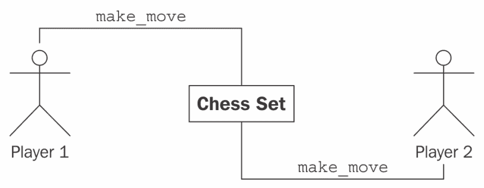

这并不完全像我们之前看到的类图，这是好事，因为它不是类图！这是一个**对象图**，也称为**实例图**。它描述了系统在特定时间的状态，并描述了特定对象的具体实例，而不是类之间的交互。记住，两位玩家都是同一类的成员，所以类图看起来有点不同：

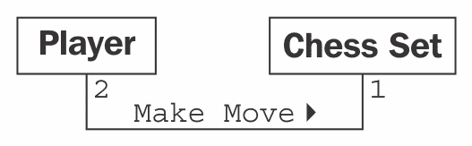

图表显示，恰好有两个玩家可以与一个棋盘进行交互。这也表明任何一位玩家一次只能与一个**棋盘**进行游戏。

然而，我们讨论的是组合，而不是 UML，所以让我们思考一下**棋盘**是由什么组成的。我们现在并不关心玩家是由什么组成的。我们可以假设玩家有一颗心和大脑，以及其他器官，但这些对我们模型来说并不相关。实际上，没有任何阻止这位玩家本身就是深蓝（Deep Blue）这样的机器人的，它既没有心也没有脑。

那么，棋盘是由棋盘和 32 个棋子组成的。棋盘进一步由 64 个位置组成。你可以争论棋子不是棋盘的一部分，因为你可以用另一套棋子替换棋盘中的棋子。虽然在计算机化的棋类游戏中这不太可能或不可能，但它引出了**聚合**的概念。

聚合几乎与组合完全相同。区别在于聚合对象可以独立存在。一个位置不可能与不同的棋盘相关联，所以我们说棋盘由位置组成。但是棋子，可能独立于棋盘存在，我们说它们与该棋盘处于聚合关系。

区分聚合和组合的另一种方法是思考对象的生命周期。如果组合（外部）对象控制相关（内部）对象的创建和销毁时间，那么组合是最合适的。如果相关对象独立于组合对象创建，或者可以比该对象存在更长时间，那么聚合关系更有意义。此外，请记住，组合是聚合；聚合只是组合的一种更一般的形式。任何组合关系也是聚合关系，但反之则不然。

让我们描述我们当前的**棋盘**组合，并为对象添加一些属性以持有组合关系：

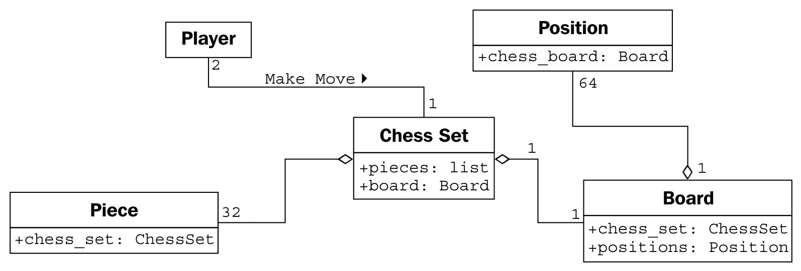

在 UML 中，组合关系用实心菱形表示。空心菱形表示聚合关系。你会注意到，棋盘和棋子作为**棋盘**的一部分被存储，就像它们作为属性存储在棋盘上一样。这表明，在实践中，一旦过了设计阶段，聚合和组合之间的区别通常是不相关的。实现时，它们的行为几乎相同。然而，当你的团队讨论不同对象如何交互时，了解这两者的区别可能会有所帮助。通常，你可以将它们视为同一事物，但当你需要区分它们时（通常是在谈论相关对象存在的时间长度时），了解区别是非常有用的。

# 继承

我们讨论了对象之间三种类型的关系：关联、组合和聚合。然而，我们尚未完全指定我们的棋盘，这些工具似乎并没有给我们提供我们需要的所有功能。我们讨论了玩家可能是一个人类或者可能是一块具有人工智能功能的软件的可能性。说玩家与人类相关联，或者人工智能实现是玩家对象的一部分，似乎并不合适。我们真正需要的是能够说“Deep Blue 是一个玩家”，或者“Gary Kasparov 是一个玩家”。

“是一种”关系是通过**继承**形成的。继承是面向对象编程中最著名、最知名、也是最被过度使用的关联。继承有点像家谱。我的祖父的姓氏是菲利普斯，我父亲继承了那个姓氏。我从他那里继承了。在面向对象编程中，不是从一个人那里继承特性和行为，一个类可以继承另一个类的属性和方法。

例如，在我们的棋盘上共有 32 个棋子，但实际上只有六种不同的棋子类型（兵、车、象、马、王和后），每种棋子在移动时表现都不同。所有这些棋子类别都有属性，例如颜色和它们所属的棋盘，但它们在棋盘上绘制时也有独特的形状，并且移动方式也不同。让我们看看这六种类型的棋子是如何从**棋子**类中继承的：

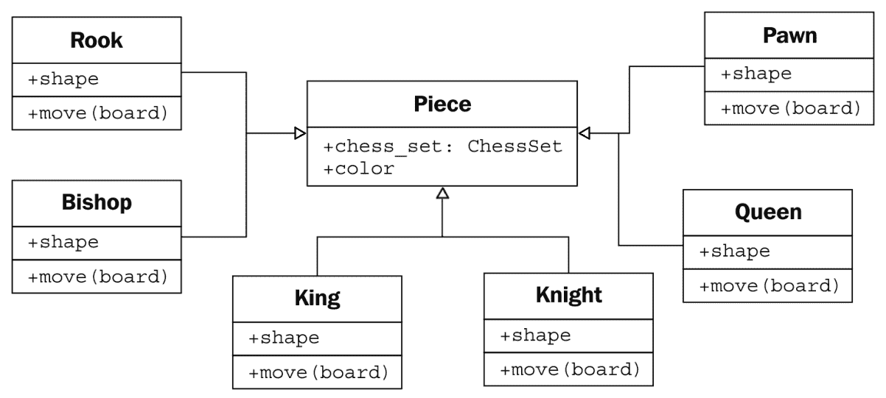

空心箭头表示各个棋子类别从**棋子**类继承。所有子类自动继承自基类的**棋盘**和**颜色**属性。每个棋子提供不同的形状属性（在渲染棋盘时绘制到屏幕上），以及不同的**移动**方法，在每个回合将棋子移动到棋盘上的新位置。

实际上，我们知道所有**棋子**类的子类都需要有一个**移动**方法；否则，当棋盘尝试移动棋子时，它会感到困惑。我们可能想要创建一个新版本的棋类游戏，增加一个额外的棋子（法师）。我们当前的设计将允许我们不给它一个**移动**方法来设计这个棋子。然后，当棋盘要求棋子移动自己时，它就会陷入困境。

我们可以通过在**棋子**类上创建一个虚拟的移动方法来解决这个问题。子类可以随后用更具体的实现来**重写**这个方法。默认实现可能，例如，弹出一个错误消息，说**这个棋子不能移动**。

在子类中重写方法允许开发非常强大的面向对象系统。例如，如果我们想实现一个具有人工智能的**玩家**类，我们可能会提供一个`calculate_move`方法，该方法接受一个**棋盘**对象并决定将哪个棋子移动到哪个位置。一个非常基本的类可能会随机选择一个棋子和方向并相应地移动它。然后我们可以在子类中重写这个方法，使用 Deep Blue 实现。第一个类适合与初学者对弈；后者则可以挑战大师。重要的是，类中的其他方法，例如通知棋盘选择了哪个移动的方法，不需要改变；这种实现可以在两个类之间共享。

在棋子的例子中，提供移动方法的默认实现实际上并不合理。我们只需要指定任何子类都需要实现移动方法。这可以通过将**Piece**类声明为**抽象类**并声明移动方法为**抽象方法**来实现。抽象方法基本上是这样说的：

我们要求任何非抽象子类都必须存在这种方法，但我们拒绝在这个类中指定实现。

事实上，可以创建一个完全不实现任何方法的类。这样的类只会告诉我们类应该做什么，但不会提供任何关于如何做的建议。在面向对象的术语中，这样的类被称为**接口**。

# 继承提供了抽象

让我们探索面向对象术语中最长的词。**多态性**是指根据实现的子类不同而以不同的方式对待类的能力。我们已经在我们描述的棋子系统中看到了它的实际应用。如果我们进一步扩展设计，我们可能会看到**棋盘**对象可以接受玩家的移动并调用棋子的**移动**函数。棋盘不必永远知道它正在处理什么类型的棋子。它只需要调用**移动**方法，适当的子类就会负责将其移动为**骑士**或**兵**。

多态性非常酷，但在 Python 编程中这个词很少被使用。Python 允许子类像父类一样被对待，这已经是一个额外的步骤。在 Python 中实现的棋盘可以接受任何具有**移动**方法的对象，无论是主教棋子、汽车还是鸭子。当调用**移动**时，**主教**会在棋盘上斜着移动，汽车会开到某个地方，鸭子会根据它的情绪游泳或飞翔。

这种 Python 中的多态性通常被称为**鸭子类型**：*如果它像鸭子走路或游泳，它就是鸭子*。我们不在乎它是否真的是一只鸭子（“是”是继承的一个基石），只在乎它是否会游泳或走路。鹅和天鹅可能很容易提供我们想要的类似鸭子的行为。这允许未来的设计师创建新的鸟类类型，而无需实际上指定水鸟的继承层次。它还允许他们创建完全不同的即插即用行为，这是原始设计师从未计划过的。例如，未来的设计师可能能够制作一个既能行走又能游泳的企鹅，它可以使用相同的接口，而无需暗示企鹅是鸭子。

# 多重继承

当我们想到自己的家族树中的继承时，我们可以看到我们不仅仅从父母那里继承了特征。当陌生人告诉一个自豪的母亲她的儿子有他父亲的眼睛时，她通常会回答说，*是的，但他继承了我的鼻子*。

面向对象设计也可以有这种**多重继承**，允许子类从多个父类中继承功能。在实践中，多重继承可能是一个棘手的问题，一些编程语言（最著名的是 Java）严格禁止它。然而，多重继承有其用途。最常见的是，它可以用来创建具有两个不同行为集的对象。例如，一个设计用来连接扫描仪并发送扫描文档的传真可能是由继承自两个不同的`scanner`和`faxer`对象创建的。

只要两个类有独特的接口，一个子类从这两个类中继承通常是没有害处的。然而，如果我们从提供重叠接口的两个类中继承，就会变得混乱。例如，如果我们有一个摩托车类，它有一个`move`方法，还有一个也有`move`方法的船类，我们想要将它们合并成终极两栖车辆，当调用`move`时，结果类知道该做什么呢？在设计层面，这需要解释，在实现层面，每种编程语言都有不同的方式来决定调用哪个父类的方法，或者调用顺序。

通常，处理它的最好方法是避免它。如果你有一个像这样的设计出现，你*可能*做错了。退一步，再次分析系统，看看你是否可以移除多重继承关系，转而使用其他关联或组合设计。

继承是扩展行为的一个非常强大的工具。它也是面向对象设计相对于早期范式的最市场化的进步之一。因此，它通常是面向对象程序员首先寻求的工具。然而，重要的是要认识到，拥有锤子并不意味着螺丝就会变成钉子。继承是解决明显的“是...的”关系的完美方案，但它可能会被滥用。程序员经常使用继承在两种只有遥远关系的对象之间共享代码，而看不到“是...的”关系。虽然这不一定是一个坏的设计，但它是一个很好的机会去问为什么他们决定那样设计，以及是否有不同的关系或设计模式可能更适合。

# 案例研究

让我们通过在某个相对真实世界的例子上迭代几次面向对象设计，将所有新的面向对象知识结合起来。我们将要模拟的系统是一个图书馆目录。图书馆已经跟踪他们的库存几个世纪了，最初使用卡片目录，而最近则是电子库存。现代图书馆有基于网络的目录，我们可以在家中查询。

让我们从分析开始。本地图书管理员要求我们编写一个新的卡片目录程序，因为他们的基于古老 Windows XP 的程序既丑陋又过时。这并没有给我们太多细节，但在我们开始要求更多信息之前，让我们考虑一下我们已经了解的关于图书馆目录的情况。

目录包含书籍列表。人们通过它们来查找特定主题、特定标题或特定作者的书籍。书籍可以通过**国际标准书号**（**ISBN**）唯一识别。每本书都有一个**杜威十进制分类法**（**DDS**）编号，以帮助在特定书架上找到它。

这个简单的分析告诉我们系统中的一些明显对象。我们很快就能确定**书籍**是最重要的对象，它具有一些已经提到的属性，如作者、标题、主题、ISBN 和 DDS 编号，而目录则是一种书籍的管理者。

我们还注意到一些可能需要或不需要在系统中建模的其他对象。为了目录目的，我们只需要在书籍上有一个`author_name`属性来通过作者搜索书籍。然而，作者也是对象，我们可能想要存储有关作者的其他数据。当我们思考这个问题时，我们可能会记得有些书籍有多个作者。突然之间，在对象上有一个单独的`author_name`属性的想法似乎有点愚蠢。与每本书关联的作者列表显然是一个更好的主意。

作者和书籍之间的关系显然是关联，因为你永远不会说*一本书是一个作者*（这不是继承），虽然语法正确，但说*一本书有一个作者*并不暗示作者是书籍的一部分（这不是聚合）。实际上，任何一位作者都可能关联到多本书。

我们还应该注意名词（名词总是作为对象的良好候选者）*书架*。书架是否需要被建模在目录系统中？我们如何识别一个单独的书架？如果一本书存放在一个书架的末端，后来因为前一个书架中插入了一本新书而被移动到下一个书架的起始位置，会发生什么？

DDS（图书定位系统）被设计用来帮助在图书馆中定位实体书籍。因此，在书籍上存储一个 DDS 属性应该足以定位它，无论它存放在哪个书架上。所以，至少目前我们可以从我们的竞争对象列表中移除书架。

系统中另一个有疑问的对象是用户。我们需要了解关于特定用户的信息吗，比如他们的名字、地址或逾期未还的书籍列表？到目前为止，图书管理员只告诉我们他们想要一个目录；他们没有提到跟踪订阅或逾期通知。在我们心中，我们也注意到作者和用户都是特定种类的人；未来这里可能存在一个有用的继承关系。

为了编目目的，我们决定现在不需要识别用户。我们可以假设用户会搜索目录，但我们不需要在系统中积极建模他们，除了提供一个允许他们搜索的界面。

我们在书上识别了一些属性，但目录有哪些属性？是否有一个图书馆拥有多个目录？我们需要唯一地识别它们吗？显然，目录必须以某种方式收集它包含的书籍，但这个列表可能不是公共接口的一部分。

关于行为呢？目录显然需要一个搜索方法，可能还有针对作者、标题和主题的单独搜索方法。书籍有什么行为吗？它需要一个预览方法吗？或者预览能否通过第一页属性而不是方法来识别？

前面讨论中的问题都是面向对象分析阶段的一部分。但是，在这些问题中，我们已经开始识别一些关键对象，它们是设计的一部分。实际上，你所看到的正是分析和设计之间的几个微观迭代。

很可能，这些迭代都会在最初的与图书管理员的会面中发生。然而，在这次会议之前，我们已经在以下方面为我们已经具体确定的物体草拟了一个最基本的设计：

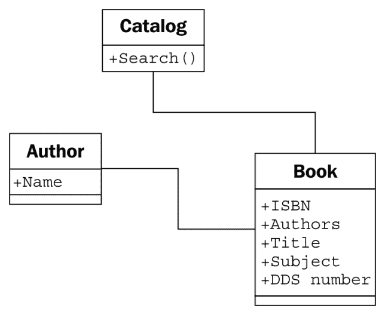

拥有这张基本图和一支铅笔来交互式地改进它，我们与图书管理员会面。他们告诉我们这是一个好的开始，但图书馆不仅仅提供书籍；它们还有 DVD、杂志和 CD，这些都没有 ISBN 或 DDC 编号。不过，所有这些类型的物品都可以通过 UPC 编号唯一识别。我们提醒图书管理员他们必须找到书架上的物品，而这些物品可能不是按 UPC 编号组织的。图书管理员解释说每种类型都是按不同的方式组织的。CD 主要是有声书，库存只有二十多本，所以它们是按作者的姓氏组织的。DVD 按类型划分，并进一步按标题组织。杂志按标题组织，然后按卷号和期号细化。正如我们所猜测的，书籍是按 DDC 编号组织的。

在没有先前的面向对象设计经验的情况下，我们可能会考虑在我们的目录中添加 DVD、CD、杂志和书籍的单独列表，并依次搜索每一个。问题是，除了某些扩展属性和识别物品的物理位置之外，这些物品的行为几乎相同。这是一个继承的任务！我们迅速更新我们的 UML 图如下：

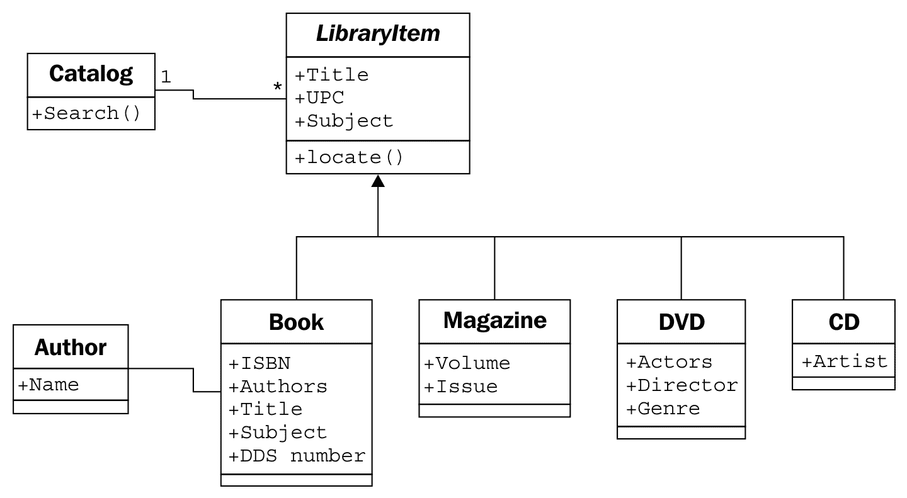

图书管理员理解我们绘制的图的大意，但对**定位**功能有些困惑。我们通过一个具体的用例来解释，其中用户正在搜索单词*bunnies*。用户首先向目录发送搜索请求。目录查询其内部项目列表，并找到标题中包含*bunnies*的书籍和 DVD。在此阶段，目录并不关心它持有的是 DVD、书籍、CD 还是杂志；对目录来说，所有项目都是相同的。然而，用户想知道如何找到实体物品，因此如果目录仅仅返回一个标题列表，它就会失职。所以，它会对其发现的两个物品调用**定位**方法。书籍的**定位**方法返回一个可以用来找到存放书籍的书架的 DDS 编号。DVD 通过返回 DVD 的类型和标题来定位。然后用户可以访问 DVD 区域，找到包含该类型的区域，并按标题排序找到具体的 DVD。

正如我们解释的那样，我们绘制一个 UML **序列图**，解释各种对象是如何进行通信的：

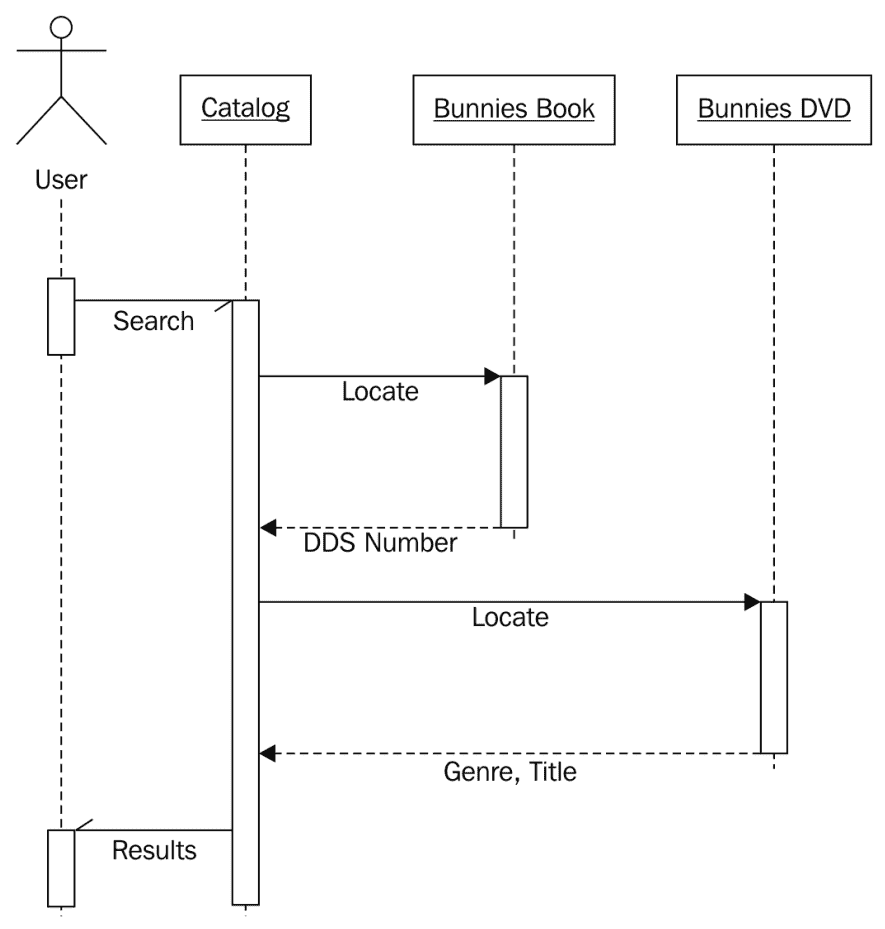

虽然类图描述了类之间的关系，但序列图描述了对象之间传递的具体消息序列。每个对象悬挂的虚线表示描述对象生命周期的**生命线**。每个生命线上的较宽的框代表该对象中的活动处理（如果没有框，对象基本上处于空闲状态，等待发生某事）。生命线之间的水平箭头表示特定的消息。实线箭头表示正在调用的方法，而带有实心头的虚线箭头表示方法的返回值。

半箭头表示发送到或从对象发送的异步消息。异步消息通常意味着第一个对象在第二个对象上调用一个方法，然后立即返回。经过一些处理，第二个对象在第一个对象上调用一个方法以提供值。这与正常的方法调用形成对比，正常的方法调用在方法中执行处理，并立即返回值。

序列图，就像所有的 UML 图一样，最好只在需要时使用。为了画图而画 UML 图是没有意义的。然而，当你需要传达两个对象之间的一系列交互时，序列图是一个非常有用的工具。

不幸的是，我们到目前为止的类图仍然是一个混乱的设计。我们注意到 DVD 上的演员和 CD 上的艺术家都是人的类型，但与书籍作者的处理方式不同。图书管理员也提醒我们，他们的大部分 CD 是有声读物，这些读物有作者而不是艺术家。

我们如何处理对标题做出贡献的不同类型的人呢？一个明显的实现方法是创建一个包含个人姓名和其他相关细节的`Person`类，然后为艺术家、作者和演员创建这个类的子类。然而，在这里继承真的必要吗？出于搜索和编目目的，我们并不关心表演和写作是两种非常不同的活动。如果我们正在进行经济模拟，为演员和作者提供不同的类，以及不同的`calculate_income`和`perform_job`方法是有意义的，但为了编目目的，了解个人如何对项目做出贡献就足够了。经过深思熟虑，我们认识到所有项目都有一个或多个`Contributor`对象，因此我们将作者关系从书籍移动到其父类：

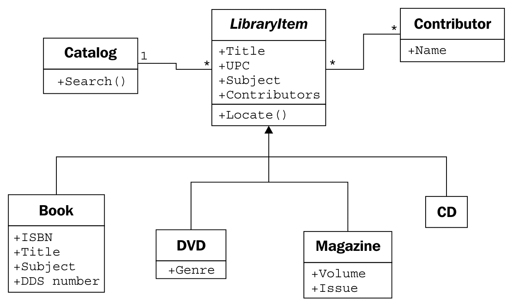

**Contributor**/**LibraryItem**关系的多重性是**多对多**的，正如一个关系两端都有的*****字符所示。任何一个图书馆项目可能有多个贡献者（例如，DVD 上的几个演员和一个导演）。许多作者写了许多书，所以他们可能被附加到多个图书馆项目上。

这个小小的改动，虽然看起来更干净、更简单，却丢失了一些重要的信息。我们仍然可以知道谁对某个图书馆项目做出了贡献，但我们不知道他们是如何贡献的。他们是导演还是演员？他们写了有声书，还是他们是讲述这本书的声音？

如果我们能在**Contributor**类上添加一个`contributor_type`属性，那会很好，但当处理既写书又导演电影的多才多艺的人时，这将会崩溃。

一种选择是为我们的每个**LibraryItem**子类添加属性来保存所需的信息，例如**Book**上的**Author**或**CD**上的**Artist**，然后让这些属性与**Contributor**类的关系都指向**Contributor**类。问题是，我们失去了很多多态的优雅。如果我们想列出项目的贡献者，我们必须查找该项目的特定属性，例如**Authors**或**Actors**。我们可以通过在**LibraryItem**类上添加一个**GetContributors**方法来解决此问题，子类可以覆盖这个方法。这样，编目就永远不需要知道对象正在查询哪些属性；我们已经抽象了公共接口：

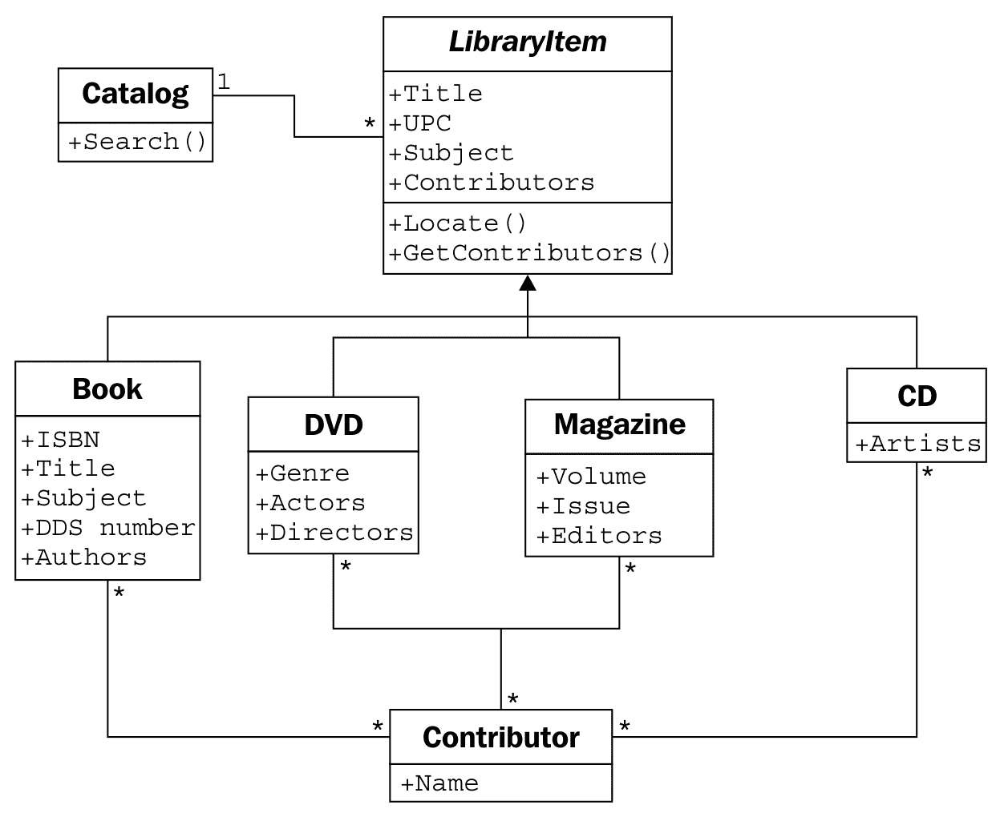

只看这个类图，感觉我们做错了什么。它又大又脆弱。它可能做我们需要的所有事情，但它感觉很难维护或扩展。关系太多，任何一个类的修改都可能影响到许多类。它看起来像意大利面和肉丸。

现在我们已经探讨了继承作为选择，并发现它不够理想，我们可能会回顾之前的基于组合的图表，其中**贡献者**直接附加到**图书馆项目**上。经过一些思考，我们可以看到，实际上我们只需要向一个全新的类添加一个关系来标识贡献者的类型。这是面向对象设计中的一个重要步骤。我们现在正在向设计中添加一个旨在**支持**其他对象的类，而不是模拟初始需求中的任何部分。我们正在**重构**设计，以促进系统中的对象，而不是现实生活中的对象。重构是维护程序或设计的一个基本过程。重构的目标是通过移动代码、删除重复代码或复杂关系，以更简单、更优雅的设计来改进设计。

这个新类由一个**贡献者**和一个额外属性组成，用于标识该人对给定**图书馆项目**所做的贡献类型。对于特定的**图书馆项目**，可能会有许多此类贡献，并且一个贡献者可以用相同的方式对不同的项目做出贡献。以下图表很好地传达了这种设计：

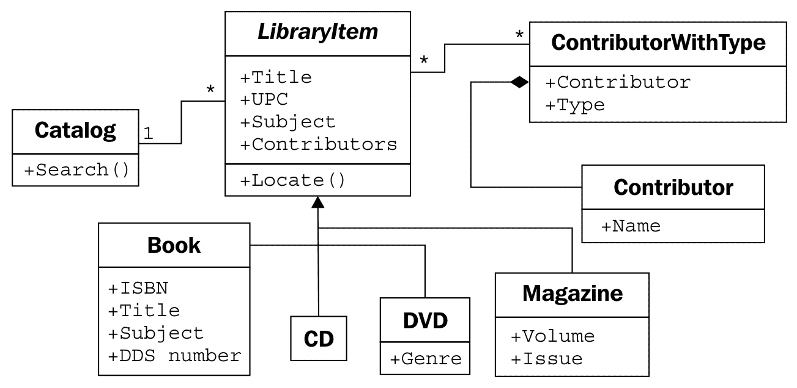

最初，这种组合关系看起来不如基于继承的关系自然。然而，它有一个优点，即允许我们在不向设计中添加新类的情况下添加新的贡献类型。继承在子类具有某种**专业化**时最有用。专业化是在子类上创建或更改属性或行为，使其在某种程度上与父类不同。创建一大堆空类仅用于识别不同类型的对象似乎很愚蠢（这种态度在 Java 和其他“一切皆对象”的程序员中较少见，但在更务实的 Python 设计师中很常见）。如果我们看看继承版本的图表，我们可以看到一大堆实际上什么也不做的子类：

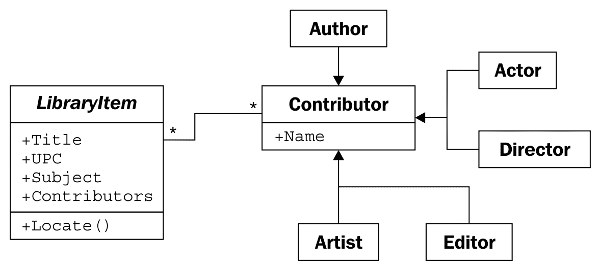

有时候，认识到何时不使用面向对象原则是很重要的。这个不使用继承的例子是一个很好的提醒，即对象只是工具，而不是规则。

# 练习

这是一本实用的书，而不是教科书。因此，我不会给你分配一大堆虚构的面向对象分析问题，让你去分析和设计。相反，我想给你一些你可以应用到自己的项目中的想法。如果你有面向对象的经验，你不需要在这个章节上投入太多精力。然而，如果你已经使用 Python 一段时间，但从未真正关心过所有这些类的东西，它们仍然是有用的心智练习。

首先，思考一下你最近完成的一个编程项目。确定设计中最突出的对象。尽可能多地考虑这个对象的属性。它有以下几个属性吗：颜色？重量？大小？利润？成本？名称？ID 号码？价格？风格？

思考属性类型。它们是原始类型还是类？其中一些属性实际上是伪装成行为的行为？有时，看起来像是数据的东西实际上是从对象上的其他数据计算出来的，你可以使用方法来进行这些计算。对象还有哪些其他方法或行为？哪些对象调用了这些方法？它们与这个对象有什么样的关系？

现在，思考一下即将到来的项目。项目是什么并不重要；它可能是一个有趣的业余项目，也可能是一份价值数百万美元的合同。它不必是一个完整的应用程序；可能只是一个子系统。进行基本的面向对象分析。确定需求和交互对象。绘制一个展示该系统最高抽象级别的类图。确定主要交互对象。确定次要支持对象。对一些最有趣的对象的属性和方法进行详细分析。将不同对象抽象到不同层次。寻找可以使用继承或组合的地方。寻找应该避免继承的地方。

目标不是设计一个系统（尽管如果你有意愿，当然欢迎这样做，只要你的抱负与可用时间相匹配）。目标是思考面向对象设计。专注于你曾经工作过的项目，或者你预期将来要工作的项目，这仅仅使它变得真实。

最后，访问你最喜欢的搜索引擎，查找一些关于 UML 的教程。有很多，所以找到适合你学习偏好的一个。为之前确定的对象绘制一些类图或序列图。不要过于纠结于记忆语法（毕竟，如果它很重要，你总是可以再次查找）；只需感受一下这种语言。一些东西会留在你的脑海中，如果你能快速绘制出下一个面向对象讨论的图表，这可以使沟通变得更容易。

# 摘要

在本章中，我们快速浏览了面向对象范式的术语，重点关注面向对象设计。我们可以将不同的对象分离成不同类的分类，并通过类接口描述这些对象的属性和行为。抽象、封装和信息隐藏是高度相关的概念。对象之间存在许多不同类型的关系，包括关联、组合和继承。UML 语法对于娱乐和沟通非常有用。

在下一章中，我们将探讨如何在 Python 中实现类和方法。
