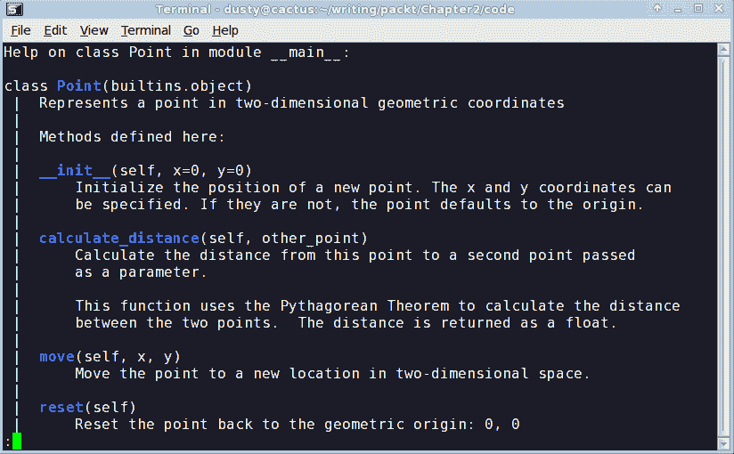
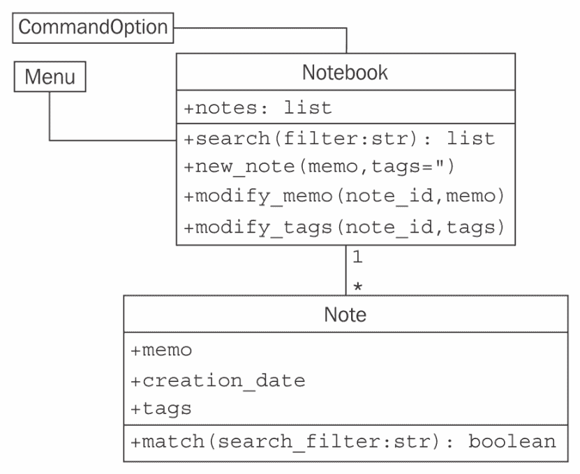

# Python 中的对象

因此，我们现在手头有一个设计方案，准备将其转化为一个可工作的程序！当然，事情通常不会这样发生。本书中我们将看到关于良好软件设计的例子和提示，但我们的重点是面向对象编程。那么，让我们看看 Python 语法，它允许我们创建面向对象的软件。

完成本章后，我们将理解以下内容：

+   如何在 Python 中创建类和实例化对象

+   如何给 Python 对象添加属性和行为

+   如何将类组织到包和模块中

+   如何建议人们不要破坏我们的数据

# 创建 Python 类

我们不需要写很多 Python 代码就能意识到 Python 是一种非常**干净**的语言。当我们想要做某事时，我们只需去做，无需设置一大堆先决条件代码。Python 中无处不在的**hello world**，正如你可能看到的，只是一行代码。

类似地，Python 3 中最简单的类看起来是这样的：

```py
class MyFirstClass: 
    pass 
```

这就是我们的第一个面向对象程序！类定义以`class`关键字开始。随后是一个名称（我们自行选择），用于标识这个类，并以冒号结束。

类名必须遵循标准的 Python 变量命名规则（它必须以字母或下划线开头，并且只能由字母、下划线或数字组成）。此外，Python 风格指南（在网络上搜索*PEP 8*）建议使用**CapWords**命名法（以大写字母开头；任何后续单词也应以大写字母开头）。

类定义行后面跟着类的内容，并缩进。与其他 Python 构造一样，缩进用于界定类，而不是大括号、关键字或括号，正如许多其他语言所使用的。此外，根据风格指南，除非有充分的理由（例如，与使用制表符缩进的他人代码兼容），否则使用四个空格进行缩进。

由于我们的第一个类实际上没有添加任何数据或行为，我们只需在第二行使用`pass`关键字来表示不需要采取任何进一步的操作。

我们可能会认为我们无法对这个最基本的类做太多事情，但它确实允许我们实例化该类的对象。我们可以将这个类加载到 Python 3 解释器中，这样我们就可以与之交互。为此，将前面提到的类定义保存到一个名为`first_class.py`的文件中，然后运行`python -i first_class.py`命令。`-i`参数告诉 Python 运行代码然后进入交互式解释器。以下解释器会话演示了与这个类的基本交互：

```py
>>> a = MyFirstClass()
>>> b = MyFirstClass()
>>> print(a)
<__main__.MyFirstClass object at 0xb7b7faec>
>>> print(b)
<__main__.MyFirstClass object at 0xb7b7fbac>
>>>  
```

这段代码从新类中实例化了两个对象，分别命名为 `a` 和 `b`。创建一个类的实例很简单，只需输入类名，然后跟上一对括号。这看起来就像一个正常的函数调用，但 Python 知道我们正在调用一个类而不是一个函数，因此它理解自己的任务是创建一个新的对象。当打印时，这两个对象会告诉我们它们属于哪个类以及它们所在的内存地址。在 Python 代码中，内存地址并不常用，但在这里，它们展示了有两个不同的对象参与其中。

# 添加属性

现在，我们有一个基本的类，但它相当无用。它不包含任何数据，也不做任何事情。我们该如何给一个特定的对象分配属性？

实际上，我们不需要在类定义中做任何特别的事情。我们可以使用点表示法在实例化的对象上设置任意属性：

```py
class Point: 
    pass 

p1 = Point() 
p2 = Point() 

p1.x = 5 
p1.y = 4 

p2.x = 3 
p2.y = 6 

print(p1.x, p1.y) 
print(p2.x, p2.y) 
```

如果我们运行这段代码，最后的两个 `print` 语句会告诉我们两个对象上的新属性值：

```py
5 4
3 6
```

这段代码创建了一个空的 `Point` 类，没有数据或行为。然后，它创建了该类的两个实例，并将每个实例的 `x` 和 `y` 坐标分配给它们，以标识二维空间中的一个点。要给对象上的属性赋值，我们只需使用 `<object>.<attribute> = <value>` 语法。这有时被称为 **点表示法**。你可能在阅读标准库或第三方库提供的对象属性时遇到过这种相同的表示法。值可以是任何东西：Python 原始数据类型、内置数据类型或另一个对象。甚至可以是一个函数或另一个类！

# 让它做点什么

现在我们有了具有属性的对象，但面向对象编程真正关注的是对象之间的交互。我们感兴趣的是调用动作，这些动作会导致属性发生变化。我们有了数据；现在是我们给我们的类添加行为的时候了。

让我们在 `Point` 类上模拟一些动作。我们可以从一个名为 `reset` 的 **方法** 开始，该方法将点移动到原点（原点是 `x` 和 `y` 都为零的地方）。这是一个很好的入门动作，因为它不需要任何参数：

```py
class Point: 
 def reset(self): 
        self.x = 0 
        self.y = 0 

p = Point() 
p.reset() 
print(p.x, p.y) 
```

这个 `print` 语句显示了属性上的两个零：

```py
0 0  
```

在 Python 中，方法的格式与函数完全相同。它以 `def` 关键字开始，后面跟一个空格，然后是方法名。接着是一对括号，包含参数列表（我们将在稍后讨论 `self` 参数），并以冒号结束。下一行缩进以包含方法内的语句。这些语句可以是任意操作对象本身和任何传入参数的 Python 代码，方法可以自行决定。

# 自言自语

在方法和普通函数之间，从语法上讲有一个区别，那就是所有方法都有一个必需的参数。这个参数传统上被命名为`self`；我从未见过任何 Python 程序员为这个变量使用其他名称（惯例是非常强大的）。然而，你当然可以将其命名为`this`或甚至`Martha`。

方法中的`self`参数是对调用该方法的对象的引用。我们可以像访问任何其他对象一样访问该对象的属性和方法。这正是我们在`reset`方法内部设置`self`对象的`x`和`y`属性时所做的事情。

在这个讨论中要注意**类**和**对象**之间的区别。我们可以将**方法**视为附加到类上的函数。**self**参数是该类的特定实例。当你对两个不同的对象调用方法时，你实际上是两次调用相同的方法，但传递了两个不同的**对象**作为**self**参数。

注意，当我们调用`p.reset()`方法时，我们不需要将其`self`参数传递给它。Python 会自动为我们处理这部分。它知道我们正在调用`p`对象的`reset`方法，因此它会自动将那个对象传递给方法。

然而，方法实际上只是一个恰好位于类上的函数。我们可以在类上调用函数，而不是在对象上调用方法，并明确传递我们的对象作为`self`参数：

```py
>>> p = Point() 
>>> Point.reset(p) 
>>> print(p.x, p.y) 
```

输出与上一个例子相同，因为内部发生的正是完全相同的过程。

如果我们在类定义中忘记包含`self`参数会发生什么？Python 会抛出一个错误信息，如下所示：

```py
>>> class Point:
... def reset():
... pass
...
>>> p = Point()
>>> p.reset()
Traceback (most recent call last):
 File "<stdin>", line 1, in <module>
TypeError: reset() takes 0 positional arguments but 1 was given
```

错误信息并不像它本可以那样清晰（嘿，傻瓜，你忘了`self`参数会更具有信息量）。只需记住，当你看到指示缺少参数的错误信息时，首先要检查的是你是否在方法定义中忘记了`self`。

# 更多参数

那么，我们如何向方法传递多个参数呢？让我们添加一个新的方法，允许我们将一个点移动到任意位置，而不仅仅是原点。我们还可以包括一个接受另一个`Point`对象作为输入并返回它们之间距离的方法：

```py
import math

class Point:
 def move(self, x, y):
        self.x = x
        self.y = y

    def reset(self):
        self.move(0, 0)

 def calculate_distance(self, other_point):
        return math.sqrt(
            (self.x - other_point.x) ** 2
            + (self.y - other_point.y) ** 2
        )

# how to use it:
point1 = Point()
point2 = Point()

point1.reset()
point2.move(5, 0)
print(point2.calculate_distance(point1))
assert point2.calculate_distance(point1) == point1.calculate_distance(
    point2
)
point1.move(3, 4)
print(point1.calculate_distance(point2))
print(point1.calculate_distance(point1))
```

结尾的`print`语句给出了以下输出：

```py
5.0
4.47213595499958
0.0  
```

这里发生了很多事情。现在类有三个方法。`move`方法接受两个参数，`x`和`y`，并将这些值设置在`self`对象上，就像上一个例子中的旧`reset`方法一样。旧的`reset`方法现在调用`move`，因为重置实际上是将对象移动到特定的已知位置。

`calculate_distance`方法使用不太复杂的勾股定理来计算两点之间的距离。我希望你理解数学（`**2`表示平方，`math.sqrt`计算平方根），但这不是我们当前关注的重点，即学习如何编写方法。

前一个示例末尾的示例代码显示了如何带参数调用一个方法：只需在括号内包含参数，并使用相同的点符号来访问方法。我只是随机选择了一些位置来测试方法。测试代码调用每个方法并在控制台上打印结果。`assert`函数是一个简单的测试工具；如果`assert`后面的语句评估为`False`（或零、空或`None`），程序将退出。在这种情况下，我们使用它来确保距离无论哪个点调用另一个点的`calculate_distance`方法都是相同的。

# 初始化对象

如果我们没有明确设置我们的`Point`对象的`x`和`y`位置，无论是使用`move`还是直接访问它们，我们就会得到一个没有实际位置的损坏点。当我们尝试访问它时会发生什么？

嗯，让我们试一试看看。*试一试看看*是 Python 学习的一个极其有用的工具。打开你的交互式解释器并开始输入。以下交互会话显示了如果我们尝试访问一个缺失的属性会发生什么。如果你将前面的示例保存为文件或正在使用与书籍一起分发的示例，你可以使用`python -i more_arguments.py`命令将其加载到 Python 解释器中：

```py
>>> point = Point()
>>> point.x = 5
>>> print(point.x)
5
>>> print(point.y)
Traceback (most recent call last):
 File "<stdin>", line 1, in <module>
AttributeError: 'Point' object has no attribute 'y' 
```

嗯，至少它抛出了一个有用的异常。我们将在第四章中详细讨论异常，*预料之外的事*。你可能之前见过它们（特别是无处不在的 SyntaxError，这意味着你输入了错误的东西！）在这个阶段，只需意识到这意味着出了点问题。

输出对于调试很有用。在交互式解释器中，它告诉我们错误发生在第 1 行，这在一定程度上是正确的（在交互会话中，一次只执行一行）。如果我们在一个文件中运行脚本，它会告诉我们确切的行号，这使得找到有问题的代码变得容易。此外，它告诉我们错误是一个`AttributeError`，并给出一个有用的消息，告诉我们这个错误意味着什么。

我们可以捕捉并从这种错误中恢复，但在这个情况下，感觉我们应该指定某种默认值。也许每个新对象都应该默认调用`reset()`，或者也许如果我们可以强制用户在创建对象时告诉我们这些位置应该是什么，那会更好。

大多数面向对象的编程语言都有**构造函数**的概念，这是一个在对象创建时创建和初始化对象的特殊方法。Python 有点不同；它有一个构造函数*和*一个初始化器。构造函数函数很少使用，除非你在做非常特别的事情。因此，我们将从更常见的初始化方法开始讨论。

Python 的初始化方法与其他方法相同，只是它有一个特殊名称，`__init__`。开头和结尾的双下划线意味着这是一个特殊方法，Python 解释器会将其视为特殊情况。

不要以双下划线开头和结尾为自己的方法命名。在当今的 Python 中，这可能没有任何意义，但总是有可能 Python 的设计者将来会添加一个具有该名称的特殊目的函数，并且当这样做时，你的代码将会出错。

让我们在`Point`类中添加一个初始化函数，该函数要求用户在实例化`Point`对象时提供`x`和`y`坐标：

```py
class Point: 
 def __init__(self, x, y): 
        self.move(x, y) 

    def move(self, x, y): 
        self.x = x 
        self.y = y 

    def reset(self): 
        self.move(0, 0) 

# Constructing a Point 
point = Point(3, 5) 
print(point.x, point.y) 
```

现在，我们的点永远不能没有`y`坐标！如果我们尝试构建一个没有包括适当的初始化参数的点，它将失败并显示一个类似于我们之前忘记`self`参数时收到的`not enough arguments`错误。

如果我们不希望这两个参数是必需的，我们可以使用 Python 函数提供默认参数的相同语法。关键字参数语法在每个变量名后附加一个等号。如果调用对象没有提供此参数，则使用默认参数。这些变量仍然可用于函数，但它们将具有在参数列表中指定的值。以下是一个示例：

```py
class Point: 
    def __init__(self, x=0, y=0): 
        self.move(x, y) 
```

大多数时候，我们将初始化语句放在`__init__`函数中。但如前所述，Python 除了初始化函数外还有一个构造函数。你可能永远不需要使用其他 Python 构造函数（在超过十年的专业 Python 编码中，我只能想到两个我使用过的情况，其中之一，我可能根本不应该使用它！），但了解它的存在是有帮助的，所以我们将简要介绍它。

构造函数函数被称为`__new__`而不是`__init__`，它接受恰好一个参数；正在构建的**类**（它在对象构建之前被调用，所以没有`self`参数）。它还必须返回新创建的对象。这在复杂的元编程艺术中具有有趣的潜力，但在日常 Python 中并不很有用。实际上，你很少需要使用`__new__`。`__init__`方法几乎总是足够的。

# 解释自己

Python 是一种极其易于阅读的编程语言；有些人可能会说它是自文档化的。然而，在进行面向对象编程时，编写清晰地总结每个对象和方法功能的 API 文档非常重要。保持文档更新是困难的；最好的方法是将其直接写入我们的代码中。

Python 通过使用 **docstrings** 来支持这一点。每个类、函数或方法头都可以有一个标准的 Python 字符串作为定义之后的第一个行（即以冒号结束的行）。这一行应该与随后的代码缩进相同。

Docstrings 是用单引号 (`'`) 或双引号 (`"`) 字符包围的 Python 字符串。通常，docstrings 非常长，跨越多行（风格指南建议行长度不应超过 80 个字符），可以格式化为多行字符串，用匹配的三重单引号 (`'''`) 或三重引号 (`"""`) 字符包围。

一个 docstring 应该清楚地简洁地总结所描述的类或方法的目的。它应该解释任何使用不是立即明显的参数，并且也是包含 API 使用短示例的好地方。任何 API 的不知情用户应该注意的警告或问题也应被记录。

为了说明 docstrings 的使用，我们将以我们完全文档化的 `Point` 类结束本节：

```py
import math

class Point:
    "Represents a point in two-dimensional geometric coordinates"

    def __init__(self, x=0, y=0):
        """Initialize the position of a new point. The x and y
           coordinates can be specified. If they are not, the
           point defaults to the origin."""
        self.move(x, y)

    def move(self, x, y):
        "Move the point to a new location in 2D space."
        self.x = x
        self.y = y

    def reset(self):
        "Reset the point back to the geometric origin: 0, 0"
        self.move(0, 0)

    def calculate_distance(self, other_point):
        """Calculate the distance from this point to a second
        point passed as a parameter.

        This function uses the Pythagorean Theorem to calculate
        the distance between the two points. The distance is
        returned as a float."""

        return math.sqrt(
            (self.x - other_point.x) ** 2
            + (self.y - other_point.y) ** 2
        )
```

尝试将此文件（记住，它是 `python -i point.py`）输入到交互式解释器中。然后，在 Python 提示符下输入 `help(Point)<enter>`。

你应该能看到关于类的格式化文档，如下面的截图所示：



# 模块和包

现在我们知道了如何创建类和实例化对象。在你开始失去对它们的跟踪之前，你不需要编写太多的类（或者非面向对象的代码）。对于小型程序，我们只需将所有类放入一个文件中，并在文件末尾添加一个小脚本以启动它们之间的交互。然而，随着我们的项目增长，在定义的许多类中找到需要编辑的一个类可能会变得困难。这就是 **模块** 发挥作用的地方。模块只是 Python 文件，没有更多。我们小型程序中的单个文件是一个模块。两个 Python 文件是两个模块。如果我们有同一文件夹中的两个文件，我们可以在另一个模块中使用来自一个模块的类。

例如，如果我们正在构建一个电子商务系统，我们可能会在数据库中存储大量数据。我们可以将所有与数据库访问相关的类和函数放入一个单独的文件中（我们将它命名为有意义的名称：`database.py`）。然后，我们的其他模块（例如，客户模型、产品信息和库存）可以从中导入类以访问数据库。

`import` 语句用于导入模块或从模块中导入特定的类或函数。我们已经在上一节中的 `Point` 类中看到了一个例子。我们使用 `import` 语句来获取 Python 的内置 `math` 模块，并在 `distance` 计算中使用其 `sqrt` 函数。

这里有一个具体的例子。假设我们有一个名为`database.py`的模块，其中包含一个名为`Database`的类。第二个名为`products.py`的模块负责处理与产品相关的查询。在这个阶段，我们不需要过多考虑这些文件的内容。我们知道的是，`products.py`需要从`database.py`中实例化`Database`类，以便能够在数据库的产品表中执行查询。

有几种不同的`import`语句语法变体可以用来访问类：

```py
import database 
db = database.Database() 
# Do queries on db 
```

这个版本将`database`模块导入到`products`命名空间（当前在模块或函数中可访问的名称列表）中，因此`database`模块中的任何类或函数都可以使用`database.<something>`的表示法访问。或者，我们可以使用`from...import`语法只导入我们需要的那个类：

```py
from database import Database 
db = Database() 
# Do queries on db 
```

如果由于某种原因，`products`已经有一个名为`Database`的类，而我们不想这两个名称混淆，我们可以在`products`模块中使用时重命名这个类：

```py
from database import Database as DB 
db = DB() 
# Do queries on db 
```

我们也可以在一个语句中导入多个项目。如果我们的`database`模块还包含一个`Query`类，我们可以使用以下代码同时导入这两个类：

```py
from database import Database, Query 
```

一些资料称，我们可以使用这种语法从`database`模块导入所有类和函数：

```py
from database import * 
```

**不要这样做**。大多数经验丰富的 Python 程序员会告诉你永远不应该使用这种语法（有些人会告诉你有一些非常具体的情况这种语法是有用的，但我不同意）。他们会用一些晦涩的理由来辩解，比如*它会使命名空间变得混乱*，这对初学者来说并没有太多意义。学习为什么要避免这种语法的一种方法就是使用它，然后尝试在两年后理解你的代码。但我们可以通过现在快速的解释来节省一些时间和避免两年糟糕的代码！

当我们使用`from database import Database`在文件顶部显式导入`database`类时，我们可以很容易地看到`Database`类来自哪里。我们可能在文件中的 400 行后使用`db = Database()`，然后我们可以快速查看导入以确定那个`Database`类来自哪里。然后，如果我们需要澄清如何使用`Database`类，我们可以访问原始文件（或在交互式解释器中导入模块并使用`help(database.Database)`命令）。然而，如果我们使用`from database import *`语法，找到那个类所在的位置会花费更长的时间。代码维护变得是一场噩梦。

此外，大多数代码编辑器能够提供额外的功能，例如可靠的代码补全、跳转到类的定义或内联文档，如果使用正常的导入语法。`import *`语法通常完全破坏了它们执行这些功能的能力。

最后，使用`import *`语法可能会将意外的对象引入我们的本地命名空间。当然，它会导入导入的模块中定义的所有类和函数，但它也会导入任何本身被导入到该文件中的类或模块！

在模块中使用的每个名称都应该来自一个明确指定的位置，无论是定义在该模块中，还是明确从另一个模块导入。不应该有似乎凭空出现的魔法变量。我们应该始终能够立即识别出我们当前命名空间中名称的来源。我保证，如果你使用这种邪恶的语法，你总有一天会遇到极其令人沮丧的时刻，比如“这个类究竟是从哪里来的？”

为了好玩，试着在你的交互式解释器中输入`import this`。它会打印一首优美的诗（其中包含一些可以忽略的内部玩笑），总结了一些 Python 程序员倾向于实践的习惯用法。针对这次讨论，请注意这一行*明确优于隐晦*。明确将名称导入你的命名空间会使你的代码比隐式的`import *`语法更容易导航。

# 模块组织

随着项目的增长，成为一个模块集合，我们可能会发现我们想要添加另一个抽象层，在我们的模块级别上的一种嵌套层次结构。然而，我们不能在模块中放置模块；毕竟，一个文件只能包含一个文件，模块只是文件。

然而，文件可以放在文件夹中，模块也是如此。**包**是一个文件夹中模块的集合。包的名称是文件夹的名称。我们需要告诉 Python 一个文件夹是一个包，以区分目录中的其他文件夹。为此，在文件夹中放置一个（通常是空的）名为`__init__.py`的文件。如果我们忘记这个文件，我们就无法从该文件夹导入模块。

让我们把我们的模块放在工作文件夹中的`ecommerce`包里，这个文件夹还将包含一个`main.py`文件来启动程序。此外，我们还可以在`ecommerce`包内添加另一个包，用于各种支付选项。文件夹的层次结构将如下所示：

```py
parent_directory/ 
    main.py 
    ecommerce/ 
        __init__.py 
        database.py 
        products.py 
        payments/ 
            __init__.py 
            square.py 
            stripe.py 
```

当在包之间导入模块或类时，我们必须小心语法。在 Python 3 中，有两种导入模块的方式：绝对导入和相对导入。

# 绝对导入

**绝对导入**指定了我们想要导入的模块、函数或类的完整路径。如果我们需要访问`products`模块中的`Product`类，我们可以使用以下任何一种语法进行绝对导入：

```py
import ecommerce.products 
product = ecommerce.products.Product() 

//or

from ecommerce.products import Product 
product = Product() 

//or

from ecommerce import products 
product = products.Product() 
```

`import`语句使用点操作符来分隔包或模块。

这些语句可以从任何模块中工作。我们可以在`main.py`、`database`模块或两个支付模块中的任何一个中使用这种语法实例化`Product`类。实际上，假设这些包对 Python 可用，它将能够导入它们。例如，这些包也可以安装在 Python 站点包文件夹中，或者可以自定义`PYTHONPATH`环境变量，以动态地告诉 Python 搜索哪些文件夹以查找它将要导入的包和模块。

因此，有了这些选择，我们选择哪种语法？这取决于你的个人喜好和手头的应用。如果`products`模块中有几十个类和函数是我想要使用的，我通常使用`from ecommerce import products`语法导入模块名称，然后使用`products.Product`访问单个类。如果我只需要从`products`模块中导入一个或两个类，我可以用`from ecommerce.products import Product`语法直接导入它们。我个人很少使用第一种语法，除非我有一些名称冲突（例如，我需要访问两个完全不同的名为`products`的模块，并且需要将它们分开）。做你认为可以使你的代码看起来更优雅的事情。

# 相对导入

当在包内部处理相关模块时，指定完整路径似乎有点多余；我们知道我们的父模块叫什么名字。这就是**相对导入**发挥作用的地方。相对导入基本上是一种找到类、函数或模块的方式，它是相对于当前模块的位置而言的。例如，如果我们正在`products`模块中工作，并且想要从旁边的`database`模块导入`Database`类，我们可以使用相对导入：

```py
from .database import Database 
```

`database`前面的点表示*使用当前包内的数据库模块*。在这种情况下，当前包是我们正在编辑的`products.py`文件所在的包，即`ecommerce`包。

如果我们正在`ecommerce.payments`包内部编辑`paypal`模块，我们可能希望，例如，*在父包中使用数据库包*。这可以通过两个点轻松完成，如下所示：

```py
from ..database import Database 
```

我们可以使用更多的点来进一步向上层结构移动。当然，我们也可以向下移动一边然后再向上移动。我们没有足够深的示例层次结构来正确说明这一点，但如果我们有一个包含`email`模块的`ecommerce.contact`包，并且想要将`send_mail`函数导入我们的`paypal`模块，以下将是一个有效的导入：

```py
from ..contact.email import send_mail 
```

这个导入使用了两个点，表示*支付包的父包*，然后使用正常的`package.module`语法向下进入联系包。

最后，我们可以直接从包中导入代码，而不是仅导入包内的模块。在这个例子中，我们有一个名为 `ecommerce` 的包，包含两个名为 `database.py` 和 `products.py` 的模块。数据库模块包含一个 `db` 变量，它被许多地方访问。如果可以像 `import ecommerce.db` 一样导入，而不是 `import ecommerce.database.db`，那岂不是更方便？

记得定义目录为包的 `__init__.py` 文件吗？这个文件可以包含我们喜欢的任何变量或类声明，它们将作为包的一部分可用。在我们的例子中，如果 `ecommerce/__init__.py` 文件包含以下行：

```py
from .database import db 
```

然后，我们可以使用以下导入方式从 `main.py` 或任何其他文件中访问 `db` 属性：

```py
from ecommerce import db 
```

如果将 `__init__.py` 文件想象成如果它是 `ecommerce.py` 文件，那么它将是一个模块而不是包，可能会有所帮助。如果你将所有代码放在一个模块中，后来决定将其拆分成模块包，这也会很有用。新包的 `__init__.py` 文件仍然可以成为其他模块与之通信的主要接触点，但代码可以内部组织成几个不同的模块或子包。

我建议不要在 `__init__.py` 文件中放置太多代码。程序员不会期望在这个文件中发生实际逻辑，并且与 `from x import *` 类似，如果他们在寻找特定代码的声明而找不到，直到检查 `__init__.py`，这可能会让他们感到困惑。

# 组织模块内容

在任何单个模块内部，我们可以指定变量、类或函数。它们可以是一个方便的方式来存储全局状态，而不会出现命名空间冲突。例如，我们一直在将 `Database` 类导入到各个模块中，然后实例化它，但可能更有意义的是，让 `database` 模块全局只有一个 `database` 对象。`database` 模块可能看起来像这样：

```py
class Database: 
    # the database implementation 
    pass 

database = Database() 
```

然后，我们可以使用我们讨论过的任何导入方法来访问 `database` 对象，例如：

```py
from ecommerce.database import database 
```

前一个类的问题在于，当模块首次导入时，`database` 对象立即被创建，这通常发生在程序启动时。这并不总是理想的，因为连接到数据库可能需要一段时间，从而减慢启动速度，或者数据库连接信息可能尚未可用。我们可以通过调用一个 `initialize_database` 函数来延迟创建数据库，直到实际需要时，从而创建一个模块级别的变量：

```py
class Database: 
    # the database implementation 
    pass 

database = None 

def initialize_database(): 
    global database 
    database = Database() 
```

`global` 关键字告诉 Python，`initialize_database` 中的数据库变量是我们刚刚定义的模块级别的。如果我们没有指定变量为全局，Python 将创建一个新的局部变量，该变量在方法退出时将被丢弃，而模块级别的值将保持不变。

如这两个示例所示，所有模块级别的代码在导入时都会立即执行。然而，如果它在方法或函数内部，函数将被创建，但其内部代码将不会执行，直到函数被调用。这对于执行脚本的脚本（如我们电子商务示例中的主脚本）来说可能是一个棘手的问题。有时，我们编写了一个有用的程序，然后后来发现我们希望将模块中的函数或类导入到不同的程序中。然而，一旦我们导入它，模块级别的任何代码都会立即执行。如果我们不小心，我们可能会在实际上只想访问该模块中的几个函数时运行第一个程序。

为了解决这个问题，我们应该始终将启动代码放在一个函数中（传统上称为`main`），并且只有在我们知道正在以脚本方式运行模块时才执行该函数，而不是当我们的代码被从不同的脚本导入时。我们可以通过在条件语句中**保护**对`main`的调用来实现这一点，如下所示：

```py
class UsefulClass:
    """This class might be useful to other modules."""

    pass

def main():
    """Creates a useful class and does something with it for our module."""
    useful = UsefulClass()
    print(useful)

if __name__ == "__main__":
    main()
```

每个模块都有一个`__name__`特殊变量（记住，Python 使用双下划线表示特殊变量，例如类的`__init__`方法），它指定了模块被导入时的名称。当模块直接使用`python module.py`执行时，它永远不会被导入，因此`__name__`被任意设置为`"__main__"`字符串。制定一个政策，将所有脚本包裹在`if __name__ == "__main__":`测试中，以防将来你编写了一个可能希望被其他代码导入的函数。

因此，方法被放入类中，类被放入模块中，模块被放入包中。这就是全部了吗？

实际上，不是这样。这是 Python 程序中事物典型的顺序，但不是唯一的可能布局。类可以定义在任何地方。它们通常在模块级别定义，但也可以在函数或方法内部定义，如下所示：

```py
def format_string(string, formatter=None):
    """Format a string using the formatter object, which 
    is expected to have a format() method that accepts 
    a string."""

    class DefaultFormatter:
        """Format a string in title case."""

        def format(self, string):
            return str(string).title()

    if not formatter:
        formatter = DefaultFormatter()

    return formatter.format(string)

hello_string = "hello world, how are you today?"
print(" input: " + hello_string)
print("output: " + format_string(hello_string))
```

输出如下：

```py
 input: hello world, how are you today?
output: Hello World, How Are You Today?
```

`format_string`函数接受一个字符串和可选的格式化对象，然后将格式化器应用于该字符串。如果没有提供格式化器，它将创建一个本地类作为格式化器并实例化它。由于它是在函数的作用域内创建的，因此这个类不能从该函数之外的地方访问。同样，函数也可以在函数内部定义；一般来说，任何 Python 语句都可以在任何时候执行。

这些内部类和函数偶尔用于一次性项目，这些项目不需要或值得在模块级别拥有自己的作用域，或者只在单个方法内部有意义。然而，在 Python 代码中频繁使用这种技术并不常见。

# 谁可以访问我的数据？

大多数面向对象的编程语言都有一个**访问控制**的概念。这与抽象有关。一个对象上的某些属性和方法被标记为私有，意味着只有那个对象可以访问它们。其他的是受保护的，意味着只有那个类及其任何子类可以访问。其余的是公共的，意味着任何其他对象都可以访问它们。

Python 不这样做。Python 并不真正相信强制执行可能会在未来阻碍你的法律。相反，它提供了未强制执行的指南和最佳实践。技术上，类上的所有方法和属性都是公开可用的。如果我们想建议一个方法不应该公开使用，我们可以在文档字符串中注明该方法仅用于内部使用（最好还附上公共 API 如何工作的解释！）。

按照惯例，我们还应该用下划线字符`_`作为内部属性或方法的名称前缀。Python 程序员会将此解释为“这是一个内部变量，在直接访问之前请三思”。但是，解释器内部没有任何东西可以阻止他们如果他们认为这样做对他们最有利的话去访问它。因为，如果他们认为这样做，我们为什么要阻止他们呢？我们可能根本不知道我们的类将来可能被用于什么目的。

你还可以做另一件事来强烈建议外部对象不要访问一个属性或方法：用双下划线`__`作为前缀。这将对该属性执行**名称修改**。本质上，名称修改意味着如果外部对象真的想这样做，它们仍然可以调用该方法，但这需要额外的工作，并且是一个强烈的指示，表明你要求该属性保持**私有**。以下是一个示例代码片段：

```py
class SecretString:
    """A not-at-all secure way to store a secret string."""

    def __init__(self, plain_string, pass_phrase):
 self.__plain_string = plain_string
 self.__pass_phrase = pass_phrase

    def decrypt(self, pass_phrase):
        """Only show the string if the pass_phrase is correct."""
 if pass_phrase == self.__pass_phrase:
 return self.__plain_string
        else:
            return ""
```

如果我们在交互式解释器中加载这个类并测试它，我们可以看到它隐藏了从外部世界看到的纯文本字符串：

```py
>>> secret_string = SecretString("ACME: Top Secret", "antwerp")
>>> print(secret_string.decrypt("antwerp"))
ACME: Top Secret
>>> print(secret_string.__plain_string)
Traceback (most recent call last):
 File "<stdin>", line 1, in <module>
AttributeError: 'SecretString' object has no attribute
'__plain_string'  
```

它看起来好像工作得很好；没有人在没有口令的情况下可以访问我们的`plain_string`属性，所以它应该是安全的。然而，在我们过于兴奋之前，让我们看看要破解我们的安全系统有多容易：

```py
>>> print(secret_string._SecretString__plain_string)
ACME: Top Secret  
```

哎呀！有人发现了我们的秘密字符串。幸好我们检查了。

这是 Python 名称修改在起作用。当我们使用双下划线时，属性会被前缀为`_<类名>`。当类内部的方法访问该变量时，它们会自动取消修改。当外部类希望访问它时，它们必须自己进行名称修改。因此，名称修改并不保证隐私；它只是强烈建议。大多数 Python 程序员不会触摸另一个对象上的双下划线变量，除非他们有极其充分的理由这样做。

然而，大多数 Python 程序员在没有充分理由的情况下不会触碰任何单个下划线变量。因此，在 Python 中使用名称混淆的变量有很少的好理由，这样做可能会引起麻烦。例如，名称混淆的变量可能对尚未知的子类有用，并且它必须自己进行混淆。如果其他对象想要访问你的隐藏信息，就让它们知道。只需使用单个下划线前缀或一些清晰的文档字符串，表明你认为这不是一个好主意。

# 第三方库

Python 自带了一个可爱的标准库，这是一个包含在运行 Python 的每台机器上的包和模块的集合。然而，你很快会发现它并不包含你需要的所有内容。当这种情况发生时，你有两个选择：

+   自己编写一个支持包

+   使用他人的代码

我们不会详细介绍如何将你的包转换为库，但如果你有一个需要解决的问题，你不想编写代码（最好的程序员非常懒惰，更喜欢重用现有的、经过验证的代码，而不是自己编写），你可能在[`pypi.python.org/`](http://pypi.python.org/)上的**Python 包索引**（**PyPI**）上找到你想要的库。一旦你确定了一个你想要安装的包，你可以使用一个名为`pip`的工具来安装它。然而，`pip`并不包含在 Python 中，但 Python 3.4 及更高版本包含一个有用的工具`ensurepip`。你可以使用以下命令来安装它：

```py
$python -m ensurepip  
```

这在 Linux、macOS 或其他 Unix 系统上可能会失败，在这种情况下，你需要成为 root 用户才能使其工作。在大多数现代 Unix 系统上，这可以通过`sudo python -m ensurepip`来完成。

如果你使用的是 Python 3.4 之前的较旧版本的 Python，你需要自己下载并安装`pip`，因为`ensurepip`不可用。你可以通过遵循以下说明来完成此操作：[`pip.readthedocs.org/`](http://pip.readthedocs.org/)。

一旦`pip`安装完成，并且你知道你想要安装的包的名称，你可以使用以下语法安装它：

```py
$pip install requests  
```

然而，如果你这样做，你可能会直接将第三方库安装到你的系统 Python 目录中，或者更有可能的是，你会得到一个错误，表明你没有权限这样做。你可以作为管理员强制安装，但 Python 社区中的普遍共识是，你应该只使用系统安装程序将第三方库安装到系统 Python 目录中。

相反，Python 3.4（及更高版本）提供了`venv`工具。这个实用工具基本上在你的工作目录中提供了一个名为*虚拟环境*的迷你 Python 安装。当你激活这个迷你 Python 时，与 Python 相关的命令将在该目录上而不是系统目录上工作。因此，当你运行`pip`或`python`时，它根本不会触及系统 Python。以下是使用它的方法：

```py
cd project_directory
python -m venv env
source env/bin/activate  # on Linux or macOS
env/bin/activate.bat     # on Windows  
```

通常，你会为每个你工作的 Python 项目创建一个不同的虚拟环境。你可以将虚拟环境存储在任何地方，但我传统上会将它们保存在与我其他项目文件相同的目录中（但在版本控制中忽略），因此首先我们使用 `cd` 命令进入该目录。然后，我们运行 `venv` 工具来创建一个名为 `env` 的虚拟环境。最后，我们使用最后两行中的一行（根据注释中的说明，取决于操作系统）来激活环境。每次我们想要使用这个特定的虚拟环境时，都需要执行这一行，然后在完成对这个项目的所有工作后使用 `deactivate` 命令。

虚拟环境是保持第三方依赖项分离的绝佳方式。通常，不同的项目可能依赖于特定库的不同版本（例如，一个较老的网站可能运行在 Django 1.8 上，而新版本则运行在 Django 2.1 上）。将每个项目放在单独的虚拟环境中，可以轻松地在两种 Django 版本中工作。此外，如果你尝试使用不同的工具安装相同的包，这还可以防止系统安装的包和 `pip` 安装的包之间的冲突。

有几个第三方工具可以有效地管理虚拟环境。其中一些包括 `pyenv`、`virtualenvwrapper` 和 `conda`。在写作本文时，我个人的偏好是 `pyenv`，但在这里并没有明显的胜者。快速进行网络搜索，看看什么适合你。

# 案例研究

为了将这些内容串联起来，让我们构建一个简单的命令行笔记本应用程序。这是一个相当简单的任务，所以我们不会尝试使用多个包。然而，我们将看到类、函数、方法和文档字符串的常见用法。

让我们从快速分析开始：笔记是存储在笔记本中的简短备忘录。每条笔记都应该记录下写作的日期，并且可以添加标签以便于查询。应该能够修改笔记。我们还需要能够搜索笔记。所有这些操作都应该通过命令行完成。

一个明显的对象是 `Note` 对象；一个不那么明显的是 `Notebook` 容器对象。标签和日期似乎也是对象，但我们可以使用 Python 标准库中的日期和以逗号分隔的字符串作为标签。为了避免复杂性，在原型中，我们不需要为这些对象定义单独的类。

`Note`对象具有`memo`本身、`tags`和`creation_date`的属性。每个笔记还需要一个唯一的整数`id`，以便用户可以在菜单界面中选择它们。笔记可以有一个修改笔记内容的方法和另一个修改标签的方法，或者我们可以直接让笔记本访问这些属性。为了使搜索更容易，我们应该在`Note`对象上放置一个`match`方法。此方法将接受一个字符串，并可以告诉我们笔记是否与该字符串匹配，而不直接访问属性。这样，如果我们想修改搜索参数（例如，搜索标签而不是笔记内容，或者使搜索不区分大小写），我们只需在一个地方进行修改。

显然，`Notebook`对象有一个属性列表，它还需要一个搜索方法，该方法返回一个过滤后的笔记列表。

但是我们如何与这些对象交互呢？我们指定了一个命令行应用程序，这意味着我们可以通过不同的选项运行程序来添加或编辑命令，或者我们有一个某种类型的菜单，允许我们选择对笔记本执行的不同操作。我们应该尝试设计它，以便支持这两种界面，以及未来可能添加的界面，例如 GUI 工具包或基于 Web 的界面。

作为设计决策，我们现在将实现菜单界面，但会记住命令行选项版本，以确保我们设计的`Notebook`类具有可扩展性。

如果我们有两个命令行界面，每个界面都与`Notebook`对象交互，那么`Notebook`将需要一些方法来与这些界面交互。我们需要能够通过`id`添加一个新的笔记，并修改现有的笔记，除了我们已讨论的`search`方法。界面还需要能够列出所有笔记，但它们可以通过直接访问`notes`列表属性来实现。

我们可能遗漏了一些细节，但我们已经对需要编写的代码有一个很好的概述。我们可以将这些分析总结在一个简单的类图中：



在编写任何代码之前，让我们定义这个项目的文件夹结构。菜单界面应该明显地位于其自己的模块中，因为它将是一个可执行的脚本，我们可能将来会有其他可执行的脚本访问笔记本。`Notebook`和`Note`对象可以生活在同一个模块中。这些模块可以存在于同一个顶级目录中，而无需将它们放入一个包中。一个空的`command_option.py`模块可以帮助我们在未来提醒自己我们计划添加新的用户界面：

```py
parent_directory/ 
    notebook.py 
    menu.py 
    command_option.py 
```

现在让我们看看一些代码。我们首先定义`Note`类，因为它看起来最简单。以下示例展示了`Note`的完整内容。示例中的文档字符串解释了所有这些是如何结合在一起的，如下所示：

```py
import datetime

# Store the next available id for all new notes
last_id = 0

class Note:
    """Represent a note in the notebook. Match against a
    string in searches and store tags for each note."""

    def __init__(self, memo, tags=""):
        """initialize a note with memo and optional
        space-separated tags. Automatically set the note's
        creation date and a unique id."""
        self.memo = memo
        self.tags = tags
        self.creation_date = datetime.date.today()
        global last_id
        last_id += 1
        self.id = last_id

    def match(self, filter):
        """Determine if this note matches the filter
        text. Return True if it matches, False otherwise.

        Search is case sensitive and matches both text and
        tags."""
        return filter in self.memo or filter in self.tags
```

在继续之前，我们应该快速启动交互式解释器并测试到目前为止的代码。频繁地测试，因为事情永远不会按照你预期的方向发展。确实，当我测试这个示例的第一个版本时，我发现我在`match`函数中忘记了`self`参数！我们将在第十二章中讨论自动化测试，*面向对象程序的测试*。现在，使用解释器检查几件事情就足够了：

```py
>>> from notebook import Note
>>> n1 = Note("hello first")
>>> n2 = Note("hello again")
>>> n1.id
1
>>> n2.id
2
>>> n1.match('hello')
True
>>> n2.match('second')
False  
```

看起来一切都在按预期运行。让我们创建我们的笔记本：

```py
class Notebook:
    """Represent a collection of notes that can be tagged,
    modified, and searched."""

    def __init__(self):
        """Initialize a notebook with an empty list."""
        self.notes = []

    def new_note(self, memo, tags=""):
        """Create a new note and add it to the list."""
        self.notes.append(Note(memo, tags))

    def modify_memo(self, note_id, memo):
        """Find the note with the given id and change its
        memo to the given value."""
        for note in self.notes:
            if note.id == note_id:
                note.memo = memo
                break

    def modify_tags(self, note_id, tags):
        """Find the note with the given id and change its
        tags to the given value."""
        for note in self.notes:
            if note.id == note_id:
                note.tags = tags
                break

    def search(self, filter):
        """Find all notes that match the given filter
        string."""
        return [note for note in self.notes if note.match(filter)]
```

我们将在一分钟内清理这个。首先，让我们测试它以确保它工作：

```py
>>> from notebook import Note, Notebook
>>> n = Notebook()
>>> n.new_note("hello world")
>>> n.new_note("hello again")
>>> n.notes
[<notebook.Note object at 0xb730a78c>, <notebook.Note object at 0xb73103ac>]
>>> n.notes[0].id
1
>>> n.notes[1].id
2
>>> n.notes[0].memo
'hello world'
>>> n.search("hello")
[<notebook.Note object at 0xb730a78c>, <notebook.Note object at 0xb73103ac>]
>>> n.search("world")
[<notebook.Note object at 0xb730a78c>]
>>> n.modify_memo(1, "hi world")
>>> n.notes[0].memo
'hi world'  
```

它确实可以工作。但是代码有点杂乱；我们的`modify_tags`和`modify_memo`方法几乎相同。这不是好的编码实践。让我们看看我们如何可以改进它。

这两种方法都在对特定 ID 的笔记进行某些操作之前试图识别该笔记。所以，让我们添加一个方法来定位具有特定 ID 的笔记。我们将方法名前缀为下划线，以表明该方法仅用于内部使用，但当然，我们的菜单接口可以访问该方法：

```py
    def _find_note(self, note_id):
        """Locate the note with the given id."""
        for note in self.notes:
            if note.id == note_id:
                return note
        return None

    def modify_memo(self, note_id, memo):
        """Find the note with the given id and change its
        memo to the given value."""
        self._find_note(note_id).memo = memo

    def modify_tags(self, note_id, tags):
        """Find the note with the given id and change its
        tags to the given value."""
        self._find_note(note_id).tags = tags
```

这应该现在可以工作。让我们看看菜单接口。接口需要显示菜单并允许用户输入选择。这是我们的第一次尝试：

```py
import sys
from notebook import Notebook

class Menu:
    """Display a menu and respond to choices when run."""

    def __init__(self):
        self.notebook = Notebook()
        self.choices = {
            "1": self.show_notes,
            "2": self.search_notes,
            "3": self.add_note,
            "4": self.modify_note,
            "5": self.quit,
        }

    def display_menu(self):
        print(
            """
Notebook Menu

1\. Show all Notes
2\. Search Notes
3\. Add Note
4\. Modify Note
5\. Quit
"""
        )

    def run(self):
        """Display the menu and respond to choices."""
        while True:
            self.display_menu()
            choice = input("Enter an option: ")
            action = self.choices.get(choice)
            if action:
                action()
            else:
                print("{0} is not a valid choice".format(choice))

    def show_notes(self, notes=None):
        if not notes:
            notes = self.notebook.notes
        for note in notes:
            print("{0}: {1}\n{2}".format(note.id, note.tags, note.memo))

    def search_notes(self):
        filter = input("Search for: ")
        notes = self.notebook.search(filter)
        self.show_notes(notes)

    def add_note(self):
        memo = input("Enter a memo: ")
        self.notebook.new_note(memo)
        print("Your note has been added.")

    def modify_note(self):
        id = input("Enter a note id: ")
        memo = input("Enter a memo: ")
        tags = input("Enter tags: ")
        if memo:
            self.notebook.modify_memo(id, memo)
        if tags:
            self.notebook.modify_tags(id, tags)

    def quit(self):
        print("Thank you for using your notebook today.")
        sys.exit(0)

if __name__ == "__main__":
    Menu().run()
```

这段代码首先使用绝对导入导入笔记本对象。相对导入不会工作，因为我们没有将我们的代码放在一个包内。`Menu`类的`run`方法会重复显示菜单，并通过在笔记本上调用函数来响应用户的选择。这是使用 Python 中相当独特的一种惯用法完成的；这是一个命令模式的轻量级版本，我们将在第十章中讨论，*Python 设计模式 I*。用户输入的选择是字符串。在菜单的`__init__`方法中，我们创建一个将字符串映射到菜单对象本身的函数的字典。然后，当用户做出选择时，我们从字典中检索对象。`action`变量实际上指向一个特定的方法，通过在变量后附加空括号（因为没有任何方法需要参数）来调用它。当然，用户可能输入了一个不合适的选项，所以在调用它之前，我们需要检查操作是否真的存在。

各种方法都要求用户输入，并调用与其关联的`Notebook`对象上的适当方法。对于`search`实现，我们注意到在过滤笔记之后，我们需要向用户显示它们，所以我们让`show_notes`函数承担双重任务；它接受一个可选的`notes`参数。如果提供了，它只显示过滤后的笔记，如果没有提供，它显示所有笔记。由于`notes`参数是可选的，`show_notes`仍然可以不带参数作为空菜单项调用。

如果我们测试此代码，我们会发现如果我们尝试修改笔记，它将失败。有两个错误，即：

+   当我们输入一个不存在的笔记 ID 时，笔记本会崩溃。我们永远不应该相信用户输入正确的数据！

+   即使输入正确的 ID，它也会崩溃，因为笔记 ID 是整数，但我们的菜单传递的是一个字符串。

后者错误可以通过修改`Notebook`类的`_find_note`方法来解决，使用字符串而不是笔记中存储的整数来比较值，如下所示：

```py
    def _find_note(self, note_id):
        """Locate the note with the given id."""
        for note in self.notes:
            if str(note.id) == str(note_id):
                return note
        return None
```

我们简单地转换输入（`note_id`）和笔记的 ID 为字符串，然后再进行比较。我们也可以将输入转换为整数，但如果我们用户输入的是字母`a`而不是数字`1`，我们就会遇到麻烦。

用户输入不存在的笔记 ID 的问题可以通过将笔记本上的两个`modify`方法更改为检查`_find_note`是否返回笔记来解决，如下所示：

```py
    def modify_memo(self, note_id, memo):
        """Find the note with the given id and change its
        memo to the given value."""
        note = self._find_note(note_id)
        if note:
            note.memo = memo
            return True
        return False
```

此方法已更新为根据是否找到笔记返回`True`或`False`。菜单可以使用此返回值在用户输入无效笔记时显示错误。

这段代码有点难以控制。如果它抛出一个异常，看起来会更好一些。我们将在第四章中介绍这些内容，*预期意外情况*。

# 练习

编写一些面向对象的代码。目标是使用你在本章中学到的原则和语法来确保你理解我们涵盖的主题。如果你一直在做 Python 项目，回顾一下它，看看是否可以创建一些对象并添加属性或方法。如果它很大，尝试将其分成几个模块甚至包，并玩转语法。

如果你没有这样的项目，试着开始一个新的项目。它不一定要是你打算完成的事情；只需草拟一些基本的设计部分。你不需要完全实现一切；通常，只需要一个`print("这个方法将执行某些操作")`就足以确定整体设计。这被称为**自顶向下设计**，在这种设计中，你先确定不同的交互方式，并描述它们应该如何工作，然后再实际实现它们。相反的，**自底向上设计**首先实现细节，然后再将它们全部连接起来。这两种模式在不同的时间都很实用，但为了理解面向对象的原则，自顶向下的工作流程更适合。

如果你在想不出点子时，试着编写一个待办事项应用。（提示：它将与笔记本应用的设计类似，但增加了额外的日期管理方法。）它可以跟踪你每天想要做的事情，并允许你标记为已完成。

现在尝试设计一个更大的项目。和之前一样，它实际上不需要做任何事情，但确保你实验一下包和模块导入语法。在各个模块中添加一些函数，并尝试从其他模块和包中导入它们。使用相对和绝对导入。看看区别，并尝试想象你想要使用每种导入方式的情况。

# 摘要

在本章中，我们学习了在 Python 中创建类以及分配属性和方法是多么简单。与许多语言不同，Python 区分了构造函数和初始化器。它对访问控制的态度比较宽松。存在许多不同的作用域级别，包括包、模块、类和函数。我们理解了相对导入和绝对导入之间的区别，以及如何管理不随 Python 一起提供的第三方包。

在下一章中，我们将学习如何通过继承来共享实现。
