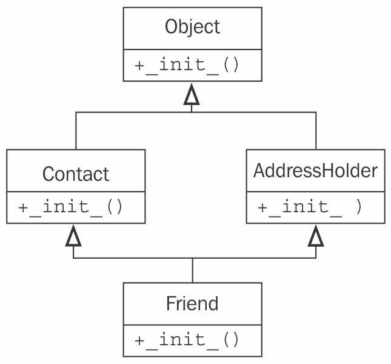
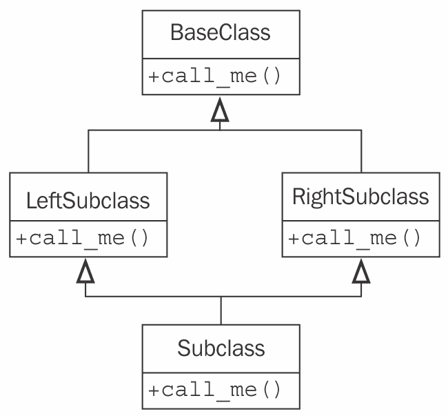

# 当对象相似时

在编程世界中，重复代码被认为是邪恶的。我们不应该在不同地方有相同或相似的代码的多个副本。

有许多方法可以合并具有相似功能的部分代码或对象。在本章中，我们将介绍最著名的面向对象原则：继承。如第一章中所述，*面向对象设计*，继承允许我们在两个或多个类之间创建 is a 关系，将共同逻辑抽象到超类中，并在子类中管理具体细节。特别是，我们将介绍以下 Python 语法和原则：

+   基本继承

+   从内置类型继承

+   多重继承

+   多态和鸭子类型

# 基本继承

技术上，我们创建的每个类都使用了继承。所有 Python 类都是名为`object`的特殊内置类的子类。这个类在数据和行为方面提供很少的功能（它提供的行为都是双下划线方法，仅用于内部使用），但它确实允许 Python 以相同的方式处理所有对象。

如果我们没有明确地从不同的类继承，我们的类将自动继承自`object`。然而，我们可以明确地使用以下语法来声明我们的类从`object`派生：

```py
class MySubClass(object): 
    pass 
```

这就是继承！从技术上讲，这个例子与第二章中我们的第一个例子没有区别，因为 Python 3 如果没有明确提供不同的**超类**，会自动从`object`继承。超类，或父类，是从中继承的类。子类是从超类继承的类。在这种情况下，超类是`object`，而`MySubClass`是子类。子类也被说成是从其父类派生，或者子类扩展了父类。

如您可能从示例中推断出的那样，继承在基本类定义之上只需要额外的最小语法。只需在类名和冒号之间括号内包含父类名即可。这就是我们要告诉 Python 新类应该从给定的超类派生的所有操作。

我们如何在实践中应用继承？继承最简单、最明显的用途是为现有类添加功能。让我们从一个简单的联系人管理器开始，该管理器跟踪几个人的姓名和电子邮件地址。`Contact`类负责在类变量中维护所有联系人的列表，并为单个联系人初始化姓名和地址：

```py
class Contact:
    all_contacts = []

    def __init__(self, name, email):
        self.name = name
        self.email = email
        Contact.all_contacts.append(self)
```

这个例子向我们介绍了**类变量**。`all_contacts`列表，因为它属于类定义的一部分，被这个类的所有实例共享。这意味着只有一个`Contact.all_contacts`列表。我们也可以从`Contact`类的任何方法中访问它作为`self.all_contacts`。如果一个字段在对象上找不到（通过`self`），那么它将在类上找到，因此将引用同一个单个列表。

小心这个语法，因为如果你使用`self.all_contacts`来设置变量，你实际上会创建一个**新**的实例变量，仅与该对象相关联。类变量仍然不变，并且可以通过`Contact.all_contacts`访问。

这是一个简单的类，允许我们跟踪每个联系人的几份数据。但如果我们的一些联系人也需要从我们这里订购供应品，怎么办呢？我们可以在`Contact`类中添加一个`order`方法，但这会让人们不小心从客户或家人朋友那里订购东西。相反，让我们创建一个新的`Supplier`类，它像我们的`Contact`类一样工作，但有一个额外的`order`方法：

```py
class Supplier(Contact):
    def order(self, order):
        print(
            "If this were a real system we would send "
            f"'{order}' order to '{self.name}'"
        )
```

现在，如果我们用我们信任的解释器测试这个类，我们会看到所有联系人，包括供应商，在它们的`__init__`中接受一个名称和电子邮件地址，但只有供应商有一个功能性的`order`方法：

```py
>>> c = Contact("Some Body", "somebody@example.net")
>>> s = Supplier("Sup Plier", "supplier@example.net")
>>> print(c.name, c.email, s.name, s.email)
Some Body somebody@example.net Sup Plier supplier@example.net
>>> c.all_contacts
[<__main__.Contact object at 0xb7375ecc>,
 <__main__.Supplier object at 0xb7375f8c>]
>>> c.order("I need pliers")
Traceback (most recent call last):
 File "<stdin>", line 1, in <module>
AttributeError: 'Contact' object has no attribute 'order'
>>> s.order("I need pliers")
If this were a real system we would send 'I need pliers' order to
'Sup Plier '  
```

因此，现在我们的`Supplier`类可以做任何联系人能做的事情（包括将自己添加到`all_contacts`联系人列表中），以及作为供应商需要处理的特殊事情。这就是继承的美丽之处。

# 扩展内置类

这种类型继承的一个有趣用途是向内置类添加功能。在前面看到的`Contact`类中，我们正在将联系人添加到所有联系人的列表中。如果我们还想按名称搜索这个列表怎么办？嗯，我们可以在`Contact`类上添加一个方法来搜索它，但感觉这个方法实际上属于列表本身。我们可以使用继承来做这件事：

```py
class ContactList(list):
    def search(self, name):
        """Return all contacts that contain the search value
        in their name."""
        matching_contacts = []
        for contact in self:
            if name in contact.name:
                matching_contacts.append(contact)
        return matching_contacts

class Contact:
    all_contacts = ContactList()

    def __init__(self, name, email):
        self.name = name
        self.email = email
        Contact.all_contacts.append(self)
```

我们不是将普通列表作为我们的类变量实例化，而是创建一个新的`ContactList`类，它扩展了内置的`list`数据类型。然后，我们将这个子类实例化为我们`all_contacts`列表。我们可以如下测试新的搜索功能：

```py
>>> c1 = Contact("John A", "johna@example.net")
>>> c2 = Contact("John B", "johnb@example.net")
>>> c3 = Contact("Jenna C", "jennac@example.net")
>>> [c.name for c in Contact.all_contacts.search('John')]
['John A', 'John B']  
```

你想知道我们是如何将内置语法`[]`改变成可以继承的吗？使用`[]`创建一个空列表实际上是一个使用`list()`创建空列表的快捷方式；两种语法的行为相同：

```py
>>> [] == list()
True  
```

实际上，`[]`语法实际上是所谓的**语法糖**，在底层调用`list()`构造函数。`list`数据类型是一个我们可以扩展的类。事实上，列表本身扩展了`object`类：

```py
>>> isinstance([], object)
True  
```

作为第二个例子，我们可以扩展`dict`类，它类似于列表，是在使用`{}`语法简写时构建的类：

```py
class LongNameDict(dict): 
    def longest_key(self): 
        longest = None 
        for key in self: 
            if not longest or len(key) > len(longest): 
                longest = key 
        return longest 
```

这在交互式解释器中很容易测试：

```py
>>> longkeys = LongNameDict()
>>> longkeys['hello'] = 1
>>> longkeys['longest yet'] = 5
>>> longkeys['hello2'] = 'world'
>>> longkeys.longest_key()
'longest yet'  
```

大多数内置类型都可以类似地扩展。常见的扩展内置类型有`object`、`list`、`set`、`dict`、`file`和`str`。数值类型如`int`和`float`也偶尔会被继承。

# 重写和 super

因此，继承对于向现有类添加新行为是非常好的，但关于改变行为呢？我们的`Contact`类只允许有名字和电子邮件地址。这可能对大多数联系人来说已经足够了，但如果我们想为我们的亲密朋友添加一个电话号码怎么办？

正如我们在第二章中看到的，*Python 中的对象*，我们可以通过在对象构造后只设置一个`phone`属性来轻松做到这一点。但如果我们想在初始化时使这个第三个变量可用，我们必须重写`__init__`。重写意味着用子类中具有相同名称的新方法（在超类中）替换或更改超类的方法。为此不需要特殊的语法；子类新创建的方法会自动调用，而不是超类的方法。如下面的代码所示：

```py
class Friend(Contact): 
 def __init__(self, name, email, phone):         self.name = name 
        self.email = email 
        self.phone = phone 
```

任何方法都可以被重写，不仅仅是`__init__`。在我们继续之前，我们需要解决这个例子中的一些问题。我们的`Contact`和`Friend`类在设置`name`和`email`属性方面有重复的代码；这可能会使代码维护变得复杂，因为我们必须在两个或更多地方更新代码。更令人担忧的是，我们的`Friend`类忽略了将自身添加到我们在`Contact`类上创建的`all_contacts`列表。

我们真正需要的是一种方法，在新的类内部执行`Contact`类上的原始`__init__`方法。这正是`super`函数的作用；它返回父类的对象作为实例，使我们能够直接调用父类方法：

```py
class Friend(Contact): 
    def __init__(self, name, email, phone): 
 super().__init__(name, email) 
        self.phone = phone 
```

这个例子首先使用`super`获取父对象的实例，并在该对象上调用`__init__`，传递预期的参数。然后它进行自己的初始化，即设置`phone`属性。

`super()`调用可以在任何方法内部进行。因此，所有方法都可以通过重写和调用`super`来修改。`super`的调用也可以在任何方法点进行；我们不必将调用作为第一行。例如，我们可能需要在将参数转发给超类之前对其进行操作或验证。

# 多重继承

多重继承是一个敏感的话题。在原则上，它是简单的：从多个父类继承的子类能够访问它们的功能。在实践中，这比听起来要少用得多，许多专家程序员都建议不要使用它。

作为一种幽默的经验法则，如果你认为你需要多重继承，你可能错了，但如果你知道你需要它，你可能是对的。

多重继承最简单且最有用的形式被称为**混入（mixin）**。混入是一个不打算独立存在的超类，而是意味着被其他类继承以提供额外功能。例如，假设我们想要向我们的`Contact`类添加功能，允许向`self.email`发送电子邮件。发送电子邮件是一个常见的任务，我们可能希望在其他许多类中使用。因此，我们可以编写一个简单的混入类来为我们处理电子邮件：

```py
class MailSender: 
    def send_mail(self, message): 
        print("Sending mail to " + self.email) 
        # Add e-mail logic here 
```

为了简洁起见，我们这里不包括实际的电子邮件逻辑；如果你对如何实现感兴趣，请查看 Python 标准库中的`smtplib`模块。

这个类没有做任何特别的事情（实际上，它几乎不能作为一个独立的类使用），但它确实允许我们定义一个新的类，该类描述了`Contact`和`MailSender`，使用多重继承：

```py
class EmailableContact(Contact, MailSender): 
    pass 
```

多重继承的语法看起来像类定义中的参数列表。在括号内包含一个基类而不是一个，我们包含两个（或更多），用逗号分隔。我们可以测试这个新的混合体，看看混入（mixin）是如何工作的：

```py
>>> e = EmailableContact("John Smith", "jsmith@example.net")
>>> Contact.all_contacts
[<__main__.EmailableContact object at 0xb7205fac>]
>>> e.send_mail("Hello, test e-mail here")
Sending mail to jsmith@example.net  
```

`Contact`初始化器仍然会将新联系人添加到`all_contacts`列表中，混入（mixin）能够向`self.email`发送邮件，因此我们知道一切正常。

这并不那么困难，你可能想知道关于多重继承的严重警告是什么。我们将在下一分钟探讨复杂性，但让我们考虑一下这个例子中我们有的其他选项，而不是使用混入（mixin）：

+   我们可以使用单继承，并将`send_mail`函数添加到子类中。这里的缺点是，电子邮件功能必须为任何需要电子邮件的其他类重复。

+   我们可以创建一个独立的 Python 函数来发送电子邮件，并在需要发送电子邮件时，通过将正确的电子邮件地址作为参数传递给该函数来调用该函数（这将是我的选择）。

+   我们可以探索一些使用组合而不是继承的方法。例如，`EmailableContact`可以有一个`MailSender`对象作为属性，而不是从它继承。

+   我们可以在类创建后对`Contact`类进行猴子补丁（我们将在第七章，*Python 面向对象快捷方式*)中简要介绍猴子补丁），添加一个`send_mail`方法。这是通过定义一个接受`self`参数的函数，并将其设置为现有类的属性来实现的。

当混合来自不同类的方法时，多重继承工作得很好，但当我们必须调用超类的方法时，它会变得非常混乱。我们有多个超类。我们如何知道调用哪一个？我们如何知道它们的调用顺序？

让我们通过向我们的`Friend`类添加家庭地址来探讨这些问题。我们可以采取几种方法。地址是由表示街道、城市、国家和其他相关细节的字符串组成的集合。我们可以将这些字符串中的每一个作为参数传递给`Friend`类的`__init__`方法。我们也可以将这些字符串存储在元组、字典或数据类（我们将在第六章，*Python 数据结构*)中，并将它们作为一个单一参数传递给`__init__`。如果没有需要添加到地址中的方法，这可能是最好的做法。

另一个选择是创建一个新的`Address`类来将这些字符串放在一起，然后在我们的`Friend`类的`__init__`方法中传递这个类的实例。这个解决方案的优点是，我们可以给数据添加行为（比如，提供方向或打印地图的方法），而不仅仅是静态存储。这是我们讨论过的组合的一个例子，正如我们在第一章，*面向对象设计*中所讨论的那样。组合关系是解决这个问题的完美可行方案，并允许我们在其他实体（如建筑物、企业或组织）中重用`Address`类。

然而，继承也是一个可行的解决方案，这正是我们想要探讨的。让我们添加一个新的类来存储地址。我们将这个新类称为`AddressHolder`而不是`Address`，因为继承定义了一个“是”的关系。说一个`Friend`类是一个`Address`类是不正确的，但是既然一个朋友可以有一个`Address`类，我们可以争论说一个`Friend`类是一个`AddressHolder`类。稍后，我们可以创建其他也持有地址的实体（公司、建筑物）。再次强调，这种复杂的命名是一个很好的迹象，我们应该坚持使用组合，而不是继承。但是为了教学目的，我们将坚持使用继承。这是我们的`AddressHolder`类：

```py
class AddressHolder: 
    def __init__(self, street, city, state, code): 
        self.street = street 
        self.city = city 
        self.state = state 
        self.code = code 
```

我们只是在初始化时将所有数据都扔到实例变量中。

# 钻石问题

我们可以使用多重继承来将这个新类作为现有`Friend`类的父类。棘手的部分是现在我们有两个父`__init__`方法，它们都需要被初始化。而且它们需要用不同的参数来初始化。我们怎么做到这一点呢？好吧，我们可以从一个简单的方法开始：

```py
class Friend(Contact, AddressHolder): 
    def __init__( 
        self, name, email, phone, street, city, state, code): 
 Contact.__init__(self, name, email) 
        AddressHolder.__init__(self, street, city, state, code) 
        self.phone = phone 
```

在这个例子中，我们直接在每个超类上调用`__init__`函数，并显式传递`self`参数。这个例子在技术上是可以工作的；我们可以直接在类上访问不同的变量。但是存在一些问题。

首先，如果忽略显式调用初始化器，超类可能会未初始化。这不会破坏这个例子，但它可能导致在常见场景中难以调试的程序崩溃。想象一下尝试向尚未连接的数据库中插入数据。

更隐蔽的可能性是，由于类层次结构的组织，一个超类被多次调用。看看这个继承图：



`Friend` 类中的 `__init__` 方法首先在 `Contact` 上调用 `__init__`，这隐式地初始化了 `object` 超类（记住，所有类都从 `object` 继承）。然后 `Friend` 在 `AddressHolder` 上调用 `__init__`，这又隐式地初始化了 `object` 超类。这意味着父类被设置了两次。使用 `object` 类，这相对无害，但在某些情况下，它可能带来灾难。想象一下，每次请求都要尝试连接数据库两次！

基类应该只被调用一次。是的，但什么时候调用？我们是先调用 `Friend`，然后 `Contact`，然后 `Object`，再然后 `AddressHolder`？还是先调用 `Friend`，然后 `Contact`，然后 `AddressHolder`，最后 `Object`？

方法可以调用的顺序可以通过修改类上的 `__mro__`（**方法解析顺序**）属性来动态调整。这超出了本书的范围。如果您认为需要了解它，我们建议阅读 *Expert Python Programming*，作者 *Tarek Ziadé*，由 *Packt Publishing* 出版，或者阅读该主题的原始文档（请注意，内容很深！）在 [`www.python.org/download/releases/2.3/mro/`](http://www.python.org/download/releases/2.3/mro/)。

让我们看看第二个人为设计的例子，它更清楚地说明了这个问题。在这里，我们有一个基类，它有一个名为 `call_me` 的方法。两个子类覆盖了该方法，然后另一个子类使用多继承扩展了这两个类。这被称为菱形继承，因为类图呈菱形形状：



让我们将这个图转换为代码；这个例子显示了方法调用的顺序：

```py
class BaseClass:
    num_base_calls = 0

    def call_me(self):
        print("Calling method on Base Class")
        self.num_base_calls += 1

class LeftSubclass(BaseClass):
    num_left_calls = 0

    def call_me(self):
        BaseClass.call_me(self)
        print("Calling method on Left Subclass")
        self.num_left_calls += 1

class RightSubclass(BaseClass):
    num_right_calls = 0

    def call_me(self):
        BaseClass.call_me(self)
        print("Calling method on Right Subclass")
        self.num_right_calls += 1

class Subclass(LeftSubclass, RightSubclass):
    num_sub_calls = 0

    def call_me(self):
 LeftSubclass.call_me(self)
 RightSubclass.call_me(self)
        print("Calling method on Subclass")
        self.num_sub_calls += 1
```

此示例确保每个重写的 `call_me` 方法直接调用具有相同名称的父方法。它通过将信息打印到屏幕上来告诉我们每次方法被调用。它还更新类的静态变量，以显示它被调用的次数。如果我们实例化一个 `Subclass` 对象并对其调用一次方法，我们得到以下输出：

```py
>>> s = Subclass()
>>> s.call_me()
Calling method on Base Class
Calling method on Left Subclass
Calling method on Base Class
Calling method on Right Subclass
Calling method on Subclass
>>> print(
... s.num_sub_calls,
... s.num_left_calls,
... s.num_right_calls,
... s.num_base_calls)
1 1 1 2  
```

因此，我们可以清楚地看到基类的 `call_me` 方法被调用了两次。如果该方法实际执行工作，如向银行账户存钱，这可能会导致一些有害的 bug。

在多重继承中需要注意的事情是，我们只想调用类层次结构中的 `next` 方法，而不是 `parent` 方法。实际上，那个下一个方法可能不在当前类的父类或祖先中。`super` 关键字再次拯救了我们。事实上，`super` 最初是为了使复杂的多重继承形式成为可能而开发的。以下是使用 `super` 编写的相同代码：

```py
class BaseClass:
    num_base_calls = 0

    def call_me(self):
        print("Calling method on Base Class")
        self.num_base_calls += 1

class LeftSubclass(BaseClass):
    num_left_calls = 0

    def call_me(self):
 super().call_me()
        print("Calling method on Left Subclass")
        self.num_left_calls += 1

class RightSubclass(BaseClass):
    num_right_calls = 0

    def call_me(self):
 super().call_me()
        print("Calling method on Right Subclass")
        self.num_right_calls += 1

class Subclass(LeftSubclass, RightSubclass):
    num_sub_calls = 0

    def call_me(self):
 super().call_me()
        print("Calling method on Subclass")
        self.num_sub_calls += 1
```

这个改动相当小；我们只是将直接调用替换为对 `super()` 的调用，尽管最底层的子类只调用了一次 `super`，而不是必须对左右两边都进行调用。这个改动很简单，但看看执行后的差异：

```py
>>> s = Subclass()
>>> s.call_me()
Calling method on Base Class
Calling method on Right Subclass
Calling method on Left Subclass
Calling method on Subclass
>>> print(s.num_sub_calls, s.num_left_calls, s.num_right_calls,
s.num_base_calls)
1 1 1 1  
```

看起来不错；我们的基本方法只被调用了一次。但 `super()` 实际上在这里做了什么？由于 `print` 语句是在 `super` 调用之后执行的，所以打印的输出是按照每个方法实际执行顺序的。让我们从后往前查看谁在调用谁。

首先，`Subclass` 的 `call_me` 调用 `super().call_me()`，这恰好指的是

调用 `LeftSubclass.call_me()`. 然后 `LeftSubclass.call_me()` 方法会调用 `super().call_me()`, 但在这种情况下，`super()` 指的是 `RightSubclass.call_me()`。

**特别注意这一点**：`super` 调用并不是在 `LeftSubclass` 的超类（即 `BaseClass`）上调用方法。相反，它调用的是 `RightSubclass`，即使它不是 `LeftSubclass` 的直接父类！这是 *下一个* 方法，而不是父方法。`RightSubclass` 然后调用 `BaseClass`，而 `super` 调用确保了类层次结构中的每个方法只执行一次。

# 不同的参数集

当我们回到 `Friend` 多重继承示例时，这会使事情变得复杂。在 `Friend` 的 `__init__` 方法中，我们最初调用的是两个父类的 `__init__`，*使用不同的参数集*：

```py
Contact.__init__(self, name, email) 
AddressHolder.__init__(self, street, city, state, code) 
```

当使用 `super` 时，我们如何管理不同的参数集？我们不一定知道 `super` 将尝试首先初始化哪个类。即使我们知道，我们也需要一种方法来传递 `extra` 参数，以便后续对其他子类的 `super` 调用能够接收到正确的参数。

具体来说，如果第一次调用 `super` 将 `name` 和 `email` 参数传递给 `Contact.__init__`，然后 `Contact.__init__` 调用 `super`，它需要能够将地址相关的参数传递给下一个方法，即 `AddressHolder.__init__`。

当我们想要调用具有相同名称但参数集不同的超类方法时，这个问题就会显现出来。最常见的情况是，你只想在 `__init__` 方法中调用具有完全不同参数集的超类，就像我们在这里做的那样。即使对于常规方法，我们也可能想要添加只有对某个子类或一组子类有意义的可选参数。

很遗憾，解决这个问题的唯一方法是从一开始就为此进行规划。我们必须设计我们的基类参数列表，以便接受任何不需要每个子类实现所需的参数的关键字参数。最后，我们必须确保该方法可以自由地接受意外的参数，并将它们传递给其`super`调用，以防它们对于继承顺序中后续的方法是必要的。

Python 的函数参数语法提供了我们完成这项任务所需的所有工具，但它使得整体代码看起来很繁琐。看看`Friend`多重继承代码的正确版本，如下所示：

```py
class Contact:
    all_contacts = []

 def __init__(self, name="", email="", **kwargs):
 super().__init__(**kwargs)
        self.name = name
        self.email = email
        self.all_contacts.append(self)

class AddressHolder:
 def __init__(self, street="", city="", state="", code="", **kwargs):
 super().__init__(**kwargs)
        self.street = street
        self.city = city
        self.state = state
        self.code = code

class Friend(Contact, AddressHolder):
 def __init__(self, phone="", **kwargs):
 super().__init__(**kwargs)
        self.phone = phone
```

我们通过给它们一个空字符串作为默认值，将所有参数都更改为关键字参数。我们还确保包含一个`**kwargs`参数来捕获我们特定的方法不知道如何处理的任何附加参数。它通过`super`调用将这些参数传递给下一个类。

如果你对`**kwargs`语法不熟悉，它基本上收集了传递给方法的所有关键字参数，这些参数在参数列表中没有明确列出。这些参数存储在一个名为`kwargs`的字典中（我们可以将变量命名为任何我们喜欢的，但惯例建议使用`kw`或`kwargs`）。当我们使用`**kwargs`语法调用不同的方法（例如，`super().__init__`）时，它会展开字典，并将结果作为正常的关键字参数传递给方法。我们将在第七章中详细介绍，*Python 面向对象快捷方式*。

之前的例子做了它应该做的事情。但它开始看起来很混乱，很难回答问题，“我们需要将哪些参数传递给”`Friend.__init__`？这是任何计划使用该类的人的首要问题，因此应该在方法中添加一个文档字符串来解释正在发生的事情。

此外，即使这个实现也不足以满足我们在父类中*重用*变量的需求。当我们把`**kwargs`变量传递给`super`时，该字典不包含任何作为显式关键字参数包含的变量。例如，在`Friend.__init__`中，对`super`的调用在`kwargs`字典中没有`phone`。如果其他任何类需要`phone`参数，我们需要确保它在传递的字典中。更糟糕的是，如果我们忘记这样做，调试将会非常令人沮丧，因为超类不会抱怨，而只是简单地给变量分配默认值（在这种情况下，一个空字符串）。

确保变量向上传递有几种方法。假设`Contact`类由于某种原因需要使用`phone`参数进行初始化，而`Friend`类也将需要访问它。我们可以做以下任何一种：

+   不要将`phone`作为一个显式的关键字参数。相反，将其留在`kwargs`字典中。`Friend`可以使用`kwargs['phone']`语法来查找。当它将`**kwargs`传递给`super`调用时，`phone`仍然会在字典中。

+   将`phone`作为一个显式的关键字参数，但在传递给`super`之前，使用标准的字典`kwargs['phone'] = phone`语法更新`kwargs`字典。

+   将`phone`作为一个显式的关键字参数，但使用`kwargs.update`方法更新`kwargs`字典。如果你有多个参数要更新，这很有用。你可以使用`dict(phone=phone)`构造函数，或者`{'phone': phone}`语法来创建传递给`update`的字典。

+   将`phone`作为一个显式的关键字参数，但使用`super().__init__(phone=phone, **kwargs)`语法显式地将其传递给 super 调用。

我们已经讨论了 Python 中多重继承涉及到的许多注意事项。当我们需要考虑所有可能的情况时，我们必须计划它们，我们的代码会变得混乱。基本的多重继承可能很有用，但在许多情况下，我们可能希望选择一种更透明的方式来组合两个不同的类，通常使用组合或我们在第十章中将要讨论的设计模式之一，*设计模式 I*，以及第十一章中将要讨论的设计模式之二。

我浪费了我生命中的整个白天，试图在复杂的多重继承层次结构中寻找我需要传递给深层嵌套子类中的哪些参数。代码的作者往往不记录他的类，并且经常传递 kwargs——以防万一将来可能需要。这是一个在不需要多重继承时使用多重继承的特别糟糕的例子。多重继承是一个大而华丽的术语，新程序员喜欢炫耀，但我建议即使你认为这是一个好选择，也要避免使用它。当你以后不得不阅读代码时，你未来的自己和其他程序员会很高兴他们理解了你的代码。

# 多态性

我们在第一章中介绍了多态性，*面向对象设计*。这是一个华丽的名字，描述了一个简单的概念：不同的行为取决于正在使用哪个子类，而不需要明确知道子类实际上是什么。作为一个例子，想象一个播放音频文件的程序。媒体播放器可能需要加载一个`AudioFile`对象，然后播放它。我们可以在对象上放置一个`play()`方法，它负责解压缩或提取音频并将其路由到声卡和扬声器。播放`AudioFile`的行为可能实际上非常简单，就像这样：

```py
audio_file.play() 
```

然而，解压缩和提取音频文件的过程对于不同类型的文件来说非常不同。虽然`.wav`文件以未压缩的形式存储，但`.mp3`、`.wma`和`.ogg`文件都使用完全不同的压缩算法。

我们可以通过继承和多态来简化设计。每种文件类型都可以由`AudioFile`的不同子类来表示，例如`WavFile`和`MP3File`。这些子类中的每一个都会有一个`play()`方法，这个方法会针对每种文件以不同的方式实现，以确保遵循正确的提取过程。媒体播放器对象永远不需要知道它引用的是`AudioFile`的哪个子类；它只需调用`play()`，并通过多态让对象处理播放的实际细节。让我们看看一个快速框架，看看这可能会是什么样子：

```py
class AudioFile:
    def __init__(self, filename):
        if not filename.endswith(self.ext):
            raise Exception("Invalid file format")

        self.filename = filename

class MP3File(AudioFile):
    ext = "mp3"

    def play(self):
        print("playing {} as mp3".format(self.filename))

class WavFile(AudioFile):
    ext = "wav"

    def play(self):
        print("playing {} as wav".format(self.filename))

class OggFile(AudioFile):
    ext = "ogg"

    def play(self):
        print("playing {} as ogg".format(self.filename))
```

所有音频文件在初始化时都会检查是否给出了有效的扩展名。但你有没有注意到父类中的`__init__`方法是如何能够从不同的子类中访问`ext`类变量的？这就是多态在起作用。如果文件名不以正确的名称结尾，它会引发异常（异常将在下一章中详细介绍）。`AudioFile`父类实际上并没有存储对`ext`变量的引用，但这并不妨碍它能够访问它。在子类中。

此外，`AudioFile`的每个子类都以不同的方式实现`play()`（这个示例实际上并没有播放音乐；音频压缩算法真的值得有一本单独的书来介绍！）。这也是多态在起作用。媒体播放器可以使用完全相同的代码来播放文件，无论其类型如何；它不在乎它正在查看的是`AudioFile`的哪个子类。解压缩音频文件的细节被*封装*了。如果我们测试这个示例，它将按预期工作：

```py
>>> ogg = OggFile("myfile.ogg")
>>> ogg.play()
playing myfile.ogg as ogg
>>> mp3 = MP3File("myfile.mp3")
>>> mp3.play()
playing myfile.mp3 as mp3
>>> not_an_mp3 = MP3File("myfile.ogg")
Traceback (most recent call last):
 File "<stdin>", line 1, in <module>
 File "polymorphic_audio.py", line 4, in __init__
 raise Exception("Invalid file format")
Exception: Invalid file format  
```

看看`AudioFile.__init__`是如何能够在不知道它引用的是哪个子类的情况下检查文件类型的？

多态实际上是面向对象编程中最酷的事情之一，它使得一些在早期范式下不可能的编程设计变得显而易见。然而，由于鸭子类型，Python 使得多态看起来不那么酷。Python 中的鸭子类型允许我们使用提供所需行为的任何对象，而不需要强制它成为子类。Python 的动态特性使得这一点变得微不足道。以下示例没有扩展`AudioFile`，但它可以使用与扩展`AudioFile`相同的接口在 Python 中进行交互：

```py
class FlacFile: 
    def __init__(self, filename): 
        if not filename.endswith(".flac"): 
            raise Exception("Invalid file format") 

        self.filename = filename 

    def play(self): 
        print("playing {} as flac".format(self.filename)) 
```

我们的媒体播放器可以像播放扩展自`AudioFile`的对象一样轻松地播放这个对象。

多态性是许多面向对象环境中使用继承的最重要原因之一。因为任何提供正确接口的对象都可以在 Python 中互换使用，这减少了需要多态公共超类的需求。继承仍然可以用于共享代码，但如果所有共享的只是公共接口，那么鸭式类型就足够了。这种对继承需求的减少也减少了多重继承的需求；通常，当多重继承似乎是一个有效解决方案时，我们只需使用鸭式类型来模拟多个超类中的一个。

当然，仅仅因为一个对象满足特定的接口（通过提供所需的方法或属性）并不意味着它将在所有情况下都能简单地工作。它必须以一种在整体系统中有意义的方式满足该接口。仅仅因为一个对象提供了一个`play()`方法并不意味着它将自动与媒体播放器一起工作。例如，我们的来自第一章的棋盘 AI 对象，*面向对象设计*，可能有一个`play()`方法来移动棋子。即使它满足了接口，如果我们尝试将其插入到媒体播放器中，这个类很可能会以惊人的方式崩溃！

鸭式类型的一个有用特性是，鸭式类型的对象只需要提供那些实际被访问的方法和属性。例如，如果我们需要创建一个假文件对象来读取数据，我们可以创建一个新的具有`read()`方法的对象；如果将要与假对象交互的代码不会调用它，我们就不需要重写`write`方法。更简洁地说，鸭式类型不需要提供对象可用的整个接口；它只需要满足实际访问的接口。

# 抽象基类

虽然鸭式类型很有用，但事先很难判断一个类是否会满足你所需的协议。因此，Python 引入了**抽象基类**（**ABC**）的概念。抽象基类定义了一组方法属性，一个类必须实现这些方法属性才能被认为是该类的鸭式类型实例。该类可以扩展抽象基类本身，以便用作该类的实例，但它必须提供所有适当的方法。

在实践中，很少需要创建新的抽象基类，但我们可能会找到实现现有抽象基类（ABC）实例的机会。我们将首先介绍实现 ABC 的方法，然后简要地看看如何创建自己的 ABC，如果你需要的话。

# 使用抽象基类

大多数存在于 Python 标准库中的抽象基类都位于`collections`模块中。其中最简单的一个是`Container`类。让我们在 Python 解释器中检查它，看看这个类需要哪些方法：

```py
>>> from collections import Container 
>>> Container.__abstractmethods__ 
frozenset(['__contains__']) 
```

因此，`Container`类恰好有一个需要实现的方法，即`__contains__`。你可以使用`help(Container.__contains__)`来查看函数签名应该是什么样子：

```py
Help on method __contains__ in module _abcoll:
 __contains__(self, x) unbound _abcoll.Container method
```

我们可以看到`__contains__`需要接受一个单一参数。不幸的是，帮助文件并没有告诉我们这个参数应该是什么，但从 ABC 的名称和它实现的单一方法来看，这个参数很明显是用户检查容器是否包含的值。

这个方法由`list`、`str`和`dict`实现，以指示给定的值是否在该数据结构中。然而，我们也可以定义一个愚蠢的容器，告诉我们给定的值是否在奇数集合中：

```py
class OddContainer: 
    def __contains__(self, x): 
        if not isinstance(x, int) or not x % 2: 
            return False 
        return True 
```

这里有趣的部分是：我们可以实例化一个`OddContainer`对象，并确定，尽管我们没有扩展`Container`，但这个类是一个`Container`对象：

```py
>>> from collections import Container 
>>> odd_container = OddContainer() 
>>> isinstance(odd_container, Container) 
True 
>>> issubclass(OddContainer, Container) 
True 
```

正因如此，鸭子类型（duck typing）比经典的多态性更酷。我们可以创建关系，而不需要编写设置继承（或者更糟糕的是多重继承）的代码。

`Container` ABC 的一个酷特点是，任何实现它的类都可以免费使用`in`关键字。实际上，`in`只是一个语法糖，它委托给`__contains__`方法。任何具有`__contains__`方法的类都是`Container`，因此可以通过`in`关键字进行查询，例如：

```py
>>> 1 in odd_container 
True 
>>> 2 in odd_container 
False 
>>> 3 in odd_container 
True 
>>> "a string" in odd_container 
False 
```

# 创建一个抽象基类

如我们之前所见，不需要有抽象基类（ABC）就能启用鸭子类型。然而，想象一下，如果我们正在创建一个带有第三方插件的媒体播放器。在这种情况下，创建一个抽象基类是明智的，以记录第三方插件应该提供的 API（文档是 ABC 的强大用例之一）。`abc`模块提供了你需要的工具来完成这项工作，但我要提前警告你，这利用了 Python 最晦涩的概念，如下面的代码块所示：

```py
import abc 

class MediaLoader(metaclass=abc.ABCMeta):
    @abc.abstractmethod
    def play(self):
        pass

    @abc.abstractproperty
    def ext(self):
        pass

    @classmethod
    def __subclasshook__(cls, C):
        if cls is MediaLoader:
            attrs = set(dir(C))
            if set(cls.__abstractmethods__) <= attrs:
                return True

        return NotImplemented
```

这是一个包含多个 Python 特性（这些特性将在本书的后面部分进行解释）的复杂示例。它被包含在这里是为了完整性，但你不需要完全理解它，就能掌握如何创建自己的 ABC。

第一件奇怪的事情是`metaclass`关键字参数，它被传递到类中，你通常会在那里看到父类列表。这是元类编程神秘艺术中很少使用的结构。本书不会涉及元类，所以你只需要知道，通过分配`ABCMeta`元类，你正在给你的类赋予超级英雄（或者至少是超类）的能力。

接下来，我们看到`@abc.abstractmethod`和`@abc.abstractproperty`构造。这些是 Python 装饰器。我们将在第十章 Python 设计模式 I 中讨论这些。现在，只需知道，通过将方法或属性标记为抽象的，你是在声明任何这个类的子类都必须实现该方法或提供该属性，才能被认为是这个类的合适成员。

看看如果你实现了提供或不提供这些属性的子类会发生什么：

```py
>>> class Wav(MediaLoader): 
...     pass 
... 
>>> x = Wav() 
Traceback (most recent call last): 
  File "<stdin>", line 1, in <module> 
TypeError: Can't instantiate abstract class Wav with abstract methods ext, play 
>>> class Ogg(MediaLoader): 
...     ext = '.ogg' 
...     def play(self): 
...         pass 
... 
>>> o = Ogg() 
```

由于`Wav`类未能实现抽象属性，因此无法实例化该类。这个类仍然是一个合法的抽象类，但你必须将其子类化才能实际做任何事情。`Ogg`类提供了这两个属性，因此可以干净地实例化。

回到`MediaLoader`抽象基类（ABC），让我们剖析一下那个`__subclasshook__`方法。它基本上表示任何提供这个 ABC 所有抽象属性具体实现的类都应该被认为是`MediaLoader`的子类，即使它实际上并没有从`MediaLoader`类继承。

更常见的面向对象语言在类的接口和实现之间有一个清晰的分离。例如，一些语言提供了一个显式的`interface`关键字，允许我们定义一个类必须有的方法而不需要任何实现。在这样的环境中，一个抽象类是提供接口和一些方法的具体实现的类，但不是所有方法。任何类都可以明确声明它实现了给定的接口。

Python 的 ABC（抽象基类）有助于在不牺牲鸭子类型（duck typing）的好处的情况下提供接口的功能。

# 揭秘魔法

如果你想创建满足这个特定契约的抽象类，你可以复制并粘贴子类代码而不必理解它。我们将在书中介绍大多数不寻常的语法，但让我们逐行过一遍，以获得一个概览：

```py
    @classmethod 
```

这个装饰器将方法标记为类方法。它本质上表示该方法可以在类上调用，而不是在实例化对象上调用：

```py
    def __subclasshook__(cls, C): 
```

这定义了`__subclasshook__`类方法。这个特殊方法由 Python 解释器调用，以回答问题：类`C`是这个类的子类吗？

```py
        if cls is MediaLoader: 
```

我们检查方法是否专门在这个类上调用，而不是，比如说，这个类的子类。这防止了例如`Wav`类被误认为是`Ogg`类的父类：

```py
            attrs = set(dir(C)) 
```

这行代码所做的只是获取类拥有的方法集合和属性，包括其类层次结构中的任何父类：

```py
            if set(cls.__abstractmethods__) <= attrs: 
```

这一行使用集合表示法来查看此类的抽象方法集合是否已在候选类中提供。我们将在第六章中详细讲解集合，*Python 数据结构*。请注意，它并不检查方法是否已实现；只是检查它们是否存在。因此，一个类可以是子类，同时本身仍然是抽象类。

```py
                return True 
```

如果所有抽象方法都已提供，则候选类是此类的一个子类，我们返回`True`。该方法可以合法地返回三个值之一：`True`、`False`或`NotImplemented`。`True`和`False`表示该类是或不是确定性地此类的一个子类：

```py
return NotImplemented 
```

如果任何一个条件没有满足（也就是说，该类不是`MediaLoader`或者不是所有抽象方法都已提供），则返回`NotImplemented`。这告诉 Python 机制使用默认机制（候选类是否明确扩展了此类？）来进行子类检测。

简而言之，我们现在可以定义`Ogg`类作为`MediaLoader`类的子类，而不需要实际扩展`MediaLoader`类：

```py
>>> class Ogg(): ... ext = '.ogg' ... def play(self): ... print("this will play an ogg file") ... >>> issubclass(Ogg, MediaLoader) True >>> isinstance(Ogg(), MediaLoader) True
```

# 案例研究

让我们尝试用一个更大的例子来总结我们所学的所有内容。我们将开发一个用于编程作业的自动评分系统，类似于 Dataquest 或 Coursera 所使用的系统。该系统需要提供一个简单的基于类的接口，供课程编写者创建他们的作业，并在不满足该接口时提供有用的错误信息。编写者需要能够提供他们的课程内容，并编写自定义答案检查代码以确保学生回答正确。对他们来说，能够访问学生的姓名，使内容看起来更友好，也会很好。

评分器本身需要跟踪学生目前正在处理的作业。学生在正确完成作业之前可能会尝试多次。我们想要记录尝试次数，以便课程作者可以改进更难课程的内容。

让我们先定义课程作者需要使用的接口。理想情况下，它将要求课程作者除了他们的课程内容和答案检查代码外，还要编写尽可能少的额外代码。以下是我能想到的最简单的类：

```py
class IntroToPython:
    def lesson(self):
        return f"""
            Hello {self.student}. define two variables,
            an integer named a with value 1
            and a string named b with value 'hello'

        """

    def check(self, code):
        return code == "a = 1\nb = 'hello'"
```

承认，那位特定的课程作者在答案检查方面可能有点天真。如果你之前没有见过`f"""`语法，我们将在第八章中详细讲解，*字符串和序列化*。

我们可以从定义此接口的抽象基类开始，如下所示：

```py
class Assignment(metaclass=abc.ABCMeta):
    @abc.abstractmethod
    def lesson(self, student):
        pass

    @abc.abstractmethod
    def check(self, code):
        pass

    @classmethod
    def __subclasshook__(cls, C):
        if cls is Assignment:
            attrs = set(dir(C))
            if set(cls.__abstractmethods__) <= attrs:
                return True

        return NotImplemented
```

这个 ABC 定义了两个必需的抽象方法，并提供了神奇的`__subclasshook__`方法，允许一个类被视为子类，而无需显式扩展它（我通常只是复制粘贴这段代码。不值得记忆。）

我们可以使用`issubclass(IntroToPython, Assignment)`来确认`IntroToPython`类符合这个接口，它应该返回`True`。当然，如果我们愿意，我们可以显式扩展`Assignment`类，就像在第二个作业中看到的那样：

```py
class Statistics(Assignment):
    def lesson(self):
        return (
            "Good work so far, "
            + self.student
            + ". Now calculate the average of the numbers "
            + " 1, 5, 18, -3 and assign to a variable named 'avg'"
        )

    def check(self, code):
        import statistics

        code = "import statistics\n" + code

        local_vars = {}
        global_vars = {}
        exec(code, global_vars, local_vars)

        return local_vars.get("avg") == statistics.mean([1, 5, 18, -3])
```

这个课程作者，不幸的是，也很天真。`exec`调用将在评分系统中直接执行学生的代码，使他们能够访问整个系统。显然，他们首先会尝试黑客攻击系统，使他们的成绩达到 100%。他们可能认为这样做比正确完成作业要容易！

接下来，我们将创建一个类来管理学生在特定作业上的尝试次数：

```py
class AssignmentGrader:
    def __init__(self, student, AssignmentClass):
        self.assignment = AssignmentClass()
        self.assignment.student = student
        self.attempts = 0
        self.correct_attempts = 0

    def check(self, code):
        self.attempts += 1
        result = self.assignment.check(code)
        if result:
            self.correct_attempts += 1

        return result

    def lesson(self):
        return self.assignment.lesson()
```

这个类使用组合而不是继承。乍一看，这些方法存在于`Assignment`超类上似乎是合理的。那样就可以消除那个令人烦恼的`lesson`方法，它只是代理到 assignment 对象上的相同方法。当然，我们可以直接在`Assignment`抽象基类上放置所有这些逻辑，甚至让 ABC 从这个`AssignmentGrader`类继承。实际上，我通常会推荐这样做，但在这个情况下，这将迫使所有课程作者明确扩展这个类，这与我们要求内容创作尽可能简单的要求相违背。

最后，我们可以开始构建`Grader`类，它负责管理哪些作业可用以及每个学生目前正在做什么作业。最有趣的部分是注册方法：

```py
import uuid

class Grader:
    def __init__(self):
        self.student_graders = {}
        self.assignment_classes = {}

    def register(self, assignment_class):
        if not issubclass(assignment_class, Assignment):
            raise RuntimeError(
                "Your class does not have the right methods"
            )

        id = uuid.uuid4()
        self.assignment_classes[id] = assignment_class
        return id
```

这个代码块包括初始化器，其中包含我们将在下一分钟讨论的两个字典。`register`方法有点复杂，所以我们将彻底剖析它。

第一件奇怪的事情是这个方法接受的参数：`assignment_class`。这个参数意图是一个实际的类，而不是类的实例。记住，类也是对象，可以像其他类一样传递。考虑到我们之前定义的`IntroToPython`类，我们可以不实例化它就注册它，如下所示：

```py
from grader import Grader
from lessons import IntroToPython, Statistics

grader = Grader()
itp_id = grader.register(IntroToPython)
```

该方法首先检查那个类是否是`Assignment`类的子类。当然，我们实现了一个自定义的`__subclasshook__`方法，所以这包括没有显式继承`Assignment`的类。命名可能有点误导！如果没有这两个必需的方法，它会引发异常。异常是我们将在下一章详细讨论的主题；现在，只需假设它会使得程序变得愤怒并退出。

然后，我们生成一个随机标识符来表示那个特定的作业。我们将`assignment_class`存储在一个以该 ID 为索引的字典中，并返回该 ID，以便调用代码可以在将来查找那个作业。假设另一个对象会将该 ID 放入某种课程大纲中，以便学生按顺序完成作业，但在这个项目的这部分我们不会这样做。

`uuid`函数返回一个特殊格式的字符串，称为通用唯一标识符（universally unique identifier），也称为全球唯一标识符。它本质上代表一个非常大的随机数，几乎但并非完全不可能与另一个类似生成的标识符冲突。这是一种创建任意 ID 以跟踪项目的快速、简洁的好方法。

接下来，我们有`start_assignment`函数，它允许学生根据作业的 ID 开始工作。它所做的只是构造我们之前定义的`AssignmentGrader`类的一个实例，并将其放入`Grader`类存储的字典中，如下所示：

```py
    def start_assignment(self, student, id):
        self.student_graders[student] = AssignmentGrader(
            student, self.assignment_classes[id]
        )
```

之后，我们编写了几个代理方法，用于获取课程或检查学生当前正在工作的作业的代码：

```py
    def get_lesson(self, student):
        assignment = self.student_graders[student]
        return assignment.lesson()

    def check_assignment(self, student, code):
        assignment = self.student_graders[student]
        return assignment.check(code)
```

最后，我们创建了一个方法，可以给出学生当前作业进度的总结。它查找作业对象，并创建一个包含我们关于该学生的所有信息的格式化字符串：

```py

    def assignment_summary(self, student):
        grader = self.student_graders[student]
        return f"""
        {student}'s attempts at {grader.assignment.__class__.__name__}:

        attempts: {grader.attempts}
        correct: {grader.correct_attempts}

        passed: {grader.correct_attempts > 0}
        """
```

就是这样。你会注意到这个案例研究并没有使用大量的继承，这在考虑到章节主题的情况下可能显得有些奇怪，但鸭子类型（duck typing）却非常普遍。在 Python 程序设计中，继承关系通常会被简化为更通用的结构，随着迭代过程而变得更加灵活。以另一个例子来说，我最初将`AssignmentGrader`定义为继承关系，但意识到进行到一半时，使用组合（composition）会更好，原因如前所述。

下面是一段测试代码，展示了所有这些对象是如何连接在一起的：

```py
grader = Grader()
itp_id = grader.register(IntroToPython)
stat_id = grader.register(Statistics)

grader.start_assignment("Tammy", itp_id)
print("Tammy's Lesson:", grader.get_lesson("Tammy"))
print(
    "Tammy's check:",
    grader.check_assignment("Tammy", "a = 1 ; b = 'hello'"),
)
print(
    "Tammy's other check:",
    grader.check_assignment("Tammy", "a = 1\nb = 'hello'"),
)

print(grader.assignment_summary("Tammy"))

grader.start_assignment("Tammy", stat_id)
print("Tammy's Lesson:", grader.get_lesson("Tammy"))
print("Tammy's check:", grader.check_assignment("Tammy", "avg=5.25"))
print(
    "Tammy's other check:",
    grader.check_assignment(
        "Tammy", "avg = statistics.mean([1, 5, 18, -3])"
    ),
)

print(grader.assignment_summary("Tammy"))
```

# 练习

在你的工作空间中环顾四周，看看你是否能描述一些物理对象，并尝试用继承层次结构来描述它们。人类已经将世界划分为这样的分类体系数百年了，所以这不应该很难。在对象类之间是否存在非显而易见的继承关系？如果你要在计算机应用程序中模拟这些对象，它们会共享哪些属性和方法？哪些需要被多态地覆盖？它们之间会有哪些完全不同的属性？

现在写一些代码。不，不是写物理层次结构的代码；那很无聊。物理实体比方法有更多的属性。只需想想你过去一年中想要解决但从未着手的项目。对于你想要解决的问题，尝试思考一些基本的继承关系，然后实现它们。确保你也注意到了那些实际上不需要使用继承的关系。你可能在哪些地方想要使用多重继承？你确定吗？你能看到任何你想使用 mixins 的地方吗？尝试快速搭建一个原型。它不必有用，甚至不必部分工作。你已经看到了如何使用`python -i`测试代码；只需编写一些代码，并在交互式解释器中测试它。如果它工作，就再写一些。如果它不工作，就修复它！

现在，看看案例研究中的学生评分系统。它缺失的东西很多，不仅仅是课程内容！学生是如何进入系统的？是否有定义他们应该按什么顺序学习课程的课程表？如果你将`AssignmentGrader`改为在`Assignment`对象上使用继承而不是组合，会发生什么？

最后，尝试为 mixins 想出一些好的用例，然后实验它们，直到你意识到可能存在一个更好的使用组合的设计！

# 摘要

我们已经从简单的继承，这是面向对象程序员工具箱中最有用的工具之一，一路发展到多重继承——这是最复杂的之一。继承可以用来通过继承向现有类和内置类添加功能。将相似代码抽象到父类中可以帮助提高可维护性。可以使用`super`调用父类的方法，并且在使用多重继承时，必须安全地格式化参数列表，以确保这些调用能够正常工作。抽象基类允许你记录一个类必须具有哪些方法和属性才能满足特定的接口，甚至允许你改变*子类*的定义。

在下一章中，我们将探讨处理异常情况这种微妙的艺术。
