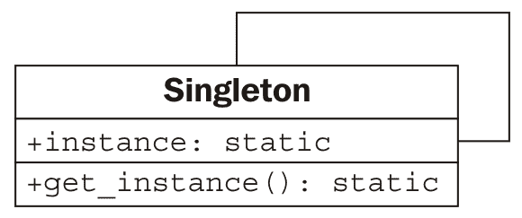

# 第十章：Python 设计模式 I

在上一章中，我们简要介绍了设计模式，并涵盖了迭代器模式，这是一个非常有用且常见的模式，以至于它被抽象成了编程语言的核心。在本章中，我们将回顾其他常见模式，以及它们在 Python 中的实现方式。与迭代类似，Python 经常提供替代语法来简化此类问题的处理。我们将涵盖这些模式的*传统*设计和 Python 版本。

总结来说，我们将看到：

+   许多具体的模式

+   Python 中每个模式的规范实现

+   Python 语法来替换某些模式

# 装饰器模式

装饰器模式允许我们用其他改变此功能的对象来*包装*提供核心功能的对象。任何使用装饰对象的对象都将以与未装饰对象完全相同的方式与之交互（即，装饰对象的接口与核心对象的接口相同）。

装饰器模式有两个主要用途：

+   增强组件在向第二个组件发送数据时的响应

+   支持多个可选行为

第二种选择通常是多重继承的一个合适替代方案。我们可以构建一个核心对象，然后创建一个装饰器来包装这个核心。由于装饰器对象与核心对象具有相同的接口，我们甚至可以在其他装饰器中包装新对象。以下是一个 UML 图中的示例：


在这里，**核心**和所有装饰器实现了一个特定的**接口**。装饰器通过组合维护对该接口另一个实例的引用。当被调用时，装饰器在其包装的接口之前或之后执行一些附加处理。包装的对象可能是另一个装饰器，或者是核心功能。虽然多个装饰器可以相互包装，但所有这些装饰器的*中心*对象提供了核心功能。

# 装饰器示例

让我们看看网络编程中的一个示例。我们将使用 TCP 套接字。`socket.send()`方法接收一个输入字节的字符串，并将其输出到另一端的接收套接字。有许多库接受套接字并使用此功能在流中发送数据。让我们创建这样一个对象；它将是一个交互式外壳，等待客户端的连接，然后提示用户输入字符串响应：

```py
import socket

def respond(client):
    response = input("Enter a value: ")
    client.send(bytes(response, "utf8"))
    client.close()

server = socket.socket(socket.AF_INET, socket.SOCK_STREAM)
server.bind(("localhost", 2401))
server.listen(1)
try:
    while True:
        client, addr = server.accept()
        respond(client)
finally:
    server.close()
```

`respond`函数接受一个`socket`参数，提示输入要发送作为回复的数据，然后发送它。要使用它，我们构建一个服务器套接字，并告诉它在本地的计算机上监听端口`2401`（我随机选择的端口）。当客户端连接时，它调用`respond`函数，该函数交互式地请求数据并相应地响应。需要注意的是，`respond`函数只关心套接字接口的两个方法：`send`和`close`。

为了测试这个，我们可以编写一个非常简单的客户端，它连接到相同的端口，在退出前输出响应：

```py
import socket

client = socket.socket(socket.AF_INET, socket.SOCK_STREAM)
client.connect(("localhost", 2401))
print("Received: {0}".format(client.recv(1024)))
client.close()
```

要使用这些程序，请按照以下步骤操作：

1.  在一个终端中启动服务器。

1.  打开第二个终端窗口并运行客户端。

1.  在服务器窗口的“输入一个值：”提示符下，输入一个值并按*Enter*键。

1.  客户端将接收你输入的内容，将其打印到控制台，然后退出。再次运行客户端；服务器将提示输入第二个值。

结果看起来可能像这样：


现在，回顾我们的服务器代码，我们看到有两个部分。`respond`函数将数据发送到`socket`对象。剩余的脚本负责创建这个`socket`对象。我们将创建一对装饰器，以定制`socket`行为，而无需扩展或修改`socket`本身。

让我们从`*logging*`装饰器开始。该对象在将数据发送到客户端之前，将其输出到服务器的控制台：

```py
class LogSocket:
    def __init__(self, socket):
        self.socket = socket

    def send(self, data):
        print(
            "Sending {0} to {1}".format(
                data, self.socket.getpeername()[0]
            )
        )
        self.socket.send(data)

    def close(self):
        self.socket.close()
```

这个类装饰了一个`socket`对象，并向客户端套接字提供了`send`和`close`接口。更好的装饰器还会实现（并可能定制）所有剩余的`socket`方法。它应该正确实现所有`send`的参数（实际上接受一个可选的标志参数），但让我们保持示例简单。每当在这个对象上调用`send`时，它都会在将数据发送到客户端之前将输出记录到屏幕上。

我们只需要在我们的原始代码中更改一行来使用这个装饰器。我们不是用套接字调用`respond`，而是用装饰过的套接字调用它：

```py
respond(LogSocket(client)) 
```

虽然这很简单，但我们不得不问自己，为什么我们没有只是扩展`socket`类并重写`send`方法。我们可以在记录之后调用`super().send`来执行实际的发送。这种设计也没有什么问题。

面对装饰器和继承之间的选择时，我们只有在需要根据某些条件动态修改对象时才应使用装饰器。例如，我们可能只想在服务器当前处于调试模式时启用日志装饰器。当我们有多个可选行为时，装饰器也比多重继承更胜一筹。例如，我们可以编写第二个装饰器，在调用`send`时使用`gzip`压缩来压缩数据：

```py
import gzip
from io import BytesIO

class GzipSocket:
    def __init__(self, socket):
        self.socket = socket

    def send(self, data):
        buf = BytesIO()
        zipfile = gzip.GzipFile(fileobj=buf, mode="w")
        zipfile.write(data)
        zipfile.close()
        self.socket.send(buf.getvalue())

    def close(self):
        self.socket.close()
```

在这个版本的`send`方法中，在将数据发送到客户端之前，会对传入的数据进行压缩。

现在我们有了这两个装饰器，我们可以编写代码在响应时动态地在它们之间切换。这个例子并不完整，但它说明了我们可能遵循的逻辑来混合和匹配装饰器：

```py
        client, addr = server.accept() 
        if log_send: 
            client = LogSocket(client) 
        if client.getpeername()[0] in compress_hosts: 
            client = GzipSocket(client) 
        respond(client) 
```

这段代码检查一个假设的配置变量`log_send`。如果它被启用，它将套接字包裹在`LogSocket`装饰器中。同样，它检查连接的客户端是否在已知接受压缩内容的地址列表中。如果是这样，它将客户端包裹在`GzipSocket`装饰器中。注意，根据配置和连接的客户端，可能没有，一个，或者两个装饰器被启用。尝试使用多重继承来编写这个，看看你会多么困惑！

# Python 中的装饰器

装饰器模式在 Python 中很有用，但还有其他选择。例如，我们可能能够使用猴子补丁（例如，`socket.socket.send = log_send`）来达到类似的效果。单继承，其中*可选*的计算在一个大方法中完成，可能是一个选择，而且多重继承不应该因为之前看到的特定示例不适合而被放弃。

在 Python 中，在函数上使用这种模式非常常见。正如我们在前面的章节中看到的，函数也是对象。事实上，函数装饰如此常见，以至于 Python 提供了一种特殊的语法，使其能够轻松地将这样的装饰器应用于函数。

例如，我们可以更一般地看待日志记录的例子。除了在套接字上发送日志调用之外；我们可能会发现记录对某些函数或方法的全部调用是有帮助的。以下示例实现了一个执行此操作的装饰器：

```py
import time

def log_calls(func):
    def wrapper(*args, **kwargs):
        now = time.time()
        print(
            "Calling {0} with {1} and {2}".format(
                func.__name__, args, kwargs
            )
        )
        return_value = func(*args, **kwargs)
        print(
            "Executed {0} in {1}ms".format(
                func.__name__, time.time() - now
            )
        )
        return return_value

    return wrapper

def test1(a, b, c):
    print("\ttest1 called")

def test2(a, b):
    print("\ttest2 called")

def test3(a, b):
    print("\ttest3 called")
    time.sleep(1)

test1 = log_calls(test1)
test2 = log_calls(test2)
test3 = log_calls(test3)

test1(1, 2, 3)
test2(4, b=5)
test3(6, 7)

```

这个装饰器函数与我们之前探索的例子非常相似；在那些情况下，装饰器接受一个类似套接字的对象并创建了一个类似套接字的对象。这次，我们的装饰器接受一个函数对象并返回一个新的函数对象。这段代码包括三个独立任务：

+   一个名为`log_calls`的函数，它接受另一个函数

+   这个函数定义（内部）了一个名为`wrapper`的新函数，它在调用原始函数之前做一些额外的工作

+   内部函数是从外部函数返回的

三个示例函数展示了装饰器的使用。第三个包括一个`sleep`调用，以展示时间测试。我们将每个函数传递给装饰器，装饰器返回一个新的函数。我们将这个新函数分配给原始变量名，实际上是用装饰过的函数替换了原始函数。

这种语法允许我们动态地构建装饰过的函数对象，就像我们在套接字示例中所做的那样。如果我们不替换名称，我们甚至可以保留装饰和非装饰版本以适应不同的情况。

通常，这些装饰器是对不同函数进行永久性修改的一般修改。在这种情况下，Python 支持一种特殊语法，在定义函数时应用装饰器。我们已经在几个地方看到了这种语法；现在，让我们了解它是如何工作的。

我们可以在方法定义之后应用装饰器函数，而不是使用`@decorator`语法一次性完成：

```py
@log_calls 
def test1(a,b,c): 
    print("\ttest1 called") 
```

这种语法的首要好处是，当我们阅读函数定义时，可以很容易地看到函数已被装饰。如果装饰器是在之后应用的，那么阅读代码的人可能会错过函数已被修改的事实。回答像“为什么我的程序将函数调用记录到控制台？”这样的问题会变得更加困难！然而，这种语法只能应用于我们定义的函数，因为我们没有访问其他模块的源代码。如果我们需要装饰属于其他人第三方库的函数，我们必须使用早期的语法。

装饰器语法的内容比我们这里看到的要多。我们没有足够的空间来介绍高级主题，所以请查阅 Python 参考手册或其他教程以获取更多信息。装饰器可以作为可调用对象创建，而不仅仅是返回函数的函数。类也可以被装饰；在这种情况下，装饰器返回一个新的类而不是一个新的函数。最后，装饰器可以接受参数，以便根据每个函数进行自定义。

# 观察者模式

观察者模式对于状态监控和事件处理情况很有用。这种模式允许一个给定的对象被一个未知且动态的观察者对象组监控。

当核心对象上的任何值发生变化时，它会通过调用一个`update()`方法来通知所有观察者对象，表明已发生更改。每当核心对象发生变化时，每个观察者可能负责不同的任务；核心对象不知道或关心那些任务是什么，观察者通常也不知道或关心其他观察者在做什么。

这里是 UML 中的表示：


# 观察者示例

观察者模式可能在冗余备份系统中很有用。我们可以编写一个维护某些值的核心对象，然后让一个或多个观察者创建该对象的序列化副本。例如，这些副本可能存储在数据库中、远程主机上或本地文件中。让我们使用属性来实现核心对象：

```py
class Inventory:
    def __init__(self):
        self.observers = []
        self._product = None
        self._quantity = 0

    def attach(self, observer):
        self.observers.append(observer)

    @property
    def product(self):
        return self._product

    @product.setter
    def product(self, value):
        self._product = value
        self._update_observers()

    @property
    def quantity(self):
        return self._quantity

    @quantity.setter
    def quantity(self, value):
        self._quantity = value
 self._update_observers()

 def _update_observers(self):
 for observer in self.observers:
 observer()
```

此对象有两个属性，当设置时，会调用其自身上的`_update_observers`方法。这个方法所做的只是遍历任何已注册的观察者，并让每个观察者知道有变化发生。在这种情况下，我们直接调用观察者对象；该对象必须实现`__call__`来处理更新。这在许多面向对象编程语言中是不可能的，但在 Python 中这是一个有用的快捷方式，可以帮助使我们的代码更易读。

现在我们来实现一个简单的观察者对象；这个对象将只打印一些状态到控制台：

```py
class ConsoleObserver: 
    def __init__(self, inventory): 
        self.inventory = inventory 

    def __call__(self): 
        print(self.inventory.product) 
        print(self.inventory.quantity) 
```

这里没有什么特别激动人心的；被观察对象是在初始化器中设置的，当观察者被调用时，我们执行*某个操作*。我们可以在交互式控制台中测试观察者：

```py
    >>> i = Inventory()
    >>> c = ConsoleObserver(i)
    >>> i.attach(c)
    >>> i.product = "Widget"
    Widget
    0
    >>> i.quantity = 5
    Widget
    5  
```

在将观察者附加到`Inventory`对象之后，每次我们更改两个被观察属性中的任何一个时，都会调用观察者并执行其操作。我们甚至可以添加两个不同的观察者实例：

```py
    >>> i = Inventory()
    >>> c1 = ConsoleObserver(i)
    >>> c2 = ConsoleObserver(i)
    >>> i.attach(c1)
    >>> i.attach(c2)
    >>> i.product = "Gadget"
    Gadget
    0
    Gadget
    0  
```

这次当我们更改产品时，有两个输出集，每个观察者一个。这里的关键思想是我们可以轻松地添加完全不同类型的观察者，同时备份文件、数据库或互联网应用程序中的数据。

观察者模式将正在被观察的代码与执行观察的代码分离。如果我们不使用这种模式，我们就必须在每个属性中放置代码来处理可能出现的不同情况；例如，记录到控制台、更新数据库或文件等。每个这些任务的代码都会与被观察对象混合在一起。维护它将是一场噩梦，而且在未来添加新的监控功能将会很痛苦。

# 策略模式

策略模式是面向对象编程中抽象的常见演示。该模式实现了对单个问题的不同解决方案，每个解决方案都在不同的对象中实现。客户端代码可以在运行时动态地选择最合适的实现。

通常，不同的算法有不同的权衡；一个可能比另一个更快，但使用更多的内存，而第三个算法可能在存在多个 CPU 或提供了分布式系统时最为合适。以下是 UML 中的策略模式：


连接到策略模式的**用户**代码只需要知道它正在处理**抽象**接口。实际选择的实现执行相同的任务，但以不同的方式；无论哪种方式，接口都是相同的。

# 策略模式的示例

策略模式的典型示例是排序例程；多年来，已经发明了多种用于排序对象集合的算法；快速排序、归并排序和堆排序都是快速排序算法，具有不同的特性，每个都有其自身的用途，这取决于输入的大小和类型、它们的顺序以及系统的要求。

如果客户端代码需要排序一个集合，我们可以将其传递给一个具有`sort()`方法的对象。这个对象可能是一个`QuickSorter`或`MergeSorter`对象，但无论哪种情况，结果都是相同的：一个排序后的列表。用于排序的策略从调用代码中抽象出来，使其模块化和可替换。

当然，在 Python 中，我们通常只是调用`sorted`函数或`list.sort`方法，并相信它将以接近最优的方式完成排序。因此，我们实际上需要查看一个更好的例子。

让我们考虑一个桌面壁纸管理器。当一张图片显示在桌面背景上时，它可以以不同的方式调整到屏幕大小。例如，假设图片比屏幕小，它可以平铺在整个屏幕上，居中显示，或者缩放到适合。还可以使用其他更复杂的策略，例如缩放到最大高度或宽度，与纯色、半透明或渐变背景颜色结合，或其他操作。虽然我们可能希望在以后添加这些策略，但让我们从基本的策略开始。

我们的战略对象接受两个输入；要显示的图片和屏幕宽度和高度的元组。它们各自返回一个新图像，其大小为屏幕大小，图片根据给定的策略进行调整。您需要使用`pip3 install pillow`安装`pillow`模块才能使此示例正常工作：

```py
from PIL import Image

class TiledStrategy:
    def make_background(self, img_file, desktop_size):
        in_img = Image.open(img_file)
        out_img = Image.new("RGB", desktop_size)
        num_tiles = [
            o // i + 1 for o, i in zip(out_img.size, in_img.size)
        ]
        for x in range(num_tiles[0]):
            for y in range(num_tiles[1]):
                out_img.paste(
                    in_img,
                    (
                        in_img.size[0] * x,
                        in_img.size[1] * y,
                        in_img.size[0] * (x + 1),
                        in_img.size[1] * (y + 1),
                    ),
                )
        return out_img

class CenteredStrategy:
    def make_background(self, img_file, desktop_size):
        in_img = Image.open(img_file)
        out_img = Image.new("RGB", desktop_size)
        left = (out_img.size[0] - in_img.size[0]) // 2
        top = (out_img.size[1] - in_img.size[1]) // 2
        out_img.paste(
            in_img,
            (left, top, left + in_img.size[0], top + in_img.size[1]),
        )
        return out_img

class ScaledStrategy:
    def make_background(self, img_file, desktop_size):
        in_img = Image.open(img_file)
        out_img = in_img.resize(desktop_size)
        return out_img
```

在这里，我们有三种策略，每种策略都使用`PIL`来执行其任务。每个策略都有一个`make_background`方法，它接受相同的参数集。一旦选择，适当的策略就可以被调用以创建桌面图像的正确尺寸版本。`TiledStrategy`遍历可以放入图片宽度和高度中的输入图片数量，并将其复制到每个位置，重复进行。`CenteredStrategy`计算出需要在图片的四边留下多少空间以使其居中。`ScaledStrategy`强制将图片调整到输出大小（忽略宽高比）。

考虑在没有策略模式的情况下如何实现这些选项之间的切换。我们需要将所有代码放入一个巨大的方法中，并使用一个尴尬的`if`语句来选择预期的选项。每次我们想要添加一个新的策略时，我们都需要使该方法变得更加笨拙。

# Python 中的策略

之前策略模式的规范实现，虽然在大多数面向对象的库中非常常见，但在 Python 编程中却很少见到。

这些类各自代表只提供单个函数的对象。我们同样可以将其函数命名为`__call__`并直接使对象可调用。由于与对象没有其他数据关联，我们只需要创建一组顶级函数并将它们作为我们的策略传递。

因此，设计模式哲学的反对者会说，*由于 Python 有第一类函数，策略模式是不必要的*。实际上，Python 的第一类函数允许我们以更直接的方式实现策略模式。了解该模式的存在仍然可以帮助我们为我们的程序选择正确的设计，但使用更易读的语法来实现。当我们需要允许客户端代码或最终用户从同一接口的多个实现中选择时，应使用策略模式或其顶级函数实现。

# 状态模式

状态模式在结构上与策略模式相似，但其意图和目的却大相径庭。状态模式的目标是表示状态转换系统：在这些系统中，一个对象可以处于特定的状态，并且某些活动可能会将其驱动到不同的状态。

要使这成为可能，我们需要一个管理者，或者上下文类，它提供了一个切换状态的接口。内部，这个类包含了一个指向当前状态的指针。每个状态都知道它可以处于哪些其他状态，并且将根据对其调用的动作转换到那些状态。

因此，我们有两种类型的类：上下文类和多个状态类。上下文类维护当前状态，并将动作转发到状态类。状态类通常对调用上下文的其他对象是隐藏的；它像一个内部执行状态管理的黑盒。以下是它在 UML 中的样子：


# 状态示例

为了说明状态模式，让我们构建一个 XML 解析工具。上下文类将是解析器本身。它将接受一个字符串作为输入，并将工具置于初始解析状态。各种解析状态将消费字符，寻找特定的值，当找到该值时，将转换到不同的状态。目标是为每个标签及其内容创建一个节点对象的树。为了保持可管理性，我们将只解析 XML 的子集——标签和标签名。我们无法处理标签上的属性。它将解析标签的文本内容，但不会尝试解析*混合*内容，其中文本内有标签。以下是我们将能够解析的简化 XML 文件示例：

```py
<book> 
    <author>Dusty Phillips</author> 
    <publisher>Packt Publishing</publisher> 
    <title>Python 3 Object Oriented Programming</title> 
    <content> 
        <chapter> 
            <number>1</number> 
            <title>Object Oriented Design</title> 
        </chapter> 
        <chapter> 
            <number>2</number> 
            <title>Objects In Python</title> 
        </chapter> 
    </content> 
</book> 
```

在我们查看状态和解析器之前，让我们考虑这个程序的输出。我们知道我们想要一个`Node`对象的树，但`Node`看起来是什么样子？它显然需要知道它正在解析的标签的名称，并且由于它是一个树，它可能需要维护一个指向父节点的指针以及节点子列表。一些节点有文本值，但并非所有节点都有。让我们首先看看这个`Node`类：

```py
class Node:
    def __init__(self, tag_name, parent=None):
        self.parent = parent
        self.tag_name = tag_name
        self.children = []
        self.text = ""

    def __str__(self):
        if self.text:
            return self.tag_name + ": " + self.text
        else:
            return self.tag_name
```

这个类在初始化时设置默认属性值。`__str__`方法提供帮助，以便我们在完成时可视化树结构。

现在，查看示例文档，我们需要考虑我们的解析器可能处于哪些状态。显然，它将从一个还没有处理任何节点的状态开始。我们需要一个状态来处理开标签和闭标签。当我们处于包含文本内容的标签内时，我们还需要将其作为一个单独的状态来处理。

切换状态可能很棘手；我们如何知道下一个节点是开标签、闭标签还是文本节点？我们可以在每个状态中放入一点逻辑来解决这个问题，但实际上创建一个新的状态，其唯一目的是确定我们将切换到哪个状态，更有意义。如果我们称这个转换状态为 **ChildNode**，我们最终会得到以下状态：

+   `FirstTag`

+   `ChildNode`

+   `OpenTag`

+   `CloseTag`

+   `Text`

**FirstTag** 状态将切换到 **ChildNode**，它负责决定切换到其他三个状态中的哪一个；当这些状态完成后，它们将切换回 **ChildNode**。以下状态转换图显示了可用的状态变化：


状态负责处理 *字符串的剩余部分*，处理它们知道如何处理的部分，然后告诉解析器处理其余部分。让我们首先构建 `Parser` 类：

```py
class Parser: 
    def __init__(self, parse_string): 
        self.parse_string = parse_string 
        self.root = None 
        self.current_node = None 

        self.state = FirstTag() 

    def process(self, remaining_string): 
        remaining = self.state.process(remaining_string, self) 
        if remaining: 
            self.process(remaining) 

    def start(self): 
        self.process(self.parse_string) 
```

初始化器在类上设置了一些变量，这些变量将被各个状态访问。`parse_string` 实例变量是我们试图解析的文本。`root` 节点是 XML 结构中的 *顶层* 节点。`current_node` 实例变量是我们目前正在添加子节点的那个。

此解析器的重要特性是 `process` 方法，它接受剩余的字符串，并将其传递给当前状态。解析器（`self` 参数）也被传递到状态的方法中，以便状态可以对其进行操作。状态在完成处理后应返回未解析字符串的剩余部分。然后解析器递归地调用此剩余字符串的 `process` 方法来构建树的其余部分。

现在，让我们看看 `FirstTag` 状态：

```py
class FirstTag:
    def process(self, remaining_string, parser):
        i_start_tag = remaining_string.find("<")
        i_end_tag = remaining_string.find(">")
        tag_name = remaining_string[i_start_tag + 1 : i_end_tag]
        root = Node(tag_name)
 parser.root = parser.current_node = root
 parser.state = ChildNode()
        return remaining_string[i_end_tag + 1 :]
```

此状态找到第一个标签上开和闭尖括号的位置（`i_` 代表索引）。你可能认为这个状态是不必要的，因为 XML 要求在开标签之前不能有文本。然而，可能需要消耗空白字符；这就是为什么我们搜索开尖括号而不是假设它是文档中的第一个字符。

注意，此代码假设了一个有效的输入文件。一个合适的实现将严格测试无效输入，并尝试恢复或显示一个极其详细的错误消息。

此方法提取标签的名称并将其分配给解析器的根节点。它还将其分配给 `current_node`，因为我们将在下一个要添加子节点的地方使用它。

然后是重要部分：该方法将解析器对象上的当前状态更改为`ChildNode`状态。然后它返回字符串的其余部分（开标签之后），以便它可以被处理。

`ChildNode`状态看起来相当复杂，但实际上只需要一个简单的条件：

```py
class ChildNode: 
    def process(self, remaining_string, parser): 
        stripped = remaining_string.strip() 
        if stripped.startswith("</"): 
 parser.state = CloseTag() 
        elif stripped.startswith("<"): 
 parser.state = OpenTag() 
        else: 
 parser.state = TextNode() 
        return stripped 
```

`strip()`调用从字符串中删除空白。然后解析器确定下一个项目是一个开标签、闭标签还是一串文本。根据发生的情况，它将解析器设置为特定的状态，然后告诉它解析字符串的其余部分。

`OpenTag`状态类似于`FirstTag`状态，除了它将新创建的节点添加到先前的`current_node`对象的`children`中，并将其设置为新的`current_node`。在继续之前，它将处理器放回`ChildNode`状态：

```py
class OpenTag:
    def process(self, remaining_string, parser):
        i_start_tag = remaining_string.find("<")
        i_end_tag = remaining_string.find(">")
        tag_name = remaining_string[i_start_tag + 1 : i_end_tag]
        node = Node(tag_name, parser.current_node)
 parser.current_node.children.append(node)
 parser.current_node = node
 parser.state = ChildNode()
        return remaining_string[i_end_tag + 1 :]
```

`CloseTag`状态基本上是相反的；它将解析器的`current_node`设置回父节点，以便任何进一步的外部标签中的子节点都可以添加到它：

```py
class CloseTag:
    def process(self, remaining_string, parser):
        i_start_tag = remaining_string.find("<")
        i_end_tag = remaining_string.find(">")
        assert remaining_string[i_start_tag + 1] == "/"
        tag_name = remaining_string[i_start_tag + 2 : i_end_tag]
        assert tag_name == parser.current_node.tag_name
 parser.current_node = parser.current_node.parent
 parser.state = ChildNode()
        return remaining_string[i_end_tag + 1 :].strip()
```

两个`assert`语句有助于确保解析字符串的一致性。

最后，`TextNode`状态非常简单地提取下一个闭合标签之前的文本，并将其设置为当前节点的值：

```py
class TextNode: 
    def process(self, remaining_string, parser): 
        i_start_tag = remaining_string.find('<') 
        text = remaining_string[:i_start_tag] 
 parser.current_node.text = text 
        parser.state = ChildNode() 
        return remaining_string[i_start_tag:] 
```

现在我们只需设置我们创建的解析器对象的初始状态。初始状态是一个`FirstTag`对象，所以只需将以下内容添加到`__init__`方法中：

```py
        self.state = FirstTag() 
```

为了测试这个类，让我们添加一个主脚本，它从命令行打开一个文件，解析它，并打印出节点：

```py
if __name__ == "__main__": 
    import sys 
    with open(sys.argv[1]) as file: 
        contents = file.read() 
        p = Parser(contents) 
        p.start() 

        nodes = [p.root] 
        while nodes: 
            node = nodes.pop(0) 
            print(node) 
            nodes = node.children + nodes 
```

此代码打开文件，加载内容，并解析结果。然后它按顺序打印每个节点及其子节点。我们最初在`node`类中添加的`__str__`方法负责格式化节点以供打印。如果我们运行此脚本在先前的示例上，它将按以下方式输出树：

```py
    book
    author: Dusty Phillips
    publisher: Packt Publishing
    title: Python 3 Object Oriented Programming
    content
    chapter
    number: 1
    title: Object Oriented Design
    chapter
    number: 2
    title: Objects In Python  
```

将此与原始简化的 XML 文档进行比较，告诉我们解析器正在工作。

# 状态与策略

状态模式看起来与策略模式非常相似；实际上，这两个的 UML 图是相同的。实现也是相同的。我们甚至可以将我们的状态作为一等函数编写，而不是像策略那样将它们包装在对象中。

虽然这两个模式具有相同的结构，但它们解决的问题完全不同。策略模式用于在运行时选择一个算法；通常，对于特定的用例，只会选择这些算法中的一个。另一方面，状态模式旨在允许在某个过程演变时动态地在不同状态之间切换。在代码中，主要区别在于策略模式通常不会意识到其他策略对象。在状态模式中，状态或上下文需要知道它可以切换到哪些其他状态。

# 状态转换作为协程

状态模式是面向对象解决状态转换问题的典范。然而，通过将对象构建为协程，你也可以得到类似的效果。还记得我们在第九章，《迭代器模式》中构建的正则表达式日志文件解析器吗？那其实是一个隐藏的状态转换问题。与定义状态模式中所有对象（或函数）的实现相比，协程解决方案允许我们在语言构造中编码更多的样板代码。有两种实现方式，但它们并没有本质上的优劣之分。实际上，状态模式是除了`asyncio`之外，我会考虑使用协程的唯一地方。

# 单例模式

单例模式是最具争议的模式之一；许多人指责它是一种*反模式*，一种应该避免而不是推广的模式。在 Python 中，如果有人使用单例模式，他们几乎肯定是在做错事，可能是因为他们来自更受限制的编程语言。

那么，为什么要讨论它呢？单例是所有设计模式中最著名的之一。在过度面向对象的语言中很有用，并且是传统面向对象编程的重要组成部分。更有相关性的是，单例背后的思想是有用的，即使我们在 Python 中以完全不同的方式实现这个概念。

单例模式背后的基本思想是允许恰好存在一个特定对象的实例。通常，这个对象是我们讨论过的某种管理类，如我们在第五章，《何时使用面向对象编程》中讨论过的。这样的对象通常需要被各种其他对象引用，将管理对象的引用传递给需要它们的函数和构造函数可能会使代码难以阅读。

相反，当使用单例时，单独的对象会从类中请求管理对象的单个实例，因此不需要传递对该实例的引用。UML 图并没有完全描述它，但为了完整性，这里提供了：



在大多数编程环境中，单例是通过使构造函数私有（因此没有人可以创建它的额外实例）来强制执行的，然后提供一个静态方法来检索单个实例。该方法在第一次被调用时创建一个新的实例，然后对所有后续调用返回相同的实例。

# 单例实现

Python 没有私有构造函数，但为了这个目的，我们可以使用`__new__`类方法来确保始终只创建一个实例：

```py
class OneOnly: 
 _singleton = None 
    def __new__(cls, *args, **kwargs): 
        if not cls._singleton: 
 cls._singleton = super(OneOnly, cls 
                ).__new__(cls, *args, **kwargs) 
        return cls._singleton 
```

当调用 `__new__` 时，它通常构造该类的新实例。当我们覆盖它时，我们首先检查我们的单例实例是否已经创建；如果没有，我们使用 `super` 调用来创建它。因此，每次我们在 `OneOnly` 上调用构造函数时，我们总是得到完全相同的实例：

```py
    >>> o1 = OneOnly()
    >>> o2 = OneOnly()
    >>> o1 == o2
    True
    >>> o1
    <__main__.OneOnly object at 0xb71c008c>
    >>> o2
    <__main__.OneOnly object at 0xb71c008c>  
```

这两个对象相等且位于相同的地址；因此，它们是同一个对象。这种特定的实现并不非常透明，因为它并不明显表明已经创建了一个单例对象。每次我们调用构造函数时，我们都期望得到该对象的新实例；在这种情况下，这个合同被违反了。也许，如果我们真的认为我们需要单例，良好的类文档字符串可以缓解这个问题。

但我们并不需要它。Python 程序员不喜欢强迫他们的代码用户形成特定的思维模式。我们可能认为一个类的实例将永远只需要一个，但其他程序员可能有不同的想法。单例可能会干扰分布式计算、并行编程和自动化测试，例如。在这些所有情况下，拥有多个或替代的特定对象实例可能非常有用，即使正常操作可能永远不需要一个。

# 模块变量可以模拟单例

通常，在 Python 中，单例模式可以通过模块级变量足够地模拟。它并不像单例那样安全，因为人们可以在任何时候重新分配这些变量，但就像我们在第二章“Python 中的对象”中讨论的私有变量一样，这在 Python 中是可以接受的。如果有人有合理的理由改变这些变量，我们为什么要阻止他们？它也不会阻止人们实例化该对象的多实例，但同样，如果他们有合理的理由这样做，我们为什么要干涉？

理想情况下，我们应该提供一个机制让他们能够访问默认的单例值，同时允许他们在需要时创建其他实例。虽然技术上根本不是单例，但它提供了最符合 Python 风格的单例类似行为的机制。

要使用模块级变量而不是单例，我们在定义类之后实例化类的实例。我们可以改进我们的状态模式以使用单例。不是每次改变状态时都创建一个新的对象，我们可以创建一个始终可访问的模块级变量：

```py
class Node:
    def __init__(self, tag_name, parent=None):
        self.parent = parent
        self.tag_name = tag_name
        self.children = []
        self.text = ""

    def __str__(self):
        if self.text:
            return self.tag_name + ": " + self.text
        else:
            return self.tag_name

class FirstTag:
    def process(self, remaining_string, parser):
        i_start_tag = remaining_string.find("<")
        i_end_tag = remaining_string.find(">")
        tag_name = remaining_string[i_start_tag + 1 : i_end_tag]
        root = Node(tag_name)
        parser.root = parser.current_node = root
        parser.state = child_node
        return remaining_string[i_end_tag + 1 :]

class ChildNode:
    def process(self, remaining_string, parser):
        stripped = remaining_string.strip()
        if stripped.startswith("</"):
            parser.state = close_tag
        elif stripped.startswith("<"):
            parser.state = open_tag
        else:
            parser.state = text_node
        return stripped

class OpenTag:
    def process(self, remaining_string, parser):
        i_start_tag = remaining_string.find("<")
        i_end_tag = remaining_string.find(">")
        tag_name = remaining_string[i_start_tag + 1 : i_end_tag]
        node = Node(tag_name, parser.current_node)
        parser.current_node.children.append(node)
        parser.current_node = node
        parser.state = child_node
        return remaining_string[i_end_tag + 1 :]

class TextNode:
    def process(self, remaining_string, parser):
        i_start_tag = remaining_string.find("<")
        text = remaining_string[:i_start_tag]
        parser.current_node.text = text
        parser.state = child_node
        return remaining_string[i_start_tag:]

class CloseTag:
    def process(self, remaining_string, parser):
        i_start_tag = remaining_string.find("<")
        i_end_tag = remaining_string.find(">")
        assert remaining_string[i_start_tag + 1] == "/"
        tag_name = remaining_string[i_start_tag + 2 : i_end_tag]
        assert tag_name == parser.current_node.tag_name
        parser.current_node = parser.current_node.parent
        parser.state = child_node
        return remaining_string[i_end_tag + 1 :].strip()

first_tag = FirstTag()
child_node = ChildNode()
text_node = TextNode()
open_tag = OpenTag()
close_tag = CloseTag()
```

我们所做的一切只是创建了各种状态类的实例，这些实例可以重复使用。注意我们如何在类内部访问这些模块变量，甚至在变量定义之前？这是因为类内部的代码只有在方法被调用时才会执行，而到那时，整个模块已经定义完毕。

在这个例子中，与创建大量新实例以浪费内存并必须进行垃圾回收不同，我们正在为每个状态重用单个状态对象。即使同时运行多个解析器，也只需要使用这些状态类。

当我们最初创建基于状态的分析器时，你可能想知道为什么我们没有将分析器对象传递给每个单独状态的`__init__`方法，而是像我们做的那样将其传递到`process`方法中。状态可以引用为`self.parser`。这是一个完全有效的状态模式实现，但它不会允许利用单例模式。如果状态对象维护对分析器的引用，那么它们不能同时用来引用其他分析器。

记住，这些是两种不同的模式，具有不同的目的；单例模式的目的可能对实现状态模式有用，并不意味着这两个模式是相关的。

# 模板模式

模板模式对于删除重复代码很有用；它的目的是支持我们在第五章中讨论的**不要重复自己**原则，即*何时使用面向对象编程*。它设计用于我们有几个不同的任务要完成，这些任务有一些但不是所有步骤是共同的。共同的步骤在基类中实现，而不同的步骤在子类中重写以提供自定义行为。在某种程度上，它就像一个通用策略模式，除了使用基类共享算法的相似部分。以下是 UML 格式的示例：


# 一个模板示例

让我们以汽车销售报告员为例。我们可以在 SQLite 数据库表中存储销售记录。SQLite 是一个简单的基于文件的数据库引擎，它允许我们使用 SQL 语法存储记录。Python 将其包含在其标准库中，因此不需要额外的模块。

我们有两个常见的任务需要执行：

+   选择所有新车的销售并按逗号分隔的格式输出到屏幕

+   输出所有销售人员的逗号分隔列表，包括他们的毛销售额，并将其保存到可以导入电子表格的文件中

这些任务看起来相当不同，但它们有一些共同特征。在两种情况下，我们需要执行以下步骤：

1.  连接到数据库。

1.  构建针对新车或毛销售额的查询。

1.  执行查询。

1.  将结果格式化为逗号分隔的字符串。

1.  将数据输出到文件或电子邮件。

对于这两个任务，查询构建和输出步骤不同，但剩余步骤是相同的。我们可以使用模板模式将共同步骤放在基类中，将不同的步骤放在两个子类中。

在我们开始之前，让我们创建一个数据库，并使用几行 SQL 语句在其中放入一些样本数据：

```py
import sqlite3

conn = sqlite3.connect("sales.db")

conn.execute(
    "CREATE TABLE Sales (salesperson text, "
    "amt currency, year integer, model text, new boolean)"
)
conn.execute(
    "INSERT INTO Sales values"
    " ('Tim', 16000, 2010, 'Honda Fit', 'true')"
)
conn.execute(
    "INSERT INTO Sales values"
    " ('Tim', 9000, 2006, 'Ford Focus', 'false')"
)
conn.execute(
    "INSERT INTO Sales values"
    " ('Gayle', 8000, 2004, 'Dodge Neon', 'false')"
)
conn.execute(
    "INSERT INTO Sales values"
    " ('Gayle', 28000, 2009, 'Ford Mustang', 'true')"
)
conn.execute(
    "INSERT INTO Sales values"
    " ('Gayle', 50000, 2010, 'Lincoln Navigator', 'true')"
)
conn.execute(
    "INSERT INTO Sales values"
    " ('Don', 20000, 2008, 'Toyota Prius', 'false')"
)
conn.commit()
conn.close()
```

希望即使你不了解 SQL，你也能看懂这里的情况；我们已经创建了一个表来存储数据，并使用了六个 `insert` 语句来添加销售记录。数据存储在一个名为 `sales.db` 的文件中。现在我们有一个样本，可以用来开发我们的模板模式。

由于我们已经概述了模板必须执行的步骤，我们可以从定义包含这些步骤的基类开始。每个步骤都有自己的方法（以便可以单独覆盖任何步骤），我们还有一个管理方法，它会依次调用这些步骤。在没有方法内容的情况下，它可能看起来是这样的：

```py
class QueryTemplate:
    def connect(self):
        pass

    def construct_query(self):
        pass

    def do_query(self):
        pass

    def format_results(self):
        pass

    def output_results(self):
        pass

    def process_format(self):
        self.connect()
        self.construct_query()
        self.do_query()
        self.format_results()
        self.output_results()
```

`process_format` 方法是外部客户端需要调用的主要方法。它确保每个步骤按顺序执行，但并不关心该步骤是在这个类中实现还是在子类中实现。在我们的示例中，我们知道两个类之间有三个方法将是相同的：

```py
import sqlite3 

class QueryTemplate:
    def connect(self):
        self.conn = sqlite3.connect("sales.db")

    def construct_query(self):
        raise NotImplementedError()

    def do_query(self):
        results = self.conn.execute(self.query)
        self.results = results.fetchall()

    def format_results(self):
        output = []
        for row in self.results:
            row = [str(i) for i in row]
            output.append(", ".join(row))
        self.formatted_results = "\n".join(output)

    def output_results(self):
        raise NotImplementedError()
```

为了帮助实现子类，未指定的两个方法会引发 `NotImplementedError`。在 Python 中，当抽象基类显得过于笨重时，这是一种常见的指定抽象接口的方式。这些方法可以有空的实现（使用 `pass`），或者可以完全未指定。然而，引发 `NotImplementedError` 帮助程序员理解这个类是打算被子类化并且这些方法需要被覆盖。空方法或不存在的方法更难以识别为需要实现，并且如果忘记实现它们，调试起来也更困难。

现在我们有一个模板类，它处理了无聊的细节，但足够灵活，可以允许执行和格式化各种查询。最好的部分是，如果我们想将数据库引擎从 SQLite 更改为另一个数据库引擎（例如 `py-postgresql`），我们只需要在这里，在这个模板类中做，而不必触及我们可能编写的两个（或两百个）子类。

让我们来看看具体的类：

```py
import datetime 

class NewVehiclesQuery(QueryTemplate):
    def construct_query(self):
        self.query = "select * from Sales where new='true'"

    def output_results(self):
        print(self.formatted_results)

class UserGrossQuery(QueryTemplate):
    def construct_query(self):
        self.query = (
            "select salesperson, sum(amt) "
            + " from Sales group by salesperson"
        )

    def output_results(self):
        filename = "gross_sales_{0}".format(
            datetime.date.today().strftime("%Y%m%d")
        )
        with open(filename, "w") as outfile:
            outfile.write(self.formatted_results)
```

考虑到它们所做的事情，这两个类实际上相当短：连接到数据库、执行查询、格式化结果并输出它们。超类负责重复性工作，但让我们可以轻松地指定任务之间不同的步骤。此外，我们还可以轻松地更改基类中提供的步骤。例如，如果我们想输出除了逗号分隔的字符串之外的内容（例如：上传到网站的 HTML 报告），我们仍然可以覆盖 `format_results`。

# 练习

在编写本章的示例时，我发现提出应该使用特定设计模式的好例子可能非常困难，但同时也极具教育意义。与其像前几章建议的那样，查看当前或旧项目以了解可以应用这些模式的地方，不如考虑这些模式和可能出现的不同情况。尝试跳出自己的经验。如果你的当前项目在银行业务，考虑如何将这些设计模式应用于零售或销售点应用。如果你通常编写 Web 应用，考虑在编写编译器时使用设计模式。

看看装饰器模式，并想出一些应用它的好例子。专注于模式本身，而不是我们讨论的 Python 语法。它比实际的模式更通用。然而，装饰器的特殊语法是你在现有项目中可能想要寻找应用的地方。

有哪些好的领域可以使用观察者模式？为什么？不仅要考虑如何应用这个模式，还要考虑在不使用观察者的情况下如何实现同样的任务。通过选择使用它，你得到了什么，失去了什么？

考虑策略模式和状态模式之间的区别。在实现上，它们看起来非常相似，但它们有不同的目的。你能想到可以互换使用这些模式的情况吗？将基于状态的系统重新设计为使用策略，或者相反，是否合理？实际的设计会有多大的不同？

模板模式是将继承应用于减少重复代码的一个如此明显的例子，你可能已经使用过它，却不知道它的名字。试着想出至少六种不同的场景，在这些场景中它会有所帮助。如果你能这样做，你将在日常编码中不断找到它的应用。

# 摘要

本章详细讨论了几个常见的设计模式，包括示例、UML 图以及 Python 与静态类型面向对象语言之间差异的讨论。装饰器模式通常使用 Python 更通用的装饰器语法来实现。观察者模式是一种将事件与其在事件上采取的操作解耦的有用方式。策略模式允许选择不同的算法来完成同一任务。状态模式看起来相似，但用于表示系统可以通过定义良好的操作在状态之间移动。在静态类型语言中流行的单例模式，在 Python 中几乎总是反模式。

在下一章中，我们将结束对设计模式的讨论。
