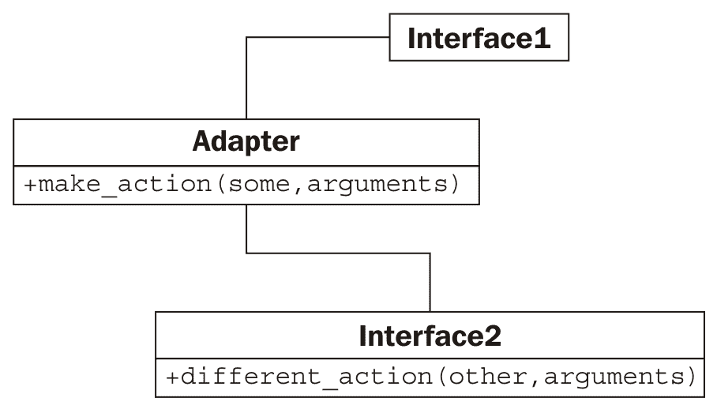
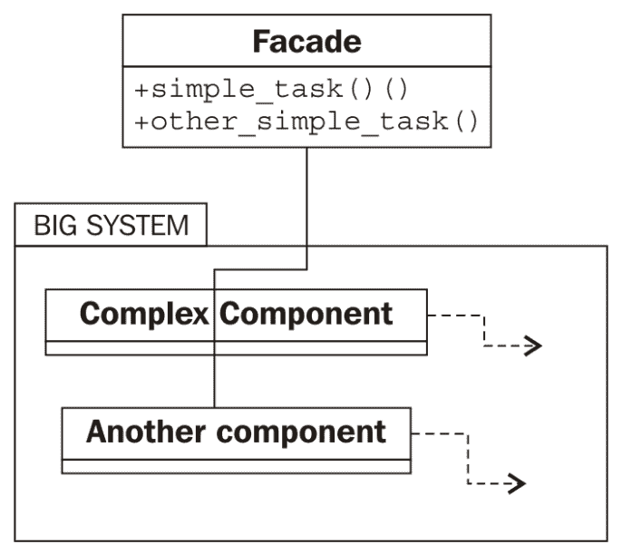
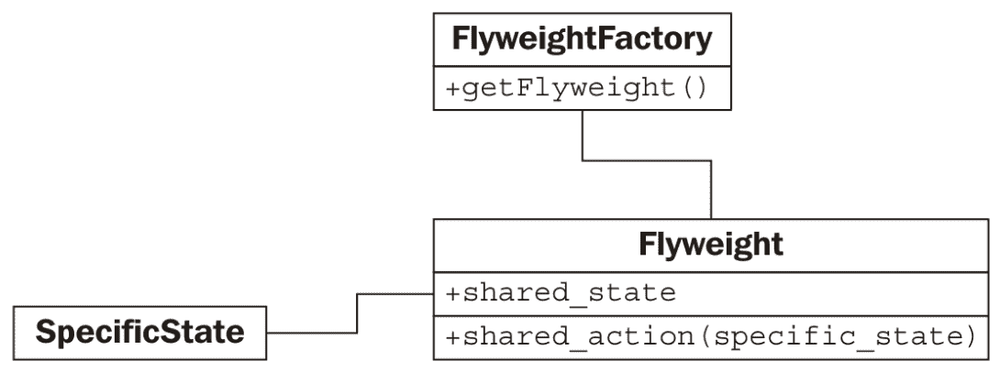
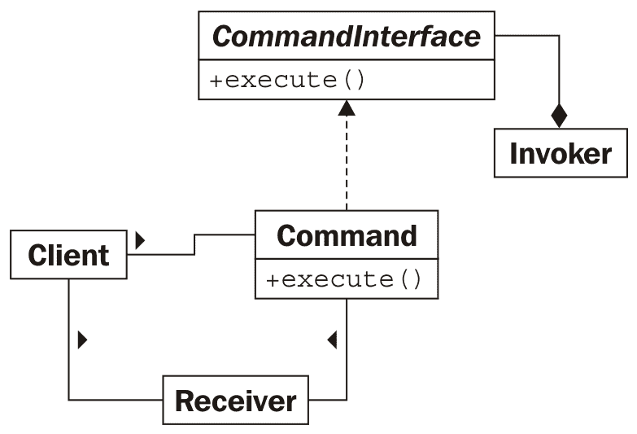
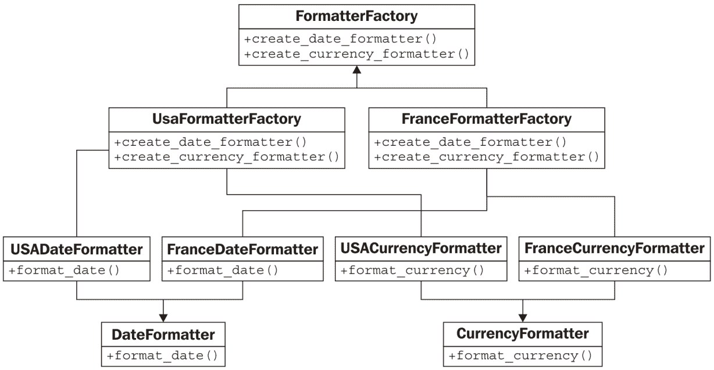
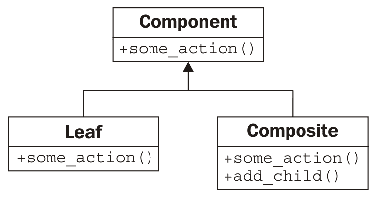
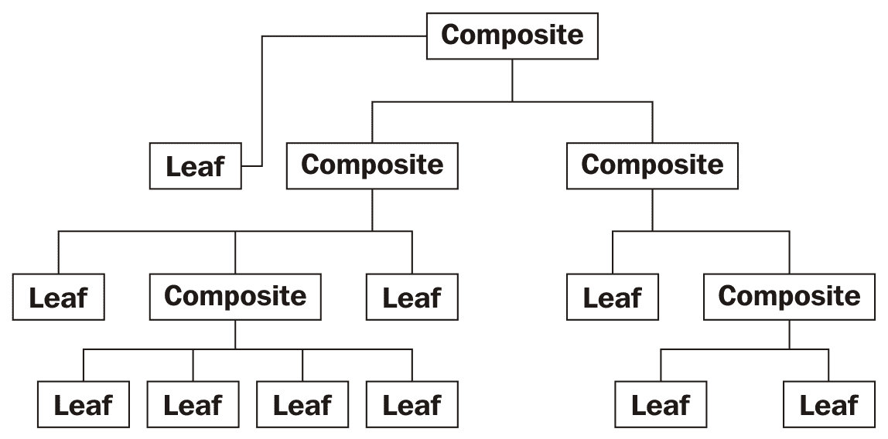

# Python 设计模式 II

在本章中，我们将介绍更多设计模式。我们将再次涵盖标准的示例，以及 Python 中任何常见的替代实现。我们将讨论以下内容：

+   适配器模式

+   外观模式

+   懒加载和享元模式

+   命令模式

+   抽象工厂模式

+   组合模式

# 适配器模式

与上一章中我们审查的大多数模式不同，适配器模式旨在与现有代码交互。我们不会设计一套全新的对象来实现适配器模式。适配器用于允许两个预存在的对象协同工作，即使它们的接口不兼容。就像允许您将 Micro USB 充电线插入 USB-C 手机的显示适配器一样，适配器对象位于两个不同接口之间，在运行时进行转换。适配器对象的唯一目的是执行这种转换。适配可能涉及各种任务，例如将参数转换为不同的格式、重新排列参数的顺序、调用不同名称的方法或提供默认参数。

在结构上，适配器模式类似于简化的装饰器模式。装饰器通常提供与它们替换的相同接口，而适配器在两个不同的接口之间进行映射。这在下图中以 UML 形式表示：



在这里，**Interface1**期望调用一个名为**make_action(some, arguments)**的方法。我们已经有了一个完美的**Interface2**类，它做了一切我们想要的事情（为了避免重复，我们不想重写它！），但它提供了一个名为**different_action(other, arguments)**的方法。**Adapter**类实现了**make_action**接口，并将参数映射到现有接口。

这里的优势在于，将一个接口映射到另一个接口的代码都集中在一个地方。另一种选择会非常丑陋；每次我们需要访问此代码时，我们都必须在多个地方执行转换。

例如，想象我们有一个以下预存在的类，它接受一个格式为`YYYY-MM-DD`的字符串日期，并计算该日期上一个人的年龄：

```py
class AgeCalculator:
    def __init__(self, birthday):
        self.year, self.month, self.day = (
            int(x) for x in birthday.split("-")
        )

    def calculate_age(self, date):
        year, month, day = (int(x) for x in date.split("-"))
        age = year - self.year
        if (month, day) < (self.month, self.day):
            age -= 1
        return age
```

这是一个相当简单的类，它做了它应该做的事情。但我们必须想知道程序员在做什么，使用特定格式的字符串而不是使用 Python 极其有用的内置`datetime`库。作为尽可能重用代码的负责任程序员，我们编写的多数程序都将与`datetime`对象交互，而不是字符串。

我们有几种方法来解决这个问题。我们可以重写这个类以接受`datetime`对象，这可能是更准确的方法。但如果这个类是由第三方提供的，我们不知道如何或不能改变其内部结构，我们需要一个替代方案。我们可以使用这个类原样，每当我们要在`datetime.date`对象上计算年龄时，我们可以调用`datetime.date.strftime('%Y-%m-%d')`将其转换为正确的格式。但这个转换会在很多地方发生，更糟糕的是，如果我们错误地将`%m`误写为`%M`，它将给出当前的分钟而不是输入的月份。想象一下，如果你在十几个不同的地方都写了这个，然后意识到错误时不得不回去更改它。这不是可维护的代码，它违反了 DRY 原则。

相反，我们可以编写一个适配器，允许将普通日期插入到普通的`AgeCalculator`类中，如下面的代码所示：

```py
import datetime 

class DateAgeAdapter:
    def _str_date(self, date):
        return date.strftime("%Y-%m-%d")

    def __init__(self, birthday):
        birthday = self._str_date(birthday)
        self.calculator = AgeCalculator(birthday)

    def get_age(self, date):
        date = self._str_date(date)
        return self.calculator.calculate_age(date)
```

此适配器将`datetime.date`和`datetime.time`（它们具有相同的`strftime`接口）转换为我们的原始`AgeCalculator`可以使用的一个字符串。现在我们可以使用原始代码和我们的新接口。我将方法签名更改为`get_age`，以表明调用接口也可能在寻找不同的方法名，而不仅仅是不同类型的参数。

将类作为适配器是实现此模式的一种常见方式，但通常，在 Python 中还有其他方法可以实现。继承和多继承可以用来向类添加功能。例如，我们可以在`date`类上添加一个适配器，使其与原始的`AgeCalculator`类一起工作，如下所示：

```py
import datetime 
class AgeableDate(datetime.date): 
    def split(self, char): 
        return self.year, self.month, self.day 
```

正是这种代码让人怀疑 Python 是否应该合法。我们已经在我们的子类中添加了一个`split`方法，它接受一个单一参数（我们忽略它）并返回一个包含年、月和日的元组。这个方法与原始的`AgeCalculator`类完美配合，因为代码在一个特殊格式的字符串上调用`strip`，在这种情况下，`strip`返回一个包含年、月和日的元组。`AgeCalculator`代码只关心`strip`是否存在并返回可接受值；它不关心我们是否真的传递了一个字符串。以下代码确实有效：

```py
>>> bd = AgeableDate(1975, 6, 14)
>>> today = AgeableDate.today()
>>> today
AgeableDate(2015, 8, 4)
>>> a = AgeCalculator(bd)
>>> a.calculate_age(today)
40  
```

它可以工作，但这是个愚蠢的想法。在这个特定的情况下，这样的适配器很难维护。我们很快就会忘记为什么需要在`date`类中添加一个`strip`方法。方法名不明确。这可能就是适配器的本质，但明确创建适配器而不是使用继承通常可以更清晰地说明其目的。

除了继承之外，我们有时也可以使用猴子补丁向现有类添加方法。它不会与`datetime`对象一起工作，因为它不允许在运行时添加属性。然而，在正常类中，我们只需添加一个新方法，该方法提供所需的适配接口，供调用代码使用。或者，我们也可以扩展或猴子补丁`AgeCalculator`本身，用更符合我们需求的方法替换`calculate_age`方法。

最后，通常可以使用一个函数作为适配器；这显然不符合适配器模式的设计，但如果我们回想一下函数本质上是有`__call__`方法的对象，它就变成了一个明显的适配器适配。

# 外观模式

外观模式旨在为复杂组件系统提供一个简单的接口。对于复杂任务，我们可能需要直接与这些对象交互，但系统通常有一个*典型*的使用方式，这些复杂的交互并不必要。外观模式允许我们定义一个新的对象，该对象封装了系统的这种典型用法。任何想要访问常用功能的时候，我们都可以使用这个单一对象的简化接口。如果项目的另一个部分需要访问更复杂的功能，它仍然可以直接与系统交互。外观模式的 UML 图很大程度上取决于子系统，但以模糊的方式，它看起来是这样的：



在许多方面，外观模式就像一个适配器。主要区别在于，外观模式试图从一个复杂的接口中抽象出一个更简单的接口，而适配器只试图将一个现有的接口映射到另一个接口。

让我们编写一个简单的电子邮件应用外观。在第七章“Python 面向对象快捷方式”中，我们看到的 Python 发送电子邮件的低级库相当复杂。接收消息的两个库甚至更糟糕。

如果有一个简单的类，可以让我们发送一封电子邮件，并在 IMAP 或 POP3 连接上列出当前收件箱中的电子邮件，那就太好了。为了使我们的例子简短，我们将坚持使用 IMAP 和 SMTP：两个完全不同的子系统，但恰好都处理电子邮件。我们的外观只执行两个任务：将电子邮件发送到特定的地址，并在 IMAP 连接上检查收件箱。它对连接做了一些常见的假设，例如 SMTP 和 IMAP 的主机地址相同，用户名和密码相同，并且使用标准端口。这适用于许多电子邮件服务器，但如果程序员需要更多的灵活性，他们可以始终绕过外观直接访问两个子系统。

类初始化时需要提供电子邮件服务器的域名、用户名和登录密码：

```py
import smtplib 
import imaplib 

class EmailFacade: 
    def __init__(self, host, username, password): 
        self.host = host 
        self.username = username 
        self.password = password 
```

`send_email` 方法格式化电子邮件地址和消息，并使用 `smtplib` 发送。这不是一个复杂的任务，但需要对传递到门面（facade）的自然输入参数进行相当多的调整，以便将它们转换为正确的格式，从而使得 `smtplib` 能够发送消息，如下所示：

```py
    def send_email(self, to_email, subject, message):
        if not "@" in self.username:
            from_email = "{0}@{1}".format(self.username, self.host)
        else:
            from_email = self.username
        message = (
            "From: {0}\r\n" "To: {1}\r\n" "Subject: {2}\r\n\r\n{3}"
        ).format(from_email, to_email, subject, message)

        smtp = smtplib.SMTP(self.host)
        smtp.login(self.username, self.password)
        smtp.sendmail(from_email, [to_email], message)
```

方法开头处的 `if` 语句检测 `username` 是否是整个 *from* 电子邮件地址，或者是 `@` 符号左侧的部分；不同的主机对登录细节的处理方式不同。

最后，获取当前收件箱中消息的代码是一团糟。IMAP 协议过度设计，而 `imaplib` 标准库只是协议的一个薄层。但我们能够简化它，如下所示：

```py
    def get_inbox(self):
        mailbox = imaplib.IMAP4(self.host)
        mailbox.login(
            bytes(self.username, "utf8"), bytes(self.password, "utf8")
        )
        mailbox.select()
        x, data = mailbox.search(None, "ALL")
        messages = []
        for num in data[0].split():
            x, message = mailbox.fetch(num, "(RFC822)")
            messages.append(message[0][1])
        return messages
```

现在，如果我们把这些加在一起，我们就有一个简单的门面类，可以以相当直接的方式发送和接收消息；比直接与这些复杂的库交互简单得多。

虽然在 Python 社区中很少被提及，但门面模式是 Python 生态系统的一个基本组成部分。因为 Python 强调语言的可读性，所以语言及其库都倾向于提供易于理解的接口来处理复杂任务。例如，`for` 循环、`list` 推导和生成器都是更复杂迭代协议的门面。`defaultdict` 实现是一个门面，它抽象掉了当字典中不存在键时的讨厌的边缘情况。第三方 **requests** 库是一个强大的门面，它覆盖了更难以阅读的 HTTP 请求库，而后者本身又是管理基于文本的 HTTP 协议的门面。

# 享元模式

享元模式是一种内存优化模式。新手 Python 程序员往往忽略内存优化，认为内置的垃圾回收器会处理这些。这通常完全可行，但当开发具有许多相关对象的大型应用程序时，关注内存问题可以带来巨大的回报。

享元模式确保共享状态的对象可以使用相同的内存来存储该共享状态。它通常只在程序已经显示出内存问题时才实现。在某些情况下，从一开始就设计最优配置可能是有意义的，但请记住，过早优化是创建难以维护的程序的最有效方式。

让我们看看以下关于享元模式的 UML 图：



每个**享元**都没有特定的状态。任何需要在对**具体状态**执行操作时，都需要由调用代码将此状态传递给**享元**。传统上，返回享元的工厂是一个单独的对象；其目的是为给定键标识的享元返回享元。它的工作方式类似于我们在第十章中讨论的单例模式；如果享元存在，我们返回它；否则，我们创建一个新的。在许多语言中，工厂不是作为一个单独的对象实现，而是作为`Flyweight`类本身的静态方法实现。

想象一下汽车销售的库存系统。每辆单独的汽车都有一个特定的序列号和特定的颜色。但关于那辆汽车的大部分细节对于同一型号的所有汽车都是相同的。例如，本田飞度 DX 型号是一款功能简单的汽车。LX 型号配备了空调、倾斜、定速巡航和电动门窗锁。运动型号配备了花哨的轮子、USB 充电器和尾翼。如果没有使用享元模式，每辆单独的汽车对象都必须存储一个长长的列表，列出它有哪些功能和没有哪些功能。考虑到本田每年销售的汽车数量，这将导致大量的内存浪费。

使用享元模式，我们可以为与型号相关的功能列表拥有共享对象，然后只需简单地引用该型号，以及序列号和颜色，用于单个车辆。在 Python 中，享元工厂通常使用那个奇特的`__new__`构造函数实现，类似于我们之前在单例模式中使用的。

与只返回一个类实例的单例模式不同，我们需要能够根据键返回不同的实例。我们可以在字典中存储项目并基于键查找它们。然而，这个解决方案是有问题的，因为项目将保留在内存中，只要它在字典中。如果我们卖完了 LX 型号的飞度，飞度享元就不再必要了，但它仍然会在字典中。我们可以在卖掉汽车时清理它，但这不就是垃圾收集器的作用吗？

我们可以通过利用 Python 的`weakref`模块来解决这个问题。此模块提供了一个`WeakValueDictionary`对象，它基本上允许我们在不关心垃圾收集器的情况下将项目存储在字典中。如果一个值在弱引用字典中，并且没有其他引用存储在应用程序的任何地方（也就是说，我们卖完了 LX 型号），垃圾收集器最终会为我们清理。

让我们先构建我们的汽车享元工厂，如下所示：

```py
import weakref

class CarModel:
    _models = weakref.WeakValueDictionary()

    def __new__(cls, model_name, *args, **kwargs):
        model = cls._models.get(model_name)
        if not model:
            model = super().__new__(cls)
            cls._models[model_name] = model

        return model
```

基本上，每当我们使用给定的名称构建一个新的飞 weight 时，我们首先在弱引用字典中查找该名称；如果存在，我们返回该模型；如果不存在，我们创建一个新的。无论哪种方式，我们知道在飞 weight 上每次都会调用`__init__`方法，无论它是新对象还是现有对象。因此，我们的`__init__`方法可以像以下代码片段那样：

```py
    def __init__(
        self,
        model_name,
        air=False,
        tilt=False,
        cruise_control=False,
        power_locks=False,
        alloy_wheels=False,
        usb_charger=False,
    ):
        if not hasattr(self, "initted"):
            self.model_name = model_name
            self.air = air
            self.tilt = tilt
            self.cruise_control = cruise_control
            self.power_locks = power_locks
            self.alloy_wheels = alloy_wheels
            self.usb_charger = usb_charger
            self.initted = True

```

`if`语句确保我们只在第一次调用`__init__`时初始化对象。这意味着我们可以在稍后仅使用模型名称调用工厂，并获取相同的飞 weight 对象。然而，因为如果不存在外部引用，飞 weight 将被垃圾回收，我们必须小心不要意外地使用空值创建一个新的飞 weight。

让我们在飞 weight 中添加一个方法，这个方法假设性地查找特定车型上的序列号，并确定它是否参与过任何事故。此方法需要访问汽车的序列号，该序列号因车而异；它不能与飞 weight 一起存储。因此，这些数据必须通过调用代码以如下方式传递到方法中：

```py
    def check_serial(self, serial_number):
        print(
            "Sorry, we are unable to check "
            "the serial number {0} on the {1} "
            "at this time".format(serial_number, self.model_name)
        )
```

我们可以定义一个类来存储额外的信息，以及飞 weight 的引用，如下所示：

```py
class Car: 
    def __init__(self, model, color, serial): 
        self.model = model 
        self.color = color 
        self.serial = serial 

    def check_serial(self): 
        return self.model.check_serial(self.serial) 
```

我们还可以按照以下方式跟踪可用的模型，以及场地上单独的汽车：

```py
>>> dx = CarModel("FIT DX")
>>> lx = CarModel("FIT LX", air=True, cruise_control=True,
... power_locks=True, tilt=True)
>>> car1 = Car(dx, "blue", "12345")
>>> car2 = Car(dx, "black", "12346")
>>> car3 = Car(lx, "red", "12347")  
```

现在，让我们在以下代码片段中演示弱引用的工作原理：

```py
>>> id(lx)
3071620300
>>> del lx
>>> del car3
>>> import gc
>>> gc.collect()
0
>>> lx = CarModel("FIT LX", air=True, cruise_control=True,
... power_locks=True, tilt=True)
>>> id(lx)
3071576140
>>> lx = CarModel("FIT LX")
>>> id(lx)
3071576140
>>> lx.air
True  
```

`id`函数告诉我们对象的唯一标识符。当我们删除所有对 LX 模型的引用并强制进行垃圾回收后再次调用它，我们会看到 ID 已更改。`CarModel __new__`工厂字典中的值已被删除，并创建了一个新的。然而，如果我们尝试构建第二个`CarModel`实例，它将返回相同的对象（ID 相同），尽管我们在第二次调用中没有提供任何参数，`air`变量仍然设置为`True`。这意味着对象第二次没有被初始化，正如我们设计的。

显然，使用飞 weight 模式比仅在单个汽车类上存储特征要复杂得多。我们应该在什么情况下选择使用它？飞 weight 模式是为了节省内存；如果我们有成千上万的相似对象，将相似属性组合到飞 weight 中可以在内存消耗上产生巨大的影响。

对于优化 CPU、内存或磁盘空间的编程解决方案，通常会导致比未优化的版本更复杂的代码。因此，在决定代码可维护性和优化之间权衡时，非常重要。在选择优化时，尽量使用如飞 weight 之类的模式，以确保优化引入的复杂性仅限于代码的一个（良好文档化的）部分。

如果你在一个程序中有许多 Python 对象，通过使用`__slots__`来节省内存是一种快速的方法。`__slots__`魔法方法超出了本书的范围，但如果你在网上查找，会有很多信息。如果你仍然内存不足，轻量级模式可能是一个合理的解决方案。

# 命令模式

命令模式在必须执行的动作和执行这些动作的对象之间添加了一个抽象层，通常在稍后的时间执行。在命令模式中，客户端代码创建一个可以在以后执行的`Command`对象。该对象了解当命令在其上执行时，它将管理自己的内部状态。`Command`对象实现了一个特定的接口（通常，它有一个`execute`或`do_action`方法，并跟踪执行动作所需的任何参数。最后，一个或多个`Invoker`对象在正确的时间执行命令。

下面是这个 UML 图：



命令模式的一个常见例子是在图形窗口上的操作。通常，一个动作可以通过菜单栏上的菜单项、键盘快捷键、工具栏图标或上下文菜单来调用。这些都是`Invoker`对象的例子。实际发生的动作，如`Exit`、`Save`或`Copy`，是`CommandInterface`的实现。用于接收退出命令的 GUI 窗口、用于接收保存命令的文档和用于接收复制命令的`ClipboardManager`都是可能的`Receivers`的例子。

让我们实现一个简单的命令模式，为`Save`和`Exit`操作提供命令。我们将从一些简单的接收器类开始，它们本身具有以下代码：

```py
import sys 

class Window: 
    def exit(self): 
        sys.exit(0) 

class Document: 
    def __init__(self, filename): 
        self.filename = filename 
        self.contents = "This file cannot be modified" 

    def save(self): 
        with open(self.filename, 'w') as file: 
            file.write(self.contents) 
```

这些模拟类模拟了在正常环境中可能会做很多事情的对象。窗口需要处理鼠标移动和键盘事件，文档需要处理字符插入、删除和选择。但在我们的例子中，这两个类将完成我们需要的功能。

现在，让我们定义一些调用者类。这些类将模拟工具栏、菜单和键盘事件，它们实际上并没有连接到任何东西，但我们可以从以下代码片段中看到它们是如何与命令、接收器和客户端代码解耦的：

```py
class ToolbarButton:
    def __init__(self, name, iconname):
        self.name = name
        self.iconname = iconname

    def click(self):
        self.command.execute()

class MenuItem:
    def __init__(self, menu_name, menuitem_name):
        self.menu = menu_name
        self.item = menuitem_name

    def click(self):
        self.command.execute()

class KeyboardShortcut:
    def __init__(self, key, modifier):
        self.key = key
        self.modifier = modifier

    def keypress(self):
        self.command.execute()
```

注意到各种动作方法是如何分别调用它们各自命令的`execute`方法的吗？这段代码没有显示在每个对象上设置`command`属性。它们可以被传递到`__init__`函数中，但由于它们可能会改变（例如，使用可定制的键绑定编辑器），在对象之后设置属性更合理。

现在，让我们用以下代码将命令本身连接起来：

```py
class SaveCommand:
    def __init__(self, document):
        self.document = document

    def execute(self):
        self.document.save()

class ExitCommand:
    def __init__(self, window):
        self.window = window

    def execute(self):
        self.window.exit()
```

这些命令很简单；它们展示了基本模式，但重要的是要注意，如果需要，我们可以将状态和其他信息存储在命令中。例如，如果我们有一个插入字符的命令，我们可以维护当前正在插入的字符的状态。

现在我们只需要连接一些客户端和测试代码，以便使命令生效。对于基本测试，我们只需在脚本的末尾包含以下代码即可：

```py
window = Window() 
document = Document("a_document.txt") 
save = SaveCommand(document) 
exit = ExitCommand(window) 

save_button = ToolbarButton('save', 'save.png') 
save_button.command = save 
save_keystroke = KeyboardShortcut("s", "ctrl") 
save_keystroke.command = save 
exit_menu = MenuItem("File", "Exit") 
exit_menu.command = exit 
```

首先，我们创建两个接收器和两个命令。然后，我们创建几个可用的调用者，并将正确的命令设置在每个调用者上。为了测试，我们可以使用 `python3 -i filename.py` 并运行如 `exit_menu.click()` 这样的代码，这将结束程序，或者 `save_keystroke.keystroke()`，这将保存假文件。

不幸的是，前面的例子并不觉得特别像 Python。它们有很多“样板代码”（不完成任何事情，但只为模式提供结构的代码），并且 `Command` 类彼此之间非常相似。也许我们可以创建一个通用的命令对象，它接受一个函数作为回调？

事实上，为什么麻烦呢？我们能否为每个命令直接使用一个函数或方法对象？而不是一个带有 `execute()` 方法的对象，我们可以编写一个函数并将其直接用作命令。以下是在 Python 中命令模式的常见范式：

```py
import sys

class Window:
    def exit(self):
        sys.exit(0)

class MenuItem:
    def click(self):
        self.command()

window = Window()
menu_item = MenuItem()
menu_item.command = window.exit
```

现在看起来更像是 Python。乍一看，我们好像完全去除了命令模式，并且将 `menu_item` 和 `Window` 类紧密连接在一起。但如果我们仔细观察，会发现实际上并没有紧密耦合。任何可调用的对象都可以设置为 `MenuItem` 上的命令，就像之前一样。而且 `Window.exit` 方法可以附加到任何调用者上。命令模式的多数灵活性都得到了保持。我们为了可读性牺牲了完全解耦，但在我看来，以及许多 Python 程序员的看法，这段代码比完全抽象化的版本更容易维护。

当然，由于我们可以向任何对象添加一个 `__call__` 方法，我们并不局限于函数。在需要调用的方法不需要维护状态时，前面的例子是一个有用的快捷方式，但在更高级的使用中，我们也可以使用以下代码：

```py
class Document:
    def __init__(self, filename):
        self.filename = filename
        self.contents = "This file cannot be modified"

    def save(self):
        with open(self.filename, "w") as file:
            file.write(self.contents)

class KeyboardShortcut:
    def keypress(self):
        self.command()

class SaveCommand:
    def __init__(self, document):
        self.document = document

    def __call__(self):
        self.document.save()

document = Document("a_file.txt")
shortcut = KeyboardShortcut()
save_command = SaveCommand(document)
shortcut.command = save_command
```

这里，我们有一种看起来像是第一个命令模式的东西，但稍微更符合习惯。正如你所见，使调用者调用可调用对象而不是带有执行方法的 `command` 对象并没有以任何方式限制我们。事实上，它给了我们更多的灵活性。当直接链接函数有效时，我们可以直接链接到函数，而当情况需要时，我们也可以构建一个完整的可调用 `command` 对象。

命令模式通常被扩展以支持可撤销的命令。例如，一个文本程序可能会将每个插入操作包裹在一个单独的命令中，不仅包含一个`execute`方法，还包含一个`undo`方法，该方法将删除该插入操作。一个图形程序可能会将每个绘图操作（矩形、线条、自由手绘像素等）包裹在一个具有`undo`方法的命令中，该命令将像素重置到原始状态。在这种情况下，命令模式的解耦显然更有用，因为每个操作都必须保持足够的状态，以便在以后的时间点撤销该操作。

# 抽象工厂模式

抽象工厂模式通常用于当我们有多个可能的系统实现，这些实现依赖于某些配置或平台问题时。调用代码从抽象工厂请求一个对象，并不知道将返回什么类的对象。返回的底层实现可能取决于各种因素，如当前区域设置、操作系统或本地配置。

抽象工厂模式的常见例子包括操作系统无关的工具包代码、数据库后端、以及特定国家的格式化器或计算器。一个操作系统无关的 GUI 工具包可能会使用抽象工厂模式，在 Windows 下返回一组 WinForm 小部件，在 Mac 下返回 Cocoa 小部件，在 Gnome 下返回 GTK 小部件，在 KDE 下返回 QT 小部件。Django 提供了一个抽象工厂，根据当前站点的配置设置返回一组用于与特定数据库后端（MySQL、PostgreSQL、SQLite 等）交互的对象关系类。如果应用程序需要部署在多个地方，每个地方都可以通过只更改一个配置变量来使用不同的数据库后端。不同的国家有不同的系统来计算零售商品的税费、小计和总计；抽象工厂可以返回特定的税费计算对象。

没有具体示例，抽象工厂模式的 UML 类图很难理解，所以让我们先反过来创建一个具体的例子。在我们的例子中，我们将创建一组依赖于特定区域设置的格式化器，帮助我们格式化日期和货币。将有一个抽象工厂类来选择特定的工厂，以及几个具体的示例工厂，一个用于法国，一个用于美国。每个这些都将创建日期和时间的格式化器对象，可以查询以格式化特定值。这将在以下图中表示：



将该图像与早期的简单文本进行比较表明，一张图片并不总是值一千个字，尤其是考虑到我们甚至没有考虑到工厂选择代码。

当然，在 Python 中，我们不需要实现任何接口类，因此我们可以丢弃`DateFormatter`、`CurrencyFormatter`和`FormatterFactory`。如果详细说明，格式化类本身相当直接，如下所示：

```py
class FranceDateFormatter:
    def format_date(self, y, m, d):
        y, m, d = (str(x) for x in (y, m, d))
        y = "20" + y if len(y) == 2 else y
        m = "0" + m if len(m) == 1 else m
        d = "0" + d if len(d) == 1 else d
        return "{0}/{1}/{2}".format(d, m, y)

class USADateFormatter:
    def format_date(self, y, m, d):
        y, m, d = (str(x) for x in (y, m, d))
        y = "20" + y if len(y) == 2 else y
        m = "0" + m if len(m) == 1 else m
        d = "0" + d if len(d) == 1 else d
        return "{0}-{1}-{2}".format(m, d, y)

class FranceCurrencyFormatter:
    def format_currency(self, base, cents):
        base, cents = (str(x) for x in (base, cents))
        if len(cents) == 0:
            cents = "00"
        elif len(cents) == 1:
            cents = "0" + cents

        digits = []
        for i, c in enumerate(reversed(base)):
            if i and not i % 3:
                digits.append(" ")
            digits.append(c)
        base = "".join(reversed(digits))
        return "{0}€{1}".format(base, cents)

class USACurrencyFormatter:
    def format_currency(self, base, cents):
        base, cents = (str(x) for x in (base, cents))
        if len(cents) == 0:
            cents = "00"
        elif len(cents) == 1:
            cents = "0" + cents
        digits = []
        for i, c in enumerate(reversed(base)):
            if i and not i % 3:
                digits.append(",")
            digits.append(c)
        base = "".join(reversed(digits))
        return "${0}.{1}".format(base, cents)
```

这些类使用一些基本的字符串操作来尝试将各种可能的输入（整数、不同长度的字符串等）转换为以下格式：

|  | **USA** | **France** |
| --- | --- | --- |
| **日期** | mm-dd-yyyy | dd/mm/yyyy |
| **货币** | $14,500.50 | 14 500€50 |

显然，在这个代码中对输入进行更多的验证是有可能的，但为了这个示例，我们还是让它保持简单。

现在我们已经设置了格式化器，我们只需要创建格式化器工厂，如下所示：

```py
class USAFormatterFactory:
    def create_date_formatter(self):
        return USADateFormatter()

    def create_currency_formatter(self):
        return USACurrencyFormatter()

class FranceFormatterFactory:
    def create_date_formatter(self):
        return FranceDateFormatter()

    def create_currency_formatter(self):
        return FranceCurrencyFormatter()
```

现在我们设置代码来选择合适的格式化器。由于这类事情只需要设置一次，我们可以将其做成单例——但单例在 Python 中并不很有用。让我们只是将当前的格式化器作为一个模块级变量：

```py
country_code = "US"
factory_map = {"US": USAFormatterFactory, "FR": FranceFormatterFactory}
formatter_factory = factory_map.get(country_code)()
```

在这个示例中，我们硬编码了当前的国家代码；在实际应用中，它可能会检查区域设置、操作系统或配置文件来选择代码。这个示例使用字典将国家代码与工厂类关联起来。然后，我们从字典中获取正确的类并实例化它。

当我们想要为更多国家添加支持时，很容易看出需要做什么：创建新的格式化器类和抽象工厂本身。记住，`Formatter`类可能会被重用；例如，加拿大和美国的货币格式相同，但它的日期格式比其南部的邻国更合理。

抽象工厂通常返回一个单例对象，但这不是必需的。在我们的代码中，每次调用时它都会返回每个格式化器的新实例。没有必要将格式化器存储为实例变量，并为每个工厂返回相同的实例。

回顾这些示例，我们看到，同样，似乎又有大量的样板代码用于工厂，这在 Python 中似乎并不必要。通常，可能需要抽象工厂的要求可以通过为每个工厂类型使用单独的模块（例如：美国和法国）来更容易地满足，并确保在工厂模块中访问正确的模块。这样的模块的包结构可能看起来像这样：

```py
localize/ 
    __init__.py 
    backends/ 
        __init__.py 
        USA.py 
        France.py 
        ... 
```

技巧在于`localize`包中的`__init__.py`可以包含逻辑，将所有请求重定向到正确的后端。这可以通过多种方式实现。

如果我们知道后端永远不会动态更改（即，无需程序重启），我们可以在`__init__.py`中放置一些`if`语句来检查当前国家代码，并使用（通常不可接受的）`from``.backends.USA``import``*`语法从适当的后端导入所有变量。或者，我们可以导入每个后端并设置一个`current_backend`变量来指向特定的模块，如下所示：

```py
from .backends import USA, France 

if country_code == "US": 
    current_backend = USA 
```

根据我们选择的解决方案，我们的客户端代码可能需要调用`localize.format_date`或`localize.current_backend.format_date`来获取当前国家地区的日期格式。最终结果比原始的抽象工厂模式更加 Pythonic，并且在典型使用中，它同样灵活。

# 组合模式

组合模式允许从简单的组件构建复杂的树状结构。这些组件被称为组合对象，它们能够根据是否有子组件而表现得像容器或变量。组合对象是容器对象，其内容实际上可能是另一个组合对象。

传统上，复合对象中的每个组件必须是叶节点（不能包含其他对象）或组合节点。关键是组合和叶节点可以具有相同的接口。以下 UML 图非常简单：



然而，这个简单的模式允许我们创建复杂的元素排列，所有这些元素都满足组件对象的接口。以下图展示了这样一个复杂排列的具体实例：



组合模式在类似文件/文件夹的树中非常常用。无论树中的节点是普通文件还是文件夹，它仍然会受到移动、复制或删除节点的操作的影响。我们可以创建一个支持这些操作的组件接口，然后使用组合对象来表示文件夹，用叶节点来表示普通文件。

当然，在 Python 中，我们再次可以利用鸭子类型来隐式提供接口，因此我们只需要编写两个类。让我们首先在以下代码中定义这些接口：

```py
class Folder: 
    def __init__(self, name): 
        self.name = name 
        self.children = {} 

    def add_child(self, child): 
        pass 

    def move(self, new_path): 
        pass 

    def copy(self, new_path): 
        pass 

    def delete(self): 
        pass 

class File: 
    def __init__(self, name, contents): 
        self.name = name 
        self.contents = contents 

    def move(self, new_path): 
        pass 

    def copy(self, new_path): 
        pass 

    def delete(self): 
        pass 
```

对于每个文件夹（组合）对象，我们维护一个子节点字典。对于许多组合实现，列表就足够了，但在这个情况下，使用字典通过名称查找子节点将是有用的。我们的路径将以节点名称通过`/`字符分隔，类似于 Unix shell 中的路径。

考虑到涉及的方法，我们可以看到移动或删除节点的方式在是否为文件或文件夹节点的情况下都是相似的。然而，对于文件夹节点，复制操作需要进行递归复制，而复制文件节点则是一个简单的操作。

为了利用类似的操作，我们可以将一些公共方法提取到一个父类中。让我们将那个废弃的 `Component` 接口改为一个基类，如下所示：

```py
class Component:
    def __init__(self, name):
        self.name = name

    def move(self, new_path):
        new_folder = get_path(new_path)
        del self.parent.children[self.name]
        new_folder.children[self.name] = self
        self.parent = new_folder

    def delete(self):
        del self.parent.children[self.name]

class Folder(Component):
    def __init__(self, name):
        super().__init__(name)
        self.children = {}

    def add_child(self, child):
        pass

    def copy(self, new_path):
        pass

class File(Component):
    def __init__(self, name, contents):
        super().__init__(name)
        self.contents = contents

    def copy(self, new_path):
        pass

root = Folder("")

def get_path(path):
    names = path.split("/")[1:]
    node = root
    for name in names:
        node = node.children[name]
    return node
```

我们在 `Component` 类中创建了 `move` 和 `delete` 方法。这两个方法都访问我们尚未设置的神秘 `parent` 变量。`move` 方法使用一个模块级别的 `get_path` 函数，根据给定的路径从一个预定义的根节点找到一个节点。所有文件都将添加到这个根节点或该节点的子节点。对于 `move` 方法，目标应该是一个现有的文件夹，否则我们会得到一个错误。正如技术书籍中的许多例子一样，错误处理严重不足，以帮助集中考虑正在考虑的原则。

让我们在文件夹的 `add_child` 方法中设置那个神秘的 `parent` 变量，如下所示：

```py
    def add_child(self, child):
        child.parent = self
        self.children[child.name] = child
```

好吧，这很简单。让我们看看以下代码片段是否可以正确地工作我们的组合文件层次结构：

```py
$ python3 -i 1261_09_18_add_child.py

>>> folder1 = Folder('folder1')
>>> folder2 = Folder('folder2')
>>> root.add_child(folder1)
>>> root.add_child(folder2)
>>> folder11 = Folder('folder11')
>>> folder1.add_child(folder11)
>>> file111 = File('file111', 'contents')
>>> folder11.add_child(file111)
>>> file21 = File('file21', 'other contents')
>>> folder2.add_child(file21)
>>> folder2.children
{'file21': <__main__.File object at 0xb7220a4c>}
>>> folder2.move('/folder1/folder11')
>>> folder11.children
{'folder2': <__main__.Folder object at 0xb722080c>, 'file111': <__main__.File object at 
0xb72209ec>}
>>> file21.move('/folder1')
>>> folder1.children
{'file21': <__main__.File object at 0xb7220a4c>, 'folder11': <__main__.Folder object at 
0xb722084c>}  
```

是的，我们可以创建文件夹，将文件夹添加到其他文件夹中，将文件添加到文件夹中，并且可以在它们之间移动！在文件层次结构中我们还能要求什么更多呢？

好吧，我们可以要求实现复制功能，但为了节省树，让我们将其留作练习。

组合模式对于各种树形结构非常有用，包括 GUI 小部件层次结构、文件层次结构、树集、图和 HTML DOM。当按照传统实现方式在 Python 中实现时，它可以是一个有用的模式，如前面示例所示。有时，如果我们只创建浅层树，我们可以用列表的列表或字典的字典来应付，而不需要实现自定义的组件、叶子和组合类。在其他时候，我们可以只实现一个组合类，并将叶子和组合对象视为一个类。或者，Python 的鸭子类型可以使得将其他对象添加到组合层次结构中变得容易，只要它们具有正确的接口。

# 练习

在深入到每个设计模式的练习之前，花点时间实现上一节中 `File` 和 `Folder` 对象的 `copy` 方法。`File` 的方法应该相当简单；只需创建一个具有相同名称和内容的新的节点，并将其添加到新的父文件夹中。`Folder` 的 `copy` 方法要复杂得多，因为你首先必须复制文件夹，然后将每个子节点递归地复制到新位置。你可以无差别地调用子节点的 `copy()` 方法，无论它们是文件还是文件夹对象。这将充分展示组合模式有多么强大。

现在，就像上一章一样，看看我们讨论过的模式，并考虑你可能实现它们的理想位置。你可能希望将适配器模式应用于现有代码，因为它通常适用于与现有库接口，而不是新代码。你如何使用适配器来强制两个接口正确地相互交互？

你能想到一个足够复杂的系统，以证明使用外观模式的合理性吗？考虑外观在实际生活中的应用，比如汽车的驾驶员界面，或者工厂的控制面板。在软件中，这类似，只是外观接口的用户是其他程序员，而不是受过培训使用它们的人。在你的最新项目中，有复杂到足以从外观模式中受益的系统吗？

可能你没有大量消耗内存的代码，但你能想到可能有用的情况吗？任何需要处理大量重叠数据的地方，都可能有享元模式等待被使用。在银行业务中会有用吗？在 Web 应用程序中呢？在什么情况下采用享元模式是有意义的？什么时候又过度了呢？

那么，命令模式呢？你能想到任何常见的（或者更好的，不常见的）例子，说明从调用中解耦动作会有用吗？看看你每天使用的程序，想象一下它们是如何内部实现的。很可能其中许多程序出于某种目的使用了命令模式。

抽象工厂模式，或者我们讨论过的稍微更 Python 化的衍生模式，对于创建一键可配置的系统非常有用。你能想到这样的系统在哪些地方有用吗？

最后，考虑组合模式。在编程中，我们周围到处都是树状结构；其中一些，比如我们的文件层次结构示例，很明显；其他则相当微妙。在什么情况下组合模式可能会很有用？你能想到在你的代码中可以使用它的地方吗？如果你稍微调整一下模式；例如，为不同类型的对象包含不同类型的叶节点或组合节点，会怎样？

# 摘要

在本章中，我们详细介绍了几个更多的设计模式，包括它们的规范描述以及如何在 Python 中实现它们，Python 通常比传统的面向对象语言更加灵活和多功能。适配器模式用于匹配接口，而外观模式适合简化它们。享元模式是一个复杂的设计模式，只有在需要内存优化时才有效。在 Python 中，命令模式通常更合适地通过一等函数作为回调来实现。抽象工厂允许根据配置或系统信息在运行时分离实现。组合模式被普遍用于树状结构。

这是本书中真正面向对象的章节的最后一章，但我还加入了一些我非常关心的主题的免费内容。在下一章中，我们将讨论测试 Python 程序的重要性以及如何进行测试，重点关注面向对象的原则。
