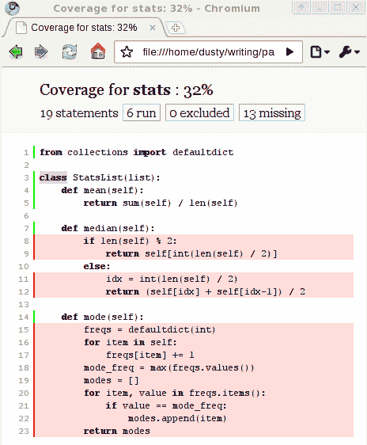

# 测试面向对象程序

熟练的 Python 程序员一致认为，测试是软件开发最重要的方面之一。尽管这一章被放置在书的末尾附近，但这并不是一个事后想法；我们迄今为止所学的所有内容都将帮助我们编写测试。在本章中，我们将探讨以下主题：

+   单元测试和测试驱动开发的重要性

+   标准的 `unittest` 模块

+   `pytest` 自动化测试套件

+   `mock` 模块

+   代码覆盖率

+   使用 `tox` 进行跨平台测试

# 为什么需要测试？

许多程序员已经知道测试代码的重要性。如果你是其中之一，请随意浏览这一节。你会发现下一节——我们实际上将看到如何在 Python 中创建测试——要有趣得多。如果你还没有确信测试的重要性，我保证你的代码有缺陷，你只是不知道而已。继续阅读！

有些人认为，由于 Python 的动态特性，测试在 Python 代码中更为重要；编译语言，如 Java 和 C++，有时被认为在某种程度上更*安全*，因为它们在编译时强制进行类型检查。然而，Python 测试很少检查类型。它们检查值。它们确保在正确的时间设置了正确的属性，或者序列具有正确的长度、顺序和值。这些高级概念在任何语言中都需要进行测试。Python 程序员比其他语言的程序员更多地测试代码的真正原因是，在 Python 中测试变得如此容易！

但为什么需要测试？我们真的需要测试吗？如果我们不测试会怎样？为了回答这些问题，从头开始编写一个没有进行任何测试的井字棋游戏。不要运行它直到完全编写完成，从头到尾。如果你让两个玩家都是人类玩家（没有人工智能），井字棋的实现相当简单。你甚至不需要尝试计算谁是赢家。现在运行你的程序。并修复所有错误。有多少个？我在我的井字棋实现中记录了八个，我不确定我是否都捕捉到了。你呢？

我们需要测试我们的代码以确保它能够正常工作。像我们刚才做的那样运行程序并修复错误是一种粗略的测试形式。Python 的交互式解释器和几乎为零的编译时间使得编写几行代码并运行程序来确保这些代码行正在执行预期操作变得非常容易。但是，更改几行代码可能会影响我们尚未意识到会受到这些更改影响的程序部分，因此我们忽略了这些部分的测试。此外，随着程序的增长，解释器可以通过该代码的路径数量也会增加，很快手动测试所有这些路径就变得不可能了。

为了处理这个问题，我们编写自动化测试。这些是自动将某些输入通过其他程序或程序的某些部分运行的程序。我们可以在几秒钟内运行这些测试程序，并覆盖比一个程序员在每次更改时想要测试的更多潜在输入情况。

编写测试有四个主要原因：

+   为了确保代码按照开发者的预期工作

+   为了确保我们在进行更改时代码仍然可以继续工作

+   为了确保开发者理解了需求

+   为了确保我们编写的代码有一个可维护的接口

第一个点实际上并不能证明编写测试所需的时间是合理的；我们可以在相同的时间或更少的时间内直接在交互式解释器中测试代码。但是，当我们必须多次执行相同的测试动作序列时，自动化这些步骤一次然后随时运行它们会更节省时间。每次我们更改代码时，运行测试都是一个好主意，无论是初始开发还是维护版本。当我们有一套全面的自动化测试时，我们可以在代码更改后运行它们，并知道我们没有无意中破坏任何已测试的内容。

前面的最后两点更有趣。当我们为代码编写测试时，它有助于我们设计 API、接口或代码采用的模式。因此，如果我们对需求理解有误，编写测试可以帮助突出这种误解。从另一方面来看，如果我们不确定如何设计一个类，我们可以编写一个与该类交互的测试，这样我们就有了一个关于如何自然地与之交互的想法。实际上，在编写我们要测试的代码之前编写测试通常是有益的。

# 测试驱动开发

*先写测试*是测试驱动开发的座右铭。测试驱动开发将*未经测试的代码是损坏的代码*的概念进一步推进，并建议只有未编写的代码才应该是未经测试的。我们不会编写任何代码，直到我们编写了证明它工作的测试。第一次运行测试时它应该失败，因为代码还没有被编写。然后，我们编写确保测试通过的代码，然后为下一段代码编写另一个测试。

测试驱动开发很有趣；它允许我们构建小谜题来解决。然后，我们实现代码来解决这些谜题。然后，我们制作一个更复杂的谜题，并编写代码来解决新谜题，同时不解决之前的谜题。

测试驱动方法有两个目标。第一个是确保测试确实被编写了。在我们编写代码之后，很容易就说：

"嗯，看起来好像没问题。我不用为这个写任何测试。这只是一个小改动；不可能有什么东西会出问题。"

如果测试在编写代码之前就已经编写好了，我们就会确切地知道它何时工作（因为测试会通过），并且我们会在未来知道它是否被我们或其他人所做的更改所破坏。

其次，先编写测试迫使我们仔细考虑代码将如何被使用。它告诉我们对象需要哪些方法以及如何访问属性。它帮助我们将初始问题分解成更小、可测试的问题，然后将经过测试的解决方案重新组合成更大、也经过测试的解决方案。因此，编写测试可以成为设计过程的一部分。通常，当我们为新的对象编写测试时，我们会发现设计中的异常，这迫使我们考虑软件的新方面。

作为具体例子，想象一下编写使用对象关系映射器将对象属性存储在数据库中的代码。在这些对象中使用自动分配的数据库 ID 是很常见的。我们的代码可能出于各种目的使用这个 ID。如果我们为这样的代码编写测试，在编写它之前，我们可能会意识到我们的设计有缺陷，因为对象只有在保存到数据库后才会分配 ID。如果我们想在测试中操作一个对象而不保存它，这将在我们基于错误前提编写代码之前突出这个问题。

测试使软件变得更好。在发布软件之前编写测试，可以在最终用户看到或购买有缺陷的版本之前使其变得更好（我曾为那些以“用户可以测试它”为理念的公司工作；这不是一个健康的商业模式）。在编写软件之前编写测试，可以使它第一次编写时就变得更好。

# 单元测试

让我们从 Python 内置的测试库开始我们的探索。这个库为**单元测试**提供了一个通用的面向对象接口。单元测试专注于在任何一个测试中测试尽可能少的代码。每个测试都针对可用代码总量中的一个单一单元。

这个 Python 库被称为`unittest`。它提供了一些创建和运行单元测试的工具，其中最重要的是`TestCase`类。这个类提供了一组方法，允许我们比较值、设置测试，并在它们完成后进行清理。

当我们想要为特定任务编写一组单元测试时，我们创建一个`TestCase`的子类，并编写单独的方法来进行实际测试。这些方法都必须以`test`开头命名。遵循此约定时，测试将自动作为测试过程的一部分运行。通常，测试会在对象上设置一些值，然后运行一个方法，并使用内置的比较方法来确保计算出了正确的结果。以下是一个非常简单的例子：

```py
import unittest

class CheckNumbers(unittest.TestCase):
    def test_int_float(self):
        self.assertEqual(1, 1.0)

if __name__ == "__main__":
    unittest.main()
```

此代码简单地从`TestCase`类派生，并添加了一个调用`TestCase.assertEqual`方法的方法。此方法将根据两个参数是否相等而成功或引发异常。如果我们运行此代码，`unittest`的`main`函数将给出以下输出：

```py
.
--------------------------------------------------------------
Ran 1 test in 0.000s

OK  
```

你知道浮点数和整数可以被视为相等吗？让我们添加一个失败的测试，如下所示：

```py
    def test_str_float(self): 
        self.assertEqual(1, "1") 
```

此代码的输出更为神秘，因为整数和字符串并不

被视为相等：

```py
.F
============================================================
FAIL: test_str_float (__main__.CheckNumbers)
--------------------------------------------------------------
Traceback (most recent call last):
 File "first_unittest.py", line 9, in test_str_float
 self.assertEqual(1, "1")
AssertionError: 1 != '1'

--------------------------------------------------------------
Ran 2 tests in 0.001s

FAILED (failures=1)  
```

第一行上的点表示第一个测试（我们之前写的）成功通过；它后面的字母`F`表示第二个测试失败。然后，在最后，它给出了有关测试失败方式和位置的一些信息输出，以及失败次数的摘要。

我们可以在一个`TestCase`类上拥有尽可能多的测试方法。只要方法名以`test`开头，测试运行器就会将每个方法作为一个单独的、独立的测试执行。每个测试应该完全独立于其他测试。之前测试的结果或计算不应影响当前测试。编写良好单元测试的关键是尽可能保持每个测试方法简短，每个测试用例测试一小块代码。如果我们的代码似乎不能自然地分解成这样的可测试单元，那么这可能是一个迹象，表明代码需要重新设计。

# 断言方法

测试用例的一般布局是设置某些变量为已知值，运行一个或多个函数、方法或过程，然后使用`TestCase`断言方法*证明*返回或计算了正确的预期结果。

有几种不同的断言方法可用于确认是否达到了特定的结果。我们刚刚看到了`assertEqual`，如果两个参数没有通过相等性检查，它将导致测试失败。其逆操作`assertNotEqual`将在两个参数相等时失败。`assertTrue`和`assertFalse`方法各自接受一个表达式，如果表达式没有通过`if`测试，则失败。这些测试不检查`True`或`False`的布尔值。相反，它们测试的条件与使用`if`语句相同：`False`、`None`、`0`或一个空列表、字典、字符串、集合或元组将通过`assertFalse`方法的调用。非零数字、包含值的容器或`True`值在调用`assertTrue`方法时会成功。

有一个`assertRaises`方法可以用来确保特定的函数调用引发特定的异常，或者，可选地，它可以作为一个上下文管理器来包装内联代码。如果`with`语句内的代码引发了适当的异常，则测试通过；否则，测试失败。以下代码片段是这两个版本的示例：

```py
import unittest

def average(seq):
    return sum(seq) / len(seq)

class TestAverage(unittest.TestCase):
    def test_zero(self):
        self.assertRaises(ZeroDivisionError, average, [])

    def test_with_zero(self):
        with self.assertRaises(ZeroDivisionError):
            average([])

if __name__ == "__main__":
    unittest.main()
```

上下文管理器允许我们以我们通常编写代码的方式（通过调用函数或直接执行代码）编写代码，而不是必须将函数调用包装在另一个函数调用中。

此外，还有几种其他断言方法，总结在下表中：

| **方法** | **描述** |
| --- | --- |
| `assertGreater` `assertGreaterEqual` `assertLess` `assertLessEqual` | 接受两个可比较的对象，并确保命名不等式成立。 |
| `assertIn` `assertNotIn` | 确保一个元素是（或不是）容器对象中的元素。 |
| `assertIsNone` `assertIsNotNone` | 确保一个元素是（或不是）精确的 `None` 值（但不是另一个假值）。 |
| `assertSameElements` | 确保两个容器对象具有相同的元素，忽略顺序。 |
| `assertSequenceEqual` `assertDictEqual` `assertSetEqual` `assertListEqual` `assertTupleEqual` | 确保两个容器具有相同顺序的相同元素。如果出现失败，将显示一个代码差异，比较两个列表以查看它们在哪里不同。最后四种方法还测试列表的类型。 |

每个断言方法都接受一个名为 `msg` 的可选参数。如果提供，如果断言失败，它将包含在错误消息中。这可以用来澄清期望的内容或解释可能导致断言失败的错误可能发生的地方。然而，我很少使用这种语法，更愿意使用描述性的测试方法名称。

# 减少样板代码和清理

编写几个小型测试后，我们经常发现我们必须为几个相关的测试编写相同的设置代码。例如，以下 `list` 子类有三个用于统计计算的方法：

```py
from collections import defaultdict 

class StatsList(list): 
    def mean(self): 
        return sum(self) / len(self) 

    def median(self): 
        if len(self) % 2: 
            return self[int(len(self) / 2)] 
        else: 
            idx = int(len(self) / 2) 
            return (self[idx] + self[idx-1]) / 2 

    def mode(self): 
        freqs = defaultdict(int) 
        for item in self: 
            freqs[item] += 1 
        mode_freq = max(freqs.values()) 
        modes = [] 
        for item, value in freqs.items(): 
            if value == mode_freq: 
                modes.append(item) 
        return modes 
```

显然，我们将想要测试这三种方法在具有非常相似输入的情况下的情况。我们想看看空列表、包含非数值的列表或包含正常数据集的列表会发生什么。我们可以使用 `TestCase` 类的 `setUp` 方法为每个测试执行初始化。此方法不接受任何参数，并允许我们在每个测试运行之前进行任意设置。例如，我们可以如下测试所有三种方法在相同的整数列表上：

```py
from stats import StatsList
import unittest

class TestValidInputs(unittest.TestCase):
    def setUp(self):
        self.stats = StatsList([1, 2, 2, 3, 3, 4])

    def test_mean(self):
        self.assertEqual(self.stats.mean(), 2.5)

    def test_median(self):
        self.assertEqual(self.stats.median(), 2.5)
        self.stats.append(4)
        self.assertEqual(self.stats.median(), 3)

    def test_mode(self):
        self.assertEqual(self.stats.mode(), [2, 3])
        self.stats.remove(2)
        self.assertEqual(self.stats.mode(), [3])

if __name__ == "__main__":
    unittest.main()
```

如果我们运行此示例，它表明所有测试都通过。首先要注意的是，在三个 `test_*` 方法中从未显式调用 `setUp` 方法。测试套件代表我们这样做。更重要的是，注意 `test_median` 如何通过向其中添加额外的 `4` 来改变列表，但在随后的 `test_mode` 被调用时，列表已返回 `setUp` 中指定的值。如果不是这样，列表中会有两个 `4`，并且 `mode` 方法将返回三个值。这表明 `setUp` 在每个测试之前单独调用，确保测试类从一个干净的状态开始。测试可以按任何顺序执行，并且一个测试的结果绝不能依赖于任何其他测试。

除了`setUp`方法外，`TestCase`还提供了一个无参数的`tearDown`方法，可以在每个测试在类中运行后用于清理。如果清理需要除让对象被垃圾回收之外的其他操作，这个方法很有用。

例如，如果我们正在测试执行文件 I/O 的代码，我们的测试可能会在测试过程中创建新的文件作为副作用。`tearDown`方法可以删除这些文件并确保系统处于测试运行之前相同的状态。测试用例不应该有任何副作用。通常，我们会根据它们共有的设置代码将测试方法分组到不同的`TestCase`子类中。需要相同或类似设置的几个测试将被放在一个类中，而需要无关设置的测试则放在另一个类中。

# 组织和运行测试

单元测试集合很快就会变得非常大且难以管理。一次性加载和运行所有测试可能会变得很复杂。这是单元测试的主要目标：轻松运行程序上的所有测试，并快速得到一个“是”或“否”的答案，回答问题：“我的最近更改是否破坏了任何东西？”

正如正常的程序代码一样，我们应该将我们的测试类划分成模块和包，以保持它们的组织。如果你以四个字符*test*命名每个测试模块，那么找到并运行它们会变得很容易。Python 的`discover`模块会在当前文件夹或子文件夹中查找任何以`test`开头的模块。如果它在这些模块中找到任何`TestCase`对象，就会执行测试。这是一种确保我们不遗漏任何测试的简单方法。要使用它，确保你的测试模块命名为`test_<something>.py`，然后运行`python3 -m unittest discover`命令。

大多数 Python 程序员选择将他们的测试放在一个单独的包中（通常命名为`tests/`，位于源目录旁边）。然而，这并不是必需的。有时，将不同包的测试模块放在该包旁边的子包中是有意义的，例如。

# 忽略损坏的测试

有时候，一个测试已知会失败，但我们不希望测试套件报告失败。这可能是由于一个损坏或未完成的特性已经编写了测试，但我们目前并没有专注于改进它。更常见的情况是，因为一个特性仅在某个平台、Python 版本或特定库的高级版本中可用。Python 为我们提供了一些装饰器来标记测试为预期失败或在已知条件下跳过。

这些装饰器如下：

+   `expectedFailure()`

+   `skip(reason)`

+   `skipIf(condition, reason)`

+   `skipUnless(condition, reason)`

这些是通过 Python 装饰器语法应用的。第一个装饰器不接受任何参数，只是简单地告诉测试运行器当测试失败时不要将其记录为失败。`skip` 方法更进一步，甚至都不麻烦去运行测试。它期望一个字符串参数，描述为什么跳过了测试。其他两个装饰器接受两个参数，一个是布尔表达式，指示是否应该运行测试，以及一个类似的描述。在实际使用中，这三个装饰器可能像以下代码中那样应用：

```py
import unittest
import sys

class SkipTests(unittest.TestCase):
    @unittest.expectedFailure
    def test_fails(self):
        self.assertEqual(False, True)

    @unittest.skip("Test is useless")
    def test_skip(self):
        self.assertEqual(False, True)

    @unittest.skipIf(sys.version_info.minor == 4, "broken on 3.4")
    def test_skipif(self):
        self.assertEqual(False, True)

    @unittest.skipUnless(
        sys.platform.startswith("linux"), "broken unless on linux"
    )
    def test_skipunless(self):
        self.assertEqual(False, True)

if __name__ == "__main__":
    unittest.main()
```

第一个测试失败了，但它被报告为预期的失败；第二个测试从未运行。其他两个测试是否运行取决于当前的 Python 版本和操作系统。在我的 Linux 系统上，运行 Python 3.7，输出如下：

```py
xssF
======================================================================
FAIL: test_skipunless (__main__.SkipTests)
----------------------------------------------------------------------
Traceback (most recent call last):
 File "test_skipping.py", line 22, in test_skipunless
 self.assertEqual(False, True)
AssertionError: False != True

----------------------------------------------------------------------
Ran 4 tests in 0.001s

FAILED (failures=1, skipped=2, expected failures=1)
```

第一行的 `x` 表示预期的失败；两个 `s` 字符表示跳过的测试，而 `F` 表示真正的失败，因为在我的系统上 `skipUnless` 的条件是 `True`。

# 使用 pytest 进行测试

Python 的 `unittest` 模块需要大量的样板代码来设置和初始化测试。它基于非常流行的 Java 测试框架 JUnit。它甚至使用了相同的方法名（你可能已经注意到，它们并不符合 PEP-8 命名标准，该标准建议使用 snake_case 而不是 CamelCase 来表示方法名）和测试布局。虽然这对于 Java 测试来说很有效，但并不一定是 Python 测试的最佳设计。实际上，我发现 `unittest` 框架是过度使用面向对象原则的一个很好的例子。

由于 Python 程序员喜欢他们的代码优雅简洁，因此已经开发了一些其他测试框架，这些框架位于标准库之外。其中两个更受欢迎的是 `pytest` 和 `nose`。前者更健壮，并且对 Python 3 的支持时间更长，所以我们在这里将讨论它。

由于 `pytest` 不是标准库的一部分，您需要自行下载并安装它。您可以从 `pytest` 的主页 [`pytest.org/`](http://pytest.org/) 获取它。该网站提供了针对各种解释器和平台的全面安装说明，但通常您可以使用更常见的 Python 软件包安装程序 pip。只需在命令行中输入 `pip install pytest` 即可。

`pytest` 的布局与 `unittest` 模块有显著不同。它不需要测试用例是类。相反，它利用了 Python 函数是对象的事实，并允许任何正确命名的函数表现得像测试。它不是提供大量自定义方法来断言相等性，而是使用 `assert` 语句来验证结果。这使得测试更易于阅读和维护。

当我们运行 `pytest` 时，它将在当前文件夹中启动并搜索以字符 `test_` 开头的任何模块或子包。如果此模块中的任何函数也以 `test` 开头，它们将被作为单独的测试执行。此外，如果模块中存在以 `Test` 开头的类，该类上以 `test_` 开头的方法也将被在测试环境中执行。

使用以下代码，让我们将之前编写的最简单的 `unittest` 示例移植到 `pytest`：

```py
def test_int_float(): 
    assert 1 == 1.0 
```

对于完全相同的测试，我们编写了两行更易读的代码，相比之下，我们第一个 `unittest` 示例需要六行代码。

然而，我们并没有被禁止编写基于类的测试。类可以用于将相关的测试分组在一起，或者用于需要访问类上相关属性或方法的测试。以下示例显示了一个包含通过和失败测试的扩展类；我们将看到错误输出比 `unittest` 模块提供的更全面：

```py
class TestNumbers: 
    def test_int_float(self): 
        assert 1 == 1.0 

    def test_int_str(self): 
        assert 1 == "1" 
```

注意，类不需要扩展任何特殊对象就可以被识别为测试（尽管 `pytest` 可以很好地运行标准的 `unittest TestCases`）。如果我们运行 `pytest <filename>`，输出如下：

```py
============================== test session starts ==============================
platform linux -- Python 3.7.0, pytest-3.8.0, py-1.6.0, pluggy-0.7.1
rootdir: /home/dusty/Py3OOP/Chapter 12: Testing Object-oriented Programs, inifile:
collected 3 items

test_with_pytest.py ..F [100%]

=================================== FAILURES ====================================
___________________________ TestNumbers.test_int_str ____________________________

self = <test_with_pytest.TestNumbers object at 0x7fdb95e31390>

 def test_int_str(self):
> assert 1 == "1"
E AssertionError: assert 1 == '1'

test_with_pytest.py:10: AssertionError
====================== 1 failed, 2 passed in 0.03 seconds =======================
```

输出以有关平台和解释器的一些有用信息开始。这可以用于在不同系统间共享或讨论错误。第三行告诉我们正在测试的文件名（如果有多个测试模块被选中，它们都将显示），然后是我们在 `unittest` 模块中看到的熟悉的 `.F`；`.` 字符表示通过测试，而字母 `F` 表示失败。

所有测试运行完毕后，每个测试的错误输出都会显示。它展示了局部变量的摘要（在这个例子中只有一个：传递给函数的 `self` 参数），错误发生的源代码，以及错误信息的摘要。此外，如果抛出了除 `AssertionError` 之外的异常，`pytest` 将向我们展示完整的回溯，包括源代码引用。

默认情况下，如果测试成功，`pytest` 会抑制 `print` 语句的输出。这对于测试调试很有用；当测试失败时，我们可以在测试中添加 `print` 语句来检查特定变量和属性在测试运行时的值。如果测试失败，这些值将被输出以帮助诊断。然而，一旦测试成功，`print` 语句的输出就不会显示，并且很容易被忽略。我们不需要通过删除 `print` 语句来*清理*输出。如果测试由于未来的更改而再次失败，调试输出将立即可用。

# 一种进行设置和清理的方式

`pytest` 支持类似于 `unittest` 中使用的设置和清理方法，但它提供了更多的灵活性。由于这些方法很熟悉，我们将简要讨论它们，但它们在 `pytest` 模块中的使用并不像在 `unittest` 模块中那么广泛，因为 `pytest` 为我们提供了一个强大的固定设施，我们将在下一节中讨论。

如果我们正在编写基于类的测试，我们可以使用两个方法 `setup_method` 和 `teardown_method`，就像在 `unittest` 中调用 `setUp` 和 `tearDown` 一样。它们在类中的每个测试方法之前和之后被调用，以执行设置和清理任务。尽管如此，与 `unittest` 方法有一个不同之处。两种方法都接受一个参数：表示被调用方法的函数对象。

此外，`pytest` 提供了其他设置和清理函数，以让我们能够更好地控制设置和清理代码的执行时机。`setup_class` 和 `teardown_class` 方法预期是类方法；它们接受一个单一参数（没有 `self` 参数），代表相关的类。这些方法只在类被初始化时运行，而不是在每次测试运行时。

最后，我们有 `setup_module` 和 `teardown_module` 函数，它们在该模块中所有测试（在函数或类中）之前和之后立即运行。这些函数可以用于 *一次性* 设置，例如创建一个将被模块中所有测试使用的套接字或数据库连接。在使用这个功能时要小心，因为它可能会意外地在测试之间引入依赖关系，如果对象存储的状态在测试之间没有被正确清理的话。

那个简短的描述并没有很好地解释这些方法的确切调用时间，所以让我们看看一个示例，以说明它确实发生的时间：

```py
def setup_module(module):
    print("setting up MODULE {0}".format(module.__name__))

def teardown_module(module):
    print("tearing down MODULE {0}".format(module.__name__))

def test_a_function():
    print("RUNNING TEST FUNCTION")

class BaseTest:
    def setup_class(cls):
        print("setting up CLASS {0}".format(cls.__name__))

    def teardown_class(cls):
        print("tearing down CLASS {0}\n".format(cls.__name__))

    def setup_method(self, method):
        print("setting up METHOD {0}".format(method.__name__))

    def teardown_method(self, method):
        print("tearing down METHOD {0}".format(method.__name__))

class TestClass1(BaseTest):
    def test_method_1(self):
        print("RUNNING METHOD 1-1")

    def test_method_2(self):
        print("RUNNING METHOD 1-2")

class TestClass2(BaseTest):
    def test_method_1(self):
        print("RUNNING METHOD 2-1")

    def test_method_2(self):
        print("RUNNING METHOD 2-2")
```

`BaseTest` 类的唯一目的是提取四个方法，这些方法在其他方面与测试类相同，并使用继承来减少重复代码的数量。因此，从 `pytest` 的角度来看，这两个子类不仅各有两个测试方法，还有两个设置和两个清理方法（一个在类级别，一个在方法级别）。

如果我们使用 `pytest` 运行这些测试并禁用 `print` 函数输出（通过传递 `-s` 或 `--capture=no` 标志），它们会显示各种函数在测试本身相关时的调用时间：

```py
setup_teardown.py
setting up MODULE setup_teardown
RUNNING TEST FUNCTION
.setting up CLASS TestClass1
setting up METHOD test_method_1
RUNNING METHOD 1-1
.tearing down  METHOD test_method_1
setting up METHOD test_method_2
RUNNING METHOD 1-2
.tearing down  METHOD test_method_2
tearing down CLASS TestClass1
setting up CLASS TestClass2
setting up METHOD test_method_1
RUNNING METHOD 2-1
.tearing down  METHOD test_method_1
setting up METHOD test_method_2
RUNNING METHOD 2-2
.tearing down  METHOD test_method_2
tearing down CLASS TestClass2

tearing down MODULE setup_teardown  
```

模块的设置和清理方法在会话开始和结束时执行。然后运行唯一的模块级测试函数。接下来，执行第一个类的设置方法，然后是那个类的两个测试。这些测试分别被单独的 `setup_method` 和 `teardown_method` 调用所包装。测试执行完毕后，将调用类的清理方法。对于第二个类，发生相同的序列，最后最终调用一次 `teardown_module` 方法。

# 一种完全不同的设置变量的方式

各种设置和清理函数最常见的一个用途是确保在运行每个测试方法之前，某些类或模块变量具有已知的值。

`pytest`提供了一种完全不同的方法来做这件事，使用的是所谓的**测试设置**。测试设置基本上是在测试配置文件中预定义的命名变量。这允许我们将配置与测试执行分开，并允许测试设置在多个类和模块之间使用。

要使用它们，我们在测试函数中添加参数。参数的名称用于在特别命名的函数中查找特定参数。例如，如果我们想测试我们在演示`unittest`时使用的`StatsList`类，我们可能还想反复测试一个有效的整数列表。但我们可以像下面这样编写测试，而不是使用设置方法：

```py
import pytest
from stats import StatsList

@pytest.fixture
def valid_stats():
    return StatsList([1, 2, 2, 3, 3, 4])

def test_mean(valid_stats):
    assert valid_stats.mean() == 2.5

def test_median(valid_stats):
    assert valid_stats.median() == 2.5
    valid_stats.append(4)
    assert valid_stats.median() == 3

def test_mode(valid_stats):
    assert valid_stats.mode() == [2, 3]
    valid_stats.remove(2)
    assert valid_stats.mode() == [3]
```

三个测试方法中的每一个都接受一个名为`valid_stats`的参数；这个参数是通过调用装饰了`@pytest.fixture`的`valid_stats`函数创建的。

测试设置可以做很多比返回基本变量更多的事情。可以将`request`对象传递给测试设置工厂，以提供修改 funcarg 行为极其有用的方法和属性。`module`、`cls`和`function`属性允许我们确切地看到哪个测试正在请求测试设置。`config`属性允许我们检查命令行参数和大量其他配置数据。

如果我们将测试设置实现为一个生成器，我们可以在每个测试运行后运行清理代码。这提供了类似于清理方法的等效功能，但基于每个测试设置。我们可以用它来清理文件、关闭连接、清空列表或重置队列。例如，以下代码通过创建一个临时目录测试设置来测试`os.mkdir`功能：

```py
import pytest
import tempfile
import shutil
import os.path

@pytest.fixture
def temp_dir(request):
    dir = tempfile.mkdtemp()
    print(dir)
    yield dir
    shutil.rmtree(dir)

def test_osfiles(temp_dir):
    os.mkdir(os.path.join(temp_dir, "a"))
    os.mkdir(os.path.join(temp_dir, "b"))
    dir_contents = os.listdir(temp_dir)
    assert len(dir_contents) == 2
    assert "a" in dir_contents
    assert "b" in dir_contents
```

该测试设置创建一个用于创建文件的新空临时目录。它在测试中使用这个目录，但在测试完成后会删除该目录（使用`shutil.rmtree`，它递归地删除目录及其内部的所有内容）。然后文件系统会保持与开始时相同的状态。

我们可以传递一个`scope`参数来创建一个比一个测试更持久的测试设置。当设置一个可以由多个测试重用的昂贵操作时，这很有用，只要资源重用不会破坏测试的原子性或单元性（这样，一个测试就不会依赖于前一个测试，也不会受到前一个测试的影响）。例如，如果我们想要测试以下回声服务器，我们可能只想在单独的进程中运行一个服务器实例，然后让多个测试连接到该实例：

```py
import socket 

s = socket.socket(socket.AF_INET, socket.SOCK_STREAM) 
s.setsockopt(socket.SOL_SOCKET, socket.SO_REUSEADDR, 1) 
s.bind(('localhost',1028)) 
s.listen(1) 

    while True: 
        client, address = s.accept() 
        data = client.recv(1024) 
        client.send(data) 
        client.close() 
```

所有这些代码所做的只是监听特定端口并等待客户端套接字的输入。当它收到输入时，它会发送相同的值回送。为了测试这一点，我们可以在单独的进程中启动服务器并缓存结果以供多个测试使用。以下是测试代码可能的样子：

```py
import subprocess
import socket
import time
import pytest

@pytest.fixture(scope="session")
def echoserver():
    print("loading server")
    p = subprocess.Popen(["python3", "echo_server.py"])
    time.sleep(1)
    yield p
    p.terminate()

@pytest.fixture
def clientsocket(request):
    s = socket.socket(socket.AF_INET, socket.SOCK_STREAM)
    s.connect(("localhost", 1028))
    yield s
    s.close()

def test_echo(echoserver, clientsocket):
    clientsocket.send(b"abc")
    assert clientsocket.recv(3) == b"abc"

def test_echo2(echoserver, clientsocket):
    clientsocket.send(b"def")
    assert clientsocket.recv(3) == b"def"
```

我们在这里创建了两个 fixture。第一个在一个单独的进程中运行 echo 服务器，并在完成后清理它，产生进程对象。第二个为每个测试实例化一个新的套接字对象，并在测试完成后关闭套接字。

第一个 fixture 是我们目前感兴趣的。从传递给装饰器构造函数的 `scope="session"` 关键字参数，`pytest` 知道我们只想在这个单元测试会话期间初始化和终止这个 fixture 一次。

范围可以是字符串 `class`、`module`、`package` 或 `session` 之一。它决定了参数将被缓存多长时间。在这个例子中，我们将其设置为 `session`，因此它将在整个 `pytest` 运行期间被缓存。只有在所有测试都运行完毕后，进程才会被终止或重启。`module` 范围只会为该模块中的测试缓存它，而 `class` 范围则更像是正常的类设置和销毁。

当这本书的第三版准备印刷时，`package` 范围在 `pytest` 中被标记为实验性。请小心使用它，并请求您提供错误报告。

# 使用 pytest 跳过测试

与 `unittest` 模块一样，在 `pytest` 中跳过测试通常是必要的，原因多种多样：被测试的代码尚未编写，测试只在某些解释器或操作系统上运行，或者测试耗时较长，应在特定情况下运行。

我们可以在代码的任何位置跳过测试，使用 `pytest.skip` 函数。它接受一个参数：一个字符串，描述为什么它被跳过。这个函数可以在任何地方调用。如果我们在一个测试函数内部调用它，测试将被跳过。如果我们它在模块级别调用，该模块中的所有测试都将被跳过。如果我们它在 fixture 内部调用，调用该 funcarg 的所有测试都将被跳过。

当然，在这些位置，通常我们只想在满足或未满足某些条件时跳过测试。由于我们可以在 Python 代码的任何位置执行 `skip` 函数，我们可以在 `if` 语句内部执行它。因此，我们可能编写如下所示的测试：

```py
import sys 
import pytest 

def test_simple_skip(): 
    if sys.platform != "fakeos": 
        pytest.skip("Test works only on fakeOS") 

    fakeos.do_something_fake() 
    assert fakeos.did_not_happen 
```

这段代码真的很愚蠢。没有名为 `fakeos` 的 Python 平台，因此这个测试将在所有操作系统上跳过。它展示了我们如何有条件地跳过测试，并且由于 `if` 语句可以检查任何有效的条件，我们在跳过测试时拥有很大的权力。通常，我们会检查 `sys.version_info` 来检查 Python 解释器版本，`sys.platform` 来检查操作系统，或者 `some_library.__version__` 来检查我们是否有给定 API 的最新版本。

由于基于某些条件跳过单个测试方法或函数是测试跳过的最常见用途之一，`pytest` 提供了一个便利的装饰器，允许我们在一行内完成此操作。该装饰器接受一个字符串，该字符串可以包含任何评估为布尔值的可执行 Python 代码。例如，以下测试仅在 Python 3 或更高版本上运行：

```py
@pytest.mark.skipif("sys.version_info <= (3,0)") 
def test_python3(): 
    assert b"hello".decode() == "hello" 
```

`pytest.mark.xfail` 装饰器的行为类似，但它的作用是标记一个测试预期会失败，类似于 `unittest.expectedFailure()`。如果测试成功，它将被记录为失败。如果测试失败，它将被报告为预期行为。在 `xfail` 的情况下，条件参数是可选的。如果没有提供，测试将被标记为在所有条件下预期会失败。

除了这里描述的之外，`pytest` 还有许多其他功能，开发者们正在不断添加创新的新方法来使您的测试体验更加愉快。他们在其网站上提供了详尽的文档，网址为 [`docs.pytest.org/`](https://docs.pytest.org/)。

`pytest` 可以找到并运行使用标准 `unittest` 库定义的测试，以及它自己的测试基础设施。这意味着如果您想从 `unittest` 迁移到 `pytest`，您不必重写所有旧测试。

# 模拟昂贵对象

有时，我们想要测试需要提供昂贵或难以构建的对象的代码。在某些情况下，这可能意味着您的 API 需要重新思考以拥有更可测试的接口（这通常意味着更易用的接口）。但有时我们发现自己在编写大量样板代码来设置与被测试代码偶然相关的对象。

例如，假设我们有一些代码，用于跟踪外部键值存储（如`redis`或`memcache`）中的航班状态，以便我们可以存储时间戳和最新状态。此类代码的基本版本可能如下所示：

```py
import datetime
import redis

class FlightStatusTracker:
    ALLOWED_STATUSES = {"CANCELLED", "DELAYED", "ON TIME"}

    def __init__(self):
        self.redis = redis.StrictRedis()

    def change_status(self, flight, status):
        status = status.upper()
        if status not in self.ALLOWED_STATUSES:
            raise ValueError("{} is not a valid status".format(status))

        key = "flightno:{}".format(flight)
        value = "{}|{}".format(
            datetime.datetime.now().isoformat(), status
        )
        self.redis.set(key, value)
```

对于 `change_status` 方法，我们有很多事情应该测试。我们应该检查如果传入了一个错误的状态，它是否会引发适当的错误。我们需要确保它将状态转换为大写。当在 `redis` 对象上调用 `set()` 方法时，我们可以看到键和值具有正确的格式。

然而，在我们的单元测试中，我们不需要检查的是 `redis` 对象是否正确存储数据。这是在集成或应用测试中绝对应该测试的事情，但在单元测试级别，我们可以假设 py-redis 开发者已经测试了他们的代码，并且这个方法做了我们想要它做的事情。一般来说，单元测试应该是自包含的，并且不应该依赖于外部资源的存在，例如运行的 Redis 实例。

相反，我们只需要测试`set()`方法是否被适当次数地调用，并且是否带有适当的参数。我们可以在测试中使用`Mock()`对象来替换有问题的方法，用一个我们可以内省的对象来替换。以下是一个使用`Mock`的示例：

```py
from flight_status_redis import FlightStatusTracker
from unittest.mock import Mock
import pytest

@pytest.fixture
def tracker():
    return FlightStatusTracker()

def test_mock_method(tracker):
 tracker.redis.set = Mock()
    with pytest.raises(ValueError) as ex:
        tracker.change_status("AC101", "lost")
    assert ex.value.args[0] == "LOST is not a valid status"
 assert tracker.redis.set.call_count == 0

```

这个测试，使用`pytest`语法编写，断言当传递了不适当的参数时，会引发正确的异常。此外，它为`set`方法创建了一个`Mock`对象，并确保它从未被调用。如果它被调用了，那就意味着我们的异常处理代码中存在错误。

在这个例子中，简单地替换方法就足够了，因为被替换的对象最终被销毁了。然而，我们通常只想在测试期间替换一个函数或方法。例如，如果我们想测试`Mock`方法中的时间戳格式化，我们需要确切知道`datetime.datetime.now()`将要返回什么值。然而，这个值每次运行都会变化。我们需要某种方法将其固定到特定值，以便我们可以确定性地测试它。

将库函数临时设置为特定值是猴子补丁的少数几个有效用例之一。模拟库提供了一个上下文管理器，允许我们用模拟对象替换现有库中的属性。当上下文管理器退出时，原始属性会自动恢复，以免影响其他测试用例。以下是一个示例：

```py
import datetime
from unittest.mock import patch

def test_patch(tracker):
    tracker.redis.set = Mock()
    fake_now = datetime.datetime(2015, 4, 1)
 with patch("datetime.datetime") as dt:
        dt.now.return_value = fake_now
        tracker.change_status("AC102", "on time")
    dt.now.assert_called_once_with()
    tracker.redis.set.assert_called_once_with(
        "flightno:AC102", "2015-04-01T00:00:00|ON TIME"
    )
```

在前面的示例中，我们首先构建了一个名为`fake_now`的值，我们将将其设置为`datetime.datetime.now`函数的返回值。我们必须在修补`datetime.datetime`之前构建此对象，否则我们会在构建它之前调用修补的`now`函数。

`with`语句允许我们将`datetime.datetime`模块替换为模拟对象，该模拟对象作为`dt`值返回。关于模拟对象的一个好处是，每次你访问该对象的属性或方法时，它都会返回另一个模拟对象。因此，当我们访问`dt.now`时，它给我们一个新的模拟对象。我们将该对象的`return_value`设置为我们的`fake_now`对象。现在，每当调用`datetime.datetime.now`函数时，它将返回我们的对象而不是一个新的模拟对象。但是，当解释器退出上下文管理器时，原始的`datetime.datetime.now()`功能将得到恢复。

在使用已知值调用我们的`change_status`方法之后，我们使用`Mock`类的`assert_called_once_with`函数来确保`now`函数确实被无参数地调用了一次。然后我们再次调用它，以证明`redis.set`方法被调用了，并且参数格式与我们预期的相符。

模拟日期以便您可以得到确定性的测试结果是常见的补丁场景。如果您处于这种情况，您可能会欣赏 Python 包索引中可用的 `freezegun` 和 `pytest-freezegun` 项目。

之前的示例很好地说明了编写测试如何指导我们的 API 设计。`FlightStatusTracker` 对象乍一看似乎是合理的；我们在对象构建时构建一个 `redis` 连接，并在需要时调用它。然而，当我们为这段代码编写测试时，我们发现即使我们在 `FlightStatusTracker` 上模拟了 `self.redis` 变量，`redis` 连接仍然需要被构建。如果 Redis 服务器没有运行，这个调用实际上会失败，我们的测试也会失败。

我们可以通过在 `setUp` 方法中模拟 `redis.StrictRedis` 类来返回一个模拟来解决此问题。然而，更好的想法可能是重新思考我们的实现。而不是在 `__init__` 内部构建 `redis` 实例，也许我们应该允许用户传入一个，如下面的示例所示：

```py
    def __init__(self, redis_instance=None): 
        self.redis = redis_instance if redis_instance else redis.StrictRedis() 
```

这允许我们在测试时传递一个模拟，这样 `StrictRedis` 方法就永远不会被构建。此外，它还允许任何与 `FlightStatusTracker` 通信的客户端代码传入他们自己的 `redis` 实例。他们可能出于各种原因想要这样做：他们可能已经为代码的其他部分构建了一个实例；他们可能已经创建了一个优化的 `redis` API 实现；也许他们有一个将指标记录到他们内部监控系统中的实例。通过编写单元测试，我们已经揭示了一个使用案例，这使得我们的 API 从一开始就更加灵活，而不是等待客户端要求我们支持他们的特殊需求。

这是对模拟代码奇妙的简要介绍。自 Python 3.3 以来，模拟是标准 `unittest` 库的一部分，但正如您从这些示例中看到的，它们也可以与 `pytest` 和其他库一起使用。随着代码变得更加复杂，模拟还有其他更高级的功能，您可能需要利用这些功能。例如，您可以使用 `spec` 参数邀请模拟模仿一个现有的类，这样如果代码尝试访问模仿类上不存在的属性时，就会引发错误。您还可以构造模拟方法，通过将列表作为 `side_effect` 参数传递，每次调用时返回不同的参数。`side_effect` 参数非常灵活；您还可以在模拟被调用时执行任意函数或引发异常。

通常，我们应该对模拟对象非常吝啬。如果我们发现自己在一个单元测试中模拟了多个元素，我们可能最终测试的是模拟框架而不是我们的真实代码。这没有任何实际用途；毕竟，模拟对象已经过充分测试了！如果我们的代码做了很多这种事情，这可能又是我们正在测试的 API 设计不佳的另一个迹象。模拟对象应该存在于被测试代码和它们交互的库之间的边界上。如果这种情况没有发生，我们可能需要更改 API，以便在另一个地方重新绘制边界。

# 多少测试才算足够？

我们已经确定未测试的代码是损坏的代码。但我们如何知道我们的代码测试得有多好？我们如何知道我们的代码实际被测试了多少，以及有多少是损坏的？第一个问题更重要，但很难回答。即使我们知道我们已经测试了我们应用程序中的每一行代码，我们也不知道我们是否已经正确地测试了它。例如，如果我们编写一个统计测试，它只检查当我们提供一个整数列表时会发生什么，那么如果它被用于一个浮点数列表、字符串或自定义对象，它可能仍然会失败得非常惨烈。设计完整测试套件的责任仍然在于程序员。

第二个问题——我们的代码实际被测试了多少——很容易验证。**代码覆盖率**是程序执行的代码行数的估计。如果我们知道这个数字以及程序中的行数，我们可以估计出实际测试或覆盖的代码百分比。如果我们还有一个指示哪些行未被测试的指标，我们可以更容易地编写新的测试来确保这些行不太可能出错。

测试代码覆盖率最流行的工具叫做 `coverage.py`，这个名字足够让人记忆深刻。它可以通过 `pip install coverage` 命令像大多数其他第三方库一样进行安装。

我们没有空间涵盖覆盖率 API 的所有细节，所以我们只看几个典型的例子。如果我们有一个 Python 脚本为我们运行所有单元测试（例如，使用 `unittest.main`、`discover`、`pytest` 或自定义测试运行器），我们可以使用以下命令进行覆盖率分析：

```py
$coverage run coverage_unittest.py  
```

此命令将正常退出，但它会创建一个名为 `.coverage` 的文件，该文件包含运行的数据。现在我们可以使用 `coverage report` 命令来获取代码覆盖率的分析：

```py
$coverage report  
```

生成的输出应该如下所示：

```py
Name                           Stmts   Exec  Cover
--------------------------------------------------
coverage_unittest                  7      7   100%
stats                             19      6    31%
--------------------------------------------------
TOTAL                             26     13    50%  
```

基本报告列出了已执行的文件（我们的单元测试和它导入的模块）。每个文件中的代码行数以及由测试执行的行数也列出来了。这两个数字随后合并来估计代码覆盖率。如果我们向 `report` 命令传递 `-m` 选项，它还会额外添加一个如下所示的列：

```py
Missing
-----------
8-12, 15-23  
```

这里列出的行范围标识了在测试运行期间未执行的`stats`模块中的行。

我们刚刚运行代码覆盖率工具的示例使用的是我们在本章早期创建的相同`stats`模块。然而，它故意使用一个失败的测试，该测试未能测试文件中的大量代码。以下是测试用例：

```py
from stats import StatsList 
import unittest 

class TestMean(unittest.TestCase): 
    def test_mean(self): 
        self.assertEqual(StatsList([1,2,2,3,3,4]).mean(), 2.5) 

if __name__ == "__main__": 

    unittest.main() 
```

这段代码没有测试中值或众数函数，这与覆盖率输出告诉我们的缺失行号相对应。

文本报告提供了足够的信息，但如果我们使用`coverage html`命令，我们可以得到一个更有用的交互式 HTML 报告，我们可以在网页浏览器中查看。网页甚至会突出显示哪些源代码行被测试过，哪些没有被测试。以下是它的样子：



我们也可以使用`coverage.py`模块与`pytest`一起。我们需要安装`pytest`的代码覆盖率插件，使用`pip install pytest-coverage`。该插件为`pytest`添加了几个命令行选项，其中最有用的是`--cover-report`，可以设置为`html`、`report`或`annotate`（后者实际上修改了原始源代码，以突出显示任何未覆盖的行）。

不幸的是，如果我们能以某种方式运行本章这一部分的覆盖率报告，我们会发现我们没有涵盖关于代码覆盖率的大部分知识！我们可以使用覆盖率 API 从我们的程序（或测试套件）内部管理代码覆盖率，`coverage.py`接受许多我们尚未涉及的配置选项。我们也没有讨论语句覆盖率和分支覆盖率之间的区别（后者更有用，且是`coverage.py`最新版本的默认设置），或其他代码覆盖率风格。

请记住，尽管 100%的代码覆盖率是一个崇高的目标，我们都应该为之努力，但 100%的覆盖率是不够的！仅仅因为一个语句被测试了，并不意味着它对所有可能的输入都进行了适当的测试。

# 案例研究

让我们通过编写一个小型、经过测试的加密应用程序来了解测试驱动开发。别担心——你不需要理解复杂现代加密算法（如 AES 或 RSA）背后的数学。相反，我们将实现一个十六世纪的算法，称为维吉尼亚密码。该应用程序只需要能够使用这个密码，给定一个编码关键字，对消息进行编码和解码。

如果你想深入了解 RSA 算法的工作原理，我在我的博客上写了一篇关于它的文章，链接为[`dusty.phillips.codes/`](https://dusty.phillips.codes/)。

首先，我们需要了解如果我们手动应用（不使用计算机）这个密码，它是如何工作的。我们从一个像以下这样的表格开始：

```py
A B C D E F G H I J K L M N O P Q R S T U V W X Y Z 
B C D E F G H I J K L M N O P Q R S T U V W X Y Z A 
C D E F G H I J K L M N O P Q R S T U V W X Y Z A B 
D E F G H I J K L M N O P Q R S T U V W X Y Z A B C 
E F G H I J K L M N O P Q R S T U V W X Y Z A B C D 
F G H I J K L M N O P Q R S T U V W X Y Z A B C D E 
G H I J K L M N O P Q R S T U V W X Y Z A B C D E F 
H I J K L M N O P Q R S T U V W X Y Z A B C D E F G 
I J K L M N O P Q R S T U V W X Y Z A B C D E F G H 
J K L M N O P Q R S T U V W X Y Z A B C D E F G H I 
K L M N O P Q R S T U V W X Y Z A B C D E F G H I J 
L M N O P Q R S T U V W X Y Z A B C D E F G H I J K 
M N O P Q R S T U V W X Y Z A B C D E F G H I J K L 
N O P Q R S T U V W X Y Z A B C D E F G H I J K L M 
O P Q R S T U V W X Y Z A B C D E F G H I J K L M N 
P Q R S T U V W X Y Z A B C D E F G H I J K L M N O 
Q R S T U V W X Y Z A B C D E F G H I J K L M N O P 
R S T U V W X Y Z A B C D E F G H I J K L M N O P Q 
S T U V W X Y Z A B C D E F G H I J K L M N O P Q R 
T U V W X Y Z A B C D E F G H I J K L M N O P Q R S 
U V W X Y Z A B C D E F G H I J K L M N O P Q R S T 
V W X Y Z A B C D E F G H I J K L M N O P Q R S T U 
W X Y Z A B C D E F G H I J K L M N O P Q R S T U V 
X Y Z A B C D E F G H I J K L M N O P Q R S T U V W 
Y Z A B C D E F G H I J K L M N O P Q R S T U V W X 
Z A B C D E F G H I J K L M N O P Q R S T U V W X Y 
```

给定关键字 TRAIN，我们可以将消息 ENCODED IN PYTHON 编码如下：

1.  将关键字和消息一起重复，以便容易地将一个映射到另一个：

```py
E N C O D E D I N P Y T H O N
T R A I N T R A I N T R A I N 
```

1.  对于明文中的每个字母，在表中找到以该字母开头的行。

1.  找到与所选明文字母相关的关键词字母的列。

1.  编码字符位于该行和该列的交叉处。

例如，以 E 开头的行与以 T 开头的列在字符 X 处相交。所以，密文中的第一个字母是 X。以 N 开头的行与以 R 开头的列在字符 E 处相交，导致密文 XE。C 与 A 相交于 C，O 与 I 相交于 W。D 和 N 映射到 Q，而 E 和 T 映射到 X。完整的编码信息是 XECWQXUIVCRKHWA。

解码遵循相反的程序。首先，找到包含共享关键词（T 行）的行，然后找到该行中编码字符（X）的位置。明文字符位于该行的顶部（E）。

# 实现

我们的程序需要一个`encode`方法，它接受一个关键词和明文并返回密文，以及一个`decode`方法，它接受一个关键词和密文并返回原始信息。

但我们不仅仅要编写这些方法，而是要遵循测试驱动开发策略。我们将使用`pytest`进行单元测试。我们需要一个`encode`方法，我们知道它需要做什么；让我们首先为该方法编写一个测试，如下所示：

```py
def test_encode():
    cipher = VigenereCipher("TRAIN")
    encoded = cipher.encode("ENCODEDINPYTHON")
    assert encoded == "XECWQXUIVCRKHWA"
```

这个测试自然会失败，因为我们没有在任何地方导入`VigenereCipher`类。让我们创建一个新的模块来存放这个类。

让我们从以下`VigenereCipher`类开始：

```py
class VigenereCipher:
    def __init__(self, keyword):
        self.keyword = keyword

    def encode(self, plaintext):
        return "XECWQXUIVCRKHWA"

```

如果我们在测试类的顶部添加一行`from`vigenere_cipher`import`VigenereCipher`并运行`pytest`，前面的测试就会通过！我们已经完成了我们的第一个测试驱动开发周期。

这可能看起来像是一个荒谬可笑的测试，但实际上它验证了很多内容。第一次我实现它时，我在类名中将 cipher 误拼为*cypher*。即使是我的基本单元测试也帮助捕捉到了一个错误。即便如此，返回一个硬编码的字符串显然不是 cipher 类最明智的实现方式，所以让我们添加第二个测试，如下所示：

```py
def test_encode_character(): 
    cipher = VigenereCipher("TRAIN") 
    encoded = cipher.encode("E") 
    assert encoded == "X" 
```

啊，现在这个测试会失败。看起来我们得更加努力了。但我刚刚想到了一件事：如果有人尝试用包含空格或小写字母的字符串进行编码怎么办？在我们开始实现编码之前，让我们为这些情况添加一些测试，这样我们就不会忘记它们。预期的行为将是删除空格，并将小写字母转换为大写字母，如下所示：

```py
def test_encode_spaces(): 
    cipher = VigenereCipher("TRAIN") 
    encoded = cipher.encode("ENCODED IN PYTHON") 
    assert encoded == "XECWQXUIVCRKHWA" 

def test_encode_lowercase(): 
    cipher = VigenereCipher("TRain") 
    encoded = cipher.encode("encoded in Python") 
    assert encoded == "XECWQXUIVCRKHWA" 
```

如果我们运行新的测试套件，我们会发现新的测试通过了（它们期望相同的硬编码字符串）。但如果我们忘记考虑这些情况，它们应该会在之后失败。

现在我们已经有了一些测试用例，让我们考虑如何实现我们的编码算法。编写使用类似于我们在早期手动算法中使用的表格的代码是可能的，但考虑到每一行只是通过偏移量字符旋转的字母表，这似乎很复杂。结果（我查了维基百科）是我们可以使用模运算来组合字符，而不是进行表格查找。

给定明文和关键字字符，如果我们把这两个字母转换成它们的数值（根据它们在字母表中的位置，A 是 0，Z 是 25），将它们相加，然后取余数模 26，我们得到密文字符！这是一个简单的计算，但由于它是基于字符逐个进行的，我们可能应该把它放在它自己的函数中。在我们这样做之前，我们应该为这个新函数编写一个测试，如下所示：

```py
from vigenere_cipher import combine_character 
def test_combine_character(): 
    assert combine_character("E", "T") == "X" 
    assert combine_character("N", "R") == "E" 
```

现在我们可以编写使这个函数工作的代码了。说实话，我不得不多次运行测试，才完全正确地实现了这个函数。首先，我错误地返回了一个整数，然后我忘记将字符从基于零的量表移回到正常的 ASCII 量表。有测试可用使得测试和调试这些错误变得容易。这是测试驱动开发的一个额外好处。最终的、可工作的代码版本如下所示：

```py
def combine_character(plain, keyword): 
    plain = plain.upper() 
    keyword = keyword.upper() 
    plain_num = ord(plain) - ord('A') 
    keyword_num = ord(keyword) - ord('A') 
    return chr(ord('A') + (plain_num + keyword_num) % 26) 
```

现在既然`combine_characters`已经测试过了，我以为我们可以准备实现我们的`encode`函数了。然而，我们想在函数内部做的第一件事是创建一个与明文长度相同的重复关键字字符串。让我们先实现这个功能。哦，不，我的意思是让我们先实现测试，如下所示：

```py
def test_extend_keyword(): cipher = VigenereCipher("TRAIN") extended = cipher.extend_keyword(16) assert extended == "TRAINTRAINTRAINT" 
```

在编写这个测试之前，我预计会编写一个`extend_keyword`作为独立函数，它接受一个关键字和一个整数。但随着我开始起草测试，我意识到将其用作`VigenereCipher`类的辅助方法更有意义，这样它就可以访问`self.keyword`属性。这显示了测试驱动开发如何帮助设计更合理的 API。以下是这个方法实现：

```py
    def extend_keyword(self, number):
        repeats = number // len(self.keyword) + 1
        return (self.keyword * repeats)[:number]
```

再次强调，这需要多次运行测试才能正确。我最终添加了一个修改后的测试副本，一个包含十五个字母和一个包含十六个字母的，以确保如果整数除法有一个偶数，它也能正常工作。

现在我们终于准备好编写我们的`encode`方法了，如下所示：

```py
    def encode(self, plaintext): 
        cipher = [] 
        keyword = self.extend_keyword(len(plaintext)) 
        for p,k in zip(plaintext, keyword): 
            cipher.append(combine_character(p,k)) 
        return "".join(cipher) 
```

这看起来是正确的。我们的测试套件现在应该可以通过，对吧？

实际上，如果我们运行它，我们会发现还有两个测试没有通过。之前失败的编码测试实际上已经通过了，但我们完全忘记了空格和大小写字母！幸亏我们写了那些测试来提醒我们。我们不得不在方法的开头添加以下行：

```py
        plaintext = plaintext.replace(" ", "").upper() 
```

如果我们在实现某事的过程中有一个关于边缘情况的看法，我们可以创建一个描述该想法的测试。我们甚至不需要实现测试；我们只需运行`assert False`来提醒我们稍后实现它。失败的测试永远不会让我们忘记边缘情况，它不像问题跟踪器中的条目那样容易被忽视。如果我们需要一段时间来解决实现问题，我们可以将测试标记为预期失败。

现在所有的测试都成功通过了。这一章相当长，所以我们将对解码的例子进行压缩。以下是一些测试：

```py
def test_separate_character(): 
    assert separate_character("X", "T") == "E" 
    assert separate_character("E", "R") == "N" 

def test_decode(): 
    cipher = VigenereCipher("TRAIN") 
    decoded = cipher.decode("XECWQXUIVCRKHWA") 
    assert decoded == "ENCODEDINPYTHON" 
```

以下是将字符分开的`separate_character`函数：

```py
def separate_character(cypher, keyword): 
    cypher = cypher.upper() 
    keyword = keyword.upper() 
    cypher_num = ord(cypher) - ord('A') 
    keyword_num = ord(keyword) - ord('A') 
    return chr(ord('A') + (cypher_num - keyword_num) % 26) 
```

现在我们可以添加`decode`方法：

```py
    def decode(self, ciphertext): 
        plain = [] 
        keyword = self.extend_keyword(len(ciphertext)) 
        for p,k in zip(ciphertext, keyword): 
            plain.append(separate_character(p,k)) 
        return "".join(plain) 
```

这些方法与用于编码的方法有很多相似之处。所有这些测试都编写并通过了，这真是太好了，因为现在我们可以回去修改我们的代码，知道它仍然安全地通过了测试。例如，如果我们用以下重构的方法替换我们现有的`encode`和`decode`方法，我们的测试仍然会通过：

```py
    def _code(self, text, combine_func): 
        text = text.replace(" ", "").upper() 
        combined = [] 
        keyword = self.extend_keyword(len(text)) 
        for p,k in zip(text, keyword): 
            combined.append(combine_func(p,k)) 
        return "".join(combined) 

    def encode(self, plaintext): 
        return self._code(plaintext, combine_character) 

    def decode(self, ciphertext): 
        return self._code(ciphertext, separate_character) 
```

这是测试驱动开发的最大好处，也是最重要的。一旦编写了测试，我们就可以尽可能多地改进我们的代码，并确信我们的更改没有破坏我们一直在测试的内容。此外，我们知道我们的重构何时完成：当所有测试都通过时。

当然，我们的测试可能并没有全面测试我们所需要的一切；维护或代码重构仍然可能导致未诊断的 bug，这些 bug 在测试中不会出现。自动测试并不是万无一失的。然而，如果确实出现了 bug，仍然可以遵循以下测试驱动计划：

1.  编写一个测试（或多个测试）来复制或*证明*所讨论的 bug 正在发生。当然，这会失败。

1.  然后编写代码使测试停止失败。如果测试是全面的，bug 将被修复，我们将在运行测试套件后知道它是否再次发生。

最后，我们可以尝试确定我们的测试在这个代码上的运行效果。安装了`pytest`覆盖率插件后，`pytest -coverage-report=report`告诉我们我们的测试套件有 100%的代码覆盖率。这是一个很好的统计数据，但我们不应该过于自满。当编码包含数字的消息时，我们的代码还没有被测试，因此其对这些输入的行为是未定义的。

# 练习

练习测试驱动开发。这是你的第一个练习。如果你开始一个新的项目，这样做会更容易，但如果你需要处理现有的代码，你可以从为每个新实现的功能编写测试开始。随着你对自动化测试越来越着迷，这可能会变得令人沮丧。旧的未测试代码将开始感觉僵硬且紧密耦合，维护起来会不舒服；你开始感觉所做的更改正在破坏代码，而你又无法知道，因为没有测试。但如果你从小处着手，逐渐向代码库添加测试，随着时间的推移，代码质量会得到改善。

因此，为了开始测试驱动开发，开始一个新的项目。一旦你开始欣赏其好处（你会的）并意识到编写测试所花费的时间很快就会在更易于维护的代码中得到回报，你将想要开始为现有代码编写测试。这就是你应该开始这样做的时候，而不是之前。为已知工作的代码编写测试是无聊的。直到你意识到我们以为工作的代码实际上有多糟糕，你才可能对项目产生兴趣。

尝试使用内置的`unittest`模块和`pytest`编写相同的一组测试。你更喜欢哪一个？`unittest`与其他语言的测试框架更相似，而`pytest`则可以说是更 Pythonic。两者都允许我们编写面向对象的测试，并轻松地测试面向对象的程序。

在我们的案例研究中，我们使用了`pytest`，但我们没有触及到任何使用`unittest`不容易测试的特性。尝试调整测试以使用跳过测试或固定值（`VignereCipher`的一个实例会有所帮助）。尝试各种设置和清理方法，并将它们与 funcargs 的使用进行比较。哪一个对你来说更自然？

尝试运行你编写的测试的覆盖率报告。你是否遗漏了测试任何代码行？即使你有 100%的覆盖率，你是否测试了所有可能的输入？如果你在做测试驱动开发，100%的覆盖率应该会相当自然地跟随，因为你会在满足测试的代码之前编写测试。然而，如果你在为现有代码编写测试，更有可能存在未被测试的边缘情况。

仔细思考那些以某种方式不同的值，例如以下内容：

+   当你期望满列表时却得到了空列表

+   与正整数相比，负数、零、一或无穷大

+   不四舍五入到精确小数位的浮点数

+   当你期望数字时却得到了字符串

+   当你期望 ASCII 字符串时却得到了 Unicode 字符串

+   当你期望有意义的内容时却遇到了无处不在的`None`值

如果你的测试覆盖了这样的边缘情况，你的代码将处于良好状态。

# 摘要

我们终于涵盖了 Python 编程中最重要的话题：自动化测试。测试驱动开发被认为是一种最佳实践。标准库中的`unittest`模块提供了一个出色的开箱即用的测试解决方案，而`pytest`框架则提供了一些更符合 Python 语法的语法。在测试中，我们可以使用模拟来模拟复杂的类。代码覆盖率可以给我们提供一个估计，即我们的代码中有多少是被我们的测试运行的，但它并不能告诉我们我们已经测试了正确的事情。

在下一章中，我们将跳入一个完全不同的主题：并发。
