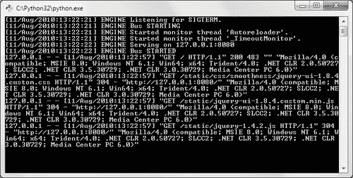
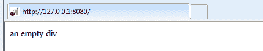
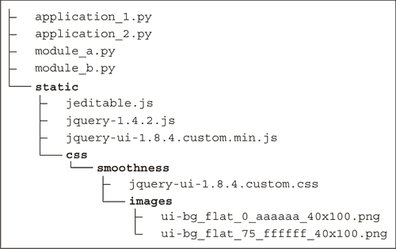
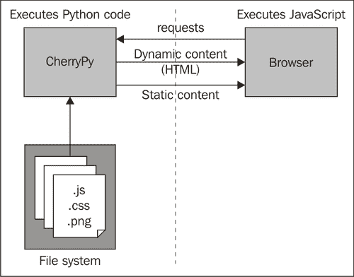
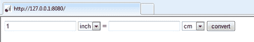
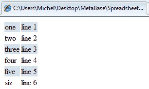
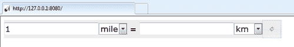
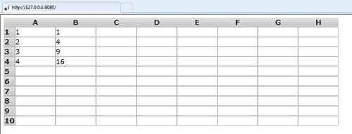

# 第二章：创建简单的电子表格

> 在本章中，我们将开发一个简单的电子表格应用程序。电子表格功能将完全使用 JavaScript 和 jQuery UI 实现，但我们将配置 CherryPy 动态地交付包含电子表格应用程序的页面。
> 
> 在演示方面，我们将遇到我们的第一个 jQuery UI 小部件（按钮），并了解如何设计其他元素以符合 jQuery UI 标准，使其无缝地融入 jQuery UI 的主题框架。我们还将了解如何查找和使用公开可用的 jQuery 插件，并将 jEditable 插件集成到我们的应用程序中。
> 
> 这一次要掌握的内容很多，但如果第一次没有完全清楚，请不要担心。我们将在其他章节中遇到这里首次遇到的问题的许多变体，并将再次在它们的上下文中解释所有相关细节。

在本章中，我们将：

+   创建一个用于开发和交付我们应用程序的环境

+   设计一个简单的电子表格应用程序

+   学习如何配置 CherryPy 来交付此应用程序

+   遇到我们的第一个 jQuery UI 小部件

+   设计我们自己的 jQuery 插件

有很多内容需要覆盖，所以让我们开始吧...

# Python 3

Python 3 是我们将用来开发应用程序服务器端部分的编程语言。在撰写本文时，当前稳定版本是 3.2。安装程序和源存档适用于各种平台（包括 Windows、Mac OS 和 Linux 发行版），可以从 [`www.python.org/download/`](http://www.python.org/download/) 下载。

# 安装 Python 3 的时间到了

下载和安装 Python 并不困难。许多平台的安装程序可以从 [`www.python.org/download/`](http://www.python.org/download/) 下载。

1.  下载适用于您平台的安装程序，并按照安装说明进行操作。

1.  通过在命令行（例如，在 Windows 命令提示符或 Linux xterm 内）输入以下命令来验证你是否正确安装了 Python：

```py
 >python -version

```

+   响应将是版本：

```py
 Python 3.2

```

## 刚才发生了什么？

在类 UNIX 系统（如 Ubuntu Linux 或 Mac OS）上，Python 可能已经安装好了，所以首先尝试步骤 2 中的说明来验证一下是个好主意。如果返回的版本低于 3，你应该更新你的 Python 发行版。请注意，在安装 2.x 版本的 Python 旁边安装 3.x 版本是完全可能的，这样就不会破坏依赖于 2.x 版本的程序（Python 3 与 2 版本不向后兼容）。

# CherryPy

在 Python 中编写 HTTP 服务器并不困难，但编写和维护一个健壮且功能齐全的可以作为应用程序服务器的网络服务器则相当不同。正如我们在第一章中解释的，*选择你的工具*，我们将使用 CherryPy 作为我们的应用程序服务器。在撰写本文时，CherryPy 为 Python 3 的最新稳定版本是 3.2.0，可以从[`download.cherrypy.org/cherrypy/3.2.0/`](http://download.cherrypy.org/cherrypy/3.2.0/)下载。

### 注意

Windows 用户应使用 zip 存档，并在继续下一节的说明之前将其解压。在指定位置还有一个`msi`安装程序可用，但这个安装程序可能无法在 Windows 注册表中找到正确的 Python 安装，并且只能在 32 位 Windows 版本上工作。因此，解压 zip 存档并遵循下一节的设置说明是一个更安全的做法，并且在 Windows 和类 Unix 平台上都是相同的。

# 安装 CherryPy 的行动时间

当你安装 CherryPy 时需要小心的一点是，如果你系统中有多个 Python 版本，你必须确保将其安装到正确的目录中。CherryPy 使用一个设置脚本来自动安装，确保 CherryPy 模块最终位于正确位置的一种方法是通过使用完整路径显式调用 Python，例如：

```py
 cd C:\CherryPy-3.2.0rc1
c:\Python32\python.exe setup.py install

```

## 刚才发生了什么？

运行 CherryPy 的`setup.py`脚本会在 Python 的`Lib\site-packages`目录中安装多个模块。你可以通过在命令行中输入以下内容来验证这是否成功：

```py
 python -c "import cherrypy"

```

这检查我们是否可以导入`cherrypy`模块。如果一切安装正确，此命令将不会产生任何输出。然而，如果 CherryPy 没有安装，可能会通过错误信息来表示：

```py
 Traceback (most recent call last):
	File "<string>", line 1, in <module>
ImportError: No module named cherrypy

```

当你安装了多个 Python 版本时，请注意输入 Python 可执行文件的完整路径以选择正确的版本，例如：

```py
 C:\python32\python c "import cherrypy"

```

# 安装 jQuery 和 jQuery UI

在本章和下一章中我们将设计和实现的应用程序高度依赖于 jQuery 和 jQuery UI 库。这些库主要由 JavaScript 文件和一些级联样式表以及用于美化小部件的图像组成。

这些文件作为应用程序的一部分提供给网页浏览器，通常，它们可能从以下两个位置提供：

1.  在服务器上运行 CherryPy 的（子）目录，以及构成我们应用程序的其他文件。

1.  或者从外部网络位置，如 Google 或 Microsoft 的内容分发网络。

如果您的应用程序流量很大，后者可能是一个更好的选择，因为这些公开可用的资源是为高可用性设计的，可以处理大量的请求。这可能会大大减少您服务器的负载，从而降低成本。更多关于此信息可以在 jQuery 的下载部分找到[`docs.jquery.com/Downloading_jQuery#CDN_Hosted_jQuery`](http://docs.jquery.com/Downloading_jQuery#CDN_Hosted_jQuery)。

在开发过程中，通常更好的做法是下载必要的文件，并从提供应用程序其余部分的服务器上提供服务。这样，当出现错误时，我们可以轻松地检查这些文件，甚至决定调整内容。如果我们选择以定制的方式为主题我们的应用程序（参见 jQuery UI 的 themroller 信息框），则层叠样式表将与标准样式表不同，因此我们无论如何都需要从我们的 Web 服务器上提供服务。

在本书提供的示例代码中，我们包括了 jQuery 和 jQuery UI 库，它们位于每个章节目录的`static`子目录中。还有一个`css`子目录，其中包含一组优化的自定义样式表，这些样式表旨在在打印和屏幕上提供易于阅读的视觉风格。本书中使用的 jQuery 库版本是从[`code.jquery.com/jquery-1.4.2.js`](http://code.jquery.com/jquery-1.4.2.js)下载的。有关下载（可能的主题化）版本的 jQuery UI 的信息可以在[`jqueryui.com/download`](http://jqueryui.com/download)找到。

### 小贴士

**使用 jQuery UI 的 themroller**

本书使用的主题被称为*smoothness*，可以通过选择**Gallery**标签并点击**Smoothness**示例下方的**Download**按钮从[`jqueryui.com/themeroller/`](http://jqueryui.com/themeroller/)下载。甚至可以根据标准主题之一创建一个完全定制的主题，通过在**Roll Your Own**标签中选择一个主题并进行调整。一旦你对外观满意，就可以下载结果。有关所有详细信息，请查看在线文档[`jqueryui.com/docs/Getting_Started`](http://jqueryui.com/docs/Getting_Started)。

# 服务应用程序

我们设定的第一个任务是向最终用户提供内容。最终，这应该是有用的内容，当然，但让我们首先确保我们可以编写一个微型的 Web 应用程序，至少能够提供一些内容。

# 开始服务一个虚拟应用程序

现在我们已经建立了必要的构建块，我们可以开始开发我们的应用程序。让我们从一个非常简单的应用程序开始：

1.  前往您解压示例代码的目录。

1.  前往`第二章`目录。

1.  双击文件`nocontent.py`，将打开一个文本窗口（或者您也可以从命令行输入`python nocontent.py`）：

1.  打开您喜欢的浏览器，并在地址栏中输入`http://localhost:8080`。您将看到一个相当无聊的页面：

### 小贴士

如果您的浏览器无法连接到`http://localhost:8080`，这可能是因为您的本地名称服务器没有配置为解析名称[localhost](http://localhost)。如果您没有纠正这一问题的手段，那么输入`http://127.0.0.1:8080`到浏览器地址栏中也是同样有效，尽管不那么方便。

也可能应用程序将要监听的自定义端口（8080）已经被占用，在这种情况下，Python 将引发异常：**IOError: '127.0.0.1'上的端口 8080 不可用**。如果是这种情况，我们可以配置 CherryPy 在另一个端口上监听（参见下一节的信息框）。

## 刚才发生了什么？

双击`nocontent.py`会导致 Python 解释器启动并执行脚本。这打开了一个控制窗口，其中 CherryPy 框架记录了它启动的事实以及它将在`127.0.0.1`（本地机器的所谓回环 IP 地址，即使没有连接到互联网，该地址也会出现在机器上）的`8080`端口上监听。

这个地址和端口是我们指向浏览器的，之后 HTTP 服务器为我们提供 HTML 文件，以及一些 JavaScript 文件来提供服务。浏览器检索到的每个文件都会在控制窗口中记录，并附带状态信息。这将会方便我们查找缺失的文件，例如。

我们可以通过关闭控制窗口或按*Ctrl* + *Break*（在 Windows 上）或*Ctrl* + *C*（在 Windows 和大多数其他平台上）来停止脚本提供服务。

# 动态服务 HTML 内容的时间

我们已经看到了如何运行应用程序以及如何使用网络浏览器访问它，现在让我们看看完成这个任务所需的 Python 代码。我们需要提供静态文件，但除了这些静态文件之外，我们还想动态生成主要 HTML 内容。这并不是严格必要的，因为我们同样可以很容易地将其作为静态文件提供服务，但它作为一个简单的例子，说明了如何生成动态内容：

**Chapter2/nocontent.py**

```py
import cherrypy
import os.path current_dir = os.path.dirname(os.path.abspath(__file__))

```

您可以从[`www.PacktPub.com`](http://www.PacktPub.com)的账户下载您购买的所有 Packt 书籍的示例代码文件。如果您在其他地方购买了这本书，您可以访问[`www.PacktPub.com/support`](http://www.PacktPub.com/support)并注册，以便将文件直接通过电子邮件发送给您。

`nocontent.py` 以导入 `cherrypy` 和 `os.path` 模块开始。后者是必要的，以便确定 `nocontent.py` 所在的目录（高亮显示），这样我们就可以相对于 `nocontent.py` 引用其他静态文件和目录。这样，一旦我们想要将此应用程序移动到生产服务器上的最终目的地，我们就会使生活变得更加容易。

**Chapter2/nocontent.py**

```py
class Root(object): ... <omitted> ...
if __name__ == "__main__": cherrypy.quickstart(Root(),config={
		'/static':
		{ 'tools.staticdir.on':True,
			'tools.staticdir.dir':os.path.join(current_dir,"static")
		}
	})

```

## 刚才发生了什么？

下一步是使用 `quickstart()` 函数启动 CherryPy 服务器（高亮显示）。我们传递两个参数：第一个参数是一个类的对象实例，该类向 CherryPy 提供了一些可能提供动态内容的方法。我们将在下一分钟查看这一点。

第二个（命名）参数是一个包含多个配置项的字典。在这种情况下，我们只配置了一个静态目录，但在其他情况下，这里可能还会出现其他配置项。URL 组件 `/static` 是通过连接之前确定的 `current_dir` 来指向文件系统上的位置的。我们再次使用 Python 的 `os.path` 模块中的函数 `os.path.join()`，以平台无关的方式创建文件路径。

`static` 目录包含我们将为这个应用程序需要的所有 jQuery 和 jQuery UI 文件，以及所有 CSS 文件和图像来美化应用程序。在这个例子中，由于没有实际内容，除了属于 jQuery 和 jQuery UI 库的文件外，没有其他文件，但如果我们需要它们，我们也可以将它们放在这里。

### 注意

如果我们想让 CherryPy 监听不同的端口，我们应在全局配置中指明这一点。这可以通过在调用 `cherrypy.quickstart()` 之前添加 `cherrypy.config.update({'server.socket_port':8088})` 来实现。CherryPy 提供了丰富的配置选项，甚至可以指示它从文件中读取配置。所有可能性的良好起点是 [`www.cherrypy.org/wiki/ConfigAPI`](http://www.cherrypy.org/wiki/ConfigAPI)。

我们仍然需要实现一个 `Root` 类，为 CherryPy 提供一个可能作为文档层次结构根的对象实例，CherryPy 可能会为其提供服务。实际上，在我们可以创建一个实例并将其传递给 `quickstart()` 方法之前，我们应该定义这个类，但我想要首先集中精力了解如何启动服务器，然后再集中精力生成内容：

**Chapter2/nocontent.py**

```py
class Root(object):
	content = '''... <omitted> ...''' @cherrypy.expose
	def index(self):
			return Root.content

```

这个 `Root` 类包含一个单独的类变量 `content`，它保存我们将要服务的 HTML 代码。我们将在下一节中详细检查它。这个 HTML 是由 `index()` 方法生成的，并传递给 HTTP 服务器，然后服务器将其传递给请求的浏览器。

它通过`@cherrypy.expose`装饰器（突出显示）暴露给 CherryPy。只有暴露的方法才会被 CherryPy 调用以生成内容。在默认配置中，CherryPy 会将形式为`/name`的 URL 映射到名为`name()`的方法。仅包含一个正斜杠*/*的 URL 将映射到名为`index()`的方法，就像我们在这里定义的那样。这意味着我们现在已经配置了 CherryPy，当用户将浏览器指向`http://127.0.0.1:8080/`（他甚至可以省略最后的斜杠，因为 CherryPy 默认会忽略尾随斜杠）时，它会提供动态内容。

注意，我们让`index()`返回单个字符串变量的内容，但我们本可以返回任何东西，这使得这是一种真正动态的内容生成方式。

## 谁提供什么：概述

从动态和静态内容的混合中提供服务可能会很快变得令人困惑。在早期形成一个清晰的组件、数据流和目录结构之间的关系图可能有所帮助。这建立在第一章中概述的总体图景之上，并在每一章中进一步扩展。

本书中的几乎所有应用都是从相同的目录结构中提供的：



顶级目录包含一个或多个可以执行并启动 CherryPy 服务器的 Python 文件。这些 Python 文件实现了应用的客户端。它们可以从同一顶级目录导入额外的模块。

顶级目录还包含一个名为`static`的子目录。它包含几个 JavaScript 文件，包括 jQuery 和 jQuery UI 库以及任何额外的插件。它还包含一个名为`css`的目录，其中包含一个或多个额外的 CSS 样式表和 jQuery UI 主题的图像。

注意，尽管我们的应用是由 Web 服务器提供的，但看不到任何 HTML 文件，因为所有 HTML 内容都是动态生成的。

从应用的角度来看，理解一个 Web 应用的最佳方式是将它视为分布式应用。其中一些代码（在我们的例子中是 Python）在服务器上运行，而其他代码（JavaScript）在浏览器中运行。它们共同构成了以下图像中可视化的完整应用：



## CherryPy 内容服务快速问答

我们选择从`index()`方法提供服务，以便用户可以通过仅以斜杠(/)结尾的 URL 来获取内容。但如果我们希望内容可以通过类似[`127.0.0.1/content?`](http://127.0.0.1/content?)这样的 URL 访问，我们需要做哪些改变？

## HTML：分离表单和内容

几乎总是，将表单和内容分开是一个好主意。这使我们能够专注于我们想要呈现的信息的逻辑结构，并使得以后更改数据的显示方式变得更容易。这甚至允许以可维护的方式应用主题。

我们数据的结构是在我们提供给浏览器的 HTML 中确定的。更准确地说，结构数据可以在`<body>`元素中找到，但 HTML 的`<head>`元素也包含重要信息。例如，引用将要用于样式化数据和增强用户交互的样式表和 JavaScript 库。

在下面的代码中，我们使用一个`<link>`元素来引用从 jQuery UI 网站下载的主题中的 CSS 样式表（高亮显示）。在这个例子中，我们实际上并没有使用这个样式表，jQuery 和 jQuery UI 库也没有包含在`<script>`元素中，但这个例子展示了如何从我们生成的 HTML 中引用这些库，在接下来的例子中，我们还将看到这也是我们引用我们将自己创建的任何额外 JavaScript 库的位置。实际内容包含在突出显示的`<div>`元素中。

```py
<!DOCTYPE HTML PUBLIC "-//W3C//DTD HTML 4.01//EN" "http://www.w3.org/TR/html4/strict.dtd">
<html>
<head> <link rel="stylesheet"
href="static/css/redmond/jquery-ui-1.8.1.custom.css"
type="text/css" media="screen, projection" />
<script type="text/javascript"
	src="img/jquery-1.4.2.js" ></script>
<script type="text/javascript"
	src="img/jquery-ui-1.8.1.custom.min.js" ></script>
</head>
<body id="spreadsheet_example"> <div id="example">an empty div</div>
</body>
</html>

```

# 是时候进行一个单位转换器操作了

只提供一段文本并不十分有用，因此我们的下一步是添加一些 HTML 内容，并通过 JavaScript 增强显示和功能：

1.  前往`nocontent.py`可能存在的同一目录。

1.  双击文件`unitconvertor.py`，CherryPy 控制台将再次在文本窗口中打开。

1.  在浏览器地址栏中输入`http://localhost:8080`（或者如果它仍然打开在那个地址，点击刷新）。你现在将看到一个小的单位转换器：

你可以在左侧的文本输入框中输入任何数字（可选分数），选择要转换的单位和目标单位后，按下**转换**按钮将在右侧显示转换后的数字。

## 刚才发生了什么？

我们 Web 应用的基本结构并没有改变。我们提供的内容不同，但这几乎不会改变我们需要提供的 Python 代码。实际内容，即当调用`index()`函数时我们提供 HTML，它必须定义我们的单位转换器所包含的`<form>`元素，并且我们还想执行一些 JavaScript。

## HTML：基于表单的交互

HTML 的`<head>`部分不需要更改，因为它已经引用了我们想要使用的样式表和 JavaScript 库。然而，我们必须更改`<body>`元素以包含构成我们的单位转换器的结构元素。

单位转换器以 `<form>` 元素（高亮显示）的形式构建。它包含两个下拉列表，用于选择要转换的单位，这两个列表都使用 `<select>` 元素实现，还有一个文本 `<input>` 元素，用户可以在其中输入数字。第二个文本 `<input>` 元素用于显示转换结果。这个元素被设置为只读，因为它不打算接收用户的输入。最后一个元素是一个用户可以点击以启动转换的 `<button>`。

你可能已经注意到 `<form>` 元素缺少 `action` 属性。这是故意的，因为没有与服务器进行交互。当用户点击按钮时发生的转换完全在 JavaScript 中实现。这段 JavaScript 包含（并执行）在最终的脚本元素（高亮显示）中。我们将在下一节中检查这个脚本。

```py
<!DOCTYPE HTML PUBLIC "-//W3C//DTD HTML 4.01//EN" "http://www.w3.org/
TR/html4/strict.dtd">
<html>
<head>
<link rel="stylesheet" href="static/css/redmond/jquery-ui-
1.8.1.custom.css" type="text/css" media="screen, projection" />
<script type="text/javascript" src="img/jquery-1.4.2.js" ></script>
<script type="text/javascript" src="static/jquery-ui-1.8.1.custom.min.
js" ></script>
</head>
<body id="spreadsheet_example">
<div id="example">
	<form id="unitconversion">
	<input name="from" type="text" value="1" />
	<select name="fromunit">
		<option selected="true">inch</option>
		<option>cm</option>
	</select>
	<label for="to">=</label>
	<input name="to" type="text" readonly="true" />
	<select name="tounit">
		<option>inch</option>
		<option selected="true">cm</option>
	</select>
	<button name="convert" type="button">convert</button>
	</form>
</div> <script type="text/javascript" src="img/unitconverter.js" ></script>
HTMLHTMLform based interaction</body>
</html>

```

## JavaScript：使用 jQuery UI 小部件

屏幕元素或 **小部件** 对于让最终用户与你的应用程序交互至关重要。这些小部件可能是简单的按钮，当用户点击它们时启动某些操作，或者更复杂的小部件，如下拉框、单选按钮，甚至是允许你选择日期的小日历。jQuery UI 库提供大量预定义且易于配置的小部件，因此我们的下一步是使用 jQuery UI 让我们的转换应用程序中的按钮对鼠标点击做出反应，并启动单位转换。

# 使用 unitconverter.js 进行动作转换

`unitconverter.js` 包含执行实际转换所需的 JavaScript 代码。它从定义一个转换映射开始，这是一个包含我们想要定义的任何转换的转换因子的字典。我们限制自己从英寸到厘米以及相反方向的转换，但可以轻松添加额外的转换因子。

```py
conversion_map = {
	"inch cm":1.0/2.54,
	"cm inch":2.54
}; $("button").button().click(function(){
		value=$("input[name='from']").val();
		f=$("select[name='tounit'] option:selected").val();
		t=$("select[name='fromunit'] option:selected").val();
		if(f != t){
			c=conversion_map[f+' '+t];
			result=parseFloat(value)*c;
		}else{
			result = value;
		}
		$("input[name='to']").val(result);
	}
);
$("form *").addClass("ui-widget");

```

在上一段代码中高亮显示的行是我们第一次接触 jQuery 和 jQuery UI 库，值得密切关注。`$("button")` 这部分选择页面上的所有 `<button>` 元素。在这种情况下，它将只有一个。这个 `<button>` 元素通过 `button()` 方法从 jQuery UI 库转换为一个按钮小部件。这是一个简单的部件，将元素样式化为一个易于主题化和定制的可识别按钮。

## 刚才发生了什么？

当用户点击按钮时实际发生的事情是由我们通过 `click()` 方法传递给按钮元素的匿名函数定义的 **点击处理器**。这个匿名函数在用户每次点击按钮时都会被调用。

这个处理器首先通过 `$("input[name='from']").val()` 获取具有 `name` 属性等于 **from** 的文本 `<input>` 元素的 内容。接下来，它从两个 `<select>` 元素中检索当前选定的单位。

如果这些单位不相同，它将从转换映射中获取具有连接单位作为键的转换系数。转换结果通过乘以转换系数和`<input>`元素的内容来计算。我们从任何`<input>`元素检索的内容始终以字符串形式返回，因此我们必须使用内置的 JavaScript 函数`parseFloat()`将其解释为浮点数。如果两个单位相同，结果简单地与输入值相同。

计算结果存储在具有`name`属性为`to`的文本`<input>`元素中。请注意，尽管这个元素有一个只读属性来防止用户输入任何文本，我们仍然可以在脚本中更改其内容。

## 添加图标到按钮的即兴测验

一个只有简单文本的按钮可能适用于许多应用，但如果它还显示了适当的图标，看起来会更好。既然知道按钮小部件高度可配置，你将如何给你的按钮添加一个图标？

## 尝试添加一个动态标题的英雄

+   在`nocontent.py`示例中我们提供的 HTML 只是类变量的内容，所以并不真正是动态的！如果我们想提供包含显示当前日期的`<title>`元素的 HTML，我们需要做些什么？

+   提示：`<title>`元素应该包含在`<head>`元素中。因此，而不是一次性返回所有 HTML，你可以重写 Python 代码以返回由三部分组成的 HTML：第一部分和最后一部分是静态 HTML 片段，中间部分是动态生成的字符串，代表一个包含日期的`<title>`元素。这个日期可以通过 Python 标准`time`模块中的`asctime()`函数获取。

+   一种可能的实现可以在文件`nocontenttitle.py`中找到。

## jQuery 选择器

jQuery 选择器在许多地方出现，从某种意义上说，它们是任何使用 jQuery 库的 JavaScript 程序的重点。本书的范围不包括完整的概述（关于这一点，请参阅附录中的一些 jQuery 书籍，其中包含大量示例，或检查 jQuery 的[`docs.jquery.com/Main_Page`](http://docs.jquery.com/Main_Page)文档部分，特别是关于选择器的部分），但基本上 jQuery 允许我们以 CSS 3 兼容的方式选择任何元素或元素集。换句话说，即使在尚未支持 CSS 3 的浏览器中，它也能正常工作。

为了让大家有个大致的概念，下面给出了一些示例，所有这些示例都假设有一个包含以下标记的 HTML 文档：

```py
<div id="main">
<ul>
<li>one</li>
<li class="highlight">two</li>
<li>three</li>
</ul>
</div>
<div id="footer">footer text</div>

```

+   选择所有`<li>`元素：`$("li")`

+   选择第一个`<li>`元素：`$("li:first")`

+   选择具有`highlight`类的`<li>`元素：`$(".highlight")`

+   选择 id 等于`footer`的`<div>`：`$("#footer")`

jQuery 函数（通常用别名 `$` 表示）返回一个 jQuery 对象，该对象指向匹配的元素集合。jQuery 对象有许多方法可以操作这个集合中的元素。例如，`$("li").addClass("red-background")` 将红色背景类添加到所有 `<li>` 元素。

jQuery UI 库通过添加将元素转换为标准小部件的功能，进一步扩展了可用方法。这就是为什么在我们的例子中，`$("button").button()` 会改变按钮元素的样式，使其变为 jQuery UI 提供的样式化按钮小部件。

我们的示例应用程序还展示了另一个重要的 jQuery 概念：**链式操作**。大多数 jQuery 和 jQuery UI 方法返回它们操作的选中项。这样，就很容易在同一个选中项上调用多个方法。在我们的例子中，`$("button").button()` 在将选中的按钮元素转换为按钮小部件后返回这些按钮元素，这允许我们通过编写 `$("button").button().click(…)` 来链式调用点击方法，以定义鼠标点击行为。

## CSS：将 jQuery UI 主题应用到其他元素

`unitconverter.js` 中的最后一行显示了如何以与标准 jQuery UI 小部件相同的方式设置任何元素的样式。在这种情况下，这是通过使用 `$("form *")` 选择 `<form>` 元素中包含的所有元素，然后使用 `addClass()` 方法添加 `ui-widget` 类来实现的。

任何带有 `ui-widget` 类的元素都将获得与任何 jQuery UI 小部件相同的样式。在我们的例子中，这体现在 `input` 和 `select` 元素使用的字体和颜色上。即使我们更改主题，这种更改也将被统一应用。还有更多预定义的类可供使用，以实现更精细的控制，我们将在下一节创建自己的 jQuery UI 插件时遇到这些类。

理解预定义的 jQuery UI 类对元素的影响是很重要的。类本身并不会改变元素的显示方式，但 jQuery UI 框架将各种 CSS 样式元素与预定义的类关联起来。当与元素关联的类发生变化时，浏览器会再次检查应用哪些样式元素，从而实现即时样式更改。

也可以直接更改与元素关联的 CSS 样式。然而，为特定类定义样式并更改类，使得在不需为每个要更改的元素单独使用样式组件的情况下，更容易保持一致的视觉效果。

## 尝试为表格添加斑马条纹的英雄

在设置 HTML 表格样式时，一个经常需要的功能是使用交替的背景颜色渲染表格的行。

由于 jQuery 允许我们使用 CSS 3 兼容的选择器，并通过 `.addClass()` 方法向元素的 `class` 属性添加内容，因此即使在不支持 CSS 3 的浏览器中，现在也可以轻松完成这项任务。

给定以下示例 HTML，应向最后一个`<script>`元素添加什么 JavaScript 代码以将所有偶数行的背景渲染为浅灰色？（提示：CSS 3 有一个`:even`选择器，当您使用 jQuery 向一个元素添加类时，任何适用于该类的 CSS 样式都将重新评估）。

检查`zebra.html`以查看解决方案（它包含在第二章的示例代码中。在您的浏览器中打开该文件以查看效果）：

```py
<!DOCTYPE HTML PUBLIC "-//W3C//DTD HTML 4.01//EN" "http://www.w3.org/TR/html4/strict.dtd">
<html>
<head>
	<script type="text/javascript" src="img/jquery-1.4.2.js" >
	</script>
	<style>
		.light-grey { background-color: #e0e0e0; }
	</style>
</head>
<body>
	<table>
		<tr><td>one</td><td>line 1</td></tr>
		<tr><td>two</td><td>line 2</td></tr>
		<tr><td>three</td><td>line 3</td></tr>
		<tr><td>four</td><td>line 4</td></tr>
		<tr><td>five</td><td>line 5</td></tr>
		<tr><td>siz</td><td>line 6</td></tr>
	</table>
	<script type="text/javascript">
	/* insert some JavaScript here to color even rows grey */
	</script>
</body>
</html>

```

浏览器中的结果将类似于以下内容（请注意，元素从零开始编号，因此结果可能不是您预期的）：



# 将单位转换器转换为插件的操作时间

重新使用许多精心设计的 jQuery UI 小部件之一是有益的，因为它可以节省我们的开发和维护时间，但 jQuery UI 框架的真正力量在于它使我们能够设计出与框架的其他部分无缝融合且在使用上与标准小部件不可区分的新小部件。为了说明可能实现的内容，让我们再次实现我们的单位转换器，但这次作为 jQuery 插件：

1.  前往包含第二章示例代码的目录。

1.  双击文件`unitconverter2.py`，CherryPy 控制台将再次在窗口中打开。

1.  在浏览器地址栏中输入`http://localhost:8080`（如果该地址仍然打开，请点击刷新）。您现在将看到一个稍微重新设计的单位转换器：

与这个新的单位转换器的交互与之前的完全相同。

## 刚才发生了什么？

我们现在不再使用包含多个额外元素的`<form>`元素来构建小部件，而是采用更简单的方法。我们将设计一个可重用的单位转换器小部件，可以插入到任何`<div>`元素中。现在，我们的 HTML 骨架变得更加简单，因为其主体将只包含一个`<div>`元素：

```py
<!DOCTYPE HTML PUBLIC "-//W3C//DTD HTML 4.01//EN" "http://www.w3.org/
TR/html4/strict.dtd">
<html>
<head>
<link rel="stylesheet" href="static/css/redmond/jquery-ui-
1.8.1.custom.css" type="text/css" media="screen, projection" />
<script type="text/javascript" src="img/jquery-1.4.2.js" ></script>
<script type="text/javascript" src="static/jquery-ui-1.8.1.custom.min.
js" ></script> <script type="text/javascript" src="img/unitconverter2.js" ></script>
</head>
<body id="spreadsheet_example">
<div id="example"></div>
<script type="text/javascript"> $("#example").unitconverter(
{
'km_mile':1.0/0.621371192,
'mile_km':0.621371192
});
</script>
</body>
</html>

```

第一条突出显示的行包含包含新实现单位转换器的 JavaScript 文件。我们在`<body>`元素末尾附近的 JavaScript 代码中引用了此文件中定义的插件（最后突出显示的行）。此脚本通过其 id（在这种情况下为`#example`）引用我们想要添加单位转换器的`<div>`元素，并应用`unitconvertor()`方法。

当我们查看实现我们的转换插件的 JavaScript 代码时，`unitconverter()`接受一个选项对象作为其唯一参数。此选项对象可以包含任何数量的键，用于定义此插件实例的附加转换系数。在这种情况下，我们传递附加信息以允许从英里转换为公里，反之亦然。

## 单项测验：向 unitconverter 实例添加转换

当我们想要添加一个可以将立方英尺转换为升的单位转换插件时，JavaScript 会是什么样子呢？

## JavaScript：创建一个 jQuery UI 插件

所有 jQuery UI 插件都是通过向 `jQuery` 对象的 `fn` 属性（我们通常通过其别名 `$` 来引用的对象）添加一个新函数来定义的。在 `unitconverter2.js` 中，这正是我们所做的，如下代码的第一行所示。

接下来，我们将传递给插件的任何选项与默认值合并（高亮显示）。jQuery 提供了一个 `extend()` 方法，该方法合并任意数量的对象的属性，并返回第一个对象。由于我们不希望覆盖我们在 `$.fn.unitconverter.conversion_map` 中定义的默认选项，我们传递一个空对象。该对象将接收默认属性和 `options` 对象中定义的任何属性，覆盖名称相同的属性。这些合并后的属性集存储在 `cmap` 变量中：

```py
jQuery.fn.unitconverter = function(options){ var cmap = $.extend({},$.fn.unitconverter.conversion_map,options);

```

转换系数通过 `unit1_unit2` 形式的键来引用。为了从键构建两个下拉选择器，我们遍历所有这些键，并使用 JavaScript 的 `split()` 方法检索单个单位（高亮显示）。然后，这些单位被存储在 `from` 和 `to` 数组中：

```py
var from = new Array();
var to = new Array(); for (var key in cmap){
	var units = key.split("_");
	from.push(units[0]);
	to.push(units[1]);
}

```

下一步是构建插件需要向用户展示的 HTML。结构与上一个例子中手工制作的类似，一个包含 `<input>`、`<select>` 元素和 `<button>` 的 `<form>`。`<form>` 元素被添加了一个随机的 id 属性。这样我们就可以在页面上有多个单位转换器的情况下，稍后引用它。

`<select>` 元素包含多个 `<option>` 元素，这些元素是通过逐个检索存储在 `from` 和 `to` 数组中的单位名称，并使用 `pop()` 方法创建的。默认情况下，第一个选项被选中（高亮显示）。然后，HTML 代码被传递到 `this.append()` 方法中。`this` 是一个变量，它对实现插件的函数是可用的，它包含应用插件的元素，在我们的例子中是具有 `#example` id 的 `<div>` 元素：

```py
	var id = "unitconverter" + new String(Math.floor(Math.random() 
* 255 * 255));
	var html = '<form id="' + id + '"><input name="from" type="text" 
value="1" />';
	html += '<select name="fromunit">'; html += '<option selected="true">'+from.pop()+'</option>';
	var len = from.length;
	for (var i=0; i<len; i++){
html += '<option>' + from.pop() + '</option>' };
	html += '</select> = ';
	html += '<input name="to" type="text" readonly="true" />';
	html += '<select name="tounit">';
	html += '<option selected="true">' + to.pop() + '</option>';
	var len = to.length;
	for (var i=0; i<len; i++){
html += '<option>' + to.pop() + '</option>'};
	html += '</select>';
	html += '<button name="convert" type="button">convert</button>'
html += '</form>';
	this.append(html);

```

随机生成的表单元素 id 现在非常有用，可以用来选择我们当前正在构建的表单中的 `<button>` 元素，并将其转换为按钮：我们通过连接相关部分来构建一个合适的选择器，即 `"#"+id+" button"`。

注意，在自定义插件中包含其他插件或小部件是完全有效的。这次我们选择通过传递一个适当的选项对象来构建一个外观略有不同的按钮，该按钮只有一个图标而没有文本。从 jQuery UI 随带的大量图标中，我们选择最能代表按钮功能的图标：`ui-icon-refresh`（高亮显示）。

当用户点击按钮时发生的转换是通过一个我们将很快遇到的功能实现的，该功能通过按钮对象（作为`click()`方法中的`this`变量可用）和合并的转换系数映射传递：

```py
$("#"+id+" button").button({
			icons: { primary: 'ui-icon-refresh'
			},
			text: false
	}).click(function(){return convert(this,cmap);});

```

最后一步是将我们的小部件以一致的方式样式化。jQuery 为我们提供了一个`css()`方法，允许我们直接操作任何元素的样式属性。我们首先处理一个布局问题：我们将`float:left`样式应用到`<form>`元素上，以确保它不会完全填满页面，而是收缩/围绕它包含的元素包裹：

```py
$("#"+id).css('float','left');

```

然后，我们将来自`<button>`元素的一些背景样式属性复制到`<form>`元素中，以使`<form>`元素的外观与应用于标准按钮小部件的主题保持一致。主题中的其他样式元素，如字体和字体大小，通过添加`ui-widget`类（突出显示）应用到表单元素上。最后，我们通过返回`this`变量（在我们的例子中包含我们选择的`<div>`元素，但现在添加了刚刚添加到其中的`<form>`元素）来完成。这允许我们链式调用额外的 jQuery 方法：

```py
	$("#"+id).css('background-color',
$("#"+id+" button").css('background-color'));
	$("#"+id).css('background-image',
$("#"+id+" button").css('background-image'));
	$("#"+id).css('background-repeat',
$("#"+id+" button").css('background-repeat')); $("#"+id).addClass("ui-widget");
	return this;
};

```

当然，我们仍然需要定义一个函数，当单位转换器的按钮被点击时执行实际的转换。它与之前的实现略有不同。

`convert()`函数接收被点击的`<button>`元素和一个包含转换系数的映射。包含按钮的`<form>`元素通过`parent()`方法确定并存储在`form`变量中。

我们想要转换的输入值是从具有`name`属性等于`from`的`<input>`元素中检索的。我们可以通过选择存储在`form`中的`<form>`元素的所有子元素并传递一个合适的选择器到`.children()`方法（突出显示）来找到这个特定的元素。

以类似的方式，我们确定两个`<select>`元素中选择了哪个选项：

```py
function convert(button,cmap){
	var form = $(button).parent(); var value = form.children("input[name='from']").val();
	var f = form.children("select[name='tounit']").
children("option:selected").val();
	var t = form.children("select[name='fromunit']").
children("option:selected").val();

```

剩下的就是实际的转换。如果转换单位不相等，我们从映射中检索转换系数（突出显示），然后将其乘以`<input>`元素的内容，该内容被解释为浮点数。如果输入不能被解释为浮点数或映射中没有合适的转换系数，乘法的结果是一个`NaN`（不是一个数字），我们通过在结果中放置错误文本来表示这一点。然而，如果一切顺利，我们使用 JavaScript 的`toFixed()`方法将结果转换为具有四位小数的数字：

```py
var result = value;
	if(f != t){ var c=cmap[f+'_'+t];
		result=parseFloat(value)*c;
		if (isNaN(result)){
				result = "unknown conversion factor";
		}else{
				result = result.toFixed(4);
		}
	}
	form.children("input[name='to']").val(result);
};

```

`unitconverter2.py`通过定义一个具有默认值的对象来结束。

```py
jQuery.fn.unitconverter.conversion_map = {
	inch_cm":1.0/2.54,
	"cm_inch":2.54
}

```

## 突击测验更改选项默认值

如果我们：

1.  将单位转换器添加到具有 ID #first 的`<div>`元素中。

1.  将从立方英尺到升的转换添加到默认转换映射中。

1.  最后，将一个单位转换器添加到具有 ID #last 的`<div>`元素中。

代码看起来可能像这样：

```py
$("#first").unitconverter();
$.extend($.fn.unitconverter.conversion_map, {'cubic feet_
litres':1.0/28.3168466});
$("#last").unitconverter();

```

如果我们执行前面的代码，哪些 `<div>` 元素将获得带有附加转换功能的 unitconverter？ 

1.  带有 #first ID 的 div

1.  带有 #last ID 的 div

1.  两者

# 设计电子表格应用程序

我们本章的目标是能够向用户提供一个简单的电子表格应用程序，我们几乎做到了。我们知道如何提供 HTML，我们也看到了如何实现自定义 jQuery UI 小部件，所以让我们将这些知识应用到设计电子表格插件中。首先，让我们看看它将是什么样子：

# 是时候提供电子表格应用程序了

前往包含示例代码的目录，第二章

1.  双击文件 `spreadsheet.py`，现在熟悉的 CherryPy 控制台将在一个文本窗口中打开。

1.  在浏览器地址栏中输入 `http://localhost:8080`（或者如果该地址仍然打开，请点击刷新）。现在您将看到一个简单的电子表格应用程序：

1.  您可以点击任何单元格来编辑其公式。您不应该以等号开始公式：**42, D2+19** 和 **"text**"（包括双引号）是有效的公式的例子。实际上，任何 JavaScript 表达式都是有效的。

## 刚才发生了什么？

提供给最终用户的电子表格应用程序由两个主要部分组成，HTML 用于构建电子表格结构，以及一些 JavaScript 用于提供交互。我们将依次查看这些部分。

## HTML：保持简单

我们需要的电子表格 HTML 几乎与单位转换器的 HTML 相同。以下代码中高亮显示的行显示了差异。`spreadsheet.js` 包含插件的定义，最后的 `<script>` 元素将一个 8x10 的电子表格插入到 `#example` div 中。将 `<div>` 元素转换为完全功能的电子表格小部件与转换为标准按钮小部件一样简单！

```py
<!DOCTYPE HTML PUBLIC "-//W3C//DTD HTML 4.01//EN" "http://www.w3.org/
TR/html4/strict.dtd">
<html>
<head>
<link rel="stylesheet"
href="static/css/redmond/jquery-ui-1.8.1.custom.css" type="text/css" media="screen, projection" />
<script type="text/javascript"
src="img/jquery-1.4.2.js" ></script>
<script type="text/javascript"
src="img/jquery-ui-1.8.1.custom.min.js" ></script>
<script type="text/javascript"
src="img/jeditable.js" ></script> <script type="text/javascript"
src="img/spreadsheet.js" ></script>
</head>
<body id="spreadsheet_example">
<div id="example"></div>
<script type="text/javascript"> $("#example").sheet({cols:8,rows:10});
</script>
</body>
</html>

```

## JavaScript：创建电子表格插件

文件 `spreadsheet.js` 包含了实现可重用电子表格小部件所需的全部 JavaScript 代码。从 jQuery 的角度来看，这个电子表格与我们之前的单位转换器非常相似，尽管实现用户交互的实际 JavaScript 代码要复杂一些。同样，我们的插件是一个与 jQuery 的 `fn` 属性关联的函数，正如在以下代码的第一行中可以看到的，我们使用名称 `sheet` 定义了我们的小部件。

接下来，我们将电子表格插件（在文件末尾定义）的默认选项与传递给函数的选项合并：

```py
jQuery.fn.sheet = function(options){
	var opts = $.extend({}, $.fn.sheet.defaults, options);

```

下一步是创建一个将代表我们的电子表格的表格。我们通过添加所需的 HTML 到变量`t`中，逐步创建这个`<table>`元素，并赋予它一系列相关的类：一个独特的`sheet`类，以便一旦创建就可以轻松识别为电子表格插件，一个`ui-helper-reset`类，这将导致 jQuery 应用适当的 CSS 以重置浏览器添加的任何不想要的默认样式，最后是一个`ui-widget`类，这将导致应用选定的主题。然后我们逐步创建表格内容，通过逐步添加所需的 HTML 到变量`t`中：

```py
/* create a cols x rows grid */
var t='<table class="sheet ui-helper-reset ui-widget"
cellspacing="0">';

```

表格包含一个将被设置为`ui-widget-header`样式的`<thead>`元素。它包含一个`<th>`元素的单一行。这些`<th>`元素包含列标签，一个由`fromCharCode()`方法构造的大写字母，该字母来自列索引（突出显示）：

```py
	t=t+'<thead class="ui-widget-header">
<tr class="ui-helper-reset"><th></th>';
	for(i=0;i<opts.cols;i=i+1){ t=t+'<th class="ui-helper-reset">' +
String.fromCharCode(65+i)+"</th>";
	}

```

表格的主体由一个包含多个行和`<td>`元素的`<tbody>`元素组成。每一行的第一个`<td>`元素包含行标签（一个数字）并将被设置为`ui-widget-header`样式，就像列标签一样。常规单元格，即包含我们的公式和值的单元格，将属于`ui-widget-content`类以适当地样式化。这些单元格还将属于一个`cell`类，以便在我们向它们添加附加功能时容易区分（突出显示）。

在这样的单元格中最初没有任何内容，除了一个将包含公式并设置为`ui-helper-hidden`样式的`<span>`元素，这使得公式不可见。评估后的公式的值将同时以文本内容的形式存储在`<td>`元素中（与`<span>`元素并排），以及作为一个与单元格名称相同的全局变量。在这个上下文中，全局变量是浏览器定义的顶层`window`对象的一个命名属性，可以通过`window[name]`访问。

将单元格的值存储在全局变量中同样允许我们使用任何 JavaScript 表达式作为单元格中的公式，因为我们现在可以通过名称引用任何其他单元格的值。例如，`A1+B3*9`将是一个完全有效的表达式，因为`A1`和`B3`将被定义为全局变量：

```py
t=t+'</tr></thead><tbody class="ui-widget-content" >';
for(i=0;i<opts.rows;i=i+1){
		t=t+'<tr class="ui-helper-reset">
		<td class="rowindex ui-helper-reset ui-widget-header">'
				+ (i+1)+"</td>";
		for(j=0;j<opts.cols;j=j+1){
			id=String.fromCharCode(65+j)+(i+1) t=t+'<td class="cell ui-helper-reset ui-widget-content" 
			id="'+id+'">
				<span class="formula ui-helper-hidden">
				</span></td>';
				/* create a global variable */
				window[id]=0
		}
		t=t+"</tr>";
}
t=t+"</tbody></table>";
this.append(t);

```

我们创建的表格的 HTML 被插入到我们使用`sheet()`方法并使用`this`对象的`.append()`方法应用的 jQuery 选择器中。`this`对象对任何定义插件的函数都是可用的，并持有当前的 jQuery 选择器。

要编辑一个单元格，我们将使用 jEditable 插件。这个插件将处理用户点击单元格以编辑其内容时的用户交互。为此，它需要获取和设置单元格内容的功能。

### 注意

我们在这里使用的 jEditable 插件包含在本章提供的示例代码中。最新版本可以从 Mika Tuupola 的网站获取：[`www.appelsiini.net/projects/jeditable`](http://www.appelsiini.net/projects/jeditable)。它附带了一套相当全面的文档。将 `<td>` 元素转换为当用户用鼠标点击时变为可编辑文本框的功能，就像选择元素并调用 `editable()` 方法一样简单。例如，`$(".editable").editable("[`www.example.com/save`](http://www.example.com/save)")` 会在点击后使任何具有 `editable` 类的元素变为可编辑文本框，并将编辑后的内容发送到作为 `editable()` 方法第一个参数传递的 URL。jEditable 插件附带了许多选项，当我们使用 jEditable 插件编辑电子表格单元格时，我们将遇到其中的一些。

我们需要定义一个函数，该函数将由 jEditable 调用以提取元素的内容。此函数将需要两个参数：

1.  我们正在编辑的元素（在我们的例子中是一个 `<td>` 元素）。

1.  传递给 jEditable 插件的原设置。我们现在忽略这些设置。

`<td>` 元素的结构是这样的，公式本身存储在一个（隐藏的）`<span>` 元素中。然后 `getvalue()` 函数必须首先获取对这个 `<span>` 元素的访问权限，然后才能获取公式。

因此，我们首先将 `<td>` 元素转换为 jQuery 对象（高亮显示），然后过滤它包含的元素，只保留具有 `formula` 类的元素。这相当于我们想要的文本是公式的 `<span>` 元素：

```py
function getvalue(org, settings){ d=$(org)
	return d.filter(".formula").text()
}

```

对应的 `setvalue()` 函数被 jEditable 用于将编辑后的公式再次存储在 `<td>` 元素中。当调用此函数时，它传递两个参数：

1.  元素的编辑内容。

1.  传递给 jEditable 插件的原设置及其代码相当复杂，因为存储公式不是它唯一要做的。它还必须计算公式的结果并更新依赖于更新单元格的任何单元格。

我们正在编辑的单元格（即 `<td>` 元素）作为 `this` 变量可用。我们将单元格索引存储为其 `id` 属性，所以我们首先检索它（高亮显示）。传递给 `setvalue()` 函数的 `value` 参数是编辑后的公式。

由于我们使用 JavaScript 语法编写这些公式，我们可以简单地调用 JavaScript 的`eval()`函数来计算公式的值。我们必须将结果存储在具有单元格名称的全局变量中，以便其他单元格可以重复使用。请注意，这些全局变量只是浏览器上下文中`window`对象的属性，因此将值分配给此类属性就是我们在`if … else …`子句内部所做的。如果评估公式的结果以某种方式未定义（例如，由于错误），我们将结果设置为字符串`'#undef'`，以向用户指示这种情况：

```py
function setvalue(value, settings) {
	/* determine cell index and update global var */ currentcell=$(this).attr( 'id');
	currentresult=eval(value);
	if (typeof(currentresult) == 'undefined'){
			currentresult='#undef';
			window[currentcell]=0;
		}else{
			window[currentcell]=currentresult;
		}

```

在我们评估了当前单元格的公式并存储了其结果之后，我们现在必须重新计算所有其他单元格，因为它们可能依赖于我们刚刚更改的单元格的内容。

我们通过选择工作表中的所有单元格并对每个单元格应用一个函数（突出显示）来影响这一点。如果我们正在查看的不是刚刚更改的单元格（我们通过比较它们的`id`属性来确定这一点），我们将重新计算其`<span>`元素中包含的公式。如果结果与为单元格存储的先前值不同，我们将更改变量设置为 true。我们重复整个过程，直到没有变化，或者我们重复的次数比工作表中的单元格多，这时我们必须在某处有一个循环引用，我们通过将单元格的值设置为合适的文本来向用户指示这一点。这当然不是重新计算电子表格的最有效方法，也不是检测所有循环引用的万无一失的方法，但它足够有效：

```py
/* update all other cells */
var changed;
var depth = 0;
do{
		depth++;
		changed = false; $('.sheet').find('.cell').
			each(function (index,element){
			cell=$(element).attr('id');
			if(currentcell != cell){
				span=$(element).
							children('span').first();
				orig = window[cell];
				window[cell]=0;
				formula=span.text();
				if(formula.length > 0){
						result=eval(formula);
						if (result != orig) {
								changed = true;
						}
						if(typeof(result)=='undefined'){
								result='#undef';
						}else{
							window[cell]=result;
						}
					}else{
						result = ' ';
					}
					$(element).empty().
append('<span class="formula ui-helper-hidden replaced">' + 
formula+'</span>'+result);
					}
				});
		}while(changed && (depth <opts.cols*opts.rows));
		if ( depth >= opts.cols*opts.rows){
				currentresult = '#Circular!';
		}
		return('<span
				class="formula ui-helper-hidden">'
						+value+'</span>'+currentresult);
}

```

定义函数以从`<td>`元素设置和获取值的目的是能够将 jEditable 插件应用到每个单元格。我们在`sheet`插件的最后几行这样做。我们找到所有具有`cell`类的子元素（突出显示），并对每个子元素调用一个匿名函数。

此函数首先通过调用`editable()`方法并使用对`setvalue()`函数的引用作为第一个参数以及一个选项对象作为第二个参数，在元素上应用 jEditable 插件。`type`属性将此可编辑元素标记为文本元素（而不是，例如，多行文本区域元素），而将`onblur`设置为`cancel`表示在编辑时点击单元格外部将内容恢复到原始状态。`data`属性指向我们的`getvalue()`函数，以指示插件如何获取我们想要编辑的值。

函数的第二个作用是应用 CSS 样式属性到每个单元格。在这种情况下，固定的`width`和`border-collapse`属性将确保单元格之间的边框与外围单元格的边框一样宽：

```py
	/* make every cell editable with the jEditable plugin */ this.find(".cell").each(function (index,element) {
	$(this).
	editable(setvalue,{type:'text',onblur:'cancel',data:getvalue})
	});
	$(".cell").css({'width':opts.width,'border-collapse':'collapse'});
	return this;
}

```

`spreadsheet.js`通过定义一个默认选项对象来完成：

```py
jQuery.fn.sheet.defaults = {
	rows : 4,
	cols : 4,
	width: '100px',
	logging: false
}

```

## 尝试添加数学函数的英雄

在我们设计的电子表格中，用户可以使用任何 JavaScript 表达式作为单元格公式。如果我们想使用加法（+）或乘法（*）这样的运算符，那是没有问题的，但如果我们想使用，例如，正弦函数（`sin()`）或余弦函数（`cos()`）这样的三角函数呢？

这可以通过引用内置 JavaScript 对象`Math`的方法（例如`Math.sin(A1)+Math.cos(B1)`）来实现，但每个函数前都加上`Math`前缀显得有些笨拙。设计一种方法，使这些函数在没有`Math`前缀的情况下可用。（提示：我们已经在全局命名空间中创建名称的方法中看到了如何进行赋值`window[<name>])`。

在`spreadsheet2.js`中可以找到解决方案。其效果可以通过运行`spreadsheet2.py`来测试。

# 缺失的部分

在设计和构建电子表格应用程序时，我们发现通过充分利用 jQuery 和 jQuery UI 库，并明智地选择广泛可用的附加插件（如 jEditable），实现相当复杂的用户交互相对简单。

然而，尽管我们的电子表格应用程序是由 CherryPy 服务器提供的，但应用程序的功能仅限于客户端活动。例如，服务器上没有保存或加载电子表格的可能性，也没有限制对电子表格访问仅限于授权用户的方法。这两个要求都依赖于以持久方式存储数据的方法，而处理持久性将是我们在开发 Web 应用程序道路上的下一步。

# 摘要

在本章中，我们学到了很多。具体来说，我们涵盖了：

+   如何创建一个开发和交付我们应用程序的环境。我们看到了如何安装 Python、CherryPy 以及 jQuery 和 jQuery UI 框架。

+   简单电子表格应用程序的设计。

+   如何配置 CherryPy 以提供静态和动态内容。

+   如何使用标准的 jQuery UI 小部件和第三方插件；特别是按钮小部件和 jEditable 插件。

+   我们自己的 jQuery 插件的实现。

我们还讨论了如何重用 jQuery UI 的`ui-widget`类概念来以与 jQuery UI 主题无缝融合的方式对我们的小部件组件进行样式化。

现在我们已经了解了 Web 应用程序的客户端，我们准备解决服务器端问题，这是下一章的主题。
