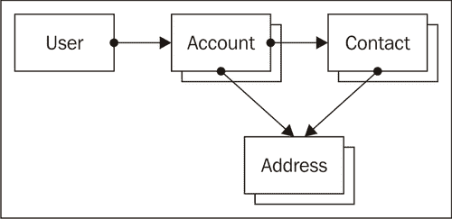
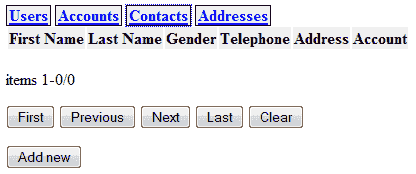
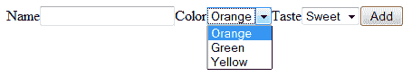
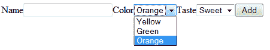

# 第八章 管理客户关系

> 实体框架和 CherryPy 应用代码不仅仅是浏览列表。用户必须能够添加新实例并编辑现有实例。

在本章中，我们将：

+   查看如何显示实例

+   如何添加和编辑实例

+   如何为引用其他实体的属性提供自动完成功能

+   如何实现选择列表

那么，让我们开始吧...

# 一次批判性回顾

现在我们已经创建了一个以实体和关系模块形式存在的对象关系框架，是时候进行一次批判性的评估了。

一些较大和较小的问题可能会阻碍我们快速原型设计和实现数据库驱动的应用：

+   我们已经对实体属性的附加属性进行了管理，例如，一个属性是否有验证函数。存储诸如属性值的首选表示这样的信息可能是个好主意。我们还希望有记录允许值的可能性，这样我们就可以实现选择列表

+   尽管框架足够灵活，可以让开发者快速实现数据库驱动的应用，但它没有让最终用户更改数据库架构的功能。例如，无法向实体添加属性。即使这可能实现，我们仍然需要一个授权方案来限制此功能仅对授权用户可用。

在接下来的章节中，我们将逐一解决这些限制，每一步都会让我们更接近实现最终示例：客户关系管理应用。这个过程的一些部分需要我们执行一些相当复杂的 Python 技巧，但这些部分会被明确标记，并且可以跳过。

# 设计客户关系管理应用

我们对 CRM 的第一个修订版将从裸骨实现开始。它和书籍应用一样简单，其数据模型在下图中展示：



网络应用将服务于单一公司，用户通常是销售代表和后台员工。在这个基本形式中，账户是我们感兴趣的公司，具有一些属性，如名称和业务类型。我们还记录了联系人；这些人与账户相关联。这些联系人具有姓名、性别等属性。账户和联系人都可以有任意数量的地址。

# 实施基本 CRM 的时间

看看下面的代码（作为`crm1.py`提供），它将定义前一部分中标识的实体，当运行时，结果将看起来很熟悉：



我们已经添加了一些 CSS 样式来排列页面上的元素，但在最终修订中，我们将给它一个更加吸引人的外观。点击**添加新**按钮将允许您添加一个新的实体。

## 刚才发生了什么？

在实现 CRM 的这些朴素开始中，是通过`crm1.py`中的代码完成的：

**Chapter8/crm1.py**

```py
	import os
	import cherrypy
	from entity import AbstractEntity, Attribute, Picklist, 
	AbstractRelation
	from browse import Browse
	from display import Display
	from editor import Editor
	from logondb import LogonDB
	db="/tmp/crm1.db"
	class Entity(AbstractEntity):
		database = db
	class Relation(AbstractRelation):
		database = db
	class User(Entity):
		name = Attribute(notnull=True, unique=True,
				displayname="Name", primary=True)
	class Account(Entity):
		name = Attribute(notnull=True,
				displayname="Name", primary=True)
	class Contact(Entity):
		firstname = Attribute(displayname="First Name")
		lastname = Attribute(displayname="Last Name",
					notnull=True, primary=True) gender = Attribute(displayname="Gender",
			notnull=True,
			validate=Picklist(
						Male=1,
						Female=2,
						Unknown=0))
	telephone = Attribute(displayname="Telephone")
class Address(Entity):
	address = Attribute(displayname="Address",
				notnull=True, primary=True)
	city = Attribute(displayname="City")
	zipcode = Attribute(displayname="Zip")
	country = Attribute(displayname="Country")
	telephone = Attribute(displayname="Telephone")
class OwnerShip(Relation):
	a = User
	b = Account
class Contacts(Relation):
	a = Account
	b = Contact
class AccountAddress(Relation):
	a = Account
	b = Address
class ContactAddress(Relation):
	a = Contact
	b = Address

```

第一部分是关于根据我们之前绘制的数据模型定义实体及其之间的关系。这个概念与书籍应用程序几乎相同，但有一个重要的细节，即使用**下拉列表**来限制性别（突出显示）的可选选择。我们将在本章后面详细研究这些下拉列表。

下一个部分创建实际的 CherryPy 应用程序，为每个实体创建一个`Browse`页面（突出显示）：

**Chapter8/crm1.py**

```py
logon = LogonDB() class AccountBrowser(Browse):
	display = Display(Account)
	edit = Display(Account, edit=True, logon=logon,
								columns=Account.columns+[Address,User])
	add = Display(Account, add=True, logon=logon,
								columns=Account.columns+[Address,User]) class UserBrowser(Browse):
	display = Display(User)
	edit = Display(User, edit=True, logon=logon)
	add = Display(User, add=True, logon=logon) class ContactBrowser(Browse):
	display = Display(Contact)
	edit = Display(Contact, edit=True, logon=logon,
								columns=Contact.
columns+[Account,Address])
	add = Display(Contact, add=True, logon=logon,
								columns=Contact.
columns+[Account,Address]) class AddressBrowser(Browse):
	display = Display(Address)
	edit = Display(Address, edit=True, logon=logon)
	add = Display(Address, add=True, logon=logon)

```

最后的部分定义了一个带有`index()`方法的`Root`类，该方法将强制用户首先进行自我识别（突出显示），然后会将用户重定向到由`entities()`方法提供的[/entities](http:///entities)页面。

此方法将提供包含导航部分的基页，用户可以通过它选择实体类型的浏览页面，以及一个最初为空的内容区域，但将作为所选浏览组件或任何编辑或添加页面的容器。

**Chapter8/crm1.py**

```py
with open('basepage.html') as f:
	basepage=f.read(-1)
class Root():
	logon = logon
	user = UserBrowser(User)
	account = AccountBrowser(Account,
						columns=Account.
columns+[User,Address,Contact])
	contact = ContactBrowser(Contact,
						columns=Contact.columns+[Address,Account])
	address = AddressBrowser(Address)
	@cherrypy.expose
	def index(self): return Root.logon.index(returnpage='../entities')
	@cherrypy.expose
	def entities(self):
		username = self.logon.checkauth()
		if username is None :
				raise HTTPRedirect('.')
		user=User.list(pattern=[('name',username)])
		if len(user) < 1 :
				User(name=username)
		return basepage%'''
		<div class="navigation">
				<a href="user">Users</a>
				<a href="http://account">Accounts</a>
				<a href="contact">Contacts</a>
				<a href="http://address">Addresses</a>
		</div>
		<div class="content">
		</div>
		<script>
		... Javascript omitted ...
		</script>
		'''
cherrypy.config.update({'server.thread_pool':1})
cherrypy.engine.subscribe('start_thread',
	lambda thread_index: Root.logon.connect())
current_dir = os.path.dirname(os.path.abspath(__file__))
cherrypy.quickstart(Root(),config={
		'/':
		{ 'log.access_file' :
				os.path.join(current_dir,"access.log"),
		'log.screen': False,
		'tools.sessions.on': True
		},
		'/browse.js':
		{ 'tools.staticfile.on':True,
		'tools.staticfile.filename':current_dir+"/browse.js"
		},
		'/base.css':
		{ 'tools.staticfile.on':True,
		'tools.staticfile.filename':current_dir+"/base.css"
		}
})

```

# 添加和编辑值

到目前为止，我们没有仔细查看`Display`类，尽管它在用 CherryPy 设置的应用程序的各种形态中都被使用。`Display`类结合了多个功能。它：

到目前为止，我们没有仔细查看`Display`类，尽管它在用 CherryPy 设置的应用程序的各种形态中都被使用。`Display`类结合了多个功能。它：

+   显示实例的详细值

+   允许编辑这些值

+   显示一个表单，允许我们添加一个全新的实例

+   处理来自编辑和添加表单的输入

将这些功能捆绑在一起的原因有两个：显示标签和值以供阅读、编辑或添加实例共享很多共同逻辑，并且通过在同一个类方法中处理结果，我们可以以允许我们在应用程序树中的任何位置挂载`Display`类实例的方式引用`<form>`元素的`action`属性。

# 添加实例的行动时间

为了理解`Display`类，让我们创建一个非常简单的应用程序。输入以下代码并运行它：

**Chapter8/crmcontact.py**

```py
import os
import cherrypy
from entity import AbstractEntity, Attribute, Picklist
from browse import Browse
from display import Display
from logondb import LogonDB
db="/tmp/crmcontact.db"
class Entity(AbstractEntity):
	database = db
class Contact(Entity):
	firstname = Attribute(displayname="First Name")
	lastname = Attribute(displayname="Last Name",
											notnull=True, 
primary=True)
	gender = Attribute(displayname="Gender",
											notnull=True,
											validate=Picklist(
Male=1,Female=2,Unknown=0))
	telephone = Attribute(displayname="Telephone")
class ContactBrowser(Browse):
	edit = Display(Contact, edit=True)
	add = Display(Contact, add=True)
current_dir = os.path.dirname(os.path.abspath(__file__))
cherrypy.quickstart(ContactBrowser(Contact),config={
	'/':
	{ 'log.access_file' :
			os.path.join(current_dir,"access.log"),
	'log.screen': False,
	'tools.sessions.on': True
	}
})

```

当您将浏览器指向`http://localhost:8080`时，您将看到一个空的联系人列表，您可以通过点击**添加**按钮来扩展它。这将显示以下屏幕：


在这里你可以输入新值，当你点击添加按钮时，一个新的联系人将被添加到数据库中，之后你将返回到联系人列表，但现在多了一个新添加的联系人。

## 刚才发生了什么？

在我们构建的应用程序树中，我们挂载了几个`Display`类的实例，每个实例都有自己的初始化参数。这些参数仅通过`__init__()`方法存储在实例中，以供以后参考：

**第八章/display.py**

```py
	def __init__(self, entity, edit=False, add=False,
								logon=None, columns=None):
		self.entity = entity
		self.edit = edit
		self.add = add
		self.logon = logon
		if columns is None:
			self.columns = entity.columns
		else:
			self.columns = columns

```

最重要的参数是`entity`。这将是我们希望`Display`能够添加或编辑的`Entity`类。

`__init__()`还接受一个`edit`或`add`参数，当设置时，将确定此`Display`实例将执行的活动类型。如果没有给出任何一个，实例将仅显示，没有更改其属性的可能性。在简化的`crmcontact.py`应用程序中，我们创建了一个`ContactBrowser`类，该类包含对两个不同的`Display`类实例的引用。`add`类变量中的实例使用`add`属性设置为`True`创建，而`edit`变量中的实例使用`edit`属性设置为`True`创建。浏览器中的**添加新**按钮配备了点击处理程序，该处理程序将用由带有`add`参数创建的`Display`实例提供的表单替换浏览列表。

# 编辑实例的时间

我们还希望打开一个表单，允许用户在浏览列表中双击时编辑现有实例。在上一节中创建的简化应用程序中，我们仅创建了`ContactBrowser`类作为`Browse`类的子类。如果我们想向浏览列表元素添加一个额外的双击处理程序，我们必须重写`index()`方法。

在`ContactBrowser`类的定义中，向`index()`方法的定义中添加以下内容（完整的代码可在`crmcontactedit.py`中找到）：`

**第八章/crmcontactedit.py**

```py
@cherrypy.expose
def index(self, _=None,
	start=0, pattern=None, sortorder=None, cacheid=None,
	next=None, previous=None, first=None, last=None,
	clear=None):
	s="".join(super().index(_, start, pattern, sortorder,
							cacheid, next,previous, first, last, 
clear))
	s+='''
	<script>
	$("table.entitylist tr").dblclick(function(){
				var id=$(this).attr('id');
				$("body").load('edit/?id='+id);
			});
	</script>
	'''
	return basepage%s

```

代码只是收集了`Browse`类原始`index()`方法的输出（突出显示），并向其中添加了一个`<script>`元素，该元素将为浏览列表中的每个`<tr>`元素添加一个双击处理程序。此点击处理程序将用由编辑 URL 提供的表单替换主体，该表单将传递一个`id`参数，其值等于`<tr>`元素的`id`属性。

如果你运行`crmcontactedit.py`，你将看到与之前相同的联系人列表，如果它是空的，你可能首先需要添加一个或多个联系人。一旦这些联系人存在，你可以双击任何一个来打开编辑屏幕：


这看起来非常类似于添加屏幕，但在这里更改值并点击**编辑**按钮将修改而不是添加联系人并返回联系人列表。

## 刚才发生了什么？

让我们看看`Display`类是如何处理实例编辑的。

`Display`类的实例的所有交互都由一个单独的方法提供：`index()`（完整代码可在`display.py`中找到）：`

**Chapter8/display.py**

```py
@cherrypy.expose
def index(self, id=None, _=None,
		add=None, edit=None, related=None, **kw):
	mount = cherrypy.request.path_info
	if not id is None :
		id = int(id)
	kv=[]
	submitbutton=""
	if edit or add:
		... code to process the results of an edit/add form omitted
	action="display"
	autocomplete=''
	if not id is None:
		e=self.entity(id=id)
			for c in self.columns:
				if c in self.entity.columns:
					kv.append('<label for="%s">%s</label>'%
						(c,self.entity.displaynames[c]))
					if c in self.entity.validators and type(
						self.entity.validators[c])==Picklist:
						kv.append('<select name="%s">'%c)
						kv.extend(['<option %s>%s</option>'%
							("selected" if v==getattr(e,c)
							else "",k)
						for k,v in self.entity.validators[c]
							.list.items()])
						kv.append('</select>')
					else:
					kv.append(
					'<input type="text" name="%s" value="%s">'%
						(c,getattr(e,c)))
					elif issubclass(c,AbstractEntity):
						kv.append(
						'<label for="%s">%s</label>'%
						(c.__name__,c.__name__))
						v=",".join([r.primary for r in e.get(c)])
						kv.append(
						'<input type="text" name="%s" value="%s">'%
						(c.__name__,v))
						autocomplete += '''
	$("input[name=%s]").autocomplete({source:"%s",minLength:2});
						'''%(c.__name__,
							mount+'autocomplete?entity='+c.__name__)
				yield self.related_entities(e) if self.edit:
					action='edit'
					submitbutton='''
					<input type="hidden" name="id" value="%s">
					<input type="hidden" name="related" value="%s,%s">
					<input type="submit" name="edit" value="Edit">
					'''%(id,self.entity.__name__,id)
			elif self.add:
				action='add'
					for c in self.columns:
						if c in self.entity.columns:
							kv.append('<label for="%s">%s</label>'%(
								c,self.entity.displaynames[c]))
							if c in self.entity.validators and type(
								self.entity.validators[c])==Picklist:
							kv.append('<select name="%s">'%c)
							kv.extend(['<option>%s</option>'%v
								for v in self.entity.validators[c].
									list.keys()])
								kv.append('</select>')
							else:
								kv.append('<input type="text" name="%s">'
									%c)
						elif c=="related":
							pass
						elif issubclass(c,AbstractEntity):
							kv.append('<label for="%s">%s</label>'%
								(c.__name__,c.__name__))
							kv.append('<input type="text" name="%s">'%
								c.__name__)
							autocomplete += '''
	$("input[name=%s]").autocomplete({source:"%s",minLength:2});
							'''%(c.__name__,
								mount+'autocomplete?entity='+c.__name__)
			submitbutton='''
			<input type="hidden" name="related" value="%s">
			<input type="submit" name="add" value="Add">
			'''%related
		else:
			yield """cannot happen
			id=%s, edit=%s, add=%s, self.edit=%s, self.add=%s
			"""%(id,edit,add,self.edit,self.add) yield '<form action="%s">'%action
		for k in kv:
			yield k
		yield submitbutton
		yield "</form>"
		yield '<script>'+autocomplete+'</script>'

```

根据`index()`方法传递的参数和初始化`Display`实例时存储的信息，`index()`执行不同的但相似的操作。

当没有`add`或`edit`参数被调用时，`index()`函数被用来显示、编辑或添加一个实例，并且代码的前一部分被跳过。

### 注意

`index()`函数的`add`和`edit`参数与传递给`__init__()`的参数不同。

首先，我们检查`id`参数是否存在（突出显示）。如果没有，我们预计将展示一个空表单，让用户输入新实例的属性。然而，如果存在`id`参数，我们必须显示一个带有值的表单。

为了展示这样的表单，我们检索具有给定 ID 的实体，并检查我们必须显示哪些列，并查看这样的列是否是我们正在处理的实体的属性（突出显示）。如果是这样，我们将一个带有列显示名称的`<label>`元素和一个`<input>`或`<select>`元素追加到`kv`列表中，具体取决于我们是否处理一个不受限制的文本字段或一个选择列表。如果我们处理一个选择列表，可用的选项将被添加为`<option>`元素。

如果要显示的列不是实体的属性而是另一个实体类，我们正在处理一个关系。在这里，我们也添加了一个`<label>`元素和一个`<input>`字段，但我们还向`autocomplete`变量中添加了 JavaScript 代码，当执行时，将这个`<input>`元素转换成一个自动完成小部件，它将从同一个`Display`实例的`autocomplete()`方法中检索其选项。

只有当这个`Display`实例被初始化为执行编辑功能（突出显示）时，我们才追加一个提交按钮并将`action`变量设置为编辑（`<form>`元素的值将被提交到 URL 的最后部分）。我们还添加了一个额外的隐藏输入元素，它包含我们正在编辑的实例的 ID。

构建空表单以添加新实例几乎是一项相同的练习，只是在这次操作中，没有任何`<input>`元素中填写了值。

代码的最后几行（突出显示）再次被共享并用于根据刚刚创建的组件来传递`<form>`元素，无论是编辑/显示表单还是空白的添加表单，以及任何用于实现自动完成功能的 JavaScript 代码。一个典型的用于编辑表单生成的 HTML 示例可能如下所示：

```py
<form action="edit">
	<label for="firstname">First Name</label>
	<input name="firstname" value="Eva" type="text">
	<label for="lastname">Last Name</label>
	<input name="lastname" value="Johnson" type="text">
	<label for="gender">Gender</label>
	<select name="gender">
			<option selected="selected">Unknown</option>
			<option>Male</option>
			<option>Female</option>
	</select>
	<label for="telephone">Telephone</label>
	<input name="telephone" value="" type="text">
	<label for="Account">Account</label>
	<input name="Account" value="" type="text">
	<label for="Address">Address</label>
	<input name="Address" value="" type="text">
	<input name="id" value="2" type="hidden">
	<input name="edit" value="Edit" type="submit">
</form>
<script>
$("input[name=Account]").autocomplete({source:"autocomplete?entity=
Account",minLength:2});
$("input[name=Address]").autocomplete({source:"autocomplete?entity=
Address",minLength:2});
</script>

```

如果`Display`类的`index()`方法被调用时带有`add`或`edit`参数（通常是点击生成的编辑或添加表单中的提交按钮的结果），则会执行不同的代码：

**Chapter8/display.py**

```py
@cherrypy.expose
def index(self, id=None, _=None,
		add=None, edit=None, related=None, **kw):
	mount = cherrypy.request.path_info
	if not id is None :
		id = int(id)
	kv=[]
	submitbutton=""
	if edit or add:
		if (edit and add):
			raise HTTPError(500)
		if not self.logon is None:
			username=self.logon.checkauth()
			if username is None: raise HTTPRedirect('/')
		if add:
			attr={}
			cols={}
			relations={c.__name__:c for c in self.columns
				if type(c)!=str}
			for k,v in kw.items(): if not k in self.entity.columns:
					attr[k]=v
					if not k in relations :
						raise KeyError(k,
							'not a defined relation')
				else:
					cols[k]=v e=self.entity(**cols)
			for k,v in attr.items():
				if v != None and v != '':
					relentity = relations[k]
					primary = relentity.primaryname
					rels = relentity.listids(
						pattern=[(primary,v)])
					if len(rels):
						r = relentity(id=rels[0])
					else:
						r = relentity(**{primary:v})
					e.add(r)
			if not related is None and related != '':
				r=related.split(',')
				re=e.relclass[r[0]](id=int(r[1]))
				e.add(re)
			redit = sub(Display.finaladd,'',mount)
			raise cherrypy.HTTPRedirect(redit)
		elif edit:
			e=self.entity(id=id)
			e.update(**kw)
			raise cherrypy.HTTPRedirect(
				mount.replace('edit','').replace('//','/'))
				...code to display and instance omitted

```

只应有一个`edit`或`add`参数存在；如果两者都存在，我们将引发异常。如果用户未认证，则不允许编辑实例或添加新实例，并且我们将他/她无礼地重定向到主页（突出显示）。

如果存在`add`参数，我们将创建一个新的实例。首要任务是检查所有传入的参数，看它们是否是我们将要创建的实体的属性（突出显示）或相关实体的名称。如果不是，将引发异常。

下一步是创建新的实体（突出显示）并建立任何关系。

# 添加关系

在前面的章节中，我们默默地忽略了一件事，那就是定义实体之间关系的功能。当然，`Display`类的实现确实允许创建新实例，但我们没有解决如何定义关系的问题，尽管`Display`已经完全能够显示指向相关实体（如作者）的列。

我们本可以将这种行为硬编码到`Display`的具体实现中，就像我们之前在实现图书应用的第一版时做的那样，但这与创建能够自己处理这些事情的组件的想法不太相符，这会让网络应用的开发者有更少的事情要担心。

之前的`relation`模块版本并不完全符合这个要求：我们可以定义和管理关系，但我们必须通过明确引用`Relation`类的一个实例来做这件事。

因为这并不直观，我们创建了一个`relation`模块的第二版，允许我们使用由创建新关系的元类插入到`Entity`类定义中的`add()`方法。我们不必关心细节：如果我们使用`add()`在两个实体之间建立关系，所有这些都会得到处理。

这意味着我们可以完成`Display`类的添加功能。对于每个指向另一个实体（例如，书的`Author`列）的列，我们现在实现了一种让用户进行选择的方式，例如，使用自动完成功能，并以相对简单的方式处理这个选择：如果它是空的，我们不添加关系；如果它指向一个现有实体，添加关系；如果不是，首先创建相关实体，然后再添加它。

现在我们有了通过其主属性引用现有相关项或定义新属性的功能。然而，对于最终用户来说，在引用相关实体的输入字段上实现自动完成可能非常方便。这不仅可能节省时间，还可以防止在输入错误时意外添加新实体。

在前面的章节中，我们已经遇到了使用 jQuery UI 的自动完成小部件的自动完成，并实现了检索可能完成列表的服务器端功能。我们现在需要以独立于实际相关实体的方式提供此功能：

**第八章/display.py**

```py
@cherrypy.expose
def autocomplete(self, entity, term, _=None): entity={c.__name__:c for c in self.columns
		if type(c)!=str}[entity]
	names=entity.getcolumnvalues(entity.primaryname)
	pat=compile(term,IGNORECASE)
	return json.dumps(list(takewhile(lambda x:pat.match(x),
				dropwhile(lambda x:not pat.match(x),names))))

```

`Display`类的`index()`方法生成的 HTML 和 JavaScript 将确保调用`autocomplete()`方法，并传入我们想要检索列值的实体名称。

我们正在编辑的实例所引用的任何相关类都存储在`self.columns`实例变量中，就像常规属性的名称一样。因此，高亮行收集了那些实际上是类的列名称，并创建了一个按名称索引的字典，其中包含相应的类作为值。

当我们使用传递给`autocomplete()`方法的关联实体名称作为索引时，我们将获取该类。这个类在下一行用于检索标记为主列的所有列值。返回一个 JSON 编码的值列表的最终代码与之前实现的方式相同。

### 注意

字典推导式是 Python 3.x 的新增功能，因此将示例代码中的高亮行以更传统的方式写出来可能会有所启发：

```py
classmap = {} 
for c in self.columns: 
	if type(c)!=str: 
			classmap[c.__name__] = c 
entity = classmap[entity]

```

# 选择列表

当我们检查生成编辑实例表单的代码时，我们没有深入研究实现选择列表的细节。选择列表是一种减少输入错误的好方法。在任何允许有限值列表的地方，我们都可以使用选择列表，从而防止用户意外输入不允许的值。这样做，我们还可以将每个可能的值与一个有意义的标签关联起来。

### 注意

我们已经有了添加验证函数的可能性，但这个函数只检查输入；它不为我们提供一个可能的选项列表。

# 实现选择列表的行动时间

我们需要的是一个方法来指示实体属性是一个选择列表。运行以下代码（作为`fruit.py`提供）并将您的浏览器指向[`localhost:8080`](http://localhost:8080)。

**第八章/fruit.py**

```py
import os
import cherrypy
from entity import AbstractEntity, Attribute, Picklist
from browse import Browse
from display import Display
from logondb import LogonDB
db="/tmp/fruits.db"
class Entity(AbstractEntity):
	database = db
class Fruit(Entity):
	name = Attribute(displayname="Name")
	color = Attribute(displayname="Color",
			notnull = True,
			validate= Picklist([('Yellow',1),('Green',2),('Orange',0)]))
	taste = Attribute(displayname="Taste",
			notnull = True,
			validate= Picklist(Sweet=1,Sour=2))
class FruitBrowser(Browse):
	edit = Display(Fruit, edit=True)
	add = Display(Fruit, add=True)
current_dir = os.path.dirname(os.path.abspath(__file__))
cherrypy.quickstart(FruitBrowser(Fruit),config={
			'/':
			{ 'log.access_file' : os.path.join(current_dir,"access.
log"),
			'log.screen': False,
			'tools.sessions.on': True
			}
})

```

点击**添加**按钮创建一个新的水果实例。`color`和`taste`属性被定义为选择列表，例如，点击**颜色**属性可能看起来像这样：



## 刚才发生了什么？

在`entity.py`文件中，我们添加了一个`Picklist`类来存储可用的选项及其值：

**第八章/entity.py**

```py
class Picklist:
	def __init__(self,list=None,**kw):
		self.list = collections.OrderedDict(list) if not list is 
None else collections.OrderedDict()
		self.list.update(kw)
	def __getitem__(self,key):
		return self.list[key]

```

`Picklist`类主要是一个`OrderedDict`（突出显示）的容器，可以通过列表或传递任意数量的关键字到`__init__()`方法来初始化。然而，这些关键字的顺序不会被保留，因此尽管我们使用这个验证参数`validate= Picklist(Yellow=1,Green=2,Orange=0)`定义了水果实体的颜色属性，但在下拉框中的顺序是**橙，绿，黄**。

因此，尽管传递关键字很方便，但它使得使用`OrderedDict`变得毫无意义。因此，`__init__()`方法也接受一个键值对元组的列表，如果存在，则使用此列表初始化字典。现在如果我们使用`validate= Picklist([('Yellow',1),('Green',2),('Orange',0)])`，顺序将被保留，如下面的截图所示。它还有一个额外的优点，即允许我们指定任何字符串作为键，而不仅仅是有效的 Python 标识符。



我们已经在`Display`类的`index()`方法中看到了如何检索可能的选项列表。`Entity`本身也需要知道如何处理选择列表类型的属性，例如，当它更新这样的属性时。`AbstractEntity`类的`__setattr__()`方法需要如下调整：

**第八章/entity.py**

```py
def __setattr__(self,name,value):
		if name in self.validators :
			if type(self.validators[name])==Picklist:
				try:
					value=self.validators[name].list[value]
				except:
					# key not known, try value directly
					if not value in list(
				self.validators[name].list.values()):
							raise AttributeError(
		"assignment to "+name+" fails, "+
		str(value)+" not in picklist")
			elif not self.validatorsname:
					raise AttributeError(
					"assignment to "+name+" does not validate")
	object.__setattr__(self,name,value)

```

添加的行（突出显示）检查是否有任何验证器是`Picklist`，如果是，则尝试检索与键关联的值。如果失败，它检查输入的值是否是允许的值之一。这样，就可以使用键或值来更新选择列表属性。给定前面定义的`Fruit`类的`fruit`实例，以下行是等效的：

```py
fruit.color = 'Green'
fruit.color = 2

```

# 摘要

在本章中，我们学到了很多关于如何向最终用户提供表单来操作实例的知识，而无需任何硬编码信息。

具体来说，我们涵盖了如何显示实例、添加和编辑它们，如何为引用其他实体的属性提供自动完成功能，以及如何实现选择列表。

所有这些项目都帮助我们设计和实现了 CRM 应用的第一版。当然，CRM 应用不仅仅是账户和联系人，这就是我们在下一章要探讨的内容。
