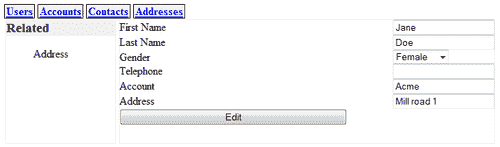
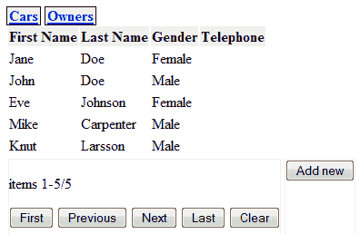
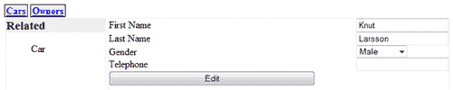
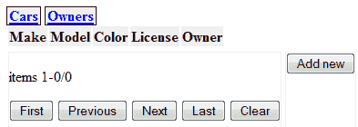
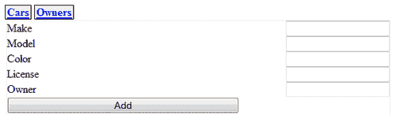
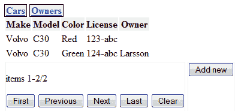
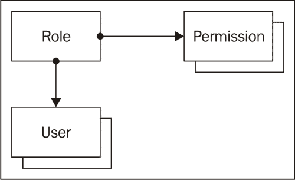

# 第九章. 创建完整的 Web 应用：实现实例

> Python Web 应用的快速开发框架正在顺利进行，但一些独特的功能仍然缺失。

在本章中，我们将探讨其中的一些，特别是：

+   如何实现更复杂的关系

+   如何创建必要的用户界面组件来维护这些关系

+   以及如何允许对谁可以做什么有更精细的控制

这些是一些有趣的挑战，让我们开始吧。

# 更多的关系

正如我们所见，使`Display`能够处理相关实体的引用并不困难。然而，这些关系仅限于查找关系（也称为多对一关系）。例如，`Contact`实体最多引用一个`Account`实体，而`Display`类允许我们在编辑`Contact`时选择`Account`。

但对于相反的情况，我们还需要什么？一个`Account`可能有多个`Contacts`，而`Account`和`Contact`都可能有很多`Addresses`。我们需要一种方法让`Display`显示实体存在的一对多关系，并提供在用户点击此类关系时显示这些实体的手段。

# 展示一对一关系的行动时间

插图显示了我们可能期望的结果：



我们已经选择了一个`Contact`，其详细信息可供编辑，包括对`Account`的引用。然而，现在在左侧，我们有一个侧边栏显示了可用的单一到多对关系，在这种情况下，适用于`Contact`的唯一单一到多对关系是`Address`。

## 刚才发生了什么？

要显示实体列表，我们已经有了一个合适的构建块，即`Browse`类，它不仅让我们能够以各种方式浏览实体列表，还能够过滤这些实体。在这个例子中，我们只想显示与这个特定联系人相关联的地址。

因此，我们在`Display`类中添加了一个新方法，该方法将生成一个 HTML 片段和一些 JavaScript，以显示可用的单一到多对关系列表：

**Chapter9/display.py**

```py
@staticmethod
def related_link(re,e):
	return '<li id="%s" class="%s" ref="%s">%s</li>'%(
		e.id,e.__class__.__name__,re.lower(),re)
def related_entities(self,e):
	r=['<div class="related_entities"><h3>Related</h3><ul>']
	if hasattr(e.__class__,'reltype'):
		r.extend([self.related_link(re,e)
			for re,rt in e.__class__.reltype.items()
			if (rt == '1:N' or rt == 'N:N')])
	r.append('</ul></div>')
	r.append('''
	<script>
	$('div.related_entities li').click(function(){
		var rel=$(this).attr("ref");
		var related=$("input[name=related]").val();
		$(".content").load(rel,
			$.param({
			"pattern" : $(this).attr("class") +
				"," + $(this).attr("id"),
			"related": related}),
		function(){shiftforms(rel)});
	});
</script>''')
return "\n".join(r)

```

要确定哪些关系可用，`related_entities()`方法引用了`reltype`类变量（已突出显示），这是一个由`MetaRelation`类维护的实体名称及其类型的字典，当定义新关系时。对于每个合适的关联，`related_link()`方法将帮助生成一个`<li>`元素。

这些`<li>`元素有一个`id`属性，它包含引用实体的唯一 ID（在这个例子中是联系人的 ID）和一个`class`属性，它指示引用实体的类型（在这种情况下是 Contact）。`<li>`元素还有一个`rel`属性，它指向由`Browse`类服务的 URL。目前，我们从这个我们引用的实体的名称（在这种情况下是地址）中派生这个 URL。

最终生成的 HTML 片段是一个`<script>`元素，它为`<li>`元素安装了一个事件处理器。这个点击处理器将获取其关联的`<li>`元素的`ref`属性来构造一个 URL，随后用于打开一个新窗口。我们将不得不稍微调整`Display`和`Browse`类的`index()`方法，以便传递和处理这些属性，正如我们稍后将看到的。

在我们的例子中，生成的 HTML 片段（减去 script 元素）将如下所示：

```py
<div class="related_entities">
	<h3>Related</h3>
	<ul>
		<li ref="address" class="Contact" id="1">Address</li>
	</ul>
</div>

```

将替换`<div>`元素内容的`load()`调用将传递以下 URL，例如：`http://127.0.0.1:8080/ address/?_=1295184609212&pattern=Contact,1&related=Contact,1`。

### 注意

注意，我们在这里使用 jQuery 的`param()`函数将包含多个属性的对象转换为适合添加到 URL 的字符串。我们本可以直接在这里传递对象，但那样会导致即使我们配置了所有 AJAX 调用使用 HTTP GET 方法，也会触发 POST 操作。通常情况下，这不会成为问题，但如果 URL 中缺少最后的斜杠，CherryPy 会重定向我们到以斜杠结尾的 URL，并且 AJAX 调用将再次执行，但这次没有附加参数！为了防止这种可能的尴尬情况并帮助调试，我们通过使用`param()`函数自己构造完整的 URL 来强制使用 GET 方法。

# 适应 MetaRelation 的时间

在`Display`类中，我们使用了`MetaRelation`元类存储的关系类型信息。这是必要的，因为当我们认识到存在多种关系类型时，我们需要某种方式来指示当我们定义一个新的关系并创建新类时使用该信息。看看下面的示例代码：

```py
class A(Entity):
	pass
class B(Entity):
	pass
class AhasmanyB(Relation):
	a=A
	b=B

```

在这里，我们表达`A`和`B`之间的关系是一对多。如果我们想表达一个`A`的实例可能只引用一个`B`实例的概念，我们需要在定义中表明这一点。这样做的一种方式是在变量的类定义中反转赋值：

```py
class AreferstoasingleB(Relation):
	a=B
	b=A

```

我们之前定义的`MetaRelation`元类可以对这样的定义进行操作，因为我们安排了被定义的关系的类字典是一个`OrderedDict`，所以原则上，我们可以对定义的顺序进行操作。

一种更明确的方式来定义这通常是更清晰的，所以我们选择一个可以分配关系类型的字符串的`relation_type`属性。例如：

```py
class AhasmanyB(Relation):
	a=A
	b=B
	relation_type='1:N'
class AreferstoasingleB(Relation):
	a=A
	b=B
	relation_type='N:1'

```

如果我们省略了`relation_type`，则默认为多对一关系。

## 这到底发生了什么？

让我们看看实现这些语义所需的`MetaRelation`的更改和添加。我们需要两个更改。第一个是在我们用来管理关系的桥表定义中。我们需要在这里添加一个额外的`unique`约束，以强制在一对多关系中，方程多边的列中的 ID 是唯一的。

这可能听起来有些反直觉，但假设我们有以下车辆：一辆沃尔沃、一辆雷诺、一辆福特和一辆尼桑。还有两位所有者，John 和 Jill。Jill 拥有沃尔沃和雷诺，而 John 拥有其他车辆。表格可能看起来像这样：

| 汽车 |   |
| --- | --- |
| ID | 品牌 |
| --- | --- |
| 1 | 沃尔沃 |
| 2 | 雷诺 |
| 3 | 福特 |
| 4 | 尼桑 |
| 所有者 |   |
| --- | --- |
| ID | 名称 |
| --- | --- |
| 1 | Jill |
| 2 | John |

反映汽车所有权的表可能看起来像这样：

| 所有权 |   |
| --- | --- |
| 汽车 | 所有者 |
| --- | --- |
| 1 | 1 |
| 2 | 1 |
| 3 | 2 |
| 4 | 2 |

我们看到，虽然一个*单一*所有者可能拥有*许多*辆车，但由于这种关系，`汽车`列中的数字是唯一的。

为了定义具有那些额外唯一约束条件的表，并使关系类型的信息在构成关系两半的类中可用，我们必须调整`MetaRelation`元类中的`__new__()`方法的最后部分：

**第九章/entity.py**

```py
if relationdefinition or '_meta' in classdict:
		a = classdict['a']
		b = classdict['b'] r = '1:N'0
		if 'relation_type' in classdict: r = classdict['relation_type']
		if not r in ('N:1','1:N'): raise KeyError("unknown relation_
type %s"%r)
		classdict['relation_type'] = r
		if not issubclass(a,AbstractEntity) : raise TypeError('a not 
an AbstractEntity')
		if not issubclass(a,AbstractEntity) : raise TypeError('b not 
an AbstractEntity') runique = ' ,unique(%s_id)'%a.__name__
		if r == '1:N' : runique = ' ,unique(%s_id)'%b.__name__
		sql = 'create table if not exists %(rel)s ( %(a)s_id references %(a)s on delete cascade, %(b)s_id references %(b)s on delete cascade, unique(%(a)s_id,%(b)s_id)%(ru)s)'%{'rel':classname,'a':a.__name__,'b':b.__name__,'ru':runique}
conn = sqlite.connect(classdict['_database'])
		conn.execute(sql)
		setattr(a,'get'+b.__name__,lambda self:getclass(self,b, 
classname))
		setattr(a,'get',get)
		setattr(b,'get'+a.__name__,lambda self:getclass(self,a, 
classname))
		setattr(b,'get',get)
		setattr(a,'add'+b.__name__,lambda self,entity:addclass(self, entity,b,
classname))
		setattr(a,'add',add)
		setattr(b,'add'+a.__name__,lambda self,entity:addclass(self, entity,a,
classname))
		setattr(b,'add',add) reltypes = getattr(a,'reltype',{})
		reltypes[b.__name__]=r
		setattr(a,'reltype',reltypes)
		reltypes = getattr(b,'reltype',{})
		reltypes[a.__name__]={'1:N':'N:1','N:N':'N:N','N:1':'1:N'}[r]
		setattr(b,'reltype',reltypes)
		relclasses = getattr(a,'relclass',{})
		relclasses[b.__name__]=b
		setattr(a,'relclass',relclasses)
		relclasses = getattr(b,'relclass',{})
		relclasses[a.__name__]=a
		setattr(b,'relclass',relclasses)
		joins = getattr(a,'joins',{})
		joins[b.__name__]=classname
		setattr(a,'joins',joins)
		joins = getattr(b,'joins',{})
		joins[a.__name__]=classname
		setattr(b,'joins',joins)
	return type.__new__(metaclass,classname,baseclasses,classdict)

```

突出显示的行是我们添加的。第一组确保定义了`relation_type`属性，如果没有，则创建一个具有默认`'1:N'`值的属性。

突出显示的第二组行确定桥表中哪个列应该接收额外的唯一约束，并构建创建表的 SQL 查询。

突出显示的最后一行代码为两个相关类添加了类属性。所有这些属性都是按实体名称索引的字典。`reltype`属性持有关系类型，因此在一个`Car`实体中，我们可能通过以下方式获取与`Owner`的关系类型：

```py
Car.reltype('Owner')

```

如果像我们之前的例子那样定义，将产生`'N:1'`（一辆或多辆车可能有一个单一的所有者）。

同样，我们可以从所有者的角度获取相同关系的信息：

```py
Owner.reltype('Car')

```

这将产生逆关系，`'1:N'`（一个所有者可能有多辆车）。

# 提升显示效果的行动时间

我们需要更改什么来向`Display`类添加当用户点击相关标签时弹出项目列表的功能？

+   因为`Display`类的所有活动都由其`index()`方法提供服务，所以我们必须在那里做一些更改。

+   `index()` 方法既显示表单，又在按下提交按钮时处理结果，因此我们必须查看编辑和添加功能的两个方面。

+   当显示编辑表单时，这始终是从双击 `Browse` 实例显示的项目列表中触发的，因此会传递一个相关参数。在点击提交按钮时，必须将此参数与表单内容一起传递，以便将其与启动此编辑操作的项关联。

这些问题要求我们对 `index()` 方法进行一些修改。

## 刚才发生了什么？

我们必须做的第一件事是向 `index()` 方法添加一个 `related` 参数。此参数可以保存实体的名称和特定相关实例的 ID，用逗号分隔：

**Chapter9/display.py**

```py
@cherrypy.expose
	def index(self,id=None,_=None,add=None,edit=None,related=None,**
kw):

```

在处理传递给 `Display` 类的 `index()` 方法的 `related` 参数时，涉及添加操作结果的部分必须对 `related` 参数中的信息进行操作：

**Chapter9/display.py**

```py
if not related is None and related != '':
	r=related.split(',') re=e.relclass[r[0]](id=int(r[1]))
	e.add(re)

```

如果方法是在点击项目列表中的 '添加' 按钮后调用的，则 `related` 参数将不为空，并且我们通过逗号分割它以检索实体的名称及其 ID。

实体的名称用于检索在定义关系时添加到 `relclass` 字典中的该类，并且使用实例的 ID 调用该类的构造函数以创建对象（突出显示）。随后，通过 `add()` 方法建立我们正在编辑的项与相关项之间的关系。

同样，最初负责提供添加或编辑表单的部分必须包括一个隐藏的 `<input>` 元素，该元素保存当用户在 `Browse` 实例提供的页面上点击 '添加' 按钮时传递给它的相关参数内容：

**Chapter9/display.py**

```py
							submitbutton='<input type="hidden" name="related" 
value="%s"><input type="submit" name="add" value="Add">'%related

```

# 是时候增强 `Browse` 的功能了。

所有这些相关参数的传递都始于用户在实体列表中点击 '添加' 按钮，而这个列表本身是在编辑或查看项时点击相关标签后显示的。

这些实体列表是由 `Browse` 类的 `index()` 方法生成的，因此我们必须确保传递适当的信息（即，与实例 ID 一起列出的实体名称）。

这意味着我们必须：

+   增强 `index()` 方法以接收一个相关参数，当点击 '添加' 按钮时可以传递。

+   将生成与该添加按钮相关表单的代码扩展，添加一个隐藏的 `<input>` 元素来保存这些信息，以便它可以再次传递给 `Display` 类的 `index()` 方法。

如果 `Display` 和 `Browse` 之间的连接听起来有点令人困惑，那么设想以下场景可能会有所帮助：

+   用户从主菜单开始查看所有者列表，并双击某个特定所有者。这将导致由`Display`类提供的'编辑'表单。因为双击项目不会传递相关参数，所以`Display`类的`index()`方法中的此参数将接收其默认值`None`。

+   编辑表单在标签为相关性的侧边栏中显示了所有者的详情，我们看到一个汽车条目。

+   当用户点击此**汽车**条目以显示与该所有者相关的汽车列表时，这将导致调用`Car`实体的`Browse`实例的`index()`方法，同时带有`related`和`pattern`参数`Owner,5`，例如。

+   这将导致显示指定所有者的汽车列表，当点击此列表中的'添加'按钮时，再次调用`Display`类的`index()`方法，但这次是与`Car`实体关联的`Display`实例。它将传递`Owner,5`的`related`参数。

+   最后，当用户输入了新的汽车详情并点击'添加'时，将再次调用`Display`类的`index()`方法，这次带有`related`参数`Owner,5`，同时还有一个`add`参数。汽车详情将被用来创建一个新的`Car`实例，而`related`参数用来识别`Owner`实例并将新的汽车实例与之关联。

以下一系列截图展示了正在发生的情况。我们从一个所有者列表开始：



当我们双击**Knut Larsson**时，以下 URL 将被发送到服务器：`http://127.0.0.1:8080/owner/edit/?id=5&_=1295438048592`（`id=5`表示实例，最后的数字是 jQuery 添加到 AJAX 调用中，以防止浏览器缓存）。

结果将是一个用于**Knut**的编辑表单：



点击**汽车**将导致以下 URL 被发送到服务器：`http://127.0.0.1:8080/car/?_=1295438364192&pattern=Owner,5&related=Owner,5`。

我们识别出`Owner,5`（即指**Knut**）的`related`和`pattern`参数。请注意，附加到此 URL 的参数中的逗号将被编码为`%2C`发送到服务器。

### 注意

为什么我们发送包含相同信息的`related`参数和`pattern`参数？对于将实体添加到另一个实体，这确实是多余的，但如果我们想添加转移所有权以及添加新实体的能力，我们希望过滤出属于其他所有者的汽车，因此我们需要分别提供`pattern`和`related`参数。

如果这是我们第一次为**Knut**添加汽车，相关汽车列表将为空：



如果我们现在点击**添加新**按钮，将构造以下 URL：

`http://127.0.0.1:8080/car/add/?_=1295438711800&related=Owner,5`，这将导致一个用于添加新汽车的表单：



填写详细信息后，点击**添加**按钮将导致一个新的汽车实例，即使我们因为 URL 中再次传递的相关参数而留空**所有者**字段，也会与**Knut**相关联：

`http://127.0.0.1:8080/car/add/?_=1295439571424&make=Volvo&model=C30&color=Green&license=124-abc&Owner=&related=Owner,5&add=Add`.



## 刚才发生了什么？

要允许`Browse`实例以与`Display`实例相同的方式接收和传递`related`属性，我们需要进行一些小的更改。首先，我们必须更改`index()`方法的签名：

**第九章/browse.py**

```py
@cherrypy.expose
	def index(self, _=None, start=0, pattern=None, sortorder=None, 
cacheid=None, next=None,previous=None, first=None, last=None, 
clear=None, related=None):

```

然后剩下的就是确保点击**添加**新按钮时，通过在表单中包含一个隐藏的`<input>`元素来传递这个值：

**第九章/browse.py**

```py
yield '<form method="GET" action="add">'
			yield '<input name="related" type="hidden" 
value="%s">'%related
			yield '<button type="submit">Add new</button>'
			yield '</form>'

```

# 访问控制

在我们迄今为止设计的应用程序中，我们采取了非常简单的方法来处理访问控制。基于某人的登录凭证，我们允许或不允许访问。在书籍应用程序中，我们稍微扩展了这个概念，删除书籍意味着删除书籍与所有者之间的关联，而不是从数据库中完全删除书籍实例。

在许多情况下，需要更精细的权限控制，但如果这种控制被硬编码到应用程序中，维护它将很快变得难以管理。因此，我们需要某种东西，它将允许我们以简单的方式管理访问权限，并且允许轻松扩展。

考虑以下场景：在一个使用我们 CRM 应用程序的公司中，不同的账户由不同的销售人员拥有。由于公司规模较小，所以每个人都允许查看所有账户的信息，但更改账户信息仅限于拥有该账户的销售人员。当然，销售经理，他们的老板，也有权更改这些信息，无论他是否拥有账户。

我们可以通过让`Entity`的`update()`方法检查此实体是否由执行更新的个人拥有账户，如果不是，则该个人是否是销售经理来实现这种策略。

# 实施访问控制的时间

这种场景在`access1.py:`中实现

### 注意

注意：在本章和下一章提供的代码中，`logon`类不仅使用`admin`用户（密码为`admin`）初始化，还使用以下三个用户名/密码组合：`eve/eve, john/john`, 和 `mike/mike`。

如果你运行这个应用程序并将你的浏览器指向 `http://localhost:8080`，你会看到一个账户列表。如果你以 **john** 或 **mike**（都是销售人员）的身份登录，你只能更改他们各自拥有的账户。然而，如果你以 eve（销售经理）的身份登录，你可以更改所有账户的信息。

## 刚才发生了什么？

该应用程序足够简单，遵循一个熟悉的模式。相关的定义如下所示：

**Chapter9/access1.py**

```py
 from permissions1 import isallowed
class Entity(AbstractEntity):
	database = db def update(self,**kw):
		if isallowed('update', self, logon.checkauth(),
							self.getUser()):
				super().update(**kw)
class Relation(AbstractRelation):
	database = db
class User(Entity):
	name = Attribute(notnull=True, unique=True,
			displayname="Name", primary=True)
class Account(Entity):
	name = Attribute(notnull=True, displayname="Name",
			primary=True)
class OwnerShip(Relation):
	a = User
	b = Account
class AccountBrowser(Browse):
	edit = Display(Account, edit=True, logon=logon,
			columns=Account.columns+[User])
	add = Display(Account, add=True, logon=logon,
			columns=Account.columns+[User])
class UserBrowser(Browse):
	edit = Display(User, edit=True, logon=logon)
	add = Display(User, add=True, logon=logon)

```

随代码一起分发的数据库（access1.db）已经包含了一些账户，因此代码中不包含创建这些账户的任何行。前述代码中突出显示的部分很重要：它导入了一个包含权限字典的 `permissions1` 模块。这个字典列出了对于每个实体、动作、所有权和用户名的组合，这是否允许。

我们现在可以覆盖 `AbstractEntity` 类中的 `update()` 方法（高亮显示）：我们通过调用 `checkauth()` 方法从当前会话中检索用户名，并将其连同我们想要检查的动作名称（在这种情况下是更新）一起传递给 `isallowed()` 函数，以及实体和用户列表（所有者）。如果检查无误，我们调用原始的 `update()` 方法。

如果我们查看 `permissions1.py`，我们会看到，由于在这个示例中我们只考虑了 `Account` 实体和更新动作，这个列表相当小：

**Chapter9/permissions1.py**

```py
import entity1 allowed = {
	'Account' : {
		'create' : {
			'admin' : 'all',
			'eve' : 'all',
			'john' : 'owner',
			'mike' : 'owner'
		},
		'update' : {
			'admin' : 'all',
			'eve' : 'all',
			'john' : 'owner',
			'mike' : 'owner'
		},
		'delete' : {
			'admin' : 'all',
			'eve' : 'all',
		}
	}
} def isallowed(action,entity,user,owner):
if len(owner) < 1 : return True
try:
	privileges = allowed[entity.__class__.__name__][action]
	if not user in privileges :
			return False
	elif privileges[user] == 'all':
			return True
	elif privileges[user] == 'owner' and user == owner[0].name:
			return True
	else:
			return False
except KeyError:
	return True

```

具有特权的字典本身被称为 `allowed`（高亮显示），`permissions1.py` 还定义了一个名为 `isallowed()` 的函数，如果这个实体没有所有者，它将返回 `True`。然后它检查这个实体和动作是否有已知的特权。如果不是这种情况，将引发任何异常，因为实体或动作的键不存在。

如果已知特权，我们检查用户是否有特定的特权。如果没有用户键，我们返回 `False`。如果有，并且特权是 `all`，我们返回 `True`：他/她可以在这个实体上执行动作，即使他/她不是所有者。如果特权是所有者，我们只有在用户确实是所有者的情况下才返回 `True`。

由于各种原因，上述方法显得有些繁琐：

+   如果我们想添加一个新的销售人员，例如，我们必须为每个实体/动作组合添加权限条目。在示例中，我们只考虑了 `Account` 实体和 `update` 动作，但在一个更现实的应用程序中，会有数十个实体（如 `Contact`、`Address`、`Quote`、`Lead` 等）和相当多的动作需要考虑（例如，`delete` 和 `create`，以及涉及其他实体的动作，如 *更改* 所有权或向账户添加地址）。此外，如果那位销售人员被提升为销售经理，我们可能需要再次进行整个练习。

+   如果我们添加一个新的实体类型，我们就必须为公司中的每个人添加相应的行。

+   在 Python 模块中管理权限不是你通常期望非技术人员去做的事情，因为这很繁琐，容易出错，并且如果有所改变，需要重新启动应用程序。

最后一个原因是为什么我们将实现数据库中的权限列表。毕竟，我们已经有了一个允许通过网页界面轻松操作数据库条目的框架。其他原因是我们将重新考虑我们的第一个方法，并将实现一个称为**基于角色的访问控制**的方案。

# 基于角色的访问控制

基于角色的访问控制中的想法是将一个或多个角色分配给人员，而不是特定的权限。

然后，权限将与角色相关联，如果一个人拥有多个角色，权限将被合并。如果新员工需要一组权限来使用应用程序，或者如果一个人的组织角色发生变化，只需要更改与该人关联的角色列表，而不是必须更改应用程序中每种实体类型的权限。

同样，如果我们想扩展可用的实体类型，我们只需要定义与角色（或角色集）关联的权限将应用于这个新实体，而不是为每个人定义这些权限。

### 注意

了解更多关于此内容的良好起点是这篇维基百科文章：[`en.wikipedia.org/wiki/Role-based_access_control`](http://en.wikipedia.org/wiki/Role-based_access_control)。

上述概念可以在这个数据模型中体现：



在我们的简化模型中，一个用户可以有一个角色，但一个角色可以有一个或多个权限。一个权限由几个属性组成，包括实体、操作和级别，这些属性共同描述了在什么条件下允许做某事。

# 实施基于角色的访问控制的时机

运行`access2.py`中提供的示例应用程序，并以`admin`身份登录。你会看到除了**用户**和**账户**之外，你还看到了**角色**和**权限**的链接。如果你点击**角色**，你会看到我们已经定义了几个角色：


如截图所示，我们还定义了一个**超级用户**角色，以说明可以将基于角色的访问控制的概念扩展到角色和权限的维护。

## 刚才发生了什么？

使用这种访问控制形式的应用程序只需要稍作调整。看看`access2.py`：

**第九章/access2.py**

```py
import os
import cherrypy
from rbacentity import AbstractEntity, Attribute, Picklist, 
AbstractRelation
from browse import Browse
from display import Display
from logondb import LogonDB
db="/tmp/access2.db"

```

与我们之前的例子相比，只有第一部分不同，因为它包括了`rbacentity`模块而不是`entity`模块。这个模块提供了与`entity`模块相同的功能，但在这个模块中定义的`AbstractEntity`类增加了一些魔法功能，以提供对角色和权限的访问。我们在这里不会详细检查它，但当我们遇到它时，我们会进行注释。

下一个部分是`Entity`类的定义。我们本可以选择重新定义`AbstractEntity`类，但在这里我们选择通过添加和覆盖必要的方法来向`Entity`子类添加功能：

**第九章/access2.py**

```py
class Entity(AbstractEntity):
	database = db
	userentity = None
	logon = None
	@classmethod
	def setUserEntity(cls,entity):
		cls.userentity = entity
	@classmethod
	def getUserEntity(cls):
		return cls.userentity
	@classmethod
	def setLogon(cls,logon):
		cls.logon = logon
	@classmethod
	def getAuthenticatedUsername(cls):
		if cls.logon :
			return cls.logon.checkauth()
		return None
	def isallowed(self,operation):
		user = self.getUserEntity().list(
			pattern=[('name',self.getAuthenticatedUsername())])[0]
		entity = self.__class__.__name__ if user.name == 'admin' :
			return True
		roles = user.getRole()
		if len(roles):
			role = roles[0]
			permissions = role.getPermission()
			for p in permissions :
				if p.entity == entity:
					if p.operation=='*' or p.operation==operation:
						if p.level == 0 :
							return True
						elif p.level == 1: for owner in self.getUser():
								if user.id == owner.id :
									return True
						return False def update(self,**kw):
						if self.isallowed('update'):
							super().update(**kw)

```

除了定义一个`database`类变量之外，我们现在还定义了一个`userentity`类变量来保存表示用户的实体类的引用，以及一个`logon`类变量来保存一个登录实例的引用，该实例可以为我们提供已认证用户的名字。

这种区分与前面章节中的例子相同：在我们的主数据库中有一个`User`实体，我们可以存储与用户相关的各种信息（如全名、电话号码、性别等），还有一个单独的密码数据库，只包含用户名和加密密码。如果用户正确地通过了密码数据库的认证，我们就知道了他的/她的用户名，然后我们可以使用这个用户名来检索包含所有额外关联信息的相应`User`实例。类方法提供了访问这些类变量的手段。

在这个例子中，我们只覆盖了`update()`方法（突出显示），但在完整实现中，你可能还希望覆盖其他`Entity`方法。模式很简单：我们使用一个表示我们想要检查的动作的参数调用`isallowed()`方法，如果`isallowed()`返回`True`，我们就调用原始方法。

`isallowed()`方法本身首先做的事情是使用`getAuthenticatedUsername()`类方法检索已认证用户的用户名。然后它使用这个名称来查找`User`实例。尽管我们可能希望在应用程序中实现基于角色的访问方案，以便允许不同用户管理角色和权限，但我们在这里仍然提供了一个方便的快捷方式（突出显示），以便管理员可以这样做。这样我们就不必在数据库中为管理员用户预先设置角色和权限。当然，对于实际应用，你可能会有不同的选择。

接下来，我们检查是否有任何与用户关联的角色，如果是这样，我们就检索与第一个角色（在这个例子中，用户只有一个角色）关联的所有权限。然后，我们遍历所有这些权限，检查是否有适用于我们感兴趣的实体的权限。如果有，我们检查`operation`字段。如果这个字段包含星号（*）或者等于我们正在检查的操作，我们就查看`level`。如果这个`level`为零，这意味着当前用户即使不是所有者也可以在这个实体上执行此操作。如果级别为一级，他/她只有在拥有实体的情况下才能执行操作，因此我们需要检查用户是否在当前实体的关联用户列表中。

### 小贴士

每次执行操作时检索角色和权限可能会严重影响性能。可能有必要缓存一些此类信息。但您必须小心，一旦用户的权限集合发生变化，就必须使缓存失效。

如上图所示，`access2.py`的下一部分说明了我们如何使用这种增强版的`Entity`类：

**第九章/access2.py**

```py
class Relation(AbstractRelation):
	database = db
class User(Entity):
	name = Attribute(notnull=True, unique=True, displayname="Name", 
primary=True)
class Account(Entity):
	name = Attribute(notnull=True, displayname="Name", primary=True)
class OwnerShip(Relation):
	a = User
	b = Account
class UserRoles(Relation):
	a = User b = User._rbac().getRole()
	relation_type = "N:1"
logon = LogonDB()
Entity.setUserEntity(User)
Entity.setLogon(logon)

```

如前所述，我们定义了`User`和`Account`实体，以及它们之间的所有权关系。`rbacentity`模块将提供`Role`和`Permission`类，我们可以通过所有`AbstractEntity`派生类的`_rbac()`类方法访问它们。这个`_rbac()`方法返回的对象提供了一个`getRole()`方法，它返回`Role`实体的类。我们在这里使用它来创建用户与其角色之间的关系（突出显示）。最后的几行将密码数据库和`User`类与我们的新`Entity`类关联起来。

为了提供对角色和权限列表的访问，我们可以使用相同的`_rbac()`方法提供创建`Browse`类所需的`Role`和`Permission`类：

**第九章/access2.py**

```py
class RoleBrowser(Browse):
		edit = Display(User._rbac().getRole(), edit=True, logon=logon)
		add = Display(User._rbac().getRole(), add=True, logon=logon)
class PermissionBrowser(Browse):
		edit = Display(User._rbac().getPermission(), edit=True,
	logon=logon, columns=User._rbac().getPermission().columns + 
[User._rbac().getRole()])
	add = Display(User._rbac().getPermission(), add=True,
logon=logon, columns=User._rbac().getPermission().columns + [User._
rbac().getRole()])

```

# 摘要

在本章中，我们填补了我们框架的一些空白。具体来说，我们学习了如何实现更复杂的关系，例如一对一和多对一关系，如何创建维护这些关系的必要用户界面组件，以及如何实现基于角色的访问控制。

我们还没有完全完成，因为我们缺少让最终用户自定义数据模型的功能，这是下一章的主题。
