# 第一章：创建 GUI 表单并添加小部件

在本章中，我们开始使用 Python 3 创建令人惊叹的图形用户界面：

+   创建我们的第一个 Python 图形用户界面

+   防止 GUI 被调整大小

+   为 GUI 表单添加标签

+   创建按钮并更改它们的文本属性

+   文本框小部件

+   将焦点设置到小部件并禁用小部件

+   组合框小部件

+   创建具有不同初始状态的复选框

+   使用单选按钮小部件

+   使用滚动文本小部件

+   在循环中添加几个小部件

# 简介

在本章中，我们将开发我们的第一个 Python 图形用户界面（GUI）。我们从构建一个运行中的 GUI 应用程序所需的最少代码开始。然后，每个菜谱都会向 GUI 表单添加不同的控件。

在前两个菜谱中，我们展示了整个代码，它只包含几行代码。在接下来的菜谱中，我们只展示需要添加到前一个菜谱中的代码。

到本章结束时，我们将已经创建了一个包含各种状态的标签、按钮、文本框、组合框和复选按钮的工作 GUI 应用程序，以及可以改变 GUI 背景颜色的单选按钮。

# 创建我们的第一个 Python 图形用户界面

Python 是一种非常强大的编程语言。它自带内置的 tkinter 模块。只需几行代码（确切地说，是四行）我们就能构建我们的第一个 Python 图形用户界面。

## 准备就绪

要遵循这个食谱，一个有效的 Python 开发环境是先决条件。Python 附带的 IDLE 图形用户界面足以开始。IDLE 是使用 tkinter 构建的！

### 注意事项

本书中的所有食谱都是在 Windows 7 64 位操作系统上使用 Python 3.4 开发的。它们在其他配置上尚未经过测试。由于 Python 是一种跨平台语言，因此预计每个食谱中的代码可以在任何地方运行。

如果你使用的是 Mac，它确实内置了 Python，但可能缺少一些模块，例如 tkinter，我们将在整本书中使用这个模块。

我们正在使用 Python 3，Python 的创造者有意选择不使其与 Python 2 兼容。

如果你正在使用 Mac 或 Python 2，你可能需要从[www.python.org](http://www.python.org)安装 Python 3，以便成功运行本书中的食谱。

## 如何做到这一点...

这里是创建结果 GUI 所需的四行 Python 代码：

```py
import tkinter as tk     # 1
win = tk.Tk()            # 2
win.title("Python GUI")  # 3
win.mainloop()           # 4
```

执行此代码并欣赏结果：

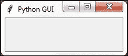

## 它是如何工作的...

在第 1 行，我们导入内置的`tkinter`模块并将其别名为`tk`以简化我们的 Python 代码。在第 2 行，我们通过调用其构造函数（`Tk`后附加的括号将类转换为实例）创建了一个`Tk`类的实例。我们使用别名`tk`，这样我们就不必使用较长的单词`tkinter`。我们将类实例分配给一个名为`win`的变量（代表窗口）。由于 Python 是一种动态类型语言，我们不需要在分配之前声明这个变量，也不需要给它指定一个特定的类型。*Python 从该语句的赋值中推断类型*。Python 是一种强类型语言，所以每个变量始终都有一个类型。我们只是不必像在其他语言中那样事先指定它的类型。这使得 Python 成为一种非常强大且高效的编程语言。

### 注意

关于类和类型的简要说明：

在 Python 中，每个变量始终都有一个类型。我们不能创建一个没有指定类型的变量。然而，在 Python 中，我们不需要事先声明类型，就像在 C 编程语言中那样。

Python 足够智能，可以推断类型。在撰写本文时，C#也具备这种能力。

使用 Python，我们可以通过 `class` 关键字而不是 `def` 关键字来创建自己的类。

为了将类分配给一个变量，我们首先需要创建我们类的实例。我们创建这个实例并将这个实例分配给我们的变量。

```py
class AClass(object):
    print('Hello from AClass')

classInstance = AClass()
```

现在变量 `classInstance` 的类型是 `AClass`。

如果这听起来很困惑，请不要担心。我们将在接下来的章节中介绍面向对象编程（OOP）。

在第 3 行，我们使用类的实例变量（`win`）通过`title`属性给我们的窗口设置标题。在第 4 行，我们通过在类实例`win`上调用`mainloop`方法来启动窗口的事件循环。到目前为止，我们的代码创建了一个实例并设置了一个属性，*但是 GUI 将不会显示，直到我们启动主事件循环*。

### 注意事项

事件循环是使我们的图形用户界面（GUI）工作的机制。我们可以将其想象为一个无限循环，其中我们的 GUI 正在等待事件被发送给它。按钮点击会在我们的 GUI 内创建一个事件，或者我们的 GUI 被调整大小也会创建一个事件。

我们可以预先编写所有的 GUI 代码，直到我们调用这个无限循环（如上面代码所示`win.mainloop()`），用户屏幕上不会显示任何内容。

事件循环在用户点击红色**X**按钮或我们编程来结束我们的 GUI 的小部件时结束。当事件循环结束时，我们的 GUI 也随之结束。

## 还有更多...

这个菜谱使用了最少的 Python 代码来创建我们的第一个 GUI 程序。然而，在这本书中，当有需要时，我们将使用面向对象编程（OOP）。

# 防止 GUI 被调整大小

## 准备工作

这个菜谱扩展了之前的版本。因此，有必要你自己将菜谱 1 输入到自己的项目中，或者从[`www.packtpub.com/support`](https://www.packtpub.com/support)下载代码。

## 如何做到这一点...

我们正在阻止 GUI 被调整大小。

```py
import tkinter as tk        # 1 imports

win = tk.Tk()               # 2 Create instance
win.title("Python GUI")     # 3 Add a title       

win.resizable(0, 0)         # 4 Disable resizing the GUI

win.mainloop()              # 5 Start GUI
```

运行代码将创建此图形用户界面：

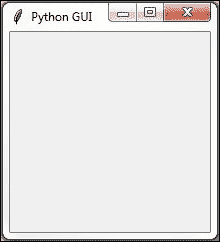

## 它是如何工作的...

第 4 行防止 Python GUI 被调整大小。

运行此代码将生成一个类似于我们在菜谱 1 中创建的 GUI。然而，用户不能再调整其大小。此外，请注意窗口工具栏中的最大化按钮已变为灰色。

为什么这很重要？因为，一旦我们在表单中添加小部件，调整大小可能会让我们的 GUI 看起来不如我们期望的好。我们将在下一章节中学习如何在 GUI 中添加小部件。

`Resizable()` 是 `Tk()` 类的一个方法，通过传入 `(0, 0)`，我们防止了 GUI 的调整大小。如果我们传入其他值，我们将硬编码 GUI 的 x 和 y 启动大小，*但这不会使其不可调整大小*。

我们还在代码中添加了注释，为这本书中包含的食谱做准备。

### 注意事项

在诸如 Visual Studio .NET 这样的可视化编程 IDE 中，C#程序员通常不会考虑阻止用户调整他们用这种语言开发的 GUI 的大小。这会导致 GUI 质量较差。添加这一行 Python 代码可以让我们的用户欣赏我们的 GUI。

# 在 GUI 表单中添加标签

## 准备工作

我们正在扩展第一个菜谱。我们将保持 GUI 可调整大小，因此不要使用第二个菜谱中的代码（或者注释掉第 4 行的`win.resizable`行）。

## 如何做到这一点...

为了将一个`标签`小部件添加到我们的图形用户界面中，我们正在从`tkinter`导入`ttk`模块。请注意这两个导入语句。

```py
# imports                  # 1
import tkinter as tk       # 2
from tkinter import ttk    # 3
```

在食谱 1 和 2 的底部找到的`win.mainloop()`上方添加以下代码。

```py
# Adding a Label           # 4
ttk.Label(win, text="A Label").grid(column=0, row=0) # 5
```

运行代码为我们的 GUI 添加一个标签：

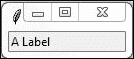

## 它是如何工作的...

在上述代码的第 3 行，我们正在从`tkinter`导入一个独立的模块。`ttk`模块包含一些高级控件，可以让我们的 GUI 看起来很棒。从某种意义上说，`ttk`是`tkinter`的一个扩展。

我们仍然需要导入`tkinter`本身，但我们必须指定我们现在还想使用来自`tkinter`的`ttk`。

### 注意事项

`ttk`代表“主题 tk”。它改善了我们的 GUI 外观和感觉。

上面的第 5 行在调用`mainloop`之前（此处未显示以节省空间。请参阅菜谱 1 或 2）将标签添加到 GUI 中。

我们将窗口实例传递给`ttk.Label`构造函数并设置文本属性。这将成为`Label`将显示的文本。

我们还在使用*网格布局管理器*，我们将在第二章*布局管理*中对其进行更深入的探讨。

注意我们的图形用户界面（GUI）突然比之前的菜谱小了很多。

它变得如此之小的原因是我们向我们的表单添加了一个小部件。没有小部件，`tkinter`会使用默认大小。添加小部件会导致优化，这通常意味着使用尽可能少的空间来显示小部件（们）。

如果我们将标签的文本变长，GUI 将会自动扩展。我们将在第二章的后续菜谱中介绍这种自动调整表单大小的功能，*布局管理*。

## 还有更多...

尝试调整并最大化这个带有标签的 GUI，看看会发生什么。

# 创建按钮并更改它们的文本属性

## 准备就绪

这个食谱扩展了之前的版本。您可以从 Packt Publishing 网站下载完整的代码。

## 如何做到这一点...

我们添加了一个按钮，点击后会执行一个动作。在这个菜谱中，我们将更新之前菜谱中添加的标签，以及更新按钮的文本属性。

```py
# Modify adding a Label                                      # 1
aLabel = ttk.Label(win, text="A Label")                      # 2
aLabel.grid(column=0, row=0)                                 # 3

# Button Click Event Callback Function                       # 4
def clickMe():                                               # 5
    action.configure(text="** I have been Clicked! **")
    aLabel.configure(foreground='red')

# Adding a Button                                            # 6
action = ttk.Button(win, text="Click Me!", command=clickMe)  # 7
action.grid(column=1, row=0)                                 # 8
```

在点击按钮之前：

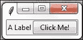

点击按钮后，标签的颜色已经改变，按钮上的文字也相应地发生了变化。行动！

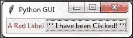

## 它是如何工作的...

在第 2 行，我们现在将标签分配给一个变量，在第 3 行我们使用这个变量在表单中定位标签。我们需要这个变量在`clickMe()`函数中更改其属性。默认情况下，这是一个模块级变量，因此只要我们在调用它的函数上方声明变量，我们就可以在函数内部访问它。

第五行是当按钮被点击时被调用的事件处理器。

在第 7 行，我们创建了按钮并将命令绑定到`clickMe()`函数。

### 注意事项

图形用户界面是事件驱动的。点击按钮会创建一个事件。我们使用`ttk.Button`小部件的命令属性，在回调函数中绑定此事件发生时会发生什么。注意我们并没有使用括号；只有名称`clickMe`。

我们还将标签的文本改为包含`红色`，就像在印刷书中一样，否则可能不明显。当你运行代码时，你可以看到颜色确实发生了变化。

第三行和第八行都使用了网格布局管理器，这将在下一章中进行讨论。这会使标签和按钮对齐。

## 还有更多...

我们将继续向我们的 GUI 添加越来越多的组件，并且我们会利用书中其他菜谱中的许多内置属性。

# 文本框小部件

在 `tkinter` 中，典型的文本框小部件被称为 `Entry`。在本教程中，我们将向我们的图形用户界面添加这样一个 `Entry`。我们将通过描述 `Entry` 为用户做了什么来使我们的标签更加有用。

## 准备就绪

此配方基于 *创建按钮并更改其文本属性* 配方。

## 如何操作...

```py
# Modified Button Click Function   # 1
def clickMe():                     # 2
    action.configure(text='Hello ' + name.get())

# Position Button in second row, second column (zero-based)
action.grid(column=1, row=1)

# Changing our Label               # 3
ttk.Label(win, text="Enter a name:").grid(column=0, row=0) # 4

# Adding a Textbox Entry widget    # 5
name = tk.StringVar()              # 6
nameEntered = ttk.Entry(win, width=12, textvariable=name) # 7
nameEntered.grid(column=0, row=1)  # 8
```

现在我们的图形用户界面看起来是这样的：

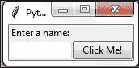

在输入一些文本并点击按钮后，GUI（图形用户界面）将发生以下变化：

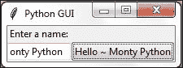

## 它是如何工作的...

在第 2 行，我们正在获取`Entry`小部件的值。我们还没有使用面向对象编程（OOP），那么我们是如何访问一个甚至还未声明的变量的值的呢？

在 Python 的过程式编程中，如果不使用面向对象（OOP）类，我们必须在尝试使用该名称的语句上方实际放置一个名称。那么这是怎么做到的（它确实做到了）？

答案是按钮点击事件是一个回调函数，当用户点击按钮时，这个函数中引用的变量是已知的并且确实存在。

生活很美好。

第 4 行给我们的标签赋予了一个更有意义的名称，因为它现在描述了其下方的文本框。我们将按钮向下移动到标签旁边，以便在视觉上关联这两个元素。我们仍然在使用网格布局管理器，这将在第二章*布局管理*中更详细地解释。

第 6 行创建了一个变量`name`。这个变量绑定到`Entry`上，在我们的`clickMe()`函数中，我们能够通过在这个变量上调用`get()`方法来检索`Entry`框的值。这就像魔法一样有效。

现在我们看到，虽然按钮显示了我们所输入的完整文本（甚至更多），但`Entry`文本框并没有扩展。这是因为我们在第 7 行将其硬编码为 12 英寸的宽度。

### 注意事项

Python 是一种动态类型语言，它从赋值中推断类型。这意味着如果我们将字符串赋值给变量 `name`，该变量将是字符串类型，如果我们将整数赋值给 `name`，这个变量的类型将是整数。

使用 tkinter 时，我们必须在成功使用之前将变量`name`声明为类型`tk.StringVar()`。原因是这样的，Tkinter 不是 Python。我们可以从 Python 中使用它，但它并不是同一种语言。

# 将焦点设置到小部件并禁用小部件

当我们的 GUI 界面正在得到很好的改进时，如果光标能在 GUI 出现时立即出现在`Entry`小部件中，将会更加方便和实用。在这里，我们将学习如何实现这一点。

## 准备就绪

这个食谱扩展了之前的食谱。

## 如何做到这一点...

Python 真的是非常出色。当 GUI 出现时，我们只需在之前创建的 `tkinter` 小部件实例上调用 `focus()` 方法，就可以将焦点设置到特定的控件上。在我们的当前 GUI 示例中，我们将 `ttk.Entry` 类实例分配给了一个名为 `nameEntered` 的变量。现在我们可以给它设置焦点。

将以下代码放置在启动主窗口事件循环的模块底部上方，就像在之前的食谱中一样。如果你遇到一些错误，请确保你将变量调用放置在代码下方，它们被声明的位置。因为我们目前还没有使用面向对象编程（OOP），所以这仍然是必要的。稍后，将不再需要这样做。

```py
nameEntered.focus()            # Place cursor into name Entry
```

在 Mac 上，你可能需要首先将焦点设置到 GUI 窗口，然后才能将焦点设置到该窗口中的`Entry`小部件。

添加这一行 Python 代码将光标置于我们的文本`Entry`框中，使文本`Entry`框获得焦点。一旦 GUI 出现，我们就可以直接在文本框中输入，而无需先点击它。

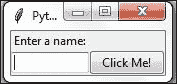

### 注意事项

注意现在光标默认位于文本`Entry`框内。

我们还可以禁用小部件。为此，我们可以在小部件上设置一个属性。我们可以通过添加以下这一行 Python 代码来使按钮不可用：

```py
action.configure(state='disabled')    # Disable the Button Widget
```

在添加上述 Python 代码行之后，点击按钮不再产生任何动作！

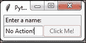

## 它是如何工作的...

这段代码是自我解释的。我们将焦点设置到一个控件上，并禁用另一个小部件。在编程语言中良好的命名有助于消除冗长的解释。本书后面将会有一些关于如何在工作中编程或在家中练习编程技能时如何做到这一点的进阶技巧。

## 还有更多...

是的。这仅仅是第一章。还有更多内容即将到来。

# 组合框小部件

在这个菜谱中，我们将通过添加具有初始默认值的下拉组合框来改进我们的 GUI。虽然我们可以限制用户只能选择某些选项，但同时，我们也可以允许用户输入他们想要的任何内容。

## 准备就绪

这个菜谱扩展了之前的菜谱。

## 如何做到这一点...

我们正在使用网格布局管理器在`Entry`小部件和`Button`之间插入另一列。以下是 Python 代码。

```py
ttk.Label(win, text="Choose a number:").grid(column=1, row=0)  # 1
number = tk.StringVar()                         # 2
numberChosen = ttk.Combobox(win, width=12, textvariable=number) #3
numberChosen['values'] = (1, 2, 4, 42, 100)     # 4
numberChosen.grid(column=1, row=1)              # 5
numberChosen.current(0)                         # 6
```

这段代码，当添加到之前的菜谱中时，会创建以下 GUI。注意，在前面的代码的第 4 行中，我们给组合框分配了一个带有默认值的元组。这些值随后会出现在下拉框中。我们也可以根据需要更改它们（在应用程序运行时输入不同的值）。

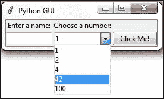

## 它是如何工作的...

第一行添加第二个标签以匹配新创建的组合框（在第三行创建）。第二行将框的值赋给一个特殊的 `tkinter` 类型变量（`StringVar`），正如我们在之前的菜谱中所做的那样。

第 5 行将两个新的控件（标签和组合框）在我们的前一个 GUI 布局中进行对齐，第 6 行分配了一个默认值，当 GUI 首次可见时将显示此值。这是`numberChosen['values']`元组的第一个值，字符串`"1"`。我们在第 4 行没有给整数的元组加上引号，但它们因为，在第 2 行中，我们声明了值的数据类型为`tk.StringVar`，而被转换成了字符串。

截图显示了用户所做的选择（**42**）。此值被分配给`number`变量。

## 还有更多...

如果我们想要限制用户只能选择我们编程到`Combobox`中的值，我们可以通过将*状态属性*传递给构造函数来实现。将前一段代码的第 3 行修改为：

```py
numberChosen = ttk.Combobox(win, width=12, textvariable=number, state='readonly')
```

现在用户不能再将值输入到`Combobox`中。我们可以在我们的按钮点击事件回调函数中添加以下代码行来显示用户选择的价值：

```py
# Modified Button Click Callback Function
def clickMe():
    action.configure(text='Hello ' + name.get()+ ' ' + numberChosen.get())
```

在选择一个数字、输入一个名称然后点击按钮后，我们得到以下 GUI 结果，现在它也显示了所选的数字：

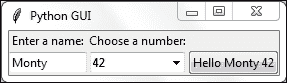

# 创建具有不同初始状态的复选框

在这个示例中，我们将添加三个`Checkbutton`小部件，每个小部件的初始状态都不同。

## 准备就绪

这个菜谱扩展了之前的菜谱。

## 如何做到这一点...

我们创建了三个状态不同的`Checkbutton`小部件。第一个是禁用的，并且里面有一个勾选标记。由于小部件处于禁用状态，用户无法移除这个勾选标记。

第二个 `Checkbutton` 被启用，并且默认情况下其中没有勾选标记，但用户可以点击它来添加勾选标记。

第三个`Checkbutton`默认既启用又选中。用户可以根据自己的喜好频繁地取消选中并重新选中该控件。

```py
# Creating three checkbuttons    # 1
chVarDis = tk.IntVar()           # 2
check1 = tk.Checkbutton(win, text="Disabled", variable=chVarDis, state='disabled')                     # 3
check1.select()                  # 4
check1.grid(column=0, row=4, sticky=tk.W) # 5

chVarUn = tk.IntVar()            # 6
check2 = tk.Checkbutton(win, text="UnChecked", variable=chVarUn)
check2.deselect()                # 8
check2.grid(column=1, row=4, sticky=tk.W) # 9                  

chVarEn = tk.IntVar()            # 10
check3 = tk.Checkbutton(win, text="Enabled", variable=chVarEn)
check3.select()                  # 12
check3.grid(column=2, row=4, sticky=tk.W) # 13
```

运行新代码将产生以下图形用户界面：

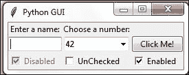

## 它是如何工作的...

在第 2 行、第 6 行和第 10 行，我们创建了三个类型为`IntVar`的变量。在下一行，对于这些变量中的每一个，我们创建了一个`Checkbutton`，并将这些变量传递进去。它们将保存`Checkbutton`的状态（未选中或选中）。默认情况下，这要么是 0（未选中），要么是 1（选中），因此变量的类型是`tkinter`整数。

我们将这些`Checkbutton`小部件放置在我们的主窗口中，因此构造函数传入的第一个参数是部件的父级；在我们的例子中是`win`。我们通过每个`Checkbutton`的`text`属性为其分配不同的标签。

将网格的粘性属性设置为 `tk.W` 意味着小部件将被对齐到网格的西部。这与 Java 语法非常相似，意味着它将被对齐到左侧。当我们调整我们的 GUI 大小时，小部件将保持在左侧，而不会移动到 GUI 的中心。

第四行和第十二行通过在这两个`Checkbutton`类实例上调用`select()`方法，在`Checkbutton`小部件中放置一个勾选标记。

我们继续使用网格布局管理器来排列我们的小部件，这将在第二章*布局管理*中更详细地解释。

# 使用单选按钮小部件

在这个菜谱中，我们将创建三个 `tkinter Radiobutton` 小部件。我们还将添加一些代码，根据选中的哪个 `Radiobutton` 来改变主表单的颜色。

## 准备就绪

这个菜谱扩展了之前的菜谱。

## 如何做到这一点...

我们正在将以下代码添加到之前的食谱中：

```py
# Radiobutton Globals   # 1
COLOR1 = "Blue"         # 2
COLOR2 = "Gold"         # 3
COLOR3 = "Red"          # 4

# Radiobutton Callback  # 5
def radCall():          # 6
   radSel=radVar.get()
   if   radSel == 1: win.configure(background=COLOR1)
   elif radSel == 2: win.configure(background=COLOR2)
   elif radSel == 3: win.configure(background=COLOR3)

# create three Radiobuttons   # 7
radVar = tk.IntVar()          # 8
rad1 = tk.Radiobutton(win, text=COLOR1, variable=radVar, value=1,               command=radCall)              # 9
rad1.grid(column=0, row=5, sticky=tk.W)  # 10

rad2 = tk.Radiobutton(win, text=COLOR2, variable=radVar, value=2, command=radCall)                             # 11
rad2.grid(column=1, row=5, sticky=tk.W)  # 12

rad3 = tk.Radiobutton(win, text=COLOR3, variable=radVar, value=3, command=radCall)                             # 13
rad3.grid(column=2, row=5, sticky=tk.W)  # 14
```

运行此代码并选择名为**黄金**的`单选按钮`将创建以下窗口：

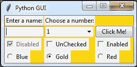

## 它是如何工作的...

在第 2-4 行中，我们创建了一些模块级别的全局变量，这些变量将在创建每个单选按钮以及创建更改主表单背景颜色的动作的回调函数（使用实例变量`win`）中使用。

我们使用全局变量来简化代码的修改。通过将颜色的名称分配给一个变量并在多个地方使用这个变量，我们可以轻松地尝试不同的颜色。而不是进行全局的硬编码字符串搜索和替换（这容易出错），我们只需更改一行代码，其他所有内容都会正常工作。这被称为**DRY 原则**，即**不要重复自己**。这是我们将在本书后面的食谱中使用的面向对象编程（OOP）概念。

### 注意事项

我们分配给变量（`COLOR1`, `COLOR2 ...`）的颜色名称是 `tkinter` 关键字（技术上，它们是 *符号名称*）。如果我们使用不是 `tkinter` 颜色关键字的名称，那么代码将无法工作。

第 6 行是*回调函数*，根据用户的选项改变我们的主表单（`win`）的背景。

在第 8 行，我们创建了一个`tk.IntVar`变量。这个变量的重要之处在于我们只创建了一个变量，将被三个单选按钮共同使用。从上面的截图可以看出，无论我们选择哪个`Radiobutton`，其他所有选项都会自动为我们取消选中。

第 9 至 14 行创建了三个单选按钮，将它们分配给主表单，并将用于回调函数中创建更改主窗口背景动作的变量传入。

### 注意事项

虽然这是第一个改变小部件颜色的配方，但坦白说，它看起来有点丑陋。本书中接下来的大部分配方都解释了如何让我们的图形用户界面真正令人惊叹。

## 还有更多...

这里是您可以在官方 tcl 手册页面查找的可用符号颜色名称的小样本：

[`www.tcl.tk/man/tcl8.5/TkCmd/colors.htm`](http://www.tcl.tk/man/tcl8.5/TkCmd/colors.htm)

| 姓名 | 红色 | 绿色 | 蓝色 |
| --- | --- | --- | --- |
| 爱丽丝蓝 | 240 | 248 | 255 |
| 雅典蓝 | 240 | 248 | 255 |
| 蓝色 | 0 | 0 | 255 |
| 金色 | 255 | 215 | 0 |
| 红色 | 255 | 0 | 0 |

一些名称创建相同的颜色，所以 `alice blue` 与 `AliceBlue` 创建相同的颜色。在这个配方中我们使用了符号名称 `Blue`、`Gold` 和 `Red`。

# 使用滚动文本小部件

`ScrolledText`小部件比简单的`Entry`小部件大得多，并且跨越多行。它们类似于记事本这样的小部件，会自动换行，当文本超过`ScrolledText`小部件的高度时，会自动启用垂直滚动条。

## 准备就绪

这个菜谱扩展了之前的菜谱。您可以从 Packt Publishing 网站下载本书每一章的代码。

## 如何做到这一点...

通过添加以下代码行，我们创建一个`ScrolledText`小部件：

```py
# Add this import to the top of the Python Module    # 1
from tkinter import scrolledtext      # 2

# Using a scrolled Text control       # 3
scrolW  = 30                          # 4
scrolH  =  3                          # 5
scr = scrolledtext.ScrolledText(win, width=scrolW, height=scrolH, wrap=tk.WORD)                         # 6
scr.grid(column=0, columnspan=3)      # 7
```

我们实际上可以在我们的小部件中输入文字，如果我们输入足够的单词，行就会自动换行！

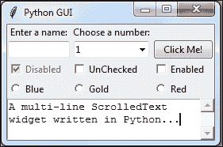

一旦我们输入的单词数量超过了小部件能够显示的高度，垂直滚动条就会被启用。这一切都是现成的，无需我们再编写任何代码来实现这一功能。

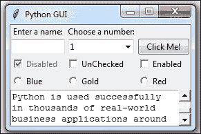

## 它是如何工作的...

在第 2 行，我们正在导入包含`ScrolledText`小部件类的模块。将其添加到模块顶部，位于其他两个`import`语句之下。

第 4 行和第 5 行定义了我们即将创建的`ScrolledText`小部件的宽度和高度。这些是硬编码的值，我们在第 6 行的`ScrolledText`小部件构造函数中传递了这些值。

这些值是经过实验发现的*魔法数字*，效果良好。你可以通过将`srcolW`从 30 改为 50 进行实验，观察其效果！

在第 6 行，我们通过传递`wrap=tk.WORD`来在部件上设置一个属性。

通过将`wrap`属性设置为`tk.WORD`，我们告诉`ScrolledText`小部件按单词断行，这样我们就不需要在单词内部换行。默认选项是`tk.CHAR`，它会无论我们是否在单词中间都进行换行。

第二张截图显示，垂直滚动条向下移动了，因为我们正在阅读一段较长的文本，而这段文本并没有完全适合我们创建的`SrolledText`控件在 x, y 维度内。

将网格小部件的`columnspan`属性设置为`3`，以便`SrolledText`小部件跨越所有三列。如果我们没有设置此属性，我们的`SrolledText`小部件将仅位于第一列，这并不是我们想要的。

# 在循环中添加几个小部件

到目前为止，我们通过基本复制粘贴相同的代码并修改变体（例如，列数）的方式创建了几个相同类型的组件（例如，`Radiobutton`）。在这个菜谱中，我们开始重构我们的代码，使其更加简洁。

## 准备就绪

我们正在重构之前食谱代码的一些部分，因此你需要这段代码来应用到这个食谱中。

## 如何做到这一点...

```py
# First, we change our Radiobutton global variables into a list.
colors = ["Blue", "Gold", "Red"]              # 1

# create three Radiobuttons using one variable
radVar = tk.IntVar()

Next we are selecting a non-existing index value for radVar.
radVar.set(99)                                # 2

Now we are creating all three Radiobutton widgets within one loop.

for col in range(3):                          # 3
    curRad = 'rad' + str(col)  
    curRad = tk.Radiobutton(win, text=colors[col], variable=radVar,     value=col, command=radCall)
    curRad.grid(column=col, row=5, sticky=tk.W)

We have also changed the callback function to be zero-based, using the list instead of module-level global variables. 

# Radiobutton callback function                # 4
def radCall():
   radSel=radVar.get()
   if   radSel == 0: win.configure(background=colors[0])
   elif radSel == 1: win.configure(background=colors[1])
   elif radSel == 2: win.configure(background=colors[2])
```

运行此代码将创建与之前相同的窗口，但我们的代码更加简洁且易于维护。这将在我们后续的 GUI 扩展中有所帮助。

## 它是如何工作的...

在第一行，我们将全局变量转换成了一个列表。

在第 2 行，我们为名为`radVar`的`tk.IntVar`变量设置了一个默认值。这很重要，因为在之前的菜谱中，我们为`Radiobutton`小部件设置了从 1 开始的值，而在我们新的循环中，使用 Python 的基于 0 的索引方式要方便得多。如果我们没有将默认值设置为我们`Radiobutton`小部件的范围之外的值，当 GUI 出现时，其中一个单选按钮会被选中。虽然这本身可能不是那么糟糕，*但它不会触发回调函数*，我们最终会选中一个不执行其工作（即改变主窗口表单的颜色）的单选按钮。

在第 3 行，我们将之前硬编码的三个 Radiobutton 小部件的创建替换为一个循环，它执行相同的操作。这仅仅更加简洁（代码行数更少）且易于维护。例如，如果我们想要创建 100 个而不是仅仅 3 个 Radiobutton 小部件，我们只需更改 Python 范围运算符内的数字即可。我们不需要输入或复制粘贴 97 段重复的代码，只需一个数字。

第 4 行显示了修改后的回调函数，它在物理上位于前面的行之上。我们将它放置在下方，以强调这个菜谱中更重要的部分。

## 还有更多...

本食谱总结了本书的第一章。所有接下来的章节中的食谱都将基于我们迄今为止构建的 GUI 进行构建，极大地增强它。
