# 第四章 数据和类

在本章中，我们将使用 Python 3 中的数据和面向对象类：

+   如何使用 StringVar()

+   如何从小部件获取数据

+   使用模块级全局变量

+   如何在课堂上编码来提升图形用户界面（GUI）

+   编写回调函数

+   创建可重用 GUI 组件

# 简介

在本章中，我们将把我们的 GUI 数据保存到 tkinter 变量中。

我们还将开始使用**面向对象编程**（**OOP**）来扩展现有的 tkinter 类，以便扩展 tkinter 的内置功能。这将引导我们创建可重用的 OOP 组件。

# 如何使用 StringVar()

tkinter 中内置了一些编程类型，这些类型与我们习惯的 Python 类型略有不同。StringVar() 就是这些 tkinter 类型之一。

本食谱将向您展示如何使用 StringVar() 类型。

## 准备就绪

我们正在学习如何将 tkinter GUI 中的数据保存到变量中，以便我们可以使用这些数据。我们可以设置和获取它们的值，这与 Java 的 getter/setter 方法非常相似。

这里是 tkinter 中可用的一些编码类型：

| `strVar = StringVar()` | # 存储一个字符串；默认值是一个空字符串 "" |
| --- | --- |
| `intVar = IntVar()` | # 存储一个整数；默认值是 0 |
| `dbVar = DoubleVar()` | # 存储一个浮点数；默认值是 0.0 |
| `blVar = BooleanVar()` | # 存储布尔值，它返回 0 表示假，1 表示真 |

### 注意事项

不同的语言用小数点、浮点数或双精度数来表示数字。Tkinter 将 Python 中的浮点数据类型称为 DoubleVar。根据精度的不同，浮点数和双精度数可能会有所不同。在这里，我们将 tkinter 的 DoubleVar 转换为 Python 转换为 Python 浮点类型的结果。

## 如何做到这一点...

我们正在创建一个新的 Python 模块，以下截图展示了代码和生成的输出：

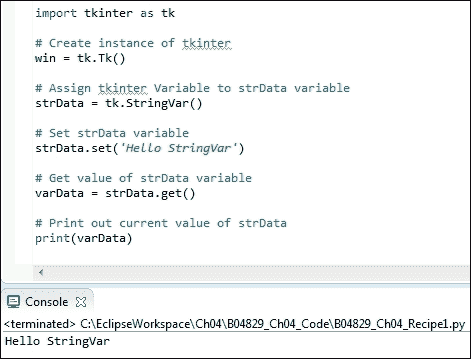

首先，我们导入 tkinter 模块并将其别名设置为`tk`。

接下来，我们通过在`Tk`后添加括号来使用这个别名创建`Tk`类的一个实例，这会调用类的构造函数。这与调用函数的机制相同，只是在这里我们是在创建一个类的实例。

通常我们使用这个分配给变量`win`的实例来在代码的后面启动主事件循环。但在这里，我们不是显示一个 GUI，而是在演示如何使用 tkinter 的 StringVar 类型。

### 注意事项

我们仍然需要创建一个`Tk()`实例。如果我们取消注释这一行，我们将从 tkinter 获得错误，因此这个调用是必要的。

然后我们创建一个 `tkinter StringVar` 类型的实例，并将其分配给我们的 Python `strData` 变量。

之后，我们使用我们的变量来调用 StringVar 的`set()`方法，在将其设置为某个值之后，我们获取这个值并将其保存在一个名为`varData`的新变量中，然后打印出它的值。

在 Eclipse PyDev 控制台中，截图的底部我们可以看到打印到控制台的信息，即 **Hello StringVar**。

接下来，我们将打印 tkinter 的 IntVar、DoubleVar 和 BooleanVar 类型的默认值。

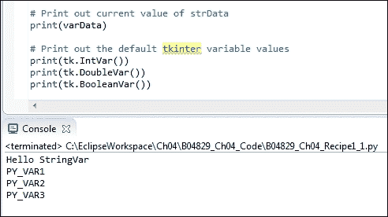

## 它是如何工作的...

如前一张截图所示，默认值并没有像我们预期的那样被打印出来。

在在线文献中提到了默认值，但我们在调用它们的`get`方法之前不会看到这些值。否则，我们只会得到一个自动递增的变量名（例如 PY_VAR3，如前一张截图所示）。

将 tkinter 类型分配给 Python 变量并不会改变结果。我们仍然没有得到默认值。

在这里，我们专注于最简单的代码（它创建 PY_VAR0）：

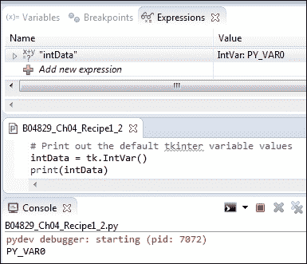

值为 PY_VAR0，而不是预期的 0，直到我们调用 `get` 方法。现在我们可以看到默认值。我们没有调用 `set`，因此当我们对每个类型调用 `get` 方法时，我们看到默认值被自动分配给每个 tkinter 类型。

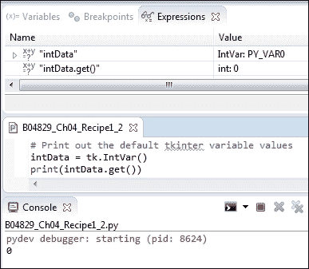

注意默认值 0 是如何打印到控制台上的，这是我们保存在`intData`变量中的`IntVar`实例。我们还可以在截图顶部的 Eclipse PyDev 调试器窗口中看到这些值。

# 如何从小部件获取数据

当用户输入数据时，我们希望在代码中对它进行处理。本菜谱展示了如何将数据捕获到变量中。在前一个菜谱中，我们创建了几个 tkinter 类变量。它们是独立的。现在，我们正在将它们连接到我们的 GUI，使用从 GUI 获取的数据并将其存储在 Python 变量中。

## 准备就绪

我们正在继续使用我们在上一章中构建的 Python 图形用户界面。

## 如何做到这一点...

我们将 GUI 中的值赋给一个 Python 变量。

在我们模块的底部添加以下代码，位于主事件循环之上：

```py
strData = spin.get()
print("Spinbox value: " + strData)

# Place cursor into name Entry
nameEntered.focus()      
#======================
# Start GUI
#======================
win.mainloop()
```

运行代码得到以下结果：

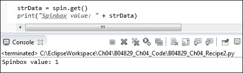

我们正在检索`Spinbox`控件当前值。

### 注意事项

我们将代码放置在 GUI 主事件循环之上，因此打印操作发生在 GUI 可见之前。如果我们想在显示 GUI 并更改`Spinbox`控件值之后打印当前值，我们就必须将代码放在回调函数中。

我们使用以下代码创建了我们的 Spinbox 小部件，并将可用的值硬编码到其中：

```py
# Adding a Spinbox widget using a set of values
spin = Spinbox(monty, values=(1, 2, 4, 42, 100), width=5, bd=8, command=_spin) 
spin.grid(column=0, row=2)
```

我们也可以将数据的硬编码从`Spinbox`类实例的创建中移除，并在之后设置它。

```py
# Adding a Spinbox widget assigning values after creation
spin = Spinbox(monty, width=5, bd=8, command=_spin) 
spin['values'] = (1, 2, 4, 42, 100)
spin.grid(column=0, row=2)
```

我们创建小部件并插入数据的方式并不重要，因为我们可以通过在部件实例上使用`get()`方法来访问这些数据。

## 它是如何工作的...

为了从使用 tkinter 编写的 GUI 中获取值，我们使用 tkinter 的 `get()` 方法在我们要获取值的控件实例上。

在上述示例中我们使用了 Spinbox 控件，但对于所有具有 `get()` 方法的控件，其原理都是相同的。

一旦我们获取了数据，我们就进入了纯 Python 的世界，tkinter 确实为我们构建 GUI 提供了帮助。现在我们知道了如何从 GUI 中获取数据，我们可以使用这些数据。

# 使用模块级全局变量

封装是任何编程语言的主要优势之一，它使我们能够使用面向对象编程（OOP）进行编程。Python 既是面向对象又是过程式的。我们可以创建全局变量，这些变量仅限于它们所在的模块。它们仅对这个模块是全局的，这是封装的一种形式。我们为什么想要这样做呢？因为，随着我们向我们的图形用户界面（GUI）添加越来越多的功能，我们希望避免命名冲突，这可能导致代码中的错误。

### 注意事项

我们不希望命名冲突在我们的代码中产生错误！命名空间是避免这些错误的一种方法，在 Python 中，我们可以通过使用 Python 模块（这些是非官方的命名空间）来实现这一点。

## 准备就绪

我们可以在任何模块中声明模块级别的全局变量，只需在函数之上和之外即可。

我们随后必须使用 Python 的 `global` 关键字来引用它们。如果我们忘记在函数中使用 `global`，我们将会意外地创建新的局部变量。这将是一个错误，是我们真的不希望做的事情。

### 注意事项

Python 是一种动态、强类型语言。我们只有在运行时才会注意到这类错误（忘记使用全局关键字来作用域变量）。

## 如何做到这一点...

将第 15 行显示的代码添加到我们在上一道菜谱和上一章中使用的 GUI 中，这将创建一个模块级别的全局变量。我们使用 C 风格的全部大写约定，这并不真正是“Pythonic”，但我认为这确实强调了我们在本菜谱中要处理的原则。

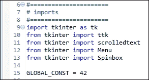

运行代码会在全局变量上打印输出。注意**42**被打印到了 Eclipse 控制台。

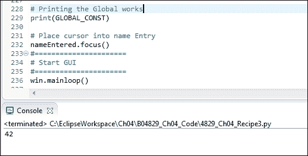

## 它是如何工作的...

我们在模块顶部定义一个全局变量，随后在模块底部，我们打印出它的值。

那是有效的。

将此函数添加到我们模块的底部：

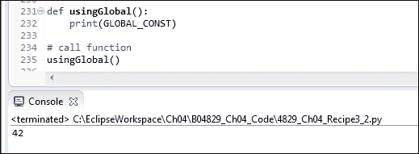

如上所述，我们正在使用模块级别的全局变量。由于在下面的截图中所展示的，通过覆盖`global`变量很容易犯错：

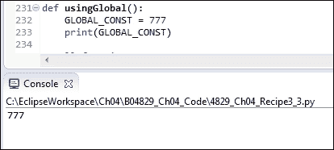

注意如何`42`变成了`777`，尽管我们使用了相同的变量名。

### 注意事项

Python 中没有编译器会警告我们在局部函数中覆盖全局变量。这可能导致在运行时调试出现困难。

使用全局限定符（第 234 行）将打印出我们最初分配给它的值（42），如下面的截图所示：

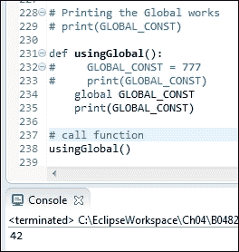

但是，请注意。当我们取消对局部全局变量的注释时，我们打印出的是局部变量的值，而不是全局变量的值：

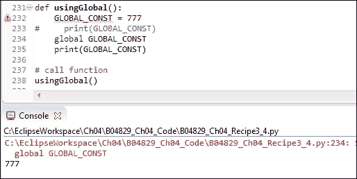

尽管我们使用了`global`限定符，但局部变量似乎覆盖了它。我们从 Eclipse PyDev 插件那里收到了警告，指出我们的`GLOBAL_CONST = 777`没有被使用，然而运行代码仍然打印出 777 而不是预期的 42。

这可能不是我们预期的行为。使用`global`限定符，我们可能期望我们正在指向之前创建的全局变量。

相反，似乎 Python 在局部函数中创建了一个新的全局变量，并覆盖了我们之前创建的那个。

全局变量在编写小型应用程序时非常有用。它们可以帮助在同一个 Python 模块内的方法和函数之间共享数据，有时面向对象的额外开销也是不必要的。

随着我们的程序复杂性增加，从使用全局变量中获得的益处可能会迅速减少。

### 注意事项

最好避免使用全局变量，并通过在不同作用域中使用相同的名称意外地覆盖变量。我们可以使用面向对象编程（OOP）来代替使用全局变量。

我们在过程式代码中玩弄全局变量，并了解到这可能导致难以调试的错误。在下一章中，我们将转向面向对象编程（OOP），这可以消除这类错误。

# 如何在课堂上编码来提升图形用户界面（GUI）

到目前为止，我们一直在使用过程式编程风格。这是一种快速的 Python 脚本方法。一旦我们的代码变得越来越大，我们就需要进阶到面向对象编程（OOP）的编程方式。

为什么？

因为，在众多其他好处中，面向对象编程（OOP）允许我们通过使用方法来移动代码。一旦我们使用了类，就不再需要物理地将代码放置在调用它的代码之上。这使我们能够极大地提高代码组织的灵活性。

我们可以将相关代码写在其他代码旁边，再也不必担心代码无法运行，因为代码不再位于调用它的代码之上。

我们可以通过编写模块来达到一些相当复杂的极端情况，这些模块引用的方法不是在该模块内创建的。它们依赖于在代码运行期间，运行时状态已经创建了这些方法。

### 注意事项

如果我们称之为的方法在那个时间点尚未被创建，我们将得到一个运行时错误。

## 准备就绪

我们将非常简单地把我们所有的过程性代码转换为面向对象编程（OOP）。我们只需将其转换为一个类，缩进所有现有代码，并将`self`前缀添加到所有变量之前。

这非常简单。

虽然一开始可能觉得在每样东西前都加上`self`关键字有点烦人，使得我们的代码更加冗长（嘿，我们浪费了这么多纸张……）；但最终，这将是值得的。

## 如何做到这一点...

在一开始，一切似乎都陷入了混乱，但我们很快就会解决这个问题表面的混乱。

注意，在 Eclipse 中，PyDev 编辑器通过在代码编辑器的右侧部分用红色突出显示来提示编码问题。

也许我们最终不应该使用面向对象编程（OOP）来编码，但这是我们正在做的事情，而且有非常好的理由。

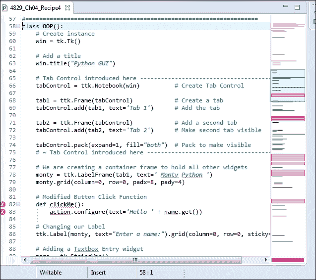

我们只需在所有变量前加上`self`关键字，并且通过使用`self`将函数绑定到类上，这样在官方和技术上正式地将函数转换为方法。

### 注意

函数和方法之间有区别。Python 将这一点阐述得非常清晰。方法绑定到类上，而函数则不是。我们甚至可以在同一个 Python 模块中混合使用这两种。

让我们给所有内容都加上`self`前缀，以消除红色提示，这样我们就可以再次运行我们的代码了。

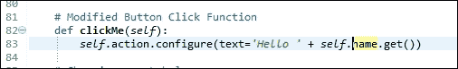

一旦我们处理完所有用红色突出显示的错误，我们就可以再次运行我们的 Python 代码。

`clickMe` 函数现在已绑定到类中，并正式成为了一个方法。

很不幸，从过程式编程开始然后转换为面向对象编程并不像我上面所说的那么简单。代码变得一团糟。这正是开始用 Python 使用面向对象范式编程的一个很好的理由。

### 注意事项

Python 擅长以简单的方式完成任务。简单的代码往往变得更为复杂（因为一开始它就是简单的）。一旦我们变得过于复杂，将我们的过程性代码重构为真正意义上的面向对象代码就会随着每一行代码的增加而变得更加困难。

我们正在将我们的过程式代码转换为面向对象的代码。看看我们给自己带来的所有麻烦，仅仅将 200 多行 Python 代码转换为面向对象（OOP）可能意味着我们最好从一开始就使用面向对象编程。

我们实际上破坏了一些之前正常工作的功能。使用 Tab 2 并点击单选按钮不再起作用。我们不得不进行更多的重构。

程序代码在某种程度上是简单的，因为它只是从上到下的编码。现在我们将代码放入了一个类中，我们必须将所有回调函数移动到方法中。这可行，但确实需要一些工作来转换我们的原始代码。

我们的程序代码看起来是这样的：

```py
# Button Click Function
def clickMe():
    action.configure(text='Hello ' + name.get())

# Changing our Label
ttk.Label(monty, text="Enter a name:").grid(column=0, row=0, sticky='W')

# Adding a Textbox Entry widget
name = tk.StringVar()
nameEntered = ttk.Entry(monty, width=12, textvariable=name)
nameEntered.grid(column=0, row=1, sticky='W')

# Adding a Button
action = ttk.Button(monty, text="Click Me!", command=clickMe)
action.grid(column=2, row=1)

The new OOP code looks like this:
class OOP():
    def __init__(self): 
        # Create instance
        self.win = tk.Tk()   

        # Add a title       
        self.win.title("Python GUI")      
        self.createWidgets()

    # Button callback
    def clickMe(self):
        self.action.configure(text='Hello ' + self.name.get())

    # … more callback methods 

    def createWidgets(self):    
        # Tab Control introduced here -----------------------
        tabControl = ttk.Notebook(self.win)     # Create Tab Control

        tab1 = ttk.Frame(tabControl)            # Create a tab 
        tabControl.add(tab1, text='Tab 1')      # Add the tab

        tab2 = ttk.Frame(tabControl)            # Create second tab
        tabControl.add(tab2, text='Tab 2')      # Add second tab 

        tabControl.pack(expand=1, fill="both")  # Pack make visible
#======================
# Start GUI
#======================
oop = OOP()
oop.win.mainloop()
```

我们将回调方法移动到了模块的顶部，在新的面向对象类内部。我们将所有的小部件创建代码合并到一个相对较长的函数中，我们称这个函数为类的初始化器中调用的函数。

技术上讲，在底层代码的深处，Python 确实有一个构造函数，然而 Python 让我们免于对此有任何担忧。它已经由系统为我们处理好了。

相反，除了一个“真实”的构造函数外，Python 还为我们提供了一个初始化器。

我们强烈建议使用这个初始化器。我们可以用它向我们的类传递参数，初始化我们希望在类实例内部使用的变量。

### 注意事项

在 Python 中，同一个 Python 模块中可以存在多个类。

与 Java 不同，Java 有一个非常严格的命名规范（没有这个规范就无法工作），而 Python 则要灵活得多。

### 注意事项

我们可以在同一个 Python 模块中创建多个类。与 Java 不同，我们不需要依赖一个必须与每个类名匹配的文件名。

Python 真的太棒了！

当我们的 Python 图形用户界面变得庞大时，我们将把一些类拆分到它们自己的模块中，但与 Java 不同，我们不必这样做。在这本书和项目中，我们将保持一些类在同一个模块中，同时，我们还将把一些其他类拆分到它们自己的模块中，并将它们导入可以被认为是 main() 函数的部分（这虽然不是 C 语言，但我们可以以 C 语言的方式去思考，因为 Python 非常灵活）。

我们目前所取得的成就是将`ToolTip`类添加到我们的 Python 模块中，并将我们的过程式 Python 代码重构为面向对象（OOP）的 Python 代码。

在这个菜谱中，我们可以看到多个类可以存在于同一个 Python 模块中。

确实很酷！

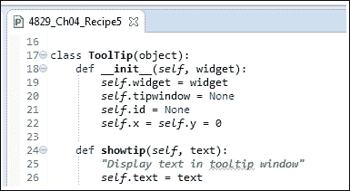

`ToolTip` 类和 `OOP` 类都位于同一个 Python 模块中。

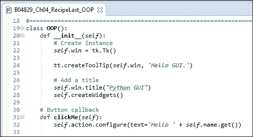

## 它是如何工作的...

在这个菜谱中，我们将我们的过程式代码提升到了面向对象编程（OOP）代码。

Python 使我们能够以类似于 C 编程语言的实际、过程式风格编写代码。

同时，我们也有选择以面向对象（OOP）风格进行编码的选项，例如 Java、C# 和 C++。

# 编写回调函数

最初，回调函数可能会显得有些令人畏惧。你调用函数，传递给它一些参数，然后这个函数告诉你它真的很忙，它将会回过头来调用你！

你会想：“这个功能**会**再联系我吗？”“我需要**等**多久？”

在 Python 中，即使是回调函数也容易使用，是的，它们通常确实会回调你。

他们只需首先完成分配给他们的任务（嘿，毕竟是你最初为他们编写代码的……）。

让我们更深入地了解一下，当我们把回调函数编码到我们的图形用户界面(GUI)中时会发生什么。

我们的图形用户界面是事件驱动的。创建并显示在屏幕上后，它通常就坐在那里等待事件发生。它基本上是在等待事件被发送给它。我们可以通过点击其操作按钮之一来向我们的 GUI 发送事件。

这创建了一个事件，从某种意义上说，我们通过发送消息“调用”了我们的 GUI。

现在，在我们向 GUI 发送消息后，应该发生什么情况？

点击按钮后会发生什么取决于我们是否创建了一个事件处理器并将其与该按钮关联。如果我们没有创建事件处理器，点击按钮将没有任何效果。

事件处理器是一个回调函数（或者，如果我们使用类，是方法）。

回调方法也像我们的 GUI 一样，在那里被动地等待被调用。

一旦我们的 GUI 按钮被点击，它将调用回调函数。

回调函数通常会进行一些处理，完成后将结果返回到我们的图形用户界面(GUI)。

### 注意事项

在某种意义上，我们可以看到我们的回调函数正在回调到我们的 GUI。

## 准备就绪

Python 解释器会遍历项目中的所有代码一次，查找任何语法错误并指出它们。如果你没有正确使用语法，就无法运行你的 Python 代码。这包括缩进（即使不会导致语法错误，错误的缩进通常也会导致错误）。

在下一轮解析中，解释器将解析我们的代码并运行它。

在运行时，可以生成许多 GUI 事件，通常是通过回调函数来为 GUI 小部件添加功能。

## 如何做到这一点...

这里是 Spinbox 小部件的回调函数：

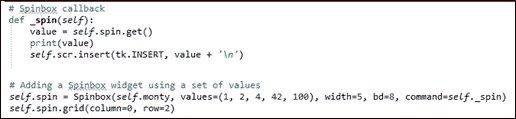

## 它是如何工作的...

我们在`OOP`类中创建了一个回调方法，当我们在 Spinbox 小部件中选择一个值时会被调用，因为我们通过`command`参数（`command=self._spin`）将方法绑定到小部件。我们使用前导下划线来暗示这个方法应该像私有 Java 方法一样受到尊重。

Python 故意避免了诸如私有、公有、友元等语言限制。

在 Python 中，我们使用命名约定。期望关键字周围的前导和尾随双下划线仅限于 Python 语言，我们不应在我们的 Python 代码中使用它们。

然而，我们可以使用一个前置下划线前缀来命名变量或函数，以提供提示，表明这个名称应该被视为一个私有辅助者。

同时，如果我们希望使用否则会是 Python 内置名称的变量，我们可以给其后缀一个单下划线。例如，如果我们想缩写列表的长度，我们可以这样做：

```py
len_ = len(aList)
```

通常，下划线难以阅读且容易忽略，因此在实践中这可能不是最好的主意。

# 创建可重用的 GUI 组件

我们正在使用 Python 创建可重用的 GUI 组件。

在这个示例中，我们将通过将我们的 `ToolTip` 类移动到它自己的模块中来保持简单。接下来，我们将导入并使用它来在我们的 GUI 的几个小部件上显示工具提示。

## 准备工作

我们正在基于之前的代码进行构建。

## 如何做到这一点...

我们将首先将我们的`ToolTip`类拆分到一个独立的 Python 模块中。我们将对其进行轻微增强，以便在鼠标悬停在控件上时，能够传入我们希望显示的控件小部件和提示文本。

我们创建一个新的 Python 模块，并将`ToolTip`类的代码放入其中，然后将其导入到我们的主模块中。

我们随后通过创建多个工具提示来重用导入的`ToolTip`类，这些工具提示会在鼠标悬停在我们的 GUI 小部件上时显示。

将我们常用的 `ToolTip` 类代码重构到一个独立的模块中，有助于我们从其他模块中复用这段代码。我们不再使用复制/粘贴/修改的方式，而是遵循 DRY 原则，将公共代码放置在唯一的位置，因此当我们修改代码时，所有导入它的模块将自动获取模块的最新版本。

### 注意事项

DRY 代表“不要重复自己”，我们将在后面的章节中再次探讨它。

我们可以通过将 Tab3 图像转换成一个可重复使用的组件来做类似的事情。

为了使这个菜谱的代码简单，我们移除了 Tab 3，但你可以在前一章的代码上进行实验。

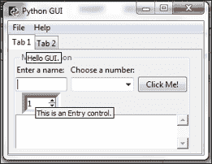

```py

# Add a Tooltip to the Spinbox
tt.createToolTip(self.spin, 'This is a Spin control.')

# Add Tooltips to more widgets
tt.createToolTip(nameEntered, 'This is an Entry control.')
tt.createToolTip(self.action, 'This is a Button control.')
tt.createToolTip(self.scr, 'This is a ScrolledText control.')
```

这也适用于第二个标签页。

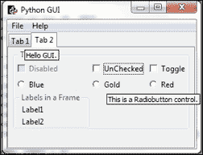

新的代码结构现在看起来是这样的：

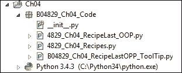

导入语句看起来是这样的：

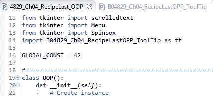

并且拆分出来（即重构）的代码在单独的模块中看起来是这样的：

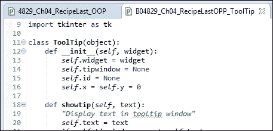

## 它是如何工作的...

在前面的截图里，我们可以看到几个提示信息正在显示。对于主窗口的提示信息可能显得有些烦人，因此最好不为主窗口显示提示信息，因为我们真的希望突出各个小部件的功能。主窗口的表单有一个标题来解释其用途；无需提示信息。
