# 第五章. Matplotlib 图表

在本章中，我们将使用 Python 3 和 Matplotlib 模块创建漂亮的图表。

+   使用 Matplotlib 创建漂亮的图表

+   Matplotlib – 使用 pip 下载模块

+   Matplotlib – 使用 whl 扩展下载模块

+   创建我们的第一个图表

+   在图表上添加标签

+   如何给图表添加图例

+   比例图

+   动态调整图表的缩放比例

# 简介

在本章中，我们将创建美观的图表，以直观地展示数据。根据数据源格式，我们可以在同一图表中绘制一个或多个数据列。

我们将使用 Python Matplotlib 模块来创建我们的图表。

为了创建这些图形图表，我们需要下载额外的 Python 模块，并且有几种安装它们的方法。

本章将解释如何下载 Matplotlib Python 模块、所有其他必需的 Python 模块以及完成这一任务的方法。

在安装了所需的模块之后，我们将创建我们自己的 Python 图表。

# 使用 Matplotlib 创建漂亮的图表

这份食谱向我们介绍了 Matplotlib Python 模块，它使我们能够使用 Python 3 创建可视化图表。

以下网址是一个开始探索 Matplotlib 世界的好地方，它将教会你如何创建本章未展示的许多图表：

[matplotlib 用户截图](http://matplotlib.org/users/screenshots.html)

## 准备就绪

为了使用 Matplotlib Python 模块，我们首先必须安装此模块，以及几个其他相关的 Python 模块，例如 numpy。

如果你正在使用低于 3.4.3 版本的 Python，我建议你升级你的 Python 版本，因为在本章中我们将使用 Python pip 模块来安装所需的 Python 模块，而 pip 是从 3.4.3 版本开始安装的。

### 注意事项

使用早期版本的 Python 3 可以安装 pip，但这个过程并不直观，因此肯定最好是升级到 3.4.3 或更高版本。

## 如何做到这一点...

以下图片展示了使用 Python 和 Matplotlib 模块可以创建多么令人惊叹的图表。

我已从[`matplotlib.org/`](http://matplotlib.org/)网站复制了以下代码，它创建了这张令人难以置信的图表。该网站上有很多示例，我鼓励您尝试它们，直到找到您喜欢创建的图表类型。

这里是创建图表的代码，少于 25 行 Python 代码，包括空白字符。

```py
from mpl_toolkits.mplot3d import Axes3D
from matplotlib import cm
from matplotlib.ticker import LinearLocator, FormatStrFormatter
import matplotlib.pyplot as plt
import numpy as np

fig = plt.figure()
ax = fig.gca(projection='3d')
X = np.arange(-5, 5, 0.25)
Y = np.arange(-5, 5, 0.25)
X, Y = np.meshgrid(X, Y)
R = np.sqrt(X**2 + Y**2)
Z = np.sin(R)
surf = ax.plot_surface(X, Y, Z, rstride=1, cstride=1, cmap=cm.coolwarm, linewidth=0, antialiased=False)

ax.set_zlim(-1.01, 1.01)

ax.zaxis.set_major_locator(LinearLocator(10))
ax.zaxis.set_major_formatter(FormatStrFormatter('%.02f'))

fig.colorbar(surf, shrink=0.5, aspect=5)

plt.show()
```

运行代码将生成如下所示的图表：

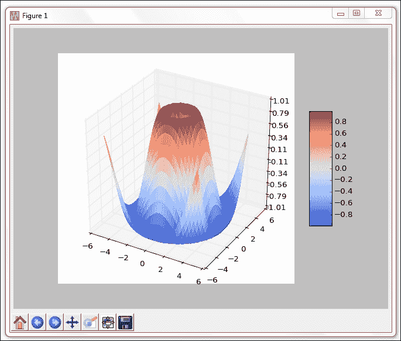

使用 Python 3.4 或更高版本以及 Eclipse PyDev 插件运行代码可能会显示一些未解决的导入错误。这看起来像是 PyDev 或 Java 中的一个错误。

如果你在使用 Eclipse 进行开发时遇到错误，请忽略它们，因为代码将能够成功运行。

## 它是如何工作的...

为了创建如图所示的前一个屏幕截图中的美丽图表，我们需要下载几个其他的 Python 模块。

以下食谱将指导我们如何成功下载所有必需的模块，这使我们能够创建我们自己的美丽图表。

# Matplotlib – 使用 pip 下载模块

下载额外的 Python 模块的常用方法是使用 pip。pip 模块随 Python 最新版（3.4 及以上版本）预装。

### 注意事项

如果你正在使用较旧的 Python 版本，你可能需要自己下载 pip 和 setuptools。

除了使用 Python 安装程序外，还有几个预先编译的 Windows 可执行文件，这使得我们能够轻松安装 Python 模块，例如 Matplotlib。

本食谱将展示如何通过 Windows 可执行文件成功安装 Matplotlib，以及如何使用 pip 来安装 Matplotlib 库所需的附加模块。

## 准备就绪

我们要下载使用 Matplotlib 模块所需的 Python 模块，只需在我们的电脑上安装 Python 3.4（或更高版本）即可。

## 如何做到这一点...

我们可以通过从官方 Matplotlib 网站下载的 Windows 可执行文件来安装 Matplotlib。

确保您安装的 Matplotlib 版本与您正在使用的 Python 版本相匹配。例如，如果您在 64 位操作系统（如 Microsoft Windows 7）上安装了 Python 3.4，请下载并安装 `Matplotlib-1.4.3.win-amd64-py3.4.exe`。

### 注意事项

可执行文件名中间的 "amd64" 表示您正在安装 64 位版本。如果您使用的是 32 位 x86 系统，那么安装 amd64 将不会生效。如果您已经安装了 32 位的 Python 版本并下载了 64 位的 Python 模块，也可能出现类似的问题。

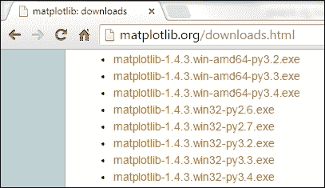

运行可执行文件将使我们开始，看起来是这样的：

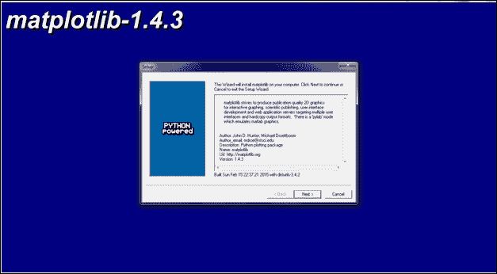

我们可以通过查看我们的 Python 安装目录来验证我们已经成功安装了 Matplotlib。

安装成功后，Matplotlib 文件夹将被添加到 site-packages 中。使用默认安装，Windows 上 site-packages 文件夹的完整路径为：

`C:\Python34\Lib\site-packages\matplotlib\`

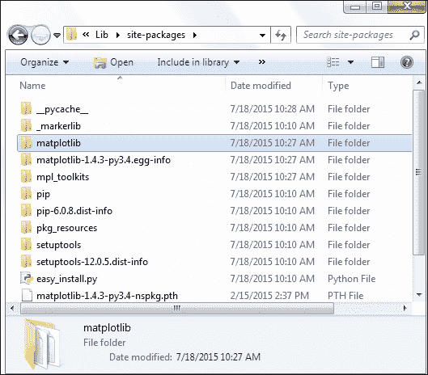

在官方 Matplotlib 网站上的最简单绘图示例需要使用 Python numpy 模块，所以让我们接下来下载并安装这个模块。

### 注意事项

Numpy 是一个数学模块，它不仅能够实现 Matplotlib 图表的绘图，而且功能远超 Matplotlib。如果你正在开发的软件需要大量的数学计算，你绝对应该检查一下 numpy。

有一个极好的网站为我们提供了快速链接，几乎涵盖了所有现有的 Python 模块。它通过指出哪些其他 Python 模块对于成功使用 Matplotlib 是必要的，并提供了下载这些模块的超链接，这使得我们能够快速且轻松地安装它们。

### 注意

这里是链接：

[`www.lfd.uci.edu/~gohlke/pythonlibs/`](http://www.lfd.uci.edu/~gohlke/pythonlibs/)

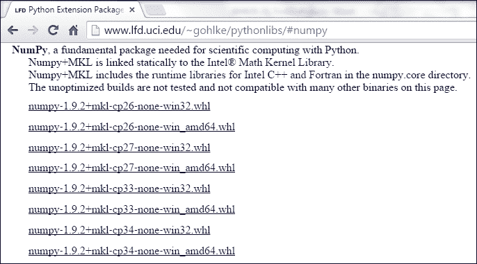

注意到安装包的文件扩展名都以 whl 结尾。为了使用它们，我们必须安装 Python wheel 模块，并且我们使用 pip 来完成这一操作。

### 注意事项

轮子（Wheels）是 Python 分发的最新标准，旨在取代 eggs。

你可以在以下网站上找到更多详细信息：

[`pythonwheels.com/`](http://pythonwheels.com/)

最好以管理员身份运行 Windows 命令处理器，以避免潜在的安装错误。

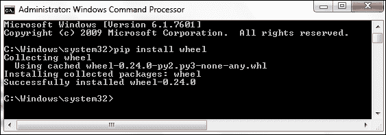

## 它是如何工作的...

下载 Python 模块的常见方法是使用 pip，如上所示。为了安装 Matplotlib 所需的所有模块，我们可以下载它们的主网站上的下载格式已更改为使用 whl 格式。

下一个菜谱将解释如何使用 wheel 安装 Python 模块。

# Matplotlib – 使用 whl 扩展下载模块

我们将使用 Matplotlib 所需的几个额外的 Python 模块，在这个菜谱中，我们将使用 Python 的新模块分发标准，称为 wheel，来下载它们。

### 注意事项

您可以在以下网址找到关于新轮标准（wheel standard）的 Python 增强提案（PEP）：[`www.python.org/dev/peps/pep-0427/`](https://www.python.org/dev/peps/pep-0427/)

## 准备就绪

为了下载带有 whl 扩展名的 Python 模块，必须首先安装 Python wheel 模块，这在之前的菜谱中已有解释。

## 如何做到这一点...

让我们从网络上下载 `numpy-1.9.2+mkl-cp34-none-win_amd64.whl`。安装完轮子模块后，我们可以使用 pip 来安装带有 whl 文件扩展名的包。

### 注意事项

Pip 与 Python 3.4.3 及以上版本兼容。如果你正在使用较旧的 Python 版本，我建议安装 pip，因为它使得安装所有其他额外的 Python 模块变得容易得多。

一个更好的建议可能是将您的 Python 版本升级到最新的稳定版本。到您阅读这本书的时候，那很可能将是 Python 3.5.0 或更高版本。

Python 是免费软件。升级它对我们来说不花费任何费用。

浏览到要安装的软件包所在的文件夹，并使用以下命令进行安装：

```py
pip install numpy-1.9.2+mkl-cp34-none-win_amd64.whl

```

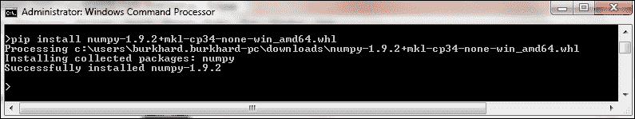

现在我们可以创建我们的第一个 Matplotlib 图表，使用官方网站上最简单的示例应用程序。之后，我们将创建自己的图表。

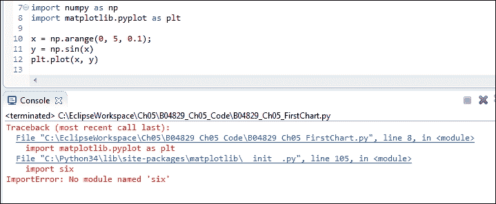

我们还没有准备好运行前面的代码这一事实表明我们需要下载更多的模块。虽然一开始可能觉得下载更多模块有点烦人，但实际上这是一种代码复用的形式。

因此，让我们使用 pip 和 wheel 下载并安装所需的六个以及其他所有模块（如 dateutil、pyparsing 等），直到我们的代码运行正常并仅从几行 Python 代码中创建出一张漂亮的图表。

我们可以从刚刚用来安装 numpy 的同一网站下载所有所需的模块。这个网站甚至列出了我们正在安装的模块所依赖的所有其他模块，并且提供了超链接，可以直接跳转到位于该网站内的安装软件。

### 注意事项

如前所述，安装 Python 模块的网址是：[`www.lfd.uci.edu/~gohlke/pythonlibs/`](http://www.lfd.uci.edu/~gohlke/pythonlibs/)

## 它是如何工作的...

该网站使我们能够从一个便捷的地方下载许多 Python 模块，同时也提供了其他 Python 模块。并非所有显示的依赖项都是必需的。这取决于你正在开发什么。随着你使用 Matplotlib 库的旅程不断深入，你可能需要下载并安装额外的模块。

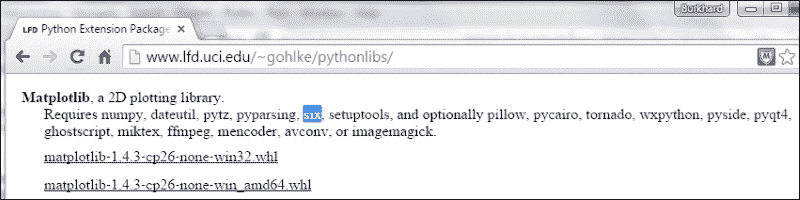

# 创建我们的第一个图表

现在我们已经安装了所有必需的 Python 模块，我们可以使用 Matplotlib 创建自己的图表。

我们可以用几行 Python 代码就创建图表。

## 准备就绪

使用上一道菜谱中的代码，我们现在可以创建一个看起来与下面展示的图表相似的图表。

## 如何做到这一点...

使用官方网站上展示的最少代码量，我们可以创建我们的第一个图表。嗯，几乎是这样。网站上展示的示例代码在导入`show`方法并调用它之前是不工作的。

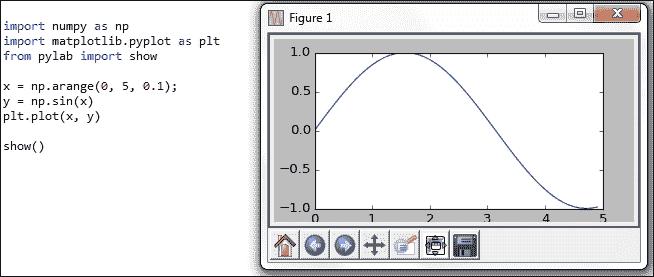

我们可以通过使用官方 Matplotlib 网站提供的众多示例之一来简化代码，甚至改进它。

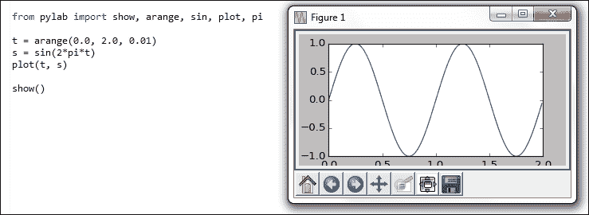

## 它是如何工作的...

Python 的 Matplotlib 模块，结合如 numpy 等插件，创建了一个非常丰富的编程环境，使我们能够非常容易地进行数学计算并在可视化图表中绘制它们。

Python numpy 方法 `arange` 并非用于排列任何东西。它的意思是创建“一个范围”，这在 Python 中用于内置的 “range” 操作符。`linspace` 方法也可能造成类似的困惑。这里的 “lin” 是谁，又在什么 “空间” 中？

事实上，这个名字的意思是“线性间隔向量”。

Pyglet 函数 `show` 显示我们创建的图表。在成功创建第一个图表之后，尝试绘制另一个图表时调用 `show()` 会有一些副作用。

# 在图表上放置标签

到目前为止，我们使用了默认的 Matplotlib GUI。现在我们将使用 Matplotlib 创建一些 tkinter GUI。

这将需要几行额外的 Python 代码和导入一些更多的库，但这非常值得努力，因为我们正在通过画布来掌控我们的画作。

我们将标签定位到水平轴以及垂直轴上，也就是所说的*x*轴和*y*轴。

我们将通过创建一个 Matplotlib 图形来实现这一点，然后我们在其上绘制。

我们还将学习如何使用子图，这将使我们能够在同一个窗口中绘制多个图表。

## 准备就绪

在安装了必要的 Python 模块，并知道如何找到官方在线文档和教程后，我们现在可以继续创建 Matplotlib 图表了。

## 如何做到这一点...

虽然`plot`是创建 Matplotlib 图表最简单的方式，但结合使用`Figure`和`Canvas`可以创建一个更加定制化的图表，看起来更加美观，同时也使我们能够向其中添加按钮和其他小部件。

```py
from matplotlib.figure import Figure
from matplotlib.backends.backend_tkagg import FigureCanvasTkAgg
import tkinter as tk
#--------------------------------------------------------------
fig = Figure(figsize=(12, 8), facecolor='white')
#--------------------------------------------------------------
# axis = fig.add_subplot(111)   # 1 row,  1 column, only graph
axis = fig.add_subplot(211)     # 2 rows, 1 column, Top graph
#--------------------------------------------------------------
xValues = [1,2,3,4]
yValues = [5,7,6,8]
axis.plot(xValues, yValues)

axis.set_xlabel('Horizontal Label')
axis.set_ylabel('Vertical Label')

# axis.grid()                   # default line style 
axis.grid(linestyle='-')        # solid grid lines
#--------------------------------------------------------------
def _destroyWindow():
    root.quit()
    root.destroy() 
#--------------------------------------------------------------
root = tk.Tk() 
root.withdraw()
root.protocol('WM_DELETE_WINDOW', _destroyWindow)   
#--------------------------------------------------------------
canvas = FigureCanvasTkAgg(fig, master=root)
canvas._tkcanvas.pack(side=tk.TOP, fill=tk.BOTH, expand=1)
#--------------------------------------------------------------
root.update()
root.deiconify()
root.mainloop()
```

运行前面的代码将生成以下图表：

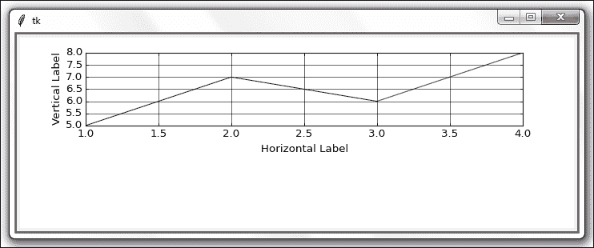

在导入语句之后的代码第一行，我们创建了一个`Figure`对象的实例。接下来，通过调用`add_subplot(211)`，我们将子图添加到这个图中。211 中的第一个数字告诉图需要添加多少个绘图，第二个数字确定列数，第三个数字告诉图以何种顺序显示绘图。

我们还添加了一个网格并更改了其默认的线条样式。

即使我们在图表中只显示一个图表，通过选择 2 作为子图的数量，我们实际上是在将图表向上移动，这导致图表底部出现额外的空白。现在这个图表只占据了屏幕的 50%，这影响了显示时该图表网格线的宽度。

### 注意事项

通过取消注释`axis =`和`axis.grid()`的代码来实验，以查看不同的效果。

我们可以通过将它们分配到第二个位置来添加更多子图，使用`add_subplot(212)`。

```py
from matplotlib.figure import Figure
from matplotlib.backends.backend_tkagg import FigureCanvasTkAgg
import tkinter as tk
#--------------------------------------------------------------
fig = Figure(figsize=(12, 8), facecolor='white')
#--------------------------------------------------------------
axis = fig.add_subplot(211)     # 2 rows, 1 column, Top graph
#--------------------------------------------------------------
xValues = [1,2,3,4]
yValues = [5,7,6,8]
axis.plot(xValues, yValues)

axis.set_xlabel('Horizontal Label')
axis.set_ylabel('Vertical Label')

axis.grid(linestyle='-')        # solid grid lines
#--------------------------------------------------------------
axis1 = fig.add_subplot(212)    # 2 rows, 1 column, Bottom graph
#--------------------------------------------------------------
xValues1 = [1,2,3,4]
yValues1 = [7,5,8,6]
axis1.plot(xValues1, yValues1)
axis1.grid()                    # default line style 
#--------------------------------------------------------------
def _destroyWindow():
    root.quit()
    root.destroy() 
#--------------------------------------------------------------
root = tk.Tk() 
root.withdraw()
root.protocol('WM_DELETE_WINDOW', _destroyWindow)   
#--------------------------------------------------------------
canvas = FigureCanvasTkAgg(fig, master=root)
canvas._tkcanvas.pack(side=tk.TOP, fill=tk.BOTH, expand=1)
#--------------------------------------------------------------
root.update()
root.deiconify()
root.mainloop()
```

现在运行略微修改后的代码，将轴 1 添加到图表中。对于底部图表的网格，我们保留了默认的线条样式。

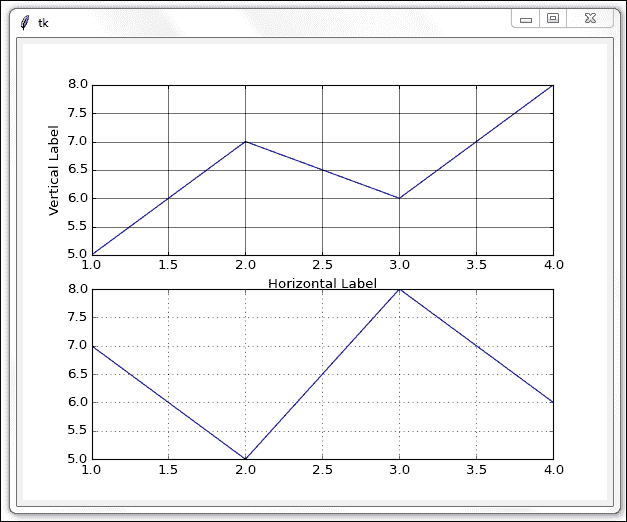

## 它是如何工作的...

我们导入了必要的 Matplotlib 模块来创建一个图表，并在其上绘制图表。我们为*x*和*y*轴赋予了一些值，并设置了一些众多配置选项中的几个。

我们创建了自己的 tkinter 窗口来显示图表，并自定义了图表的位置。

如我们在前几章所见，为了创建一个 tkinter 图形用户界面，我们首先必须导入 tkinter 模块，然后创建`Tk`类的实例。我们将这个类的实例分配给一个我们命名为`root`的变量，这个名称在示例中经常被使用。

我们的 tkinter 图形用户界面（GUI）将不会变得可见，直到我们启动主事件循环，为此，我们使用`root.mainloop()`。

避免在这里使用 Matplotlib 默认的 GUI，而是创建我们自己的 GUI 使用 tkinter 的一个重要原因是，我们希望改善默认 Matplotlib GUI 不太美观的外观，而我们可以非常容易地使用 tkinter 做到这一点。

如果我们使用 tkinter 构建 GUI，那么 Matplotlib GUI 底部将不再出现那些看起来过时的按钮。

同时，Matplotlib 的 GUI 有一个我们的 tkinter GUI 没有的功能，那就是当我们把鼠标在图表内移动时，我们实际上可以看到 Matplotlib GUI 中的 x 和 y 坐标。x 和 y 坐标的位置显示在右下角。

# 如何给图表添加图例

一旦我们开始绘制多于一条的数据点线，事情可能会变得有些不清楚。通过在我们的图表中添加图例，我们可以知道哪些数据代表什么，以及它实际上意味着什么。

我们不必选择不同的颜色来表示不同的数据。Matplotlib 会自动为每条数据点线分配不同的颜色。

我们只需要创建图表并为其添加图例。

## 准备就绪

在这个菜谱中，我们将增强之前菜谱中的图表。我们只会绘制一个图表。

## 如何做到这一点...

首先，我们将在同一图表中绘制更多数据行，然后我们将为图表添加图例。

我们通过修改前一个菜谱中的代码来完成这项工作。

```py
from matplotlib.figure import Figure
from matplotlib.backends.backend_tkagg import FigureCanvasTkAgg
import tkinter as tk
#--------------------------------------------------------------
fig = Figure(figsize=(12, 5), facecolor='white')
#--------------------------------------------------------------
axis  = fig.add_subplot(111)                  # 1 row, 1 column

xValues  = [1,2,3,4]

yValues0 = [6,7.5,8,7.5]
yValues1 = [5.5,6.5,8,6]
yValues2 = [6.5,7,8,7]

t0, = axis.plot(xValues, yValues0)
t1, = axis.plot(xValues, yValues1)
t2, = axis.plot(xValues, yValues2)

axis.set_ylabel('Vertical Label')
axis.set_xlabel('Horizontal Label')

axis.grid()

fig.legend((t0, t1, t2), ('First line', 'Second line', 'Third line'), 'upper right')

#--------------------------------------------------------------
def _destroyWindow():
    root.quit()
    root.destroy() 
#--------------------------------------------------------------
root = tk.Tk() 
root.withdraw()
root.protocol('WM_DELETE_WINDOW', _destroyWindow)
#--------------------------------------------------------------
canvas = FigureCanvasTkAgg(fig, master=root)
canvas._tkcanvas.pack(side=tk.TOP, fill=tk.BOTH, expand=1)
#--------------------------------------------------------------
root.update()
root.deiconify()
root.mainloop()
```

运行修改后的代码会生成以下图表，其中图例位于右上角：

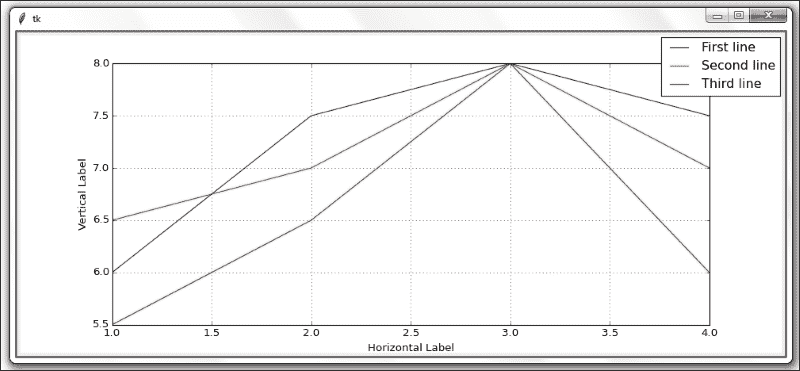

在这个菜谱中，我们只绘制一个图表，这是通过更改`fig.add_subplot(111)`来实现的。我们还通过`figsize`属性稍微修改了图表的大小。

接下来，我们创建三个包含要绘制值的 Python 列表。当我们绘制数据时，我们将绘图引用保存在局部变量中。

我们通过传入一个包含三个图表引用的元组、另一个包含随后在图例中显示的字符串的元组，以及在第三个参数中定位图例在图表中的位置，来创建图例。

Matplotlib 的默认设置将颜色方案分配给正在绘制的线条。

我们可以通过在绘制每个轴时设置一个属性，轻松地将这个默认的颜色设置更改为我们喜欢的颜色。

我们通过使用颜色属性并为其分配一个可用的颜色值来实现这一点。

```py
t0, = axis.plot(xValues, yValues0, color = 'purple')
t1, = axis.plot(xValues, yValues1, color = 'red')
t2, = axis.plot(xValues, yValues2, color = 'blue')
```

注意到在 t0、t1 和 t2 的变量赋值之后的逗号不是一个错误，而是为了创建图例所必需的。

每个变量后面的逗号将列表转换为元组。如果我们省略这一点，我们的图例将不会显示。

代码仍然会运行，只是没有预期的图例。

### 注意事项

当我们在 t0 =赋值之后删除逗号时，会出现错误，并且第一行不再出现在图中。图表和图例仍然会被创建，但图例中不会出现第一行。

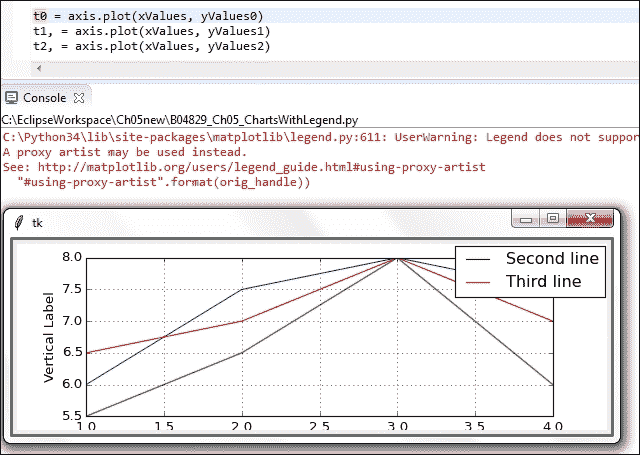

## 它是如何工作的...

我们通过在同一图表中绘制三条数据线并添加图例来增强我们的图表，以便区分这三条线所表示的数据。

# 比例图

在之前的菜谱中，当我们创建第一个图表并增强它们时，我们硬编码了如何视觉表示这些值的缩放。

虽然这对于我们使用的数值来说效果很好，但我们经常从非常大的数据库中绘制图表。

根据数据范围的不同，我们硬编码的垂直 y 维度值可能并不总是最佳解决方案，这可能会导致我们在图表中难以看到线条。

## 准备就绪

我们将从之前的食谱中改进我们的代码。如果你还没有输入所有之前的食谱中的代码，只需下载本章的代码即可开始（然后你可以有很多乐趣，使用 Python 创建 GUI、图表等等）。

## 如何做到这一点...

将前一个菜谱中的`yValues1`代码行修改为使用 50 作为第三个值。

```py
axis  = fig.add_subplot(111)        # 1 row, 1 column

xValues  = [1,2,3,4]

yValues0 = [6,7.5,8,7.5]
yValues1 = [5.5,6.5,50,6]           # one very high value
yValues2 = [6.5,7,8,7]
```

与上一道菜谱中创建图表的代码相比，唯一的区别是一个数据值。

通过改变一个与其他所有绘制线条的平均值范围都不接近的值，数据的视觉表示发生了显著变化，我们失去了关于整体数据的大量细节，现在主要看到一个高峰。

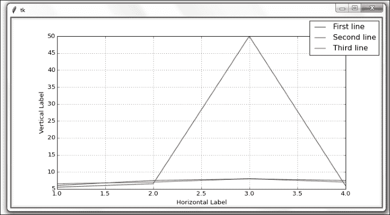

到目前为止，我们的图表已经根据它们所视觉表示的数据进行了调整。

虽然这是 Matplotlib 的一个实用功能，但这并不总是我们想要的。我们可以通过限制垂直的 y 轴维度来限制所表示图表的刻度。

```py
yValues0 = [6,7.5,8,7.5]
yValues1 = [5.5,6.5,50,6]           # one very high value (50)
yValues2 = [6.5,7,8,7]

axis.set_ylim(5, 8)                 # limit the vertical display
```

`axis.set_ylim(5, 8)` 这行代码现在将垂直显示的开始值限制为 5，结束值限制为 8。

现在，当我们创建图表时，高值峰值不再像以前那样有影响。

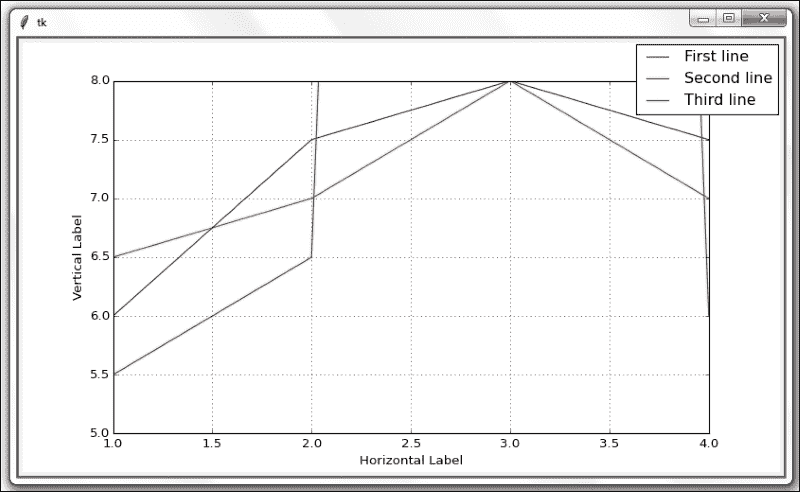

## 它是如何工作的...

我们在数据中增加了一个值，这导致了显著的效果。通过设置图表的垂直和水平显示限制，我们可以看到我们最感兴趣的数据。

就像刚才展示的那些尖峰，也可能非常有意思。这完全取决于我们在寻找什么。数据的视觉表示非常有价值。

### 注意

一图胜千言。

# 动态调整图表的缩放比例

在上一个菜谱中，我们学习了如何限制图表的缩放。在这个菜谱中，我们将更进一步，通过设置限制并分析我们的数据，在表示之前动态调整缩放。

## 准备就绪

我们将通过读取我们动态绘制的数据进行增强，计算平均值，然后调整我们的图表。

虽然我们通常从外部源读取数据，但在本菜谱中，我们使用 Python 列表创建我们正在绘制的图形数据，如下面的代码所示。

## 如何做到这一点...

我们通过将包含数据的列表分配给 xvalues 和 yvalues 变量，在我们的 Python 模块中创建自己的数据。

在许多图表中，x 轴和 y 轴坐标系统的起始点通常在(0, 0)。这通常是一个好主意，因此让我们相应地调整我们的图表坐标代码。

让我们修改代码以设置 x 和 y 维度的限制：

```py
xValues  = [1,2,3,4]

yValues0 = [6,7.5,8,7.5]
yValues1 = [5.5,6.5,50,6]           # one very high value (50)
yValues2 = [6.5,7,8,7]              

axis.set_ylim(0, 8)                 # lower limit (0)
axis.set_xlim(0, 8)                 # use same limits for x
```

现在我们为 x 和 y 设置了相同的限制，我们的图表可能看起来更平衡。当我们运行修改后的代码时，我们得到以下结果：

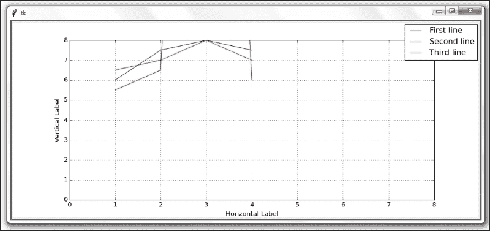

也许一开始从 (0, 0) 开始并不是一个很好的主意……

我们真正想要做的是根据数据的范围动态调整我们的图表，同时限制过高或过低的值。

我们可以通过解析图表中要表示的所有数据，同时设置一些明确的限制来实现这一点。

修改代码，如下所示：

```py
xValues  = [1,2,3,4]

yValues0 = [6,7.5,8,7.5]
yValues1 = [5.5,6.5,50,6]              # one very high value (50)
yValues2 = [6.5,7,8,7]              
yAll = [yValues0, yValues1, yValues2]  # list of lists

# flatten list of lists retrieving minimum value
minY = min([y for yValues in yAll for y in yValues])

yUpperLimit = 20
# flatten list of lists retrieving max value within defined limit
maxY = max([y for yValues in yAll for y in yValues if y < yUpperLimit])

# dynamic limits
axis.set_ylim(minY, maxY)                 
axis.set_xlim(min(xValues), max(xValues))                

t0, = axis.plot(xValues, yValues0)
t1, = axis.plot(xValues, yValues1)
t2, = axis.plot(xValues, yValues2)
```

运行代码后得到以下图表。我们对其 x 轴和 y 轴的尺寸进行了动态调整。注意现在 y 轴的起始值是 5.5 而不是之前的 5.0。此外，图表也不再从(0, 0)开始，这为我们提供了更多关于数据的有价值信息。

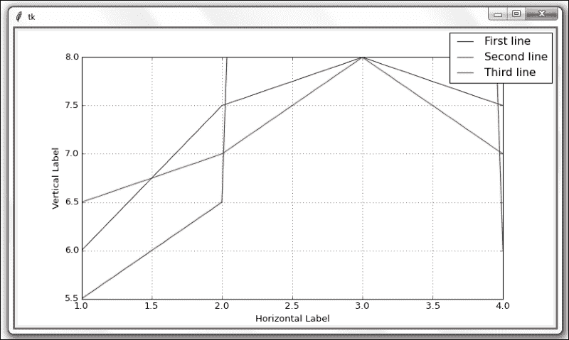

我们正在创建一个用于 y 维度数据的列表列表，然后使用列表推导式将其包裹在调用 Python 的`min()`和`max()`函数中。

如果列表推导看起来有些高级，它们本质上是一个非常紧凑的循环。

它们也被设计成比常规编程循环更快。

在创建前面图表的 Python 代码中，我们创建了三个列表来存储要绘制的 y 维数据。然后我们创建了另一个列表来存储这三大列表，从而创建了一个列表的列表。

就像这样：

```py
yValues0 = [6,7.5,8,7.5]
yValues1 = [5.5,6.5,50,6]              # one very high value (50)
yValues2 = [6.5,7,8,7]              
yAll = [yValues0, yValues1, yValues2]  # list of lists
```

我们对获取所有 y 维数据的极小值以及这三个列表中包含的最大值都感兴趣。

我们可以通过 Python 列表推导来完成这个操作。

```py
# flatten list of lists retrieving minimum value
minY = min([y for yValues in yAll for y in yValues])
```

在运行列表推导后，`minY`的值是：5.5。

上面的单行代码是列表推导式，它遍历了包含在三个列表中的所有值，并使用 Python 的`min`关键字找到最小值。

在完全相同的模式中，我们找到了我们希望绘制的数据中的最大值。这次，我们在列表推导式中也设置了一个限制，忽略所有高于我们指定限制的值，如下所示：

```py
yUpperLimit = 20
# flatten list of lists retrieving max value within defined limit
maxY = max([y for yValues in yAll for y in yValues if y < yUpperLimit])
```

在运行前面代码并应用我们选择的限制条件后，`maxY`的值为 8（而不是 50）。

我们根据预定义的条件对最大值进行了限制，选择 20 作为图表中显示的最大值。

对于 x 轴维度，我们只需在 Matplotlib 方法中调用`min()`和`max()`函数来动态调整图表的界限。

## 它是如何工作的...

在这个菜谱中，我们创建了几个 Matplotlib 图表并调整了众多可用属性中的某些。我们还使用核心 Python 动态控制图表的缩放。
