# 第六章 线程和网络

在本章中，我们将使用 Python 3 创建线程、队列和 TCP/IP 套接字。

+   如何创建多个线程

+   开始一个线程

+   停止一个线程

+   如何使用队列

+   在不同模块之间传递队列

+   使用对话框小部件将文件复制到您的网络

+   使用 TCP/IP 通过网络进行通信

+   使用 URLOpen 从网站读取数据

# 简介

在本章中，我们将通过使用线程、队列和网络连接来扩展我们 Python GUI 的功能。

### 注意事项

Tkinter 图形用户界面是单线程的。涉及睡眠或等待时间的任何函数都必须在单独的线程中调用，否则 Tkinter GUI 会冻结。

当我们在 Windows 任务管理器中运行我们的 Python GUI 时，我们可以看到一个新的 `python.exe` 进程已经被启动。

当我们给我们的 Python GUI 添加 `.pyw` 扩展名时，创建的进程将是 `python.pyw`，如任务管理器中所示。

当创建一个进程时，进程会自动创建一个主线程来运行我们的应用程序。这被称为单线程应用程序。

对于我们的 Python GUI，如果是一个单线程应用程序，那么一旦我们调用一个运行时间较长的任务，比如点击一个有几秒休眠的按钮，我们的 GUI 就会立即冻结。

为了保持我们的图形用户界面（GUI）响应，我们必须使用多线程，这正是本章将要探讨的内容。

我们也可以通过创建多个 Python GUI 实例来创建多个进程，这在任务管理器中可以看得到。

设计上，进程彼此隔离且不共享公共数据。为了在分离的进程之间进行通信，我们不得不使用**进程间通信**（**IPC**），这是一种高级技术。

另一方面，线程确实共享相同的数据、代码和文件，这使得在同一进程内线程之间的通信比使用进程间通信（IPC）要容易得多。

### 注意事项

一份关于线程的精彩解释可以在以下链接找到：[`www.cs.uic.edu/~jbell/CourseNotes/OperatingSystems/4_Threads.html`](https://www.cs.uic.edu/~jbell/CourseNotes/OperatingSystems/4_Threads.html)

在本章中，我们将学习如何保持我们的 Python 图形用户界面（GUI）响应，并防止其冻结。

# 如何创建多个线程

我们将使用 Python 创建多个线程。这是为了保持我们的 GUI 响应性所必需的。

### 注意事项

线程就像是用线织成的布料，没有什么可怕的。

## 准备就绪

多个线程在同一个计算机进程的内存空间中运行。无需进行进程间通信（简称 IPC），这会使得我们的代码变得复杂。在本食谱中，我们将通过使用线程来避免 IPC。

## 如何做到这一点...

首先，我们将增加我们的`ScrolledText`小部件的大小，使其更大。让我们将`scrolW`增加到 40，将`scrolH`增加到 10。

```py
# Using a scrolled Text control
scrolW  = 40; scrolH  =  10
self.scr = scrolledtext.ScrolledText(self.monty, width=scrolW, height=scrolH, wrap=tk.WORD)
self.scr.grid(column=0, row=3, sticky='WE', columnspan=3)
```

当我们现在运行生成的 GUI 时，相对于其上方的`Entry`小部件，`Spinbox`小部件是居中对齐的，这看起来不太好。我们将通过左对齐小部件来改变这一点。

将 `sticky='W'` 添加到 `grid` 控制中，以左对齐 `Spinbox` 小部件。

```py
# Adding a Spinbox widget using a set of values
self.spin = Spinbox(self.monty, values=(1, 2, 4, 42, 100), width=5, bd=8, command=self._spin) 
self.spin.grid(column=0, row=2, sticky='W')
```

界面看起来还可以更好，所以接下来，我们将增加`Entry`小部件的大小，以获得更平衡的 GUI 布局。

将宽度增加到 24，如下所示：

```py
# Adding a Textbox Entry widget
self.name = tk.StringVar()
nameEntered = ttk.Entry(self.monty, width=24, textvariable=self.name)
nameEntered.grid(column=0, row=1, sticky='W')
```

让我们也将`Combobox`的宽度略微增加到 14。

```py
ttk.Label(self.monty, text="Choose a number:").grid(column=1, row=0)
number = tk.StringVar()
numberChosen = ttk.Combobox(self.monty, width=14, textvariable=number)
numberChosen['values'] = (1, 2, 4, 42, 100)
numberChosen.grid(column=1, row=1)
numberChosen.current(0)
```

运行修改和改进后的代码将产生一个更大的 GUI，我们将使用这个 GUI 以及接下来的食谱。

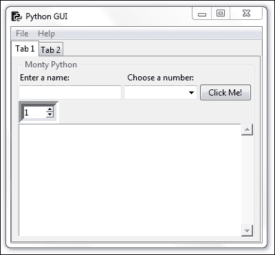

为了在 Python 中创建和使用线程，我们必须从 threading 模块导入`Thread`类。

```py
#======================
# imports
#======================
import tkinter as tk
from tkinter import ttk
from tkinter import scrolledtext
from tkinter import Menu  
from tkinter import Spinbox
import B04829_Ch06_ToolTip as tt

from threading import Thread

GLOBAL_CONST = 42
```

让我们在`OOP`类中添加一个在线程中创建的方法。

```py
class OOP():
    def methodInAThread(self):
        print('Hi, how are you?')
```

我们现在可以在代码中调用我们的线程方法，并将实例保存在一个变量中。

```py
#======================
# Start GUI
#======================
oop = OOP()

# Running methods in Threads
runT = Thread(target=oop.methodInAThread)
oop.win.mainloop())
```

现在我们有一个线程化的方法，但当我们运行代码时，控制台没有任何输出！

我们必须首先启动`线程`，然后它才能运行，下一道菜谱将展示如何进行这一操作。

然而，在 GUI 主事件循环之后设置断点证明我们确实创建了一个`Thread`对象，正如可以在 Eclipse IDE 调试器中看到的那样。

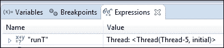

## 它是如何工作的...

在这个菜谱中，我们首先通过增加 GUI 的大小来准备使用线程，这样我们就能更好地看到打印到`ScrolledText`小部件的结果。

我们随后从 Python 的 `threading` 模块中导入了 `Thread` 类。

之后，我们在 GUI 内部创建了一个我们称之为线程的方法。

# 开始一个线程

这个菜谱将向我们展示如何启动一个线程。它还将演示为什么在长时间运行的任务中，线程对于保持我们的 GUI 响应性是必要的。

## 准备就绪

让我们先看看当我们调用我们的 GUI 中与睡眠相关联的函数或方法，但没有使用线程时会发生什么。

### 注意事项

我们在这里使用睡眠来模拟一个可能需要等待网络服务器或数据库响应、大文件传输或复杂计算完成任务的真实世界应用。

睡眠是一个非常实际的占位符，并展示了其中涉及的原则。

在我们的按钮回调方法中添加一个循环并设置一些休眠时间会导致我们的 GUI 变得无响应，当我们尝试关闭 GUI 时，情况变得更糟。

```py
# Button callback
def clickMe(self):
  self.action.configure(text='Hello ' + self.name.get())
  # Non-threaded code with sleep freezes the GUI
  for idx in range(10):
    sleep(5)
    self.scr.insert(tk.INSERT, str(idx) + '\n')
```

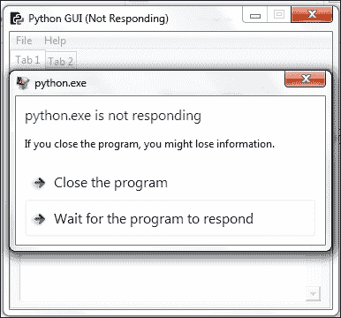

如果我们等待足够长的时间，该方法最终会完成，但在这一过程中，我们所有的 GUI 小部件都不会对点击事件做出响应。我们通过使用线程来解决这个问题。

### 注意事项

在上一个菜谱中，我们创建了一个在线程中运行的方法，但到目前为止，该线程还没有运行！

与常规的 Python 函数和方法不同，我们必须在它自己的线程中`启动`一个将要运行的方法！

这是我们接下来要做的。

## 如何去做……

首先，让我们将创建线程的操作移入一个独立的方法中，然后从按钮回调方法中调用这个方法。

```py
# Running methods in Threads
def createThread(self):
  runT = Thread(target=self.methodInAThread)
  runT.start()
# Button callback
def clickMe(self):
  self.action.configure(text='Hello ' + self.name.get())
  self.createThread()
```

点击按钮现在会导致调用`createThread`方法，该方法反过来又调用`methodInAThread`方法。

首先，我们创建一个线程并将其指向一个方法。接下来，我们启动一个新线程来运行目标方法。

### 注意事项

GUI 本身在其自己的线程中运行，这是应用程序的主线程。

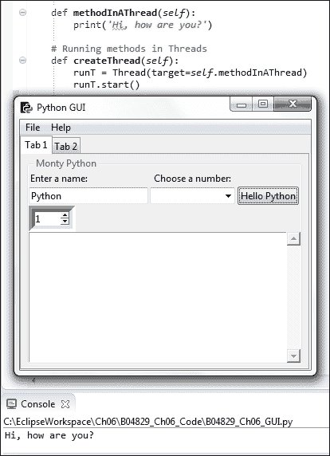

我们可以打印出线程的实例。

```py
# Running methods in Threads
def createThread(self):
  runT = Thread(target=self.methodInAThread)
  runT.start()
  print(runT)
```

点击按钮现在将生成以下打印输出：

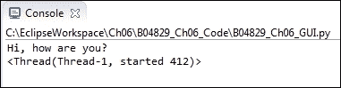

当我们多次点击按钮时，我们可以看到每个线程都被分配了一个唯一的名称和 ID。

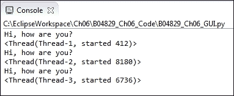

现在我们将带有`sleep`的代码放入`methodInAThread`方法中，以验证线程确实解决了我们的问题。

```py
def methodInAThread(self):
  print('Hi, how are you?')
  for idx in range(10):
    sleep(5)
    self.scr.insert(tk.INSERT, str(idx) + '\n')
```

当点击按钮时，在数字以五秒延迟打印到`ScrolledText`小部件的过程中，我们可以在我们的 GUI 中任意点击，切换标签页等等。由于我们使用了线程，我们的 GUI 再次变得响应了！

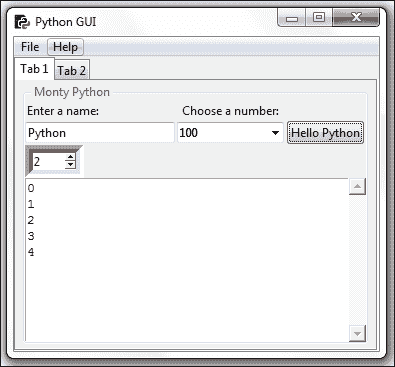

## 它是如何工作的...

在这个菜谱中，我们在自己的线程中调用了 GUI 类的函数，并了解到我们必须启动线程。否则，线程会被创建，但只是在那里等待我们运行其目标方法。

我们注意到每个线程都被分配了一个唯一的名称和 ID。

我们通过在代码中插入`sleep`语句来模拟长时间运行的任务，这表明线程确实可以解决我们的问题。

# 停止一个线程

我们必须启动一个线程，通过调用`start()`方法来让它执行某些操作，所以直观上，我们可能会期望存在一个对应的`stop()`方法，但实际上并没有这样的方法。在本教程中，我们将学习如何将线程作为一个后台任务运行，这被称为守护线程。当关闭主线程，也就是我们的 GUI 时，所有守护线程也会自动停止。

## 准备就绪

当我们在线程中调用方法时，我们也可以向方法传递参数和关键字参数。我们通过做这件事来开始这个步骤。

## 如何做到这一点...

通过在线程构造函数中添加`args=[8]`并将目标方法修改为期望参数，我们可以向线程方法传递参数。`args`参数必须是一个序列，因此我们将我们的数字包裹在一个 Python 列表中。

```py
def methodInAThread(self, numOfLoops=10):
  for idx in range(numOfLoops):
    sleep(1)
    self.scr.insert(tk.INSERT, str(idx) + '\n')
```

在以下代码中，`runT` 是一个局部变量，我们只在该方法的作用域内访问我们创建的 `runT`。

```py

# Running methods in Threads
def createThread(self):
  runT = Thread(target=self.methodInAThread, args=[8])
  runT.start()
```

通过将局部变量转换为成员，我们就可以通过在另一个方法中调用其`isAlive`方法来检查线程是否仍在运行。

```py
# Running methods in Threads
def createThread(self):
  self.runT = Thread(target=self.methodInAThread, args=[8])
  self.runT.start()
  print(self.runT)
  print('createThread():', self.runT.isAlive())
```

在前面的代码中，我们将本地`runT`变量提升为我们的类成员。这样做的作用是使我们能够从我们的类中的任何方法访问`self.runT`变量。

这就是这样实现的：

```py
    def methodInAThread(self, numOfLoops=10):
        for idx in range(numOfLoops):
            sleep(1)
            self.scr.insert(tk.INSERT, str(idx) + '\n')
        sleep(1)
        print('methodInAThread():', self.runT.isAlive())
```

当我们点击按钮然后退出 GUI 时，我们可以看到`createThread`方法中的打印语句被打印出来，但我们看不到来自`methodInAThread`的第二个打印语句。

相反，我们得到一个 RuntimeError。

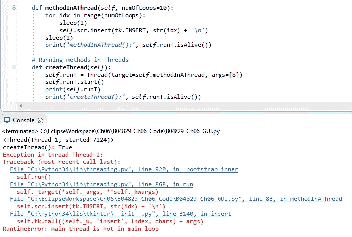

线程预计将完成其分配的任务，因此当我们关闭 GUI 而线程尚未完成时，Python 会告诉我们我们启动的线程不在主事件循环中。

我们可以通过将线程转换为守护进程来解决此问题，然后它将作为一个后台任务执行。

这给我们带来的结果是，当我们关闭我们的 GUI（图形用户界面），也就是我们的主线程启动其他线程时，守护线程将干净地退出。

我们可以在启动线程之前，通过调用线程的`setDaemon(True)`方法来实现这一点。

```py
# Running methods in Threads
def createThread(self):
  runT = Thread(target=self.methodInAThread)
  runT.setDaemon(True)
  runT.start()
  print(runT)
```

当我们现在点击按钮并退出我们的 GUI，而线程尚未完成其分配的任务时，我们不再收到任何错误。

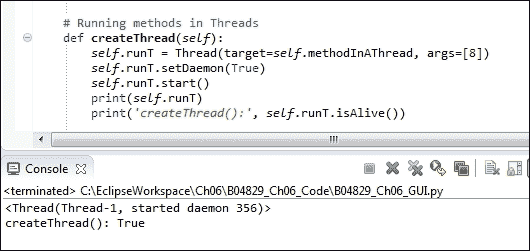

## 它是如何工作的...

虽然有启动方法可以让线程运行，但令人惊讶的是，并没有真正等效的停止方法。

在这个菜谱中，我们正在一个线程中运行一个方法，该方法将数字打印到我们的`ScrolledText`小部件中。

当我们退出我们的图形用户界面时，我们就不再对曾经用于向我们的小部件打印的线程感兴趣了，因此，通过将线程转换为后台守护进程，我们可以干净地退出我们的 GUI。

# 如何使用队列

Python 队列是一种实现先进先出（FIFO）范式的数据结构，基本上就像一个管道。你在一侧把东西铲进管道，它就会从管道的另一侧掉出来。

与将泥土铲入物理管道相比，这种队列铲雪的主要区别在于，在 Python 队列中，事物不会混淆。你放入一个单元，这个单元就会从另一端出来。接下来，你放入另一个单元（比如，一个类的实例），这个整个单元将作为一个整体从另一端出来。

它以我们插入队列中代码的精确顺序从另一端返回。

### 注意事项

队列并非是我们可以进行入栈和出栈操作的栈。栈是一种后进先出（LIFO）的数据结构。

队列是用于存储从可能不同的数据源中输入的数据的容器。当客户端有可用数据时，我们可以让不同的客户端向队列提供数据。无论哪个客户端准备好向我们的队列发送数据，它就会发送，然后我们可以将此数据显示在小部件中或将其转发到其他模块。

使用多个线程在队列中完成分配的任务，在接收处理结果的最终结果并显示它们时非常有用。数据被插入到队列的一端，然后以有序的方式从另一端出来，即先进先出（FIFO）。

我们的图形用户界面可能有五个不同的按钮小部件，每个小部件都会启动不同的任务，我们希望在 GUI 中的小部件（例如，滚动文本小部件）中显示这些任务。

这五项不同的任务需要不同时间来完成。

每当一项任务完成时，我们立即需要知道这一点，并在我们的图形用户界面中显示此信息。

通过创建一个共享的 Python 队列，并让五个任务将它们的结果写入这个队列，我们可以使用先进先出（FIFO）的方法立即显示已完成任务的任何结果。

## 准备就绪

随着我们的图形用户界面（GUI）在功能和实用性上不断增长，它开始与网络、进程和网站进行交互，并且最终必须等待数据变得可用，以便图形用户界面能够展示。

在 Python 中创建队列可以解决在 GUI 中等待数据显示的问题。

## 如何做到这一点...

为了在 Python 中创建队列，我们必须从`queue`模块中导入`Queue`类。将以下语句添加到我们的 GUI 模块顶部：

```py
from threading import Thread
from time import sleep
from queue import Queue
```

这就让我们开始了。

接下来，我们创建一个队列实例。

```py
def useQueues(self):
    guiQueue = Queue()     # create queue instance
```

### 注意

在前面的代码中，我们创建了一个局部`Queue`实例，该实例仅在此方法内部可访问。如果我们希望从其他地方访问这个队列，我们必须使用`self`关键字将其变成我们类的一个成员，这会将局部变量绑定到整个类，使其可以在我们类中的任何其他方法中访问。在 Python 中，我们通常在`__init__(self)`方法中创建类实例变量，但 Python 非常实用，允许我们在代码的任何地方创建这些成员变量。

现在我们有一个队列的实例。我们可以通过打印它来证明这是有效的。

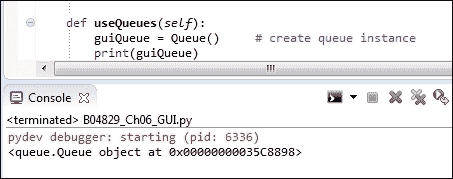

为了将数据放入队列，我们使用`put`命令。为了从队列中获取数据，我们使用`get`命令。

```py
# Create Queue instance  
def useQueues(self):
    guiQueue = Queue()
    print(guiQueue)
    guiQueue.put('Message from a queue')
    print(guiQueue.get())
```

运行修改后的代码会导致消息首先被放入`队列`中，然后从`队列`中取出，接着打印到控制台。

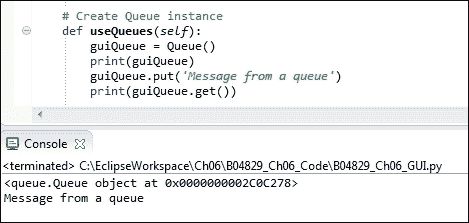

我们可以将许多消息放入队列中。

```py
# Create Queue instance  
def useQueues(self):
    guiQueue = Queue()
    print(guiQueue)
    for idx in range(10):
        guiQueue.put('Message from a queue: ' + str(idx))
    print(guiQueue.get())
```

我们已经将 10 条消息放入了`队列`，但我们只取出了第一条。其他消息仍然在`队列`中，等待以 FIFO（先进先出）的方式被取出。

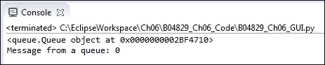

为了获取所有已放入`队列`的消息，我们可以创建一个无限循环。

```py
# Create Queue instance
def useQueues(self):
    guiQueue = Queue()
    print(guiQueue)
    for idx in range(10):
        guiQueue.put('Message from a queue: ' + str(idx))

    while True: 
        print(guiQueue.get())
```

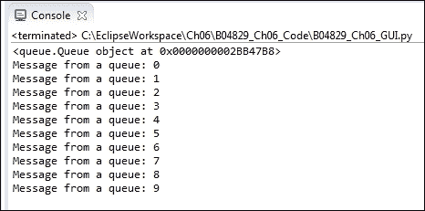

虽然这段代码能工作，但不幸的是它会冻结我们的图形用户界面。为了解决这个问题，我们必须在它自己的线程中调用该方法，就像我们在之前的菜谱中做的那样。

让我们在一个线程中运行我们的方法，并将其绑定到按钮事件：

```py
# Running methods in Threads
def createThread(self, num):
    self.runT = Thread(target=self.methodInAThread, args=[num])
    self.runT.setDaemon(True)
    self.runT.start()
    print(self.runT)
    print('createThread():', self.runT.isAlive())

    # textBoxes are the Consumers of Queue data
    writeT = Thread(target=self.useQueues, daemon=True)
    writeT.start()

# Create Queue instance  
def useQueues(self):
    guiQueue = Queue()
    print(guiQueue)
    for idx in range(10):
        guiQueue.put('Message from a queue: ' + str(idx))
    while True: 
        print(guiQueue.get())
```

当我们现在点击操作`按钮`，我们不再得到一个多余的弹出窗口，代码也能正常工作。

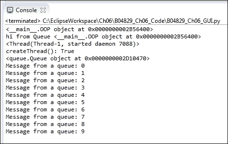

## 它是如何工作的...

我们创建了一个`队列`，以先进先出（即 FIFO）的方式将消息放入`队列`的一侧。我们从`队列`中取出消息，然后将其打印到控制台（stdout）。

我们意识到我们必须在自己的`Thread`中调用该方法。

# 在不同模块之间传递队列

在这个菜谱中，我们将`队列`传递到不同的模块中。随着我们的 GUI 代码复杂性增加，我们希望将 GUI 组件从业务逻辑中分离出来，将它们分别放入不同的模块中。

模块化使我们能够复用代码，同时也使得代码更加易于阅读。

当我们在 GUI 中显示的数据来自不同的数据源时，我们将面临延迟问题，这正是`队列`解决的问题。通过在不同 Python 模块之间传递`队列`的实例，我们正在分离模块功能的不同关注点。

### 注意事项

GUI 代码理想情况下只需关注创建和显示小部件。

业务逻辑模块的职责仅限于执行业务逻辑。

我们必须结合这两个元素，理想情况下使用尽可能少的模块间关系，减少代码之间的依赖性。

### 注意事项

避免不必要的依赖的编码原则通常被称为“松耦合”。

为了理解松耦合的重要性，我们可以在白板上或一张纸上画一些方框。一个方框代表我们的 GUI 类和代码，而其他方框则代表业务逻辑、数据库等。

接下来，我们在这些方框之间画线，绘制出这些方框（即我们的 Python 模块）之间的相互依赖关系。

### 注意事项

我们 Python 盒子之间的行数越少，我们的设计就越松散耦合。

## 准备就绪

在上一个菜谱中，我们已经开始使用 `队列`。在这个菜谱中，我们将从主 GUI 线程传递 `队列` 的实例到其他 Python 模块，这将使我们能够从另一个模块写入 `ScrolledText` 小部件，同时保持我们的 GUI 响应。

## 如何做到这一点...

首先，我们在项目中创建一个新的 Python 模块。让我们称它为 `Queues.py`。我们将一个函数放入其中（目前不需要面向对象编程）并传递一个队列实例。

我们还传递了创建 GUI 表单和控件的类的自引用，这使得我们能够从另一个 Python 模块中使用所有的 GUI 方法。

我们在按钮回调中这样做

### 注意

这就是面向对象编程（OOP）的魔力。在类的中间，我们使用`self`关键字将自身传递给类内部调用的函数。

代码现在看起来是这样的。

```py
import B04829_Queues as bq

class OOP():
    # Button callback
    def clickMe(self):
      # Passing in the current class instance (self)
        print(self)
        bq.writeToScrol(self)
```

导入的模块包含我们正在调用的函数，

```py
def writeToScrol(inst):
    print('hi from Queue', inst)
    inst.createThread(6)

```

我们在按钮回调中注释掉了对`createThread`的调用，因为我们现在是从我们新的模块中调用它的。

```py
# Threaded method does not freeze our GUI
# self.createThread()
```

通过将类实例的自引用传递给类在另一个模块中调用的函数，我们现在可以访问来自其他 Python 模块的所有 GUI 元素。

运行代码会生成以下结果。

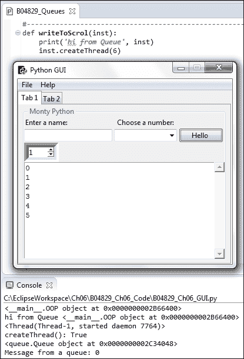

接下来，我们将创建一个`Queue`作为我们类的一个成员，并在类的`__init__`方法中放置对其的引用。

```py
class OOP():
    def __init__(self):
        # Create a Queue
        self.guiQueue = Queue()
```

现在我们可以通过简单地使用传递给我们的 GUI 的类引用，将消息放入队列中。

```py
def writeToScrol(inst):
    print('hi from Queue', inst)
    for idx in range(10):
        inst.guiQueue.put('Message from a queue: ' + str(idx))
    inst.createThread(6)
```

我们 GUI 代码中的`createThread`方法现在只从队列中读取，该队列是由我们新模块中的业务逻辑填充的，该模块已经将逻辑从我们的 GUI 模块中分离出来。

```py
def useQueues(self):
    # Now using a class member Queue
    while True:
        print(self.guiQueue.get())
```

运行我们修改后的代码会产生相同的结果。我们还没有破坏任何东西（目前还没有）！

## 它是如何工作的...

为了将图形用户界面（GUI）小部件与表达业务逻辑的功能分离，我们创建了一个类，将队列作为这个类的成员，并通过将这个类的实例传递给位于不同 Python 模块中的函数，我们现在可以访问所有的 GUI 小部件以及`Queue`。

这个菜谱是一个例子，说明在面向对象编程（OOP）中编程是有意义的。

# 使用对话框小部件将文件复制到您的网络

这个菜谱展示了如何将文件从您的本地硬盘复制到网络位置。

我们将通过使用 Python 的 tkinter 内置对话框之一来完成这项工作，它使我们能够浏览我们的硬盘驱动器。然后我们可以选择要复制的文件。

这个菜谱还向我们展示了如何将`Entry`小部件设置为只读，并将我们的`Entry`默认设置为指定位置，这可以加快我们浏览硬盘的速度。

## 准备就绪

我们将扩展之前菜谱中构建的图形用户界面（GUI）的**Tab 2**。

## 如何做到这一点...

将以下代码添加到我们的 GUI 中，在`def createWidgets(self)`方法底部，即我们创建 Tab Control 2 的地方。

新的 widget 框架的父元素是 `tab2`，这是我们最初在 `createWidgets()` 方法中创建的。只要您将以下代码物理地放置在创建 `tab2` 之下，它就会正常工作。

```py
###########################################################
    def createWidgets(self):
        tabControl = ttk.Notebook(self.win)  # Create Tab  
        tab2 = ttk.Frame(tabControl)         # Add a second tab
        tabControl.add(tab2, text='Tab 2')

# Create Manage Files Frame 
mngFilesFrame = ttk.LabelFrame(tab2, text=' Manage Files: ')
mngFilesFrame.grid(column=0, row=1, sticky='WE', padx=10, pady=5)

# Button Callback
def getFileName():
    print('hello from getFileName')

# Add Widgets to Manage Files Frame
lb = ttk.Button(mngFilesFrame, text="Browse to File...", command=getFileName)
lb.grid(column=0, row=0, sticky=tk.W) 

file = tk.StringVar()
self.entryLen = scrolW
self.fileEntry = ttk.Entry(mngFilesFrame, width=self.entryLen, textvariable=file)
self.fileEntry.grid(column=1, row=0, sticky=tk.W)

logDir = tk.StringVar()
self.netwEntry = ttk.Entry(mngFilesFrame, width=self.entryLen, textvariable=logDir)
self.netwEntry.grid(column=1, row=1, sticky=tk.W) 
        def copyFile():
        import shutil   
        src  = self.fileEntry.get()
        file = src.split('/')[-1]  
        dst  = self.netwEntry.get() + '\\'+ file
        try:
            shutil.copy(src, dst)   
            mBox.showinfo('Copy File to Network', 'Success: File copied.')
        except FileNotFoundError as err:
            mBox.showerror('Copy File to Network', '*** Failed to copy file! ***\n\n' + str(err))
        except Exception as ex:
            mBox.showerror('Copy File to Network', '*** Failed to copy file! ***\n\n' + str(ex))

        cb = ttk.Button(mngFilesFrame, text="Copy File To :   ", command=copyFile)
        cb.grid(column=0, row=1, sticky=tk.E)

        # Add some space around each label
        for child in mngFilesFrame.winfo_children(): 
            child.grid_configure(padx=6, pady=6)
```

这将在我们的 GUI 的**Tab 2**标签页中添加两个按钮和两个输入框。

我们尚未实现按钮回调函数的功能。

运行代码将创建以下图形用户界面：

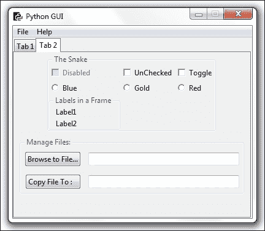

点击**浏览到文件…**按钮当前会打印到控制台。

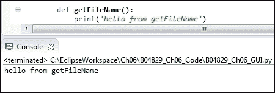

我们可以使用 tkinter 内置的文件对话框，所以让我们将以下`import`语句添加到我们的 Python GUI 模块顶部。

```py
from tkinter import filedialog as fd
from os import path
```

我们现在可以在代码中使用对话框。我们不再需要硬编码路径，而是可以使用 Python 的 os 模块来找到我们的 GUI 模块所在的全路径。

```py
def getFileName():
    print('hello from getFileName')
    fDir  = path.dirname(__file__)
    fName = fd.askopenfilename(parent=self.win, initialdir=fDir)
```

点击浏览按钮现在将打开`askopenfilename`对话框。

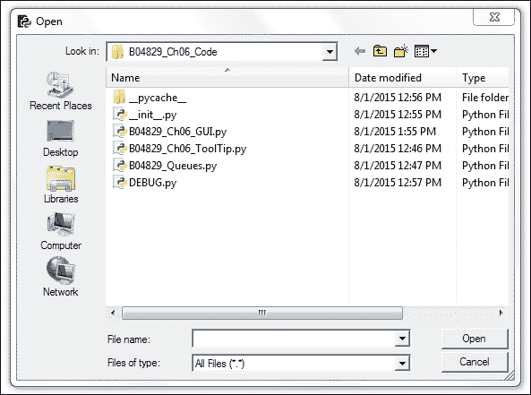

我们现在可以在这个目录中打开一个文件或浏览到不同的目录。在对话框中选择一个文件并点击**打开**按钮后，我们将把文件的完整路径保存到`fName`局部变量中。

如果在我们打开 Python 的 `askopenfilename` 对话框小部件时，能自动默认到一个目录，这样我们就不必浏览到我们要打开的特定文件所在的位置了，那就太好了。

最好的方法是回到我们的 GUI **标签 1**，这是我们接下来要做的。

我们可以将默认值设置到输入框小部件中。回到我们的**标签页 1**，这非常简单。我们只需在创建`Entry`小部件时添加以下两行代码即可。

```py
# Adding a Textbox Entry widget
self.name = tk.StringVar()
nameEntered = ttk.Entry(self.monty, width=24, textvariable=self.name)
nameEntered.grid(column=0, row=1, sticky='W')
nameEntered.delete(0, tk.END)
nameEntered.insert(0, '< default name >')
```

当我们现在运行 GUI 时，`nameEntered`输入框有一个默认值。

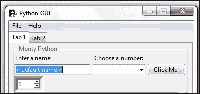

我们可以使用以下 Python 语法获取我们正在使用的模块的完整路径，然后我们可以在其下方创建一个新的子文件夹。我们可以将其作为一个模块级别的全局操作，或者我们可以在一个方法内部创建该子文件夹。

```py
# Module level GLOBALS
GLOBAL_CONST = 42
fDir   = path.dirname(__file__)
netDir = fDir + '\\Backup'

def __init__(self):
    self.createWidgets()       
    self.defaultFileEntries()

def defaultFileEntries(self):
    self.fileEntry.delete(0, tk.END)
    self.fileEntry.insert(0, fDir) 
    if len(fDir) > self.entryLen:
        self.fileEntry.config(width=len(fDir) + 3)
        self.fileEntry.config(state='readonly')

    self.netwEntry.delete(0, tk.END)
    self.netwEntry.insert(0, netDir) 
    if len(netDir) > self.entryLen:
        self.netwEntry.config(width=len(netDir) + 3)
```

我们为输入小部件设置默认值，并在设置后，使本地文件输入小部件为只读状态。

### 注意事项

这个顺序很重要。我们必须先填充条目，然后才能将其设置为只读。

在调用主事件循环之前，我们也在选择**Tab 2**，并且不再将焦点设置到**Tab 1**的`Entry`中。在我们的 tkinter `notebook`上调用`select`是零基索引的，所以通过传入值 1，我们选择**Tab 2**…

```py
# Place cursor into name Entry
# nameEntered.focus()             
tabControl.select(1)
```

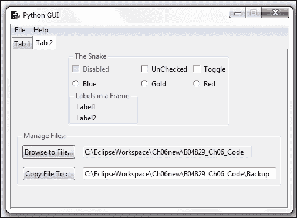

由于我们并不都在同一个网络中，这个食谱将以本地硬盘为例来展示网络的使用。

UNC 路径是一种通用命名约定，这意味着我们可以通过使用双反斜杠来访问网络服务器，而不是在 Windows PC 上访问本地硬盘驱动器时使用的典型`C:\`，从而访问我们网络上的服务器。

### 注意事项

您只需使用 UNC 路径，并将`C:\`替换为`\\<server name> \<folder>\`。

此示例可用于将我们的代码备份到备份目录，如果该目录不存在，我们可以通过使用`os.makedirs`来创建它。

```py
# Module level GLOBALS
GLOBAL_CONST = 42

from os import makedirs
fDir   = path.dirname(__file__)
netDir = fDir + '\\Backup' 
if not path.exists(netDir):
    makedirs(netDir, exist_ok = True)
```

在选择一个文件复制到其他位置后，我们导入 Python 的`shutil`模块。我们需要复制文件的源路径的完整路径，一个网络或本地目录路径，然后使用`shutil.copy`将文件名追加到我们要复制到的路径中。

### 注意事项

Shutil 是 shell 工具的简写表示。

我们还通过消息框向用户反馈复制是否成功或失败。为了实现这一点，导入`messagebox`并将其重命名为`mBox`。

在下面的代码中，我们将混合两种不同的方法来放置我们的导入语句。在 Python 中，我们有其他语言所不具备的灵活性。

我们通常将所有的导入语句放置在每个 Python 模块的顶部，以便清楚地知道我们正在导入哪些模块。

同时，现代编码方法是将变量的创建放置在它们首次被使用的函数或方法附近。

在以下代码中，我们在 Python 模块的顶部导入消息框，但随后在函数中又导入了 shutil Python 模块。

我们为什么要做这件事呢？

这甚至能行得通吗？

答案是，是的，它确实有效，我们将这个导入语句放入函数中，因为这是我们代码中唯一真正需要这个模块的地方。

如果我们从未调用这个方法，那么我们就永远不会导入这个方法所需的模块。

在某种意义上，你可以将这种技术视为懒加载设计模式。

如果我们不需要它，我们不会在真正需要在我们的 Python 代码中导入它之前就导入它。

这里的想法是，我们整个代码可能需要，比如说，二十个不同的模块。在运行时，哪些模块真正需要取决于用户交互。如果我们从未调用`copyFile()`函数，那么就没有必要导入`shutil`。

一旦我们点击调用此函数中`copyFile()`函数的按钮，我们就导入所需的模块。

```py
from tkinter import messagebox as mBox

def copyFile():
    import shutil   
    src = self.fileEntry.get()
    file = src.split('/')[-1]  
    dst = self.netwEntry.get() + '\\'+ file
    try:
      shutil.copy(src, dst)   
      mBox.showinfo('Copy File to Network', 'Success: File copied.')
    except FileNotFoundError as err:
      mBox.showerror('Copy File to Network', '*** Failed to copy file! ***\n\n' + str(err))
    except Exception as ex:
      mBox.showerror('Copy File to Network', '*** Failed to copy file! ***\n\n' + str(ex))
```

当我们现在运行我们的 GUI 并浏览到一个文件并点击复制时，文件会被复制到我们在`Entry`小部件中指定的位置。

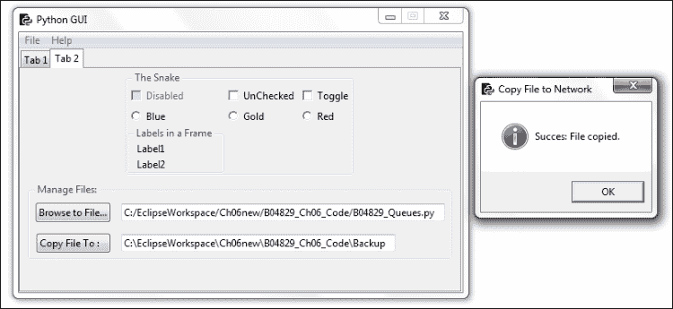

如果文件不存在，或者我们忘记浏览到文件而试图复制整个父文件夹，代码也会通知我们这一点，因为我们正在使用 Python 内置的异常处理功能。

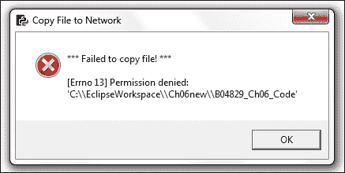

## 它是如何工作的...

我们正在使用 Python 壳工具将文件从本地硬盘复制到网络上。由于我们大多数人没有连接到同一个局域网，我们通过将代码备份到不同的本地文件夹来模拟复制过程。

我们正在使用 tkinter 的一个对话框控件，并且通过默认目录路径，我们可以提高复制文件的效率。

# 使用 TCP/IP 通过网络进行通信

这个菜谱展示了如何使用套接字通过 TCP/IP 进行通信。为了实现这一点，我们需要一个 IP 地址和一个端口号。

为了使事情简单且不依赖于不断变化的互联网 IP 地址，我们将创建自己的本地 TCP/IP 服务器，并且作为客户端，学习如何连接到它并从 TCP/IP 连接中读取数据。

我们将通过使用在前面的菜谱中创建的队列，将这种网络功能整合到我们的图形用户界面中。

## 准备就绪

我们将创建一个新的 Python 模块，它将成为 TCP 服务器。

## 如何做到这一点...

在 Python 中实现 TCP 服务器的一种方法是从 `socketserver` 模块继承。我们子类化 `BaseRequestHandler` 并然后覆盖继承的 `handle` 方法。在非常少的 Python 代码行中，我们就能实现一个 TCP 服务器模块。

```py
from socketserver import BaseRequestHandler, TCPServer

class RequestHandler(BaseRequestHandler):
    # override base class handle method
    def handle(self):
        print('Server connected to: ', self.client_address)
        while True:
            rsp = self.request.recv(512)
            if not rsp: break
            self.request.send(b'Server received: ' + rsp)

def startServer():
    serv = TCPServer(('', 24000), RequestHandler)
    serv.serve_forever()
```

我们将我们的`RequestHandler`类传递给`TCPServer`初始化器。空的单引号是一个快捷方式，用于传递本地主机，也就是我们自己的电脑。这是 127.0.0.1 的 IP 地址。元组中的第二个项目是端口号。我们可以在我们的本地电脑上选择任何未使用的端口号。

我们只需确保在 TCP 连接的客户端使用相同的端口，否则我们就无法连接到服务器。当然，在客户端能够连接之前，我们必须首先启动服务器。

我们将修改我们的`Queues.py`模块，使其成为 TCP 客户端。

```py
from socket import socket, AF_INET, SOCK_STREAM

def writeToScrol(inst):
    print('hi from Queue', inst)
    sock = socket(AF_INET, SOCK_STREAM)
    sock.connect(('localhost', 24000))
    for idx in range(10):
        sock.send(b'Message from a queue: ' + bytes(str(idx).encode()) )
        recv = sock.recv(8192).decode()
        inst.guiQueue.put(recv)      
    inst.createThread(6)
```

这是我们需要与 TCP 服务器通信的所有代码。在这个例子中，我们只是向服务器发送一些字节，服务器在返回响应之前会预先添加一些字符串。

### 注意

这展示了 TCP 通过网络通信的工作原理。

一旦我们知道了如何通过 TCP/IP 连接到远程服务器，我们就会使用我们感兴趣与之通信的程序协议所设计的任何命令。第一步是在向服务器上特定应用程序发送命令之前建立连接。

在`writeToScrol`函数中，我们将使用之前相同的循环，但现在我们将消息发送到 TCP 服务器。服务器修改接收到的消息，然后将其发送回我们这里。接下来，我们将它放入 GUI 成员队列中，正如之前的菜谱中所述，它在自己的`Thread`中运行。

### 注意

在 Python 3 中，我们必须以二进制格式通过套接字发送字符串。现在添加整数索引变得有些复杂，因为我们不得不将其转换为字符串，对其进行编码，然后将编码后的字符串转换为字节！

```py
sock.send(b'Message from a queue: ' + bytes(str(idx).encode()) )
```

注意字符串前面的`b`，然后，嗯，接下来就是所有必要的转换……

我们在 OOP 类的初始化器中在自己的线程中启动 TCP 服务器。

```py
class OOP():
    def __init__(self):
    # Start TCP/IP server in its own thread
        svrT = Thread(target=startServer, daemon=True)
        svrT.start()
```

点击**点击我！**按钮在**标签 1**上现在会在我们的`ScrolledText`小部件以及控制台上创建以下输出，并且由于使用了`Threads`，响应速度非常快。

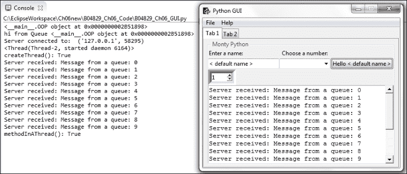

## 它是如何工作的...

我们创建了一个 TCP 服务器来模拟连接到我们局域网或互联网上的服务器。我们将队列模块转换成了 TCP 客户端。我们分别在各自的背景线程中运行队列和服务器，这使得我们的 GUI 界面非常响应灵敏。

# 使用 URLOpen 从网站读取数据

这个菜谱展示了我们如何通过使用 Python 内置模块轻松地阅读整个网页。我们首先以原始格式显示网页数据，然后对其进行解码，接着我们将它在我们的图形用户界面中显示。

## 准备就绪

我们将从网页读取数据，然后将其显示在我们 GUI 的`ScrolledText`小部件中。

## 如何做到这一点...

首先，我们创建一个新的 Python 模块，并将其命名为 `URL.py`。

我们随后导入所需的 Python 功能来读取网页。

我们可以用非常少的代码行来实现这一点。

我们将代码包裹在类似于 Java 和 C# 的 `try…except` 块中。这是 Python 支持的现代编程方法。

每当我们有可能会未完成的代码时，我们可以对这个代码进行实验，如果它工作正常，那就一切顺利。

如果`try…except`代码块中的代码无法执行，Python 解释器将抛出几种可能的异常之一，然后我们可以捕获这些异常。一旦我们捕获了异常，我们就可以决定接下来要做什么。

Python 中存在异常的层次结构，我们还可以创建自己的类，这些类继承并扩展了 Python 的异常类。

在以下展示的代码中，我们主要关注的是我们试图打开的 URL 可能不可用，因此我们将代码包裹在`try…except`代码块中。

如果代码成功打开请求的 URL，一切正常。

如果失败，可能是因为我们的网络连接中断，我们就会进入代码的异常部分，并打印出异常已发生的信息。

### 注意事项

您可以在[`docs.python.org/3.4/library/exceptions.html`](https://docs.python.org/3.4/library/exceptions.html)了解更多关于 Python 异常处理的信息。

```py
from urllib.request import urlopen
link = 'http://python.org/' 
try:
    f = urlopen(link)
    print(f)
    html = f.read()
    print(html)
    htmldecoded = html.decode()
    print(htmldecoded)

except Exception as ex:
    print('*** Failed to get Html! ***\n\n' + str(ex))
```

通过在官方 Python 网站上调用`urlopen`，我们得到整个数据作为一个长字符串。

第一条打印语句将这个长字符串输出到控制台。

我们随后在结果上调用`decode`函数，这次我们得到了超过 1,000 行的网页数据，包括一些空白字符。

我们还打印出了调用类型 `urlopen`，它是一个 `http.client.HTTPResponse` 对象。实际上，我们首先打印它。

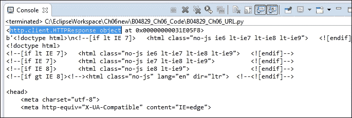

这里是我们刚刚阅读的官方 Python 网页。如果你是一名网页开发者，你可能已经有一些关于如何处理解析数据的不错想法。

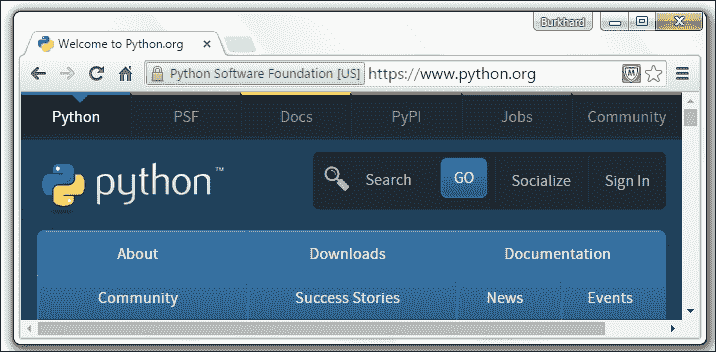

我们接下来在 GUI 中的`ScrolledText`小部件中展示这些数据。为了做到这一点，我们必须将我们的新模块连接到从网页读取数据到我们的 GUI。

为了做到这一点，我们需要一个对我们 GUI 的引用，而实现这一目标的一种方法是将我们的新模块与**Tab 1**按钮回调函数关联起来。

我们可以将解码后的 HTML 数据从 Python 网页返回到`Button`小部件，然后我们可以将其放置在`ScrolledText`控件中。

因此，让我们将我们的代码转换成一个函数，并将数据返回给调用代码。

```py
from urllib.request import urlopen
link = 'http://python.org/'
def getHtml():
    try:
        f = urlopen(link)
        #print(f)
        html = f.read()
        #print(html)
        htmldecoded = html.decode()
        #print(htmldecoded)     
    except Exception as ex:
        print('*** Failed to get Html! ***\n\n' + str(ex))
    else:
        return htmldecoded  
```

我们现在可以通过首先导入新模块，然后将数据插入到小部件中，将数据写入我们的`button`回调方法到`ScrolledText`控件中。我们还在调用`writeToScrol`之后给它一些休眠时间。

```py
import B04829_Ch06_URL as url

# Button callback
def clickMe(self):
  bq.writeToScrol(self)       
  sleep(2)
  htmlData = url.getHtml()
  print(htmlData)
  self.scr.insert(tk.INSERT, htmlData)
```

HTML 数据现在显示在我们的 GUI 小部件中。

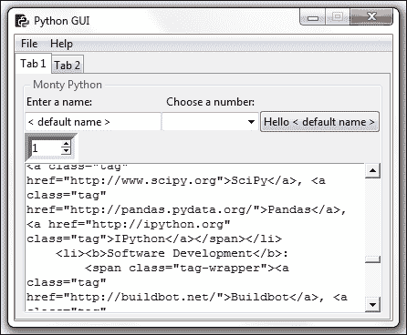

## 它是如何工作的...

我们创建了一个新的模块，用于将获取网页数据的代码与我们的 GUI 代码分离。这始终是一件好事。我们读取网页数据，然后在解码后将其返回给调用代码。然后我们使用按钮回调函数将返回的数据放置在`ScrolledText`控件中。

本章向我们介绍了一些高级的 Python 编程概念，我们将这些概念结合起来，创建了一个功能性的图形用户界面程序。
