# 第八章 国际化和测试

在本章中，我们将国际化并测试我们的 Python GUI，涵盖以下菜谱：

+   在不同语言中显示小部件文本

+   一次性更改整个 GUI 语言

+   本地化 GUI

+   准备 GUI 进行国际化

+   如何以敏捷的方式设计 GUI

+   我们需要测试 GUI 代码吗？

+   设置调试监视器

+   配置不同的调试输出级别

+   使用 Python 的 __main__ 部分 创建自测代码

+   使用单元测试创建健壮的 GUI

+   如何使用 Eclipse PyDev IDE 编写单元测试

# 简介

在本章中，我们将通过在标签、按钮、选项卡和其他小部件上显示文本，以不同的语言国际化我们的图形用户界面。

我们将简单开始，然后探讨如何在设计层面为我们的 GUI 进行国际化准备。

我们还将本地化 GUI，这与国际化略有不同。

### 注意事项

由于这些单词较长，它们已被缩写为使用单词的首字母，接着是首字母和最后一个字母之间的总字符数，最后是单词的最后一个字母。

因此，国际化变为 I18N，而本地化变为 L10N。

我们还将测试我们的 GUI 代码，编写单元测试，并探索单元测试在我们开发努力中可以提供的价值，这将引导我们走向**重构**代码的最佳实践。

# 在不同语言中显示小部件文本

在 Python 中将文本字符串国际化最简单的方法是将它们移动到一个单独的 Python 模块中，然后通过向该模块传递一个参数来选择在 GUI 中显示的语言。

虽然这种方法并不特别推荐，但根据在线搜索结果，根据您正在开发的特定应用需求，这种方法可能仍然是实现起来最实用和最快的方法。

## 准备就绪

我们将重用之前创建的 Python GUI。我们注释掉了一行创建 MySQL 选项卡的 Python 代码，因为在本章中我们不与 MySQL 数据库进行交互。

## 如何做到这一点...

在这个菜谱中，我们将开始通过将窗口标题从英语更改为其他语言来国际化我们的 GUI。

由于“GUI”这个名称在其它语言中也是相同的，我们首先扩展这个名称，以便我们能够看到我们更改的视觉效果。

让我们更改之前的代码行：

```py
self.win.title("Python GUI")
```

到：

```py
self.win.title("Python Graphical User Interface")
```

之前的代码更改导致我们的 GUI 程序出现以下标题：

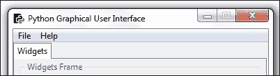

### 注意事项

在本章中，我们将使用英语和德语来举例说明国际化我们的 Python 图形用户界面（GUI）的原则。

将字符串硬编码到代码中从来不是一个好主意，因此我们可以采取的第一步是，将我们 GUI 中可见的所有字符串分离到一个独立的 Python 模块中。这是开始国际化我们 GUI 可见方面的第一步。

### 注意事项

当我们进行国际化（I18N）时，我们将一次性完成这个非常积极的重构和语言翻译。

让我们创建一个新的 Python 模块，并将其命名为 `Resources.py`。接下来，我们将我们的 GUI 标题的英文字符串移动到这个模块中，然后将其导入到我们的 GUI 代码中。

### 注意事项

我们正在将 GUI 与其显示的语言分离，这是一个面向对象设计原则。

我们的新 Python 模块，包含国际化字符串，现在看起来是这样的：

```py
Class I18N():
'''Internationalization'''
    def __init__(self, language):
        if    language == 'en': self.resourceLanguageEnglish()
        elif  language == 'de': self.resourceLanguageGerman()
        else: raise NotImplementedError('Unsupported language.')

    def resourceLanguageEnglish(self):
        self.title = "Python Graphical User Interface"

    def resourceLanguageGerman(self):
        self.title = 'Python Grafische Benutzeroberflaeche'
```

我们将这个新的 Python 模块导入到我们的主要 Python GUI 代码中，然后使用它。

```py
from B04829_Ch08_Resources import I18N
class OOP():
    def __init__(self): 
        self.win = tk.Tk()                # Create instance
        self.i18n = I18N('de')            # Select language
        self.win.title(self.i18n.title)   # Add a title
```

根据我们传递给 I18N 类的语言，我们的 GUI 将以该语言显示。

运行前面的代码，我们得到以下国际化结果：

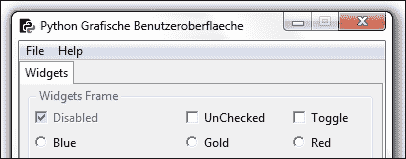

## 它是如何工作的...

我们正在将作为我们 GUI 一部分的硬编码字符串拆分到它们自己的独立模块中。我们通过创建一个类来实现这一点，并在类的`__init__()`方法中，根据传入的语言参数选择我们的 GUI 将显示哪种语言。

这有效。

我们可以通过将国际化字符串分离到单独的文件中进一步模块化我们的代码，这些文件可能是 XML 格式或其他格式。我们还可以从 MySQL 数据库中读取它们。

### 注意事项

这是一个“关注点分离”的编码方法，它是面向对象编程的核心。

# 一次性更改整个 GUI 语言

在这个菜谱中，我们将通过重构之前所有硬编码的英文字符串到一个单独的 Python 模块中，然后对这些字符串进行国际化，一次性更改整个 GUI 显示名称。

这个示例表明，避免在 GUI 显示的字符串中硬编码，而是将 GUI 代码与 GUI 显示的文本分离，是一个良好的设计原则。

### 注意

以模块化方式设计我们的 GUI 使得国际化它变得更加容易。

## 准备就绪

我们将继续使用之前菜谱中的 GUI。在那个菜谱中，我们已将 GUI 的标题进行了国际化。

## 如何做到这一点...

为了国际化我们所有 GUI 小部件中显示的文本，我们必须将所有硬编码的字符串移动到一个单独的 Python 模块中，这就是我们接下来要做的。

之前，我们 GUI 显示的单词字符串散布在我们的 Python 代码中。

这是我们未进行国际化（I18N）的图形用户界面（GUI）的样子。

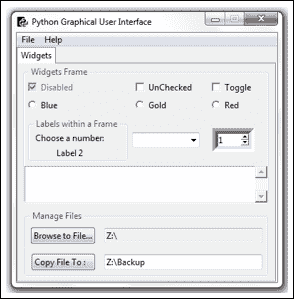

每个小部件的每一行字符串，包括我们 GUI 的标题、标签控制名称等等，都是硬编码的，并且与创建 GUI 的代码混合在一起。

### 注意事项

在我们 GUI 软件开发过程的设计阶段，考虑如何最好地国际化我们的 GUI 是一个好主意。

以下是我们代码的摘录。

```py
WIDGET_LABEL = ' Widgets Frame '
class OOP():
    def __init__(self): 
        self.win = tk.Tk()              # Create instance
        self.win.title("Python GUI")    # Add a title

    # Radiobutton callback function
    def radCall(self):
        radSel=self.radVar.get()
        if   radSel == 0: self.monty2.configure(text='Blue')
        elif radSel == 1: self.monty2.configure(text='Gold')
        elif radSel == 2: self.monty2.configure(text='Red')
```

在这个菜谱中，我们正在国际化我们 GUI 小部件中显示的所有字符串。我们不会国际化输入到我们的 GUI 中的文本*输入*，因为这取决于您电脑上的本地设置。

以下为英文国际化字符串的代码：

```py
classI18N():
'''Internationalization'''

    def __init__(self, language):
        if   language == 'en': self.resourceLanguageEnglish()
        elif language == 'de': self.resourceLanguageGerman()
        else: raiseNotImplementedError('Unsupported language.')

    def resourceLanguageEnglish(self):
        self.title = "Python Graphical User Interface"

        self.file  = "File"
        self.new   = "New"
        self.exit  = "Exit"
        self.help  = "Help"
        self.about = "About"

        self.WIDGET_LABEL = ' Widgets Frame '

        self.disabled  = "Disabled"
        self.unChecked = "UnChecked"
        self.toggle    = "Toggle"

        # Radiobutton list
        self.colors   = ["Blue", "Gold", "Red"]
        self.colorsIn = ["in Blue", "in Gold", "in Red"]

        self.labelsFrame  = ' Labels within a Frame '
        self.chooseNumber = "Choose a number:"
        self.label2       = "Label 2"

        self.mgrFiles = ' Manage Files '

        self.browseTo = "Browse to File..."
        self.copyTo   = "Copy File To :   "
```

在我们的 Python GUI 模块中，所有之前硬编码的字符串现在都已被我们新的 I18N 类实例所替换，该类位于 `Resources.py` 模块中。

这里是我们重构的 `GUI.py` 模块的一个示例：

```py
from B04829_Ch08_Resources import I18N

class OOP():
    def __init__(self): 
        self.win = tk.Tk()              # Create instance
        self.i18n = I18N('de')          # Select language
        self.win.title(self.i18n.title) # Add a title

    # Radiobutton callback function
    def radCall(self):
          radSel = self.radVar.get()
        if   radSel == 0: self.widgetFrame.configure(text=self.i18n.WIDGET_LABEL + self.i18n.colorsIn[0])
        elif radSel == 1: self.widgetFrame.configure(text=self.i18n.WIDGET_LABEL + self.i18n.colorsIn[1])
        elif radSel == 2: self.widgetFrame.configure(text=self.i18n.WIDGET_LABEL + self.i18n.colorsIn[2])
```

注意到之前所有硬编码的英文字符串都已替换为对我们新 I18N 类实例的调用。

一个例子是 `self.win.title(self.i18n.title)`。

这为我们提供了国际化 GUI 的能力。我们只需使用相同的变量名，并通过传递一个参数来组合它们，以选择我们希望显示的语言。

我们也可以在 GUI 中动态更改语言，或者我们可以读取本地 PC 设置，并根据这些设置决定我们的 GUI 文本应该显示哪种语言。

我们现在可以通过简单地用相应的单词填充变量名来实现对德语的翻译。

```py

class I18N():
    '''Internationalization'''
    def __init__(self, language):      
        if   language == 'en': self.resourceLanguageEnglish()
        elif language == 'de': self.resourceLanguageGerman()
        else: raise NotImplementedError('Unsupported language.')

def resourceLanguageGerman(self):
        self.file  = "Datei"
        self.new   = "Neu"
        self.exit  = "Schliessen"
        self.help  = "Hilfe"
        self.about = "Ueber"

        self.WIDGET_LABEL = ' Widgets Rahmen '

        self.disabled  = "Deaktiviert"
        self.unChecked = "NichtMarkiert"
        self.toggle    = "Markieren"

        # Radiobutton list
        self.colors   = ["Blau", "Gold", "Rot"]    
        self.colorsIn = ["in Blau", "in Gold", "in Rot"]  

        self.labelsFrame  = ' EtikettenimRahmen '
        self.chooseNumber = "WaehleeineNummer:"
        self.label2       = "Etikette 2"

        self.mgrFiles = ' DateienOrganisieren '

        self.browseTo = "WaehleeineDatei... "
        self.copyTo   = "KopiereDateizu :     "
```

在我们的 GUI 代码中，现在我们可以通过一行 Python 代码来更改整个 GUI 显示语言。

```py
class OOP():
    def __init__(self): 
        self.win = tk.Tk()        # Create instance
        self.i18n = I18N('de')    # Pass in language
```

运行前面的代码将创建以下国际化 GUI：

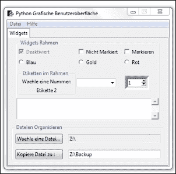

## 它是如何工作的...

为了国际化我们的图形用户界面，我们将硬编码的字符串重构为一个独立的模块，然后通过传递一个字符串作为我们的 I18N 类初始化器，使用相同的类成员来国际化我们的 GUI，从而有效控制 GUI 显示的语言。

# 本地化 GUI

在完成我们 GUI 国际化的第一步之后，下一步就是本地化它。我们为什么要这样做呢？

嗯，在美国，我们都是牛仔，我们生活在不同的时区。

所以虽然我们“国际化”到了美国，但我们的马儿还是会根据不同的时区醒来（并且会期待按照它们自己内在的马儿时区时间表被喂食）。

这就是本地化的作用所在。

## 准备工作

我们通过本地化扩展了在上一道菜谱中开发的图形用户界面。

## 如何做到这一点...

我们首先通过使用 pip 安装 Python 的 pytz 时区模块。我们在命令处理器提示符中输入以下命令：

```py
pip install pytz

```

### 注意事项

在这本书中，我们使用的是 Python 3.4 版本，该版本内置了 `pip` 模块。如果你使用的是较旧版本的 Python，那么你可能需要先安装 `pip` 模块。

当成功时，我们得到以下结果。

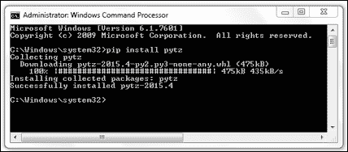

### 注意

截图显示命令已下载`.whl`格式的文件。如果您尚未这样做，可能需要先安装 Python 的`wheel`模块。

这将 Python 的 `pytz` 模块安装到了 `site-packages` 文件夹中，因此现在我们可以从我们的 Python GUI 代码中导入此模块。

我们可以通过运行以下代码列出所有现有的时区，该代码将在我们的`ScrolledText`小部件中显示时区。首先，我们在 GUI 中添加一个新的`Button`小部件。

```py
import pytz
class OOP():

    # TZ Button callback
    def allTimeZones(self):
        for tz in all_timezones:
            self.scr.insert(tk.INSERT, tz + '\n')

    def createWidgets(self):
        # Adding a TZ Button
        self.allTZs = ttk.Button(self.widgetFrame, 
                                 text=self.i18n.timeZones, 
                                 command=self.allTimeZones)
        self.allTZs.grid(column=0, row=9, sticky='WE')
```

点击我们新的`按钮`小部件将产生以下输出：

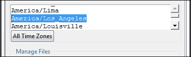

在我们安装了 tzlocal Python 模块之后，我们可以通过运行以下代码来打印我们的当前区域设置：

```py
    # TZ Local Button callback
    def localZone(self):   
        from tzlocal import get_localzone
        self.scr.insert(tk.INSERT, get_localzone())

    def createWidgets(self):
        # Adding local TZ Button
        self.localTZ = ttk.Button(self.widgetFrame, 
                                  text=self.i18n.localZone, 
                                  command=self.localZone
        self.localTZ.grid(column=1, row=9, sticky='WE')
```

我们已经将`Resources.py`中两个新动作`Buttons`的字符串进行了国际化处理。

```py
        self.timeZones = "All Time Zones"
        self.localZone = "Local Zone"
```

```py
        self.timeZones = "Alle Zeitzonen"
        self.localZone = "Lokale Zone"
```

点击我们新的按钮现在会告诉我们我们所在的时区（嘿，我们不知道这个，不是吗……）。

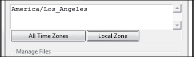

我们现在可以将本地时间转换为不同的时区。让我们以美国东部标准时间为例。

我们通过改进现有代码，在未使用的标签 2 中显示我们当前的本地时间。

```py
import pytz
from datetime import datetime
class OOP():
    # Format local US time
    def getDateTime(self):
        fmtStrZone = ""%Y-%m-%d %H:%M:%S""
        self.lbl2.set(datetime.now().strftime(fmtStrZone))

        # Place labels into the container element
        ttk.Label(labelsFrame, text=self.i18n.chooseNumber).grid(column=0, row=0)
        self.lbl2 = tk.StringVar()
        self.lbl2.set(self.i18n.label2)
        ttk.Label(labelsFrame, textvariable=self.lbl2).grid(column=0, row=1)

        # Adding getTimeTZ Button
        self.dt = ttk.Button(self.widgetFrame, text=self.i18n.getTime, command=self.getDateTime)
        self.dt.grid(column=2, row=9, sticky='WE')
```

当我们运行代码时，我们的国际化标签 2（在德语中显示为`Etikette 2`）将显示当前本地时间。

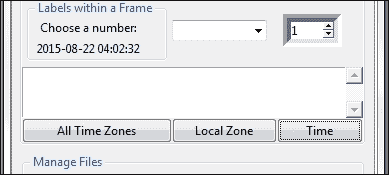

我们现在可以通过先将本地时间转换为**协调世界时**（**UTC**），然后应用从导入的`pytz`模块中的`timezone`函数来更改我们的本地时间为美国东部标准时间（US EST）。

```py
import pytz
class OOP():
    # Format local US time with TimeZone info
    def getDateTime(self):
        fmtStrZone = "%Y-%m-%d %H:%M:%S %Z%z"
        # Get Coordinated Universal Time
        utc = datetime.now(timezone('UTC'))
        print(utc.strftime(fmtStrZone))

        # Convert UTC datetime object to Los Angeles TimeZone
        la = utc.astimezone(timezone('America/Los_Angeles'))
        print(la.strftime(fmtStrZone))

        # Convert UTC datetime object to New York TimeZone
        ny = utc.astimezone(timezone('America/New_York'))
        print(ny.strftime(fmtStrZone))

        # update GUI label with NY Time and Zone
        self.lbl2.set(ny.strftime(fmtStrZone))
```

点击现在重命名为“纽约”的按钮将产生以下输出：

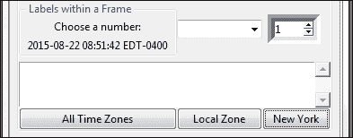

我们将标签 2 更新为纽约的当前时间，并且正在使用美国日期格式化字符串，将洛杉矶和纽约的 UTC 时间及其相对于 UTC 时间的时区转换打印到 Eclipse 控制台。

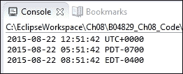

### 注意事项

UTC（协调世界时）从不观察夏令时。在**东部夏令时**（**EDT**）UTC 比当地时间快四小时，而在**标准时间**（**EST**）UTC 比当地时间快五小时。

## 它是如何工作的...

为了本地化日期和时间信息，我们首先需要将我们的本地时间转换为协调世界时（UTC）。然后，我们应用`timezone`信息，并使用`pytz` Python 时区模块中的`astimezone`函数将时间转换为世界上任何时区！

在这个菜谱中，我们将美国西海岸的当地时间转换成了协调世界时（UTC），然后在我们的图形用户界面（GUI）的标签 2 中显示了美国东海岸的时间。

# 准备 GUI 进行国际化

在这个菜谱中，我们将通过实现认识到，将英语翻译成外语并不像预期的那样事事都那么简单，来为我们的 GUI 国际化做准备。

我们仍然有一个问题需要解决，那就是如何正确显示来自外语的非英语 Unicode 字符。

人们可能预期 Python 3 会自动处理显示德语的ä、ö和ü Unicode 重音字符，但实际上并非如此。

## 准备就绪

我们将继续使用我们在最近章节中开发的 Python GUI。首先，我们将把 `GUI.py` 初始化代码中的默认语言更改为德语。

我们通过取消注释行`self.i18n = I18N('de')`来实现这一点。

## 如何做到这一点...

当我们将单词 `Ueber` 改为正确的德语 `Űber` 并使用重音符号时，Eclipse PyDev 插件不太高兴。

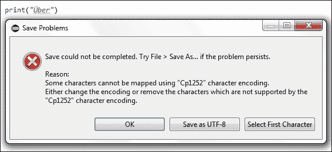

我们得到了一条错误信息，这有点令人困惑，因为我们从 Eclipse PyDev 控制台中运行相同的代码行时，得到了预期的结果。

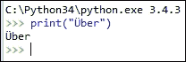

当我们请求 Python 的默认编码时，我们得到预期的结果，即 UTF-8。

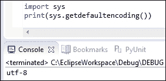

### 注意事项

我们当然可以始终求助于 Unicode 的直接表示。

使用 Windows 内置的字符映射表，我们可以找到重音字符的 Unicode 表示，对于带重音的大写 U，其表示为 U+00DC。

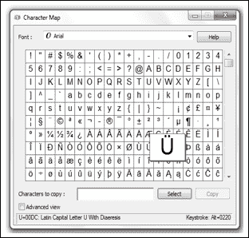

虽然这个解决方案确实很丑陋，但它确实有效。我们不需要直接输入字符Ü，而是可以传递 Unicode 编码\u00DC 来正确地在我们的 GUI 中显示这个字符。

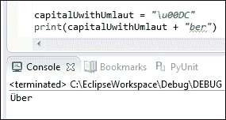

我们也可以使用 Eclipse 中的 PyDev 直接接受默认编码从 Cp1252 更改为 UTF-8，但我们可能并不总是收到这样的提示。

相反，我们可能会看到以下错误信息显示：

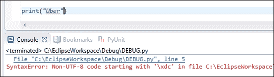

解决这个问题的方法是，将 PyDev 项目的 **文本文件编码** 属性更改为 UTF-8。

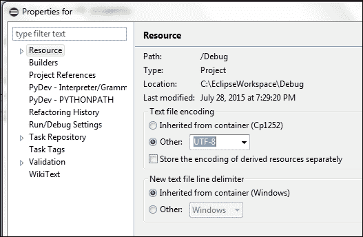

在更改了 PyDev 默认编码后，我们现在可以显示那些德语重音字符。我们还更新了标题，以使用正确的德语ä字符。

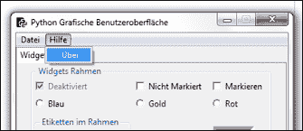

## 它是如何工作的...

国际化和处理外文 Unicode 字符通常不像我们希望的那样简单直接。有时，我们不得不寻找解决方案，通过 Python 直接使用前缀`\u`来表示 Unicode 字符可以解决这个问题。

在其他时候，我们只需找到我们的开发环境设置进行调整。

# 如何以敏捷的方式设计 GUI

现代敏捷软件开发的设计和编码方法源于软件专业人士的经验教训。这种方法适用于图形用户界面（GUI）和其他任何代码。敏捷软件开发的主要关键之一是持续进行的重构过程。

代码重构如何帮助我们进行软件开发的一个实际例子是首先通过使用函数来实现一些简单的功能。

随着我们的代码复杂性增加，我们可能希望将我们的函数重构为类的成员方法。这种方法将使我们能够移除全局变量，并且使我们在类内部放置方法的位置更加灵活。

虽然我们代码的功能没有改变，但其结构已经发生了变化。

在这个过程中，我们进行编码、测试、重构，然后再进行测试。我们以短周期进行，通常从实现某些功能所需的最小代码量开始。

### 注意事项

测试驱动软件开发是敏捷开发方法中的一种特定风格。

虽然我们的图形用户界面（GUI）运行得很好，但我们的主要`GUI.py`代码的复杂性一直在不断增加，开始变得有点难以对代码有一个全面的了解。

这意味着我们需要重构我们的代码。

## 准备就绪

我们将重构在前几章中创建的 GUI。我们将使用 GUI 的英文版本。

## 如何做到这一点...

我们在之前的菜谱中已经将 GUI 显示的所有名称都进行了国际化处理。这为我们重构代码提供了一个非常好的起点。

### 注意事项

重构是改进现有代码结构、可读性和可维护性的过程。我们并不是在添加新功能。

在前几章和食谱中，我们一直采用“自上而下”的瀑布式开发方法扩展我们的 GUI，将`import`语句添加到顶部，并将代码编写到现有代码的底部。

当查看代码时这很有用，但现在看起来有点杂乱，我们可以改进这一点以帮助我们的未来发展。

让我们先清理一下我们的`import`语句部分，它目前看起来是这样的：

```py
#======================
# imports
#======================
import tkinter as tk
from tkinter import ttk
from tkinter import scrolledtext
from tkinter import Menu
from tkinter import Spinbox
import B04829_Ch08_ToolTip as tt
from threading import Thread
from time import sleep
from queue import Queue
from tkinter import filedialog as fd
from os import path 
from tkinter import messagebox as mBox
from B04829_Ch08_MySQL import MySQL
from B04829_Ch08_Resources import I18N
from datetime import datetime
from pytz import all_timezones, timezone

# Module level GLOBALS
GLOBAL_CONST = 42
```

通过简单地分组相关导入，我们可以减少代码行的数量，这提高了我们导入的可读性，使它们看起来不那么令人压倒。

```py
#======================
# imports
#======================
import tkinter as tk
from tkinter import ttk, scrolledtext, Menu, Spinbox, filedialog as fd, messagebox as mBox
from queue import Queue
from os import path 
import B04829_Ch08_ToolTip as tt
from B04829_Ch08_MySQL import MySQL
from B04829_Ch08_Resources import I18N
from B04829_Ch08_Callbacks_Refactored import Callbacks
from B04829_Ch08_Logger import Logger, LogLevel

# Module level GLOBALS
GLOBAL_CONST = 42
```

我们可以通过将回调方法拆分到它们自己的模块中来进一步重构我们的代码。这样做通过将不同的导入语句分离到它们所需的模块中，提高了可读性。

让我们将我们的 `GUI.py` 重命名为 `GUI_Refactored.py` 并创建一个新的模块，我们将其命名为 `Callbacks_Refactored.py`。

这为我们带来了这个新的架构。

```py
#======================
# imports
#======================
import tkinter as tk
from tkinter import ttk, scrolledtext, Menu, Spinbox, \
                    filedialog as fd, messagebox as mBox
from queue import Queue
from os import path 
import B04829_Ch08_ToolTip as tt
from B04829_Ch08_MySQL import MySQL
from B04829_Ch08_Resources import I18N
from B04829_Ch08_Callbacks_Refactored import Callbacks

# Module level GLOBALS
GLOBAL_CONST = 42

class OOP():
    def __init__(self): 

        # Callback methods now in different module
        self.callBacks = Callbacks(self)
```

注意我们在调用`Callbacks`初始化器时传递了我们自己的 GUI 类实例（`self`）。

我们的新`回调`类如下：

```py
#======================
# imports
#======================
import tkinter as tk
from time import sleep
from threading import Thread
from pytz import all_timezones, timezone
from datetime import datetime

class Callbacks():
    def __init__(self, oop):
        self.oop = oop

    def defaultFileEntries(self): 
        self.oop.fileEntry.delete(0, tk.END)
        self.oop.fileEntry.insert(0, 'Z:\\')        # bogus path
        self.oop.fileEntry.config(state='readonly')         
        self.oop.netwEntry.delete(0, tk.END)
        self.oop.netwEntry.insert(0, 'Z:\\Backup')  # bogus path

    # Combobox callback 
    def _combo(self, val=0):
        value = self.oop.combo.get()
        self.oop.scr.insert(tk.INSERT, value + '\n')
```

在我们新类的初始化器中，传入的 GUI 实例被命名为`self.oop`并在此新的 Python 类模块中全程使用。

运行重构后的 GUI 代码仍然有效。我们只是提高了代码的可读性，并简化了代码的复杂性，为后续的开发工作做准备。

## 它是如何工作的...

我们首先通过将相关的导入语句分组来提高了代码的可读性。接下来，我们将回调方法独立成自己的类和模块，以进一步降低代码的复杂性。

我们在之前的菜谱中已经采用了相同的面向对象方法，即让`ToolTip`类位于自己的模块中，并且国际化了所有 GUI 字符串。

在这个菜谱中，我们在重构方面更进一步，通过将我们自己的实例传递给 GUI 依赖的回调方法的类。

### 注意事项

现在我们更好地理解了模块化方法在软件开发中的价值，我们很可能会在未来的软件设计中采用这种方法。

# 我们需要测试 GUI 代码吗？

在编码阶段以及发布服务包或修复漏洞时，测试我们的软件是一项重要的活动。

测试有不同的级别。第一个级别是开发者测试，通常从编译器或解释器不允许我们运行有错误的代码开始，迫使我们测试代码中单个方法的各个小部分。

这是第一层防御。

防御性编码的第二层是当我们的源代码控制系统通知我们有一些冲突需要解决，并且不允许我们提交修改后的代码。

这在我们以专业方式在开发者团队中工作时非常有用且绝对必要。源代码控制系统是我们的朋友，它会指出是 ourselves 或其他开发者提交到特定分支或树顶部的更改，并告诉我们我们的本地代码版本已经过时，并且存在一些需要在我们提交代码到仓库之前解决的冲突。

本部分假设您使用源代码控制系统来管理和存储您的代码。例如，包括 git、mercurial、svn 以及其他几个。Git 是一个非常流行的源代码控制工具，并且对于单个用户是免费的。

第三级是 API 级别，我们通过只允许通过发布的接口与我们的代码进行交互，来封装我们代码中可能出现的未来变化。

### 注意事项

请参阅“面向接口编程，而非实现”，《设计模式》，第 17 页。

另一个测试级别是集成测试，当最终建成的桥梁的一半与其它开发团队创建的另一半相遇时，这两部分并不处于相同的高度（比如说，一半最终比另一半高出两米或码……）。

然后，还有最终用户测试。虽然我们按照他们指定的来构建，但这并不是他们真正想要的。

哎呀……我想所有前面的例子都是我们需要在设计阶段和实现阶段测试代码的有效理由。

## 准备就绪

我们将测试我们在最近几道菜谱和章节中创建的图形用户界面。我们还将展示一些可能出错的情况以及为什么我们需要持续测试我们的代码以及通过 API 调用的代码。

## 如何做到这一点...

虽然许多经验丰富的开发者习惯在调试代码时到处撒播 `printf()` 语句，但 21 世纪的许多开发者已经习惯了现代 IDE 开发环境，这些环境能有效地加快开发速度。

在这本书中，我们使用的是 Eclipse IDE 的 PyDev Python 插件。

如果你刚开始使用带有 PyDev 插件的 IDE，如 Eclipse，一开始可能会觉得有点令人不知所措。Python 3 自带的 Python IDLE 工具也拥有一个更简单的调试器，你可能希望先探索一下它。

当我们的代码出现问题时，我们必须进行调试。进行这一过程的第一步是设置断点，然后逐行或逐方法地逐步执行我们的代码。

在代码中进进出出是日常活动，直到代码运行顺畅为止。

在 Python 图形用户界面编程中，可能出现的第一种错误之一是遗漏导入所需的模块或导入现有的模块。

这里有一个简单的例子：

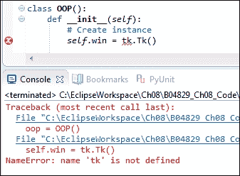

我们正在尝试创建一个 tkinter 类的实例，但事情并没有像预期的那样工作。

好吧，我们只是忘记导入模块了，我们可以在类创建上方添加一行 Python 代码来修复这个问题，那里是导入语句所在的位置。

```py
#======================
# imports
#======================
import tkinter as tk
```

这是一个例子，其中我们的开发环境为我们进行测试。我们只需进行调试和代码修复。

另一个与开发者测试更为密切相关的例子是，当我们编写条件语句时，在常规开发过程中，并没有对所有逻辑分支进行测试。

以上一章的例子来说明，假设我们点击了**获取报价**按钮，并且这个操作成功了，但我们从未点击过**修改报价**按钮。第一个按钮的点击产生了预期的结果，但第二个按钮的点击抛出了一个异常（因为我们还没有实现这段代码，可能完全忘记了它）。

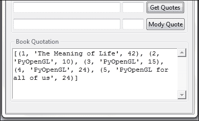

点击**Mody Quote**按钮将生成以下结果：

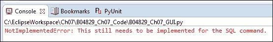

另一个潜在的错误区域是当一个函数或方法突然不再返回预期的结果。比如说，我们正在调用以下这个函数，它原本会返回预期的结果。

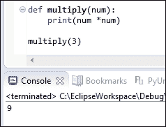

然后，有人犯了一个错误，我们就不再得到之前的结果了。

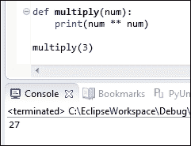

我们不是通过乘法，而是通过传入数字的幂来计算，结果也不再是以前的样子了。

### 注意事项

在软件测试中，这种错误被称为回归。

## 它是如何工作的...

在这个菜谱中，我们通过展示代码可能出错和引入软件缺陷（即错误）的几个示例，强调了在软件开发生命周期的几个阶段进行软件测试的重要性。

# 设置调试监视器

在现代**集成开发环境**（**IDEs**）如 Eclipse 中的 PyDev 插件或另一个 IDE 如 NetBeans 中，我们可以在代码执行期间设置调试监视器来监控我们的 GUI 状态。

这与微软的 Visual Studio IDE 以及更近期的 Visual Studio.NET 版本非常相似。

### 注意事项

设置调试监视器是一种非常方便的方式来帮助我们开发工作。

## 准备就绪

在这个菜谱中，我们将重用我们在早期菜谱中开发的 Python GUI。我们正在逐步检查我们之前开发的代码并设置调试监视器。

## 如何做这件事...

### 注意事项

虽然这个菜谱适用于基于 Java 的 Eclipse IDE 中的 PyDev 插件，但其原则也适用于许多现代 IDE。

我们可能希望设置断点的第一个位置是在我们通过调用 tkinter 主事件循环使 GUI 可见的地方。

左侧的绿色气球符号是 PyDev/Eclipse 中的断点。当我们以调试模式执行代码时，一旦执行达到断点，代码的执行将会停止。此时，我们可以看到当前作用域内所有变量的值。我们还可以在调试窗口中输入表达式，这些表达式将会被执行，并显示结果。如果结果是我们所期望的，我们可能会决定使用刚刚学到的知识来修改我们的代码。

我们通常通过在 IDE 工具栏中点击图标或使用键盘快捷键（例如按下*F5*进入代码，*F6*跳过，*F7*退出当前方法）来逐步执行代码。

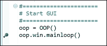

将断点放置在我们所在的位置然后进入这段代码，结果却成了一个麻烦，因为我们最终进入了一些我们目前并不想调试的低级 tkinter 代码。我们可以通过点击“Step-Out”工具栏图标（位于项目菜单下方右侧的第三个黄色箭头）或者按*F7*键（假设我们在使用 Eclipse 中的 PyDev）来退出低级 tkinter 代码。

我们通过点击截图右侧的调试工具栏图标开始调试会话。如果我们不进行调试而执行，则点击带有白色三角形的绿色圆圈，这是位于 bug 图标右侧的图标。

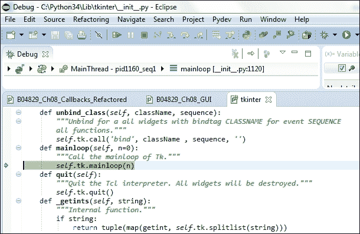

一个更好的想法是将我们的断点放置得更靠近我们自己的代码，以便观察我们自己的 Python 变量的一些值。

在现代图形用户界面的事件驱动世界中，我们必须将断点放置在事件发生时被调用的代码上，例如按钮点击。

目前，我们主要的功能之一位于一个按钮点击事件中。当我们点击标有**纽约**的按钮时，我们创建一个事件，然后导致我们的 GUI 发生某些操作。

让我们在名为 `getDateTime()` 的 **纽约** 按钮回调方法处设置一个断点。

当我们现在运行调试会话时，我们将停在断点处，然后我们可以启用作用域内变量的监视。

在 Eclipse 中使用 PyDev，我们可以右键点击一个变量，然后从弹出菜单中选择监视命令。变量的名称、其类型和当前值将在下一张截图所示的“表达式调试窗口”中显示。我们还可以直接在表达式窗口中输入。

我们所关注的变量不仅限于简单的数据类型。我们可以观察类实例、列表、字典等等。

当观察这些更复杂对象时，我们可以在表达式窗口中展开它们，并深入到类实例、字典等所有值的细节中。

我们通过点击位于每个变量旁边**名称**列最左侧出现的观察变量左侧的三角形来完成这个操作。

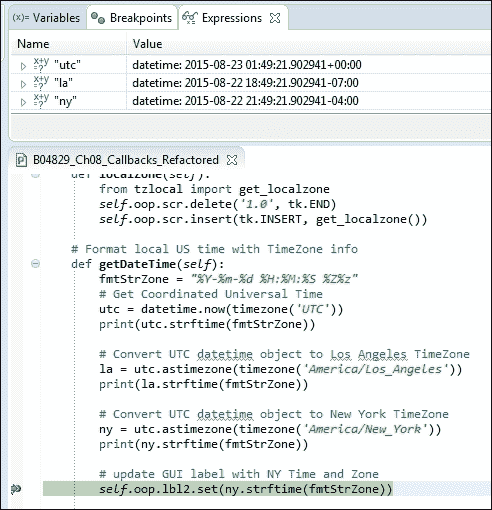

当我们在打印不同时区位置的值时，从长远来看，设置调试监视器要方便和高效得多。我们不必用过时的 C 风格`printf()`语句来使我们的代码变得杂乱。

### 注意事项

如果你感兴趣，想学习如何安装带有 PyDev 插件的 Eclipse 用于 Python，有一个很棒的教程会指导你开始安装所有必要的免费软件，然后通过创建一个简单、可工作的 Python 程序来介绍 Eclipse 中的 PyDev。[`www.vogella.com/tutorials/Python/article.html`](http://www.vogella.com/tutorials/Python/article.html)

## 它是如何工作的...

我们在 21 世纪使用现代的集成开发环境（IDEs），这些环境是免费提供的，帮助我们创建稳固的代码。

这个菜谱展示了如何设置调试监视器，这是每个开发者技能集中的一个基本工具。即使在不是寻找错误的情况下逐步执行我们的代码，也能确保我们理解我们的代码，并且可以通过重构来改进我们的代码。

以下是我读过的第一本编程书籍《Java 编程思想》中的一段引言，该书由布鲁斯·埃克尔所著。

|   | *"抵制急于求成的冲动，它只会让你更慢。" |   |
| --- | --- | --- |
|   | --*布鲁斯·埃克尔* |

几乎二十年后，这些建议经受了时间的考验。

### 注意事项

调试监视器帮助我们创建稳固的代码，并且不是浪费时间。

# 配置不同的调试输出级别

在这个菜谱中，我们将配置不同的调试级别，我们可以在运行时选择和更改这些级别。这使我们能够控制在调试代码时我们想要深入到代码中的程度。

我们将创建两个新的 Python 类，并将它们都放入同一个模块中。

我们将使用四种不同的日志级别，并将我们的调试输出写入我们将创建的日志文件。如果日志文件夹不存在，我们也将自动创建它。

日志文件的名称是执行脚本的名称，即我们重构后的`GUI.py`。我们也可以通过传递日志类初始化器的完整路径来为我们的日志文件选择其他名称。

## 准备就绪

我们将继续使用之前菜谱中重构的 `GUI.py` 代码。

## 如何做到这一点...

首先，我们创建一个新的 Python 模块，并将两个新的`类`放入其中。第一个`类`非常简单，用于定义日志级别。这基本上是一个`枚举`。

```py
class LogLevel:
'''Define logging levels.'''
    OFF     = 0
    MINIMUM = 1
    NORMAL  = 2
    DEBUG   = 3
```

第二个`class`通过使用传入的文件名完整路径创建一个日志文件，并将其放置在`logs`文件夹中。在首次运行时，`logs`文件夹可能不存在，因此代码会自动创建该文件夹。

```py
class Logger:   
    ''' Create a test log and write to it. '''     
    #-------------------------------------------------------
    def __init__(self, fullTestName, loglevel=LogLevel.DEBUG):
        testName = os.path.splitext(os.path.basename(fullTestName))[0]
        logName  = testName  + '.log'    

        logsFolder = 'logs'          
        if not os.path.exists(logsFolder):                     
            os.makedirs(logsFolder, exist_ok = True)

        self.log = os.path.join(logsFolder, logName)           
        self.createLog()

        self.loggingLevel = loglevel
        self.startTime    = time.perf_counter()

    #------------------------------------------------------
    def createLog(self):    
        with open(self.log, mode='w', encoding='utf-8') as logFile:
            logFile.write(self.getDateTime() + 
                          '\t\t*** Starting Test ***\n')
        logFile.close()
```

为了写入我们的日志文件，我们使用`writeToLog()`方法。在方法内部，我们首先做的事情是检查消息的日志级别是否高于我们设定的目标日志输出限制。如果消息的级别较低，我们就丢弃它并立即从方法返回。

如果消息具有我们想要显示的日志级别，我们接着检查它是否以换行符开头，如果是的话，我们就通过使用 Python 的切片操作符（`msg = msg[1:]`）从索引 1 开始切片来丢弃换行符。

我们随后将一行写入日志文件，包括当前日期时间戳、两个制表符空格、我们的消息，并以换行符结束。

```py
    def writeToLog(self, msg='', loglevel=LogLevel.DEBUG): 
        # control how much gets logged
        if loglevel > self.loggingLevel:
            return

        # open log file in append mode 
        with open(self.log, mode='a', encoding='utf-8') as logFile:
            msg = str(msg)
            if msg.startswith('\n'):
                msg = msg[1:]
            logFile.write(self.getDateTime() + '\t\t' + msg + '\n')

        logFile.close()
```

我们现在可以导入我们的新 Python 模块，并在我们的 GUI 代码的`__init__`部分创建`Logger`类的实例。

```py
from os import path 
from B04829_Ch08_Logger import Logger
class OOP():
    def __init__(self): 
        # create Logger instance
        fullPath = path.realpath(__file__)
        self.log = Logger(fullPath)
        print(self.log)
```

我们通过 `path.realpath(__file__)` 获取正在运行的 GUI 脚本的完整路径，并将其传递给 `Logger` 类的初始化器。如果 `logs` 文件夹不存在，我们的 Python 代码会自动创建它。

这产生了以下结果：

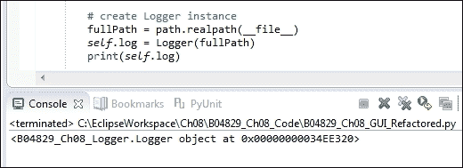

上一张截图显示我们创建了我们新的`Logger`类的一个实例，下面的截图显示`logs`文件夹以及日志文件都已创建。

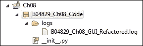

当我们打开日志时，可以看到当前日期和时间以及一个默认字符串已被写入日志。

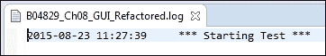

## 它是如何工作的...

在这个菜谱中，我们创建了自己的日志类。虽然 Python 自带了日志模块，但创建自己的日志类非常简单，这使我们能够完全控制日志的格式。当我们将自己的日志输出与 MS Excel 或我们在前一章中探索的 Matplotlib 结合使用时，这非常有用。

在下一个示例中，我们将使用 Python 内置的 `__main__` 功能来使用我们刚刚创建的四个不同的日志级别。

# 使用 Python 的 __main__ 部分 创建自测代码

Python 自带一个非常实用的功能，允许每个模块进行自我测试。利用这个功能是确保我们的代码更改不会破坏现有代码的绝佳方式，此外，`__main__`自我测试部分还可以作为每个模块工作方式的文档。

### 注意事项

几个月或几年后，我们有时会忘记我们的代码在做什么，所以代码本身有注释说明确实非常有帮助。

在可能的情况下，为每个 Python 模块添加一个自我测试部分是个好主意。有时可能做不到，但在大多数模块中，这样做是可行的。

## 准备就绪

我们将扩展之前的配方，因此，为了理解这个配方中的代码在做什么，我们首先必须阅读并理解之前配方的代码。

## 如何做到这一点...

首先，我们将通过将这个自测部分添加到我们的`Resources.py`模块中，来探索 Python `__main__`自测部分的力量。每当运行一个包含此自测部分且位于模块底部的模块时，当模块自行执行时，此代码将会运行。

当模块从其他模块导入和使用时，`__main__` 自测部分的代码将不会执行。

这就是随后截图中所展示的代码：

```py
if __name__ == '__main__':
    language = 'en'
    inst = I18N(language)
    print(inst.title)

    language = 'de'
    inst = I18N(language)
    print(inst.title)
```

在添加自我测试部分后，我们现在可以单独运行这个模块，并且它会产生有用的输出，同时，也向我们展示了我们的代码按预期工作。

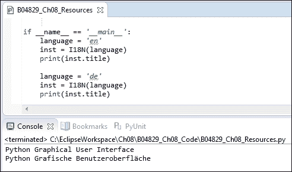

我们首先传入英语作为在 GUI 中显示的语言，然后传入德语作为 GUI 将显示的语言。

我们正在打印出我们 GUI 的标题，以显示我们的 Python 模块按预期工作。

### 注意事项

下一步是使用我们在上一个菜谱中创建的日志功能。

我们通过首先在我们的重构`GUI.py`模块中添加一个`__main__`自我测试部分来实现这一点，然后我们验证是否创建了我们`Logger`类的实例。

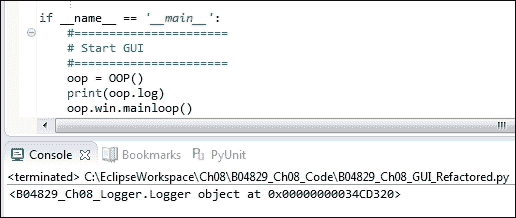

我们接下来使用显示的命令将信息写入日志文件。我们设计的日志级别默认为记录每条消息，即 DEBUG 级别，因此我们无需进行任何更改。我们只需将需要记录的消息传递给`writeToLog`方法即可。

```py
if __name__ == '__main__':
#======================
# Start GUI
#======================
oop = OOP()
    print(oop.log)
    oop.log.writeToLog('Test message')
    oop.win.mainloop()
```

这将被写入我们的日志文件，如下日志截图所示：

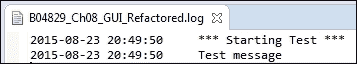

现在我们可以通过向我们的日志语句添加日志级别来控制日志记录，并设置我们希望输出的级别。让我们将这个功能添加到我们的`Callbacks.py`模块中的纽约按钮回调方法`getDateTime`中。

我们将之前的`print`语句更改为使用不同调试级别的`log`语句。

在 `GUI.py` 文件中，我们导入了来自我们日志模块的新类。

```py
from B04829_Ch08_Logger import Logger, LogLevel
```

接下来，我们创建这些类的本地实例。

```py
# create Logger instance
fullPath = path.realpath(__file__)
self.log = Logger(fullPath)

# create Log Level instance
self.level = LogLevel()
```

由于我们将 GUI 类的实例传递给`Callbacks.py`初始化器，我们可以根据我们创建的`LogLevel`类使用日志级别约束。

```py
    # Format local US time with TimeZone info
    def getDateTime(self):
        fmtStrZone = "%Y-%m-%d %H:%M:%S %Z%z"
        # Get Coordinated Universal Time
        utc = datetime.now(timezone('UTC'))
        self.oop.log.writeToLog(utc.strftime(fmtStrZone), 
                                self.oop.level.MINIMUM)

        # Convert UTC datetime object to Los Angeles TimeZone
        la = utc.astimezone(timezone('America/Los_Angeles'))
        self.oop.log.writeToLog(la.strftime(fmtStrZone), 
                                self.oop.level.NORMAL)

        # Convert UTC datetime object to New York TimeZone
        ny = utc.astimezone(timezone('America/New_York'))
        self.oop.log.writeToLog(ny.strftime(fmtStrZone), 
                                self.oop.level.DEBUG)

        # update GUI label with NY Time and Zone
        self.oop.lbl2.set(ny.strftime(fmtStrZone))
```

当我们点击纽约按钮时，根据选择的日志级别，我们会在日志文件中得到不同的输出。默认的日志级别是 `DEBUG`，这意味着所有内容都会被写入日志。

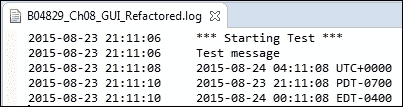

当我们更改日志级别时，我们控制了写入日志的内容。我们通过调用`Logger`类的`setLoggingLevel`方法来完成这个操作。

```py
    #----------------------------------------------------------------
    def setLoggingLevel(self, level):  
        '''change logging level in the middle of a test.''' 
        self.loggingLevel = level
```

在我们 GUI 的`__main__`部分，我们将日志级别更改为`MINIMUM`，这导致写入日志文件的输出减少。

```py
if __name__ == '__main__':
#======================
# Start GUI
#======================
oop = OOP()
    oop.log.setLoggingLevel(oop.level.MINIMUM)
    oop.log.writeToLog('Test message')
    oop.win.mainloop()
```

现在，我们的日志文件不再显示`测试消息`，只显示符合设置日志级别的消息。

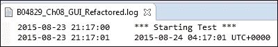

## 它是如何工作的...

在这个菜谱中，我们充分利用了 Python 内置的`__main__`自我测试部分。我们引入了自己的日志文件，同时介绍了如何创建不同的日志级别。

通过这样做，我们完全控制着写入日志文件的内容。

# 使用单元测试创建健壮的 GUI

Python 自带了一个内置的单元测试框架，在这个菜谱中，我们将开始使用这个框架来测试我们的 Python GUI 代码。

在我们开始编写单元测试之前，我们希望设计我们的测试策略。我们很容易将单元测试与它们所测试的代码混合在一起，但更好的策略是将应用程序代码与单元测试代码分开。

### 注意事项

PyUnit 是根据所有其他 xUnit 测试框架的原则设计的。

## 准备就绪

我们将测试本章中早期创建的国际化 GUI。

## 如何做到这一点...

为了使用 Python 的内置单元测试框架，我们必须导入 Python 的 `unittest` 模块。让我们创建一个新的模块，并将其命名为 `UnitTests.py`。

我们首先导入`unittest`模块，然后创建我们自己的类，并在该类中继承并扩展`unittest.TestCase`类。

完成此任务的最简单代码如下：

```py
import unittest

class GuiUnitTests(unittest.TestCase):
    pass

if __name__ == '__main__':
    unittest.main()
```

代码目前还没有做太多，但当我们运行它时，我们没有得到任何错误，这是一个好兆头。

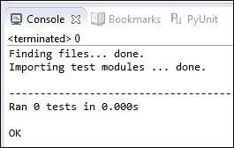

我们实际上确实在控制台看到一条输出信息，表明我们成功运行了零个测试…

嗯，这个输出有点误导，因为我们到目前为止所做的只是创建了一个不包含实际测试方法的类。

我们添加了测试方法，这些方法通过遵循所有测试方法的默认命名规则（以单词 "test" 开头）来进行实际的单元测试。这是一个可以更改的选项，但似乎坚持这种命名约定要容易和清晰得多。

让我们添加一个测试方法来测试我们 GUI 的标题。这将验证通过传递预期的参数，我们能够得到预期的结果。

```py
import unittest
from B04829_Ch08_Resources import I18N

class GuiUnitTests(unittest.TestCase):

    def test_TitleIsEnglish(self):
        i18n = I18N('en')
        self.assertEqual(i18n.title, 
                       "Python Graphical User Interface")
```

我们从`Resources.py`模块导入我们的`I18N`类，传入英语作为在 GUI 中显示的语言。由于这是我们第一次单元测试，我们还打印出标题结果，以确保我们知道我们得到了什么。接下来，我们使用`unittest assertEqual`方法来验证我们的标题是否正确。

运行此代码会显示一个**OK**，这意味着单元测试通过了。

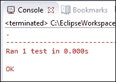

单元测试运行并成功，这通过一个点和单词“OK”来表示。如果它失败了或者出现了错误，我们就不会得到这个点，而是输出“F”或“E”。

我们现在可以通过验证我们 GUI 德语版本的标题来进行相同的自动化单元测试检查。

我们只是复制、粘贴并修改我们的代码。

```py
import unittest
from B04829_Ch08_Resources import I18N

class GuiUnitTests(unittest.TestCase):

    def test_TitleIsEnglish(self):
        i18n = I18N('en')
        self.assertEqual(i18n.title, 
                         "Python Graphical User Interface")

    def test_TitleIsGerman(self):
        i18n = I18N('en')           
        self.assertEqual(i18n.title, 
                         'Python Grafische Benutzeroberfl' 
                       + "\u00E4" + 'che')
```

现在我们正在测试我们的国际化 GUI 标题在两种语言中的效果，运行代码后得到以下结果：

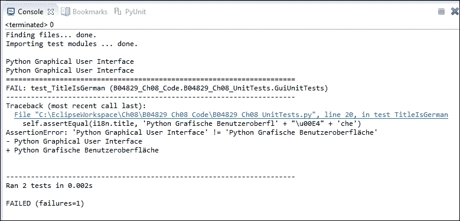

我们运行了两个单元测试，但不是得到一个 OK，而是出现了失败。发生了什么？

我们的`断言`在 GUI 的德语版本中失败了…

在调试我们的代码时，我们发现，在我们的单元测试代码的复制、粘贴和修改方法中，我们忘记传入德语作为语言参数。我们可以轻松解决这个问题。

```py
    def test_TitleIsGerman(self):
        # i18n = I18N('en')           # <= Bug in Unit Test
        i18n = I18N('de') 
        self.assertEqual(i18n.title, 
                         'Python Grafische Benutzeroberfl' 
                         + "\u00E4" + 'che')
```

当我们再次运行我们的单元测试时，我们再次得到了所有测试通过预期的结果。

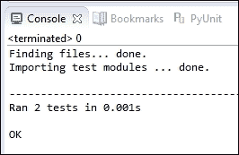

### 注意事项

单元测试代码也是代码，也可能存在错误。

虽然编写单元测试的真正目的是测试我们的应用程序代码，但我们必须确保我们的测试被正确编写。**测试驱动开发**（**TDD**）方法中的一种方法可能对我们有所帮助。

### 注意事项

在 TDD（测试驱动开发）中，我们在实际编写应用程序代码之前先开发单元测试。现在，如果一个测试对一个甚至不存在的函数通过了，那么就说明有问题。下一步是创建这个不存在的函数，并确保它将失败。之后，我们就可以编写最少的代码来使单元测试通过。

## 它是如何工作的...

在这个菜谱中，我们已经开始测试我们的 Python 图形用户界面，使用 Python 编写单元测试。我们看到了 Python 单元测试代码只是代码，也可能包含需要纠正的错误。在下一个菜谱中，我们将扩展这个菜谱的代码，并使用随 Eclipse IDE 的 PyDev 插件一起提供的图形单元测试运行器。

# 如何使用 Eclipse PyDev IDE 编写单元测试

在上一个菜谱中，我们开始使用 Python 的单元测试功能，在这个菜谱中，我们将通过进一步使用这一功能来确保我们 GUI 代码的质量。

我们将对我们的 GUI 进行单元测试，以确保 GUI 显示的国际化字符串符合预期。

在上一个菜谱中，我们在单元测试代码中遇到了一些错误，但通常情况下，我们的单元测试会发现由修改现有应用程序代码引起的回归错误，而不是单元测试代码。一旦我们验证了我们的单元测试代码是正确的，我们通常不会对其进行更改。

### 注意事项

我们的单元测试也充当了我们期望代码要做什么的文档。

默认情况下，Python 的单元测试使用文本单元测试运行器执行，并且我们可以在 Eclipse IDE 的 PyDev 插件中运行它。我们还可以从控制窗口运行完全相同的单元测试。

除了本食谱中的文本运行器之外，我们还将探索 PyDev 在 Eclipse IDE 内部使用的图形单元测试功能。

## 准备就绪

我们正在扩展之前的配方，其中我们开始使用 Python 单元测试。

## 如何做到这一点...

Python 单元测试框架附带了一些被称为“固定装置”（fixtures）的功能。

请参考以下网址以了解测试夹具的描述：

+   [`docs.python.org/3.4/library/unittest.html`](https://docs.python.org/3.4/library/unittest.html)

+   [测试夹具](https://en.wikipedia.org/wiki/Test_fixture)

+   [`www.boost.org/doc/libs/1_51_0/libs/test/doc/html/utf/user-guide/fixture.html`](http://www.boost.org/doc/libs/1_51_0/libs/test/doc/html/utf/user-guide/fixture.html)

这意味着我们可以创建`setup()`和`teardown()`单元测试方法，以便在执行任何单个测试之前，先调用`setup()`方法，并在每个单元测试结束时调用`teardown()`方法。

### 注意事项

此固定功能为我们提供了一个非常可控的环境，在其中我们可以运行我们的单元测试。这类似于使用前置和后置条件。

让我们搭建我们的单元测试环境。我们将创建一个新的测试类，该类专注于之前提到的代码正确性。

### 注意事项

`unittest.main()` 运行任何以“test”前缀开头的函数，无论在给定的 Python 模块中我们创建了多少个类。

```py
import unittest
from B04829_Ch08_Resources import I18N
from B04829_Ch08_GUI_Refactored import OOP as GUI

class GuiUnitTests(unittest.TestCase):

    def test_TitleIsEnglish(self):
        i18n = I18N('en')
        self.assertEqual(i18n.title, 
                         "Python Graphical User Interface")

    def test_TitleIsGerman(self):
        # i18n = I18N('en')           # <= Bug in Unit Test
        i18n = I18N('de') 
        self.assertEqual(i18n.title, 
                         'Python Grafische Benutzeroberfl' 
                         + "\u00E4" + 'che')

class WidgetsTestsEnglish(unittest.TestCase):

    def setUp(self):
        self.gui = GUI('en')

    def tearDown(self):
        self.gui = None

    def test_WidgetLabels(self):
        self.assertEqual(self.gui.i18n.file, "File")
        self.assertEqual(self.gui.i18n.mgrFiles, ' Manage Files ')
        self.assertEqual(self.gui.i18n.browseTo, 
                                            "Browse to File...")
if __name__ == '__main__':
    unittest.main()
```

这将生成以下输出：

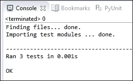

前面的单元测试代码显示，我们可以创建多个单元测试类，并且通过调用`unittest.main`，它们都可以在同一个模块中运行。

这也表明，在单元测试报告的输出中，`setup()` 方法并不算作一个测试（测试数量为 3），同时，它也完成了预期的任务，因为我们现在可以从单元测试方法中访问我们的类实例变量 `self.gui`。

我们对测试所有标签的正确性感兴趣，尤其是在我们对代码进行更改时捕捉到错误。

如果我们从应用程序代码中复制并粘贴了字符串到测试代码中，点击单元测试框架的按钮就能捕捉到任何意外的更改。

我们还想要测试在任何语言中调用我们的`Radiobutton`小部件时，都会导致`labelframe`小部件的`text`属性被更新。为了自动进行这项测试，我们必须做两件事。

首先，我们必须检索`labelframe text`小部件的值，并将该值分配给一个我们命名为`labelFrameText`的变量。我们必须使用以下语法，因为该小部件的属性是通过字典数据类型传递和检索的：

```py
self.gui.widgetFrame['text']
```

我们现在可以通过程序方式点击其中一个单选按钮小部件来验证默认文本，然后是国际化版本。

```py
class WidgetsTestsGerman(unittest.TestCase):

    def setUp(self):
        self.gui = GUI('de')

    def test_WidgetLabels(self):
        self.assertEqual(self.gui.i18n.file, "Datei")
        self.assertEqual(self.gui.i18n.mgrFiles, 
                                        ' Dateien Organisieren ')
        self.assertEqual(self.gui.i18n.browseTo, 
                                        "Waehle eine Datei... ")

    def test_LabelFrameText(self):
        labelFrameText = self.gui.widgetFrame['text']
        self.assertEqual(labelFrameText, " Widgets Rahmen ")
        self.gui.radVar.set(1)
        self.gui.callBacks.radCall()
        labelFrameText = self.gui.widgetFrame['text']
        self.assertEqual(labelFrameText, 
                                    " Widgets Rahmen in Gold")
```

在验证了默认的`labelFrameText`之后，我们通过程序设置单选按钮为索引 1，然后程序调用单选按钮的回调方法。

```py
        self.gui.radVar.set(1)
        self.gui.callBacks.radCall()
```

### 注意

这基本上与在图形用户界面中点击单选按钮的动作相同，但我们通过代码在单元测试中执行这个按钮点击事件。

然后我们验证`labelframe`小部件中的文本是否已按预期更改。

当我们在 Eclipse 中使用 Python PyDev 插件运行单元测试时，以下输出将被写入 Eclipse 控制台。

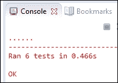

在命令提示符下运行，一旦我们导航到当前代码所在的文件夹，就会得到类似的输出。

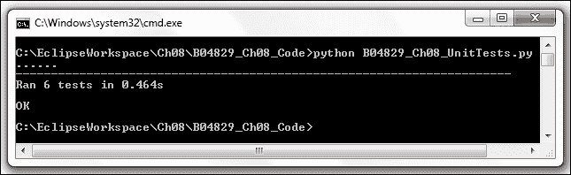

使用 Eclipse，我们还可以选择以 Python 单元测试脚本的形式运行我们的单元测试，而不是简单的 Python 脚本，这样我们可以得到一些彩色的输出，而不是老式 DOS 提示符的黑白世界。

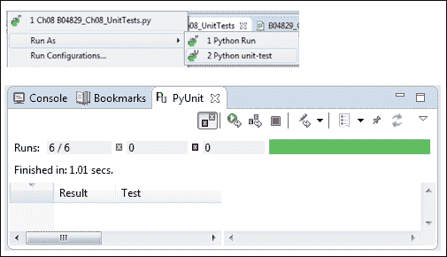

单元测试结果条是绿色的，这意味着我们所有的单元测试都通过了。前一个截图也显示，GUI 测试运行器比文本测试运行器慢得多：在 Eclipse 中，前者为 1.01 秒，而后者为 0.466 秒。

## 它是如何工作的...

我们通过测试`labels`扩展了我们的单元测试代码，通过程序调用一个`Radiobutton`，然后在我们的单元测试中验证`labelframe`小部件的相应`text`属性是否如预期地发生了变化。我们已经测试了两种不同的语言。

我们随后转向使用内置的 Eclipse/PyDev 图形单元测试运行器。
